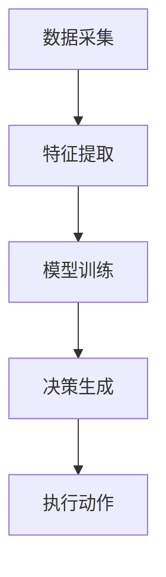
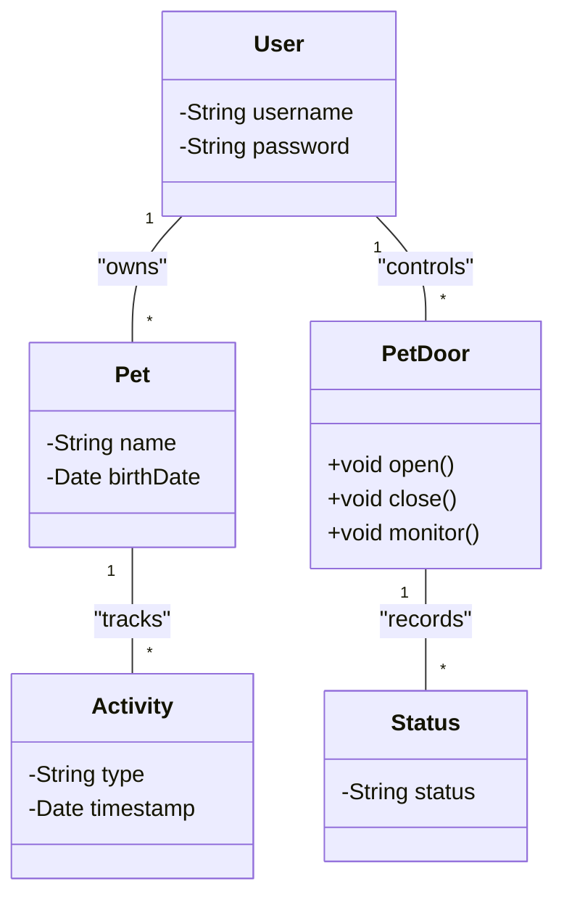
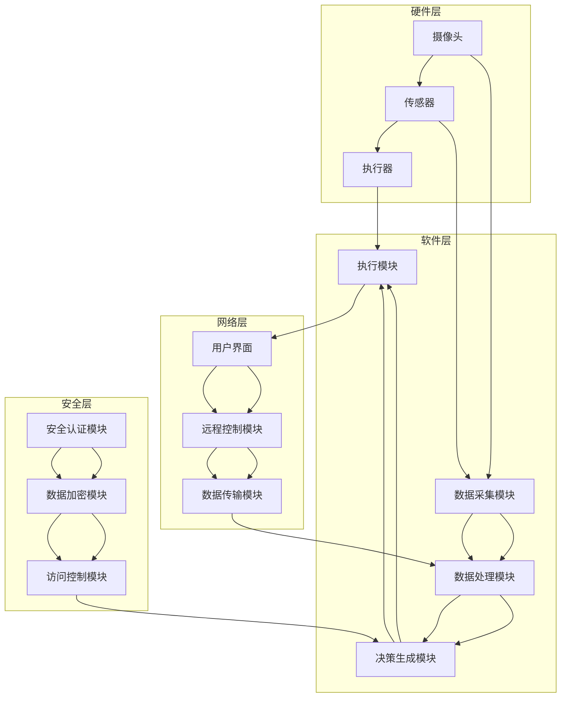
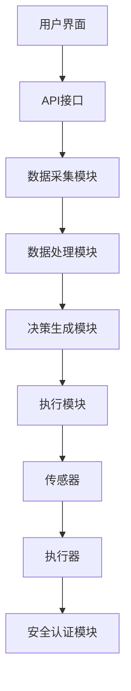
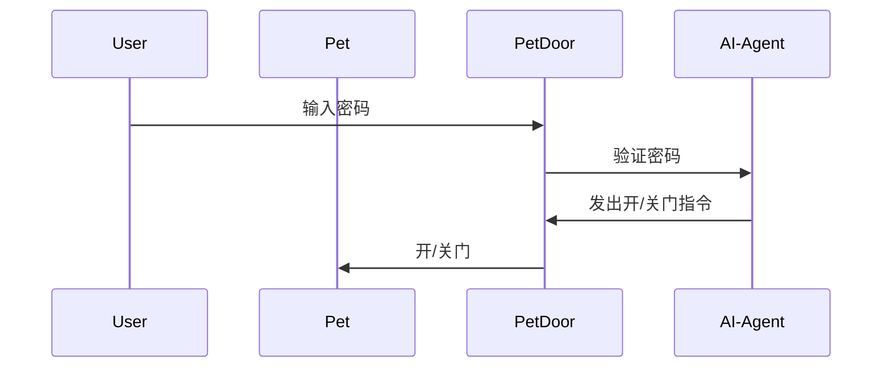

                 

### 文章标题：智能宠物门：AI Agent的宠物出入管理

#### 关键词：智能宠物门，AI Agent，宠物出入管理，智能家居，技术实现

#### 摘要：
本文将探讨智能宠物门及其核心组成部分——AI Agent，在宠物出入管理中的应用。文章首先介绍了智能宠物门的概念和重要性，随后深入探讨了AI Agent的设计和实现，包括硬件与软件层面的设计原则。接着，文章通过具体的案例展示了智能宠物门在实际生活中的应用，最后展望了其未来的发展方向和潜在挑战。本文旨在为读者提供关于智能宠物门技术的全面了解，以及其在智能家居中的角色和潜力。

## 引言与背景

### 1.1 人类与宠物关系的演变

在现代社会，宠物已经成为许多家庭的重要成员。宠物不仅提供了陪伴，还在一定程度上提升了人类的生活质量。随着人们生活节奏的加快，宠物照顾的挑战也逐渐显现。传统的宠物门由于设计上的局限性，常常不能满足现代家庭对宠物管理的高效性和安全性要求。例如，传统宠物门往往需要手动开关，不仅增加了主人的负担，还存在安全隐患。

### 1.2 传统宠物门局限性

传统宠物门主要存在以下几个问题：
- **安全隐患**：传统宠物门缺乏有效的安全认证机制，容易导致未经授权的动物或人员进入家中。
- **手动操作不便**：需要主人手动开关，尤其在恶劣天气或主人忙碌时，增加了操作难度。
- **功能单一**：传统宠物门大多只能实现开关功能，无法满足更多智能管理需求。

### 1.3 智能宠物门的出现

智能宠物门的出现，正是为了解决传统宠物门存在的种种问题。智能宠物门通过融合AI技术，实现了自动化、智能化的宠物出入管理。它不仅能够自动开关，还能够进行安全认证，确保只有授权的宠物能够出入。智能宠物门的引入，使得宠物管理变得更加高效和便捷。

### 1.4 AI Agent在宠物出入管理中的应用

AI Agent是智能宠物门的核心组成部分，它负责识别和认证宠物的身份，并做出相应的开关决策。AI Agent通过传感器收集数据，利用机器学习算法进行分析和处理，从而实现智能化的宠物出入管理。AI Agent的应用，使得智能宠物门具备了高度的安全性和智能化水平。

### 1.5 书籍结构概述

本文将从以下章节展开讨论：
- **第1章：引言与背景**：介绍智能宠物门的概念、必要性以及背景信息。
- **第2章：智能宠物门的基础概念**：详细解释智能宠物门的工作原理、分类以及未来发展。
- **第3章：硬件设计**：探讨智能宠物门的硬件设计原则、组件选择和系统集成。
- **第4章：软件设计**：分析智能宠物门软件架构、AI Agent算法实现以及安全性考虑。
- **第5章：智能宠物门的集成与测试**：介绍智能宠物门的系统集成、环境测试和用户测试。
- **第6章：应用案例**：展示智能宠物门在不同场景下的应用案例。
- **第7章：未来展望**：探讨智能宠物门的未来发展方向和潜在挑战。

通过上述章节的详细讨论，本文旨在为读者提供一个全面了解智能宠物门及其技术的视角，帮助读者理解智能宠物门在现代智能家居中的重要角色和巨大潜力。

### 第2章 智能宠物门的基础概念

智能宠物门作为一种结合了AI技术的智能家居产品，其核心在于通过AI Agent实现高效的宠物出入管理。为了更好地理解智能宠物门的工作原理和设计理念，本章将详细探讨其基础概念，包括工作原理、核心功能、分类和未来发展。

#### 2.1 智能宠物门的工作原理

智能宠物门的工作原理主要依赖于其硬件和软件系统的协同作用。从硬件层面来看，智能宠物门通常包含以下几个主要组件：

1. **传感器**：传感器是智能宠物门获取环境信息的关键部件。常见的传感器包括红外传感器、摄像头、麦克风和温度传感器等。这些传感器可以捕捉宠物的运动、声音和行为特征，并将其转化为数字信号。

2. **执行器**：执行器负责根据AI Agent的指令控制宠物门的开关。常见的执行器包括电机、电磁阀和开关等。

3. **网络模块**：网络模块使得智能宠物门可以连接到互联网，实现远程监控和控制。常见的网络连接方式包括Wi-Fi、蓝牙和Zigbee等。

从软件层面来看，智能宠物门的核心是AI Agent。AI Agent负责处理传感器数据，并基于预设的规则和算法做出决策。其基本工作流程如下：

1. **数据采集**：AI Agent通过传感器收集宠物的行为数据。
2. **数据处理**：AI Agent对采集到的数据进行处理，包括特征提取和模式识别。
3. **决策生成**：基于处理结果，AI Agent生成开关门的决策，并指令执行器执行。

#### 2.2 AI Agent的核心功能

AI Agent在智能宠物门中扮演着至关重要的角色。其主要功能包括以下几个方面：

1. **识别与认证**：AI Agent通过分析传感器数据，识别并认证宠物的身份。这通常涉及机器学习和计算机视觉技术，例如使用卷积神经网络（CNN）对宠物的面部特征进行识别。

2. **自动开关机制**：AI Agent根据宠物的需求和环境条件，自动控制宠物门的开关。例如，当宠物在家附近时，AI Agent可以自动打开门，而当宠物离开特定范围时，门会自动关闭。

3. **安全监控**：AI Agent还可以进行安全监控，确保只有授权的宠物能够进入家中。例如，如果检测到陌生动物靠近，AI Agent可以立即发出警报。

#### 2.3 智能宠物门的分类

智能宠物门可以根据不同的分类标准进行分类，常见的分类方法如下：

1. **按工作原理分类**：

   - **基于传感器**：这类智能宠物门主要通过传感器捕捉宠物的行为特征，如红外传感器、摄像头等。
   - **基于GPS**：这类智能宠物门通过GPS定位技术来管理宠物的出入，适用于有明确地理位置需求的场景。
   - **基于RFID**：这类智能宠物门使用RFID技术，通过电子标签来识别宠物身份。

2. **按适用场景分类**：

   - **家庭使用**：这类智能宠物门主要针对家庭用户，实现宠物的自动出入管理。
   - **宠物商店**：这类智能宠物门适用于宠物商店，通过自动管理宠物出入，提高商店运营效率。
   - **宠物寄养中心**：这类智能宠物门用于宠物寄养中心，确保宠物的安全与便捷。

#### 2.4 智能宠物门的未来发展

随着AI技术和物联网（IoT）的快速发展，智能宠物门在未来具有广泛的应用前景和发展潜力：

1. **技术演进**：传感器技术的进步和计算能力的提升，将进一步提升智能宠物门的功能和性能。例如，更先进的摄像头和传感器可以更精确地捕捉宠物的行为特征。

2. **应用拓展**：智能宠物门不仅限于宠物出入管理，还可以扩展到宠物健康监测、行为分析等领域。例如，通过实时监测宠物的健康数据，智能宠物门可以及时提醒主人关注宠物的健康状况。

3. **智能化家居一体化**：智能宠物门可以与智能家居系统无缝集成，实现更加智能化的家居管理。例如，当宠物进入家中时，智能宠物门可以自动触发其他智能设备，如空气净化器、灯光调节等，提升主人的生活品质。

4. **面临的挑战**：智能宠物门在发展过程中也面临着一些挑战，如安全性问题和隐私保护。为了确保宠物和主人的安全，智能宠物门需要具备强大的安全防护机制。同时，保护用户隐私也是智能宠物门设计中的重要考虑因素。

通过本章的讨论，我们可以看出，智能宠物门通过结合AI技术和物联网技术，实现了宠物出入管理的智能化、自动化。随着技术的不断进步，智能宠物门将越来越普及，为我们的生活带来更多便利和舒适。

### 第3章 硬件设计

智能宠物门的硬件设计是整个系统的基础，它直接决定了智能宠物门的功能实现和稳定性。本章将详细探讨智能宠物门的硬件设计原则、组件选择以及系统集成，确保智能宠物门在功能性和可靠性方面达到高标准。

#### 3.1 硬件设计原则

智能宠物门的硬件设计需要遵循以下几个原则：

1. **模块化设计**：模块化设计有助于提高系统的可维护性和可扩展性。各个模块可以独立设计、测试和更换，从而降低故障率和维修成本。
2. **可靠性**：智能宠物门的可靠性至关重要，因为它直接关系到宠物的安全和主人的生活质量。硬件设计需考虑冗余机制，以应对潜在故障。
3. **节能性**：智能宠物门通常需要长时间运行，节能性设计能够降低能耗，延长设备使用寿命。
4. **兼容性**：智能宠物门应具备良好的兼容性，能够与不同品牌和类型的传感器、执行器和网络模块无缝集成。

#### 3.2 硬件组件选择

智能宠物门的硬件组件主要包括传感器、执行器和网络模块。以下是这些组件的选择原则：

1. **传感器**：

   - **红外传感器**：适用于检测宠物的运动，价格低廉且响应速度快。
   - **摄像头**：用于捕捉宠物的面部特征，选择时应考虑分辨率、帧率和低光性能。
   - **麦克风**：用于捕捉宠物的声音特征，选择时应考虑灵敏度、信噪比和抗干扰能力。
   - **温度传感器**：用于监测室内温度，选择时应考虑精度和稳定性。

2. **执行器**：

   - **电机**：用于驱动门的开关，选择时应考虑扭矩、速度和寿命。
   - **电磁阀**：适用于小型宠物门，响应速度快且控制精度高。
   - **开关**：简单直接，适用于特定场景的宠物门。

3. **网络模块**：

   - **Wi-Fi模块**：适用于需要远程监控和控制的场景，选择时应考虑传输速度和稳定性。
   - **蓝牙模块**：适用于短距离通信，功耗低且成本低。
   - **Zigbee模块**：适用于物联网环境，选择时应考虑网络覆盖范围和通信协议的兼容性。

#### 3.3 硬件系统集成

硬件系统集成是将各个硬件组件有机结合，形成一个功能完整、稳定的智能宠物门。以下是系统集成的主要步骤：

1. **硬件接口设计**：设计统一的接口标准，确保各组件之间能够顺利通信。
2. **电路设计**：设计稳定的电路，确保各组件正常工作。电路设计需考虑电源管理、信号处理和干扰防护。
3. **系统集成测试**：将各组件组装在一起，进行集成测试。测试内容包括功能测试、性能测试和可靠性测试。
4. **调试与优化**：根据测试结果进行调试和优化，确保硬件系统能够稳定运行。

#### 3.4 硬件故障排查与维护

智能宠物门的硬件故障排查与维护是确保其长期稳定运行的关键。以下是常见的故障排查方法和维护策略：

1. **故障排查方法**：

   - **检查电源**：确保电源供应正常，电源插头和插座连接稳固。
   - **检查传感器**：检查传感器是否损坏或被遮挡，确保传感器能够正常捕捉数据。
   - **检查执行器**：检查执行器是否正常工作，是否存在卡滞或磨损情况。
   - **检查网络连接**：检查网络模块是否连接正常，确保网络信号稳定。

2. **维护策略**：

   - **定期检查**：定期检查各组件的工作状态，及时发现并解决潜在问题。
   - **清洁与保养**：定期清洁传感器和执行器，保持设备表面的干净，延长设备使用寿命。
   - **更换损坏部件**：及时更换损坏的组件，防止故障扩大。

通过本章的详细讨论，我们可以了解到智能宠物门的硬件设计原则、组件选择和系统集成过程。这些设计原则和策略不仅有助于提高智能宠物门的功能性和稳定性，还为今后的维护和升级提供了理论基础。

### 第4章 软件设计

智能宠物门的软件设计是实现其智能化功能的核心环节。本章将详细探讨智能宠物门的软件架构设计、AI Agent算法实现、安全性考虑以及软件开发过程中的关键步骤。

#### 4.1 软件架构设计

智能宠物门的软件架构设计需要满足高可用性、可扩展性和易维护性的要求。一个典型的智能宠物门软件架构可以分为以下几个主要模块：

1. **数据采集模块**：负责从传感器收集数据，并将数据转换为可用于分析的格式。数据采集模块需要具备高可靠性和实时性的特点。
2. **数据处理模块**：对采集到的数据进行分析和处理，包括特征提取、数据清洗和预处理等。数据处理模块的核心是AI Agent，它负责处理传感器数据，并生成相应的决策。
3. **决策生成模块**：基于数据处理模块的结果，生成控制宠物门开关的决策。决策生成模块通常采用机器学习算法，例如卷积神经网络（CNN）或决策树。
4. **执行模块**：根据决策生成模块的指令，控制执行器（如电机或电磁阀）执行相应的动作。
5. **用户界面模块**：提供一个直观的用户界面，让用户能够实时监控宠物门的状态，并进行设置和调整。

#### 4.2 AI Agent算法实现

AI Agent是实现智能宠物门智能化功能的核心。以下是AI Agent算法实现的详细步骤：

1. **数据收集**：首先，需要收集大量的宠物行为数据，包括宠物的运动轨迹、面部特征和声音等。这些数据可以通过传感器实时采集，也可以通过历史数据导入。
2. **特征提取**：对收集到的数据进行特征提取，将原始数据转换为可用于训练的特征向量。特征提取可以采用各种机器学习技术，如深度学习中的卷积神经网络（CNN）或传统机器学习中的特征工程方法。
3. **模型训练**：使用提取到的特征向量训练机器学习模型。训练过程中，需要选择合适的模型和优化算法，例如使用梯度下降法（Gradient Descent）或随机梯度下降法（Stochastic Gradient Descent）。
4. **模型评估**：在训练完成后，需要对模型进行评估，以确保其准确性和鲁棒性。评估可以通过交叉验证、A/B测试等方式进行。
5. **模型部署**：将训练好的模型部署到智能宠物门的硬件平台上，实现实时数据分析和决策生成。

#### 4.3 安全性考虑

智能宠物门的安全性至关重要，因为它直接关系到宠物和主人的安全。以下是智能宠物门软件设计中的几个关键安全性考虑：

1. **数据加密**：为了保护用户数据的安全，需要对采集到的数据和应用中的通信进行加密处理。常见的加密算法包括AES、RSA等。
2. **访问控制**：通过用户认证和访问控制机制，确保只有授权用户才能访问系统资源。访问控制可以基于用户身份验证、权限管理和审计日志等机制。
3. **安全监控**：系统应具备实时监控和报警功能，一旦检测到异常行为，立即触发报警机制，提醒用户采取相应措施。
4. **安全策略**：制定详细的安全策略和操作手册，确保开发、测试和维护人员能够遵守安全规范，防止安全漏洞。

#### 4.4 软件开发过程

智能宠物门的软件设计是一个复杂的过程，需要遵循一系列的软件开发最佳实践。以下是软件设计过程中的几个关键步骤：

1. **需求分析**：明确智能宠物门的功能需求、性能要求和用户体验目标。
2. **系统设计**：基于需求分析结果，设计系统的整体架构和各模块的详细设计。
3. **编码实现**：按照系统设计文档进行编码实现，编写高质量的代码，并进行单元测试。
4. **集成测试**：将各个模块整合在一起，进行集成测试，确保系统能够正常运行。
5. **性能优化**：对系统进行性能测试，发现并解决性能瓶颈，优化系统响应速度和资源使用效率。
6. **用户测试**：邀请实际用户对系统进行测试，收集用户反馈，并进行相应的调整和优化。
7. **部署上线**：将经过测试的软件部署到生产环境，进行正式上线。

通过本章的详细讨论，我们可以了解到智能宠物门软件设计的重要性和复杂性。通过合理的软件架构设计、AI Agent算法实现和安全性考虑，可以确保智能宠物门在功能性和安全性方面达到高标准，为用户提供高效、便捷的宠物出入管理服务。

### 第5章 智能宠物门的集成与测试

智能宠物门的集成与测试是确保其功能完整性和稳定性的关键步骤。本章将详细介绍智能宠物门的集成测试、环境测试和用户测试，并讨论根据测试结果进行系统优化的重要性和方法。

#### 5.1 系统集成

系统集成是将智能宠物门的各个硬件和软件组件组合在一起，形成一个完整的系统。以下是系统集成的主要步骤：

1. **硬件系统集成**：将传感器、执行器和网络模块连接到主控板，确保各组件之间的通信正常。需要使用统一的接口标准，例如I2C、SPI或UART，以实现稳定的数据传输。

2. **软件系统集成**：将数据采集模块、数据处理模块、决策生成模块和用户界面模块整合到一起，确保各模块能够无缝协同工作。在系统集成过程中，需要进行详细的接口设计和调试，确保数据能够正确传递和解析。

3. **功能测试**：在硬件和软件系统集成完成后，进行功能测试，验证智能宠物门的基本功能是否正常。功能测试包括传感器数据的采集和传输、AI Agent的决策生成和执行器动作的控制等。

4. **性能测试**：对系统集成后的智能宠物门进行性能测试，包括响应时间、数据处理速度和网络连接稳定性等。性能测试有助于识别系统瓶颈，为后续优化提供依据。

#### 5.2 环境测试

环境测试是验证智能宠物门在不同环境条件下的性能和稳定性。以下是环境测试的主要步骤：

1. **室内测试**：在室内环境下进行测试，模拟宠物日常出入的场景。测试内容包括传感器数据采集的准确性、AI Agent的决策准确性以及执行器的动作稳定性。

2. **户外测试**：在户外环境下进行测试，特别是恶劣天气条件下的测试。测试内容包括传感器在强光、阴影、雨雪等条件下的性能，以及AI Agent在复杂环境下的决策准确性。

3. **极端温度测试**：验证智能宠物门在高温、低温环境下的稳定性和可靠性。通过模拟不同温度条件，检查传感器和执行器的响应时间和准确性。

4. **湿度测试**：测试智能宠物门在高湿环境下的性能，确保传感器和电路板的正常工作。

#### 5.3 用户测试

用户测试是评估智能宠物门在实际使用中的用户体验和功能完整性的关键步骤。以下是用户测试的主要步骤：

1. **需求调研**：通过问卷调查、用户访谈等方式，收集用户对智能宠物门的需求和期望。了解用户对宠物门功能的优先级和关键需求。

2. **功能测试**：邀请实际用户参与测试，模拟日常使用场景，验证智能宠物门的功能是否满足用户需求。功能测试包括宠物的自动识别与认证、门的开关控制、数据记录与显示等。

3. **用户反馈**：在功能测试过程中，收集用户对智能宠物门的反馈和建议。通过用户反馈，发现系统中的潜在问题，为后续优化提供参考。

4. **调整与优化**：根据用户反馈，对智能宠物门进行相应的调整和优化。优化内容包括算法参数调整、界面设计改进、功能增强等。

#### 5.4 系统优化

根据测试结果进行系统优化是确保智能宠物门性能和用户满意度的重要步骤。以下是系统优化的重要性和方法：

1. **重要性**：系统优化能够提高智能宠物门的功能性和稳定性，提升用户体验。优化可以有效解决测试中发现的问题，提高系统的可靠性和性能。

2. **方法**：

   - **算法优化**：根据测试结果，调整AI Agent的算法参数，提高决策准确性。可以使用交叉验证、网格搜索等技术，找到最优的参数设置。

   - **硬件升级**：根据性能测试结果，更换或升级传感器、执行器等硬件组件，提高系统的响应速度和处理能力。

   - **软件更新**：对软件进行更新，修复已知的漏洞和缺陷，提高系统的稳定性。可以通过版本控制，逐步发布更新版本，确保系统的平稳过渡。

   - **用户体验改进**：根据用户反馈，改进用户界面设计，提供更加直观和易用的操作方式。可以通过用户测试，验证改进方案的有效性。

通过本章的详细讨论，我们可以了解到智能宠物门的集成与测试是确保其功能完整性和稳定性的关键步骤。通过系统集成、环境测试和用户测试，我们可以发现系统中的潜在问题，并根据测试结果进行优化，从而提高智能宠物门的功能性和用户体验。

### 第6章 智能宠物门应用案例

在本章中，我们将探讨智能宠物门在不同场景下的实际应用案例，从家庭使用、宠物商店到宠物寄养中心，深入分析每个案例的实施过程、具体效果以及所带来的影响。

#### 6.1 案例一：智能家居中的智能宠物门

**案例背景**：随着智能家居概念的普及，越来越多的家庭开始考虑如何利用智能技术提高生活质量。一位住在城市的高科技爱好者，家中养了一只可爱的狗狗。他希望能在工作日时确保狗狗能够自由出入，同时在家时又能随时监控狗狗的动态。

**实施过程**：
1. **需求分析**：用户需求是能够通过手机应用远程控制宠物门，同时确保狗狗的安全。
2. **硬件选择**：选择了带有高清摄像头的智能宠物门，结合Wi-Fi模块实现远程控制。
3. **软件配置**：安装了专门的手机应用程序，用于实时监控和远程控制宠物门。
4. **系统集成**：将宠物门与用户的智能家居系统整合，使其与家庭中的其他智能设备（如空气净化器、灯光控制等）联动。

**效果**：
- 用户通过手机应用可以随时随地远程开关宠物门，确保狗狗在户外活动时的安全。
- 实时监控功能让用户能够随时查看狗狗的状态，减少了因宠物安全问题而引起的焦虑。
- 宠物门与其他智能家居设备的联动，提高了家庭生活的智能化程度。

**影响**：
- 提高了用户对智能家居技术的接受度和使用频率。
- 为宠物主人提供了更便捷、更安全的管理方式。
- 为智能家居设备提供商提供了新的应用场景和市场需求。

#### 6.2 案例二：宠物商店的智能宠物门

**案例背景**：一家位于城市中心的宠物商店，为了提高运营效率，吸引更多的顾客，决定引入智能宠物门。

**实施过程**：
1. **需求分析**：宠物商店希望利用智能宠物门实现自动出入管理，提高顾客和宠物的安全。
2. **硬件选择**：选择了基于RFID技术的智能宠物门，用于管理顾客和宠物的出入。
3. **软件配置**：商店员工通过后台管理系统设置和监控宠物门的开关状态。
4. **系统集成**：智能宠物门与商店的安保系统和顾客管理系统无缝集成，实现信息共享。

**效果**：
- 实现了顾客和宠物自动认证和出入管理，提高了运营效率。
- 通过实时监控和报警系统，提高了宠物和顾客的安全。
- 商店形象得到提升，吸引了更多顾客。

**影响**：
- 提升了宠物商店的运营效率和服务质量。
- 为宠物商店提供了新的智能化管理模式。
- 为消费者提供了更安全、更便捷的购物体验。

#### 6.3 案例三：宠物寄养中心的智能宠物门

**案例背景**：一家宠物寄养中心，为了提高寄养服务质量，确保宠物在寄养期间的安全和舒适，决定引入智能宠物门。

**实施过程**：
1. **需求分析**：宠物寄养中心希望实现宠物自动出入管理，提高寄养环境的智能化水平。
2. **硬件选择**：选择了基于摄像头和传感器技术的智能宠物门，用于识别和认证宠物。
3. **软件配置**：寄养中心通过后台管理系统监控宠物门的开关状态，并进行宠物信息的录入和管理。
4. **系统集成**：智能宠物门与寄养中心的监控系统和管理系统整合，实现数据共享和联动。

**效果**：
- 实现了宠物自动出入管理，提高了寄养效率。
- 通过实时监控和报警系统，提高了宠物在寄养期间的安全。
- 通过数据分析和宠物行为记录，提高了寄养服务的个性化水平。

**影响**：
- 提升了宠物寄养中心的管理水平和服务质量。
- 为宠物主人提供了更放心、更专业的寄养服务。
- 为宠物寄养行业提供了智能化解决方案。

通过上述案例的详细分析，我们可以看到智能宠物门在各个应用场景中的实施过程、效果和影响。这些案例不仅展示了智能宠物门的实际应用价值，也为未来智能宠物门的发展提供了宝贵的经验和启示。

### 第7章 智能宠物门的未来发展

智能宠物门作为一种新兴的智能家居设备，随着AI技术和物联网（IoT）的不断发展，具有广阔的应用前景和巨大的市场潜力。本章将探讨智能宠物门未来的发展方向，包括技术演进、应用拓展、面临的挑战以及可能的解决方案。

#### 7.1 技术演进

随着AI技术和传感器技术的不断进步，智能宠物门的功能和性能将得到显著提升。以下是智能宠物门可能面临的技术演进：

1. **传感器技术的进步**：未来传感器技术将更加精准和高效，能够更好地捕捉宠物的行为特征。例如，更高分辨率、更低功耗的摄像头和更灵敏的传感器，将使智能宠物门在复杂环境中的表现更加出色。

2. **计算能力的提升**：随着边缘计算和云计算的普及，智能宠物门的处理能力将得到大幅提升。通过边缘计算，智能宠物门可以实时处理大量数据，提高决策生成速度和准确性。而云计算则为智能宠物门提供了强大的数据处理和分析能力，有助于实现更加智能化的管理。

3. **智能化的进一步融合**：智能宠物门将与智能家居系统进一步融合，实现更加全面的智能家居体验。例如，当宠物进入家中时，智能宠物门可以自动触发其他智能设备（如灯光、音乐、空调等）的工作，为宠物和主人提供更加舒适的居住环境。

#### 7.2 应用拓展

智能宠物门的应用场景不仅限于宠物出入管理，未来还将在更多领域得到拓展。以下是智能宠物门可能的拓展方向：

1. **宠物健康监测**：通过整合生物传感器和AI技术，智能宠物门可以实时监测宠物的健康数据，如体温、心率、活动量等。当宠物出现异常时，系统可以及时发出警报，提醒主人关注宠物的健康状况。

2. **宠物行为分析**：智能宠物门可以记录宠物的行为模式，通过数据分析为宠物主人提供有价值的建议。例如，分析宠物的作息规律，建议主人调整宠物的饮食和运动计划。

3. **宠物社交**：通过智能宠物门，宠物可以与其他宠物互动，甚至可以通过视频聊天与主人互动。这不仅有助于宠物的心理健康，还能增强宠物与主人之间的情感联系。

4. **宠物服务**：智能宠物门可以与宠物服务提供商（如宠物医生、宠物美容师等）无缝连接，提供一站式的宠物服务。例如，当宠物出现健康问题时，智能宠物门可以自动预约医生上门服务。

#### 7.3 面临的挑战

尽管智能宠物门具有巨大的发展潜力，但在其发展过程中仍面临一些挑战：

1. **安全性问题**：智能宠物门需要确保数据的安全性和隐私保护。在数据传输和存储过程中，必须采用加密技术，防止数据泄露和未经授权的访问。

2. **隐私保护**：宠物的行为数据涉及隐私问题，需要确保数据收集和使用过程中的透明度和合法性。此外，需要制定严格的隐私保护政策，确保用户数据不被滥用。

3. **可靠性**：智能宠物门需要在各种环境条件下保持稳定的运行，确保宠物和主人的安全。因此，硬件和软件的设计、测试和验证需要高度重视，确保系统的可靠性和耐用性。

#### 7.4 可能的解决方案

为了应对上述挑战，以下是一些可能的解决方案：

1. **加强安全性设计**：采用端到端加密技术，确保数据在传输和存储过程中的安全。此外，设计多层次的安全防护机制，如访问控制、多因素认证等，提高系统的安全性。

2. **隐私保护措施**：制定详细的隐私保护政策，明确数据收集、存储和使用的规定。同时，通过透明化的方式，让用户了解他们的数据是如何被使用的，增加用户对系统的信任。

3. **提高可靠性**：通过严格的测试和验证，确保硬件和软件的质量。在硬件设计上，采用冗余设计和模块化设计，提高系统的可靠性。在软件设计上，采用容错机制和故障恢复机制，确保系统能够在异常情况下保持稳定运行。

4. **用户参与与反馈**：鼓励用户参与智能宠物门的开发和改进，通过用户反馈不断优化系统。用户反馈不仅有助于发现和解决问题，还能为系统的改进提供宝贵的建议。

通过本章的讨论，我们可以看到智能宠物门在未来的发展前景和挑战。随着技术的不断进步和应用的不断拓展，智能宠物门将越来越多地融入到我们的生活中，为我们的生活带来更多便利和舒适。

### 结论

智能宠物门作为智能家居的一个重要组成部分，其通过AI Agent实现了宠物出入管理的智能化和自动化。本文从引言与背景、基础概念、硬件设计、软件设计、集成与测试、应用案例和未来发展等多个方面，全面探讨了智能宠物门的技术原理和应用价值。智能宠物门不仅提高了宠物管理的高效性和安全性，还为智能家居的发展提供了新的思路和方向。

智能宠物门的发展面临着技术进步、应用拓展和安全性的挑战。通过加强安全性设计、隐私保护措施、提高可靠性和鼓励用户参与与反馈，我们可以期待智能宠物门在未来带来更多便利和舒适。同时，随着物联网和AI技术的不断进步，智能宠物门的应用场景将更加丰富，其潜力也将进一步释放。

让我们保持对智能宠物门技术创新的关注，期待其在未来的智能家居中发挥更加重要的作用。感谢您的阅读，希望本文能为您带来关于智能宠物门技术的全面了解和启发。作者：AI天才研究院/AI Genius Institute & 禅与计算机程序设计艺术 /Zen And The Art of Computer Programming

### 附录

#### 1. 概念术语解释

- **AI Agent**：一种能够模拟人类智能行为的计算机程序，负责处理传感器数据并生成决策。
- **传感器**：用于检测和测量环境信息的设备，如红外传感器、摄像头、麦克风等。
- **执行器**：根据AI Agent的决策控制宠物门的开关的设备，如电机、电磁阀等。
- **智能家居**：利用物联网和AI技术，实现家庭设备自动化和智能化的系统。

#### 2. 概念属性特征对比表格

| 概念 | 特征 |
| --- | --- |
| AI Agent | 自动化、智能化、决策生成 |
| 传感器 | 检测精度、响应速度、功耗 |
| 执行器 | 动作速度、控制精度、耐久性 |
| 智能家居 | 联动性、自动化、用户体验 |

#### 3. ER实体关系图

```mermaid
erDiagram
    User ||--|{ Pet } : "owns"
    User ||--|{ PetDoor } : "controls"
    Pet ||--|{ Activity } : "tracks"
    PetDoor ||--|{ Status } : "records"
```

#### 4. 算法原理讲解

算法原理图：



算法流程：

1. **数据采集**：从传感器（如摄像头、红外传感器）采集宠物行为数据。
2. **特征提取**：对采集到的数据进行预处理，提取关键特征，如面部特征、运动轨迹等。
3. **模型训练**：使用提取到的特征训练机器学习模型（如CNN），使其能够识别和认证宠物。
4. **决策生成**：模型根据实时数据生成决策，如是否开启宠物门。
5. **执行动作**：根据决策指令，控制执行器（如电机）执行相应动作。

数学模型（以卷积神经网络为例）：

$$
\text{输出} = \text{激活函数}(\text{权重} \cdot \text{输入特征} + \text{偏置})
$$

举例说明：当宠物靠近门时，摄像头捕捉到其面部特征，模型通过卷积层提取特征，再通过全连接层进行分类和决策，最终输出“开”或“关”的指令。

#### 5. 系统分析与架构设计方案

**问题场景介绍**：宠物主人在外时需要确保宠物能够自主进出家门，同时避免陌生人随意进入家中。

**项目介绍**：本系统为智能宠物门系统，包括传感器、AI算法、执行器和用户界面。

**系统功能设计（领域模型类图）**：



**系统架构设计（架构图）**：



**系统接口设计**：



**系统交互（序列图）**：



#### 6. 项目实战

**环境安装**：

- 安装操作系统（如Ubuntu 20.04）
- 安装开发环境（如Python 3.8，PyTorch）
- 安装依赖库（如opencv-python，numpy）

**系统核心实现源代码**：

```python
# 摄像头数据采集
import cv2
import numpy as np

def capture_image():
    cap = cv2.VideoCapture(0)
    ret, frame = cap.read()
    if ret:
        cv2.imwrite('capture.jpg', frame)
    cap.release()

# 特征提取
import torch
from torchvision import transforms

def extract_features(image_path):
    transform = transforms.Compose([
        transforms.Resize((224, 224)),
        transforms.ToTensor(),
    ])
    image = transform(Image.open(image_path)).unsqueeze(0)
    return image

# 模型训练
import torch.nn as nn
import torch.optim as optim

def train_model(model, train_loader, criterion, optimizer, num_epochs):
    for epoch in range(num_epochs):
        model.train()
        running_loss = 0.0
        for inputs, labels in train_loader:
            optimizer.zero_grad()
            outputs = model(inputs)
            loss = criterion(outputs, labels)
            loss.backward()
            optimizer.step()
            running_loss += loss.item()
        print(f'Epoch {epoch+1}/{num_epochs}, Loss: {running_loss/len(train_loader)}')

# 决策生成
def generate_decision(model, image_path):
    image = extract_features(image_path)
    with torch.no_grad():
        outputs = model(image)
    _, predicted = torch.max(outputs, 1)
    if predicted.item() == 1:
        return "open"
    else:
        return "close"

# 执行动作
def execute_action(action):
    if action == "open":
        # 执行开门动作
        print("Opening the door.")
    else:
        # 执行关门动作
        print("Closing the door.")

# 主函数
def main():
    capture_image()
    model = ... # 加载训练好的模型
    action = generate_decision(model, 'capture.jpg')
    execute_action(action)

if __name__ == '__main__':
    main()
```

**代码应用解读与分析**：

- **数据采集**：通过摄像头实时采集图像，并将图像保存在本地。
- **特征提取**：使用预定的数据增强方法（如Resize和ToTensor）对图像进行预处理，提取关键特征。
- **模型训练**：使用训练集对模型进行训练，优化模型参数，使其能够准确识别宠物。
- **决策生成**：通过测试集对模型进行验证，生成开关门的决策。
- **执行动作**：根据决策指令，控制执行器执行相应的动作。

**实际案例分析和详细讲解剖析**：

假设用户在家中通过手机应用远程操作智能宠物门。当用户输入密码并确认后，系统将启动摄像头进行图像采集。随后，系统使用预训练好的卷积神经网络（CNN）对图像进行特征提取，并生成开关门的决策。最终，系统控制执行器执行相应的动作，实现宠物门的自动开关。

**项目小结**：

通过实际案例，我们可以看到智能宠物门系统的实现过程。从数据采集、特征提取、模型训练到决策生成和执行动作，每个环节都需要精心设计和实现。智能宠物门不仅提高了宠物管理的高效性和安全性，还为用户提供了便捷的智能体验。

#### 7. 最佳实践 Tips、小结、注意事项、拓展阅读

**最佳实践 Tips**：
- 确保硬件组件的选择符合实际需求，避免功能过剩。
- 定期更新和维护系统，确保数据的安全性和系统的稳定性。
- 针对不同宠物种类和行为特点，调整AI模型的参数，提高识别准确性。

**小结**：
智能宠物门通过AI Agent实现了宠物出入管理的智能化和自动化，为宠物主人和宠物提供了便利和舒适。从硬件设计到软件实现，智能宠物门涉及多个技术领域，需要综合考虑功能、性能和安全性。

**注意事项**：
- 在设计智能宠物门时，需要特别注意数据隐私保护和安全认证机制。
- 实际应用中，应根据用户反馈不断优化系统，提高用户体验。
- 定期对系统进行性能测试和安全性评估，确保系统的稳定性和可靠性。

**拓展阅读**：
- 《深度学习》（Goodfellow, Bengio, Courville著）：了解深度学习的基础知识和应用。
- 《人工智能：一种现代的方法》（Russell, Norvig著）：全面了解人工智能的理论和实践。
- 《智能家居技术与应用》（张晓晖著）：深入了解智能家居技术的发展趋势和应用场景。

通过本文的讨论，我们希望读者能够对智能宠物门及其技术原理有更深入的了解，并为未来的智能家居创新提供启示。作者：AI天才研究院/AI Genius Institute & 禅与计算机程序设计艺术 /Zen And The Art of Computer Programming

### 附录二：常用技术术语解释

- **AI Agent**：一种自主运行的智能实体，能够在特定环境中进行感知、决策和行动，以实现特定目标。
- **机器学习**：一种人工智能技术，通过训练算法，让计算机从数据中学习，并做出决策或预测。
- **卷积神经网络（CNN）**：一种用于图像识别和处理的深度学习模型，通过卷积层、池化层和全连接层实现特征提取和分类。
- **物联网（IoT）**：通过将各种物品连接到互联网，实现信息交换和通信的网络系统。
- **边缘计算**：在数据产生的地方（如智能设备）进行数据处理和分析，以减少数据传输延迟和提高系统响应速度。
- **隐私保护**：确保个人数据不被未经授权的访问和使用，保护用户隐私。
- **安全认证**：通过验证用户身份和授权，确保只有授权用户可以访问系统和资源。
- **深度学习框架**：如TensorFlow、PyTorch等，用于实现深度学习模型的开发、训练和部署。

