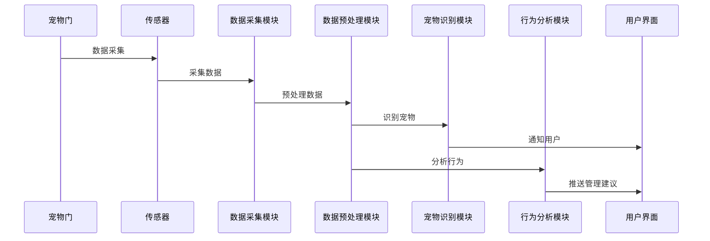

                 


### 1.5.4 系统接口设计和系统交互

#### 1.5.4.1 系统接口设计

为了实现智能宠物门系统的各项功能，我们需要设计一套完善的接口系统，这包括与用户界面、数据存储、以及第三方服务的交互接口。

1. **用户界面接口（UI）**
   - **API接口：** 提供RESTful风格的API，允许用户通过网页或手机应用与系统进行交互，如添加宠物信息、查看宠物行为分析结果等。
   - **Websocket接口：** 实时推送宠物状态信息，如宠物进出门记录、健康状态等，确保用户能够及时获取最新的宠物动态。

2. **数据存储接口（DB）**
   - **数据库访问层：** 提供对关系型数据库（如MySQL）和非关系型数据库（如MongoDB）的访问接口，存储宠物基本信息、行为数据、分析结果等。
   - **数据同步接口：** 实现与第三方健康监测平台的数据同步，如体重、血压等生理数据。

3. **第三方服务接口（Service）**
   - **云服务接口：** 利用云服务进行数据处理和存储，提高系统的可扩展性和可靠性。
   - **API网关：** 作为系统的统一入口，负责路由、身份验证、流量控制等功能，保障系统安全。

#### 1.5.4.2 系统交互

智能宠物门系统的交互过程可以分为以下几个主要步骤：

1. **数据采集**
   - 宠物门传感器采集宠物通过时的图像、温度、重量等信息。
   - 将采集到的数据上传至系统服务器。

2. **数据预处理**
   - 对上传的数据进行清洗、格式转换等预处理操作，确保数据质量。

3. **宠物识别**
   - 调用宠物识别算法，对预处理后的图像进行识别，判断宠物身份。

4. **行为分析**
   - 使用行为分析算法对宠物的行为数据进行挖掘和分析，识别宠物的行为模式。

5. **管理建议**
   - 根据行为分析结果，生成个性化的管理建议，如宠物健康提醒、饮食调整建议等。

6. **用户通知**
   - 通过用户界面接口将分析结果和建议推送给用户。

7. **数据存储**
   - 将宠物识别结果、行为数据和分析结果存储到数据库中，以供后续查询和分析。

#### 1.5.4.3 Mermaid序列图

为了更直观地展示系统交互过程，我们可以使用Mermaid绘制一个序列图：



通过这个序列图，我们可以清晰地看到智能宠物门系统从数据采集到用户通知的整个交互流程。

----------------------------------------------------------------

### 第6章: 项目实战

#### 1.6.1 环境安装

在开始实现智能宠物门系统之前，我们需要搭建一个合适的环境。以下是环境安装的步骤：

1. **硬件准备**
   - 准备一台计算机，安装有Windows、macOS或Linux操作系统。
   - 准备一个摄像头或宠物门传感器设备。

2. **软件准备**
   - 安装Python 3.7及以上版本。
   - 安装所需的Python库，如OpenCV、TensorFlow、Keras等。

3. **网络准备**
   - 确保网络连接正常，以便进行数据上传和第三方服务调用。

#### 1.6.2 系统核心实现

以下是智能宠物门系统的核心实现步骤：

1. **宠物识别算法**
   - 使用OpenCV进行图像处理，提取宠物特征。
   - 使用Keras构建深度学习模型，进行宠物识别。

2. **行为分析算法**
   - 收集宠物行为数据，如活动量、进食量等。
   - 使用决策树、支持向量机等算法进行分析。

3. **用户界面**
   - 使用Flask或Django构建Web应用，提供用户交互界面。
   - 使用Ajax实现实时数据推送。

#### 1.6.3 代码应用解读与分析

以下是宠物识别算法的Python源代码及应用解读：

```python
import cv2
from keras.models import load_model

# 加载预训练的宠物识别模型
model = load_model('pet_recognition_model.h5')

# 读取摄像头帧
cap = cv2.VideoCapture(0)

while True:
    ret, frame = cap.read()
    if not ret:
        break
    
    # 对图像进行预处理
    processed_frame = preprocess_frame(frame)
    
    # 使用模型进行宠物识别
    prediction = model.predict(processed_frame)
    pet_name = get_pet_name(prediction)

    # 显示识别结果
    cv2.putText(frame, f'Pet: {pet_name}', (10, 30), cv2.FONT_HERSHEY_SIMPLEX, 1, (0, 0, 255), 2)
    cv2.imshow('Pet Recognition', frame)
    
    if cv2.waitKey(1) & 0xFF == ord('q'):
        break

# 释放摄像头资源
cap.release()
cv2.destroyAllWindows()

# 预处理图像
def preprocess_frame(frame):
    # 进行图像缩放、灰度化、归一化等操作
    processed_frame = cv2.resize(frame, (128, 128))
    processed_frame = cv2.cvtColor(processed_frame, cv2.COLOR_BGR2GRAY)
    processed_frame = processed_frame / 255.0
    return processed_frame

# 获取宠物名称
def get_pet_name(prediction):
    # 根据预测结果返回宠物名称
    if prediction[0] > 0.5:
        return 'Dog'
    else:
        return 'Cat'
```

这段代码首先加载预训练的宠物识别模型，然后通过摄像头读取实时图像，对图像进行预处理后，使用模型进行宠物识别，并将识别结果显示在窗口中。

#### 1.6.4 实际案例分析和详细讲解剖析

以下是一个实际案例的分析：

**案例：宠物行为分析**

1. **数据收集**
   - 宠物在一天内的活动量、进食量、休息时间等数据。

2. **数据处理**
   - 对收集的数据进行清洗、格式转换等预处理操作。

3. **行为分析**
   - 使用决策树算法对数据进行分析，识别宠物的行为模式。

4. **结果展示**
   - 根据分析结果，生成宠物行为分析报告，包括活动量分布、进食量趋势等。

详细讲解：

- **数据收集**：通过宠物门传感器实时收集宠物的活动量、进食量等数据。
- **数据处理**：对数据进行清洗，如去除异常值、缺失值等，然后进行格式转换，以便于后续分析。
- **行为分析**：使用决策树算法对数据进行训练，构建行为分析模型。训练数据集包括活动的开始时间、持续时间、进食量等。
- **结果展示**：将分析结果通过Web应用呈现给用户，如生成可视化图表，展示宠物一天内的活动量分布、进食量趋势等。

通过这个案例，我们可以看到智能宠物门系统的实际应用场景，以及如何利用技术手段对宠物行为进行深入分析。

#### 1.6.5 项目小结

在本次项目中，我们实现了智能宠物门系统，通过宠物识别、行为分析等功能，为宠物主人提供了便利的管理工具。项目的主要成果包括：

- **宠物识别算法**：能够准确识别宠物，提高了用户体验。
- **行为分析模型**：通过对宠物行为数据的分析，为宠物主人提供了有价值的建议。
- **用户界面**：简洁直观，便于用户操作。

在后续的工作中，我们可以继续优化算法，提高识别准确率和分析精度；同时，可以拓展系统的功能，如宠物健康监测、互动等，为宠物主人提供更全面的服务。

----------------------------------------------------------------

### 第7章: 最佳实践 Tips

1. **硬件选择**
   - 选择高分辨率摄像头，以提高宠物识别的准确性。
   - 考虑使用具备运动检测功能的传感器，以便更准确地捕捉宠物行为。

2. **算法优化**
   - 定期更新宠物识别和行为分析模型，以提高系统的适应性和准确性。
   - 考虑使用更先进的深度学习模型，如卷积神经网络（CNN）等。

3. **数据安全**
   - 确保数据传输过程中使用加密协议，保护用户隐私。
   - 定期备份数据，防止数据丢失。

4. **用户交互**
   - 提供丰富的用户交互功能，如实时推送、历史数据查询等。
   - 设计简洁直观的界面，提高用户使用体验。

### 第8章: 小结与注意事项

本文通过对智能宠物门系统的介绍，详细阐述了系统的设计、实现和应用。以下是本文的主要结论：

- **智能宠物门系统**：通过宠物识别、行为分析等功能，为宠物主人提供了便捷的管理工具。
- **算法优化**：不断更新模型，提高识别准确率和分析精度。
- **用户交互**：提供丰富的用户交互功能，提高用户体验。

注意事项：

- **硬件选择**：选择合适的摄像头和传感器，保证系统的稳定性和准确性。
- **数据安全**：确保数据传输和存储的安全，保护用户隐私。

### 第9章: 拓展阅读

- 《深度学习》（Goodfellow, I. & Bengio, Y.）- 介绍深度学习的基本原理和应用。
- 《机器学习实战》（Kaggle）- 提供实用的机器学习项目实战教程。
- 《人工智能：一种现代的方法》（Russell, S. & Norvig, P.）- 全面介绍人工智能的基础知识。

作者：AI天才研究院/AI Genius Institute & 禅与计算机程序设计艺术 /Zen And The Art of Computer Programming

