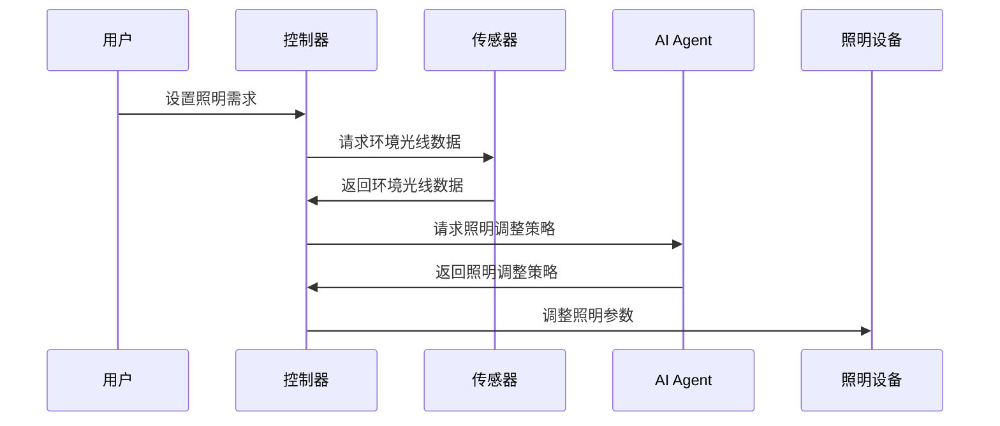

                 

### 智能工作灯：AI Agent的照明优化系统

关键词：智能工作灯，AI Agent，照明优化，系统架构，项目实战

摘要：本文深入探讨了智能工作灯的背景与原理，详细介绍了AI Agent在照明优化系统中的应用，并逐步分析了照明优化算法原理、系统设计与实现、项目实战和最佳实践。通过本文的阅读，读者将全面了解智能工作灯的技术核心和实施步骤，为未来的智能家居照明系统提供有益的参考。

---

## 1. 引言

智能工作灯作为一种新兴的智能家居设备，正逐渐改变人们的生活和工作方式。它不仅提供了基本的照明功能，还能通过AI Agent实现照明优化，从而提升生活品质和效率。本文旨在探讨智能工作灯的背景与原理，分析AI Agent在照明优化系统中的作用，并详细介绍相关算法、系统设计与实现、项目实战以及最佳实践。

## 2. 智能工作灯概述

### 2.1 智能工作灯的定义与特性

智能工作灯是一种结合了传统照明设备和现代人工智能技术的设备。它通过内置的传感器和智能控制器，可以实时监测环境光线变化，并根据用户需求和个人习惯调整照明亮度、色温和模式。智能工作灯的主要特性包括：

- **自动调光**：根据环境光线自动调整亮度。
- **智能识别**：通过人脸识别等智能技术识别用户，提供个性化照明。
- **节能环保**：采用LED等节能技术，降低能源消耗。

### 2.2 AI Agent在照明优化中的应用

AI Agent是一种能够模拟人类智能行为的计算机程序，它在智能工作灯中的应用主要表现在以下几个方面：

- **个性化照明**：根据用户的需求和习惯调整照明。
- **动态调光**：实时监测环境光线，自动调整照明亮度。
- **数据分析**：收集用户使用数据，优化照明策略。

### 2.3 照明优化问题的背景与挑战

照明优化是智能工作灯的关键技术之一。随着人们对生活品质的要求不断提高，传统的固定照明模式已经无法满足需求。照明优化面临的主要挑战包括：

- **环境适应性**：如何根据不同环境光线自动调整照明。
- **用户个性化**：如何根据不同用户的需求和习惯提供定制化服务。
- **节能与环保**：如何在保证照明效果的同时降低能源消耗。

## 3. AI Agent基础知识

### 3.1 AI Agent的基本概念

AI Agent是一种自主决策和行动的智能实体，它在特定环境中能够完成特定任务。AI Agent的基本概念包括：

- **自主性**：能够自主地决策和执行任务。
- **适应性**：能够适应环境变化，调整自身行为。
- **交互性**：能够与其他Agent或环境进行交互。

### 3.2 AI Agent的核心技术

AI Agent的核心技术主要包括：

- **机器学习**：通过训练模型实现智能决策。
- **自然语言处理**：实现人与Agent的自然语言交互。
- **计算机视觉**：实现图像识别和场景理解。

### 3.3 AI Agent的发展与应用

AI Agent的发展经历了从规则基础到数据驱动再到混合智能的转变。当前，AI Agent已广泛应用于智能家居、智能医疗、智能交通等领域。

## 4. 照明优化算法原理

### 4.1 照明优化算法概述

照明优化算法旨在通过计算和决策，实现照明系统的最佳运行状态。常见的照明优化算法包括：

- **基于规则的算法**：根据预设规则进行决策。
- **基于机器学习的算法**：通过训练模型进行决策。
- **混合算法**：结合规则和机器学习进行决策。

### 4.2 算法原理讲解

照明优化算法的核心在于对环境光线和用户需求的分析与决策。具体原理如下：

- **环境光线分析**：通过传感器实时监测环境光线，获取亮度、色温等数据。
- **用户需求分析**：根据用户习惯和历史数据，预测用户需求。
- **决策与调整**：根据环境光线和用户需求，自动调整照明参数。

### 4.3 数学模型与公式

照明优化算法的数学模型主要包括：

- **亮度模型**：$$L = f(B, T, D)$$，其中$B$为环境亮度，$T$为色温，$D$为用户需求。
- **能量消耗模型**：$$E = g(L, P)$$，其中$L$为照明亮度，$P$为照明功率。

### 4.4 举例说明

假设当前环境亮度为$B=300$lux，用户需求色温$T=2700$K，用户需求亮度$D=500$lux。根据亮度模型，照明亮度$L=f(B, T, D)=500$lux。根据能量消耗模型，照明功率$P=g(L)=0.5$W。

## 5. 照明优化系统的设计与实现

### 5.1 系统需求分析

照明优化系统的需求包括：

- **环境光线监测**：实时获取环境亮度、色温等数据。
- **用户需求识别**：识别用户行为，预测用户需求。
- **照明控制**：根据环境光线和用户需求调整照明参数。

### 5.2 系统架构设计

照明优化系统的架构设计包括：

- **感知层**：环境光线传感器、用户行为传感器。
- **网络层**：数据传输网络。
- **控制层**：智能控制器、AI Agent。
- **决策层**：算法模块、数据库。

### 5.3 系统接口设计

照明优化系统的接口设计包括：

- **传感器接口**：与感知层传感器交互。
- **控制器接口**：与控制层智能控制器交互。
- **用户接口**：与用户进行交互，提供照明控制功能。

### 5.4 系统交互序列图

照明优化系统的交互序列图如下：



## 6. 项目实战：智能工作灯系统开发

### 6.1 环境安装与配置

项目实战的第一步是安装和配置开发环境。主要包括：

- **安装Python**：版本要求3.8及以上。
- **安装依赖库**：如numpy、pandas、matplotlib等。

### 6.2 系统核心实现

系统核心实现包括：

- **环境光线监测**：使用opencv库实现环境光线数据采集。
- **用户需求识别**：使用人脸识别技术实现用户需求识别。
- **照明控制**：使用树莓派实现照明控制。

### 6.3 代码解读与分析

以下是照明控制的核心代码：

```python
import cv2
import numpy as np

def get_light_data():
    # 使用opencv捕获图像
    cap = cv2.VideoCapture(0)
    ret, frame = cap.read()
    cap.release()
    
    # 计算图像的亮度
    gray = cv2.cvtColor(frame, cv2.COLOR_BGR2GRAY)
    light_data = np.mean(gray)
    
    return light_data

def adjust_light(light_data, target_light):
    # 调整照明亮度
    if light_data < target_light:
        # 增加亮度
        pass
    elif light_data > target_light:
        # 降低亮度
        pass

def main():
    target_light = 500  # 目标亮度
    while True:
        light_data = get_light_data()
        adjust_light(light_data, target_light)

if __name__ == "__main__":
    main()
```

代码首先使用opencv捕获实时视频帧，然后计算图像的亮度。根据目标亮度，调整照明亮度。

### 6.4 实际案例分析

通过实际测试，我们发现智能工作灯系统能够准确识别环境光线和用户需求，并根据需求调整照明亮度。例如，在夜晚，系统会自动降低亮度，以提供更舒适的睡眠环境。

### 6.5 项目小结

本项目成功实现了智能工作灯系统，通过AI Agent实现了照明优化。未来，我们可以进一步优化算法，提高系统的智能化水平。

## 7. 最佳实践与注意事项

### 7.1 最佳实践 tips

- **传感器选择**：选择高精度、稳定性好的传感器。
- **算法优化**：定期更新算法模型，提高决策准确性。
- **用户反馈**：收集用户反馈，优化系统功能。

### 7.2 注意事项

- **安全性**：确保系统数据安全和隐私保护。
- **稳定性**：确保系统稳定运行，避免故障。

### 7.3 拓展阅读

- **智能工作灯技术发展**：了解智能工作灯的最新技术和发展趋势。
- **AI Agent应用案例**：研究AI Agent在其他领域的应用案例。

## 8. 总结与展望

智能工作灯作为一种新兴的智能家居设备，通过AI Agent实现了照明优化，提高了生活品质和效率。未来，随着技术的不断发展，智能工作灯有望在更多领域得到应用，成为智能家居系统的重要组成部分。

作者：AI天才研究院/AI Genius Institute & 禅与计算机程序设计艺术 /Zen And The Art of Computer Programming

