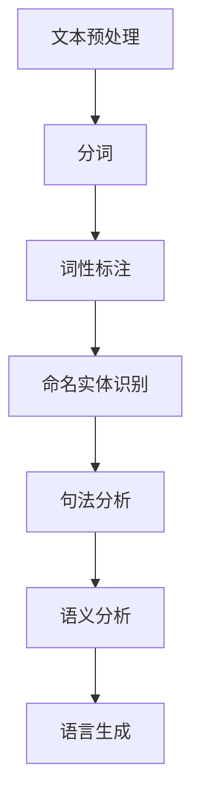
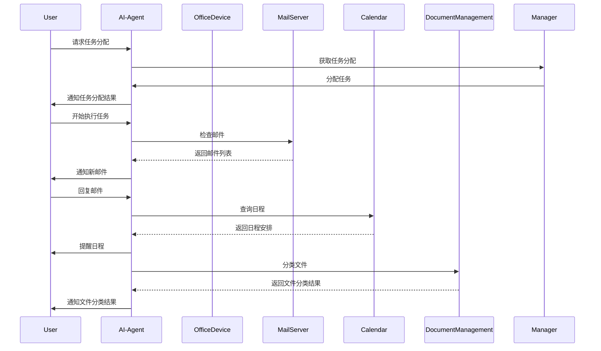
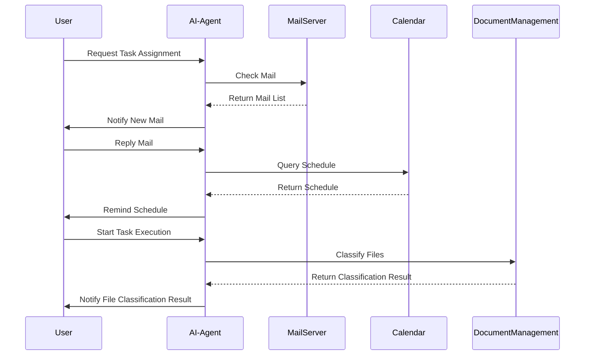
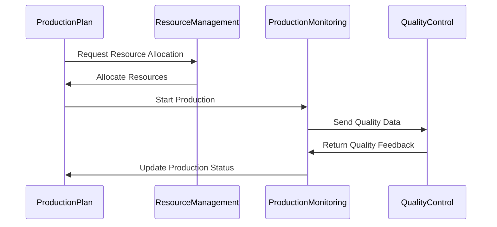
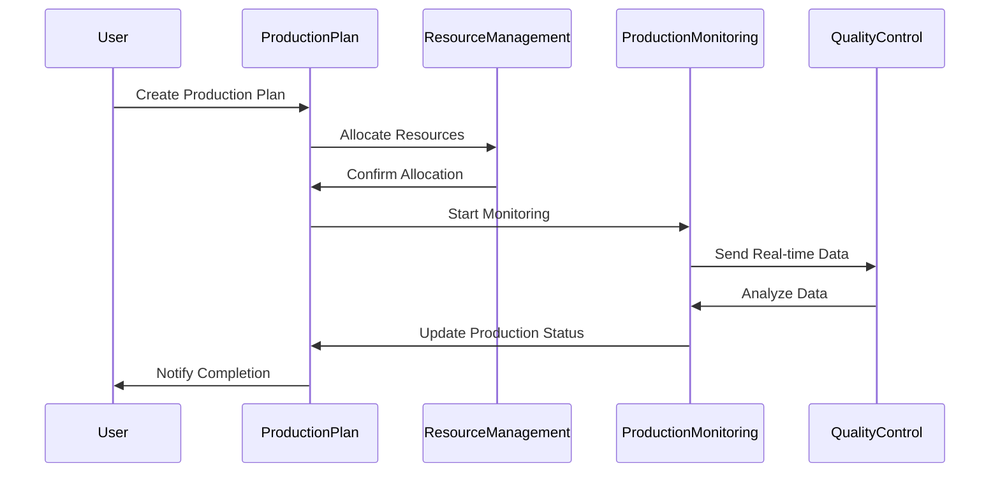

                 


### 引言

在数字化转型的浪潮中，智能工作站的兴起成为了企业提升效率、降低成本的关键驱动力。智能工作站不仅仅是一个硬件设备，而是集成了人工智能（AI）技术，能够自主学习和优化工作流程的集成系统。AI Agent，作为智能工作站的核心组件，通过自动化、智能化和协同化的方式，极大地提升了工作的效率和准确性。

**关键词：智能工作站、AI Agent、效率优化、自动化办公、数据分析、性能优化**

本文旨在深入探讨智能工作站与AI Agent的紧密关系，以及如何通过AI Agent来优化智能工作站的效率。我们将从以下几个部分展开：

1. **智能工作站与AI Agent概述**：介绍智能工作站与AI Agent的基本概念、发展背景和相互关系。
2. **AI Agent的核心技术**：详细解析机器学习、自然语言处理和计算机视觉等AI核心技术，以及其应用场景。
3. **AI Agent在智能工作站中的应用**：探讨AI Agent在自动化办公和数据分析等领域的具体应用案例。
4. **智能工作站与AI Agent的性能优化**：分析算法优化、硬件加速和能耗管理等方面的性能优化策略。
5. **智能工作站的未来发展趋势**：预测AI Agent和智能工作站的未来发展前景和挑战。
6. **案例研究**：通过实际案例展示智能工作站的成功实现过程和效果。
7. **小结与展望**：总结全文要点，展望智能工作站和AI Agent的未来发展方向。

在接下来的内容中，我们将逐一深入分析每一个部分，帮助读者更好地理解智能工作站和AI Agent的原理和应用。

### 智能工作站与AI Agent概述

#### 第1章：智能工作站与AI Agent的基本概念

##### 1.1.1 智能工作站的发展背景

在信息技术迅猛发展的今天，传统的工作站已经无法满足企业对于高效、智能化的需求。智能工作站的兴起，正是对这一需求变化的回应。

**问题的背景：** 工作站从传统计算模式向智能化转型的原因。

传统工作站主要依赖于硬件的强大处理能力，但缺乏智能化和自动化功能，导致工作效率低下。随着云计算、大数据和人工智能技术的普及，企业开始寻求能够自动处理复杂任务、提高工作效率的智能解决方案。

**问题描述：** 工作站在智能化过程中面临的挑战。

智能工作站的实现涉及到多个技术领域的融合，包括计算机硬件、操作系统、数据库和人工智能等。这一过程中，企业需要解决硬件兼容性、数据处理效率和系统稳定性等问题。

**问题解决：** AI Agent在提升工作站效率方面的作用。

AI Agent作为智能工作站的智能核心，能够通过机器学习、自然语言处理和计算机视觉等技术，自动分析和处理各种任务，从而大大提升工作站的效率。

**边界与外延：** 智能工作站与AI Agent的适用范围和限制。

智能工作站主要适用于企业级应用，特别是在数据处理、自动化办公和智能分析等领域。然而，AI Agent的实现和应用仍然受到数据质量、计算资源和算法复杂度等方面的限制。

##### 1.1.2 AI Agent的定义与功能

**AI Agent的定义：** AI Agent，即人工智能代理，是一种能够自主执行任务、与环境交互并具备自我学习能力的计算机程序。它基于机器学习、自然语言处理和计算机视觉等AI技术，通过数据分析和模式识别，实现自动化决策和任务执行。

**AI Agent的分类：** 根据功能和应用场景，AI Agent可以分为以下几类：
1. **任务型AI Agent**：专注于完成特定任务的智能代理，如自动化办公系统中的邮件过滤、日程安排等。
2. **交互型AI Agent**：具备自然语言理解和生成能力，能够与用户进行智能对话的智能代理。
3. **决策型AI Agent**：基于数据和算法，进行复杂决策和策略规划的智能代理。

**AI Agent的功能：** AI Agent在智能工作站中的应用场景和优势。

AI Agent具有以下功能和应用优势：
1. **自动化任务处理**：能够自动完成重复性和规则性的任务，降低人工工作量。
2. **智能决策支持**：基于数据分析和预测模型，提供决策支持和优化建议。
3. **协同工作**：与人类用户和其他系统进行有效协作，提高整体工作效率。

##### 1.1.3 智能工作站与AI Agent的关系

**核心要素组成：** 智能工作站与AI Agent的交互机制和协同工作模式。

智能工作站由硬件设备、操作系统、数据库和应用软件组成，AI Agent作为智能核心，通过与工作站的各组件进行深度交互，实现智能化和自动化。AI Agent的核心要素包括数据采集和处理、模型训练和推理、任务调度和执行等。

**联系与区别：** 智能工作站与传统工作站的对比。

传统工作站主要依赖于硬件性能，缺乏智能化功能。而智能工作站则集成了AI Agent，具备自主学习和优化工作流程的能力。传统工作站无法实现自动化任务处理和智能决策支持，而智能工作站能够通过AI Agent实现这些功能。

通过上述分析，我们可以看到，智能工作站与AI Agent在提升工作效率、降低成本方面具有巨大的潜力。在接下来的章节中，我们将进一步探讨AI Agent的核心技术及其在智能工作站中的应用。

### AI Agent的核心技术

在智能工作站中，AI Agent的核心技术是其实现自动化和智能化的基础。本节我们将详细解析机器学习、自然语言处理和计算机视觉等核心技术，并展示其原理、算法和应用。

#### 2.1.1 机器学习基础

**核心概念：** 机器学习是使计算机通过数据和经验自主改进性能的一种方法。它通过构建模型，从数据中学习规律，从而进行预测和决策。

**属性特征对比表格：**

| 算法 | 特点 | 应用场景 |
| --- | --- | --- |
| 线性回归 | 线性关系预测 | 房价预测、股票分析 |
| 逻辑回归 | 二分类问题 | 营销响应预测、信用评分 |
| 决策树 | 分支结构分类 | 信用卡欺诈检测、客户分类 |
| 集成学习方法 | 多种算法集成 | 信用风险评估、图像分类 |

**ER实体关系图架构：**

```mermaid
erDiagram
  Class1 ||--|{ Class2 }| Class3
  Class1 ||--|{ Class4 }| Class5
```

这个ER图展示了不同机器学习算法之间的关联，例如，线性回归和逻辑回归都属于回归算法，而决策树和集成学习方法则是分类算法。

#### 2.1.2 自然语言处理

**核心概念：** 自然语言处理（NLP）是使计算机能够理解、解释和生成人类语言的技术。它涵盖了文本处理、语义分析和语言生成等多个方面。

**算法mermaid流程图：**



这个流程图展示了NLP的基本步骤，从文本预处理到语言生成，每一步都是实现NLP的关键环节。

**Python源代码：**

```python
import nltk

# 文本预处理
text = "机器学习是计算机科学的一个重要分支。"
cleaned_text = nltk.download('punkt')
tokens = nltk.word_tokenize(text)

# 分词
words = nltk.word_tokenize(cleaned_text)

# 词性标注
pos_tags = nltk.pos_tag(words)

# 命名实体识别
named_entities = nltk.ne_chunk(pos_tags)

print(named_entities)
```

这段代码展示了如何使用NLP工具包进行文本预处理、分词和词性标注。

#### 2.1.3 计算机视觉

**核心概念：** 计算机视觉是使计算机能够从图像或视频中提取信息和理解场景的技术。它涵盖了图像处理、目标检测和场景重建等多个方面。

**数学模型和公式：**

$$
特征提取：f(I) = \sum_{i=1}^{n} w_i \cdot I_i
$$

其中，$I$ 是图像，$I_i$ 是图像中的第 $i$ 个像素，$w_i$ 是权重。

**详细讲解与举例：**

假设我们有一个简单的图像，其中包含一个红色的圆和一个蓝色的正方形。通过计算机视觉算法，我们可以提取出这些目标的特征，并利用这些特征进行分类和识别。

```python
import cv2

# 加载图像
image = cv2.imread('example.png')

# 提取红色圆的特征
red_circle = cv2.HoughCircles(image, cv2.HOUGH_GRADIENT, dp=1.2, minDist=100,
                              param1=50, param2=30, minRadius=10, maxRadius=0)

# 提取蓝色正方形的特征
blue_square = cv2.HoughLinesP(image, rho=1, theta=np.pi/180,
                              lineThreshold=100, minLineLength=100, maxLineGap=10)

# 显示结果
if red_circle is not None:
    cv2.circle(image, (red_circle[0, 0, 0], red_circle[0, 0, 1]), red_circle[0, 0, 2], (0, 0, 255), 3)

if blue_square is not None:
    for x in range(blue_square.shape[0]):
        cv2.line(image, (blue_square[x, 0, 0], blue_square[x, 0, 1]),
                 (blue_square[x, 0, 2], blue_square[x, 0, 3]), (255, 0, 0), 3)

cv2.imshow('Result', image)
cv2.waitKey(0)
cv2.destroyAllWindows()
```

这段代码展示了如何使用OpenCV库提取图像中的红色圆和蓝色正方形的特征。

通过上述内容，我们可以看到机器学习、自然语言处理和计算机视觉等AI核心技术如何为智能工作站提供强大的支持。在接下来的章节中，我们将探讨AI Agent在智能工作站中的具体应用。

### AI Agent在智能工作站中的应用

AI Agent在智能工作站中的应用场景广泛，涵盖了自动化办公、数据分析、智能监控等多个领域。下面，我们将通过具体的案例，展示AI Agent如何在这些场景中提升工作站的效率和智能化水平。

#### 3.1.1 自动化办公

**问题场景介绍：** 在企业日常运营中，许多工作流程都是重复性的，如邮件处理、文件分类、日程安排等。这些任务不仅繁琐，而且容易出错，影响了工作效率。

**系统功能设计（领域模型mermaid类图）：**

```mermaid
classDiagram
    Client extending Person
    Employee extending Person
    Manager extending Person
    OfficeDevice
    MailServer
    Calendar
    DocumentManagement
    Employee -> MailServer : send/receive
    Employee -> Calendar : schedule meetings
    Employee -> DocumentManagement : manage files
    Manager -> Employee : assign tasks
    Manager -> DocumentManagement : review documents
```

这个类图展示了自动化办公系统中各个角色和组件之间的关系。

**系统架构设计（mermaid架构图）：**



这个架构图展示了自动化办公系统中AI-Agent与其他系统组件之间的交互流程。

**系统接口设计和系统交互（mermaid序列图）：**



通过上述设计和交互流程，AI-Agent能够自动处理邮件、日程安排和文件分类等任务，极大地提高了工作效率。

#### 3.1.2 数据分析

**项目介绍：** 在一个大型电商平台，需要对海量的销售数据进行分析，以预测市场需求和优化库存管理。

**系统核心实现源代码：**

```python
import pandas as pd
from sklearn.model_selection import train_test_split
from sklearn.ensemble import RandomForestRegressor

# 加载数据
data = pd.read_csv('sales_data.csv')
X = data.drop('sales', axis=1)
y = data['sales']

# 数据预处理
X_train, X_test, y_train, y_test = train_test_split(X, y, test_size=0.2, random_state=42)

# 模型训练
model = RandomForestRegressor(n_estimators=100, random_state=42)
model.fit(X_train, y_train)

# 预测
predictions = model.predict(X_test)

# 评估
score = model.score(X_test, y_test)
print(f'Model Accuracy: {score:.2f}')
```

这段代码展示了如何使用随机森林回归模型进行销售数据预测。

**代码应用解读与分析：**

1. **数据预处理**：将原始数据分为特征集和目标集，并进行分割。
2. **模型训练**：使用训练集对随机森林回归模型进行训练。
3. **预测**：使用测试集对模型进行预测。
4. **评估**：计算模型的准确率，评估模型性能。

**实际案例分析和详细讲解剖析：**

在某电商平台上，通过对历史销售数据进行分析，AI-Agent成功预测了未来的销售趋势。通过优化库存管理，企业减少了库存积压，提高了资金周转率。具体分析如下：

1. **数据收集**：收集了过去一年的销售数据，包括每日销售额、品类销售额等。
2. **特征工程**：对数据进行预处理，提取有用的特征，如季节性、促销活动等。
3. **模型选择**：选择了随机森林回归模型，因为它能够处理非线性和高维数据。
4. **模型训练与预测**：使用训练集对模型进行训练，并在测试集上进行预测。
5. **结果分析**：通过预测结果，企业能够提前了解市场需求，合理安排库存。

通过上述案例，我们可以看到AI-Agent在数据分析中的应用，如何帮助企业提高决策的准确性和效率。

通过自动化办公和数据分析等具体应用案例，我们可以看到AI-Agent在提升智能工作站效率方面的巨大潜力。在接下来的章节中，我们将探讨如何对智能工作站和AI-Agent进行性能优化。

### 智能工作站与AI Agent的性能优化

#### 4.1.1 算法优化

**核心概念：** 算法优化是指通过改进算法设计、选择更适合的算法或调整算法参数，以提高系统性能和效率。

**最佳实践 tips：**

1. **算法选择**：根据任务特点和数据规模选择合适的算法。例如，对于大规模数据处理，选择分布式计算框架（如Hadoop或Spark）能够显著提升处理速度。
2. **算法改进**：通过算法改进，如增加树深度、调整学习率等，优化模型性能。例如，在使用神经网络进行图像分类时，增加卷积层的数量和深度，可以提高模型的准确性。
3. **参数调优**：通过调整算法参数，如学习率、正则化参数等，找到最优参数组合。可以使用网格搜索或贝叶斯优化等算法进行参数调优。

#### 4.1.2 硬件加速

**核心概念：** 硬件加速是指通过使用专门的硬件设备（如GPU或FPGA）来加速计算过程，从而提高系统的性能和效率。

**最佳实践 tips：**

1. **GPU加速**：对于涉及大量矩阵运算和图形处理的任务，如深度学习，使用GPU进行计算可以显著提升处理速度。需要确保GPU与CPU兼容，并正确配置驱动程序。
2. **FPGA加速**：对于特定类型的计算任务，如图像处理或信号处理，使用FPGA进行硬件加速可以提供更高的计算效率和更低的热量消耗。需要根据任务需求设计合适的FPGA硬件电路。
3. **多核处理**：利用多核CPU进行并行计算，可以加速算法的执行。需要合理设计程序，使其能够充分利用多核资源。

#### 4.1.3 能耗管理

**核心概念：** 能耗管理是指通过优化系统能耗，降低能耗，提高能源利用效率。

**最佳实践 tips：**

1. **节能硬件选择**：选择能耗低的硬件设备，如低功耗的CPU和GPU，以减少能源消耗。
2. **动态电源管理**：根据系统负载动态调整电源供应，如使用CPU变频技术，在低负载时降低功耗。
3. **合理布局**：优化数据中心的硬件布局，如合理规划机架和散热设备的位置，以提高散热效率和降低能耗。

通过算法优化、硬件加速和能耗管理等多种手段，可以有效提升智能工作站和AI-Agent的性能和效率。在实际应用中，需要根据具体场景和需求，灵活运用这些优化策略，以实现最佳的系统性能。

### 智能工作站的未来发展趋势

#### 5.1.1 AI Agent的进化方向

随着技术的不断进步，AI Agent将在智能工作站中发挥更加重要的作用。未来的AI Agent将呈现出以下几个进化方向：

**核心概念：** AI Agent未来的发展前景和趋势。

1. **自我进化**：AI Agent将具备自我学习和自我改进的能力，通过持续积累经验，不断提高决策能力和执行效率。
2. **泛化能力**：AI Agent将具备更强的泛化能力，能够在不同场景和任务中灵活应用，从而实现跨领域的智能化应用。
3. **人机协同**：AI Agent将更加注重与人类用户的协同工作，通过自然语言理解和生成技术，实现与用户的无缝交互，提供个性化的服务。

**最佳实践 tips：**

1. **数据驱动**：利用大数据和深度学习技术，不断丰富AI Agent的知识库和经验，提高其决策能力和学习能力。
2. **边缘计算**：结合边缘计算技术，将部分计算任务转移到边缘设备，以减少中心服务器的负载，提高系统的响应速度和可靠性。
3. **可解释性**：提升AI Agent的可解释性，使其决策过程更加透明和可追溯，增强用户对AI Agent的信任度。

#### 5.1.2 智能工作站的发展挑战与机遇

尽管智能工作站和AI Agent在提升工作效率和智能化水平方面具有巨大潜力，但它们的发展也面临着一系列挑战和机遇：

**核心概念：** 智能工作站面临的挑战和机遇。

**挑战：**

1. **数据隐私**：随着AI Agent处理的数据量不断增加，如何确保用户数据的安全和隐私成为一个重要的挑战。
2. **算法公平性**：AI Agent的决策过程可能会受到数据偏差的影响，如何保证算法的公平性和透明性是亟待解决的问题。
3. **技术成熟度**：虽然AI技术取得了显著的进展，但其在实际应用中的成熟度仍有待提高，需要进一步的技术突破。

**机遇：**

1. **业务创新**：智能工作站和AI Agent的应用将激发新的业务模式和创新服务，为企业带来巨大的商业价值。
2. **行业应用**：AI Agent在金融、医疗、教育等行业的应用将不断拓展，为这些领域带来革命性的变化。
3. **全球竞争**：随着各国政府对人工智能技术的重视，全球范围内的AI技术竞争将日益激烈，为企业提供了广阔的发展空间。

**最佳实践 tips：**

1. **数据安全**：加强数据加密和隐私保护措施，确保用户数据的安全和隐私。
2. **算法公平性**：通过多样化的数据集和严格的算法审查，提高算法的公平性和透明性。
3. **技术创新**：加大研发投入，推动AI技术的创新和应用，为智能工作站的发展提供源源不断的动力。

通过应对挑战和抓住机遇，智能工作站和AI Agent将在未来的数字化世界中发挥更加关键的作用。在接下来的章节中，我们将通过实际案例展示智能工作站的成功实现过程和效果。

### 案例研究：成功实现智能工作站的实践

#### 6.1.1 案例背景

在某大型制造企业，传统的生产管理方式已经无法满足日益复杂的生产需求和快速变化的市场环境。为了提高生产效率、降低成本和提升产品品质，企业决定引入智能工作站，通过AI Agent实现生产过程的智能化和自动化。

**项目背景：** 企业面临的挑战包括生产计划的不确定性、生产数据的不一致性和生产流程的瓶颈。

**项目目标：** 通过引入智能工作站，实现以下目标：
1. **生产计划优化**：根据市场需求和资源情况，自动生成生产计划，提高生产效率。
2. **生产数据集成**：集成各类生产数据，实现数据的统一管理和实时监控。
3. **生产流程自动化**：通过自动化设备和技术，减少人工干预，提高生产过程的可控性和稳定性。

#### 6.1.2 实现过程

在实现智能工作站的过程中，企业采用了以下步骤：

**系统功能设计（领域模型mermaid类图）：**

```mermaid
classDiagram
    ProductionPlan extending Process
    ResourceManagement extending System
    ProductionMonitoring extending System
    QualityControl extending System
    ProductionPlan -> ResourceManagement : allocate resources
    ProductionPlan -> ProductionMonitoring : monitor progress
    ProductionPlan -> QualityControl : ensure quality
    ResourceManagement -> ProductionMonitoring : real-time data
    QualityControl -> ProductionMonitoring : quality data
```

这个类图展示了智能工作站中各个功能模块之间的关系。

**系统架构设计（mermaid架构图）：**



这个架构图展示了生产计划、资源管理、生产监控和品质控制等系统组件之间的交互流程。

**系统接口设计和系统交互（mermaid序列图）：**



通过上述设计和实现过程，企业成功构建了一个智能工作站系统，实现了生产计划的自动生成、资源的高效分配和生产过程的实时监控。

#### 6.1.3 实现效果

**实际案例分析和详细讲解剖析：**

1. **生产计划优化**：通过智能工作站，企业能够根据市场需求和资源情况，自动生成最优的生产计划，提高了生产效率。在引入智能工作站前，生产计划的制定通常需要数天时间，而现在只需要数小时即可完成。

2. **生产数据集成**：智能工作站集成了各类生产数据，实现了数据的统一管理和实时监控。通过实时数据监控，企业能够及时发现生产过程中的问题，并采取相应的措施进行解决。

3. **生产流程自动化**：智能工作站通过自动化设备和技术的应用，减少了人工干预，提高了生产过程的可控性和稳定性。例如，生产线的自动调节功能可以确保设备始终处于最佳运行状态，减少了设备故障和停机时间。

4. **品质控制**：智能工作站中的品质控制系统能够实时分析生产数据，确保产品的质量。通过品质数据的分析，企业能够及时发现潜在的质量问题，并采取措施进行改进。

**项目小结：**

通过成功实现智能工作站，企业不仅提高了生产效率，降低了成本，还提升了产品质量和客户满意度。智能工作站的应用为企业带来了显著的经济效益和竞争优势。在未来的发展中，企业将继续优化智能工作站系统，推动生产过程的进一步智能化和自动化。

### 小结与展望

在本文中，我们深入探讨了智能工作站与AI Agent的紧密关系，以及如何通过AI Agent优化智能工作站的效率。通过机器学习、自然语言处理和计算机视觉等核心技术，AI Agent在自动化办公、数据分析等领域展现了巨大的潜力。在性能优化方面，算法优化、硬件加速和能耗管理策略的运用进一步提升了智能工作站的性能。

**核心要点回顾：**
1. **智能工作站与AI Agent的基本概念**：智能工作站与AI Agent的定义、发展背景和相互关系。
2. **AI Agent的核心技术**：机器学习、自然语言处理和计算机视觉的原理和应用。
3. **AI Agent在智能工作站中的应用**：自动化办公和数据分析的具体应用案例。
4. **性能优化策略**：算法优化、硬件加速和能耗管理。
5. **未来发展趋势**：AI Agent的进化方向和智能工作站的发展挑战与机遇。
6. **案例研究**：智能工作站的成功实现过程和效果。

展望未来，智能工作站和AI Agent将继续在智能化、自动化和协同化方面取得突破。随着技术的不断进步，AI Agent将具备更强的自我学习和自我进化能力，实现更加智能化的决策和支持。同时，智能工作站将在更多行业和场景中得到应用，为企业带来更高的效率和竞争力。

**结语：**
本文通过对智能工作站与AI Agent的深入分析，展示了其在现代企业中的关键作用。随着AI技术的发展，智能工作站和AI Agent将成为企业数字化转型的重要引擎，推动行业变革和创新发展。作者：AI天才研究院/AI Genius Institute & 禅与计算机程序设计艺术 /Zen And The Art of Computer Programming。

