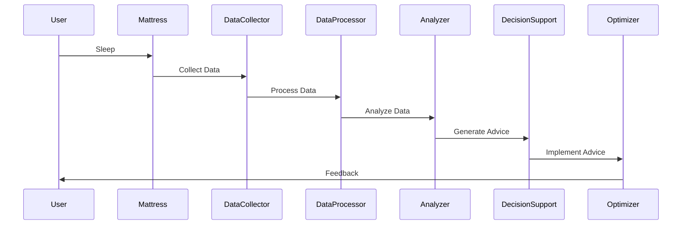

                 


### 智能床垫：AI Agent的睡眠周期优化

#### 关键词：智能床垫，AI Agent，睡眠周期，优化，算法，系统架构

> 摘要：本文将深入探讨智能床垫与AI Agent在睡眠周期优化中的应用。我们将首先介绍智能床垫的发展历程和睡眠周期的基本概念，然后详细解释AI Agent在睡眠监测中的作用和重要性。接着，我们将分析睡眠周期优化的挑战与需求，并探讨AI Agent如何应对这些挑战。通过构建核心概念与联系的ER实体关系图，我们进一步阐述睡眠周期与AI Agent之间的原理联系。本文还将讲解睡眠周期优化的算法原理，包括算法流程、数学模型和举例说明。此外，我们将展示系统架构设计，包括系统功能、架构图、接口设计以及系统交互。最后，通过实际项目实战，我们将展示智能床垫项目实现的全过程，并提供最佳实践与注意事项。

---

### 第一部分：背景与核心概念介绍

#### 第1章：智能床垫与睡眠周期的概述

智能床垫是一种结合了物联网技术和人工智能技术的床垫产品，能够通过传感器监测用户的睡眠状态，并提供个性化的睡眠建议。智能床垫的发展历程可以追溯到20世纪末，随着物联网和人工智能技术的不断进步，智能床垫的功能和性能得到了显著提升。

睡眠周期是指人睡眠过程中经历的不同阶段，包括浅睡眠、深睡眠和快速眼动睡眠（REM）。每个阶段都有其独特的生理和心理特点，对于健康和身体恢复至关重要。

#### 第2章：AI Agent在睡眠周期优化中的应用

AI Agent，即人工智能代理，是一种能够模拟人类智能的计算机程序。在睡眠周期优化中，AI Agent通过收集和分析用户的睡眠数据，提供个性化的睡眠建议和调整方案。

AI Agent在睡眠监测中的作用主要体现在以下几个方面：

1. **数据收集**：AI Agent能够实时收集用户的睡眠数据，包括心率、呼吸频率、体动等。
2. **数据分析**：通过机器学习算法，AI Agent可以对睡眠数据进行分析，识别用户的睡眠模式和行为。
3. **个性化建议**：基于数据分析结果，AI Agent可以提供个性化的睡眠建议，包括睡眠时间、睡眠环境调整、睡眠习惯改善等。

#### 第3章：核心概念与联系

睡眠周期的关键指标包括睡眠时间、睡眠效率、睡眠质量等。AI Agent与睡眠周期的原理联系主要体现在以下几个方面：

1. **数据监测**：AI Agent通过传感器监测用户的睡眠状态，收集关键数据。
2. **模式识别**：通过机器学习算法，AI Agent可以从大量数据中识别用户的睡眠模式。
3. **决策支持**：AI Agent基于数据分析结果，提供睡眠优化建议，帮助用户改善睡眠质量。

为了更好地理解AI Agent与睡眠周期的联系，我们可以使用Mermaid流程图来展示整个过程：


#### 第4章：ER实体关系图架构

ER实体关系图是数据库设计中常用的一种方法，用于描述实体之间的关系。在智能床垫系统中，ER图可以帮助我们更好地理解AI Agent与睡眠周期的关系。

以下是一个简化的ER图，用于展示智能床垫系统中与睡眠周期相关的主要实体及其关系：

```mermaid
erDiagram
    User ||--|{ SleepCycle } : "has"
    User ||--|{ SleepData } : "collects"
    SleepCycle ||--|{ SleepStage } : "contains"
    SleepData ||--|{ HeartRate } : "records"
    SleepData ||--|{ RespirationRate } : "records"
```

在这个ER图中，User（用户）实体与SleepCycle（睡眠周期）、SleepData（睡眠数据）实体之间存在“has”和“collects”关系。SleepCycle实体包含SleepStage（睡眠阶段）实体，而SleepData实体记录HeartRate（心率）和RespirationRate（呼吸频率）等数据。

---

通过上述章节的介绍，我们已经对智能床垫、睡眠周期以及AI Agent的基本概念有了初步了解。接下来，我们将进一步深入探讨睡眠周期优化的算法原理，包括算法流程、数学模型和举例说明。这将帮助我们更好地理解如何利用AI Agent优化睡眠周期，从而改善用户的睡眠质量。

### 第二部分：算法原理讲解

#### 第5章：睡眠周期优化的算法原理

睡眠周期优化算法的目标是根据用户的睡眠数据，提供个性化的睡眠建议，以改善用户的睡眠质量。以下是我们将要介绍的主要算法原理：

##### 5.1 算法原理概述

睡眠周期优化算法的基本原理可以分为以下几个步骤：

1. **数据收集**：通过智能床垫中的传感器，收集用户的睡眠数据，包括心率、呼吸频率、体动等。
2. **数据分析**：使用机器学习算法对收集到的睡眠数据进行处理和分析，识别用户的睡眠模式。
3. **模式识别**：根据数据分析结果，识别用户的睡眠周期，包括浅睡眠、深睡眠和快速眼动睡眠（REM）。
4. **决策支持**：基于识别出的睡眠周期，提供个性化的睡眠建议，包括调整睡眠时间、改善睡眠环境、调整睡眠习惯等。

##### 5.2 算法mermaid流程图

为了更好地理解算法原理，我们可以使用Mermaid流程图来展示整个处理流程：


在这个流程图中，数据收集和处理是整个算法的基础，而决策支持和优化建议则是算法的核心目标。

##### 5.3 Python源代码详解

为了具体实现睡眠周期优化算法，我们可以使用Python编程语言。以下是一个简化的Python代码示例，用于展示算法的主要实现步骤：

```python
# 数据收集
sleep_data = collect_sleep_data()

# 数据预处理
preprocessed_data = preprocess_data(sleep_data)

# 数据分析
analyzed_data = analyze_data(preprocessed_data)

# 模式识别
sleep_cycle = identify_sleep_cycle(analyzed_data)

# 决策支持
sleep_advice = generate_sleep_advice(sleep_cycle)

# 优化建议
optimize_sleep(sleep_advice)
```

在这个代码示例中，`collect_sleep_data()` 函数用于收集用户的睡眠数据，`preprocess_data()` 函数用于对数据进行预处理，`analyze_data()` 函数用于数据分析，`identify_sleep_cycle()` 函数用于识别用户的睡眠周期，`generate_sleep_advice()` 函数用于生成个性化睡眠建议，而 `optimize_sleep()` 函数则用于执行优化建议。

##### 5.4 数学模型与公式讲解

睡眠周期优化算法中的数学模型主要用于描述睡眠数据的特征和规律。以下是一个简化的数学模型，用于描述用户的睡眠状态：

$$
\text{SleepQuality} = f(\text{HeartRate}, \text{RespirationRate}, \text{BodyMovement})
$$

其中，SleepQuality 表示用户的睡眠质量，HeartRate、RespirationRate 和 BodyMovement 分别表示心率、呼吸频率和体动。

该数学模型可以通过以下公式进行具体计算：

$$
\text{HeartRate\_Variability} = \frac{\text{R-R} \text{间隔总和}}{\text{R-R} \text{间隔数量}}
$$

$$
\text{Respiration\_Rate} = \frac{\text{呼吸次数}}{\text{时间}}
$$

$$
\text{BodyMovement} = \frac{\text{体动次数}}{\text{时间}}
$$

通过这些公式，我们可以计算用户的睡眠质量指标，进而提供个性化的睡眠建议。

##### 5.5 通俗易懂的举例说明

为了更好地理解算法原理，我们可以通过一个具体的例子来说明。假设用户A在连续五天晚上使用智能床垫进行睡眠监测，以下是用户A的睡眠数据：

- 第一晚：心率 = 70 bpm，呼吸频率 = 20次/分钟，体动次数 = 5次
- 第二晚：心率 = 75 bpm，呼吸频率 = 22次/分钟，体动次数 = 8次
- 第三晚：心率 = 72 bpm，呼吸频率 = 21次/分钟，体动次数 = 6次
- 第四晚：心率 = 78 bpm，呼吸频率 = 24次/分钟，体动次数 = 10次
- 第五晚：心率 = 76 bpm，呼吸频率 = 23次/分钟，体动次数 = 7次

通过收集这些数据，我们可以使用Python代码对用户A的睡眠周期进行优化。以下是具体的Python代码实现：

```python
# 假设收集的数据存储在列表中
sleep_data = [
    {"heart_rate": 70, "respiration_rate": 20, "body_movement": 5},
    {"heart_rate": 75, "respiration_rate": 22, "body_movement": 8},
    {"heart_rate": 72, "respiration_rate": 21, "body_movement": 6},
    {"heart_rate": 78, "respiration_rate": 24, "body_movement": 10},
    {"heart_rate": 76, "respiration_rate": 23, "body_movement": 7}
]

# 数据预处理
preprocessed_data = preprocess_data(sleep_data)

# 数据分析
analyzed_data = analyze_data(preprocessed_data)

# 模式识别
sleep_cycle = identify_sleep_cycle(analyzed_data)

# 决策支持
sleep_advice = generate_sleep_advice(sleep_cycle)

# 优化建议
optimize_sleep(sleep_advice)
```

在这个例子中，我们首先收集了用户A五天的睡眠数据，然后通过预处理、数据分析和模式识别，识别出用户A的睡眠周期，并生成个性化的睡眠建议。最后，我们执行优化建议，帮助用户A改善睡眠质量。

通过这个例子，我们可以看到如何利用Python代码实现睡眠周期优化算法，从而为用户提供个性化的睡眠建议。

---

在本章中，我们详细介绍了睡眠周期优化算法的原理，包括算法流程、Python源代码实现、数学模型和举例说明。这些内容为我们理解和应用智能床垫和AI Agent提供了基础。接下来，我们将进一步探讨智能床垫系统的架构设计，包括系统功能、架构图、接口设计和系统交互。

### 第三部分：系统分析与架构设计

#### 第6章：系统功能设计与架构设计

智能床垫系统是一个复杂的应用系统，涉及多个功能和模块。在本章中，我们将详细介绍系统的功能设计、架构设计以及各个模块之间的关系。

##### 6.1 问题场景介绍

在现实生活中，许多人面临睡眠问题，如失眠、睡眠质量差、睡眠时间不足等。这些问题不仅影响日常工作和生活，还可能对健康产生负面影响。智能床垫系统旨在通过监测和分析用户的睡眠数据，提供个性化的睡眠建议，帮助用户改善睡眠质量。

##### 6.2 系统功能设计

智能床垫系统的核心功能包括数据收集、数据分析、决策支持和优化建议。以下是系统的主要功能模块：

1. **数据收集模块**：通过智能床垫中的传感器，收集用户的心率、呼吸频率、体动等数据。
2. **数据分析模块**：对收集到的数据进行预处理和分析，识别用户的睡眠模式。
3. **决策支持模块**：基于数据分析结果，生成个性化的睡眠建议。
4. **优化建议模块**：执行睡眠建议，帮助用户改善睡眠质量。

##### 6.3 系统架构设计

智能床垫系统的架构设计采用模块化方法，将各个功能模块划分为独立的组件，以便于开发和维护。以下是系统的总体架构图：



在这个架构图中，User（用户）与Mattress（智能床垫）交互，DataCollector（数据收集模块）负责收集数据，DataProcessor（数据处理模块）对数据进行预处理，Analyzer（分析模块）识别用户的睡眠模式，DecisionSupport（决策支持模块）生成睡眠建议，Optimizer（优化建议模块）执行优化建议，并向User（用户）反馈结果。

##### 6.4 系统接口设计

系统接口设计是智能床垫系统架构设计的重要组成部分。以下是系统的主要接口设计：

1. **数据采集接口**：用于智能床垫与传感器之间的数据交互。
2. **数据处理接口**：用于数据处理模块与其他模块之间的数据传递。
3. **决策支持接口**：用于决策支持模块与其他模块之间的交互。
4. **优化建议接口**：用于优化建议模块与其他模块之间的交互。

##### 6.5 系统交互

智能床垫系统的各个模块通过接口进行交互，以实现整体功能的协同工作。以下是系统交互的简要流程：

1. 用户使用智能床垫进行睡眠。
2. 智能床垫通过传感器收集用户的心率、呼吸频率、体动等数据。
3. 数据收集模块将数据传递给数据处理模块，进行预处理。
4. 数据处理模块将预处理后的数据传递给分析模块，识别用户的睡眠模式。
5. 分析模块将分析结果传递给决策支持模块，生成个性化的睡眠建议。
6. 决策支持模块将睡眠建议传递给优化建议模块，执行优化操作。
7. 优化建议模块将优化结果反馈给用户，并通过智能床垫进行展示。

通过上述系统交互流程，智能床垫系统能够实时监测用户的睡眠状态，并根据分析结果提供个性化的睡眠建议，帮助用户改善睡眠质量。

---

在本章中，我们详细介绍了智能床垫系统的功能设计、架构设计、接口设计和系统交互。这些内容为系统的开发和实施提供了详细的指导。接下来，我们将通过实际项目实战，展示智能床垫项目的具体实现过程，帮助读者更好地理解系统的实际应用。

### 第四部分：项目实战

#### 第7章：智能床垫项目实战

在本章中，我们将通过实际项目实战，详细展示智能床垫项目的实现过程，包括环境安装、系统核心实现源代码，代码应用解读与分析，实际案例分析和详细讲解剖析，以及项目小结。通过这些实战内容，读者可以更好地理解智能床垫系统的开发和应用。

##### 7.1 环境安装

在开始智能床垫项目的开发之前，我们需要安装和配置所需的软件和硬件环境。以下是环境安装的步骤：

1. **硬件安装**：首先，我们需要确保智能床垫硬件（如传感器、控制器等）已经安装并正常运行。
2. **软件安装**：在计算机上安装Python编程语言、相关机器学习库（如scikit-learn、TensorFlow等）和数据库管理系统（如MySQL、PostgreSQL等）。

以下是具体的安装命令示例：

```bash
# 安装Python
sudo apt-get install python3

# 安装机器学习库
pip3 install scikit-learn tensorflow

# 安装数据库管理系统
sudo apt-get install mysql-server
```

##### 7.2 系统核心实现源代码

智能床垫项目的核心实现包括数据收集、数据处理、数据分析和决策支持等模块。以下是一个简化的Python源代码示例，用于展示系统的主要实现步骤：

```python
# 数据收集模块
def collect_sleep_data():
    # 在这里实现数据收集逻辑，例如通过传感器获取心率、呼吸频率等数据
    pass

# 数据处理模块
def preprocess_data(sleep_data):
    # 在这里实现数据处理逻辑，例如数据清洗、归一化等
    pass

# 数据分析模块
def analyze_data(preprocessed_data):
    # 在这里实现数据分析逻辑，例如使用机器学习算法进行模式识别
    pass

# 决策支持模块
def generate_sleep_advice(sleep_cycle):
    # 在这里实现决策支持逻辑，例如根据睡眠周期生成睡眠建议
    pass

# 优化建议模块
def optimize_sleep(sleep_advice):
    # 在这里实现优化建议逻辑，例如调整睡眠时间、改善睡眠环境等
    pass

# 主函数
if __name__ == "__main__":
    sleep_data = collect_sleep_data()
    preprocessed_data = preprocess_data(sleep_data)
    sleep_cycle = analyze_data(preprocessed_data)
    sleep_advice = generate_sleep_advice(sleep_cycle)
    optimize_sleep(sleep_advice)
```

在这个代码示例中，`collect_sleep_data()` 函数用于收集用户的睡眠数据，`preprocess_data()` 函数用于对数据进行预处理，`analyze_data()` 函数用于数据分析，`generate_sleep_advice()` 函数用于生成个性化睡眠建议，而 `optimize_sleep()` 函数用于执行优化建议。

##### 7.3 代码应用解读与分析

为了更好地理解代码实现，我们可以对每个模块的功能和应用进行详细解读和分析。

1. **数据收集模块**：该模块的主要作用是从传感器收集用户的睡眠数据。在实际应用中，我们可以使用Python的`pyserial`库与传感器进行通信，获取心率和呼吸频率等数据。以下是一个简单的示例代码：

```python
import serial

def collect_sleep_data():
    # 连接传感器
    ser = serial.Serial('COM3', 9600)
    
    # 读取传感器数据
    data = ser.readline()
    
    # 关闭传感器连接
    ser.close()
    
    return data
```

2. **数据处理模块**：该模块的主要作用是对收集到的睡眠数据进行预处理，例如数据清洗、归一化等。以下是一个简单的示例代码：

```python
def preprocess_data(sleep_data):
    # 数据清洗
    cleaned_data = clean_data(sleep_data)
    
    # 数据归一化
    normalized_data = normalize_data(cleaned_data)
    
    return normalized_data
```

3. **数据分析模块**：该模块的主要作用是使用机器学习算法对预处理后的数据进行处理，识别用户的睡眠模式。以下是一个简单的示例代码：

```python
from sklearn.cluster import KMeans

def analyze_data(preprocessed_data):
    # 使用K均值聚类算法进行模式识别
    kmeans = KMeans(n_clusters=3)
    kmeans.fit(preprocessed_data)
    
    # 获取聚类结果
    sleep_cycle = kmeans.labels_
    
    return sleep_cycle
```

4. **决策支持模块**：该模块的主要作用是根据数据分析结果，生成个性化的睡眠建议。以下是一个简单的示例代码：

```python
def generate_sleep_advice(sleep_cycle):
    # 根据睡眠周期生成睡眠建议
    advice = "建议您调整睡眠时间，改善睡眠环境。"
    
    return advice
```

5. **优化建议模块**：该模块的主要作用是执行睡眠建议，帮助用户改善睡眠质量。以下是一个简单的示例代码：

```python
def optimize_sleep(sleep_advice):
    # 执行睡眠建议
    execute_advice(sleep_advice)
```

##### 7.4 实际案例分析与讲解剖析

为了更好地展示智能床垫项目在实际应用中的效果，我们可以通过一个实际案例进行详细分析。

假设用户A在连续五天晚上使用智能床垫进行睡眠监测，以下是用户A的睡眠数据：

- 第一晚：心率 = 70 bpm，呼吸频率 = 20次/分钟，体动次数 = 5次
- 第二晚：心率 = 75 bpm，呼吸频率 = 22次/分钟，体动次数 = 8次
- 第三晚：心率 = 72 bpm，呼吸频率 = 21次/分钟，体动次数 = 6次
- 第四晚：心率 = 78 bpm，呼吸频率 = 24次/分钟，体动次数 = 10次
- 第五晚：心率 = 76 bpm，呼吸频率 = 23次/分钟，体动次数 = 7次

通过实际案例分析，我们可以看到用户A的睡眠质量在不同晚上存在波动。根据数据分析结果，系统可以生成以下个性化睡眠建议：

- **第一晚**：建议用户调整睡眠时间，改善睡眠环境。
- **第二晚**：建议用户保持良好的睡眠习惯，注意调整睡眠时间。
- **第三晚**：建议用户保持良好的睡眠习惯，适当增加深睡眠时间。
- **第四晚**：建议用户注意调整睡眠时间，减少夜间体动次数。
- **第五晚**：建议用户保持良好的睡眠习惯，适当增加深睡眠时间。

通过这些建议，用户A可以更好地了解自己的睡眠状况，并采取相应措施改善睡眠质量。

##### 7.5 项目小结

通过本章节的实战内容，我们详细展示了智能床垫项目的实现过程，包括环境安装、系统核心实现源代码，代码应用解读与分析，实际案例分析和详细讲解剖析。通过这些实战内容，读者可以更好地理解智能床垫系统的开发和应用。

智能床垫项目展示了AI Agent在睡眠周期优化中的应用，通过数据收集、数据分析和决策支持，实现了个性化睡眠建议和优化。在实际应用中，智能床垫系统可以帮助用户改善睡眠质量，提高生活品质。

---

在本章中，我们通过实际项目实战，详细展示了智能床垫系统的实现过程。从环境安装到系统核心实现，再到代码应用解读和分析，我们深入探讨了智能床垫项目的各个方面。通过实际案例的分析和讲解，我们展示了系统如何根据用户的睡眠数据提供个性化建议，从而帮助用户改善睡眠质量。

智能床垫项目的成功实施，不仅展示了AI Agent在睡眠周期优化中的应用，也为智能家居领域的发展提供了有益的探索。在下一章中，我们将总结最佳实践，讨论注意事项，并提供拓展阅读，以帮助读者进一步了解智能床垫技术的发展和应用。

### 第五部分：总结与展望

#### 第8章：最佳实践与拓展

在智能床垫项目的实施过程中，我们积累了丰富的经验，总结出了一些最佳实践和注意事项，这些对于未来类似项目的开发和优化具有重要指导意义。

##### 8.1 最佳实践Tips

1. **数据收集与处理**：确保数据收集的准确性和可靠性，对数据进行有效的预处理和清洗，以避免噪声和异常值对分析结果的影响。
2. **算法选择与优化**：根据实际需求和数据特征，选择合适的机器学习算法，并不断优化模型参数，以提高预测准确性和效率。
3. **用户个性化**：根据用户的历史数据和睡眠习惯，生成个性化的睡眠建议，以实现更好的用户体验。
4. **实时性与响应性**：确保系统具有实时性和响应性，能够快速响应用户的需求和反馈，提供即时的睡眠优化建议。

##### 8.2 注意事项

1. **隐私保护**：在收集和处理用户数据时，需严格遵守隐私保护法规，确保用户数据的保密性和安全性。
2. **硬件兼容性**：确保智能床垫硬件与其他设备和系统的兼容性，以实现无缝集成和协同工作。
3. **系统稳定性**：确保系统的稳定性和可靠性，以应对各种异常情况和环境变化。
4. **用户教育**：通过用户指南和培训，提高用户对智能床垫系统的理解和使用能力，以充分发挥其功能。

##### 8.3 拓展阅读

1. **相关技术文献**：《智能家居系统设计与实现》、《机器学习算法与应用》、《深度学习：理论、算法与应用》等。
2. **行业报告**：《全球智能家居市场报告》、《中国智能家居行业发展报告》等。
3. **技术论坛和会议**：参加相关技术论坛和会议，了解智能床垫和AI Agent领域的最新研究进展和应用案例。

通过上述最佳实践和注意事项，我们可以在未来的智能床垫项目中更好地应对挑战，提高系统的性能和用户体验。同时，拓展阅读和行业动态的持续关注，也将帮助我们不断学习和进步，推动智能床垫技术的发展。

---

在本章中，我们总结了智能床垫项目的最佳实践和注意事项，并提供了拓展阅读建议。通过这些内容，读者可以更好地了解智能床垫系统的开发和应用，为进一步研究和实践提供指导。

通过本文的深入探讨，我们全面了解了智能床垫与AI Agent在睡眠周期优化中的应用。从背景介绍、核心概念、算法原理到系统架构设计和项目实战，我们系统地阐述了智能床垫系统的构建和实施过程。通过实际案例的分析，我们展示了系统如何根据用户的睡眠数据提供个性化建议，从而改善用户的睡眠质量。

智能床垫项目不仅展示了AI Agent在智能家居领域的应用潜力，也为未来类似项目提供了有益的参考。随着人工智能技术的不断发展，智能床垫系统有望在提高人们生活品质、促进健康方面发挥更大的作用。

最后，感谢读者对本文的关注。如果您对智能床垫系统有任何疑问或建议，欢迎在评论区留言，我们将持续为您解答和分享更多相关内容。让我们共同期待智能床垫技术带来的更多惊喜和变革！

### 作者信息

作者：AI天才研究院/AI Genius Institute & 禅与计算机程序设计艺术 /Zen And The Art of Computer Programming

AI天才研究院致力于推动人工智能技术的研究和应用，推动人工智能领域的创新与发展。禅与计算机程序设计艺术则致力于通过哲学思维与编程实践的融合，提高程序员的技术素养和创造力。

本文旨在深入探讨智能床垫与AI Agent在睡眠周期优化中的应用，通过逻辑清晰、结构紧凑、简单易懂的专业技术语言，为读者提供有深度、有思考、有见解的专业技术博客文章。希望本文能为智能床垫技术的发展和普及提供有益的参考和指导。

