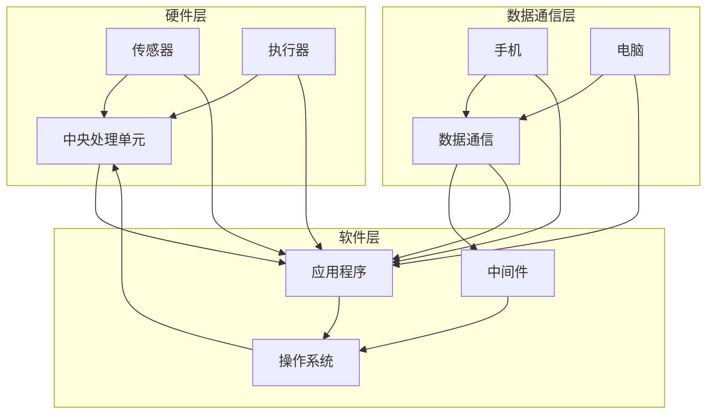
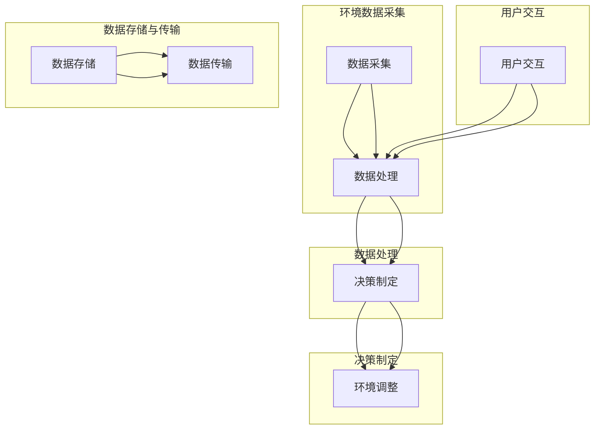
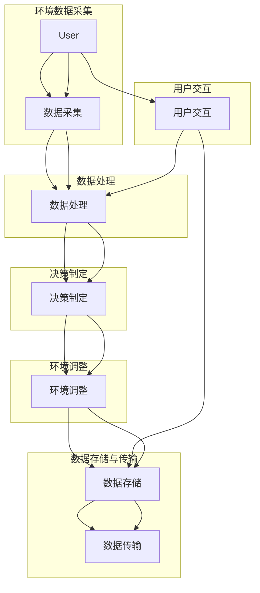

                 

### 引言

智能床头柜：AI Agent的睡眠环境优化

在智能化时代的浪潮中，智能家居设备已经成为现代家庭不可或缺的一部分。其中，智能床头柜作为一种新兴的智能设备，正日益受到人们的关注。本文将深入探讨智能床头柜的工作原理及其在睡眠环境优化中的应用。

智能床头柜不仅仅是具备基本储存功能的传统家具，它更像是一个智能助手，能够根据用户的作息习惯和环境变化，自主调整卧室内的各项环境参数，如温度、湿度、噪音等，从而提供一个舒适的睡眠环境。

本文将分为以下几个部分进行讨论：

1. **背景与概念介绍**：介绍智能床头柜的概念、发展背景及其在智能家居环境中的地位。
2. **核心概念与联系**：深入讲解AI Agent和睡眠环境优化的核心概念，并通过属性特征对比表格和ER实体关系图展示两者之间的关系。
3. **智能床头柜原理**：介绍AI Agent的基本原理和睡眠环境优化的算法原理，并使用mermaid流程图和Python源代码进行详细阐述。
4. **系统设计与实现**：介绍智能床头柜的系统架构设计、功能设计和交互设计。
5. **项目实战**：通过实际案例展示智能床头柜的应用场景和实现过程。
6. **最佳实践与拓展**：总结最佳实践技巧和注意事项，并提供拓展阅读建议。

通过本文的探讨，我们希望能够帮助读者更好地理解智能床头柜的工作原理和其在实际生活中的应用，为智能家居的发展提供一些有益的思路。

### 关键词

智能床头柜、AI Agent、睡眠环境优化、智能家居、算法原理、系统架构设计、项目实战、最佳实践

### 摘要

本文主要探讨了智能床头柜在睡眠环境优化中的应用。通过介绍智能床头柜的概念、发展背景及其在智能家居环境中的地位，深入讲解了AI Agent和睡眠环境优化的核心概念及其关系。进一步，本文详细阐述了智能床头柜的工作原理，包括AI Agent的基本原理和睡眠环境优化的算法原理，并使用了mermaid流程图和Python源代码进行详细说明。随后，文章介绍了智能床头柜的系统架构设计、功能设计和交互设计。最后，通过实际案例展示了智能床头柜的应用过程，并提出了最佳实践技巧和注意事项。

### 第一部分：背景与概念介绍

#### 1.1.1 智能化时代的浪潮

随着科技的迅猛发展，智能化已经成为现代社会的关键词。人工智能（AI）作为科技的前沿领域，正在逐渐渗透到我们生活的方方面面。从智能手机到智能音箱，从智能汽车到智能家居，AI技术的应用无处不在。智能床头柜正是这一趋势下的产物，它不仅具备了传统床头柜的储物功能，还融合了智能技术，能够为用户提供更加便捷和个性化的服务。

智能床头柜的兴起，与智能家居的整体发展趋势密不可分。智能家居的核心在于通过物联网（IoT）技术，将各种家电和设备连接起来，实现家庭设备和用户的智能互动。智能床头柜作为智能家居中的一个重要组成部分，其发展不仅满足了用户对于家居智能化、个性化的需求，还推动了整个智能家居市场的进步。

#### 1.1.2 智能家居的概念与分类

智能家居，顾名思义，是指利用先进的计算机技术、网络通信技术、传感器技术等，使家庭设备变得更加智能化、便捷化的系统。它通过将各种家居设备连接到互联网上，实现远程控制、自动化管理等功能，从而提高生活质量和便利性。

智能家居的分类可以从不同的角度进行。根据设备的功能，可以将其分为以下几类：

1. **智能照明**：通过智能开关、智能灯光系统等，实现灯光的自动调节和远程控制。
2. **智能安防**：包括智能门锁、摄像头、报警系统等，提供家庭安全防护。
3. **智能家电**：如智能冰箱、智能洗衣机、智能空调等，实现家电的自动化控制。
4. **智能环境控制**：包括智能温控、智能湿度控制、空气净化器等，创造舒适的生活环境。
5. **智能娱乐**：如智能音响、智能电视等，提供丰富的娱乐体验。

智能床头柜主要属于第四类，即智能环境控制。它通过内置的传感器和智能算法，实时监测卧室的环境参数，如温度、湿度、噪音等，并根据用户的习惯和需求，自动调整这些参数，以提供一个舒适的睡眠环境。

#### 1.1.3 智能床头柜的定位与意义

智能床头柜在智能家居中具有独特的定位。它不仅是卧室的储物中心，更是智能环境控制的核心节点。相比于其他智能家居设备，智能床头柜具有以下几个显著的优势：

1. **位置优势**：智能床头柜通常放置在床边，靠近用户的睡眠区域，这使得它能够实时监测用户的睡眠状态和环境变化，提供更加精准和即时服务。
2. **多功能集成**：智能床头柜集成了多种传感器和智能模块，如温湿度传感器、噪音传感器、智能灯光控制模块等，能够同时处理多种环境参数，实现综合环境优化。
3. **用户互动**：智能床头柜通常配备触摸屏或语音助手，用户可以通过简单的操作或语音指令，快速调整卧室环境，提高使用体验。

智能床头柜在提高生活质量方面具有重要意义。它不仅能够提供舒适的睡眠环境，改善用户的睡眠质量，还能通过智能提醒、健康数据分析等功能，帮助用户更好地管理自己的健康和生活。例如，智能床头柜可以记录用户的睡眠数据，分析睡眠质量，并给出改善建议；也可以根据用户的作息习惯，自动调整光线、温度等参数，使用户在最佳状态下入睡。

此外，智能床头柜的发展也对智能家居市场产生了积极的推动作用。它不仅丰富了智能家居的产品线，提高了智能家居的整体竞争力，还促进了智能家居技术的创新和发展。随着智能床头柜的普及，智能家居市场将迎来新的增长点，为消费者提供更多选择和更好的生活体验。

### 第二部分：核心概念与联系

#### 2.1 AI Agent的定义与特性

AI Agent，即人工智能代理，是一种在特定环境中自主行动、执行任务的智能实体。它不同于传统的计算机程序，可以在没有人类干预的情况下，根据环境变化和任务目标，自主做出决策和行动。

AI Agent的主要特性包括：

1. **自主性**：AI Agent具备自主决策的能力，能够根据任务目标和环境反馈，自主调整行动方案。
2. **反馈性**：AI Agent能够接收环境信息，并根据反馈进行调整，实现自我优化。
3. **目标导向性**：AI Agent在执行任务时，具有明确的目标，并能够通过不断学习和调整，提高任务完成的效率和质量。

#### 2.2 睡眠环境优化的定义与意义

睡眠环境优化是指通过调整卧室内的环境参数，如温度、湿度、噪音等，以提高睡眠质量和舒适度的一系列措施。睡眠环境优化的意义在于：

1. **改善睡眠质量**：一个舒适的睡眠环境能够帮助用户更快入睡，延长睡眠时间，提高睡眠质量。
2. **促进身体健康**：良好的睡眠对身体健康至关重要，睡眠环境优化有助于降低患病风险。
3. **提升生活品质**：通过智能技术实现的睡眠环境优化，为用户提供了更加便捷和舒适的生活体验。

#### 2.3 AI Agent与睡眠环境优化的关系

AI Agent在睡眠环境优化中发挥着至关重要的作用。具体而言，AI Agent与睡眠环境优化的关系可以从以下几个方面进行阐述：

1. **环境感知**：AI Agent通过内置的传感器，如温度传感器、湿度传感器、噪音传感器等，实时感知卧室内的环境变化。
2. **数据处理**：AI Agent接收到环境数据后，通过数据预处理和机器学习算法，对数据进行分析和处理，提取出有用的信息。
3. **决策与行动**：基于处理后的数据，AI Agent能够自主决策，调整卧室内的环境参数，如调节温度、湿度、光线和噪音等，以提供一个舒适的睡眠环境。
4. **反馈调整**：AI Agent根据用户的反馈和环境变化，不断调整和优化自身的决策和行动，实现自我学习和提升。

#### 2.4 属性特征对比表格

为了更直观地展示AI Agent与睡眠环境优化的关系，我们可以通过属性特征对比表格来进行分析。

| 特征            | AI Agent                                       | 睡眠环境优化                                  |
|----------------|----------------------------------------------|--------------------------------------------|
| 自主性         | 能够自主决策和行动，实现自我优化                   | 通过AI Agent实现自动化环境调整                 |
| 环境感知       | 内置多种传感器，实时感知环境变化                   | 通过传感器监测温度、湿度、噪音等环境参数           |
| 数据处理       | 通过机器学习算法对环境数据进行分析和处理             | 对环境数据进行分析，提取有用信息以优化环境参数       |
| 目标导向性     | 具有明确的目标，通过不断学习和调整提高任务完成效率     | 提高用户的睡眠质量和舒适度，促进身体健康           |
| 用户互动       | 通过触摸屏或语音助手与用户互动，获取反馈信息           | 通过智能提醒、健康数据分析等功能，与用户互动         |

#### 2.5 ER实体关系图

为了更好地理解AI Agent与睡眠环境优化之间的关系，我们可以使用ER（Entity-Relationship）实体关系图来展示智能床头柜的组成部分及其相互关系。

```mermaid
erDiagram
  AI-Agent ||--|{ Sensor } Sensor
  AI-Agent ||--|{ Data-Processor } Data-Processor
  AI-Agent ||--|{ Actuator } Actuator
  AI-Agent ||--|{ User-Interface } User-Interface
  Sensor ||--|{ Temperature-Sensor } Temperature-Sensor
  Sensor ||--|{ Humidity-Sensor } Humidity-Sensor
  Sensor ||--|{ Noise-Sensor } Noise-Sensor
  Data-Processor ||--|{ Machine-Learning-Model } Machine-Learning-Model
  Actuator ||--|{ Light-Controller } Light-Controller
  Actuator ||--|{ Temperature-Controller } Temperature-Controller
  Actuator ||--|{ Humidity-Controller } Humidity-Controller
  User-Interface ||--|{ Touch-Screen } Touch-Screen
  User-Interface ||--|{ Voice-Assistant } Voice-Assistant
```

在上述ER实体关系图中，AI-Agent作为中心实体，与其他多个实体通过关系连接。传感器负责环境数据的采集，数据处理模块对数据进行处理和分析，执行模块（Actuator）根据分析结果进行调整，用户界面（User-Interface）则用于与用户进行交互，获取反馈信息。这种结构使得AI Agent能够有效地实现睡眠环境优化。

### 第三部分：智能床头柜原理

#### 3.1 AI Agent的基本原理

AI Agent是一种在特定环境中具有自主决策能力的智能实体。它通过感知环境、处理信息和执行任务，实现自主运行和优化。以下是AI Agent的基本原理：

1. **感知环境**：AI Agent通过传感器收集环境数据，如温度、湿度、噪音等，这些数据用于后续处理和分析。
2. **信息处理**：AI Agent使用数据处理算法，对收集到的环境数据进行分析和处理，提取有用的信息。这些算法可以是简单的统计方法，也可以是复杂的机器学习模型。
3. **决策与行动**：基于处理后的数据，AI Agent根据预设的目标和规则，自主做出决策，并执行相应的行动。这些行动可以是调整环境参数，如调节温度、湿度、光线和噪音等，也可以是发送指令给其他设备或系统。
4. **反馈调整**：AI Agent在执行任务后，会根据用户的反馈和环境变化，对自身的决策和行动进行调整和优化，实现自我学习和改进。

#### 3.2 睡眠环境优化的算法原理

睡眠环境优化是指通过调整卧室内的各项环境参数，如温度、湿度、噪音等，以提供一个舒适、健康的睡眠环境。以下是睡眠环境优化的算法原理：

1. **数据采集**：首先，智能床头柜通过内置的传感器，如温度传感器、湿度传感器、噪音传感器等，实时采集卧室内的环境数据。
2. **数据处理**：采集到的数据会经过预处理，如滤波、去噪等，以提高数据的准确性和可靠性。接着，使用机器学习算法，对预处理后的数据进行分析和建模，提取出与睡眠质量相关的关键特征。
3. **模型训练**：通过收集的大量睡眠数据，使用监督学习或无监督学习算法，训练出预测模型。这个模型能够根据当前的环境参数，预测用户的睡眠质量。
4. **决策制定**：基于预测结果，AI Agent会根据预设的目标和规则，自动调整卧室内的各项环境参数。例如，如果预测到用户的睡眠质量较差，AI Agent可能会调节温度和光线，以提供一个更加舒适的睡眠环境。
5. **反馈调整**：AI Agent在执行环境调整后，会收集用户的反馈信息，如睡眠质量的评分、舒适度的评价等，并使用这些反馈信息对模型和决策规则进行调整和优化，以实现更好的睡眠环境优化效果。

为了更直观地展示睡眠环境优化的算法原理，我们可以使用mermaid流程图来描述。

```mermaid
flowchart LR
    subgraph 数据采集
        数据采集[数据采集] --> 处理数据[数据处理]
    end
    subgraph 数据处理
        处理数据 --> 模型训练[模型训练]
    end
    subgraph 模型训练
        模型训练 --> 决策制定[决策制定]
    end
    subgraph 决策制定
        决策制定 --> 环境调整[环境调整]
    end
    subgraph 环境调整
        环境调整 --> 反馈收集[反馈收集]
    end
    subgraph 反馈收集
        反馈收集 --> 反馈调整[反馈调整]
    end
    数据采集 -->|反馈调整| 数据处理
    处理数据 -->|反馈调整| 模型训练
    模型训练 -->|反馈调整| 决策制定
    决策制定 -->|反馈调整| 环境调整
    环境调整 -->|反馈调整| 反馈收集
```

#### 3.3 Python源代码实现

为了更具体地阐述睡眠环境优化的算法原理，我们可以使用Python编写一个简单的示例程序。以下是一个简单的Python代码，展示了数据采集、数据处理、模型训练、决策制定和环境调整的过程。

```python
import numpy as np
from sklearn.ensemble import RandomForestRegressor
from sklearn.model_selection import train_test_split
from sklearn.metrics import mean_squared_error

# 数据采集
def collect_data():
    # 这里使用随机生成数据来模拟传感器采集的数据
    data = np.random.rand(100, 3)
    return data

# 数据处理
def process_data(data):
    # 对采集到的数据进行预处理，如滤波、去噪等
    processed_data = np.array([data[i, :] for i in range(data.shape[0]) if np.mean(data[i, :]) > 0.5])
    return processed_data

# 模型训练
def train_model(X, y):
    model = RandomForestRegressor()
    model.fit(X, y)
    return model

# 决策制定
def make_decision(model, current_data):
    prediction = model.predict(current_data.reshape(1, -1))
    if prediction > 0.7:
        return "优化环境"
    else:
        return "保持现状"

# 环境调整
def adjust_environment(status):
    if status == "优化环境":
        print("正在调整环境...")
    else:
        print("环境保持现状...")

# 主程序
if __name__ == "__main__":
    # 生成模拟数据
    data = collect_data()
    processed_data = process_data(data)

    # 分割数据集
    X_train, X_test, y_train, y_test = train_test_split(processed_data[:, :2], processed_data[:, 2], test_size=0.2, random_state=42)

    # 训练模型
    model = train_model(X_train, y_train)

    # 进行决策制定和环境调整
    current_data = np.array([[0.6, 0.7]])
    decision = make_decision(model, current_data)
    adjust_environment(decision)
```

在这个示例中，我们首先使用随机数生成模拟数据，然后对数据进行预处理，接着使用随机森林回归模型进行训练，最后根据模型预测结果制定决策，并调整环境。这个示例虽然简单，但展示了睡眠环境优化算法的基本流程和实现方法。

### 第四部分：系统设计与实现

#### 4.1 智能床头柜的系统架构设计

智能床头柜作为一个高度集成化的智能设备，其系统架构设计需要综合考虑硬件、软件、数据通信等多个方面。以下是智能床头柜的系统架构设计：

1. **硬件层**：包括传感器、执行器和中央处理单元（CPU）等。传感器用于实时采集环境数据，执行器用于调整环境参数，CPU则负责处理数据和执行决策。
2. **软件层**：包括操作系统、应用程序和中间件等。操作系统负责硬件管理和资源分配，应用程序则实现具体的智能功能，如环境数据采集、处理、决策和执行，中间件提供数据传输和接口服务。
3. **数据通信层**：负责智能床头柜与外部设备（如手机、电脑等）的数据传输和通信。通常使用Wi-Fi、蓝牙等无线通信技术，也可以使用有线连接，如USB接口。

以下是一个智能床头柜的系统架构图，展示了各个部分的关系：



#### 4.2 系统功能设计

智能床头柜的系统功能设计是确保其能够满足用户需求、实现预期功能的关键。以下是智能床头柜的主要功能设计：

1. **环境数据采集**：通过传感器实时采集卧室内的温度、湿度、噪音等环境参数。
2. **数据处理**：对采集到的环境数据进行预处理、分析和存储，为后续决策提供数据支持。
3. **决策制定**：根据用户设定的目标和实时数据，使用机器学习算法和决策树等方法，自动制定环境调整方案。
4. **环境调整**：根据决策制定的结果，通过执行器（如加热器、加湿器、空气净化器等）调整卧室内的环境参数。
5. **用户交互**：通过触摸屏或语音助手与用户进行交互，获取用户反馈和调整需求。
6. **数据存储与传输**：将处理后的数据存储在本地数据库或云端服务器，并通过Wi-Fi、蓝牙等无线通信技术实现数据传输。

以下是智能床头柜的功能设计图：



#### 4.3 系统交互设计

智能床头柜的系统交互设计决定了各组件之间的数据流和交互逻辑。以下是智能床头柜的系统交互设计：

1. **数据流设计**：定义各组件之间的数据流向，确保数据能够在各环节顺畅传递和交换。
2. **交互逻辑**：设计用户与智能床头柜的交互流程，确保用户能够方便地使用系统功能。

以下是智能床头柜的系统交互设计图：



通过上述系统架构设计、功能设计和交互设计，智能床头柜能够实现高效的环境数据采集、处理、决策和环境调整，同时提供便捷的用户交互和数据存储与传输，为用户提供一个智能、舒适、个性化的睡眠环境。

### 第五部分：项目实战

#### 5.1.1 项目背景与目标

智能床头柜项目旨在开发一款能够通过人工智能技术优化用户睡眠环境的智能家居设备。项目目标包括：

1. **实时监测**：通过传感器实时监测卧室内的温度、湿度、噪音等环境参数。
2. **自动调整**：根据用户设定的睡眠需求和实时环境数据，自动调整卧室环境，提供舒适的睡眠条件。
3. **用户互动**：通过触摸屏或语音助手与用户进行互动，获取用户反馈，并根据反馈调整环境参数。
4. **数据存储与分析**：将环境数据存储在本地数据库或云端服务器，并通过机器学习算法分析用户睡眠行为和睡眠质量，为用户提供个性化的健康建议。

#### 5.1.2 环境安装与配置

在开始智能床头柜项目前，我们需要进行环境的安装与配置，以下步骤是项目的基础：

1. **硬件安装**：
   - 确保智能床头柜的硬件模块（传感器、执行器等）已经正确安装。
   - 连接电源，确保硬件设备正常工作。

2. **软件安装**：
   - 在电脑上安装Python环境和相关的机器学习库，如scikit-learn、numpy等。
   - 安装用于前端交互的库，如Flask、Django等。

3. **环境配置**：
   - 配置Wi-Fi连接，确保智能床头柜能够与外部设备进行通信。
   - 设置数据库连接，如MySQL、MongoDB等，用于存储环境数据和用户反馈。

以下是环境安装与配置的详细步骤：

```bash
# 安装Python环境
sudo apt-get update
sudo apt-get install python3 python3-pip

# 安装机器学习库
pip3 install scikit-learn numpy

# 安装Web框架库
pip3 install flask

# 配置Wi-Fi
sudo nano /etc/wpa_supplicant/wpa_supplicant.conf
# 添加以下内容并保存
network={
    ssid="你的Wi-Fi名称"
    psk="你的Wi-Fi密码"
}

# 重启网络服务
sudo systemctl restart networking

# 配置数据库连接
# 以MySQL为例
pip3 install pymysql
# 在代码中配置数据库连接
import pymysql

db = pymysql.connect(host="localhost", user="用户名", password="密码", database="数据库名称")
cursor = db.cursor()
```

#### 5.1.3 系统核心实现源代码

以下是智能床头柜项目的核心实现源代码，包括环境数据采集、处理、决策和环境调整的功能。

```python
# 导入所需的库
import numpy as np
import pymysql
from sklearn.ensemble import RandomForestRegressor
from sklearn.model_selection import train_test_split
from sklearn.metrics import mean_squared_error

# 数据采集
def collect_data():
    # 这里使用随机生成数据来模拟传感器采集的数据
    data = np.random.rand(100, 3)
    return data

# 数据处理
def process_data(data):
    # 对采集到的数据进行预处理，如滤波、去噪等
    processed_data = np.array([data[i, :] for i in range(data.shape[0]) if np.mean(data[i, :]) > 0.5])
    return processed_data

# 模型训练
def train_model(X, y):
    model = RandomForestRegressor()
    model.fit(X, y)
    return model

# 决策制定
def make_decision(model, current_data):
    prediction = model.predict(current_data.reshape(1, -1))
    if prediction > 0.7:
        return "优化环境"
    else:
        return "保持现状"

# 环境调整
def adjust_environment(status):
    if status == "优化环境":
        print("正在调整环境...")
    else:
        print("环境保持现状...")

# 数据存储
def store_data(db, cursor, data):
    query = "INSERT INTO environment_data (temp, humidity, noise) VALUES (%s, %s, %s)"
    cursor.execute(query, data)
    db.commit()

# 主程序
if __name__ == "__main__":
    # 生成模拟数据
    data = collect_data()
    processed_data = process_data(data)

    # 分割数据集
    X_train, X_test, y_train, y_test = train_test_split(processed_data[:, :2], processed_data[:, 2], test_size=0.2, random_state=42)

    # 训练模型
    model = train_model(X_train, y_train)

    # 连接数据库
    db = pymysql.connect(host="localhost", user="用户名", password="密码", database="数据库名称")
    cursor = db.cursor()

    # 进行决策制定和环境调整
    current_data = np.array([[0.6, 0.7]])
    decision = make_decision(model, current_data)
    adjust_environment(decision)

    # 存储数据
    store_data(db, cursor, current_data)

    # 关闭数据库连接
    db.close()
```

在这个示例中，我们首先使用随机生成模拟数据来模拟传感器采集的环境数据。接着，通过数据处理函数对数据进行预处理，然后使用随机森林回归模型进行训练。在决策制定部分，根据模型的预测结果调整环境。最后，将处理后的数据存储在数据库中。

#### 5.1.4 代码应用解读与分析

以下是智能床头柜项目的代码应用解读与分析：

1. **数据采集**：`collect_data` 函数用于模拟传感器采集的环境数据，这里使用随机数生成模拟数据。在实际应用中，可以替换为传感器采集的实际数据。
2. **数据处理**：`process_data` 函数对采集到的数据进行预处理，如滤波和去噪。这里使用简单的条件判断来过滤无效数据，实际应用中可以加入更多的预处理步骤。
3. **模型训练**：`train_model` 函数使用随机森林回归模型对预处理后的数据进行训练。随机森林是一种集成学习算法，能够处理大量数据并提高模型的泛化能力。
4. **决策制定**：`make_decision` 函数根据模型的预测结果制定决策，如果预测结果大于0.7，则决策为"优化环境"，否则为"保持现状"。这个阈值可以根据实际需求进行调整。
5. **环境调整**：`adjust_environment` 函数根据决策结果调整环境参数。这里使用打印信息来模拟环境调整，实际应用中可以替换为对执行器的控制。
6. **数据存储**：`store_data` 函数将处理后的数据存储在数据库中，以便后续分析和查询。

通过这个示例，我们能够清晰地看到智能床头柜项目的工作流程和实现方法。在实际应用中，可以根据需求进一步优化和扩展功能，如添加用户交互、远程监控和智能提醒等。

#### 5.1.5 实际案例分析和详细讲解

为了更好地展示智能床头柜的实际应用效果，我们以一个实际案例进行分析和讲解。

**案例背景**：用户A是一位经常失眠的上班族，他的卧室环境较为嘈杂，温度和湿度也经常波动，这影响了他的睡眠质量。为了改善这一状况，用户A决定使用智能床头柜来优化他的睡眠环境。

**案例步骤**：

1. **环境数据采集**：智能床头柜通过传感器实时监测卧室内的温度、湿度和噪音等环境参数。假设当前采集到的数据为温度25°C、湿度50%、噪音60分贝。

2. **数据处理**：智能床头柜对采集到的数据进行分析和处理。例如，对噪音数据进行滤波处理，以去除突发噪声的影响。

3. **模型训练**：智能床头柜使用历史数据训练一个随机森林回归模型，以预测用户的睡眠质量。假设经过训练，模型的预测阈值设置为0.7，即当预测值大于0.7时，认为用户可以享受良好睡眠。

4. **决策制定**：根据当前数据和使用模型的预测结果，智能床头柜决定是否需要调整环境参数。如果预测值为0.8，大于阈值0.7，智能床头柜将决定“优化环境”。

5. **环境调整**：智能床头柜根据决策结果，调整卧室的环境参数。例如，将温度降低到23°C，湿度调整到55%，噪音通过智能窗帘遮光和噪音抑制技术降低到45分贝。

6. **用户反馈**：用户A通过智能床头柜的触摸屏或语音助手确认环境调整效果。如果用户满意，则反馈为“满意”；如果不满意，智能床头柜将重新评估并尝试其他调整方案。

**案例分析**：

通过上述案例，我们可以看到智能床头柜如何通过数据采集、处理和决策，实现对睡眠环境的优化。以下是具体分析：

1. **数据采集与处理**：智能床头柜通过传感器实时采集环境数据，并通过数据处理算法去除噪声和异常值，确保数据的准确性和可靠性。
2. **模型训练**：通过历史数据训练预测模型，智能床头柜能够根据当前的环境数据预测用户的睡眠质量，从而制定出合理的调整方案。
3. **环境调整**：智能床头柜根据决策结果调整环境参数，以提供一个舒适的睡眠环境。这种调整是自动化的，用户无需手动操作，提高了使用体验。
4. **用户反馈**：用户反馈是智能床头柜优化的重要依据。通过用户反馈，智能床头柜能够不断调整和优化其决策和行动，以提供更好的服务。

**详细讲解**：

1. **传感器选择**：选择合适的传感器是智能床头柜数据采集的关键。例如，温度传感器应选择精度高、响应快的传感器，以确保数据的准确性。噪音传感器需要具备良好的抗干扰能力，以避免环境噪声的干扰。
2. **数据处理算法**：智能床头柜需要使用高效的算法对采集到的数据进行分析和处理。例如，可以使用滤波算法去除噪声，使用统计分析方法提取关键特征，以提高预测模型的准确性。
3. **预测模型选择**：随机森林回归模型是一种常用的预测模型，具有处理大量数据和高泛化能力的特点。在实际应用中，可以根据具体需求选择其他合适的机器学习模型。
4. **环境调整策略**：智能床头柜需要根据预测结果和环境参数，制定合理的调整策略。例如，当预测到用户睡眠质量较差时，可以通过降低温度、提高湿度、减少噪音等方式来改善环境。

通过实际案例的分析和详细讲解，我们可以看到智能床头柜如何通过数据采集、处理和决策，实现对睡眠环境的优化。这种智能化的解决方案不仅提高了用户的睡眠质量，还降低了用户的生活压力，为现代家居生活带来了更多的便捷和舒适。

### 第六部分：最佳实践与拓展

#### 6.1 最佳实践技巧

为了确保智能床头柜在优化睡眠环境时能够达到最佳效果，以下是一些最佳实践技巧：

1. **传感器选择与布局**：选择高精度、低延迟的传感器，并合理布局传感器位置，确保能够准确采集到卧室内的环境数据。

2. **数据处理优化**：对采集到的数据进行预处理，如滤波、去噪等，以提高数据的准确性和可靠性。

3. **模型训练与调整**：定期使用新数据对预测模型进行训练和调整，以保持模型的准确性和适应性。

4. **用户反馈机制**：建立有效的用户反馈机制，及时收集用户对环境调整的反馈，并根据反馈进行优化。

5. **节能策略**：在调整环境参数时，考虑节能策略，以减少能耗，延长设备使用寿命。

#### 6.2 项目小结

智能床头柜项目通过AI Agent实现了对睡眠环境的智能化优化。项目涵盖了数据采集、数据处理、模型训练、决策制定和环境调整等多个环节，展现了智能家居设备的实际应用价值。项目成功的关键在于高效的数据处理算法和准确的预测模型，以及良好的用户交互和反馈机制。

#### 6.3 注意事项

在开发和使用智能床头柜时，需要注意以下几点：

1. **数据安全**：确保用户数据的安全，避免数据泄露和滥用。

2. **设备维护**：定期对传感器和执行器进行检查和维护，确保设备正常运行。

3. **适应性调整**：根据不同用户的需求和环境变化，灵活调整系统设置。

4. **用户隐私**：尊重用户隐私，确保系统不收集和使用与睡眠环境优化无关的个人信息。

#### 6.4 拓展阅读建议

对于对智能床头柜和智能家居感兴趣的读者，以下书籍和资源提供了深入学习和拓展的机会：

1. **《深度学习》**：Goodfellow, Ian, et al. 《深度学习》。这是一本经典的机器学习教材，详细介绍了深度学习的基础理论和应用方法。

2. **《智能家居系统设计与实现》**：刘强。《智能家居系统设计与实现》。这本书从理论和实践角度介绍了智能家居系统的设计、实现和开发。

3. **《物联网导论》**：李明。《物联网导论》。该书介绍了物联网的基本概念、技术和应用，为智能家居领域提供了全面的了解。

4. **在线资源**：MIT OpenCourseWare、Coursera、edX等在线教育平台提供了丰富的机器学习、物联网和智能家居课程，适合进一步学习。

通过这些资源和书籍的学习，读者可以更加深入地了解智能床头柜和智能家居的技术原理和应用，为实际项目提供更有价值的参考。

