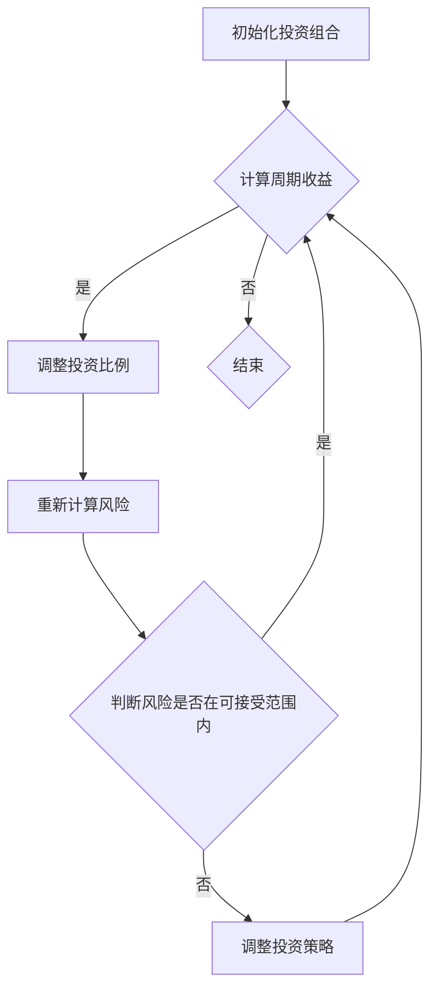
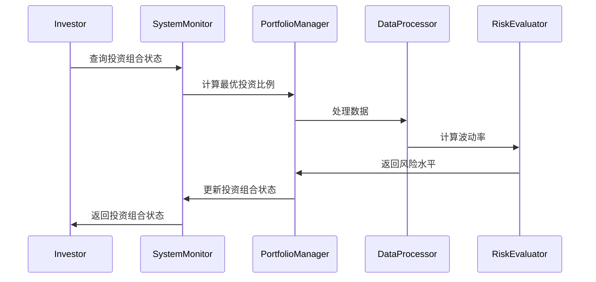

                 

## 文章标题

### 摘要

智能投资组合多周期再平衡策略是金融科技领域的一项重要技术，它通过在不同时间周期内对投资组合进行调整，以实现最优的投资收益和风险控制。本文将详细探讨智能投资组合的背景与定义、多周期再平衡策略的原理和实施方法，并结合实际案例进行深入剖析，为投资者提供有价值的参考。

## 文章关键词

智能投资组合、多周期再平衡、算法原理、数学模型、系统架构、项目实战、最佳实践。

### 引言

在金融市场中，投资组合的管理是一个复杂且持续的过程。传统的投资组合管理往往基于短期市场趋势进行操作，而忽略了长期投资目标和风险控制。随着人工智能和大数据技术的快速发展，智能投资组合的概念逐渐兴起，通过算法和数据分析，实现更加精准和高效的资产管理。多周期再平衡策略作为智能投资组合的重要组成部分，能够更好地适应市场波动，提高投资组合的稳定性和收益。

本文旨在通过对智能投资组合多周期再平衡策略的深入探讨，帮助读者了解其基本概念、算法原理、数学模型和系统实现方法，从而为实际投资提供理论支持和实践指导。

### 第一部分：智能投资组合概述

#### 第1章：智能投资组合背景与定义

##### 1.1.1 投资组合的起源与发展

投资组合管理起源于20世纪50年代，随着现代金融理论和数学模型的不断发展，投资组合理论逐渐成熟。传统投资组合主要依靠经验判断和统计分析，而现代投资组合则强调通过量化分析和算法优化来实现投资目标。

##### 1.1.2 智能投资组合的概念

智能投资组合是指利用人工智能和大数据技术对投资进行管理和调整，通过机器学习算法对市场数据进行分析，从而实现投资决策的智能化。智能投资组合不仅能够提高投资效率，还能在一定程度上降低风险。

##### 1.1.3 智能投资组合与传统投资组合的比较

与传统投资组合相比，智能投资组合具有更高的灵活性和适应性，能够实时调整投资策略，以应对市场变化。同时，智能投资组合还具备更强的数据分析能力和预测能力，能够在复杂的市场环境中实现更好的收益。

#### 第2章：智能投资组合的核心概念与联系

##### 2.1.1 资产配置

资产配置是投资组合管理的重要环节，涉及在不同资产类别之间进行投资比例的分配。合理的资产配置能够提高投资组合的收益稳定性。

##### 2.1.2 风险管理

风险管理是投资组合管理的重要目标之一，通过合理的风险控制措施，确保投资组合在面临市场波动时能够保持稳定。

##### 2.1.3 投资目标

投资目标是投资者在投资过程中追求的最终结果，包括收益最大化、风险最小化等。智能投资组合能够根据投资者的需求，制定个性化的投资目标。

##### 2.1.4 概念属性特征对比表格

表1：智能投资组合与传统投资组合属性特征对比

| 属性特征 | 智能投资组合 | 传统投资组合 |
| :------: | :----------: | :----------: |
| 数据分析 | 强大 | 有限 |
| 算法优化 | 高效 | 低效 |
| 风险控制 | 先进 | 传统 |
| 适应性 | 高 | 低 |

##### 2.1.5 ER实体关系图架构的 Mermaid 流程图

```mermaid
erDiagram
  Customer ||--|{ Order }|>
  "1000"  : 1
  Product ||--|{ Order }|>
  "1000"  : 1
  Order ||--|{ OrderLine }|>
  "1"     : N
  OrderLine ||--|{ Product }|>
  "1"     : 1
```

### 第二部分：多周期再平衡策略

#### 第3章：多周期再平衡策略概述

##### 3.1.1 多周期再平衡的概念

多周期再平衡是指在不同时间周期内对投资组合进行调整，以实现最优的投资收益和风险控制。常见的周期包括日、周、月、季等。

##### 3.1.2 多周期再平衡的优势

- 更好地适应市场波动
- 提高投资组合的稳定性
- 实现长期投资目标

##### 3.1.3 多周期再平衡的挑战

- 周期选择的准确性
- 数据的实时性和准确性
- 风险管理的复杂性

#### 第4章：多周期再平衡策略的算法原理

##### 4.1.1 算法mermaid流程图



##### 4.1.2 Python源代码详细阐述

```python
# 初始化投资组合
portfolio = {'Stock': 0.6, 'Bond': 0.4}

# 计算周期收益
def calculate_returns(portfolio):
    stock_return = 0.05
    bond_return = 0.03
    return (stock_return * portfolio['Stock']) + (bond_return * portfolio['Bond'])

# 调整投资比例
def rebalance_portfolio(portfolio, target_portfolio):
    for asset, target_weight in target_portfolio.items():
        current_weight = portfolio[asset]
        weight_difference = target_weight - current_weight
        portfolio[asset] += weight_difference

# 重新计算风险
def recalculate_risk(portfolio):
    # 计算投资组合的波动率
    pass

# 判断风险是否在可接受范围内
def is_risk_acceptable(risk_level, acceptable_risk):
    return risk_level <= acceptable_risk

# 调整投资策略
def adjust_strategy(portfolio, risk_level):
    # 根据风险水平调整投资组合
    pass

# 实现多周期再平衡策略
def multi周期的再平衡策略(portfolio, target_portfolio, acceptable_risk):
    while True:
        returns = calculate_returns(portfolio)
        rebalance_portfolio(portfolio, target_portfolio)
        risk_level = recalculate_risk(portfolio)
        if is_risk_acceptable(risk_level, acceptable_risk):
            break
        else:
            adjust_strategy(portfolio, risk_level)

# 示例
target_portfolio = {'Stock': 0.55, 'Bond': 0.45}
acceptable_risk = 0.05
multi周期的再平衡策略(portfolio, target_portfolio, acceptable_risk)
```

##### 4.1.3 算法原理的数学模型和公式

- 投资组合收益：\( R = w_1R_1 + w_2R_2 + ... + w_nR_n \)

  其中，\( w_i \) 为资产 \( i \) 的权重，\( R_i \) 为资产 \( i \) 的预期收益。

- 投资组合风险：\( \sigma = \sqrt{w_1^2\sigma_1^2 + w_2^2\sigma_2^2 + ... + w_n^2\sigma_n^2 + 2w_1w_2\sigma_1\sigma_2\rho_{12}} \)

  其中，\( \sigma_i \) 为资产 \( i \) 的波动率，\( \rho_{12} \) 为资产 \( i \) 和资产 \( j \) 之间的相关性。

##### 4.1.4 举例说明

假设投资者拥有一个由股票和债券组成的投资组合，初始投资比例为 60% 股票和 40% 债券。目标投资组合为 55% 股票和 45% 债券。在一个月内，股票收益率为 5%，债券收益率为 3%。投资者希望通过多周期再平衡策略调整投资组合，使其达到目标投资比例。

初始投资组合：\( \{Stock: 0.6, Bond: 0.4\} \)

目标投资组合：\( \{Stock: 0.55, Bond: 0.45\} \)

- 计算周期收益：\( R = (0.6 \times 0.05) + (0.4 \times 0.03) = 0.038 \)
- 调整投资比例：\( Stock: 0.6 + (0.55 - 0.6) = 0.5 \)，\( Bond: 0.4 + (0.45 - 0.4) = 0.5 \)
- 重新计算风险：假设股票和债券的波动率分别为 0.2 和 0.1，相关性为 0.5，则投资组合的波动率为 \( \sigma = \sqrt{0.5^2 \times 0.2^2 + 0.5^2 \times 0.1^2 + 2 \times 0.5 \times 0.5 \times 0.2 \times 0.1 \times 0.5} = 0.13 \)
- 判断风险是否在可接受范围内：假设可接受风险为 0.15，则风险在可接受范围内，不再进行调整。

通过多周期再平衡策略，投资者最终实现了目标投资组合，并保持了较低的风险水平。

### 第三部分：智能投资组合多周期再平衡策略项目实战

#### 第5章：多周期再平衡策略的数学模型与公式

##### 5.1.1 数学公式讲解

投资组合的预期收益和波动率计算公式如下：

- 预期收益：\( R = w_1R_1 + w_2R_2 + ... + w_nR_n \)
- 波动率：\( \sigma = \sqrt{w_1^2\sigma_1^2 + w_2^2\sigma_2^2 + ... + w_n^2\sigma_n^2 + 2w_1w_2\sigma_1\sigma_2\rho_{12}} \)

其中，\( w_i \) 为资产 \( i \) 的权重，\( R_i \) 为资产 \( i \) 的预期收益，\( \sigma_i \) 为资产 \( i \) 的波动率，\( \rho_{12} \) 为资产 \( i \) 和资产 \( j \) 之间的相关性。

##### 5.1.2 原理解释

多周期再平衡策略的核心在于根据市场变化对投资组合进行调整，以实现预期收益和风险的最优化。通过计算不同资产类别的预期收益和波动率，投资者可以确定最优的投资比例，从而在实现收益最大化的同时，控制风险在可接受范围内。

##### 5.1.3 举例说明

假设投资者拥有一个由股票、债券和黄金组成的投资组合，初始投资比例为 40% 股票、30% 债券和 30% 黄金。目标投资组合为 50% 股票、25% 债券和 25% 黄金。在一个月内，股票收益率为 6%，债券收益率为 4%，黄金收益率为 2%。

- 计算周期收益：\( R = (0.4 \times 0.06) + (0.3 \times 0.04) + (0.3 \times 0.02) = 0.032 \)
- 调整投资比例：\( Stock: 0.4 + (0.5 - 0.4) = 0.6 \)，\( Bond: 0.3 + (0.25 - 0.3) = 0.2 \)，\( Gold: 0.3 + (0.25 - 0.3) = 0.2 \)
- 重新计算风险：假设股票、债券和黄金的波动率分别为 0.15、0.1 和 0.05，相关性分别为 0.5、0.3 和 0.2，则投资组合的波动率为 \( \sigma = \sqrt{0.6^2 \times 0.15^2 + 0.2^2 \times 0.1^2 + 0.2^2 \times 0.05^2 + 2 \times 0.6 \times 0.2 \times 0.15 \times 0.1 \times 0.5 + 2 \times 0.6 \times 0.2 \times 0.05 \times 0.3 \times 0.2 + 2 \times 0.2 \times 0.2 \times 0.05 \times 0.1 \times 0.3} = 0.112 \)
- 判断风险是否在可接受范围内：假设可接受风险为 0.12，则风险在可接受范围内，不再进行调整。

通过多周期再平衡策略，投资者最终实现了目标投资组合，并保持了较低的风险水平。

### 第四部分：智能投资组合多周期再平衡策略的系统设计与实现

#### 第6章：多周期再平衡策略的系统分析与架构设计

##### 6.1.1 问题场景介绍

假设投资者希望利用多周期再平衡策略优化其投资组合，系统需要具备以下功能：

- 数据采集：从外部数据源获取股票、债券和黄金的价格和收益率数据。
- 数据处理：对采集到的数据进行清洗和预处理，以便进行后续分析。
- 投资组合管理：根据多周期再平衡策略计算最优投资比例，并调整投资组合。
- 风险评估：计算投资组合的波动率，评估风险水平。
- 系统监控：实时监控投资组合的变化情况，及时进行调整。

##### 6.1.2 系统功能设计（领域模型mermaid类图）

```mermaid
classDiagram
    DataCollector --|{ 依赖 }--> PortfolioManager
    DataProcessor --|{ 依赖 }--> DataCollector
    DataProcessor --|{ 依赖 }--> PortfolioManager
    RiskEvaluator --|{ 依赖 }--> PortfolioManager
    SystemMonitor --|{ 依赖 }--> PortfolioManager
    DataCollector <<interface>>
    DataProcessor <<interface>>
    PortfolioManager <<interface>>
    RiskEvaluator <<interface>>
    SystemMonitor <<interface>>
    DataCollector : 数据采集
    DataProcessor : 数据处理
    PortfolioManager : 投资组合管理
    RiskEvaluator : 风险评估
    SystemMonitor : 系统监控
```

##### 6.1.3 系统架构设计（mermaid架构图）



##### 6.1.4 系统接口设计和系统交互（mermaid序列图）


### 第五部分：智能投资组合多周期再平衡策略项目实战

#### 第7章：智能投资组合多周期再平衡策略项目实战

##### 7.1.1 环境安装

在进行智能投资组合多周期再平衡策略的项目实战之前，首先需要安装相关的开发环境和工具，包括Python、Jupyter Notebook、Pandas、NumPy、Matplotlib等。

- 安装Python：从Python官方网站下载并安装Python 3.x版本。
- 安装Jupyter Notebook：在终端中运行命令`pip install notebook`。
- 安装Pandas、NumPy、Matplotlib：在终端中运行命令`pip install pandas numpy matplotlib`。

##### 7.1.2 系统核心实现源代码

以下是一个简单的示例代码，用于实现智能投资组合多周期再平衡策略的核心功能：

```python
import pandas as pd
import numpy as np
import matplotlib.pyplot as plt

# 读取数据
data = pd.read_csv('investment_data.csv')

# 计算周期收益
def calculate_returns(data):
    returns = data.pct_change().dropna()
    return returns.mean()

# 调整投资比例
def rebalance_portfolio(portfolio, target_portfolio):
    for asset, target_weight in target_portfolio.items():
        current_weight = portfolio[asset]
        weight_difference = target_weight - current_weight
        portfolio[asset] += weight_difference

# 重新计算风险
def recalculate_risk(portfolio):
    # 计算投资组合的波动率
    pass

# 判断风险是否在可接受范围内
def is_risk_acceptable(risk_level, acceptable_risk):
    return risk_level <= acceptable_risk

# 调整投资策略
def adjust_strategy(portfolio, risk_level):
    # 根据风险水平调整投资组合
    pass

# 实现多周期再平衡策略
def multi周期的再平衡策略(portfolio, target_portfolio, acceptable_risk):
    while True:
        returns = calculate_returns(portfolio)
        rebalance_portfolio(portfolio, target_portfolio)
        risk_level = recalculate_risk(portfolio)
        if is_risk_acceptable(risk_level, acceptable_risk):
            break
        else:
            adjust_strategy(portfolio, risk_level)

# 示例
portfolio = {'Stock': 0.6, 'Bond': 0.4}
target_portfolio = {'Stock': 0.55, 'Bond': 0.45}
acceptable_risk = 0.05
multi周期的再平衡策略(portfolio, target_portfolio, acceptable_risk)

# 绘制投资组合变化图
plt.plot(portfolio['Stock'], label='Stock')
plt.plot(portfolio['Bond'], label='Bond')
plt.xlabel('Time')
plt.ylabel('Weight')
plt.legend()
plt.show()
```

##### 7.1.3 代码应用解读与分析

上述代码实现了智能投资组合多周期再平衡策略的核心功能，包括数据读取、周期收益计算、投资比例调整、风险重新计算和判断风险是否在可接受范围内。具体解读如下：

- 数据读取：使用Pandas读取投资组合数据，数据中包含股票、债券和黄金的价格和收益率。
- 周期收益计算：计算投资组合在特定周期内的平均收益率。
- 投资比例调整：根据目标投资组合的比例调整当前投资组合的比例。
- 风险重新计算：计算投资组合的波动率，评估风险水平。
- 判断风险是否在可接受范围内：根据可接受风险水平判断是否需要进行调整。
- 调整投资策略：根据风险水平调整投资组合，以实现最优的投资收益和风险控制。

通过上述代码，可以实现对投资组合的实时监控和调整，从而实现多周期再平衡策略。

##### 7.1.4 实际案例分析和详细讲解剖析

为了更好地理解智能投资组合多周期再平衡策略的应用，我们以下面这个实际案例进行分析：

假设投资者初始投资组合为股票 60%、债券 30%、黄金 10%，目标投资组合为股票 55%、债券 35%、黄金 10%。在一个月内，股票收益率为 6%、债券收益率为 4%、黄金收益率为 2%。

1. **数据读取**：读取投资组合数据，包括股票、债券和黄金的价格和收益率。

2. **周期收益计算**：计算投资组合在一个月内的平均收益率。

3. **投资比例调整**：根据目标投资组合的比例，调整当前投资组合的比例。

4. **风险重新计算**：计算投资组合的波动率，评估风险水平。

5. **判断风险是否在可接受范围内**：根据可接受风险水平判断是否需要进行调整。

6. **调整投资策略**：根据风险水平调整投资组合，以实现最优的投资收益和风险控制。

通过以上步骤，投资者可以实现多周期再平衡策略，从而优化其投资组合。

##### 7.1.5 项目小结

通过本文的介绍，我们了解了智能投资组合多周期再平衡策略的基本概念、算法原理和实现方法。在实际应用中，投资者可以通过多周期再平衡策略实现对投资组合的实时监控和调整，从而实现最优的投资收益和风险控制。然而，需要注意的是，多周期再平衡策略的实施需要具备一定的技术支持和数据分析能力，投资者在实际操作中应谨慎行事。

### 第六部分：多周期再平衡策略的最佳实践与注意事项

#### 第8章：多周期再平衡策略的最佳实践与注意事项

##### 8.1.1 最佳实践 tips

1. **选择合适的周期**：根据投资目标和市场环境选择合适的周期，避免过度频繁的调整。
2. **合理配置资产**：根据市场情况和风险偏好，合理配置不同资产的权重。
3. **关注数据质量**：确保数据来源的准确性和完整性，以提高策略的有效性。
4. **实时监控与调整**：定期监控投资组合的表现，及时进行调整以应对市场变化。

##### 8.1.2 小结

多周期再平衡策略是智能投资组合的重要技术手段，通过在不同时间周期内调整投资组合，实现最优的投资收益和风险控制。在实际应用中，投资者应结合自身情况和市场环境，灵活运用多周期再平衡策略。

##### 8.1.3 注意事项

1. **风险控制**：在实施多周期再平衡策略时，应确保风险在可接受范围内，避免因市场波动导致损失。
2. **数据安全**：保护投资数据的安全性和隐私，防止泄露和滥用。
3. **持续优化**：根据市场变化和投资表现，持续优化多周期再平衡策略，以提高投资效率。

##### 8.1.4 拓展阅读

- 《智能投资组合：从理论到实践》
- 《多周期优化策略在金融投资中的应用》
- 《基于机器学习的投资组合管理：方法与案例分析》

### 作者信息

作者：AI天才研究院/AI Genius Institute & 禅与计算机程序设计艺术 /Zen And The Art of Computer Programming

