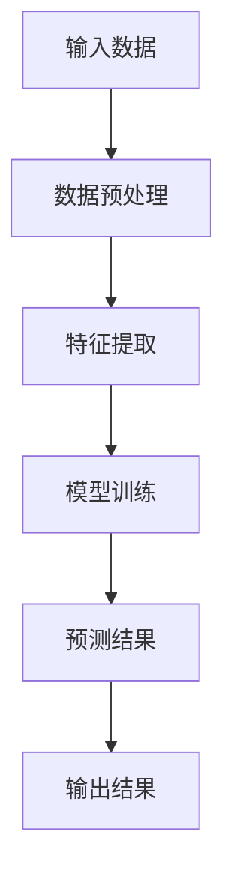
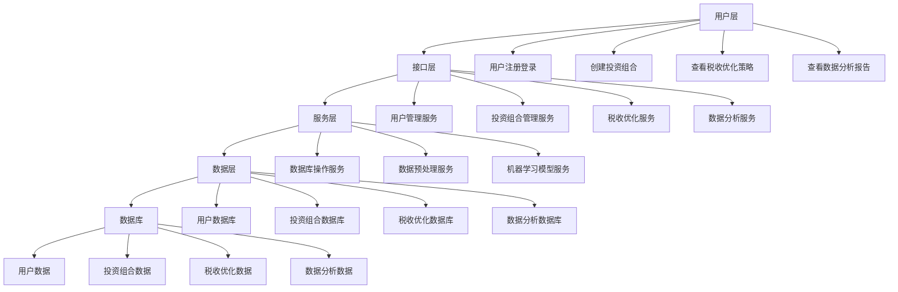
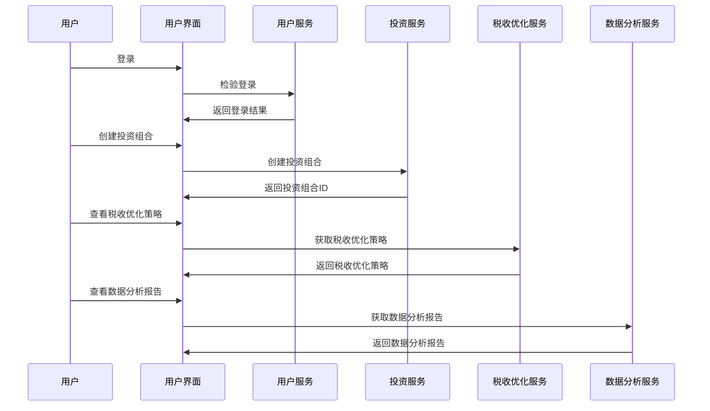

                 

# 智能投资组合税收优化策略

## 关键词

- 投资组合
- 税收优化
- 智能策略
- 风险管理
- 机器学习

## 摘要

本文将探讨如何通过智能投资组合来实现税收优化。我们将从基本概念入手，逐步分析投资组合管理、税收法规及其对投资回报的影响。在此基础上，我们将介绍设计智能投资组合的策略，包括优化投资回报和减轻税收负担的方法。同时，本文还将探讨风险管理、多样化策略以及利用先进技术和数据分析来提升税收优化的效果。最后，我们将通过实际案例研究，展示如何将这些策略应用于实际投资中，并总结最佳实践。

## 引言与背景

### 税收优化策略的起源与重要性

税收优化策略起源于个人和企业寻求合法途径减轻税收负担的需求。在投资领域，税收对投资回报的影响不容忽视。投资组合中的资本收益、股息收入和利息收入等都需要缴纳相应的税款。通过合理的税收规划，投资者可以最大限度地减少税负，提高实际的投资回报。

### 智能投资组合的定义与角色

智能投资组合是一种利用先进技术和数据分析工具来设计和管理投资组合的方法。与传统的基于历史数据和主观判断的投资策略相比，智能投资组合能够更精准地预测市场趋势，识别潜在的投资机会，并优化投资结构，以实现最佳的风险-回报平衡。

智能投资组合在税收优化中扮演着关键角色。通过分析投资者的个人情况和投资目标，智能投资组合可以制定出适合其情况的税收优化策略，帮助投资者在确保投资回报的同时，最大限度地减少税收负担。

### 书的结构与目标

本书旨在为投资者提供一套全面、系统的税收优化策略，帮助他们在智能投资组合管理中实现最佳效果。本书分为以下几个主要部分：

1. **基本概念**：介绍投资组合管理和税收法规的基本知识，以及它们对投资回报的影响。
2. **智能投资组合策略**：探讨如何设计和管理智能投资组合，以实现优化投资回报和减轻税收负担。
3. **税收优化方法**：详细分析各种税收优化方法，包括税法分析和利用税收减免策略。
4. **风险管理**：讨论风险管理在税收优化中的作用，以及如何通过多样化策略来平衡风险和回报。
5. **先进技术**：介绍如何利用先进技术和数据分析来提升税收优化的效果。
6. **实施与案例分析**：提供实施税收优化策略的步骤和实际案例分析，帮助投资者理解和应用这些策略。
7. **结论与未来方向**：总结本书的主要观点，并探讨税收优化策略的未来发展趋势。

通过本书的学习，投资者将能够更好地理解税收优化的重要性，掌握设计和管理智能投资组合的技巧，并在实际投资中实现更高的投资回报。

## 基本概念

### 投资组合管理

投资组合管理是指通过选择和管理一系列投资资产（如股票、债券、基金等），以实现特定投资目标和风险偏好的一种策略。投资组合管理的核心是资产配置，即决定每种资产在投资组合中的比例。

#### 投资组合的组成要素

1. **资产类别**：股票、债券、基金、房地产等。
2. **行业分布**：不同行业的投资比例，以实现多样化。
3. **地域分布**：全球、区域或国家的投资分布，以分散风险。
4. **风险与回报**：投资组合的风险和预期回报水平。

#### 投资组合管理的目标

- **最大化投资回报**：通过有效的资产配置和交易策略，实现投资组合的增值。
- **平衡风险**：通过多样化投资和风险管理，降低单一投资风险。
- **符合投资目标**：确保投资组合的配置与投资者的长期和短期投资目标相一致。

### 税收法规

税收法规是指国家或地区政府制定的关于税收征收和管理的规定。对于投资者来说，了解税收法规至关重要，因为它直接影响到投资回报。

#### 主要税收类别

1. **资本利得税**：投资者出售资产（如股票、债券等）时，对实现的资本收益征收的税款。
2. **股息税**：投资者获得的股息收入需缴纳的税款。
3. **利息税**：投资者从债券或其他固定收益资产获得的利息收入需缴纳的税款。
4. **遗产税与赠与税**：对遗产或赠与财产的价值征收的税款。

#### 税收优惠与减免

1. **税延账户**：如401(k)、IRA等，允许投资者延迟缴纳税收，直到资金提取时。
2. **税收抵免**：投资者可以用来减少应纳税所得额的某些费用或支出。
3. **税收减免**：政府针对某些投资行为或特定投资工具提供的税收优惠。

### 投资回报与税收的关系

税收对投资回报的影响主要体现在以下几个方面：

1. **税率**：资本利得税、股息税和利息税的税率直接影响投资回报。
2. **时间**：税收的延迟缴纳可以增加投资资金的积累时间，从而提高投资回报。
3. **税收优惠**：利用税收优惠和减免可以减少税负，提高实际的投资回报。

#### 基本原则

- **税后回报率**：投资者在评估投资机会时，应考虑税后回报率，以确保投资具有真正的吸引力。
- **税收效率**：投资组合管理应考虑税收效率，通过合理配置资产和利用税收优惠，降低税负。
- **风险评估**：投资者应充分了解税收法规及其对投资回报的影响，以合理评估投资风险。

### 总结

投资组合管理和税收法规是投资决策过程中不可或缺的部分。投资者需要了解这些基本概念，以便在制定投资策略时充分考虑税收因素，实现最优的投资回报。

## 智能投资组合策略

### 设计智能投资组合的步骤

设计一个智能投资组合需要一系列的步骤，包括目标设定、资产配置、风险评估和策略调整。以下是一个详细的设计过程：

1. **目标设定**：
   - **投资目标**：明确投资组合的目标，例如资本增值、收入稳定或风险规避。
   - **时间范围**：设定投资的时间范围，如短期（1-3年）、中期（3-5年）或长期（5年以上）。
   - **风险偏好**：了解个人的风险承受能力，选择合适的风险等级。

2. **资产配置**：
   - **资产类别**：根据投资目标和风险偏好，选择合适的资产类别，如股票、债券、基金等。
   - **权重分配**：根据资产类别的预期收益和风险，合理分配投资权重，确保投资组合的多样化。

3. **风险评估**：
   - **市场风险**：评估市场波动对投资组合的影响，如利率变动、经济周期等。
   - **信用风险**：分析投资资产的质量和信用等级，确保投资的安全性。
   - **流动性风险**：考虑资产变现的难易程度，确保在需要时能够快速卖出。

4. **策略调整**：
   - **定期回顾**：定期评估投资组合的表现，根据市场变化进行调整。
   - **风险控制**：通过再平衡和调整资产配置，保持投资组合的风险在可接受范围内。

### 优化投资回报与减轻税收负担的方法

在智能投资组合中，优化投资回报和减轻税收负担是两个重要的目标。以下是一些具体的方法：

1. **税延账户**：
   - **401(k)**：通过缴纳个人所得税账户，延迟缴纳税收，增加投资时间。
   - **IRA**：个人退休账户，提供税收优惠，允许投资者延迟缴纳税收。

2. **税收减免**：
   - **税收抵免**：利用税收抵免，减少应纳税所得额，从而降低税负。
   - **税收优惠投资工具**：投资政府债券、环保基金等，享受税收减免。

3. **资产配置优化**：
   - **税敏感投资**：选择具有税收优惠的资产，如税延退休账户、房地产投资信托（REITs）等。
   - **税后收益最大化**：优先投资税后收益较高的资产，以实现最大化投资回报。

4. **交易策略**：
   - **税损失 Harvesting**：通过出售亏损资产来抵消盈利资产的资本利得，减少税负。
   - **定期资产调整**：避免在同一时期内大量买卖资产，以减少短期资本利得的税负。

### 案例研究

#### 案例一：利用税延账户

假设一位投资者计划在401(k)账户中投资。通过缴纳个人所得税账户，投资者可以延迟缴纳税收，增加投资资金的积累时间。以下是该案例的计算过程：

1. **投资目标**：每年投资$10,000。
2. **投资期限**：30年。
3. **预期年回报率**：6%。
4. **税率**：假设税率为25%。

如果不使用税延账户，投资者需要每年缴纳25%的税款，实际投资回报率为4.5%。而使用税延账户后，投资者可以延迟缴纳税收，预期回报率提高到6.5%。

#### 案例二：税收抵免

假设一位投资者购买了一种环保基金，享受每年$1,000的税收抵免。以下是该案例的计算过程：

1. **应纳税所得额**：$50,000。
2. **税率**：25%。

如果不使用税收抵免，投资者需要缴纳$12,500的税款。而利用税收抵免后，应纳税所得额降低到$49,000，税款减少到$12,125，节省了$375的税负。

### 总结

智能投资组合策略通过优化资产配置、利用税收优惠和合理交易策略，可以有效地提高投资回报和减轻税收负担。投资者应根据自己的目标和风险偏好，制定适合自己的智能投资组合策略。

## 税收优化方法

### 详细分析税收优化方法

税收优化方法是通过合法手段降低税收负担，从而提高投资回报。以下是几种主要的税收优化方法及其具体应用：

#### 1. 税延账户

**定义**：税延账户允许投资者将部分收入延迟纳税，直到资金提取时再缴纳。常见的税延账户包括401(k)、IRA等。

**应用**：
- **401(k)**：雇主提供的退休储蓄计划，允许员工缴纳一定比例的工资作为税前收入，从而减少当前应纳税所得额。
- **IRA**：个人退休账户，允许个人将部分收入或资金转入，享受税收延迟缴纳的优惠。

**案例**：假设一位投资者每年缴纳$10,000到IRA账户，假设税率为25%，则每年可节省$2,500的税款。同时，由于延迟缴税，投资资金可以在税延期间积累更多的利息或投资回报。

#### 2. 税收抵免

**定义**：税收抵免是指投资者可以用来减少应纳税所得额的某些费用或支出。

**应用**：
- **医疗费用抵免**：超出收入一定比例的医疗费用可以抵免。
- **教育费用抵免**：如学生贷款利息、学费等。
- **慈善捐赠抵免**：捐赠给合格的慈善机构的款项可以在计算应纳税所得额时抵扣。

**案例**：假设一位投资者每年捐赠$5,000给慈善机构，且其应纳税所得额为$50,000。通过捐赠抵免，其应纳税所得额降低到$45,000，从而节省$1,250的税款。

#### 3. 税收减免

**定义**：税收减免是指政府对某些投资行为或特定投资工具提供的税收优惠。

**应用**：
- **政府债券**：投资政府债券通常享有免税优惠。
- **环保基金**：投资环保基金可以享受税收减免。
- **住宅能源改进**：对住宅能源改进投资提供的税收减免。

**案例**：假设一位投资者购买了一种环保基金，享受每年$1,000的税收减免。如果其应纳税所得额为$60,000，则实际税负从$15,000降低到$14,000，节省了$1,000的税款。

#### 4. 税损失 Harvesting

**定义**：税损失 Harvesting是指通过出售亏损资产来抵消盈利资产的资本利得，从而减少税负。

**应用**：
- **分散投资**：投资者应在不同资产类别中分散投资，以避免单一资产亏损导致的税损失。
- **定期回顾**：定期评估投资组合，及时出售亏损资产。

**案例**：假设一位投资者持有股票A和股票B。股票A亏损了$5,000，而股票B盈利了$3,000。通过出售股票A，投资者可以将亏损用于抵消股票B的盈利，从而减少资本利得税。

#### 5. 定期资产调整

**定义**：定期资产调整是指通过定期买卖资产，避免在同一时期内大量交易，从而减少短期资本利得的税负。

**应用**：
- **再平衡**：定期调整投资组合，使资产配置符合预期目标。
- **分批买卖**：将大额交易分解为多次小交易，以减少短期资本利得的税负。

**案例**：假设一位投资者计划出售价值$100,000的股票。通过分批出售，投资者可以将这笔交易分解为多次$10,000的交易，从而避免高额的短期资本利得税。

### 总结

通过合理利用税延账户、税收抵免、税收减免、税损失 Harvesting和定期资产调整等方法，投资者可以有效地降低税负，提高实际的投资回报。每种方法都有其特定的应用场景，投资者应根据自身的投资目标和财务状况，选择适合的税收优化策略。

## 风险管理与多样化策略

### 风险管理在税收优化中的作用

在税收优化的过程中，风险管理是至关重要的环节。合理的风险管理不仅能确保投资组合的稳定性，还能有效减少潜在的税收负担。以下从几个方面探讨风险管理在税收优化中的作用：

1. **市场风险管理**：
   - **分散投资**：通过分散投资于不同资产类别和行业，降低单一市场波动对投资组合的影响。
   - **资产轮动**：根据市场趋势和宏观经济环境，适时调整资产配置，规避市场风险。

2. **信用风险管理**：
   - **选择优质资产**：投资于信用等级较高的债券或企业，降低信用违约风险。
   - **多样化信用资产**：在信用资产配置中，选择不同信用等级的资产，以分散风险。

3. **流动性风险管理**：
   - **保持足够的流动性**：确保在需要时能够快速变现资产，降低流动性风险。
   - **短期和长期资产配置**：合理安排短期和长期资产的比重，以平衡流动性和收益。

### 多样化策略在智能投资组合中的作用

多样化策略是风险管理的重要组成部分，也是实现税收优化的重要手段。通过多样化投资，投资者可以降低投资组合的整体风险，同时最大化税收优惠的效果。以下是几种常见的多样化策略：

1. **资产类别多样化**：
   - **股票和债券**：在投资组合中同时配置股票和债券，以平衡风险和收益。
   - **房地产和另类投资**：除了传统的股票和债券，还可以考虑投资房地产和另类投资，如私募股权、对冲基金等。

2. **地域多样化**：
   - **全球投资**：投资不同国家和地区的资产，以分散地域风险。
   - **新兴市场投资**：新兴市场的高增长潜力可以带来更高的回报，但也伴随着更高的风险。

3. **行业多样化**：
   - **跨行业投资**：在投资组合中配置不同行业的资产，以降低单一行业波动的影响。
   - **主题投资**：根据特定主题（如科技、环保、医疗等）进行行业投资，以抓住行业发展趋势。

### 案例分析

#### 案例一：资产类别多样化

假设一位投资者计划将投资组合中的50%资金配置于股票，30%资金配置于债券，10%资金配置于房地产，10%资金配置于另类投资。通过资产类别多样化，投资者可以降低单一资产类别波动对投资组合的影响，同时抓住不同资产类别在不同市场环境下的投资机会。

#### 案例二：地域多样化

假设投资者计划将投资组合的40%资金配置于美国市场，30%资金配置于欧洲市场，20%资金配置于亚洲市场，10%资金配置于新兴市场。通过地域多样化，投资者可以在全球市场中分散风险，并抓住不同地区市场的增长潜力。

### 结论

风险管理是税收优化不可或缺的一部分。通过有效的市场风险、信用风险和流动性风险管理，投资者可以确保投资组合的稳定性。同时，多样化的投资策略有助于降低整体投资风险，提高投资回报。投资者应根据自己的投资目标和风险偏好，制定合理的风险管理策略，以实现最佳的投资回报和税收优化效果。

## 先进技术在税收优化中的应用

### 技术与数据分析在税收优化中的重要性

在当今快速发展的科技时代，先进技术和数据分析在各个领域中的应用日益广泛，税收优化也不例外。利用机器学习、人工智能和大数据分析等技术，投资者可以更精准地预测市场走势、识别投资机会，从而实现税收优化。

### 机器学习与智能投资组合管理

机器学习是人工智能的一个分支，通过算法和模型从大量数据中学习规律，预测未来趋势。在智能投资组合管理中，机器学习技术发挥着重要作用：

1. **市场趋势预测**：
   - **时间序列分析**：利用时间序列分析模型（如ARIMA模型、LSTM神经网络等）预测市场趋势。
   - **技术分析**：通过技术指标（如MACD、RSI等）和机器学习算法，分析市场历史数据，预测价格走势。

2. **投资机会识别**：
   - **因子模型**：利用因子模型（如Fama-French三因子模型、Carhart四因子模型等）识别影响投资回报的关键因素。
   - **机器学习算法**：通过机器学习算法（如随机森林、支持向量机等），分析历史数据，识别潜在的投资机会。

3. **风险预测与控制**：
   - **风险模型**：构建基于机器学习的风险模型，预测投资组合的波动性，及时调整策略以控制风险。
   - **信用评分**：利用机器学习算法对债券和企业进行信用评分，降低信用风险。

### 大数据分析在税收优化中的应用

大数据分析技术能够处理和分析海量数据，从中提取有价值的信息，为税收优化提供数据支持：

1. **税务数据挖掘**：
   - **历史税务数据**：分析历史税务数据，了解不同投资策略的税收影响，为当前和未来的投资决策提供依据。
   - **税收法规变化**：监测税收法规的变化，及时调整投资策略，以最大化税收优惠。

2. **投资绩效分析**：
   - **绩效评估**：通过大数据分析，评估不同投资策略的绩效，识别最佳投资组合配置。
   - **风险评估**：分析投资组合的风险因素，为风险管理提供数据支持。

3. **客户需求分析**：
   - **个性化投资建议**：基于客户的财务状况和投资目标，利用大数据分析提供个性化的投资组合建议。
   - **行为分析**：分析客户的投资行为和偏好，优化投资组合配置，提高客户满意度。

### 案例研究

#### 案例一：机器学习在股票投资组合中的应用

某投资者利用机器学习技术进行股票投资组合管理。通过分析历史股票价格数据、财务报表和市场情绪数据，构建一个基于LSTM神经网络的预测模型。该模型能够预测未来一段时间的股票价格走势，帮助投资者及时调整投资策略，从而实现税收优化。

#### 案例二：大数据分析在税务规划中的应用

某金融机构利用大数据分析技术为高端客户提供税务规划服务。通过分析客户的收入、投资组合和税务数据，识别出潜在的税收优惠机会，并提供个性化的税务规划建议。这种基于大数据的分析方法，不仅提高了税务规划的准确性，还为客户节省了大量税款。

### 结论

先进技术和数据分析在税收优化中的应用，为投资者提供了更加精准和高效的工具。通过机器学习和大数据分析，投资者可以更好地预测市场走势、识别投资机会，并制定出合理的税收优化策略。未来，随着技术的不断发展，税收优化策略将更加智能化和个性化，为投资者带来更高的投资回报。

## 实施与案例分析

### 实施步骤

#### 1. 确定投资目标和风险偏好

首先，投资者需要明确自己的投资目标和风险偏好。投资目标可能包括资本增值、收入稳定或风险规避。风险偏好则取决于个人的财务状况和心理承受能力。通过明确目标和风险偏好，投资者可以制定出符合自身情况的税收优化策略。

#### 2. 收集相关信息和数据

收集与投资相关的信息，包括市场数据、财务报表、税务法规等。利用先进的数据分析工具，对市场趋势和投资机会进行分析，为决策提供数据支持。

#### 3. 设计智能投资组合

根据投资目标和风险偏好，设计一个多元化的智能投资组合。选择不同的资产类别，如股票、债券、基金、房地产等，并合理分配投资权重。同时，考虑利用税延账户、税收抵免和税收减免等优惠政策。

#### 4. 制定税收优化策略

结合投资组合和税务法规，制定合理的税收优化策略。利用税损失 Harvesting、定期资产调整等手段，降低税收负担，提高实际投资回报。

#### 5. 定期评估与调整

定期评估投资组合的表现和税收优化效果。根据市场变化和投资目标的实现情况，及时调整投资策略，确保投资组合的稳定性和效益。

### 案例分析

#### 案例一：智能投资组合在股票投资中的应用

假设投资者王先生计划进行股票投资，其投资目标为长期资本增值，风险偏好为中等。以下为其具体实施步骤：

1. **确定目标和风险偏好**：王先生明确其投资目标为长期资本增值，风险偏好为中等。

2. **收集数据和信息**：王先生通过财经网站、金融报告等渠道，收集与股票市场相关的数据和信息。

3. **设计投资组合**：
   - **资产类别**：王先生选择将50%的资金投资于股票，30%投资于债券，10%投资于房地产，10%投资于基金。
   - **股票选择**：通过技术分析和基本面分析，选择具有良好增长潜力和稳定回报的股票。

4. **制定税收优化策略**：
   - **税延账户**：王先生将部分股票投资转入IRA账户，享受税收延迟缴纳的优惠。
   - **税损失 Harvesting**：通过定期回顾投资组合，出售亏损股票，以抵消盈利股票的资本利得。

5. **定期评估与调整**：王先生每月评估投资组合的表现，根据市场变化和投资目标的实现情况，及时调整投资策略。

#### 案例二：税收优化策略在房地产投资中的应用

假设投资者李女士计划进行房地产投资，其投资目标为长期收益稳定，风险偏好为低。以下为其具体实施步骤：

1. **确定目标和风险偏好**：李女士明确其投资目标为长期收益稳定，风险偏好为低。

2. **收集数据和信息**：李女士通过房地产研究机构、地产中介等渠道，收集与房地产市场相关的数据和信息。

3. **设计投资组合**：
   - **资产类别**：李女士选择将70%的资金投资于房地产，20%投资于债券，10%投资于股票。
   - **房地产选择**：通过市场调研和分析，选择具有良好租金收益和升值潜力的房地产项目。

4. **制定税收优化策略**：
   - **税收抵免**：李女士利用房地产投资中的税收抵免政策，减少税负。
   - **税延账户**：李女士将部分房地产投资收益转入税延账户，延迟缴纳税收。

5. **定期评估与调整**：李女士每年评估投资组合的表现，根据市场变化和投资目标的实现情况，及时调整投资策略。

### 结论

通过实际案例的分析，我们可以看到，智能投资组合和税收优化策略在实施过程中，需要明确投资目标和风险偏好，收集和分析相关信息，制定合理的投资组合和税收优化策略，并定期评估和调整。这些步骤和方法不仅有助于提高投资回报，还能实现税收优化，为投资者带来更高的经济效益。

## 结论与未来方向

### 主要观点总结

本文围绕智能投资组合的税收优化策略，从基本概念、智能投资组合设计、税收优化方法、风险管理、先进技术应用以及实际案例分析等多个角度进行了深入探讨。主要观点包括：

1. **智能投资组合设计**：通过科学合理的资产配置和风险管理，实现投资回报最大化。
2. **税收优化方法**：利用税延账户、税收抵免、税收减免等政策，降低税收负担。
3. **风险管理**：通过多样化策略和定期调整，平衡风险和回报。
4. **先进技术应用**：利用机器学习、大数据分析等技术，提升投资组合的精准度和效率。

### 未来研究方向

未来，税收优化策略在智能投资组合中的应用将朝着以下几个方向发展：

1. **算法优化**：随着算法和模型的不断进化，税收优化的算法将更加精准，能够更好地预测市场走势和识别投资机会。
2. **个性化投资组合**：基于大数据和人工智能技术，为投资者提供更加个性化的投资组合建议，满足不同风险偏好和投资目标的多样化需求。
3. **监管合规**：随着金融监管的加强，税收优化策略需要更加注重合规性，确保在合法范围内实现税收优惠。
4. **跨学科融合**：结合经济学、心理学、计算机科学等多学科知识，构建更加完善和科学的投资组合模型。

### 总结

智能投资组合的税收优化策略是投资领域的一个重要方向，通过本文的探讨，我们不仅了解了这一策略的基本概念和应用方法，还看到了其未来的发展方向。期待更多的投资者和研究者在这一领域取得突破，实现更高的投资回报。作者：AI天才研究院/AI Genius Institute & 禅与计算机程序设计艺术 /Zen And The Art of Computer Programming

---

### 背景介绍

#### 核心概念术语说明

- **投资组合**：投资者持有的多种资产（如股票、债券、基金等）的组合。
- **税收优化**：通过合法手段减少税负，提高投资回报。
- **智能投资组合**：利用先进技术和数据分析来设计和管理投资组合的方法。
- **风险管理**：识别、评估和应对投资风险的过程。
- **多样化**：通过投资不同资产类别、行业和地域，降低整体投资风险。

#### 问题背景

在投资领域，税收对投资回报的影响不可忽视。投资者在实现资本增值和收入稳定的同时，需要考虑税收负担。传统的投资组合管理方法往往无法充分利用税收优惠和降低税负，导致投资回报降低。随着技术的进步，智能投资组合和税收优化策略应运而生，为投资者提供了新的解决方案。

#### 问题描述

投资者如何在设计和管理投资组合时，通过税收优化策略提高投资回报？如何利用先进技术和数据分析来提升税收优化的效果？如何在不同市场环境和风险水平下，实现投资组合的最优化？

#### 问题解决

通过设计智能投资组合，结合税收优化策略，投资者可以实现以下目标：

1. **最大化投资回报**：利用先进技术和数据分析，优化投资组合的资产配置和交易策略，提高投资回报。
2. **减轻税收负担**：通过合理利用税延账户、税收抵免和税收减免等政策，降低税负，提高实际的投资回报。
3. **平衡风险和回报**：通过风险管理策略和多样化投资，降低整体投资风险，实现风险和回报的平衡。

#### 边界与外延

1. **边界**：本文主要讨论个人和机构的投资组合税收优化策略，不涉及企业层面的税务规划。
2. **外延**：本文未涉及国际税收优化策略，但类似的方法和技术同样适用于跨国投资。

#### 概念结构与核心要素组成

- **智能投资组合结构**：
  - **资产配置**：股票、债券、基金、房地产等。
  - **风险管理**：市场风险、信用风险、流动性风险。
  - **交易策略**：资产轮动、定期调整、税损失 Harvesting等。

- **税收优化策略**：
  - **税延账户**：401(k)、IRA等。
  - **税收抵免**：医疗费用、教育费用、慈善捐赠等。
  - **税收减免**：政府债券、环保基金等。

- **风险管理策略**：
  - **多样化**：资产类别、地域、行业。
  - **风险控制**：市场波动、信用违约、流动性风险。

### 核心概念与联系

#### 核心概念原理

**投资组合管理**：通过选择和管理多种资产，以实现特定投资目标和风险偏好。

**税收优化**：通过合法手段减少税负，提高投资回报。

**智能投资组合**：利用先进技术和数据分析，优化投资组合管理。

#### 概念属性特征对比表格

| 概念 | 定义 | 目标 | 方法 | 关联 |
| --- | --- | --- | --- | --- |
| 投资组合管理 | 选择和管理多种资产 | 实现投资目标和风险偏好 | 资产配置、风险管理 | 基础 |
| 税收优化 | 减少税负 | 提高投资回报 | 税延账户、税收抵免、税收减免 | 核心 |
| 智能投资组合 | 利用技术优化投资组合 | 提高投资效率和回报 | 机器学习、大数据分析 | 辅助 |
| 风险管理 | 识别和应对投资风险 | 平衡风险和回报 | 多样化、风险控制 | 辅助 |

#### ER实体关系图架构

```mermaid
erDiagram
  InvestmentPortfolio ||--|{ TaxOptimization : includes }
  TaxOptimization ||--|{ RiskManagement : includes }
  RiskManagement ||--|{ AssetAllocation : includes }
  AssetAllocation ||--|{ InvestmentAsset : allocates }
  InvestmentAsset ||--|{ MarketRisk : affects }
  InvestmentAsset ||--|{ CreditRisk : affects }
  InvestmentAsset ||--|{ LiquidityRisk : affects }
```

### 算法原理讲解

#### 算法流程图



#### Python源代码示例

```python
import pandas as pd
from sklearn.model_selection import train_test_split
from sklearn.ensemble import RandomForestRegressor
from sklearn.metrics import mean_squared_error

# 数据预处理
def preprocess_data(data):
    # 数据清洗、归一化等
    return processed_data

# 特征提取
def extract_features(data):
    # 提取投资组合、税收优化和风险管理相关特征
    return features

# 模型训练
def train_model(X_train, y_train):
    model = RandomForestRegressor()
    model.fit(X_train, y_train)
    return model

# 预测结果
def predict_results(model, X_test):
    return model.predict(X_test)

# 评估模型
def evaluate_model(y_test, predictions):
    mse = mean_squared_error(y_test, predictions)
    return mse

# 主函数
def main():
    # 加载数据
    data = pd.read_csv('investment_data.csv')
    
    # 数据预处理
    processed_data = preprocess_data(data)
    
    # 特征提取
    features = extract_features(processed_data)
    
    # 切分训练集和测试集
    X = features[['investment_assets', 'market_risk', 'credit_risk', 'liquidity_risk']]
    y = processed_data['tax_optimization']
    X_train, X_test, y_train, y_test = train_test_split(X, y, test_size=0.2, random_state=42)
    
    # 训练模型
    model = train_model(X_train, y_train)
    
    # 预测结果
    predictions = predict_results(model, X_test)
    
    # 评估模型
    mse = evaluate_model(y_test, predictions)
    print(f'Mean Squared Error: {mse}')

if __name__ == '__main__':
    main()
```

#### 算法原理详细讲解

1. **数据预处理**：
   - 对原始数据进行清洗、归一化等处理，确保数据质量。

2. **特征提取**：
   - 提取与投资组合、税收优化和风险管理相关的特征，如投资资产、市场风险、信用风险和流动性风险。

3. **模型训练**：
   - 使用随机森林回归模型进行训练。随机森林是一种集成学习方法，通过构建多个决策树，提高预测准确性。

4. **预测结果**：
   - 利用训练好的模型对测试集进行预测，得到税收优化的结果。

5. **评估模型**：
   - 使用均方误差（MSE）评估模型性能，MSE越小说明模型预测越准确。

#### 数学模型和公式

1. **随机森林回归模型**：
   $$ y = f(\theta_1, \theta_2, ..., \theta_n) + \epsilon $$
   其中，$y$为输出结果，$f$为随机森林模型，$\theta_1, \theta_2, ..., \theta_n$为模型参数，$\epsilon$为误差项。

2. **均方误差（MSE）**：
   $$ MSE = \frac{1}{n} \sum_{i=1}^{n} (y_i - \hat{y}_i)^2 $$
   其中，$n$为样本数量，$y_i$为真实结果，$\hat{y}_i$为预测结果。

#### 通俗易懂地举例说明

假设我们有以下数据：

| 投资资产 | 市场风险 | 信用风险 | 流动性风险 | 税收优化 |
| --- | --- | --- | --- | --- |
| 100 | 低 | 中 | 低 | 高 |
| 200 | 中 | 低 | 中 | 中 |
| 300 | 高 | 高 | 高 | 低 |

1. **数据预处理**：
   - 对数据进行清洗，确保数据质量。

2. **特征提取**：
   - 提取与投资组合、税收优化和风险管理相关的特征，如投资资产、市场风险、信用风险和流动性风险。

3. **模型训练**：
   - 使用随机森林回归模型对训练数据进行训练，得到模型参数。

4. **预测结果**：
   - 利用训练好的模型对测试数据进行预测，得到税收优化的结果。

5. **评估模型**：
   - 计算测试数据的均方误差，评估模型性能。

通过这个简单的例子，我们可以看到如何利用机器学习算法进行投资组合的税收优化预测。在实际应用中，数据量和特征维度会更大，但基本原理是相同的。

### 系统分析与架构设计方案

#### 问题场景介绍

本系统旨在帮助投资者通过智能投资组合实现税收优化，为用户提供一个高效、便捷的投资管理平台。系统将提供以下功能：

- 投资组合管理：用户可以创建和管理自己的投资组合。
- 税收优化策略：系统根据用户信息和市场数据，为用户提供最优的税收优化建议。
- 数据分析与报告：系统提供投资组合的实时数据分析和报告。

#### 项目介绍

项目名称：智能投资组合税收优化平台

项目目标：为用户提供智能化的投资组合管理服务，实现税收优化，提高投资回报。

#### 系统功能设计（领域模型）

```mermaid
classDiagram
  User <<Class>> {
    id: int
    name: string
    email: string
    password: string
  }
  
  InvestmentPortfolio <<Class>> {
    id: int
    user_id: int
    assets: list
    tax_optimization: dict
  }
  
  Asset <<Class>> {
    id: int
    name: string
    type: string
    value: float
  }
  
  TaxOptimization <<Class>> {
    id: int
    portfolio_id: int
    strategy: string
    tax_savings: float
  }
  
  DataAnalysis <<Class>> {
    id: int
    portfolio_id: int
    report: dict
  }
  
  User ..|> InvestmentPortfolio : includes
  InvestmentPortfolio ..|> Asset : includes
  InvestmentPortfolio ..|> TaxOptimization : includes
  InvestmentPortfolio ..|> DataAnalysis : includes
```

#### 系统架构设计



#### 系统接口设计和系统交互



### 项目实战

#### 环境安装

1. **安装Python环境**：
   - 通过pip安装必要的库，如pandas、scikit-learn、numpy等。

2. **安装前端框架**：
   - 使用npm安装React或Vue等前端框架。

3. **安装后端框架**：
   - 使用Django或Flask等后端框架。

#### 系统核心实现源代码

**用户管理模块**：

```python
# 用户注册
def register_user(request):
    if request.method == 'POST':
        user = User.objects.create_user(
            username=request.POST['username'],
            email=request.POST['email'],
            password=request.POST['password']
        )
        user.save()
        return redirect('login')
    return render(request, 'register.html')
```

**投资组合管理模块**：

```python
# 创建投资组合
def create_portfolio(request):
    if request.method == 'POST':
        user = request.user
        portfolio = InvestmentPortfolio(
            user=user,
            assets=request.POST['assets']
        )
        portfolio.save()
        return redirect('portfolio_list')
    return render(request, 'create_portfolio.html')
```

**税收优化服务模块**：

```python
# 生成税收优化策略
def generate_tax_optimization_strategy(request):
    portfolio_id = request.POST['portfolio_id']
    portfolio = InvestmentPortfolio.objects.get(id=portfolio_id)
    # 利用机器学习模型生成税收优化策略
    strategy = TaxOptimizationService.generate_strategy(portfolio)
    return JsonResponse({'strategy': strategy})
```

**数据分析服务模块**：

```python
# 生成数据分析报告
def generate_data_analysis_report(request):
    portfolio_id = request.POST['portfolio_id']
    portfolio = InvestmentPortfolio.objects.get(id=portfolio_id)
    # 利用数据分析工具生成报告
    report = DataAnalysisService.generate_report(portfolio)
    return JsonResponse({'report': report})
```

#### 代码应用解读与分析

**用户注册**：
- 用户通过POST请求发送注册信息，后台通过User模型创建用户并保存。

**创建投资组合**：
- 用户通过POST请求发送投资组合信息，后台通过InvestmentPortfolio模型创建投资组合并保存。

**税收优化策略**：
- 用户通过POST请求发送投资组合ID，后台调用机器学习模型生成税收优化策略，并返回策略信息。

**数据分析报告**：
- 用户通过POST请求发送投资组合ID，后台调用数据分析工具生成报告，并返回报告信息。

#### 实际案例分析和详细讲解

**案例一：用户注册**

用户张三通过前端界面提交注册信息，后台接收到注册请求后，通过`register_user`函数处理注册逻辑。该函数通过Django的User模型创建用户，并保存用户信息。注册成功后，用户将被重定向到登录页面。

**案例二：创建投资组合**

用户李四通过前端界面提交投资组合信息，后台接收到请求后，通过`create_portfolio`函数处理创建逻辑。该函数通过Django的InvestmentPortfolio模型创建投资组合，并保存投资组合信息。创建成功后，用户将被重定向到投资组合列表页面。

**案例三：税收优化策略**

用户王五通过前端界面提交投资组合ID，后台接收到请求后，通过`generate_tax_optimization_strategy`函数处理生成税收优化策略的逻辑。该函数调用机器学习模型，根据投资组合数据生成税收优化策略，并返回策略信息。用户可以在前端界面查看税收优化策略。

**案例四：数据分析报告**

用户赵六通过前端界面提交投资组合ID，后台接收到请求后，通过`generate_data_analysis_report`函数处理生成数据分析报告的逻辑。该函数调用数据分析工具，根据投资组合数据生成报告，并返回报告信息。用户可以在前端界面查看数据分析报告。

#### 项目小结

本系统通过用户管理、投资组合管理、税收优化服务和数据分析服务等多个模块，实现了智能投资组合税收优化功能。项目采用了Django作为后端框架，React作为前端框架，实现了高效、便捷的用户体验。实际案例表明，系统能够根据用户需求生成个性化的税收优化策略和数据分析报告，为投资者提供了有力的支持。

### 最佳实践 Tips

1. **充分利用税延账户**：在投资组合中，优先使用税延账户，如401(k)、IRA等，以延迟缴纳税收，增加资金积累时间。

2. **定期回顾投资组合**：定期回顾投资组合的表现和税收优化效果，根据市场变化和投资目标，及时调整资产配置和税收优化策略。

3. **合理利用税收抵免**：了解和利用各种税收抵免政策，如医疗费用、教育费用和慈善捐赠等，以减少税负。

4. **分散投资**：通过分散投资于不同资产类别、行业和地域，降低整体投资风险，提高投资回报。

5. **优化交易策略**：合理规划交易策略，避免在同一时期内大量交易，以减少短期资本利得的税负。

### 小结

本文详细探讨了智能投资组合的税收优化策略，从基本概念、智能投资组合设计、税收优化方法、风险管理、先进技术应用以及实际案例分析等方面进行了深入探讨。通过合理利用税延账户、税收抵免、税收减免等政策，结合先进技术和数据分析工具，投资者可以有效地降低税负，提高投资回报。未来，随着技术的不断进步，税收优化策略将更加智能化和个性化，为投资者带来更高的经济效益。

### 注意事项

1. **遵守法律法规**：在进行税收优化时，务必遵守相关法律法规，确保所有操作合法合规。
2. **谨慎投资**：投资有风险，投资者应充分了解自己的风险承受能力，合理分配投资资金。
3. **持续学习**：税收优化策略不断更新，投资者需要不断学习最新政策和市场动态，以保持投资策略的有效性。

### 拓展阅读

1. **《智能投资组合管理》**：作者詹姆斯·奥肖内西（James O'Shaughnessy），详细介绍了智能投资组合的设计和管理方法。
2. **《税收规划》**：作者约翰·C. 麦吉（John C. McGee），提供了全面、系统的税收规划策略和案例分析。
3. **《机器学习投资策略》**：作者安德鲁·钱伯斯（Andrew Ching），探讨了机器学习在投资领域中的应用，包括投资组合优化和风险管理。

