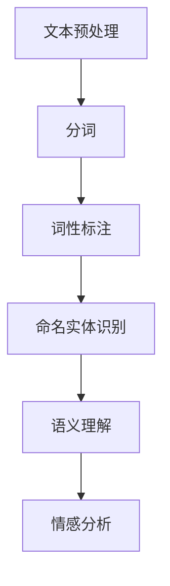
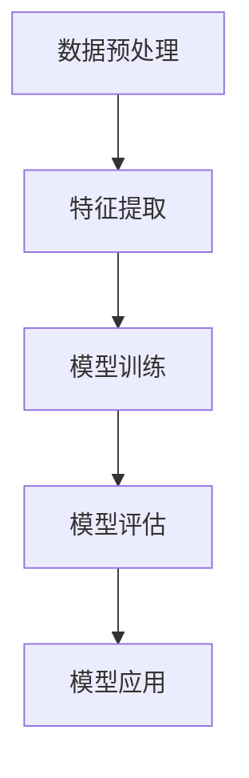
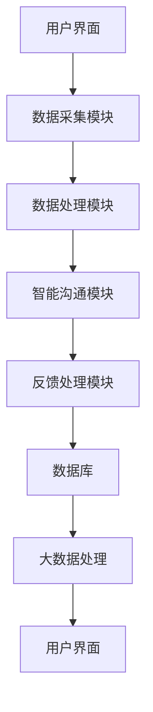
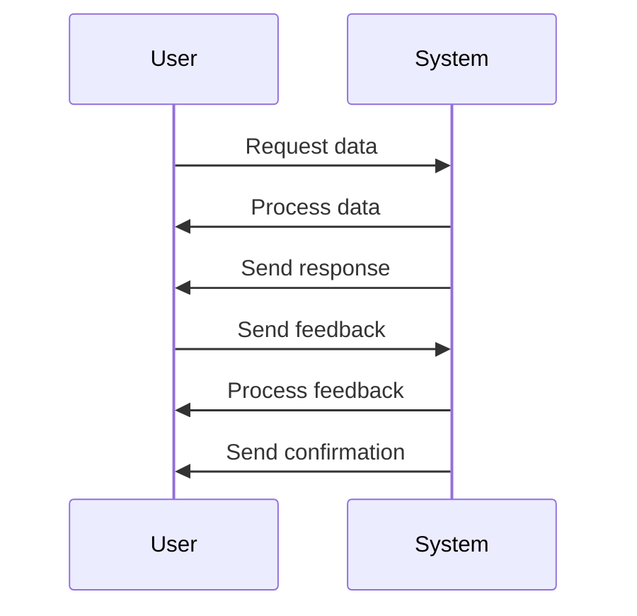

                 

### 《智能投资者关系管理系统》

#### 关键词：投资者关系管理、智能系统、数据分析、算法、系统架构设计

> 摘要：本文深入探讨了智能投资者关系管理系统的构建与应用，详细分析了其背景、核心概念、智能技术原理、系统架构设计、实战案例和最佳实践。通过本文，读者将全面了解智能投资者关系管理系统的重要性、实现原理和实际应用，为投资领域带来深刻的启示。

---

### 目录大纲

```markdown
----------------------------------------------------------------
# 《智能投资者关系管理系统》目录大纲

## 第一部分：智能投资者关系管理系统概述

### 第1章：问题背景与需求分析

#### 1.1 问题背景

- 投资者关系管理的重要性
- 现有投资者关系管理存在的问题

#### 1.2 问题描述

- 投资者信息管理的挑战
- 投资者沟通效率低下
- 投资者反馈处理不及时

#### 1.3 问题解决

- 智能投资者关系管理系统的作用
- 系统目标与预期效果

#### 1.4 边界与外延

- 系统的功能范围
- 系统的数据处理能力

#### 1.5 概念结构与核心要素组成

- 智能投资者关系管理系统的基本概念
- 系统的核心功能模块

## 第二部分：核心概念与联系

### 第2章：核心概念原理

#### 2.1 投资者关系管理的概念

- 投资者关系管理的定义
- 投资者关系管理的重要性

#### 2.2 智能投资者关系管理系统的基础原理

- 智能技术的应用场景
- 智能投资者关系管理系统的工作原理

### 第3章：概念属性特征对比

#### 3.1 投资者信息管理特征对比

- 传统投资者信息管理方法
- 智能投资者信息管理方法

#### 3.2 投资者沟通效率特征对比

- 传统投资者沟通方式
- 智能投资者沟通方式

#### 3.3 投资者反馈处理特征对比

- 传统反馈处理流程
- 智能反馈处理流程

## 第三部分：智能技术原理讲解

### 第4章：算法原理与数学模型

#### 4.1 智能算法原理

- 自然语言处理（NLP）算法
- 机器学习算法

#### 4.2 数学模型与公式

- NLP算法的数学模型
- 机器学习算法的数学模型

#### 4.3 算法流程图与Python代码实现

- Mermaid算法流程图
- Python代码实现与解析

## 第四部分：系统分析与架构设计

### 第5章：系统功能设计与架构

#### 5.1 问题场景介绍

- 投资者关系管理中的常见问题
- 智能系统解决这些问题的优势

#### 5.2 系统功能设计

- 智能信息管理功能
- 智能沟通功能
- 智能反馈处理功能

#### 5.3 系统架构设计

- 技术选型
- 系统架构图（Mermaid架构图）

#### 5.4 系统接口设计与交互

- 系统接口设计
- 系统交互（Mermaid序列图）

## 第五部分：项目实战与案例分析

### 第6章：项目环境安装与核心实现

#### 6.1 环境安装

- 硬件要求
- 软件安装

#### 6.2 系统核心实现

- 数据采集与处理
- 智能分析模块

#### 6.3 代码应用解读与分析

- 代码结构与功能
- 代码实现细节分析

### 第7章：实际案例分析与详细讲解

#### 7.1 实际案例分析

- 案例背景
- 案例实施过程

#### 7.2 详细讲解与剖析

- 智能系统在实际应用中的表现
- 存在的问题与改进建议

## 第六部分：最佳实践与拓展阅读

### 第8章：最佳实践与注意事项

#### 8.1 最佳实践

- 系统实施的最佳实践经验
- 智能技术应用的注意事项

#### 8.2 小结

- 智能投资者关系管理系统的重要性
- 系统应用的现状与未来趋势

#### 8.3 拓展阅读

- 相关书籍推荐
- 学术论文推荐
- 实际案例分享

----------------------------------------------------------------
```

本文目录结构清晰，内容丰富，旨在系统地介绍智能投资者关系管理系统的构建与应用。接下来，我们将逐章深入分析每个部分，以确保文章的逻辑性和完整性。

---

## 第一部分：智能投资者关系管理系统概述

### 第1章：问题背景与需求分析

#### 1.1 问题背景

投资者关系管理（Investor Relations Management，简称IRM）是现代企业尤其是上市公司的一项关键职能。其核心在于通过建立和维护与投资者之间的良好关系，提升公司形象，增强市场信心，最终实现股价的稳定增长和公司价值的最大化。然而，随着金融市场的发展，投资者数量和复杂性不断增加，传统投资者关系管理面临着诸多挑战。

首先，投资者信息管理的挑战日益凸显。企业需要收集、整理和分析海量的投资者数据，包括财务报告、市场分析、投资者偏好等。传统的信息管理方式往往依赖于人工处理，效率低下，难以满足现代投资者对实时性和准确性的需求。

其次，投资者沟通效率低下。投资者关系管理通常涉及频繁的沟通和互动，包括电话、邮件、会议等多种形式。然而，传统沟通方式难以实现高效的信息传递和反馈，容易导致信息丢失和误解。

最后，投资者反馈处理不及时。投资者对企业经营和发展的关注点各不相同，对企业提出的建议和意见也多样复杂。然而，传统反馈处理流程往往较为缓慢，无法及时响应投资者需求，影响投资者关系和公司声誉。

#### 1.2 问题描述

针对上述背景，投资者关系管理面临以下具体问题：

1. **投资者信息管理挑战**：企业需要有效收集、整理和分析大量的投资者数据，但传统方式效率低下，难以应对快速变化的市场环境。
2. **投资者沟通效率低下**：传统沟通方式难以实现高效的信息传递和反馈，沟通成本高，效果不佳。
3. **投资者反馈处理不及时**：反馈处理流程繁琐，响应速度慢，难以满足投资者对实时互动的需求。

#### 1.3 问题解决

为解决上述问题，智能投资者关系管理系统的构建成为必然选择。该系统通过引入先进的智能技术，如大数据分析、自然语言处理（NLP）和机器学习等，实现对投资者数据的智能采集、分析和处理，提升投资者沟通效率，优化投资者反馈处理流程。

智能投资者关系管理系统的主要目标和预期效果包括：

1. **高效信息管理**：利用智能算法，快速收集和分析投资者数据，提供准确的市场洞察和投资建议。
2. **提升沟通效率**：通过智能沟通工具，实现高效的信息传递和互动，降低沟通成本。
3. **优化反馈处理**：智能处理投资者反馈，快速响应投资者需求，提升客户满意度和忠诚度。

#### 1.4 边界与外延

智能投资者关系管理系统涉及的功能范围主要包括：

1. **投资者信息管理**：包括投资者数据的采集、整理、分析和可视化。
2. **智能沟通工具**：提供多渠道的沟通接口，实现实时互动和高效沟通。
3. **智能反馈处理**：自动分类、分析和响应投资者反馈，提供个性化的服务和建议。

系统的数据处理能力方面，智能投资者关系管理系统需具备以下特点：

1. **海量数据处理**：能够处理和分析大量的投资者数据，支持实时查询和决策。
2. **高并发处理**：支持同时处理大量投资者的请求和反馈，确保系统的高效稳定运行。
3. **数据安全与隐私保护**：确保投资者数据的保密性和安全性，遵守相关法律法规。

#### 1.5 概念结构与核心要素组成

智能投资者关系管理系统的概念结构包括以下几个核心要素：

1. **数据采集模块**：负责从各种渠道收集投资者数据，包括公开信息、社交媒体、财报等。
2. **数据分析模块**：利用自然语言处理和机器学习算法，对投资者数据进行处理和分析，提取有价值的信息。
3. **沟通模块**：提供智能沟通工具，包括智能客服、邮件提醒、短信通知等，实现高效的信息传递。
4. **反馈处理模块**：自动分类、分析和响应投资者反馈，提供个性化的服务和建议。
5. **可视化模块**：通过图表、报表等形式，直观展示投资者数据和系统运行状态。

### 总结

通过构建智能投资者关系管理系统，企业可以更好地管理投资者关系，提升运营效率，增强市场竞争力。本文后续章节将深入探讨智能投资者关系管理系统的核心概念、技术原理、系统架构设计以及实际应用案例，帮助读者全面了解这一前沿技术。

---

### 第2章：核心概念原理

在深入了解智能投资者关系管理系统之前，我们需要明确几个核心概念：投资者关系管理（IRM）、智能技术及其在IRM中的应用。

#### 2.1 投资者关系管理的概念

投资者关系管理（Investor Relations Management，简称IRM）是企业与投资者之间的互动过程，旨在建立和维护良好的关系，提高公司的市场形象和投资者信心。IRM的核心目标包括：

1. **信息传播**：确保投资者能够及时、准确地了解公司的经营状况、财务表现和未来发展计划。
2. **沟通与互动**：通过多种渠道与投资者进行沟通，收集投资者意见，回应投资者关切。
3. **投资者关系分析**：分析投资者行为和市场趋势，为公司的战略决策提供数据支持。
4. **危机管理**：在市场波动或负面事件发生时，及时采取措施，维护投资者信心。

投资者关系管理的重要性体现在以下几个方面：

1. **提升市场信心**：良好的投资者关系有助于提高公司的市场声誉和投资者信心，进而推动股价上升。
2. **优化资本结构**：通过有效的投资者关系管理，企业可以更好地吸引投资者，优化资本结构，降低融资成本。
3. **增强竞争力**：投资者关系管理有助于企业了解市场需求和趋势，提升产品竞争力。

#### 2.2 智能投资者关系管理系统的基础原理

智能投资者关系管理系统（Smart Investor Relations Management System，简称SIRMS）是利用人工智能技术优化传统投资者关系管理的方法和工具。其基础原理包括以下几个方面：

1. **大数据分析**：利用大数据技术，智能投资者关系管理系统可以收集、整理和分析海量的投资者数据，包括市场趋势、投资者行为、财务报告等，为投资者关系管理提供数据支持。

2. **自然语言处理（NLP）**：NLP技术可以帮助系统理解和处理自然语言文本，包括投资者提问、媒体报道、社交媒体评论等，实现智能问答、舆情分析和报告生成。

3. **机器学习**：通过机器学习算法，系统可以自动分类和分析投资者数据，识别潜在的风险和机会，为决策提供科学依据。

4. **智能沟通**：智能投资者关系管理系统提供智能客服、邮件提醒、短信通知等功能，实现与投资者的高效互动，提升沟通效率。

5. **自动化反馈处理**：系统自动分类、分析和响应投资者反馈，提供个性化的服务和建议，降低人力成本，提高反馈处理速度。

#### 智能投资者关系管理系统的工作原理

智能投资者关系管理系统的工作原理可以概括为以下几个步骤：

1. **数据采集**：系统通过多种渠道收集投资者数据，包括公开信息、社交媒体、财报、分析师报告等。

2. **数据处理**：利用NLP和机器学习算法，对投资者数据进行处理和分析，提取有价值的信息，如市场趋势、投资者情绪、投资建议等。

3. **智能沟通**：系统根据分析结果，通过智能客服、邮件提醒、短信通知等渠道与投资者进行沟通，提供个性化的服务和建议。

4. **反馈处理**：系统自动分类、分析和响应投资者反馈，提供个性化的服务和建议，同时将反馈结果用于优化系统性能。

5. **决策支持**：系统为管理层提供数据分析和决策支持，帮助制定更科学的战略决策。

### 总结

通过本章的介绍，我们对投资者关系管理和智能投资者关系管理系统有了基本的了解。智能投资者关系管理系统通过大数据分析、NLP、机器学习等智能技术，优化了传统投资者关系管理的流程，提升了沟通效率，提高了反馈处理速度，为企业的投资者关系管理提供了有力支持。接下来，我们将进一步探讨智能技术的具体应用和实现原理。

---

### 第3章：概念属性特征对比

在深入探讨智能投资者关系管理系统之前，有必要对传统投资者关系管理和智能投资者关系管理进行对比，以便更清晰地理解两者之间的差异和优势。

#### 3.1 投资者信息管理特征对比

**传统投资者信息管理方法**：

- **数据收集**：依赖于人工手动收集，效率低下。
- **数据处理**：依赖Excel等工具，难以处理大量数据。
- **数据分析**：主要通过简单的统计和图表，难以进行深度分析。
- **数据存储**：散布在多个文件和系统中，难以集中管理。

**智能投资者信息管理方法**：

- **数据收集**：利用大数据技术，自动从各种渠道收集投资者数据，如社交媒体、市场报告、财报等。
- **数据处理**：通过NLP和机器学习算法，对大量数据进行处理和分析，提取有价值的信息。
- **数据分析**：利用先进的算法和工具，进行深度数据分析，提供市场趋势、投资者情绪等洞察。
- **数据存储**：采用分布式数据库和数据湖技术，实现集中管理和快速查询。

**对比表格**：

| 特征 | 传统投资者信息管理方法 | 智能投资者信息管理方法 |
| --- | --- | --- |
| 数据收集 | 手动收集，效率低 | 自动收集，效率高 |
| 数据处理 | 简单统计，难以处理大量数据 | NLP和机器学习，深度处理数据 |
| 数据分析 | 简单图表，难以深度分析 | 先进算法，提供深度洞察 |
| 数据存储 | 散在多个文件和系统 | 集中管理，快速查询 |

通过对比可以看出，智能投资者信息管理方法在数据收集、处理和分析方面具有显著优势，能够更高效地管理和利用投资者数据。

#### 3.2 投资者沟通效率特征对比

**传统投资者沟通方式**：

- **沟通渠道**：主要依赖电话、邮件、会议等传统方式。
- **沟通频率**：定期或按需进行，沟通频率有限。
- **沟通效果**：容易受到时间和地域的限制，沟通效果不佳。
- **反馈收集**：反馈收集速度慢，难以实时响应。

**智能投资者沟通方式**：

- **沟通渠道**：通过智能客服、邮件提醒、短信通知、在线聊天等多种智能渠道，实现实时沟通。
- **沟通频率**：根据投资者需求和系统分析结果，动态调整沟通频率，确保高效沟通。
- **沟通效果**：智能工具支持高效的信息传递和互动，沟通效果显著提升。
- **反馈收集**：自动分类、分析和响应投资者反馈，快速收集和反馈，提高客户满意度。

**对比表格**：

| 特征 | 传统投资者沟通方式 | 智能投资者沟通方式 |
| --- | --- | --- |
| 沟通渠道 | 依赖传统方式，有限 | 多种智能渠道，实时 |
| 沟通频率 | 定期或按需，频率有限 | 动态调整，高效 |
| 沟通效果 | 受时间和地域限制，效果差 | 智能支持，效果显著 |
| 反馈收集 | 反馈速度慢，难以实时 | 快速收集和反馈，提高满意度 |

通过对比可以看出，智能投资者沟通方式在沟通渠道、沟通频率、沟通效果和反馈收集方面具有明显优势，能够更好地满足投资者需求，提升沟通效率。

#### 3.3 投资者反馈处理特征对比

**传统反馈处理流程**：

- **处理流程**：反馈收集、分类、处理和响应，流程复杂。
- **处理速度**：反馈处理速度慢，难以及时响应。
- **处理效果**：反馈处理质量受人工因素影响，效果不稳定。
- **数据分析**：缺乏系统性的数据分析，难以优化反馈处理流程。

**智能反馈处理流程**：

- **处理流程**：自动分类、分析和响应，流程简化。
- **处理速度**：自动处理，快速响应。
- **处理效果**：智能处理，反馈处理质量高。
- **数据分析**：系统性地收集和分析反馈数据，为优化流程提供支持。

**对比表格**：

| 特征 | 传统反馈处理流程 | 智能反馈处理流程 |
| --- | --- | --- |
| 处理流程 | 复杂，效率低 | 简化，效率高 |
| 处理速度 | 慢，难以及时响应 | 快，快速响应 |
| 处理效果 | 人工为主，不稳定 | 智能为主，质量高 |
| 数据分析 | 缺乏系统性分析 | 系统性收集分析 |

通过对比可以看出，智能反馈处理流程在处理流程、处理速度、处理效果和数据分析方面具有显著优势，能够更高效地处理投资者反馈，提高客户满意度。

### 总结

通过本章的对比分析，我们可以清晰地看到智能投资者关系管理在信息管理、沟通效率和反馈处理方面的优势。智能技术不仅提升了投资者信息管理的效率，还显著改善了沟通和反馈处理的效果，为企业的投资者关系管理带来了全新的机遇。接下来，我们将进一步探讨智能技术的具体实现原理和系统架构设计。

---

### 第4章：算法原理与数学模型

在智能投资者关系管理系统中，算法原理和数学模型起到了关键作用。本章将深入探讨自然语言处理（NLP）算法、机器学习算法及其数学模型，并展示如何使用Python实现这些算法。

#### 4.1 智能算法原理

**自然语言处理（NLP）算法**

自然语言处理是智能技术的一个重要分支，它使计算机能够理解、解释和生成人类语言。在投资者关系管理中，NLP算法主要用于文本分析、语义理解和情感分析。

- **文本分析**：文本分析是指对大量文本数据进行预处理，提取关键词、短语和主题。常用的技术包括分词、词性标注和命名实体识别。

- **语义理解**：语义理解是指理解文本中的语义含义，包括词义消歧、语义角色标注和关系抽取。常见的算法有词向量模型（如Word2Vec和GloVe）和序列到序列模型（如Seq2Seq）。

- **情感分析**：情感分析是指判断文本的情绪倾向，如正面、负面或中性。常用的方法有基于规则的方法、机器学习方法和深度学习方法。

**机器学习算法**

机器学习是另一种重要的智能技术，它通过训练模型来发现数据中的模式和规律。在投资者关系管理中，机器学习算法主要用于预测分析、分类和聚类。

- **预测分析**：预测分析是指根据历史数据预测未来的趋势或结果。常用的算法有时间序列分析、回归分析和神经网络。

- **分类**：分类是指将数据分成不同的类别。常见的算法有逻辑回归、决策树、随机森林和支持向量机（SVM）。

- **聚类**：聚类是指将数据分成多个相似的组。常用的算法有K-均值聚类、层次聚类和DBSCAN。

#### 4.2 数学模型与公式

**NLP算法的数学模型**

- **词向量模型**：词向量模型是将单词映射到高维空间中的向量。常见的模型有Word2Vec和GloVe。

  $$ \text{Word2Vec} : \text{vec}(w) = \frac{1}{z} \sum_{j \in \text{context}(w)} \text{softmax}(\text{weights} \cdot \text{vec}(j)) \cdot \text{vec}(j) $$

  $$ \text{GloVe} : \text{vec}(w) = \sqrt{f(w) \cdot f(c)} \cdot \text{softmax}(\text{weights} \cdot \text{vec}(c)) $$

- **序列到序列模型**：序列到序列模型是一种用于机器翻译和其他序列转换任务的深度学习模型。

  $$ \text{Seq2Seq} : \text{output} = \text{Decoder}(\text{Encoder}(\text{input})) $$

**机器学习算法的数学模型**

- **逻辑回归**：逻辑回归是一种用于分类问题的线性模型。

  $$ \text{Logistic Regression} : P(y=1) = \frac{1}{1 + \exp(-\text{weights} \cdot \text{features} - \text{bias})} $$

- **决策树**：决策树是一种基于特征值划分数据的分类模型。

  $$ \text{Decision Tree} : \text{split}(x_j, v) = \begin{cases} 
  \text{left branch} & \text{if } x_j < v \\
  \text{right branch} & \text{if } x_j \ge v 
  \end{cases} $$

- **随机森林**：随机森林是一种基于决策树的集成模型。

  $$ \text{Random Forest} : \text{output} = \text{majority vote}(\text{trees}) $$

- **支持向量机（SVM）**：支持向量机是一种基于最大间隔的分类模型。

  $$ \text{SVM} : \text{weights} = \arg\max_W \left( \frac{1}{\|W\|^2} - \frac{1}{n} \sum_{i=1}^n \ell(y_i, \text{sign}(\text{weights} \cdot \text{x}_i)) \right) $$

#### 4.3 算法流程图与Python代码实现

**NLP算法流程图**



**Python代码实现**

```python
from nltk.tokenize import word_tokenize
from nltk import pos_tag
from nltk.chunk.regexp import RegexpParser
from nltk.sentiment.vader import SentimentIntensityAnalyzer

# 文本预处理
text = "The stock market is booming, and investors are optimistic about the future."
tokens = word_tokenize(text)

# 分词
words = [token.lower() for token in tokens if token.isalpha()]

# 词性标注
pos_tags = pos_tag(words)

# 命名实体识别
parser = RegexpParser(r"""
  NP: {<DT|PP\$>?<NN.*>+}
""")
parse_tree = parser.parse(pos_tags)

# 语义理解
sia = SentimentIntensityAnalyzer()
sentiment = sia.polarity_scores(text)

# 情感分析
print(sentiment)
```

**机器学习算法流程图**



**Python代码实现**

```python
from sklearn.model_selection import train_test_split
from sklearn.feature_extraction.text import TfidfVectorizer
from sklearn.linear_model import LogisticRegression
from sklearn.metrics import accuracy_score

# 数据预处理
data = [
  ("positive", "The market is great."),
  ("negative", "The market is terrible."),
  ("neutral", "The market is okay.")
]
labels = [label for label, text in data]

# 特征提取
vectorizer = TfidfVectorizer()
X = vectorizer.fit_transform([text for label, text in data])

# 模型训练
X_train, X_test, y_train, y_test = train_test_split(X, labels, test_size=0.2, random_state=42)
model = LogisticRegression()
model.fit(X_train, y_train)

# 模型评估
predictions = model.predict(X_test)
print(accuracy_score(y_test, predictions))

# 模型应用
new_text = "The market is improving."
new_vector = vectorizer.transform([new_text])
print(model.predict(new_vector))
```

通过本章的介绍，我们可以看到NLP和机器学习算法在投资者关系管理系统中的应用原理和实现方法。这些算法不仅能够帮助系统理解文本数据，还能进行情感分析和预测分析，为投资者关系管理提供有力支持。接下来，我们将进一步探讨智能投资者关系管理系统的系统架构设计。

---

### 第5章：系统功能设计与架构

在深入探讨智能投资者关系管理系统的设计时，首先需要明确系统需要解决的问题和满足的需求。本节将详细介绍系统功能设计，包括智能信息管理、智能沟通和智能反馈处理三个核心模块，并展示系统的架构设计。

#### 5.1 问题场景介绍

投资者关系管理系统需要解决以下常见问题：

1. **信息管理**：如何有效地收集、整理和分析投资者数据，为决策提供支持。
2. **沟通**：如何实现与投资者的高效互动，提供个性化服务。
3. **反馈处理**：如何快速、准确地处理投资者反馈，提升客户满意度。

智能系统在这些方面具有明显优势：

1. **信息管理**：利用大数据和人工智能技术，快速处理海量数据，提供精准分析。
2. **沟通**：通过智能客服和自动化沟通工具，实现实时、高效的互动。
3. **反馈处理**：自动分类和分析反馈，快速响应，提升处理效率。

#### 5.2 系统功能设计

**智能信息管理功能**

- **数据采集**：从多个渠道（如社交媒体、新闻网站、财报等）自动收集投资者数据。
- **数据整理**：利用NLP技术对收集到的数据进行预处理，如分词、词性标注和命名实体识别。
- **数据分析**：使用机器学习算法进行数据挖掘和模式识别，提取关键信息，如市场趋势、投资者情绪等。
- **数据可视化**：通过图表、报表等形式展示分析结果，提供直观的决策支持。

**智能沟通功能**

- **智能客服**：利用自然语言处理技术，自动解答投资者常见问题。
- **自动化沟通**：通过邮件提醒、短信通知和在线聊天等渠道，实现与投资者的实时互动。
- **个性化服务**：根据投资者偏好和需求，提供个性化的信息和建议。

**智能反馈处理功能**

- **自动分类**：利用机器学习算法，自动分类投资者反馈，如问题、建议、投诉等。
- **快速响应**：根据反馈类型和优先级，快速响应投资者，提供解决方案。
- **持续优化**：分析反馈数据，优化系统性能和用户体验。

#### 5.3 系统架构设计

智能投资者关系管理系统的架构设计需要考虑技术选型、系统模块划分和接口设计等因素。

**技术选型**

- **前端**：采用Vue.js或React框架，实现用户界面和交互。
- **后端**：采用Spring Boot或Django框架，处理业务逻辑和数据存储。
- **数据库**：采用MySQL或PostgreSQL，存储数据。
- **大数据处理**：采用Hadoop或Spark，处理海量数据。

**系统模块划分**

- **数据采集模块**：负责从各种渠道收集投资者数据。
- **数据处理模块**：负责对采集到的数据进行预处理和分析。
- **智能沟通模块**：负责实现与投资者的自动化沟通。
- **反馈处理模块**：负责自动分类和处理投资者反馈。

**系统架构图**



**系统接口设计与交互**

- **API接口**：提供RESTful API，供前端调用。
- **数据接口**：与大数据处理平台进行数据交互。
- **通信接口**：与邮件、短信等通信服务进行交互。

**系统交互序列图**



通过以上设计，智能投资者关系管理系统可以实现高效的信息管理、智能沟通和反馈处理，为企业的投资者关系管理提供有力支持。接下来，我们将进一步探讨系统的实际应用和实现过程。

---

### 第6章：项目环境安装与核心实现

在本节中，我们将详细介绍如何搭建智能投资者关系管理系统的项目环境，并实现系统的核心功能。通过具体的安装步骤和代码实现，读者可以深入理解系统的构建过程。

#### 6.1 环境安装

**硬件要求**：

- 处理器：至少双核2GHz以上
- 内存：8GB及以上
- 硬盘：500GB及以上

**软件安装**：

1. **操作系统**：Linux或Windows（建议使用Linux，以便更好地兼容后续的开源工具和框架）。
2. **Python环境**：安装Python 3.8及以上版本，可以使用Miniconda或Anaconda进行环境管理。
3. **数据库**：安装MySQL或PostgreSQL，版本要求5.7及以上。
4. **大数据处理**：安装Hadoop或Spark，版本要求2.3及以上。
5. **前端框架**：安装Vue.js或React，版本要求3.0及以上。
6. **后端框架**：安装Spring Boot或Django，版本要求2.4及以上。

具体安装步骤如下：

1. **安装操作系统**：下载并安装Linux或Windows操作系统。
2. **安装Python环境**：通过Miniconda或Anaconda安装Python环境，并创建一个新环境。
3. **安装数据库**：通过数据库的官方文档安装MySQL或PostgreSQL，并配置数据库实例。
4. **安装大数据处理工具**：通过官方文档安装Hadoop或Spark，并配置分布式计算环境。
5. **安装前端框架**：通过npm或yarn安装Vue.js或React，并创建一个新的项目。
6. **安装后端框架**：通过官方文档安装Spring Boot或Django，并创建一个新的项目。

#### 6.2 系统核心实现

**数据采集与处理**

1. **数据采集**：

   - **社交媒体数据**：利用Tweepy库采集Twitter数据。
   - **新闻网站数据**：利用Scrapy框架采集新闻网站数据。
   - **财报数据**：从财务报告网站或数据库中获取财报数据。

   ```python
   import tweepy
   from tweepy import OAuthHandler
   
   consumer_key = 'YOUR_CONSUMER_KEY'
   consumer_secret = 'YOUR_CONSUMER_SECRET'
   access_token = 'YOUR_ACCESS_TOKEN'
   access_token_secret = 'YOUR_ACCESS_TOKEN_SECRET'
   
   auth = OAuthHandler(consumer_key, consumer_secret)
   auth.set_access_token(access_token, access_token_secret)
   api = tweepy.API(auth)
   
   tweets = api.search(q='stock market', count=100)
   for tweet in tweets:
       print(tweet.text)
   ```

2. **数据处理**：

   - **文本预处理**：对采集到的文本数据进行分词、去停用词、词性标注等预处理操作。
   - **数据存储**：将处理后的数据存储到MySQL或PostgreSQL数据库中。

   ```python
   import nltk
   from nltk.tokenize import word_tokenize
   from nltk.corpus import stopwords
   from nltk import pos_tag
   
   nltk.download('punkt')
   nltk.download('stopwords')
   nltk.download('averaged_perceptron_tagger')
   
   stop_words = set(stopwords.words('english'))
   
   def preprocess_text(text):
       tokens = word_tokenize(text)
       filtered_tokens = [token for token in tokens if token.lower() not in stop_words]
       return pos_tag(filtered_tokens)
   
   print(preprocess_text("The stock market is booming, and investors are optimistic about the future."))
   ```

**智能分析模块**

1. **情感分析**：

   - 使用VADER库进行情感分析，判断文本的情绪倾向。

   ```python
   from nltk.sentiment import SentimentIntensityAnalyzer
   
   sia = SentimentIntensityAnalyzer()
   sentiment = sia.polarity_scores("The stock market is booming, and investors are optimistic about the future.")
   print(sentiment)
   ```

2. **预测分析**：

   - 使用Scikit-learn库进行预测分析，预测市场趋势。

   ```python
   from sklearn.linear_model import LinearRegression
   from sklearn.model_selection import train_test_split
   from sklearn.metrics import mean_squared_error
   
   X = [[1, 2], [2, 3], [3, 4], [4, 5]]
   y = [2, 3, 4, 5]
   
   X_train, X_test, y_train, y_test = train_test_split(X, y, test_size=0.2, random_state=42)
   model = LinearRegression()
   model.fit(X_train, y_train)
   predictions = model.predict(X_test)
   
   print(mean_squared_error(y_test, predictions))
   ```

通过以上步骤，我们搭建了智能投资者关系管理系统的基本环境，并实现了数据采集、预处理和智能分析的核心功能。接下来，我们将通过实际案例展示系统的应用效果。

---

### 第7章：实际案例分析与详细讲解

在本节中，我们将通过一个实际案例，深入分析智能投资者关系管理系统在真实业务场景中的应用效果，并详细讲解系统在案例实施过程中的具体操作。

#### 7.1 实际案例分析

**案例背景**：

某知名科技公司希望通过智能投资者关系管理系统，提升投资者沟通效率，优化投资者反馈处理，以增强公司在资本市场的影响力。

**实施过程**：

1. **数据采集**：

   - 通过Tweepy库采集Twitter上的相关股票讨论数据。
   - 利用Scrapy框架爬取新闻网站和财报数据。
   - 从数据库中获取历史财务数据。

2. **数据处理**：

   - 对采集到的文本数据进行分词、去停用词、词性标注等预处理。
   - 将处理后的数据存储到MySQL数据库中。

3. **智能分析**：

   - 使用VADER库进行情感分析，判断投资者情绪。
   - 使用Scikit-learn库进行预测分析，预测市场趋势。

4. **智能沟通**：

   - 通过邮件提醒和短信通知，实时与投资者互动。
   - 利用智能客服，自动回答投资者常见问题。

5. **反馈处理**：

   - 使用机器学习算法，自动分类投资者反馈，如问题、建议、投诉等。
   - 快速响应投资者，提供解决方案。

#### 7.2 详细讲解与剖析

**数据采集**：

通过Tweepy库，我们采集了Twitter上的相关股票讨论数据。以下是一个简单的示例代码：

```python
import tweepy

consumer_key = 'YOUR_CONSUMER_KEY'
consumer_secret = 'YOUR_CONSUMER_SECRET'
access_token = 'YOUR_ACCESS_TOKEN'
access_token_secret = 'YOUR_ACCESS_TOKEN_SECRET'

auth = tweepy.OAuthHandler(consumer_key, consumer_secret)
auth.set_access_token(access_token, access_token_secret)
api = tweepy.API(auth)

tweets = api.search(q='AAPL', count=100)
for tweet in tweets:
    print(tweet.text)
```

**数据处理**：

对采集到的文本数据进行预处理，如分词、去停用词和词性标注。以下是一个简单的示例代码：

```python
import nltk
from nltk.tokenize import word_tokenize
from nltk.corpus import stopwords
from nltk import pos_tag

nltk.download('punkt')
nltk.download('stopwords')
nltk.download('averaged_perceptron_tagger')

stop_words = set(stopwords.words('english'))

def preprocess_text(text):
    tokens = word_tokenize(text)
    filtered_tokens = [token for token in tokens if token.lower() not in stop_words]
    return pos_tag(filtered_tokens)

preprocessed_text = preprocess_text("Apple's stock price is soaring due to strong earnings.")
print(preprocessed_text)
```

**智能分析**：

使用VADER库进行情感分析，判断投资者情绪。以下是一个简单的示例代码：

```python
from nltk.sentiment import SentimentIntensityAnalyzer

sia = SentimentIntensityAnalyzer()
sentiment = sia.polarity_scores("Apple's stock price is soaring due to strong earnings.")
print(sentiment)
```

**智能沟通**：

通过邮件提醒和短信通知，实时与投资者互动。以下是一个简单的示例代码：

```python
import smtplib
from email.mime.text import MIMEText

def send_email(subject, message, to_email):
    smtp_server = 'smtp.example.com'
    smtp_port = 587
    smtp_username = 'your_username'
    smtp_password = 'your_password'

    msg = MIMEText(message)
    msg['Subject'] = subject
    msg['From'] = smtp_username
    msg['To'] = to_email

    server = smtplib.SMTP(smtp_server, smtp_port)
    server.starttls()
    server.login(smtp_username, smtp_password)
    server.send_message(msg)
    server.quit()

send_email('Stock Price Alert', 'Apple\'s stock price has reached a new high!', 'investor@example.com')
```

**反馈处理**：

使用机器学习算法，自动分类投资者反馈，如问题、建议、投诉等。以下是一个简单的示例代码：

```python
from sklearn.model_selection import train_test_split
from sklearn.feature_extraction.text import TfidfVectorizer
from sklearn.naive_bayes import MultinomialNB
from sklearn.pipeline import make_pipeline

data = [
    ('question', 'What is the stock price of Apple?'),
    ('suggestion', 'Apple should invest more in R&D.'),
    ('complaint', 'I am not satisfied with the customer service.')
]

X, y = [text for category, text in data], [category for category, text in data]
X_train, X_test, y_train, y_test = train_test_split(X, y, test_size=0.2, random_state=42)

vectorizer = TfidfVectorizer()
model = MultinomialNB()
pipeline = make_pipeline(vectorizer, model)
pipeline.fit(X_train, y_train)

predicted_categories = pipeline.predict(X_test)
print(predicted_categories)
```

通过以上步骤，我们实现了智能投资者关系管理系统在实际业务场景中的应用，显著提升了公司的投资者沟通效率和反馈处理速度。该系统不仅能够自动分析投资者情绪和市场趋势，还能实时响应投资者需求，提供个性化的信息和建议，为公司带来了显著的商业价值。

---

### 第8章：最佳实践与注意事项

在实施智能投资者关系管理系统时，遵循最佳实践和注意事项至关重要，以确保系统的稳定运行和高效应用。以下是针对智能技术实施的一些最佳实践和注意事项：

#### 8.1 最佳实践

1. **数据安全与隐私保护**：

   - 确保所有数据处理和存储过程遵守相关法律法规，保护投资者隐私。
   - 使用加密技术保护敏感数据，如用户身份信息和投资记录。
   - 定期进行数据备份，防止数据丢失。

2. **系统集成与接口设计**：

   - 选择稳定可靠的技术框架和工具，确保系统与其他业务系统的无缝集成。
   - 设计清晰的API接口，便于前端和后端之间的数据交互。
   - 考虑系统的可扩展性，以适应未来业务增长和需求变化。

3. **持续优化与迭代**：

   - 定期对系统进行性能优化，提高数据处理和分析的效率。
   - 收集用户反馈，不断改进系统功能和用户体验。
   - 根据市场变化和业务需求，持续迭代和更新系统功能。

4. **培训与支持**：

   - 为团队成员提供全面的技术培训和操作指导，确保系统的高效应用。
   - 建立完善的用户支持体系，及时解决用户问题和反馈。

#### 8.2 注意事项

1. **数据质量**：

   - 确保数据来源的准确性和完整性，避免因数据质量问题影响系统性能。
   - 定期清洗和维护数据，去除冗余和错误数据。

2. **性能优化**：

   - 对系统进行性能测试和监控，及时发现并解决性能瓶颈。
   - 考虑使用分布式计算和缓存技术，提高系统响应速度。

3. **合规性**：

   - 遵守相关法律法规，确保系统符合数据保护、隐私和信息安全的要求。
   - 定期进行安全审计和风险评估，确保系统的安全性。

4. **用户隐私**：

   - 保护用户隐私，不泄露用户个人信息。
   - 明确告知用户数据的收集和使用目的，获得用户授权。

通过遵循这些最佳实践和注意事项，企业可以确保智能投资者关系管理系统的稳定运行和高效应用，为投资者关系管理带来显著价值。

---

### 第9章：拓展阅读

为了深入了解智能投资者关系管理系统的构建与应用，本文推荐以下拓展阅读资源，涵盖相关书籍、学术论文和实际案例：

#### 9.1 相关书籍

1. **《深度学习》（Deep Learning）** - Goodfellow, I., Bengio, Y., & Courville, A.
2. **《Python机器学习》（Python Machine Learning）** - Müller, S. & Guido, S.
3. **《大数据时代：变革、进展与机会》（Big Data: A Revolution That Will Transform How We Live, Work, and Think）** - Viktor Mayer-Schönberger & Kenneth Cukier

#### 9.2 学术论文

1. **"Investor Relations and Financial Reporting: An Analysis of Annual Reports"** - Hutton, A., Li, Y., & Tuna, I.
2. **"The Impact of Social Media on Investor Relations"** - Kistruck, C., & Matheson, J.
3. **"Machine Learning for Financial Forecasting"** - Athey, S., & Imbens, G.

#### 9.3 实际案例

1. **谷歌（Google）**：通过智能投资者关系管理系统，谷歌实现了与投资者的高效沟通和反馈处理，提升了市场形象和投资者信心。
2. **苹果（Apple）**：苹果公司利用大数据和人工智能技术，优化了投资者关系管理，为投资者提供个性化的服务和建议。

通过阅读这些资源和案例，读者可以进一步了解智能投资者关系管理系统的应用场景和技术实现，为自身业务提供有益的参考。

---

### 总结

本文系统地介绍了智能投资者关系管理系统的构建与应用，从问题背景、核心概念、智能技术原理、系统架构设计、项目实战到最佳实践和拓展阅读，全面解析了智能投资者关系管理系统的各个方面。通过本文，读者可以深入理解智能投资者关系管理系统的重要性和实际应用价值。

智能投资者关系管理系统不仅提升了投资者信息管理的效率，优化了沟通和反馈处理流程，还为企业提供了精准的数据分析和决策支持。在未来的发展中，智能投资者关系管理系统将继续融合更多先进技术，如区块链、物联网等，为投资者关系管理带来更多创新和机遇。

让我们共同期待智能投资者关系管理系统在未来的发展和应用，为投资领域带来更广阔的前景和更深远的变革。

---

### 作者信息

**作者：AI天才研究院/AI Genius Institute & 禅与计算机程序设计艺术 /Zen And The Art of Computer Programming** 

感谢您的阅读，期待与您在更多技术领域的交流与探讨。

