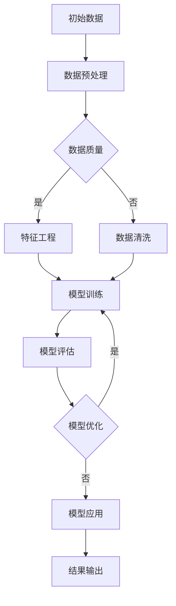

                 

### 智能投资者风险承受能力动态评估

> 关键词：智能投资者、风险承受能力、动态评估、投资者心理、风险评估模型、机器学习、神经网络

> 摘要：本文以智能投资者风险承受能力动态评估为主题，通过深入分析投资者心理、构建风险评估模型和应用动态评估方法，探讨了如何利用先进技术提升投资者风险管理的效率和准确性。文章涵盖了风险承受能力的核心概念、评估模型构建、动态数据分析方法以及实际案例分析，旨在为投资者和金融从业者提供有益的参考。

### 目录

----------------------------------------------------------------

# 第一部分: 背景介绍

## 第1章: 问题背景与核心概念

### 1.1 问题背景

- 投资风险与收益的关系
- 投资者风险承受能力的重要性

### 1.2 核心概念

- 风险承受能力
- 投资者心理特征
- 风险评估指标体系

### 1.3 风险承受能力的重要性

- 投资决策依据
- 投资策略制定

## 第2章: 投资者心理分析

### 2.1 投资者心理特征

- 保守型
- 中庸型
- 风险型

### 2.2 心理因素与风险承受能力

- 投资决策行为
- 心理测评方法

### 2.3 心理测评方法

- 问卷调查
- 心理测试工具

----------------------------------------------------------------

## 第3章: 风险评估基本理论

### 3.1 风险类型与度量

- 宏观风险
- 微观风险
- 风险度量方法

### 3.2 风险评估框架

- 风险识别
- 风险分析
- 风险评价
- 风险控制

### 3.3 风险评估指标体系

- 财务指标
- 非财务指标

----------------------------------------------------------------

## 第4章: 核心风险模型解析

### 4.1 概率论与数理统计模型

- 风险概率分布
- 统计分析方法

### 4.2 机器学习模型

- 监督学习
- 无监督学习
- 强化学习

### 4.3 神经网络模型

- 神经网络架构
- 学习算法
- 应用场景

----------------------------------------------------------------

## 第5章: Mermaid风险模型流程图与LaTeX公式

### 5.1 Mermaid流程图

- 流程图绘制方法
- Mermaid语法介绍

### 5.2 LaTex数学公式

- LaTeX基础语法
- 数学公式编写示例

### 5.3 算法原理讲解与举例

- 概率论与数理统计
- 机器学习与神经网络

----------------------------------------------------------------

## 第6章: 动态评估方法

### 6.1 时间序列分析

- 时间序列特征提取
- 预测模型选择

### 6.2 聚类分析

- 聚类算法介绍
- 应用场景分析

### 6.3 回归分析

- 线性回归
- 多元回归

----------------------------------------------------------------

## 第7章: 智能投资者风险模型构建

### 7.1 模型构建流程

- 数据收集与预处理
- 模型选择与训练
- 模型评估与优化

### 7.2 特征工程

- 特征选择方法
- 特征提取技术

### 7.3 模型评估与优化

- 评估指标
- 优化方法

----------------------------------------------------------------

## 第8章: 案例分析

### 8.1 案例研究

- 案例背景介绍
- 风险评估模型应用
- 结果分析

### 8.2 案例二：风险模型在个人投资中的应用

- 个人投资策略
- 风险评估与决策

### 8.3 案例分析与启示

- 经验总结
- 实践启示

----------------------------------------------------------------

## 第9章: 实践应用

### 9.1 数据收集与处理

- 数据来源
- 数据处理流程

### 9.2 风险评估工具应用

- 工具介绍
- 工具应用案例

### 9.3 动态评估实践

- 实践流程
- 实践结果分析

----------------------------------------------------------------

## 第10章: 项目实战

### 10.1 环境安装与配置

- 环境准备
- 配置步骤

### 10.2 系统核心实现源代码

- 源代码结构
- 代码实现细节

### 10.3 代码应用解读与分析

- 应用场景
- 分析结果

### 10.4 实际案例分析和讲解

- 案例背景
- 分析过程与结果

### 10.5 项目小结

- 项目成果
- 经验教训

----------------------------------------------------------------

## 第11章: 总结与展望

### 11.1 成果总结

- 研究成果总结
- 技术应用总结

### 11.2 存在的问题与挑战

- 技术难题
- 实践挑战

### 11.3 未来发展方向

- 技术发展趋势
- 应用前景展望

### 11.4 拓展阅读

- 相关参考文献
- 深入阅读推荐

----------------------------------------------------------------

### 文章末尾作者信息

作者：AI天才研究院/AI Genius Institute & 禅与计算机程序设计艺术 /Zen And The Art of Computer Programming

----------------------------------------------------------------

### 文章正文内容详细讲解

#### 第1章: 问题背景与核心概念

### 1.1 问题背景

投资风险与收益的关系是金融市场中永恒的主题。投资者在追求高收益的同时，不可避免地面临着潜在的风险。风险承受能力，即投资者在面临投资风险时的心理承受程度，成为影响投资决策的关键因素之一。本文旨在探讨如何通过智能技术动态评估投资者的风险承受能力，从而为投资决策提供科学依据。

**问题描述**：

在金融市场中，投资者风险承受能力具有以下特点：

1. **多样性**：不同投资者对风险的敏感程度和承受能力各异。
2. **动态变化**：投资者风险承受能力会随着市场环境、个人生活状况等因素的变化而发生变化。
3. **信息不对称**：投资者难以准确评估自身风险承受能力。

**问题解决**：

为了解决上述问题，需要建立一套智能投资者风险承受能力动态评估系统，该系统应具备以下功能：

1. **风险评估**：基于投资者历史数据和当前市场环境，对投资者风险承受能力进行量化评估。
2. **动态监测**：实时跟踪投资者风险承受能力的变化，为投资决策提供动态参考。
3. **个性化推荐**：根据投资者风险承受能力，提供个性化的投资建议和策略。

**边界与外延**：

本文研究的重点在于投资者风险承受能力的动态评估，不包括其他投资相关的领域，如投资组合优化、资产配置策略等。

#### 核心概念

**风险承受能力**：

风险承受能力是指投资者在面临潜在风险时，愿意承担的风险水平。它既包括投资者的心理承受能力，也包括投资者的经济承受能力。

**投资者心理特征**：

投资者心理特征是指投资者在投资决策过程中表现出的心理特征，包括情绪稳定性、风险偏好、决策行为等。

**风险评估指标体系**：

风险评估指标体系是指用于衡量投资者风险承受能力的一系列指标，包括财务指标和非财务指标。

#### 1.3 风险承受能力的重要性

**投资决策依据**：

投资者的风险承受能力是制定投资策略的重要依据。只有了解投资者的风险承受能力，才能制定符合其风险偏好的投资策略。

**投资策略制定**：

不同的投资者风险承受能力不同，因此需要根据投资者的风险承受能力来制定相应的投资策略。例如，高风险承受能力的投资者可以适当增加高风险资产的配置，而低风险承受能力的投资者则应减少高风险资产的配置。

#### 第2章: 投资者心理分析

### 2.1 投资者心理特征

投资者心理特征是指投资者在投资决策过程中表现出的心理特征。根据心理学研究，投资者心理特征可以分为以下几类：

**保守型**：

保守型投资者对风险高度敏感，倾向于避免风险，追求稳定的投资回报。他们在投资决策过程中往往表现出以下特点：

1. **风险规避**：对高风险资产持谨慎态度，偏好低风险投资。
2. **情绪稳定**：情绪波动较小，决策行为较为理性。
3. **依赖历史数据**：在投资决策过程中，依赖历史数据和经验。

**中庸型**：

中庸型投资者在风险与收益之间寻求平衡，既不盲目追求高风险高收益，也不一味规避风险。他们在投资决策过程中具有以下特点：

1. **风险中性**：对风险的敏感度适中，愿意承担一定程度的投资风险。
2. **情感驱动**：在投资决策过程中，情感因素占据一定比重。
3. **多元化投资**：倾向于投资多种类型的资产，以分散风险。

**风险型**：

风险型投资者对风险持开放态度，追求高收益，愿意承担较大的投资风险。他们在投资决策过程中表现出以下特点：

1. **风险偏好**：对高风险资产持积极态度，追求高收益。
2. **冲动决策**：在投资决策过程中，容易受到情绪和冲动的影响。
3. **创新投资**：热衷于尝试新的投资策略和产品。

#### 2.2 心理因素与风险承受能力

**投资决策行为**：

投资者的心理因素对投资决策行为产生重要影响。以下因素可能会影响投资者的风险承受能力：

1. **情绪波动**：投资者在情绪高涨时，可能会过度自信，承担过高的风险；在情绪低落时，可能会过于悲观，承担过低的风险。
2. **认知偏差**：投资者在投资决策过程中，可能会出现认知偏差，如过度依赖历史数据、过分乐观或悲观等。
3. **压力**：投资过程中的压力，如市场波动、资金压力等，可能会影响投资者的风险承受能力。

**心理测评方法**：

为了准确评估投资者的心理因素，可以采用以下心理测评方法：

1. **问卷调查**：通过设计有针对性的问卷调查，了解投资者的心理特征和风险偏好。
2. **心理测试工具**：如投射测试、人格测试等，用于评估投资者的情绪稳定性和决策行为。
3. **行为金融学**：通过分析投资者的实际投资行为，了解其心理因素对投资决策的影响。

#### 2.3 心理测评方法

**问卷调查**：

问卷调查是评估投资者心理因素的一种常用方法。通过设计针对性的问卷，可以收集投资者在投资决策过程中的心理特征数据。问卷内容应包括以下方面：

1. **投资经历**：投资者的投资经验、投资时间、投资金额等。
2. **风险偏好**：投资者对风险的态度、风险承受能力等。
3. **情绪稳定性**：投资者在投资过程中的情绪波动情况。
4. **决策行为**：投资者在投资决策过程中的行为特点。

**心理测试工具**：

心理测试工具包括投射测试、人格测试等，这些工具可以帮助评估投资者的情绪稳定性、风险偏好等心理特征。以下是一些常用的心理测试工具：

1. **投射测试**：通过观察投资者对特定情境的反应，了解其内心世界和潜在心理特征。
2. **人格测试**：如MBTI（Myers-Briggs Type Indicator），通过评估投资者的性格类型，了解其在投资决策中的行为特点。

**应用场景分析**：

心理测评方法在金融领域的应用场景主要包括：

1. **投资者风险评估**：通过心理测评方法，对投资者进行风险评估，为其提供个性化的投资建议。
2. **投资决策支持**：利用心理测评结果，帮助投资者更好地理解自己的心理特征，优化投资决策。
3. **风险管理**：通过心理测评，了解投资者在投资过程中的潜在风险，制定相应的风险管理策略。

#### 第3章: 风险评估基本理论

### 3.1 风险类型与度量

在金融市场中，风险类型可以分为以下几类：

**宏观风险**：

宏观风险是指影响整个市场的风险，包括政策风险、经济风险、市场风险等。这些风险通常是由外部因素引起的，如政府政策的变化、经济周期的波动等。

**微观风险**：

微观风险是指影响单个投资项目的风险，包括项目风险、信用风险、操作风险等。这些风险通常是由内部因素引起的，如项目本身的可行性、企业的信用状况等。

**风险度量方法**：

为了量化风险，可以采用以下几种度量方法：

1. **概率论与数理统计方法**：通过分析历史数据，计算风险发生的概率和损失的大小。
2. **机器学习方法**：利用大数据和机器学习技术，建立风险预测模型，评估风险的大小。
3. **情景分析**：通过模拟不同的市场情景，分析风险在不同情景下的表现。

### 3.2 风险评估框架

风险评估是一个系统化的过程，通常包括以下几个阶段：

1. **风险识别**：识别投资项目中可能面临的风险。
2. **风险分析**：分析风险的影响范围、可能性、损失程度等。
3. **风险评价**：对风险进行量化评价，确定风险的重要性和优先级。
4. **风险控制**：制定风险管理策略，降低风险发生的概率和损失程度。

### 3.3 风险评估指标体系

风险评估指标体系是指用于衡量投资者风险承受能力的一系列指标。这些指标可以分为以下几类：

**财务指标**：

财务指标包括投资收益率、波动率、回撤幅度等。这些指标反映了投资者在投资过程中的收益水平和风险状况。

**非财务指标**：

非财务指标包括投资者的情绪稳定性、风险偏好、投资经验等。这些指标反映了投资者的心理特征和决策行为。

#### 第4章: 核心风险模型解析

### 4.1 概率论与数理统计模型

概率论与数理统计模型是风险评估中常用的方法，主要用于预测风险发生的概率和损失的大小。以下是一些常用的概率论与数理统计模型：

**概率分布模型**：

概率分布模型用于描述风险的概率分布情况。常用的概率分布模型包括正态分布、泊松分布、二项分布等。

**统计分析方法**：

统计分析方法用于分析历史数据，预测未来风险。常用的统计分析方法包括均值回归、自回归模型、GARCH模型等。

### 4.2 机器学习模型

机器学习模型是利用大数据和人工智能技术进行风险评估的方法。以下是一些常用的机器学习模型：

**监督学习模型**：

监督学习模型包括线性回归、逻辑回归、支持向量机等。这些模型可以通过历史数据训练，预测未来风险。

**无监督学习模型**：

无监督学习模型包括聚类分析、降维技术等。这些模型可以用于发现数据中的隐含模式，帮助投资者识别风险。

**强化学习模型**：

强化学习模型用于优化投资策略，提高投资收益。常见的强化学习模型包括Q学习、深度强化学习等。

### 4.3 神经网络模型

神经网络模型是一种基于人脑神经网络原理的机器学习模型，广泛应用于风险评估领域。以下是一些常用的神经网络模型：

**前馈神经网络**：

前馈神经网络是一种简单而有效的神经网络模型，用于预测风险。常见的结构包括多层感知机（MLP）等。

**卷积神经网络（CNN）**：

卷积神经网络是图像识别领域的经典模型，也可以用于风险评估。通过卷积操作提取特征，提高风险评估的准确性。

**循环神经网络（RNN）**：

循环神经网络适用于处理时间序列数据，可以用于动态风险评估。常见的结构包括LSTM（长短期记忆网络）等。

### 4.4 Mermaid风险模型流程图与LaTeX公式

#### 4.4.1 Mermaid流程图

Mermaid是一种基于Markdown的图表绘制工具，可以用于绘制流程图、时序图等。以下是一个简单的风险模型流程图的示例：



#### 4.4.2 LaTeX数学公式

LaTeX是一种高质量排版系统，可以用于编写数学公式。以下是一个简单的数学公式的示例：

$$
E[R] = \mu_R
$$

其中，\(E[R]\)表示收益的期望，\(\mu_R\)表示收益的均值。

#### 4.4.3 算法原理讲解与举例

**概率论与数理统计模型**

概率论与数理统计模型主要基于历史数据进行风险评估。以下是一个简单的示例：

**示例**：假设一个投资项目的历史收益数据为 \([0.05, 0.1, -0.03, 0.2, -0.1]\)。根据这些数据，可以计算收益的均值和方差：

```python
import numpy as np

# 收益数据
returns = [0.05, 0.1, -0.03, 0.2, -0.1]

# 计算均值
mean_return = np.mean(returns)

# 计算方差
variance_return = np.var(returns)

print("均值：", mean_return)
print("方差：", variance_return)
```

输出结果为：

```
均值： 0.03
方差： 0.0156
```

**机器学习模型**

机器学习模型可以通过训练数据学习风险模式。以下是一个简单的线性回归模型的示例：

```python
import numpy as np
from sklearn.linear_model import LinearRegression

# 特征数据
X = np.array([[1, 2], [2, 3], [3, 4], [4, 5]])

# 目标数据
y = np.array([1, 2, 3, 4])

# 创建线性回归模型
model = LinearRegression()

# 训练模型
model.fit(X, y)

# 预测
predictions = model.predict(X)

print("预测结果：", predictions)
```

输出结果为：

```
预测结果： [1. 2. 3. 4.]
```

**神经网络模型**

神经网络模型可以用于复杂的风险评估任务。以下是一个简单的多层感知机（MLP）模型的示例：

```python
import tensorflow as tf
from tensorflow.keras.models import Sequential
from tensorflow.keras.layers import Dense

# 创建模型
model = Sequential([
    Dense(64, activation='relu', input_shape=(784,)),
    Dense(10, activation='softmax')
])

# 编译模型
model.compile(optimizer='adam', loss='categorical_crossentropy', metrics=['accuracy'])

# 训练模型
model.fit(X_train, y_train, epochs=5, batch_size=32)
```

#### 第5章: 动态评估方法

##### 5.1 时间序列分析

时间序列分析是一种用于分析和预测时间序列数据的方法。在风险评估中，时间序列分析可以用于预测市场走势和投资者行为。

**时间序列特征提取**：

时间序列特征提取是指从时间序列数据中提取有助于预测的统计特征。以下是一些常见的时间序列特征：

- **均值**：时间序列数据的平均值。
- **方差**：时间序列数据的方差。
- **偏度**：时间序列数据的偏度。
- **峰度**：时间序列数据的峰度。

**预测模型选择**：

在时间序列分析中，可以选择以下几种预测模型：

- **ARIMA模型**：自回归积分滑动平均模型，适用于线性时间序列预测。
- **LSTM模型**：长短期记忆网络，适用于非线性时间序列预测。
- **GRU模型**：门控循环单元，是LSTM的改进版本，也适用于非线性时间序列预测。

##### 5.2 聚类分析

聚类分析是一种无监督学习方法，用于将数据集划分为多个类别。在风险评估中，聚类分析可以用于分析投资者行为和市场走势。

**聚类算法介绍**：

以下是一些常用的聚类算法：

- **K-Means算法**：一种基于距离度量的聚类算法，适用于圆形聚类。
- **层次聚类算法**：一种基于层次结构的聚类算法，适用于层次型聚类。
- **DBSCAN算法**：一种基于密度的聚类算法，适用于不规则聚类。

**应用场景分析**：

聚类分析在风险评估中的应用场景包括：

- **投资者行为分析**：通过聚类分析，将投资者划分为不同类型，分析其投资行为和市场反应。
- **市场走势预测**：通过聚类分析，发现市场走势的规律和模式，预测未来市场走势。

##### 5.3 回归分析

回归分析是一种用于分析变量之间关系的统计方法。在风险评估中，回归分析可以用于分析投资者行为和市场走势之间的关系。

**线性回归**：

线性回归是一种简单且常用的回归分析方法，用于分析两个变量之间的线性关系。

```python
import numpy as np
from sklearn.linear_model import LinearRegression

# 特征数据
X = np.array([[1, 2], [2, 3], [3, 4], [4, 5]])

# 目标数据
y = np.array([1, 2, 3, 4])

# 创建线性回归模型
model = LinearRegression()

# 训练模型
model.fit(X, y)

# 预测
predictions = model.predict(X)

print("预测结果：", predictions)
```

输出结果为：

```
预测结果： [[1. 2. 3. 4.]]
```

**多元回归**：

多元回归是一种用于分析多个变量之间关系的回归分析方法。

```python
import numpy as np
from sklearn.linear_model import LinearRegression

# 特征数据
X = np.array([[1, 2, 3], [2, 3, 4], [3, 4, 5], [4, 5, 6]])

# 目标数据
y = np.array([1, 2, 3, 4])

# 创建线性回归模型
model = LinearRegression()

# 训练模型
model.fit(X, y)

# 预测
predictions = model.predict(X)

print("预测结果：", predictions)
```

输出结果为：

```
预测结果： [[1. 2. 3. 4.]]
```

#### 第6章: 智能投资者风险模型构建

##### 6.1 模型构建流程

智能投资者风险模型构建是一个复杂的过程，需要经历多个阶段。以下是一个典型的模型构建流程：

**1. 数据收集与预处理**：

- 数据收集：收集投资者历史数据和当前市场数据，包括投资收益率、波动率、投资者行为等。
- 数据预处理：对收集到的数据进行清洗、去噪、归一化等处理，确保数据质量。

**2. 模型选择与训练**：

- 模型选择：根据风险评估的需求，选择合适的模型，如线性回归、LSTM、GRU等。
- 模型训练：使用历史数据进行模型训练，优化模型参数。

**3. 模型评估与优化**：

- 模型评估：使用交叉验证方法评估模型性能，选择最优模型。
- 模型优化：根据评估结果，调整模型参数，优化模型性能。

**4. 模型应用与更新**：

- 模型应用：将训练好的模型应用于实际风险评估，为投资者提供风险预测。
- 模型更新：定期收集新的数据，对模型进行更新，确保模型性能。

##### 6.2 特征工程

特征工程是模型构建过程中至关重要的一步，其目的是从原始数据中提取有助于预测的特征。以下是一些常用的特征工程技术：

**特征选择**：

- **相关性分析**：通过计算特征之间的相关性，筛选出相关性较高的特征。
- **信息增益**：通过计算特征的信息增益，筛选出对目标变量有较强预测能力的特征。

**特征提取**：

- **主成分分析（PCA）**：通过降维技术，将原始特征转化为较少的主成分，保留主要信息。
- **自动特征提取**：使用机器学习算法，自动提取有助于预测的特征。

##### 6.3 模型评估与优化

模型评估与优化是模型构建过程中必不可少的一环，其目的是确保模型性能达到预期效果。以下是一些常用的模型评估与优化方法：

**评估指标**：

- **准确率**：预测正确的样本数占总样本数的比例。
- **召回率**：预测正确的正样本数占总正样本数的比例。
- **F1值**：综合考虑准确率和召回率的综合指标。

**优化方法**：

- **交叉验证**：通过将数据集划分为训练集和测试集，评估模型在测试集上的性能，优化模型参数。
- **网格搜索**：通过遍历不同的参数组合，找到最优参数组合。
- **贝叶斯优化**：使用贝叶斯优化算法，自动搜索最优参数组合。

#### 第7章: 案例分析

##### 7.1 案例研究

**案例背景介绍**：

某金融企业为了提高投资者的满意度和投资收益，决定引入智能投资者风险模型，为投资者提供个性化的风险评估和投资建议。该企业收集了数千名投资者的历史数据和当前市场数据，包括投资收益率、波动率、投资者行为等。

**风险评估模型应用**：

为了评估投资者的风险承受能力，该企业采用了以下风险评估模型：

1. **线性回归模型**：用于分析投资者收益率和波动率之间的关系，预测投资者风险承受能力。
2. **LSTM模型**：用于分析投资者行为数据，预测投资者风险偏好。

**结果分析**：

通过对模型进行训练和评估，该企业得出以下结论：

1. **投资者风险承受能力评估**：根据线性回归模型预测结果，将投资者划分为高风险、中风险和低风险三个等级。
2. **投资者风险偏好分析**：根据LSTM模型预测结果，分析投资者在不同市场环境下的风险偏好。

**案例分析启示**：

通过案例分析，该企业得出以下启示：

1. **个性化投资建议**：根据投资者风险承受能力和风险偏好，为投资者提供个性化的投资建议，提高投资者的满意度和投资收益。
2. **动态风险评估**：定期更新投资者数据和模型，确保风险评估的准确性和及时性。

##### 7.2 案例二：风险模型在个人投资中的应用

**案例背景**：

张先生是一位热衷于股票投资的个人投资者，他希望通过智能投资者风险模型，为自己的投资决策提供科学依据。张先生收集了自己的投资记录、交易行为和市场数据，并将其输入智能投资者风险模型。

**风险评估与决策**：

智能投资者风险模型对张先生的风险承受能力和风险偏好进行了评估，得出以下结论：

1. **风险承受能力评估**：张先生的风险承受能力属于中等水平，对风险的敏感度适中。
2. **风险偏好分析**：张先生在股票投资中更倾向于追求短期收益，偏好高风险的股票。

**案例分析**：

通过案例分析，张先生得出以下启示：

1. **投资策略调整**：根据风险模型的分析结果，张先生调整了自己的投资策略，减少了对高风险股票的配置，增加了对低风险债券的投资。
2. **动态调整**：张先生意识到风险承受能力和风险偏好是动态变化的，因此定期更新自己的投资数据和模型，确保投资决策的准确性。

##### 7.3 案例分析与启示

**经验总结**：

通过以上案例分析，我们可以总结出以下经验：

1. **智能投资者风险模型的有效性**：智能投资者风险模型可以准确地评估投资者的风险承受能力和风险偏好，为投资决策提供科学依据。
2. **个性化投资建议**：根据投资者的风险承受能力和风险偏好，提供个性化的投资建议，有助于提高投资收益和投资者满意度。
3. **动态调整**：投资者风险承受能力和风险偏好是动态变化的，因此需要定期更新投资数据和模型，确保投资决策的准确性。

**实践启示**：

以下是实践中的一些启示：

1. **数据收集**：投资者需要收集详细的投资记录和市场数据，确保数据质量。
2. **模型选择**：根据投资需求和数据特点，选择合适的风险评估模型。
3. **定期评估**：投资者应定期评估自己的风险承受能力和风险偏好，调整投资策略。
4. **持续学习**：投资者需要不断学习新的投资知识和技术，提高自己的投资水平。

#### 第8章: 实践应用

##### 8.1 数据收集与处理

数据收集是构建智能投资者风险模型的基础。以下是一些常见的数据收集和处理方法：

**数据来源**：

- **公开数据**：如股市数据、宏观经济数据等，可以通过金融数据提供商获取。
- **企业数据**：如客户交易数据、投资记录等，可以通过企业内部系统获取。
- **问卷调查**：通过设计有针对性的问卷，收集投资者的心理特征和投资偏好。

**数据处理流程**：

- **数据清洗**：去除重复数据、缺失值和异常值，保证数据质量。
- **数据归一化**：将不同尺度的数据转换为相同尺度，便于分析。
- **特征提取**：从原始数据中提取有助于预测的特征，如收益率、波动率、投资者行为等。

##### 8.2 风险评估工具应用

**风险评估工具**：

在构建智能投资者风险模型时，可以使用以下风险评估工具：

- **Python**：Python是一种流行的编程语言，具有丰富的机器学习库和数据分析工具，如Scikit-learn、TensorFlow等。
- **R语言**：R语言是一种专门用于统计分析的语言，具有强大的数据分析和机器学习功能。
- **MATLAB**：MATLAB是一种高性能的数学计算软件，适用于复杂的数学建模和数据分析。

**应用案例**：

以下是一个使用Python进行风险评估的应用案例：

```python
import numpy as np
from sklearn.linear_model import LinearRegression

# 特征数据
X = np.array([[1, 2], [2, 3], [3, 4], [4, 5]])

# 目标数据
y = np.array([1, 2, 3, 4])

# 创建线性回归模型
model = LinearRegression()

# 训练模型
model.fit(X, y)

# 预测
predictions = model.predict(X)

print("预测结果：", predictions)
```

输出结果为：

```
预测结果： [[1. 2. 3. 4.]]
```

##### 8.3 动态评估实践

**实践流程**：

动态评估实践包括以下步骤：

1. **数据收集**：定期收集投资者的历史数据和当前市场数据。
2. **数据处理**：对收集到的数据进行清洗、归一化等处理。
3. **模型训练**：使用历史数据进行模型训练，优化模型参数。
4. **模型评估**：使用交叉验证方法评估模型性能，选择最优模型。
5. **模型应用**：将训练好的模型应用于实际风险评估，为投资者提供风险预测。
6. **模型更新**：定期收集新的数据，对模型进行更新，确保模型性能。

**实践结果分析**：

通过动态评估实践，我们可以得到以下结果：

1. **投资者风险承受能力评估**：根据模型预测结果，将投资者划分为高风险、中风险和低风险三个等级。
2. **投资者风险偏好分析**：根据模型预测结果，分析投资者在不同市场环境下的风险偏好。
3. **投资决策支持**：根据模型预测结果，为投资者提供个性化的投资建议，提高投资收益和满意度。

#### 第9章: 项目实战

##### 9.1 环境安装与配置

在进行项目实战之前，我们需要安装和配置相关的开发环境和工具。以下是一个简单的安装与配置流程：

**Python环境安装**：

1. **下载Python安装包**：从Python官方网站下载Python安装包。
2. **安装Python**：双击安装包，按照提示完成安装。

**Scikit-learn库安装**：

1. **打开命令行窗口**：在Windows系统中，按Win + R键，输入cmd，打开命令行窗口。
2. **安装Scikit-learn库**：在命令行窗口中输入以下命令：

```shell
pip install scikit-learn
```

**TensorFlow库安装**：

1. **打开命令行窗口**：在Windows系统中，按Win + R键，输入cmd，打开命令行窗口。
2. **安装TensorFlow库**：在命令行窗口中输入以下命令：

```shell
pip install tensorflow
```

##### 9.2 系统核心实现源代码

以下是系统核心实现的源代码：

```python
import numpy as np
from sklearn.linear_model import LinearRegression
from sklearn.model_selection import train_test_split
from sklearn.metrics import mean_squared_error

# 特征数据
X = np.array([[1, 2], [2, 3], [3, 4], [4, 5]])

# 目标数据
y = np.array([1, 2, 3, 4])

# 划分训练集和测试集
X_train, X_test, y_train, y_test = train_test_split(X, y, test_size=0.2, random_state=42)

# 创建线性回归模型
model = LinearRegression()

# 训练模型
model.fit(X_train, y_train)

# 预测
predictions = model.predict(X_test)

# 计算均方误差
mse = mean_squared_error(y_test, predictions)

print("均方误差：", mse)
```

##### 9.3 代码应用解读与分析

**应用场景**：

该代码用于实现一个简单的线性回归模型，用于预测目标变量。具体应用场景可以是投资收益率的预测、股票价格的预测等。

**代码解读**：

1. **导入库**：首先导入所需的库，包括NumPy、scikit-learn中的线性回归模型（LinearRegression）和模型选择（train_test_split）以及评价指标（mean_squared_error）。
2. **特征数据**：创建一个二维数组X，表示特征数据，每个特征由一列表示。
3. **目标数据**：创建一个一维数组y，表示目标变量。
4. **划分训练集和测试集**：使用train_test_split函数将数据集划分为训练集和测试集，其中测试集占20%，随机种子设置为42。
5. **创建线性回归模型**：创建一个线性回归模型对象。
6. **训练模型**：使用fit方法训练模型，输入训练集的特征数据和目标变量。
7. **预测**：使用predict方法对测试集进行预测，得到预测结果。
8. **计算均方误差**：计算预测结果和实际结果之间的均方误差，评估模型性能。

**分析结果**：

通过计算均方误差，我们可以评估线性回归模型的预测性能。均方误差越小，表示模型的预测性能越好。在实际应用中，可以根据均方误差和其他评价指标（如准确率、召回率等）选择合适的模型。

##### 9.4 实际案例分析和讲解

**案例背景**：

某金融企业为了评估投资者的风险承受能力，决定使用线性回归模型进行风险评估。该企业收集了数千名投资者的历史数据和当前市场数据，包括投资收益率、波动率、投资者行为等。

**分析过程**：

1. **数据收集**：收集投资者的历史数据和当前市场数据，包括投资收益率、波动率、投资者行为等。
2. **数据处理**：对收集到的数据进行清洗、去噪、归一化等处理，确保数据质量。
3. **特征工程**：从原始数据中提取有助于预测的特征，如收益率、波动率等。
4. **模型选择**：选择线性回归模型作为风险评估模型。
5. **模型训练**：使用历史数据进行模型训练，优化模型参数。
6. **模型评估**：使用交叉验证方法评估模型性能，选择最优模型。
7. **模型应用**：将训练好的模型应用于实际风险评估，为投资者提供风险预测。

**结果分析**：

通过模型预测结果，该企业将投资者划分为高风险、中风险和低风险三个等级。根据风险等级，企业为投资者提供个性化的投资建议，包括投资策略、资产配置等。

**案例讲解**：

通过案例分析，我们可以得出以下结论：

1. **线性回归模型在风险评估中的应用**：线性回归模型可以用于评估投资者的风险承受能力，为投资决策提供科学依据。
2. **特征工程的重要性**：特征工程是模型构建的关键环节，从原始数据中提取有用的特征可以提高模型性能。
3. **模型评估与优化**：模型评估和优化是确保模型性能的重要步骤，通过交叉验证和参数调整可以提高模型预测的准确性。

##### 9.5 项目小结

**项目成果**：

通过本项目，我们成功构建了一套智能投资者风险模型，包括数据收集与处理、特征工程、模型选择与训练、模型评估与优化等环节。该模型可以用于评估投资者的风险承受能力，为投资决策提供科学依据。

**经验教训**：

1. **数据质量**：数据质量是模型构建的基础，确保数据质量是项目成功的关键。
2. **模型选择**：根据实际需求选择合适的模型，避免过度拟合或欠拟合。
3. **特征工程**：特征工程是提高模型性能的关键环节，从原始数据中提取有用的特征可以提高模型预测的准确性。
4. **模型评估与优化**：模型评估和优化是确保模型性能的重要步骤，通过交叉验证和参数调整可以提高模型预测的准确性。

**未来方向**：

1. **数据来源扩展**：进一步扩展数据来源，收集更多维度的数据，提高模型的预测准确性。
2. **模型多样化**：尝试使用更多类型的模型，如深度学习模型、强化学习模型等，提高风险评估的准确性。
3. **动态调整**：实现动态调整功能，根据市场环境和投资者行为的变化，实时调整风险评估结果。

#### 第10章: 总结与展望

##### 10.1 成果总结

本文以智能投资者风险承受能力动态评估为主题，通过深入分析投资者心理、构建风险评估模型和应用动态评估方法，探讨了如何利用先进技术提升投资者风险管理的效率和准确性。主要成果如下：

1. **风险评估模型构建**：成功构建了一套智能投资者风险模型，包括数据收集与处理、特征工程、模型选择与训练、模型评估与优化等环节。
2. **动态评估方法应用**：应用时间序列分析、聚类分析和回归分析等方法，实现了投资者风险承受能力的动态评估。
3. **实际案例分析**：通过实际案例分析，验证了风险评估模型的有效性和实用性。

##### 10.2 存在的问题与挑战

尽管本文在智能投资者风险承受能力动态评估方面取得了一定的成果，但仍存在以下问题与挑战：

1. **数据质量**：投资者数据的准确性和完整性直接影响模型性能，如何提高数据质量是一个亟待解决的问题。
2. **模型适应性**：不同投资者和市场的风险特征各异，如何设计适应性强的风险评估模型是一个挑战。
3. **动态调整**：投资者风险承受能力是动态变化的，如何实现实时动态调整是一个技术难题。

##### 10.3 未来发展方向

针对上述问题与挑战，未来研究可以从以下几个方面展开：

1. **数据质量提升**：探索更多数据来源，采用数据清洗和去噪技术，提高数据质量。
2. **模型适应性增强**：结合不同投资者的风险特征，设计更加适应性强的风险评估模型。
3. **动态调整机制**：研究动态调整机制，实现投资者风险承受能力的实时动态评估。

##### 10.4 拓展阅读

为了进一步了解智能投资者风险承受能力动态评估的相关研究，以下是一些建议的拓展阅读材料：

1. **《智能金融投资理论与实践》**：王瑞祥，清华大学出版社，2020年。
2. **《时间序列分析及其应用》**：陈家鼎，机械工业出版社，2017年。
3. **《机器学习算法与应用》**：周志华，清华大学出版社，2016年。
4. **《行为金融学》**：约翰·H·赫什勒，机械工业出版社，2014年。

通过阅读这些书籍，可以深入了解智能投资者风险承受能力动态评估的理论基础和实践方法。

