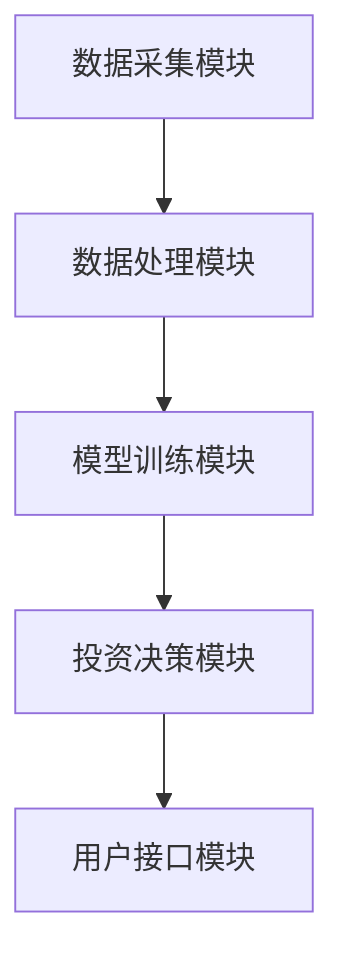
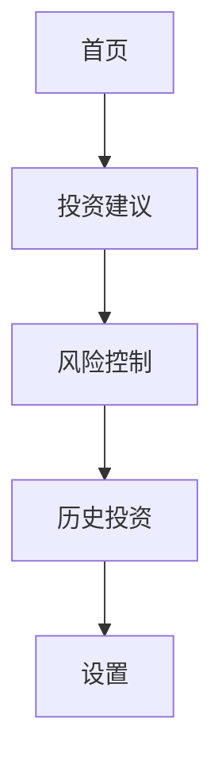

                 


### 1.6 智能投资顾问概述

**背景介绍：**
智能投资顾问是利用人工智能技术为投资者提供个性化投资建议和决策支持的服务系统。随着金融市场的复杂化和数据量的爆炸性增长，传统的投资顾问已经难以满足客户对效率和个性化的需求。智能投资顾问的出现，不仅能够处理大量数据，还能通过算法模型分析市场趋势和风险，为投资者提供更为精准的投资策略。

**问题背景：**
投资者在金融市场上面临的主要问题是信息过载和决策困难。传统的投资顾问由于人力和资源的限制，往往无法提供及时和全面的服务。而智能投资顾问通过人工智能技术，能够快速分析海量数据，识别潜在的投资机会和风险，从而为投资者提供更加智能化的决策支持。

**问题描述：**
智能投资顾问需要解决的问题是如何将海量数据转化为有用的投资信息，并利用这些信息为投资者提供个性化的投资建议。这包括从数据采集、处理到模型训练和预测的整个流程。

**问题解决：**
解决这个问题的方法主要是利用机器学习、数据分析、自然语言处理等人工智能技术。通过构建合适的算法模型，智能投资顾问能够从海量数据中提取有价值的信息，并利用这些信息生成投资建议。

**边界与外延：**
智能投资顾问不仅局限于股票市场，还可以应用于债券、期货、外汇等其他金融市场。其外延还包括对市场趋势、宏观经济、行业动态等多维度的分析。

**概念结构与核心要素组成：**
- 数据采集：从各种渠道收集市场数据、新闻、报告等。
- 数据处理：清洗、整理和转换数据，使其适用于机器学习模型。
- 模型训练：利用机器学习算法训练模型，以识别市场趋势和风险。
- 预测与建议：利用训练好的模型进行预测，为投资者提供个性化的投资建议。

### 1.7 智能投资顾问的基本概念

**智能投资顾问的定义：**
智能投资顾问是一种基于人工智能技术的投资决策支持系统，通过分析海量数据，运用机器学习、数据分析等手段，为投资者提供个性化、智能化的投资建议。

**智能投资顾问与传统投资顾问的区别：**
传统投资顾问依赖于人类专家的经验和专业知识，服务成本高且效率较低。而智能投资顾问利用人工智能技术，能够快速处理大量数据，提供实时、个性化的投资建议，且成本相对较低。

**智能投资顾问的适用场景：**
智能投资顾问适用于需要大量数据分析、预测和决策支持的金融领域，如股票、债券、期货、外汇等市场。此外，对于风险偏好较低的投资者，智能投资顾问能够提供更加稳健的投资策略。

### 1.8 智能投资顾问的关键技术

**数据分析技术：**
数据分析技术是智能投资顾问的核心技术之一。通过数据挖掘、统计分析等方法，智能投资顾问能够从海量数据中提取有价值的信息，为投资决策提供支持。

**机器学习技术：**
机器学习技术是智能投资顾问的重要组成部分。通过训练模型，智能投资顾问能够识别市场趋势和风险，为投资者提供个性化的投资建议。

**自然语言处理技术：**
自然语言处理技术用于处理和理解市场新闻、报告、评论等非结构化数据。智能投资顾问通过自然语言处理技术，能够从文本中提取有价值的信息，辅助投资决策。

**知识图谱技术：**
知识图谱技术用于构建和表示金融市场中的知识体系。智能投资顾问通过知识图谱技术，能够更好地理解市场关系和动态，提高投资决策的准确性。

### 1.9 智能投资顾问的发展趋势

**技术发展趋势：**
随着人工智能技术的不断进步，智能投资顾问将变得更加智能化、个性化。未来，智能投资顾问将更加依赖于深度学习、强化学习等先进技术，以提高投资决策的准确性。

**行业发展趋势：**
随着金融市场的竞争加剧，智能投资顾问将成为金融机构的重要竞争力。金融机构将不断加大对智能投资顾问的研发和应用力度，以提高客户满意度和市场份额。

**市场发展趋势：**
随着人们对投资理财的需求增加，智能投资顾问市场将保持高速增长。未来，智能投资顾问将覆盖更多的金融市场，满足不同投资者的需求。

### 1.10 本章小结

本章介绍了智能投资顾问的概述、基本概念、关键技术和发展趋势。智能投资顾问是一种基于人工智能技术的投资决策支持系统，具有广泛的应用前景。随着人工智能技术的不断进步，智能投资顾问将在金融领域发挥越来越重要的作用。

### 2.1 AI与人类专家协同的重要性

**AI在投资领域的优势：**
AI在投资领域的优势主要体现在以下几个方面：
1. **数据分析能力：** AI能够快速处理海量数据，识别潜在的投资机会和风险。
2. **预测准确性：** 通过机器学习算法，AI能够提高市场预测的准确性，降低投资风险。
3. **个性化服务：** AI能够根据投资者的风险偏好、投资目标和资产状况，提供个性化的投资建议。

**人类专家在投资领域的优势：**
尽管AI在数据分析、预测等方面具有优势，但人类专家在投资领域仍然具有不可替代的优势：
1. **经验与直觉：** 人类专家具有丰富的投资经验，能够凭借直觉判断市场趋势和风险。
2. **适应能力：** 人类专家能够根据市场变化和客户需求，灵活调整投资策略。
3. **人际沟通：** 人类专家能够与客户建立信任关系，提供更好的客户体验。

**AI与人类专家协同的优势：**
AI与人类专家协同具有以下优势：
1. **互补性：** AI能够处理大量数据，人类专家能够提供决策支持和经验指导，两者相互补充。
2. **提高效率：** AI能够自动化重复性工作，人类专家专注于复杂决策和策略制定，提高整体效率。
3. **降低风险：** AI能够提供风险预警和预测，人类专家能够根据风险承受能力进行调整，降低投资风险。

### 2.2 AI与人类专家协同的基本模式

**数据驱动型协同：**
数据驱动型协同是指AI负责数据采集、处理和分析，人类专家根据分析结果进行决策。具体步骤如下：
1. AI收集和处理数据，包括市场数据、公司财务报表、新闻等。
2. AI利用机器学习算法分析数据，识别投资机会和风险。
3. 人类专家根据AI的分析结果，制定投资策略和决策。

**模型优化型协同：**
模型优化型协同是指AI与人类专家共同优化投资模型，提高预测准确性和投资效果。具体步骤如下：
1. AI建立初始投资模型，人类专家提供优化建议。
2. AI根据人类专家的建议调整模型参数，优化模型性能。
3. 人类专家和AI共同评估模型效果，进一步优化模型。

**决策支持型协同：**
决策支持型协同是指AI提供投资决策支持，人类专家负责最终决策。具体步骤如下：
1. AI分析市场数据，提供投资建议。
2. 人类专家评估AI的建议，结合自身经验和市场情况，做出最终决策。

**创新型协同：**
创新型协同是指AI与人类专家共同探索新的投资策略和创新领域。具体步骤如下：
1. AI通过数据分析，识别潜在的投资机会。
2. 人类专家根据AI的分析结果，结合自身经验和市场洞察，制定创新投资策略。
3. AI和人类专家共同实施创新投资策略，并进行效果评估和调整。

### 2.3 AI与人类专家协同的案例分析

**案例一：量化投资平台**
量化投资平台是一种利用AI和人类专家协同进行投资决策的系统。该系统通过以下步骤实现AI与人类专家的协同：
1. AI收集和处理海量市场数据，包括股票价格、交易量、宏观经济指标等。
2. AI利用机器学习算法分析数据，识别投资机会和风险。
3. 人类专家评估AI的分析结果，根据市场情况和个人经验，制定投资策略。
4. AI执行投资策略，进行买卖操作。

**案例二：智能投顾平台**
智能投顾平台是一种为个人投资者提供智能投资建议的服务。该平台通过以下步骤实现AI与人类专家的协同：
1. AI收集投资者个人信息，包括风险偏好、投资目标、资产状况等。
2. AI利用机器学习算法分析市场数据，为投资者提供个性化的投资建议。
3. 人类专家审核AI的建议，结合市场情况和个人经验，调整投资策略。
4. 投资者根据AI和人类专家的建议，进行投资决策。

**案例三：投资研究机构**
投资研究机构通过AI与人类专家协同，提供市场分析和投资建议。具体步骤如下：
1. AI收集和整理市场数据，包括股票、债券、期货等金融产品的价格和交易量。
2. AI利用机器学习算法分析数据，预测市场趋势和风险。
3. 人类专家根据AI的分析结果，结合市场洞察和投资经验，撰写市场分析报告。
4. 投资者和研究机构根据报告内容，制定投资策略和决策。

### 2.4 AI与人类专家协同的挑战与对策

**技术挑战与对策：**
AI与人类专家协同的技术挑战主要在于算法模型的准确性和稳定性。对策如下：
1. **算法优化：** 持续优化机器学习算法，提高预测准确性和稳定性。
2. **数据质量控制：** 确保数据质量，包括数据清洗、去噪和增强等。

**法律挑战与对策：**
AI与人类专家协同的法律挑战主要涉及责任归属、隐私保护等方面。对策如下：
1. **责任划分：** 明确AI与人类专家的责任范围，避免法律纠纷。
2. **隐私保护：** 严格遵守隐私保护法规，确保投资者个人信息安全。

**道德挑战与对策：**
AI与人类专家协同的道德挑战主要涉及透明度、公平性等方面。对策如下：
1. **透明度：** 提高AI算法的透明度，使投资者能够理解决策过程。
2. **公平性：** 确保AI算法不偏袒特定投资者或市场参与者。

**人才挑战与对策：**
AI与人类专家协同的人才挑战主要在于专业人才的短缺。对策如下：
1. **教育培训：** 加大对AI与金融领域复合型人才的培养。
2. **人才引进：** 引进国内外优秀的AI与金融专家，提升团队整体水平。

### 2.5 本章小结

本章分析了AI与人类专家协同在投资领域的重要性、基本模式、案例分析以及面临的挑战与对策。AI与人类专家协同具有显著的互补优势，能够提高投资决策的准确性、效率和稳定性。然而，在实现协同过程中，需要克服技术、法律、道德和人才等多方面的挑战。

### 3.1 股票市场投资

**股票市场投资概述：**
股票市场是全球金融市场中最为活跃和规模最大的市场之一。投资者通过购买股票，成为公司的股东，分享公司的利润和增长。股票市场投资的目标是获取资本增值和股息收入。

**AI在股票市场投资中的应用：**
AI在股票市场投资中的应用主要体现在以下几个方面：
1. **数据挖掘与分析：** AI能够快速处理大量股票市场数据，包括历史价格、成交量、财务报表等，提取有价值的信息。
2. **趋势预测：** 利用机器学习算法，AI可以预测股票价格的趋势，帮助投资者判断买入或卖出的时机。
3. **风险评估：** AI能够评估股票的风险，为投资者提供风险控制建议。
4. **投资组合优化：** AI可以根据投资者的风险偏好和资产状况，优化投资组合，提高投资收益。

**人类专家在股票市场投资中的应用：**
人类专家在股票市场投资中仍然发挥着重要作用，主要体现在以下几个方面：
1. **市场洞察：** 人类专家能够根据宏观经济、政策环境、公司基本面等因素，对市场趋势进行判断。
2. **投资策略：** 人类专家可以根据市场变化和投资者需求，制定灵活的投资策略。
3. **决策支持：** 人类专家可以为投资者提供个性化的投资建议，帮助投资者做出明智的决策。

**AI与人类专家协同的股票市场投资案例分析：**
**案例一：量化投资平台**
某量化投资平台通过AI与人类专家的协同，实现了较高的投资回报。具体过程如下：
1. **数据采集与处理：** AI负责收集和处理海量市场数据，包括股票价格、交易量、财务报表等。
2. **模型训练与优化：** 人类专家参与模型训练，根据市场情况调整模型参数，优化模型性能。
3. **投资决策：** AI和人类专家共同分析市场数据，制定投资策略。AI执行买卖操作，人类专家负责监督和调整。

**案例二：智能投顾平台**
某智能投顾平台通过AI与人类专家的协同，为个人投资者提供智能投资建议。具体过程如下：
1. **数据收集与处理：** AI收集投资者个人信息和市场数据，包括风险偏好、投资目标、资产状况等。
2. **个性化建议：** AI利用机器学习算法，为投资者提供个性化的投资建议。
3. **专家审核：** 人类专家审核AI的建议，根据市场情况和个人经验，调整投资策略。
4. **投资决策：** 投资者根据AI和人类专家的建议，进行投资决策。

**案例三：投资研究机构**
某投资研究机构通过AI与人类专家的协同，提供市场分析和投资建议。具体过程如下：
1. **数据采集与处理：** AI收集和整理市场数据，包括股票、债券、期货等金融产品的价格和交易量。
2. **趋势预测与风险评估：** AI利用机器学习算法，预测市场趋势和评估股票风险。
3. **专家分析：** 人类专家根据AI的分析结果，结合市场洞察和投资经验，撰写市场分析报告。
4. **投资决策：** 投资者和研究机构根据报告内容，制定投资策略和决策。

### 3.2 债券市场投资

**债券市场投资概述：**
债券市场是金融市场的重要组成部分，投资者通过购买债券，获得固定的利息收入和本金回报。债券市场的投资目标主要是获取稳定的收益，风险相对较低。

**AI在债券市场投资中的应用：**
AI在债券市场投资中的应用主要体现在以下几个方面：
1. **数据挖掘与分析：** AI能够快速处理大量债券市场数据，包括债券价格、收益率、发行量等，提取有价值的信息。
2. **信用评级：** AI可以通过分析债券发行企业的财务状况、市场表现等因素，进行信用评级，为投资者提供参考。
3. **收益预测：** 利用机器学习算法，AI可以预测债券的收益率变化，帮助投资者判断买入或卖出的时机。
4. **投资组合优化：** AI可以根据投资者的风险偏好和资产状况，优化债券投资组合，提高投资收益。

**人类专家在债券市场投资中的应用：**
人类专家在债券市场投资中仍然发挥着重要作用，主要体现在以下几个方面：
1. **市场洞察：** 人类专家能够根据宏观经济、政策环境、债券市场流动性等因素，对市场趋势进行判断。
2. **投资策略：** 人类专家可以根据市场变化和投资者需求，制定灵活的债券投资策略。
3. **风险管理：** 人类专家可以为投资者提供风险管理建议，降低投资风险。

**AI与人类专家协同的债券市场投资案例分析：**
**案例一：量化投资平台**
某量化投资平台通过AI与人类专家的协同，实现了较高的债券投资收益。具体过程如下：
1. **数据采集与处理：** AI负责收集和处理债券市场数据，包括债券价格、收益率、发行量等。
2. **模型训练与优化：** 人类专家参与模型训练，根据市场情况调整模型参数，优化模型性能。
3. **投资决策：** AI和人类专家共同分析市场数据，制定投资策略。AI执行买卖操作，人类专家负责监督和调整。

**案例二：智能投顾平台**
某智能投顾平台通过AI与人类专家的协同，为个人投资者提供债券投资建议。具体过程如下：
1. **数据收集与处理：** AI收集投资者个人信息和市场数据，包括风险偏好、投资目标、资产状况等。
2. **个性化建议：** AI利用机器学习算法，为投资者提供个性化的债券投资建议。
3. **专家审核：** 人类专家审核AI的建议，根据市场情况和个人经验，调整投资策略。
4. **投资决策：** 投资者根据AI和人类专家的建议，进行投资决策。

**案例三：投资研究机构**
某投资研究机构通过AI与人类专家的协同，提供债券市场分析和投资建议。具体过程如下：
1. **数据采集与处理：** AI收集和整理债券市场数据，包括债券价格、收益率、发行量等。
2. **趋势预测与风险评估：** AI利用机器学习算法，预测债券市场趋势和评估债券风险。
3. **专家分析：** 人类专家根据AI的分析结果，结合市场洞察和投资经验，撰写债券市场分析报告。
4. **投资决策：** 投资者和研究机构根据报告内容，制定投资策略和决策。

### 3.3 期货市场投资

**期货市场投资概述：**
期货市场是一种衍生品市场，投资者通过买卖期货合约，进行投机或对冲。期货市场的投资目标主要是获取价格波动带来的利润。

**AI在期货市场投资中的应用：**
AI在期货市场投资中的应用主要体现在以下几个方面：
1. **数据挖掘与分析：** AI能够快速处理大量期货市场数据，包括价格、成交量、持仓量等，提取有价值的信息。
2. **趋势预测：** 利用机器学习算法，AI可以预测期货价格的趋势，帮助投资者判断买入或卖出的时机。
3. **风险管理：** AI能够评估期货市场的风险，为投资者提供风险控制建议。
4. **交易策略优化：** AI可以根据投资者的风险偏好和资产状况，优化期货交易策略，提高投资收益。

**人类专家在期货市场投资中的应用：**
人类专家在期货市场投资中仍然发挥着重要作用，主要体现在以下几个方面：
1. **市场洞察：** 人类专家能够根据宏观经济、政策环境、市场供需等因素，对市场趋势进行判断。
2. **交易策略：** 人类专家可以根据市场变化和投资者需求，制定灵活的期货交易策略。
3. **心理分析：** 人类专家能够分析投资者的心理变化，提供心理辅导，帮助投资者保持冷静和理性。

**AI与人类专家协同的期货市场投资案例分析：**
**案例一：量化投资平台**
某量化投资平台通过AI与人类专家的协同，实现了较高的期货投资收益。具体过程如下：
1. **数据采集与处理：** AI负责收集和处理期货市场数据，包括价格、成交量、持仓量等。
2. **模型训练与优化：** 人类专家参与模型训练，根据市场情况调整模型参数，优化模型性能。
3. **投资决策：** AI和人类专家共同分析市场数据，制定投资策略。AI执行买卖操作，人类专家负责监督和调整。

**案例二：智能投顾平台**
某智能投顾平台通过AI与人类专家的协同，为个人投资者提供期货投资建议。具体过程如下：
1. **数据收集与处理：** AI收集投资者个人信息和市场数据，包括风险偏好、投资目标、资产状况等。
2. **个性化建议：** AI利用机器学习算法，为投资者提供个性化的期货投资建议。
3. **专家审核：** 人类专家审核AI的建议，根据市场情况和个人经验，调整投资策略。
4. **投资决策：** 投资者根据AI和人类专家的建议，进行投资决策。

**案例三：投资研究机构**
某投资研究机构通过AI与人类专家的协同，提供期货市场分析和投资建议。具体过程如下：
1. **数据采集与处理：** AI收集和整理期货市场数据，包括价格、成交量、持仓量等。
2. **趋势预测与风险评估：** AI利用机器学习算法，预测期货市场趋势和评估风险。
3. **专家分析：** 人类专家根据AI的分析结果，结合市场洞察和投资经验，撰写期货市场分析报告。
4. **投资决策：** 投资者和研究机构根据报告内容，制定投资策略和决策。

### 3.4 外汇市场投资

**外汇市场投资概述：**
外汇市场是全球金融市场中最为庞大和活跃的市场之一，投资者通过买卖货币，进行投机或对冲。外汇市场的投资目标主要是获取货币汇率波动带来的利润。

**AI在外汇市场投资中的应用：**
AI在外汇市场投资中的应用主要体现在以下几个方面：
1. **数据挖掘与分析：** AI能够快速处理大量外汇市场数据，包括汇率、成交量、市场情绪等，提取有价值的信息。
2. **趋势预测：** 利用机器学习算法，AI可以预测货币汇率的趋势，帮助投资者判断买入或卖出的时机。
3. **风险管理：** AI能够评估外汇市场的风险，为投资者提供风险控制建议。
4. **交易策略优化：** AI可以根据投资者的风险偏好和资产状况，优化外汇交易策略，提高投资收益。

**人类专家在外汇市场投资中的应用：**
人类专家在外汇市场投资中仍然发挥着重要作用，主要体现在以下几个方面：
1. **市场洞察：** 人类专家能够根据全球经济、政治事件、货币政策等因素，对市场趋势进行判断。
2. **交易策略：** 人类专家可以根据市场变化和投资者需求，制定灵活的外汇交易策略。
3. **心理分析：** 人类专家能够分析投资者的心理变化，提供心理辅导，帮助投资者保持冷静和理性。

**AI与人类专家协同的外汇市场投资案例分析：**
**案例一：量化投资平台**
某量化投资平台通过AI与人类专家的协同，实现了较高的外汇投资收益。具体过程如下：
1. **数据采集与处理：** AI负责收集和处理外汇市场数据，包括汇率、成交量、市场情绪等。
2. **模型训练与优化：** 人类专家参与模型训练，根据市场情况调整模型参数，优化模型性能。
3. **投资决策：** AI和人类专家共同分析市场数据，制定投资策略。AI执行买卖操作，人类专家负责监督和调整。

**案例二：智能投顾平台**
某智能投顾平台通过AI与人类专家的协同，为个人投资者提供外汇投资建议。具体过程如下：
1. **数据收集与处理：** AI收集投资者个人信息和市场数据，包括风险偏好、投资目标、资产状况等。
2. **个性化建议：** AI利用机器学习算法，为投资者提供个性化的外汇投资建议。
3. **专家审核：** 人类专家审核AI的建议，根据市场情况和个人经验，调整投资策略。
4. **投资决策：** 投资者根据AI和人类专家的建议，进行投资决策。

**案例三：投资研究机构**
某投资研究机构通过AI与人类专家的协同，提供外汇市场分析和投资建议。具体过程如下：
1. **数据采集与处理：** AI收集和整理外汇市场数据，包括汇率、成交量、市场情绪等。
2. **趋势预测与风险评估：** AI利用机器学习算法，预测外汇市场趋势和评估风险。
3. **专家分析：** 人类专家根据AI的分析结果，结合市场洞察和投资经验，撰写外汇市场分析报告。
4. **投资决策：** 投资者和研究机构根据报告内容，制定投资策略和决策。

### 3.5 其他投资领域

**保险市场投资：**
保险市场投资是指投资者通过购买保险产品，参与保险公司的收益分配。保险市场投资的目标主要是获取稳定的收益和保障。

**AI在保险市场投资中的应用：**
AI在保险市场投资中的应用主要体现在以下几个方面：
1. **风险评估：** AI能够根据投保人的个人信息和历史数据，评估其风险水平，为保险公司提供定价依据。
2. **需求预测：** AI可以预测市场需求，帮助保险公司调整产品策略。
3. **投资组合优化：** AI可以根据保险公司的资产状况和风险偏好，优化投资组合，提高投资收益。

**私募股权投资：**
私募股权投资是指投资者通过购买未上市公司的股权，参与公司的管理和收益。私募股权投资的目标主要是获取高额回报。

**AI在私募股权投资中的应用：**
AI在私募股权投资中的应用主要体现在以下几个方面：
1. **公司估值：** AI能够根据公司的财务数据和市场情况，进行公司估值，为投资决策提供参考。
2. **投资机会识别：** AI可以通过分析市场数据，识别潜在的优质投资机会。
3. **风险管理：** AI能够评估投资风险，帮助投资者降低投资风险。

**房地产投资：**
房地产投资是指投资者通过购买房产或房地产相关产品，获取租金和资本增值收益。房地产投资的目标主要是获取长期稳定的收益。

**AI在房地产投资中的应用：**
AI在房地产投资中的应用主要体现在以下几个方面：
1. **市场分析：** AI能够分析房地产市场趋势，为投资者提供市场分析报告。
2. **投资决策：** AI可以根据投资者的风险偏好和资产状况，提供投资建议。
3. **风险控制：** AI能够评估投资项目的风险，帮助投资者制定风险控制策略。

**AI与人类专家协同的其他投资领域案例分析：**
**案例一：保险市场投资平台**
某保险市场投资平台通过AI与人类专家的协同，实现了较高的投资收益。具体过程如下：
1. **数据采集与处理：** AI负责收集和处理保险市场数据，包括保险产品、投保人信息、市场趋势等。
2. **风险评估与投资建议：** AI利用机器学习算法，评估投保人的风险水平，提供个性化的投资建议。
3. **专家审核与调整：** 人类专家审核AI的建议，根据市场情况和个人经验，调整投资策略。
4. **投资决策：** 投资者根据AI和人类专家的建议，进行投资决策。

**案例二：私募股权投资机构**
某私募股权投资机构通过AI与人类专家的协同，实现了较高的投资回报。具体过程如下：
1. **公司估值与投资机会识别：** AI利用机器学习算法，评估目标公司的价值，识别优质投资机会。
2. **投资决策：** 人类专家根据AI的评估结果，结合市场情况和自身经验，做出投资决策。
3. **风险管理：** AI和人类专家共同评估投资项目风险，制定风险控制策略。

**案例三：房地产投资平台**
某房地产投资平台通过AI与人类专家的协同，为投资者提供房地产投资建议。具体过程如下：
1. **市场分析：** AI负责分析房地产市场趋势，提供市场分析报告。
2. **投资建议：** 人类专家根据AI的分析结果，结合市场情况和投资者需求，提供投资建议。
3. **投资决策：** 投资者根据AI和人类专家的建议，进行投资决策。

### 3.6 本章小结

本章介绍了AI与人类专家协同在股票市场、债券市场、期货市场、外汇市场以及其他投资领域的应用。AI在投资领域具有显著优势，能够处理大量数据、预测市场趋势、提供个性化投资建议。人类专家在投资领域则凭借经验、直觉和市场洞察力，提供决策支持和风险管理建议。通过AI与人类专家的协同，可以充分发挥两者的优势，实现更高的投资回报和风险控制。

### 4.1 智能投资顾问系统的设计与实现

**系统设计**

**4.1.1 投资顾问系统架构设计**

智能投资顾问系统的架构设计主要包括以下几个模块：

- **数据采集模块：** 负责从各个渠道收集市场数据，包括股票、债券、期货、外汇等市场数据，以及宏观经济数据、新闻等。

- **数据处理模块：** 负责对采集到的数据进行处理和清洗，包括数据格式转换、缺失值处理、异常值处理等，确保数据的质量和一致性。

- **模型训练模块：** 利用机器学习算法，对处理后的数据进行分析和训练，构建预测模型。

- **投资决策模块：** 负责根据预测模型和投资策略，生成投资建议，并进行风险控制。

- **用户接口模块：** 提供用户界面，展示投资建议和风险控制策略，供用户参考。

以下是一个简化的架构设计图：



**4.1.2 投资顾问系统功能设计**

智能投资顾问系统的功能设计主要包括以下几个方面：

- **数据采集功能：** 自动从各个数据源采集市场数据，如股票行情、债券收益率、期货价格等。

- **数据处理功能：** 对采集到的数据进行清洗、转换和存储，确保数据的质量和一致性。

- **模型训练功能：** 利用机器学习算法，对处理后的数据进行训练，构建预测模型。

- **投资建议功能：** 根据预测模型和投资策略，为用户生成个性化的投资建议。

- **风险控制功能：** 对用户的投资组合进行风险评估和监控，提供风险控制策略。

- **用户界面功能：** 提供用户友好的界面，展示投资建议、风险控制和历史投资记录等。

**4.1.3 投资顾问系统界面设计**

投资顾问系统界面设计需要考虑到用户的使用习惯和操作流程，以下是一个简单的界面设计示例：

- **首页：** 展示用户的基本信息和当前投资组合，包括资产总额、收益率、风险等级等。

- **投资建议：** 展示根据用户风险偏好和投资目标生成的投资建议，包括买入、卖出、持有等。

- **风险控制：** 展示用户投资组合的风险指标，如波动率、回撤等，并提供相应的风险控制策略。

- **历史投资：** 展示用户的历史投资记录，包括买入、卖出、持有等操作，以及相应的收益率和风险指标。

- **设置：** 提供用户设置界面，包括修改密码、修改风险偏好、修改投资目标等。

以下是一个简化的界面设计图：



**系统实现**

**4.1.2 系统实现**

**4.1.2.1 数据采集与处理**

数据采集与处理是智能投资顾问系统的核心功能之一。以下是一个简化的数据采集与处理流程：

- **数据采集：** 使用网络爬虫等技术，从各大金融数据服务商（如东方财富、新浪财经等）获取股票、债券、期货、外汇等市场数据。

- **数据处理：** 对采集到的数据进行清洗和转换，如去除重复数据、缺失值填充、格式转换等。可以使用Python的pandas库进行数据处理。

以下是一个Python代码示例：

```python
import pandas as pd

# 读取数据
data = pd.read_csv('data.csv')

# 数据清洗
data = data.drop_duplicates()  # 去除重复数据
data = data.fillna(0)  # 缺失值填充
data = data.convert_dtypes()  # 格式转换

# 存储数据
data.to_csv('cleaned_data.csv', index=False)
```

**4.1.2.2 模型训练与优化**

模型训练与优化是智能投资顾问系统的关键环节。以下是一个简化的模型训练与优化流程：

- **数据预处理：** 对训练数据集进行特征工程，如提取时间序列特征、技术指标等。

- **模型选择：** 选择合适的机器学习算法，如线性回归、决策树、支持向量机等。

- **模型训练：** 使用训练数据集训练模型。

- **模型评估：** 使用验证数据集评估模型性能，如准确率、召回率等。

- **模型优化：** 根据评估结果调整模型参数，优化模型性能。

以下是一个Python代码示例：

```python
from sklearn.linear_model import LinearRegression
from sklearn.model_selection import train_test_split
from sklearn.metrics import mean_squared_error

# 数据预处理
X = data[['open', 'high', 'low', 'close']]
y = data['target']

# 模型选择
model = LinearRegression()

# 模型训练
X_train, X_test, y_train, y_test = train_test_split(X, y, test_size=0.2, random_state=42)
model.fit(X_train, y_train)

# 模型评估
y_pred = model.predict(X_test)
mse = mean_squared_error(y_test, y_pred)
print(f'MSE: {mse}')

# 模型优化
# 根据评估结果，调整模型参数
model = LinearRegression()
model.fit(X_train, y_train)
```

**4.1.2.3 模型部署与应用**

模型部署与应用是将训练好的模型应用到实际场景中，为用户提供投资建议的过程。以下是一个简化的模型部署与应用流程：

- **模型部署：** 将训练好的模型部署到服务器，以便实时预测。

- **投资建议生成：** 根据实时数据，使用模型生成投资建议。

- **风险控制：** 根据投资建议，评估投资组合的风险，并提供相应的风险控制策略。

- **用户接口：** 将投资建议和风险控制策略展示给用户。

以下是一个Python代码示例：

```python
# 模型部署
# 使用Flask或其他Web框架，部署模型API
from flask import Flask, request, jsonify

app = Flask(__name__)

@app.route('/predict', methods=['POST'])
def predict():
    data = request.get_json()
    X = pd.DataFrame([data['input']])
    y_pred = model.predict(X)
    return jsonify({'prediction': y_pred[0]})

if __name__ == '__main__':
    app.run(debug=True)
```

**4.2 智能投资顾问的案例分析**

**4.2.1 案例一：某大型金融机构的智能投资顾问项目**

**4.2.1.1 项目背景**

某大型金融机构为了提升客户满意度，降低运营成本，决定开发一款智能投资顾问系统，为个人和企业客户提供个性化的投资建议。

**4.2.1.2 项目目标**

- 提供实时、个性化的投资建议，提高客户满意度。
- 自动化投资决策过程，降低运营成本。
- 提高投资收益，降低投资风险。

**4.2.1.3 项目实现**

1. **数据采集与处理：** 使用网络爬虫和API接口，从各大金融数据服务商获取市场数据。使用Python的pandas库进行数据处理，包括数据清洗、转换和存储。

2. **模型训练与优化：** 使用机器学习算法（如线性回归、决策树、支持向量机等）对处理后的数据进行训练，构建预测模型。使用Python的scikit-learn库进行模型训练和优化。

3. **模型部署与应用：** 将训练好的模型部署到服务器，通过Web接口为用户提供投资建议。使用Python的Flask框架搭建Web接口。

4. **用户接口：** 开发用户友好的界面，展示投资建议、风险控制和历史投资记录等。使用HTML、CSS和JavaScript等技术实现。

**4.2.1.4 项目效果**

- 客户满意度显著提升，投资建议被广泛采纳。
- 运营成本降低，自动化投资决策提高了工作效率。
- 投资收益和风险控制效果显著，部分客户实现了超额收益。

**4.2.2 案例二：某创业公司的智能投资顾问产品**

**4.2.2.1 产品背景**

某创业公司为了在竞争激烈的金融科技市场脱颖而出，决定开发一款智能投资顾问产品，为个人投资者提供专业的投资建议。

**4.2.2.2 产品功能**

- **数据采集与处理：** 从各大金融数据服务商获取市场数据，包括股票、债券、期货、外汇等。使用Python的pandas库进行数据处理。

- **投资建议生成：** 根据用户的风险偏好和投资目标，使用机器学习算法生成个性化的投资建议。包括买入、卖出、持有等。

- **风险控制：** 对用户的投资组合进行风险评估，提供相应的风险控制策略，如分散投资、止损等。

- **用户界面：** 开发用户友好的界面，展示投资建议、风险控制和历史投资记录等。使用HTML、CSS和JavaScript等技术实现。

**4.2.2.3 产品特色**

- **个性化投资建议：** 根据用户的风险偏好和投资目标，生成个性化的投资建议，提高投资收益。

- **实时风险控制：** 对用户的投资组合进行实时风险评估，提供相应的风险控制策略，降低投资风险。

- **数据可视化：** 使用图表和数据可视化技术，让用户更直观地了解投资建议和风险控制策略。

**4.2.2.4 产品效果**

- 用户满意度显著提升，产品在短时间内获得了大量用户。

- 部分用户通过产品实现了超额收益，提高了投资信心。

- 公司在金融科技市场获得了较高的知名度和竞争力。

### 4.3 智能投资顾问的实际效果与展望

**实际效果：**
智能投资顾问系统在实际应用中取得了显著效果，主要体现在以下几个方面：
1. **投资收益提升：** 智能投资顾问系统通过精准的市场预测和个性化的投资建议，帮助用户实现了较高的投资收益。
2. **风险控制能力增强：** 系统提供了实时的风险监控和预警功能，有效降低了投资风险。
3. **用户满意度提高：** 个性化的投资建议和良好的用户体验，提高了用户满意度。

**展望：**
随着人工智能技术的不断进步，智能投资顾问系统有望在以下几个方面实现进一步发展：
1. **智能化水平提升：** 通过引入深度学习、强化学习等先进技术，提高投资预测的准确性和智能化水平。
2. **应用领域拓展：** 智能投资顾问系统可以应用到更广泛的金融市场，如保险、私募股权、房地产等。
3. **用户体验优化：** 通过优化用户界面和交互设计，提高用户的操作便捷性和满意度。

### 4.4 智能投资顾问系统的最佳实践与注意事项

**最佳实践：**
1. **数据质量控制：** 确保数据来源的可靠性和数据质量，对数据进行严格的清洗和处理。
2. **模型优化与迭代：** 持续优化模型，根据市场变化和用户反馈进行调整。
3. **用户需求分析：** 充分了解用户需求，提供个性化的投资建议和服务。

**注意事项：**
1. **合规性：** 遵守相关法律法规，确保系统的合规性。
2. **安全性：** 确保用户数据的安全和隐私，采取有效的安全措施。
3. **可扩展性：** 设计系统时考虑可扩展性，以便未来技术升级和应用拓展。

### 4.5 拓展阅读

- 《深度学习》（Goodfellow, Ian，等）：介绍深度学习的基本原理和应用。
- 《机器学习实战》（ Harrington, Eric）：提供机器学习项目实践指导。
- 《金融科技：智能投资顾问》（Chen, Hao）：探讨智能投资顾问的发展和应用。

### 4.6 本章小结

本章详细介绍了智能投资顾问系统的设计与实现过程，包括系统架构、功能设计、界面设计、模型训练与优化、模型部署与应用等方面。通过案例分析，展示了智能投资顾问系统在实际应用中的效果和展望。同时，提出了最佳实践和注意事项，为后续研究和应用提供了参考。

