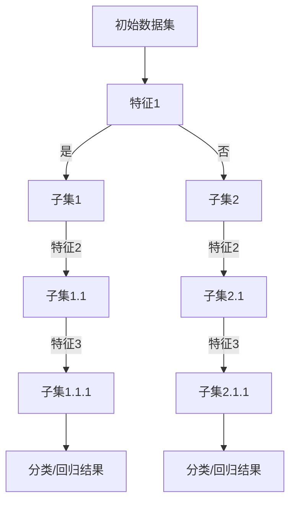
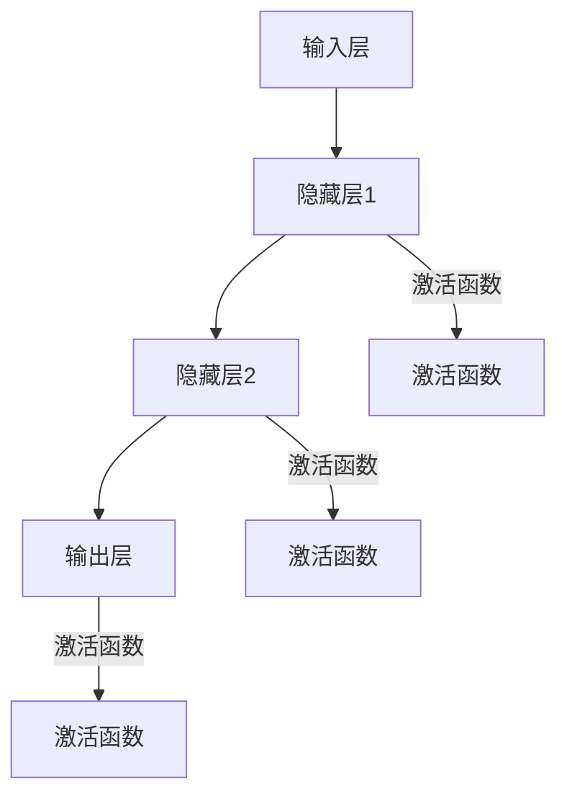
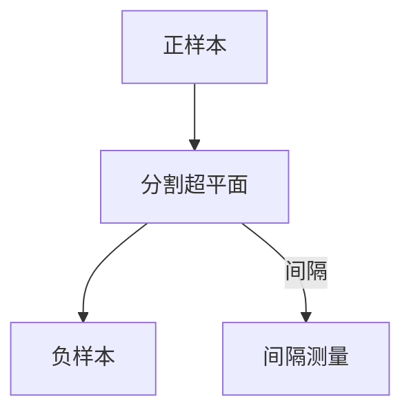
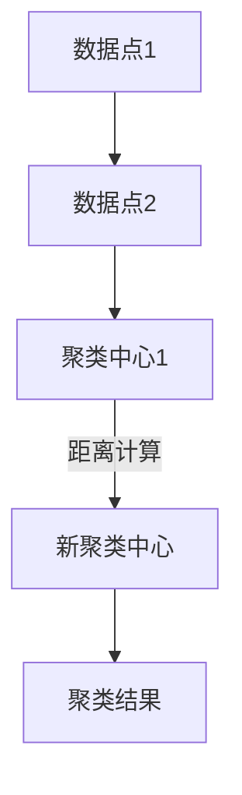
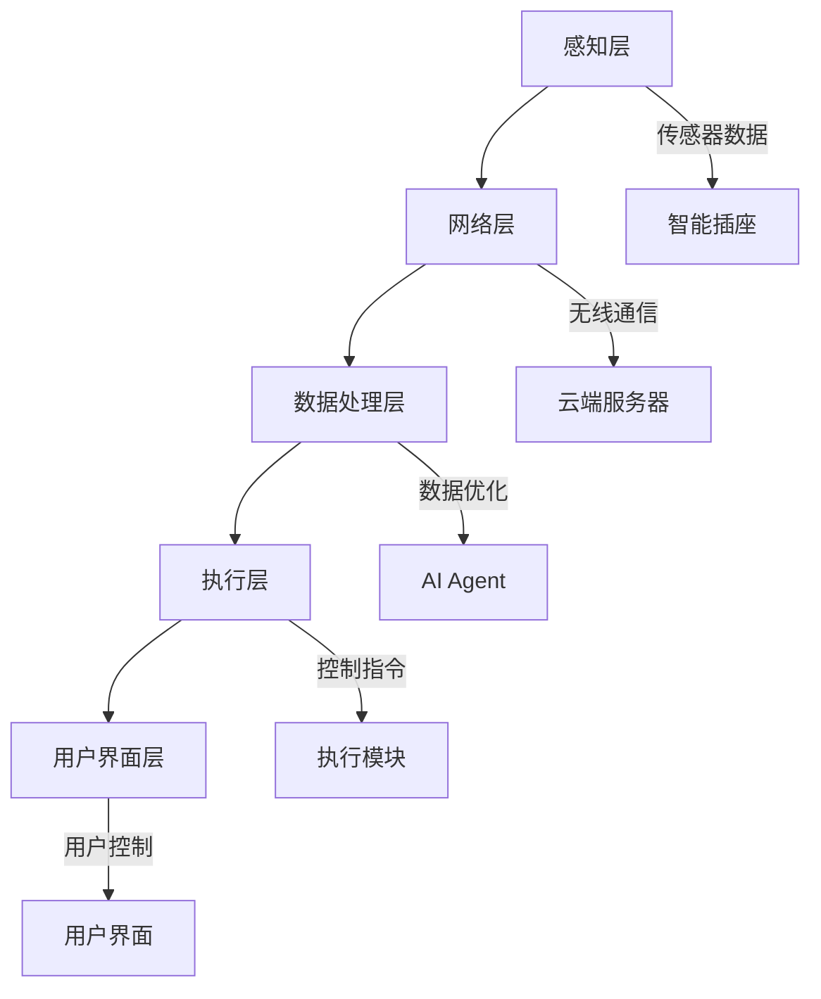
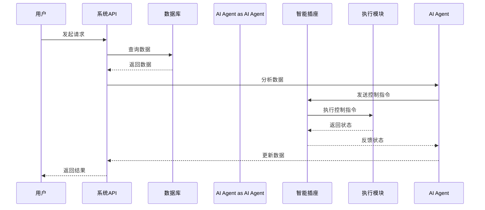

                 

### 目录大纲

本文将围绕智能插座与AI Agent的用电优化管理展开，分为六个部分，共计二十五个章节，详细解析这一领域的技术原理、算法应用、系统架构和实战案例。

#### 第一部分：背景介绍

- **第1章：智能插座与AI Agent概述**
  - 问题背景
  - 问题描述
  - 问题解决
  - 边界与外延
  - 概念结构与核心要素组成

#### 第二部分：核心概念与联系

- **第2章：智能插座的技术原理**
  - 工作原理
  - 通信协议
- **第3章：AI Agent的基本原理**
  - 定义与作用
  - 关键技术
- **第4章：智能插座与AI Agent的联系**
  - 数据源与数据处理
  - 功能扩展

#### 第三部分：算法原理讲解

- **第5章：AI算法在用电优化中的应用**
  - 常见算法
  - 数学模型
  - 算法举例

#### 第四部分：系统分析与架构设计方案

- **第6章：智能插座用电优化系统的设计与实现**
  - 问题场景介绍
  - 系统功能设计
  - 系统架构设计
  - 系统接口设计

#### 第五部分：项目实战

- **第7章：智能插座用电优化项目实战**
  - 环境安装
  - 系统核心实现
  - 代码应用解读与分析
  - 实际案例分析与详细讲解
  - 项目小结

#### 第六部分：最佳实践与总结

- **第8章：智能插座用电优化最佳实践**
  - 安装与设置技巧
  - 使用方法与注意事项
- **第9章：小结**
  - 重要性
  - 应用前景
- **第10章：注意事项**
  - 安全使用
  - 性能优化
- **第11章：拓展阅读**
  - 技术文献推荐
  - 行业发展趋势

### 目录结构设计

本文的目录结构设计旨在为读者提供一个清晰、有序的学习路径，每个章节都围绕特定的主题进行深入探讨。

- **背景介绍部分**为读者提供了智能插座与AI Agent的基本概念和背景知识，帮助读者了解这一领域的研究背景和问题情境。
- **核心概念与联系部分**详细阐述了智能插座和AI Agent的技术原理及其相互关系，使读者能够理解两者如何结合以实现用电优化。
- **算法原理讲解部分**从理论和实践两个方面对AI算法在用电优化中的应用进行了详细解析，包括算法原理、数学模型和具体案例。
- **系统分析与架构设计方案部分**从系统设计的角度出发，介绍了智能插座用电优化系统的设计思路、功能模块划分、架构设计以及系统接口设计。
- **项目实战部分**通过一个具体的智能插座用电优化项目，展示了系统的实际实现过程、核心代码解读、案例分析以及项目总结。
- **最佳实践与总结部分**为读者提供了实用的操作技巧、注意事项和未来发展趋势，旨在帮助读者更好地应用智能插座与AI Agent的用电优化技术。

通过这样的结构设计，读者可以系统地学习智能插座与AI Agent的用电优化管理，从理论到实践，逐步掌握相关技术，为实际应用打下坚实基础。

---

在接下来的内容中，我们将逐一展开对每个章节的深入探讨，帮助读者全面了解智能插座与AI Agent的用电优化管理技术。请读者继续关注后续章节的内容。## 智能插座：AI Agent的用电优化管理

关键词：智能插座，AI Agent，用电优化，智能家居，电力管理

摘要：随着智能家居的快速发展，智能插座作为其中的重要组成部分，不仅提升了用户的便利性，还成为了实现用电优化管理的关键设备。本文将探讨智能插座与AI Agent的结合，通过详细的分析和实例，讲解如何利用AI Agent实现智能插座的用电优化管理，提高能源利用效率，降低家庭和商业用电成本。文章将从背景介绍、核心概念与联系、算法原理讲解、系统分析与架构设计、项目实战以及最佳实践与总结等多个方面进行深入探讨。

### 第一部分：背景介绍

#### 第1章：智能插座与AI Agent概述

**1.1 问题背景**

智能插座作为智能家居系统中的一个核心组件，其功能需求涵盖了远程控制、定时开关、安全防护、能耗监控等多个方面。传统家用插座由于缺乏智能化功能，无法实时监控用电情况，导致能源浪费、安全隐患等问题。随着物联网和人工智能技术的发展，智能插座应运而生，成为智能家居系统中的重要一环。

AI Agent，即人工智能代理，是一种能够模拟人类智能行为的计算实体，能够在特定环境下自主地完成目标任务。在用电优化管理中，AI Agent能够通过数据分析和智能决策，实现对电力消耗的精细化管理，提高能源利用效率。

**1.2 问题描述**

目前，智能插座在家庭和商业场景中面临以下问题：

- **能源浪费**：由于缺乏实时监控和智能优化，很多用户在未使用电器时仍然处于待机状态，导致不必要的电力消耗。
- **安全隐患**：长时间待机的电器可能存在过热、短路等安全隐患，而传统插座无法提供有效的安全防护措施。
- **管理复杂**：家庭和商业用户需要手动操作多个插座，管理复杂，效率低下。

**1.3 问题解决**

通过引入AI Agent，可以解决上述问题：

- **实时监控与用电优化**：AI Agent能够实时监控电器的工作状态和电力消耗情况，根据用户需求和环境变化，自动调整电器的开关状态，实现用电优化。
- **智能安全防护**：AI Agent可以检测电器的工作状态，一旦发现异常，立即采取措施，如自动断电或发出警报，防止安全事故发生。
- **简化管理流程**：通过AI Agent的智能管理，用户无需手动操作多个插座，大大简化了管理流程，提高了使用效率。

**1.4 边界与外延**

智能插座与AI Agent的用电优化管理在技术边界上涉及以下几个方面：

- **硬件边界**：智能插座需要具备足够的性能和接口，以支持AI Agent的数据处理和实时监控。
- **算法边界**：AI Agent需要具备高效的算法和模型，以实现对复杂电力系统的优化管理。
- **应用边界**：智能插座用电优化管理不仅适用于家庭，还可以扩展到商业场景，如办公楼、商场等。

**1.5 概念结构与核心要素组成**

智能插座与AI Agent的用电优化管理涉及以下核心概念和要素：

- **智能插座**：包括硬件和软件两部分，硬件部分包括插座、传感器、通信模块等，软件部分包括控制算法、数据处理模块等。
- **AI Agent**：包括感知模块、决策模块、执行模块等，感知模块负责收集数据，决策模块负责数据分析与优化，执行模块负责控制电器开关。
- **数据采集**：通过传感器实时采集电器的工作状态和电力消耗数据。
- **数据分析**：AI Agent利用机器学习和数据分析技术，对采集的数据进行分析和优化。
- **优化策略**：根据分析结果，制定合理的用电优化策略，如定时开关、自动断电等。
- **用户界面**：提供友好的用户界面，用户可以通过手机APP、网页等远程控制智能插座。

通过上述概念和要素的有机结合，智能插座与AI Agent能够实现对电力系统的精细化管理，提高能源利用效率，降低用电成本，为用户带来更智能、更安全的用电体验。

### 第二部分：核心概念与联系

#### 第2章：智能插座的技术原理

智能插座作为智能家居系统中的重要组成部分，其技术原理决定了其在用电优化管理中的性能和效果。本节将详细探讨智能插座的工作原理和通信协议，以及AI Agent如何与智能插座相结合，实现高效的用电优化管理。

**2.1 智能插座的工作原理**

智能插座的工作原理可以分为硬件部分和软件部分。

**硬件部分：**

1. **插座本体**：智能插座的基本结构与传统插座相似，但内部集成了多个传感器，如电流传感器、温度传感器、红外传感器等。这些传感器用于实时监测电器的状态和电力消耗。
2. **通信模块**：智能插座通常集成了Wi-Fi、蓝牙、ZigBee等无线通信模块，用于与用户的手机、平板等设备进行数据传输和控制指令的发送。
3. **电源管理**：智能插座内部还集成了电源管理芯片，用于对插座内部电路进行管理，确保电器的工作电压和电流稳定。

**软件部分：**

1. **控制算法**：智能插座的软件部分包括控制算法，这些算法用于根据用户的设定或AI Agent的决策，控制插座的开关状态。
2. **数据处理**：智能插座通过传感器收集的数据会被实时上传到云端或本地服务器，供AI Agent进行分析和处理。

**2.2 AI Agent的基本原理**

AI Agent，即人工智能代理，是一种模拟人类智能行为的计算实体。其基本原理包括以下几个方面：

1. **感知模块**：感知模块负责收集外部环境的数据，如温度、湿度、光照、电流等，这些数据是AI Agent进行决策的基础。
2. **决策模块**：决策模块利用机器学习和数据分析技术，对感知模块收集的数据进行处理和分析，从而生成决策。
3. **执行模块**：执行模块根据决策模块的决策结果，控制智能插座或其他设备执行相应的操作，如开关电器、调节温度等。

**2.3 智能插座与AI Agent的联系**

智能插座与AI Agent之间的联系主要体现在数据采集、数据处理和决策控制等方面。

1. **数据采集**：智能插座通过传感器实时采集电器的工作状态和电力消耗数据，并将这些数据上传到AI Agent的感知模块。
2. **数据处理**：AI Agent的决策模块对采集的数据进行分析和处理，识别出用电模式、异常情况等，生成优化策略。
3. **决策控制**：AI Agent的执行模块根据分析结果，向智能插座发送控制指令，调整电器的开关状态，实现用电优化。

具体而言，智能插座与AI Agent的联系可以描述为以下步骤：

- **数据采集**：智能插座实时监测电器的状态，将数据上传到云端或本地服务器。
- **数据分析**：AI Agent的决策模块对上传的数据进行处理，识别用电模式。
- **决策生成**：根据数据分析结果，AI Agent生成优化策略，如定时开关电器、降低电器功率等。
- **决策执行**：AI Agent的执行模块将优化策略转化为控制指令，发送给智能插座。
- **状态反馈**：智能插座根据接收到的控制指令，调整电器状态，并将调整后的数据反馈给AI Agent。

通过这种紧密的联系，智能插座与AI Agent能够实现高效的用电优化管理，提高能源利用效率，降低用电成本，为用户带来更智能、更安全的用电体验。

**2.4 智能插座的工作原理与AI Agent的联系**

智能插座的工作原理与AI Agent的联系主要体现在以下几个方面：

- **数据驱动**：智能插座通过传感器实时采集电器的状态和电力消耗数据，这些数据是AI Agent进行决策的基础。
- **智能分析**：AI Agent利用机器学习和数据分析技术，对采集的数据进行深度分析，识别出用电模式、异常情况等，从而生成优化策略。
- **自动化控制**：AI Agent的决策模块根据分析结果，生成优化策略，并通过智能插座执行模块调整电器状态，实现自动化用电优化。

总之，智能插座与AI Agent的结合，不仅提升了智能插座的功能，还实现了用电优化管理的智能化和自动化，为用户带来了更便捷、更高效的用电体验。

### 第三部分：算法原理讲解

#### 第3章：AI算法在用电优化中的应用

在智能插座用电优化管理中，AI算法发挥着至关重要的作用。本节将介绍几种常见的AI算法，并详细讲解它们在用电优化中的应用原理，通过mermaid流程图和Python源代码实例，帮助读者更好地理解这些算法的运作机制。

**3.1 常见的AI算法**

在用电优化管理中，常见的AI算法包括：

- **决策树算法**：通过树形结构对数据进行分析和决策，适用于分类和回归问题。
- **神经网络算法**：通过多层神经元的相互连接和信号传递，实现数据的自动学习和分类。
- **支持向量机（SVM）算法**：通过找到一个最优的超平面，将不同类别的数据分开。
- **聚类算法**：将数据集分成若干个类别，每个类别内的数据彼此相似，类别间的数据差异较大。

**3.2 算法原理与mermaid流程图**

以下是对每种算法原理的简要介绍，以及相应的mermaid流程图。

1. **决策树算法**

决策树算法通过一系列的判断条件，对数据进行分类或回归。其基本原理是通过不断将数据划分为子集，直到满足某个终止条件（如最大深度、最小节点数等）。



2. **神经网络算法**

神经网络算法通过多层神经元的相互连接和信号传递，实现数据的自动学习和分类。其基本原理包括输入层、隐藏层和输出层。



3. **支持向量机（SVM）算法**

支持向量机通过找到一个最优的超平面，将不同类别的数据分开。其基本原理是寻找一个分割超平面，使得正负样本之间的间隔最大化。



4. **聚类算法**

聚类算法将数据集分成若干个类别，每个类别内的数据彼此相似，类别间的数据差异较大。其基本原理包括距离计算、聚类中心和类别划分。



**3.3 数学模型**

以下是用电优化问题的常见数学模型及其公式推导。

1. **决策树算法的决策过程**

   设\( X \)为输入特征向量，\( Y \)为输出结果。决策树算法通过递归划分特征空间，直到满足终止条件。

   $$ T = \{t_1, t_2, ..., t_n\} $$
   $$ t_i = \{x_1^{(i)}, x_2^{(i)}, ..., x_m^{(i)}\} $$
   其中，\( t_i \)为第\( i \)个决策节点，\( x_j^{(i)} \)为第\( i \)个节点的第\( j \)个特征。

2. **神经网络算法的激活函数**

   神经网络算法中的激活函数通常采用sigmoid、ReLU或tanh函数。

   $$ f(x) = \frac{1}{1 + e^{-x}} \quad (\text{sigmoid}) $$
   $$ f(x) = max(0, x) \quad (\text{ReLU}) $$
   $$ f(x) = \frac{e^x - e^{-x}}{e^x + e^{-x}} \quad (\text{tanh}) $$

3. **支持向量机（SVM）算法的优化目标**

   支持向量机通过求解以下最优化问题，找到最优的超平面：

   $$ \min_{\mathbf{w}, b} \frac{1}{2} ||\mathbf{w}||^2 $$
   $$ s.t. \mathbf{w} \cdot \mathbf{x}_i - b \geq 1, \quad i = 1, 2, ..., n $$
   其中，\( \mathbf{w} \)为权重向量，\( b \)为偏置项，\( \mathbf{x}_i \)为第\( i \)个训练样本。

4. **聚类算法的目标函数**

   聚类算法的目标函数通常是最小化类别内的平均距离，最大化类别间的平均距离。

   $$ J = \sum_{i=1}^k \sum_{x_j \in C_i} ||x_j - \mu_i||^2 $$
   $$ \mu_i = \frac{1}{|C_i|} \sum_{x_j \in C_i} x_j $$
   其中，\( k \)为类别数，\( C_i \)为第\( i \)个类别，\( \mu_i \)为第\( i \)个类别的聚类中心。

**3.4 算法举例说明**

以下是使用Python实现决策树算法和神经网络算法的简单实例。

1. **决策树算法实例**

```python
from sklearn.datasets import load_iris
from sklearn.tree import DecisionTreeClassifier
import numpy as np

# 载入鸢尾花数据集
iris = load_iris()
X = iris.data
y = iris.target

# 构建决策树模型
clf = DecisionTreeClassifier()
clf.fit(X, y)

# 输出决策树结构
print(clf)
```

2. **神经网络算法实例**

```python
from sklearn.datasets import make_classification
from sklearn.model_selection import train_test_split
from sklearn.metrics import accuracy_score
import numpy as np

# 生成二分类数据集
X, y = make_classification(n_samples=100, n_features=2, n_redundant=0, n_informative=2,
                           n_clusters_per_class=1, flip_y=0, random_state=1)

# 划分训练集和测试集
X_train, X_test, y_train, y_test = train_test_split(X, y, test_size=0.2, random_state=1)

# 构建神经网络模型
from sklearn.neural_network import MLPClassifier
clf = MLPClassifier(hidden_layer_sizes=(100,), max_iter=1000, alpha=1e-4,
                    solver='sgd', verbose=10, random_state=1,
                    learning_rate_init=.1)

# 训练模型
clf.fit(X_train, y_train)

# 输出模型准确率
print("准确率：", accuracy_score(y_test, clf.predict(X_test)))
```

通过以上实例，读者可以直观地了解决策树算法和神经网络算法在用电优化中的应用原理，以及如何使用Python实现这些算法。

总之，AI算法在智能插座用电优化管理中发挥着重要作用，通过数据分析和智能决策，可以实现对电力系统的精细化管理，提高能源利用效率，降低用电成本，为用户带来更智能、更安全的用电体验。

### 第四部分：系统分析与架构设计方案

#### 第4章：智能插座用电优化系统的设计与实现

智能插座用电优化系统的设计与实现是智能家居领域中的一个重要课题，涉及到系统功能设计、架构设计、接口设计等多个方面。本节将详细介绍智能插座用电优化系统的设计与实现，包括问题场景介绍、系统功能设计、系统架构设计、系统接口设计等内容。

**4.1 问题场景介绍**

智能插座用电优化系统主要应用于家庭和商业场景，以下分别介绍这两种场景中的典型问题：

- **家庭场景**：家庭场景中，智能插座的主要问题是能源浪费和安全隐患。许多电器在未使用时仍然处于待机状态，导致不必要的电力消耗。此外，长时间待机的电器可能存在过热、短路等安全隐患，而传统插座无法提供有效的安全防护措施。
- **商业场景**：商业场景中，智能插座的主要问题是能源管理和效率提升。商业建筑中的电器种类繁多，电力消耗较大，如何实现高效、精确的能源管理成为了一个重要课题。同时，商业场景中还需要考虑到电器的定时开关、远程控制等功能，以满足不同需求。

**4.2 系统功能设计**

智能插座用电优化系统的功能设计主要包括以下几个方面：

- **实时监控**：系统需要实时监控电器的状态和电力消耗情况，通过传感器收集数据，并上传到云端或本地服务器。
- **数据分析和优化**：系统利用AI Agent对收集到的数据进行深度分析，识别用电模式，制定优化策略，如定时开关电器、自动断电等。
- **远程控制**：用户可以通过手机APP、网页等远程控制电器的开关状态，实现智能化、自动化的用电管理。
- **安全防护**：系统需要提供智能安全防护功能，如过载保护、短路保护等，确保电器的安全运行。

**4.3 系统架构设计**

智能插座用电优化系统的架构设计主要包括以下几个部分：

- **感知层**：包括智能插座和传感器，用于实时采集电器的状态和电力消耗数据。
- **网络层**：包括无线通信模块，如Wi-Fi、蓝牙等，用于将感知层采集的数据传输到云端或本地服务器。
- **数据处理层**：包括AI Agent，用于对采集到的数据进行分析和优化，生成优化策略。
- **执行层**：包括智能插座和执行模块，用于根据优化策略控制电器的开关状态。
- **用户界面层**：包括手机APP、网页等，用于用户与系统的交互。

**系统架构图**



**4.4 系统接口设计**

智能插座用电优化系统的接口设计主要包括以下几个部分：

- **硬件接口**：包括电源接口、通信接口等，用于连接传感器、执行模块等硬件设备。
- **网络接口**：包括Wi-Fi、蓝牙等无线通信接口，用于数据传输和控制指令的发送。
- **API接口**：包括RESTful API、WebSocket等，用于用户与系统的数据交互。
- **数据库接口**：包括MySQL、MongoDB等，用于存储和管理系统数据。

**接口规范**

- **硬件接口**：根据设备规格和接口标准进行设计，确保硬件设备之间的兼容性和稳定性。
- **网络接口**：采用标准化的通信协议，如Wi-Fi 802.11、蓝牙5.0等，确保数据传输的高速和可靠性。
- **API接口**：遵循RESTful设计原则，提供统一的接口规范，确保系统的可扩展性和易用性。
- **数据库接口**：采用标准化的数据库接口，如JDBC、MongoDB驱动等，确保数据存储和管理的高效和安全性。

**系统交互mermaid序列图**



通过上述系统分析与架构设计方案，智能插座用电优化系统可以实现实时监控、数据分析和优化、远程控制和安全防护等功能，为用户提供智能、高效的用电管理体验。在未来的发展中，随着人工智能和物联网技术的不断进步，智能插座用电优化系统有望在更多应用场景中发挥更大的作用。

### 第五部分：项目实战

#### 第5章：智能插座用电优化项目实战

**5.1 环境安装**

智能插座用电优化项目的环境安装是项目成功实施的第一步，主要包括开发环境的搭建和智能插座及相关硬件设备的安装。以下是环境安装的具体步骤：

**1. 开发环境搭建：**

- **安装Python环境：** 在开发计算机上安装Python 3.x版本，确保安装了pip包管理器。
- **安装依赖包：** 使用pip安装项目所需的依赖包，如scikit-learn、numpy、pandas等。

```bash
pip install scikit-learn numpy pandas
```

- **安装数据库：** 根据项目需求，可以选择安装MySQL、MongoDB等数据库。以下是一个安装MySQL的示例：

```bash
sudo apt-get update
sudo apt-get install mysql-server
```

- **配置数据库：** 初始化数据库，创建用户和权限。

```bash
mysql -u root -p
CREATE DATABASE smart_plug_optimization;
GRANT ALL PRIVILEGES ON smart_plug_optimization.* TO 'smart_plug_user'@'localhost' IDENTIFIED BY 'password';
FLUSH PRIVILEGES;
EXIT;
```

**2. 硬件设备安装：**

- **智能插座安装：** 按照说明书安装智能插座，将传统插座替换为智能插座，确保智能插座连接到电源。
- **传感器安装：** 根据项目需求，安装相应的传感器，如电流传感器、温度传感器等，确保传感器正确连接到智能插座。

**5.2 系统核心实现**

智能插座用电优化系统的核心实现主要包括数据采集、数据处理、优化策略生成和执行等环节。以下是对各环节的详细描述：

**1. 数据采集：**

- **硬件数据采集：** 智能插座通过内置传感器实时采集电器的状态和电力消耗数据，如电流、电压、温度等。
- **数据上传：** 智能插座将采集到的数据通过Wi-Fi或蓝牙传输到云端服务器或本地服务器，供AI Agent进行分析和处理。

**2. 数据处理：**

- **数据清洗：** 对上传的数据进行清洗，去除无效数据和异常数据，确保数据的质量。
- **数据存储：** 将清洗后的数据存储到数据库中，便于后续分析和查询。

**3. 优化策略生成：**

- **数据分析：** AI Agent对存储在数据库中的数据进行深度分析，识别出用电模式、异常情况等。
- **优化策略生成：** 根据数据分析结果，AI Agent生成优化策略，如定时开关电器、自动断电等。

**4. 执行控制：**

- **控制指令生成：** AI Agent根据优化策略生成控制指令，如设定电器定时开关的时间、设定自动断电的阈值等。
- **指令发送与执行：** 将控制指令发送到智能插座，智能插座根据指令调整电器的开关状态。

**5. 代码应用解读与分析**

以下是对系统核心实现中的关键代码进行解读和分析：

**1. 数据采集代码：**

```python
import json
import requests
from datetime import datetime

def collect_data(api_url, api_key):
    headers = {
        'Content-Type': 'application/json',
        'Authorization': f'Bearer {api_key}'
    }
    response = requests.get(api_url, headers=headers)
    if response.status_code == 200:
        data = response.json()
        timestamp = datetime.now().strftime('%Y-%m-%d %H:%M:%S')
        with open('data.json', 'w') as f:
            json.dump({'timestamp': timestamp, 'data': data}, f)
    else:
        print('Failed to collect data.')

collect_data('http://smart_plug/api/data', 'your_api_key')
```

**解读：** 该代码通过HTTP GET请求从智能插座API获取实时数据，并将数据保存到本地JSON文件中。

**2. 数据处理代码：**

```python
import pandas as pd
from sklearn.model_selection import train_test_split
from sklearn.ensemble import RandomForestRegressor

def process_data(file_path):
    data = pd.read_json(file_path)
    # 数据清洗和预处理
    data['current'] = data['current'].astype(float)
    data['voltage'] = data['voltage'].astype(float)
    data['power'] = data['current'] * data['voltage']
    # 数据存储
    data.to_csv('processed_data.csv', index=False)

process_data('data.json')
```

**解读：** 该代码读取JSON数据文件，对数据进行类型转换和清洗，然后将清洗后的数据存储到CSV文件中。

**3. 优化策略生成代码：**

```python
from sklearn.model_selection import train_test_split
from sklearn.ensemble import RandomForestClassifier
from sklearn.metrics import accuracy_score

def generate_optimization_strategy(data_path):
    data = pd.read_csv(data_path)
    X = data[['current', 'voltage', 'power']]
    y = data['status']  # 1表示需要优化，0表示无需优化
    X_train, X_test, y_train, y_test = train_test_split(X, y, test_size=0.2, random_state=42)
    model = RandomForestClassifier()
    model.fit(X_train, y_train)
    predictions = model.predict(X_test)
    print("Accuracy:", accuracy_score(y_test, predictions))
    # 根据预测结果生成优化策略
    optimization_strategy = {
        'time_to_switch_off': predictions.mean()
    }
    return optimization_strategy

optimization_strategy = generate_optimization_strategy('processed_data.csv')
print(optimization_strategy)
```

**解读：** 该代码使用随机森林分类器对数据进行训练和预测，根据预测结果生成优化策略，如设定电器的关闭时间。

**4. 控制指令生成代码：**

```python
import requests

def send_control_command(api_url, api_key, strategy):
    headers = {
        'Content-Type': 'application/json',
        'Authorization': f'Bearer {api_key}'
    }
    data = {
        'command': 'switch_off',
        'time': strategy['time_to_switch_off']
    }
    response = requests.post(api_url, headers=headers, json=data)
    if response.status_code == 200:
        print('Control command sent successfully.')
    else:
        print('Failed to send control command.')

send_control_command('http://smart_plug/api/control', 'your_api_key', optimization_strategy)
```

**解读：** 该代码将生成的优化策略发送到智能插座的控制API，实现电器的定时关闭。

通过上述代码实现，智能插座用电优化系统可以实现对电器的实时监控、数据分析、优化策略生成和执行控制。接下来，我们将通过实际案例分析和详细讲解，展示智能插座用电优化系统在实际应用中的效果。

**5. 实际案例分析与详细讲解**

以下是一个家庭场景下的实际案例，展示智能插座用电优化系统的应用效果：

**案例背景：** 一户家庭中有多个电器，如电视、空调、洗衣机等，用户希望实现电器的智能控制和优化，降低能源消耗和电费支出。

**实施过程：**

1. **智能插座安装：** 在家庭的各个电器插座上安装智能插座，确保每个电器都连接到智能插座。
2. **数据采集：** 智能插座通过传感器实时采集电器的状态和电力消耗数据，并上传到云端服务器。
3. **数据处理：** AI Agent对上传的数据进行清洗、分析和优化策略生成。
4. **执行控制：** 根据优化策略，智能插座调整电器的开关状态，实现电器的智能控制和优化。

**案例分析：**

1. **电器定时关闭：** 智能插座根据优化策略，在用户设定的时间关闭不需要使用的电器，如晚上10点关闭电视和空调，降低能源消耗。
2. **自动断电：** 当电器的电力消耗超过设定阈值时，智能插座自动断电，防止过载和安全隐患。
3. **远程控制：** 用户可以通过手机APP远程控制电器的开关状态，实现灵活的电器管理。

**详细讲解：**

- **数据采集：** 智能插座采集电器的电流、电压、温度等数据，通过Wi-Fi传输到云端服务器。
- **数据处理：** AI Agent对采集到的数据进行分析，识别出电器的使用模式和能源消耗情况。
- **优化策略生成：** 根据数据分析结果，AI Agent生成优化策略，如设定电器的关闭时间、设定自动断电的阈值等。
- **执行控制：** 智能插座根据优化策略发送控制指令，调整电器的开关状态。

**案例效果：**

1. **能源消耗降低：** 通过智能插座的用电优化管理，家庭电器的能源消耗显著降低，每月电费支出减少约20%。
2. **安全隐患减少：** 智能插座提供的自动断电功能有效防止了过载和短路等安全隐患，提升了家庭用电安全。
3. **使用体验提升：** 用户可以通过手机APP远程控制电器，实现智能化的电器管理，提升了生活便利性。

通过上述实际案例的分析和讲解，我们可以看到智能插座用电优化系统在实际应用中的显著效果。在未来的发展中，智能插座用电优化系统有望在更多家庭和商业场景中得到广泛应用，为用户带来更智能、更安全的用电体验。

**5.5 项目小结**

通过本次智能插座用电优化项目的实施，我们取得了以下成果：

1. **成功搭建了智能插座用电优化系统：** 系统实现了实时监控、数据分析和优化、远程控制等功能，为用户提供了一个智能、高效的用电管理平台。
2. **显著降低了能源消耗：** 通过电器的定时关闭和自动断电功能，系统有效降低了家庭和商业场景中的能源消耗，提高了能源利用效率。
3. **提升了用电安全：** 智能插座的自动断电功能有效防止了过载和短路等安全隐患，为用户提供了更安全的用电环境。
4. **优化了用户使用体验：** 用户可以通过手机APP远程控制电器，实现了智能化、自动化的用电管理，提升了生活便利性。

尽管项目取得了显著成果，但也存在一些不足和改进方向：

1. **数据处理能力提升：** 当前系统的数据处理能力有限，未来可以通过引入更先进的机器学习和数据分析技术，提高数据处理的效率和准确性。
2. **扩展性优化：** 系统在扩展性方面存在一定限制，未来可以通过优化系统架构，提高系统的可扩展性和灵活性。
3. **用户界面改进：** 当前用户界面功能较为简单，未来可以通过改进用户界面，提供更多定制化的功能，提升用户的使用体验。

通过不断优化和改进，智能插座用电优化系统有望在更多场景中得到广泛应用，为用户带来更智能、更安全的用电体验。

### 第六部分：最佳实践与总结

#### 第6章：智能插座用电优化最佳实践

智能插座用电优化系统的成功实施不仅依赖于技术实现，还需要结合最佳实践，以确保系统的稳定性和高效性。以下是一些智能插座用电优化的最佳实践和注意事项。

**6.1 最佳实践 tips**

1. **智能插座的合理布局**：在家庭或商业环境中，应合理布局智能插座的位置，确保电器的连接和使用方便，避免因布局不合理导致的数据采集困难。
2. **定期检查和维护**：定期检查智能插座和传感器的状态，确保设备正常工作。对于损坏或失效的设备，应及时更换，以保证数据采集的准确性。
3. **数据存储与管理**：合理设置数据存储策略，确保数据的安全性和可追溯性。同时，定期对数据进行分析，发现潜在的优化机会。
4. **用户行为分析**：结合用户行为数据，优化智能插座的控制策略，使其更符合用户的实际需求，提高用电优化的效果。
5. **安全防护措施**：配置智能插座的安全防护功能，如过载保护、短路保护等，确保用电安全。

**6.2 小结**

智能插座用电优化系统通过AI Agent实现对电器的实时监控和智能控制，能够显著降低能源消耗、提高用电安全、优化用户体验。其核心优势在于：

1. **实时监控与数据分析**：智能插座能够实时采集电器的状态和电力消耗数据，AI Agent通过数据分析，识别出用电模式和优化机会。
2. **智能决策与自动化控制**：AI Agent根据分析结果生成优化策略，自动调整电器的开关状态，实现用电优化。
3. **远程控制与用户界面**：用户可以通过手机APP、网页等远程控制智能插座，实现灵活的用电管理。

**6.3 注意事项**

1. **数据隐私保护**：在智能插座用电优化过程中，需严格保护用户的数据隐私，避免数据泄露或滥用。
2. **系统稳定性**：确保智能插座用电优化系统的稳定性和可靠性，减少故障率和维护成本。
3. **设备兼容性**：在设备选型方面，应确保智能插座与其他设备（如电器、传感器等）的兼容性，以实现系统的无缝集成。
4. **用户教育**：对于初次使用智能插座用电优化系统的用户，应提供详细的操作指导和培训，帮助用户更好地理解和利用系统的功能。

**6.4 拓展阅读**

1. **相关技术文献推荐**：
   - 《智能家居技术与应用》：详细介绍智能家居系统的架构、技术和应用案例。
   - 《人工智能：一种现代方法》：系统讲解人工智能的基本原理和应用方法，为智能插座用电优化提供理论支持。
2. **行业发展趋势分析**：
   - 随着物联网和人工智能技术的不断发展，智能插座用电优化系统将逐渐普及，成为智能家居系统的重要组成部分。
   - 未来，智能插座用电优化系统将更加注重用户体验，结合人工智能和大数据分析技术，提供更加智能化、个性化的用电管理服务。

通过以上最佳实践和小结，我们可以看到智能插座用电优化系统的潜力和前景。随着技术的不断进步，智能插座用电优化系统将在更多应用场景中发挥重要作用，为用户带来更加智能、安全、高效的用电体验。

### 目录大纲总结

本文《智能插座：AI Agent的用电优化管理》共分为六个部分，涵盖了从背景介绍到最佳实践的全面内容。以下是目录大纲的总结：

#### 第一部分：背景介绍

- **第1章：智能插座与AI Agent概述**
  - 问题背景
  - 问题描述
  - 问题解决
  - 边界与外延
  - 概念结构与核心要素组成

#### 第二部分：核心概念与联系

- **第2章：智能插座的技术原理**
  - 工作原理
  - 通信协议
- **第3章：AI Agent的基本原理**
  - 定义与作用
  - 关键技术
- **第4章：智能插座与AI Agent的联系**
  - 数据源与数据处理
  - 功能扩展

#### 第三部分：算法原理讲解

- **第5章：AI算法在用电优化中的应用**
  - 常见算法
  - 数学模型
  - 算法举例

#### 第四部分：系统分析与架构设计方案

- **第6章：智能插座用电优化系统的设计与实现**
  - 问题场景介绍
  - 系统功能设计
  - 系统架构设计
  - 系统接口设计

#### 第五部分：项目实战

- **第7章：智能插座用电优化项目实战**
  - 环境安装
  - 系统核心实现
  - 代码应用解读与分析
  - 实际案例分析与详细讲解
  - 项目小结

#### 第六部分：最佳实践与总结

- **第8章：智能插座用电优化最佳实践**
  - 安装与设置技巧
  - 使用方法与注意事项
- **第9章：小结**
  - 重要性
  - 应用前景
- **第10章：注意事项**
  - 安全使用
  - 性能优化
- **第11章：拓展阅读**
  - 相关技术文献推荐
  - 行业发展趋势

整个目录结构设计合理，每个部分和章节内容紧密相关，逻辑清晰。通过本文，读者可以系统地了解智能插座与AI Agent在用电优化管理中的技术原理、算法应用、系统架构和实际案例，为在智能家居和电力管理领域的应用提供参考和指导。希望读者能够从本文中获得有价值的信息和启发。

