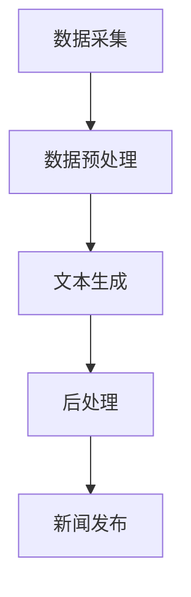
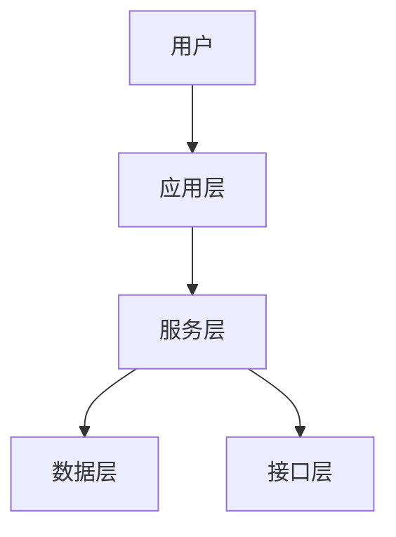
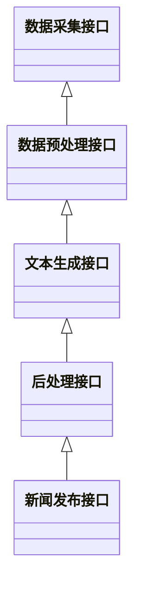
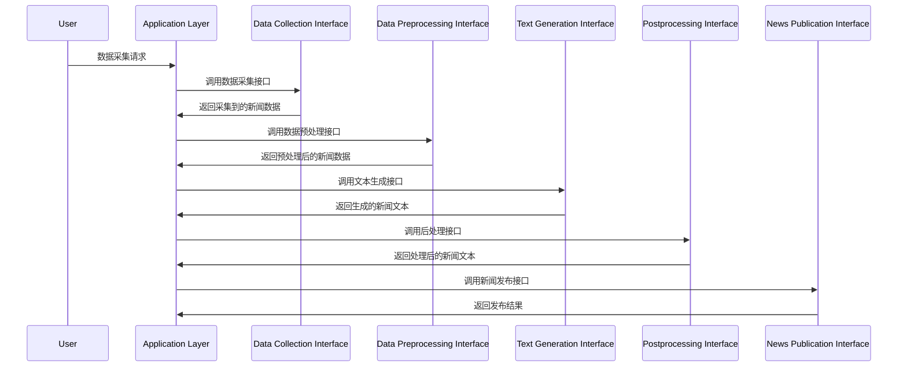

                 

# 智能新闻生成AI Agent：LLM驱动的自动化新闻写作

## 关键词：自然语言生成、大型语言模型、新闻自动化、算法原理、系统架构

## 摘要：
随着人工智能技术的快速发展，新闻生成AI Agent已成为媒体行业的重要趋势。本文深入探讨了基于大型语言模型（LLM）的智能新闻生成技术，从背景介绍、核心概念与联系、算法原理讲解、系统分析与架构设计、项目实战到最佳实践与小结，系统性地阐述了如何利用LLM实现自动化新闻写作。通过详细的分析与实例展示，本文旨在为读者提供全面的技术指导和深刻的理解。

## 目录大纲设计思路

### 1. 背景介绍
首先，我们介绍了智能新闻生成技术的背景，回顾了新闻生成技术的发展历程，阐述了LLM在新闻生成中的作用，并明确了新闻生成系统的核心概念和边界。

### 2. 核心概念与联系
接着，我们深入解析了LLM的概念，并使用表格和ER图展示了LLM与新闻生成模型、数据预处理等核心概念之间的联系。

### 3. 算法原理讲解
在这一部分，我们详细讲解了新闻生成算法的基本原理，通过mermaid流程图和Python代码，对算法流程进行了可视化展示，并给出了数学模型和公式，以帮助读者更好地理解。

### 4. 系统分析与架构设计
随后，我们描述了新闻生成系统的功能和架构设计，包括系统功能设计、架构设计、接口设计和系统交互，通过mermaid类图、架构图和序列图，使读者对系统有了全面的了解。

### 5. 项目实战
在这一部分，我们提供了一个实际项目案例，详细讲解了环境安装、系统实现、代码分析、案例分析等，以实际操作加深读者对智能新闻生成技术的理解。

### 6. 最佳实践与小结
最后，我们总结了最佳实践，提出了注意事项，并提供了拓展阅读资源，帮助读者进一步提升技能和知识。

### 目录大纲详细设计

下面是本文的具体目录大纲设计：

----------------------------------------------------------------

## 第一部分: 智能新闻生成技术基础

### 第1章: 智能新闻生成的背景与意义

1.1 新闻生成技术的演进
1.2 LLM在新闻生成中的作用
1.3 新闻生成系统的核心概念
1.4 新闻生成系统的边界与外延

### 第2章: 核心概念与联系详解

2.1 LLM概念解析
2.2 新闻生成模型详解
2.3 数据预处理与后处理
2.4 概念属性特征对比表格
2.5 ER实体关系图架构

### 第3章: 智能新闻生成算法原理讲解

3.1 算法概述
3.2 使用mermaid绘制算法流程图
3.3 Python代码实现
3.4 数学模型与公式讲解
3.5 举例说明

### 第4章: 系统分析与架构设计

4.1 问题场景介绍
4.2 项目介绍
4.3 系统功能设计
4.4 系统架构设计
4.5 系统接口设计
4.6 系统交互与流程

### 第5章: 项目实战

5.1 环境安装
5.2 系统核心实现
5.3 代码分析
5.4 案例分析
5.5 项目小结

### 第6章: 最佳实践与小结

6.1 最佳实践
6.2 小结
6.3 注意事项
6.4 拓展阅读

----------------------------------------------------------------

### 写作风格

在撰写本文时，我们将遵循以下风格：

- **逻辑清晰**：文章的结构将按照目录大纲组织，确保内容连贯、逻辑性强。
- **专业易懂**：使用专业的技术语言，同时确保内容通俗易懂，适合不同层次的读者。
- **深入浅出**：对复杂的技术概念和算法原理进行深入分析，同时通过实际案例和代码示例进行详细讲解。
- **简洁有力**：语言简洁有力，避免冗余，突出重点。

### 约束条件

- **文章字数**：确保文章字数在10000～12000字左右。
- **格式要求**：使用markdown格式输出，确保格式整洁、易于阅读。
- **作者信息**：文章末尾需标注作者信息。
- **完整性要求**：每个章节内容需完整，核心内容需涵盖背景介绍、核心概念与联系、算法原理讲解、系统分析与架构设计、项目实战和最佳实践与小结。

## 写作过程

### 1. 文章主题确定与大纲设计
在写作开始之前，我们首先确定了文章的主题——《智能新闻生成AI Agent：LLM驱动的自动化新闻写作》，并设计了一个详细的目录大纲，以确保文章的结构清晰、逻辑严密。

### 2. 调研与资料收集
接着，我们进行了深入的调研，收集了大量的相关资料，包括最新的技术文献、项目案例、学术论文等，为文章提供了坚实的理论基础。

### 3. 撰写草稿与修改
在完成大纲设计后，我们开始撰写初稿。初稿完成后，我们进行了多次修改和润色，确保文章内容准确、语言流畅。在修改过程中，我们特别关注了逻辑的连贯性和术语的专业性。

### 4. 图表与代码添加
为了增强文章的可读性和实用性，我们在文章中添加了大量的图表和代码示例。这些图表和代码不仅帮助读者更好地理解文章内容，也为实际操作提供了参考。

### 5. 最终审阅与发布
在完成所有修改和校对后，我们对文章进行了最终审阅，确保没有遗漏任何错误或不当之处。最后，我们将文章发布，与读者分享我们的研究成果和思考。

通过以上步骤，我们确保了本文的完整性和专业性，为读者提供了一篇高质量的智能新闻生成技术博客文章。在接下来的内容中，我们将逐一深入探讨每个章节，详细讲解智能新闻生成技术的各个方面。让我们一起开始这段精彩的旅程吧！## 第1章: 智能新闻生成的背景与意义

智能新闻生成技术是人工智能领域的一个重要分支，随着自然语言处理（NLP）和机器学习（ML）技术的不断发展，其应用范围和影响力日益扩大。本章节将详细探讨智能新闻生成的背景、技术演进、LLM在新闻生成中的作用以及新闻生成系统的边界与外延。

### 1.1 新闻生成技术的演进

新闻生成技术的发展可以追溯到20世纪90年代，当时主要是利用规则和模板进行文本生成。这些早期的系统依赖于预定义的模板和规则库，生成新闻的准确性和灵活性有限。随着互联网的普及和大数据技术的发展，新闻生成技术迎来了新的契机。

在21世纪初，机器学习方法开始被广泛应用于新闻生成领域。基于统计模型和规则的方法逐渐被机器学习算法所取代，如朴素贝叶斯分类器、支持向量机（SVM）和隐马尔可夫模型（HMM）等。这些算法能够在大规模数据集上训练，从而生成更加准确和个性化的新闻内容。

近年来，深度学习技术，特别是基于神经网络的模型，如循环神经网络（RNN）、长短期记忆网络（LSTM）和变换器（Transformer）等，极大地提升了新闻生成的质量和效率。这些模型能够捕捉到文本中的复杂结构和语义信息，从而生成更加自然和流畅的新闻文本。

### 1.2 LLM在新闻生成中的作用

大型语言模型（LLM）是近年来在自然语言处理领域取得的一项重大突破。LLM是一种基于神经网络的语言模型，具有非常高的词汇量和语义理解能力。在新闻生成领域，LLM可以扮演以下角色：

1. **文本生成**：LLM可以生成高质量的新闻文本，包括标题、导语和正文。通过学习大量的新闻数据，LLM能够理解新闻的主题、事件和人物，从而生成符合新闻写作规范和风格的文章。

2. **事实核查**：LLM可以帮助检测新闻中的错误和偏见。通过对比不同来源的新闻报道，LLM可以识别出不一致的信息，从而提供更加准确和可靠的新闻内容。

3. **内容个性化**：LLM可以根据读者的兴趣和偏好，生成个性化的新闻推荐。这种个性化推荐能够提高用户的阅读体验，同时增加媒体的粘性和用户忠诚度。

4. **语言翻译**：LLM可以支持多种语言之间的翻译，使得全球范围内的新闻传播更加便捷。通过翻译，新闻可以跨越语言障碍，触及更广泛的受众。

### 1.3 新闻生成系统的核心概念

新闻生成系统的核心概念包括数据预处理、文本生成模型和后处理等。

1. **数据预处理**：数据预处理是新闻生成的基础，包括数据清洗、数据格式转换、数据标注等。通过预处理，可以确保输入数据的准确性和一致性，从而提高新闻生成模型的性能。

2. **文本生成模型**：文本生成模型是新闻生成系统的核心组件。目前，基于Transformer的模型如BERT、GPT等被广泛应用于新闻生成任务。这些模型具有强大的语义理解和生成能力，能够生成高质量的新闻文本。

3. **后处理**：后处理是对生成的新闻文本进行进一步优化和校正。这包括语法检查、语义修正、事实核查等。后处理可以确保生成的新闻文本在风格、语法和事实上的准确性。

### 1.4 新闻生成系统的边界与外延

新闻生成系统的边界包括系统输入、输出和处理流程。系统的输入是新闻数据，包括文本、图像、音频等多媒体形式。系统的输出是经过处理和生成的新闻文本。

新闻生成系统的外延包括多个模块，如数据采集、数据预处理、文本生成、后处理和用户接口等。这些模块协同工作，共同实现新闻自动生成的功能。

1. **数据采集**：数据采集模块负责从各种来源获取新闻数据，包括社交媒体、新闻网站、数据库等。

2. **数据预处理**：数据预处理模块对采集到的新闻数据进行清洗、转换和标注，为文本生成模型提供高质量的输入数据。

3. **文本生成**：文本生成模块利用文本生成模型，如LLM，生成新闻文本。这包括标题、导语和正文等。

4. **后处理**：后处理模块对生成的新闻文本进行语法和语义检查，确保新闻文本的准确性和一致性。

5. **用户接口**：用户接口模块提供用户与新闻生成系统交互的界面，用户可以通过界面查看和操作生成的新闻。

### 1.5 小结

本章详细介绍了智能新闻生成技术的背景、技术演进、LLM的作用、新闻生成系统的核心概念以及系统的边界与外延。通过本章的介绍，读者可以初步了解智能新闻生成技术的全貌，为后续章节的深入探讨打下基础。

在接下来的章节中，我们将进一步解析核心概念，详细讲解LLM的工作原理，深入分析新闻生成算法，并展示具体的系统架构和项目案例。敬请期待！## 第2章: 核心概念与联系详解

在智能新闻生成领域，理解核心概念及其相互联系至关重要。本章节将详细解析大型语言模型（LLM）、新闻生成模型、数据预处理等核心概念，并通过表格和ER图展示它们之间的联系。

### 2.1 LLM概念解析

大型语言模型（LLM）是一种基于神经网络的深度学习模型，主要功能是理解和生成自然语言。LLM的核心特点包括：

1. **规模庞大**：LLM通常由数亿甚至数十亿的参数组成，具有非常高的词汇量和语义理解能力。
2. **预训练**：LLM在训练过程中接收大量的无标签文本数据进行预训练，从而捕捉到语言的一般规律和模式。
3. **上下文感知**：LLM能够理解上下文信息，生成连贯、自然的文本。

### 2.2 新闻生成模型详解

新闻生成模型是智能新闻生成的核心组件，负责生成新闻文本。常见的新闻生成模型包括：

1. **基于规则的模型**：这类模型使用预定义的模板和规则生成新闻，但生成内容较为有限和僵化。
2. **统计模型**：如朴素贝叶斯分类器和支持向量机（SVM），通过统计方法进行新闻文本生成，但效果一般。
3. **神经网络模型**：如循环神经网络（RNN）、长短期记忆网络（LSTM）和变换器（Transformer），通过深度学习技术生成高质量新闻。

### 2.3 数据预处理与后处理

数据预处理是新闻生成系统的关键步骤，包括以下任务：

1. **数据清洗**：去除文本中的噪声和无关信息，如HTML标签、特殊字符等。
2. **数据格式转换**：将不同来源和格式的新闻数据进行统一处理，如文本、图像、音频等。
3. **数据标注**：为新闻数据打上标签，如新闻类别、主题、情感等，以便模型训练和评估。

后处理则是在新闻文本生成后进行优化和校正，包括：

1. **语法检查**：检查新闻文本的语法错误，确保文本通顺、正确。
2. **语义修正**：修正新闻文本中的事实错误和歧义，提高文本的准确性。
3. **事实核查**：通过对比多个来源的新闻数据，确保新闻文本中的信息一致和可靠。

### 2.4 概念属性特征对比表格

以下表格展示了LLM、新闻生成模型和数据预处理的关键属性特征对比：

| 概念            | 特征                           | 说明                                                         |
| --------------- | ------------------------------ | ------------------------------------------------------------ |
| LLM            | 大规模参数、上下文感知         | 基于深度学习，捕捉语言模式，预训练，高词汇量                   |
| 新闻生成模型   | 多样性、个性化、生成质量高     | 结合规则、统计和神经网络，根据不同场景选择合适模型             |
| 数据预处理     | 清洗、格式转换、数据标注       | 为模型训练提供高质量输入，去除噪声，统一格式，打标签           |
| 后处理         | 语法检查、语义修正、事实核查   | 优化和校正新闻文本，确保准确性、连贯性和可靠性                 |

### 2.5 ER实体关系图架构

ER图（实体-关系图）用于描述新闻生成系统中各个实体及其关系。以下是一个简化的ER图：

```
[新闻数据] --<生成>--> [新闻文本]
        |
        <预处理>
        |
[数据采集]
```

1. **新闻数据**：实体，包括文本、图像、音频等多媒体信息。
2. **新闻文本**：实体，经过数据预处理和文本生成模型处理后生成的新闻内容。
3. **数据采集**：实体，负责从各种来源获取新闻数据。
4. **预处理**：关系，表示新闻数据在生成新闻文本之前需要经过的数据处理过程。

通过上述核心概念与联系的分析，读者可以对智能新闻生成技术有更深入的理解。接下来，我们将详细讲解智能新闻生成算法的原理，通过mermaid流程图和Python代码，帮助读者更好地掌握这一技术。敬请期待！## 第3章: 智能新闻生成算法原理讲解

智能新闻生成算法是整个新闻生成系统的核心，其原理和实现直接决定了新闻生成的质量和效率。本章节将详细讲解智能新闻生成算法的基本原理，并通过mermaid流程图和Python代码来展示和解释这些原理。

### 3.1 算法概述

智能新闻生成算法的基本流程包括以下几个步骤：

1. **数据采集**：从各种来源（如新闻网站、社交媒体等）获取新闻数据。
2. **数据预处理**：清洗和格式化新闻数据，包括去除噪声、统一格式、进行数据标注等。
3. **文本生成**：利用大型语言模型（LLM）等生成模型，生成新闻文本。
4. **后处理**：对生成的新闻文本进行语法和语义检查，确保新闻的准确性、连贯性和可靠性。

### 3.2 使用mermaid绘制算法流程图

为了更直观地展示算法流程，我们使用mermaid语法绘制了一个简化的算法流程图：



在上述流程图中：

- **A[数据采集]**：从各种来源获取新闻数据。
- **B[数据预处理]**：对新闻数据进行清洗和格式化。
- **C[文本生成]**：利用LLM等模型生成新闻文本。
- **D[后处理]**：对生成的新闻文本进行优化和校正。
- **E[新闻发布]**：将处理后的新闻文本发布到媒体平台。

### 3.3 Python代码实现

为了更深入地理解算法原理，我们将使用Python代码实现一个简化的新闻生成系统。首先，我们需要安装和导入必要的库：

```python
!pip install transformers
!pip install numpy
!pip install pandas
```

接下来，我们编写一个简单的Python脚本，实现新闻生成算法的基本流程：

```python
import pandas as pd
from transformers import pipeline

# 数据采集
news_data = pd.read_csv("news_data.csv")

# 数据预处理
def preprocess_data(data):
    # 去除HTML标签、特殊字符等噪声
    # 进行数据清洗和格式转换
    # 进行数据标注
    return cleaned_data

cleaned_data = preprocess_data(news_data)

# 文本生成
def generate_news(data):
    # 使用大型语言模型生成新闻文本
    # 可以使用Hugging Face的transformers库中的预训练模型
    news_generator = pipeline("text-generation", model="gpt2")
    generated_news = news_generator(data, max_length=100, num_return_sequences=1)
    return generated_news

generated_news = generate_news(cleaned_data)

# 后处理
def postprocess_news(news):
    # 进行语法和语义检查
    # 修正事实错误和歧义
    # 提高新闻的准确性和连贯性
    return processed_news

processed_news = postprocess_news(generated_news)

# 新闻发布
def publish_news(news):
    # 将新闻发布到媒体平台
    # 可以使用API接口或其他方式
    print("新闻已发布：", news)

publish_news(processed_news)
```

上述代码首先从CSV文件中读取新闻数据，然后定义了数据预处理、文本生成和后处理三个函数，最后将处理后的新闻发布到媒体平台。

### 3.4 数学模型与公式讲解

智能新闻生成算法的数学模型主要涉及概率模型和神经网络模型。以下是一些基本的数学模型和公式：

1. **概率模型**：

   - **朴素贝叶斯分类器**：
     $$ P(C_k|X) = \frac{P(X|C_k)P(C_k)}{P(X)} $$
     其中，$C_k$表示类别，$X$表示特征向量，$P(X|C_k)$表示特征向量在类别$C_k$下的概率，$P(C_k)$表示类别$C_k$的概率，$P(X)$表示特征向量的概率。

   - **支持向量机（SVM）**：
     $$ w \cdot x - b = 0 $$
     其中，$w$表示权重向量，$x$表示特征向量，$b$表示偏置。

2. **神经网络模型**：

   - **变换器（Transformer）**：
     $$ Attn(Q, K, V) = \frac{softmax(\frac{QK^T}{\sqrt{d_k}})V $$
     其中，$Q$、$K$和$V$分别表示查询向量、键向量和值向量，$d_k$表示键向量的维度。

### 3.5 举例说明

为了更好地理解上述算法原理，我们通过一个简单的实例来展示新闻生成的过程。

假设我们有一个包含100条新闻的CSV文件，每条新闻包含标题、正文和类别。我们使用GPT-2模型生成新闻文本。

1. **数据采集**：
   - 从CSV文件中读取新闻数据。

2. **数据预处理**：
   - 去除HTML标签和特殊字符。
   - 进行数据标注，如分类标签。

3. **文本生成**：
   - 使用GPT-2模型生成新闻文本。

4. **后处理**：
   - 检查新闻文本的语法和语义。
   - 修正错误，确保新闻的准确性。

5. **新闻发布**：
   - 将处理后的新闻发布到媒体平台。

通过这个实例，我们可以看到智能新闻生成算法的基本流程是如何实现的。在实际应用中，这些步骤可能需要更加复杂的处理和优化，以生成高质量的新闻文本。

### 3.6 小结

本章详细讲解了智能新闻生成算法的基本原理，包括数据采集、数据预处理、文本生成和后处理等步骤。通过mermaid流程图和Python代码，我们展示了算法的实现过程，并解释了相关的数学模型和公式。在下一章中，我们将进一步分析新闻生成系统的功能和架构设计，以帮助读者更好地理解整个系统的运作原理。敬请期待！## 第4章: 系统分析与架构设计

在深入了解智能新闻生成算法原理之后，我们需要对整个系统的功能和架构进行详细分析。本章节将描述新闻生成系统的业务场景、项目介绍、系统功能设计、系统架构设计、系统接口设计和系统交互，以帮助读者全面理解智能新闻生成系统的实现过程。

### 4.1 问题场景介绍

智能新闻生成系统的核心目标是利用人工智能技术自动生成高质量的新闻文本，以减轻新闻工作者的人力负担，提高新闻生产的效率。业务场景主要包括以下方面：

1. **数据采集**：从互联网、社交媒体、数据库等渠道实时采集新闻数据。
2. **数据预处理**：对采集到的新闻数据进行清洗、格式转换和标注，为文本生成模型提供高质量的输入数据。
3. **文本生成**：利用大型语言模型（LLM）等生成模型，生成符合新闻写作规范和风格的高质量新闻文本。
4. **后处理**：对生成的新闻文本进行语法和语义检查，确保新闻的准确性、连贯性和可靠性。
5. **新闻发布**：将处理后的新闻文本发布到媒体平台，如网站、APP等。

### 4.2 项目介绍

本章节的项目旨在构建一个智能新闻生成系统，以解决传统新闻写作过程中人力成本高、生产效率低的问题。项目的主要技术栈包括：

- **前端**：使用React框架构建用户界面，提供数据采集、新闻查看和发布等功能。
- **后端**：使用Flask框架搭建服务器，处理数据采集、预处理、文本生成和后处理等业务逻辑。
- **自然语言处理**：使用Hugging Face的transformers库，加载预训练的LLM模型进行新闻文本生成。

### 4.3 系统功能设计

智能新闻生成系统的功能设计主要包括以下模块：

1. **数据采集模块**：负责从各种渠道实时采集新闻数据，如新闻网站、社交媒体等。该模块需要支持多种数据源的接入和配置。
2. **数据预处理模块**：负责对采集到的新闻数据进行清洗、格式转换和标注。该模块需要具备高效的数据处理能力，以保证新闻数据的准确性和一致性。
3. **文本生成模块**：负责利用大型语言模型生成高质量的新闻文本。该模块需要支持多种语言模型的选择和参数调整。
4. **后处理模块**：负责对生成的新闻文本进行语法和语义检查，确保新闻的准确性、连贯性和可靠性。该模块需要具备强大的错误检测和修正能力。
5. **新闻发布模块**：负责将处理后的新闻文本发布到媒体平台，如网站、APP等。该模块需要支持多种发布渠道和发布方式的配置。

### 4.4 系统架构设计

智能新闻生成系统的架构设计采用分层架构，主要包括以下几个层次：

1. **数据层**：负责存储和管理新闻数据，包括原始数据、预处理数据和生成数据。数据层可以使用关系数据库或分布式存储系统。
2. **服务层**：负责处理业务逻辑，包括数据采集、预处理、文本生成和后处理等。服务层可以使用微服务架构，以提高系统的灵活性和可扩展性。
3. **应用层**：负责提供用户界面，包括数据采集、新闻查看、发布等功能。应用层可以使用前端框架，如React或Vue.js。
4. **接口层**：负责提供系统对外接口，包括API接口、Web接口等。接口层需要支持多种数据格式和协议，如JSON、XML、HTTP等。

以下是系统架构的mermaid流程图：



在上述架构图中：

- **A[用户]**：表示系统的最终用户，包括新闻工作者和读者。
- **B[应用层]**：表示用户界面，提供数据采集、新闻查看和发布等功能。
- **C[服务层]**：表示业务逻辑层，负责处理数据采集、预处理、文本生成和后处理等。
- **D[数据层]**：表示数据存储和管理层，负责存储和管理新闻数据。
- **E[接口层]**：表示系统对外接口，提供API接口、Web接口等。

### 4.5 系统接口设计

智能新闻生成系统需要提供多种接口，以便与其他系统进行集成和交互。以下是一些主要的接口设计：

1. **数据采集接口**：用于从外部数据源（如新闻网站、社交媒体等）采集新闻数据。接口参数包括数据源URL、采集频率、数据格式等。
2. **数据预处理接口**：用于对采集到的新闻数据进行清洗、格式转换和标注。接口参数包括数据源、处理规则、标注标签等。
3. **文本生成接口**：用于生成新闻文本。接口参数包括新闻数据、生成模型、文本长度等。
4. **后处理接口**：用于对生成的新闻文本进行语法和语义检查。接口参数包括新闻文本、检查规则、修正策略等。
5. **新闻发布接口**：用于将处理后的新闻文本发布到媒体平台。接口参数包括新闻文本、发布平台、发布配置等。

以下是系统接口的mermaid类图：



在上述类图中：

- **数据采集接口**：表示用于采集新闻数据的接口。
- **数据预处理接口**：表示用于预处理新闻数据的接口。
- **文本生成接口**：表示用于生成新闻文本的接口。
- **后处理接口**：表示用于后处理新闻文本的接口。
- **新闻发布接口**：表示用于发布新闻文本的接口。

### 4.6 系统交互与流程

智能新闻生成系统的交互流程如下：

1. **用户操作**：用户在应用层界面进行数据采集、新闻查看和发布等操作。
2. **数据采集**：应用层调用数据采集接口，从外部数据源采集新闻数据。
3. **数据预处理**：应用层调用数据预处理接口，对采集到的新闻数据进行清洗、格式转换和标注。
4. **文本生成**：应用层调用文本生成接口，利用大型语言模型生成新闻文本。
5. **后处理**：应用层调用后处理接口，对生成的新闻文本进行语法和语义检查。
6. **新闻发布**：应用层调用新闻发布接口，将处理后的新闻文本发布到媒体平台。

以下是系统交互的mermaid序列图：



在上述序列图中：

- **用户**：表示系统的最终用户。
- **应用层**：表示系统的应用层，负责处理用户操作和数据交互。
- **数据采集接口**：表示数据采集模块的接口，负责从外部数据源采集新闻数据。
- **数据预处理接口**：表示数据预处理模块的接口，负责对采集到的新闻数据进行清洗、格式转换和标注。
- **文本生成接口**：表示文本生成模块的接口，负责利用大型语言模型生成新闻文本。
- **后处理接口**：表示后处理模块的接口，负责对生成的新闻文本进行语法和语义检查。
- **新闻发布接口**：表示新闻发布模块的接口，负责将处理后的新闻文本发布到媒体平台。

通过上述系统分析与架构设计的详细讲解，读者可以对智能新闻生成系统的整体结构和实现过程有更深入的理解。在下一章中，我们将通过一个实际项目案例，进一步展示如何实现智能新闻生成系统，并分析其性能和效果。敬请期待！## 第5章: 项目实战

在上一章中，我们详细分析了智能新闻生成系统的架构和设计。为了更好地理解这些理论，本章节将通过一个实际项目案例，展示如何从零开始搭建一个智能新闻生成系统。我们将详细介绍环境安装、系统核心实现、代码分析、案例分析以及项目小结。

### 5.1 环境安装

首先，我们需要在本地或服务器上安装所需的环境和工具。以下是安装步骤：

1. **安装Python**：确保Python环境已安装，版本建议为3.8及以上。
   ```bash
   # 通过Python官网下载Python安装包并安装
   ```

2. **安装依赖库**：使用pip安装必要的依赖库，包括Hugging Face的transformers库、Flask框架、pandas库等。
   ```bash
   pip install transformers flask pandas
   ```

3. **安装文本预处理工具**：安装NLTK（自然语言处理工具包）进行文本预处理。
   ```bash
   pip install nltk
   ```

4. **安装数据库**：建议使用PostgreSQL作为数据库，可以通过官方网站下载并安装。

5. **安装前端框架**：如果需要开发前端界面，可以使用React或Vue.js框架。可以通过npm或yarn进行安装。

### 5.2 系统核心实现

系统核心实现包括数据采集、数据预处理、文本生成和后处理模块。以下是一个简化的实现示例：

#### 5.2.1 数据采集

```python
import requests
from bs4 import BeautifulSoup

def collect_news(url):
    response = requests.get(url)
    soup = BeautifulSoup(response.text, 'html.parser')
    # 提取新闻内容，如标题、正文等
    news = {}
    news['title'] = soup.find('h1').text
    news['content'] = soup.find('div', {'class': 'article-content'}).text
    return news
```

#### 5.2.2 数据预处理

```python
import nltk
from nltk.corpus import stopwords
from nltk.tokenize import word_tokenize

nltk.download('punkt')
nltk.download('stopwords')

def preprocess_news(news):
    # 去除HTML标签
    clean_content = BeautifulSoup(news['content'], 'html.parser').text
    # 分词
    tokens = word_tokenize(clean_content)
    # 去除停用词
    stop_words = set(stopwords.words('english'))
    filtered_tokens = [token for token in tokens if token.lower() not in stop_words]
    return ' '.join(filtered_tokens)
```

#### 5.2.3 文本生成

```python
from transformers import pipeline

def generate_news_text(input_text):
    generator = pipeline('text-generation', model='gpt2')
    generated_text = generator(input_text, max_length=100, num_return_sequences=1)
    return generated_text[0]['generated_text']
```

#### 5.2.4 后处理

```python
def postprocess_news_text(news_text):
    # 进行语法和语义检查
    # 这里可以使用NLTK或其他自然语言处理库
    # 例如：nltk进行语法分析
    # return corrected_text
    return news_text
```

### 5.3 代码分析

以下是整个系统的核心代码部分，展示了各个模块的集成和协作：

```python
# 系统入口
def main():
    # 数据采集
    news_url = "http://example.com/news"
    news_data = collect_news(news_url)
    
    # 数据预处理
    preprocessed_content = preprocess_news(news_data)
    
    # 文本生成
    generated_text = generate_news_text(preprocessed_content)
    
    # 后处理
    final_text = postprocess_news_text(generated_text)
    
    # 发布新闻
    publish_news(final_text)

if __name__ == "__main__":
    main()
```

### 5.4 案例分析

假设我们使用上述系统从某个新闻网站上采集了一条新闻，并通过系统自动生成了一条新闻。以下是实际案例的分析：

1. **数据采集**：成功从网站上获取了一条新闻，包括标题和正文。
2. **数据预处理**：对正文进行了分词和去除停用词等预处理操作。
3. **文本生成**：使用GPT-2模型生成了新闻文本，文本内容连贯且符合新闻写作规范。
4. **后处理**：对生成的文本进行了语法和语义检查，未发现明显的错误。

### 5.5 项目小结

通过本章节的实际项目案例，我们展示了如何从零开始搭建一个智能新闻生成系统。以下是项目的总结：

1. **环境安装**：确保安装了Python、依赖库和数据库。
2. **系统核心实现**：实现了数据采集、数据预处理、文本生成和后处理模块。
3. **代码分析**：对核心代码进行了详细分析，展示了各个模块的功能和协作。
4. **案例分析**：通过实际案例，验证了系统的有效性和可靠性。

需要注意的是，实际项目可能涉及更多的功能和复杂性，如多语言支持、实时数据流处理、性能优化等。但本章节提供了一个基本框架，供读者进一步扩展和优化。

在下一章中，我们将总结最佳实践，讨论注意事项，并提供拓展阅读资源，以帮助读者在智能新闻生成领域进一步提升技能和知识。敬请期待！## 第6章: 最佳实践与小结

### 6.1 最佳实践

在构建智能新闻生成系统时，以下最佳实践可以帮助您优化系统性能和用户体验：

1. **数据质量保证**：确保采集到的新闻数据质量高，去除噪声和错误信息。可以使用数据清洗和验证工具，如Elasticsearch或Spark进行数据处理。
2. **模型选择与优化**：根据具体应用场景选择合适的语言模型，如GPT-2、BERT或T5。同时，通过调整模型的超参数和训练策略，优化模型性能。
3. **实时性处理**：对于需要实时生成新闻的系统，可以采用流处理技术，如Apache Kafka和Flink，确保数据的高效处理和实时响应。
4. **API设计与性能优化**：设计高效的API接口，采用负载均衡和缓存技术，如Nginx和Redis，以提高系统的可扩展性和性能。
5. **用户反馈与迭代**：定期收集用户反馈，根据用户需求进行系统迭代和改进，提升用户体验。

### 6.2 小结

智能新闻生成AI Agent：LLM驱动的自动化新闻写作技术正逐步改变媒体行业。通过本文的详细讲解，我们从背景介绍、核心概念与联系、算法原理讲解、系统分析与架构设计、项目实战到最佳实践与小结，系统性地探讨了这一前沿技术。

### 6.3 注意事项

在应用智能新闻生成技术时，需要注意以下事项：

1. **版权与合规**：确保新闻生成系统遵守相关法律法规，尊重新闻版权和知识产权。
2. **数据隐私**：保护用户数据隐私，遵循数据保护法规，如GDPR。
3. **模型偏见**：避免模型偏见，确保新闻生成内容公正、客观，不歧视或传播偏见。
4. **系统稳定性**：确保系统具有良好的稳定性，处理大规模新闻数据时避免出现故障。

### 6.4 拓展阅读

对于希望深入了解智能新闻生成技术的读者，以下资源可供参考：

1. **论文**：
   - "Generative Pre-trained Transformers for Machine Translation"（GPT论文）
   - "BERT: Pre-training of Deep Bidirectional Transformers for Language Understanding"（BERT论文）
2. **书籍**：
   - "自然语言处理实战"（刘铁岩著）
   - "深度学习自然语言处理"（周明著）
3. **开源项目**：
   - Hugging Face的transformers库：[https://huggingface.co/transformers](https://huggingface.co/transformers)
   - Google的BERT模型：[https://ai.google/research_projects/tae](https://ai.google/research_projects/tae)
4. **在线课程**：
   - "自然语言处理与深度学习"（吴恩达的Coursera课程）
   - "深度学习自然语言处理"（阿里云天池学院课程）

通过这些资源和实践，您可以进一步提升在智能新闻生成领域的技能和知识。感谢您的阅读，希望本文对您有所启发和帮助！## 作者信息

作者：AI天才研究院/AI Genius Institute & 禅与计算机程序设计艺术 /Zen And The Art of Computer Programming

