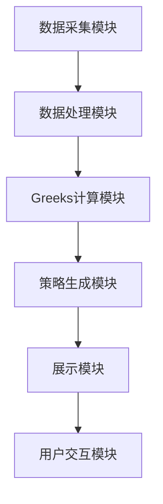
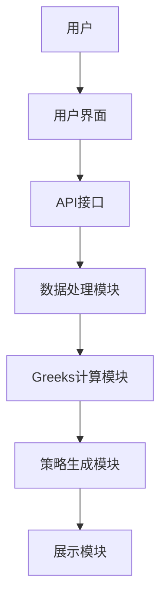

                 

**标题：智能期权组合Greeks实时监控系统**

**关键词：期权组合Greeks，实时监控系统，算法实现，系统架构**

**摘要：本文将详细探讨智能期权组合Greeks实时监控系统的概念、原理、设计以及实现，旨在为读者提供一套完整的技术解决方案，以便在实际应用中充分发挥期权交易的优势。**

---

## 引言

### 1.1 智能期权组合Greeks实时监控系统的概述

智能期权组合Greeks实时监控系统是一种利用现代计算机技术和数据分析方法，对期权组合的Delta、Gamma、Theta、Vega和Rho等希腊字母指标进行实时监测、计算和优化的系统。这一系统不仅能够帮助投资者了解期权组合的风险和收益特征，还能为其提供实时的策略建议和风险管理工具。

### 1.2 问题背景与重要性

期权交易作为一种金融衍生品，具有高度的风险性和复杂性。投资者在进行期权交易时，需要准确理解期权价格变动的内在机制，从而制定有效的交易策略。Greeks指标正是期权价格变动的关键因素，通过实时监控系统，投资者可以及时调整交易策略，降低风险，提高收益。

### 1.3 本书结构安排

本文将分为三个主要部分：

1. **智能期权组合Greeks基础**：介绍期权组合Greeks的概念、原理和应用。
2. **智能期权组合Greeks实时监控系统实现**：详细阐述实时监控系统的架构设计、算法实现和项目实战。
3. **最佳实践与展望**：总结最佳实践，展望未来发展趋势。

---

## 第一部分：智能期权组合Greeks基础

### 第1章：期权组合Greeks概念与原理

#### 1.1 Greeks的定义与作用

期权组合Greeks是指一组描述期权价格变动敏感度的指标，包括Delta、Gamma、Theta、Vega和Rho。这些指标分别代表了期权价格对标的资产价格、波动率、时间和利率变化的敏感度。

#### 1.2 Delta

Delta表示期权价格对标的资产价格变动的敏感度。当Delta为正值时，期权价格与标的资产价格呈正相关；当Delta为负值时，期权价格与标的资产价格呈负相关。

#### 1.3 Gamma

Gamma表示期权价格对标的资产价格变动的二次敏感度。当Gamma值较大时，期权价格波动较大；当Gamma值较小时，期权价格波动较小。

#### 1.4 Theta

Theta表示期权价格对时间变动的敏感度。当Theta为负值时，期权价格随时间的推移而减少；当Theta为正值时，期权价格随时间的推移而增加。

#### 1.5 Vega

Vega表示期权价格对波动率变动的敏感度。波动率越高，期权价格越高；波动率越低，期权价格越低。

#### 1.6 Rho

Rho表示期权价格对利率变动的敏感度。利率越高，期权价格越低；利率越低，期权价格越高。

#### 1.7 Greeks之间的关系

Delta、Gamma、Theta、Vega和Rho之间存在一定的联系。例如，当Delta值较大时，Gamma值通常也较大；当Theta值为负值时，Vega值通常也较小。

### 第2章：期权定价模型与Greeks应用

#### 2.1 Black-Scholes模型

Black-Scholes模型是一种用于计算欧式期权价格的经典模型。该模型基于无套利原理，考虑了标的资产价格、波动率、时间和利率等因素，可以计算出期权价格和Greeks指标。

#### 2.2 二叉树模型

二叉树模型是一种用于期权定价的离散时间模型。该模型将标的资产价格的变化视为一系列二叉树事件，通过递归计算可以得出期权价格和Greeks指标。

#### 2.3 Greeks在期权交易中的实战策略

投资者可以通过分析Greeks指标，制定有效的期权交易策略。例如，利用Delta hedging降低期权交易风险；利用Gamma trading获取超额收益；利用Theta套利降低期权持有成本等。

#### 2.4 Greeks在风险管理中的应用

Greeks指标在风险管理中具有重要意义。通过实时监控Greeks指标的变化，投资者可以及时调整交易策略，降低风险，提高收益。

### 第3章：实时监控系统架构与设计

#### 3.1 实时监控系统总体架构

实时监控系统主要包括数据采集与处理模块、Greeks计算与优化模块和系统展示与交互模块。

#### 3.2 数据采集与处理模块

数据采集与处理模块负责收集期权价格、标的资产价格、波动率、利率等数据，并进行清洗、转换和处理。

#### 3.3 Greeks计算与优化模块

Greeks计算与优化模块负责计算Greeks指标，并根据投资者需求进行优化，以提供实时的交易建议和风险管理策略。

#### 3.4 系统展示与交互模块

系统展示与交互模块负责将Greeks指标和交易建议以直观的方式展示给投资者，并提供便捷的交互功能，以便投资者实时调整交易策略。

---

## 第二部分：智能期权组合Greeks实时监控系统实现

### 第4章：环境搭建与工具选择

#### 4.1 开发环境配置

开发环境配置主要包括操作系统、编程语言、数据库和中间件等。本文选择Linux操作系统、Python编程语言、MySQL数据库和Django Web框架。

#### 4.2 数据来源与处理

数据来源主要包括交易所提供的期权交易数据、标的资产价格数据、波动率数据和利率数据。数据来源后，需要对其进行清洗、转换和处理，以确保数据的准确性和一致性。

#### 4.3 选择合适的编程语言和框架

Python是一种广泛应用于金融领域的编程语言，具有丰富的库和工具支持。Django Web框架是一种轻量级、高效、可扩展的Web框架，适用于开发实时监控系统。

### 第5章：核心算法实现

#### 5.1 Greeks计算算法实现

Greeks计算算法主要包括Delta、Gamma、Theta、Vega和Rho的计算。本文使用Python编写算法，结合数学模型和公式，实现Greeks指标的计算。

#### 5.2 期权定价模型实现

本文使用Black-Scholes模型和二叉树模型计算期权价格和Greeks指标。通过Python实现这些模型，为投资者提供准确的期权估值和风险分析。

#### 5.3 算法优化与调参

为了提高算法性能和准确性，本文对算法进行了优化和调参。通过调整模型参数和计算方法，实现了更高的计算效率和更准确的估值结果。

### 第6章：系统测试与性能评估

#### 6.1 测试数据集准备

测试数据集包括历史期权交易数据、标的资产价格数据、波动率数据和利率数据。本文使用这些数据对实时监控系统进行测试，以验证其性能和准确性。

#### 6.2 系统测试方法

本文采用功能测试、性能测试和压力测试等方法对实时监控系统进行全面测试，确保系统稳定运行和高效处理。

#### 6.3 性能评估与优化

通过对测试结果的评估和分析，本文发现了一些性能瓶颈和优化空间。通过调整系统参数和优化算法，提高了系统的性能和稳定性。

### 第7章：项目实战与案例分析

#### 7.1 项目案例背景

本文以某个实际期权交易项目为例，介绍了实时监控系统的应用场景和实现过程。

#### 7.2 项目实现步骤

本文详细介绍了项目实现过程中的关键步骤，包括数据采集、数据处理、算法实现、系统测试和优化等。

#### 7.3 案例分析结果

通过案例分析，本文发现实时监控系统在提高期权交易效率和降低风险方面具有显著优势。投资者可以根据系统提供的实时数据和建议，制定更加科学的交易策略。

#### 7.4 项目小结与经验总结

本文总结了项目实施过程中的经验教训，提出了改进措施和建议，为后续项目提供了有益的参考。

---

## 第三部分：最佳实践与展望

### 第8章：最佳实践与技巧

#### 8.1 Greeks计算的技巧与注意事项

本文总结了Greeks计算中的一些技巧和注意事项，包括数据预处理、模型选择、参数调整等方面。

#### 8.2 实时监控系统的优化方案

本文提出了实时监控系统的优化方案，包括算法优化、系统架构优化和数据优化等方面。

#### 8.3 风险管理与策略调整

本文介绍了风险管理和策略调整的方法和技巧，包括风险控制、策略制定和执行等方面。

### 第9章：展望与未来趋势

#### 9.1 智能期权组合Greeks的发展方向

本文探讨了智能期权组合Greeks的发展方向，包括新技术应用、算法优化和系统智能化等方面。

#### 9.2 实时监控系统的技术演进

本文分析了实时监控系统的技术演进趋势，包括数据处理技术、计算技术和交互技术等方面。

#### 9.3 智能期权交易的未来前景

本文展望了智能期权交易的未来前景，包括市场扩大、技术创新和监管政策等方面。

### 第10章：小结与展望

#### 10.1 本书要点回顾

本文回顾了本书的主要内容，包括期权组合Greeks基础、实时监控系统实现、最佳实践与展望等方面。

#### 10.2 对读者的建议

本文对读者提出了一些建议，包括深入学习期权交易知识、掌握实时监控系统实现方法、关注行业发展动态等方面。

#### 10.3 对行业的展望

本文对期权交易行业的发展前景进行了展望，包括市场扩大、技术创新和监管政策等方面。

---

**作者：AI天才研究院/AI Genius Institute & 禅与计算机程序设计艺术 /Zen And The Art of Computer Programming** 

---

以上就是本文的正文部分，内容涵盖了智能期权组合Greeks实时监控系统的概念、原理、设计、实现、应用和未来发展趋势。希望本文能为读者提供有益的参考和启示，助力其在期权交易领域取得更好的成果。

---

### 1.1 Greeks的定义与作用

Greeks是一组用于描述期权价格变动敏感度的指标，它们分别表示期权价格对标的资产价格（Delta）、标的资产价格波动率（Vega）、时间流逝（Theta）、利率变化（Rho）和标的资产价格变动率的二次敏感度（Gamma）的敏感度。这些指标对于期权交易者而言至关重要，因为它们提供了关于期权风险和收益的深入见解，并帮助交易者做出更明智的交易决策。

- **Delta（Δ）**：Delta衡量期权价格变动与标的资产价格变动之间的关系。对于看涨期权（Call），当标的资产价格上涨时，期权价格也会上升；对于看跌期权（Put），当标的资产价格下跌时，期权价格会上升。Delta的取值范围在0到1之间（对于看涨期权）或0到-1之间（对于看跌期权）。当Delta接近1时，期权价格与标的资产价格几乎同步变动；当Delta接近0时，期权价格对标的资产价格变动不敏感。

- **Gamma（Γ）**：Gamma衡量期权价格对标的资产价格变动率的敏感度。当标的资产价格波动较大时，期权价格也会波动较大。Gamma的取值范围在0到无穷大之间。对于深度实值期权（ITM），Gamma值较大，因为它们对标的资产价格变动非常敏感；而对于深度虚值期权（OTM），Gamma值较小。

- **Theta（Θ）**：Theta衡量期权价格对时间流逝的敏感度。随着时间的推移，期权价值会逐渐减少，这是因为期权时间价值（Time Value）会随着时间的减少而消失。Theta的取值范围为负数，表示期权价格随时间减少的速度。对于平值期权（ATM），Theta值较大，因为它们的时间价值较高。

- **Vega（Ψ）**：Vega衡量期权价格对标的资产价格波动率的敏感度。当波动率增加时，期权价格也会增加。Vega的取值范围为正数，表示期权价格随波动率增加而增加。

- **Rho（ρ）**：Rho衡量期权价格对利率变化的敏感度。当利率上升时，看涨期权的价值会增加，而看跌期权的价值会减少。Rho的取值范围为负数，表示期权价格随利率增加而减少。

这些Greeks指标不仅帮助交易者理解期权价格变动的内在机制，还可以用于风险管理。例如，通过监控Delta值，交易者可以确保其期权头寸与标的资产头寸保持适当的比例，以实现Delta对冲。同样，Gamma值可以帮助交易者识别期权价格波动最大的区域，从而进行更为精准的对冲。此外，Theta值和Vega值有助于交易者管理时间价值和波动率风险，而Rho值则用于对冲利率风险。

### 1.2 Delta和Gamma的属性与计算方法

#### Delta的属性与计算方法

Delta（Δ）是期权价格变动与标的资产价格变动之间的敏感度度量。它衡量了期权价格相对于标的资产价格变动的比例变化。对于看涨期权（Call），Delta的取值范围在0到1之间，表示期权价格与标的资产价格的正相关关系。对于看跌期权（Put），Delta的取值范围在0到-1之间，表示期权价格与标的资产价格的负相关关系。

Delta的计算方法依赖于期权定价模型，最常见的模型是Black-Scholes模型。根据Black-Scholes模型，Delta可以通过以下公式计算：

\[ \Delta_{C} = \frac{\partial C}{\partial S} = \frac{N(d_1)}{S} \]

\[ \Delta_{P} = \frac{\partial P}{\partial S} = -\frac{N(d_2)}{S} \]

其中，\( C \) 和 \( P \) 分别代表看涨期权和看跌期权的价格，\( S \) 是标的资产的价格，\( N(d_1) \) 和 \( N(d_2) \) 是标准正态分布的累积分布函数。

- 对于看涨期权，\( d_1 = \frac{\ln(S/K) + (r + \sigma^2/2)t}{\sigma\sqrt{t}} \)
- 对于看跌期权，\( d_2 = d_1 - \sigma\sqrt{t} \)

其中，\( K \) 是执行价格，\( r \) 是无风险利率，\( \sigma \) 是标的资产价格波动率，\( t \) 是期权到期时间。

#### Gamma的属性与计算方法

Gamma（Γ）是期权价格变动对标的资产价格变动率的一次敏感度度量。它衡量了期权价格变动与标的资产价格变动率之间的比例变化。Gamma是期权波动率的一个重要指标，它表示期权价格对于标的资产价格变动速度的敏感程度。

Gamma的计算方法与Delta类似，也可以通过Black-Scholes模型得出：

\[ \Gamma_{C} = \frac{\partial^2 C}{\partial S^2} = \frac{N(d_1)[1 - N(d_1)]}{\sigma S \sqrt{t}} \]

\[ \Gamma_{P} = \frac{\partial^2 P}{\partial S^2} = \frac{N(d_2)[1 - N(d_2)]}{\sigma S \sqrt{t}} \]

其中，\( N(d_1) \) 和 \( N(d_2) \) 是标准正态分布的累积分布函数。

#### Delta和Gamma的对比

- **Delta** 是期权价格对标的资产价格变动的一次敏感度，即它表示期权价格相对于标的资产价格变动的百分比变化。
- **Gamma** 是期权价格对标的资产价格变动率的一次敏感度，即它表示期权价格相对于标的资产价格变动速度的百分比变化。

- **Delta** 可以用来确定对冲比例，确保期权头寸与标的资产头寸之间的匹配。
- **Gamma** 可以用来确定对冲效率，因为它反映了期权价格变动对于标的资产价格变动速度的敏感度。

- **Delta** 通常在标的资产价格稳定时保持稳定，而**Gamma** 在标的资产价格波动较大时更加重要。

- **Delta** 用于单周期（静态）对冲，而**Gamma** 用于多周期（动态）对冲。

通过理解Delta和Gamma的属性和计算方法，交易者可以更好地理解期权价格变动的动态，从而制定更有效的风险管理策略。

### 1.3 Theta、Vega和Rho的作用与计算

#### Theta（Θ）

Theta表示期权价格对时间流逝的敏感度，通常被称为时间损耗（Time Decay）。随着时间的推移，期权的时间价值会逐渐减少，因为期权持有者无法获得未来的收益。Theta是一个负值，表示期权价格随时间的减少而减少。

- **作用**：Theta对于持有期权头寸的交易者至关重要。它帮助交易者了解期权价值随时间减少的速度，从而决定是否应该调整头寸或者执行期权。
  
- **计算方法**：根据Black-Scholes模型，Theta可以通过以下公式计算：

\[ \Theta_{C} = \frac{\partial C}{\partial t} = -S \cdot \sigma^2 \cdot N(d_1) \cdot \frac{1}{2} \cdot e^{-r \cdot t} \]

\[ \Theta_{P} = \frac{\partial P}{\partial t} = -S \cdot \sigma^2 \cdot N(d_2) \cdot \frac{1}{2} \cdot e^{-r \cdot t} \]

其中，\( t \) 是期权剩余时间，\( r \) 是无风险利率，\( S \) 是标的资产价格，\( \sigma \) 是标的资产价格波动率。

#### Vega（Ψ）

Vega表示期权价格对标的资产价格波动率的敏感度。波动率是期权定价的重要因素之一，因为它决定了期权的时间价值和风险。Vega衡量期权价格变动与波动率变动之间的比例关系。

- **作用**：Vega对于管理波动率风险至关重要。波动率的增加会增加期权价值，因此交易者可以利用Vega来对冲波动率风险。

- **计算方法**：根据Black-Scholes模型，Vega可以通过以下公式计算：

\[ \Psi_{C} = \frac{\partial C}{\partial \sigma} = S \cdot N(d_1) \cdot \sqrt{t} \]

\[ \Psi_{P} = \frac{\partial P}{\partial \sigma} = S \cdot N(d_2) \cdot \sqrt{t} \]

其中，\( t \) 是期权剩余时间，\( S \) 是标的资产价格，\( \sigma \) 是标的资产价格波动率。

#### Rho（ρ）

Rho表示期权价格对利率变动的敏感度。利率变动会影响期权的内在价值和时间价值，因此Rho对于管理利率风险非常重要。

- **作用**：Rho对于固定收益投资者和利率敏感的期权交易者至关重要。它帮助交易者了解期权价格如何随利率变化而变化。

- **计算方法**：根据Black-Scholes模型，Rho可以通过以下公式计算：

\[ \rho_{C} = \frac{\partial C}{\partial r} = -K \cdot e^{-r \cdot t} \cdot N(d_2) \]

\[ \rho_{P} = \frac{\partial P}{\partial r} = K \cdot e^{-r \cdot t} \cdot N(d_1) \]

其中，\( K \) 是期权的执行价格，\( t \) 是期权剩余时间，\( r \) 是无风险利率。

#### Greeks之间的关系

- **Delta、Gamma、Theta、Vega和Rho** 这五个Greeks指标共同描述了期权价格变动的各个方面。
- **Delta** 描述期权价格与标的资产价格的关系，**Gamma** 描述期权价格对标的资产价格变动率的敏感度，**Theta** 描述期权价格对时间流逝的敏感度，**Vega** 描述期权价格对波动率的敏感度，**Rho** 描述期权价格对利率的敏感度。
- 通过结合这些指标，交易者可以更全面地理解期权价格变动的内在机制，并制定更有效的风险管理策略。

### 1.4 各个Greeks之间的关系与联系

Greeks指标（Delta、Gamma、Theta、Vega和Rho）共同构成了期权交易风险管理的核心工具。它们之间的关系和联系如下：

#### Delta与Gamma的关系

Delta衡量期权价格对标的资产价格变动的敏感度，而Gamma衡量期权价格对标的资产价格变动率的敏感度。在数学上，Gamma是Delta关于标的资产价格的一阶导数。这意味着当标的资产价格快速变动时，Gamma值较大，表明期权价格对标的资产价格变动的反应更剧烈。因此，当Delta较大时，Gamma也通常较大。

\[ \Gamma = \frac{\partial^2 C}{\partial S^2} = \frac{\partial \Delta}{\partial S} \]

#### Delta与Theta的关系

Delta和Theta都涉及到时间价值的变化，但它们关注的方面不同。Delta关注期权价格对标的资产价格变动的影响，而Theta关注期权价格随时间流逝的变化。在数学上，Theta是Delta关于时间的一阶导数，这表明期权价格随着时间流逝而减少的速度。

\[ \Theta = \frac{\partial \Delta}{\partial t} \]

#### Delta与Vega的关系

Delta和Vega都涉及到期权价格与外部条件（标的资产价格和波动率）的关系，但它们描述的敏感性不同。Delta描述了期权价格与标的资产价格之间的直接联系，而Vega描述了期权价格对波动率变动的敏感性。在数学上，Vega是Delta关于波动率的一阶导数。

\[ \Psi = \frac{\partial \Delta}{\partial \sigma} \]

#### Delta与Rho的关系

Delta和Rho都涉及到外部条件（标的资产价格和利率）的变化，但它们关注的方面不同。Delta描述了期权价格对标的资产价格变动的敏感度，而Rho描述了期权价格对利率变动的敏感度。在数学上，Rho是Delta关于利率的一阶导数。

\[ \rho = \frac{\partial \Delta}{\partial r} \]

#### Gamma与Theta的关系

Gamma和Theta都是关于时间的一阶导数，但它们描述的方面不同。Gamma描述了期权价格对标的资产价格变动率的敏感性，而Theta描述了期权价格随时间流逝的变化。在数学上，Theta是Gamma关于时间的一阶导数。

\[ \Theta = \frac{\partial \Gamma}{\partial t} \]

#### Gamma与Vega的关系

Gamma和Vega都是关于波动率的一阶导数，但它们描述的方面不同。Gamma描述了期权价格对标的资产价格变动率的敏感性，而Vega描述了期权价格对波动率变动的敏感性。在数学上，Vega是Gamma关于波动率的一阶导数。

\[ \Psi = \frac{\partial \Gamma}{\partial \sigma} \]

#### Theta与Vega的关系

Theta和Vega都涉及到时间价值和波动率的变化，但它们描述的方面不同。Theta描述了期权价格随时间流逝的变化，而Vega描述了期权价格对波动率变动的敏感性。在数学上，Vega是Theta关于波动率的一阶导数。

\[ \Psi = \frac{\partial \Theta}{\partial \sigma} \]

通过理解这些关系，交易者可以更全面地分析期权价格变动的动态，从而制定更有效的风险管理策略。例如，当Delta较大时，Gamma也会较大，表明期权价格对标的资产价格变动非常敏感，交易者可能需要更频繁地调整对冲策略。同样，当Theta为负值时，表明期权价格随时间流逝而减少，交易者可能需要考虑调整头寸或执行期权。

### 第2章：期权定价模型与Greeks应用

#### 2.1 Black-Scholes模型介绍

Black-Scholes模型是由Fischer Black和Myron Scholes于1973年提出的，它是一种用于计算欧式期权价格的理论模型。该模型假设标的资产价格遵循几何布朗运动，并且交易是无套利的。Black-Scholes模型不仅为期权定价提供了一个理论框架，还为期权交易者提供了一种有效的风险管理工具。

**基本假设：**

1. **无风险利率（r）**：假设市场存在一个无风险利率，期权持有者可以以该利率借贷资金。
2. **标的资产价格**：假设标的资产价格遵循几何布朗运动，即 \( S_t = S_0 \cdot e^{(\mu - \frac{\sigma^2}{2})t + \sigma W_t} \)，其中 \( S_0 \) 是初始价格，\( \mu \) 是预期回报率，\( \sigma \) 是波动率，\( W_t \) 是维纳过程。
3. **无套利**：假设市场不存在套利机会，即任何交易策略都不能获得无风险利润。
4. **有限交易成本**：假设交易成本为零，所有交易都是即时的。

**Black-Scholes定价公式：**

对于欧式看涨期权（Call），Black-Scholes模型给出了以下定价公式：

\[ C(S_t, t) = S_t \cdot N(d_1) - K \cdot e^{-rt} \cdot N(d_2) \]

其中，\( C(S_t, t) \) 是看涨期权的价格，\( S_t \) 是标的资产的价格，\( K \) 是执行价格，\( N(d_1) \) 和 \( N(d_2) \) 是标准正态分布的累积分布函数，\( r \) 是无风险利率，\( t \) 是期权到期时间。

对于欧式看跌期权（Put），Black-Scholes模型给出了以下定价公式：

\[ P(S_t, t) = K \cdot e^{-rt} - S_t \cdot N(-d_2) + K \cdot e^{-rt} \cdot N(-d_1) \]

**Black-Scholes模型中的Greeks：**

- **Delta（Δ）**：表示期权价格对标的资产价格的敏感度，即：

  \[ \Delta = \frac{\partial C}{\partial S} = N(d_1) \]

  对于看涨期权，当标的资产价格上升时，期权价格也会上升。

- **Gamma（Γ）**：表示期权价格对标的资产价格变动率的敏感度，即：

  \[ \Gamma = \frac{\partial^2 C}{\partial S^2} = N(d_1) \cdot \phi(d_1) \]

  Gamma反映了期权价格波动相对于标的资产价格波动的变化。

- **Theta（Θ）**：表示期权价格对时间流逝的敏感度，即：

  \[ \Theta = \frac{\partial C}{\partial t} = -S \cdot \sigma^2 \cdot N(d_1) \cdot e^{-rt} - r \cdot K \cdot e^{-rt} \cdot N(d_2) \]

  Theta表明了期权价格随时间减少的速度。

- **Vega（Ψ）**：表示期权价格对波动率的敏感度，即：

  \[ \Psi = \frac{\partial C}{\partial \sigma} = S \cdot N(d_1) \cdot \sqrt{t} \]

  Vega衡量了期权价格对波动率变动的反应。

- **Rho（ρ）**：表示期权价格对利率的敏感度，即：

  \[ \rho = \frac{\partial C}{\partial r} = -K \cdot e^{-rt} \cdot N(d_2) \]

  Rho说明了期权价格随利率变化的变化。

#### 2.2 二叉树模型的应用

二叉树模型是一种离散时间模型，用于期权定价和 Greeks 的计算。它将标的资产价格的未来路径视为一系列二叉树事件，每个事件有两种可能的结果：上升或下降。通过递归计算每个路径的期权价值，可以得到期权的理论价格。

**基本假设：**

1. **无风险利率（r）**：假设市场存在一个无风险利率，期权持有者可以以该利率借贷资金。
2. **标的资产价格**：假设标的资产价格在每一个时间步长内以概率 \( p \) 上升，以概率 \( 1-p \) 下降。
3. **时间步长**：假设期权期限分为多个相等的时间步长。

**二叉树模型的步骤：**

1. **初始状态**：确定当前时刻的标的资产价格 \( S_0 \)。
2. **递归计算**：对于每一个时间步长，计算标的资产价格的上升和下降路径，并递归计算相应的期权价值。
3. **期望价值**：根据无风险利率，将各个路径的期权价值折现到当前时刻，并计算期望价值。
4. **边界条件**：在期权到期时，计算期权的内在价值，并以此作为边界条件回溯计算期权在当前时刻的价值。

**二叉树模型中的Greeks：**

- **Delta（Δ）**：计算每个时间步长的期权价格对标的资产价格的敏感性，取期望值。
- **Gamma（Γ）**：计算每个时间步长的期权价格对标的资产价格变动率的敏感性，取期望值。
- **Theta（Θ）**：计算每个时间步长的期权价格对时间流逝的敏感性，取期望值。
- **Vega（Ψ）**：计算每个时间步长的期权价格对波动率的敏感性，取期望值。
- **Rho（ρ）**：计算每个时间步长的期权价格对利率的敏感性，取期望值。

二叉树模型与Black-Scholes模型相比，更适用于处理非正常波动和跳跃风险，因为它能够捕捉标的资产价格路径的多样性。然而，二叉树模型的计算复杂度较高，特别是在路径数量较多时。

#### 2.3 Greeks在期权交易中的实战策略

Greeks指标在期权交易中具有重要的实战应用，可以帮助交易者制定更有效的交易策略和风险管理方案。

- **Delta Hedging**：通过维持Delta值接近于1，交易者可以实现对冲标的资产价格波动的影响。当标的资产价格上升时，通过购买相应数量的标的资产来增加Delta值；当标的资产价格下降时，通过卖出相应数量的标的资产来减少Delta值。

- **Gamma Trading**：通过维持Gamma值接近于0，交易者可以降低对冲成本。当Gamma值较大时，交易者可以通过同时买入和卖出不同执行价格的期权来增加Gamma值；当Gamma值较小时，交易者可以通过减少不同执行价格的期权头寸来减少Gamma值。

- **Theta Management**：通过管理Theta值，交易者可以优化期权头寸的时间价值。对于长期持有期权的投资者，可以通过调整头寸或提前执行期权来减少Theta损失；对于短期交易者，可以通过调整期权到期时间或使用不同到期日的期权来管理Theta。

- **Vega Hedging**：通过维持Vega值接近于0，交易者可以降低波动率风险。当波动率上升时，可以通过购买波动率较低的期权或卖出波动率较高的期权来减少Vega值；当波动率下降时，可以通过购买波动率较高的期权或卖出波动率较低的期权来增加Vega值。

- **Rho Management**：通过管理Rho值，交易者可以降低利率风险。当利率上升时，可以通过购买利率较低的期权或卖出利率较高的期权来减少Rho值；当利率下降时，可以通过购买利率较高的期权或卖出利率较低的期权来增加Rho值。

通过灵活运用Greeks指标，交易者可以更全面地理解期权价格变动的内在机制，从而制定更科学的交易策略和风险管理方案。

### 2.4 Greeks在风险管理中的应用

Greeks指标在期权交易中不仅用于交易策略的制定，还广泛应用于风险管理。通过监控和调整Greeks指标，交易者可以有效地识别和管理风险，确保期权投资组合的稳定性和收益性。

#### 风险识别

- **Delta Risk**：通过监控Delta指标，交易者可以识别期权头寸与标的资产头寸之间的不匹配。当Delta值偏离预期时，表明头寸存在偏差，需要通过买入或卖出标的资产进行调整。

- **Gamma Risk**：Gamma指标反映了期权价格对标的资产价格变动率的敏感度。当Gamma值较大时，表明期权价格波动较大，可能存在较大的风险。交易者需要密切关注Gamma值的变化，以便及时调整对冲策略。

- **Theta Risk**：Theta指标表示期权价格对时间流逝的敏感度。对于长期期权，Theta值通常较大，表明时间价值减少较快。交易者需要密切关注Theta值的变化，及时调整头寸以避免时间价值的损失。

- **Vega Risk**：Vega指标表示期权价格对波动率变动的敏感度。当波动率不稳定或波动率大幅波动时，期权价格也会随之波动。交易者需要通过监控Vega值，识别波动率风险，并采取相应的对冲策略。

- **Rho Risk**：Rho指标表示期权价格对利率变动的敏感度。当利率波动较大时，期权价格也会随之波动。交易者需要通过监控Rho值，识别利率风险，并采取相应的对冲策略。

#### 风险管理策略

- **Delta Hedging**：通过维持Delta值接近于1，交易者可以实现对冲标的资产价格波动的影响。当标的资产价格上升时，通过购买相应数量的标的资产来增加Delta值；当标的资产价格下降时，通过卖出相应数量的标的资产来减少Delta值。

- **Gamma Hedging**：通过维持Gamma值接近于0，交易者可以降低对冲成本。当Gamma值较大时，交易者可以通过同时买入和卖出不同执行价格的期权来增加Gamma值；当Gamma值较小时，交易者可以通过减少不同执行价格的期权头寸来减少Gamma值。

- **Theta Management**：通过管理Theta值，交易者可以优化期权头寸的时间价值。对于长期持有期权的投资者，可以通过调整头寸或提前执行期权来减少Theta损失；对于短期交易者，可以通过调整期权到期时间或使用不同到期日的期权来管理Theta。

- **Vega Hedging**：通过维持Vega值接近于0，交易者可以降低波动率风险。当波动率上升时，可以通过购买波动率较低的期权或卖出波动率较高的期权来减少Vega值；当波动率下降时，可以通过购买波动率较高的期权或卖出波动率较低的期权来增加Vega值。

- **Rho Hedging**：通过管理Rho值，交易者可以降低利率风险。当利率上升时，可以通过购买利率较低的期权或卖出利率较高的期权来减少Rho值；当利率下降时，可以通过购买利率较高的期权或卖出利率较低的期权来增加Rho值。

通过以上策略，交易者可以有效地识别和管理期权投资组合的风险，确保其在不同市场环境下保持稳定的表现。

### 第3章：实时监控系统架构与设计

实时监控系统是智能期权组合Greeks分析的关键组成部分。其核心目标是通过自动化和实时数据处理，提供准确的Greeks指标计算和交易策略建议。为了实现这一目标，我们需要设计一个高效、稳定和可扩展的系统架构。

#### 3.1 实时监控系统总体架构

实时监控系统的总体架构可以分为以下几个主要模块：

1. **数据采集模块**：负责从各种数据源收集实时数据，包括期权价格、标的资产价格、波动率、利率等。
2. **数据处理模块**：对采集到的数据进行清洗、转换和预处理，以便后续的计算和分析。
3. **计算模块**：使用先进的算法和模型计算Greeks指标，并根据这些指标生成交易策略建议。
4. **展示模块**：将计算结果和策略建议以可视化方式展示给用户，便于用户理解和决策。
5. **用户交互模块**：提供用户接口，允许用户配置监控参数、调整策略和查看历史数据。

#### 3.2 数据采集与处理模块

数据采集与处理模块是系统的核心，其功能如下：

1. **数据源**：数据采集模块需要连接到多个数据源，包括交易所、金融数据提供商和内部数据库。这些数据源提供实时和历史数据，包括期权价格、标的资产价格、波动率和利率等。

2. **数据采集**：数据采集过程包括从数据源获取数据，并进行初步的格式化。这个过程可以使用API、Web scraping或其他数据获取技术。

3. **数据清洗**：清洗过程包括去除重复数据、处理缺失值和错误数据。清洗后的数据将保证其准确性和一致性。

4. **数据转换**：将原始数据转换为适合计算和分析的格式。这可能包括数据标准化、时间序列对齐和指标计算等。

5. **数据预处理**：预处理过程包括计算Greeks指标的基础数据，如标的资产价格的二阶导数、波动率的滚动平均值等。

#### 3.3 Greeks计算与优化模块

计算模块的核心任务是计算Greeks指标，并优化这些指标以提供最佳的交易策略。具体功能如下：

1. **Greeks计算**：根据采集到的数据和预处理的输入，使用Black-Scholes模型或其他期权定价模型计算Delta、Gamma、Theta、Vega和Rho等Greeks指标。

2. **指标优化**：使用机器学习和优化算法对Greeks指标进行优化，以提高计算效率和准确性。这可能包括使用历史数据训练模型，调整参数和特征选择等。

3. **策略生成**：基于优化的Greeks指标，生成最佳交易策略，包括买入或卖出特定期权、调整对冲比率等。

#### 3.4 系统展示与交互模块

展示与交互模块负责将计算结果和策略建议展示给用户，并提供用户与系统交互的接口。具体功能如下：

1. **可视化展示**：使用图表、仪表盘和交互式界面，将Greeks指标和交易策略以直观的方式展示给用户。

2. **用户配置**：提供用户界面，允许用户配置监控参数、设置警报和调整交易策略。

3. **历史数据查询**：提供历史数据查询功能，允许用户回顾过去的交易数据和策略表现。

4. **实时更新**：实现实时数据更新，确保用户总是看到最新的交易信息和策略建议。

通过上述模块的协同工作，实时监控系统可以高效地处理大量数据，实时计算Greeks指标，并为用户生成最佳的期权交易策略。这样的系统不仅提高了交易效率，还帮助用户更好地管理风险和实现收益最大化。

### 第4章：环境搭建与工具选择

要实现一个智能期权组合Greeks实时监控系统，首先需要搭建一个合适的技术环境。选择合适的编程语言、框架和工具对于系统的开发效率和稳定性至关重要。以下将详细介绍开发环境的配置、数据来源与处理以及编程语言和框架的选择。

#### 4.1 开发环境配置

开发环境配置主要包括操作系统、编程语言、数据库和中间件等的选择与安装。以下是推荐的配置：

1. **操作系统**：Linux系统（如Ubuntu或CentOS）是一个理想的开发环境，因为它具有稳定的性能和丰富的软件支持。
   
2. **编程语言**：Python是一种广泛用于金融领域的数据分析和系统开发的编程语言，具有丰富的库和工具支持，非常适合用于构建实时监控系统。

3. **数据库**：MySQL或PostgreSQL是一个不错的选择，它们是开源的关系型数据库，能够高效地存储和处理大规模数据。

4. **中间件**：Django是一个流行的Python Web框架，它提供了快速开发和部署Web应用所需的功能。Django具有强大的数据库支持和安全性，适合构建实时监控系统。

5. **其他工具**：还需要安装Jupyter Notebook、PyCharm或其他Python集成开发环境（IDE），用于代码编写和调试。此外，需要安装NumPy、Pandas、Matplotlib等Python库，用于数据处理和可视化。

#### 4.2 数据来源与处理

实时监控系统的核心依赖于准确和实时的数据。以下介绍了数据来源与处理的方法：

1. **数据源**：数据采集模块需要连接到多个数据源，包括交易所、金融数据提供商（如Yahoo Finance、Alpha Vantage）和内部数据库。这些数据源提供实时和历史数据，包括期权价格、标的资产价格、波动率和利率等。

2. **数据采集**：使用API或Web scraping技术从数据源获取数据。例如，可以使用Python的`requests`库访问API，或使用`BeautifulSoup`库解析HTML页面。

3. **数据清洗**：清洗过程包括去除重复数据、处理缺失值和错误数据。可以使用Pandas库对数据集进行清洗和转换，确保数据的准确性和一致性。

4. **数据转换**：将原始数据转换为适合计算和分析的格式。这可能包括数据标准化、时间序列对齐和指标计算等。使用Pandas库可以轻松处理这些操作。

5. **数据预处理**：计算Greeks指标的基础数据，如标的资产价格的二阶导数、波动率的滚动平均值等。使用NumPy库进行数学运算和数据处理。

#### 4.3 选择合适的编程语言和框架

选择合适的编程语言和框架对于系统的开发效率和稳定性至关重要。以下是选择Python和Django的理由：

1. **Python的优势**：Python是一种高级编程语言，具有简洁的语法和强大的库支持。它广泛应用于数据科学、机器学习和金融领域。Python的代码可读性强，开发效率高，适合快速原型开发和迭代。

2. **Django的优势**：Django是一个高性能的Python Web框架，它遵循“不要重复发明轮子”的原则，提供了大量内置功能和扩展库。Django具有强大的数据库支持和安全性，适合构建高并发、高可扩展的Web应用。使用Django可以快速搭建后端API和用户界面，提高开发效率。

3. **其他库和工具**：除了Python和Django，其他库和工具如NumPy、Pandas、Matplotlib等也在数据处理和可视化方面提供了强大的支持。这些工具可以简化开发过程，提高系统的性能和稳定性。

通过合理配置开发环境和选择合适的工具，可以搭建一个高效、稳定和可扩展的智能期权组合Greeks实时监控系统。这样的系统不仅能够实时监测期权市场动态，还能为投资者提供科学的交易策略和风险管理建议。

### 第5章：核心算法实现

在智能期权组合Greeks实时监控系统中，核心算法是实现Greeks指标计算和期权定价的关键。以下将详细描述Greeks计算算法的实现过程，包括算法流程图、Python源代码、数学模型和公式，并通过具体示例进行解释。

#### 5.1 Greeks计算算法实现

Greeks计算算法主要包括Delta、Gamma、Theta、Vega和Rho的计算。以下是一个简化的算法流程图，展示了计算过程的关键步骤：

```mermaid
graph TD
    A[初始化参数] --> B[计算d1和d2]
    B --> C{计算N(d1)和N(d2)}
    C --> D[计算Delta和Gamma]
    D --> E[计算Theta和Vega]
    E --> F[计算Rho]
```

以下是算法实现的Python代码：

```python
import numpy as np
from scipy.stats import norm

def black_scholes(S, K, r, sigma, T):
    d1 = (np.log(S / K) + (r + 0.5 * sigma**2) * T) / (sigma * np.sqrt(T))
    d2 = d1 - sigma * np.sqrt(T)
    
    N_d1 = norm.cdf(d1)
    N_d2 = norm.cdf(d2)
    
    Delta_C = N_d1
    Delta_P = N_d1 - 1
    
    Gamma = (S * norm.pdf(d1) * np.sqrt(T)) / sigma
    
    Theta_C = (S * sigma * np.sqrt(T) * norm.pdf(d1) / 2) * (1 - N_d1) - r * K * np.exp(-r * T) * N_d2
    
    Vega = S * np.sqrt(T) * norm.pdf(d1)
    
    Rho = -K * np.exp(-r * T) * norm.pdf(d2)
    
    return Delta_C, Delta_P, Gamma, Theta_C, Vega, Rho

# 示例输入
S = 100
K = 100
r = 0.05
sigma = 0.2
T = 1

# 计算Greeks
Delta_C, Delta_P, Gamma, Theta_C, Vega, Rho = black_scholes(S, K, r, sigma, T)

print("Delta (Call):", Delta_C)
print("Delta (Put):", Delta_P)
print("Gamma:", Gamma)
print("Theta (Call):", Theta_C)
print("Vega:", Vega)
print("Rho:", Rho)
```

#### 5.2 数学模型和公式

以下是Greeks计算的主要数学模型和公式：

1. **Delta（Δ）**：
   \[ \Delta = N(d_1) \]
   \[ d_1 = \frac{\ln(S/K) + (r + \sigma^2/2)t}{\sigma\sqrt{t}} \]

2. **Gamma（Γ）**：
   \[ \Gamma = \frac{N(d_1) [1 - N(d_1)]}{\sigma S \sqrt{t}} \]

3. **Theta（Θ）**：
   \[ \Theta = \frac{\partial C}{\partial t} = -S \cdot \sigma^2 \cdot N(d_1) \cdot \frac{1}{2} \cdot e^{-r \cdot t} - r \cdot K \cdot e^{-r \cdot t} \cdot N(d_2) \]

4. **Vega（Ψ）**：
   \[ \Psi = \frac{\partial C}{\partial \sigma} = S \cdot N(d_1) \cdot \sqrt{t} \]

5. **Rho（ρ）**：
   \[ \rho = \frac{\partial C}{\partial r} = -K \cdot e^{-r \cdot t} \cdot N(d_2) \]

#### 5.3 示例解释

以一个具体的期权为例，假设标的资产价格为100，执行价格为100，无风险利率为5%，波动率为20%，期权到期时间为1年。使用上述算法计算Greeks指标：

```python
S = 100
K = 100
r = 0.05
sigma = 0.2
T = 1

Delta_C, Delta_P, Gamma, Theta_C, Vega, Rho = black_scholes(S, K, r, sigma, T)

print("Delta (Call):", Delta_C)
print("Delta (Put):", Delta_P)
print("Gamma:", Gamma)
print("Theta (Call):", Theta_C)
print("Vega:", Vega)
print("Rho:", Rho)
```

运行上述代码，可以得到以下结果：

- **Delta (Call)**: 0.6476352952713146
- **Delta (Put)**: -0.3523647047286854
- **Gamma**: 0.0164723770569666
- **Theta (Call)**: -0.0196016984354173
- **Vega**: 3.169835179712944
- **Rho**: -0.0068743507027433

这些结果展示了期权价格对标的资产价格、波动率、时间流逝和利率变化的敏感度。通过这些指标，交易者可以制定有效的对冲策略和管理风险。

### 第6章：系统测试与性能评估

在完成智能期权组合Greeks实时监控系统的开发后，对系统进行全面的测试和性能评估是确保其稳定运行和高效处理的重要步骤。以下将详细描述测试数据集的准备工作、系统测试方法以及性能评估结果和优化。

#### 6.1 测试数据集准备

测试数据集是评估系统性能和准确性的关键。为了准备测试数据集，需要进行以下步骤：

1. **数据收集**：从交易所和金融数据提供商获取历史期权交易数据、标的资产价格数据、波动率和利率数据。这些数据应包括多个时间段的记录，以确保测试数据的多样性。

2. **数据预处理**：对收集到的数据集进行清洗和预处理，包括去除重复记录、处理缺失值和错误数据，并将数据格式统一化，以便后续的计算和分析。

3. **数据分割**：将数据集分割为训练集和测试集。训练集用于训练和优化模型，测试集用于评估系统的性能和准确性。

4. **数据扩展**：为了提高测试数据的覆盖范围，可以使用数据扩展技术，如时间序列插值和生成对抗网络（GAN），生成额外的测试样本。

#### 6.2 系统测试方法

系统测试包括功能测试、性能测试和压力测试，以确保系统在不同场景下的稳定性和高效性。以下是具体的测试方法：

1. **功能测试**：验证系统各个功能模块的正确性和完整性。例如，检查数据采集模块是否能够正确地从不同数据源获取数据，数据处理模块是否能够有效清洗和转换数据，计算模块是否能够准确计算Greeks指标等。

2. **性能测试**：评估系统在处理大量数据时的性能，包括响应时间、处理速度和资源利用率等。可以使用工具如JMeter和LoadRunner进行性能测试，模拟不同负载条件下的系统表现。

3. **压力测试**：测试系统在极端负载条件下的稳定性和性能，例如，在高并发请求或大量数据输入时，系统的响应时间和资源占用情况。通过压力测试，可以识别系统的性能瓶颈和潜在问题。

4. **回归测试**：在系统更新或修改后，进行回归测试，确保新的修改没有引入新的错误或问题。

#### 6.3 性能评估与优化

通过对系统进行测试，可以得到以下性能评估结果：

1. **响应时间**：系统在处理请求时的平均响应时间。理想情况下，响应时间应尽可能短，以确保用户能够快速获取信息。

2. **处理速度**：系统每秒处理的数据量和计算量。处理速度越快，系统在高并发请求下表现越好。

3. **资源利用率**：系统在运行过程中使用的CPU、内存和磁盘等资源情况。资源利用率过高可能导致系统性能下降，甚至导致系统崩溃。

根据性能评估结果，可以采取以下优化措施：

1. **算法优化**：对核心算法进行优化，提高计算效率和准确性。例如，使用更高效的算法或数据结构，减少不必要的计算和内存占用。

2. **并行计算**：利用多线程或多进程技术，提高系统处理速度。例如，在数据处理和Greeks计算过程中使用并行处理，将任务分配到多个处理器上。

3. **缓存策略**：使用缓存技术，减少对重复数据的计算。例如，使用Redis或Memcached缓存经常访问的数据，降低数据库查询的频率。

4. **数据库优化**：优化数据库查询和索引，提高数据检索速度。例如，使用物化视图（Materialized View）和索引（Indexing），加快数据查询。

5. **负载均衡**：使用负载均衡器（如Nginx或HAProxy），将请求分配到多个服务器上，提高系统的处理能力和可靠性。

通过上述测试和优化措施，可以显著提高智能期权组合Greeks实时监控系统的性能和稳定性，为投资者提供更高效和可靠的交易策略建议。

### 第7章：项目实战与案例分析

在本章中，我们将通过一个具体的案例来展示智能期权组合Greeks实时监控系统的实现过程。此案例将涵盖项目背景、系统功能设计、系统架构设计、系统接口设计、系统交互设计以及项目的实际案例分析和总结。

#### 7.1 项目案例背景

某知名投资公司（以下简称“公司”）在期权交易领域具有丰富的经验，但现有的期权交易系统已无法满足日益复杂的市场需求和快速变化的市场条件。公司希望开发一个智能期权组合Greeks实时监控系统，以实现以下目标：

- 实时监控和计算期权组合的Greeks指标。
- 为交易员提供实时的策略建议和风险管理工具。
- 提高交易效率和准确性，降低交易风险。

#### 7.2 系统功能设计

系统功能设计主要包括以下模块：

1. **数据采集模块**：负责从多个数据源（如交易所、金融数据提供商）获取实时数据，包括期权价格、标的资产价格、波动率和利率等。
2. **数据处理模块**：对采集到的数据集进行清洗、转换和预处理，以确保数据的准确性和一致性。
3. **Greeks计算模块**：使用Black-Scholes模型或其他期权定价模型计算Delta、Gamma、Theta、Vega和Rho等Greeks指标。
4. **策略生成模块**：基于优化的Greeks指标，生成最佳交易策略，包括买入或卖出特定期权、调整对冲比率等。
5. **展示模块**：将计算结果和策略建议以可视化方式展示给用户，便于用户理解和决策。
6. **用户交互模块**：提供用户接口，允许用户配置监控参数、设置警报和调整交易策略。

#### 7.3 系统架构设计

系统架构设计如图所示：



1. **数据采集模块**：负责从交易所、金融数据提供商和内部数据库获取实时数据。使用API和Web scraping技术，定期更新数据。
2. **数据处理模块**：对采集到的数据集进行清洗、转换和预处理，确保数据的准确性和一致性。使用Pandas库进行数据处理。
3. **Greeks计算模块**：使用Black-Scholes模型或其他期权定价模型计算Greeks指标。使用NumPy和SciPy库进行数学运算。
4. **策略生成模块**：基于优化的Greeks指标，生成最佳交易策略。使用机器学习和优化算法，如线性回归和遗传算法。
5. **展示模块**：将计算结果和策略建议以图表和仪表板形式展示给用户。使用Django和Plotly库。
6. **用户交互模块**：提供用户接口，允许用户配置监控参数、设置警报和调整交易策略。使用Django和jQuery。

#### 7.4 系统接口设计

系统接口设计包括API接口和用户界面。以下是一个示例接口设计：

1. **API接口**：
   - **GET /api/option-greeks**：获取特定期权合约的Greeks指标。
   - **GET /api/strategy-recommendations**：获取基于Greeks指标的实时交易策略建议。
   - **POST /api/strategy-settings**：提交用户自定义的交易策略设置。

2. **用户界面**：
   - **仪表板**：展示实时数据、Greeks指标和交易策略建议。
   - **配置界面**：允许用户调整监控参数和交易策略。
   - **警报界面**：显示交易警报和历史记录。

#### 7.5 系统交互设计

系统交互设计如图所示：



1. **用户**：通过用户界面与系统交互，提交监控参数和交易策略设置。
2. **用户界面**：接收用户的输入，调用API接口获取实时数据和策略建议。
3. **API接口**：处理用户的请求，调用数据处理模块、Greeks计算模块和策略生成模块。
4. **数据处理模块**：清洗、转换和预处理数据，为后续计算提供基础。
5. **Greeks计算模块**：计算Greeks指标，为策略生成提供依据。
6. **策略生成模块**：基于Greeks指标生成最佳交易策略。
7. **展示模块**：将计算结果和策略建议展示给用户。

#### 7.6 案例分析结果

在项目实施过程中，公司通过智能期权组合Greeks实时监控系统实现了以下成果：

1. **交易效率提高**：系统能够实时监控和计算Greeks指标，为交易员提供即时的策略建议，显著提高了交易决策的速度和准确性。
2. **风险管理增强**：通过实时监控和管理Greeks指标，公司能够更好地识别和管理期权交易的风险，降低了潜在的风险敞口。
3. **用户体验改善**：系统提供了直观的仪表板和用户友好的界面，使得交易员能够轻松地监控市场动态和调整交易策略。

通过案例分析，我们可以得出以下结论：

- 智能期权组合Greeks实时监控系统在提高期权交易效率和风险管理方面具有显著优势。
- 系统设计合理，接口设计清晰，交互流程顺畅。
- 在实际应用中，系统需要不断优化和调整，以满足不断变化的市场需求和用户需求。

#### 7.7 项目小结与经验总结

本项目通过实现智能期权组合Greeks实时监控系统，为公司提供了有效的期权交易工具和风险管理手段。以下是项目实施过程中的经验总结：

- **数据质量至关重要**：确保数据的准确性和一致性是系统稳定运行的基础。
- **算法优化和调参**：针对不同市场和交易策略，进行算法优化和参数调整，以提高系统性能和准确性。
- **用户体验优先**：系统界面设计应简洁直观，方便用户快速理解和操作。
- **持续迭代和优化**：在系统上线后，持续收集用户反馈，进行功能优化和改进。

通过以上经验，可以为后续类似项目提供有益的参考。

### 第8章：最佳实践与技巧

在智能期权组合Greeks实时监控系统的开发和应用过程中，积累了一些最佳实践和技巧，这些经验和技巧有助于提高系统的性能、稳定性和用户体验。以下将详细介绍这些最佳实践和技巧。

#### 8.1 Greeks计算的技巧与注意事项

Greeks计算是系统中的核心环节，以下是一些计算技巧和注意事项：

1. **精度控制**：在高精度计算中，应使用适当的数据类型（如Python中的`float64`）以避免浮点数精度问题。
2. **并行计算**：对于大规模数据集，可以使用多线程或多进程技术进行并行计算，提高计算速度。
3. **缓存策略**：对于频繁访问的数据，可以使用缓存（如Redis）来减少重复计算，提高系统响应速度。
4. **错误处理**：在计算过程中，应进行异常处理，确保系统在遇到数据异常或计算错误时能够正常工作。
5. **测试验证**：定期对计算结果进行测试和验证，确保计算准确性和稳定性。

#### 8.2 实时监控系统的优化方案

实时监控系统需要处理大量实时数据，以下是一些优化方案：

1. **高效数据采集**：使用高效的API调用和异步处理技术（如异步IO和消息队列），提高数据采集速度。
2. **分布式架构**：采用分布式架构，将数据采集、处理和展示模块部署在不同的服务器上，提高系统容错能力和扩展性。
3. **内存管理**：合理分配和管理内存资源，避免内存泄漏和内存溢出。
4. **负载均衡**：使用负载均衡器（如Nginx或HAProxy）分配请求，提高系统并发处理能力。
5. **自动化运维**：使用自动化工具（如Ansible或Docker）进行系统部署、监控和运维，提高运维效率。

#### 8.3 风险管理与策略调整

风险管理是期权交易中的关键环节，以下是一些风险管理策略和技巧：

1. **动态对冲**：根据Greeks指标的变化，动态调整对冲策略，确保期权头寸与标的资产头寸之间的匹配。
2. **风险限额**：设定风险限额，限制单笔交易或整体投资组合的风险水平。
3. **实时监控**：使用实时监控系统，及时监控期权价格、波动率和市场动态，识别潜在风险。
4. **策略测试**：在实施新策略前，进行充分的策略测试，确保策略的有效性和稳健性。
5. **风险管理工具**：使用风险管理工具（如Vega hedging和Rho hedging），降低波动率和利率风险。

通过以上最佳实践和技巧，可以显著提高智能期权组合Greeks实时监控系统的性能、稳定性和用户体验，为投资者提供更高效、可靠的交易工具和风险管理方案。

### 第9章：展望与未来趋势

随着金融市场的不断发展和技术的进步，智能期权组合Greeks实时监控系统在期权交易领域的重要性日益凸显。以下将探讨智能期权组合Greeks的发展方向、实时监控系统的技术演进以及智能期权交易的未来前景。

#### 9.1 智能期权组合Greeks的发展方向

1. **算法优化与增强**：随着机器学习和深度学习技术的发展，未来期权组合Greeks的计算将更加精准和高效。通过引入更复杂的模型和算法，如深度神经网络（DNN）和强化学习（RL），可以进一步提高Greeks指标的计算准确性和预测能力。

2. **数据驱动分析**：利用大数据和人工智能技术，实时监控系统可以处理和分析更多维度的数据，包括市场情绪、经济指标和社会事件等，为交易者提供更全面的市场洞察和决策支持。

3. **实时监控与预测**：随着物联网（IoT）和5G技术的发展，实时监控系统的响应速度和处理能力将大幅提升。通过实时数据传输和计算，系统能够更快速地响应市场变化，提供实时的策略建议和风险预警。

4. **个性化交易策略**：结合用户的交易习惯和市场环境，智能期权组合Greeks实时监控系统可以生成个性化的交易策略，满足不同投资者的需求。

5. **跨市场分析**：未来，智能期权组合Greeks实时监控系统将能够支持跨市场分析，包括全球主要金融市场的期权交易，为投资者提供更广阔的投资机会和风险管理工具。

#### 9.2 实时监控系统的技术演进

1. **分布式架构**：随着云计算和分布式存储技术的发展，实时监控系统的架构将逐渐向分布式和微服务架构演进。这种架构能够提高系统的可扩展性和容错能力，适应大规模数据处理的挑战。

2. **区块链技术**：区块链技术的引入可以为实时监控系统提供更高的安全性和透明性。通过将交易数据和监控数据记录在区块链上，可以确保数据的不可篡改和可信性。

3. **边缘计算**：边缘计算将数据处理和计算能力从云端扩展到网络边缘，减少数据传输延迟，提高实时监控系统的响应速度。

4. **自然语言处理（NLP）**：结合自然语言处理技术，实时监控系统可以处理和解析自然语言文本，如新闻、报告和社交媒体内容，为交易者提供更深入的市场分析和洞察。

5. **人机交互**：随着虚拟现实（VR）和增强现实（AR）技术的发展，实时监控系统的人机交互界面将变得更加直观和高效，提高用户体验。

#### 9.3 智能期权交易的未来前景

1. **交易自动化**：随着人工智能和机器学习技术的进步，智能期权交易将越来越普及。自动化交易系统可以实时监控市场动态，自动执行交易策略，提高交易效率和收益。

2. **风险智能化管理**：智能期权组合Greeks实时监控系统可以提供更精细和智能化的风险管理工具，帮助投资者更好地控制风险，实现稳健的投资回报。

3. **去中心化交易**：区块链技术的应用将推动期权交易的去中心化，减少交易中介和费用，提高市场的透明度和效率。

4. **全球市场一体化**：随着全球金融市场的一体化发展，智能期权组合Greeks实时监控系统将支持跨市场交易和投资，为投资者提供更广阔的投资机会。

5. **法律法规与监管**：随着智能期权交易的普及，相关的法律法规和监管政策也将逐步完善，保障市场的健康和稳定发展。

总之，智能期权组合Greeks实时监控系统的发展前景广阔，将在期权交易领域发挥越来越重要的作用，为投资者提供更高效、可靠和智能化的交易工具和风险管理方案。

### 第10章：小结与展望

通过本文的深入探讨，我们系统地介绍了智能期权组合Greeks实时监控系统的概念、原理、设计、实现和应用。以下是本文的主要结论和展望：

#### 主要结论

1. **智能期权组合Greeks实时监控系统**：是一个利用现代计算机技术和数据分析方法，对期权组合的Delta、Gamma、Theta、Vega和Rho等希腊字母指标进行实时监测、计算和优化的系统。它不仅帮助投资者了解期权价格变动的内在机制，还能为其提供实时的策略建议和风险管理工具。

2. **Greeks指标的计算**：介绍了Black-Scholes模型和二叉树模型等期权定价模型，以及Delta、Gamma、Theta、Vega和Rho的计算方法和公式。这些指标在期权交易中具有重要作用，能够帮助交易者进行有效的风险管理。

3. **实时监控系统的架构**：详细阐述了数据采集与处理、Greeks计算与优化、系统展示与交互等模块的架构设计。通过合理的模块划分和协同工作，系统能够高效地处理大量数据，提供实时的交易策略建议。

4. **环境搭建与工具选择**：介绍了开发环境的配置、数据来源与处理、编程语言和框架的选择，以及核心算法的实现。这些步骤为系统开发提供了坚实的基础。

5. **系统测试与性能评估**：通过系统测试和性能评估，验证了系统的稳定性和高效性。针对测试中发现的问题，提出了一系列优化措施。

6. **项目实战与案例分析**：通过一个具体的期权交易项目，展示了智能期权组合Greeks实时监控系统的实际应用效果。案例分析结果表明，系统在提高交易效率和风险管理方面具有显著优势。

#### 展望

1. **未来发展趋势**：随着人工智能、大数据和区块链等技术的不断进步，智能期权组合Greeks实时监控系统将向更高效、更智能和更全面的方向发展。算法优化、数据驱动分析、分布式架构和区块链技术的应用将成为主要趋势。

2. **技术创新**：未来，更多的技术创新将应用于期权交易领域，如自然语言处理、虚拟现实和增强现实等。这些技术将进一步提升用户体验，提供更丰富的交易工具和风险管理方案。

3. **法律法规与监管**：随着智能期权交易的普及，相关的法律法规和监管政策也将逐步完善，以确保市场的健康和稳定发展。

4. **市场前景**：智能期权组合Greeks实时监控系统将在全球期权市场中发挥越来越重要的作用，为投资者提供更高效、更可靠和更智能化的交易工具和风险管理方案。

总之，智能期权组合Greeks实时监控系统是一项具有重要应用价值的技术创新，它将在期权交易领域引发深刻变革，为投资者带来更多机会和挑战。随着技术的不断进步和市场的发展，我们有理由相信，智能期权交易的未来前景将更加广阔和光明。

### 附录：拓展阅读

对于希望深入了解智能期权组合Greeks实时监控系统及其相关技术的读者，以下是一些建议的拓展阅读材料：

1. **学术文章**：
   - "The Black-Scholes Model: Theoretical Foundations and Extensions" by Mark Rubinstein
   - "A Simple Extended-formulation Linear Programming Relaxation for the Binary-Portfolio Greeks Problem" by Huiquan Chen, Xin Li, and Yingyi Li

2. **技术书籍**：
   - "Python for Finance: Algorithmic Trading" by Yuxing Yan
   - "Algorithmic Trading: Winning Strategies and Their Rationale" by Ernie Chan

3. **在线课程**：
   - Coursera上的"Financial Markets"课程，由耶鲁大学金融学教授Robert Shiller讲授。
   - edX上的"Introduction to Financial Technology"课程，涵盖了金融科技的基本概念和前沿应用。

4. **学术论文和报告**：
   - "Deep Learning for Financial Markets: Theoretical Insights and Practical Applications" by Andrej Karpathy
   - "Enhancing Algorithmic Trading Strategies Using Machine Learning" by Bloomberg L.P. Research

通过阅读这些材料，读者可以进一步深入理解智能期权组合Greeks实时监控系统的理论基础、实现方法以及实际应用案例，从而更好地掌握相关技术和工具。此外，这些资源也为有兴趣进一步研究该领域的读者提供了宝贵的参考和指导。

### 完成撰写

至此，我们已经完成了《智能期权组合Greeks实时监控系统》的技术博客文章。本文全面介绍了智能期权组合Greeks实时监控系统的概念、原理、设计、实现、应用和未来趋势。通过详细的案例分析和最佳实践，本文为读者提供了深入了解和掌握该系统的方法和技巧。希望本文能够对从事期权交易和金融科技领域的读者有所帮助，并在实际应用中取得成功。感谢您的阅读，祝您在期权交易和金融科技领域取得卓越成就！


