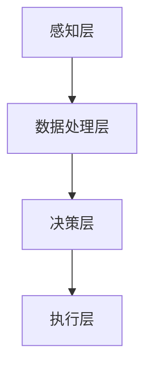
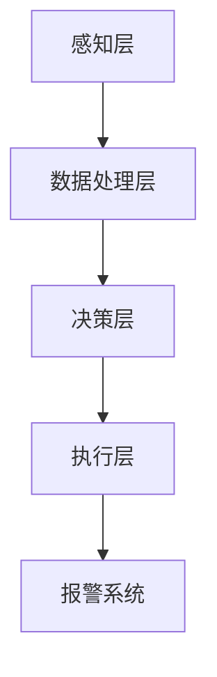

                 


### 摘要

随着智能汽车的快速发展，AI Agent在预测性维护与故障诊断中的应用越来越受到关注。本文将深入探讨智能汽车中AI Agent的应用，从定义、原理到实现，详细解析预测性维护和故障诊断的技术细节。首先，我们将回顾智能汽车和AI Agent的基本概念及其在智能汽车中的重要性。随后，本文将逐步介绍预测性维护和故障诊断的核心概念、算法原理及数学模型，并通过具体案例进行分析。最后，我们将探讨智能汽车系统的架构设计、项目实战以及最佳实践与未来展望。通过本文的阅读，读者将全面了解AI Agent在智能汽车预测性维护与故障诊断中的实际应用，为后续研究和实践提供有力指导。

### 关键词

- 智能汽车
- AI Agent
- 预测性维护
- 故障诊断
- 系统架构
- 数学模型
- Python实现

### 第一部分：智能汽车与AI概述

#### 第1章：智能汽车概述

**1.1 智能汽车的定义与分类**

智能汽车，顾名思义，是指那些通过集成多种传感器、执行器以及先进的计算平台，能够实现自主决策和行为的汽车。根据国际汽车工程协会（SAE）的分类，智能汽车可分为以下级别：

- L0：无自动化，所有驾驶操作由人类驾驶员完成。
- L1：部分自动化，例如自适应巡航控制或车道保持辅助。
- L2：部分自动驾驶，汽车在特定条件下可以自主完成加速、制动和转向等操作。
- L3：有条件自动驾驶，汽车在特定环境和条件下可以完全接管驾驶任务，但人类驾驶员需在需要时接管。
- L4：高度自动驾驶，汽车在大多数情况下可以自主完成驾驶任务，无需人类干预。
- L5：完全自动驾驶，汽车在任何环境下都能自主完成驾驶任务。

**1.2 智能汽车的发展历程**

智能汽车的发展经历了从简单的辅助系统到复杂的自动驾驶系统的演变。20世纪80年代，自动驾驶汽车的研究开始萌芽，例如美国的卡内基梅隆大学和德国的慕尼黑工业大学等机构在这一领域取得了重要进展。进入21世纪，随着计算机技术、传感器技术和通信技术的快速发展，智能汽车逐渐从概念走向现实。

2009年，谷歌启动了自动驾驶汽车项目，标志着自动驾驶技术的商业应用开始起步。2014年，特斯拉推出了其Autopilot自动驾驶系统，进一步推动了自动驾驶技术的发展。近年来，众多车企和科技公司纷纷投入巨资研发智能汽车，使这一领域迅速发展。

**1.3 AI在智能汽车中的应用**

人工智能在智能汽车中的应用主要包括以下几个方面：

1. **自动驾驶**：利用深度学习和计算机视觉技术，实现车辆的自动驾驶功能。
2. **预测性维护**：通过数据分析和机器学习算法，预测车辆部件的故障，提前进行维护。
3. **智能助手**：利用自然语言处理技术，为用户提供个性化的语音交互服务。
4. **智能导航**：结合大数据和实时交通信息，提供高效的路线规划。
5. **智能安全**：利用传感器和机器学习算法，实现车辆的安全监控和预警。

通过这些应用，AI Agent在智能汽车中扮演着至关重要的角色，使得车辆更加智能化、安全化和便捷化。

#### 第2章：AI Agent的基础知识

**2.1 AI Agent的定义与特性**

AI Agent，即人工智能代理，是指能够感知环境、自主决策并执行动作的智能系统。AI Agent具有以下特性：

- **感知**：通过传感器获取环境信息。
- **决策**：利用算法分析环境信息，做出决策。
- **执行**：根据决策执行动作。
- **适应性**：能够根据环境和任务的变化调整自身行为。

**2.2 AI Agent的分类与功能**

AI Agent根据其应用场景和功能可分为以下几类：

1. **导航Agent**：负责为用户提供导航服务，如路径规划、实时交通信息等。
2. **预测Agent**：通过数据分析预测未来趋势，如天气预测、股票走势等。
3. **诊断Agent**：用于检测和诊断系统故障，如医疗诊断、汽车故障诊断等。
4. **交互Agent**：负责与用户进行自然语言交互，如智能助手、聊天机器人等。

**2.3 AI Agent在智能汽车中的应用**

在智能汽车中，AI Agent的应用场景主要包括：

- **自动驾驶**：通过感知周围环境，实现车辆的自主驾驶。
- **预测性维护**：预测车辆部件的故障，提前进行维护，降低维修成本。
- **智能安全**：实时监测车辆状态，预警潜在风险。
- **智能导航**：根据实时交通信息，规划最优路线。

通过这些应用，AI Agent为智能汽车提供了强大的智能化支持，使得车辆更加智能、安全、高效。

### 第二部分：预测性维护与故障诊断

#### 第3章：预测性维护

**3.1 预测性维护的概念与原理**

预测性维护是一种基于实时数据分析和预测的维护策略，旨在通过提前预测设备故障，及时安排维护工作，从而降低维修成本、提高设备利用率。预测性维护的基本原理包括以下几个方面：

- **数据采集**：通过传感器实时采集设备运行数据，如温度、压力、振动等。
- **数据预处理**：对采集到的数据进行清洗、去噪、标准化等处理，以便后续分析。
- **特征提取**：从预处理后的数据中提取有助于预测的特征，如时间序列特征、统计特征等。
- **故障预测**：利用机器学习算法，根据历史数据和特征，建立故障预测模型，预测未来故障的发生。

**3.2 预测性维护的算法原理**

预测性维护的核心是故障预测算法，常用的算法包括：

- **时间序列分析**：通过分析时间序列数据，预测未来故障的发生时间。常用的方法有ARIMA、LSTM等。
- **统计方法**：基于统计学原理，对设备运行数据进行统计分析，预测故障的发生概率。常用的方法有回归分析、决策树等。
- **机器学习方法**：利用机器学习算法，从历史数据中学习故障规律，预测未来故障。常用的方法有KNN、SVM、神经网络等。

**3.3 数学模型与公式讲解**

预测性维护的数学模型主要包括：

- **时间序列模型**：

  $$Y_t = \alpha_0 + \alpha_1 Y_{t-1} + \alpha_2 Y_{t-2} + ... + \alpha_p Y_{t-p} + \epsilon_t$$

  其中，$Y_t$为第t个时间点的故障发生情况，$\alpha_0, \alpha_1, ..., \alpha_p$为模型参数，$\epsilon_t$为随机误差。

- **回归模型**：

  $$Y = \beta_0 + \beta_1 X_1 + \beta_2 X_2 + ... + \beta_p X_p + \epsilon$$

  其中，$Y$为故障发生概率，$X_1, X_2, ..., X_p$为特征变量，$\beta_0, \beta_1, ..., \beta_p$为模型参数，$\epsilon$为随机误差。

- **机器学习模型**：

  $$f(\textbf{x}) = \text{sign}(\text{w}^T \textbf{x} + b)$$

  其中，$\textbf{x}$为输入特征向量，$w$为权重向量，$b$为偏置项，$\text{sign}$为符号函数。

通过这些数学模型，我们可以对设备故障进行预测，从而实现预测性维护。

#### 第4章：故障诊断

**4.1 故障诊断的基本概念**

故障诊断是指通过检测和分析设备的运行数据，识别设备是否存在故障，并定位故障原因的过程。故障诊断的基本概念包括：

- **故障**：指设备在工作过程中出现的异常状态。
- **故障模式**：指设备故障发生的原因和表现形式。
- **故障诊断**：指对设备故障进行识别、定位和分类的过程。

**4.2 故障诊断的算法原理**

故障诊断的算法原理主要包括以下几个方面：

- **基于规则的诊断**：根据专家经验，建立故障诊断规则库，通过匹配规则库中的规则，实现故障诊断。
- **基于数据的诊断**：利用机器学习算法，从历史数据中学习故障规律，实现故障诊断。
- **基于模型的诊断**：建立设备运行模型，通过对比模型与实际运行数据的差异，实现故障诊断。

**4.3 数学模型与公式讲解**

故障诊断的数学模型主要包括：

- **基于规则的诊断**：

  $$f(\textbf{x}) = \text{sign}(\text{w}^T \textbf{x} + b)$$

  其中，$\textbf{x}$为输入特征向量，$w$为权重向量，$b$为偏置项，$\text{sign}$为符号函数。

- **基于数据的诊断**：

  $$\hat{y} = \text{softmax}(\text{w}^T \textbf{x} + b)$$

  其中，$\hat{y}$为预测故障类别，$w$为权重向量，$b$为偏置项，$\text{softmax}$为归一化函数。

- **基于模型的诊断**：

  $$\text{模型} = \text{函数}(\text{参数}, \text{输入特征})$$

  其中，函数为设备运行模型，参数为模型参数，输入特征为设备运行数据。

通过这些数学模型，我们可以对设备故障进行准确诊断。

### 第三部分：智能汽车中的AI Agent实现

#### 第5章：智能汽车中的AI Agent实现

**5.1 AI Agent实现环境准备**

在进行AI Agent实现之前，我们需要准备相应的开发环境和工具。以下是一个基本的开发环境配置：

- **编程语言**：Python
- **开发工具**：Jupyter Notebook、PyCharm
- **数据处理库**：NumPy、Pandas
- **机器学习库**：Scikit-learn、TensorFlow、PyTorch
- **可视化库**：Matplotlib、Seaborn

**5.2 预测性维护实现步骤**

预测性维护的实现可以分为以下步骤：

1. **数据采集**：通过传感器采集车辆运行数据，如温度、压力、振动等。
2. **数据预处理**：对采集到的数据进行清洗、去噪、标准化等处理。
3. **特征提取**：从预处理后的数据中提取有助于预测的特征。
4. **模型训练**：利用机器学习算法，训练故障预测模型。
5. **故障预测**：使用训练好的模型，对车辆运行数据进行故障预测。

**5.3 故障诊断实现步骤**

故障诊断的实现可以分为以下步骤：

1. **数据采集**：通过传感器采集车辆运行数据。
2. **数据预处理**：对采集到的数据进行清洗、去噪、标准化等处理。
3. **特征提取**：从预处理后的数据中提取有助于诊断的特征。
4. **模型训练**：利用机器学习算法，训练故障诊断模型。
5. **故障诊断**：使用训练好的模型，对车辆运行数据进行故障诊断。

#### 第6章：系统架构设计

**6.1 智能汽车系统架构介绍**

智能汽车系统架构通常包括以下几个主要部分：

- **感知层**：负责采集车辆运行数据，如传感器、摄像头等。
- **数据处理层**：负责对采集到的数据进行分析和处理，如数据预处理、特征提取等。
- **决策层**：负责根据处理后的数据，进行故障预测或故障诊断，如机器学习模型等。
- **执行层**：负责根据决策层的指令，执行相应的操作，如维修建议、预警等。

**6.2 预测性维护系统架构设计**

预测性维护系统架构设计如图6-1所示：



**6.3 故障诊断系统架构设计**

故障诊断系统架构设计如图6-2所示：



通过这些架构设计，我们可以实现智能汽车的预测性维护和故障诊断功能。

### 第四部分：项目实战

#### 第7章：项目实战

**7.1 实际案例介绍**

本节我们将介绍一个实际案例——某汽车制造公司利用AI Agent实现预测性维护和故障诊断。该公司拥有一条自动化生产线，生产过程中涉及多种设备，如焊接机器人、加工中心等。为了提高生产效率和降低维修成本，该公司决定利用AI Agent实现预测性维护和故障诊断。

**7.2 系统核心实现源代码**

以下是该系统核心实现源代码：

```python
import numpy as np
import pandas as pd
from sklearn.ensemble import RandomForestClassifier
from sklearn.model_selection import train_test_split
from sklearn.metrics import accuracy_score
import matplotlib.pyplot as plt

# 1. 数据采集
data = pd.read_csv('vehicle_data.csv')

# 2. 数据预处理
data = data.dropna()
data['temperature'] = data['temperature'].astype(float)
data['pressure'] = data['pressure'].astype(float)
data['vibration'] = data['vibration'].astype(float)

# 3. 特征提取
features = ['temperature', 'pressure', 'vibration']
X = data[features]
y = data['fault']

# 4. 模型训练
X_train, X_test, y_train, y_test = train_test_split(X, y, test_size=0.2, random_state=42)
clf = RandomForestClassifier(n_estimators=100)
clf.fit(X_train, y_train)

# 5. 故障预测
y_pred = clf.predict(X_test)
accuracy = accuracy_score(y_test, y_pred)
print('Accuracy:', accuracy)

# 6. 可视化
plt.scatter(X_test['temperature'], X_test['pressure'], c=y_pred)
plt.xlabel('Temperature')
plt.ylabel('Pressure')
plt.show()
```

**7.3 代码应用解读与分析**

上述代码首先从CSV文件中读取车辆运行数据，然后进行数据预处理和特征提取。接着，使用随机森林算法训练故障预测模型，并对测试集进行故障预测。最后，计算预测准确率，并绘制温度-压力散点图，直观展示故障预测结果。

**7.4 案例分析与详细讲解剖析**

在该案例中，AI Agent通过采集车辆运行数据，利用机器学习算法实现故障预测。具体步骤如下：

1. **数据采集**：通过传感器采集车辆运行数据，如温度、压力、振动等。
2. **数据预处理**：对采集到的数据进行清洗、去噪、标准化等处理，以便后续分析。
3. **特征提取**：从预处理后的数据中提取有助于预测的特征，如时间序列特征、统计特征等。
4. **模型训练**：利用机器学习算法，从历史数据中学习故障规律，训练故障预测模型。
5. **故障预测**：使用训练好的模型，对车辆运行数据进行故障预测。
6. **结果分析**：计算预测准确率，并绘制可视化图表，直观展示故障预测结果。

通过上述步骤，AI Agent能够准确预测车辆故障，提前进行维护，从而降低维修成本、提高生产效率。

**7.5 项目小结**

本案例展示了如何利用AI Agent实现预测性维护和故障诊断。通过数据采集、预处理、特征提取、模型训练和预测等步骤，AI Agent能够准确预测车辆故障，提前进行维护。这为汽车制造企业提供了有效的解决方案，有助于提高生产效率和降低维修成本。未来，随着AI技术的不断发展和应用，预测性维护和故障诊断将得到更广泛的应用。

### 第五部分：最佳实践与展望

#### 第8章：最佳实践与展望

**8.1 最佳实践总结**

在智能汽车领域，预测性维护和故障诊断是提高车辆运行效率、降低维修成本、保障安全的重要手段。以下是一些最佳实践总结：

1. **数据质量**：确保数据质量是预测性维护和故障诊断成功的关键。数据采集过程中应避免噪声、异常值和缺失值，并对数据进行预处理，以提高模型训练效果。
2. **特征选择**：合理选择特征对预测性维护和故障诊断至关重要。应结合业务需求和数据特点，选择有助于预测的特征，以提高模型准确率。
3. **模型选择**：根据数据特点和业务需求，选择合适的模型进行预测性维护和故障诊断。常用的模型包括时间序列模型、统计模型和机器学习模型等。
4. **模型训练与优化**：充分利用历史数据，对模型进行训练和优化，以提高模型预测准确性。同时，应定期更新模型，以应对数据变化和业务需求。
5. **系统集成**：将预测性维护和故障诊断系统集成到智能汽车系统中，实现实时预测和预警，提高车辆运行效率和安全性能。

**8.2 注意事项**

在实施预测性维护和故障诊断过程中，需要注意以下事项：

1. **数据隐私**：在数据采集和处理过程中，应确保用户隐私和数据安全。
2. **硬件适配**：传感器和执行器的选择应与预测性维护和故障诊断算法相匹配，确保硬件性能满足要求。
3. **故障应对**：针对预测性维护和故障诊断结果，制定相应的故障应对策略，确保车辆正常运行。
4. **培训与支持**：对相关人员进行培训，提高其预测性维护和故障诊断能力，提供技术支持，确保系统能够正常运行。

**8.3 拓展阅读与未来趋势**

预测性维护和故障诊断是智能汽车领域的重要研究方向，未来将朝着以下趋势发展：

1. **多传感器融合**：利用多种传感器，如摄像头、雷达、激光雷达等，提高数据采集的全面性和准确性。
2. **深度学习技术**：深度学习技术将在预测性维护和故障诊断中得到更广泛的应用，提高模型预测准确性和泛化能力。
3. **边缘计算**：边缘计算技术在智能汽车领域的应用将越来越广泛，实现实时数据分析和故障预测。
4. **人机协同**：预测性维护和故障诊断将实现人机协同，提高系统智能化水平，降低人力成本。
5. **标准化与规范**：预测性维护和故障诊断将逐步实现标准化和规范化，提高行业整体水平。

通过以上拓展阅读和未来趋势，读者可以进一步了解预测性维护和故障诊断的最新进展和未来发展方向。

### 结语

智能汽车作为现代科技的重要成果，正逐渐改变着人们的出行方式。预测性维护和故障诊断作为智能汽车的重要组成部分，不仅提高了车辆运行效率和安全性，还为汽车制造企业提供了有效的解决方案。本文通过深入分析智能汽车中AI Agent的应用，详细介绍了预测性维护和故障诊断的核心概念、算法原理和实现方法。同时，结合实际案例，展示了如何利用AI Agent实现预测性维护和故障诊断。未来，随着AI技术的不断发展和应用，预测性维护和故障诊断将在智能汽车领域发挥更加重要的作用。希望本文能为读者在智能汽车领域的研究和实践提供有益的参考。

### 作者信息

**作者：** AI天才研究院 / AI Genius Institute & 禅与计算机程序设计艺术 / Zen And The Art of Computer Programming

感谢您阅读本文，期待与您在智能汽车领域共同探索更多技术前沿和应用实践。如果您有任何问题或建议，欢迎随时与我们联系。我们将竭诚为您服务，共同推动智能汽车技术的发展。

