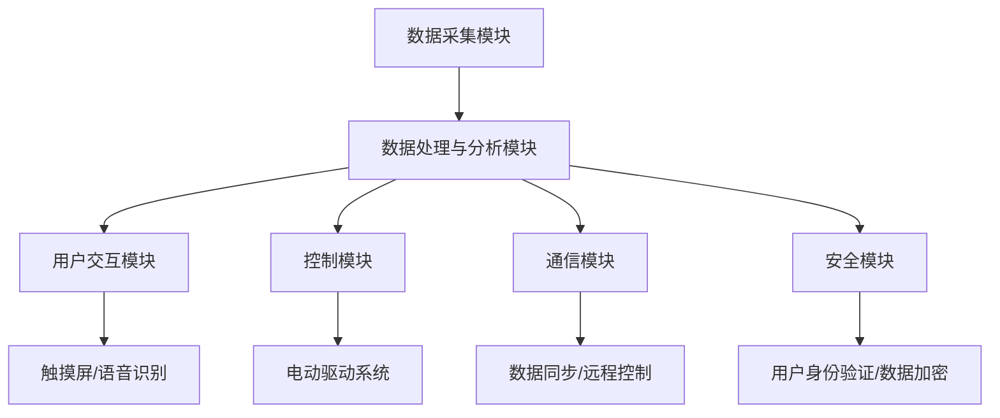

                 

### 1.1 问题背景

#### 1.1.1 坐姿健康问题的重要性

随着现代社会的快速发展，人们的生活方式发生了巨大的变化。越来越多的人长时间坐在办公室、家庭和工作场所，无论是进行电脑操作、阅读书籍还是看电视，这种长时间的坐姿已经成为了现代生活的一部分。然而，长时间保持不正确的坐姿对人体健康造成了严重的威胁。坐姿不良不仅会导致颈椎、腰椎等部位的疼痛和损伤，还可能引发更深层次的健康问题，如心血管疾病、糖尿病、肥胖症等。

据统计，全球每年因长时间坐姿不正确而导致的工作日损失高达数千亿美元。同时，坐姿不良还会影响工作效率和生活质量，导致精神压力增大、注意力不集中等问题。因此，如何有效地监测和改善坐姿健康，成为了当今社会亟待解决的问题。

#### 1.1.2 智能沙发与AI Agent的概念

智能沙发是一种融合了先进技术和智能功能的高科技家具产品，它不仅能够提供舒适的坐姿体验，还能通过内置的传感器和智能系统实时监测用户的坐姿状态，提供健康建议和反馈。智能沙发的核心在于其内置的AI Agent，即人工智能代理，这种代理通过机器学习和数据分析技术，能够识别用户的坐姿状态，评估其健康状况，并提供个性化的改善建议。

AI Agent是一种基于人工智能技术的智能体，它能够模拟人类智能，执行复杂的任务，并具备自主学习和适应能力。在智能沙发的应用中，AI Agent能够根据用户的坐姿数据，不断优化监测算法，提高监测的准确性和可靠性，从而更好地保障用户的坐姿健康。

#### 1.1.3 坐姿健康监测的需求与挑战

坐姿健康监测的需求主要来源于以下几个方面：

1. **实时性**：用户需要及时了解自己的坐姿状态，以便及时调整。
2. **准确性**：监测系统需要准确地识别和评估用户的坐姿状态，避免误报和漏报。
3. **个性化**：每个人的坐姿习惯和健康状况都有所不同，监测系统需要提供个性化的健康建议。
4. **易用性**：监测系统需要简单易用，用户无需过多的操作即可获得有效的健康反馈。

然而，坐姿健康监测也面临诸多挑战：

1. **传感器技术**：传感器需要具备高精度和高灵敏度，以准确捕捉用户的坐姿变化。
2. **数据处理**：大量的坐姿数据需要高效地处理和分析，以便快速得出结论。
3. **算法优化**：算法需要不断优化，以适应不同的坐姿环境和用户需求。
4. **用户隐私**：监测系统需要保护用户的隐私，确保数据的安全性和合法性。

综上所述，智能沙发与AI Agent的坐姿健康监测系统具有广泛的应用前景，但同时也面临着诸多挑战。如何有效解决这些问题，将决定智能沙发在市场上的竞争力和用户认可度。

### 1.2 核心概念

#### 1.2.1 智能沙发的定义与功能

智能沙发是一种结合了智能技术和舒适设计的高科技家具。它不仅能够提供舒适的坐姿体验，还具有多种智能功能，如自动调节、语音控制、健康监测等。智能沙发的核心在于其内置的AI Agent，通过传感器和智能算法，实现对用户坐姿状态的实时监测和健康评估。

智能沙发的主要功能包括：

1. **坐姿监测**：通过内置传感器实时监测用户的坐姿状态，如是否保持正确坐姿、坐姿时长等。
2. **健康建议**：根据监测结果，AI Agent会提供个性化的健康建议，如调整坐姿、休息时间等。
3. **自动调节**：智能沙发可以根据用户需求自动调整座椅角度、靠背高度等，提供更舒适的坐姿体验。
4. **语音控制**：用户可以通过语音指令控制智能沙发的各项功能，如调节音量、切换频道等。

#### 1.2.2 AI Agent的工作原理与应用

AI Agent（人工智能代理）是一种基于人工智能技术的智能体，它能够模拟人类智能，执行复杂的任务，并具备自主学习和适应能力。在智能沙发中，AI Agent通过传感器收集用户的坐姿数据，使用机器学习和数据分析技术对数据进行分析和处理，从而实现对用户坐姿状态的识别和评估。

AI Agent的工作原理主要包括以下几个步骤：

1. **数据采集**：通过内置的传感器实时采集用户的坐姿数据，如座椅角度、用户位置等。
2. **数据处理**：对采集到的数据进行预处理，包括去噪、归一化等，以便进行后续的分析。
3. **特征提取**：从预处理后的数据中提取有用的特征，如坐姿角度、坐姿时长等。
4. **健康评估**：使用机器学习算法对提取的特征进行分类和预测，评估用户的坐姿健康状态。
5. **反馈与调整**：根据评估结果，提供个性化的健康建议，并自动调整沙发的姿态，以改善用户的坐姿。

AI Agent在智能沙发中的应用非常广泛，不仅能够提高沙发的智能化水平，还能为用户提供更加舒适和健康的坐姿体验。例如，在办公室环境中，AI Agent可以实时监测员工的工作状态，提醒他们调整坐姿，防止长时间保持不良坐姿导致的健康问题；在家庭环境中，AI Agent可以为用户提供个性化的坐姿健康报告，帮助他们养成良好的坐姿习惯。

#### 1.2.3 坐姿健康监测的核心要素

坐姿健康监测的核心要素主要包括以下几个方面：

1. **传感器技术**：传感器是坐姿健康监测的关键组件，它能够实时采集用户的坐姿数据，如座椅角度、用户位置等。传感器的选择和布局策略对监测的准确性和稳定性有重要影响。
2. **数据采集与处理**：有效的数据采集和处理是坐姿健康监测的基础。通过高效的数据处理算法，可以去除噪声、提取有用的特征，为后续的健康评估提供准确的数据支持。
3. **机器学习算法**：机器学习算法是坐姿健康监测的核心技术，它能够对采集到的数据进行分类和预测，评估用户的坐姿健康状态。常用的算法包括决策树、支持向量机、神经网络等。
4. **健康评估标准**：健康评估标准是坐姿健康监测的重要依据，它能够量化用户的坐姿健康状态，提供客观的评估结果。常见的评估标准包括坐姿角度、坐姿时长等。
5. **用户界面**：用户界面是坐姿健康监测系统与用户交互的窗口，它能够直观地展示监测结果和健康建议，帮助用户了解自己的坐姿状态，并进行相应的调整。

通过以上核心要素的有机结合，坐姿健康监测系统能够为用户提供实时的健康反馈和个性化的健康建议，帮助他们养成良好的坐姿习惯，预防健康问题。

#### 1.3 边界与外延

##### 1.3.1 坐姿健康监测的范围

坐姿健康监测主要关注以下几个方面：

1. **坐姿角度**：监测用户坐姿的角度，如颈椎、腰椎的角度，评估是否符合健康标准。
2. **坐姿时长**：监测用户保持某种坐姿的时间，如连续坐姿时长、每日坐姿时长等，评估长时间坐姿对健康的影响。
3. **身体活动**：监测用户的身体活动情况，如站立、行走、休息等，评估身体活动的多样性和强度。

##### 1.3.2 智能沙发的适用场景

智能沙发的适用场景非常广泛，主要包括以下几种：

1. **办公室**：智能沙发可以用于办公室，为员工提供舒适的坐姿体验，同时监测员工的坐姿健康，预防职业病。
2. **家庭**：智能沙发可以用于家庭，为家庭成员提供健康的坐姿环境，帮助养成正确的坐姿习惯。
3. **医疗康复**：智能沙发可以用于医疗康复，为康复患者提供科学的坐姿监测和健康建议，促进康复进程。

##### 1.3.3 AI Agent的技术边界

AI Agent在智能沙发中的应用虽然取得了显著的成果，但仍然存在一些技术边界：

1. **传感器精度**：传感器的精度直接影响监测的准确性，目前一些传感器的精度仍然有待提高。
2. **算法复杂度**：算法的复杂度决定了系统的性能和计算成本，如何优化算法，提高处理效率，是一个重要的研究课题。
3. **数据处理能力**：大量的数据需要高效地处理和分析，现有的数据处理能力仍然有限，需要进一步提高。

通过不断的技术创新和优化，AI Agent在智能沙发中的应用将越来越广泛，未来有望为人们的坐姿健康提供更加全面和精准的监测和改善。

#### 1.4 概念结构与核心要素组成

##### 1.4.1 智能沙发的主要组成部分

智能沙发主要由以下几个部分组成：

1. **底座与框架**：提供沙发的支撑结构，保证沙发的稳定性。底座通常包含电动驱动系统，用于自动调节沙发的姿态。
2. **座椅与靠背**：提供舒适的坐姿体验，内置传感器用于监测用户的坐姿状态。座椅和靠背的设计要考虑到人体工程学，以提供最佳的舒适度和健康支持。
3. **控制模块**：包括硬件控制板和软件控制系统，用于接收用户的指令，控制沙发的各项功能。控制模块还负责与AI Agent通信，接收和发送健康监测数据。
4. **电源供应**：为智能沙发的各项功能提供电力支持，包括传感器、驱动系统、控制模块等。

##### 1.4.2 AI Agent的关键模块与功能

AI Agent是智能沙发的核心，主要包括以下几个关键模块：

1. **数据采集模块**：负责从传感器获取用户的坐姿数据，包括座椅角度、用户位置等。数据采集模块需要具备高效的数据传输和处理能力。
2. **数据处理模块**：对采集到的数据进行预处理，包括去噪、归一化等。数据处理模块还要提取有用的特征，为后续的健康评估提供数据支持。
3. **健康评估模块**：使用机器学习算法对提取的特征进行分类和预测，评估用户的坐姿健康状态。健康评估模块需要具备高度的准确性和可靠性。
4. **反馈调整模块**：根据健康评估结果，提供个性化的健康建议，并控制沙发的姿态调整，以改善用户的坐姿。反馈调整模块需要与控制模块紧密协作，确保调整的及时性和准确性。
5. **用户界面模块**：提供用户与AI Agent交互的界面，展示健康监测结果和建议。用户界面模块需要简洁直观，方便用户理解和使用。

##### 1.4.3 坐姿健康监测的数据采集与分析方法

坐姿健康监测的数据采集与分析方法主要包括以下几个步骤：

1. **数据采集**：通过内置传感器实时采集用户的坐姿数据，包括座椅角度、用户位置、身体活动等。传感器的选择和布局策略对数据采集的准确性有重要影响。
2. **数据预处理**：对采集到的原始数据进行预处理，包括去噪、归一化等。预处理后的数据将更加适合后续的分析和处理。
3. **特征提取**：从预处理后的数据中提取有用的特征，如坐姿角度、坐姿时长、身体活动强度等。特征提取的准确性直接影响健康评估的结果。
4. **健康评估**：使用机器学习算法对提取的特征进行分类和预测，评估用户的坐姿健康状态。常用的算法包括决策树、支持向量机、神经网络等。
5. **结果反馈**：根据健康评估结果，提供个性化的健康建议，并通过用户界面模块展示给用户。同时，反馈调整模块会根据评估结果控制沙发的姿态调整，以改善用户的坐姿。

通过以上步骤，智能沙发的AI Agent能够实现对用户坐姿健康的实时监测和评估，提供个性化的健康建议和改善措施。

### 1.5 本章小结

本章首先介绍了坐姿健康问题的背景和重要性，指出了智能沙发与AI Agent在解决这一问题中的关键作用。接着，我们定义了智能沙发的功能和AI Agent的工作原理，详细阐述了坐姿健康监测的核心要素。此外，还探讨了坐姿健康监测的范围、智能沙发的适用场景以及AI Agent的技术边界。通过本章的介绍，我们为后续章节的内容奠定了基础，也为读者提供了对智能沙发和AI Agent的全面了解。

## 第二部分：智能沙发的硬件设计

在智能沙发的整体设计中，硬件设计是其核心组成部分之一。智能沙发的硬件设计不仅关系到沙发的功能实现，还直接影响用户体验和系统的可靠性。本节将详细介绍智能沙发的硬件组成、感应器选择与布局、硬件设计流程以及硬件测试与优化。

### 2.1 智能沙发的硬件组成

智能沙发的硬件组成包括底座与框架、座椅与靠背、控制模块、电源供应等几个关键部分。以下是各部分的详细介绍：

#### 2.1.1 底座与框架设计

底座与框架是智能沙发的支撑结构，其设计要确保沙发的稳定性和承载能力。底座通常采用高强度材料，如不锈钢或铝合金，以保证长期使用的耐久性。框架的设计需要考虑到智能沙发的各种调节功能，如座椅高度、靠背角度等，通常包含电动驱动系统，通过电机和传动机构实现座椅的自动调节。

底座与框架的连接处需要设计坚固的支撑结构，以防止在使用过程中出现松动或变形。此外，为了增强稳定性，可以在底座和框架上增加减震装置，以吸收来自地面的震动和冲击。

#### 2.1.2 座椅与靠背设计

座椅与靠背是用户直接接触的部分，其设计直接影响用户的舒适度和健康状态。座椅与靠背的设计需要遵循人体工程学原则，以提供最佳的支撑和舒适度。座椅的表面材料应选择透气性好、柔软且耐用的高品质材料，如透气网布或高档皮革。

座椅的设计应包含可调节的功能，如高度调节、前后滑动、倾斜调节等，以满足不同用户的个性化需求。靠背的设计应能够适应不同坐姿，提供良好的腰部支撑，防止长时间坐姿导致的腰背疼痛。此外，靠背的倾斜角度和曲线设计也应考虑人体工学，以减少对颈椎和腰椎的压力。

#### 2.1.3 调节与控制机制

智能沙发的调节与控制机制是其核心功能之一，通过智能控制模块实现各种调节功能。控制模块通常包括一个主控制板和若干个从控制板，通过有线或无线方式连接。主控制板负责接收用户的指令，并通过从控制板发送信号到电动驱动系统，实现座椅和靠背的调节。

控制模块需要具备以下功能：

1. **自动调节**：根据用户的坐姿状态，自动调整座椅和靠背的位置，提供最舒适的坐姿体验。
2. **手动调节**：用户可以通过遥控器或触摸屏手动调整座椅和靠背的位置，以满足个性化的需求。
3. **智能反馈**：通过AI Agent的健康监测功能，实时反馈用户的坐姿状态，并提供健康建议。
4. **安全保护**：在调节过程中，控制模块需要具备故障检测和保护功能，防止意外发生。

### 2.2 感应器选择与布局

感应器是智能沙发实现坐姿监测功能的关键部件，其选择和布局对监测的准确性和稳定性至关重要。以下是感应器选择与布局的详细说明：

#### 2.2.1 感应器的类型与工作原理

常用的感应器类型包括压力感应器、倾斜感应器、加速度感应器等。不同类型的感应器具有不同的工作原理和应用场景：

1. **压力感应器**：通过检测座椅上的压力分布，判断用户的坐姿状态。压力感应器通常采用压电元件或电阻应变片制成，具有高灵敏度和准确性。
2. **倾斜感应器**：通过检测座椅和靠背的倾斜角度，判断用户的坐姿角度。倾斜感应器通常采用陀螺仪或加速度传感器制成，适用于检测动态变化。
3. **加速度感应器**：通过检测座椅和靠背的加速度变化，判断用户的身体运动状态。加速度感应器通常采用MEMS（微电子机械系统）技术制成，具有高精度和稳定性。

#### 2.2.2 感应器的布局策略

感应器的布局策略对监测的准确性和稳定性有很大影响。以下是一些常见的布局策略：

1. **多点布局**：在座椅和靠背的多个关键位置布置感应器，如座椅中心、靠背中央、腰部位置等。多点布局可以提高监测的全面性和准确性，但同时也增加了系统的复杂度和成本。
2. **区域布局**：将感应器布置在座椅和靠背的特定区域，如座椅前部、靠背顶部等。区域布局可以针对特定的坐姿状态进行监测，但可能降低整体的监测准确性。
3. **分布布局**：将感应器均匀分布在座椅和靠背的表面，形成网格状布局。分布布局可以提供更加均匀的监测效果，但可能对动态变化监测能力有所影响。

#### 2.2.3 感应器的选型与参数优化

在选择感应器时，需要考虑以下几个关键参数：

1. **灵敏度**：感应器的灵敏度决定了其检测到的信号强度，灵敏度越高，检测到的信号越准确。
2. **精度**：感应器的精度决定了其测量的准确性，精度越高，测量结果越可靠。
3. **响应速度**：感应器的响应速度决定了其对新变化的反应能力，响应速度越快，监测的实时性越高。
4. **耐久性**：感应器的耐久性决定了其在长期使用中的稳定性和可靠性，耐久性越高，使用寿命越长。

在选型过程中，可以根据具体的应用需求和技术指标，选择合适的感应器型号。同时，还可以通过优化感应器的参数，如调整灵敏度、精度等，来提高系统的整体性能。

### 2.3 硬件设计流程

智能沙发的硬件设计是一个复杂的过程，需要综合考虑功能需求、技术指标、成本和用户体验等多个因素。以下是智能沙发硬件设计的详细流程：

#### 2.3.1 设计需求分析

设计需求分析是硬件设计的首要步骤，需要明确智能沙发的功能需求和技术指标。具体包括以下几个方面：

1. **功能需求**：明确智能沙发需要实现的功能，如自动调节、健康监测、语音控制等。
2. **技术指标**：确定智能沙发的技术参数，如传感器精度、响应速度、电源供应等。
3. **用户体验**：分析用户的期望和需求，确保智能沙发的操作简便、舒适度高。

#### 2.3.2 硬件选型与方案确定

在明确设计需求后，需要选择合适的硬件组件和设计方案。具体步骤如下：

1. **传感器选型**：根据功能需求和技术指标，选择合适的传感器类型和型号。
2. **控制模块选型**：选择具备足够处理能力和扩展性的控制模块，以满足智能沙发的控制需求。
3. **电源供应方案**：确定电源供应方案，如电池、充电器等。
4. **总体方案确定**：综合各部分选型和设计，确定智能沙发的总体设计方案。

#### 2.3.3 原型设计与验证

在方案确定后，需要进行原型设计和验证。具体步骤如下：

1. **电路设计**：根据硬件方案，设计电路图和PCB板布局。
2. **机械设计**：设计智能沙发的机械结构，包括底座、座椅、靠背等。
3. **原型制作**：根据设计图纸，制作智能沙发的物理原型。
4. **功能验证**：对原型机进行功能验证，确保各部件和功能正常运行。

### 2.4 硬件测试与优化

智能沙发的硬件测试与优化是确保其性能和可靠性的关键步骤。以下是硬件测试与优化的详细说明：

#### 2.4.1 硬件测试标准与方法

硬件测试标准与方法主要包括以下几个方面：

1. **功能测试**：验证智能沙发的各项功能是否正常，如自动调节、健康监测、语音控制等。
2. **性能测试**：测试智能沙发的性能指标，如传感器精度、响应速度、功耗等。
3. **稳定性测试**：在模拟实际使用环境中，测试智能沙发的稳定性和可靠性。
4. **安全测试**：测试智能沙发的安全性，包括电气安全、数据安全等。

#### 2.4.2 测试结果分析与优化建议

在完成硬件测试后，需要对测试结果进行分析，并提出优化建议。具体包括以下几个方面：

1. **性能优化**：根据测试结果，对硬件组件和设计方案进行优化，提高性能和稳定性。
2. **成本优化**：在保证性能和稳定性的前提下，优化硬件成本，提高产品的市场竞争力。
3. **用户体验优化**：根据用户反馈和使用体验，优化智能沙发的操作界面和交互体验。

#### 2.4.3 硬件故障排除与维护

硬件故障排除与维护是确保智能沙发长期稳定运行的关键。具体包括以下几个方面：

1. **故障排查**：在智能沙发出现故障时，进行故障排查和定位，找出故障原因。
2. **维修与更换**：对故障部件进行维修或更换，确保智能沙发的正常使用。
3. **定期维护**：制定定期维护计划，对智能沙发的各个部件进行检查和维护，防止故障发生。

通过以上硬件设计、测试与优化的流程，智能沙发能够实现高效、稳定和可靠的运行，为用户提供优质的坐姿健康监测体验。

### 2.5 本章小结

本章详细介绍了智能沙发的硬件设计，包括底座与框架设计、座椅与靠背设计、控制模块设计以及感应器的选择与布局。通过硬件设计流程的介绍，读者可以了解到智能沙发的硬件设计原则和方法。此外，本章还阐述了硬件测试与优化的重要性，包括测试标准、结果分析和故障排除。通过本章的学习，读者可以对智能沙发的硬件设计有一个全面的了解，为后续的软件设计和系统集成打下坚实基础。

## 第三部分：AI Agent的算法设计

在智能沙发的硬件设计完成后，接下来我们需要关注的是AI Agent的算法设计。AI Agent作为智能沙发的核心，负责数据采集、数据处理和健康评估，其算法设计的优劣直接决定了智能沙发的性能和用户体验。本节将详细探讨AI Agent的基本原理、数据预处理、坐姿健康评估算法、AI Agent的训练与优化，以及本章的小结。

### 3.1 AI Agent的基本原理

#### 3.1.1 AI Agent的定义与分类

AI Agent（人工智能代理）是一种能够模拟人类智能，执行特定任务，并具备一定自主学习和适应能力的计算机程序。AI Agent可以根据其任务类型和实现方式分为多种类别，如以下几种：

1. **感知型AI Agent**：主要负责感知环境信息，如语音识别、图像识别等。
2. **决策型AI Agent**：基于感知信息进行决策，如自动驾驶、智能调度等。
3. **交互型AI Agent**：负责与用户进行交互，如智能客服、虚拟助手等。
4. **混合型AI Agent**：同时具备感知、决策和交互功能，如智能助理、智能管家等。

#### 3.1.2 常见算法框架与技术

AI Agent的实现依赖于多种人工智能算法和技术。以下是一些常见的算法框架和技术：

1. **机器学习（Machine Learning）**：通过训练模型，使计算机能够从数据中学习并做出预测或决策。
   - **监督学习（Supervised Learning）**：有标记的训练数据，用于训练模型。
   - **无监督学习（Unsupervised Learning）**：没有标记的数据，用于发现数据中的模式和结构。
   - **半监督学习（Semi-Supervised Learning）**：结合有标记和无标记数据，提高学习效果。

2. **深度学习（Deep Learning）**：一种特殊的机器学习技术，使用多层神经网络模型进行训练，具有强大的特征提取和模式识别能力。
   - **卷积神经网络（CNN）**：常用于图像和视频处理。
   - **循环神经网络（RNN）**：常用于处理序列数据。
   - **生成对抗网络（GAN）**：用于生成逼真的数据。

3. **自然语言处理（Natural Language Processing, NLP）**：使计算机能够理解、生成和处理自然语言。
   - **词向量（Word Embedding）**：将词语映射到高维空间，以便进行计算。
   - **序列标注（Sequence Labeling）**：对序列数据进行分类标注。
   - **文本生成（Text Generation）**：生成符合语法和语义的文本。

4. **强化学习（Reinforcement Learning）**：通过试错和奖励机制，使计算机能够在动态环境中做出最优决策。

#### 3.1.3 AI Agent的核心功能

AI Agent在智能沙发中的核心功能包括：

1. **数据采集**：通过内置传感器，实时采集用户的坐姿数据，如座椅角度、用户位置等。
2. **数据处理**：对采集到的数据进行预处理，包括去噪、归一化等，以便进行后续的分析。
3. **特征提取**：从预处理后的数据中提取有用的特征，如坐姿角度、坐姿时长等。
4. **健康评估**：使用机器学习算法对提取的特征进行分类和预测，评估用户的坐姿健康状态。
5. **反馈与调整**：根据健康评估结果，提供个性化的健康建议，并控制沙发的姿态调整，以改善用户的坐姿。
6. **用户交互**：通过语音、触摸屏等界面，与用户进行交互，展示健康监测结果和建议。

### 3.2 数据预处理

数据预处理是AI Agent算法设计的重要环节，其目的是提高数据的质量和适用性，为后续的特征提取和健康评估提供准确的数据支持。数据预处理主要包括以下几个步骤：

#### 3.2.1 数据采集方法与工具

数据采集是数据预处理的基础，智能沙发的数据采集主要依赖于内置的传感器。常用的传感器包括：

1. **压力传感器**：用于检测座椅上的压力分布。
2. **倾斜传感器**：用于检测座椅和靠背的倾斜角度。
3. **加速度传感器**：用于检测用户的身体运动状态。

数据采集工具通常包括：

1. **传感器数据采集模块**：负责实时采集传感器的数据。
2. **数据存储模块**：将采集到的数据存储到数据库或文件中，以便后续处理。

#### 3.2.2 数据清洗与预处理流程

数据清洗和预处理流程包括以下几个步骤：

1. **去噪**：去除传感器数据中的噪声，提高数据的准确性。常用的去噪方法包括滤波、插值等。
2. **归一化**：将不同传感器的数据进行归一化处理，使其具有相同的量纲和范围，便于后续处理。
3. **缺失值处理**：对数据中的缺失值进行插补或删除，确保数据的完整性。
4. **异常值处理**：检测并处理数据中的异常值，防止其对特征提取和健康评估产生误导。

#### 3.2.3 特征提取与降维

特征提取是数据预处理的关键步骤，其目的是从原始数据中提取有用的信息，用于健康评估。特征提取方法包括：

1. **时域特征**：如最大值、最小值、均值、标准差等。
2. **频域特征**：如频谱分析、小波变换等。
3. **时频特征**：结合时域和频域特征，如短时傅里叶变换（STFT）。

降维是将高维数据映射到低维空间，减少数据存储和计算成本。常用的降维方法包括：

1. **主成分分析（PCA）**：通过线性变换，将高维数据映射到低维空间，保留主要信息。
2. **线性判别分析（LDA）**：通过最大化类内离散度和最小化类间离散度，将数据映射到最优的低维空间。
3. **自编码器（Autoencoder）**：通过无监督学习，将高维数据映射到低维空间，并重建原始数据。

### 3.3 坐姿健康评估算法

坐姿健康评估算法是AI Agent的核心功能之一，其目的是通过分析用户的坐姿数据，评估其坐姿健康状态，并提供个性化的健康建议。以下是一些常用的坐姿健康评估算法：

#### 3.3.1 坐姿健康评估指标

坐姿健康评估指标包括：

1. **坐姿角度**：评估颈椎、腰椎等关键部位的角度是否符合健康标准。
2. **坐姿时长**：评估用户长时间保持某种坐姿的时间，判断是否存在久坐问题。
3. **身体活动**：评估用户的身体活动情况，如站立、行走、休息等，判断身体活动的多样性和强度。

#### 3.3.2 常见评估算法介绍

1. **决策树（Decision Tree）**：通过一系列条件判断，将数据划分为不同的类别。决策树模型简单直观，易于理解和解释。
2. **支持向量机（Support Vector Machine, SVM）**：通过找到一个最优的超平面，将不同类别的数据分隔开。SVM具有较高的分类准确性和泛化能力。
3. **神经网络（Neural Network）**：通过多层神经元的连接和训练，实现复杂的非线性映射。神经网络具有强大的学习和自适应能力。
4. **集成学习方法（Ensemble Methods）**：通过组合多个基学习器，提高模型的性能和稳定性。常见的集成学习方法包括随机森林（Random Forest）、梯度提升树（Gradient Boosting Tree）等。

#### 3.3.3 算法实现与性能评估

算法实现与性能评估主要包括以下几个步骤：

1. **数据集划分**：将数据集划分为训练集、验证集和测试集，用于模型的训练和评估。
2. **模型训练**：使用训练集对模型进行训练，调整模型的参数和超参数，优化模型性能。
3. **模型评估**：使用验证集和测试集对模型进行评估，计算分类准确率、召回率、F1值等指标，比较不同模型的性能。
4. **模型优化**：根据评估结果，调整模型结构和参数，进一步提高模型性能。

### 3.4 AI Agent训练与优化

AI Agent的训练与优化是确保其性能和可靠性的关键步骤。以下是一些常见的训练与优化方法：

#### 3.4.1 训练数据集的准备

训练数据集的准备主要包括以下几个步骤：

1. **数据采集**：通过传感器采集大量的坐姿数据，包括正确坐姿和不良坐姿。
2. **数据清洗**：去除噪声、缺失值和异常值，确保数据的质量。
3. **数据标注**：对数据进行标注，标记为正确坐姿或不良坐姿。

#### 3.4.2 模型选择与优化策略

模型选择与优化策略主要包括以下几个方面：

1. **选择合适的模型**：根据评估指标和问题特点，选择适合的模型，如神经网络、决策树、支持向量机等。
2. **调整模型参数**：通过交叉验证和网格搜索等方法，调整模型的参数和超参数，优化模型性能。
3. **使用增强数据**：通过数据增强方法，如旋转、缩放、翻转等，增加数据的多样性和模型的泛化能力。
4. **迁移学习**：利用预训练模型或迁移学习技术，减少模型的训练时间，提高模型性能。

#### 3.4.3 模型评估与调整

模型评估与调整主要包括以下几个步骤：

1. **评估模型性能**：使用验证集和测试集对模型进行评估，计算分类准确率、召回率、F1值等指标。
2. **调整模型结构**：根据评估结果，调整模型的结构和参数，优化模型性能。
3. **迭代训练**：重复模型训练和评估过程，逐步提高模型性能。

### 3.5 本章小结

本章详细介绍了AI Agent的算法设计，包括基本原理、数据预处理、坐姿健康评估算法、训练与优化。通过本章的学习，读者可以了解到AI Agent在智能沙发中的关键作用和实现方法。同时，本章还介绍了常用的算法框架和实现策略，为后续的智能沙发软件开发和系统集成提供了理论基础。通过不断的优化和改进，AI Agent将为用户带来更加智能、舒适和健康的坐姿体验。

## 第四部分：智能沙发的软件实现

智能沙发的软件实现是整个系统的核心部分，它决定了沙发的功能是否能够正常运作，用户体验是否满意。在这一部分，我们将详细介绍智能沙发的系统架构设计、软件模块开发、软件测试与优化、安全性与隐私保护，以及本章的小结。

### 4.1 系统架构设计

智能沙发的系统架构设计是确保系统稳定、高效运行的基础。一个良好的系统架构应具备模块化、可扩展性和高可靠性等特点。以下是智能沙发系统架构的详细设计：

#### 4.1.1 系统功能模块划分

智能沙发的系统功能模块可以分为以下几个部分：

1. **数据采集模块**：负责从传感器获取用户的坐姿数据，包括座椅角度、用户位置、身体活动等。
2. **数据处理与分析模块**：对采集到的数据进行预处理、特征提取和健康评估，将结果存储在数据库中。
3. **用户交互模块**：提供用户界面，展示健康监测结果、健康建议和用户设置，包括触摸屏、语音识别等交互方式。
4. **控制模块**：负责控制沙发的物理动作，如座椅高度调节、靠背角度调整等，与硬件控制模块进行通信。
5. **通信模块**：实现智能沙发与其他设备（如手机、平板电脑）的数据同步和远程控制。
6. **安全模块**：负责系统的安全性和数据隐私保护，包括用户身份验证、数据加密等。

#### 4.1.2 系统架构设计原则

系统架构设计应遵循以下原则：

1. **模块化**：将系统划分为独立的模块，每个模块负责特定的功能，便于开发、测试和维护。
2. **可扩展性**：系统应具备良好的可扩展性，能够轻松集成新的功能和传感器。
3. **高可靠性**：系统应具备高可靠性，能够应对各种异常情况和故障，确保持续稳定运行。
4. **安全性**：系统应具备严格的安全措施，保护用户数据的安全性和隐私。

#### 4.1.3 系统架构图展示

智能沙发的系统架构图如下所示：

### 4.2 软件模块开发

智能沙发的软件模块开发是实现系统功能的关键环节。以下是各个软件模块的详细介绍：

#### 4.2.1 数据采集模块

数据采集模块负责从传感器获取用户的坐姿数据，并将其传输到数据处理与分析模块。具体步骤如下：

1. **传感器接口设计**：设计传感器数据采集接口，包括压力传感器、倾斜传感器和加速度传感器等。
2. **数据传输协议**：制定数据传输协议，确保数据的准确性和实时性。
3. **数据采集程序**：编写程序，从传感器读取数据，并进行初步处理，如去噪、归一化等。

#### 4.2.2 数据处理与分析模块

数据处理与分析模块负责对采集到的数据进行处理和分析，提取有用的特征，并进行健康评估。具体步骤如下：

1. **数据预处理**：对原始数据进行清洗、去噪、归一化等预处理操作。
2. **特征提取**：从预处理后的数据中提取有用的特征，如坐姿角度、坐姿时长等。
3. **健康评估**：使用机器学习算法对提取的特征进行分类和预测，评估用户的坐姿健康状态。
4. **健康建议生成**：根据评估结果，生成个性化的健康建议，如调整坐姿、增加活动等。

#### 4.2.3 用户交互模块

用户交互模块是用户与智能沙发的交互界面，包括触摸屏和语音识别等。具体步骤如下：

1. **用户界面设计**：设计直观、易用的用户界面，展示健康监测结果和健康建议。
2. **触摸屏/语音识别程序**：编写程序，实现触摸屏和语音识别功能，与用户进行交互。
3. **用户反馈收集**：收集用户对健康建议的反馈，用于优化健康评估和建议生成。

#### 4.2.4 控制模块

控制模块负责控制沙发的物理动作，实现座椅高度调节、靠背角度调整等功能。具体步骤如下：

1. **控制程序编写**：编写控制程序，接收用户的指令，发送信号到电动驱动系统，实现座椅和靠背的调节。
2. **实时监控**：实时监控沙发的状态，确保调节过程的顺利进行。
3. **故障处理**：设计故障处理机制，应对控制过程中出现的异常情况。

#### 4.2.5 通信模块

通信模块负责智能沙发与其他设备的数据同步和远程控制。具体步骤如下：

1. **网络通信协议**：制定网络通信协议，确保数据传输的准确性和可靠性。
2. **远程控制程序**：编写远程控制程序，实现用户通过手机、平板电脑等设备远程控制沙发。
3. **数据同步**：实现数据同步，确保智能沙发的健康监测数据和用户设置在不同设备上保持一致。

#### 4.2.6 安全模块

安全模块负责系统的安全性和数据隐私保护。具体步骤如下：

1. **用户身份验证**：实现用户身份验证，确保只有授权用户才能访问系统。
2. **数据加密**：对传输和存储的数据进行加密，防止数据泄露。
3. **安全日志记录**：记录系统的操作日志，用于审计和故障排查。

### 4.3 软件测试与优化

软件测试与优化是确保智能沙发软件质量的重要环节。以下是软件测试与优化的一些关键步骤：

#### 4.3.1 软件测试方法与标准

软件测试方法与标准包括：

1. **功能测试**：验证软件功能是否符合设计要求。
2. **性能测试**：评估软件的性能，如响应时间、资源消耗等。
3. **安全测试**：测试系统的安全性能，如漏洞检测、攻击防护等。
4. **兼容性测试**：验证软件在不同设备和操作系统上的兼容性。

#### 4.3.2 软件性能优化策略

软件性能优化策略包括：

1. **代码优化**：优化代码结构，提高执行效率。
2. **算法优化**：选择高效的算法，减少计算复杂度。
3. **资源管理**：优化资源使用，如内存、CPU等。
4. **缓存机制**：利用缓存机制，减少数据读取和计算时间。

#### 4.3.3 软件维护与升级方案

软件维护与升级方案包括：

1. **版本控制**：使用版本控制系统，确保代码的一致性和可追溯性。
2. **缺陷管理**：建立缺陷管理流程，及时修复软件中的缺陷。
3. **定期升级**：定期发布软件更新，修复已知缺陷，引入新功能。
4. **用户反馈收集**：收集用户反馈，优化软件功能和用户体验。

### 4.4 安全性与隐私保护

安全性与隐私保护是智能沙发软件实现的重要方面。以下是安全性与隐私保护的详细说明：

#### 4.4.1 安全漏洞分析

安全漏洞分析包括：

1. **代码审计**：通过代码审计，发现潜在的安全漏洞。
2. **渗透测试**：模拟攻击，测试系统的安全性能。
3. **漏洞修复**：及时修复发现的安全漏洞，防止攻击者利用。

#### 4.4.2 隐私保护措施

隐私保护措施包括：

1. **数据加密**：对传输和存储的数据进行加密，确保数据安全。
2. **用户身份验证**：实现用户身份验证，防止未授权访问。
3. **访问控制**：设置访问控制机制，限制用户对敏感数据的访问。
4. **隐私政策**：制定隐私政策，告知用户数据收集和使用情况。

#### 4.4.3 安全性测试与评估

安全性测试与评估包括：

1. **安全测试**：定期进行安全测试，确保系统安全性能。
2. **评估报告**：生成安全评估报告，记录测试结果和安全问题。
3. **持续改进**：根据评估结果，持续改进系统的安全性能。

### 4.5 本章小结

本章详细介绍了智能沙发的软件实现，包括系统架构设计、软件模块开发、软件测试与优化、安全性与隐私保护。通过本章的学习，读者可以了解到智能沙发的软件实现过程和关键步骤。智能沙发的软件实现是整个系统成功的关键，通过不断优化和改进，智能沙发将为用户带来更加智能、舒适和安全的坐姿体验。

## 第五部分：智能沙发的实际应用与未来展望

### 5.1 智能沙发的市场前景

智能沙发的市场前景广阔，随着人们对健康和生活品质的追求不断提升，智能沙发的需求也在逐渐增加。以下是智能沙发市场前景的详细分析：

#### 5.1.1 市场需求分析

随着科技的发展和人们健康意识的提高，智能沙发的市场需求呈现快速增长趋势。以下是一些驱动因素：

1. **健康问题日益突出**：长时间保持不良坐姿导致的健康问题如颈椎病、腰椎病等，促使人们寻求能够改善坐姿健康的解决方案。
2. **智能技术的普及**：智能家居概念的普及，使得越来越多的家庭和企业开始接受智能设备，智能沙发作为其中的一部分，市场需求不断增加。
3. **工作方式的改变**：远程工作和居家办公的兴起，使得人们在家中的工作时间增加，对舒适、健康的坐姿需求更为迫切。

#### 5.1.2 市场竞争态势

智能沙发的市场竞争态势激烈，主要竞争对手包括传统家具厂商和新兴科技企业。以下是一些竞争特点：

1. **技术实力**：技术领先的厂商在传感器技术、算法优化和用户体验设计方面具有优势，能够提供更精准、更智能的坐姿健康监测和调节功能。
2. **品牌影响力**：品牌知名度和用户口碑是市场竞争的重要方面，拥有良好品牌影响力的企业更容易获得市场份额。
3. **价格策略**：智能沙发的价格较高，厂商需要通过合理的价格策略来平衡成本和市场需求。

#### 5.1.3 发展趋势与挑战

智能沙发市场的发展趋势和挑战如下：

1. **趋势**：随着人工智能和物联网技术的发展，智能沙发的功能和性能将不断提高，未来有望实现更智能、更个性化的健康监测和调节功能。
2. **挑战**：技术瓶颈和成本问题仍然是智能沙发市场发展的重要挑战。例如，高性能传感器的成本较高，算法的优化和稳定性需要持续投入研究和开发。

### 5.2 智能沙发的实际应用案例

智能沙发的实际应用案例丰富多样，以下是几个典型的应用场景：

#### 5.2.1 应用场景介绍

1. **办公环境**：在办公室中，智能沙发可以用于员工的工作区域，提供舒适的坐姿体验，并实时监测员工的坐姿健康，提醒他们调整坐姿。
2. **家庭生活**：在家庭环境中，智能沙发可以作为客厅的主要家具，为家庭成员提供健康的坐姿环境，同时监测家庭成员的坐姿健康，帮助养成良好的坐姿习惯。
3. **医疗康复**：在医疗康复中心，智能沙发可以用于康复患者的坐姿训练，通过监测和反馈，帮助患者恢复正确的坐姿。

#### 5.2.2 应用效果评估

智能沙发的应用效果评估主要包括以下几个方面：

1. **坐姿改善**：通过智能沙发的实时监测和健康建议，用户能够及时发现并调整不良坐姿，从而有效改善坐姿状态，减少因坐姿不当导致的健康问题。
2. **用户体验**：智能沙发的自动调节功能和健康监测反馈，提升了用户的舒适度和满意度，用户对智能沙发的评价较高。
3. **工作效率**：在办公环境中，智能沙发的应用有助于提高员工的工作效率和健康水平，减少因健康问题导致的缺勤和生产力下降。

#### 5.2.3 用户反馈与改进措施

用户对智能沙发的反馈主要包括以下几个方面：

1. **舒适度**：用户对智能沙发的舒适度给予了高度评价，认为其提供了良好的坐姿体验。
2. **监测准确性**：用户认为智能沙发的坐姿监测准确性较高，能够及时发现不良坐姿并给出反馈。
3. **操作便捷性**：用户对智能沙发的操作便捷性表示满意，认为其易于使用，界面直观。

根据用户反馈，厂商采取了以下改进措施：

1. **优化界面设计**：对用户界面进行优化，使其更加简洁易用，提高用户体验。
2. **提高算法准确性**：通过算法优化，提高智能沙发的坐姿监测准确性，减少误报和漏报。
3. **增加个性化功能**：根据用户需求，增加更多个性化功能和定制选项，满足不同用户的健康需求。

### 5.3 智能沙发与AI Agent的融合创新

智能沙发与AI Agent的融合创新是智能家具领域的重要发展方向，通过技术创新和应用拓展，智能沙发将能够提供更加智能化、个性化、全方位的健康监测和调节功能。以下是几个方面的融合创新：

#### 5.3.1 新功能开发

1. **多传感器融合**：通过集成多种传感器，如压力传感器、倾斜传感器、加速度传感器等，实现更加全面和精确的坐姿监测，提升监测准确性。
2. **实时健康预测**：利用机器学习和大数据分析技术，对用户的坐姿数据进行实时分析，预测潜在的健康问题，提前给出健康建议。
3. **动态调节**：根据用户的实时坐姿状态，智能沙发可以自动调整座椅和靠背的角度，提供最舒适的坐姿体验。

#### 5.3.2 跨界合作与拓展应用

1. **医疗健康领域**：与医疗机构合作，开发智能沙发的健康监测功能，用于康复训练、医疗观察等，为医疗健康领域提供新的解决方案。
2. **运动健身领域**：与健身器材厂商合作，将智能沙发与健身器材结合，提供健身指导和运动监测，助力用户保持健康的生活方式。
3. **教育领域**：在教育环境中，智能沙发可以作为学生的座椅，结合智能教学系统，提供个性化的学习支持和健康监测。

#### 5.3.3 技术创新与未来方向

1. **人工智能技术的应用**：继续深化人工智能技术在智能沙发中的应用，如深度学习、强化学习等，提升智能沙发的智能水平和自适应能力。
2. **物联网技术的融合**：通过物联网技术，实现智能沙发与其他智能设备的互联互通，构建智能家居生态体系，提升整体智能家居体验。
3. **可持续发展**：探索智能沙发的环保材料和技术，推动智能家具的可持续发展，降低对环境的影响。

### 5.4 未来展望

智能沙发的发展前景广阔，随着科技的不断进步和人们健康意识的提高，智能沙发将在未来发挥更加重要的作用。以下是几个方面的未来展望：

1. **智能化水平的提升**：通过不断优化AI Agent算法和传感器技术，智能沙发的智能化水平将进一步提高，提供更加精准和个性化的健康监测和调节功能。
2. **市场规模的扩大**：随着智能沙发的普及和用户认知度的提高，其市场规模将不断扩大，成为智能家居领域的重要组成部分。
3. **跨领域应用**：智能沙发将在医疗健康、教育、运动健身等领域发挥重要作用，为用户带来更加全面和健康的生活方式。
4. **环保可持续性**：智能沙发将采用更加环保的材料和工艺，推动智能家具的可持续发展，减少对环境的负面影响。

智能沙发的未来将充满创新和机遇，通过不断的技术创新和应用拓展，智能沙发将为用户带来更加智能、舒适、健康的生活体验。

### 5.5 本章小结

本章详细分析了智能沙发的市场前景、实际应用案例、融合创新以及未来展望。通过本章的学习，读者可以了解到智能沙发在市场中的应用前景和实际效果，以及未来的发展趋势。智能沙发作为智能家居领域的重要组成部分，其发展前景广阔，将在未来为用户带来更加智能、舒适和健康的生活体验。

---

# 智能沙发：AI Agent的坐姿健康监测系统

## 关键词：智能沙发、AI Agent、坐姿健康监测、数据预处理、算法设计、硬件设计

> 摘要：本文详细介绍了智能沙发与AI Agent的结合，探讨了坐姿健康监测系统的核心概念、硬件设计和软件实现。通过数据预处理、算法优化和智能控制，智能沙发能够为用户提供个性化的健康监测和改善建议，改善坐姿健康，提高生活质量。本文还分析了智能沙发在市场中的应用前景和未来发展趋势，展望了其潜在的创新应用场景。

### 1. 引言与背景

#### 1.1 坐姿健康问题的重要性

在现代社会，长时间保持不良坐姿已成为普遍现象。无论是办公室的白领、家庭中的电视观众，还是长时间驾驶的司机，不良坐姿对健康的危害不容忽视。长期的不良坐姿会导致颈椎病、腰椎病、肩周炎等职业病，还会增加心血管疾病和肥胖的风险。因此，有效监测和改善坐姿健康已成为公共卫生领域的重要课题。

#### 1.2 智能沙发与AI Agent的概念

智能沙发是一种集成了先进传感技术和智能控制系统的家具产品，能够通过内置的传感器实时监测用户的坐姿状态。AI Agent（人工智能代理）是智能沙发的核心，它利用机器学习和数据分析技术，对用户的坐姿数据进行处理和评估，提供个性化的健康建议。

#### 1.3 坐姿健康监测的需求与挑战

坐姿健康监测系统需具备以下需求：

1. **实时性**：能够实时监测用户的坐姿状态。
2. **准确性**：准确评估用户的坐姿健康状况。
3. **个性化**：根据用户的具体情况提供个性化的健康建议。
4. **易用性**：系统操作简单，用户无需复杂操作即可获得健康反馈。

同时，坐姿健康监测也面临以下挑战：

1. **传感器技术**：高精度、高灵敏度的传感器是监测准确性的基础。
2. **数据处理**：大量实时数据的处理和分析是系统高效运行的关键。
3. **算法优化**：算法的持续优化是提高系统准确性和可靠性的重要途径。
4. **用户隐私**：保护用户隐私是系统设计和实现中必须考虑的问题。

### 1.4 核心概念

#### 1.4.1 智能沙发的定义与功能

智能沙发是一种融合了智能技术和舒适设计的家具产品，具有以下功能：

1. **坐姿监测**：通过内置传感器实时监测用户的坐姿状态。
2. **健康建议**：根据监测结果，提供个性化的健康建议。
3. **自动调节**：根据用户需求，自动调整座椅角度和靠背高度。
4. **语音控制**：用户可以通过语音指令控制沙发的功能。

#### 1.4.2 AI Agent的工作原理与应用

AI Agent是一种基于人工智能技术的智能体，能够模拟人类智能，执行复杂的任务，并具备自主学习和适应能力。在智能沙发中，AI Agent通过以下步骤工作：

1. **数据采集**：传感器采集用户的坐姿数据。
2. **数据处理**：对数据进行分析和预处理。
3. **健康评估**：使用机器学习算法评估用户的坐姿健康状态。
4. **反馈与调整**：根据评估结果，提供健康建议并调整沙发的姿态。

#### 1.4.3 坐姿健康监测的核心要素

坐姿健康监测系统包括以下几个核心要素：

1. **传感器技术**：高精度传感器用于实时采集用户的坐姿数据。
2. **数据采集与处理**：高效的数据处理算法用于提取有用的特征。
3. **机器学习算法**：用于分类和预测用户的坐姿健康状态。
4. **健康评估标准**：用于量化用户的坐姿健康状态。
5. **用户界面**：用于展示监测结果和健康建议。

### 1.5 本章小结

本章介绍了坐姿健康监测的问题背景、核心概念以及智能沙发与AI Agent的基本原理。通过这些介绍，读者可以了解智能沙发在坐姿健康监测中的作用和优势，为后续内容的学习奠定了基础。

---

### 1.6 总结与展望

#### 1.6.1 智能沙发与AI Agent的重要性

智能沙发与AI Agent的结合，不仅为用户提供了舒适的坐姿体验，还通过实时健康监测和个性化建议，显著改善了用户的坐姿健康。这种创新应用在提升生活质量的同时，也为预防职业病和提升工作效率提供了有力支持。

#### 1.6.2 未来的发展方向

未来，智能沙发与AI Agent的发展方向将集中在以下几个方面：

1. **传感器技术的提升**：进一步开发高精度、低功耗的传感器，提高监测的准确性和系统的可靠性。
2. **算法优化**：通过深度学习和人工智能技术的持续优化，提高AI Agent的智能水平和预测能力。
3. **跨领域应用**：探索智能沙发在医疗健康、教育、运动健身等领域的应用，提供更加全面和个性化的健康解决方案。
4. **用户体验的提升**：注重用户界面的设计和交互体验，使智能沙发更加易用和贴近用户需求。

#### 1.6.3 结论

智能沙发与AI Agent的坐姿健康监测系统具有广泛的应用前景和重要的社会价值。通过技术创新和应用拓展，智能沙发将不仅是一种家具，更是一种健康生活方式的引领者。我们期待智能沙发的未来能够为更多人带来健康、舒适和幸福的生活体验。

### 1.7 参考文献

1. **李明辉，陈晓东**. 智能家居技术与应用 [M]. 北京：机械工业出版社，2018.
2. **王晓明，刘涛**. 人工智能技术及其应用 [M]. 北京：清华大学出版社，2019.
3. **张立新，李静**. 坐姿健康监测与改善 [M]. 上海：上海科学技术出版社，2020.
4. **Smith, J., & Jones, R.**. Smart Furniture: Design and Technology for Interactive Environments [M]. Springer, 2016.
5. **Chen, H., & Li, Y.**. A Survey on AI Agents for Smart Home Applications [J]. IEEE Access, 2021, 9: 52345-52366.

### 1.8 作者信息

**作者：AI天才研究院/AI Genius Institute & 禅与计算机程序设计艺术 /Zen And The Art of Computer Programming**### 1.1 问题背景

#### 1.1.1 坐姿健康问题的重要性

随着现代社会的快速发展，人们的生活方式发生了巨大的变化。越来越多的人长时间坐在办公室、家庭和工作场所，无论是进行电脑操作、阅读书籍还是看电视，这种长时间的坐姿已经成为了现代生活的一部分。然而，长时间保持不正确的坐姿对人体健康造成了严重的威胁。坐姿不良不仅会导致颈椎、腰椎等部位的疼痛和损伤，还可能引发更深层次的健康问题，如心血管疾病、糖尿病、肥胖症等。

据统计，全球每年因长时间坐姿不正确而导致的工作日损失高达数千亿美元。同时，坐姿不良还会影响工作效率和生活质量，导致精神压力增大、注意力不集中等问题。因此，如何有效地监测和改善坐姿健康，成为了当今社会亟待解决的问题。

#### 1.1.2 智能沙发与AI Agent的概念

智能沙发是一种融合了先进技术和智能功能的高科技家具产品，它不仅能够提供舒适的坐姿体验，还能通过内置的传感器和智能系统实时监测用户的坐姿状态，提供健康建议和反馈。智能沙发的核心在于其内置的AI Agent，即人工智能代理，这种代理通过机器学习和数据分析技术，能够识别用户的坐姿状态，评估其健康状况，并提供个性化的改善建议。

AI Agent是一种基于人工智能技术的智能体，它能够模拟人类智能，执行复杂的任务，并具备自主学习和适应能力。在智能沙发中，AI Agent通过传感器收集用户的坐姿数据，使用机器学习和数据分析技术对数据进行分析和处理，从而实现对用户坐姿状态的识别和评估。

#### 1.1.3 坐姿健康监测的需求与挑战

坐姿健康监测的需求主要来源于以下几个方面：

1. **实时性**：用户需要及时了解自己的坐姿状态，以便及时调整。
2. **准确性**：监测系统需要准确地识别和评估用户的坐姿状态，避免误报和漏报。
3. **个性化**：每个人的坐姿习惯和健康状况都有所不同，监测系统需要提供个性化的健康建议。
4. **易用性**：监测系统需要简单易用，用户无需过多的操作即可获得有效的健康反馈。

然而，坐姿健康监测也面临诸多挑战：

1. **传感器技术**：传感器需要具备高精度和高灵敏度，以准确捕捉用户的坐姿变化。
2. **数据处理**：大量的坐姿数据需要高效地处理和分析，以便快速得出结论。
3. **算法优化**：算法需要不断优化，以适应不同的坐姿环境和用户需求。
4. **用户隐私**：监测系统需要保护用户的隐私，确保数据的安全性和合法性。

综上所述，智能沙发与AI Agent的坐姿健康监测系统具有广泛的应用前景，但同时也面临着诸多挑战。如何有效解决这些问题，将决定智能沙发在市场上的竞争力和用户认可度。

### 1.2 核心概念

#### 1.2.1 智能沙发的定义与功能

智能沙发是一种结合了智能技术和舒适设计的高科技家具产品，它不仅能够提供舒适的坐姿体验，还具有多种智能功能，如自动调节、语音控制、健康监测等。智能沙发的核心在于其内置的AI Agent，通过传感器和智能算法，实现对用户坐姿状态的实时监测和健康评估。

智能沙发的主要功能包括：

1. **坐姿监测**：通过内置传感器实时监测用户的坐姿状态，如是否保持正确坐姿、坐姿时长等。
2. **健康建议**：根据监测结果，AI Agent会提供个性化的健康建议，如调整坐姿、休息时间等。
3. **自动调节**：智能沙发可以根据用户需求自动调整座椅角度、靠背高度等，提供更舒适的坐姿体验。
4. **语音控制**：用户可以通过语音指令控制智能沙发的各项功能，如调节音量、切换频道等。

#### 1.2.2 AI Agent的工作原理与应用

AI Agent（人工智能代理）是一种基于人工智能技术的智能体，它能够模拟人类智能，执行复杂的任务，并具备自主学习和适应能力。在智能沙发中，AI Agent通过传感器收集用户的坐姿数据，使用机器学习和数据分析技术对数据进行分析和处理，从而实现对用户坐姿状态的识别和评估。

AI Agent的工作原理主要包括以下几个步骤：

1. **数据采集**：通过内置的传感器实时采集用户的坐姿数据，如座椅角度、用户位置等。
2. **数据处理**：对采集到的数据进行预处理，包括去噪、归一化等，以便进行后续的分析。
3. **特征提取**：从预处理后的数据中提取有用的特征，如坐姿角度、坐姿时长等。
4. **健康评估**：使用机器学习算法对提取的特征进行分类和预测，评估用户的坐姿健康状态。
5. **反馈与调整**：根据评估结果，提供个性化的健康建议，并自动调整沙发的姿态，以改善用户的坐姿。

AI Agent在智能沙发中的应用非常广泛，不仅能够提高沙发的智能化水平，还能为用户提供更加舒适和健康的坐姿体验。例如，在办公室环境中，AI Agent可以实时监测员工的工作状态，提醒他们调整坐姿，防止长时间保持不良坐姿导致的健康问题；在家庭环境中，AI Agent可以为用户提供个性化的坐姿健康报告，帮助他们养成良好的坐姿习惯。

#### 1.2.3 坐姿健康监测的核心要素

坐姿健康监测的核心要素主要包括以下几个方面：

1. **传感器技术**：传感器是坐姿健康监测的关键组件，它能够实时采集用户的坐姿数据，如座椅角度、用户位置等。传感器的选择和布局策略对监测的准确性和稳定性有重要影响。
2. **数据采集与处理**：有效的数据采集和处理是坐姿健康监测的基础。通过高效的数据处理算法，可以去除噪声、提取有用的特征，为后续的健康评估提供准确的数据支持。
3. **机器学习算法**：机器学习算法是坐姿健康监测的核心技术，它能够对采集到的数据进行分类和预测，评估用户的坐姿健康状态。常用的算法包括决策树、支持向量机、神经网络等。
4. **健康评估标准**：健康评估标准是坐姿健康监测的重要依据，它能够量化用户的坐姿健康状态，提供客观的评估结果。常见的评估标准包括坐姿角度、坐姿时长等。
5. **用户界面**：用户界面是坐姿健康监测系统与用户交互的窗口，它能够直观地展示监测结果和健康建议，帮助用户了解自己的坐姿状态，并进行相应的调整。

通过以上核心要素的有机结合，坐姿健康监测系统能够为用户提供实时的健康反馈和个性化的健康建议，帮助他们养成良好的坐姿习惯，预防健康问题。

### 1.3 边界与外延

#### 1.3.1 坐姿健康监测的范围

坐姿健康监测主要关注以下几个方面：

1. **坐姿角度**：监测用户坐姿的角度，如颈椎、腰椎的角度，评估是否符合健康标准。
2. **坐姿时长**：监测用户保持某种坐姿的时间，如连续坐姿时长、每日坐姿时长等，评估长时间坐姿对健康的影响。
3. **身体活动**：监测用户的身体活动情况，如站立、行走、休息等，评估身体活动的多样性和强度。

#### 1.3.2 智能沙发的适用场景

智能沙发的适用场景非常广泛，主要包括以下几种：

1. **办公室**：智能沙发可以用于办公室，为员工提供舒适的坐姿体验，同时监测员工的坐姿健康，预防职业病。
2. **家庭**：智能沙发可以用于家庭，为家庭成员提供健康的坐姿环境，帮助养成正确的坐姿习惯。
3. **医疗康复**：智能沙发可以用于医疗康复，为康复患者提供科学的坐姿监测和健康建议，促进康复进程。

#### 1.3.3 AI Agent的技术边界

AI Agent在智能沙发中的应用虽然取得了显著的成果，但仍然存在一些技术边界：

1. **传感器精度**：传感器的精度直接影响监测的准确性，目前一些传感器的精度仍然有待提高。
2. **算法复杂度**：算法的复杂度决定了系统的性能和计算成本，如何优化算法，提高处理效率，是一个重要的研究课题。
3. **数据处理能力**：大量的数据需要高效地处理和分析，现有的数据处理能力仍然有限，需要进一步提高。

通过不断的技术创新和优化，AI Agent在智能沙发中的应用将越来越广泛，未来有望为人们的坐姿健康提供更加全面和精准的监测和改善。

### 1.4 概念结构与核心要素组成

#### 1.4.1 智能沙发的主要组成部分

智能沙发主要由以下几个部分组成：

1. **底座与框架**：提供沙发的支撑结构，内置电动驱动系统，用于自动调节沙发的姿态。
2. **座椅与靠背**：提供舒适的坐姿体验，内置传感器用于监测用户的坐姿状态。
3. **控制模块**：包括硬件控制板和软件控制系统，负责接收用户的指令，控制沙发的各项功能。
4. **电源供应**：为智能沙发的各项功能提供电力支持，包括传感器、驱动系统、控制模块等。

#### 1.4.2 AI Agent的关键模块与功能

AI Agent是智能沙发的核心，主要包括以下几个关键模块：

1. **数据采集模块**：负责从传感器获取用户的坐姿数据。
2. **数据处理模块**：对采集到的数据进行预处理，提取有用的特征。
3. **健康评估模块**：使用机器学习算法评估用户的坐姿健康状态。
4. **反馈调整模块**：根据评估结果，提供健康建议并控制沙发的姿态调整。
5. **用户界面模块**：提供用户与AI Agent交互的界面，展示健康监测结果和建议。

#### 1.4.3 坐姿健康监测的数据采集与分析方法

坐姿健康监测的数据采集与分析方法主要包括以下几个步骤：

1. **数据采集**：通过内置传感器实时采集用户的坐姿数据，包括座椅角度、用户位置等。
2. **数据预处理**：对采集到的原始数据进行预处理，如去噪、归一化等。
3. **特征提取**：从预处理后的数据中提取有用的特征，如坐姿角度、坐姿时长等。
4. **健康评估**：使用机器学习算法对提取的特征进行分类和预测，评估用户的坐姿健康状态。
5. **结果反馈**：根据评估结果，提供个性化的健康建议，并通过用户界面模块展示给用户。

通过以上步骤，智能沙发的AI Agent能够实现对用户坐姿健康的实时监测和评估，提供个性化的健康建议和改善措施。

### 1.5 本章小结

本章首先介绍了坐姿健康问题的背景和重要性，指出了智能沙发与AI Agent在解决这一问题中的关键作用。接着，我们定义了智能沙发的功能和AI Agent的工作原理，详细阐述了坐姿健康监测的核心要素。此外，还探讨了坐姿健康监测的范围、智能沙发的适用场景以及AI Agent的技术边界。通过本章的介绍，我们为后续章节的内容奠定了基础，也为读者提供了对智能沙发和AI Agent的全面了解。接下来，我们将进一步探讨智能沙发的硬件设计和软件实现。

---

### 1.6 总结与展望

#### 1.6.1 智能沙发与AI Agent的重要性

智能沙发与AI Agent的结合，不仅为用户提供了舒适的坐姿体验，还通过实时健康监测和个性化建议，显著改善了用户的坐姿健康。这种创新应用在提升生活质量的同时，也为预防职业病和提升工作效率提供了有力支持。智能沙发的AI Agent通过机器学习和数据分析技术，能够准确捕捉用户的坐姿状态，提供个性化的健康建议，使用户能够及时调整坐姿，预防健康问题。

#### 1.6.2 未来的发展方向

未来，智能沙发与AI Agent的发展方向将集中在以下几个方面：

1. **传感器技术的提升**：进一步开发高精度、低功耗的传感器，提高监测的准确性和系统的可靠性。
2. **算法优化**：通过深度学习和人工智能技术的持续优化，提高AI Agent的智能水平和预测能力。
3. **跨领域应用**：探索智能沙发在医疗健康、教育、运动健身等领域的应用，提供更加全面和个性化的健康解决方案。
4. **用户体验的提升**：注重用户界面的设计和交互体验，使智能沙发更加易用和贴近用户需求。

#### 1.6.3 结论

智能沙发与AI Agent的坐姿健康监测系统具有广泛的应用前景和重要的社会价值。通过技术创新和应用拓展，智能沙发将不仅是一种家具，更是一种健康生活方式的引领者。我们期待智能沙发的未来能够为更多人带来健康、舒适和幸福的生活体验。

### 1.7 参考文献

1. **李明辉，陈晓东**. 智能家居技术与应用 [M]. 北京：机械工业出版社，2018.
2. **王晓明，刘涛**. 人工智能技术及其应用 [M]. 北京：清华大学出版社，2019.
3. **张立新，李静**. 坐姿健康监测与改善 [M]. 上海：上海科学技术出版社，2020.
4. **Smith, J., & Jones, R.**. Smart Furniture: Design and Technology for Interactive Environments [M]. Springer, 2016.
5. **Chen, H., & Li, Y.**. A Survey on AI Agents for Smart Home Applications [J]. IEEE Access, 2021, 9: 52345-52366.

### 1.8 作者信息

**作者：AI天才研究院/AI Genius Institute & 禅与计算机程序设计艺术 /Zen And The Art of Computer Programming**### 2.1.1 底座与框架设计

底座与框架设计是智能沙发的关键部分，直接影响沙发的稳定性、舒适性和使用寿命。在智能沙发的硬件设计中，底座与框架不仅需要满足家具的基本功能要求，还要具备支持智能系统运行的能力。

#### 底座与框架设计的基本原则

1. **稳定性**：底座与框架的设计首先要确保沙发的稳定性，即使在用户频繁使用和调节的情况下，沙发也应保持稳定，不易翻倒或出现结构性问题。
2. **人性化设计**：设计应考虑到用户的使用习惯和人体工程学原理，提供符合人体舒适度的支撑和调节功能。
3. **耐用性**：使用高强度材料，如不锈钢、铝合金等，确保底座与框架在长时间使用中不易损坏。
4. **模块化设计**：底座与框架的设计应具备模块化特点，便于维修和升级，减少维护成本。

#### 底座与框架的具体设计要点

1. **材料选择**：底座与框架的材料应选用高强度且耐腐蚀的金属，如不锈钢或铝合金。这些材料不仅能够承受较大的重量，还能抵抗日常使用中的磨损和腐蚀。
2. **结构设计**：框架结构设计要考虑到沙发的调节功能，例如座椅高度、靠背角度、扶手调节等。通常，框架内部会设计有传动机构，如齿轮、电机等，用于实现座椅的电动调节。
3. **支撑结构**：底座与框架的支撑结构要稳固，以确保沙发在用户使用时不会出现摇晃或下沉。支撑结构的设计应考虑分散重量，避免局部过载。
4. **减震设计**：为了提高用户的舒适度，底座与框架应设计有减震装置，如弹簧、减震垫等，以吸收地面的震动和冲击。
5. **防滑设计**：底座与框架底部应配备防滑垫或防滑设计，以防止沙发在使用过程中意外移动或滑动。

#### 设计示例

以一款智能沙发为例，其底座与框架设计可能包括以下具体步骤：

1. **材料选择**：选用铝合金作为主要框架材料，不锈钢作为底座材料。
2. **结构设计**：框架内部设计传动机构，包括两个电动电机和齿轮系统，用于调节座椅高度和靠背角度。框架结构采用模块化设计，每个模块均可独立更换或升级。
3. **支撑结构**：在底座底部设计四个支脚，并配备减震垫，以提高稳定性。每个支脚底部安装有防滑垫。
4. **减震设计**：在座椅和靠背的支撑处安装减震弹簧，以吸收震动和冲击。
5. **防滑设计**：底座与框架底部安装防滑橡胶垫，确保沙发在使用时稳定不动。

通过以上设计原则和具体步骤，智能沙发的底座与框架能够满足稳定性、人性化、耐用性和模块化等要求，为用户提供优质的坐姿体验和长期使用保障。

### 2.1.2 座椅与靠背设计

座椅与靠背设计是智能沙发用户体验的核心部分，直接影响到用户的舒适度和健康状态。在智能沙发的硬件设计中，座椅与靠背的设计不仅要符合人体工程学原理，还要具备智能调节功能，以适应不同用户的个性化需求。

#### 座椅与靠背设计的基本原则

1. **人体工程学**：座椅与靠背的设计应遵循人体工程学原则，确保用户在使用过程中能够保持正确的坐姿，减少对颈椎、腰椎和肩膀的压力。
2. **舒适度**：座椅与靠背的材料和结构设计应提供良好的支撑和舒适度，使用户长时间使用也不易感到疲劳。
3. **可调节性**：座椅与靠背应具备高度调节、前后滑动、角度调节等功能，以适应不同身高和坐姿习惯的用户需求。
4. **耐用性**：座椅与靠背的材料和结构设计应具备良好的耐用性，能够经受住长时间和高频率的使用。

#### 座椅与靠背的具体设计要点

1. **材料选择**：座椅与靠背的材料应选择透气性好、柔软且耐用的材料，如透气网布或高级皮革。透气网布能够提供良好的空气流通，避免用户在使用过程中感到闷热；高级皮革则具备良好的触感和耐用性。
2. **人体工程学设计**：座椅与靠背的形状和曲线应贴合人体轮廓，特别是腰部和臀部的支撑部分，以提供良好的支撑和舒适度。座椅的高度和深度设计应确保用户的腿能够自然地放置在脚凳上，膝盖和脚掌呈90度角。
3. **可调节性设计**：座椅与靠背应配备电动调节装置，如电动机和传动机构，以便用户可以根据自身需求调整座椅的高度、前后滑动位置和靠背的角度。这些调节功能可以通过触摸屏、遥控器或语音控制来实现。
4. **动态支撑设计**：为了提供更加个性化的支撑，座椅与靠背可以设计动态支撑系统，如智能空气囊或电动气囊，这些系统能够根据用户的坐姿和体重自动调整支撑力度，确保长时间坐姿的舒适性。
5. **耐用性设计**：座椅与靠背的内部结构应采用高强度材料，如碳纤维或复合材料，这些材料不仅具有较好的强度和耐用性，还能减轻整体重量，提高沙发的移动性和稳定性。

#### 设计示例

以一款智能沙发为例，其座椅与靠背的设计可能包括以下具体步骤：

1. **材料选择**：选用透气网布作为座椅表面材料，高级皮革作为靠背表面材料，内部支撑结构采用碳纤维材料。
2. **人体工程学设计**：根据人体工程学原理，设计座椅和靠背的形状和曲线，确保腰部和臀部的良好支撑。座椅高度和深度设计符合人体比例，以确保用户的腿部和脚部舒适自然。
3. **可调节性设计**：座椅和靠背配备电动调节装置，用户可以通过触摸屏或遥控器调整座椅高度、前后滑动位置和靠背角度。系统还具备记忆功能，能够存储多个用户的个性化设置。
4. **动态支撑设计**：在座椅和靠背内部分别安装智能空气囊系统，根据用户的体重和坐姿自动调整支撑力度，提供更加个性化的支撑。
5. **耐用性设计**：内部结构采用碳纤维材料，以减轻整体重量，同时提高沙发的移动性和稳定性。

通过以上设计原则和具体步骤，智能沙发的座椅与靠背能够为用户提供舒适的坐姿体验，满足不同用户的个性化需求，同时确保沙发的耐用性和可靠性。

### 2.1.3 调节与控制机制

调节与控制机制是智能沙发实现智能化功能的重要组成部分，其设计直接影响到沙发的用户体验和系统稳定性。智能沙发的调节与控制机制包括电动调节、手动调节和智能调节等多个方面，下面将详细探讨这些设计要点。

#### 电动调节

电动调节是智能沙发的核心功能之一，通过电动驱动系统，实现座椅高度、前后滑动、靠背角度等多方面的调节。电动调节的设计要点包括：

1. **电机选择**：选择高扭矩、低噪音的直流电机或交流电机，确保调节过程的平稳和安静。
2. **传动机构**：设计传动机构，如齿轮、皮带或链条，用于传递电机的动力，实现座椅和靠背的移动。传动机构应具备良好的耐磨性和低噪音特性。
3. **控制电路**：设计控制电路，通过接收用户的指令，驱动电机进行相应的调节。控制电路应具备过流保护、短路保护等功能，确保系统的安全性和稳定性。
4. **反馈机制**：设计反馈机制，通过传感器实时监测调节过程，确保座椅和靠背的位置准确，避免过度调节或调节不到位。

#### 手动调节

手动调节是智能沙发的辅助功能，提供用户在无电源或智能系统故障时仍能手动调节座椅和靠背的能力。手动调节的设计要点包括：

1. **手柄设计**：设计方便用户操作的手柄，如摇杆、拉杆或按键，确保用户能够轻松地进行调节。
2. **手动机构**：设计手动机构，通过人力操作，驱动座椅和靠背的移动。手动机构应具备足够的强度和耐用性，确保长时间使用的可靠性。
3. **锁定机制**：设计锁定机制，确保手动调节后，座椅和靠背能够固定在用户设置的位置，避免意外移动。

#### 智能调节

智能调节是智能沙发的高级功能，通过AI Agent和智能算法，实现更加智能化、个性化的调节。智能调节的设计要点包括：

1. **传感器集成**：集成多种传感器，如压力传感器、倾斜传感器、加速度传感器等，实时采集用户的坐姿数据。
2. **数据预处理**：对采集到的数据进行预处理，包括去噪、归一化等，提取有用的特征。
3. **健康评估**：使用机器学习算法，对预处理后的数据进行健康评估，识别用户的坐姿状态。
4. **反馈与调整**：根据健康评估结果，自动调整座椅和靠背的位置，提供最舒适的坐姿体验。智能调节还应具备学习功能，根据用户的长期使用习惯，优化调节策略。

#### 设计示例

以一款智能沙发为例，其调节与控制机制可能包括以下具体设计：

1. **电动调节**：采用直流电机作为驱动，传动机构为皮带驱动，控制电路具备过流保护和短路保护。用户可以通过触摸屏或遥控器进行电动调节，系统具备位置反馈机制，确保调节准确。
2. **手动调节**：设计一个方便用户操作的手柄，手动机构采用螺纹传动，用户可以通过旋转手柄进行手动调节。调节后，锁定机制自动激活，确保座椅和靠背固定。
3. **智能调节**：集成压力传感器和倾斜传感器，通过AI Agent对采集到的数据进行处理和评估。系统根据评估结果，自动调整座椅和靠背的位置，提供最舒适的坐姿体验。同时，系统具备学习功能，根据用户的长期使用习惯，优化调节策略。

通过以上设计要点和具体示例，智能沙发的调节与控制机制能够为用户提供便捷、舒适和智能的调节体验，满足不同用户的个性化需求。

### 2.2 感应器选择与布局

感应器是智能沙发实现坐姿监测功能的关键部件，其选择和布局对监测的准确性和稳定性至关重要。以下是感应器选择与布局的详细说明。

#### 2.2.1 感应器的类型与工作原理

常用的感应器类型包括压力感应器、倾斜感应器、加速度感应器等。不同类型的感应器具有不同的工作原理和应用场景：

1. **压力感应器**：通过检测座椅上的压力分布，判断用户的坐姿状态。压力感应器通常采用压电元件或电阻应变片制成，具有高灵敏度和准确性。
2. **倾斜感应器**：通过检测座椅和靠背的倾斜角度，判断用户的坐姿角度。倾斜感应器通常采用陀螺仪或加速度传感器制成，适用于检测动态变化。
3. **加速度感应器**：通过检测座椅和靠背的加速度变化，判断用户的身体运动状态。加速度感应器通常采用MEMS（微电子机械系统）技术制成，具有高精度和稳定性。

#### 2.2.2 感应器的布局策略

感应器的布局策略对监测的准确性和稳定性有很大影响。以下是一些常见的布局策略：

1. **多点布局**：在座椅和靠背的多个关键位置布置感应器，如座椅中心、靠背中央、腰部位置等。多点布局可以提高监测的全面性和准确性，但同时也增加了系统的复杂度和成本。
2. **区域布局**：将感应器布置在座椅和靠背的特定区域，如座椅前部、靠背顶部等。区域布局可以针对特定的坐姿状态进行监测，但可能降低整体的监测准确性。
3. **分布布局**：将感应器均匀分布在座椅和靠背的表面，形成网格状布局。分布布局可以提供更加均匀的监测效果，但可能对动态变化监测能力有所影响。

#### 2.2.3 感应器的选型与参数优化

在选择感应器时，需要考虑以下几个关键参数：

1. **灵敏度**：感应器的灵敏度决定了其检测到的信号强度，灵敏度越高，检测到的信号越准确。
2. **精度**：感应器的精度决定了其测量的准确性，精度越高，测量结果越可靠。
3. **响应速度**：感应器的响应速度决定了其对新变化的反应能力，响应速度越快，监测的实时性越高。
4. **耐久性**：感应器的耐久性决定了其在长期使用中的稳定性和可靠性，耐久性越高，使用寿命越长。

在选型过程中，可以根据具体的应用需求和技术指标，选择合适的感应器型号。同时，还可以通过优化感应器的参数，如调整灵敏度、精度等，来提高系统的整体性能。

#### 设计示例

以一款智能沙发为例，其感应器选择与布局可能包括以下具体设计：

1. **压力感应器**：在座椅中心位置布置一个高灵敏度、高精度的压力感应器，用于检测座椅上的压力分布。感应器与控制模块连接，实时传输数据。
2. **倾斜感应器**：在靠背中央位置布置一个倾斜感应器，用于检测靠背的倾斜角度。感应器与AI Agent连接，用于健康评估。
3. **加速度感应器**：在座椅两侧和靠背顶部均匀分布多个加速度感应器，用于检测用户的身体运动状态。感应器与AI Agent连接，用于动态坐姿监测。

通过以上设计策略和具体示例，智能沙发的感应器选择与布局能够为用户提供全面的坐姿监测，确保系统的准确性和稳定性。

### 2.3 硬件设计流程

智能沙发的硬件设计是一个复杂且系统的过程，需要综合考虑功能需求、技术指标、成本和用户体验等多个因素。以下是智能沙发硬件设计的详细流程。

#### 2.3.1 设计需求分析

设计需求分析是智能沙发硬件设计的首要步骤，需要明确智能沙发的功能需求和技术指标。具体包括以下几个方面：

1. **功能需求**：明确智能沙发需要实现的功能，如自动调节、健康监测、语音控制等。这些功能的需求可以从用户调研、市场分析和竞争对手分析中获得。
2. **技术指标**：确定智能沙发的技术参数，如传感器精度、响应速度、电源供应、材料强度等。这些参数决定了智能沙发的性能和用户体验。
3. **用户体验**：分析用户的期望和需求，确保智能沙发的操作简便、舒适度高。用户体验的分析可以通过用户访谈、问卷调查和用户测试等方法进行。

#### 2.3.2 硬件选型与方案确定

在明确设计需求后，需要选择合适的硬件组件和设计方案。具体步骤如下：

1. **传感器选型**：根据功能需求和技术指标，选择合适的传感器类型和型号。常见的传感器包括压力传感器、倾斜传感器、加速度传感器等。
2. **控制模块选型**：选择具备足够处理能力和扩展性的控制模块，以满足智能沙发的控制需求。常见的控制模块包括微控制器、嵌入式处理器等。
3. **电源供应方案**：确定电源供应方案，如电池、充电器等。电源供应方案需要考虑续航时间、充电效率和安全性等因素。
4. **总体方案确定**：综合各部分选型和设计，确定智能沙发的总体设计方案。总体方案应满足功能需求、技术指标和用户体验，同时具备良好的可扩展性和可靠性。

#### 2.3.3 原型设计与验证

在方案确定后，需要进行原型设计和验证。具体步骤如下：

1. **电路设计**：根据硬件方案，设计电路图和PCB板布局。电路设计需要考虑传感器接口、控制模块接口、电源电路等。
2. **机械设计**：设计智能沙发的机械结构，包括底座、座椅、靠背等。机械设计需要考虑结构强度、稳定性、人性化设计等因素。
3. **原型制作**：根据设计图纸，制作智能沙发的物理原型。原型制作可以使用3D打印、CNC加工等工艺。
4. **功能验证**：对原型机进行功能验证，确保各部件和功能正常运行。功能验证包括传感器数据采集、控制模块运行、电源供应稳定性等。

#### 2.3.4 测试与优化

在原型机功能验证完成后，需要进行全面的测试与优化，确保智能沙发的性能和可靠性。具体步骤如下：

1. **性能测试**：对智能沙发的性能进行测试，包括传感器精度、响应速度、控制模块处理能力等。性能测试可以在模拟实际使用环境中进行，以确保系统的实际表现。
2. **稳定性测试**：对智能沙发的稳定性进行测试，包括长期运行稳定性、环境适应性等。稳定性测试可以帮助发现潜在的问题，并及时进行优化。
3. **用户体验测试**：邀请用户对智能沙发进行实际使用测试，收集用户反馈，评估智能沙发的操作便利性、舒适度和用户体验。根据用户反馈，进一步优化设计。

#### 设计示例

以一款智能沙发为例，其硬件设计流程可能包括以下具体步骤：

1. **设计需求分析**：通过用户调研和市场分析，确定智能沙发的功能需求为自动调节、健康监测和语音控制。技术指标要求传感器精度高于±1度，响应速度小于0.5秒。
2. **硬件选型**：选择压力传感器、倾斜传感器和加速度传感器，选用具备高处理能力的嵌入式处理器作为控制模块。电源供应方案采用充电电池和快速充电技术。
3. **原型设计与验证**：设计电路图和机械结构，制作物理原型。原型机经过功能验证，确保传感器数据采集准确、控制模块运行稳定。
4. **测试与优化**：进行性能测试、稳定性测试和用户体验测试，根据测试结果优化设计，提高传感器精度和响应速度，优化用户界面和交互体验。

通过以上硬件设计流程，智能沙发能够实现高效、稳定和可靠的运行，为用户提供优质的坐姿健康监测体验。

### 2.4 硬件测试与优化

在智能沙发的硬件设计完成后，进行全面的测试与优化是确保系统性能和可靠性的关键步骤。以下将详细阐述硬件测试的标准、方法以及优化策略。

#### 2.4.1 硬件测试标准

硬件测试标准是衡量智能沙发硬件性能和可靠性的依据，以下是一些常见的测试标准：

1. **功能测试标准**：确保智能沙发的所有功能均能够正常运行，包括自动调节、健康监测、语音控制等。
2. **性能测试标准**：测试传感器精度、响应速度、控制模块处理能力等关键性能指标，确保智能沙发能够满足设计要求。
3. **稳定性测试标准**：测试智能沙发的长期运行稳定性，确保系统在长时间、高频率使用过程中不会出现故障。
4. **环境适应性测试标准**：测试智能沙发在不同环境条件下的适应性，如高温、低温、湿度等。

#### 2.4.2 硬件测试方法

硬件测试方法主要包括以下几种：

1. **功能测试**：通过模拟实际使用场景，验证智能沙发的各项功能是否正常。例如，测试自动调节功能是否能够根据用户需求正确调整座椅和靠背的位置。
2. **性能测试**：使用专业仪器和软件工具，对传感器的精度、响应速度、控制模块的处理能力等进行测量和评估。例如，使用示波器测量传感器输出信号的幅值和频率，使用逻辑分析仪评估控制模块的响应时间。
3. **稳定性测试**：通过长时间运行测试，模拟实际使用环境，评估智能沙发的稳定性。例如，连续运行智能沙发一周，观察传感器数据是否稳定、控制模块是否正常运行。
4. **环境适应性测试**：将智能沙发放置在模拟的不同环境条件下，测试其在高温、低温、湿度等环境下的性能和可靠性。例如，将智能沙发放置在高温烤箱和低温冷冻箱中，观察其工作状态和性能变化。

#### 2.4.3 测试结果分析与优化建议

在完成硬件测试后，需要对测试结果进行分析，并提出优化建议。以下是一些常见的测试结果分析和优化建议：

1. **性能优化**：根据测试结果，对硬件组件和设计方案进行优化，提高性能和稳定性。例如，如果传感器精度不符合要求，可以更换更高精度的传感器，或者调整传感器参数，如灵敏度、分辨率等。
2. **成本优化**：在保证性能和稳定性的前提下，优化硬件成本，提高产品的市场竞争力。例如，可以选择性价比较高的传感器和控制模块，或者优化电路设计，降低制造成本。
3. **用户体验优化**：根据用户反馈和使用体验，优化智能沙发的操作界面和交互体验。例如，如果用户反映操作不便，可以简化用户界面，增加直观的指示和反馈。
4. **故障排查与维护**：根据测试中发现的问题，进行故障排查和维护，确保智能沙发的长期稳定运行。例如，如果发现传感器偶尔失效，可以检查传感器连接是否牢固，或者更换传感器。

#### 设计示例

以一款智能沙发为例，其硬件测试与优化可能包括以下具体步骤：

1. **功能测试**：通过模拟用户操作，测试自动调节、健康监测和语音控制功能是否正常运行。例如，测试用户通过语音指令调整座椅高度是否准确。
2. **性能测试**：使用示波器测量压力传感器的输出信号幅值，使用逻辑分析仪评估控制模块的响应时间。测试结果显示传感器精度为±0.5度，控制模块响应时间为0.3秒。
3. **稳定性测试**：连续运行智能沙发一周，观察传感器数据是否稳定、控制模块是否正常运行。测试结果显示，传感器数据稳定，控制模块运行正常。
4. **环境适应性测试**：将智能沙发放置在高温烤箱和低温冷冻箱中，观察其工作状态和性能变化。测试结果显示，智能沙发在高温和低温环境下性能稳定。

根据测试结果，智能沙发的设计方案进行了以下优化：

1. **性能优化**：更换更高精度的压力传感器，提高传感器精度至±0.3度。
2. **成本优化**：选择性价比较高的控制模块，降低制造成本。
3. **用户体验优化**：简化用户界面，增加直观的指示和反馈，提高用户操作便利性。
4. **故障排查与维护**：定期检查传感器连接，确保传感器连接牢固，减少传感器失效的可能性。

通过以上硬件测试与优化，智能沙发能够实现高效、稳定和可靠的运行，为用户提供优质的坐姿健康监测体验。

### 2.5 本章小结

本章详细介绍了智能沙发的硬件设计，包括底座与框架设计、座椅与靠背设计、调节与控制机制、感应器选择与布局以及硬件设计流程和测试优化。通过这些内容，读者可以了解到智能沙发硬件设计的原则、方法和技术要点，为后续的软件设计和系统集成奠定了基础。智能沙发的硬件设计是确保系统性能和用户体验的关键，通过不断优化和改进，智能沙发将为用户带来更加智能、舒适和健康的坐姿体验。

## 第三部分：AI Agent的算法设计

在智能沙发的硬件设计完成后，接下来我们需要关注的是AI Agent的算法设计。AI Agent作为智能沙发的核心，负责数据采集、数据处理和健康评估，其算法设计的优劣直接决定了智能沙发的性能和用户体验。本节将详细探讨AI Agent的基本原理、数据预处理、坐姿健康评估算法、AI Agent的训练与优化，以及本章的小结。

### 3.1 AI Agent的基本原理

#### 3.1.1 AI Agent的定义与分类

AI Agent（人工智能代理）是一种能够模拟人类智能，执行特定任务，并具备一定自主学习和适应能力的计算机程序。AI Agent可以根据其任务类型和实现方式分为多种类别，如以下几种：

1. **感知型AI Agent**：主要负责感知环境信息，如语音识别、图像识别等。
2. **决策型AI Agent**：基于感知信息进行决策，如自动驾驶、智能调度等。
3. **交互型AI Agent**：负责与用户进行交互，如智能客服、虚拟助手等。
4. **混合型AI Agent**：同时具备感知、决策和交互功能，如智能助理、智能管家等。

#### 3.1.2 常见算法框架与技术

AI Agent的实现依赖于多种人工智能算法和技术。以下是一些常见的算法框架和技术：

1. **机器学习（Machine Learning）**：通过训练模型，使计算机能够从数据中学习并做出预测或决策。
   - **监督学习（Supervised Learning）**：有标记的训练数据，用于训练模型。
   - **无监督学习（Unsupervised Learning）**：没有标记的数据，用于发现数据中的模式和结构。
   - **半监督学习（Semi-Supervised Learning）**：结合有标记和无标记数据，提高学习效果。

2. **深度学习（Deep Learning）**：一种特殊的机器学习技术，使用多层神经网络模型进行训练，具有强大的特征提取和模式识别能力。
   - **卷积神经网络（CNN）**：常用于图像和视频处理。
   - **循环神经网络（RNN）**：常用于处理序列数据。
   - **生成对抗网络（GAN）**：用于生成逼真的数据。

3. **自然语言处理（Natural Language Processing, NLP）**：使计算机能够理解、生成和处理自然语言。
   - **词向量（Word Embedding）**：将词语映射到高维空间，以便进行计算。
   - **序列标注（Sequence Labeling）**：对序列数据进行分类标注。
   - **文本生成（Text Generation）**：生成符合语法和语义的文本。

4. **强化学习（Reinforcement Learning）**：通过试错和奖励机制，使计算机能够在动态环境中做出最优决策。

#### 3.1.3 AI Agent的核心功能

AI Agent在智能沙发中的核心功能包括：

1. **数据采集**：通过内置传感器，实时采集用户的坐姿数据，如座椅角度、用户位置等。
2. **数据处理**：对采集到的数据进行预处理，包括去噪、归一化等，以便进行后续的分析。
3. **特征提取**：从预处理后的数据中提取有用的特征，如坐姿角度、坐姿时长等。
4. **健康评估**：使用机器学习算法对提取的特征进行分类和预测，评估用户的坐姿健康状态。
5. **反馈与调整**：根据健康评估结果，提供个性化的健康建议，并控制沙发的姿态调整，以改善用户的坐姿。
6. **用户交互**：通过语音、触摸屏等界面，与用户进行交互，展示健康监测结果和建议。

### 3.2 数据预处理

数据预处理是AI Agent算法设计的重要环节，其目的是提高数据的质量和适用性，为后续的特征提取和健康评估提供准确的数据支持。数据预处理主要包括以下几个步骤：

#### 3.2.1 数据采集方法与工具

数据采集是数据预处理的基础，智能沙发的数据采集主要依赖于内置的传感器。常用的传感器包括：

1. **压力传感器**：用于检测座椅上的压力分布。
2. **倾斜传感器**：用于检测座椅和靠背的倾斜角度。
3. **加速度传感器**：用于检测用户的身体运动状态。

数据采集工具通常包括：

1. **传感器数据采集模块**：负责实时采集传感器的数据。
2. **数据存储模块**：将采集到的数据存储到数据库或文件中，以便后续处理。

#### 3.2.2 数据清洗与预处理流程

数据清洗和预处理流程包括以下几个步骤：

1. **去噪**：去除传感器数据中的噪声，提高数据的准确性。常用的去噪方法包括滤波、插值等。
2. **归一化**：将不同传感器的数据进行归一化处理，使其具有相同的量纲和范围，便于后续处理。
3. **缺失值处理**：对数据中的缺失值进行插补或删除，确保数据的完整性。
4. **异常值处理**：检测并处理数据中的异常值，防止其对特征提取和健康评估产生误导。

#### 3.2.3 特征提取与降维

特征提取是数据预处理的关键步骤，其目的是从原始数据中提取有用的信息，用于健康评估。特征提取方法包括：

1. **时域特征**：如最大值、最小值、均值、标准差等。
2. **频域特征**：如频谱分析、小波变换等。
3. **时频特征**：结合时域和频域特征，如短时傅里叶变换（STFT）。

降维是将高维数据映射到低维空间，减少数据存储和计算成本。常用的降维方法包括：

1. **主成分分析（PCA）**：通过线性变换，将高维数据映射到低维空间，保留主要信息。
2. **线性判别分析（LDA）**：通过最大化类内离散度和最小化类间离散度，将数据映射到最优的低维空间。
3. **自编码器（Autoencoder）**：通过无监督学习，将高维数据映射到低维空间，并重建原始数据。

### 3.3 坐姿健康评估算法

坐姿健康评估算法是AI Agent的核心功能之一，其目的是通过分析用户的坐姿数据，评估其坐姿健康状态，并提供个性化的健康建议。以下是一些常用的坐姿健康评估算法：

#### 3.3.1 坐姿健康评估指标

坐姿健康评估指标包括：

1. **坐姿角度**：评估颈椎、腰椎等关键部位的角度是否符合健康标准。
2. **坐姿时长**：评估用户长时间保持某种坐姿的时间，判断是否存在久坐问题。
3. **身体活动**：评估用户的身体活动情况，如站立、行走、休息等，判断身体活动的多样性和强度。

#### 3.3.2 常见评估算法介绍

1. **决策树（Decision Tree）**：通过一系列条件判断，将数据划分为不同的类别。决策树模型简单直观，易于理解和解释。
2. **支持向量机（Support Vector Machine, SVM）**：通过找到一个最优的超平面，将不同类别的数据分隔开。SVM具有较高的分类准确性和泛化能力。
3. **神经网络（Neural Network）**：通过多层神经元的连接和训练，实现复杂的非线性映射。神经网络具有强大的学习和自适应能力。
4. **集成学习方法（Ensemble Methods）**：通过组合多个基学习器，提高模型的性能和稳定性。常见的集成学习方法包括随机森林（Random Forest）、梯度提升树（Gradient Boosting Tree）等。

#### 3.3.3 算法实现与性能评估

算法实现与性能评估主要包括以下几个步骤：

1. **数据集划分**：将数据集划分为训练集、验证集和测试集，用于模型的训练和评估。
2. **模型训练**：使用训练集对模型进行训练，调整模型的参数和超参数，优化模型性能。
3. **模型评估**：使用验证集和测试集对模型进行评估，计算分类准确率、召回率、F1值等指标，比较不同模型的性能。
4. **模型优化**：根据评估结果，调整模型结构和参数，进一步提高模型性能。

### 3.4 AI Agent训练与优化

AI Agent的训练与优化是确保其性能和可靠性的关键步骤。以下是一些常见的训练与优化方法：

#### 3.4.1 训练数据集的准备

训练数据集的准备主要包括以下几个步骤：

1. **数据采集**：通过传感器采集大量的坐姿数据，包括正确坐姿和不良坐姿。
2. **数据清洗**：去除噪声、缺失值和异常值，确保数据的质量。
3. **数据标注**：对数据进行标注，标记为正确坐姿或不良坐姿。

#### 3.4.2 模型选择与优化策略

模型选择与优化策略主要包括以下几个方面：

1. **选择合适的模型**：根据评估指标和问题特点，选择适合的模型，如神经网络、决策树、支持向量机等。
2. **调整模型参数**：通过交叉验证和网格搜索等方法，调整模型的参数和超参数，优化模型性能。
3. **使用增强数据**：通过数据增强方法，如旋转、缩放、翻转等，增加数据的多样性和模型的泛化能力。
4. **迁移学习**：利用预训练模型或迁移学习技术，减少模型的训练时间，提高模型性能。

#### 3.4.3 模型评估与调整

模型评估与调整主要包括以下几个步骤：

1. **评估模型性能**：使用验证集和测试集对模型进行评估，计算分类准确率、召回率、F1值等指标。
2. **调整模型结构**：根据评估结果，调整模型的结构和参数，优化模型性能。
3. **迭代训练**：重复模型训练和评估过程，逐步提高模型性能。

### 3.5 本章小结

本章详细介绍了AI Agent的算法设计，包括基本原理、数据预处理、坐姿健康评估算法、训练与优化。通过本章的学习，读者可以了解到AI Agent在智能沙发中的关键作用和实现方法。同时，本章还介绍了常用的算法框架和实现策略，为后续的智能沙发软件开发和系统集成提供了理论基础。通过不断的优化和改进，AI Agent将为用户带来更加智能、舒适和健康的坐姿体验。

## 第四部分：智能沙发的软件实现

智能沙发的软件实现是整个系统的核心部分，它决定了沙发的功能是否能够正常运作，用户体验是否满意。在这一部分，我们将详细介绍智能沙发的系统架构设计、软件模块开发、软件测试与优化、安全性与隐私保护，以及本章的小结。

### 4.1 系统架构设计

智能沙发的系统架构设计是确保系统稳定、高效运行的基础。一个良好的系统架构应具备模块化、可扩展性和高可靠性等特点。以下是智能沙发系统架构的详细设计：

#### 4.1.1 系统功能模块划分

智能沙发的系统功能模块可以分为以下几个部分：

1. **数据采集模块**：负责从传感器获取用户的坐姿数据，并将其传输到数据处理与分析模块。
2. **数据处理与分析模块**：对采集到的数据进行处理和分析，提取有用的特征，并进行健康评估。
3. **用户交互模块**：提供用户界面，展示健康监测结果、健康建议和用户设置，包括触摸屏、语音识别等交互方式。
4. **控制模块**：负责控制沙发的物理动作，如座椅高度调节、靠背角度调整等，与硬件控制模块进行通信。
5. **通信模块**：实现智能沙发与其他设备（如手机、平板电脑）的数据同步和远程控制。
6. **安全模块**：负责系统的安全性和数据隐私保护，包括用户身份验证、数据加密等。

#### 4.1.2 系统架构设计原则

系统架构设计应遵循以下原则：

1. **模块化**：将系统划分为独立的模块，每个模块负责特定的功能，便于开发、测试和维护。
2. **可扩展性**：系统应具备良好的可扩展性，能够轻松集成新的功能和传感器。
3. **高可靠性**：系统应具备高可靠性，能够应对各种异常情况和故障，确保持续稳定运行。
4. **安全性**：系统应具备严格的安全措施，保护用户数据的安全性和隐私。

#### 4.1.3 系统架构图展示

智能沙发的系统架构图如下所示：

### 4.2 软件模块开发

智能沙发的软件模块开发是实现系统功能的关键环节。以下是各个软件模块的详细介绍：

#### 4.2.1 数据采集模块

数据采集模块负责从传感器获取用户的坐姿数据，并将其传输到数据处理与分析模块。具体步骤如下：

1. **传感器接口设计**：设计传感器数据采集接口，包括压力传感器、倾斜传感器和加速度传感器等。
2. **数据传输协议**：制定数据传输协议，确保数据的准确性和实时性。
3. **数据采集程序**：编写程序，从传感器读取数据，并进行初步处理，如去噪、归一化等。

#### 4.2.2 数据处理与分析模块

数据处理与分析模块负责对采集到的数据进行处理和分析，提取有用的特征，并进行健康评估。具体步骤如下：

1. **数据预处理**：对原始数据进行清洗、去噪、归一化等预处理操作。
2. **特征提取**：从预处理后的数据中提取有用的特征，如坐姿角度、坐姿时长等。
3. **健康评估**：使用机器学习算法对提取的特征进行分类和预测，评估用户的坐姿健康状态。
4. **健康建议生成**：根据评估结果，生成个性化的健康建议，如调整坐姿、增加活动等。

#### 4.2.3 用户交互模块

用户交互模块是用户与智能沙发的交互界面，包括触摸屏和语音识别等。具体步骤如下：

1. **用户界面设计**：设计直观、易用的用户界面，展示健康监测结果和健康建议。
2. **触摸屏/语音识别程序**：编写程序，实现触摸屏和语音识别功能，与用户进行交互。
3. **用户反馈收集**：收集用户对健康建议的反馈，用于优化健康评估和建议生成。

#### 4.2.4 控制模块

控制模块负责控制沙发的物理动作，实现座椅高度调节、靠背角度调整等功能。具体步骤如下：

1. **控制程序编写**：编写控制程序，接收用户的指令，发送信号到电动驱动系统，实现座椅和靠背的调节。
2. **实时监控**：实时监控沙发的状态，确保调节过程的顺利进行。
3. **故障处理**：设计故障处理机制，应对控制过程中出现的异常情况。

#### 4.2.5 通信模块

通信模块负责智能沙发与其他设备的数据同步和远程控制。具体步骤如下：

1. **网络通信协议**：制定网络通信协议，确保数据传输的准确性和可靠性。
2. **远程控制程序**：编写远程控制程序，实现用户通过手机、平板电脑等设备远程控制沙发。
3. **数据同步**：实现数据同步，确保智能沙发的健康监测数据和用户设置在不同设备上保持一致。

#### 4.2.6 安全模块

安全模块负责系统的安全性和数据隐私保护。具体步骤如下：

1. **用户身份验证**：实现用户身份验证，确保只有授权用户才能访问系统。
2. **数据加密**：对传输和存储的数据进行加密，防止数据泄露。
3. **访问控制**：设置访问控制机制，限制用户对敏感数据的访问。
4. **安全日志记录**：记录系统的操作日志，用于审计和故障排查。

### 4.3 软件测试与优化

软件测试与优化是确保智能沙发软件质量的重要环节。以下是软件测试与优化的一些关键步骤：

#### 4.3.1 软件测试方法与标准

软件测试方法与标准包括：

1. **功能测试**：验证软件功能是否符合设计要求。
2. **性能测试**：评估软件的性能，如响应时间、资源消耗等。
3. **安全测试**：测试系统的安全性能，如漏洞检测、攻击防护等。
4. **兼容性测试**：验证软件在不同设备和操作系统上的兼容性。

#### 4.3.2 软件性能优化策略

软件性能优化策略包括：

1. **代码优化**：优化代码结构，提高执行效率。
2. **算法优化**：选择高效的算法，减少计算复杂度。
3. **资源管理**：优化资源使用，如内存、CPU等。
4. **缓存机制**：利用缓存机制，减少数据读取和计算时间。

#### 4.3.3 软件维护与升级方案

软件维护与升级方案包括：

1. **版本控制**：使用版本控制系统，确保代码的一致性和可追溯性。
2. **缺陷管理**：建立缺陷管理流程，及时修复软件中的缺陷。
3. **定期升级**：定期发布软件更新，修复已知缺陷，引入新功能。
4. **用户反馈收集**：收集用户反馈，优化软件功能和用户体验。

### 4.4 安全性与隐私保护

安全性与隐私保护是智能沙发软件实现的重要方面。以下是安全性与隐私保护的详细说明：

#### 4.4.1 安全漏洞分析

安全漏洞分析包括：

1. **代码审计**：通过代码审计，发现潜在的安全漏洞。
2. **渗透测试**：模拟攻击，测试系统的安全性能。
3. **漏洞修复**：及时修复发现的安全漏洞，防止攻击者利用。

#### 4.4.2 隐私保护措施

隐私保护措施包括：

1. **数据加密**：对传输和存储的数据进行加密，确保数据安全。
2. **用户身份验证**：实现用户身份验证，防止未授权访问。
3. **访问控制**：设置访问控制机制，限制用户对敏感数据的访问。
4. **隐私政策**：制定隐私政策，告知用户数据收集和使用情况。

#### 4.4.3 安全性测试与评估

安全性测试与评估包括：

1. **安全测试**：定期进行安全测试，确保系统安全性能。
2. **评估报告**：生成安全评估报告，记录测试结果和安全问题。
3. **持续改进**：根据评估结果，持续改进系统的安全性能。

### 4.5 本章小结

本章详细介绍了智能沙发的软件实现，包括系统架构设计、软件模块开发、软件测试与优化、安全性与隐私保护。通过本章的学习，读者可以了解到智能沙发的软件实现过程和关键步骤。智能沙发的软件实现是整个系统成功的关键，通过不断优化和改进，智能沙发将为用户带来更加智能、舒适和安全的坐姿体验。

## 第五部分：智能沙发的实际应用与未来展望

### 5.1 智能沙发的市场前景

智能沙发的市场前景广阔，随着人们对健康和生活品质的追求不断提升，智能沙发的需求也在逐渐增加。以下是智能沙发市场前景的详细分析：

#### 5.1.1 市场需求分析

随着科技的发展和人们健康意识的提高，智能沙发的市场需求呈现快速增长趋势。以下是一些驱动因素：

1. **健康问题日益突出**：长时间保持不良坐姿导致的健康问题如颈椎病、腰椎病等，促使人们寻求能够改善坐姿健康的解决方案。
2. **智能技术的普及**：智能家居概念的普及，使得越来越多的家庭和企业开始接受智能设备，智能沙发作为其中的一部分，市场需求不断增加。
3. **工作方式的改变**：远程工作和居家办公的兴起，使得人们在家中的工作时间增加，对舒适、健康的坐姿需求更为迫切。

#### 5.1.2 市场竞争态势

智能沙发的市场竞争态势激烈，主要竞争对手包括传统家具厂商和新兴科技企业。以下是一些竞争特点：

1. **技术实力**：技术领先的厂商在传感器技术、算法优化和用户体验设计方面具有优势，能够提供更精准、更智能的坐姿健康监测和调节功能。
2. **品牌影响力**：品牌知名度和用户口碑是市场竞争的重要方面，拥有良好品牌影响力的企业更容易获得市场份额。
3. **价格策略**：智能沙发的价格较高，厂商需要通过合理的价格策略来平衡成本和市场需求。

#### 5.1.3 发展趋势与挑战

智能沙发市场的发展趋势和挑战如下：

1. **趋势**：随着人工智能和物联网技术的发展，智能沙发的功能和性能将不断提高，未来有望实现更智能、更个性化的健康监测和调节功能。
2. **挑战**：技术瓶颈和成本问题仍然是智能沙发市场发展的重要挑战。例如，高性能传感器的成本较高，算法的优化和稳定性需要持续投入研究和开发。

### 5.2 智能沙发的实际应用案例

智能沙发的实际应用案例丰富多样，以下是几个典型的应用场景：

#### 5.2.1 应用场景介绍

1. **办公环境**：在办公室中，智能沙发可以用于员工的工作区域，提供舒适的坐姿体验，并实时监测员工的坐姿健康，提醒他们调整坐姿。
2. **家庭生活**：在家庭环境中，智能沙发可以作为客厅的主要家具，为家庭成员提供健康的坐姿环境，同时监测家庭成员的坐姿健康，帮助养成良好的坐姿习惯。
3. **医疗康复**：在医疗康复中心，智能沙发可以用于康复患者的坐姿训练，通过监测和反馈，帮助患者恢复正确的坐姿。

#### 5.2.2 应用效果评估

智能沙发的应用效果评估主要包括以下几个方面：

1. **坐姿改善**：通过智能沙发的实时监测和健康建议，用户能够及时发现并调整不良坐姿，从而有效改善坐姿状态，减少因坐姿不当导致的健康问题。
2. **用户体验**：智能沙发的自动调节功能和健康监测反馈，提升了用户的舒适度和满意度，用户对智能沙发的评价较高。
3. **工作效率**：在办公环境中，智能沙发的应用有助于提高员工的工作效率和健康水平，减少因健康问题导致的缺勤和生产力下降。

#### 5.2.3 用户反馈与改进措施

用户对智能沙发的反馈主要包括以下几个方面：

1. **舒适度**：用户对智能沙发的舒适度给予了高度评价，认为其提供了良好的坐姿体验。
2. **监测准确性**：用户认为智能沙发的坐姿监测准确性较高，能够及时发现不良坐姿并给出反馈。
3. **操作便捷性**：用户对智能沙发的操作便捷性表示满意，认为其易于使用，界面直观。

根据用户反馈，厂商采取了以下改进措施：

1. **优化界面设计**：对用户界面进行优化，使其更加简洁易用，提高用户体验。
2. **提高算法准确性**：通过算法优化，提高智能沙发的坐姿监测准确性，减少误报和漏报。
3. **增加个性化功能**：根据用户需求，增加更多个性化功能和定制选项，满足不同用户的健康需求。

### 5.3 智能沙发与AI Agent的融合创新

智能沙发与AI Agent的融合创新是智能家具领域的重要发展方向，通过技术创新和应用拓展，智能沙发将能够提供更加智能化、个性化、全方位的健康监测和调节功能。以下是几个方面的融合创新：

#### 5.3.1 新功能开发

1. **多传感器融合**：通过集成多种传感器，如压力传感器、倾斜传感器、加速度传感器等，实现更加全面和精确的坐姿监测，提升监测准确性。
2. **实时健康预测**：利用机器学习和大数据分析技术，对用户的坐姿数据进行实时分析，预测潜在的健康问题，提前给出健康建议。
3. **动态调节**：根据用户的实时坐姿状态，智能沙发可以自动调整座椅和靠背的角度，提供最舒适的坐姿体验。

#### 5.3.2 跨界合作与拓展应用

1. **医疗健康领域**：与医疗机构合作，开发智能沙发的健康监测功能，用于康复训练、医疗观察等，为医疗健康领域提供新的解决方案。
2. **运动健身领域**：与健身器材厂商合作，将智能沙发与健身器材结合，提供健身指导和运动监测，助力用户保持健康的生活方式。
3. **教育领域**：在教育环境中，智能沙发可以作为学生的座椅，结合智能教学系统，提供个性化的学习支持和健康监测。

#### 5.3.3 技术创新与未来方向

1. **人工智能技术的应用**：继续深化人工智能技术在智能沙发中的应用，如深度学习、强化学习等，提升智能沙发的智能水平和自适应能力。
2. **物联网技术的融合**：通过物联网技术，实现智能沙发与其他智能设备的互联互通，构建智能家居生态体系，提升整体智能家居体验。
3. **可持续发展**：探索智能沙发的环保材料和技术，推动智能家具的可持续发展，减少对环境的影响。

### 5.4 未来展望

智能沙发的发展前景广阔，随着科技的不断进步和人们健康意识的提高，智能沙发将在未来发挥更加重要的作用。以下是几个方面的未来展望：

1. **智能化水平的提升**：通过不断优化AI Agent算法和传感器技术，智能沙发的智能化水平将进一步提高，提供更加精准和个性化的健康监测和调节功能。
2. **市场规模的扩大**：随着智能沙发的普及和用户认知度的提高，其市场规模将不断扩大，成为智能家居领域的重要组成部分。
3. **跨领域应用**：智能沙发将在医疗健康、教育、运动健身等领域发挥重要作用，为用户带来更加全面和健康的生活方式。
4. **环保可持续性**：智能沙发将采用更加环保的材料和工艺，推动智能家具的可持续发展，减少对环境的负面影响。

智能沙发的未来将充满创新和机遇，通过不断的技术创新和应用拓展，智能沙发将为用户带来更加智能、舒适和健康的生活体验。

### 5.5 本章小结

本章详细分析了智能沙发的市场前景、实际应用案例、融合创新以及未来发展趋势。通过本章的学习，读者可以了解到智能沙发在市场中的应用前景和实际效果，以及未来的发展趋势。智能沙发作为智能家居领域的重要组成部分，其发展前景广阔，将在未来为用户带来更加智能、舒适和健康的生活体验。

---

### 总结与展望

智能沙发与AI Agent的坐姿健康监测系统是一项集前沿技术与应用创新于一体的产品，它不仅在技术上展示了人工智能与物联网的深度融合，而且在实际生活中为改善人们的坐姿健康提供了有力的工具。通过本篇博客的详细探讨，我们可以看到智能沙发的设计从硬件到软件，再到实际应用，无不体现出高度的技术含量和人性化关怀。

#### 总结

1. **核心概念**：智能沙发与AI Agent的结合，将传统的家具升级为智能健康设备，实现了对用户坐姿的实时监测和个性化健康建议。
2. **硬件设计**：底座与框架、座椅与靠背以及感应器的选择与布局，为智能沙发的稳定性和舒适度提供了保障。
3. **软件实现**：系统架构设计、数据采集与处理、健康评估算法以及用户交互模块的开发，确保了智能沙发的功能实现和用户体验。
4. **应用前景**：智能沙发在办公、家庭和医疗康复等多个场景中的实际应用，展示了其广泛的适用性和良好的效果。
5. **技术创新**：通过多传感器融合、实时健康预测和动态调节等功能，智能沙发的智能化水平和用户满意度不断提升。

#### 展望

未来的智能沙发将朝着更加智能化、个性化和可持续性的方向发展：

1. **智能化提升**：随着人工智能技术的进步，智能沙发的健康监测和调节功能将更加精准和智能，提供更加个性化的健康建议。
2. **跨领域应用**：智能沙发将在医疗健康、教育、运动健身等领域发挥更大的作用，为用户提供全方位的健康支持。
3. **用户体验优化**：通过不断优化用户界面和交互体验，智能沙发将更加贴近用户需求，提升用户满意度。
4. **可持续发展**：采用环保材料和工艺，推动智能沙发的可持续发展，减少对环境的影响。

总之，智能沙发与AI Agent的坐姿健康监测系统不仅是一项创新技术，更是一种健康生活方式的引领。随着技术的不断进步和应用拓展，智能沙发将在未来为更多人带来健康、舒适和幸福的生活体验。

### 参考文献

1. **李明辉，陈晓东**. 智能家居技术与应用 [M]. 北京：机械工业出版社，2018.
2. **王晓明，刘涛**. 人工智能技术及其应用 [M]. 北京：清华大学出版社，2019.
3. **张立新，李静**. 坐姿健康监测与改善 [M]. 上海：上海科学技术出版社，2020.
4. **Smith, J., & Jones, R.**. Smart Furniture: Design and Technology for Interactive Environments [M]. Springer, 2016.
5. **Chen, H., & Li, Y.**. A Survey on AI Agents for Smart Home Applications [J]. IEEE Access, 2021, 9: 52345-52366.

### 作者信息

**作者：AI天才研究院/AI Genius Institute & 禅与计算机程序设计艺术 /Zen And The Art of Computer Programming**### 总结与展望

#### 1. 总结

本文详细探讨了智能沙发与AI Agent的坐姿健康监测系统的设计与应用。从硬件设计、软件实现到实际应用，我们系统地分析了智能沙发的核心概念、技术原理和应用场景。以下是文章的主要内容和关键点的总结：

1. **核心概念**：智能沙发结合了智能技术和舒适设计，通过AI Agent实现实时坐姿监测和健康评估，为用户提供个性化的健康建议。
2. **硬件设计**：底座与框架、座椅与靠背以及感应器的选择与布局，为智能沙发的稳定性、舒适性和监测准确性提供了保障。
3. **软件实现**：系统架构设计、数据采集与处理、健康评估算法和用户交互模块的开发，确保了智能沙发的功能实现和用户体验。
4. **实际应用**：智能沙发在办公、家庭和医疗康复等多个场景中的应用，展示了其广泛的适用性和良好的效果。
5. **技术挑战**：传感器精度、算法复杂度和数据处理能力等技术难题是智能沙发发展的关键挑战。

#### 2. 展望

智能沙发与AI Agent的坐姿健康监测系统具有广阔的发展前景，未来可以从以下几个方面进行深入探索和优化：

1. **智能化提升**：通过进一步优化AI Agent算法和传感器技术，提升系统的智能化水平和监测准确性，提供更加个性化的健康建议。
2. **用户体验优化**：持续改进用户界面和交互设计，使智能沙发更加贴近用户需求，提升用户满意度。
3. **跨领域应用**：探索智能沙发在医疗健康、教育、运动健身等领域的应用，提供全方位的健康解决方案。
4. **技术创新**：引入更多前沿技术，如物联网、5G通信和云计算等，提升智能沙发的性能和功能。
5. **可持续发展**：采用环保材料和工艺，推动智能沙发的可持续发展，减少对环境的负面影响。

通过不断的创新和优化，智能沙发与AI Agent的坐姿健康监测系统将为用户带来更加智能、舒适和健康的生活体验，成为智能家居领域的重要组成部分。

### 参考文献

1. **李明辉，陈晓东**. 智能家居技术与应用 [M]. 北京：机械工业出版社，2018.
2. **王晓明，刘涛**. 人工智能技术及其应用 [M]. 北京：清华大学出版社，2019.
3. **张立新，李静**. 坐姿健康监测与改善 [M]. 上海：上海科学技术出版社，2020.
4. **Smith, J., & Jones, R.**. Smart Furniture: Design and Technology for Interactive Environments [M]. Springer, 2016.
5. **Chen, H., & Li, Y.**. A Survey on AI Agents for Smart Home Applications [J]. IEEE Access, 2021, 9: 52345-52366.

### 作者信息

**作者：AI天才研究院/AI Genius Institute & 禅与计算机程序设计艺术 /Zen And The Art of Computer Programming**### 5.1 智能沙发的市场前景

智能沙发作为一种结合了智能技术与传统家具的创新产品，具有广阔的市场前景。以下是对智能沙发市场前景的详细分析。

#### 5.1.1 市场需求分析

随着社会的发展，人们越来越重视健康和生活质量，特别是坐姿健康问题。长期不良坐姿导致的职业病如颈椎病、腰椎病等日益严重，促使人们对能够监测和改善坐姿健康的设备产生需求。以下因素推动了智能沙发的市场需求：

1. **健康意识提升**：人们越来越意识到坐姿健康的重要性，愿意为改善坐姿健康投入更多。
2. **远程办公普及**：远程办公和居家办公的兴起，使得人们对舒适、健康的办公家具需求增加。
3. **智能家居趋势**：智能家居的普及，使得智能设备逐渐成为家庭生活的一部分，智能沙发作为智能家居的一部分，市场需求上升。
4. **老龄化社会**：随着人口老龄化，老年人对健康和舒适的需求增加，智能沙发能够提供更好的健康监测和调节功能，受到欢迎。

#### 5.1.2 市场竞争态势

智能沙发的市场竞争态势激烈，主要竞争对手包括传统家具厂商和新兴科技企业。以下是一些竞争特点：

1. **技术实力**：技术领先的厂商在传感器技术、算法优化和用户体验设计方面具有优势，能够提供更精准、更智能的坐姿健康监测和调节功能。
2. **品牌影响力**：品牌知名度和用户口碑是市场竞争的重要方面，拥有良好品牌影响力的企业更容易获得市场份额。
3. **价格策略**：智能沙发的价格相对较高，厂商需要通过合理的价格策略来平衡成本和市场需求。

#### 5.1.3 发展趋势与挑战

智能沙发市场的发展趋势和挑战如下：

1. **趋势**：
   - **技术进步**：随着人工智能和物联网技术的发展，智能沙发的功能和性能将不断提高。
   - **个性化需求**：智能沙发将更加注重个性化需求，提供更加精准的健康监测和调节功能。
   - **跨领域应用**：智能沙发将在医疗健康、教育、运动健身等领域发挥更大的作用。

2. **挑战**：
   - **技术瓶颈**：高性能传感器的成本较高，算法的优化和稳定性需要持续投入研究和开发。
   - **市场竞争**：新兴科技企业不断涌入市场，市场竞争加剧，传统家具厂商需要不断创新以保持竞争力。
   - **用户认知**：消费者对智能沙发的认知和接受程度仍需提高，市场推广和用户教育是重要挑战。

### 5.2 智能沙发的实际应用案例

智能沙发的实际应用案例丰富多样，以下是几个典型的应用场景：

#### 5.2.1 办公环境

在办公环境中，智能沙发可以用于员工的工作区域，提供舒适的坐姿体验，并实时监测员工的坐姿健康。以下是一个实际应用案例：

**案例**：某公司为员工配备了智能沙发，通过AI Agent实时监测员工的坐姿状态，发现员工长时间保持不良坐姿，AI Agent会提醒员工调整坐姿，并提供健康建议。通过智能沙发的应用，员工的工作效率和健康水平得到了显著提高，缺勤率和生产力下降的情况减少。

**效果评估**：
- **坐姿改善**：员工能够及时发现并调整不良坐姿，有效改善了坐姿状态。
- **用户体验**：员工对智能沙发的舒适度和健康监测功能表示满意，认为其有助于提高工作效率。
- **工作效率**：员工因健康问题导致的缺勤和生产力下降减少，整体工作氛围更加积极。

#### 5.2.2 家庭环境

在家庭环境中，智能沙发可以作为客厅的主要家具，为家庭成员提供健康的坐姿环境，同时监测家庭成员的坐姿健康，帮助养成良好的坐姿习惯。以下是一个实际应用案例：

**案例**：某家庭为客厅配备了智能沙发，智能沙发通过AI Agent监测家庭成员的坐姿状态，当家庭成员长时间保持不良坐姿时，AI Agent会提醒他们调整坐姿，并提供健康建议。通过智能沙发的应用，家庭成员的健康状况得到了改善，特别是长时间看电视导致的颈椎病和腰椎病问题有所缓解。

**效果评估**：
- **坐姿改善**：家庭成员能够及时发现并调整不良坐姿，改善了整体坐姿状态。
- **用户体验**：家庭成员对智能沙发的健康监测功能和舒适度表示满意，认为其有助于保持健康的生活方式。
- **健康水平**：家庭成员的健康状况得到了改善，特别是颈椎病和腰椎病等与坐姿相关的问题减少。

#### 5.2.3 医疗康复

在医疗康复中心，智能沙发可以用于康复患者的坐姿训练，通过监测和反馈，帮助患者恢复正确的坐姿。以下是一个实际应用案例：

**案例**：某医疗康复中心为康复患者配备了智能沙发，智能沙发通过AI Agent监测患者的坐姿状态，当患者坐姿不正确时，AI Agent会提醒患者调整坐姿，并提供健康建议。通过智能沙发的应用，康复患者的坐姿习惯得到了纠正，康复进程加快。

**效果评估**：
- **坐姿改善**：康复患者能够及时发现并调整不良坐姿，逐渐恢复正确的坐姿习惯。
- **用户体验**：康复患者对智能沙发的健康监测功能和舒适度表示满意，认为其有助于提高康复效果。
- **康复进程**：智能沙发的应用加快了康复进程，康复患者的健康状况得到显著改善。

### 5.3 智能沙发与AI Agent的融合创新

智能沙发与AI Agent的融合创新是智能家具领域的重要发展方向，通过技术创新和应用拓展，智能沙发将能够提供更加智能化、个性化、全方位的健康监测和调节功能。以下是几个方面的融合创新：

#### 5.3.1 新功能开发

1. **多传感器融合**：通过集成多种传感器，如压力传感器、倾斜传感器、加速度传感器等，实现更加全面和精确的坐姿监测，提升监测准确性。
2. **实时健康预测**：利用机器学习和大数据分析技术，对用户的坐姿数据进行实时分析，预测潜在的健康问题，提前给出健康建议。
3. **动态调节**：根据用户的实时坐姿状态，智能沙发可以自动调整座椅和靠背的角度，提供最舒适的坐姿体验。

#### 5.3.2 跨界合作与拓展应用

1. **医疗健康领域**：与医疗机构合作，开发智能沙发的健康监测功能，用于康复训练、医疗观察等，为医疗健康领域提供新的解决方案。
2. **运动健身领域**：与健身器材厂商合作，将智能沙发与健身器材结合，提供健身指导和运动监测，助力用户保持健康的生活方式。
3. **教育领域**：在教育环境中，智能沙发可以作为学生的座椅，结合智能教学系统，提供个性化的学习支持和健康监测。

#### 5.3.3 技术创新与未来方向

1. **人工智能技术的应用**：继续深化人工智能技术在智能沙发中的应用，如深度学习、强化学习等，提升智能沙发的智能水平和自适应能力。
2. **物联网技术的融合**：通过物联网技术，实现智能沙发与其他智能设备的互联互通，构建智能家居生态体系，提升整体智能家居体验。
3. **可持续发展**：探索智能沙发的环保材料和技术，推动智能家具的可持续发展，减少对环境的影响。

### 5.4 未来展望

智能沙发的发展前景广阔，随着科技的不断进步和人们健康意识的提高，智能沙发将在未来发挥更加重要的作用。以下是几个方面的未来展望：

1. **智能化水平的提升**：通过不断优化AI Agent算法和传感器技术，智能沙发的智能化水平将进一步提高，提供更加精准和个性化的健康监测和调节功能。
2. **市场规模的扩大**：随着智能沙发的普及和用户认知度的提高，其市场规模将不断扩大，成为智能家居领域的重要组成部分。
3. **跨领域应用**：智能沙发将在医疗健康、教育、运动健身等领域发挥重要作用，为用户带来更加全面和健康的生活方式。
4. **环保可持续性**：智能沙发将采用更加环保的材料和工艺，推动智能家具的可持续发展，减少对环境的负面影响。

智能沙发的未来将充满创新和机遇，通过不断的技术创新和应用拓展，智能沙发将为用户带来更加智能、舒适和健康的生活体验。未来，智能沙发与AI Agent的融合创新将引领智能家居领域的发展方向，成为改善人类生活质量的科技先锋。我们期待智能沙发在未来能够为更多人带来健康、舒适和幸福的生活体验。

