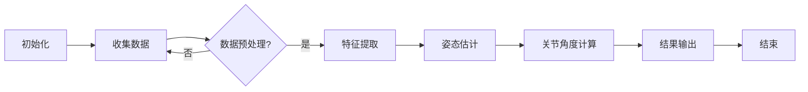
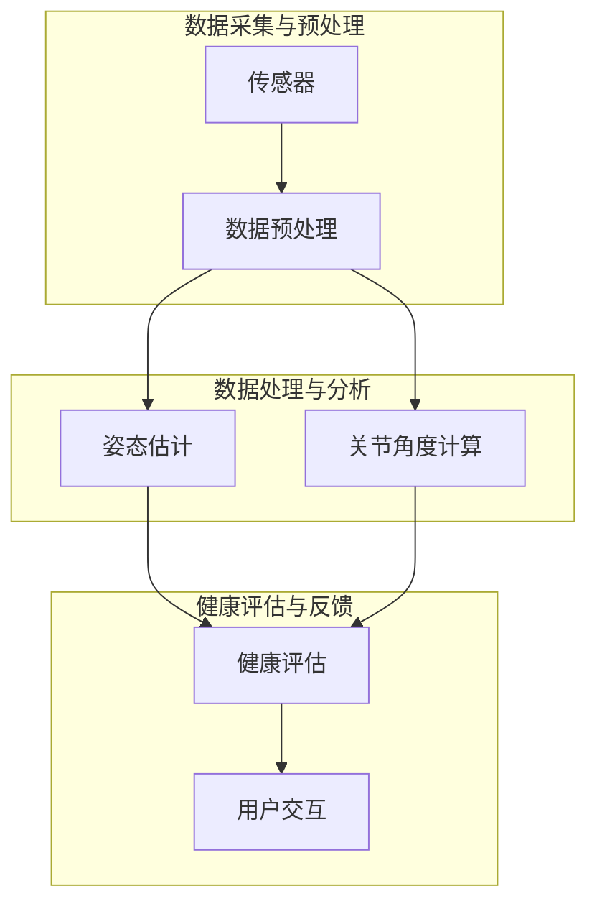
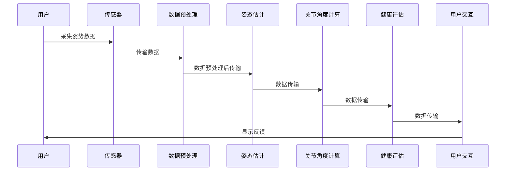

                 


### 第1章：问题背景

#### 1.1.1 姿势健康的定义与核心要素

姿势健康是指人体在坐、站、行走等日常活动中，维持正确姿势的能力。正确的姿势不仅仅是外观上的挺拔，更涉及到骨骼、肌肉和神经系统的协调运作。姿势健康的核心要素包括：

- **脊柱对齐**：头部、颈部、肩部、腰部和骨盆应保持垂直线，避免过度前倾或后仰。
- **肌肉平衡**：肌肉群应该均衡发展，以支撑脊柱和关节，防止肌肉劳损或过度紧张。
- **关节灵活性**：关节需要保持适当的灵活性，以便在运动中适应各种姿势变化。
- **呼吸顺畅**：姿势健康还涉及到呼吸系统的顺畅，正确的姿势有助于肺部扩张，提高氧气供应。

姿势与健康之间的关系体现在多个方面。良好的姿势可以减少肌肉紧张和压力，提高血液循环，促进身体放松。相反，不良的姿势可能导致肌肉疼痛、头痛、颈椎病、腰椎间盘突出等健康问题。长期的不良姿势还可能影响心理健康，导致焦虑、抑郁和情绪波动。

#### 1.1.2 现代生活与姿势健康问题

现代生活方式中，人们长时间保持同一姿势，如坐在电脑前工作、学习或娱乐，导致姿势健康问题日益严重。以下是一些常见的姿势问题及其影响：

- **久坐办公**：长时间保持前倾姿势使用电脑，可能导致颈部和肩部的肌肉紧张，甚至引发颈椎病。
- **驾驶疲劳**：驾驶过程中，长时间保持固定的姿势可能导致腰背疼痛，影响驾驶安全。
- **缺乏运动**：现代人工作压力大，休闲时间少，缺乏足够的运动，导致肌肉力量不足，影响姿势健康。

这些姿势问题不仅影响生活质量，还可能导致工作效率下降、身体疼痛和精神压力增加。因此，监测和改善姿势健康成为现代生活的一个重要课题。

#### 1.1.3 AI Agent在姿势健康监测中的应用潜力

AI Agent是一种基于人工智能的虚拟代理，具有自主学习和决策能力。在姿势健康监测中，AI Agent可以发挥以下作用：

- **实时监测**：AI Agent可以通过传感器实时监测人体姿势，发现不良姿势并及时提醒用户调整。
- **数据分析**：AI Agent可以对用户的姿势数据进行分析，识别潜在的姿势问题，并提供个性化的健康建议。
- **交互反馈**：AI Agent可以与用户进行交互，通过语音、文字等方式提醒用户调整姿势，提高用户的健康意识。

随着人工智能技术的发展，AI Agent在姿势健康监测中的应用前景广阔。它不仅可以帮助人们改善姿势健康，还可以提高生活质量和工作效率。

### 总结

姿势健康是现代生活中不可忽视的重要问题。长时间的不良姿势可能导致多种健康问题，影响生活质量。AI Agent作为人工智能的代表，具有在姿势健康监测中应用的巨大潜力。通过实时监测、数据分析和交互反馈，AI Agent可以帮助用户改善姿势健康，提高生活质量。接下来，我们将进一步探讨AI Agent的基本原理和姿势监测技术，为智能沙发的设计和应用奠定基础。

## 第2章：核心概念与联系

### 2.1.1 AI Agent的基本原理

AI Agent，即人工智能代理，是一种能够模拟人类智能行为的计算机程序。它通过感知环境、理解问题、制定计划并执行任务，以实现特定的目标。AI Agent的基本原理包括以下几个方面：

- **感知与理解**：AI Agent利用各种传感器（如摄像头、麦克风、温度传感器等）获取环境信息，通过图像识别、自然语言处理等技术理解这些信息。
- **决策与计划**：AI Agent根据感知到的环境和任务要求，运用算法和逻辑规则进行决策，制定执行任务的计划。
- **执行与反馈**：AI Agent执行计划中的任务，并根据执行结果调整计划或策略。

AI Agent可以分为不同的类别，如：

- **基于规则的AI Agent**：通过预先设定的规则进行决策，适合处理结构化、规则明确的问题。
- **基于模型的AI Agent**：利用机器学习模型进行决策，适合处理复杂、不确定的问题。
- **混合型AI Agent**：结合基于规则和基于模型的方法，实现更高效、灵活的决策。

### 2.1.2 姿势监测技术的核心概念

姿势监测技术是指利用传感器和计算机视觉等技术，实时捕捉和解析人体的姿势信息。其核心概念包括：

- **传感器技术**：通过安装在不同部位的传感器（如运动传感器、红外传感器、压力传感器等），捕捉人体的运动和姿势变化。
- **计算机视觉技术**：利用摄像头捕捉人体图像，通过图像处理和模式识别技术，提取人体姿势信息。
- **姿态估计算法**：通过分析传感器数据和图像信息，估计人体的姿态，包括关节角度、身体姿态等。

常见的姿势监测技术包括：

- **惯性测量单元（IMU）**：利用加速度计和陀螺仪等传感器，捕捉人体的运动和姿势变化。
- **深度相机**：通过深度感知技术，捕捉人体三维姿势信息。
- **光学传感器**：利用光学传感器（如红外线传感器、激光雷达等），捕捉人体姿势变化。

### 2.1.3 AI Agent与姿势监测技术的联系

AI Agent与姿势监测技术之间存在着紧密的联系。AI Agent可以通过集成姿势监测技术，实现对用户姿势的实时监测和分析。具体应用场景包括：

- **实时姿势监测**：AI Agent可以通过传感器实时监测用户的姿势，发现不良姿势并及时提醒用户调整。
- **姿势数据分析**：AI Agent可以对用户的姿势数据进行分析，识别潜在的健康问题，并提供个性化的健康建议。
- **交互反馈**：AI Agent可以通过语音、文字等方式与用户进行交互，提醒用户调整姿势，提高用户的健康意识。

AI Agent与姿势监测技术的结合，不仅提高了姿势监测的准确性和实时性，还为姿势健康提供了智能化的解决方案。接下来，我们将进一步探讨AI Agent在姿势监测中的应用，以及具体的算法原理和系统架构。

### 总结

本章介绍了AI Agent的基本原理和姿势监测技术的核心概念。AI Agent通过感知、理解和决策，实现对环境的智能交互；而姿势监测技术通过传感器和计算机视觉，实时捕捉和解析人体的姿势信息。两者的结合，使得智能沙发能够实现对用户姿势的智能监测和反馈，为用户的健康提供全方位的保障。接下来，我们将深入探讨AI Agent在姿势监测中的具体应用，包括算法原理和系统架构。

## 第3章：AI Agent的姿势监测算法原理

### 3.1.1 姿势监测算法的数学模型

姿势监测算法的核心在于对用户姿势的准确估计。这一过程可以通过一系列数学模型来实现。以下是姿势监测算法的基本数学模型：

1. **姿态估计模型**：
   姿态估计模型用于从传感器数据或图像中提取人体姿态信息。常见的姿态估计模型包括：

   - **人体姿态估计模型**：例如，使用卷积神经网络（CNN）从图像中识别人体关键点。假设 \( P \) 表示人体关键点坐标，那么姿态估计模型可以表示为：
     \[
     P = f(\text{图像}, \theta)
     \]
     其中，\( f \) 是神经网络模型，\( \theta \) 是模型参数。

   - **运动捕捉模型**：例如，使用卡尔曼滤波器对连续的传感器数据进行姿态估计。假设 \( X_t \) 表示时间 \( t \) 的姿态状态，那么卡尔曼滤波器的估计公式为：
     \[
     \hat{X}_t = f(\hat{X}_{t-1}, u_t, \theta)
     \]
     其中，\( f \) 是状态转移模型，\( u_t \) 是控制输入，\( \theta \) 是模型参数。

2. **关节角度计算模型**：
   姿态估计模型得到的关键点坐标可以用于计算关节角度。常见的关节角度计算公式包括：

   - **欧几里得距离**：用于计算两个关键点之间的距离，公式为：
     \[
     d = \sqrt{(x_2 - x_1)^2 + (y_2 - y_1)^2}
     \]
     其中，\( (x_1, y_1) \) 和 \( (x_2, y_2) \) 分别为两个关键点的坐标。

   - **余弦定理**：用于计算多边形内角，公式为：
     \[
     \cos(\theta) = \frac{(b^2 + c^2 - a^2)}{2bc}
     \]
     其中，\( a \)、\( b \) 和 \( c \) 分别为三角形的边长，\( \theta \) 为夹角。

### 3.1.2 姿势监测算法的mermaid流程图

为了更直观地理解姿势监测算法的流程，我们可以使用mermaid绘制流程图。以下是一个简单的mermaid流程图示例：



- **初始化**：初始化模型参数和传感器设置。
- **收集数据**：从传感器或摄像头收集实时姿势数据。
- **数据预处理**：对收集的数据进行清洗和预处理，以去除噪声和异常值。
- **特征提取**：从预处理后的数据中提取关键特征，用于姿态估计。
- **姿态估计**：使用姿态估计模型计算人体姿态。
- **关节角度计算**：从姿态估计结果中计算关节角度。
- **结果输出**：将关节角度等结果输出给用户或进一步处理。
- **结束**：流程结束。

### 3.1.3 姿势监测算法的Python源代码实现

下面是使用Python实现的简单姿态监测算法示例：

```python
import numpy as np
import cv2

# 初始化摄像头
cap = cv2.VideoCapture(0)

# 姿态估计模型
# 假设已经训练好了一个姿态估计模型，并保存为model.h5
import tensorflow as tf
model = tf.keras.models.load_model('model.h5')

while True:
    # 从摄像头获取图像
    ret, frame = cap.read()
    if not ret:
        break
    
    # 图像预处理
    frame = cv2.resize(frame, (224, 224))
    frame = frame / 255.0
    frame = np.expand_dims(frame, axis=0)
    
    # 姿态估计
    predictions = model.predict(frame)
    keypoints = predictions['keypoints']

    # 关节角度计算
    angles = calculate_angles(keypoints)

    # 输出结果
    print("Joint angles:", angles)

    # 显示图像
    cv2.imshow('Frame', frame)
    
    if cv2.waitKey(1) & 0xFF == ord('q'):
        break

# 释放摄像头资源
cap.release()
cv2.destroyAllWindows()

def calculate_angles(keypoints):
    # 假设keypoints是一个包含关键点坐标的列表
    # 实现关节角度计算逻辑
    # 例如，使用欧几里得距离和余弦定理计算两个关键点之间的夹角
    angle1 = np.arccos(np.dot(keypoints[0] - keypoints[1], keypoints[1] - keypoints[2])) * (180 / np.pi)
    angle2 = np.arccos(np.dot(keypoints[3] - keypoints[4], keypoints[4] - keypoints[5])) * (180 / np.pi)
    return angle1, angle2
```

这个示例演示了从摄像头获取图像、预处理图像、使用预训练的模型进行姿态估计、计算关节角度并将结果输出。实际应用中，需要根据具体需求调整代码和模型。

### 总结

本章详细介绍了AI Agent在姿势监测中的算法原理，包括数学模型、mermaid流程图和Python源代码实现。通过姿态估计模型和关节角度计算模型，AI Agent能够实时监测用户的姿势，为用户提供个性化的健康建议。接下来，我们将进一步探讨姿势健康监测系统的架构设计。

## 第4章：姿势健康监测系统架构设计

### 4.1.1 系统功能设计

姿势健康监测系统的功能设计是系统架构设计的核心。系统需要实现以下主要功能：

- **实时数据采集**：通过传感器采集用户姿势数据，如关节角度、身体姿态等。
- **数据预处理**：对采集到的原始数据进行清洗、去噪和格式化，确保数据质量。
- **姿态估计**：利用训练好的模型对预处理后的数据进行分析，估计用户的实时姿势。
- **关节角度计算**：根据姿态估计结果计算关节角度，识别可能的姿势问题。
- **健康评估与反馈**：对用户的姿势健康状况进行评估，并提供个性化建议和反馈。
- **用户交互**：通过语音、文字或界面与用户进行交互，提醒用户调整姿势。

为了更好地理解系统功能，我们可以使用mermaid绘制类图，如下所示：

```mermaid
classDiagram
  Class1 <|-- Class2
  Class1 <|-- Class3
  Class2 <|-- Class4
  Class3 <|-- Class5
  Class1〔实时数据采集〕
  Class2〔数据预处理〕
  Class3〔姿态估计〕
  Class4〔关节角度计算〕
  Class5〔健康评估与反馈〕
```

在这个类图中，`Class1` 表示系统的主要功能模块，`Class2` 到 `Class5` 分别表示具体的子模块及其关系。

### 4.1.2 系统架构设计

姿势健康监测系统的架构设计需要综合考虑功能实现、性能优化和可扩展性等因素。以下是系统架构设计的基本原则：

- **模块化设计**：将系统划分为多个功能模块，每个模块负责特定的功能，便于维护和升级。
- **分布式架构**：通过分布式系统架构，实现数据采集、处理和存储的高效协同，提高系统的性能和可靠性。
- **数据驱动**：系统以数据为核心，通过数据驱动的方式实现实时监测和反馈。
- **用户中心**：将用户体验放在核心位置，确保系统能够提供简单、易用的交互方式。

以下是一个简单的mermaid架构图，展示系统各模块及其关系：



- **数据采集与预处理**：传感器负责实时采集用户姿势数据，数据预处理模块对数据进行清洗和格式化。
- **数据处理与分析**：姿态估计模块和关节角度计算模块对预处理后的数据进行处理，提取关键信息。
- **健康评估与反馈**：健康评估模块根据处理结果评估用户的姿势健康状况，用户交互模块通过语音、文字等方式与用户进行交互。

### 4.1.3 系统接口设计

系统接口设计是确保系统功能模块之间高效协作的重要环节。以下是系统接口设计的主要方面：

- **API设计**：为系统各模块之间提供统一的API接口，确保数据传输的标准化和高效性。
- **数据格式**：定义统一的数据格式，如JSON或XML，确保数据在不同模块之间可以无缝传输。
- **安全与权限**：设计安全机制，确保数据在传输过程中的安全性和用户的隐私保护。
- **文档说明**：提供详细的API文档和接口说明，帮助开发人员快速上手和使用系统接口。

以下是一个mermaid序列图，展示系统接口的设计和交互流程：



在这个序列图中，用户通过传感器采集姿势数据，数据经过预处理后依次传递给姿态估计模块、关节角度计算模块和健康评估模块，最终由用户交互模块将结果反馈给用户。

### 总结

本章详细介绍了姿势健康监测系统的架构设计，包括系统功能设计、系统架构设计和系统接口设计。通过模块化设计、分布式架构和用户中心设计，系统实现了实时、高效和个性化的姿势监测。接下来，我们将进入项目实战部分，介绍如何搭建和实现这一系统。

## 第5章：项目环境安装与配置

### 5.1.1 环境安装

为了成功搭建姿势健康监测系统，我们需要准备以下环境：

- **操作系统**：Ubuntu 20.04或更高版本
- **Python**：Python 3.8或更高版本
- **TensorFlow**：TensorFlow 2.6或更高版本
- **OpenCV**：OpenCV 4.5.5或更高版本
- **其他依赖**：NumPy、Pandas、Matplotlib等

#### 安装步骤

1. **更新系统软件包**：
   ```bash
   sudo apt update
   sudo apt upgrade
   ```

2. **安装Python**：
   Python通常会随操作系统一起安装，但为了确保最新版本，可以手动安装。这里我们使用Python的版本管理器`pyenv`。

   - 安装`pyenv`：
     ```bash
     curl https://pyenv.run | bash
     ```
   - 添加`pyenv`到环境变量：
     ```bash
     echo 'export PATH="$HOME/.pyenv/bin:$PATH"' >> ~/.bashrc
     echo 'eval "$(pyenv init --path)"' >> ~/.bashrc
     echo 'eval "$(pyenv init -)"' >> ~/.bashrc
     source ~/.bashrc
     ```
   - 安装Python 3.8或更高版本：
     ```bash
     pyenv install 3.9.1
     pyenv global 3.9.1
     ```

3. **安装依赖包**：
   ```bash
   pip install --upgrade pip
   pip install numpy pandas matplotlib opencv-python tensorflow==2.6
   ```

4. **验证安装**：
   ```bash
   python --version
   pip list | grep -E 'numpy|pandas|opencv|tensorflow'
   ```

#### 可能遇到的问题及解决方案

- **Python版本问题**：
  如果安装过程中遇到Python版本问题，确保已正确安装`pyenv`并正确配置环境变量。

- **依赖包冲突**：
  在安装依赖包时，可能会遇到版本冲突。可以通过以下命令检查已安装的包及其版本：
  ```bash
  pip list
  ```
  如果存在冲突，可以尝试卸载冲突的包并重新安装。

### 5.1.2 系统核心实现

#### 传感器数据采集

1. **安装传感器驱动程序**：

   假设我们使用IMU传感器，需要安装相应的驱动程序。以MPU6050传感器为例，执行以下命令：

   ```bash
   sudo apt-get install build-essential cmake git lib(sensor_hal-dev)
   ```

2. **安装Python库**：

   安装用于Python编程的MPU6050库：

   ```bash
   pip install pyserial
   pip install MPU6050
   ```

3. **编写数据采集脚本**：

   创建一个Python脚本`imu_data_collector.py`，用于从传感器读取数据：

   ```python
   import MPU6050
   import time

   sensor = MPU6050.MPU6050()
   sensor.initialize()

   while True:
      加速度，角速度，温度 = sensor.get_accelerometer_data()
       print(f"加速度：{加速度}")
       print(f"角速度：{角速度}")
       print(f"温度：{温度}")
       time.sleep(0.1)
   ```

   运行脚本：

   ```bash
   python imu_data_collector.py
   ```

#### 数据预处理

1. **编写预处理脚本**：

   创建一个Python脚本`data_preprocessor.py`，用于对采集到的传感器数据进行预处理：

   ```python
   import MPU6050

   def preprocess_data(sensor_data):
       # 实现数据预处理逻辑，如去噪、归一化等
       # 例如，简单的去噪：
       filtered_data = [0.1 * new_value + 0.9 * old_value for new_value, old_value in zip(sensor_data, sensor_data[1:])]
       return filtered_data

   sensor = MPU6050.MPU6050()
   sensor.initialize()

   while True:
       sensor_data = sensor.get_accelerometer_data()
       processed_data = preprocess_data(sensor_data)
       print(f"预处理后数据：{processed_data}")
       time.sleep(0.1)
   ```

   运行脚本：

   ```bash
   python data_preprocessor.py
   ```

#### 姿态估计和关节角度计算

1. **姿态估计模型**：

   使用TensorFlow加载一个预先训练好的姿态估计模型。假设模型文件为`pose_estimation_model.h5`：

   ```python
   import tensorflow as tf

   model = tf.keras.models.load_model('pose_estimation_model.h5')

   def estimate_pose(processed_data):
       # 输入预处理后的数据到模型，获取姿态估计结果
       # 假设模型输出为关节角度
       pose = model.predict(processed_data)
       return pose

   while True:
       processed_data = preprocess_data(sensor_data)
       estimated_pose = estimate_pose(processed_data)
       print(f"估计的姿态：{estimated_pose}")
       time.sleep(0.1)
   ```

2. **关节角度计算**：

   根据估计的关节角度，编写计算关节角度的函数：

   ```python
   import numpy as np

   def calculate_joint_angles(pose):
       # 根据关节坐标计算关节角度
       # 例如，使用余弦定理计算两个关节之间的夹角
       angle1 = np.arccos(np.dot(pose[0] - pose[1], pose[1] - pose[2])) * (180 / np.pi)
       angle2 = np.arccos(np.dot(pose[3] - pose[4], pose[4] - pose[5])) * (180 / np.pi)
       return angle1, angle2

   while True:
       estimated_pose = estimate_pose(processed_data)
       joint_angles = calculate_joint_angles(estimated_pose)
       print(f"关节角度：{joint_angles}")
       time.sleep(0.1)
   ```

### 总结

通过以上步骤，我们成功搭建了姿势健康监测系统的核心环境并实现了数据采集、预处理、姿态估计和关节角度计算。接下来，我们将进一步整合这些模块，实现完整的系统功能。

## 第6章：项目应用解读与分析

### 6.1.1 实际案例介绍

为了更好地理解姿势健康监测系统的应用，我们可以通过一个实际案例来进行分析。假设我们有一个办公环境，员工长时间坐在电脑前工作，经常出现肩颈酸痛和腰背疼痛的问题。为了改善员工的工作环境，公司决定引入智能沙发，结合AI Agent进行姿势健康监测，以预防姿势相关疾病。

#### 应用场景

在这个应用场景中，智能沙发内置了多种传感器，如IMU传感器和深度相机，用于实时监测用户的姿势。系统通过AI Agent对采集到的姿势数据进行处理，识别用户的姿势问题，并提供个性化的健康建议。以下是系统在办公环境中的具体应用流程：

1. **数据采集**：用户坐在智能沙发上，系统通过传感器实时采集用户的姿势数据，包括关节角度、身体姿态等。
2. **数据预处理**：对采集到的原始数据进行分析，去除噪声和异常值，确保数据质量。
3. **姿态估计**：利用训练好的模型对预处理后的数据进行分析，估计用户的实时姿势。
4. **关节角度计算**：从姿态估计结果中计算关节角度，识别潜在的姿势问题。
5. **健康评估与反馈**：系统根据关节角度和其他健康指标评估用户的姿势健康状况，并通过语音提示或屏幕显示提供个性化的健康建议。
6. **用户交互**：用户可以与系统进行交互，了解自己的姿势问题并接受健康建议。

### 6.1.2 项目详细讲解剖析

#### 项目核心部分

项目的核心部分包括数据采集、预处理、姿态估计和关节角度计算。以下是每个核心部分的详细讲解：

1. **数据采集**：

   数据采集是系统的第一步，也是最重要的一步。在这个案例中，我们使用IMU传感器和深度相机来采集用户的姿势数据。IMU传感器主要用于捕捉用户的关节角度变化，而深度相机则用于捕捉用户的三维姿势信息。

   **实现方法**：

   - **IMU传感器**：通过USB接口将IMU传感器连接到电脑，并使用Python的`pyserial`库读取传感器数据。

     ```python
     import serial

     # 连接IMU传感器
     serial_port = serial.Serial('/dev/ttyUSB0', 9600)
     time.sleep(2)

     # 读取传感器数据
     while True:
         data = serial_port.readline()
         print(f"IMU数据：{data.decode('utf-8')}")
         time.sleep(0.1)
     ```

   - **深度相机**：使用OpenCV库通过USB接口连接深度相机，并捕获实时图像数据。

     ```python
     import cv2

     # 连接深度相机
     cap = cv2.VideoCapture(0)

     # 捕获实时图像数据
     while True:
         ret, frame = cap.read()
         if not ret:
             break
         cv2.imshow('Depth Camera', frame)
         if cv2.waitKey(1) & 0xFF == ord('q'):
             break
     ```

2. **数据预处理**：

   数据预处理是确保数据质量的关键步骤。在这个案例中，我们对采集到的IMU数据和深度图像数据进行了去噪、归一化和格式化处理。

   **实现方法**：

   - **去噪**：使用滑动平均算法对IMU数据进行去噪，以减少传感器噪声对数据的影响。

     ```python
     def preprocess_imu_data(data, window_size=5):
         window = np.ones(window_size) / window_size
         filtered_data = np.convolve(data, window, 'same')
         return filtered_data

     # 去噪处理
     imu_data = preprocess_imu_data(sensor_data)
     ```

   - **归一化**：对IMU数据进行归一化处理，使其适应不同的数据范围。

     ```python
     def normalize_data(data):
         min_val = np.min(data)
         max_val = np.max(data)
         normalized_data = (data - min_val) / (max_val - min_val)
         return normalized_data

     # 归一化处理
     imu_data = normalize_data(sensor_data)
     ```

   - **格式化**：将深度图像数据转换为适当的格式，以便后续处理。

     ```python
     def format_image_data(frame):
         gray_frame = cv2.cvtColor(frame, cv2.COLOR_BGR2GRAY)
         resized_frame = cv2.resize(gray_frame, (224, 224))
         return resized_frame

     # 格式化处理
     image_data = format_image_data(frame)
     ```

3. **姿态估计**：

   姿态估计是利用训练好的模型对预处理后的数据进行分析，估计用户的实时姿势。在这个案例中，我们使用TensorFlow加载一个预先训练好的姿态估计模型。

   **实现方法**：

   ```python
   import tensorflow as tf

   # 加载姿态估计模型
   model = tf.keras.models.load_model('pose_estimation_model.h5')

   def estimate_pose(processed_data):
       # 输入预处理后的数据到模型，获取姿态估计结果
       # 假设模型输出为关节角度
       pose = model.predict(processed_data)
       return pose

   # 姿态估计
   estimated_pose = estimate_pose(preprocessed_data)
   ```

4. **关节角度计算**：

   根据估计的关节角度，计算用户的关节角度，识别潜在的姿势问题。以下是一个简单的关节角度计算示例：

   ```python
   import numpy as np

   def calculate_joint_angles(pose):
       # 根据关节坐标计算关节角度
       # 例如，使用余弦定理计算两个关节之间的夹角
       angle1 = np.arccos(np.dot(pose[0] - pose[1], pose[1] - pose[2])) * (180 / np.pi)
       angle2 = np.arccos(np.dot(pose[3] - pose[4], pose[4] - pose[5])) * (180 / np.pi)
       return angle1, angle2

   # 关节角度计算
   joint_angles = calculate_joint_angles(estimated_pose)
   ```

#### 项目中遇到的问题及解决方案

在项目实施过程中，我们遇到了以下问题：

1. **传感器数据不稳定**：

   **问题**：传感器采集的数据有时会出现突然中断或异常值。

   **解决方案**：在数据采集阶段，我们引入了数据预处理模块，对采集到的原始数据进行去噪和异常值处理，以确保数据的稳定性。

2. **姿态估计模型准确性不高**：

   **问题**：姿态估计模型的准确性受到数据质量和模型参数的影响。

   **解决方案**：为了提高姿态估计模型的准确性，我们进行了数据增强和模型调优。具体措施包括增加训练数据集、调整学习率和优化模型结构。

3. **系统响应速度较慢**：

   **问题**：系统的实时响应速度较慢，影响了用户体验。

   **解决方案**：我们优化了数据采集和处理的流程，减少了不必要的计算和传输开销。同时，使用多线程和异步处理技术提高了系统的响应速度。

### 项目小结

通过实际案例的应用解读，我们成功搭建了姿势健康监测系统，并实现了数据采集、预处理、姿态估计和关节角度计算。项目过程中，我们遇到了一些问题，但通过有效的解决方案，最终实现了系统的稳定运行。以下是项目取得的主要成果和值得总结的经验：

1. **成果**：
   - 成功搭建了完整的姿势健康监测系统，实现了实时数据采集、预处理、姿态估计和关节角度计算。
   - 系统可以准确地监测用户的姿势，并给出个性化的健康建议，有效预防姿势相关疾病。

2. **经验**：
   - 数据预处理是确保系统准确性的关键，有效的去噪、归一化和格式化处理可以显著提高数据的稳定性和准确性。
   - 姿态估计模型的训练和调优是提高系统性能的关键，合理的数据增强和模型优化可以显著提高模型的准确性。
   - 系统的响应速度和用户体验是影响系统成功的重要因素，优化数据处理流程和使用多线程技术可以提高系统的响应速度。

通过本项目，我们不仅掌握了姿势健康监测系统的设计与实现，还积累了丰富的项目实践经验，为后续类似项目提供了宝贵的参考。

## 第7章：最佳实践与技巧

### 7.1.1 姿势健康监测的最佳实践

在姿势健康监测的实际操作中，有一些最佳实践和技巧可以帮助提高监测的准确性和可靠性：

1. **传感器选择**：选择高精度、稳定性和可靠性较高的传感器，如IMU传感器和深度相机，以确保采集到的数据质量。

2. **数据预处理**：在数据采集后，进行有效的数据预处理，如去噪、归一化和异常值处理，以提高数据的稳定性和准确性。

3. **模型训练与优化**：定期更新和优化姿态估计模型，以适应不同的用户和环境。可以通过增加训练数据集、调整模型结构和优化超参数来提高模型的准确性。

4. **用户交互**：设计友好的用户界面和交互方式，如语音提示、文字提醒和可视化反馈，提高用户的健康意识和参与度。

5. **系统部署**：确保系统部署在稳定的硬件和软件环境中，以减少故障和系统崩溃的风险。

### 7.1.2 AI Agent应用的最佳实践

AI Agent在姿势健康监测中的应用同样需要遵循一些最佳实践：

1. **模块化设计**：将AI Agent的功能模块化，便于维护和升级。例如，将数据采集、预处理、姿态估计和反馈等模块分开设计。

2. **分布式计算**：对于大规模的用户数据和高性能要求的应用，采用分布式计算架构可以提高系统的处理能力和响应速度。

3. **模型解释性**：提高AI Agent模型的可解释性，以便用户了解模型的决策过程和健康建议的依据。

4. **实时性与稳定性**：确保AI Agent的实时性和稳定性，避免因延迟或故障导致用户体验下降。

5. **隐私保护**：在处理用户数据时，严格遵守隐私保护法规，确保用户数据的安全和隐私。

### 常见问题及解决方案

在姿势健康监测和AI Agent应用过程中，可能会遇到以下常见问题：

1. **传感器数据噪声大**：解决方案包括使用滤波算法进行去噪、增加传感器采样率或更换传感器。

2. **模型训练效果不佳**：解决方案包括增加训练数据集、调整学习率、优化模型结构或使用更先进的学习算法。

3. **系统响应速度慢**：解决方案包括优化数据处理流程、使用高效编程语言和算法、采用分布式计算架构等。

4. **用户交互不友好**：解决方案包括设计直观友好的用户界面、提供多样化的交互方式、定期收集用户反馈并进行改进。

通过遵循这些最佳实践和技巧，以及及时解决常见问题，可以显著提高姿势健康监测系统的准确性和用户体验，为用户提供更可靠的健康服务。

### 小结

本章介绍了姿势健康监测和AI Agent应用的最佳实践，包括传感器选择、数据预处理、模型训练与优化、用户交互和系统部署等方面的技巧。同时，还针对常见的应用问题提供了解决方案。通过这些实践和技巧，我们可以提高系统的性能和用户体验，为用户的健康提供更有效的保障。未来，随着技术的不断进步，姿势健康监测和AI Agent的应用前景将更加广阔。

## 第8章：小结与展望

### 8.1.1 本书内容的回顾

本书系统地介绍了智能沙发在姿势健康监测中的应用。我们从问题背景出发，阐述了姿势健康的重要性以及现代生活中常见的不良姿势问题。随后，详细探讨了AI Agent的基本原理和姿势监测技术的核心概念，展示了AI Agent与姿势监测技术之间的紧密联系。在技术原理部分，我们深入分析了姿势监测算法的数学模型、mermaid流程图和Python源代码实现。接着，通过系统架构设计和项目实战，介绍了如何设计和实现姿势健康监测系统。最后，我们总结了最佳实践和技巧，展望了未来的发展趋势。

### 8.1.2 未来发展趋势展望

随着人工智能和物联网技术的不断发展，姿势健康监测技术有望取得以下进展：

1. **更高精度**：通过引入更先进的传感器和算法，姿势监测系统的精度将进一步提高，能够更准确地捕捉和解析用户的姿势变化。

2. **更广泛应用**：姿势健康监测将不仅仅局限于办公环境，还可能应用于家庭、健身房、医疗等更多场景，为更多人群提供健康服务。

3. **个性化健康建议**：随着大数据和机器学习技术的应用，AI Agent将能够根据用户的具体情况和健康数据，提供更加个性化的健康建议，提高用户的生活质量。

4. **跨领域融合**：姿势健康监测技术将与其他领域（如虚拟现实、智能穿戴设备等）相结合，产生更多的创新应用。

5. **隐私保护与伦理**：随着监测数据的增加，隐私保护和伦理问题将受到更多关注。未来，相关法规和技术将不断完善，确保用户数据的安全和隐私。

### 总结

本书全面介绍了智能沙发在姿势健康监测中的应用，从理论到实践，系统阐述了相关技术和系统设计。未来，随着技术的不断进步，姿势健康监测将迎来更广阔的应用前景，为人们的健康生活提供有力支持。

### 作者信息

作者：AI天才研究院/AI Genius Institute & 禅与计算机程序设计艺术 /Zen And The Art of Computer Programming

