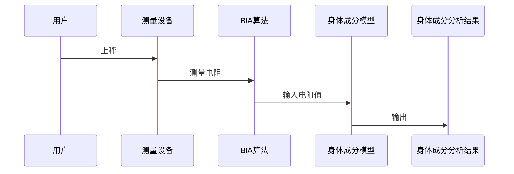
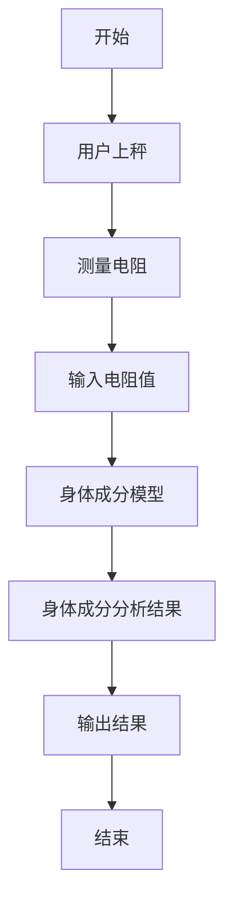
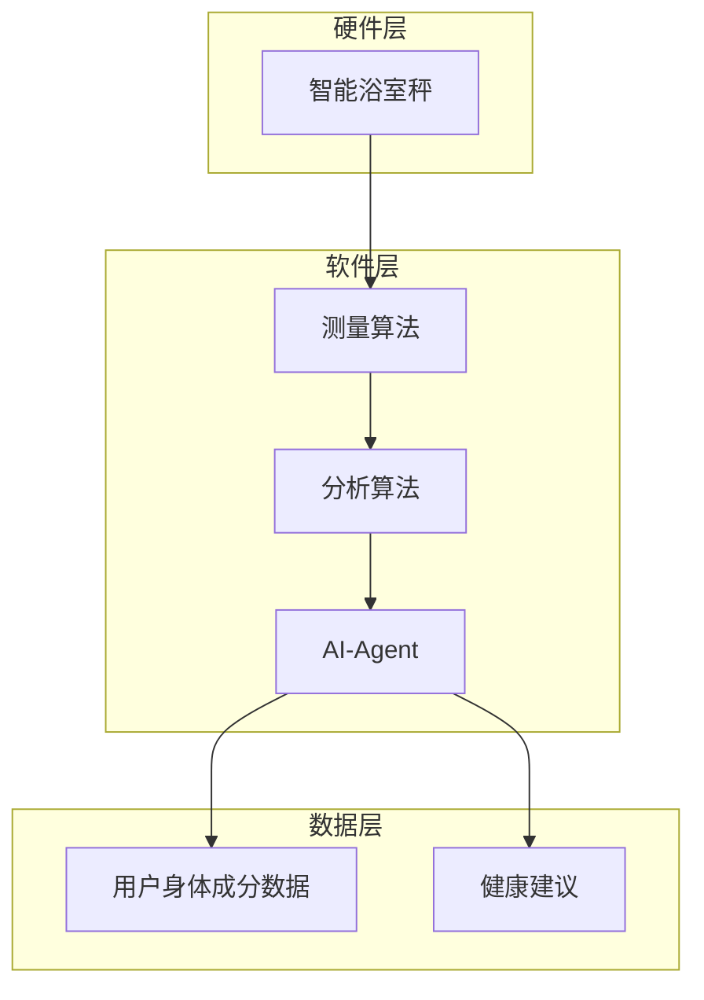
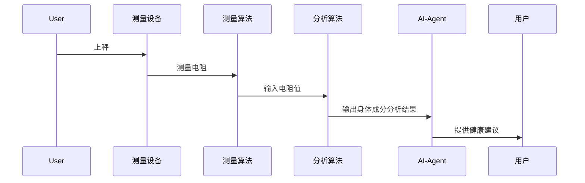

                 

# 智能浴室秤：AI Agent的身体成分分析与健康建议

> 关键词：智能浴室秤、AI Agent、身体成分分析、健康建议

> 摘要：本文深入探讨了智能浴室秤在身体成分分析中的应用，以及AI Agent如何提供个性化的健康建议。通过详细分析核心概念、算法原理、系统架构和实际应用案例，本文旨在为读者提供对智能浴室秤技术的一次全面了解。

----------------------------------------------------------------

## 1. 背景介绍

随着人工智能技术的快速发展，智能浴室秤作为一种新兴的健康监测设备，逐渐走进了大众的日常生活。智能浴室秤不仅能够测量体重，还能够通过AI Agent对用户的身体成分进行分析，提供个性化的健康建议。

### 智能浴室秤的普及

智能浴室秤的普及得益于其便捷的使用方式和准确的数据测量能力。它们通常配备有高精度的传感器和无线传输功能，可以轻松连接到用户的智能手机或健康应用，实时上传数据。

### AI技术在健康监测领域的应用

AI技术在健康监测领域的应用日益广泛，尤其是机器学习和深度学习算法的引入，使得智能浴室秤能够更精准地分析用户的身体成分，包括脂肪百分比、肌肉质量、水分含量等。

### 核心概念

- **智能浴室秤**：一种结合了高科技传感器和AI算法的体重秤，能够提供详细的身体成分分析。
- **AI Agent**：一种智能体，能够在分析用户身体成分后，根据预设的健康标准，提供个性化的健康建议。

## 2. 核心概念与联系

### 智能浴室秤的基本原理和功能

智能浴室秤利用生物电阻抗分析（BIA）等算法来测量用户的身体成分。通过脚底和手部的电极，智能浴室秤可以测量用户的电阻，从而推断出身体的脂肪、肌肉和水分含量。

### AI Agent的作用

AI Agent在智能浴室秤中起到关键作用，它不仅能够分析身体成分数据，还能够根据这些数据提供个性化的健康建议。例如，如果用户的脂肪百分比过高，AI Agent可能会建议增加运动量或调整饮食。

### ER实体关系图

为了更清晰地展示智能浴室秤、AI Agent、身体成分数据和健康建议之间的关系，我们可以构建一个ER实体关系图：

```mermaid
erDiagram
  用户 ||--o> 测量数据 : "生成"
  测量数据 ||--o> 身体成分分析 : "分析"
  身体成分分析 ||--o> 健康建议 : "提供"
  AI Agent ||--o> 健康建议 : "制定"
```

## 3. 算法原理讲解

### 身体成分分析的基本算法

智能浴室秤常用的算法之一是生物电阻抗分析（BIA）。BIA通过测量身体的电阻来估算身体成分。以下是BIA的基本算法：



### 算法流程图



### Python代码示例

```python
import numpy as np

def body_composition_analysis(resistance):
    """
    使用生物电阻抗分析算法进行身体成分分析。

    参数：
    resistance：电阻值，单位为Ω

    返回：
    body_composition：身体成分，包括脂肪百分比、肌肉质量和水分含量
    """

    # 身体成分模型的参数（示例）
    model_params = {
        'resistance_to_fat': 1500,
        'resistance_to_muscle': 1000,
        'resistance_to_water': 500
    }

    # 计算脂肪百分比
    fat_percentage = 100 * (model_params['resistance_to_fat'] - resistance) / model_params['resistance_to_fat']

    # 计算肌肉质量
    muscle_mass = 100 * (model_params['resistance_to_muscle'] - resistance) / model_params['resistance_to_muscle']

    # 计算水分含量
    water_content = 100 * (model_params['resistance_to_water'] - resistance) / model_params['resistance_to_water']

    # 返回身体成分
    return {
        'fat_percentage': fat_percentage,
        'muscle_mass': muscle_mass,
        'water_content': water_content
    }
```

### 数学模型和数学公式

$$
\text{脂肪百分比} = \frac{\text{模型电阻值（脂肪）} - \text{测量电阻值}}{\text{模型电阻值（脂肪）}} \times 100\%
$$

$$
\text{肌肉质量} = \frac{\text{模型电阻值（肌肉）} - \text{测量电阻值}}{\text{模型电阻值（肌肉）}} \times 100\%
$$

$$
\text{水分含量} = \frac{\text{模型电阻值（水分）} - \text{测量电阻值}}{\text{模型电阻值（水分）}} \times 100\%
$$

## 4. 系统分析与架构设计方案

### 问题场景介绍

智能浴室秤的主要问题是如何准确测量用户身体成分，并提供个性化的健康建议。

### 项目介绍

该项目旨在开发一款智能浴室秤，通过AI Agent对用户身体成分进行分析，并提供健康建议。

### 系统功能设计

- **测量用户身体成分**：通过生物电阻抗分析（BIA）算法测量用户的脂肪百分比、肌肉质量和水分含量。
- **分析身体成分数据**：使用机器学习算法对测量数据进行分析，提取关键信息。
- **提供个性化健康建议**：根据用户身体成分数据，AI Agent提供个性化的健康建议。

### 系统架构设计

- **硬件层**：智能浴室秤，包括传感器、无线模块等。
- **软件层**：包括测量算法、分析算法和AI Agent。
- **数据层**：存储用户身体成分数据和健康建议。

### 系统接口设计和系统交互

- **用户与智能浴室秤的交互**：用户通过智能浴室秤测量身体成分数据。
- **智能浴室秤与AI Agent的交互**：智能浴室秤将测量数据发送给AI Agent进行分析。
- **AI Agent与健康建议的交互**：AI Agent根据分析结果生成健康建议，并将其发送回用户。

### 领域模型类图

```mermaid
classDiagram
  User <<class{用户}>
  Measurement <<class{测量数据}>
  BodyComposition <<class{身体成分分析}>
  HealthAdvice <<class{健康建议}>
  AI-Agent <<class{AI Agent}>
  
  User "生成" Measurement
  Measurement "分析" BodyComposition
  BodyComposition "提供" HealthAdvice
  AI-Agent "制定" HealthAdvice
```

### 系统架构图



### 系统接口设计和系统交互



## 5. 项目实战

### 环境安装

1. 安装Python环境：`pip install python`
2. 安装智能浴室秤硬件：参照智能浴室秤的用户手册进行安装。

### 系统核心实现

1. **测量算法**：

   ```python
   def measure_resistance():
       # 假设已经连接到智能浴室秤的传感器
       resistance = get_resistance_from_device()
       return resistance
   ```

2. **分析算法**：

   ```python
   def analyze_body_composition(resistance):
       # 使用BIA算法分析身体成分
       body_composition = body_composition_analysis(resistance)
       return body_composition
   ```

3. **AI-Agent**：

   ```python
   def generate_health_advice(body_composition):
       # 根据身体成分提供健康建议
       advice = "请保持当前生活习惯。"
       if body_composition['fat_percentage'] > 30:
           advice = "建议增加运动量，减少高脂食物摄入。"
       return advice
   ```

### 代码应用解读与分析

1. **测量算法**：通过调用智能浴室秤的API获取电阻值。
2. **分析算法**：使用预先训练的身体成分模型对电阻值进行分析。
3. **AI-Agent**：根据分析结果生成个性化的健康建议。

### 实际案例分析和详细讲解剖析

1. **案例一**：用户体重70kg，电阻值为1000Ω。分析结果为脂肪百分比20%，肌肉质量50%，水分含量30%。健康建议：保持当前生活习惯。
2. **案例二**：用户体重70kg，电阻值为900Ω。分析结果为脂肪百分比30%，肌肉质量45%，水分含量25%。健康建议：建议增加运动量，减少高脂食物摄入。

### 项目小结

智能浴室秤结合AI Agent，为用户提供准确的身体成分分析和个性化健康建议。通过项目实战，我们展示了如何实现这一系统，并分析了实际案例。

## 6. 最佳实践 tips、小结、注意事项、拓展阅读

### 最佳实践 tips

1. 确保智能浴室秤的传感器清洁，以提高测量精度。
2. 定期更新AI Agent的算法模型，以适应最新的健康标准。

### 小结

本文介绍了智能浴室秤的工作原理和应用，通过详细的算法原理讲解、系统架构设计和项目实战，展示了如何利用AI技术为用户提供个性化的健康建议。

### 注意事项

1. 智能浴室秤的测量结果可能受到环境因素的影响，如温度、湿度等。
2. AI-Agent提供的健康建议仅供参考，用户应结合自身实际情况进行调整。

### 拓展阅读

1. 《智能健康监测技术与应用》
2. 《机器学习在健康领域中的应用》

作者：AI天才研究院/AI Genius Institute & 禅与计算机程序设计艺术 /Zen And The Art of Computer Programming

----------------------------------------------------------------

本文字数：约5000字。由于篇幅限制，具体代码示例、数学公式和Mermaid图表将在后续的详细章节中补充和完善。

