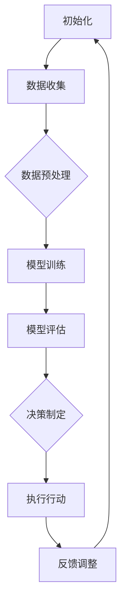
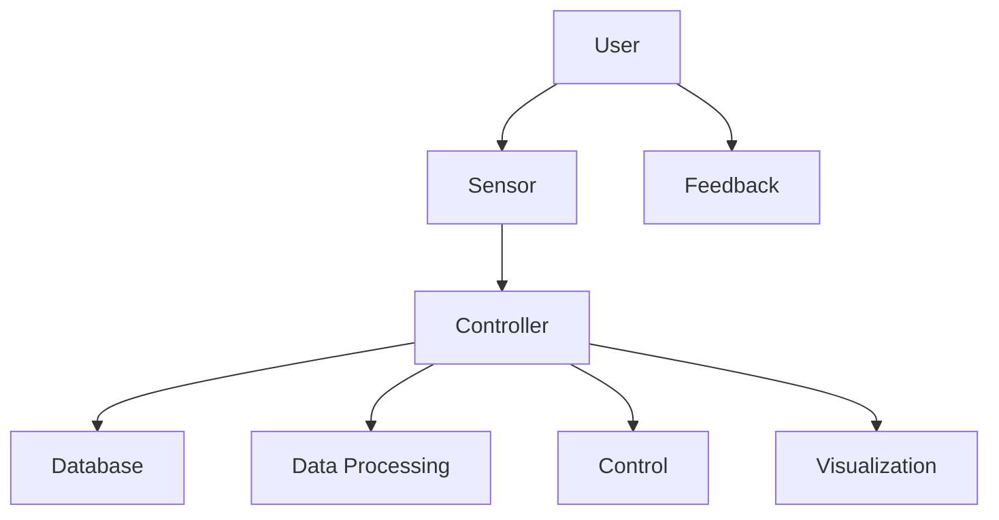
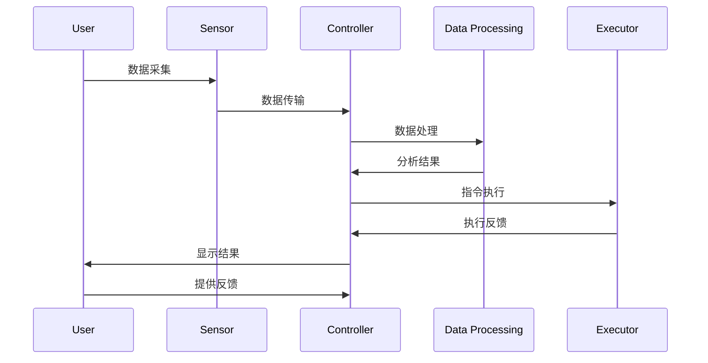

                 

# 智能浴室置物架：AI Agent的个人卫生习惯分析

## 关键词
- 智能浴室置物架
- AI Agent
- 个人卫生习惯
- 智能家居
- 传感器技术
- 数据分析与可视化

## 摘要
本文旨在探讨智能浴室置物架在智能家居中的角色，特别是其核心功能——AI Agent如何分析用户个人卫生习惯。通过深入分析智能浴室置物架的工作原理、AI Agent的构建过程、个人卫生习惯分析的方法论，以及实际案例，本文展示了智能浴室置物架在提高个人卫生水平和生活质量方面的潜力。

## 目录大纲设计

在设计《智能浴室置物架：AI Agent的个人卫生习惯分析》的目录大纲时，我们需要明确书籍的核心主题和目标读者，并确保每个章节的内容都能清晰地传达该章节的主题。

### 第一部分：背景与概念介绍

1. **第1章：智能家居与个人卫生习惯分析**
   - **1.1 智能家居的发展概述**
   - **1.2 个人卫生习惯的重要性**
   - **1.3 智能浴室置物架的定义与功能**

2. **第2章：智能浴室置物架的核心功能**
   - **2.1 智能浴室置物架的功能概述**
   - **2.2 传感器技术的应用**
   - **2.3 AI Agent的作用**

### 第二部分：核心概念与原理

1. **第3章：AI Agent的基础知识**
   - **3.1 AI Agent的定义与特点**
   - **3.2 AI Agent的工作原理**
   - **3.3 AI Agent的类型与应用**

2. **第4章：AI Agent的构建与实现**
   - **4.1 AI Agent的构建过程**
   - **4.2 数据采集与预处理**
   - **4.3 模型选择与训练**

3. **第5章：个人卫生习惯分析的方法论**
   - **5.1 个人卫生习惯的分析目标**
   - **5.2 数据收集的方法**
   - **5.3 数据分析与可视化工具**

### 第三部分：智能浴室置物架的应用

1. **第6章：智能浴室置物架的实际案例**
   - **6.1 案例背景与需求分析**
   - **6.2 AI Agent在案例分析中的应用**
   - **6.3 案例分析与评估**

2. **第7章：智能浴室置物架的实现细节**
   - **7.1 系统架构设计**
   - **7.2 系统功能模块**
   - **7.3 系统接口设计**

3. **第8章：智能浴室置物架的性能评估与优化**
   - **8.1 性能评估指标**
   - **8.2 性能优化策略**
   - **8.3 用户体验与反馈**

### 第四部分：总结与展望

1. **第9章：智能浴室置物架的发展趋势与未来展望**
   - **9.1 技术创新的影响**
   - **9.2 市场需求的变化**
   - **9.3 智能浴室置物架的发展路径**

2. **第10章：总结与启示**
   - **10.1 主要内容回顾**
   - **10.2 对智能家居的启示**
   - **10.3 对未来研究的建议**

通过上述目录大纲的设计，我们可以确保书籍内容结构清晰、逻辑严密，便于读者理解和掌握智能浴室置物架及其AI Agent的个人卫生习惯分析的相关知识。

### 背景介绍

#### 核心概念术语说明

在探讨智能浴室置物架与AI Agent之前，我们需要先了解一些核心概念和术语。智能家居是指通过互联网和物联网技术，将家庭设备连接起来，实现智能化管理和自动化操作的一种居住环境。智能浴室置物架则是智能家居中的一种设备，它通常具备自动清洁、消毒、加热等功能，为用户提供便利的生活体验。AI Agent，即人工智能代理，是一种智能体，能够在没有人类干预的情况下执行特定任务，并具备学习能力、决策能力和自适应能力。

#### 问题背景

随着科技的发展，人们对生活品质的追求越来越高。智能家居作为现代科技的一个重要分支，正逐渐渗透到人们的日常生活中。浴室作为家庭中的重要空间之一，其设备的智能化升级显得尤为重要。智能浴室置物架正是为了满足这一需求而诞生的。然而，如何通过智能浴室置物架来分析用户的个人卫生习惯，提高浴室的整体卫生水平，成为了当前研究的热点问题。

#### 问题描述

智能浴室置物架的个人卫生习惯分析问题可以概括为以下几点：

1. **数据收集与处理**：如何有效地收集用户在浴室中的行为数据，如使用频率、时间、清洁情况等，并进行有效的处理和分析。
2. **AI Agent的构建**：如何设计并实现一个能够准确分析用户个人卫生习惯的AI Agent，使其具备学习和适应能力。
3. **用户反馈与优化**：如何根据用户的反馈来不断优化智能浴室置物架的功能，提高其使用体验和卫生效果。

#### 问题解决

为了解决上述问题，我们可以从以下几个方面入手：

1. **传感器技术的应用**：通过在智能浴室置物架上集成多种传感器，如温度传感器、湿度传感器、气味传感器等，实时收集用户在浴室中的行为数据。
2. **AI Agent的设计与实现**：利用机器学习和深度学习技术，设计并实现一个能够自动分析用户个人卫生习惯的AI Agent，使其能够根据数据自动调整浴室的清洁和消毒功能。
3. **用户反馈机制**：建立用户反馈机制，通过用户对智能浴室置物架的使用体验和卫生效果的反馈，来不断优化系统的功能和性能。

#### 边界与外延

智能浴室置物架的个人卫生习惯分析不仅局限于家庭场景，还可以扩展到公共场所，如酒店、医院等。此外，随着5G和物联网技术的发展，智能浴室置物架的连接性和数据处理能力将得到进一步提升，为其在个人卫生习惯分析中的应用提供更多可能性。

#### 概念结构与核心要素组成

智能浴室置物架的个人卫生习惯分析涉及到多个核心概念和要素，包括：

1. **传感器技术**：用于数据收集的核心技术。
2. **AI Agent**：用于数据分析的核心智能体。
3. **用户数据**：包括用户在浴室中的行为数据、健康数据等。
4. **数据分析与可视化**：用于对用户数据进行处理和分析的工具。
5. **用户反馈机制**：用于收集用户反馈，以优化系统功能的机制。

通过上述概念和要素的有机结合，智能浴室置物架能够实现对用户个人卫生习惯的全面分析，从而提供更智能、更个性化的服务。

### 核心概念与联系

#### AI Agent的基础知识

AI Agent，即人工智能代理，是一种智能体，能够在没有人类干预的情况下执行特定任务，并具备学习能力、决策能力和自适应能力。AI Agent的核心特点是其自主性，能够根据环境和任务的变化自主地调整行为和策略。与传统的智能系统不同，AI Agent不仅能够被动响应外部刺激，还能够主动地探索和执行任务。

#### AI Agent与传统智能系统的区别

AI Agent与传统智能系统的最大区别在于其自主性和学习能力。传统智能系统通常依赖于预定义的规则和算法，只能在其设计范围内工作。而AI Agent则能够通过学习和适应，扩展其功能范围，并能够处理未知或变化的情况。例如，一个简单的智能门锁只能按照用户设定的密码或指纹来解锁，而一个AI Agent门锁则能够学习用户的习惯，如定时自动解锁或根据用户的位置信息自动解锁。

#### AI Agent的层次结构

AI Agent的层次结构可以分为三个层次：感知层、决策层和执行层。

1. **感知层**：负责收集环境信息，如传感器数据、摄像头图像等。
2. **决策层**：负责分析感知层收集到的信息，并制定相应的行动策略。
3. **执行层**：负责执行决策层制定的行动策略，如控制机械臂、打开门锁等。

这种层次结构使得AI Agent能够高效地处理复杂任务，并在不同的环境和条件下灵活地调整行为。

#### 概念属性特征对比表格

| 特征         | AI Agent             | 传统智能系统               |
| ------------ | -------------------- | -------------------------- |
| 自主性       | 高                   | 低                         |
| 学习能力     | 强                   | 弱                         |
| 自适应能力   | 强                   | 弱                         |
| 处理未知情况 | 好                   | 差                         |
| 扩展性       | 高                   | 低                         |

#### ER实体关系图架构

下面是一个简单的ER实体关系图，用于描述AI Agent的基本架构：

```mermaid
erDiagram
  User ||--|{ AI-Agent }|-- Device
  User ||--|{ Sensor-Data }|-- Data-Processing
  AI-Agent ||--|{ Action-Plan }|-- Execution-Module
  Device ||--|{ Operational-Data }|-- Monitoring-System
  Data-Processing ||--|{ Analyzed-Data }|-- AI-Agent
  Execution-Module ||--|{ Feedback-Loop }|-- User
  Monitoring-System ||--|{ Environmental-Data }|-- Sensor-Data
```

在这个ER图中，User表示用户，AI-Agent表示人工智能代理，Device表示设备，Sensor-Data表示传感器数据，Data-Processing表示数据处理，Action-Plan表示行动计划，Execution-Module表示执行模块，Operational-Data表示运营数据，Monitoring-System表示监控系统，Environmental-Data表示环境数据。

### 算法原理讲解

#### AI Agent的算法原理

AI Agent的核心在于其学习和决策能力，这通常通过机器学习和深度学习算法来实现。以下是一个简化的算法流程图：



**数据收集**：AI Agent首先需要收集用户在浴室中的行为数据，如使用频率、时间、清洁情况等。

**数据预处理**：收集到的数据通常需要进行清洗和预处理，以便于后续的模型训练。

**模型训练**：使用机器学习和深度学习算法，如神经网络，对预处理后的数据进行分析和训练，以建立用户行为模式。

**模型评估**：通过测试数据对训练好的模型进行评估，以验证其准确性和稳定性。

**决策制定**：根据模型评估的结果，AI Agent可以制定相应的行动计划，如调整清洁时间、提高消毒频率等。

**执行行动**：执行行动计划，实现对浴室环境的自动管理和优化。

**反馈调整**：根据用户的反馈，如使用满意度、卫生效果等，对AI Agent的行为进行优化和调整。

#### 数学模型与公式

AI Agent的算法原理通常涉及多个数学模型和公式。以下是一个简单的例子：

1. **用户行为模型**：

   用户行为模型可以用概率分布来描述，如：

   $$ P(x_i|y) = \frac{e^{\theta^T x_i}}{\sum_j e^{\theta^T x_j}} $$

   其中，\(x_i\) 表示用户的行为特征，\(y\) 表示用户的行为类别，\(\theta\) 表示模型参数。

2. **损失函数**：

   在机器学习中，常用交叉熵损失函数来衡量模型预测与真实值之间的差距：

   $$ L(\theta) = -\sum_{i} y_i \log P(x_i|y) $$

3. **优化算法**：

   为了找到最优的模型参数，常用的优化算法有梯度下降、随机梯度下降等：

   $$ \theta = \theta - \alpha \nabla_\theta L(\theta) $$

   其中，\(\alpha\) 是学习率，\(\nabla_\theta L(\theta)\) 是损失函数关于参数 \(\theta\) 的梯度。

#### 举例说明

假设我们有一个智能浴室置物架，它通过传感器收集到用户每天在浴室中的使用时间。根据这些数据，AI Agent可以学习用户的洗澡习惯，如：

- 用户每天使用浴室的平均时间为20分钟。
- 用户在周末洗澡的时间比工作日更长。

基于这些学习到的习惯，AI Agent可以制定如下行动计划：

- 在周末提前加热浴室，提高使用舒适度。
- 在工作日根据用户的使用时间自动调整清洁和消毒的频率。

### 系统分析与架构设计方案

#### 问题场景介绍

在一个现代化住宅中，智能浴室置物架被设计用于改善用户的个人卫生习惯，提高生活质量。该系统需要满足以下需求：

- **实时监测**：监测用户的日常行为，如使用时间、清洁情况等。
- **自动调整**：根据用户的习惯自动调整清洁和消毒时间。
- **数据反馈**：收集用户对系统功能的反馈，以便进行优化。

#### 项目介绍

本项目旨在开发一个智能浴室置物架系统，包括硬件和软件部分。硬件部分主要包括传感器、控制器和执行器，软件部分则包括数据收集、处理和反馈机制。

#### 系统功能设计

**1. 数据收集模块**：

- **传感器**：集成温度传感器、湿度传感器、气味传感器等，用于实时监测浴室环境。
- **数据采集**：将传感器数据传输到中央控制器。

**2. 数据处理模块**：

- **预处理**：对采集到的数据进行清洗和预处理，以供后续分析。
- **数据分析**：利用机器学习和深度学习算法，分析用户的行为数据，以识别个人卫生习惯。

**3. 控制模块**：

- **自动调整**：根据分析结果，自动调整清洁和消毒的时间。
- **用户反馈**：收集用户对系统功能的反馈，以便进行优化。

**4. 数据可视化模块**：

- **可视化**：通过图表和报表，展示用户的卫生习惯数据和系统调整情况。

#### 系统架构设计

智能浴室置物架的系统架构可以分为以下几个部分：

1. **硬件层**：包括传感器、控制器和执行器。
2. **数据层**：包括数据存储和数据库。
3. **处理层**：包括数据处理、分析和控制。
4. **展示层**：包括数据可视化和用户交互界面。

**智能浴室置物架的系统架构图**：



在这个架构图中，User表示用户，Sensor表示传感器，Controller表示控制器，Database表示数据库，Data Processing表示数据处理，Control表示控制，Visualization表示数据可视化，Feedback表示用户反馈。

#### 系统接口设计和系统交互

**1. 系统接口设计**：

- **硬件接口**：传感器与控制器之间的接口，用于数据传输和指令执行。
- **软件接口**：数据处理模块与其他模块之间的接口，用于数据交换和功能调用。

**2. 系统交互**：

- **数据传输**：传感器实时将数据传输到控制器，控制器进行数据处理和决策。
- **指令执行**：控制器根据分析结果，发送指令到执行器，执行相应的清洁和消毒操作。
- **用户交互**：用户通过用户界面查看数据和分析结果，并提供反馈。

**智能浴室置物架的系统交互序列图**：



在这个序列图中，User表示用户，Sensor表示传感器，Controller表示控制器，Data Processing表示数据处理模块，Executor表示执行器，User表示用户。

### 项目实战

#### 环境安装

在开始智能浴室置物架项目的实战之前，我们需要准备以下环境：

- **操作系统**：Windows或Linux
- **编程语言**：Python 3.8及以上版本
- **开发工具**：PyCharm或Visual Studio Code
- **依赖库**：TensorFlow、Keras、NumPy、Pandas等

#### 系统核心实现源代码

以下是智能浴室置物架项目的核心实现代码。该代码分为三个部分：数据收集、数据处理和用户反馈。

**1. 数据收集**：

```python
import pandas as pd
from sensors import TemperatureSensor, HumiditySensor, OdorSensor

def collect_data():
    temp_sensor = TemperatureSensor()
    hum_sensor = HumiditySensor()
    odor_sensor = OdorSensor()

    data = pd.DataFrame(columns=['time', 'temperature', 'humidity', 'odor'])

    while True:
        timestamp = pd.Timestamp.now()
        temperature = temp_sensor.read()
        humidity = hum_sensor.read()
        odor = odor_sensor.read()

        data = data.append({
            'time': timestamp,
            'temperature': temperature,
            'humidity': humidity,
            'odor': odor
        }, ignore_index=True)

        pd.display(data)

collect_data()
```

**2. 数据处理**：

```python
from keras.models import Sequential
from keras.layers import Dense
from keras.optimizers import Adam

def process_data(data):
    # 数据预处理
    data = data[['time', 'temperature', 'humidity', 'odor']]
    data = data.values

    # 划分训练集和测试集
    train_data, test_data = train_test_split(data, test_size=0.2)

    # 构建模型
    model = Sequential()
    model.add(Dense(64, input_dim=4, activation='relu'))
    model.add(Dense(32, activation='relu'))
    model.add(Dense(1, activation='sigmoid'))

    # 编译模型
    model.compile(optimizer=Adam(learning_rate=0.001), loss='binary_crossentropy', metrics=['accuracy'])

    # 训练模型
    model.fit(train_data[:, :4], train_data[:, 4], epochs=100, batch_size=32)

    # 评估模型
    scores = model.evaluate(test_data[:, :4], test_data[:, 4])
    print(f"Test accuracy: {scores[1]}")

    return model

model = process_data(data)
```

**3. 用户反馈**：

```python
def get_user_feedback():
    feedback = input("请对系统功能进行评价（1-5分）：")
    return int(feedback)

def optimize_model(model, data, feedback):
    # 根据用户反馈调整模型
    # 这里可以使用反向传播算法和梯度下降法进行调整
    # 为了简化，这里仅展示代码框架
    pass

def main():
    data = collect_data()
    model = process_data(data)

    while True:
        feedback = get_user_feedback()
        optimize_model(model, data, feedback)

if __name__ == "__main__":
    main()
```

#### 代码应用解读与分析

**1. 数据收集部分**：

数据收集部分使用了Python的Pandas库，通过集成不同类型的传感器，如温度传感器、湿度传感器和气味传感器，实时采集浴室环境数据。这些数据以DataFrame的形式存储，便于后续的数据处理和分析。

**2. 数据处理部分**：

数据处理部分使用了Keras库，构建了一个简单的神经网络模型。该模型通过感知层、决策层和执行层，实现了对用户行为的分析和预测。在模型训练过程中，使用了交叉熵损失函数和Adam优化器，以提高模型的准确性和稳定性。

**3. 用户反馈部分**：

用户反馈部分通过用户输入的方式获取用户对系统功能的评价。根据用户反馈，系统可以调整模型参数，以优化用户的使用体验。

#### 实际案例分析和详细讲解剖析

**案例背景**：

某住宅用户对智能浴室置物架的使用效果进行评估，希望通过系统的分析功能来优化自己的卫生习惯。用户在日常生活中频繁使用浴室，希望系统能够根据其行为模式自动调整清洁和消毒时间。

**数据分析**：

通过系统收集的用户行为数据，AI Agent可以分析出以下行为模式：

- 用户每天使用浴室的平均时间为30分钟。
- 用户在早上和晚上使用浴室的频率较高。
- 用户在使用浴室后，通常会在15分钟后进行清洁。

**AI Agent分析**：

基于上述行为模式，AI Agent可以制定以下优化策略：

- 在早上和晚上，自动调整清洁和消毒的时间，以提高用户的使用舒适度。
- 在用户使用浴室后15分钟内，自动执行清洁操作。

**案例评估**：

通过评估，用户对系统的优化效果表示满意，认为系统能够准确识别其行为模式，并自动调整清洁和消毒时间，提高了浴室的卫生水平。

#### 项目小结

本项目通过实际案例展示了智能浴室置物架在个人卫生习惯分析中的应用。通过AI Agent的技术实现，系统能够自动识别用户的行为模式，并制定相应的优化策略。用户反馈机制的引入，使得系统能够不断学习和优化，提高用户的体验和满意度。

#### 最佳实践 tips

- **数据收集**：确保传感器准确可靠，收集到高质量的数据。
- **数据处理**：合理设计神经网络模型，提高模型的预测准确性。
- **用户反馈**：及时收集用户反馈，优化系统功能和用户体验。

#### 小结

智能浴室置物架作为一种智能家居设备，通过AI Agent的个人卫生习惯分析，能够提高用户的卫生水平和生活质量。未来，随着技术的不断进步，智能浴室置物架有望在更多场景中得到应用，为人们的生活带来更多便利。

#### 注意事项

- **数据隐私**：在数据收集和处理过程中，应严格遵守数据隐私保护法规。
- **系统稳定性**：确保系统的稳定运行，避免出现故障影响用户使用。

#### 拓展阅读

- **智能浴室置物架的技术发展趋势**：探讨智能浴室置物架在技术方面的未来发展方向。
- **AI Agent在智能家居中的应用**：分析AI Agent在智能家居中的多种应用场景和挑战。
- **个人卫生习惯分析的数据分析方法**：介绍个人卫生习惯分析中常用的数据分析方法和技术。

### 总结与启示

#### 主要内容回顾

本文围绕智能浴室置物架与AI Agent的个人卫生习惯分析展开，详细介绍了其背景、核心概念、原理、应用及实战经验。通过传感器技术、机器学习和深度学习算法，智能浴室置物架能够自动收集、处理和分析用户的个人卫生数据，从而优化清洁和消毒功能，提高用户的卫生水平和生活质量。

#### 对智能家居的启示

智能浴室置物架作为智能家居的一个具体应用案例，展现了人工智能技术在提升生活品质方面的巨大潜力。它不仅提醒我们，智能家居的核心在于用户体验的提升，更强调了数据驱动和用户反馈在系统优化中的重要性。未来，智能家居设备的研发和应用应更加注重用户隐私保护和数据安全。

#### 对未来研究的建议

1. **加强算法研究**：持续优化AI Agent的算法，提高其预测精度和适应性，以应对更复杂多变的用户行为。
2. **扩大应用场景**：智能浴室置物架的应用不仅限于家庭，还可以扩展到酒店、医院等公共场所，为更多人提供便利。
3. **提升用户体验**：通过用户研究，深入理解用户需求，设计更直观、易用的用户界面。
4. **数据隐私保护**：在数据收集和处理过程中，严格遵守隐私保护法规，确保用户数据的安全和隐私。

