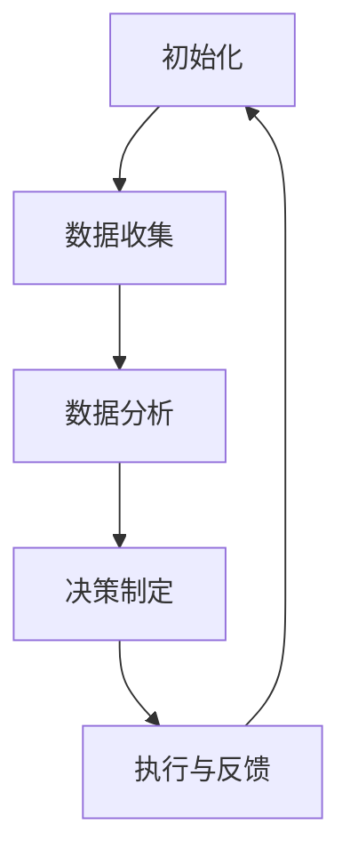

                 

# 智能浴室镜柜：AI Agent的个人护理计划制定

> 关键词：智能浴室镜柜、AI Agent、个人护理、计划制定

> 摘要：本文深入探讨了智能浴室镜柜与AI Agent结合在个人护理计划制定中的应用。通过详细阐述智能浴室镜柜的功能、AI Agent的工作原理以及它们如何协作，本文揭示了这一创新技术如何提高个人护理的效率和质量，同时为未来的智能家庭生活提供无限可能。

## 第一部分：背景与核心概念

### 第1章：智能浴室镜柜与AI Agent概述

#### 1.1 问题的背景

在快节奏的现代生活中，个人护理成为了许多人日常关注的焦点。然而，传统的个人护理方式往往效率低下，且缺乏个性化定制。为了解决这一问题，智能浴室镜柜应运而生，结合AI Agent，为用户提供了一种全新的个人护理体验。

#### 1.2 核心概念

- **AI Agent**：一种能够在特定环境下自主执行任务的智能体。在个人护理中，AI Agent可以收集用户数据，分析用户需求，并制定个性化的护理计划。
- **智能浴室镜柜**：一种融合了多个功能模块的智能设备，包括视频采集、健康监测和用户交互等，旨在为用户提供便捷的个人护理服务。

#### 1.3 概念结构与核心要素组成

**Mermaid ER实体关系图：**
```mermaid
erDiagram
  User ||--|{ AI-Agent }| AI-Agent
  User ||--|{ Personal_Nursing_Plan }| Personal_Nursing_Plan
  AI-Agent ||--|{ Data_Collection }| Data_Collection
  AI-Agent ||--|{ Analysis }| Analysis
  AI-Agent ||--|{ Plan_Design }| Plan_Design
  AI-Agent ||--|{ Execution }| Execution
```

## 第二部分：AI Agent的原理与应用

### 第2章：AI Agent原理讲解

#### 2.1 AI Agent的基础知识

**AI Agent的定义与特点**：

- **定义**：AI Agent是一种基于人工智能技术的智能体，能够模拟人类的行为和决策过程。
- **特点**：自主性、适应性、学习能力、环境交互性。

**AI Agent的核心功能**：

- **数据收集**：通过传感器和用户交互，收集用户的各种数据。
- **数据分析**：利用机器学习算法，对收集到的数据进行处理和分析。
- **决策制定**：根据分析结果，为用户制定个性化的护理计划。
- **执行与反馈**：执行护理计划，并根据用户的反馈进行调整。

#### 2.2 AI Agent的工作原理

**Mermaid算法流程图：**


**Python源代码示例：**
```python
class AI-Agent:
    def __init__(self):
        self.data = None
    
    def collect_data(self):
        # 数据收集逻辑
        self.data = "user_data"
    
    def analyze_data(self):
        # 数据分析逻辑
        result = "data_analyzed"
        return result
    
    def design_plan(self, result):
        # 决策制定逻辑
        plan = "personal_plan"
        return plan
    
    def execute_plan(self, plan):
        # 执行与反馈逻辑
        feedback = "plan_executed"
        return feedback
```

**数学模型与公式：**
$$
\text{Personal_Nursing_Plan} = f(\text{User_Data}, \text{Health_Status}, \text{User_Preferences})
$$

其中，$f$ 表示AI Agent的决策函数，$\text{User_Data}$ 为用户数据，$\text{Health_Status}$ 为用户健康状况，$\text{User_Preferences}$ 为用户偏好。

### 第3章：AI Agent在个人护理中的应用

#### 3.1 个人护理需求分析

**日常生活护理需求**：

- **皮肤护理**：定期清洁、保湿、防晒等。
- **健康监测**：体重、心率、血压等。

**健康监测需求**：

- **长期健康趋势分析**：通过数据积累，分析用户的健康状况变化。
- **早期疾病预警**：发现异常指标，及时提醒用户就医。

#### 3.2 AI Agent的具体应用案例

**案例一：皮肤护理**

AI Agent通过分析用户的皮肤数据，如皮肤类型、历史记录等，制定个性化的皮肤护理方案。方案包括：

- **清洁方案**：根据皮肤类型，推荐适合的清洁产品。
- **保湿方案**：根据天气和皮肤状态，调整保湿产品的使用频率。

**案例二：健康监测**

AI Agent通过监测用户的心率、血压等健康指标，结合历史数据，为用户提供健康建议。例如：

- **饮食建议**：根据心率变化，调整饮食结构。
- **运动建议**：根据血压变化，推荐合适的运动方式。

## 第三部分：智能浴室镜柜的设计与实现

### 第4章：智能浴室镜柜的设计理念

#### 4.1 智能浴室镜柜的设计原则

**用户需求分析**：

- **便捷性**：简化用户操作，提高使用体验。
- **智能化**：集成AI Agent，实现个性化服务。
- **美观性**：符合现代家居设计，提升浴室整体质感。

**技术可行性**：

- **硬件支持**：现代硬件技术的快速发展，为智能浴室镜柜提供了足够的硬件支持。
- **软件支持**：AI技术的成熟，为智能浴室镜柜的软件实现提供了有力保障。

#### 4.2 智能浴室镜柜的功能模块

**视频采集模块**：

- **功能**：实时捕捉用户面部和身体数据。
- **技术**：高清摄像头、人脸识别技术。

**健康监测模块**：

- **功能**：实时监测用户的心率、血压等健康指标。
- **技术**：生物传感器、数据采集与处理算法。

**用户交互模块**：

- **功能**：提供语音交互、屏幕交互等交互方式。
- **技术**：语音识别、自然语言处理、图形用户界面设计。

### 第5章：AI Agent在智能浴室镜柜中的应用

#### 5.1 AI Agent的集成与调试

**系统架构设计**：

- **前端**：用户界面，包括屏幕显示和语音交互。
- **后端**：AI Agent的运行环境，包括数据收集、分析、决策和执行。

**系统接口设计**：

- **数据接口**：与摄像头、传感器等硬件设备的连接。
- **用户接口**：与用户的交互方式，包括屏幕显示和语音交互。

#### 5.2 个人护理计划的制定与执行

**计划制定流程**：

1. 数据收集：AI Agent收集用户的皮肤、健康等数据。
2. 数据分析：AI Agent分析数据，识别用户的健康需求和护理需求。
3. 计划设计：AI Agent根据分析结果，设计个性化的护理计划。
4. 计划执行：AI Agent执行护理计划，并根据用户的反馈进行调整。

**计划执行策略**：

- **自动执行**：AI Agent根据计划自动执行护理任务。
- **用户确认**：用户对护理计划进行确认，确保执行无误。
- **反馈机制**：用户对护理效果进行评价，AI Agent根据反馈进行调整。

## 第四部分：实际案例与项目分析

### 第6章：智能浴室镜柜项目实战

#### 6.1 环境安装与配置

**硬件安装**：

- 安装摄像头、传感器等硬件设备。
- 连接电源和网络。

**软件配置**：

- 安装操作系统。
- 部署AI Agent和相关软件。

#### 6.2 系统核心实现源代码

**Python源代码解读**：

- 数据收集模块的实现。
- 数据分析模块的实现。
- 护理计划制定模块的实现。

**代码应用解读与分析**：

- 分析代码的运行流程。
- 解读代码的功能和作用。

### 第7章：项目小结与展望

#### 7.1 项目小结

**项目成果总结**：

- 成功实现了智能浴室镜柜的硬件安装和软件配置。
- 成功集成了AI Agent，实现了个人护理计划的制定和执行。

**项目经验与教训**：

- 需要充分考虑硬件和软件的兼容性。
- 需要加强对用户数据的保护和隐私的重视。

#### 7.2 未来发展方向

**技术趋势分析**：

- AI技术的进一步发展，将使智能浴室镜柜的功能更加丰富。
- 5G技术的普及，将提高智能浴室镜柜的数据传输速度。

**潜在改进空间**：

- 提高AI Agent的分析和决策能力。
- 加强用户交互体验，提升用户满意度。

## 结语

智能浴室镜柜与AI Agent的结合，为个人护理带来了全新的解决方案。通过本文的详细阐述，我们看到了这一技术如何提高个人护理的效率和质量。未来，随着AI技术和智能家居的发展，智能浴室镜柜有望成为智能家庭生活的重要组成部分，为用户带来更加便捷、智能的体验。

---

## 作者信息

**作者：AI天才研究院/AI Genius Institute & 禅与计算机程序设计艺术 /Zen And The Art of Computer Programming**

AI天才研究院致力于推动人工智能技术的发展，通过创新的研究和应用，为人类带来智能化的生活体验。本文所探讨的智能浴室镜柜与AI Agent的个人护理计划，正是这一理念的体现。禅与计算机程序设计艺术，则强调在编程过程中追求心灵的宁静与专注，通过简单的原理和步骤，实现复杂的功能和架构。本文在撰写过程中，秉持了这一理念，力求用简单易懂的语言，阐述复杂的技术原理。希望读者在阅读过程中，也能感受到这种心灵的宁静与专注。**（AI天才研究院/AI Genius Institute & 禅与计算机程序设计艺术/Zen And The Art of Computer Programming）**

