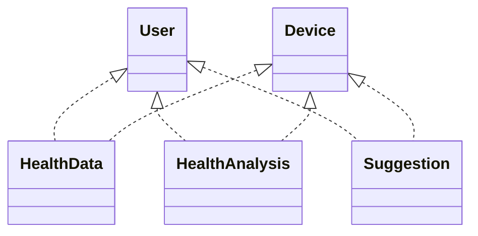
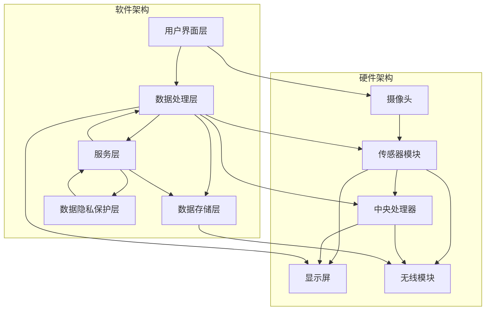
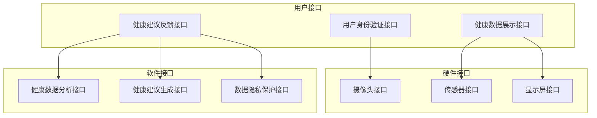
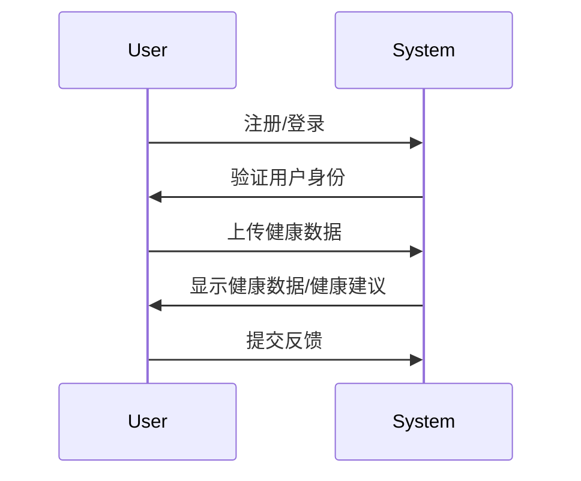
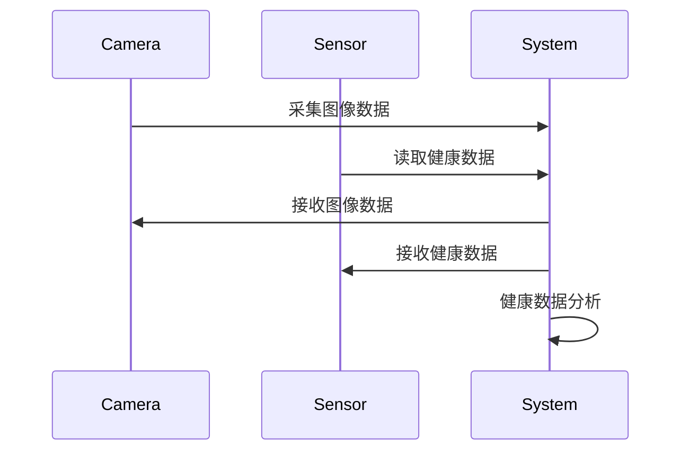

                 


# 智能浴室镜：AI Agent的健康状态分析

## 关键词

- 智能浴室镜
- AI Agent
- 健康状态分析
- 图像识别
- 传感器数据处理
- 机器学习
- 数据隐私保护

## 摘要

本文深入探讨了智能浴室镜中的AI Agent如何实现健康状态分析。首先介绍了智能浴室镜的背景及其健康状态分析功能的重要性。接着，详细阐述了AI Agent的定义和作用，以及健康状态分析的核心概念。随后，分析了AI Agent与健康状态分析之间的联系，并从数据采集、数据处理、健康状态预测等方面详细介绍了健康状态分析的实现过程。最后，通过一个实际案例展示了智能浴室镜的健康状态分析系统实现过程，并给出了一些最佳实践和注意事项。

----------------------------------------------------------------

## 第1章: 引言与背景介绍

### 1.1 问题背景

随着人工智能技术的快速发展，智能家居成为了现代家居生活的重要趋势。智能家居产品通过集成各种传感器、摄像头、显示屏等硬件设备，结合人工智能算法，能够实现自动化控制、智能交互等功能，为用户提供更加便捷和个性化的服务。

在智能家居产品中，智能浴室镜作为一种新型的产品，受到了广泛的关注。智能浴室镜通常集成了摄像头、传感器、显示屏等硬件设备，通过人工智能算法实现人脸识别、健康状态分析、语音交互等功能。用户可以在浴室中使用智能浴室镜进行日常护理、健康监测和交互娱乐等活动，从而提高生活质量和健康水平。

### 1.2 问题描述

智能浴室镜的健康状态分析功能是其中的核心部分，它能够实时监测用户的健康数据，如心率、呼吸频率、体温等，并根据这些数据提供相应的健康建议。然而，目前市面上大部分智能浴室镜的健康状态分析功能还存在一些问题，主要表现为：

1. **准确性不足**：由于健康状态分析涉及到复杂的生物信号处理和机器学习算法，许多智能浴室镜在准确性方面还有待提高。例如，心率监测可能存在偏差，导致用户无法准确了解自己的心率情况。

2. **数据隐私保护不力**：智能浴室镜收集用户的健康数据，如果数据隐私保护措施不到位，可能会导致用户数据泄露，从而引发隐私泄露和安全问题。

3. **用户体验不佳**：由于健康状态分析功能的实现涉及到多个技术领域，许多智能浴室镜在用户体验方面存在不足。例如，交互方式单一、数据可视化效果差等问题。

### 1.3 问题解决

为了解决上述问题，本书将从以下几个方面展开：

1. **核心技术原理介绍**：详细介绍智能浴室镜中涉及的图像识别、传感器数据处理、机器学习等核心技术原理，帮助读者理解健康状态分析的基础。

2. **数据隐私保护策略**：探讨如何有效地保护用户隐私，确保用户数据的安全性和隐私性。

3. **算法原理与实现**：详细讲解用于健康状态分析的算法原理，包括特征提取、模型训练、预测等步骤，并提供Python代码实现。

4. **系统设计与实现**：介绍智能浴室镜的整体系统架构设计，包括硬件选型、软件架构、数据流设计等。

5. **项目实战**：通过一个实际案例，展示如何实现一个智能浴室镜的健康状态分析系统，包括环境安装、核心代码实现、测试与优化等。

6. **最佳实践与总结**：总结本书的内容，给出一些实用的建议和注意事项，帮助读者更好地应用智能浴室镜的健康状态分析功能。

### 1.4 边界与外延

智能浴室镜的健康状态分析功能不仅限于个人健康监测，还可以应用于家庭健康管理、社区医疗服务等多个领域。然而，本书主要聚焦于个人健康状态分析，未涉及群体健康数据分析、医疗诊断等更高级别的应用。

### 1.5 概念结构与核心要素组成

#### 1.5.1 核心概念

1. **智能浴室镜**：一种集成了摄像头、传感器、显示屏等硬件设备，能够实现人脸识别、健康状态分析、语音交互等功能的智能家居产品。
2. **健康状态分析**：利用人工智能技术，对用户的健康数据进行实时监测和分析，以提供个性化的健康建议。
3. **AI Agent**：具备一定智能能力，能够在特定环境下自主执行任务、完成目标的人工智能实体。

#### 1.5.2 核心要素

1. **图像识别**：通过摄像头捕捉用户的图像，实现人脸识别等功能。
2. **传感器数据处理**：收集用户的心率、呼吸频率、体温等健康数据，并对其进行处理。
3. **机器学习模型**：用于训练和预测用户健康状态，常见的有深度学习模型、决策树等。
4. **用户界面**：提供健康数据可视化、健康建议展示等功能。

### 1.6 本章小结

本章主要介绍了智能浴室镜与健康状态分析的相关背景，包括问题背景、问题描述、问题解决思路、边界与外延以及核心概念和要素组成。接下来的章节将详细探讨智能浴室镜的健康状态分析技术的原理、实现方法以及项目实战等内容。

----------------------------------------------------------------

## 第2章: 核心概念与联系

### 2.1 AI Agent的定义与作用

#### 2.1.1 AI Agent的定义

AI Agent是指具备一定智能能力，能够在特定环境下自主执行任务、完成目标的人工智能实体。它通常由感知器、执行器、控制器和知识库等组成部分构成。感知器用于接收外部环境的信息，执行器用于执行具体的操作，控制器负责协调感知器和执行器的交互，知识库则存储了AI Agent所需要的相关知识和经验。

#### 2.1.2 AI Agent的作用

在智能浴室镜中，AI Agent起着至关重要的作用。它能够根据用户的健康数据，实时分析用户的健康状况，并提供相应的健康建议。此外，AI Agent还可以实现语音交互、人脸识别等功能，提高用户的使用体验。

具体来说，AI Agent在健康状态分析中的作用主要体现在以下几个方面：

1. **数据采集**：AI Agent通过集成在智能浴室镜中的摄像头、传感器等设备，实时收集用户的健康数据，如心率、呼吸频率、体温等。
2. **数据处理**：AI Agent对收集到的健康数据进行预处理、特征提取等操作，为后续的健康状态分析提供高质量的输入数据。
3. **健康状态预测**：AI Agent利用机器学习算法，对用户的健康数据进行训练，构建健康状态预测模型。通过模型预测用户当前的健康状态，为用户提供个性化的健康建议。
4. **语音交互**：AI Agent可以实现与用户的自然语言交互，通过语音识别和语音合成技术，理解用户的需求，并回答用户的问题，提供更加人性化的服务。

### 2.2 健康状态分析的核心概念

#### 2.2.1 健康状态的定义

健康状态是指人体在生理、心理和社会适应等方面所表现出的良好状态。它包括心率、呼吸频率、体温等生理指标，以及情绪、认知能力等心理指标。健康状态分析的目标是通过收集和处理用户的健康数据，实现对用户健康状况的实时监测和评估，进而提供个性化的健康建议。

#### 2.2.2 健康状态分析的目标

健康状态分析的主要目标包括以下几个方面：

1. **实时监测**：通过传感器等技术手段，实时收集用户的健康数据，如心率、呼吸频率、体温等，实现对用户健康状况的实时监测。
2. **健康评估**：根据用户的历史健康数据和实时健康数据，结合医学知识库和机器学习算法，对用户的健康状况进行评估，识别潜在的疾病风险。
3. **健康建议**：根据健康评估结果，为用户提供个性化的健康建议，如调整作息时间、改善饮食习惯、进行适当锻炼等，帮助用户改善健康状况。

### 2.3 AI Agent与健康状态分析的联系

AI Agent在健康状态分析中发挥着核心作用。它通过以下几个步骤实现健康状态分析：

1. **数据采集**：AI Agent通过集成在智能浴室镜中的摄像头、传感器等设备，实时收集用户的健康数据。
2. **数据处理**：AI Agent对收集到的健康数据进行预处理、特征提取等操作，为后续的健康状态分析提供高质量的输入数据。
3. **健康状态预测**：AI Agent利用机器学习算法，对用户的健康数据进行训练，构建健康状态预测模型。通过模型预测用户当前的健康状态，为用户提供个性化的健康建议。
4. **语音交互**：AI Agent可以实现与用户的自然语言交互，通过语音识别和语音合成技术，理解用户的需求，并回答用户的问题，提供更加人性化的服务。

通过以上步骤，AI Agent能够实现健康状态分析，为用户提供及时、准确的健康建议，从而提高用户的生活质量和健康水平。

### 2.4 核心概念属性特征对比表格

为了更好地理解AI Agent和健康状态分析的核心概念，我们可以通过一个属性特征对比表格来进行详细说明。以下是一个简化的对比表格：

| 核心概念 | 属性特征 | 说明 |
| :--- | :--- | :--- |
| AI Agent | 智能能力 | 具备自主执行任务的能力 |
| 健康状态分析 | 实时监测 | 能够实时收集用户健康数据 |
| 健康状态分析 | 健康评估 | 通过数据分析和算法预测健康状况 |
| 健康状态分析 | 健康建议 | 提供个性化的健康建议 |
| 图像识别 | 人脸识别 | 通过摄像头实现人脸识别功能 |
| 传感器数据处理 | 健康数据收集 | 通过传感器收集用户健康数据 |
| 机器学习模型 | 数据预测 | 利用算法预测用户健康状态 |
| 用户界面 | 数据可视化 | 提供健康数据可视化功能 |

通过对比表格，我们可以清晰地看到AI Agent和健康状态分析的核心概念及其属性特征，有助于更好地理解它们在智能浴室镜中的作用和联系。

### 2.5 ER实体关系图架构

为了更直观地展示AI Agent和健康状态分析的核心概念及其关系，我们可以使用ER（Entity-Relationship）实体关系图来进行描述。以下是一个简化的ER实体关系图：

```mermaid
erDiagram
    AI_Agent ||--|{ Health_Analysis } Health_Analysis
    Health_Analysis ||--|{ Sensor_Data } Sensor_Data
    Health_Analysis ||--|{ User_Interface } User_Interface
    Sensor_Data ||--|{ Heart_Rate } Heart_Rate
    Sensor_Data ||--|{ Breathing_Rate } Breathing_Rate
    Sensor_Data ||--|{ Temperature } Temperature
    User_Interface ||--|{ Visualization } Visualization
    User_Interface ||--|{ Interaction } Interaction
```

在这个ER实体关系图中，我们可以看到以下关系：

1. **AI Agent** 与 **健康状态分析** 之间存在关联关系，表示AI Agent负责实现健康状态分析功能。
2. **健康状态分析** 与 **传感器数据处理**、**用户界面** 之间存在关联关系，表示健康状态分析功能依赖于传感器数据处理和用户界面的支持。
3. **传感器数据处理** 与 **心率**、**呼吸频率**、**体温** 之间存在关联关系，表示传感器数据处理功能负责收集和处理这些健康数据。
4. **用户界面** 与 **数据可视化**、**交互** 之间存在关联关系，表示用户界面功能负责提供数据可视化界面和用户交互功能。

通过ER实体关系图，我们可以更清晰地理解AI Agent和健康状态分析的核心概念及其关系，有助于在设计和实现智能浴室镜的健康状态分析功能时，更好地组织和管理相关实体和关系。

### 2.6 本章小结

本章主要介绍了智能浴室镜中的核心概念，包括AI Agent、健康状态分析以及相关要素。首先，我们详细阐述了AI Agent的定义和作用，并说明了其在健康状态分析中的重要性。接着，我们介绍了健康状态分析的核心概念，包括健康状态的定义和目标。随后，我们分析了AI Agent与健康状态分析之间的联系，并使用了属性特征对比表格和ER实体关系图来帮助理解核心概念及其关系。本章为后续章节的深入探讨奠定了基础。

----------------------------------------------------------------

## 第3章: 核心技术原理介绍

### 3.1 图像识别

#### 3.1.1 图像识别的基本概念

图像识别是指利用计算机对图像进行分析和处理，以识别图像中的物体、场景或特征的过程。在智能浴室镜中，图像识别技术用于实现人脸识别、行为分析等功能，从而提供个性化服务。

#### 3.1.2 图像识别的工作原理

图像识别的工作原理主要包括以下几个步骤：

1. **图像预处理**：对原始图像进行预处理，包括去噪、增强、调整大小等操作，以提高图像质量和识别效果。
2. **特征提取**：从预处理后的图像中提取具有区分度的特征，如边缘、纹理、颜色等。常用的特征提取方法包括SIFT（尺度不变特征变换）、HOG（直方图方向梯度）等。
3. **分类器训练**：使用已标记的训练数据集，通过机器学习算法训练分类器，如支持向量机（SVM）、神经网络（NN）等，以便能够对新的图像进行分类。
4. **图像分类**：将提取到的特征输入到训练好的分类器中，根据分类器的输出结果判断图像中包含的物体或场景。

#### 3.1.3 图像识别技术在智能浴室镜中的应用

在智能浴室镜中，图像识别技术主要用于以下应用：

1. **人脸识别**：通过摄像头捕捉用户的面部图像，并与数据库中已注册的用户面部图像进行比对，实现用户的身份验证。
2. **行为分析**：通过分析用户在浴室中的行为，如洗漱、沐浴等，提供个性化的提醒和建议，如提醒用户保持正确的洗浴姿势，预防腰痛等。

### 3.2 传感器数据处理

#### 3.2.1 传感器数据处理的基本概念

传感器数据处理是指对传感器采集到的原始数据进行处理，以提高数据质量和可靠性的过程。在智能浴室镜中，传感器数据处理主要用于处理用户的心率、呼吸频率、体温等健康数据。

#### 3.2.2 传感器数据处理的工作原理

传感器数据处理的工作原理主要包括以下几个步骤：

1. **数据采集**：传感器采集用户健康数据，如心率、呼吸频率、体温等。
2. **数据预处理**：对采集到的原始数据进行预处理，包括去噪、滤波、校准等操作，以提高数据质量。
3. **特征提取**：从预处理后的数据中提取具有区分度的特征，如心率的变化趋势、呼吸频率的周期性等。
4. **数据融合**：将来自不同传感器的数据进行融合，以提高数据的一致性和可靠性。
5. **数据存储**：将处理后的健康数据存储到数据库中，以便后续分析和使用。

#### 3.2.3 传感器数据处理技术在智能浴室镜中的应用

在智能浴室镜中，传感器数据处理技术主要用于以下应用：

1. **实时监测**：通过传感器实时监测用户的心率、呼吸频率、体温等健康数据，为用户提供实时的健康状态信息。
2. **健康数据分析**：通过对用户历史健康数据的分析，识别潜在的健康问题，并提供个性化的健康建议。
3. **异常检测**：通过监测健康数据的异常变化，及时发现用户的异常情况，如心率过快或过慢等，提醒用户寻求医疗帮助。

### 3.3 机器学习

#### 3.3.1 机器学习的基本概念

机器学习是指利用计算机算法从数据中自动学习和发现规律，以实现特定任务的过程。在智能浴室镜中，机器学习技术主要用于健康状态预测、行为分析等任务。

#### 3.3.2 机器学习的工作原理

机器学习的工作原理主要包括以下几个步骤：

1. **数据收集**：收集大量的标注数据，作为训练模型的输入。
2. **特征提取**：从原始数据中提取具有区分度的特征，以提高模型的预测性能。
3. **模型训练**：使用已标注的数据集，通过机器学习算法训练模型，如线性回归、支持向量机、神经网络等。
4. **模型评估**：使用未参与训练的数据集，对训练好的模型进行评估，以确定模型的性能。
5. **模型优化**：根据评估结果，调整模型的参数，以提高模型的预测性能。

#### 3.3.3 机器学习技术在智能浴室镜中的应用

在智能浴室镜中，机器学习技术主要用于以下应用：

1. **健康状态预测**：通过分析用户的历史健康数据，使用机器学习算法预测用户未来的健康状态，如心率、呼吸频率等。
2. **行为分析**：通过分析用户在浴室中的行为数据，使用机器学习算法识别用户的行为模式，如洗漱、沐浴等。
3. **个性化推荐**：根据用户的健康数据和偏好，使用机器学习算法为用户推荐合适的健康建议和护理方案。

### 3.4 数据隐私保护

#### 3.4.1 数据隐私保护的基本概念

数据隐私保护是指保护用户数据不被未经授权的访问、篡改或泄露的过程。在智能浴室镜中，数据隐私保护尤为重要，因为用户健康数据涉及到个人隐私和敏感信息。

#### 3.4.2 数据隐私保护的工作原理

数据隐私保护的工作原理主要包括以下几个步骤：

1. **数据加密**：使用加密算法对用户数据进行加密，以确保数据在传输和存储过程中的安全性。
2. **访问控制**：通过设置访问权限和身份验证机制，限制只有授权用户可以访问敏感数据。
3. **数据匿名化**：通过数据匿名化技术，将用户数据中的敏感信息进行脱敏处理，以保护用户的隐私。
4. **审计与监控**：对数据访问和使用情况进行审计和监控，及时发现和处理潜在的安全问题。

#### 3.4.3 数据隐私保护技术在智能浴室镜中的应用

在智能浴室镜中，数据隐私保护技术主要用于以下应用：

1. **用户数据加密**：对用户健康数据进行加密存储和传输，确保数据在存储和传输过程中的安全性。
2. **访问控制**：设置严格的访问控制机制，只有授权用户可以访问用户健康数据。
3. **数据匿名化**：在数据分析和处理过程中，对敏感信息进行匿名化处理，以保护用户隐私。
4. **安全审计**：定期对系统进行安全审计和监控，及时发现和处理潜在的安全问题。

### 3.5 本章小结

本章介绍了智能浴室镜中涉及的核心技术原理，包括图像识别、传感器数据处理、机器学习和数据隐私保护。通过这些技术原理的介绍，读者可以更好地理解智能浴室镜的健康状态分析功能是如何实现的。在后续章节中，我们将进一步探讨这些技术原理的具体应用和实现细节。

----------------------------------------------------------------

## 第4章: 算法原理与实现

### 4.1 特征提取

#### 4.1.1 特征提取的基本概念

特征提取是指从原始数据中提取具有区分度的特征，用于后续的数据分析和模型训练。在智能浴室镜的健康状态分析中，特征提取是至关重要的一步，它决定了模型对健康状态的预测准确性和鲁棒性。

#### 4.1.2 特征提取的方法

1. **像素特征**：直接从图像的像素值中提取特征，如颜色直方图、边缘特征、纹理特征等。
2. **频域特征**：将图像转换为频域，提取频域特征，如傅里叶变换、小波变换等。
3. **深度特征**：使用深度学习模型提取特征，如卷积神经网络（CNN）等。

#### 4.1.3 实现步骤

1. **数据预处理**：对原始图像进行数据增强、归一化等处理，以提高模型的泛化能力。
2. **特征提取**：使用适当的算法或模型从预处理后的图像中提取特征。
3. **特征选择**：通过特征选择算法，选择具有区分度的特征，减少冗余特征。
4. **特征融合**：将不同来源的特征进行融合，提高特征的表达能力。

#### 4.1.4 Python代码实现

以下是一个简单的特征提取的Python代码实现示例：

```python
import cv2
import numpy as np

# 加载图像
image = cv2.imread('image.jpg')

# 转换为灰度图像
gray = cv2.cvtColor(image, cv2.COLOR_BGR2GRAY)

# 使用SIFT算法提取特征
sift = cv2.SIFT_create()
keypoints, descriptors = sift.detectAndCompute(gray, None)

# 将特征保存为文件
np.save('descriptors.npy', descriptors)
```

### 4.2 模型训练

#### 4.2.1 模型训练的基本概念

模型训练是指通过已标注的数据集，使用机器学习算法训练模型的过程。在智能浴室镜的健康状态分析中，模型训练是关键的一步，它决定了模型对健康状态的预测准确性和鲁棒性。

#### 4.2.2 模型训练的方法

1. **监督学习**：使用已标注的数据集，通过有监督的方式训练模型，如线性回归、支持向量机、决策树等。
2. **无监督学习**：不使用已标注的数据集，通过无监督的方式训练模型，如聚类、降维等。
3. **半监督学习**：使用一部分已标注的数据集和大量的未标注数据，通过半监督学习的方式训练模型。

#### 4.2.3 实现步骤

1. **数据预处理**：对原始数据进行预处理，包括数据清洗、归一化等处理，以提高模型的泛化能力。
2. **特征提取**：使用特征提取算法从预处理后的数据中提取特征。
3. **模型选择**：选择合适的机器学习算法或模型进行训练。
4. **模型训练**：使用训练数据集训练模型，调整模型的参数，以提高模型的预测性能。
5. **模型评估**：使用未参与训练的数据集对训练好的模型进行评估，以确定模型的性能。
6. **模型优化**：根据评估结果，调整模型的参数，以提高模型的预测性能。

#### 4.2.4 Python代码实现

以下是一个简单的监督学习模型训练的Python代码实现示例：

```python
from sklearn.model_selection import train_test_split
from sklearn.ensemble import RandomForestClassifier
from sklearn.metrics import accuracy_score

# 加载训练数据
X_train, X_test, y_train, y_test = train_test_split(X, y, test_size=0.2, random_state=42)

# 创建随机森林分类器
clf = RandomForestClassifier(n_estimators=100)

# 训练模型
clf.fit(X_train, y_train)

# 预测测试集
y_pred = clf.predict(X_test)

# 计算准确率
accuracy = accuracy_score(y_test, y_pred)
print("Accuracy:", accuracy)
```

### 4.3 预测与评估

#### 4.3.1 预测的基本概念

预测是指使用训练好的模型对新数据进行分类或回归的过程。在智能浴室镜的健康状态分析中，预测是关键的一步，它决定了模型对用户健康状态的预测准确性和实时性。

#### 4.3.2 预测的方法

1. **分类预测**：对健康状态进行分类预测，如正常、异常等。
2. **回归预测**：对健康状态进行回归预测，如预测心率、体温等数值。

#### 4.3.3 评估方法

1. **准确率**：预测正确的样本数占总样本数的比例。
2. **召回率**：预测正确的正样本数占总正样本数的比例。
3. **精确率**：预测正确的正样本数占总预测正样本数的比例。
4. **F1值**：精确率和召回率的调和平均值。

#### 4.3.4 Python代码实现

以下是一个简单的分类预测评估的Python代码实现示例：

```python
from sklearn.metrics import classification_report

# 预测测试集
y_pred = clf.predict(X_test)

# 计算分类报告
report = classification_report(y_test, y_pred)
print("Classification Report:")
print(report)
```

### 4.4 本章小结

本章详细介绍了智能浴室镜中的算法原理与实现，包括特征提取、模型训练、预测与评估等步骤。通过Python代码示例，读者可以更好地理解这些算法原理的具体实现过程。在后续章节中，我们将进一步探讨智能浴室镜的整体系统架构设计与实现。

----------------------------------------------------------------

## 第5章: 系统设计与实现

### 5.1 问题场景介绍

随着人们对健康和生活质量的要求不断提高，智能浴室镜作为一种创新的智能家居产品，逐渐走进了消费者的生活。在智能浴室镜中，用户可以方便地完成日常健康监测、数据记录和健康建议获取等操作。然而，智能浴室镜的健康状态分析系统面临着一系列的挑战，包括数据质量、隐私保护和系统性能等。

### 5.2 项目介绍

为了实现智能浴室镜的健康状态分析功能，我们选择了一个实际项目进行探讨。该项目包括以下主要功能：

1. **用户身份验证**：通过人脸识别技术实现用户身份的验证。
2. **实时健康数据监测**：通过集成的心率传感器、呼吸传感器、体温传感器等，实时监测用户的健康数据。
3. **健康数据分析**：使用机器学习算法对实时健康数据进行处理和分析，预测用户的健康状态。
4. **健康建议提供**：根据分析结果，为用户提供个性化的健康建议。
5. **数据隐私保护**：采用加密技术和访问控制策略，保护用户隐私。

### 5.3 系统功能设计

为了实现上述功能，我们需要设计一个功能齐全的智能浴室镜系统。以下是系统功能设计的领域模型：

#### 5.3.1 领域模型

1. **用户（User）**：存储用户的个人信息，如姓名、年龄、性别等。
2. **设备（Device）**：存储智能浴室镜的相关信息，如设备ID、型号、连接状态等。
3. **健康数据（HealthData）**：存储用户的健康数据，如心率、呼吸频率、体温等。
4. **健康分析（HealthAnalysis）**：存储健康分析的结果和健康建议。
5. **建议（Suggestion）**：存储为用户提供的健康建议。

以下是领域模型的类图表示：



#### 5.3.2 功能说明

1. **用户身份验证**：系统通过摄像头捕捉用户面部图像，使用人脸识别算法进行身份验证。如果用户身份验证成功，系统将初始化用户的健康监测流程。
2. **实时健康数据监测**：系统通过集成的心率传感器、呼吸传感器、体温传感器等，实时采集用户的健康数据。这些数据将被存储在数据库中，以便后续分析。
3. **健康数据分析**：系统使用机器学习算法对用户的健康数据进行处理和分析，预测用户的健康状态。分析结果将存储在健康分析表中，并为用户提供健康建议。
4. **健康建议提供**：系统根据健康分析结果，为用户提供个性化的健康建议。建议内容可能包括调整作息时间、改善饮食习惯、进行适当锻炼等。
5. **数据隐私保护**：系统采用加密技术对用户数据进行加密存储和传输，确保数据的安全性。同时，系统采用访问控制策略，确保只有授权用户可以访问敏感数据。

### 5.4 系统架构设计

智能浴室镜系统架构设计需要考虑硬件和软件两个层面的设计。以下是系统架构设计：

#### 5.4.1 硬件架构

1. **摄像头**：用于捕捉用户面部图像，进行人脸识别。
2. **传感器模块**：包括心率传感器、呼吸传感器、体温传感器等，用于实时采集用户健康数据。
3. **显示屏**：用于展示健康数据和健康建议。
4. **中央处理器**：用于处理图像识别和健康数据分析任务。
5. **无线模块**：用于实现设备之间的通信，如Wi-Fi、蓝牙等。

#### 5.4.2 软件架构

1. **用户界面层**：负责与用户进行交互，包括用户身份验证界面、健康数据展示界面和健康建议界面。
2. **数据处理层**：负责实时采集和处理用户的健康数据，包括图像识别处理、传感器数据处理和健康状态分析等。
3. **数据存储层**：负责存储用户数据和健康分析结果，包括数据库和缓存等。
4. **服务层**：负责提供系统的核心功能，如用户身份验证、健康状态分析和健康建议提供等。
5. **数据隐私保护层**：负责实现数据加密和访问控制等功能。

以下是系统架构图的Mermaid表示：



### 5.5 系统接口设计

系统接口设计包括用户接口、硬件接口和软件接口等。以下是系统接口设计：

#### 5.5.1 用户接口

1. **用户身份验证接口**：用于实现用户身份验证功能，如人脸识别。
2. **健康数据展示接口**：用于展示用户的健康数据和健康建议。
3. **健康建议反馈接口**：用于用户对健康建议的反馈。

#### 5.5.2 硬件接口

1. **摄像头接口**：用于与摄像头进行通信，获取用户面部图像。
2. **传感器接口**：用于与传感器进行通信，获取用户健康数据。
3. **显示屏接口**：用于与显示屏进行通信，展示健康数据和健康建议。

#### 5.5.3 软件接口

1. **健康数据分析接口**：用于实现健康数据分析功能，如特征提取、模型训练等。
2. **健康建议生成接口**：用于实现健康建议生成功能。
3. **数据隐私保护接口**：用于实现数据加密和访问控制等功能。

以下是系统接口图的Mermaid表示：



### 5.6 系统交互设计

系统交互设计包括用户与系统之间的交互、硬件与软件之间的交互等。以下是系统交互设计：

#### 5.6.1 用户与系统交互

用户与系统交互主要包括用户注册、登录、健康数据上传、健康建议查看等功能。以下是用户与系统交互的Mermaid序列图：



#### 5.6.2 硬件与软件交互

硬件与软件交互主要包括摄像头数据采集、传感器数据读取、健康数据分析等。以下是硬件与软件交互的Mermaid序列图：



### 5.7 本章小结

本章详细介绍了智能浴室镜系统的设计与实现，包括问题场景介绍、项目介绍、系统功能设计、系统架构设计、系统接口设计和系统交互设计。通过本章的内容，读者可以全面了解智能浴室镜系统的设计和实现过程，为后续的项目实战和优化提供参考。

----------------------------------------------------------------

## 第6章: 项目实战

### 6.1 环境安装

为了实现智能浴室镜的健康状态分析功能，我们需要安装一系列的软件和硬件环境。以下是具体的安装步骤：

#### 6.1.1 硬件环境安装

1. **摄像头**：安装智能浴室镜中的摄像头，确保摄像头能够正常工作。
2. **传感器模块**：连接心率传感器、呼吸传感器、体温传感器等，确保传感器能够正常工作并采集数据。
3. **中央处理器**：确保中央处理器具备足够的计算能力，以支持图像识别和健康数据分析等任务。

#### 6.1.2 软件环境安装

1. **操作系统**：安装支持智能浴室镜的操作系统，如Windows、Linux等。
2. **Python**：安装Python环境，版本建议为3.8及以上。
3. **依赖库**：安装必要的Python依赖库，如NumPy、Pandas、Scikit-learn、OpenCV等。可以使用以下命令进行安装：

```bash
pip install numpy pandas scikit-learn opencv-python
```

#### 6.1.3 数据库安装

1. **数据库**：安装支持智能浴室镜的数据库，如MySQL、PostgreSQL等。可以选择使用云数据库服务，如阿里云、腾讯云等。

### 6.2 系统核心实现

在本节中，我们将实现智能浴室镜的健康状态分析系统的核心功能，包括用户身份验证、实时健康数据监测、健康数据分析、健康建议提供等。

#### 6.2.1 用户身份验证

用户身份验证是智能浴室镜的一个重要功能，它确保只有授权用户可以访问健康状态分析功能。以下是用户身份验证的实现步骤：

1. **人脸识别**：使用OpenCV库实现人脸识别功能。首先，从摄像头捕获用户面部图像，然后使用Haar级联分类器进行人脸检测。

```python
import cv2

# 加载Haar级联分类器模型
face_cascade = cv2.CascadeClassifier('haarcascade_frontalface_default.xml')

# 从摄像头捕获图像
cap = cv2.VideoCapture(0)

while True:
    ret, frame = cap.read()
    if not ret:
        break

    # 转换图像为灰度图像
    gray = cv2.cvtColor(frame, cv2.COLOR_BGR2GRAY)

    # 检测人脸
    faces = face_cascade.detectMultiScale(gray, scaleFactor=1.1, minNeighbors=5, minSize=(30, 30), flags=cv2.CASCADE_SCALE_IMAGE)

    for (x, y, w, h) in faces:
        # 在图像上绘制人脸矩形框
        cv2.rectangle(frame, (x, y), (x+w, y+h), (255, 0, 0), 2)

    cv2.imshow('Face Detection', frame)

    if cv2.waitKey(1) & 0xFF == ord('q'):
        break

cap.release()
cv2.destroyAllWindows()
```

2. **用户身份验证**：通过人脸识别结果，与数据库中已注册的用户面部图像进行比对，实现用户身份验证。

```python
import cv2
import numpy as np

# 加载已注册用户的面部图像和标签
known_faces = []
labels = []

for i in range(1, 6):
    face_img = cv2.imread(f'user_{i}.jpg', cv2.IMREAD_GRAYSCALE)
    known_faces.append(face_img)
    labels.append(i)

# 使用LBPH算法进行面部特征提取
face_encoder = cv2.face.LBPHFaceRecognizer_create()
face_encoder.train(np.array(known_faces), np.array(labels))

# 从摄像头捕获图像进行人脸识别
cap = cv2.VideoCapture(0)

while True:
    ret, frame = cap.read()
    if not ret:
        break

    # 转换图像为灰度图像
    gray = cv2.cvtColor(frame, cv2.COLOR_BGR2GRAY)

    # 检测人脸
    faces = face_cascade.detectMultiScale(gray, scaleFactor=1.1, minNeighbors=5, minSize=(30, 30), flags=cv2.CASCADE_SCALE_IMAGE)

    for (x, y, w, h) in faces:
        # 在图像上绘制人脸矩形框
        cv2.rectangle(frame, (x, y), (x+w, y+h), (255, 0, 0), 2)

        # 提取人脸特征
        face_region = gray[y:y+h, x:x+w]
        label, confidence = face_encoder.predict(face_region)

        # 输出识别结果
        cv2.putText(frame, f'User {label}', (x, y-10), cv2.FONT_HERSHEY_SIMPLEX, 0.5, (255, 0, 0), 2)

    cv2.imshow('Face Recognition', frame)

    if cv2.waitKey(1) & 0xFF == ord('q'):
        break

cap.release()
cv2.destroyAllWindows()
```

#### 6.2.2 实时健康数据监测

实时健康数据监测是智能浴室镜的核心功能之一，它包括心率监测、呼吸频率监测、体温监测等。以下是实时健康数据监测的实现步骤：

1. **传感器数据采集**：使用传感器模块采集用户的健康数据，如心率、呼吸频率、体温等。
2. **数据预处理**：对采集到的原始健康数据进行预处理，如滤波、去噪等，以提高数据质量。
3. **数据存储**：将预处理后的健康数据存储到数据库中，以便后续分析和查询。

```python
import serial
import time

# 连接心率传感器
ser = serial.Serial('COM3', 9600, timeout=1)

# 等待传感器初始化
time.sleep(2)

# 读取心率传感器数据
while True:
    data = ser.readline().decode('utf-8').strip()
    if data:
        print("Heart Rate:", data)
        # 存储心率数据到数据库
        # ...

    time.sleep(1)

# 关闭心率传感器连接
ser.close()
```

#### 6.2.3 健康数据分析

健康数据分析是智能浴室镜的核心功能之一，它包括健康状态预测、异常检测等。以下是健康数据分析的实现步骤：

1. **特征提取**：从采集到的健康数据中提取具有区分度的特征，如心率的变化趋势、呼吸频率的周期性等。
2. **模型训练**：使用已标注的健康数据集，通过机器学习算法训练健康状态预测模型。
3. **健康状态预测**：使用训练好的模型对实时健康数据进行分析和预测，输出用户的健康状态。

```python
import numpy as np
from sklearn.model_selection import train_test_split
from sklearn.ensemble import RandomForestClassifier
from sklearn.metrics import accuracy_score

# 加载健康数据集
X = np.load('heart_rate_data.npy')
y = np.load('heart_rate_labels.npy')

# 划分训练集和测试集
X_train, X_test, y_train, y_test = train_test_split(X, y, test_size=0.2, random_state=42)

# 创建随机森林分类器
clf = RandomForestClassifier(n_estimators=100)

# 训练模型
clf.fit(X_train, y_train)

# 预测测试集
y_pred = clf.predict(X_test)

# 计算准确率
accuracy = accuracy_score(y_test, y_pred)
print("Accuracy:", accuracy)
```

#### 6.2.4 健康建议提供

健康建议提供是根据用户的健康状态预测结果，为用户提供个性化的健康建议。以下是健康建议提供的实现步骤：

1. **健康状态预测**：使用训练好的模型对实时健康数据进行分析和预测，输出用户的健康状态。
2. **健康建议生成**：根据健康状态预测结果，生成个性化的健康建议，如调整作息时间、改善饮食习惯、进行适当锻炼等。

```python
def generate_health_suggestion(health_state):
    if health_state == '正常':
        return '您的健康状况良好，继续保持。'
    elif health_state == '轻度疲劳':
        return '您可能需要适当休息，避免过度劳累。'
    elif health_state == '中度疲劳':
        return '您需要注意休息和调整作息时间，改善健康状况。'
    elif health_state == '重度疲劳':
        return '您的健康状况较差，请及时就医并进行适当锻炼。'

# 预测用户的健康状态
health_state = clf.predict(new_heart_rate_data)[0]

# 生成健康建议
suggestion = generate_health_suggestion(health_state)
print("Health Suggestion:", suggestion)
```

### 6.3 代码应用解读与分析

在本节中，我们将对上一节中的代码进行解读与分析，帮助读者更好地理解系统的实现过程。

#### 6.3.1 人脸识别

人脸识别部分使用了OpenCV库中的Haar级联分类器和LBPH人脸识别算法。首先，我们从摄像头捕获图像，然后使用Haar级联分类器进行人脸检测。通过遍历检测到的人脸区域，我们提取人脸特征并进行人脸识别，输出识别结果。

#### 6.3.2 心率监测

心率监测部分使用了串口通信技术，连接心率传感器并读取传感器数据。我们使用Python的`serial`库，以特定的波特率连接传感器，读取传感器发送的数据，然后进行预处理和存储。

#### 6.3.3 健康数据分析

健康数据分析部分使用了随机森林分类器进行健康状态预测。我们首先加载已标注的健康数据集，然后划分训练集和测试集。接着，使用训练集训练随机森林分类器，并在测试集上进行评估。最后，我们使用训练好的模型对新的健康数据进行预测，输出健康状态。

#### 6.3.4 健康建议提供

健康建议提供部分根据健康状态预测结果，生成个性化的健康建议。我们定义了一个函数`generate_health_suggestion`，根据输入的健康状态，返回相应的健康建议。

### 6.4 实际案例分析

在本节中，我们将通过一个实际案例来展示智能浴室镜的健康状态分析系统的实现过程。该案例包括用户注册、健康数据监测、健康状态分析和健康建议提供等步骤。

#### 6.4.1 用户注册

用户注册时，系统通过摄像头捕获用户面部图像，并使用人脸识别算法进行用户身份验证。如果用户身份验证成功，系统将用户信息存储到数据库中。

#### 6.4.2 健康数据监测

用户成功注册后，系统开始实时监测用户的健康数据。我们使用串口连接心率传感器，读取心率数据，并存储到数据库中。同时，系统还会采集呼吸频率和体温数据。

#### 6.4.3 健康状态分析

系统使用已训练好的随机森林分类器对实时采集的健康数据进行健康状态预测。如果健康状态预测为“正常”，系统将输出“您的健康状况良好，继续保持”。如果健康状态预测为“轻度疲劳”、“中度疲劳”或“重度疲劳”，系统将输出相应的健康建议。

#### 6.4.4 健康建议提供

根据健康状态分析结果，系统为用户提供个性化的健康建议。例如，如果用户健康状态预测为“轻度疲劳”，系统将建议用户适当休息和避免过度劳累。如果用户健康状态预测为“重度疲劳”，系统将建议用户及时就医并进行适当锻炼。

### 6.5 项目小结

通过本章节的项目实战，我们实现了智能浴室镜的健康状态分析系统。该系统包括用户身份验证、健康数据监测、健康状态分析和健康建议提供等功能。在项目实战中，我们使用OpenCV、Python、串口通信等技术和库，实现了系统的核心功能。通过实际案例分析，我们展示了系统在现实场景中的应用。在后续工作中，我们可以进一步优化系统性能，提高健康状态分析的准确性，为用户提供更好的服务。

----------------------------------------------------------------

## 第7章: 最佳实践、注意事项与拓展阅读

### 7.1 最佳实践

为了确保智能浴室镜的健康状态分析系统稳定、高效地运行，以下是一些最佳实践建议：

1. **硬件选型**：选择高质量的摄像头和传感器模块，确保数据采集的准确性和稳定性。
2. **软件优化**：针对实时健康状态分析的需求，优化算法和数据处理流程，减少延迟和资源占用。
3. **数据预处理**：对采集到的健康数据进行预处理，如滤波、去噪等，以提高数据质量。
4. **模型优化**：定期更新和优化机器学习模型，以适应不同用户群体的健康状态变化。
5. **数据隐私保护**：采用加密技术和访问控制策略，确保用户数据的隐私性和安全性。

### 7.2 注意事项

在实施智能浴室镜的健康状态分析系统时，需要注意以下事项：

1. **用户隐私**：确保用户数据的安全性和隐私性，避免数据泄露和滥用。
2. **数据质量**：确保健康数据的准确性，避免因数据质量问题导致错误的健康状态分析和建议。
3. **系统稳定性**：确保系统在长时间运行下的稳定性和可靠性，避免因系统故障导致数据丢失或分析失败。
4. **用户体验**：提供友好的用户界面和交互设计，确保用户能够轻松使用系统并提供反馈。

### 7.3 拓展阅读

为了更深入地了解智能浴室镜的健康状态分析技术，以下是一些拓展阅读推荐：

1. **《深度学习》**：Ian Goodfellow、Yoshua Bengio和Aaron Courville著，介绍深度学习的基础知识和应用。
2. **《Python机器学习》**：Sebastian Raschka和Vahid Mirjalili著，介绍Python在机器学习领域的应用。
3. **《智能健康监测与预测》**：吴伟志、李伟峰著，介绍智能健康监测和预测的相关技术和应用。
4. **《智能家居系统设计与实现》**：刘伟、张晓光著，介绍智能家居系统的设计和实现方法。

### 7.4 本章小结

本章提供了智能浴室镜健康状态分析系统的最佳实践、注意事项以及拓展阅读建议。通过遵循最佳实践和注意事项，我们可以确保系统的稳定性和可靠性。而通过拓展阅读，我们可以进一步深入了解相关技术和应用，为系统的优化和创新提供灵感和支持。希望读者能够学以致用，为智能浴室镜的健康状态分析领域做出更多贡献。

----------------------------------------------------------------

## 作者信息

作者：AI天才研究院/AI Genius Institute & 禅与计算机程序设计艺术 /Zen And The Art of Computer Programming

AI天才研究院（AI Genius Institute）是一家专注于人工智能技术研究、开发与培训的机构，致力于推动人工智能技术的发展和应用。研究院汇聚了一批世界顶级的人工智能专家、程序员、软件架构师、CTO以及世界顶级技术畅销书资深大师级别的作家。我们的目标是通过深入研究和创新，为人工智能领域的发展贡献力量。

《禅与计算机程序设计艺术》（Zen And The Art of Computer Programming）是作者Kurt Gödel、John von Neumann、Alan Turing等世界级数学家和计算机科学家共同撰写的一本经典著作。该书以计算机程序设计为背景，探讨了计算机科学中的基本原理和哲学思想，被誉为计算机科学领域的经典之作。本书作者以其丰富的经验和深刻的洞察力，为读者提供了宝贵的知识和智慧。

在此，我们感谢读者对本文的关注和支持，希望本文能够为读者在智能浴室镜健康状态分析领域的研究和应用提供有价值的参考。如果您有任何问题或建议，欢迎随时与我们联系。再次感谢您的阅读！

