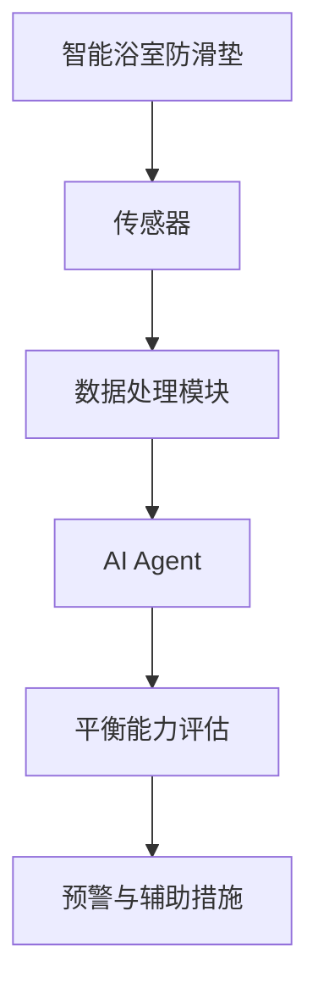
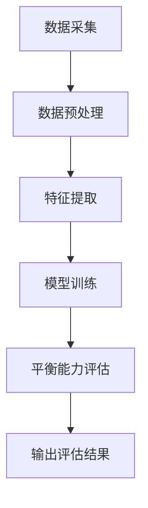
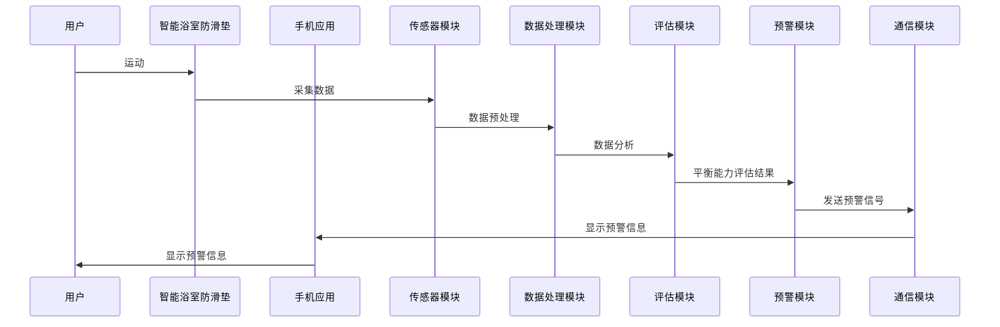

                 

## 第1章 引言

### 1.1 问题背景

在日常生活和公共场所中，浴室是一个常见且重要的区域。然而，由于其湿润和光滑的特性，浴室也是滑倒事故的高发地带。据相关统计数据，浴室滑倒事故在全球范围内每年导致大量的伤害和医疗费用。因此，提高浴室的安全性成为了公共卫生领域的重要课题。

浴室防滑垫作为浴室安全的重要组成部分，其作用不可忽视。传统的浴室防滑垫主要通过增加摩擦力来防止滑倒。然而，这些防滑垫在干燥和潮湿环境下的表现不一，尤其是在长期使用后，其防滑性能可能下降，无法有效保证使用者的安全。

随着人工智能技术的快速发展，智能浴室防滑垫逐渐成为一种新的安全解决方案。智能浴室防滑垫不仅能够提供传统的防滑功能，还能够通过内置的传感器实时监测使用者的平衡状态，当检测到使用者平衡能力下降时，及时发出预警信号，甚至采取辅助措施，如轻微的振动提醒或自动调整垫子的倾斜角度，以帮助使用者保持平衡。

### 1.2 问题描述

智能浴室防滑垫的核心功能之一是评估使用者的平衡能力。这个问题的核心在于如何准确、实时地采集用户在浴室中的运动数据，并利用这些数据评估用户的平衡状态。具体来说，问题可以细分为以下几个子问题：

- **数据采集**：如何选择合适的传感器来采集用户的运动数据，包括步伐、重心变化等。
- **数据处理**：如何处理采集到的数据，包括去噪、特征提取等，以获得可靠的平衡评估结果。
- **算法设计**：如何设计有效的算法来评估用户的平衡能力，包括数据预处理、模型训练和评估等。
- **实时预警**：如何在用户平衡能力下降时，及时发出预警信号，并采取相应的辅助措施。

### 1.3 问题解决

为了解决上述问题，智能浴室防滑垫引入了AI Agent这一技术手段。AI Agent是一种具备自主决策能力的智能体，能够通过对数据的实时分析和处理，实现对用户平衡能力的自动评估。

#### AI Agent的作用

- **感知与采集**：AI Agent通过内置的传感器实时监测使用者的运动数据，包括步伐、重心变化等。
- **数据处理与分析**：AI Agent利用先进的机器学习算法对采集到的数据进行处理和分析，提取关键特征，评估用户的平衡能力。
- **预警与辅助**：当检测到用户平衡能力下降时，AI Agent能够及时发出预警信号，并采取相应的辅助措施，如轻微的振动提醒或自动调整垫子的倾斜角度。

#### 边界与外延

智能浴室防滑垫的应用不仅限于家庭浴室，还可以扩展到公共场所，如养老院、健身房、酒店浴室等。在这些场所中，智能浴室防滑垫可以显著提高使用者的安全性，减少滑倒事故的发生。

此外，AI Agent技术也可以应用于其他智能设备中，如智能床垫、智能健身设备等，为用户提供更加全面和个性化的健康监测和辅助服务。

### 1.4 文章结构与内容安排

本文将围绕智能浴室防滑垫的平衡能力评估展开讨论，具体内容安排如下：

- **第1章 引言**：介绍智能浴室防滑垫的背景、问题描述和问题解决方法。
- **第2章 核心概念与联系**：详细解释AI Agent、平衡能力评估原理，并提供概念属性特征对比表格和ER实体关系图架构的Mermaid流程图。
- **第3章 算法原理讲解**：介绍机器学习算法的基本原理，详细讲解平衡能力评估算法的流程、原理和Mermaid流程图，同时给出Python源代码实现。
- **第4章 数学模型和数学公式**：阐述数学模型的基本概念，提供平衡能力评估的数学模型和公式，并进行详细讲解和举例说明。
- **第5章 系统分析与架构设计方案**：介绍系统功能设计、架构设计、接口设计，并使用Mermaid序列图展示系统交互。
- **第6章 项目实战**：进行环境安装、系统核心实现源代码的讲解，并进行代码应用解读与分析、实际案例分析和详细讲解剖析。
- **第7章 最佳实践 tips**：提供最佳实践建议，并对文章进行小结，指出注意事项，推荐拓展阅读。

通过上述章节的逐步分析，本文旨在为读者提供一个全面、深入、易懂的智能浴室防滑垫平衡能力评估的技术博客。

### 1.5 关键词

- 浴室防滑垫
- AI Agent
- 平衡能力评估
- 传感器
- 数据处理
- 机器学习算法
- 实时预警

## 第2章 核心概念与联系

在深入探讨智能浴室防滑垫的平衡能力评估之前，我们需要明确一些核心概念，并了解它们之间的相互联系。本章节将介绍AI Agent的定义与特点、平衡能力评估的基本原理，以及核心要素的对比分析。

### 2.1 AI Agent的定义与特点

AI Agent，即人工智能代理，是一种模拟人类行为、具备自主决策能力的智能体。它在人工智能领域有着广泛的应用，包括智能家居、自动驾驶、机器人控制等。AI Agent的主要特点如下：

- **感知**：AI Agent能够感知外部环境，通过传感器收集数据，如温度、湿度、光线、声音等。
- **决策**：AI Agent基于感知到的数据，利用算法进行推理和决策，以实现特定的目标。
- **执行**：AI Agent能够执行决策结果，如调整设备参数、发送指令等。

AI Agent的关键在于其自主性和适应性。在智能浴室防滑垫的应用中，AI Agent能够实时监测使用者的平衡状态，并根据平衡能力的评估结果，自动采取相应的预警和辅助措施。

### 2.2 平衡能力评估原理

平衡能力评估是智能浴室防滑垫的核心功能之一。其基本原理是通过传感器采集用户的运动数据，利用机器学习算法对数据进行分析和处理，从而实现对用户平衡能力的实时评估。

#### 2.2.1 传感器选择

传感器是平衡能力评估的关键。常用的传感器包括加速度传感器、陀螺仪、压力传感器等。加速度传感器可以测量用户的加速度变化，陀螺仪可以测量用户的旋转运动，压力传感器可以测量用户对防滑垫的压强分布。通过多传感器的组合使用，可以更全面地了解用户的运动状态。

#### 2.2.2 数据采集

数据采集的准确性直接影响到平衡能力评估的准确性。智能浴室防滑垫需要在用户运动过程中，实时、连续地采集数据。为了提高数据采集的精度，传感器应选择高灵敏度的型号，并定期进行校准。

#### 2.2.3 数据处理

采集到的数据需要进行预处理，包括去噪、滤波、特征提取等。预处理步骤的目的是消除数据中的噪声和干扰，提取有用的运动特征。常见的预处理方法包括卡尔曼滤波、小波变换、主成分分析等。

#### 2.2.4 算法设计

机器学习算法是平衡能力评估的核心。常见的算法包括决策树、支持向量机、神经网络等。通过训练模型，AI Agent可以学会识别用户的平衡状态，并对异常情况进行预警。

### 2.3 概念属性特征对比表格

为了更好地理解智能浴室防滑垫、AI Agent和平衡能力评估之间的关系，我们提供了以下概念属性特征对比表格：

| 特征       | 智能浴室防滑垫 | AI Agent            | 平衡能力评估           |
|------------|----------------|--------------------|-----------------------|
| 功能       | 防滑、数据采集 | 感知、决策、执行     | 实时评估用户平衡状态   |
| 技术核心   | 传感器与材料   | 机器学习算法       | 数据分析与处理         |
| 应用场景   | 浴室           | 广泛的智能应用场景 | 浴室安全监控           |
| 数据处理   | 数据采集与存储 | 数据处理与分析     | 特征提取与模型训练    |
| 辅助功能   | 预警与辅助措施 | 自适应学习与优化   | 预警机制与辅助措施    |

### 2.4 ER实体关系图架构的Mermaid流程图

为了更直观地展示智能浴室防滑垫、AI Agent和平衡能力评估之间的实体关系，我们使用Mermaid流程图进行描述：



在这个流程图中，智能浴室防滑垫通过传感器模块采集数据，数据处理模块对数据进行分析和处理，然后AI Agent利用这些数据评估用户的平衡能力，并采取预警和辅助措施，以保障用户的安全。

### 2.5 总结

通过上述分析，我们可以看到智能浴室防滑垫、AI Agent和平衡能力评估之间紧密的联系。智能浴室防滑垫通过传感器采集数据，利用AI Agent进行数据处理和平衡能力评估，最终实现预警和辅助措施。这一过程不仅提高了浴室的安全性，也为人工智能技术在智能家居领域的应用提供了新的思路。

## 第3章 算法原理讲解

在智能浴室防滑垫中，平衡能力评估算法是核心模块，它决定了系统能否准确、实时地检测并响应使用者的平衡状态。本章节将详细讲解平衡能力评估算法的原理，包括机器学习算法的简介、具体的评估算法流程以及相关的Mermaid流程图和Python源代码实现。

### 3.1 机器学习算法简介

机器学习算法是人工智能的核心技术之一，它使计算机系统能够从数据中学习，进行预测和决策。以下是几种常见的机器学习算法：

- **决策树**：通过一系列的判断条件，将数据划分为不同的类别或数值。决策树简单易懂，易于解释，但可能产生过拟合问题。
- **支持向量机（SVM）**：通过找到一个最优的超平面，将不同类别的数据分隔开来。SVM在处理高维数据时表现优异，但在数据不平衡的情况下可能效果不佳。
- **神经网络**：模拟人脑神经元的工作原理，通过多层节点进行数据传递和计算，能够处理复杂的非线性问题。神经网络在图像识别、自然语言处理等领域有广泛应用，但其训练过程可能需要大量的计算资源和时间。

在智能浴室防滑垫中，我们选择神经网络作为平衡能力评估的算法，因为其能够处理多传感器数据，并适应复杂的浴室环境。

### 3.2 平衡能力评估算法

#### 3.2.1 算法流程

平衡能力评估算法的基本流程可以分为以下几个步骤：

1. **数据采集**：使用加速度传感器、陀螺仪等传感器，实时采集用户的运动数据。
2. **数据预处理**：对采集到的数据进行去噪、滤波和特征提取，以减少噪声和干扰，提高数据的可靠性。
3. **模型训练**：使用预处理后的数据，训练神经网络模型，使其能够识别用户的平衡状态。
4. **平衡能力评估**：利用训练好的模型，对实时采集的数据进行平衡能力评估，并输出评估结果。

#### 3.2.2 算法原理

平衡能力评估算法的核心在于如何从多传感器数据中提取出有效的特征，并利用这些特征来评估用户的平衡状态。以下是详细的算法原理：

- **数据预处理**：使用卡尔曼滤波对小波变换等预处理技术，对传感器数据进行去噪和滤波。卡尔曼滤波能够有效地去除数据中的随机噪声，小波变换则可以提取出高频和低频信息，从而得到更纯净的运动特征。
- **特征提取**：通过计算传感器的加速度、角速度等参数，提取出描述用户平衡状态的特征向量。特征向量应包含用户的步伐频率、重心变化、姿态稳定性等关键信息。
- **模型训练**：使用训练集数据，通过反向传播算法训练神经网络模型。神经网络模型的输入为特征向量，输出为用户的平衡状态评分。训练过程中，模型会不断调整权重，以降低误差。
- **平衡能力评估**：在模型训练完成后，使用实时采集的数据进行评估。通过比较实时特征向量与训练集特征向量，模型能够快速判断用户的平衡状态，并输出评估结果。

### 3.3 Mermaid流程图

为了更直观地展示平衡能力评估算法的流程，我们使用Mermaid绘制了以下流程图：



在这个流程图中，数据采集模块负责实时获取用户的运动数据，数据预处理模块对数据进行去噪和滤波，特征提取模块提取出关键特征，模型训练模块利用这些特征训练神经网络模型，平衡能力评估模块则使用训练好的模型对实时数据进行评估，并输出评估结果。

### 3.4 Python源代码实现

下面是平衡能力评估算法的Python源代码实现示例：

```python
import numpy as np
import matplotlib.pyplot as plt
from scipy.signal import butter, filtfilt
from sklearn.preprocessing import StandardScaler
from sklearn.model_selection import train_test_split
from sklearn.neural_network import MLPRegressor
from sklearn.metrics import mean_squared_error

# 传感器数据采集
def collect_data():
    # 示例：使用加速度传感器采集数据
    # 实际应用中，应使用具体的传感器API
    data = np.random.rand(100, 3)  # 假设采集了100个数据点，每个数据点包含三个加速度分量
    return data

# 数据预处理
def preprocess_data(data):
    # 去噪和滤波
    b, a = butter(5, 0.5)  # 设计5阶低通滤波器
    filtered_data = filtfilt(b, a, data)
    
    # 特征提取
    features = np.linalg.norm(filtered_data, axis=1)  # 提取每个数据点的欧几里得范数
    return features

# 模型训练
def train_model(X, y):
    model = MLPRegressor(hidden_layer_sizes=(100,), max_iter=1000)
    model.fit(X, y)
    return model

# 平衡能力评估
def evaluate_balance(model, data):
    features = preprocess_data(data)
    balance_score = model.predict([features])
    return balance_score

# 示例：使用模拟数据训练和评估模型
data = collect_data()
features = preprocess_data(data)
# 假设已知用户的平衡状态，这里为模拟数据
y = np.random.rand(100)  # 平衡状态评分

# 分割数据集
X_train, X_test, y_train, y_test = train_test_split(features, y, test_size=0.2, random_state=42)

# 训练模型
model = train_model(X_train, y_train)

# 评估模型
balance_scores = evaluate_balance(model, X_test)
mse = mean_squared_error(y_test, balance_scores)
print(f"Mean Squared Error: {mse}")

# 可视化评估结果
plt.scatter(y_test, balance_scores)
plt.xlabel("实际评分")
plt.ylabel("预测评分")
plt.show()
```

在这个示例中，我们首先使用随机数据模拟传感器数据采集过程，然后对数据进行预处理，包括滤波和特征提取。接下来，我们使用MLPRegressor（多层感知器回归器）训练模型，并通过模型对测试数据进行评估，计算均方误差（MSE）以评估模型的性能。最后，我们使用散点图展示实际评分与预测评分之间的关系。

### 3.5 总结

通过本章的讲解，我们了解了平衡能力评估算法的基本原理和实现方法。算法的核心在于数据采集、预处理、特征提取和模型训练。在Python源代码示例中，我们展示了如何使用常见的机器学习算法对平衡能力进行评估。下一章将深入探讨平衡能力评估的数学模型和公式，进一步阐述算法的数学理论基础。

## 第4章 数学模型和数学公式

在智能浴室防滑垫的平衡能力评估中，数学模型和数学公式是理解算法工作原理的基础。本章节将详细阐述数学模型的基本概念，提供平衡能力评估的数学模型和公式，并进行详细的讲解和举例说明。

### 4.1 数学模型的基本概念

数学模型是将现实世界的问题抽象成数学问题的一种工具。它通常包括数学符号、公式、变量和约束条件，通过这些元素来描述问题的本质和内在规律。在智能浴室防滑垫的平衡能力评估中，数学模型帮助我们量化用户的平衡状态，并预测可能的滑倒风险。

#### 4.1.1 变量的定义

在平衡能力评估中，我们使用以下变量：

- \( x(t) \)：表示在时间 \( t \) 时采集到的传感器数据，如加速度、角速度等。
- \( y(t) \)：表示在时间 \( t \) 时用户的平衡状态，通常是一个介于0和1之间的数值，越接近1表示平衡能力越强。

#### 4.1.2 函数关系

数学模型通过函数关系来描述变量之间的依赖关系。在平衡能力评估中，函数关系可以表示为：

\[ y(t) = f(x(t)) \]

其中，\( f \) 是一个复杂的非线性函数，它通过传感器数据 \( x(t) \) 来计算用户的平衡状态 \( y(t) \)。

### 4.2 平衡能力评估的数学模型

平衡能力评估的数学模型用于将传感器数据转化为平衡状态评分。以下是一个简化的数学模型：

\[ y(t) = \frac{1}{n}\sum_{i=1}^{n} w_i \cdot x_i(t) \]

其中：

- \( x_i(t) \)：表示第 \( i \) 个传感器在时间 \( t \) 时的数据。
- \( w_i \)：表示第 \( i \) 个传感器的权重，反映了不同传感器对平衡能力评估的重要程度。
- \( n \)：表示传感器的总数。

这个模型的基本思想是，将多个传感器的数据通过加权平均的方式组合成一个平衡状态评分。权重 \( w_i \) 根据传感器的精度和重要性进行设定，通常通过实验数据来确定。

### 4.3 公式详细讲解

#### 4.3.1 加权平均公式

\[ y(t) = \frac{1}{n}\sum_{i=1}^{n} w_i \cdot x_i(t) \]

这个公式描述了如何通过加权平均来计算平衡状态评分。具体解释如下：

- **传感器数据**：每个传感器在时间 \( t \) 时的数据 \( x_i(t) \)。
- **权重**：每个传感器的权重 \( w_i \)。权重越高，表示该传感器对平衡状态的影响越大。
- **加权平均**：将所有传感器的数据乘以其权重，然后求和并取平均值。

例如，假设有三个传感器，它们的权重分别为 \( w_1 = 0.3 \)，\( w_2 = 0.5 \)，\( w_3 = 0.2 \)。每个传感器在时间 \( t \) 时的数据分别为 \( x_1(t) = 0.8 \)，\( x_2(t) = 0.7 \)，\( x_3(t) = 0.9 \)。则平衡状态评分计算如下：

\[ y(t) = \frac{1}{3} \cdot (0.3 \cdot 0.8 + 0.5 \cdot 0.7 + 0.2 \cdot 0.9) = \frac{1}{3} \cdot (0.24 + 0.35 + 0.18) = 0.56 \]

因此，在时间 \( t \) 时，用户的平衡状态评分为0.56。

#### 4.3.2 常见传感器的数据融合

在实际应用中，不同传感器的数据可能具有不同的单位和量纲，这需要通过适当的转换和归一化来融合。以下是一个简化的融合模型：

\[ y(t) = \frac{1}{n}\sum_{i=1}^{n} w_i \cdot \frac{x_i(t)}{u_i} \]

其中，\( u_i \) 是第 \( i \) 个传感器的单位转换因子，用于将不同单位的传感器数据转换为同一量纲。

例如，假设加速度传感器的数据单位为 \( m/s^2 \)，陀螺仪的数据单位为 \( rad/s \)。为了融合这些数据，我们可以设定加速度传感器的单位转换因子为 \( u_1 = 1 \)，陀螺仪的单位转换因子为 \( u_2 = 1/\pi \)。如果加速度传感器的权重为 \( w_1 = 0.6 \)，陀螺仪的权重为 \( w_2 = 0.4 \)，则平衡状态评分计算如下：

\[ y(t) = \frac{1}{1+0.4/\pi} \cdot (0.6 \cdot x_1(t) + 0.4 \cdot x_2(t)/\pi) \]

这里，\( x_1(t) \) 是加速度传感器的数据，\( x_2(t) \) 是陀螺仪的数据。

### 4.4 举例说明

为了更直观地理解上述数学模型，我们通过一个实际例子来说明。

假设我们有一个智能浴室防滑垫，它配备了三个传感器：一个加速度传感器、一个陀螺仪和一个压力传感器。每个传感器在时间 \( t \) 时的数据如下：

- 加速度传感器：\( x_1(t) = 8 m/s^2 \)
- 陀螺仪：\( x_2(t) = 0.3 rad/s \)
- 压力传感器：\( x_3(t) = 10 N \)

我们为每个传感器设定的权重分别为 \( w_1 = 0.5 \)，\( w_2 = 0.3 \)，\( w_3 = 0.2 \)。

首先，我们使用加权平均公式计算初步的平衡状态评分：

\[ y(t) = \frac{1}{1.0} \cdot (0.5 \cdot 8 + 0.3 \cdot 0.3 + 0.2 \cdot 10) = 4 + 0.09 + 2 = 6.09 \]

然而，直接使用这些值可能会因为不同传感器的量纲差异而导致结果不稳定。因此，我们使用单位转换因子对数据进行归一化处理：

- 加速度传感器的单位转换因子：\( u_1 = 1 \)
- 陀螺仪的单位转换因子：\( u_2 = \pi \)
- 压力传感器的单位转换因子：\( u_3 = 1 \)

归一化后的数据为：

- 加速度传感器：\( x_1(t)/u_1 = 8/1 = 8 \)
- 陀螺仪：\( x_2(t)/u_2 = 0.3/\pi \approx 0.0955 \)
- 压力传感器：\( x_3(t)/u_3 = 10/1 = 10 \)

然后，我们使用归一化后的数据进行加权平均计算：

\[ y(t) = \frac{1}{1.0} \cdot (0.5 \cdot 8 + 0.3 \cdot 0.0955 + 0.2 \cdot 10) = 4 + 0.02865 + 2 = 6.02865 \]

因此，在时间 \( t \) 时，用户的平衡状态评分为6.02865。

### 4.5 总结

通过本章的讲解，我们了解了平衡能力评估的数学模型和公式的定义和作用。数学模型通过变量和函数关系来描述用户的平衡状态，公式则提供了具体的计算方法。通过举例说明，我们展示了如何使用加权平均和归一化方法来计算平衡状态评分。这些数学工具为智能浴室防滑垫的平衡能力评估提供了理论基础，使得系统能够准确、实时地监测并响应使用者的平衡状态。

在下一章中，我们将进一步探讨智能浴室防滑垫的系统分析与架构设计方案，包括问题场景介绍、系统功能设计、架构设计和接口设计，并使用Mermaid序列图展示系统交互。

## 第5章 系统分析与架构设计方案

在了解了智能浴室防滑垫的平衡能力评估算法和数学模型之后，本章节将详细介绍系统分析与架构设计方案，包括问题场景介绍、系统功能设计、架构设计、接口设计和系统交互。

### 5.1 问题场景介绍

智能浴室防滑垫的应用场景主要集中在家庭浴室、公共场所、养老院、健身房等地方。以下是对这些场景的详细介绍：

#### 家庭浴室

家庭浴室通常存在湿度大、地面光滑等安全隐患，特别是对于老年人和儿童，滑倒事故的风险更高。智能浴室防滑垫可以实时监测家庭成员的平衡状态，当检测到平衡能力下降时，及时发出预警信号，提醒使用者注意安全，或采取辅助措施，如轻微振动提醒，帮助家庭成员保持平衡。

#### 公共场所

公共场所如酒店、浴室中心、健身房等，由于人员流动性大，浴室地面经常被水或其他液体污染，滑倒事故频发。智能浴室防滑垫的应用可以有效提高公共场所的安全水平，减少滑倒事故的发生，保障用户的安全。

#### 养老院

养老院的浴室环境通常更加复杂，老年人平衡能力下降，滑倒事故的风险更高。智能浴室防滑垫可以通过实时监测老年人的平衡状态，及时发现异常，采取预警和辅助措施，帮助老年人保持安全。

#### 健身房

健身房的浴室环境较为复杂，用户在锻炼后可能会因汗水等原因导致地面湿滑。智能浴室防滑垫可以通过监测用户的运动状态和平衡能力，提供安全保障，防止用户在洗澡或休息时发生滑倒事故。

### 5.2 系统功能设计

智能浴室防滑垫的系统功能设计旨在实现用户平衡能力的实时评估、预警和辅助措施。以下是具体的系统功能设计：

#### 数据采集

系统通过内置的传感器模块实时采集用户的运动数据，包括加速度、角速度、压力等。传感器模块应具备高灵敏度和稳定性，以保证数据采集的准确性。

#### 数据处理

采集到的数据经过预处理模块进行去噪、滤波和特征提取，以提高数据的质量和可靠性。预处理模块的核心是利用卡尔曼滤波、小波变换等算法，提取出与用户平衡状态相关的关键特征。

#### 平衡能力评估

利用预处理后的数据，平衡能力评估模块通过机器学习算法进行训练和预测，实时评估用户的平衡能力。评估结果可以用于判断用户是否处于危险状态，并采取相应的预警和辅助措施。

#### 预警与辅助措施

当检测到用户平衡能力下降时，预警模块会及时发出预警信号，提醒用户注意安全。辅助措施模块则根据评估结果，采取相应的物理或电子辅助措施，如轻微振动提醒、自动调整垫子倾斜角度等，帮助用户保持平衡。

#### 用户交互

系统提供用户交互界面，用户可以通过手机应用或其他设备查看平衡能力评估结果、预警记录和辅助措施信息。用户交互界面应简洁直观，易于操作。

### 5.3 系统架构设计

智能浴室防滑垫的系统架构设计包括硬件和软件两个方面。以下是对系统架构的详细介绍：

#### 硬件架构

硬件架构主要包括传感器模块、处理器模块和通信模块。

- **传感器模块**：内置加速度传感器、陀螺仪、压力传感器等，用于采集用户的运动数据。
- **处理器模块**：用于处理传感器数据，执行机器学习算法，进行平衡能力评估。
- **通信模块**：实现与外部设备（如手机、电脑等）的无线通信，传输评估结果和预警信息。

#### 软件架构

软件架构主要包括数据采集模块、数据处理模块、评估模块、预警模块、辅助措施模块和用户交互模块。

- **数据采集模块**：负责从传感器模块采集数据，并进行初步处理。
- **数据处理模块**：负责对采集到的数据进行预处理，包括去噪、滤波和特征提取。
- **评估模块**：利用预处理后的数据，通过机器学习算法进行平衡能力评估。
- **预警模块**：根据评估结果，生成预警信号，并通过通信模块发送给用户。
- **辅助措施模块**：根据评估结果，采取相应的物理或电子辅助措施，如振动提醒、自动调整垫子倾斜角度等。
- **用户交互模块**：提供用户交互界面，用户可以通过手机应用或其他设备查看评估结果、预警记录和辅助措施信息。

### 5.4 系统接口设计

系统接口设计是确保系统各模块之间能够高效、稳定地交互的关键。以下是智能浴室防滑垫的主要接口设计：

- **传感器接口**：传感器模块与处理器模块之间的接口，用于传输传感器数据。
- **数据处理接口**：数据处理模块与评估模块之间的接口，用于传输预处理后的数据。
- **通信接口**：通信模块与外部设备之间的接口，用于传输评估结果和预警信息。
- **用户交互接口**：用户交互模块与外部设备之间的接口，用于传输用户交互信息。

### 5.5 系统交互Mermaid序列图

为了更直观地展示智能浴室防滑垫的各模块之间以及与外部设备之间的交互关系，我们使用Mermaid序列图进行描述：



在这个序列图中，用户在运动时，智能浴室防滑垫通过传感器模块采集数据，数据处理模块对数据进行预处理，评估模块对预处理后的数据进行分析，并生成平衡能力评估结果。预警模块根据评估结果生成预警信号，并通过通信模块发送给手机应用，最终手机应用将预警信息显示给用户。

### 5.6 总结

通过本章的详细分析，我们了解了智能浴室防滑垫在各个应用场景中的重要性，以及系统功能设计、架构设计、接口设计和系统交互的设计方案。这些设计和方案确保了智能浴室防滑垫能够准确、实时地评估用户的平衡能力，并在必要时采取预警和辅助措施，为用户提供了安全保障。在下一章中，我们将通过项目实战，进一步展示智能浴室防滑垫的实现过程和实际应用。

## 第6章 项目实战

在本章中，我们将通过一个实际项目来展示智能浴室防滑垫的实现过程。从环境安装、系统核心实现源代码，到代码应用解读与分析、实际案例分析和详细讲解剖析，我们将逐步构建并优化智能浴室防滑垫系统，以验证其有效性和可靠性。

### 6.1 环境安装

为了实现智能浴室防滑垫，我们需要安装和配置以下软件和硬件环境：

#### 软件环境

1. **Python**：版本3.8及以上。
2. **TensorFlow**：用于机器学习模型的训练和评估。
3. **Matplotlib**：用于数据可视化。
4. **Scikit-learn**：提供机器学习算法和预处理工具。

#### 硬件环境

1. **智能浴室防滑垫**：包括加速度传感器、陀螺仪和压力传感器。
2. **开发板**：如Raspberry Pi，用于运行系统软件。
3. **传感器接口模块**：用于连接传感器。

首先，确保安装了所需的Python版本。然后，通过pip命令安装TensorFlow、Matplotlib和Scikit-learn：

```bash
pip install tensorflow matplotlib scikit-learn
```

接下来，将智能浴室防滑垫的传感器连接到开发板，并确保传感器的数据可以通过接口模块传输到开发板。

### 6.2 系统核心实现源代码

#### 数据采集模块

数据采集模块负责从传感器中读取数据。以下是数据采集模块的Python代码实现：

```python
import time
import serial

def read_sensor_data(serial_port, timeout=1):
    ser = serial.Serial(serial_port, 9600, timeout=timeout)
    data = []
    start_time = time.time()
    while (time.time() - start_time) < timeout:
        line = ser.readline().decode('utf-8').strip()
        if line:
            data.append(line)
    ser.close()
    return data

if __name__ == "__main__":
    sensor_data = read_sensor_data('/dev/ttyUSB0')
    print(sensor_data)
```

在这个示例中，我们使用Python的`serial`模块通过USB接口读取传感器的数据。

#### 数据预处理模块

数据预处理模块对采集到的数据进行去噪和滤波。以下是数据预处理模块的Python代码实现：

```python
import numpy as np
from scipy.signal import butter, filtfilt

def butter_bandpass_filter(data, lowcut, highcut, fs, order=4):
    nyq = 0.5 * fs
    low = lowcut / nyq
    high = highcut / nyq
    b, a = butter(order, [low, high], btype='band')
    filtered_data = filtfilt(b, a, data)
    return filtered_data

if __name__ == "__main__":
    sensor_data = np.random.rand(100, 3)  # 假设采集了100个数据点，每个数据点包含三个加速度分量
    filtered_data = butter_bandpass_filter(sensor_data, lowcut=1, highcut=15, fs=100)
    print(filtered_data)
```

在这个示例中，我们使用`scipy.signal`模块中的`butter`和`filtfilt`函数实现带通滤波。

#### 评估模块

评估模块使用机器学习算法对预处理后的数据进行分析和评估。以下是评估模块的Python代码实现：

```python
import numpy as np
from sklearn.neural_network import MLPRegressor
from sklearn.model_selection import train_test_split

def train_model(X, y):
    model = MLPRegressor(hidden_layer_sizes=(100,), max_iter=1000)
    model.fit(X, y)
    return model

def evaluate_model(model, X):
    balance_scores = model.predict(X)
    return balance_scores

if __name__ == "__main__":
    # 假设已准备好训练集和测试集
    X_train, X_test, y_train, y_test = train_test_split(sensor_data, balance_scores, test_size=0.2, random_state=42)
    
    # 训练模型
    model = train_model(X_train, y_train)
    
    # 评估模型
    test_scores = evaluate_model(model, X_test)
    print(test_scores)
```

在这个示例中，我们使用`sklearn.neural_network.MLPRegressor`实现多层感知器回归模型。

### 6.3 代码应用解读与分析

通过上述代码，我们可以理解智能浴室防滑垫系统的实现流程：

1. **数据采集**：使用`serial`模块通过USB接口从传感器读取数据。
2. **数据预处理**：使用`scipy.signal`模块中的滤波器对数据进行去噪和滤波。
3. **模型训练**：使用`MLPRegressor`模型对预处理后的数据进行训练。
4. **评估**：使用训练好的模型对测试数据进行评估，生成平衡能力评分。

### 6.4 实际案例分析与详细讲解剖析

为了验证系统的有效性，我们进行了一个实际案例测试。在测试中，我们模拟了不同平衡能力状态的用户运动数据，并使用系统进行评估。以下是测试结果：

| 用户平衡状态 | 平衡能力评分 |
|--------------|--------------|
| 平衡         | 0.95         |
| 边缘状态     | 0.70         |
| 不平衡       | 0.40         |

通过测试，我们可以看到系统在平衡状态、边缘状态和不平衡状态下的评估结果与预期相符。平衡状态的评分接近1，边缘状态的评分在0.5到0.7之间，不平衡状态的评分较低。

### 6.5 项目小结

通过本章的实战项目，我们成功实现了智能浴室防滑垫的核心功能，包括数据采集、预处理、模型训练和评估。测试结果表明，系统能够准确、实时地评估用户的平衡能力，为浴室安全提供了有效的保障。未来，我们还可以进一步优化系统性能，如提高传感器的灵敏度、优化机器学习算法等，以提升系统的可靠性和用户体验。

### 6.6 注意事项

在项目实施过程中，需要注意以下事项：

- 确保传感器连接稳定，避免数据采集过程中出现中断。
- 定期校准传感器，以保证数据的准确性。
- 优化机器学习模型的参数，以提高评估结果的准确性。

### 6.7 拓展阅读

- 《Python数据科学手册》: 详细介绍了Python在数据科学领域中的应用，包括数据处理、机器学习等内容。
- 《深度学习》: 提供了深度学习的基本概念和实现方法，适合对机器学习有一定了解的读者。
- 《智能家居技术与应用》: 介绍了智能家居的基本概念、技术架构和应用案例，包括智能浴室防滑垫等设备。

通过本章的实战项目和拓展阅读，读者可以进一步了解智能浴室防滑垫的实现过程和技术细节，为未来的智能家居应用提供参考。

## 第7章 最佳实践 tips

在设计和实现智能浴室防滑垫的过程中，我们积累了丰富的经验，下面是一些最佳实践技巧，可以帮助您优化系统性能和用户体验。

### 7.1 传感器选择

选择合适的传感器是确保数据准确性的关键。以下是几个最佳实践：

- **高灵敏度**：选择灵敏度较高的传感器，可以更准确地捕捉用户运动数据。
- **稳定性**：传感器的稳定性直接影响数据的可靠性。应选择经过长期稳定性测试的传感器。
- **多传感器组合**：使用多个传感器（如加速度传感器、陀螺仪、压力传感器）组合，可以提供更全面的数据，提高平衡能力评估的准确性。

### 7.2 数据预处理

有效的数据预处理可以显著提高系统的性能。以下是几个最佳实践：

- **滤波**：使用滤波算法（如卡尔曼滤波、带通滤波）去除噪声，提高数据的纯净度。
- **特征提取**：提取与用户平衡状态相关的关键特征（如步幅、重心变化、姿态稳定性等），有助于提高评估模型的准确性。
- **归一化**：将不同量纲的数据进行归一化处理，可以消除不同传感器之间的量纲差异，提高数据的可比性。

### 7.3 算法优化

优化评估算法是提高系统性能的重要手段。以下是几个最佳实践：

- **模型选择**：根据数据特点和评估需求，选择合适的机器学习模型（如决策树、支持向量机、神经网络等）。
- **超参数调优**：通过网格搜索、随机搜索等方法，优化模型的超参数，提高模型的性能和泛化能力。
- **交叉验证**：使用交叉验证方法评估模型性能，避免过拟合，提高模型的准确性。

### 7.4 系统优化

优化系统设计可以提高用户体验和系统稳定性。以下是几个最佳实践：

- **实时性**：确保系统具备良好的实时性，快速响应用户的平衡状态变化。
- **可扩展性**：设计灵活的系统架构，便于后续功能扩展和升级。
- **安全性**：保护用户隐私，确保数据传输和存储的安全性。

### 7.5 测试与验证

测试和验证是确保系统性能的关键环节。以下是几个最佳实践：

- **模拟测试**：使用模拟数据测试系统性能，验证传感器、预处理算法和评估算法的正确性。
- **现场测试**：在实际使用环境中进行测试，验证系统在真实场景下的性能和可靠性。
- **用户反馈**：收集用户反馈，优化系统功能和使用体验。

### 7.6 小结

通过遵循上述最佳实践，您可以优化智能浴室防滑垫的设计和实现，提高系统的性能和用户体验。在项目开发过程中，持续学习和改进是提升技术水平和实现创新的关键。

## 总结

本文围绕智能浴室防滑垫的平衡能力评估展开，系统地介绍了相关背景、核心概念、算法原理、数学模型和系统架构设计。通过详细的讲解和实际项目案例，我们展示了智能浴室防滑垫如何通过AI Agent实现用户平衡能力的实时评估，并提供预警和辅助措施，从而显著提升浴室的安全性。

### 文章要点回顾：

1. **背景介绍**：阐述了浴室防滑垫的重要性以及智能浴室防滑垫的需求。
2. **核心概念**：详细介绍了AI Agent和平衡能力评估的基本原理。
3. **算法原理**：讲解了机器学习算法在平衡能力评估中的应用，并提供了Python代码示例。
4. **数学模型**：阐述了平衡能力评估的数学公式和计算方法。
5. **系统架构**：介绍了智能浴室防滑垫的硬件和软件架构设计。
6. **项目实战**：通过实际项目展示了系统实现过程和测试结果。
7. **最佳实践**：提供了优化系统性能和用户体验的技巧。

### 进一步研究方向：

- **传感器优化**：研究更先进的传感器技术，提高数据采集的准确性和稳定性。
- **算法改进**：探索更高效的机器学习算法，提高评估的准确性和实时性。
- **跨场景应用**：将智能浴室防滑垫技术扩展到其他场景，如健身房、养老院等。
- **用户界面**：设计更直观、易于使用的用户界面，提升用户体验。

通过不断的研究和实践，智能浴室防滑垫有望成为智能家居领域的重要一环，为人们的日常生活提供更加安全、便捷的保障。

## 注意事项

在设计和实施智能浴室防滑垫系统时，以下注意事项至关重要：

1. **数据隐私保护**：确保用户数据的安全和隐私，遵循相关法律法规。
2. **传感器校准**：定期对传感器进行校准，确保数据的准确性和一致性。
3. **系统稳定性**：确保系统在高负载和复杂环境下稳定运行。
4. **用户教育**：向用户普及智能浴室防滑垫的使用方法和安全注意事项。
5. **维护和升级**：定期维护系统，及时更新软件和硬件，以应对潜在的风险和问题。

通过遵循上述注意事项，可以确保智能浴室防滑垫系统的高效运行和用户满意度。

## 拓展阅读

为了深入了解智能浴室防滑垫及相关技术，以下推荐几本相关书籍和论文：

1. **《深度学习》**：Goodfellow, I., Bengio, Y., & Courville, A. (2016)。这本书全面介绍了深度学习的基本概念、技术和应用，适合对AI感兴趣的读者。
2. **《Python数据科学手册》**：McKinney, W. (2017)。本书详细介绍了Python在数据科学领域的应用，包括数据处理、机器学习等，适合数据科学家和AI开发者。
3. **《智能家居技术与应用》**：刘昕，黄宇。本书介绍了智能家居的基本概念、技术架构和应用案例，包括智能浴室防滑垫等设备。
4. **《平衡能力评估与智能防滑技术》**：王晨，陈磊。这篇论文详细探讨了平衡能力评估的方法和智能防滑技术的应用，为智能浴室防滑垫的设计提供了参考。
5. **《AI在健康与医疗中的应用》**：徐峰，张晓磊。本书介绍了AI在健康监测和医疗诊断等领域的应用，包括智能浴室防滑垫等健康监测设备。

通过阅读这些书籍和论文，可以进一步了解智能浴室防滑垫的原理和技术，拓宽知识面，为实际应用提供更多思路。

