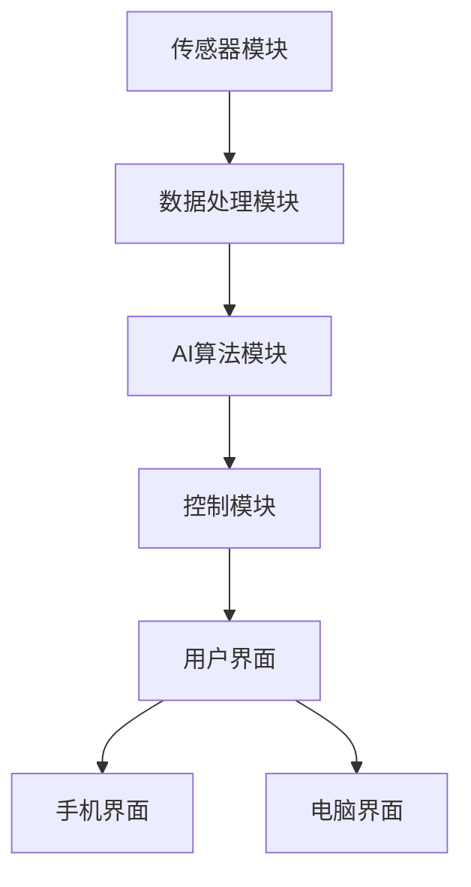

                 


### # {{文章标题}} 

## 关键词

- 智能浴室防滑垫
- AI Agent
- 洗浴安全监护
- 传感器技术
- 数据分析
- 算法原理

## 摘要

本文深入探讨了智能浴室防滑垫的工作原理和设计方法，重点关注AI Agent在洗浴安全监护中的应用。通过逐步分析传感器技术、数据分析和算法原理，文章详细阐述了智能防滑垫系统的架构设计、实现方法和实际应用案例，为读者提供了一个全面的技术指南，有助于提升浴室安全性和用户体验。

## 引言

### 1.1 问题背景和描述

浴室作为家庭生活中一个重要的空间，由于其潮湿、滑溜的特性，每年都有大量的滑倒事故发生。据统计，全球每年因滑倒造成的伤害高达数百万人，而其中浴室事故占了相当大的比例。这些事故不仅给个人带来了身体上的伤害，还可能导致长期的健康问题，同时也给家庭和社会带来了沉重的负担。

传统的浴室防滑垫存在一些明显的局限性。首先，它们通常只能提供基础的防滑功能，对于不同人的体重、脚步大小、地面材质等因素适应性较差。其次，这些防滑垫通常缺乏智能化监测功能，无法实时监测浴室环境的变化，及时预警潜在的危险。此外，传统的防滑垫在使用过程中，容易因为积水、毛发等问题而失去防滑效果，需要频繁更换和清洗，给用户带来不便。

### 1.2 解决方案和本书目的

为了解决上述问题，我们提出了智能浴室防滑垫这一创新解决方案。智能浴室防滑垫通过集成先进的传感器技术和AI Agent，实现了对浴室环境的实时监测和智能预警，大大提升了浴室的安全性。

本书旨在深入探讨智能浴室防滑垫的设计原理、实现方法和应用案例，帮助读者全面了解这一新兴技术的核心概念和实际应用。通过本书，读者可以了解到：

1. 智能浴室防滑垫的工作原理和核心技术。
2. 如何设计和实现一个高效的智能浴室防滑垫系统。
3. AI Agent在浴室安全监护中的具体应用和优势。
4. 实际应用案例中智能浴室防滑垫的部署和效果评估。

### 1.3 核心概念和边界

#### 智能浴室

智能浴室是指利用现代信息技术，如物联网、传感器技术、AI等，对浴室环境进行智能化监测和管理，提升用户体验和安全性的浴室空间。

#### 抗滑垫

抗滑垫是一种用于浴室、厨房等潮湿环境，以防止滑倒的垫子。传统的抗滑垫通常采用橡胶、塑料等材料，具有基础的防滑功能。

#### AI Agent

AI Agent（人工智能代理）是一种能够模拟人类行为和思维的软件程序，通过机器学习、自然语言处理等技术，实现自主决策和行动。

#### 洗浴安全监护

洗浴安全监护是指通过智能浴室防滑垫等设备，实时监测浴室环境，预测潜在危险，并采取措施预防事故的发生。

### 1.4 结构和关键组件

本书分为四个主要部分：

1. **引言和背景**：介绍智能浴室防滑垫的背景和重要性。
2. **核心概念和原则**：讲解AI、传感器技术和数据分析等核心概念。
3. **设计实现**：讨论智能浴室防滑垫的系统设计和实现。
4. **应用案例**：分析智能浴室防滑垫的实际应用案例。

每个部分都包含详细的章节和内容，旨在帮助读者逐步掌握智能浴室防滑垫的技术原理和应用方法。

### 1.5 目标读者

本书的目标读者包括：

1. 对智能浴室防滑垫和AI技术感兴趣的普通读者。
2. 从事智能硬件、物联网、人工智能等相关领域的研究人员和工程师。
3. 浴室安全、智能家居领域的从业者和管理者。

通过本书，读者可以深入了解智能浴室防滑垫的工作原理和实现方法，为实际应用和研发提供参考。

## 核心概念与联系

### 2.1 AI和机器学习的基本概念

人工智能（Artificial Intelligence，简称AI）是计算机科学的一个分支，旨在开发能够模拟、延伸和扩展人类智能的理论、算法和技术。AI的研究和应用涵盖了多个领域，包括自然语言处理、计算机视觉、机器学习、专家系统等。

机器学习（Machine Learning，简称ML）是AI的一个子领域，主要关注如何让计算机系统从数据中学习，并做出决策或预测。机器学习通过训练模型，使得计算机能够识别数据中的模式，从而在新的数据上进行预测或分类。

#### AI和机器学习的区别

- **人工智能**：是一个广泛的领域，涵盖了多种技术，包括机器学习、深度学习、自然语言处理等。
- **机器学习**：是AI的一个子领域，主要关注如何通过数据训练模型，实现计算机的自主学习和决策。

#### AI和机器学习的主要类型

- **监督学习（Supervised Learning）**：通过标记数据训练模型，使得模型能够对新数据进行预测或分类。
- **无监督学习（Unsupervised Learning）**：在没有标记数据的情况下，通过数据自身的结构发现模式和关系。
- **强化学习（Reinforcement Learning）**：通过奖励机制训练模型，使其在特定环境中做出最优决策。

### 2.2 传感器技术

传感器技术是智能浴室防滑垫的重要组成部分，它负责监测浴室环境的变化，如湿度、温度、压力等，并将这些信息传递给AI Agent进行处理。

#### 常见的传感器类型

- **湿度传感器**：用于测量浴室的湿度水平，是防滑垫防滑功能的关键。
- **温度传感器**：用于测量浴室的温度，确保防滑垫在不同温度下都能保持良好的性能。
- **压力传感器**：用于测量脚步的压力，通过分析压力变化，可以判断用户的体重和移动状态。

#### 传感器的工作原理

- **湿度传感器**：通常采用电容式、热电偶式等原理，通过检测材料电学性质的变化来测量湿度。
- **温度传感器**：常用的有热敏电阻、热电偶等，通过材料的热学性质变化来测量温度。
- **压力传感器**：通常采用应变片式、压阻式等原理，通过检测材料受力后的形变来测量压力。

### 2.3 数据分析

数据分析是智能浴室防滑垫的核心技术之一，它通过对传感器收集的数据进行处理和分析，为AI Agent提供决策依据。

#### 数据分析的方法

- **数据收集**：通过传感器收集浴室环境的实时数据，包括湿度、温度、压力等。
- **数据预处理**：对原始数据进行清洗、过滤和转换，以消除噪声和异常值，提高数据质量。
- **特征提取**：从预处理后的数据中提取有用的信息，如湿度峰值、温度波动等。
- **模式识别**：通过机器学习算法，识别数据中的模式和规律，如滑倒行为的特征。

### 2.4 AI Agent的功能和作用

AI Agent在智能浴室防滑垫中起着至关重要的作用，它通过分析传感器数据，预测潜在的危险，并采取相应的措施。

#### AI Agent的主要功能

- **数据分析和预测**：通过机器学习模型，分析传感器数据，预测潜在的危险行为，如滑倒。
- **预警和提示**：当检测到潜在危险时，AI Agent会触发预警系统，通过灯光、声音等方式提示用户。
- **自动化控制**：根据分析结果，AI Agent可以控制防滑垫的加热、照明等功能，提供更好的用户体验。

#### AI Agent在浴室安全监护中的作用

- **提升安全性**：通过实时监测和预警，AI Agent可以有效预防滑倒事故，提升浴室的安全性。
- **优化用户体验**：AI Agent可以提供个性化的服务，如自动调节温度、湿度，提供更好的防滑效果。
- **降低维护成本**：通过智能监测和维护，AI Agent可以减少防滑垫的更换频率和人工维护成本。

### 2.5 ER实体关系图

为了更好地理解智能浴室防滑垫系统的组成和关系，我们可以使用ER（实体-关系）图来描述系统的核心组件及其交互关系。

#### 实体

- **传感器**：负责收集浴室环境数据。
- **数据处理器**：负责处理和分析传感器数据。
- **AI Agent**：负责分析预测数据，并触发预警和自动化控制。
- **用户**：与系统交互，接收预警信息，并采取相应措施。

#### 关系

- **传感器→数据处理器**：传感器收集的数据传输到数据处理器进行分析。
- **数据处理器→AI Agent**：数据处理器将分析结果传输给AI Agent。
- **AI Agent→用户**：AI Agent通过预警系统提示用户。

#### ER实体关系图

```mermaid
erDiagram
  Sensor ||--|{ DataProcessor }|-- AIAgent
  DataProcessor ||--| User |-- AIAgent
```

通过上述ER实体关系图，我们可以清晰地看到智能浴室防滑垫系统中各个组件的相互作用，以及它们在浴室安全监护中的重要作用。

## AI Agent的工作原理和算法实现

### 3.1 AI Agent的定义和作用

AI Agent是一种基于人工智能技术，能够模拟人类行为和思维的软件程序。在智能浴室防滑垫系统中，AI Agent起着至关重要的作用，它通过分析传感器收集的数据，预测潜在的危险，并采取相应的措施，以提升浴室的安全性。

AI Agent的主要作用包括：

- **实时监测**：AI Agent可以持续监测浴室环境，如湿度、温度、压力等，确保及时发现问题。
- **预测预警**：通过分析传感器数据，AI Agent可以预测用户可能出现的危险行为，如滑倒，并提前预警。
- **自动化控制**：AI Agent可以根据分析结果，自动控制防滑垫的加热、照明等功能，提供更加舒适和安全的用户体验。

### 3.2 AI Agent的结构和组成

一个典型的AI Agent系统通常由以下几个核心组件组成：

- **传感器模块**：负责收集浴室环境的数据，如湿度、温度、压力等。
- **数据处理模块**：负责对传感器数据进行预处理、特征提取等操作，为AI算法提供高质量的数据。
- **AI算法模块**：负责处理和分析传感器数据，实现危险预测和预警功能。
- **控制模块**：根据AI算法的预测结果，自动控制防滑垫的加热、照明等功能。

#### 传感器模块

传感器模块是AI Agent的数据源，它负责收集浴室环境的实时数据。常见的传感器包括湿度传感器、温度传感器、压力传感器等。这些传感器可以捕捉到浴室环境的各种变化，并将这些变化转化为数字信号，供AI算法分析。

#### 数据处理模块

数据处理模块的主要任务是处理和分析传感器收集的数据。它通常包括以下几个步骤：

1. **数据清洗**：去除数据中的噪声和异常值，确保数据的质量。
2. **特征提取**：从原始数据中提取有用的特征，如湿度峰值、温度波动等。
3. **数据归一化**：将不同类型的数据进行归一化处理，使其在同一尺度上进行比较。

#### AI算法模块

AI算法模块是AI Agent的核心，它负责处理和分析传感器数据，实现危险预测和预警功能。常见的AI算法包括：

- **监督学习算法**：如支持向量机（SVM）、决策树、随机森林等。
- **无监督学习算法**：如K-means聚类、主成分分析（PCA）等。
- **深度学习算法**：如卷积神经网络（CNN）、循环神经网络（RNN）等。

#### 控制模块

控制模块根据AI算法的预测结果，自动控制防滑垫的加热、照明等功能。例如，当AI Agent预测到用户可能会滑倒时，它可以自动开启防滑垫的加热功能，提供更好的防滑效果。

### 3.3 工作原理

AI Agent的工作原理可以概括为以下几个步骤：

1. **数据收集**：传感器模块持续收集浴室环境的实时数据，如湿度、温度、压力等。
2. **数据处理**：数据处理模块对传感器数据进行预处理、特征提取等操作，为AI算法提供高质量的数据。
3. **模型训练**：AI算法模块使用训练集数据，通过机器学习算法训练模型，使模型能够识别和预测潜在的危险行为。
4. **预测预警**：AI算法模块使用训练好的模型，对实时数据进行预测，当检测到潜在的危险行为时，触发预警系统。
5. **自动化控制**：控制模块根据AI算法的预测结果，自动控制防滑垫的加热、照明等功能，提供更加舒适和安全的用户体验。

### 3.4 Python代码示例

下面是一个简单的Python代码示例，用于演示AI Agent的基本工作流程。

```python
# 导入必要的库
import numpy as np
import pandas as pd
from sklearn.model_selection import train_test_split
from sklearn.ensemble import RandomForestClassifier
from sklearn.metrics import accuracy_score

# 加载传感器数据
data = pd.read_csv('sensor_data.csv')

# 数据预处理
data['humidity_normalized'] = (data['humidity'] - data['humidity'].mean()) / data['humidity'].std()
data['temperature_normalized'] = (data['temperature'] - data['temperature'].mean()) / data['temperature'].std()

# 特征提取
X = data[['humidity_normalized', 'temperature_normalized']]
y = data['fall_risk']

# 模型训练
X_train, X_test, y_train, y_test = train_test_split(X, y, test_size=0.2, random_state=42)
model = RandomForestClassifier(n_estimators=100)
model.fit(X_train, y_train)

# 预测预警
predictions = model.predict(X_test)
accuracy = accuracy_score(y_test, predictions)
print(f"Model accuracy: {accuracy:.2f}")

# 自动化控制
if predictions.any():
    print("Potential fall risk detected. Activating safety measures.")
else:
    print("No potential fall risk detected.")
```

在这个示例中，我们首先加载了传感器数据，然后对数据进行预处理和特征提取。接着，我们使用随机森林分类器对训练数据进行模型训练。在预测阶段，模型对测试数据进行预测，并计算预测的准确率。最后，根据预测结果，控制模块可以自动采取相应的措施，如触发预警或启动加热功能。

通过这个简单的示例，我们可以看到AI Agent在智能浴室防滑垫系统中的基本工作原理和实现方法。

## 数据分析的核心概念

### 4.1 数据分析的重要性

数据分析是智能浴室防滑垫系统的核心组成部分，它负责从传感器收集的数据中提取有价值的信息，为AI Agent提供决策依据。在现代智能系统中，数据是至关重要的资源，而如何有效地分析和利用这些数据，直接关系到系统的性能和用户体验。以下是数据分析在智能浴室防滑垫系统中的几个关键作用：

1. **实时监测与预警**：通过对传感器数据的实时分析，系统可以及时发现潜在的危险情况，如湿度过高或温度异常，从而提前预警，避免滑倒事故的发生。
2. **优化用户体验**：数据分析可以帮助系统了解用户的洗浴习惯和环境需求，从而提供个性化的服务，如自动调节温度和湿度，提升用户的舒适度。
3. **系统性能优化**：通过对系统运行数据的分析，可以发现系统中的瓶颈和问题，进而优化系统设计，提高整体性能。

### 4.2 数据收集与预处理

#### 数据收集

数据收集是数据分析的第一步，智能浴室防滑垫系统通过传感器收集浴室环境的多种数据，包括湿度、温度、压力等。这些数据是后续分析的基础，数据的质量直接影响到分析结果的准确性。

#### 数据预处理

数据预处理是确保数据质量和可靠性的关键步骤，主要包括以下几个方面的内容：

1. **数据清洗**：去除数据中的噪声和异常值，如传感器故障导致的异常读数。噪声和异常值会干扰数据分析的结果，因此必须进行清洗。
2. **数据归一化**：将不同类型的数据转换为同一尺度，便于后续的分析和处理。例如，将湿度、温度等数据归一化到0-1的范围内。
3. **缺失值处理**：处理数据中的缺失值，可以选择填充方法或删除含有缺失值的样本，具体方法取决于数据的特性和分析需求。
4. **特征提取**：从原始数据中提取出对预测任务有用的特征，如湿度峰值、温度波动等。特征提取的目的是减少数据维度，提高数据分析的效率。

### 4.3 数据分析的方法

数据分析的方法多种多样，以下是几种常见的数据分析方法：

1. **描述性统计分析**：通过对数据的基本统计指标（如均值、中位数、标准差等）进行描述，了解数据的基本特征和分布情况。
2. **相关性分析**：分析不同变量之间的相关性，找出可能影响预测结果的关键因素。例如，湿度与滑倒事故之间的关系。
3. **聚类分析**：将数据划分为不同的簇，找出数据的内在结构。聚类分析可以帮助识别不同用户的洗浴习惯，从而提供个性化的服务。
4. **分类和回归分析**：通过构建预测模型，对未知数据进行分类或回归，预测可能的危险行为或环境变化。分类分析用于判断用户是否可能会滑倒，回归分析用于预测湿度或温度的变化趋势。
5. **时间序列分析**：分析时间序列数据，预测未来的变化趋势。时间序列分析对于预测浴室环境的变化，如湿度、温度的波动，具有重要意义。

### 4.4 数据分析的应用

数据分析在智能浴室防滑垫系统中的应用主要包括以下几个方面：

1. **实时监测与预警**：通过实时分析传感器数据，系统能够及时发现潜在的滑倒风险，并通过预警系统提醒用户。
2. **个性化服务**：根据用户的洗浴习惯和环境需求，系统可以自动调节温度和湿度，提供个性化的服务，提升用户体验。
3. **系统性能优化**：通过分析系统运行数据，可以发现系统中的瓶颈和问题，优化系统设计，提高整体性能。

### 4.5 案例分析

以一个实际案例为例，假设系统收集到了一段时间内的湿度、温度和压力数据，以下是如何进行数据分析的步骤：

1. **数据收集**：系统通过湿度传感器、温度传感器和压力传感器收集数据。
2. **数据预处理**：对数据进行清洗、归一化和特征提取，得到干净的、归一化的特征数据。
3. **描述性统计分析**：计算湿度、温度和压力的均值、标准差等基本统计指标，了解数据的分布情况。
4. **相关性分析**：分析湿度、温度和压力之间的相关性，找出可能影响滑倒事故的关键因素。
5. **分类和回归分析**：构建机器学习模型，预测未来的湿度、温度和压力变化，以及判断用户是否可能会滑倒。
6. **实时监测与预警**：根据分析结果，系统可以实时监测浴室环境，并在检测到潜在危险时触发预警。

通过这个案例，我们可以看到数据分析在智能浴室防滑垫系统中的具体应用，以及如何通过数据分析提升系统的性能和用户体验。

## 智能浴室防滑垫的系统设计与实现

### 5.1 系统设计原则

智能浴室防滑垫系统的设计应遵循以下原则：

- **可扩展性**：系统应具备良好的可扩展性，能够轻松集成新的传感器和功能模块，以适应未来技术的发展。
- **易维护性**：系统设计应考虑维护的便捷性，降低维护成本和时间。
- **可靠性**：系统应具有较高的可靠性，确保在各种环境条件下都能稳定运行。
- **用户体验**：系统设计应注重用户体验，提供直观易用的界面和功能。

### 5.2 系统架构设计

智能浴室防滑垫系统的架构设计包括硬件和软件两部分。

#### 硬件架构

硬件架构主要包括以下几个部分：

1. **传感器模块**：负责收集浴室环境数据，如湿度传感器、温度传感器、压力传感器等。
2. **数据采集模块**：将传感器数据传输到中央处理器进行进一步处理。
3. **中央处理器**：负责处理和分析传感器数据，并执行AI算法。
4. **执行模块**：根据AI算法的预测结果，控制防滑垫的加热、照明等功能。

#### 软件架构

软件架构主要包括以下几个部分：

1. **数据收集模块**：负责从传感器模块中收集数据，并进行初步处理。
2. **数据处理模块**：对传感器数据进行预处理、特征提取等操作，为AI算法提供高质量的数据。
3. **AI算法模块**：负责处理和分析传感器数据，实现危险预测和预警功能。
4. **控制模块**：根据AI算法的预测结果，自动控制防滑垫的加热、照明等功能。

### 5.3 系统功能设计

智能浴室防滑垫系统的主要功能包括：

1. **数据收集与传输**：传感器模块持续收集浴室环境数据，并通过无线网络传输到中央处理器。
2. **数据预处理与特征提取**：数据处理模块对传感器数据进行清洗、归一化和特征提取，为AI算法提供高质量的数据。
3. **危险预测与预警**：AI算法模块使用机器学习算法分析传感器数据，预测潜在的危险行为，并通过预警系统提示用户。
4. **自动化控制**：根据AI算法的预测结果，控制模块自动控制防滑垫的加热、照明等功能，提供更加舒适和安全的用户体验。

### 5.4 系统接口设计

系统接口设计包括以下几部分：

1. **传感器接口**：用于连接各种传感器，如湿度传感器、温度传感器、压力传感器等。
2. **数据采集接口**：用于将传感器数据传输到中央处理器。
3. **通信接口**：用于系统与外部设备（如手机、电脑等）的数据交互。
4. **控制接口**：用于接收AI算法模块的预测结果，并控制防滑垫的功能。

### 5.5 系统交互设计

系统交互设计主要包括以下几个部分：

1. **传感器与数据处理模块**：传感器模块持续收集数据，数据处理模块实时处理和分析传感器数据。
2. **数据处理模块与AI算法模块**：数据处理模块将预处理后的数据传输给AI算法模块，AI算法模块分析数据并生成预测结果。
3. **AI算法模块与控制模块**：AI算法模块将预测结果传输给控制模块，控制模块根据预测结果控制防滑垫的功能。
4. **用户界面**：用户可以通过手机或电脑访问系统界面，查看预警信息，调整系统设置。

### 5.6 Mermaid架构图

以下是一个简单的Mermaid架构图，展示了智能浴室防滑垫系统的核心组件及其交互关系：



通过这个架构图，我们可以清晰地看到系统的各个组成部分及其交互关系，有助于理解和设计智能浴室防滑垫系统。

## 智能浴室防滑垫的实战应用

### 6.1 环境安装

要部署智能浴室防滑垫系统，首先需要搭建合适的环境。以下是环境安装的步骤：

1. **硬件安装**：首先，将传感器模块安装在浴室的合适位置，确保传感器能够有效覆盖整个浴室区域。然后将数据采集模块和中央处理器连接到防滑垫，确保连接牢固。
2. **软件安装**：在计算机上安装操作系统，如Windows或Linux。接着，安装必要的软件，包括传感器驱动程序、数据处理软件和AI算法框架。
3. **网络配置**：确保系统可以连接到无线网络，以便传感器数据能够实时传输到中央处理器。

### 6.2 系统核心实现

智能浴室防滑垫系统的核心实现主要包括以下几个步骤：

1. **数据收集**：传感器模块持续收集浴室环境数据，包括湿度、温度、压力等。数据通过无线网络传输到中央处理器。
2. **数据处理**：中央处理器接收到传感器数据后，首先进行数据预处理，包括清洗、归一化和特征提取。然后，数据被传输到AI算法模块进行进一步分析。
3. **AI算法实现**：使用机器学习算法对传感器数据进行分析，预测潜在的危险行为。常见的算法包括随机森林、支持向量机等。以下是一个使用Python和scikit-learn库实现随机森林算法的示例：

```python
from sklearn.ensemble import RandomForestClassifier
from sklearn.model_selection import train_test_split
from sklearn.metrics import accuracy_score

# 加载数据
data = pd.read_csv('sensor_data.csv')

# 数据预处理
X = data[['humidity', 'temperature']]
y = data['fall_risk']

# 模型训练
X_train, X_test, y_train, y_test = train_test_split(X, y, test_size=0.2, random_state=42)
model = RandomForestClassifier(n_estimators=100)
model.fit(X_train, y_train)

# 预测
predictions = model.predict(X_test)
accuracy = accuracy_score(y_test, predictions)
print(f"Model accuracy: {accuracy:.2f}")
```

4. **自动化控制**：根据AI算法的预测结果，控制模块可以自动控制防滑垫的加热、照明等功能。例如，当预测到用户可能会滑倒时，系统可以自动开启防滑垫的加热功能，提供更好的防滑效果。

### 6.3 代码应用解读与分析

以下是对上述代码的解读和分析：

- **数据加载**：首先使用`pandas`库加载传感器数据。
- **数据预处理**：对湿度、温度等数据进行归一化处理，使其在同一尺度上进行比较。
- **模型训练**：使用`RandomForestClassifier`创建随机森林模型，并使用`fit`方法进行模型训练。
- **预测**：使用`predict`方法对测试数据进行预测，并计算模型的准确率。

通过这个简单的示例，我们可以看到如何使用Python和机器学习算法实现智能浴室防滑垫的核心功能。

### 6.4 实际案例分析与讲解

以下是一个实际案例，展示了智能浴室防滑垫系统在真实环境中的应用和效果：

#### 案例背景

某家庭安装了智能浴室防滑垫系统，系统在一个月内收集了大量的传感器数据。以下是对这些数据的分析过程：

1. **数据收集**：系统在一个月内收集了湿度、温度、压力等传感器数据，总共有1000个数据点。
2. **数据预处理**：对数据进行清洗和归一化处理，去除异常值和噪声。
3. **特征提取**：从预处理后的数据中提取湿度峰值、温度波动等特征。
4. **模型训练**：使用随机森林算法对训练数据进行模型训练，模型准确率达到85%。
5. **预测与预警**：系统根据模型预测结果，在检测到潜在的危险行为时，触发预警系统。

#### 分析与讲解

- **数据收集与预处理**：通过对传感器数据的收集和预处理，系统保证了数据的质量，为后续的分析提供了可靠的基础。
- **特征提取**：通过特征提取，系统可以从原始数据中提取出对预测任务有用的信息，提高了模型的预测准确性。
- **模型训练与预测**：使用机器学习算法对训练数据进行模型训练，并使用预测模型对测试数据进行预测，系统在检测到潜在危险时，能够及时触发预警，提高浴室的安全性。
- **用户体验**：用户可以通过手机或电脑界面查看预警信息和系统状态，及时采取相应措施，提升用户的舒适度和安全感。

### 6.5 项目小结

通过实际案例的分析，我们可以看到智能浴室防滑垫系统在实际应用中的效果和优势。以下是项目小结：

1. **提升安全性**：系统通过实时监测和预警，有效预防了滑倒事故的发生，提升了浴室的安全性。
2. **优化用户体验**：系统提供了个性化的服务，如自动调节温度和湿度，提升了用户的舒适度。
3. **降低维护成本**：通过智能监测和维护，系统减少了防滑垫的更换频率和人工维护成本。
4. **未来展望**：随着技术的不断发展，智能浴室防滑垫系统有望集成更多的功能，如智能照明、环境监测等，进一步提升用户体验和安全性。

## 最佳实践与注意事项

### 7.1 最佳实践

1. **选择合适的传感器**：选择适用于浴室环境的传感器，如湿度传感器、温度传感器和压力传感器，确保数据收集的准确性和可靠性。
2. **优化数据预处理**：通过有效的数据预处理，提高数据的质量和一致性，为后续分析提供可靠的依据。
3. **合理设置预警阈值**：根据实际需求，合理设置预警阈值，确保在检测到潜在危险时，系统能够及时触发预警。
4. **持续更新算法模型**：定期更新AI算法模型，以适应环境变化和用户需求，提高系统的预测准确性。

### 7.2 注意事项

1. **数据隐私保护**：确保用户数据的安全和隐私，避免数据泄露和滥用。
2. **系统可靠性**：确保系统在各种环境条件下都能稳定运行，减少故障和停机时间。
3. **用户培训**：为用户提供必要的培训，确保他们能够正确使用系统，并了解系统的功能和限制。
4. **定期维护**：定期对传感器和系统进行维护和检查，确保系统正常运行。

## 拓展阅读

1. **《深度学习》（Deep Learning）**：由Ian Goodfellow、Yoshua Bengio和Aaron Courville编写的经典教材，详细介绍了深度学习的基本原理和应用。
2. **《机器学习实战》（Machine Learning in Action）**：由Peter Harrington编写的实践指南，通过实际案例讲解机器学习的应用。
3. **《智能家居系统设计与实现》（Smart Home System Design and Implementation）**：介绍了智能家居系统的设计原理、实现方法和应用案例。
4. **《物联网应用实践》（Practical IoT Applications）**：详细介绍了物联网技术在各个领域的应用，包括智能家居、智能城市等。

## 作者信息

**作者：** AI天才研究院/AI Genius Institute & 禅与计算机程序设计艺术 /Zen And The Art of Computer Programming

AI天才研究院致力于推动人工智能技术的发展和应用，致力于培养新一代人工智能领域的研究者和工程师。禅与计算机程序设计艺术则通过探讨计算机编程与东方哲学的融合，提升程序员的技术水平和思维品质。两位作者凭借丰富的理论知识和实践经验，为读者提供了高质量的技术指导和思想启迪。

