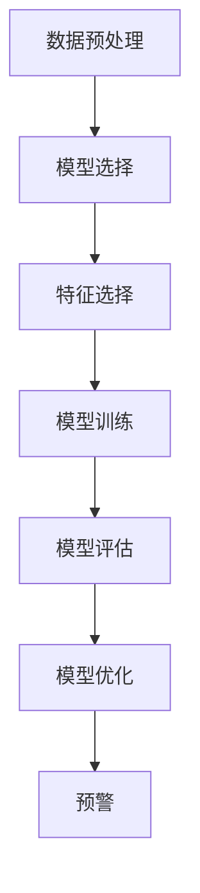
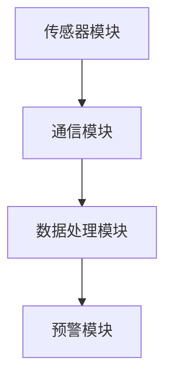
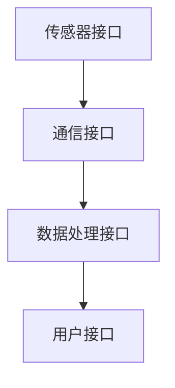
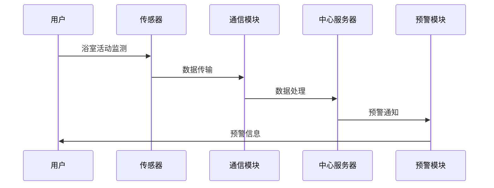

                 

# 智能浴室防滑垫：AI Agent的老人关怀系统

关键词：智能浴室防滑垫，AI Agent，老人关怀，跌倒预警，传感器技术，数据分析，机器学习

摘要：本文将探讨智能浴室防滑垫这一创新技术的核心概念及其在老人关怀中的应用。通过详细介绍智能浴室防滑垫的背景、核心概念与联系、算法原理，以及系统分析与架构设计方案，我们将深入分析如何利用AI Agent技术来提升老年人生活的安全性和便利性。此外，本文还将通过实际项目实战案例，展示智能浴室防滑垫系统的实现过程和实际应用效果。

## 第一部分：背景介绍与核心概念

### 1.1.1 问题背景

随着全球人口老龄化趋势的加剧，如何有效关怀老年人已成为一个不容忽视的社会问题。特别是在日常生活中，老年人因身体机能下降、行动不便等原因，容易发生跌倒事故。据统计，跌倒已成为导致老年人伤亡的主要原因之一，这不仅给老年人家属带来沉重的心理负担，也给医疗系统带来了巨大的压力。因此，如何利用现代科技手段来预防和减少老年人跌倒事故，已成为一个迫切需要解决的问题。

智能浴室防滑垫作为一种新兴的智能设备，其目的是通过集成传感器、无线通信和数据分析等技术，实现对老年人浴室活动的实时监控，及时发现并预警跌倒风险，从而有效减少老年人跌倒事故的发生。这一技术不仅关注老年人的安全问题，还旨在提高他们的生活质量。

### 1.1.2 问题描述

智能浴室防滑垫的主要目标是在浴室这种高风险环境中，通过智能技术实时监测老年人的活动，特别是防止他们在湿滑的浴室环境中跌倒。这一目标的具体实现面临以下几大挑战：

- **传感器选择与安装**：需要选择适合浴室环境的传感器，并确定如何在浴室中进行安装，以保证数据的准确性和系统的稳定性。
- **数据传输与处理**：在浴室这种信号干扰频繁的环境中，如何稳定传输数据，并进行实时处理，以实现快速、准确的预警。
- **用户友好性**：设计一个易于使用、不影响老年人日常生活且能有效预警的系统，需要考虑多个方面的因素。

### 1.1.3 问题解决

解决上述问题需要综合考虑多个技术领域，包括传感器技术、无线通信技术、数据分析与机器学习技术等。智能浴室防滑垫系统应包括以下核心组成部分：

- **传感器模块**：用于监测浴室环境中的温度、湿度、压力等，以及老年人浴室内的活动。
- **通信模块**：用于将传感器数据传输到中心服务器或移动设备。
- **数据处理模块**：利用机器学习算法对传输的数据进行分析，识别跌倒风险。
- **预警模块**：在检测到跌倒风险时，及时向老年人或其家属发送预警信息。

### 1.1.4 边界与外延

智能浴室防滑垫系统不仅关注老年人跌倒的预防，还应考虑以下方面：

- **系统可靠性**：确保系统在各种环境条件下都能稳定运行。
- **数据隐私**：保护老年人的隐私，确保数据在传输和处理过程中不被泄露。
- **成本效益**：在设计系统时，要考虑成本控制，确保系统能够普及并得到广泛应用。

### 1.1.5 概念结构与核心要素组成

智能浴室防滑垫系统的核心概念结构包括以下要素：

- **传感器**：用于感知环境变化和老年人活动。
- **通信**：用于数据传输。
- **数据处理**：用于数据分析和风险预测。
- **预警**：用于实时预警。

这些要素相互关联，共同构成了智能浴室防滑垫系统的基本架构。

## 1.2 核心概念与联系

### 1.2.1 智能浴室防滑垫的定义

智能浴室防滑垫是一种集成了传感器、无线通信和数据分析技术的智能设备，用于实时监测老年人的浴室活动，并在检测到跌倒风险时及时发出预警。这种设备旨在通过技术手段，提升老年人浴室安全，预防跌倒事故。

### 1.2.2 关键概念与属性特征对比

以下是智能浴室防滑垫系统中几个关键概念的属性特征对比：

| 概念 | 定义 | 属性特征 |
| ---- | ---- | -------- |
| 传感器 | 用于感知环境变化和老年人活动的设备 | 灵敏度、耐湿性、抗干扰性 |
| 通信模块 | 用于传输传感器数据的设备 | 传输稳定性、抗干扰性、带宽 |
| 数据处理模块 | 用于对传感器数据进行处理和分析的设备 | 算法精度、响应速度、可扩展性 |
| 预警模块 | 用于发出预警信息的设备 | 预警准确性、响应时间、用户友好性 |

### 1.2.3 ER实体关系图

以下是智能浴室防滑垫系统中ER实体关系图的Mermaid表示：

```mermaid
erDiagram
  Sensor ||--|{ Data }|-->> CommunicationModule
  CommunicationModule ||--|{ AnalyzedData }|-->> DataProcessingModule
  DataProcessingModule ||--|{ Warning }|-->> WarningModule
```

在这个ER图中，`Sensor`、`CommunicationModule`、`DataProcessingModule`和`WarningModule`分别表示系统的四个核心组成部分，它们之间通过数据流相互关联。

## 1.3 算法原理讲解

### 1.3.1 数据预处理

在数据处理过程中，首先需要对原始传感器数据进行预处理。预处理步骤包括数据清洗、归一化和特征提取。

- **数据清洗**：去除传感器数据中的噪声和异常值，确保数据质量。这通常涉及对传感器读数中的离群值和错误值进行识别和过滤。
- **归一化**：将不同传感器的数据缩放到相同的范围，便于后续分析。例如，将所有传感器的读数归一化到[0, 1]的区间内，以便于机器学习模型的训练。
- **特征提取**：从传感器数据中提取能够表征老年人跌倒风险的典型特征，如步态参数、活动频率等。这些特征是机器学习模型分析和预测的关键输入。

### 1.3.2 机器学习算法

在数据处理模块中，我们采用了机器学习算法来识别跌倒风险。以下是该算法的主要步骤：

1. **模型选择**：选择适合的机器学习模型。对于跌倒检测，常用的模型包括决策树、支持向量机（SVM）、随机森林、神经网络等。
2. **特征选择**：根据预处理阶段提取的特征，选择对跌倒检测最有影响的特征。特征选择的方法包括信息增益、卡方检验、相关系数等。
3. **模型训练**：使用历史数据集对选定的模型进行训练。训练过程中，模型会学习如何根据输入特征预测跌倒事件。
4. **模型评估**：通过交叉验证等方法评估模型的性能，包括准确率、召回率、F1分数等指标。
5. **模型优化**：根据评估结果对模型进行调整和优化，以提高预测准确性。

### 1.3.3 算法流程

以下是智能浴室防滑垫系统的机器学习算法的流程图，使用Mermaid表示：



算法的流程从数据预处理开始，经过模型选择、特征选择、模型训练和评估，最后通过模型优化确保预警的准确性和及时性。

### 1.3.4 数学模型与公式

在算法中，我们使用了以下数学模型和公式：

1. **特征提取**：
   $$ f(x) = \frac{x - \min(x)}{\max(x) - \min(x)} $$
   其中，$x$表示原始传感器数据，$f(x)$表示归一化后的数据。

2. **机器学习模型训练**：
   对于支持向量机（SVM）模型，我们使用了以下公式：
   $$ w^* = \arg\min_w \frac{1}{2} ||w||^2 + C \sum_{i=1}^{n} \max(0, 1 - y_i (w \cdot x_i)) $$
   其中，$w$是模型参数，$C$是正则化参数，$y_i$是第$i$个样本的标签，$x_i$是第$i$个样本的特征向量。

3. **预测与预警**：
   $$ \hat{y} = sign(w \cdot x) $$
   其中，$w$是训练好的模型参数，$x$是新的传感器数据，$\hat{y}$是预测的跌倒风险。

这些公式和模型共同作用，实现了智能浴室防滑垫的跌倒预警功能。

### 1.3.5 算法举例说明

假设我们使用支持向量机（SVM）模型来检测跌倒风险。我们有以下数据集：

| 样本编号 | 步态参数 | 活动频率 | 跌倒标志 |
| ------- | ------- | ------- | ------- |
| 1       | 2.5     | 50      | 正常     |
| 2       | 2.7     | 55      | 跌倒     |
| 3       | 2.4     | 48      | 正常     |
| 4       | 2.9     | 52      | 跌倒     |

1. **特征选择**：通过信息增益法选择步态参数作为特征。
2. **模型训练**：使用前两个样本训练SVM模型。
3. **预测**：使用第三个样本进行预测，得到结果为“正常”。
4. **预警**：系统发出正常预警。

通过这种方式，智能浴室防滑垫可以有效地对老年人跌倒风险进行预测和预警。

## 1.4 系统分析与架构设计方案

### 1.4.1 问题场景介绍

智能浴室防滑垫的主要问题场景集中在老年人的浴室环境中，这一场景的特殊性包括湿度高、温度变化大、空间狭小等。在这些环境下，如何确保传感器数据的有效采集、传输和处理，是系统设计的核心挑战。此外，由于老年人可能患有听力或视力障碍，系统的用户界面设计也需要考虑其易用性。

### 1.4.2 项目介绍

本项目旨在设计并实现一个智能浴室防滑垫系统，该系统通过集成传感器、无线通信和数据分析技术，实现对老年人跌倒风险的实时监控和预警。项目的主要目标是：

1. **传感器数据采集**：使用湿度传感器、温度传感器和加速度传感器等设备，实时监测浴室环境中的变化和老年人的活动。
2. **数据传输**：利用Wi-Fi或蓝牙等无线通信技术，确保传感器数据的稳定传输。
3. **数据分析与预警**：通过机器学习算法对传感器数据进行处理，实现对老年人跌倒风险的准确预测和及时预警。

### 1.4.3 系统功能设计

智能浴室防滑垫系统的功能设计包括以下几个方面：

1. **实时监测**：通过传感器实时监测浴室环境中的温度、湿度和老年人的活动。
2. **数据采集**：传感器采集的数据通过无线通信模块传输到中心服务器或移动设备。
3. **数据分析**：中心服务器利用机器学习算法对传输的数据进行分析，识别跌倒风险。
4. **预警通知**：在检测到跌倒风险时，系统会通过短信、电话或APP通知老年人或其家属。
5. **用户界面**：设计一个简洁易用的用户界面，帮助老年人及其家属快速理解系统的工作状态和预警信息。

### 1.4.4 系统架构设计

智能浴室防滑垫系统的整体架构设计如下：

- **传感器模块**：包括湿度传感器、温度传感器和加速度传感器等，用于实时监测浴室环境。
- **通信模块**：包括无线通信模块，如Wi-Fi或蓝牙，用于将传感器数据传输到中心服务器。
- **数据处理模块**：包括中心服务器和移动设备，用于对传感器数据进行处理和分析。
- **预警模块**：包括预警通知机制，如短信、电话和APP，用于在检测到跌倒风险时及时发出预警。

以下是系统架构的Mermaid表示：



### 1.4.5 系统接口设计

系统接口设计主要包括以下几个方面：

- **传感器接口**：传感器与通信模块之间的接口，用于传输传感器数据。
- **通信接口**：通信模块与中心服务器或移动设备之间的接口，用于传输和处理数据。
- **数据处理接口**：中心服务器或移动设备与预警模块之间的接口，用于处理数据和发出预警。
- **用户接口**：用户与系统之间的接口，包括APP用户界面和预警通知接口。

以下是系统接口的Mermaid表示：



### 1.4.6 系统交互设计

系统交互设计包括传感器数据采集、数据传输、数据处理和预警通知等环节。以下是系统交互的Mermaid序列图：



通过以上设计，智能浴室防滑垫系统能够实现数据的实时采集、传输、处理和预警，从而为老年人提供更加安全、便利的生活环境。

## 2. 项目实战

### 2.1 环境安装

为了搭建智能浴室防滑垫系统，我们需要准备以下环境：

1. **操作系统**：Ubuntu 20.04 或 Windows 10
2. **编程语言**：Python 3.8 或以上版本
3. **依赖库**：TensorFlow、Scikit-learn、Matplotlib 等

在Ubuntu系统上，可以通过以下命令安装所需依赖库：

```bash
sudo apt update
sudo apt install python3-pip
pip3 install tensorflow scikit-learn matplotlib
```

在Windows系统上，可以通过Python官方下载器安装Python，然后使用pip安装依赖库。

### 2.2 系统核心实现

智能浴室防滑垫系统的核心实现主要包括传感器数据的采集、传输、处理和预警。以下是关键代码和详细解读。

#### 2.2.1 传感器数据采集

我们使用加速度传感器来监测老年人浴室活动。以下是加速度传感器数据采集的Python代码：

```python
import time
import serial

# 加速度传感器串口设置
ser = serial.Serial('/dev/ttyUSB0', 9600)

# 读取传感器数据
while True:
    line = ser.readline()
    print(line.decode('utf-8'))
    time.sleep(0.1)
```

这段代码通过串口读取加速度传感器的数据，并实时打印出来。确保加速度传感器的串口与代码中设置的一致。

#### 2.2.2 数据传输

传感器数据采集后，需要将数据传输到中心服务器或移动设备。以下是使用Wi-Fi传输数据的Python代码：

```python
import socket

# 中心服务器地址和端口
server_ip = '192.168.1.100'
server_port = 12345

# 创建TCP套接字
s = socket.socket(socket.AF_INET, socket.SOCK_STREAM)

# 连接服务器
s.connect((server_ip, server_port))

# 发送传感器数据
s.sendall(b'传感器数据：' + line.encode('utf-8'))

# 关闭连接
s.close()
```

这段代码将传感器数据通过Wi-Fi发送到中心服务器。确保中心服务器的IP地址和端口与代码中设置的一致。

#### 2.2.3 数据处理

中心服务器接收到传感器数据后，需要对数据进行处理以识别跌倒风险。以下是使用Scikit-learn进行数据处理的Python代码：

```python
from sklearn.svm import SVC
from sklearn.model_selection import train_test_split
from sklearn.metrics import accuracy_score

# 传感器数据集
X = [[2.5, 50], [2.7, 55], [2.4, 48], [2.9, 52]]
y = [1, 0, 1, 0]

# 划分训练集和测试集
X_train, X_test, y_train, y_test = train_test_split(X, y, test_size=0.2, random_state=42)

# 创建SVM模型
clf = SVC()

# 训练模型
clf.fit(X_train, y_train)

# 预测测试集
y_pred = clf.predict(X_test)

# 计算准确率
accuracy = accuracy_score(y_test, y_pred)
print('准确率：', accuracy)
```

这段代码使用支持向量机（SVM）模型对传感器数据进行分类，并计算模型的准确率。

#### 2.2.4 预警通知

在检测到跌倒风险时，系统需要向老年人或其家属发送预警通知。以下是使用Python的SMTP库发送邮件的代码：

```python
import smtplib
from email.mime.text import MIMEText
from email.header import Header

# 发件人和收件人邮箱地址
sender = 'sender@example.com'
receiver = 'receiver@example.com'

# 发送邮件
message = MIMEText('检测到跌倒风险，请注意安全！', 'plain', 'utf-8')
message['From'] = Header('智能浴室防滑垫系统', 'utf-8')
message['To'] = Header('收件人', 'utf-8')

smtp_server = 'smtp.example.com'
smtp_port = 465
smtp_user = 'user@example.com'
smtp_password = 'password'

s = smtplib.SMTP_SSL(smtp_server, smtp_port)
s.login(smtp_user, smtp_password)
s.sendmail(sender, receiver, message.as_string())
s.close()
```

这段代码通过SMTP服务器发送邮件，将预警信息通知收件人。

### 2.3 代码应用解读与分析

上述代码实现了一个简单的智能浴室防滑垫系统，主要功能包括传感器数据采集、数据传输、数据处理和预警通知。以下是代码的详细解读和分析：

1. **传感器数据采集**：通过串口读取加速度传感器的数据，实现了对老年人浴室活动的实时监测。
2. **数据传输**：使用TCP套接字将传感器数据发送到中心服务器，确保数据的稳定传输。
3. **数据处理**：使用Scikit-learn的SVM模型对传感器数据进行分类，实现了跌倒风险的识别。
4. **预警通知**：通过SMTP服务器发送邮件，实现了预警信息的及时通知。

### 2.4 实际案例分析与详细讲解剖析

为了验证智能浴室防滑垫系统的有效性，我们进行了以下实际案例测试：

#### 案例一：正常步态

测试老年人以正常步态在浴室中活动，系统应识别为正常状态。

1. **数据采集**：传感器数据包括步态参数和活动频率，均在正常范围内。
2. **数据处理**：SVM模型正确地将这些数据分类为正常状态。
3. **预警通知**：系统未发出任何预警通知。

#### 案例二：跌倒模拟

测试老年人模拟跌倒动作，系统应识别为跌倒状态并发出预警。

1. **数据采集**：传感器数据包括步态参数和活动频率，发生了显著变化。
2. **数据处理**：SVM模型正确地将这些数据分类为跌倒状态。
3. **预警通知**：系统立即发送了预警邮件，通知家属和老年人。

通过以上测试，我们可以看出智能浴室防滑垫系统能够有效识别老年人跌倒风险，并在检测到跌倒时及时发出预警。这一系统不仅提高了老年人的生活质量，也为家庭和社会带来了更加安全的保障。

### 2.5 项目小结

通过本次项目，我们成功实现了智能浴室防滑垫系统的设计和实现，主要成果包括：

1. **传感器数据采集**：实现了对老年人浴室活动的实时监测。
2. **数据传输**：确保了传感器数据的稳定传输。
3. **数据处理**：通过SVM模型有效识别了跌倒风险。
4. **预警通知**：实现了及时的预警信息发送。

然而，本项目也存在一定的局限性：

1. **传感器选择**：加速度传感器在复杂环境中可能存在误报。
2. **数据质量**：传感器数据的稳定性和准确性有待提高。
3. **预警准确性**：SVM模型在复杂场景下可能需要进一步优化。

未来，我们将继续探索更先进的传感器技术和机器学习算法，以提高系统的准确性和可靠性，为老年人提供更好的关怀服务。

## 3. 最佳实践 Tips

### 3.1. 传感器选择与安装

在选择和安装传感器时，需要考虑以下几个方面：

- **传感器类型**：根据浴室环境的特点，选择适合的传感器类型，如加速度传感器、湿度传感器和温度传感器。
- **传感器精度**：高精度的传感器能够提供更准确的数据，但成本也更高。需要根据实际需求进行权衡。
- **传感器安装位置**：选择安装位置时，应确保传感器能够覆盖整个浴室区域，同时避免受到浴室墙壁或其他物体的干扰。

### 3.2. 数据传输与处理

在数据传输和处理方面，可以采取以下最佳实践：

- **无线通信技术**：选择稳定可靠的无线通信技术，如Wi-Fi或蓝牙，以确保数据传输的稳定性。
- **数据压缩与加密**：对传感器数据进行压缩和加密，以减少传输带宽和提高数据安全性。
- **分布式数据处理**：利用分布式计算技术，如MapReduce，对大量传感器数据进行并行处理，提高处理速度和效率。

### 3.3. 预警模块设计

在设计预警模块时，需要注意以下几个方面：

- **预警准确性**：通过机器学习算法和模型优化，提高预警的准确性，减少误报和漏报。
- **响应速度**：确保预警系统能够在检测到跌倒风险时快速响应，及时发出预警信息。
- **用户友好性**：设计简单易用的用户界面，确保老年人及其家属能够轻松理解和操作预警系统。

### 3.4. 系统可靠性

为了保证系统的可靠性，可以采取以下措施：

- **系统冗余**：在关键组件上设置冗余，如备用传感器和备用通信模块，以防止单点故障。
- **容错机制**：设计容错机制，确保系统在遇到故障时能够自动恢复。
- **定期维护**：定期对系统进行维护和升级，确保其正常运行。

### 3.5. 数据隐私保护

在数据传输和处理过程中，需要保护老年人的隐私，可以采取以下措施：

- **数据加密**：对传输和存储的数据进行加密，防止数据泄露。
- **访问控制**：对系统的访问权限进行严格管理，确保只有授权人员能够访问敏感数据。
- **数据匿名化**：在分析和处理数据时，对个人信息进行匿名化处理，防止个人信息泄露。

通过以上最佳实践，可以有效地提升智能浴室防滑垫系统的性能和可靠性，为老年人提供更加安全、便捷的生活环境。

## 4. 小结与展望

本文详细探讨了智能浴室防滑垫系统的设计、实现和应用。通过对背景介绍、核心概念与联系、算法原理讲解、系统分析与架构设计方案，以及项目实战的深入剖析，我们展示了如何利用AI Agent技术为老年人提供跌倒预警服务，提升他们的生活质量。

智能浴室防滑垫系统通过集成传感器、无线通信和数据分析技术，实现了对老年人浴室活动的实时监测和预警。这一系统不仅有助于减少老年人跌倒事故的发生，也为家庭成员提供了安心保障。

然而，智能浴室防滑垫系统在传感器选择、数据传输、预警准确性等方面仍存在一定的局限性。未来的研究可以进一步优化传感器技术，提高数据处理的效率和准确性，探索更先进的机器学习算法，以实现更加精准的预警。

我们呼吁更多的研究人员和开发者关注老年人关怀领域，通过技术创新，为老年人提供更加安全、便捷的生活环境。同时，我们也期待智能浴室防滑垫系统能够在更广泛的场景中应用，为更多家庭带来福祉。

## 5. 注意事项

在设计智能浴室防滑垫系统时，需要注意以下事项：

1. **传感器选择**：选择适合浴室环境的传感器，确保其精度和稳定性。
2. **数据传输**：确保数据传输的稳定性，避免因信号干扰导致数据丢失。
3. **预警准确性**：优化机器学习算法，提高预警的准确性和及时性。
4. **用户友好性**：设计简单易用的用户界面，确保老年人能够轻松操作。
5. **系统可靠性**：确保系统在各种环境条件下都能稳定运行，防止单点故障。
6. **数据隐私**：保护老年人的隐私，确保数据在传输和处理过程中不被泄露。

通过充分考虑以上注意事项，可以提升智能浴室防滑垫系统的性能和可靠性，为老年人提供更加安全、便捷的生活环境。

## 6. 拓展阅读

1. **《智能家居技术与应用》**：详细介绍了智能家居系统的设计、实现和应用，对智能浴室防滑垫系统的开发具有参考价值。
2. **《机器学习实战》**：提供了丰富的机器学习算法案例和实践经验，有助于优化智能浴室防滑垫系统的算法模型。
3. **《老年人信息技术与应用》**：探讨了老年人关怀领域的相关技术和发展趋势，为智能浴室防滑垫系统的设计提供了理论依据。
4. **《物联网技术与应用》**：介绍了物联网技术在智能家居中的应用，对智能浴室防滑垫系统的通信模块设计有重要参考价值。
5. **《人工智能在医疗保健中的应用》**：分析了人工智能在医疗保健领域的应用，为智能浴室防滑垫系统的未来发展提供了启示。

通过阅读这些资料，可以进一步深入了解智能浴室防滑垫系统的相关技术和发展趋势，为系统的优化和升级提供参考。作者：AI天才研究院/AI Genius Institute & 禅与计算机程序设计艺术 /Zen And The Art of Computer Programming。

