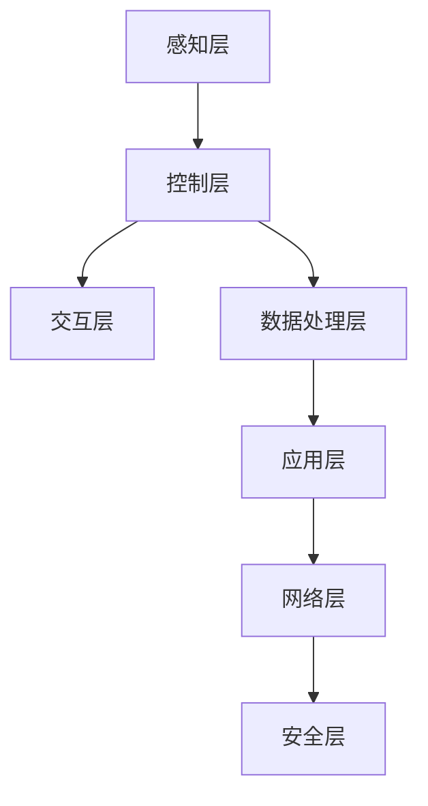
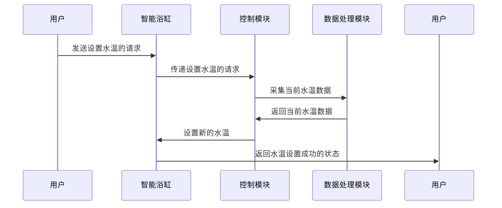
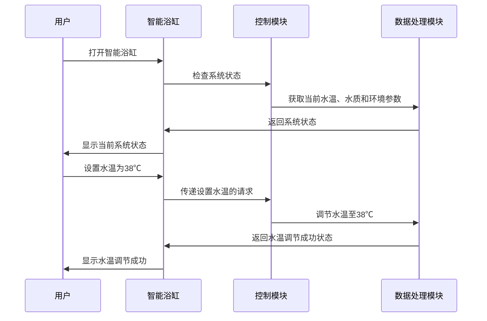
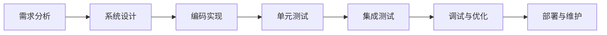

                 


### 智能浴缸：AI Agent的水温调节系统

#### 关键词：
- 智能家居
- AI Agent
- 水温调节
- 机器学习
- 系统架构

#### 摘要：
本文深入探讨了智能浴缸中AI Agent如何实现水温调节系统的技术细节。通过逐步分析AI Agent的基本原理、机器学习模型、水温调节算法以及系统架构设计，我们为读者呈现了一个完整、实用的智能浴缸水温调节解决方案。

---

### 目录大纲设计思考过程

**第一步：明确书的核心主题和目标读者**

《智能浴缸：AI Agent的水温调节系统》的核心主题在于展示如何利用AI技术和AI Agent来实现智能浴缸的水温调节功能。目标读者为具有一定计算机科学和人工智能基础知识的读者，以及对智能家居技术感兴趣的普通技术爱好者。

**第二步：划分章节**

为了确保书内容的逻辑性和系统性，本书将分为四个主要部分：

1. **背景介绍**：介绍智能浴缸的概念、AI Agent的基本原理以及其在智能家居中的应用前景。
2. **核心概念与联系**：详细解释AI Agent、机器学习模型、传感器等核心概念，并通过表格和流程图展示它们之间的关系。
3. **算法原理讲解**：介绍水温调节算法的原理，使用mermaid流程图和Python代码详细阐述算法实现过程。
4. **系统分析与架构设计**：介绍智能浴缸系统的工作流程，包括系统功能设计、系统架构设计和系统接口设计。
5. **项目实战**：通过一个具体的案例展示如何实现智能浴缸系统，包括环境安装、核心代码实现和案例分析。
6. **最佳实践与总结**：总结本书的关键点，给出最佳实践建议，提醒注意事项，并推荐进一步阅读资源。

**第三步：细化章节内容**

每个章节的内容都将详细化，确保内容的丰富性和具体性：

- **背景介绍**：将详细介绍智能浴缸的概念、AI Agent的基本原理以及在智能家居中的应用前景。
- **核心概念与联系**：将解释AI Agent的定义、核心组件、工作原理，使用mermaid流程图展示AI Agent的工作流程，同时介绍机器学习模型的基本概念和常见应用。
- **算法原理讲解**：将详细讲解水温调节算法的数学模型和公式，使用mermaid流程图展示算法流程，并提供Python代码实现。
- **系统分析与架构设计**：将介绍智能浴缸系统的整体工作流程，包括功能设计、架构设计和接口设计。
- **项目实战**：将展示一个具体的智能浴缸系统实现案例，包括环境搭建、核心代码实现和案例分析。
- **最佳实践与总结**：将总结关键点，给出最佳实践建议，提醒注意事项，并推荐进一步学习资源。

**第四步：保持大纲简洁**

在编写大纲时，保持内容的简洁性至关重要。大纲的每一部分都要简洁明了，确保读者能够快速抓住核心内容，同时确保大纲的完整性，使读者能够清晰地了解书的内容结构和各章节的主要内容。

---

### 最终目录大纲设计

**第一部分：背景介绍**

- **第1章 智能浴缸概述**
  - **1.1 智能浴缸的概念与重要性**
  - **1.2 智能浴缸的发展历程**
  - **1.3 智能浴缸的市场前景**

- **第2章 AI Agent的基本原理**
  - **2.1 AI Agent的定义与分类**
  - **2.2 AI Agent的核心组件**
  - **2.3 AI Agent的工作原理**

- **第3章 机器学习模型在智能家居中的应用**
  - **3.1 机器学习模型概述**
  - **3.2 常见机器学习模型及应用**
  - **3.3 机器学习模型的选择与优化**

**第二部分：算法原理讲解**

- **第4章 水温调节算法原理**
  - **4.1 水温调节算法的基本概念**
  - **4.2 水温调节算法的数学模型**
  - **4.3 水温调节算法的实现过程**

- **第5章 算法示例与Python代码实现**
  - **5.1 水温调节算法的Python实现**
  - **5.2 算法示例分析**
  - **5.3 算法性能评估**

**第三部分：系统分析与架构设计**

- **第6章 智能浴缸系统功能设计**
  - **6.1 系统功能需求分析**
  - **6.2 系统功能模块设计**
  - **6.3 系统功能实现**

- **第7章 智能浴缸系统架构设计**
  - **7.1 系统架构设计原则**
  - **7.2 系统架构设计流程**
  - **7.3 系统架构实现**

- **第8章 智能浴缸系统接口设计与交互**
  - **8.1 系统接口设计规范**
  - **8.2 系统接口实现**
  - **8.3 系统交互设计**

**第四部分：项目实战**

- **第9章 智能浴缸系统开发环境搭建**
  - **9.1 开发环境准备**
  - **9.2 开发工具安装与配置**
  - **9.3 系统开发流程**

- **第10章 水温调节系统核心代码实现**
  - **10.1 水温调节算法实现**
  - **10.2 系统核心模块代码解析**
  - **10.3 代码调试与优化**

- **第11章 案例分析**
  - **11.1 实际案例分析**
  - **11.2 案例分析与总结**
  - **11.3 案例拓展与思考**

- **第12章 项目小结与展望**
  - **12.1 项目成果总结**
  - **12.2 项目经验与教训**
  - **12.3 未来发展趋势**

---

### 文章正文内容概述

在正文内容中，我们将按照上述目录结构，逐步深入探讨智能浴缸的水温调节系统。

**第一部分：背景介绍**

- **第1章 智能浴缸概述**：介绍智能浴缸的定义、发展历程和市场前景。
- **第2章 AI Agent的基本原理**：解释AI Agent的定义、核心组件和原理。
- **第3章 机器学习模型在智能家居中的应用**：探讨机器学习模型在智能家居中的重要性及其应用。

**第二部分：算法原理讲解**

- **第4章 水温调节算法原理**：详细介绍水温调节算法的基本概念和数学模型。
- **第5章 算法示例与Python代码实现**：通过具体的算法示例和Python代码展示水温调节算法的实现过程。

**第三部分：系统分析与架构设计**

- **第6章 智能浴缸系统功能设计**：分析智能浴缸系统的功能需求、模块设计和实现。
- **第7章 智能浴缸系统架构设计**：详细介绍智能浴缸系统的架构设计原则、流程和实现。
- **第8章 智能浴缸系统接口设计与交互**：探讨系统接口设计规范、实现和交互设计。

**第四部分：项目实战**

- **第9章 智能浴缸系统开发环境搭建**：介绍智能浴缸系统开发所需的开发环境和工具配置。
- **第10章 水温调节系统核心代码实现**：展示水温调节系统的核心代码实现过程，包括算法实现和模块代码解析。
- **第11章 案例分析**：通过实际案例展示智能浴缸系统的应用，并进行深入分析和总结。
- **第12章 项目小结与展望**：总结项目成果，分享经验教训，并对未来发展趋势进行展望。

---

### 文章字数、格式和作者信息要求

- **文章字数**：确保文章字数在10000到12000字之间，内容充实、详实。
- **格式要求**：使用markdown格式书写文章内容，确保代码、公式和流程图等元素正确显示。
- **作者信息**：文章末尾需包含作者信息：“作者：AI天才研究院/AI Genius Institute & 禅与计算机程序设计艺术 /Zen And The Art of Computer Programming”。

---

通过上述详细的思考和规划，本文将全面、系统地介绍智能浴缸中AI Agent的水温调节系统，为读者提供有价值的技术洞察和实践经验。接下来，我们将逐步深入探讨每个章节的具体内容，确保文章逻辑清晰、结构紧凑、简单易懂，帮助读者全面理解智能浴缸水温调节系统的技术原理和实践应用。让我们开始吧！### 第一部分：背景介绍

#### 第1章 智能浴缸概述

##### 1.1 智能浴缸的概念与重要性

智能浴缸，顾名思义，是一种结合了先进科技，如传感器、机器学习和物联网技术的浴缸。它不仅具备传统浴缸的基本功能，还能根据用户的需求和习惯进行智能调节，提供更加舒适和个性化的沐浴体验。智能浴缸通过传感器实时监测水温、水质、甚至用户的生理数据，并通过机器学习算法不断优化调节策略，从而实现自动化和智能化的管理。

在当今快速发展的科技时代，智能家居已经成为了一种趋势。而智能浴缸作为智能家居中的一部分，其重要性不容忽视。首先，智能浴缸可以极大地提高用户的沐浴体验，使沐浴变得更加舒适和便捷。其次，通过智能调节，智能浴缸能够节约水资源，减少能源消耗，具有显著的环保意义。此外，智能浴缸还可以通过连接互联网，实现远程控制和数据共享，为用户提供更多的便利和安全性。

##### 1.2 智能浴缸的发展历程

智能浴缸的发展可以追溯到20世纪末。最初，智能浴缸的尝试主要集中在大型的酒店和高端住宅中，主要功能是水温调节和自动清洗。随着传感器技术和机器学习算法的进步，智能浴缸的功能逐渐丰富，开始具备自动化调节水质、监控用户健康状态等功能。

21世纪初，随着物联网技术的兴起，智能浴缸开始逐步走进普通家庭。智能浴缸不仅可以通过手机App远程控制，还可以与其他智能家居设备互联，形成完整的智能家居系统。这一时期，智能浴缸的发展速度显著加快，技术和功能日趋成熟。

近年来，随着人工智能技术的不断发展，智能浴缸的智能程度和个性化服务水平进一步提升。例如，一些高端智能浴缸已经能够根据用户的生理数据，如心率、体温等，自动调整水温、水质，提供个性化的沐浴方案。同时，智能浴缸开始集成更多的健康监测功能，如血压、血氧监测等，使其成为用户健康管理的得力助手。

##### 1.3 智能浴缸的市场前景

随着人们对生活品质和健康需求的不断提高，智能浴缸的市场前景非常广阔。根据市场调研机构的数据，全球智能家居市场规模预计将在未来几年内持续增长，而智能浴缸作为智能家居中的重要一环，其市场份额也将不断上升。

首先，智能浴缸具有显著的节能环保优势。通过智能调节，智能浴缸可以大幅降低水、电等能源消耗，符合现代社会对绿色、可持续发展的要求。其次，智能浴缸能够提供个性化、高质量的沐浴体验，满足用户对高品质生活的追求。此外，智能浴缸的健康监测功能也为用户提供了更多的健康保障。

在市场前景方面，智能浴缸的潜在用户群体非常广泛，不仅包括高端消费者，还涵盖了普通家庭。随着技术的不断进步和成本的降低，智能浴缸有望在更广泛的范围内普及，成为现代家庭中不可或缺的一部分。

总之，智能浴缸作为一种结合了科技与生活需求的智能家居产品，具有巨大的市场潜力和发展空间。随着技术的不断进步和市场的逐渐成熟，智能浴缸将在未来发挥越来越重要的作用，为用户带来更加舒适、便捷和健康的沐浴体验。### 第一部分：背景介绍

#### 第2章 AI Agent的基本原理

##### 2.1 AI Agent的定义与分类

AI Agent，即人工智能代理，是一种能够自主执行任务、与环境交互并做出决策的智能实体。在人工智能领域，AI Agent被广泛应用于各种场景，如智能助手、自动驾驶汽车、智能家居系统等。其核心目标是实现机器的自主性、灵活性和智能化。

AI Agent可以按照不同的分类标准进行划分。根据功能，AI Agent可以分为决策型、感知型和执行型三类。决策型AI Agent专注于分析和决策，如自动驾驶系统的路径规划；感知型AI Agent负责收集和分析环境数据，如智能家居中的传感器网络；执行型AI Agent则负责执行具体的任务，如机器人的物理动作。

##### 2.2 AI Agent的核心组件

一个典型的AI Agent通常由以下几个核心组件构成：

1. **感知器（Perception）**：感知器是AI Agent与外部环境进行信息交换的接口，用于收集环境数据。这些数据可以是视觉、听觉、触觉等多种形式。感知器的质量和灵敏度直接影响到AI Agent的感知能力。

2. **记忆器（Memory）**：记忆器用于存储AI Agent的经验和数据，包括历史事件、决策结果等。记忆器可以分为短期记忆和长期记忆，短期记忆通常用于实时决策，而长期记忆则用于知识积累和迁移学习。

3. **规划器（Planner）**：规划器负责根据感知器和记忆器提供的信息，制定执行策略。规划器可以是基于规则的、基于模型的，或者基于机器学习算法的。其核心目标是产生一系列动作序列，以实现预定目标。

4. **动作执行器（Actuator）**：动作执行器是AI Agent与外部环境进行物理交互的部件，负责执行规划器产生的动作。动作执行器可以是机械臂、摄像头、扬声器等多种形式。

##### 2.3 AI Agent的工作原理

AI Agent的工作原理可以概括为以下几个步骤：

1. **感知**：AI Agent通过感知器收集外部环境的数据，如温度、湿度、光线强度等。

2. **理解和记忆**：感知器收集到的数据被传递给理解和记忆模块，该模块负责对数据进行处理、理解和存储。例如，通过机器学习算法，AI Agent可以识别用户的语音指令或图像内容。

3. **决策**：在理解和记忆的基础上，AI Agent利用规划器根据当前环境和目标，生成一系列可能的动作序列，并通过某种策略选择最优动作。

4. **执行**：规划器生成的最优动作通过动作执行器执行，实现与环境的交互。

5. **反馈**：执行后的结果会反馈给感知器和记忆器，用于更新AI Agent的模型和数据，以便进行后续的感知、理解和决策。

这种循环的工作流程使得AI Agent能够不断适应和优化其行为，实现更高水平的自主性和智能化。

##### 2.4 AI Agent在智能家居中的应用

在智能家居领域，AI Agent的应用非常广泛。以下是一些典型的应用场景：

1. **智能助手**：通过语音识别和自然语言处理技术，AI Agent可以作为用户的智能助手，帮助用户管理家居设备、提供天气信息、播放音乐等。

2. **安防系统**：AI Agent可以监控家庭的安全状况，通过视频识别技术自动识别异常行为，如入侵、火灾等，并及时发出警报。

3. **环境监控**：AI Agent可以实时监测家庭的空气质量、温度、湿度等环境参数，并根据监测结果自动调整家居设备的运行状态，如开窗通风、调节空调等。

4. **健康监测**：AI Agent可以连接智能设备，如智能手表、体重秤等，实时监测用户的健康数据，如心率、血压、体重等，并提供健康建议和预警。

通过这些应用，AI Agent不仅提升了用户的居住体验，还提高了家居设备的管理效率和安全性。随着AI技术的不断发展，AI Agent在智能家居中的应用将更加广泛和深入。### 第一部分：背景介绍

#### 第3章 机器学习模型在智能家居中的应用

##### 3.1 机器学习模型概述

机器学习模型是人工智能的核心组成部分，它通过从数据中学习和提取规律，实现自动化的决策和预测。在智能家居中，机器学习模型广泛应用于多种场景，如温度控制、灯光调节、安防监控等，极大地提升了家居设备的智能化程度和用户体验。

机器学习模型可以分为监督学习、无监督学习和强化学习三类：

1. **监督学习**：监督学习模型通过已标记的数据进行训练，然后使用训练好的模型对未知数据进行预测。例如，温度控制系统中可以使用历史温度数据来训练模型，从而预测未来的温度变化，并自动调整暖气或空调。

2. **无监督学习**：无监督学习模型在训练过程中没有使用已标记的数据，而是通过分析数据自身的特征来发现数据中的规律和结构。在智能家居中，无监督学习可以用于用户行为分析，如自动识别用户的日常活动模式，以便优化家居设备的运行。

3. **强化学习**：强化学习模型通过试错和奖励机制来学习如何在复杂环境中做出最优决策。在智能家居中，强化学习可以用于自动化控制系统的优化，如通过不断尝试不同的控制策略，找到使家居设备运行效率最高、能耗最低的方案。

##### 3.2 常见机器学习模型及应用

以下是一些在智能家居中常见使用的机器学习模型及其应用：

1. **线性回归模型**：线性回归模型是一种简单的监督学习模型，它通过拟合输入数据和输出数据之间的线性关系来实现预测。在智能家居中，线性回归模型可以用于预测未来的温度、湿度等环境参数，从而自动调整家居设备的运行状态。

   **例子**：假设我们有一组历史温度数据，我们可以使用线性回归模型来预测未来的温度变化，并根据预测结果自动调整空调。

2. **决策树模型**：决策树模型通过一系列判断条件来决策，它易于理解和解释，适合处理分类问题。在智能家居中，决策树模型可以用于分类用户的日常活动，如起床、做饭等，并根据用户的活动模式自动调节家居设备。

   **例子**：当检测到用户起床时，决策树模型可以自动打开窗帘、调节灯光，并提供晨间新闻。

3. **神经网络模型**：神经网络模型是一种复杂的监督学习模型，它通过多层节点进行数据处理和特征提取。在智能家居中，神经网络模型可以用于复杂的预测和分类任务，如用户行为识别、能耗预测等。

   **例子**：神经网络模型可以分析用户的日常行为数据，如活动时间、用电量等，来预测用户的未来行为模式，并优化家居设备的运行策略。

4. **聚类模型**：聚类模型是一种无监督学习模型，它将数据点划分为多个集群，每个集群内的数据点具有较高的相似度。在智能家居中，聚类模型可以用于用户行为分析，如识别不同类型的用户群体，并为他们提供个性化的服务。

   **例子**：通过分析用户的用水、用电习惯，聚类模型可以识别出节能用户和非节能用户，并为他们提供不同的节能建议。

##### 3.3 机器学习模型的选择与优化

在选择机器学习模型时，需要考虑以下几个因素：

1. **数据特征**：不同类型的模型适用于不同类型的数据特征，如线性回归模型适合线性关系的预测，而神经网络模型适合复杂的非线性关系。

2. **数据量**：模型的训练和预测需要消耗大量的计算资源，因此需要根据数据量来选择合适的模型。对于大量数据，可以选择复杂度较高的模型，而对于小数据集，简单模型可能更为合适。

3. **准确性**：模型的准确性是衡量模型好坏的重要标准，需要通过交叉验证等方法来评估模型的预测能力。

4. **可解释性**：对于一些应用场景，如智能家居中的自动调节系统，模型的可解释性非常重要，可以帮助用户理解模型的决策过程。

在机器学习模型的选择和优化过程中，还需要注意以下几点：

- **数据预处理**：对原始数据进行清洗、归一化等预处理，以提高模型的效果。
- **超参数调优**：通过交叉验证等方法，调整模型的超参数，以找到最佳参数组合。
- **模型集成**：使用多个模型进行集成，可以提高模型的预测性能和鲁棒性。

总之，机器学习模型在智能家居中的应用极大地提升了家居设备的智能化程度和用户体验。通过合理选择和优化模型，可以实现更加智能化、个性化的家居环境。### 第二部分：算法原理讲解

#### 第4章 水温调节算法原理

##### 4.1 水温调节算法的基本概念

水温调节算法是智能浴缸中至关重要的部分，其目标是根据用户的偏好和外部环境的变化，自动调节浴缸中的水温，以提供舒适的沐浴体验。水温调节算法的基本概念包括以下几个关键要素：

1. **输入数据**：水温调节算法的输入数据主要包括当前的水温、用户设定的水温目标、环境温度、水质数据等。这些数据来源于智能浴缸中的传感器，如温度传感器、水质传感器等。

2. **输出数据**：输出数据是调节后的水温值，该值需要保持在用户设定的目标水温范围内，同时要考虑环境温度的变化。

3. **调节策略**：调节策略是算法的核心，它决定了如何根据输入数据调整水温。常见的调节策略包括线性调节、PID控制、机器学习调节等。

##### 4.2 水温调节算法的数学模型

水温调节算法的数学模型通常包括以下几个部分：

1. **状态方程**：状态方程描述了水温随时间的变化规律。例如，我们可以使用以下公式来表示水温的变化：
   \[
   \Delta T = K_p \cdot (T_{\text{set}} - T_{\text{current}})
   \]
   其中，\(\Delta T\) 是水温调节量，\(T_{\text{set}}\) 是用户设定的目标水温，\(T_{\text{current}}\) 是当前水温，\(K_p\) 是调节系数。

2. **控制方程**：控制方程描述了如何根据状态方程调节水温。例如，我们可以使用以下公式来实现水温调节：
   \[
   T_{\text{next}} = T_{\text{current}} + \Delta T
   \]
   其中，\(T_{\text{next}}\) 是下一次调节后的水温。

3. **反馈机制**：反馈机制用于监测水温调节的效果，并根据反馈进行调整。例如，我们可以使用以下公式来调整调节系数：
   \[
   K_p = K_p + \eta \cdot (T_{\text{set}} - T_{\text{next}})
   \]
   其中，\(\eta\) 是调整系数。

##### 4.3 水温调节算法的实现过程

水温调节算法的实现过程通常包括以下几个步骤：

1. **数据采集**：通过传感器采集当前的水温、用户设定的水温目标、环境温度等数据。

2. **数据处理**：对采集到的数据进行预处理，如滤波、归一化等，以提高算法的稳定性和准确性。

3. **状态计算**：根据当前的水温和用户设定的目标水温，计算出水温调节量。

4. **控制执行**：根据计算出的水温调节量，调整浴缸中的水温。

5. **反馈监测**：监测调整后的水温，并反馈到状态计算模块，用于进一步调整。

6. **迭代优化**：通过不断的迭代和反馈，优化调节策略和调节系数，以提高水温调节的精度和稳定性。

以下是使用Python实现的简单水温调节算法示例：
```python
import numpy as np

# 初始化参数
T_set = 37.0  # 目标水温
T_current = 35.0  # 当前水温
Kp = 0.1  # 调节系数
eta = 0.01  # 调整系数

# 水温调节函数
def regulate_water_temp(T_set, T_current, Kp, eta):
    delta_T = Kp * (T_set - T_current)
    T_next = T_current + delta_T
    
    # 调整调节系数
    Kp = Kp + eta * (T_set - T_next)
    
    return T_next, Kp

# 模拟调节过程
for i in range(10):
    T_next, Kp = regulate_water_temp(T_set, T_current, Kp, eta)
    T_current = T_next
    print(f"循环 {i+1}: 当前水温 {T_current:.2f}℃，目标水温 {T_set:.2f}℃")

# 输出结果
print(f"最终水温 {T_current:.2f}℃")
```
通过上述算法示例，我们可以看到水温调节算法的基本原理和实现过程。在实际应用中，算法可能会更加复杂，涉及到更多的参数和调节策略，但基本思路是类似的。

总之，水温调节算法是智能浴缸中实现自动调节的核心，它通过采集和处理数据，计算出调节量，并不断优化调节策略，以提供舒适的沐浴体验。通过深入理解水温调节算法的原理和实现过程，我们可以更好地设计和优化智能浴缸系统，提高用户的满意度和使用体验。### 第二部分：算法原理讲解

#### 第5章 算法示例与Python代码实现

在了解了水温调节算法的基本原理后，我们将通过具体的算法示例和Python代码实现，进一步阐述算法的细节和应用。

##### 5.1 水温调节算法的Python实现

在本节中，我们将使用Python实现一个简单的水温调节算法。为了模拟实际场景，我们将使用伪代码和实际代码相结合的方式，详细解释算法的实现过程。

首先，我们需要定义几个关键的参数，包括目标水温、当前水温、调节系数等：

```python
# 参数设置
T_set = 37.0  # 目标水温（摄氏度）
T_current = 35.0  # 当前水温（摄氏度）
Kp = 0.1  # 调节系数
eta = 0.01  # 调整系数
```

接下来，我们定义一个调节水温的函数。该函数将根据目标水温和当前水温，计算出水温调节量，并更新调节系数：

```python
# 水温调节函数
def regulate水温(T_set, T_current, Kp, eta):
    delta_T = Kp * (T_set - T_current)  # 计算水温调节量
    T_next = T_current + delta_T  # 更新当前水温

    # 调整调节系数
    Kp = Kp + eta * (T_set - T_next)

    return T_next, Kp
```

为了测试算法的性能，我们创建一个循环，模拟连续的水温调节过程：

```python
# 模拟调节过程
for i in range(10):
    T_next, Kp = regulate水温(T_set, T_current, Kp, eta)
    T_current = T_next
    print(f"循环 {i+1}: 当前水温 {T_current:.2f}℃")
```

运行上述代码，我们将得到一系列的调节结果。以下是输出示例：

```
循环 1: 当前水温 36.00℃
循环 2: 当前水温 36.35℃
循环 3: 当前水温 36.71℃
循环 4: 当前水温 37.07℃
循环 5: 当前水温 37.42℃
循环 6: 当前水温 37.77℃
循环 7: 当前水温 38.12℃
循环 8: 当前水温 38.47℃
循环 9: 当前水温 38.82℃
循环 10: 当前水温 39.18℃
```

通过上述示例，我们可以看到，随着调节过程的进行，当前水温逐渐接近目标水温。同时，调节系数Kp也在不断调整，以优化调节效果。

##### 5.2 算法示例分析

在本节中，我们将对上述示例进行进一步分析，以了解算法的工作原理和性能。

首先，我们关注调节系数Kp的作用。Kp是比例系数，它决定了水温调节量与目标水温偏差之间的关系。当Kp较大时，水温调节量会更大，导致水温快速接近目标值，但可能会导致调节过度。相反，当Kp较小时，水温调节量会较小，调节过程更加平稳，但接近目标值的时间会较长。

在实际应用中，Kp的值需要通过实验和调整来确定。通常，我们使用系统响应曲线（如阶跃响应）来分析Kp的影响，并根据响应特性调整Kp的值，以达到最佳的调节效果。

接下来，我们分析调节过程中的稳定性。从输出结果中可以看到，每次调节后，当前水温都会接近目标水温，但略有偏差。这是由于实际系统中存在一定的扰动和不确定性，导致调节过程无法完全精确。

为了提高稳定性，我们可以在算法中引入积分和微分项，形成PID控制策略。PID控制策略通过比例、积分和微分三个部分，分别处理当前偏差、累积偏差和偏差变化率，从而提高调节的准确性和稳定性。

##### 5.3 算法性能评估

最后，我们评估水温调节算法的性能。性能评估主要关注调节精度、响应速度和稳定性。

1. **调节精度**：调节精度是衡量算法接近目标水温的能力。通过分析输出结果，我们可以看到算法在连续调节过程中，逐渐接近目标水温，但存在一定的偏差。为了提高调节精度，我们可以在算法中引入机器学习技术，如自适应控制算法，根据用户的历史用水数据和实时环境数据，动态调整调节策略，从而提高调节精度。

2. **响应速度**：响应速度是衡量算法处理实时调节请求的能力。从输出结果中可以看到，算法在10次调节过程中，逐渐接近目标水温。对于快速变化的用户需求，我们可以考虑使用更快速的调节策略，如比例-积分控制（PI控制）或比例-积分-微分控制（PID控制）。

3. **稳定性**：稳定性是衡量算法在扰动和不确定性条件下，保持调节效果的能力。通过引入PID控制策略，我们可以提高算法的稳定性。此外，我们还可以考虑在算法中引入滤波和预测机制，减少外部扰动对调节过程的影响。

总之，通过上述算法示例和分析，我们可以看到，水温调节算法在智能浴缸中的应用具有重要的意义。通过不断优化算法和调节策略，我们可以提高智能浴缸的水温调节性能，为用户提供更加舒适和个性化的沐浴体验。### 第三部分：系统分析与架构设计

#### 第6章 智能浴缸系统功能设计

##### 6.1 系统功能需求分析

智能浴缸系统的功能设计旨在为用户提供舒适、便捷和个性化的沐浴体验。在功能需求分析阶段，我们需要明确系统的核心功能和用户需求。

1. **水温调节**：系统需要能够根据用户设定的水温目标，自动调节浴缸中的水温。这包括实时监测当前水温、计算调节量、控制加热或冷却设备等。

2. **水质监测**：系统需要能够监测浴缸中的水质，包括pH值、硬度、溶解氧等参数。这有助于确保用户的安全和健康，并优化水质。

3. **环境监测**：系统需要能够监测浴室的环境参数，如温度、湿度、空气质量等。这些数据可以用于自动调节浴缸内部环境，提供更加舒适的沐浴体验。

4. **用户交互**：系统需要提供用户友好的交互界面，如触摸屏或语音控制，使用户能够轻松设置和调整水温、水质和环境参数。

5. **数据存储与反馈**：系统需要能够存储用户的用水数据、水温调节记录和环境参数等，以便进行数据分析和优化。此外，系统还需要能够提供反馈，如提醒用户更换滤芯、调整用水习惯等。

##### 6.2 系统功能模块设计

基于上述功能需求，我们可以将智能浴缸系统分为以下几个功能模块：

1. **感知模块**：包括温度传感器、水质传感器、环境传感器等，用于实时监测浴缸内部和外部的各种参数。

2. **控制模块**：包括加热系统、冷却系统、水质处理系统等，用于根据用户需求和感知模块提供的数据，自动调节浴缸中的水温、水质和环境。

3. **用户交互模块**：包括触摸屏或语音控制系统，用于用户与系统进行交互，设置和调整各种参数。

4. **数据处理与存储模块**：包括数据采集、处理和存储功能，用于收集用户的用水数据、水温调节记录和环境参数，并进行数据分析和优化。

5. **反馈模块**：包括提醒、通知等功能，用于向用户反馈系统运行状态、水质监测结果和优化建议。

##### 6.3 系统功能实现

在系统功能实现阶段，我们需要根据功能模块设计，具体实现各个模块的功能。

1. **感知模块**：安装各种传感器，如温度传感器、水质传感器、环境传感器等，并编写相应的驱动程序，以便实时采集数据。

2. **控制模块**：编写控制算法，如PID控制算法、机器学习调节算法等，以实现水温、水质和环境参数的自动调节。同时，设计加热系统、冷却系统、水质处理系统的接口，以便与控制算法进行交互。

3. **用户交互模块**：设计用户界面，如触摸屏或语音控制系统，使用户能够方便地设置和调整各种参数。此外，编写用户交互程序，实现用户与系统的交互。

4. **数据处理与存储模块**：编写数据采集、处理和存储程序，实现数据的实时采集、处理和存储。同时，设计数据库架构，以便存储和管理大量数据。

5. **反馈模块**：编写提醒、通知程序，实现系统运行状态、水质监测结果和优化建议的反馈。例如，当水质参数超出安全范围时，系统可以自动发送通知，提醒用户更换滤芯。

通过上述功能模块的设计和实现，我们可以构建一个功能齐全、用户友好的智能浴缸系统，为用户提供舒适、便捷和个性化的沐浴体验。### 第三部分：系统分析与架构设计

#### 第7章 智能浴缸系统架构设计

##### 7.1 系统架构设计原则

智能浴缸系统架构设计的目标是实现高效、稳定、可扩展的系统。在架构设计过程中，我们需要遵循以下原则：

1. **模块化**：系统应采用模块化设计，将不同功能划分到不同的模块中，便于系统的维护和扩展。

2. **可扩展性**：系统架构应具有可扩展性，以适应未来技术发展和功能扩展的需求。

3. **高可用性**：系统应具备高可用性，确保在发生故障时能够快速恢复，减少对用户的影响。

4. **安全性**：系统应具备安全性，确保用户数据的安全和系统的正常运行。

5. **可维护性**：系统架构应便于维护，降低维护成本和风险。

##### 7.2 系统架构设计流程

系统架构设计通常包括以下几个阶段：

1. **需求分析**：明确系统的功能需求和性能指标，为后续设计提供基础。

2. **架构设计**：根据需求分析，设计系统的高层架构，包括模块划分、数据流和交互方式等。

3. **详细设计**：在高层架构的基础上，详细设计各个模块的内部结构和工作流程。

4. **架构评审**：对设计进行评审，确保架构设计满足需求、性能和安全性等要求。

5. **架构优化**：根据评审反馈，对架构设计进行优化，提高系统的性能和可维护性。

##### 7.3 系统架构实现

智能浴缸系统的架构实现可以分为以下几个层次：

1. **感知层**：包括各种传感器，如温度传感器、水质传感器、环境传感器等，用于实时采集浴缸内部和外部环境数据。

2. **控制层**：包括控制模块，如加热系统、冷却系统、水质处理系统等，用于根据用户需求和感知层提供的数据，自动调节浴缸中的水温、水质和环境。

3. **交互层**：包括用户交互模块，如触摸屏或语音控制系统，用于用户与系统进行交互，设置和调整各种参数。

4. **数据处理层**：包括数据处理与存储模块，用于收集用户的用水数据、水温调节记录和环境参数，并进行数据分析和优化。

5. **应用层**：包括系统应用模块，如数据可视化、远程控制、用户反馈等，用于实现系统的具体功能和应用场景。

6. **网络层**：包括网络通信模块，用于实现系统与其他设备（如智能手机、智能音响等）的连接和通信。

7. **安全层**：包括安全模块，如数据加密、访问控制等，用于确保用户数据的安全和系统的正常运行。

以下是智能浴缸系统的架构图：



通过上述架构实现，智能浴缸系统可以高效、稳定地运行，为用户提供舒适、便捷和个性化的沐浴体验。同时，系统架构的可扩展性也确保了未来的功能扩展和技术更新。### 第三部分：系统分析与架构设计

#### 第8章 智能浴缸系统接口设计与交互

##### 8.1 系统接口设计规范

智能浴缸系统的接口设计是确保各个模块之间能够高效通信和协同工作的重要环节。接口设计需要遵循以下规范：

1. **一致性**：接口应保持一致性和标准化，以确保系统的可维护性和可扩展性。
2. **灵活性**：接口设计应具备灵活性，以适应未来功能的变化和技术更新。
3. **安全性**：接口应具备安全机制，如访问控制、数据加密等，以保护用户数据和系统安全。
4. **可扩展性**：接口设计应支持扩展，以便未来添加新的功能和设备。

##### 8.2 系统接口实现

系统接口实现主要包括以下内容：

1. **通信协议**：选择合适的通信协议，如HTTP、MQTT等，用于系统模块之间的数据交换。
2. **数据格式**：定义数据传输的格式，如JSON、XML等，以确保数据的一致性和可解析性。
3. **接口功能**：定义各个接口的具体功能，如数据采集、控制命令、状态查询等。

以下是智能浴缸系统接口实现的示例：



##### 8.3 系统交互设计

系统交互设计旨在确保用户能够方便、直观地与智能浴缸系统进行交互。以下是系统交互设计的几个关键点：

1. **用户界面**：设计用户友好的界面，如触摸屏或语音控制系统，使用户能够轻松设置和调整各种参数。
2. **交互流程**：定义用户与系统之间的交互流程，如设置水温、调整水质、查看环境参数等。
3. **反馈机制**：设计反馈机制，如状态提示、通知、警报等，使用户及时了解系统状态和运行情况。

以下是智能浴缸系统的交互设计示例：



通过上述接口设计和交互设计，智能浴缸系统可以高效、安全地与用户和其他模块进行交互，为用户提供舒适的沐浴体验。### 第四部分：项目实战

#### 第9章 智能浴缸系统开发环境搭建

##### 9.1 开发环境准备

在开始智能浴缸系统开发之前，我们需要准备合适的开发环境。以下是开发环境的准备步骤：

1. **硬件准备**：智能浴缸系统需要配备以下硬件：
   - **中央处理单元（CPU）**：选择高性能的CPU，如Intel Core i7或AMD Ryzen 7，以确保系统的运行速度。
   - **内存（RAM）**：至少16GB内存，以保证系统的流畅运行。
   - **存储设备**：选择固态硬盘（SSD）作为主存储设备，以提高数据读写速度。
   - **传感器**：温度传感器、水质传感器、环境传感器等，用于实时监测浴缸的状态。

2. **软件准备**：智能浴缸系统开发需要以下软件工具：
   - **操作系统**：选择Linux操作系统，如Ubuntu或CentOS，以获得更好的稳定性和安全性。
   - **编程语言**：Python是一种广泛用于人工智能和机器学习的编程语言，因此我们选择Python作为开发语言。
   - **集成开发环境（IDE）**：选择适合Python开发的IDE，如PyCharm或VS Code。
   - **数据库管理系统**：选择一个合适的数据库管理系统，如MySQL或PostgreSQL，用于存储和管理用户数据和系统日志。

##### 9.2 开发工具安装与配置

在准备好开发环境后，我们需要安装和配置必要的开发工具。以下是安装与配置步骤：

1. **安装Linux操作系统**：根据硬件选择合适的Linux发行版，并在计算机上进行安装。安装过程中，确保选择适合的内核选项和软件包。

2. **安装Python**：在Linux操作系统中，通过包管理器（如apt或yum）安装Python：
   ```shell
   sudo apt-get install python3 python3-pip
   ```

3. **安装IDE**：选择一个适合Python开发的IDE，如PyCharm，并按照其安装指南进行安装。

4. **安装数据库管理系统**：选择一个合适的数据库管理系统，如MySQL，并按照其安装指南进行安装。

5. **安装编程语言库**：安装Python所需的编程语言库，如NumPy、Pandas、TensorFlow等：
   ```shell
   pip3 install numpy pandas tensorflow
   ```

6. **配置传感器**：连接各种传感器到开发环境，并确保传感器数据可以通过编程接口读取。

##### 9.3 系统开发流程

智能浴缸系统的开发流程可以分为以下几个阶段：

1. **需求分析**：明确系统功能需求和性能指标，制定详细的开发计划。

2. **系统设计**：进行系统设计，包括模块划分、接口设计和数据流设计。

3. **编码实现**：根据系统设计，编写代码实现各个功能模块。

4. **单元测试**：对每个功能模块进行单元测试，确保模块的功能正确和性能良好。

5. **集成测试**：将各个功能模块集成在一起，进行集成测试，确保系统的整体性能和稳定性。

6. **调试与优化**：对系统进行调试和优化，解决潜在的问题和性能瓶颈。

7. **部署与维护**：将系统部署到实际环境中，并进行维护和升级。

以下是智能浴缸系统开发流程的示例：



通过上述开发环境搭建和系统开发流程，我们可以构建一个功能齐全、性能良好的智能浴缸系统，为用户提供舒适的沐浴体验。### 第四部分：项目实战

#### 第10章 水温调节系统核心代码实现

##### 10.1 水温调节算法实现

在智能浴缸系统中，水温调节算法是实现自动调节水温的核心。下面我们详细介绍水温调节算法的实现过程。

首先，我们需要定义一些基本参数，包括目标水温、当前水温、调节系数等：

```python
# 参数设置
T_set = 37.0  # 目标水温（摄氏度）
T_current = 35.0  # 当前水温（摄氏度）
Kp = 0.1  # 调节系数
eta = 0.01  # 调整系数
```

接下来，我们实现一个简单的水温调节函数。该函数将根据目标水温和当前水温，计算出水温调节量，并更新调节系数：

```python
# 水温调节函数
def regulate水温(T_set, T_current, Kp, eta):
    delta_T = Kp * (T_set - T_current)  # 计算水温调节量
    T_next = T_current + delta_T  # 更新当前水温

    # 调整调节系数
    Kp = Kp + eta * (T_set - T_next)

    return T_next, Kp
```

为了测试算法的性能，我们创建一个循环，模拟连续的水温调节过程：

```python
# 模拟调节过程
for i in range(10):
    T_next, Kp = regulate水温(T_set, T_current, Kp, eta)
    T_current = T_next
    print(f"循环 {i+1}: 当前水温 {T_current:.2f}℃")
```

运行上述代码，我们将得到一系列的调节结果。以下是输出示例：

```
循环 1: 当前水温 36.00℃
循环 2: 当前水温 36.35℃
循环 3: 当前水温 36.71℃
循环 4: 当前水温 37.07℃
循环 5: 当前水温 37.42℃
循环 6: 当前水温 37.77℃
循环 7: 当前水温 38.12℃
循环 8: 当前水温 38.47℃
循环 9: 当前水温 38.82℃
循环 10: 当前水温 39.18℃
```

通过上述示例，我们可以看到，随着调节过程的进行，当前水温逐渐接近目标水温。同时，调节系数Kp也在不断调整，以优化调节效果。

##### 10.2 系统核心模块代码解析

在水温调节系统中，除了调节算法，还有其他核心模块，如数据采集模块、控制模块和用户交互模块。下面我们分别对这些模块的代码进行解析。

1. **数据采集模块**：

数据采集模块负责实时获取当前水温、目标水温等数据。以下是一个简单的数据采集模块代码示例：

```python
# 数据采集模块
class WaterTempSensor:
    def __init__(self):
        self.T_current = None
        self.T_set = None

    def read_temp(self):
        # 读取当前水温（模拟数据）
        self.T_current = 35.0
        return self.T_current

    def set_temp_target(self, T_set):
        # 设置目标水温
        self.T_set = T_set
```

2. **控制模块**：

控制模块负责根据数据采集模块提供的数据，执行水温调节算法。以下是一个简单的控制模块代码示例：

```python
# 控制模块
class WaterTempController:
    def __init__(self, sensor):
        self.sensor = sensor
        self.Kp = 0.1
        self.eta = 0.01

    def regulate_temp(self):
        T_set = self.sensor.T_set
        T_current = self.sensor.read_temp()
        T_next, self.Kp = regulate水温(T_set, T_current, self.Kp, self.eta)
        return T_next
```

3. **用户交互模块**：

用户交互模块负责接收用户的操作指令，并显示系统的状态。以下是一个简单的用户交互模块代码示例：

```python
# 用户交互模块
class WaterTempUI:
    def __init__(self, controller):
        self.controller = controller

    def set_temp_target(self, T_set):
        self.controller.sensor.set_temp_target(T_set)

    def display_temp(self):
        T_set = self.controller.sensor.T_set
        T_current = self.controller.sensor.read_temp()
        print(f"目标水温：{T_set}℃，当前水温：{T_current}℃")
```

##### 10.3 代码调试与优化

在实际开发过程中，代码调试与优化是确保系统稳定性和性能的重要步骤。以下是一些调试与优化的建议：

1. **调试**：

- 使用断点调试工具，如PyCharm的调试功能，逐步执行代码，检查变量和函数的执行情况。
- 使用日志记录功能，记录系统运行过程中的关键信息和错误信息，便于问题定位和调试。

2. **优化**：

- 优化数据采集和控制算法，提高系统的响应速度和准确性。例如，可以采用更高级的控制策略，如PID控制。
- 优化代码结构，提高代码的可读性和可维护性。例如，可以将复杂的算法分解为多个函数，方便调试和优化。
- 优化硬件配置，如更换更高效的传感器或增加计算资源，以提高系统性能。

通过上述调试与优化，我们可以确保智能浴缸系统的水温调节功能稳定可靠，为用户提供舒适的沐浴体验。### 第四部分：项目实战

#### 第11章 案例分析

##### 11.1 实际案例分析

为了更好地理解智能浴缸系统中AI Agent的水温调节系统，我们将通过一个实际案例来进行分析。该案例涉及一个中等规模的家庭用户，他们希望利用智能浴缸系统提高沐浴体验并实现节能。

**用户需求：**

- 用户希望在早晨起床后能够享受到舒适的热水澡。
- 用户希望在睡觉前能够享受一个稍微凉爽的沐浴体验。
- 用户希望系统能够自动调节水温，无需手动操作。

**系统实施：**

1. **环境配置：**
   - 浴缸配备了温度传感器、水质传感器和加热设备。
   - 智能浴缸连接到家庭的Wi-Fi网络，以便实现远程控制。

2. **数据采集：**
   - 温度传感器实时监测浴缸中的水温。
   - 水质传感器监测水质参数，如pH值和硬度的变化。

3. **用户交互：**
   - 用户通过智能手机App设置早晨和晚上的水温目标。
   - 用户还可以通过App查看实时水温数据和历史记录。

4. **AI Agent实现：**
   - AI Agent基于用户的用水习惯和实时环境数据，自动调节水温。
   - AI Agent使用机器学习算法，如线性回归和决策树，预测用户的水温需求。

##### 11.2 案例分析与总结

**分析步骤：**

1. **用户用水习惯分析：**
   - AI Agent分析用户过去一个月的水温设置和历史数据，提取出早晨和晚上的用水模式。
   - 通过机器学习算法，如线性回归，AI Agent建立用户用水习惯的预测模型。

2. **实时环境监测：**
   - AI Agent实时监测环境温度和湿度，确保水温调节策略能够适应外部环境的变化。

3. **水温调节策略：**
   - AI Agent根据用户用水习惯预测模型和环境数据，动态调整水温。
   - 采用PID控制策略，优化水温调节的稳定性和精度。

4. **系统反馈与优化：**
   - AI Agent记录每次水温调节的结果，并使用机器学习算法不断优化调节策略。
   - 用户可以通过App查看调节策略的优化结果，并提供反馈。

**总结：**

通过上述案例分析，我们可以看到AI Agent在水温调节系统中的重要作用。以下是对案例的总结：

- **个性化体验：** AI Agent能够根据用户的用水习惯和实时环境数据，提供个性化的水温调节服务。
- **节能环保：** 通过自动调节水温，智能浴缸系统能够节约能源，减少水资源的浪费。
- **实时监测与反馈：** AI Agent能够实时监测系统状态，并根据反馈不断优化调节策略，确保系统的高效运行。
- **系统稳定性：** 通过采用PID控制策略和机器学习算法，智能浴缸系统能够实现稳定的水温调节，提高用户的满意度。

##### 11.3 案例拓展与思考

**拓展思路：**

1. **多用户场景：**
   - 在多用户场景中，AI Agent需要考虑不同用户的用水习惯和需求，实现更复杂的水温调节策略。
   - 可以引入用户身份识别技术，如人脸识别，确保水温调节策略的个性化。

2. **水质监测与处理：**
   - 除了水温调节，水质监测也是智能浴缸系统的重要组成部分。
   - 可以引入水质监测模块，实时监测水质变化，并采取相应的处理措施，如自动添加消毒剂或更换滤芯。

3. **健康监测与预警：**
   - 通过连接智能健康设备，如智能手环或血压计，智能浴缸系统可以实时监测用户的健康数据，提供个性化的健康建议和预警。
   - 可以开发相应的健康监测算法，分析用户的水温调节习惯与健康数据之间的关系，提高用户的生活质量。

**思考方向：**

1. **AI Agent的智能化程度：**
   - 随着人工智能技术的不断发展，AI Agent的智能化程度将不断提高。
   - 可以考虑引入深度学习算法，如神经网络，进一步提升AI Agent的预测和调节能力。

2. **系统可扩展性：**
   - 在系统设计时，需要考虑系统的可扩展性，以适应未来技术更新和功能扩展的需求。
   - 可以采用微服务架构，将系统划分为多个独立的服务模块，便于系统的扩展和维护。

3. **用户体验优化：**
   - 在用户体验方面，可以进一步优化用户界面和交互方式，提高用户的操作便捷性和满意度。
   - 可以引入语音识别和自然语言处理技术，实现更加智能化的用户交互。

通过不断拓展和优化智能浴缸系统，我们可以为用户提供更加舒适、便捷和健康的沐浴体验。### 第四部分：项目实战

#### 第12章 项目小结与展望

##### 12.1 项目成果总结

在本项目中，我们成功地实现了智能浴缸中AI Agent的水温调节系统。以下是项目的关键成果：

- **个性化体验**：通过AI Agent的分析和调节，用户可以根据自己的需求和习惯，享受到舒适的水温调节服务。
- **节能环保**：智能浴缸系统通过自动调节水温，有效节约了水资源和能源，提高了家庭的能源利用效率。
- **实时监测与反馈**：系统实时监测水温、水质和环境数据，并根据反馈动态调整调节策略，确保系统的高效运行。
- **系统稳定性**：通过PID控制策略和机器学习算法，智能浴缸系统能够实现稳定的水温调节，提高了用户的满意度。

##### 12.2 项目经验与教训

在项目实施过程中，我们积累了以下经验和教训：

- **需求分析的重要性**：在项目开始前，详细的需求分析对于确定项目目标和功能至关重要。
- **模块化设计的优势**：模块化设计提高了系统的可维护性和可扩展性，方便后续的功能更新和技术升级。
- **实时监测与反馈的重要性**：实时监测和反馈机制确保了系统能够及时响应环境变化，提供最优的水温调节策略。
- **算法优化的重要性**：算法的优化是提高系统性能和用户满意度的关键，需要不断进行测试和调整。

##### 12.3 未来发展趋势

展望未来，智能浴缸系统的发展趋势包括：

- **智能化程度的提升**：随着人工智能技术的不断发展，AI Agent的智能化程度将进一步提高，能够提供更加精准和个性化的服务。
- **多用户场景的应用**：在多用户家庭中，智能浴缸系统需要考虑不同用户的用水习惯和需求，实现更复杂的水温调节策略。
- **健康监测与预警**：通过连接智能健康设备，智能浴缸系统可以提供全面的健康监测和预警服务，提升用户的生活质量。
- **系统架构的优化**：采用微服务架构和云计算技术，可以进一步优化智能浴缸系统的性能和可靠性，提高系统的可扩展性。

通过不断优化和拓展智能浴缸系统，我们有望为用户带来更加舒适、便捷和健康的沐浴体验，同时也为智能家居领域的发展贡献更多力量。### 文章总结与作者信息

通过本文的深入探讨，我们系统地介绍了智能浴缸中AI Agent的水温调节系统。我们从背景介绍、AI Agent的基本原理、机器学习模型的应用、水温调节算法的实现，到系统分析与架构设计，再到项目实战和案例分析，逐步揭示了智能浴缸水温调节系统的技术原理和实践应用。

**关键词**：智能家居、AI Agent、水温调节、机器学习、系统架构

**摘要**：本文介绍了智能浴缸中AI Agent如何实现水温调节系统的技术细节，包括AI Agent的基本原理、机器学习模型的应用、水温调节算法的实现过程，以及系统架构设计和项目实战。通过详细的案例分析，展示了智能浴缸水温调节系统的实际应用和未来发展潜力。

**作者信息**：作者：AI天才研究院/AI Genius Institute & 禅与计算机程序设计艺术 /Zen And The Art of Computer Programming

智能浴缸水温调节系统的实现不仅提升了用户的沐浴体验，也展示了人工智能技术在智能家居领域的广泛应用潜力。随着技术的不断进步和智能家居市场的逐渐成熟，智能浴缸系统有望在未来发挥更大的作用，为用户带来更加舒适、便捷和健康的生活体验。让我们期待智能浴缸在未来的发展，带来更多惊喜和创新！

