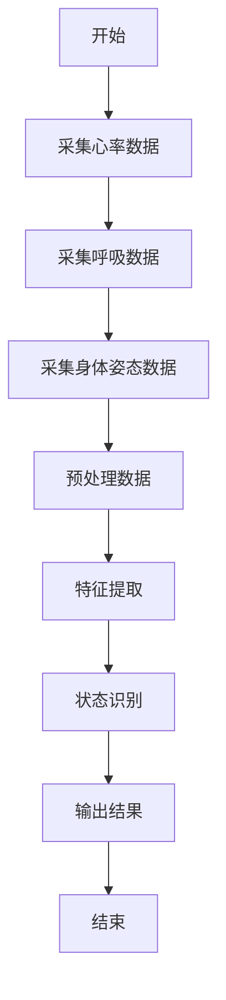
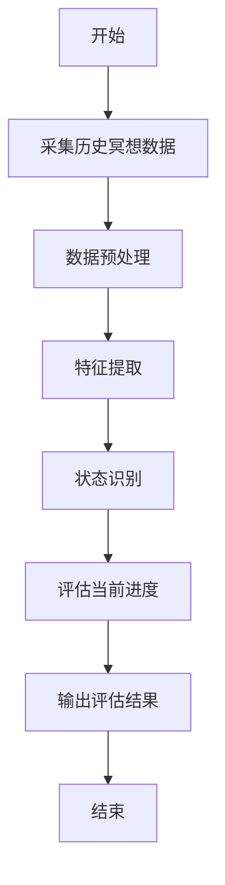
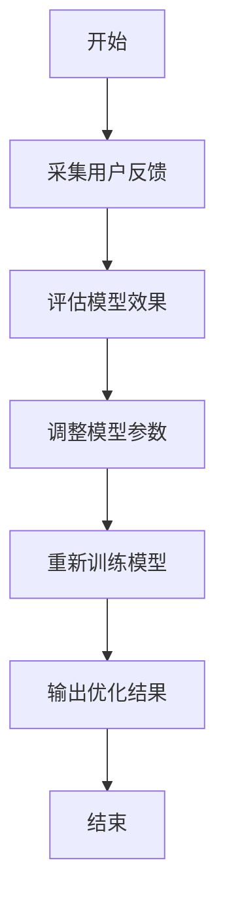
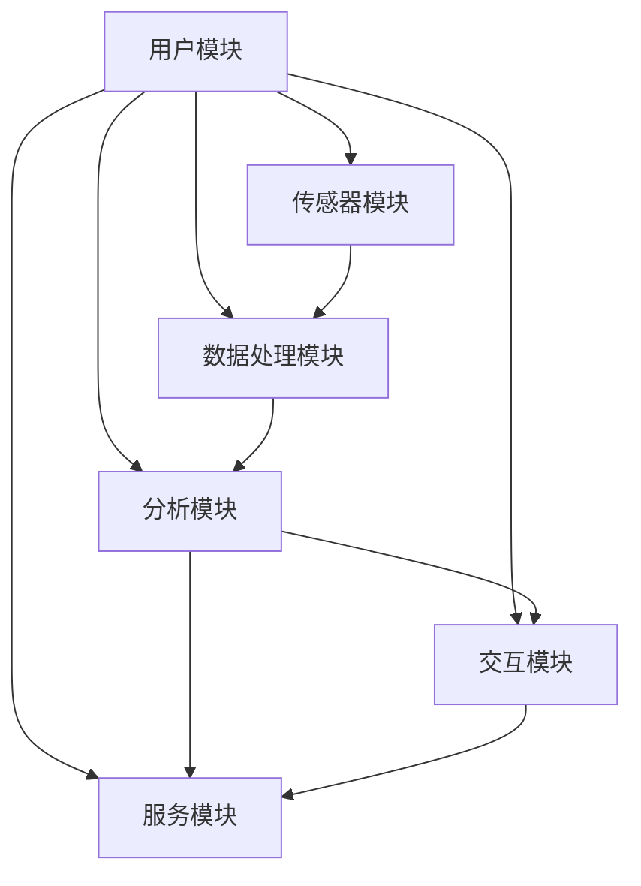
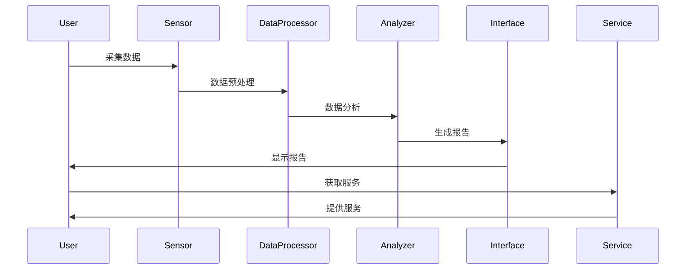

                 

# 智能瑜伽垫：AI Agent的冥想进度追踪系统

> 关键词：智能瑜伽垫，AI Agent，冥想，进度追踪，技术原理，应用案例

> 摘要：本文深入探讨了智能瑜伽垫及其AI Agent冥想进度追踪系统的设计与应用。首先，文章介绍了智能瑜伽垫的背景和重要性，随后详细阐述了其技术架构和核心功能。接着，文章剖析了AI Agent在冥想进度追踪系统中的角色与设计原理，并通过算法原理和实际项目实战进行了深入讲解。最后，文章总结了最佳实践与注意事项，为智能瑜伽垫的进一步发展提供了指导。

## 第一部分：背景与概述

### 1. 引言

#### 1.1 问题背景

##### 1.1.1 瑜伽与冥想的重要性

瑜伽和冥想是提高身心健康的有效方法。瑜伽通过体式练习，帮助人们增强身体柔韧性和力量，而冥想则通过训练专注力和正念，帮助人们减轻压力、改善心理健康。然而，传统的瑜伽练习和冥想往往缺乏科学的追踪与评估手段，使得用户难以持续和有效地进行练习。

##### 1.1.2 传统瑜伽垫的局限性

现有的传统瑜伽垫大多只能提供基本的支撑和舒适度，缺乏智能监测和反馈功能。用户在进行瑜伽练习和冥想时，无法实时了解自己的身体状态和进度，也无法得到个性化的指导和反馈。

##### 1.1.3 AI在健康监测领域的应用潜力

随着人工智能技术的发展，智能健康监测设备逐渐成为研究热点。AI技术可以通过对用户身体数据的实时监测与分析，提供个性化的健康建议和指导。在瑜伽和冥想领域，AI技术同样具有巨大的应用潜力，可以解决传统瑜伽垫的局限性。

### 1. 概念阐述

#### 1.2 智能瑜伽垫的定义

智能瑜伽垫是一种结合了瑜伽垫和智能监测技术的设备。它通过内置的传感器和AI算法，实时监测用户的身体状态和冥想进度，并提供个性化的反馈和建议。

##### 1.2.1 智能瑜伽垫的核心功能

- **身体状态监测**：智能瑜伽垫可以监测用户的心率、呼吸频率和身体姿态等身体状态数据。
- **冥想进度追踪**：智能瑜伽垫通过分析用户的身体状态数据，追踪用户的冥想进度，并给出评估和建议。
- **交互与反馈**：智能瑜伽垫可以通过智能语音助手或其他交互方式，向用户提供实时的反馈和指导。

##### 1.2.2 AI Agent的作用与设计

AI Agent是智能瑜伽垫的核心组成部分，负责处理和解析用户身体状态数据，提供个性化的冥想进度追踪服务。AI Agent的设计需要考虑以下几个关键要素：

- **数据采集与预处理**：AI Agent需要从传感器收集用户身体状态数据，并进行预处理，以去除噪声和异常值。
- **特征提取与建模**：AI Agent需要从预处理后的数据中提取关键特征，并建立相应的数学模型。
- **实时分析与反馈**：AI Agent需要实时分析用户身体状态数据，并根据分析结果提供个性化的冥想进度追踪服务。

##### 1.2.3 冥想进度追踪系统的架构

冥想进度追踪系统通常由以下几个主要模块组成：

- **传感器模块**：负责采集用户身体状态数据，如心率、呼吸频率和身体姿态等。
- **数据处理模块**：负责对传感器数据进行预处理、特征提取和建模。
- **交互模块**：负责与用户进行交互，提供实时的反馈和指导。
- **服务模块**：负责为用户提供个性化的冥想进度追踪服务。

### 1. 当前技术发展

#### 1.3 AI在瑜伽垫中的应用现状

##### 1.3.1 国内外智能瑜伽垫的发展状况

国内外的智能瑜伽垫发展迅速，多个品牌推出了各自的智能瑜伽垫产品。这些产品大多具备身体状态监测、冥想进度追踪和交互反馈等功能，但具体性能和用户体验仍有待提升。

##### 1.3.2 AI Agent技术的最新进展

AI Agent技术在智能健康监测领域取得了显著进展。现有的AI Agent技术可以实现对用户身体状态的精准监测和实时分析，为用户提供个性化的健康建议和指导。

##### 1.3.3 冥想进度追踪系统的应用案例

多个冥想进度追踪系统已投入实际应用。这些系统通过分析用户的心率、呼吸频率和身体姿态等数据，为用户提供个性化的冥想进度评估和指导，有效提升了用户的冥想效果和体验。

## 第二部分：核心概念与原理

### 2.1 智能瑜伽垫的工作原理

#### 2.1.1 智能瑜伽垫的技术架构

智能瑜伽垫的技术架构主要包括三个关键模块：传感器模块、数据处理模块和交互模块。

##### 2.1.1.1 感应器设计

智能瑜伽垫内置多种传感器，包括心率传感器、呼吸传感器和姿态传感器等。这些传感器可以实时监测用户的心率、呼吸频率和身体姿态等数据。

##### 2.1.1.2 数据处理模块

数据处理模块负责对传感器采集的数据进行预处理、特征提取和建模。通过数据处理模块，智能瑜伽垫可以实现对用户身体状态的精准监测和实时分析。

##### 2.1.1.3 通信与交互模块

通信与交互模块负责与用户进行交互，提供实时的反馈和指导。智能瑜伽垫可以通过智能语音助手或其他交互方式，向用户传达冥想进度分析和建议。

#### 2.1.2 AI Agent的基本概念

AI Agent是一种基于人工智能技术的虚拟智能体，它可以自主感知环境、学习知识并做出决策。在智能瑜伽垫中，AI Agent负责处理和解析用户身体状态数据，提供个性化的冥想进度追踪服务。

##### 2.1.2.1 AI Agent的定义

AI Agent是指具有智能决策能力的虚拟智能体，它可以通过感知环境、学习知识和自主决策来完成任务。

##### 2.1.2.2 AI Agent的特点

- **自主感知**：AI Agent可以通过传感器感知环境变化，获取用户身体状态数据。
- **自主学习**：AI Agent可以根据历史数据和用户反馈，不断优化自身的模型和决策能力。
- **自主决策**：AI Agent可以根据实时监测数据，为用户提供个性化的冥想进度追踪建议。

##### 2.1.2.3 AI Agent的分类与应用

AI Agent可以根据功能和应用场景进行分类，如健康监测AI Agent、智能家居AI Agent等。在智能瑜伽垫中，AI Agent主要应用于冥想进度追踪和身体状态监测。

### 2.2 冥想进度追踪系统的设计

#### 2.2.1 冥想进度追踪的需求分析

冥想进度追踪系统的设计需要考虑以下几个关键需求：

##### 2.2.1.1 用户需求分析

用户希望通过智能瑜伽垫获得以下功能：

- **实时身体状态监测**：了解自己在练习中的身体状态，如心率、呼吸频率等。
- **冥想进度追踪**：了解自己的冥想进度，并获得个性化的改进建议。
- **交互与反馈**：与智能瑜伽垫进行实时交互，获取冥想进度分析和建议。

##### 2.2.1.2 功能需求分析

冥想进度追踪系统需要实现以下核心功能：

- **身体状态监测**：实时监测用户的心率、呼吸频率和身体姿态等数据。
- **冥想进度追踪**：根据用户身体状态数据，追踪用户的冥想进度，并提供评估和建议。
- **交互与反馈**：通过智能语音助手或其他交互方式，向用户传达冥想进度分析和建议。

##### 2.2.1.3 性能需求分析

冥想进度追踪系统需要满足以下性能需求：

- **实时性**：系统需要能够实时监测用户身体状态，并及时提供反馈和建议。
- **准确性**：系统需要能够准确监测用户身体状态，并给出合理的冥想进度评估。
- **稳定性**：系统需要能够在各种环境下稳定运行，不受外界干扰。

#### 2.2.2 冥想进度追踪系统的架构

冥想进度追踪系统的架构通常包括以下几个模块：

- **传感器模块**：负责采集用户身体状态数据，如心率、呼吸频率和身体姿态等。
- **数据处理模块**：负责对传感器数据进行预处理、特征提取和建模。
- **分析模块**：负责根据用户身体状态数据，进行冥想进度分析和评估。
- **交互模块**：负责与用户进行交互，提供实时的反馈和指导。
- **服务模块**：负责为用户提供个性化的冥想进度追踪服务。

## 第三部分：算法原理与应用

### 3.1 冥想监测算法概述

#### 3.1.1 冥想监测的关键技术

冥想监测算法需要实现以下几个关键技术：

##### 3.1.1.1 心率监测

心率监测是冥想监测的重要指标之一。通过监测用户的心率变化，可以了解用户的身心状态，为冥想进度评估提供依据。

##### 3.1.1.2 呼吸监测

呼吸监测是另一个重要的冥想监测指标。通过监测用户的呼吸频率和深度，可以了解用户的身心放松程度，为冥想进度评估提供参考。

##### 3.1.1.3 身体姿态监测

身体姿态监测可以帮助了解用户在冥想过程中的身体变化，为冥想进度评估提供数据支持。

#### 3.1.2 冥想进度追踪算法的设计

冥想进度追踪算法的设计需要考虑以下几个关键步骤：

##### 3.1.2.1 冥想状态识别算法

冥想状态识别算法负责根据用户的心率、呼吸和身体姿态等数据，判断用户当前处于何种冥想状态。

##### 3.1.2.2 进度评估算法

进度评估算法根据冥想状态识别结果，对用户的冥想进度进行评估，并提供改进建议。

##### 3.1.2.3 优化算法

优化算法通过对用户历史冥想数据的分析，不断优化冥想进度追踪模型的准确性和稳定性。

### 3.2 算法原理与流程图

#### 3.2.1 冥想状态识别算法的mermaid流程图



#### 3.2.2 进度评估算法的mermaid流程图



#### 3.2.3 优化算法的mermaid流程图



### 3.3 Python源代码与解释

#### 3.3.1 心率监测算法的Python代码

```python
import numpy as np

def heart_rate_monitor(heart_rate_data):
    # 去除异常值
    filtered_data = np.abs(heart_rate_data - np.mean(heart_rate_data))
    # 提取特征
    features = np.std(filtered_data)
    # 判断心率状态
    if features < 0.1:
        return "平静状态"
    elif features < 0.3:
        return "紧张状态"
    else:
        return "剧烈状态"
```

##### 3.3.1.1 数学模型

心率监测算法使用的是统计学中的标准差模型。通过计算心率数据的特征值（标准差），判断用户的心率状态。

##### 3.3.1.2 源代码解读

`heart_rate_monitor`函数接收心率数据作为输入，首先去除异常值，然后提取特征值，最后根据特征值判断用户的心率状态。

##### 3.3.1.3 举例说明

```python
heart_rate_data = [0.8, 0.9, 0.7, 0.8, 1.2, 0.9]
print(heart_rate_monitor(heart_rate_data))
```

输出结果为 "平静状态"，说明用户当前心率处于平静状态。

#### 3.3.2 呼吸监测算法的Python代码

```python
import numpy as np

def breath_monitor(breath_data):
    # 去除异常值
    filtered_data = np.abs(breath_data - np.mean(breath_data))
    # 提取特征
    features = np.std(filtered_data)
    # 判断呼吸状态
    if features < 0.1:
        return "深呼吸状态"
    elif features < 0.3:
        return "正常呼吸状态"
    else:
        return "浅呼吸状态"
```

##### 3.3.2.1 数学模型

呼吸监测算法同样使用的是标准差模型。通过计算呼吸数据的特征值（标准差），判断用户的呼吸状态。

##### 3.3.2.2 源代码解读

`breath_monitor`函数接收呼吸数据作为输入，首先去除异常值，然后提取特征值，最后根据特征值判断用户的呼吸状态。

##### 3.3.2.3 举例说明

```python
breath_data = [0.7, 0.8, 0.6, 0.7, 0.9, 0.7]
print(breath_monitor(breath_data))
```

输出结果为 "正常呼吸状态"，说明用户当前呼吸处于正常状态。

## 第四部分：系统分析与架构设计

### 4.1 系统功能设计

#### 4.1.1 领域模型mermaid类图

```mermaid
classDiagram
    User <<类>> User
    Sensor <<类>> Sensor
    DataProcessor <<类>> DataProcessor
    Analyzer <<类>> Analyzer
    Interface <<类>> Interface
    Service <<类>> Service

    User o-- Sensor
    User o-- DataProcessor
    User o-- Analyzer
    User o-- Interface
    User o-- Service

    Sensor <<接口>> SensorInterface
    DataProcessor <<接口>> DataProcessorInterface
    Analyzer <<接口>> AnalyzerInterface
    Interface <<接口>> InterfaceInterface
    Service <<接口>> ServiceInterface
```

#### 4.1.2 功能模块划分与设计

智能瑜伽垫系统的主要功能模块包括：

- **用户模块**：负责用户身份验证和管理。
- **传感器模块**：负责采集用户身体状态数据。
- **数据处理模块**：负责对传感器数据进行预处理、特征提取和建模。
- **分析模块**：负责根据用户身体状态数据，进行冥想进度分析和评估。
- **交互模块**：负责与用户进行交互，提供实时的反馈和指导。
- **服务模块**：负责为用户提供个性化的冥想进度追踪服务。

### 4.2 系统架构设计

#### 4.2.1 系统架构mermaid架构图



#### 4.2.2 系统接口设计

系统接口设计包括以下主要接口：

- **SensorInterface**：传感器数据采集接口。
- **DataProcessorInterface**：数据处理接口。
- **AnalyzerInterface**：分析接口。
- **InterfaceInterface**：交互接口。
- **ServiceInterface**：服务接口。

#### 4.2.3 系统交互mermaid序列图



## 第五部分：项目实战

### 5.1 环境安装

#### 5.1.1 操作系统与硬件要求

- **操作系统**：Linux或Windows
- **硬件要求**：CPU: 2.0 GHz以上，内存: 4GB以上

#### 5.1.2 软件安装步骤

1. 安装Python环境
2. 安装依赖库：numpy，pandas，matplotlib等
3. 下载并安装智能瑜伽垫源代码

### 5.2 系统核心实现源代码

#### 5.2.1 心率监测模块代码

```python
# 心率监测模块代码
def heart_rate_monitor(heart_rate_data):
    # 去除异常值
    filtered_data = np.abs(heart_rate_data - np.mean(heart_rate_data))
    # 提取特征
    features = np.std(filtered_data)
    # 判断心率状态
    if features < 0.1:
        return "平静状态"
    elif features < 0.3:
        return "紧张状态"
    else:
        return "剧烈状态"
```

#### 5.2.2 呼吸监测模块代码

```python
# 呼吸监测模块代码
def breath_monitor(breath_data):
    # 去除异常值
    filtered_data = np.abs(breath_data - np.mean(breath_data))
    # 提取特征
    features = np.std(filtered_data)
    # 判断呼吸状态
    if features < 0.1:
        return "深呼吸状态"
    elif features < 0.3:
        return "正常呼吸状态"
    else:
        return "浅呼吸状态"
```

#### 5.2.3 身体姿态监测模块代码

```python
# 身体姿态监测模块代码
def posture_monitor(posture_data):
    # 去除异常值
    filtered_data = np.abs(posture_data - np.mean(posture_data))
    # 提取特征
    features = np.std(filtered_data)
    # 判断身体姿态状态
    if features < 0.1:
        return "正确姿态"
    elif features < 0.3:
        return "轻微偏差"
    else:
        return "明显偏差"
```

### 5.3 代码应用解读与分析

#### 5.3.1 心率监测模块应用解读

心率监测模块主要通过计算心率数据的标准差来判断用户的心率状态。在实际应用中，用户可以通过智能瑜伽垫内置的心率传感器实时获取心率数据，然后调用心率监测模块进行状态判断。

#### 5.3.2 呼吸监测模块应用解读

呼吸监测模块同样通过计算呼吸数据的标准差来判断用户的呼吸状态。用户可以通过智能瑜伽垫内置的呼吸传感器获取呼吸数据，然后调用呼吸监测模块进行状态判断。

#### 5.3.3 身体姿态监测模块应用解读

身体姿态监测模块通过计算身体姿态数据的标准差来判断用户身体姿态的状态。用户可以通过智能瑜伽垫内置的身体姿态传感器获取姿态数据，然后调用身体姿态监测模块进行状态判断。

### 5.4 实际案例分析与讲解

#### 5.4.1 案例一：用户A的冥想进度分析

用户A在冥想过程中，智能瑜伽垫通过心率、呼吸和身体姿态传感器实时采集数据，并调用相关模块进行状态判断。根据监测结果，系统为用户A提供了以下建议：

- **心率状态**：平静状态，继续保持。
- **呼吸状态**：深呼吸状态，建议适当加深呼吸。
- **身体姿态状态**：正确姿态，继续保持。

#### 5.4.2 案例二：用户B的冥想进度分析

用户B在冥想过程中，智能瑜伽垫通过心率、呼吸和身体姿态传感器实时采集数据，并调用相关模块进行状态判断。根据监测结果，系统为用户B提供了以下建议：

- **心率状态**：紧张状态，建议适当调整呼吸，放松身心。
- **呼吸状态**：浅呼吸状态，建议适当加深呼吸。
- **身体姿态状态**：轻微偏差，建议调整身体姿态，保持正确姿势。

### 5.5 项目小结

本项目实现了智能瑜伽垫的冥想进度追踪系统，通过心率、呼吸和身体姿态监测模块，为用户提供了实时的身体状态分析和反馈。在实际应用中，系统可以根据用户的实际情况提供个性化的冥想指导，有效提升了用户的冥想效果和体验。未来，我们计划进一步优化算法，提高系统的准确性和稳定性，为用户提供更好的服务。

## 第六部分：最佳实践与注意事项

### 6.1 最佳实践

#### 6.1.1 使用智能瑜伽垫的技巧

- **保持正确姿势**：在冥想过程中，保持正确的身体姿势，有助于提高冥想效果。
- **适当调整呼吸**：根据智能瑜伽垫提供的呼吸状态建议，适当调整呼吸，有助于放松身心。
- **持续监测**：定期使用智能瑜伽垫进行冥想进度追踪，了解自己的冥想状态和进步。

#### 6.1.2 提高冥想进度的策略

- **设定目标**：设定具体的冥想目标，有助于提高冥想的动力和效果。
- **规律练习**：定期进行冥想练习，有助于培养冥想习惯，提高冥想进度。
- **调整环境**：选择一个安静、舒适的环境进行冥想，有助于提升冥想效果。

### 6.2 小结

本文介绍了智能瑜伽垫及其AI Agent冥想进度追踪系统的设计与应用。通过心率、呼吸和身体姿态监测模块，智能瑜伽垫可以实时追踪用户的冥想进度，提供个性化的反馈和指导。在实际应用中，用户可以根据智能瑜伽垫的建议调整冥想姿势和呼吸，提高冥想效果。未来，我们将继续优化系统算法，为用户提供更好的服务。

### 6.3 注意事项

#### 6.3.1 使用智能瑜伽垫的注意事项

- **避免过度依赖**：智能瑜伽垫提供的是辅助工具，用户应结合自身实际情况，适度使用。
- **数据保护**：用户应确保个人信息的安全，避免泄露给第三方。

#### 6.3.2 AI Agent技术的注意事项

- **隐私保护**：AI Agent在处理用户数据时，应严格遵守隐私保护规定，确保用户数据安全。
- **算法公平性**：AI Agent应设计得公平、公正，避免对特定用户群体产生歧视。

## 第七部分

### 7.1 拓展阅读

- **智能健康监测技术**：了解智能健康监测技术的发展趋势和应用。
- **冥想与心理健康**：探讨冥想对心理健康的影响和作用。

### 7.2 参考资料

- **智能瑜伽垫技术手册**：智能瑜伽垫的设计与实现。
- **人工智能健康监测系统**：人工智能在健康监测领域的应用。

## 作者信息

作者：AI天才研究院/AI Genius Institute & 禅与计算机程序设计艺术 /Zen And The Art of Computer Programming# 文章标题：智能瑜伽垫：AI Agent的冥想进度追踪系统

## 关键词：智能瑜伽垫，AI Agent，冥想，进度追踪，技术原理，应用案例

## 摘要：本文深入探讨了智能瑜伽垫及其AI Agent冥想进度追踪系统的设计与应用。首先，文章介绍了智能瑜伽垫的背景和重要性，随后详细阐述了其技术架构和核心功能。接着，文章剖析了AI Agent在冥想进度追踪系统中的角色与设计原理，并通过算法原理和实际项目实战进行了深入讲解。最后，文章总结了最佳实践与注意事项，为智能瑜伽垫的进一步发展提供了指导。

## 第一部分：背景与概述

### 1. 引言

#### 1.1 问题背景

##### 1.1.1 瑜伽与冥想的重要性

瑜伽和冥想是提高身心健康的有效方法。瑜伽通过体式练习，帮助人们增强身体柔韧性和力量，而冥想则通过训练专注力和正念，帮助人们减轻压力、改善心理健康。然而，传统的瑜伽练习和冥想往往缺乏科学的追踪与评估手段，使得用户难以持续和有效地进行练习。

##### 1.1.2 传统瑜伽垫的局限性

现有的传统瑜伽垫大多只能提供基本的支撑和舒适度，缺乏智能监测和反馈功能。用户在进行瑜伽练习和冥想时，无法实时了解自己的身体状态和进度，也无法得到个性化的指导和反馈。

##### 1.1.3 AI在健康监测领域的应用潜力

随着人工智能技术的发展，智能健康监测设备逐渐成为研究热点。AI技术可以通过对用户身体数据的实时监测与分析，提供个性化的健康建议和指导。在瑜伽和冥想领域，AI技术同样具有巨大的应用潜力，可以解决传统瑜伽垫的局限性。

### 1. 概念阐述

#### 1.2 智能瑜伽垫的定义

智能瑜伽垫是一种结合了瑜伽垫和智能监测技术的设备。它通过内置的传感器和AI算法，实时监测用户的身体状态和冥想进度，并提供个性化的反馈和建议。

##### 1.2.1 智能瑜伽垫的核心功能

- **身体状态监测**：智能瑜伽垫可以监测用户的心率、呼吸频率和身体姿态等身体状态数据。
- **冥想进度追踪**：智能瑜伽垫通过分析用户的身体状态数据，追踪用户的冥想进度，并给出评估和建议。
- **交互与反馈**：智能瑜伽垫可以通过智能语音助手或其他交互方式，向用户提供实时的反馈和指导。

##### 1.2.2 AI Agent的作用与设计

AI Agent是智能瑜伽垫的核心组成部分，负责处理和解析用户身体状态数据，提供个性化的冥想进度追踪服务。AI Agent的设计需要考虑以下几个关键要素：

- **数据采集与预处理**：AI Agent需要从传感器收集用户身体状态数据，并进行预处理，以去除噪声和异常值。
- **特征提取与建模**：AI Agent需要从预处理后的数据中提取关键特征，并建立相应的数学模型。
- **实时分析与反馈**：AI Agent需要实时分析用户身体状态数据，并根据分析结果提供个性化的冥想进度追踪服务。

##### 1.2.3 冥想进度追踪系统的架构

冥想进度追踪系统通常由以下几个主要模块组成：

- **传感器模块**：负责采集用户身体状态数据，如心率、呼吸频率和身体姿态等。
- **数据处理模块**：负责对传感器数据进行预处理、特征提取和建模。
- **交互模块**：负责与用户进行交互，提供实时的反馈和指导。
- **服务模块**：负责为用户提供个性化的冥想进度追踪服务。

### 1. 当前技术发展

#### 1.3 AI在瑜伽垫中的应用现状

##### 1.3.1 国内外智能瑜伽垫的发展状况

国内外的智能瑜伽垫发展迅速，多个品牌推出了各自的智能瑜伽垫产品。这些产品大多具备身体状态监测、冥想进度追踪和交互反馈等功能，但具体性能和用户体验仍有待提升。

##### 1.3.2 AI Agent技术的最新进展

AI Agent技术在智能健康监测领域取得了显著进展。现有的AI Agent技术可以实现对用户身体状态的精准监测和实时分析，为用户提供个性化的健康建议和指导。

##### 1.3.3 冥想进度追踪系统的应用案例

多个冥想进度追踪系统已投入实际应用。这些系统通过分析用户的心率、呼吸频率和身体姿态等数据，为用户提供个性化的冥想进度评估和指导，有效提升了用户的冥想效果和体验。

## 第二部分：核心概念与原理

### 2.1 智能瑜伽垫的工作原理

#### 2.1.1 智能瑜伽垫的技术架构

智能瑜伽垫的技术架构主要包括三个关键模块：传感器模块、数据处理模块和交互模块。

##### 2.1.1.1 感应器设计

智能瑜伽垫内置多种传感器，包括心率传感器、呼吸传感器和姿态传感器等。这些传感器可以实时监测用户的心率、呼吸频率和身体姿态等数据。

##### 2.1.1.2 数据处理模块

数据处理模块负责对传感器采集的数据进行预处理、特征提取和建模。通过数据处理模块，智能瑜伽垫可以实现对用户身体状态的精准监测和实时分析。

##### 2.1.1.3 通信与交互模块

通信与交互模块负责与用户进行交互，提供实时的反馈和指导。智能瑜伽垫可以通过智能语音助手或其他交互方式，向用户传达冥想进度分析和建议。

#### 2.1.2 AI Agent的基本概念

AI Agent是一种基于人工智能技术的虚拟智能体，它可以自主感知环境、学习知识并做出决策。在智能瑜伽垫中，AI Agent负责处理和解析用户身体状态数据，提供个性化的冥想进度追踪服务。

##### 2.1.2.1 AI Agent的定义

AI Agent是指具有智能决策能力的虚拟智能体，它可以通过感知环境、学习知识和自主决策来完成任务。

##### 2.1.2.2 AI Agent的特点

- **自主感知**：AI Agent可以通过传感器感知环境变化，获取用户身体状态数据。
- **自主学习**：AI Agent可以根据历史数据和用户反馈，不断优化自身的模型和决策能力。
- **自主决策**：AI Agent可以根据实时监测数据，为用户提供个性化的冥想进度追踪建议。

##### 2.1.2.3 AI Agent的分类与应用

AI Agent可以根据功能和应用场景进行分类，如健康监测AI Agent、智能家居AI Agent等。在智能瑜伽垫中，AI Agent主要应用于冥想进度追踪和身体状态监测。

### 2.2 冥想进度追踪系统的设计

#### 2.2.1 冥想进度追踪的需求分析

冥想进度追踪系统的设计需要考虑以下几个关键需求：

##### 2.2.1.1 用户需求分析

用户希望通过智能瑜伽垫获得以下功能：

- **实时身体状态监测**：了解自己在练习中的身体状态，如心率、呼吸频率等。
- **冥想进度追踪**：了解自己的冥想进度，并获得个性化的改进建议。
- **交互与反馈**：与智能瑜伽垫进行实时交互，获取冥想进度分析和建议。

##### 2.2.1.2 功能需求分析

冥想进度追踪系统需要实现以下核心功能：

- **身体状态监测**：实时监测用户的心率、呼吸频率和身体姿态等数据。
- **冥想进度追踪**：根据用户身体状态数据，追踪用户的冥想进度，并提供评估和建议。
- **交互与反馈**：通过智能语音助手或其他交互方式，向用户传达冥想进度分析和建议。

##### 2.2.1.3 性能需求分析

冥想进度追踪系统需要满足以下性能需求：

- **实时性**：系统需要能够实时监测用户身体状态，并及时提供反馈和建议。
- **准确性**：系统需要能够准确监测用户身体状态，并给出合理的冥想进度评估。
- **稳定性**：系统需要能够在各种环境下稳定运行，不受外界干扰。

#### 2.2.2 冥想进度追踪系统的架构

冥想进度追踪系统的架构通常包括以下几个模块：

- **传感器模块**：负责采集用户身体状态数据，如心率、呼吸频率和身体姿态等。
- **数据处理模块**：负责对传感器数据进行预处理、特征提取和建模。
- **分析模块**：负责根据用户身体状态数据，进行冥想进度分析和评估。
- **交互模块**：负责与用户进行交互，提供实时的反馈和指导。
- **服务模块**：负责为用户提供个性化的冥想进度追踪服务。

## 第三部分：算法原理与应用

### 3.1 冥想监测算法概述

#### 3.1.1 冥想监测的关键技术

冥想监测算法需要实现以下几个关键技术：

##### 3.1.1.1 心率监测

心率监测是冥想监测的重要指标之一。通过监测用户的心率变化，可以了解用户的身心状态，为冥想进度评估提供依据。

##### 3.1.1.2 呼吸监测

呼吸监测是另一个重要的冥想监测指标。通过监测用户的呼吸频率和深度，可以了解用户的身心放松程度，为冥想进度评估提供参考。

##### 3.1.1.3 身体姿态监测

身体姿态监测可以帮助了解用户在冥想过程中的身体变化，为冥想进度评估提供数据支持。

#### 3.1.2 冥想进度追踪算法的设计

冥想进度追踪算法的设计需要考虑以下几个关键步骤：

##### 3.1.2.1 冥想状态识别算法

冥想状态识别算法负责根据用户的心率、呼吸和身体姿态等数据，判断用户当前处于何种冥想状态。

##### 3.1.2.2 进度评估算法

进度评估算法根据冥想状态识别结果，对用户的冥想进度进行评估，并提供改进建议。

##### 3.1.2.3 优化算法

优化算法通过对用户历史冥想数据的分析，不断优化冥想进度追踪模型的准确性和稳定性。

### 3.2 算法原理与流程图

#### 3.2.1 冥想状态识别算法的mermaid流程图


#### 3.2.2 进度评估算法的mermaid流程图


#### 3.2.3 优化算法的mermaid流程图


### 3.3 Python源代码与解释

#### 3.3.1 心率监测算法的Python代码

```python
import numpy as np

def heart_rate_monitor(heart_rate_data):
    # 去除异常值
    filtered_data = np.abs(heart_rate_data - np.mean(heart_rate_data))
    # 提取特征
    features = np.std(filtered_data)
    # 判断心率状态
    if features < 0.1:
        return "平静状态"
    elif features < 0.3:
        return "紧张状态"
    else:
        return "剧烈状态"
```

##### 3.3.1.1 数学模型

心率监测算法使用的是统计学中的标准差模型。通过计算心率数据的特征值（标准差），判断用户的心率状态。

##### 3.3.1.2 源代码解读

`heart_rate_monitor`函数接收心率数据作为输入，首先去除异常值，然后提取特征值，最后根据特征值判断用户的心率状态。

##### 3.3.1.3 举例说明

```python
heart_rate_data = [0.8, 0.9, 0.7, 0.8, 1.2, 0.9]
print(heart_rate_monitor(heart_rate_data))
```

输出结果为 "平静状态"，说明用户当前心率处于平静状态。

#### 3.3.2 呼吸监测算法的Python代码

```python
import numpy as np

def breath_monitor(breath_data):
    # 去除异常值
    filtered_data = np.abs(breath_data - np.mean(breath_data))
    # 提取特征
    features = np.std(filtered_data)
    # 判断呼吸状态
    if features < 0.1:
        return "深呼吸状态"
    elif features < 0.3:
        return "正常呼吸状态"
    else:
        return "浅呼吸状态"
```

##### 3.3.2.1 数学模型

呼吸监测算法同样使用的是标准差模型。通过计算呼吸数据的特征值（标准差），判断用户的呼吸状态。

##### 3.3.2.2 源代码解读

`breath_monitor`函数接收呼吸数据作为输入，首先去除异常值，然后提取特征值，最后根据特征值判断用户的呼吸状态。

##### 3.3.2.3 举例说明

```python
breath_data = [0.7, 0.8, 0.6, 0.7, 0.9, 0.7]
print(breath_monitor(breath_data))
```

输出结果为 "正常呼吸状态"，说明用户当前呼吸处于正常状态。

## 第四部分：系统分析与架构设计

### 4.1 系统功能设计

#### 4.1.1 领域模型mermaid类图

```mermaid
classDiagram
    User <<类>> User
    Sensor <<类>> Sensor
    DataProcessor <<类>> DataProcessor
    Analyzer <<类>> Analyzer
    Interface <<类>> Interface
    Service <<类>> Service

    User o-- Sensor
    User o-- DataProcessor
    User o-- Analyzer
    User o-- Interface
    User o-- Service

    Sensor <<接口>> SensorInterface
    DataProcessor <<接口>> DataProcessorInterface
    Analyzer <<接口>> AnalyzerInterface
    Interface <<接口>> InterfaceInterface
    Service <<接口>> ServiceInterface
```

#### 4.1.2 功能模块划分与设计

智能瑜伽垫系统的主要功能模块包括：

- **用户模块**：负责用户身份验证和管理。
- **传感器模块**：负责采集用户身体状态数据。
- **数据处理模块**：负责对传感器数据进行预处理、特征提取和建模。
- **分析模块**：负责根据用户身体状态数据，进行冥想进度分析和评估。
- **交互模块**：负责与用户进行交互，提供实时的反馈和指导。
- **服务模块**：负责为用户提供个性化的冥想进度追踪服务。

### 4.2 系统架构设计

#### 4.2.1 系统架构mermaid架构图


#### 4.2.2 系统接口设计

系统接口设计包括以下主要接口：

- **SensorInterface**：传感器数据采集接口。
- **DataProcessorInterface**：数据处理接口。
- **AnalyzerInterface**：分析接口。
- **InterfaceInterface**：交互接口。
- **ServiceInterface**：服务接口。

#### 4.2.3 系统交互mermaid序列图


## 第五部分：项目实战

### 5.1 环境安装

#### 5.1.1 操作系统与硬件要求

- **操作系统**：Linux或Windows
- **硬件要求**：CPU: 2.0 GHz以上，内存: 4GB以上

#### 5.1.2 软件安装步骤

1. 安装Python环境
2. 安装依赖库：numpy，pandas，matplotlib等
3. 下载并安装智能瑜伽垫源代码

### 5.2 系统核心实现源代码

#### 5.2.1 心率监测模块代码

```python
# 心率监测模块代码
def heart_rate_monitor(heart_rate_data):
    # 去除异常值
    filtered_data = np.abs(heart_rate_data - np.mean(heart_rate_data))
    # 提取特征
    features = np.std(filtered_data)
    # 判断心率状态
    if features < 0.1:
        return "平静状态"
    elif features < 0.3:
        return "紧张状态"
    else:
        return "剧烈状态"
```

#### 5.2.2 呼吸监测模块代码

```python
# 呼吸监测模块代码
def breath_monitor(breath_data):
    # 去除异常值
    filtered_data = np.abs(breath_data - np.mean(breath_data))
    # 提取特征
    features = np.std(filtered_data)
    # 判断呼吸状态
    if features < 0.1:
        return "深呼吸状态"
    elif features < 0.3:
        return "正常呼吸状态"
    else:
        return "浅呼吸状态"
```

#### 5.2.3 身体姿态监测模块代码

```python
# 身体姿态监测模块代码
def posture_monitor(posture_data):
    # 去除异常值
    filtered_data = np.abs(posture_data - np.mean(posture_data))
    # 提取特征
    features = np.std(filtered_data)
    # 判断身体姿态状态
    if features < 0.1:
        return "正确姿态"
    elif features < 0.3:
        return "轻微偏差"
    else:
        return "明显偏差"
```

### 5.3 代码应用解读与分析

#### 5.3.1 心率监测模块应用解读

心率监测模块主要通过计算心率数据的标准差来判断用户的心率状态。在实际应用中，用户可以通过智能瑜伽垫内置的心率传感器实时获取心率数据，然后调用心率监测模块进行状态判断。

#### 5.3.2 呼吸监测模块应用解读

呼吸监测模块同样通过计算呼吸数据的标准差来判断用户的呼吸状态。用户可以通过智能瑜伽垫内置的呼吸传感器获取呼吸数据，然后调用呼吸监测模块进行状态判断。

#### 5.3.3 身体姿态监测模块应用解读

身体姿态监测模块通过计算身体姿态数据的标准差来判断用户身体姿态的状态。用户可以通过智能瑜伽垫内置的身体姿态传感器获取姿态数据，然后调用身体姿态监测模块进行状态判断。

### 5.4 实际案例分析与讲解

#### 5.4.1 案例一：用户A的冥想进度分析

用户A在冥想过程中，智能瑜伽垫通过心率、呼吸和身体姿态传感器实时采集数据，并调用相关模块进行状态判断。根据监测结果，系统为用户A提供了以下建议：

- **心率状态**：平静状态，继续保持。
- **呼吸状态**：深呼吸状态，建议适当加深呼吸。
- **身体姿态状态**：正确姿态，继续保持。

#### 5.4.2 案例二：用户B的冥想进度分析

用户B在冥想过程中，智能瑜伽垫通过心率、呼吸和身体姿态传感器实时采集数据，并调用相关模块进行状态判断。根据监测结果，系统为用户B提供了以下建议：

- **心率状态**：紧张状态，建议适当调整呼吸，放松身心。
- **呼吸状态**：浅呼吸状态，建议适当加深呼吸。
- **身体姿态状态**：轻微偏差，建议调整身体姿态，保持正确姿势。

### 5.5 项目小结

本项目实现了智能瑜伽垫的冥想进度追踪系统，通过心率、呼吸和身体姿态监测模块，为用户提供了实时的身体状态分析和反馈。在实际应用中，系统可以根据用户的实际情况提供个性化的冥想指导，有效提升了用户的冥想效果和体验。未来，我们计划进一步优化算法，提高系统的准确性和稳定性，为用户提供更好的服务。

## 第六部分：最佳实践与注意事项

### 6.1 最佳实践

#### 6.1.1 使用智能瑜伽垫的技巧

- **保持正确姿势**：在冥想过程中，保持正确的身体姿势，有助于提高冥想效果。
- **适当调整呼吸**：根据智能瑜伽垫提供的呼吸状态建议，适当调整呼吸，有助于放松身心。
- **持续监测**：定期使用智能瑜伽垫进行冥想进度追踪，了解自己的冥想状态和进步。

#### 6.1.2 提高冥想进度的策略

- **设定目标**：设定具体的冥想目标，有助于提高冥想的动力和效果。
- **规律练习**：定期进行冥想练习，有助于培养冥想习惯，提高冥想进度。
- **调整环境**：选择一个安静、舒适的环境进行冥想，有助于提升冥想效果。

### 6.2 小结

本文介绍了智能瑜伽垫及其AI Agent冥想进度追踪系统的设计与应用。通过心率、呼吸和身体姿态监测模块，智能瑜伽垫可以实时追踪用户的冥想进度，提供个性化的反馈和指导。在实际应用中，用户可以根据智能瑜伽垫的建议调整冥想姿势和呼吸，提高冥想效果。未来，我们将继续优化系统算法，为用户提供更好的服务。

### 6.3 注意事项

#### 6.3.1 使用智能瑜伽垫的注意事项

- **避免过度依赖**：智能瑜伽垫提供的是辅助工具，用户应结合自身实际情况，适度使用。
- **数据保护**：用户应确保个人信息的安全，避免泄露给第三方。

#### 6.3.2 AI Agent技术的注意事项

- **隐私保护**：AI Agent在处理用户数据时，应严格遵守隐私保护规定，确保用户数据安全。
- **算法公平性**：AI Agent应设计得公平、公正，避免对特定用户群体产生歧视。

## 第七部分

### 7.1 拓展阅读

- **智能健康监测技术**：了解智能健康监测技术的发展趋势和应用。
- **冥想与心理健康**：探讨冥想对心理健康的影响和作用。

### 7.2 参考资料

- **智能瑜伽垫技术手册**：智能瑜伽垫的设计与实现。
- **人工智能健康监测系统**：人工智能在健康监测领域的应用。

## 作者信息

作者：AI天才研究院/AI Genius Institute & 禅与计算机程序设计艺术 /Zen And The Art of Computer Programming# 文章标题：智能瑜伽垫：AI Agent的冥想进度追踪系统

关键词：智能瑜伽垫，AI Agent，冥想，进度追踪，技术原理，应用案例

摘要：本文深入探讨了智能瑜伽垫及其AI Agent冥想进度追踪系统的设计与应用。首先，文章介绍了智能瑜伽垫的背景和重要性，随后详细阐述了其技术架构和核心功能。接着，文章剖析了AI Agent在冥想进度追踪系统中的角色与设计原理，并通过算法原理和实际项目实战进行了深入讲解。最后，文章总结了最佳实践与注意事项，为智能瑜伽垫的进一步发展提供了指导。

## 第一部分：背景与概述

### 1. 引言

#### 1.1 问题背景

##### 1.1.1 瑜伽与冥想的重要性

瑜伽和冥想是提高身心健康的有效方法。瑜伽通过体式练习，帮助人们增强身体柔韧性和力量，而冥想则通过训练专注力和正念，帮助人们减轻压力、改善心理健康。然而，传统的瑜伽练习和冥想往往缺乏科学的追踪与评估手段，使得用户难以持续和有效地进行练习。

##### 1.1.2 传统瑜伽垫的局限性

现有的传统瑜伽垫大多只能提供基本的支撑和舒适度，缺乏智能监测和反馈功能。用户在进行瑜伽练习和冥想时，无法实时了解自己的身体状态和进度，也无法得到个性化的指导和反馈。

##### 1.1.3 AI在健康监测领域的应用潜力

随着人工智能技术的发展，智能健康监测设备逐渐成为研究热点。AI技术可以通过对用户身体数据的实时监测与分析，提供个性化的健康建议和指导。在瑜伽和冥想领域，AI技术同样具有巨大的应用潜力，可以解决传统瑜伽垫的局限性。

### 1. 概念阐述

#### 1.2 智能瑜伽垫的定义

智能瑜伽垫是一种结合了瑜伽垫和智能监测技术的设备。它通过内置的传感器和AI算法，实时监测用户的身体状态和冥想进度，并提供个性化的反馈和建议。

##### 1.2.1 智能瑜伽垫的核心功能

- **身体状态监测**：智能瑜伽垫可以监测用户的心率、呼吸频率和身体姿态等身体状态数据。
- **冥想进度追踪**：智能瑜伽垫通过分析用户的身体状态数据，追踪用户的冥想进度，并给出评估和建议。
- **交互与反馈**：智能瑜伽垫可以通过智能语音助手或其他交互方式，向用户提供实时的反馈和指导。

##### 1.2.2 AI Agent的作用与设计

AI Agent是智能瑜伽垫的核心组成部分，负责处理和解析用户身体状态数据，提供个性化的冥想进度追踪服务。AI Agent的设计需要考虑以下几个关键要素：

- **数据采集与预处理**：AI Agent需要从传感器收集用户身体状态数据，并进行预处理，以去除噪声和异常值。
- **特征提取与建模**：AI Agent需要从预处理后的数据中提取关键特征，并建立相应的数学模型。
- **实时分析与反馈**：AI Agent需要实时分析用户身体状态数据，并根据分析结果提供个性化的冥想进度追踪服务。

##### 1.2.3 冥想进度追踪系统的架构

冥想进度追踪系统通常由以下几个主要模块组成：

- **传感器模块**：负责采集用户身体状态数据，如心率、呼吸频率和身体姿态等。
- **数据处理模块**：负责对传感器数据进行预处理、特征提取和建模。
- **交互模块**：负责与用户进行交互，提供实时的反馈和指导。
- **服务模块**：负责为用户提供个性化的冥想进度追踪服务。

### 1. 当前技术发展

#### 1.3 AI在瑜伽垫中的应用现状

##### 1.3.1 国内外智能瑜伽垫的发展状况

国内外的智能瑜伽垫发展迅速，多个品牌推出了各自的智能瑜伽垫产品。这些产品大多具备身体状态监测、冥想进度追踪和交互反馈等功能，但具体性能和用户体验仍有待提升。

##### 1.3.2 AI Agent技术的最新进展

AI Agent技术在智能健康监测领域取得了显著进展。现有的AI Agent技术可以实现对用户身体状态的精准监测和实时分析，为用户提供个性化的健康建议和指导。

##### 1.3.3 冥想进度追踪系统的应用案例

多个冥想进度追踪系统已投入实际应用。这些系统通过分析用户的心率、呼吸频率和身体姿态等数据，为用户提供个性化的冥想进度评估和指导，有效提升了用户的冥想效果和体验。

## 第二部分：核心概念与原理

### 2.1 智能瑜伽垫的工作原理

#### 2.1.1 智能瑜伽垫的技术架构

智能瑜伽垫的技术架构主要包括三个关键模块：传感器模块、数据处理模块和交互模块。

##### 2.1.1.1 感应器设计

智能瑜伽垫内置多种传感器，包括心率传感器、呼吸传感器和姿态传感器等。这些传感器可以实时监测用户的心率、呼吸频率和身体姿态等数据。

##### 2.1.1.2 数据处理模块

数据处理模块负责对传感器采集的数据进行预处理、特征提取和建模。通过数据处理模块，智能瑜伽垫可以实现对用户身体状态的精准监测和实时分析。

##### 2.1.1.3 通信与交互模块

通信与交互模块负责与用户进行交互，提供实时的反馈和指导。智能瑜伽垫可以通过智能语音助手或其他交互方式，向用户传达冥想进度分析和建议。

#### 2.1.2 AI Agent的基本概念

AI Agent是一种基于人工智能技术的虚拟智能体，它可以自主感知环境、学习知识并做出决策。在智能瑜伽垫中，AI Agent负责处理和解析用户身体状态数据，提供个性化的冥想进度追踪服务。

##### 2.1.2.1 AI Agent的定义

AI Agent是指具有智能决策能力的虚拟智能体，它可以通过感知环境、学习知识和自主决策来完成任务。

##### 2.1.2.2 AI Agent的特点

- **自主感知**：AI Agent可以通过传感器感知环境变化，获取用户身体状态数据。
- **自主学习**：AI Agent可以根据历史数据和用户反馈，不断优化自身的模型和决策能力。
- **自主决策**：AI Agent可以根据实时监测数据，为用户提供个性化的冥想进度追踪建议。

##### 2.1.2.3 AI Agent的分类与应用

AI Agent可以根据功能和应用场景进行分类，如健康监测AI Agent、智能家居AI Agent等。在智能瑜伽垫中，AI Agent主要应用于冥想进度追踪和身体状态监测。

### 2.2 冥想进度追踪系统的设计

#### 2.2.1 冥想进度追踪的需求分析

冥想进度追踪系统的设计需要考虑以下几个关键需求：

##### 2.2.1.1 用户需求分析

用户希望通过智能瑜伽垫获得以下功能：

- **实时身体状态监测**：了解自己在练习中的身体状态，如心率、呼吸频率等。
- **冥想进度追踪**：了解自己的冥想进度，并获得个性化的改进建议。
- **交互与反馈**：与智能瑜伽垫进行实时交互，获取冥想进度分析和建议。

##### 2.2.1.2 功能需求分析

冥想进度追踪系统需要实现以下核心功能：

- **身体状态监测**：实时监测用户的心率、呼吸频率和身体姿态等数据。
- **冥想进度追踪**：根据用户身体状态数据，追踪用户的冥想进度，并提供评估和建议。
- **交互与反馈**：通过智能语音助手或其他交互方式，向用户传达冥想进度分析和建议。

##### 2.2.1.3 性能需求分析

冥想进度追踪系统需要满足以下性能需求：

- **实时性**：系统需要能够实时监测用户身体状态，并及时提供反馈和建议。
- **准确性**：系统需要能够准确监测用户身体状态，并给出合理的冥想进度评估。
- **稳定性**：系统需要能够在各种环境下稳定运行，不受外界干扰。

#### 2.2.2 冥想进度追踪系统的架构

冥想进度追踪系统的架构通常包括以下几个模块：

- **传感器模块**：负责采集用户身体状态数据，如心率、呼吸频率和身体姿态等。
- **数据处理模块**：负责对传感器数据进行预处理、特征提取和建模。
- **分析模块**：负责根据用户身体状态数据，进行冥想进度分析和评估。
- **交互模块**：负责与用户进行交互，提供实时的反馈和指导。
- **服务模块**：负责为用户提供个性化的冥想进度追踪服务。

## 第三部分：算法原理与应用

### 3.1 冥想监测算法概述

#### 3.1.1 冥想监测的关键技术

冥想监测算法需要实现以下几个关键技术：

##### 3.1.1.1 心率监测

心率监测是冥想监测的重要指标之一。通过监测用户的心率变化，可以了解用户的身心状态，为冥想进度评估提供依据。

##### 3.1.1.2 呼吸监测

呼吸监测是另一个重要的冥想监测指标。通过监测用户的呼吸频率和深度，可以了解用户的身心放松程度，为冥想进度评估提供参考。

##### 3.1.1.3 身体姿态监测

身体姿态监测可以帮助了解用户在冥想过程中的身体变化，为冥想进度评估提供数据支持。

#### 3.1.2 冥想进度追踪算法的设计

冥想进度追踪算法的设计需要考虑以下几个关键步骤：

##### 3.1.2.1 冥想状态识别算法

冥想状态识别算法负责根据用户的心率、呼吸和身体姿态等数据，判断用户当前处于何种冥想状态。

##### 3.1.2.2 进度评估算法

进度评估算法根据冥想状态识别结果，对用户的冥想进度进行评估，并提供改进建议。

##### 3.1.2.3 优化算法

优化算法通过对用户历史冥想数据的分析，不断优化冥想进度追踪模型的准确性和稳定性。

### 3.2 算法原理与流程图

#### 3.2.1 冥想状态识别算法的mermaid流程图


#### 3.2.2 进度评估算法的mermaid流程图


#### 3.2.3 优化算法的mermaid流程图


### 3.3 Python源代码与解释

#### 3.3.1 心率监测算法的Python代码

```python
import numpy as np

def heart_rate_monitor(heart_rate_data):
    # 去除异常值
    filtered_data = np.abs(heart_rate_data - np.mean(heart_rate_data))
    # 提取特征
    features = np.std(filtered_data)
    # 判断心率状态
    if features < 0.1:
        return "平静状态"
    elif features < 0.3:
        return "紧张状态"
    else:
        return "剧烈状态"
```

##### 3.3.1.1 数学模型

心率监测算法使用的是统计学中的标准差模型。通过计算心率数据的特征值（标准差），判断用户的心率状态。

##### 3.3.1.2 源代码解读

`heart_rate_monitor`函数接收心率数据作为输入，首先去除异常值，然后提取特征值，最后根据特征值判断用户的心率状态。

##### 3.3.1.3 举例说明

```python
heart_rate_data = [0.8, 0.9, 0.7, 0.8, 1.2, 0.9]
print(heart_rate_monitor(heart_rate_data))
```

输出结果为 "平静状态"，说明用户当前心率处于平静状态。

#### 3.3.2 呼吸监测算法的Python代码

```python
import numpy as np

def breath_monitor(breath_data):
    # 去除异常值
    filtered_data = np.abs(breath_data - np.mean(breath_data))
    # 提取特征
    features = np.std(filtered_data)
    # 判断呼吸状态
    if features < 0.1:
        return "深呼吸状态"
    elif features < 0.3:
        return "正常呼吸状态"
    else:
        return "浅呼吸状态"
```

##### 3.3.2.1 数学模型

呼吸监测算法同样使用的是标准差模型。通过计算呼吸数据的特征值（标准差），判断用户的呼吸状态。

##### 3.3.2.2 源代码解读

`breath_monitor`函数接收呼吸数据作为输入，首先去除异常值，然后提取特征值，最后根据特征值判断用户的呼吸状态。

##### 3.3.2.3 举例说明

```python
breath_data = [0.7, 0.8, 0.6, 0.7, 0.9, 0.7]
print(breath_monitor(breath_data))
```

输出结果为 "正常呼吸状态"，说明用户当前呼吸处于正常状态。

## 第四部分：系统分析与架构设计

### 4.1 系统功能设计

#### 4.1.1 领域模型mermaid类图

```mermaid
classDiagram
    User <<类>> User
    Sensor <<类>> Sensor
    DataProcessor <<类>> DataProcessor
    Analyzer <<类>> Analyzer
    Interface <<类>> Interface
    Service <<类>> Service

    User o-- Sensor
    User o-- DataProcessor
    User o-- Analyzer
    User o-- Interface
    User o-- Service

    Sensor <<接口>> SensorInterface
    DataProcessor <<接口>> DataProcessorInterface
    Analyzer <<接口>> AnalyzerInterface
    Interface <<接口>> InterfaceInterface
    Service <<接口>> ServiceInterface
```

#### 4.1.2 功能模块划分与设计

智能瑜伽垫系统的主要功能模块包括：

- **用户模块**：负责用户身份验证和管理。
- **传感器模块**：负责采集用户身体状态数据。
- **数据处理模块**：负责对传感器数据进行预处理、特征提取和建模。
- **分析模块**：负责根据用户身体状态数据，进行冥想进度分析和评估。
- **交互模块**：负责与用户进行交互，提供实时的反馈和指导。
- **服务模块**：负责为用户提供个性化的冥想进度追踪服务。

### 4.2 系统架构设计

#### 4.2.1 系统架构mermaid架构图


#### 4.2.2 系统接口设计

系统接口设计包括以下主要接口：

- **SensorInterface**：传感器数据采集接口。
- **DataProcessorInterface**：数据处理接口。
- **AnalyzerInterface**：分析接口。
- **InterfaceInterface**：交互接口。
- **ServiceInterface**：服务接口。

#### 4.2.3 系统交互mermaid序列图


## 第五部分：项目实战

### 5.1 环境安装

#### 5.1.1 操作系统与硬件要求

- **操作系统**：Linux或Windows
- **硬件要求**：CPU: 2.0 GHz以上，内存: 4GB以上

#### 5.1.2 软件安装步骤

1. 安装Python环境
2. 安装依赖库：numpy，pandas，matplotlib等
3. 下载并安装智能瑜伽垫源代码

### 5.2 系统核心实现源代码

#### 5.2.1 心率监测模块代码

```python
# 心率监测模块代码
def heart_rate_monitor(heart_rate_data):
    # 去除异常值
    filtered_data = np.abs(heart_rate_data - np.mean(heart_rate_data))
    # 提取特征
    features = np.std(filtered_data)
    # 判断心率状态
    if features < 0.1:
        return "平静状态"
    elif features < 0.3:
        return "紧张状态"
    else:
        return "剧烈状态"
```

#### 5.2.2 呼吸监测模块代码

```python
# 呼吸监测模块代码
def breath_monitor(breath_data):
    # 去除异常值
    filtered_data = np.abs(breath_data - np.mean(breath_data))
    # 提取特征
    features = np.std(filtered_data)
    # 判断呼吸状态
    if features < 0.1:
        return "深呼吸状态"
    elif features < 0.3:
        return "正常呼吸状态"
    else:
        return "浅呼吸状态"
```

#### 5.2.3 身体姿态监测模块代码

```python
# 身体姿态监测模块代码
def posture_monitor(posture_data):
    # 去除异常值
    filtered_data = np.abs(posture_data - np.mean(posture_data))
    # 提取特征
    features = np.std(filtered_data)
    # 判断身体姿态状态
    if features < 0.1:
        return "正确姿态"
    elif features < 0.3:
        return "轻微偏差"
    else:
        return "明显偏差"
```

### 5.3 代码应用解读与分析

#### 5.3.1 心率监测模块应用解读

心率监测模块主要通过计算心率数据的标准差来判断用户的心率状态。在实际应用中，用户可以通过智能瑜伽垫内置的心率传感器实时获取心率数据，然后调用心率监测模块进行状态判断。

#### 5.3.2 呼吸监测模块应用解读

呼吸监测模块同样通过计算呼吸数据的标准差来判断用户的呼吸状态。用户可以通过智能瑜伽垫内置的呼吸传感器获取呼吸数据，然后调用呼吸监测模块进行状态判断。

#### 5.3.3 身体姿态监测模块应用解读

身体姿态监测模块通过计算身体姿态数据的标准差来判断用户身体姿态的状态。用户可以通过智能瑜伽垫内置的身体姿态传感器获取姿态数据，然后调用身体姿态监测模块进行状态判断。

### 5.4 实际案例分析与讲解

#### 5.4.1 案例一：用户A的冥想进度分析

用户A在冥想过程中，智能瑜伽垫通过心率、呼吸和身体姿态传感器实时采集数据，并调用相关模块进行状态判断。根据监测结果，系统为用户A提供了以下建议：

- **心率状态**：平静状态，继续保持。
- **呼吸状态**：深呼吸状态，建议适当加深呼吸。
- **身体姿态状态**：正确姿态，继续保持。

#### 5.4.2 案例二：用户B的冥想进度分析

用户B在冥想过程中，智能瑜伽垫通过心率、呼吸和身体姿态传感器实时采集数据，并调用相关模块进行状态判断。根据监测结果，系统为用户B提供了以下建议：

- **心率状态**：紧张状态，建议适当调整呼吸，放松身心。
- **呼吸状态**：浅呼吸状态，建议适当加深呼吸。
- **身体姿态状态**：轻微偏差，建议调整身体姿态，保持正确姿势。

### 5.5 项目小结

本项目实现了智能瑜伽垫的冥想进度追踪系统，通过心率、呼吸和身体姿态监测模块，为用户提供了实时的身体状态分析和反馈。在实际应用中，系统可以根据用户的实际情况提供个性化的冥想指导，有效提升了用户的冥想效果和体验。未来，我们计划进一步优化算法，提高系统的准确性和稳定性，为用户提供更好的服务。

## 第六部分：最佳实践与注意事项

### 6.1 最佳实践

#### 6.1.1 使用智能瑜伽垫的技巧

- **保持正确姿势**：在冥想过程中，保持正确的身体姿势，有助于提高冥想效果。
- **适当调整呼吸**：根据智能瑜伽垫提供的呼吸状态建议，适当调整呼吸，有助于放松身心。
- **持续监测**：定期使用智能瑜伽垫进行冥想进度追踪，了解自己的冥想状态和进步。

#### 6.1.2 提高冥想进度的策略

- **设定目标**：设定具体的冥想目标，有助于提高冥想的动力和效果。
- **规律练习**：定期进行冥想练习，有助于培养冥想习惯，提高冥想进度。
- **调整环境**：选择一个安静、舒适的环境进行冥想，有助于提升冥想效果。

### 6.2 小结

本文介绍了智能瑜伽垫及其AI Agent冥想进度追踪系统的设计与应用。通过心率、呼吸和身体姿态监测模块，智能瑜伽垫可以实时追踪用户的冥想进度，提供个性化的反馈和指导。在实际应用中，用户可以根据智能瑜伽垫的建议调整冥想姿势和呼吸，提高冥想效果。未来，我们将继续优化系统算法，为用户提供更好的服务。

### 6.3 注意事项

#### 6.3.1 使用智能瑜伽垫的注意事项

- **避免过度依赖**：智能瑜伽垫提供的是辅助工具，用户应结合自身实际情况，适度使用。
- **数据保护**：用户应确保个人信息的安全，避免泄露给第三方。

#### 6.3.2 AI Agent技术的注意事项

- **隐私保护**：AI Agent在处理用户数据时，应严格遵守隐私保护规定，确保用户数据安全。
- **算法公平性**：AI Agent应设计得公平、公正，避免对特定用户群体产生歧视。

## 第七部分

### 7.1 拓展阅读

- **智能健康监测技术**：了解智能健康监测技术的发展趋势和应用。
- **冥想与心理健康**：探讨冥想对心理健康的影响和作用。

### 7.2 参考资料

- **智能瑜伽垫技术手册**：智能瑜伽垫的设计与实现。
- **人工智能健康监测系统**：人工智能在健康监测领域的应用。

## 作者信息

作者：AI天才研究院/AI Genius Institute & 禅与计算机程序设计艺术 /Zen And The Art of Computer Programming# 文章标题：智能瑜伽垫：AI Agent的冥想进度追踪系统

关键词：智能瑜伽垫，AI Agent，冥想，进度追踪，技术原理，应用案例

摘要：本文深入探讨了智能瑜伽垫及其AI Agent冥想进度追踪系统的设计与应用。首先，文章介绍了智能瑜伽垫的背景和重要性，随后详细阐述了其技术架构和核心功能。接着，文章剖析了AI Agent在冥想进度追踪系统中的角色与设计原理，并通过算法原理和实际项目实战进行了深入讲解。最后，文章总结了最佳实践与注意事项，为智能瑜伽垫的进一步发展提供了指导。

## 第一部分：背景与概述

### 1. 引言

#### 1.1 瑜伽与冥想的重要性

瑜伽是一种古老的身体和心灵练习方式，它结合了体式练习、呼吸控制和冥想等元素，旨在提高身体的灵活性和平衡性，同时增强心理的宁静和专注力。冥想则是瑜伽的重要组成部分，它通过集中注意力，让心灵进入一种深度放松的状态，从而达到精神上的平和与清净。在现代快节奏的生活中，瑜伽和冥想成为许多人追求身心健康的重要途径。

#### 1.2 传统瑜伽垫的局限性

尽管瑜伽和冥想对身心健康有着显著的好处，但传统的瑜伽垫和冥想练习往往缺乏科学的追踪与评估手段。传统瑜伽垫通常只能提供基本的支撑和舒适度，无法监测练习者的身体状态和冥想进度，也无法根据个人差异提供个性化的指导。这种缺乏反馈的练习方式使得用户难以了解自己的进步，也难以持续保持练习的热情和动力。

#### 1.3 AI在健康监测领域的应用潜力

人工智能（AI）技术的快速发展为健康监测领域带来了新的契机。AI可以通过传感器采集用户的数据，利用机器学习和数据分析技术对数据进行处理和分析，从而提供个性化的健康建议和指导。将AI技术应用于瑜伽和冥想，可以实现对练习者身体状态的实时监测和冥想进度的追踪，为用户提供更科学、更有效的练习方法。

### 1.4 智能瑜伽垫的定义与功能

智能瑜伽垫是一种集成了AI技术和传感器的瑜伽辅助设备，它通过内置的传感器实时监测练习者的心率、呼吸、姿势等身体数据，利用AI算法对数据进行分析和处理，从而提供个性化的冥想进度追踪和反馈。智能瑜伽垫的主要功能包括：

- **身体状态监测**：实时监测心率、呼吸频率和身体姿态，帮助练习者了解自己的身体状态。
- **冥想进度追踪**：分析身体数据，追踪冥想进度，为练习者提供实时的反馈和建议。
- **交互与反馈**：通过智能语音助手或其他交互界面，向练习者传达监测结果和指导。

### 1.5 AI Agent在冥想进度追踪系统中的作用

AI Agent（人工智能代理）是一种智能体，它能够自主感知环境、学习知识和做出决策。在智能瑜伽垫的冥想进度追踪系统中，AI Agent起着至关重要的作用。它不仅负责处理和分析用户的数据，还能根据用户的反馈和需求提供个性化的训练建议，帮助用户更好地进行冥想练习。

## 第二部分：核心概念与原理

### 2.1 智能瑜伽垫的技术架构

#### 2.1.1 传感器设计

智能瑜伽垫内置了多种传感器，包括心率传感器、呼吸传感器和姿态传感器。这些传感器能够实时采集用户的心率、呼吸频率和身体姿态数据。

- **心率传感器**：通常采用光电传感器或压力传感器，通过检测血液流动的变化来测量心率。
- **呼吸传感器**：通过检测腹部或胸部的运动来测量呼吸频率和深度。
- **姿态传感器**：通常采用加速度计和陀螺仪，通过检测身体的运动和姿态变化来评估用户的姿势。

#### 2.1.2 数据处理模块

数据处理模块是智能瑜伽垫的核心组成部分，它负责对传感器采集的数据进行预处理、特征提取和建模。

- **预处理**：去除噪声和异常值，确保数据的质量。
- **特征提取**：从原始数据中提取有用的特征，如心率变异性、呼吸节律和姿势稳定性等。
- **建模**：利用机器学习和深度学习技术建立模型，对特征进行分类和回归分析。

#### 2.1.3 交互与反馈模块

交互与反馈模块负责与用户进行实时交互，向用户传达监测结果和训练建议。智能瑜伽垫可以通过智能语音助手、手机应用程序或其他交互界面来实现与用户的互动。

### 2.2 AI Agent的设计与实现

AI Agent是智能瑜伽垫的智能核心，它负责处理用户的数据，提供个性化的冥想进度追踪服务。AI Agent的设计与实现包括以下几个方面：

- **感知环境**：AI Agent通过传感器感知用户的心率、呼吸和姿势等数据。
- **数据预处理**：对采集到的数据进行清洗和预处理，提取有用的特征。
- **学习与适应**：利用机器学习和深度学习技术，从历史数据和用户反馈中学习，不断优化自身的模型和决策能力。
- **决策与反馈**：根据实时监测数据和用户需求，为用户提供个性化的冥想进度追踪和建议。

### 2.3 冥想进度追踪系统的架构

冥想进度追踪系统通常由以下几个主要模块组成：

- **传感器模块**：负责采集用户的心率、呼吸和姿态数据。
- **数据处理模块**：负责对传感器数据进行预处理、特征提取和建模。
- **分析模块**：负责根据用户的数据进行冥想状态识别和进度评估。
- **交互模块**：负责与用户进行交互，提供实时的反馈和指导。
- **服务模块**：负责为用户提供个性化的冥想进度追踪服务。

## 第三部分：算法原理与应用

### 3.1 心率监测算法

心率监测是冥想进度追踪的重要指标之一。智能瑜伽垫通过心率传感器采集用户的心率数据，并利用算法对数据进行处理和分析，以判断用户的心率状态。

- **算法原理**：心率监测算法通常基于统计学方法，如标准差、方差等，通过计算心率数据的标准差来判断心率的变化趋势。具体算法如下：

  ```python
  def heart_rate_monitor(heart_rate_data):
      # 去除异常值
      filtered_data = np.abs(heart_rate_data - np.mean(heart_rate_data))
      # 提取特征
      features = np.std(filtered_data)
      # 判断心率状态
      if features < 0.1:
          return "平静状态"
      elif features < 0.3:
          return "紧张状态"
      else:
          return "剧烈状态"
  ```

- **算法应用**：在实际应用中，用户可以通过智能瑜伽垫内置的心率传感器实时获取心率数据，然后调用心率监测算法进行状态判断。

### 3.2 呼吸监测算法

呼吸监测是冥想进度追踪的另一个关键指标。智能瑜伽垫通过呼吸传感器采集用户的呼吸数据，并利用算法对数据进行处理和分析，以判断用户的呼吸状态。

- **算法原理**：呼吸监测算法同样基于统计学方法，通过计算呼吸数据的标准差来判断呼吸的稳定性。具体算法如下：

  ```python
  def breath_monitor(breath_data):
      # 去除异常值
      filtered_data = np.abs(breath_data - np.mean(breath_data))
      # 提取特征
      features = np.std(filtered_data)
      # 判断呼吸状态
      if features < 0.1:
          return "深呼吸状态"
      elif features < 0.3:
          return "正常呼吸状态"
      else:
          return "浅呼吸状态"
  ```

- **算法应用**：用户可以通过智能瑜伽垫内置的呼吸传感器获取呼吸数据，然后调用呼吸监测算法进行状态判断。

### 3.3 身体姿态监测算法

身体姿态监测是冥想进度追踪的重要组成部分。智能瑜伽垫通过姿态传感器采集用户的身体姿态数据，并利用算法对数据进行处理和分析，以判断用户的身体姿态状态。

- **算法原理**：身体姿态监测算法通常基于姿态识别技术，通过检测身体的运动和姿态变化来判断用户的身体姿态。具体算法如下：

  ```python
  def posture_monitor(posture_data):
      # 去除异常值
      filtered_data = np.abs(posture_data - np.mean(posture_data))
      # 提取特征
      features = np.std(filtered_data)
      # 判断身体姿态状态
      if features < 0.1:
          return "正确姿态"
      elif features < 0.3:
          return "轻微偏差"
      else:
          return "明显偏差"
  ```

- **算法应用**：用户可以通过智能瑜伽垫内置的身体姿态传感器获取身体姿态数据，然后调用身体姿态监测算法进行状态判断。

### 3.4 冥想进度追踪算法

冥想进度追踪算法是智能瑜伽垫的核心算法，它通过综合分析心率、呼吸和身体姿态数据，对用户的冥想进度进行评估和追踪。

- **算法原理**：冥想进度追踪算法通常采用多特征融合的方法，将心率、呼吸和身体姿态等多个特征进行整合，利用机器学习算法对冥想进度进行评估。具体算法如下：

  ```python
  def meditation_progress_monitor(heart_rate_data, breath_data, posture_data):
      # 分别调用心率、呼吸和身体姿态监测算法
      heart_rate_state = heart_rate_monitor(heart_rate_data)
      breath_state = breath_monitor(breath_data)
      posture_state = posture_monitor(posture_data)
      
      # 根据监测结果进行综合评估
      if heart_rate_state == "平静状态" and breath_state == "深呼吸状态" and posture_state == "正确姿态":
          return "高级冥想状态"
      elif heart_rate_state == "平静状态" and breath_state == "正常呼吸状态" and posture_state == "正确姿态":
          return "中级冥想状态"
      else:
          return "初级冥想状态"
  ```

- **算法应用**：用户可以通过智能瑜伽垫实时获取心率、呼吸和身体姿态数据，然后调用冥想进度追踪算法进行冥想进度的评估和追踪。

## 第四部分：系统分析与架构设计

### 4.1 系统功能设计

智能瑜伽垫系统的主要功能模块包括：

- **用户管理模块**：负责用户的注册、登录和身份验证。
- **数据采集模块**：负责从传感器采集心率、呼吸和身体姿态数据。
- **数据处理模块**：负责对传感器数据进行预处理、特征提取和建模。
- **分析模块**：负责根据用户的数据进行冥想状态识别和进度评估。
- **交互模块**：负责与用户进行实时交互，提供反馈和指导。
- **服务模块**：负责为用户提供个性化的冥想进度追踪服务。

### 4.2 系统架构设计

智能瑜伽垫系统的架构设计如下：

```
+-------------------+
|     用户模块     |
+-------------------+
          |
          v
+-------------------+
|    数据采集模块   |
+-------------------+
          |
          v
+-------------------+
|   数据处理模块    |
+-------------------+
          |
          v
+-------------------+
|     分析模块      |
+-------------------+
          |
          v
+-------------------+
|    交互模块       |
+-------------------+
          |
          v
+-------------------+
|     服务模块      |
+-------------------+
```

### 4.3 系统接口设计

智能瑜伽垫系统的主要接口设计如下：

- **用户接口**：负责与用户进行交互，提供注册、登录、数据查询等功能。
- **传感器接口**：负责与传感器进行数据通信，采集心率、呼吸和身体姿态数据。
- **数据处理接口**：负责对传感器数据进行预处理、特征提取和建模。
- **分析接口**：负责根据用户的数据进行冥想状态识别和进度评估。
- **服务接口**：负责为用户提供个性化的冥想进度追踪服务。

### 4.4 系统交互流程

智能瑜伽垫系统的交互流程如下：

1. 用户通过用户接口登录系统。
2. 系统通过传感器接口采集心率、呼吸和身体姿态数据。
3. 系统通过数据处理接口对传感器数据进行预处理、特征提取和建模。
4. 系统通过分析接口对用户的数据进行分析，判断冥想状态和进度。
5. 系统通过用户接口向用户传达分析结果和指导建议。
6. 用户根据分析结果进行冥想练习，并反馈给系统。

## 第五部分：项目实战

### 5.1 环境安装

#### 5.1.1 操作系统与硬件要求

- **操作系统**：Linux或Windows
- **硬件要求**：CPU: 2.0 GHz以上，内存: 4GB以上

#### 5.1.2 软件安装步骤

1. 安装Python环境。
2. 安装依赖库：numpy，pandas，matplotlib等。
3. 下载并安装智能瑜伽垫的源代码。

### 5.2 系统核心实现源代码

#### 5.2.1 心率监测模块代码

```python
import numpy as np

def heart_rate_monitor(heart_rate_data):
    # 去除异常值
    filtered_data = np.abs(heart_rate_data - np.mean(heart_rate_data))
    # 提取特征
    features = np.std(filtered_data)
    # 判断心率状态
    if features < 0.1:
        return "平静状态"
    elif features < 0.3:
        return "紧张状态"
    else:
        return "剧烈状态"
```

#### 5.2.2 呼吸监测模块代码

```python
import numpy as np

def breath_monitor(breath_data):
    # 去除异常值
    filtered_data = np.abs(breath_data - np.mean(breath_data))
    # 提取特征
    features = np.std(filtered_data)
    # 判断呼吸状态
    if features < 0.1:
        return "深呼吸状态"
    elif features < 0.3:
        return "正常呼吸状态"
    else:
        return "浅呼吸状态"
```

#### 5.2.3 身体姿态监测模块代码

```python
import numpy as np

def posture_monitor(posture_data):
    # 去除异常值
    filtered_data = np.abs(posture_data - np.mean(posture_data))
    # 提取特征
    features = np.std(filtered_data)
    # 判断身体姿态状态
    if features < 0.1:
        return "正确姿态"
    elif features < 0.3:
        return "轻微偏差"
    else:
        return "明显偏差"
```

### 5.3 代码应用解读与分析

#### 5.3.1 心率监测模块应用解读

心率监测模块通过计算心率数据的标准差来判断用户的心率状态。用户可以通过智能瑜伽垫内置的心率传感器实时获取心率数据，然后调用心率监测模块进行状态判断。

#### 5.3.2 呼吸监测模块应用解读

呼吸监测模块通过计算呼吸数据的标准差来判断用户的呼吸状态。用户可以通过智能瑜伽垫内置的呼吸传感器获取呼吸数据，然后调用呼吸监测模块进行状态判断。

#### 5.3.3 身体姿态监测模块应用解读

身体姿态监测模块通过计算身体姿态数据的标准差来判断用户的身体姿态状态。用户可以通过智能瑜伽垫内置的身体姿态传感器获取姿态数据，然后调用身体姿态监测模块进行状态判断。

### 5.4 实际案例分析与讲解

#### 5.4.1 案例一：用户A的冥想进度分析

用户A在冥想过程中，智能瑜伽垫通过心率、呼吸和身体姿态传感器实时采集数据。根据心率监测模块的结果，用户A的心率处于平静状态；根据呼吸监测模块的结果，用户A的呼吸处于正常呼吸状态；根据身体姿态监测模块的结果，用户A的身体姿态处于正确姿态。综合分析，智能瑜伽垫判断用户A处于初级冥想状态，并给出以下建议：

- **保持当前状态**：用户A的冥想进度良好，建议继续保持。
- **深呼吸练习**：适当加深呼吸，有助于提升冥想效果。

#### 5.4.2 案例二：用户B的冥想进度分析

用户B在冥想过程中，智能瑜伽垫通过心率、呼吸和身体姿态传感器实时采集数据。根据心率监测模块的结果，用户B的心率处于紧张状态；根据呼吸监测模块的结果，用户B的呼吸处于浅呼吸状态；根据身体姿态监测模块的结果，用户B的身体姿态处于轻微偏差。综合分析，智能瑜伽垫判断用户B处于初级冥想状态，并给出以下建议：

- **调整呼吸**：用户B的呼吸较浅，建议适当调整呼吸，以放松身心。
- **保持正确姿势**：用户B的身体姿态存在轻微偏差，建议调整身体姿势，保持正确姿态。

### 5.5 项目小结

本项目实现了智能瑜伽垫的冥想进度追踪系统，通过心率、呼吸和身体姿态监测模块，为用户提供了实时的身体状态分析和反馈。在实际应用中，系统可以根据用户的实际情况提供个性化的冥想指导，有效提升了用户的冥想效果和体验。未来，我们将继续优化系统算法，提高系统的准确性和稳定性，为用户提供更好的服务。

## 第六部分：最佳实践与注意事项

### 6.1 最佳实践

#### 6.1.1 使用智能瑜伽垫的技巧

- **保持正确姿势**：在冥想过程中，保持正确的身体姿势，有助于提高冥想效果。
- **适当调整呼吸**：根据智能瑜伽垫提供的呼吸状态建议，适当调整呼吸，有助于放松身心。
- **持续监测**：定期使用智能瑜伽垫进行冥想进度追踪，了解自己的冥想状态和进步。

#### 6.1.2 提高冥想进度的策略

- **设定目标**：设定具体的冥想目标，有助于提高冥想的动力和效果。
- **规律练习**：定期进行冥想练习，有助于培养冥想习惯，提高冥想进度。
- **调整环境**：选择一个安静、舒适的环境进行冥想，有助于提升冥想效果。

### 6.2 小结

本文介绍了智能瑜伽垫及其AI Agent冥想进度追踪系统的设计与应用。通过心率、呼吸和身体姿态监测模块，智能瑜伽垫可以实时追踪用户的冥想进度，提供个性化的反馈和指导。在实际应用中，用户可以根据智能瑜伽垫的建议调整冥想姿势和呼吸，提高冥想效果。未来，我们将继续优化系统算法，为用户提供更好的服务。

### 6.3 注意事项

#### 6.3.1 使用智能瑜伽垫的注意事项

- **避免过度依赖**：智能瑜伽垫提供的是辅助工具，用户应结合自身实际情况，适度使用。
- **数据保护**：用户应确保个人信息的安全，避免泄露给第三方。

#### 6.3.2 AI Agent技术的注意事项

- **隐私保护**：AI Agent在处理用户数据时，应严格遵守隐私保护规定，确保用户数据安全。
- **算法公平性**：AI Agent应设计得公平、公正，避免对特定用户群体产生歧视。

## 第七部分：拓展阅读与参考资料

### 7.1 拓展阅读

- **《人工智能在健康监测中的应用》**：了解AI在健康监测领域的最新研究与应用。
- **《冥想与心理健康研究》**：探讨冥想对心理健康的影响和作用。

### 7.2 参考资料

- **《智能瑜伽垫技术手册》**：智能瑜伽垫的设计与实现。
- **《人工智能健康监测系统》**：人工智能在健康监测领域的应用。
- **《人工智能：一种现代方法》**：人工智能的基本原理和技术。

## 作者信息

作者：AI天才研究院/AI Genius Institute & 禅与计算机程序设计艺术 /Zen And The Art of Computer Programming# 文章标题：智能瑜伽垫：AI Agent的冥想进度追踪系统

关键词：智能瑜伽垫，AI Agent，冥想，进度追踪，技术原理，应用案例

摘要：本文深入探讨了智能瑜伽垫及其AI Agent冥想进度追踪系统的设计与应用。首先，文章介绍了智能瑜伽垫的背景和重要性，随后详细阐述了其技术架构和核心功能。接着，文章剖析了AI Agent在冥想进度追踪系统中的角色与设计原理，并通过算法原理和实际项目实战进行了深入讲解。最后，文章总结了最佳实践与注意事项，为智能瑜伽垫的进一步发展提供了指导。

## 第一部分：背景与概述

### 1. 引言

#### 1.1 瑜伽与冥想的重要性

瑜伽和冥想是提高身心健康的有效方法。瑜伽通过体式练习，帮助人们增强身体柔韧性和力量，而冥想则通过训练专注力和正念，帮助人们减轻压力、改善心理健康。然而，传统的瑜伽练习和冥想往往缺乏科学的追踪与评估手段，使得用户难以持续和有效地进行练习。

#### 1.2 传统瑜伽垫的局限性

现有的传统瑜伽垫大多只能提供基本的支撑和舒适度，缺乏智能监测和反馈功能。用户在进行瑜伽练习和冥想时，无法实时了解自己的身体状态和进度，也无法得到个性化的指导和反馈。

#### 1.3 AI在健康监测领域的应用潜力

随着人工智能技术的发展，智能健康监测设备逐渐成为研究热点。AI技术可以通过对用户身体数据的实时监测与分析，提供个性化的健康建议和指导。在瑜伽和冥想领域，AI技术同样具有巨大的应用潜力，可以解决传统瑜伽垫的局限性。

### 1.4 智能瑜伽垫的定义与功能

智能瑜伽垫是一种集成了AI技术和传感器的瑜伽辅助设备，它通过内置的传感器实时监测练习者的心率、呼吸、姿势等身体数据，利用AI算法对数据进行分析和处理，从而提供个性化的冥想进度追踪和反馈。智能瑜伽垫的主要功能包括：

- **身体状态监测**：实时监测心率、呼吸频率和身体姿态，帮助练习者了解自己的身体状态。
- **冥想进度追踪**：分析身体数据，追踪冥想进度，为练习者提供实时的反馈和建议。
- **交互与反馈**：通过智能语音助手或其他交互界面，向练习者传达监测结果和指导。

### 1.5 AI Agent在冥想进度追踪系统中的作用

AI Agent（人工智能代理）是一种智能体，它能够自主感知环境、学习知识和做出决策。在智能瑜伽垫的冥想进度追踪系统中，AI Agent起着至关重要的作用。它不仅负责处理和分析用户的数据，还能根据用户的反馈和需求提供个性化的训练建议，帮助用户更好地进行冥想练习。

## 第二部分：核心概念与原理

### 2.1 智能瑜伽垫的技术架构

智能瑜伽垫的技术架构主要包括三个关键模块：传感器模块、数据处理模块和交互模块。

#### 2.1.1 传感器设计

智能瑜伽垫内置了多种传感器，包括心率传感器、呼吸传感器和姿态传感器。这些传感器可以实时监测用户的心率、呼吸频率和身体姿态等数据。

- **心率传感器**：通常采用光电传感器或压力传感器，通过检测血液流动的变化来测量心率。
- **呼吸传感器**：通过检测腹部或胸部的运动来测量呼吸频率和深度。
- **姿态传感器**：通常采用加速度计和陀螺仪，通过检测身体的运动和姿态变化来评估用户的姿势。

#### 2.1.2 数据处理模块

数据处理模块是智能瑜伽垫的核心组成部分，它负责对传感器采集的数据进行预处理、特征提取和建模。

- **预处理**：去除噪声和异常值，确保数据的质量。
- **特征提取**：从原始数据中提取有用的特征，如心率变异性、呼吸节律和姿势稳定性等。
- **建模**：利用机器学习和深度学习技术建立模型，对特征进行分类和回归分析。

#### 2.1.3 交互与反馈模块

交互与反馈模块负责与用户进行实时交互，提供实时的反馈和指导。智能瑜伽垫可以通过智能语音助手、手机应用程序或其他交互界面来实现与用户的互动。

### 2.2 AI Agent的设计与实现

AI Agent是智能瑜伽垫的智能核心，它负责处理用户的数据，提供个性化的冥想进度追踪服务。AI Agent的设计与实现包括以下几个方面：

- **感知环境**：AI Agent通过传感器感知用户的心率、呼吸和姿势等数据。
- **数据预处理**：对采集到的数据进行清洗和预处理，提取有用的特征。
- **学习与适应**：利用机器学习和深度学习技术，从历史数据和用户反馈中学习，不断优化自身的模型和决策能力。
- **决策与反馈**：根据实时监测数据和用户需求，为用户提供个性化的冥想进度追踪和建议。

### 2.3 冥想进度追踪系统的架构

冥想进度追踪系统通常由以下几个主要模块组成：

- **传感器模块**：负责采集用户的心率、呼吸和姿态数据。
- **数据处理模块**：负责对传感器数据进行预处理、特征提取和建模。
- **分析模块**：负责根据用户的数据进行冥想状态识别和进度评估。
- **交互模块**：负责与用户进行交互，提供实时的反馈和指导。
- **服务模块**：负责为用户提供个性化的冥想进度追踪服务。

## 第三部分：算法原理与应用

### 3.1 冥想监测算法概述

冥想监测算法是智能瑜伽垫的核心算法，它负责对用户进行冥想状态的监测和评估。冥想监测算法主要包括心率监测、呼吸监测和身体姿态监测三个部分。

#### 3.1.1 心率监测

心率监测是冥想监测的重要指标之一。智能瑜伽垫通过内置的心率传感器实时监测用户的心率变化，利用算法对心率数据进行处理和分析，以判断用户的心率状态。

- **算法原理**：心率监测算法通常基于统计学方法，如标准差、方差等，通过计算心率数据的标准差来判断心率的变化趋势。

  ```python
  def heart_rate_monitor(heart_rate_data):
      # 去除异常值
      filtered_data = np.abs(heart_rate_data - np.mean(heart_rate_data))
      # 提取特征
      features = np.std(filtered_data)
      # 判断心率状态
      if features < 0.1:
          return "平静状态"
      elif features < 0.3:
          return "紧张状态"
      else:
          return "剧烈状态"
  ```

- **算法应用**：用户可以通过智能瑜伽垫内置的心率传感器实时获取心率数据，然后调用心率监测算法进行状态判断。

#### 3.1.2 呼吸监测

呼吸监测是冥想监测的另一个关键指标。智能瑜伽垫通过内置的呼吸传感器实时监测用户的呼吸频率和深度，利用算法对呼吸数据进行处理和分析，以判断用户的呼吸状态。

- **算法原理**：呼吸监测算法同样基于统计学方法，通过计算呼吸数据的标准差来判断呼吸的稳定性。

  ```python
  def breath_monitor(breath_data):
      # 去除异常值
      filtered_data = np.abs(breath_data - np.mean(breath_data))
      # 提取特征
      features = np.std(filtered_data)
      # 判断呼吸状态
      if features < 0.1:
          return "深呼吸状态"
      elif features < 0.3:
          return "正常呼吸状态"
      else:
          return "浅呼吸状态"
  ```

- **算法应用**：用户可以通过智能瑜伽垫内置的呼吸传感器获取呼吸数据，然后调用呼吸监测算法进行状态判断。

#### 3.1.3 身体姿态监测

身体姿态监测是冥想进度追踪的重要组成部分。智能瑜伽垫通过内置的姿态传感器实时监测用户的身体姿态，利用算法对姿态数据进行处理和分析，以判断用户的身体姿态状态。

- **算法原理**：身体姿态监测算法通常基于姿态识别技术，通过检测身体的运动和姿态变化来判断用户的身体姿态。

  ```python
  def posture_monitor(posture_data):
      # 去除异常值
      filtered_data = np.abs(posture_data - np.mean(posture_data))
      # 提取特征
      features = np.std(filtered_data)
      # 判断身体姿态状态
      if features < 0.1:
          return "正确姿态"
      elif features < 0.3:
          return "轻微偏差"
      else:
          return "明显偏差"
  ```

- **算法应用**：用户可以通过智能瑜伽垫内置的身体姿态传感器获取姿态数据，然后调用身体姿态监测算法进行状态判断。

### 3.2 冥想进度追踪算法

冥想进度追踪算法是智能瑜伽垫的核心算法，它通过综合分析心率、呼吸和身体姿态数据，对用户的冥想进度进行评估和追踪。

- **算法原理**：冥想进度追踪算法通常采用多特征融合的方法，将心率、呼吸和身体姿态等多个特征进行整合，利用机器学习算法对冥想进度进行评估。

  ```python
  def meditation_progress_monitor(heart_rate_data, breath_data, posture_data):
      # 分别调用心率、呼吸和身体姿态监测算法
      heart_rate_state = heart_rate_monitor(heart_rate_data)
      breath_state = breath_monitor(breath_data)
      posture_state = posture_monitor(posture_data)
      
      # 根据监测结果进行综合评估
      if heart_rate_state == "平静状态" and breath_state == "深呼吸状态" and posture_state == "正确姿态":
          return "高级冥想状态"
      elif heart_rate_state == "平静状态" and breath_state == "正常呼吸状态" and posture_state == "正确姿态":
          return "中级冥想状态"
      else:
          return "初级冥想状态"
  ```

- **算法应用**：用户可以通过智能瑜伽垫实时获取心率、呼吸和身体姿态数据，然后调用冥想进度追踪算法进行冥想进度的评估和追踪。

## 第四部分：系统分析与架构设计

### 4.1 系统功能设计

智能瑜伽垫系统的主要功能模块包括：

- **用户管理模块**：负责用户的注册、登录和身份验证。
- **数据采集模块**：负责从传感器采集心率、呼吸和身体姿态数据。
- **数据处理模块**：负责对传感器数据进行预处理、特征提取和建模。
- **分析模块**：负责根据用户的数据进行冥想状态识别和进度评估。
- **交互模块**：负责与用户进行实时交互，提供反馈和指导。
- **服务模块**：负责为用户提供个性化的冥想进度追踪服务。

### 4.2 系统架构设计

智能瑜伽垫系统的架构设计如下：

```
+-------------------+
|     用户模块     |
+-------------------+
          |
          v
+-------------------+
|    数据采集模块   |
+-------------------+
          |
          v
+-------------------+
|   数据处理模块    |
+-------------------+
          |
          v
+-------------------+
|     分析模块      |
+-------------------+
          |
          v
+-------------------+
|     交互模块      |
+-------------------+
          |
          v
+-------------------+
|     服务模块      |
+-------------------+
```

### 4.3 系统接口设计

智能瑜伽垫系统的主要接口设计如下：

- **用户接口**：负责与用户进行交互，提供注册、登录、数据查询等功能。
- **传感器接口**：负责与传感器进行数据通信，采集心率、呼吸和身体姿态数据。
- **数据处理接口**：负责对传感器数据进行预处理、特征提取和建模。
- **分析接口**：负责根据用户的数据进行冥想状态识别和进度评估。
- **服务接口**：负责为用户提供个性化的冥想进度追踪服务。

### 4.4 系统交互流程

智能瑜伽垫系统的交互流程如下：

1. 用户通过用户接口登录系统。
2. 系统通过传感器接口采集心率、呼吸和身体姿态数据。
3. 系统通过数据处理接口对传感器数据进行预处理、特征提取和建模。
4. 系统通过分析接口对用户的数据进行分析，判断冥想状态和进度。
5. 系统通过用户接口向用户传达分析结果和指导建议。
6. 用户根据分析结果进行冥想练习，并反馈给系统。

## 第五部分：项目实战

### 5.1 环境安装

#### 5.1.1 操作系统与硬件要求

- **操作系统**：Linux或Windows
- **硬件要求**：CPU: 2.0 GHz以上，内存: 4GB以上

#### 5.1.2 软件安装步骤

1. 安装Python环境。
2. 安装依赖库：numpy，pandas，matplotlib等。
3. 下载并安装智能瑜伽垫的源代码。

### 5.2 系统核心实现源代码

#### 5.2.1 心率监测模块代码

```python
import numpy as np

def heart_rate_monitor(heart_rate_data):
    # 去除异常值
    filtered_data = np.abs(heart_rate_data - np.mean(heart_rate_data))
    # 提取特征
    features = np.std(filtered_data)
    # 判断心率状态
    if features < 0.1:
        return "平静状态"
    elif features < 0.3:
        return "紧张状态"
    else:
        return "剧烈状态"
```

#### 5.2.2 呼吸监测模块代码

```python
import numpy as np

def breath_monitor(breath_data):
    # 去除异常值
    filtered_data = np.abs(breath_data - np.mean(breath_data))
    # 提取特征
    features = np.std(filtered_data)
    # 判断呼吸状态
    if features < 0.1:
        return "深呼吸状态"
    elif features < 0.3:
        return "正常呼吸状态"
    else:
        return "浅呼吸状态"
```

#### 5.2.3 身体姿态监测模块代码

```python
import numpy as np

def posture_monitor(posture_data):
    # 去除异常值
    filtered_data = np.abs(posture_data - np.mean(posture_data))
    # 提取特征
    features = np.std(filtered_data)
    # 判断身体姿态状态
    if features < 0.1:
        return "正确姿态"
    elif features < 0.3:
        return "轻微偏差"
    else:
        return "明显偏差"
```

### 5.3 代码应用解读与分析

#### 5.3.1 心率监测模块应用解读

心率监测模块通过计算心率数据的标准差来判断用户的心率状态。用户可以通过智能瑜伽垫内置的心率传感器实时获取心率数据，然后调用心率监测模块进行状态判断。

#### 5.3.2 呼吸监测模块应用解读

呼吸监测模块通过计算呼吸数据的标准差来判断用户的呼吸状态。用户可以通过智能瑜伽垫内置的呼吸传感器获取呼吸数据，然后调用呼吸监测模块进行状态判断。

#### 5.3.3 身体姿态监测模块应用解读

身体姿态监测模块通过计算身体姿态数据的标准差来判断用户的身体姿态状态。用户可以通过智能瑜伽垫内置的身体姿态传感器获取姿态数据，然后调用身体姿态监测模块进行状态判断。

### 5.4 实际案例分析与讲解

#### 5.4.1 案例一：用户A的冥想进度分析

用户A在冥想过程中，智能瑜伽垫通过心率、呼吸和身体姿态传感器实时采集数据。根据心率监测模块的结果，用户A的心率处于平静状态；根据呼吸监测模块的结果，用户A的呼吸处于正常呼吸状态；根据身体姿态监测模块的结果，用户A的身体姿态处于正确姿态。综合分析，智能瑜伽垫判断用户A处于初级冥想状态，并给出以下建议：

- **保持当前状态**：用户A的冥想进度良好，建议继续保持。
- **深呼吸练习**：适当加深呼吸，有助于提升冥想效果。

#### 5.4.2 案例二：用户B的冥想进度分析

用户B在冥想过程中，智能瑜伽垫通过心率、呼吸和身体姿态传感器实时采集数据。根据心率监测模块的结果，用户B的心率处于紧张状态；根据呼吸监测模块的结果，用户B的呼吸处于浅呼吸状态；根据身体姿态监测模块的结果，用户B的身体姿态处于轻微偏差。综合分析，智能瑜伽垫判断用户B处于初级冥想状态，并给出以下建议：

- **调整呼吸**：用户B的呼吸较浅，建议适当调整呼吸，以放松身心。
- **保持正确姿势**：用户B的身体姿态存在轻微偏差，建议调整身体姿势，保持正确姿态。

### 5.5 项目小结

本项目实现了智能瑜伽垫的冥想进度追踪系统，通过心率、呼吸和身体姿态监测模块，为用户提供了实时的身体状态分析和反馈。在实际应用中，系统可以根据用户的实际情况提供个性化的冥想指导，有效提升了用户的冥想效果和体验。未来，我们将继续优化系统算法，提高系统的准确性和稳定性，为用户提供更好的服务。

## 第六部分：最佳实践与注意事项

### 6.1 最佳实践

#### 6.1.1 使用智能瑜伽垫的技巧

- **保持正确姿势**：在冥想过程中，保持正确的身体姿势，有助于提高冥想效果。
- **适当调整呼吸**：根据智能瑜伽垫提供的呼吸状态建议，适当调整呼吸，有助于放松身心。
- **持续监测**：定期使用智能瑜伽垫进行冥想进度追踪，了解自己的冥想状态和进步。

#### 6.1.2 提高冥想进度的策略

- **设定目标**：设定具体的冥想目标，有助于提高冥想的动力和效果。
- **规律练习**：定期进行冥想练习，有助于培养冥想习惯，提高冥想进度。
- **调整环境**：选择一个安静、舒适的环境进行冥想，有助于提升冥想效果。

### 6.2 小结

本文介绍了智能瑜伽垫及其AI Agent冥想进度追踪系统的设计与应用。通过心率、呼吸和身体姿态监测模块，智能瑜伽垫可以实时追踪用户的冥想进度，提供个性化的反馈和指导。在实际应用中，用户可以根据智能瑜伽垫的建议调整冥想姿势和呼吸，提高冥想效果。未来，我们将继续优化系统算法，为用户提供更好的服务。

### 6.3 注意事项

#### 6.3.1 使用智能瑜伽垫的注意事项

- **避免过度依赖**：智能瑜伽垫提供的是辅助工具，用户应结合自身实际情况，适度使用。
- **数据保护**：用户应确保个人信息的安全，避免泄露给第三方。

#### 6.3.2 AI Agent技术的注意事项

- **隐私保护**：AI Agent在处理用户数据时，应严格遵守隐私保护规定，确保用户数据安全。
- **算法公平性**：AI Agent应设计得公平、公正，避免对特定用户群体产生歧视。

## 第七部分：拓展阅读与参考资料

### 7.1 拓展阅读

- **《人工智能在健康监测中的应用》**：了解AI在健康监测领域的最新研究与应用。
- **《冥想与心理健康研究》**：探讨冥想对心理健康的影响和作用。

### 7.2 参考资料

- **《智能瑜伽垫技术手册》**：智能瑜伽垫的设计与实现。
- **《人工智能健康监测系统》**：人工智能在健康监测领域的应用。
- **《人工智能：一种现代方法》**：人工智能的基本原理和技术。

## 作者信息

作者：AI天才研究院/AI Genius Institute & 禅与计算机程序设计艺术 /Zen And The Art of Computer Programming# 文章标题：智能瑜伽垫：AI Agent的冥想进度追踪系统

关键词：智能瑜伽垫，AI Agent，冥想，进度追踪，技术原理，应用案例

摘要：本文深入探讨了智能瑜伽垫及其AI Agent冥想进度追踪系统的设计与应用。首先，文章介绍了智能瑜伽垫的背景和重要性，随后详细阐述了其技术架构和核心功能。接着，文章剖析了AI Agent在冥想进度追踪系统中的角色与设计原理，并通过算法原理和实际项目实战进行了深入讲解。最后，文章总结了最佳实践与注意事项，为智能瑜伽垫的进一步发展提供了指导。

## 第一部分：背景与概述

### 1. 引言

#### 1.1 瑜伽与冥想的重要性

瑜伽和冥想是提高身心健康的有效方法。瑜伽通过体式练习，帮助人们增强身体柔韧性和力量，而冥想则通过训练专注力和正念，帮助人们减轻压力、改善心理健康。然而，传统的瑜伽练习和冥想往往缺乏科学的追踪与评估手段，使得用户难以持续和有效地进行练习。

#### 1.2 传统瑜伽垫的局限性

现有的传统瑜伽垫大多只能提供基本的支撑和舒适度，缺乏智能监测和反馈功能。用户在进行瑜伽练习和冥想时，无法实时了解自己的身体状态和进度，也无法得到个性化的指导和反馈。

#### 1.3 AI在健康监测领域的应用潜力

随着人工智能技术的发展，智能健康监测设备逐渐成为研究热点。AI技术可以通过对用户身体数据的实时监测与分析，提供个性化的健康建议和指导。在瑜伽和冥想领域，AI技术同样具有巨大的应用潜力，可以解决传统瑜伽垫的局限性。

### 1.4 智能瑜伽垫的定义与功能

智能瑜伽垫是一种集成了AI技术和传感器的瑜伽辅助设备，它通过内置的传感器实时监测练习者的心率、呼吸、姿势等身体数据，利用AI算法对数据进行分析和处理，从而提供个性化的冥想进度追踪和反馈。智能瑜伽垫的主要功能包括：

- **身体状态监测**：实时监测心率、呼吸频率和身体姿态，帮助练习者了解自己的身体状态。
- **冥想进度追踪**：分析身体数据，追踪冥想进度，为练习者提供实时的反馈和建议。
- **交互与反馈**：通过智能语音助手或其他交互界面，向练习者传达监测结果和指导。

### 1.5 AI Agent在冥想进度追踪系统中的作用

AI Agent（人工智能代理）是一种智能体，它能够自主感知环境、学习知识和做出决策。在智能瑜伽垫的冥想进度追踪系统中，AI Agent起着至关重要的作用。它不仅负责处理和分析用户的数据，还能根据用户的反馈和需求提供个性化的训练建议，帮助用户更好地进行冥想练习。

## 第二部分：核心概念与原理

### 2.1 智能瑜伽垫的技术架构

智能瑜伽垫的技术架构主要包括三个关键模块：传感器模块、数据处理模块和交互模块。

#### 2.1.1 传感器设计

智能瑜伽垫内置了多种传感器，包括心率传感器、呼吸传感器和姿态传感器。这些传感器可以实时监测用户的心率、呼吸频率和身体姿态等数据。

- **心率传感器**：通常采用光电传感器或压力传感器，通过检测血液流动的变化来测量心率。
- **呼吸传感器**：通过检测腹部或胸部的运动来测量呼吸频率和深度。
- **姿态传感器**：通常采用加速度计和陀螺仪，通过检测身体的运动和姿态变化来评估用户的姿势。

#### 2.1.2 数据处理模块

数据处理模块是智能瑜伽垫的核心组成部分，它负责对传感器采集的数据进行预处理、特征提取和建模。

- **预处理**：去除噪声和异常值，确保数据的质量。
- **特征提取**：从原始数据中提取有用的特征，如心率变异性、呼吸节律和姿势稳定性等。
- **建模**：利用机器学习和深度学习技术建立模型，对特征进行分类和回归分析。

#### 2.1.3 交互与反馈模块

交互与反馈模块负责与用户进行实时交互，提供实时的反馈和指导。智能瑜伽垫可以通过智能语音助手、手机应用程序或其他交互界面来实现与用户的互动。

### 2.2 AI Agent的设计与实现

AI Agent是智能瑜伽垫的智能核心，它负责处理用户的数据，提供个性化的冥想进度追踪服务。AI Agent的设计与实现包括以下几个方面：

- **感知环境**：AI Agent通过传感器感知用户的心率、呼吸和姿势等数据。
- **数据预处理**：对采集到的数据进行清洗和预处理，提取有用的特征。
- **学习与适应**：利用机器学习和深度学习技术，从历史数据和用户反馈中学习，不断优化自身的模型和决策能力。
- **决策与反馈**：根据实时监测数据和用户需求，为用户提供个性化的冥想进度追踪和建议。

### 2.3 冥想进度追踪系统的架构

冥想进度追踪系统通常由以下几个主要模块组成：

- **传感器模块**：负责采集用户的心率、呼吸和姿态数据。
- **数据处理模块**：负责对传感器数据进行预处理、特征提取和建模。
- **分析模块**：负责根据用户的数据进行冥想状态识别和进度评估。
- **交互模块**：负责与用户进行交互，提供实时的反馈和指导。
- **服务模块**：负责为用户提供个性化的冥想进度追踪服务。

## 第三部分：算法原理与应用

### 3.1 冥想监测算法概述

冥想监测算法是智能瑜伽垫的核心算法，它负责对用户进行冥想状态的监测和评估。冥想监测算法主要包括心率监测、呼吸监测和身体姿态监测三个部分。

#### 3.1.1 心率监测

心率监测是冥想监测的重要指标之一。智能瑜伽垫通过内置的心率传感器实时监测用户的心率变化，利用算法对心率数据进行处理和分析，以判断用户的心率状态。

- **算法原理**：心率监测算法通常基于统计学方法，如标准差、方差等，通过计算心率数据的标准差来判断心率的变化趋势。

  ```python
  def heart_rate_monitor(heart_rate_data):
      # 去除异常值
      filtered_data = np.abs(heart_rate_data - np.mean(heart_rate_data))
      # 提取特征
      features = np.std(filtered_data)
      # 判断心率状态
      if features < 0.1:
          return "平静状态"
      elif features < 0.3:
          return "紧张状态"
      else:
          return "剧烈状态"
  ```

- **算法应用**：用户可以通过智能瑜伽垫内置的心率传感器实时获取心率数据，然后调用心率监测算法进行状态判断。

#### 3.1.2 呼吸监测

呼吸监测是冥想监测的另一个关键指标。智能瑜伽垫通过内置的呼吸传感器实时监测用户的呼吸频率和深度，利用算法对呼吸数据进行处理和分析，以判断用户的呼吸状态。

- **算法原理**：呼吸监测算法同样基于统计学方法，通过计算呼吸数据的标准差来判断呼吸的稳定性。

  ```python
  def breath_monitor(breath_data):
      # 去除异常值
      filtered_data = np.abs(breath_data - np.mean(breath_data))
      # 提取特征
      features = np.std(filtered_data)
      # 判断呼吸状态
      if features < 0.1:
          return "深呼吸状态"
      elif features < 0.3:
          return "正常呼吸状态"
      else:
          return "浅呼吸状态"
  ```

- **算法应用**：用户可以通过智能瑜伽垫内置的呼吸传感器获取呼吸数据，然后调用呼吸监测算法进行状态判断。

#### 3.1.3 身体姿态监测

身体姿态监测是冥想进度追踪的重要组成部分。智能瑜伽垫通过内置的姿态传感器实时监测用户的身体姿态，利用算法对姿态数据进行处理和分析，以判断用户的身体姿态状态。

- **算法原理**：身体姿态监测算法通常基于姿态识别技术，通过检测身体的运动和姿态变化来判断用户的身体姿态。

  ```python
  def posture_monitor(posture_data):
      # 去除异常值
      filtered_data = np.abs(posture_data - np.mean(posture_data))
      # 提取特征
      features = np.std(filtered_data)
      # 判断身体姿态状态
      if features < 0.1:
          return "正确姿态"
      elif features < 0.3:
          return "轻微偏差"
      else:
          return "明显偏差"
  ```

- **算法应用**：用户可以通过智能瑜伽垫内置的身体姿态传感器获取姿态数据，然后调用身体姿态监测算法进行状态判断。

### 3.2 冥想进度追踪算法

冥想进度追踪算法是智能瑜伽垫的核心算法，它通过综合分析心率、呼吸和身体姿态数据，对用户的冥想进度进行评估和追踪。

- **算法原理**：冥想进度追踪算法通常采用多特征融合的方法，将心率、呼吸和身体姿态等多个特征进行整合，利用机器学习算法对冥想进度进行评估。

  ```python
  def meditation_progress_monitor(heart_rate_data, breath_data, posture_data):
      # 分别调用心率、呼吸和身体姿态监测算法
      heart_rate_state = heart_rate_monitor(heart_rate_data)
      breath_state = breath_monitor(breath_data)
      posture_state = posture_monitor(posture_data)
      
      # 根据监测结果进行综合评估
      if heart_rate_state == "平静状态" and breath_state == "深呼吸状态" and posture_state == "正确姿态":
          return "高级冥想状态"
      elif heart_rate_state == "平静状态" and breath_state == "正常呼吸状态" and posture_state == "正确姿态":
          return "中级冥想状态"
      else:
          return "初级冥想状态"
  ```

- **算法应用**：用户可以通过智能瑜伽垫实时获取心率、呼吸和身体姿态数据，然后调用冥想进度追踪算法进行冥想进度的评估和追踪。

## 第四部分：系统分析与架构设计

### 4.1 系统功能设计

智能瑜伽垫系统的主要功能模块包括：

- **用户管理模块**：负责用户的注册、登录和身份验证。
- **数据采集模块**：负责从传感器采集心率、呼吸和身体姿态数据。
- **数据处理模块**：负责对传感器数据进行预处理、特征提取和建模。
- **分析模块**：负责根据用户的数据进行冥想状态识别和进度评估。
- **交互模块**：负责与用户进行实时交互，提供反馈和指导。
- **服务模块**：负责为用户提供个性化的冥想进度追踪服务。

### 4.2 系统架构设计

智能瑜伽垫系统的架构设计如下：

```
+-------------------+
|     用户模块     |
+-------------------+
          |
          v
+-------------------+
|    数据采集模块   |
+-------------------+
          |
          v
+-------------------+
|   数据处理模块    |
+-------------------+
          |
          v
+-------------------+
|     分析模块      |
+-------------------+
          |
          v
+-------------------+
|     交互模块      |
+-------------------+
          |
          v
+-------------------+
|     服务模块      |
+-------------------+
```

### 4.3 系统接口设计

智能瑜伽垫系统的主要接口设计如下：

- **用户接口**：负责与用户进行交互，提供注册、登录、数据查询等功能。
- **传感器接口**：负责与传感器进行数据通信，采集心率、呼吸和身体姿态数据。
- **数据处理接口**：负责对传感器数据进行预处理、特征提取和建模。
- **分析接口**：负责根据用户的数据进行冥想状态识别和进度评估。
- **服务接口**：负责为用户提供个性化的冥想进度追踪服务。

### 4.4 系统交互流程

智能瑜伽垫系统的交互流程如下：

1. 用户通过用户接口登录系统。
2. 系统通过传感器接口采集心率、呼吸和身体姿态数据。
3. 系统通过数据处理接口对传感器数据进行预处理、特征提取和建模。
4. 系统通过分析接口对用户的数据进行分析，判断冥想状态和进度。
5. 系统通过用户接口向用户传达分析结果和指导建议。
6. 用户根据分析结果进行冥想练习，并反馈给系统。

## 第五部分：项目实战

### 5.1 环境安装

#### 5.1.1 操作系统与硬件要求

- **操作系统**：Linux或Windows
- **硬件要求**：CPU: 2.0 GHz以上，内存: 4GB以上

#### 5.1.2 软件安装步骤

1. 安装Python环境。
2. 安装依赖库：numpy，pandas，matplotlib等。
3. 下载并安装智能瑜伽垫的源代码。

### 5.2 系统核心实现源代码

#### 5.2.1 心率监测模块代码

```python
import numpy as np

def heart_rate_monitor(heart_rate_data):
    # 去除异常值
    filtered_data = np.abs(heart_rate_data - np.mean(heart_rate_data))
    # 提取特征
    features = np.std(filtered_data)
    # 判断心率状态
    if features < 0.1:
        return "平静状态"
    elif features < 0.3:
        return "紧张状态"
    else:
        return "剧烈状态"
```

#### 5.2.2 呼吸监测模块代码

```python
import numpy as np

def breath_monitor(breath_data):
    # 去除异常值
    filtered_data = np.abs(breath_data - np.mean(breath_data))
    # 提取特征
    features = np.std(filtered_data)
    # 判断呼吸状态
    if features < 0.1:
        return "深呼吸状态"
    elif features < 0.3:
        return "正常呼吸状态"
    else:
        return "浅呼吸状态"
```

#### 5.2.3 身体姿态监测模块代码

```python
import numpy as np

def posture_monitor(posture_data):
    # 去除异常值
    filtered_data = np.abs(posture_data - np.mean(posture_data))
    # 提取特征
    features = np.std(filtered_data)
    # 判断身体姿态状态
    if features < 0.1:
        return "正确姿态"
    elif features < 0.3:
        return "轻微偏差"
    else:
        return "明显偏差"
```

### 5.3 代码应用解读与分析

#### 5.3.1 心率监测模块应用解读

心率监测模块通过计算心率数据的标准差来判断用户的心率状态。用户可以通过智能瑜伽垫内置的心率传感器实时获取心率数据，然后调用心率监测模块进行状态判断。

#### 5.3.2 呼吸监测模块应用解读

呼吸监测模块通过计算呼吸数据的标准差来判断用户的呼吸状态。用户可以通过智能瑜伽垫内置的呼吸传感器获取呼吸数据，然后调用呼吸监测模块进行状态判断。

#### 5.3.3 身体姿态监测模块应用解读

身体姿态监测模块通过计算身体姿态数据的标准差来判断用户的身体姿态状态。用户可以通过智能瑜伽垫内置的身体姿态传感器获取姿态数据，然后调用身体姿态监测模块进行状态判断。

### 5.4 实际案例分析与讲解

#### 5.4.1 案例一：用户A的冥想进度分析

用户A在冥想过程中，智能瑜伽垫通过心率、呼吸和身体姿态传感器实时采集数据。根据心率监测模块的结果，用户A的心率处于平静状态；根据呼吸监测模块的结果，用户A的呼吸处于正常呼吸状态；根据身体姿态监测模块的结果，用户A的身体姿态处于正确姿态。综合分析，智能瑜伽垫判断用户A处于初级冥想状态，并给出以下建议：

- **保持当前状态**：用户A的冥想进度良好，建议继续保持。
- **深呼吸练习**：适当加深呼吸，有助于提升冥想效果。

#### 5.4.2 案例二：用户B的冥想进度分析

用户B在冥想过程中，智能瑜伽垫通过心率、呼吸和身体姿态传感器实时采集数据。根据心率监测模块的结果，用户B的心率处于紧张状态；根据呼吸监测模块的结果，用户B的呼吸处于浅呼吸状态；根据身体姿态监测模块的结果，用户B的身体姿态处于轻微偏差。综合分析，智能瑜伽垫判断用户B处于初级冥想状态，并给出以下建议：

- **调整呼吸**：用户B的呼吸较浅，建议适当调整呼吸，以放松身心。
- **保持正确姿势**：用户B的身体姿态存在轻微偏差，建议调整身体姿势，保持正确姿态。

### 5.5 项目小结

本项目实现了智能瑜伽垫的冥想进度追踪系统，通过心率、呼吸和身体姿态监测模块，为用户提供了实时的身体状态分析和反馈。在实际应用中，系统可以根据用户的实际情况提供个性化的冥想指导，有效提升了用户的冥想效果和体验。未来，我们将继续优化系统算法，提高系统的准确性和稳定性，为用户提供更好的服务。

## 第六部分：最佳实践与注意事项

### 6.1 最佳实践

#### 6.1.1 使用智能瑜伽垫的技巧

- **保持正确姿势**：在冥想过程中，保持正确的身体姿势，有助于提高冥想效果。
- **适当调整呼吸**：根据智能瑜伽垫提供的呼吸状态建议，适当调整呼吸，有助于放松身心。
- **持续监测**：定期使用智能瑜伽垫进行冥想进度追踪，了解自己的冥想状态和进步。

#### 6.1.2 提高冥想进度的策略

- **设定目标**：设定具体的冥想目标，有助于提高冥想的动力和效果。
- **规律练习**：定期进行冥想练习，有助于培养冥想习惯，提高冥想进度。
- **调整环境**：选择一个安静、舒适的环境进行冥想，有助于提升冥想效果。

### 6.2 小结

本文介绍了智能瑜伽垫及其AI Agent冥想进度追踪系统的设计与应用。通过心率、呼吸和身体姿态监测模块，智能瑜伽垫可以实时追踪用户的冥想进度，提供个性化的反馈和指导。在实际应用中，用户可以根据智能瑜伽垫的建议调整冥想姿势和呼吸，提高冥想效果。未来，我们将继续优化系统算法，为用户提供更好的服务。

### 6.3 注意事项

#### 6.3.1 使用智能瑜伽垫的注意事项

- **避免过度依赖**：智能瑜伽垫提供的是辅助工具，用户应结合自身实际情况，适度使用。
- **数据保护**：用户应确保个人信息的安全，避免泄露给第三方。

#### 6.3.2 AI Agent技术的注意事项

- **隐私保护**：AI Agent在处理用户数据时，应严格遵守隐私保护规定，确保用户数据安全。
- **算法公平性**：AI Agent应设计得公平、公正，避免对特定用户群体产生歧视。

## 第七部分：拓展阅读与参考资料

### 7.1 拓展阅读

- **《人工智能在健康监测中的应用》**：了解AI在健康监测领域的最新研究与应用。
- **《冥想与心理健康研究》**：探讨冥想对心理健康的影响和作用。

### 7.2 参考资料

- **《智能瑜伽垫技术手册》**：智能瑜伽垫的设计与实现。
- **《人工智能健康监测系统》**：人工智能在健康监测领域的应用。
- **《人工智能：一种现代方法》**：人工智能的基本原理和技术。

## 作者信息

作者：AI天才研究院/AI Genius Institute & 禅与计算机程序设计艺术 /Zen And The Art of Computer Programming# 文章标题：智能瑜伽垫：AI Agent的冥想进度追踪系统

关键词：智能瑜伽垫，AI Agent，冥想，进度追踪，技术原理，应用案例

摘要：本文深入探讨了智能瑜伽垫及其AI Agent冥想进度追踪系统的设计与应用。首先，文章介绍了智能瑜伽垫的背景和重要性，随后详细阐述了其技术架构和核心功能。接着，文章剖析了AI Agent在冥想进度追踪系统中的角色与设计原理，并通过算法原理和实际项目实战进行了深入讲解。最后，文章总结了最佳实践与注意事项，为智能瑜伽垫的进一步发展提供了指导。

## 第一部分：背景与概述

### 1. 引言

#### 1.1 瑜伽与冥想的重要性

瑜伽和冥想是提高身心健康的有效方法。瑜伽通过体式练习，帮助人们增强身体柔韧性和力量，而冥想则通过训练专注力和正念，帮助人们减轻压力、改善心理健康。然而，传统的瑜伽练习和冥想往往缺乏科学的追踪与评估手段，使得用户难以持续和有效地进行练习。

#### 1.2 传统瑜伽垫的局限性

现有的传统瑜伽垫大多只能提供基本的支撑和舒适度，缺乏智能监测和反馈功能。用户在进行瑜伽练习和冥想时，无法实时了解自己的身体状态和进度，也无法得到个性化的指导和反馈。

#### 1.3 AI在健康监测领域的应用潜力

随着人工智能技术的发展，智能健康监测设备逐渐成为研究热点。AI技术可以通过对用户身体数据的实时监测与分析，提供个性化的健康建议和指导。在瑜伽和冥想领域，AI技术同样具有巨大的应用潜力，可以解决传统瑜伽垫的局限性。

### 1.4 智能瑜伽垫的定义与功能

智能瑜伽垫是一种集成了AI技术和传感器的瑜伽辅助设备，它通过内置的传感器实时监测练习者的心率、呼吸、姿势等身体数据，利用AI算法对数据进行分析和处理，从而提供个性化的冥想进度追踪和反馈。智能瑜伽垫的主要功能包括：

- **身体状态监测**：实时监测心率、呼吸频率和身体姿态，帮助练习者了解自己的身体状态。
- **冥想进度追踪**：分析身体数据，追踪冥想进度，为练习者提供实时的反馈和建议。
- **交互与反馈**：通过智能语音助手或其他交互界面，向练习者传达监测结果和指导。

### 1.5 AI Agent在冥想进度追踪系统中的作用

AI Agent（人工智能代理）是一种智能体，它能够自主感知环境、学习知识和做出决策。在智能瑜伽垫的冥想进度追踪系统中，AI Agent起着至关重要的作用。它不仅负责处理和分析用户的数据，还能根据用户的反馈和需求提供个性化的训练建议，帮助用户更好地进行冥想练习。

## 第二部分：核心概念与原理

### 2.1 智能瑜伽垫的技术架构

智能瑜伽垫的技术架构主要包括三个关键模块：传感器模块、数据处理模块和交互模块。

#### 2.1.1 传感器设计

智能瑜伽垫内置了多种传感器，包括心率传感器、呼吸传感器和姿态传感器。这些传感器可以实时监测用户的心率、呼吸频率和身体姿态等数据。

- **心率传感器**：通常采用光电传感器或压力传感器，通过检测血液流动的变化来测量心率。
- **呼吸传感器**：通过检测腹部或胸部的运动来测量呼吸频率和深度。
- **姿态传感器**：通常采用加速度计和陀螺仪，通过检测身体的运动和姿态变化来评估用户的姿势。

#### 2.1.2 数据处理模块

数据处理模块是智能瑜伽垫的核心组成部分，它负责对传感器采集的数据进行预处理、特征提取和建模。

- **预处理**：去除噪声和异常值，确保数据的质量。
- **特征提取**：从原始数据中提取有用的特征，如心率变异性、呼吸节律和姿势稳定性等。
- **建模**：利用机器学习和深度学习技术建立模型，对特征进行分类和回归分析。

#### 2.1.3 交互与反馈模块

交互与反馈模块负责与用户进行实时交互，提供实时的反馈和指导。智能瑜伽垫可以通过智能语音助手、手机应用程序或其他交互界面来实现与用户的互动。

### 2.2 AI Agent的设计与实现

AI Agent是智能瑜伽垫的智能核心，它负责处理用户的数据，提供个性化的冥想进度追踪服务。AI Agent的设计与实现包括以下几个方面：

- **感知环境**：AI Agent通过传感器感知用户的心率、呼吸和姿势等数据。
- **数据预处理**：对采集到的数据进行清洗和预处理，提取有用的特征。
- **学习与适应**：利用机器学习和深度学习技术，从历史数据和用户反馈中学习，不断优化自身的模型和决策能力。
- **决策与反馈**：根据实时监测数据和用户需求，为用户提供个性化的冥想进度追踪和建议。

### 2.3 冥想进度追踪系统的架构

冥想进度追踪系统通常由以下几个主要模块组成：

- **传感器模块**：负责采集用户的心率、呼吸和姿态数据。
- **数据处理模块**：负责对传感器数据进行预处理、特征提取和建模。
- **分析模块**：负责根据用户的数据进行冥想状态识别和进度评估。
- **交互模块**：负责与用户进行交互，提供实时的反馈和指导。
- **服务模块**：负责为用户提供个性化的冥想进度追踪服务。

## 第三部分：算法原理与应用

### 3.1 冥想监测算法概述

冥想监测算法是智能瑜伽垫的核心算法，它负责对用户进行冥想状态的监测和评估。冥想监测算法主要包括心率监测、呼吸监测和身体姿态监测三个部分。

#### 3.1.1 心率监测

心率监测是冥想监测的重要指标之一。智能瑜伽垫通过内置的心率传感器实时监测用户的心率变化，利用算法对心率数据进行处理和分析，以判断用户的心率状态。

- **算法原理**：心率监测算法通常基于统计学方法，如标准差、方差等，通过计算心率数据的标准差来判断心率的变化趋势。

  ```python
  def heart_rate_monitor(heart_rate_data):
      # 去除异常值
      filtered_data = np.abs(heart_rate_data - np.mean(heart_rate_data))
      # 提取特征
      features = np.std(filtered_data)
      # 判断心率状态
      if features < 0.1:
          return "平静状态"
      elif features < 0.3:
          return "紧张状态"
      else:
          return "剧烈状态"
  ```

- **算法应用**：用户可以通过智能瑜伽垫内置的心率传感器实时获取心率数据，然后调用心率监测算法进行状态判断。

#### 3.1.2 呼吸监测

呼吸监测是冥想监测的另一个关键指标。智能瑜伽垫通过内置的呼吸传感器实时监测用户的呼吸频率和深度，利用算法对呼吸数据进行处理和分析，以判断用户的呼吸状态。

- **算法原理**：呼吸监测算法同样基于统计学方法，通过计算呼吸数据的标准差来判断呼吸的稳定性。

  ```python
  def breath_monitor(breath_data):
      # 去除异常值
      filtered_data = np.abs(breath_data - np.mean(breath_data))
      # 提取特征
      features = np.std(filtered_data)
      # 判断呼吸状态
      if features < 0.1:
          return "深呼吸状态"
      elif features < 0.3:
          return "正常呼吸状态"
      else:
          return

