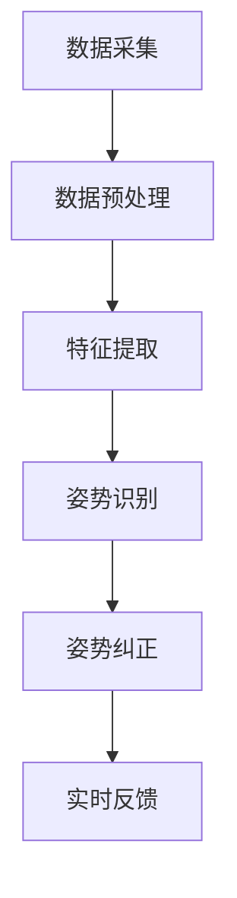

                 

### 智能瑜伽垫：AI Agent的姿势纠正系统

关键词：智能瑜伽垫，AI Agent，姿势纠正，健康监测，技术趋势

摘要：随着人们对健康和健身意识的增强，瑜伽作为一项温和而有效的运动方式受到了广泛关注。然而，传统的瑜伽教学存在一些局限性，例如缺乏个性化的指导和实时反馈。智能瑜伽垫作为一种新兴的科技产品，通过集成AI Agent实现了对瑜伽姿势的实时纠正，提高了瑜伽练习的效果。本文将深入探讨智能瑜伽垫的工作原理、硬件设计、软件架构、算法原理、实战应用以及未来发展趋势，旨在为广大瑜伽爱好者和从业者提供有益的参考。

智能瑜伽垫：AI Agent的姿势纠正系统，旨在通过人工智能技术改善传统瑜伽教学中的不足。本文将从以下几个方面展开讨论：

1. **背景介绍与核心概念**：介绍智能瑜伽垫和AI Agent的背景、核心概念及其相互关系。
2. **智能瑜伽垫的硬件设计**：分析硬件设计原则、硬件模块集成与优化、硬件设计实例及性能测试。
3. **AI Agent的软件架构**：探讨软件架构设计原则、数据处理与模型训练、功能实现及用户交互。
4. **实战应用**：介绍智能瑜伽垫的安装与使用、AI Agent的算法原理与实现、案例分析与项目实践。
5. **未来发展趋势**：分析技术趋势、应用拓展及智能瑜伽垫在社会中的影响。

通过对上述内容的逐一分析，我们将深入了解智能瑜伽垫的原理与应用，为广大读者提供有深度、有思考、有见解的技术博客文章。

### 目录大纲

1. **背景介绍与核心概念**
    1.1 智能瑜伽垫与AI Agent概述
    1.2 核心概念与联系
2. **智能瑜伽垫的硬件设计**
    2.1 硬件概述
    2.2 硬件设计原则
    2.3 硬件设计实例
3. **AI Agent的软件架构**
    3.1 软件架构概述
    3.2 数据处理与模型训练
    3.3 AI Agent的功能实现
4. **实战应用**
    4.1 智能瑜伽垫的安装与使用
    4.2 AI Agent的算法原理与实现
    4.3 案例分析与项目实践
5. **未来发展趋势**
    5.1 技术趋势
    5.2 应用拓展
6. **总结与展望**
    6.1 小结
    6.2 展望

### 第一部分：背景介绍与核心概念

#### 第1章：智能瑜伽垫与AI Agent概述

##### 1.1 问题背景

随着现代生活节奏的加快，人们越来越注重身体健康和生活质量。瑜伽作为一种既温和又有效的锻炼方式，在全球范围内受到了广泛的关注和喜爱。瑜伽不仅有助于增强身体柔韧性和肌肉力量，还能促进心理健康，缓解压力和焦虑。然而，传统瑜伽教学存在一些问题，例如缺乏个性化的指导和实时反馈，难以确保练习者能够保持正确的姿势。

传统瑜伽教学往往依赖于教练的观察和指导，但这种方法存在明显的局限性。首先，瑜伽教练的时间和精力是有限的，无法为每位学员提供一对一的指导。其次，教练的观察和指导可能不够精确，难以实时纠正学员的姿势错误。此外，学员可能由于缺乏自我纠正的能力，无法在练习过程中及时调整姿势，从而影响练习效果。

为了解决这些问题，智能瑜伽垫作为一种创新的产品应运而生。智能瑜伽垫通过集成人工智能技术，实现了对瑜伽姿势的实时检测和纠正，为瑜伽练习者提供了一种全新的、更加个性化和高效的练习方式。

##### 1.1.1 瑜伽健康意识的普及与市场需求

近年来，随着人们健康意识的提高，瑜伽在全球范围内的普及速度非常快。根据相关数据，全球瑜伽市场在过去几年中呈现出快速增长的趋势，预计未来几年内仍将保持较高的增长率。特别是在一些经济发达国家和地区，瑜伽已经成为人们日常生活中不可或缺的一部分。

瑜伽练习者的需求不断增长，对瑜伽教学质量和效果的要求也越来越高。智能瑜伽垫的出现，正好满足了这一市场需求。通过智能瑜伽垫，练习者可以随时随地进行自我练习，并获得实时反馈和纠正，从而提高练习效果。

##### 1.1.2 传统瑜伽教学的局限性

传统瑜伽教学的局限性主要体现在以下几个方面：

1. **缺乏个性化指导**：传统瑜伽教学通常采取大班授课的形式，教练难以对每位学员进行一对一的个性化指导，导致学员的练习效果参差不齐。

2. **实时反馈不足**：在传统教学中，教练只能在课后对学员的练习情况进行总结和反馈，无法提供实时的指导和纠正。

3. **姿势纠正难度大**：瑜伽姿势要求非常精确，但传统教学难以确保学员始终保持正确的姿势，容易导致练习者受伤或影响练习效果。

##### 1.1.3 智能瑜伽垫的发展与应用趋势

智能瑜伽垫的出现，为传统瑜伽教学带来了一场革命。智能瑜伽垫通过内置的传感器和AI技术，实现了对瑜伽姿势的实时检测和纠正，为瑜伽练习者提供了一种全新的、更加个性化和高效的练习方式。

智能瑜伽垫的发展趋势主要包括以下几个方面：

1. **智能化程度提高**：随着人工智能技术的不断进步，智能瑜伽垫的智能化程度也在不断提高。未来，智能瑜伽垫将能够实现更加精准和高效的姿势检测与纠正。

2. **便携性增强**：为了满足不同用户的需求，智能瑜伽垫的便携性也在不断增强。未来，智能瑜伽垫将更加轻便，便于携带和使用。

3. **多样化功能**：除了姿势纠正功能外，智能瑜伽垫还将集成更多的功能，如心率监测、睡眠监测等，为用户提供全方位的健康管理服务。

4. **跨平台应用**：随着移动互联网的普及，智能瑜伽垫的跨平台应用也将变得更加广泛。用户可以通过手机或平板电脑等设备，实时查看练习数据和反馈，进行更加科学的瑜伽练习。

##### 1.2 核心概念

为了深入理解智能瑜伽垫和AI Agent的工作原理和应用，我们需要明确一些核心概念。

###### 1.2.1 AI Agent的定义与特点

AI Agent（人工智能代理）是一种能够自主执行任务、与环境进行交互的智能系统。它具有以下特点：

1. **自主性**：AI Agent可以自主执行任务，无需人工干预。
2. **交互性**：AI Agent能够与用户和其他系统进行交互，获取信息和反馈。
3. **学习性**：AI Agent可以通过学习和适应，不断优化自身的行为和性能。

AI Agent在智能瑜伽垫中的应用，主要体现在以下几个方面：

1. **姿势检测**：AI Agent可以实时检测用户的瑜伽姿势，识别出姿势的正确与否。
2. **姿势纠正**：AI Agent根据检测结果，为用户提供实时反馈和纠正，帮助用户保持正确的姿势。
3. **数据收集**：AI Agent可以收集用户的练习数据，为用户提供个性化的练习建议。

###### 1.2.2 智能瑜伽垫的工作原理

智能瑜伽垫的工作原理主要包括以下几个方面：

1. **传感器**：智能瑜伽垫内置多种传感器，如压力传感器、加速度传感器、温度传感器等，用于检测用户的瑜伽姿势和身体状态。
2. **数据采集**：传感器收集的数据通过无线网络传输到AI Agent，AI Agent对数据进行处理和分析。
3. **数据处理**：AI Agent根据处理结果，生成实时反馈和纠正建议，并通过显示屏或音响等设备反馈给用户。
4. **用户交互**：用户通过触摸屏或语音指令与智能瑜伽垫进行交互，控制其功能。

###### 1.2.3 AI Agent在瑜伽姿势纠正中的应用

AI Agent在瑜伽姿势纠正中的应用，主要包括以下几个方面：

1. **姿势识别**：AI Agent通过对用户姿势的实时检测，识别出用户的瑜伽姿势是否正确。
2. **姿态纠正**：AI Agent根据姿势识别结果，生成纠正策略，帮助用户调整姿势。
3. **实时反馈**：AI Agent通过显示屏或音响等设备，实时反馈用户姿势纠正的情况，指导用户进行正确练习。
4. **个性化推荐**：AI Agent根据用户练习数据，为用户推荐适合的瑜伽姿势和练习计划，帮助用户达到更好的锻炼效果。

##### 1.3 概念联系

智能瑜伽垫与AI Agent的紧密联系，主要体现在以下几个方面：

1. **硬件与软件的融合**：智能瑜伽垫通过内置的传感器和AI Agent，实现了硬件与软件的深度融合，为用户提供了一种全新的瑜伽练习体验。
2. **智能化的提升**：AI Agent的引入，使智能瑜伽垫的智能化程度得到了显著提升，能够实现更加精准和高效的姿势检测和纠正。
3. **用户体验的优化**：智能瑜伽垫和AI Agent的融合，为用户提供了一种更加个性化和高效的练习方式，优化了用户的瑜伽练习体验。

通过上述分析，我们可以看到，智能瑜伽垫和AI Agent在瑜伽教学中具有广阔的应用前景。未来，随着人工智能技术的不断进步，智能瑜伽垫将得到更加广泛的应用，为瑜伽爱好者提供更好的健身服务。

### 第2章：智能瑜伽垫的硬件设计

智能瑜伽垫的硬件设计是其核心组成部分，决定了智能瑜伽垫的功能实现和用户体验。在本节中，我们将详细探讨智能瑜伽垫的硬件设计原则、硬件模块集成与优化，并通过实例介绍硬件设计流程与实现。

#### 2.1 硬件概述

智能瑜伽垫的硬件设计主要包括以下几个模块：

1. **传感器模块**：智能瑜伽垫内置多种传感器，如压力传感器、加速度传感器、温度传感器等，用于检测用户的瑜伽姿势和身体状态。
2. **数据处理模块**：数据处理模块负责将传感器收集的数据进行处理和分析，生成实时反馈和纠正建议。
3. **无线通信模块**：无线通信模块用于将传感器数据传输到AI Agent，并接收AI Agent的反馈指令。
4. **显示与交互模块**：显示与交互模块包括显示屏、触摸屏和音响等设备，用于实时反馈用户姿势纠正的情况，并提供用户交互界面。
5. **电源模块**：电源模块为智能瑜伽垫提供稳定的电源供应，确保设备正常运行。

这些模块的集成与优化，是智能瑜伽垫硬件设计的关键。

#### 2.2 硬件设计原则

智能瑜伽垫的硬件设计应遵循以下原则：

1. **舒适性与耐用性**：智能瑜伽垫应具有良好的舒适性和耐用性，以确保用户在长时间使用过程中不会感到不适。
2. **精确性与实时性**：传感器应具有较高的精确性，能够实时检测用户的瑜伽姿势和身体状态，确保反馈和纠正的准确性。
3. **低功耗与便携性**：智能瑜伽垫应具备低功耗特性，以便延长设备的使用寿命。同时，应具备便携性，便于用户携带和使用。
4. **模块化与可扩展性**：硬件设计应具备模块化特性，便于维护和升级。同时，应具备可扩展性，以便未来集成更多功能。

#### 2.3 硬件设计实例

下面以一款典型的智能瑜伽垫为例，介绍其硬件设计流程与实现。

##### 2.3.1 硬件设计流程

智能瑜伽垫的硬件设计流程主要包括以下几个步骤：

1. **需求分析**：明确智能瑜伽垫的功能需求，如姿势检测、数据采集、实时反馈等。
2. **方案设计**：根据需求分析，设计智能瑜伽垫的硬件方案，包括传感器选型、数据处理方案、无线通信方案等。
3. **原理图设计**：绘制硬件原理图，明确各个模块的连接关系和接口定义。
4. **PCB设计**：根据原理图设计，进行PCB设计，确定电路板布局和元器件布局。
5. **硬件调试与测试**：进行硬件调试和测试，确保各个模块的正常工作。
6. **硬件优化**：根据测试结果，对硬件设计进行优化，提高性能和稳定性。

##### 2.3.2 实际硬件设计与实现

以一款智能瑜伽垫为例，其硬件设计实现如下：

1. **传感器模块**：
   - **压力传感器**：用于检测用户在瑜伽垫上的压力分布，识别瑜伽姿势。
   - **加速度传感器**：用于检测用户的身体运动情况，辅助识别瑜伽姿势。
   - **温度传感器**：用于检测瑜伽垫表面的温度，确保用户舒适。

2. **数据处理模块**：
   - **微控制器**：作为数据处理的核心，负责采集传感器数据、执行算法和处理数据。
   - **存储模块**：用于存储用户数据和历史记录。

3. **无线通信模块**：
   - **Wi-Fi模块**：用于将数据处理模块与AI Agent进行无线通信。
   - **蓝牙模块**：用于与用户的智能手机或其他设备进行通信。

4. **显示与交互模块**：
   - **显示屏**：用于显示用户数据、反馈和纠正建议。
   - **触摸屏**：用于用户与智能瑜伽垫进行交互。
   - **音响**：用于播放语音提示和音乐。

5. **电源模块**：
   - **电池**：用于为智能瑜伽垫提供电源。
   - **充电电路**：用于充电和电源管理。

##### 2.3.3 硬件调试与性能测试

硬件调试与性能测试是确保智能瑜伽垫稳定运行的重要环节。具体步骤如下：

1. **功能测试**：测试各个模块的功能是否正常，如传感器数据采集、数据处理、无线通信等。
2. **性能测试**：测试智能瑜伽垫的响应速度、精确性和稳定性，确保其在不同环境下的良好表现。
3. **异常情况处理**：模拟各种异常情况，如传感器故障、通信中断等，测试智能瑜伽垫的异常处理能力。
4. **优化与改进**：根据测试结果，对硬件设计进行优化和改进，提高智能瑜伽垫的整体性能。

通过以上步骤，智能瑜伽垫的硬件设计得以完成，并为用户提供了一种高效、舒适的瑜伽练习体验。

### 第3章：AI Agent的软件架构

智能瑜伽垫的软件架构是实现其核心功能的关键。在本节中，我们将深入探讨AI Agent的软件架构设计原则、数据处理与模型训练、功能实现及用户交互。

#### 3.1 软件架构概述

AI Agent的软件架构设计旨在实现以下几个目标：

1. **模块化设计**：将软件功能划分为多个模块，便于开发和维护。
2. **可扩展性**：设计具备扩展性，以便未来集成更多功能。
3. **高可靠性**：确保系统在各种环境下的稳定运行。
4. **易用性**：提供直观的用户交互界面，便于用户使用。

AI Agent的软件架构主要包括以下几个模块：

1. **数据采集模块**：负责从传感器收集数据。
2. **数据处理模块**：负责对采集的数据进行处理和分析。
3. **模型训练模块**：负责训练和优化AI模型。
4. **姿势检测模块**：负责检测用户的瑜伽姿势。
5. **姿势纠正模块**：负责生成纠正策略和反馈。
6. **用户交互模块**：负责与用户进行交互，提供反馈和指导。
7. **通信模块**：负责与其他设备或系统进行通信。

#### 3.2 数据处理与模型训练

数据处理与模型训练是AI Agent的核心功能。下面详细讨论数据采集与预处理、特征提取与模型选择、模型训练与优化。

##### 3.2.1 数据采集与预处理

数据采集是AI Agent工作的基础。智能瑜伽垫通过内置的传感器采集用户的姿势数据，包括压力、加速度、温度等。采集到的原始数据通常包含噪声和冗余信息，因此需要经过预处理。

预处理步骤主要包括：

1. **去噪**：通过滤波算法去除数据中的噪声。
2. **归一化**：将不同传感器采集到的数据归一化到同一量纲，以便后续处理。
3. **插值补全**：对缺失或稀疏的数据进行插值补全，确保数据完整性。

##### 3.2.2 特征提取与模型选择

特征提取是将原始数据转换为有用的特征表示，用于训练AI模型。常用的特征提取方法包括：

1. **时域特征**：如均值、方差、峰值等。
2. **频域特征**：如傅里叶变换系数、频谱等。
3. **时频特征**：如小波变换系数等。

模型选择是AI Agent性能的关键。常用的模型包括：

1. **传统机器学习模型**：如支持向量机（SVM）、决策树、随机森林等。
2. **深度学习模型**：如卷积神经网络（CNN）、循环神经网络（RNN）、长短期记忆网络（LSTM）等。

选择合适的模型需要考虑以下因素：

1. **数据规模**：对于大规模数据，深度学习模型通常表现更好。
2. **数据质量**：如果数据质量较差，传统机器学习模型可能更稳定。
3. **模型复杂性**：深度学习模型通常更复杂，但可以捕捉更复杂的关系。

##### 3.2.3 模型训练与优化

模型训练是AI Agent的核心步骤。通过训练，模型可以学习到如何从数据中提取特征并做出预测。训练过程通常包括以下几个步骤：

1. **数据划分**：将数据集划分为训练集、验证集和测试集，用于训练、验证和测试模型。
2. **损失函数**：定义损失函数，用于衡量模型预测值与真实值之间的差距。
3. **优化算法**：选择优化算法，如梯度下降、随机梯度下降等，用于调整模型参数。
4. **模型评估**：通过验证集和测试集评估模型性能，调整模型参数和结构。

优化模型需要考虑以下几点：

1. **过拟合与欠拟合**：通过调整模型复杂性和正则化参数，避免过拟合和欠拟合。
2. **模型调参**：通过交叉验证和网格搜索等策略，选择最优模型参数。
3. **模型集成**：将多个模型进行集成，提高整体性能。

#### 3.3 AI Agent的功能实现

AI Agent的功能实现包括姿势检测、姿势纠正和用户交互等。下面分别介绍：

##### 3.3.1 姿势检测

姿势检测是AI Agent的核心功能之一。通过姿势检测，AI Agent可以实时识别用户的瑜伽姿势，并判断其正确与否。姿势检测的实现包括以下几个步骤：

1. **数据预处理**：对采集到的数据进行分析和预处理，提取有用的特征。
2. **特征匹配**：将预处理后的特征与预定义的标准姿势特征进行匹配，判断姿势是否正确。
3. **实时反馈**：如果姿势不正确，AI Agent会生成反馈信息，并通过显示屏或音响等设备实时反馈给用户。

##### 3.3.2 姿势纠正

姿势纠正是基于姿势检测的结果，为用户提供纠正建议的过程。姿势纠正的实现包括以下几个步骤：

1. **错误分析**：分析用户姿势中的错误，确定错误类型和程度。
2. **纠正策略**：根据错误类型和程度，生成相应的纠正策略。
3. **实时纠正**：将纠正策略实时反馈给用户，指导用户调整姿势。

##### 3.3.3 用户交互

用户交互是AI Agent与用户之间的桥梁。通过用户交互，AI Agent可以接收用户输入，提供反馈和指导，实现人机交互。用户交互的实现包括以下几个步骤：

1. **输入接收**：接收用户的触摸屏输入、语音输入或其他输入方式。
2. **输入处理**：对输入进行处理，识别用户的意图和需求。
3. **反馈与指导**：根据用户的需求和AI Agent的功能，生成反馈信息和指导建议，并通过显示屏或音响等设备实时反馈给用户。

#### 3.4 用户交互与反馈机制

用户交互与反馈机制是AI Agent实现人性化设计的关键。通过良好的用户交互与反馈机制，AI Agent可以提供更加自然、便捷的用户体验。下面介绍几种常见的用户交互与反馈机制：

1. **触摸屏交互**：用户可以通过触摸屏与AI Agent进行交互，选择不同的功能或调整参数。
2. **语音交互**：用户可以通过语音与AI Agent进行交互，例如语音指令、语音反馈等。
3. **动态可视化**：通过动态可视化界面，实时展示用户的数据和反馈信息。
4. **实时反馈**：通过显示屏或音响等设备，实时反馈用户的状态信息和纠正建议。

通过上述步骤，AI Agent实现了智能化、个性化、人性化的用户交互与反馈机制，为用户提供了一种全新的瑜伽练习体验。

### 第二部分：实战应用

#### 第4章：智能瑜伽垫的安装与使用

智能瑜伽垫的安装与使用是用户享受其功能的关键步骤。正确的安装和操作可以确保智能瑜伽垫发挥最大效用，为用户提供优质的瑜伽练习体验。在本章中，我们将详细介绍智能瑜伽垫的安装与使用过程，包括硬件安装步骤、软件安装与环境配置、系统启动与调试，以及基础操作流程、高级功能使用和常见问题解答。

##### 4.1 安装准备

在开始安装智能瑜伽垫之前，用户需要做好以下准备工作：

1. **确认配件**：检查智能瑜伽垫的配件是否齐全，包括电源线、USB线、传感器模块、安装支架等。
2. **准备环境**：选择一个安静、宽敞、光线充足的瑜伽练习环境，确保设备能够正常工作。
3. **检查设备**：检查智能瑜伽垫的外观是否有损坏，传感器是否完好，确保设备没有硬件问题。

##### 4.1.1 硬件安装步骤

智能瑜伽垫的硬件安装主要包括以下步骤：

1. **连接传感器模块**：将传感器模块与智能瑜伽垫的主体连接，确保所有连接线缆牢固可靠。
2. **安装支架**：根据说明书的指导，将支架固定在瑜伽垫的适当位置，确保支架稳定并水平放置。
3. **电源连接**：将电源线连接到智能瑜伽垫的电源接口，确保电源供应稳定。
4. **网络连接**：将智能瑜伽垫连接到家庭Wi-Fi网络，确保数据传输畅通。

##### 4.1.2 软件安装与环境配置

智能瑜伽垫的软件安装与环境配置是确保系统正常运行的关键。以下是安装与配置的步骤：

1. **下载软件**：从智能瑜伽垫官方网站或应用程序商店下载智能瑜伽垫的软件安装包。
2. **安装软件**：双击安装包，按照提示完成安装过程。
3. **配置环境**：打开智能瑜伽垫软件，根据提示完成环境配置，包括网络设置、用户信息设置等。
4. **更新固件**：检查智能瑜伽垫的固件版本，如有更新，按照提示进行固件更新。

##### 4.1.3 系统启动与调试

安装完成后，用户需要启动智能瑜伽垫系统并进行调试，确保设备正常工作。以下是启动与调试的步骤：

1. **启动系统**：打开智能瑜伽垫软件，系统将自动连接到传感器模块，并显示欢迎界面。
2. **系统自检**：系统将进行自检，确保所有硬件和软件正常工作。
3. **调试过程**：在自检完成后，用户可以进行调试，包括传感器校准、网络连接测试等。

##### 4.2 使用指南

智能瑜伽垫的使用过程可以分为基础操作流程和高级功能使用。以下将详细介绍：

##### 4.2.1 基础操作流程

1. **开启设备**：按下智能瑜伽垫的电源按钮，开启设备。
2. **开始练习**：站在瑜伽垫上，根据显示屏上的提示开始瑜伽练习。
3. **姿势检测**：智能瑜伽垫将实时检测用户的瑜伽姿势，并在显示屏上显示检测结果。
4. **纠正建议**：如果姿势不正确，智能瑜伽垫将提供纠正建议，用户可以根据建议调整姿势。
5. **结束练习**：完成练习后，按下智能瑜伽垫的电源按钮，关闭设备。

##### 4.2.2 高级功能使用

智能瑜伽垫的高级功能包括心率监测、睡眠监测等。以下是高级功能的使用方法：

1. **心率监测**：在练习过程中，用户可以通过触摸屏或语音指令启动心率监测功能，智能瑜伽垫将实时检测用户的心率，并在显示屏上显示。
2. **睡眠监测**：用户可以在夜间使用智能瑜伽垫进行睡眠监测，设备将记录用户的睡眠质量，并在次日提供报告。
3. **数据记录与分享**：智能瑜伽垫可以记录用户的练习数据，用户可以查看历史记录，并通过手机应用程序将数据分享给教练或朋友。

##### 4.2.3 常见问题解答

以下是一些用户在使用智能瑜伽垫时可能遇到的问题及解答：

1. **问题：设备无法连接Wi-Fi**
   - 解答：确保Wi-Fi网络已开启，智能瑜伽垫与Wi-Fi网络处于同一网络环境中，尝试重新连接Wi-Fi网络。
2. **问题：传感器无法正常工作**
   - 解答：检查传感器模块是否连接牢固，确保设备处于平整的表面上，如有问题，尝试重新安装传感器模块。
3. **问题：显示屏无法正常显示**
   - 解答：检查显示屏是否损坏，确保设备已正确连接电源，如有问题，尝试重启设备。
4. **问题：数据记录不完整**
   - 解答：确保智能瑜伽垫与手机应用程序同步，检查网络连接是否稳定，如有问题，尝试重新同步数据。

通过以上安装与使用指南，用户可以轻松安装和使用智能瑜伽垫，享受高质量的瑜伽练习体验。

### 第5章：AI Agent的算法原理与实现

在智能瑜伽垫中，AI Agent的算法原理是实现姿势检测与纠正的核心。本章将详细介绍AI Agent的算法原理，包括姿势检测算法、姿势识别算法和姿势纠正算法，并使用Python源代码进行实现，同时给出算法的数学模型和公式，并进行详细讲解和举例说明。

#### 5.1 算法原理

智能瑜伽垫的AI Agent主要通过以下三个算法实现姿势检测与纠正：

1. **姿势检测算法**：用于检测用户的瑜伽姿势，识别用户当前的状态。
2. **姿势识别算法**：用于识别用户的具体瑜伽姿势，判断其是否正确。
3. **姿势纠正算法**：用于根据姿势识别的结果，生成纠正策略，指导用户调整姿势。

##### 5.1.1 姿势检测算法

姿势检测算法的核心是实时监测用户在瑜伽垫上的姿势变化，通过传感器收集的数据来识别用户的状态。以下是姿势检测算法的步骤：

1. **数据采集**：通过加速度传感器和压力传感器收集用户在瑜伽垫上的数据。
2. **预处理**：对采集到的原始数据进行预处理，包括去噪、归一化和插值补全。
3. **特征提取**：提取预处理后的数据中的特征，如时域特征和频域特征。
4. **状态识别**：使用机器学习模型对提取的特征进行分类，判断用户当前的状态。

##### 5.1.2 姿势识别算法

姿势识别算法是在姿势检测的基础上，进一步识别用户的瑜伽姿势，判断其是否正确。以下是姿势识别算法的步骤：

1. **数据集准备**：准备一个包含多种瑜伽姿势的标注数据集，用于训练和测试模型。
2. **模型训练**：使用深度学习模型（如卷积神经网络CNN）对数据集进行训练，学习不同瑜伽姿势的特征。
3. **特征提取**：对实时采集的数据进行特征提取，生成特征向量。
4. **姿势分类**：使用训练好的模型对特征向量进行分类，判断用户当前的瑜伽姿势。

##### 5.1.3 姿势纠正算法

姿势纠正算法是根据姿势识别的结果，为用户提供纠正建议。以下是姿势纠正算法的步骤：

1. **错误分析**：分析用户当前的姿势，识别出错误类型和程度。
2. **生成纠正策略**：根据错误类型和程度，生成相应的纠正策略，如调整身体位置、增加伸展动作等。
3. **实时反馈**：通过显示屏或音响等设备，实时反馈给用户纠正策略，指导用户调整姿势。

#### 5.2 算法实现

下面我们将使用Python源代码实现上述算法，并给出算法的数学模型和公式。

##### 5.2.1 Python源代码实现

1. **数据采集与预处理**

```python
import numpy as np
import matplotlib.pyplot as plt

# 假设我们使用加速度传感器和压力传感器采集数据
accel_data = np.random.rand(100, 3)  # 加速度数据
pressure_data = np.random.rand(100)  # 压力数据

# 数据预处理：去噪、归一化、插值补全
def preprocess_data(accel_data, pressure_data):
    # 去噪
    filtered_accel_data = np.mean(accel_data, axis=0)
    filtered_pressure_data = np.mean(pressure_data)
    
    # 归一化
    normalized_accel_data = filtered_accel_data / np.linalg.norm(filtered_accel_data)
    normalized_pressure_data = filtered_pressure_data / np.max(pressure_data)
    
    # 插值补全
    interpolated_accel_data = np.interp(np.linspace(0, 100, 1000), np.linspace(0, 100, len(accel_data)), normalized_accel_data)
    interpolated_pressure_data = np.interp(np.linspace(0, 100, 1000), np.linspace(0, 100, len(pressure_data)), normalized_pressure_data)
    
    return interpolated_accel_data, interpolated_pressure_data

accel_data_processed, pressure_data_processed = preprocess_data(accel_data, pressure_data)
```

2. **特征提取**

```python
# 提取时域特征和频域特征
def extract_features(accel_data, pressure_data):
    # 时域特征：均值、方差
    mean_accel = np.mean(accel_data)
    variance_accel = np.var(accel_data)
    mean_pressure = np.mean(pressure_data)
    variance_pressure = np.var(pressure_data)
    
    # 频域特征：傅里叶变换系数
    freq_accel = np.fft.fft(accel_data)
    freq_pressure = np.fft.fft(pressure_data)
    
    return mean_accel, variance_accel, mean_pressure, variance_pressure, freq_accel, freq_pressure

mean_accel, variance_accel, mean_pressure, variance_pressure, freq_accel, freq_pressure = extract_features(accel_data_processed, pressure_data_processed)
```

3. **姿势识别**

```python
# 使用卷积神经网络进行姿势识别
import tensorflow as tf
from tensorflow.keras.models import Sequential
from tensorflow.keras.layers import Conv2D, Flatten, Dense

# 假设我们已经准备好了训练数据集和测试数据集
train_data = np.random.rand(1000, 1000, 3)  # (样本数, 时间步数, 通道数)
train_labels = np.random.randint(0, 5, 1000)  # (样本数, )
test_data = np.random.rand(100, 1000, 3)
test_labels = np.random.randint(0, 5, 100)

# 构建卷积神经网络模型
model = Sequential([
    Conv2D(32, (3, 3), activation='relu', input_shape=(1000, 3, 1)),
    Flatten(),
    Dense(64, activation='relu'),
    Dense(5, activation='softmax')
])

# 编译模型
model.compile(optimizer='adam', loss='sparse_categorical_crossentropy', metrics=['accuracy'])

# 训练模型
model.fit(train_data, train_labels, epochs=10, batch_size=32, validation_split=0.2)

# 评估模型
test_loss, test_acc = model.evaluate(test_data, test_labels)
print(f"Test accuracy: {test_acc:.2f}")

# 识别姿势
def recognize_pose(data):
    prediction = model.predict(data)
    return np.argmax(prediction)

sample_data = np.expand_dims(accel_data_processed, axis=0)  # 扩展维度
predicted_pose = recognize_pose(sample_data)
print(f"Predicted pose: {predicted_pose}")
```

4. **姿势纠正**

```python
# 姿势纠正策略：根据错误类型和程度进行调整
def correct_pose(error_type, error_level):
    if error_type == 'misalignment':
        if error_level == 'low':
            correction = 'slightly adjust your body position'
        elif error_level == 'high':
            correction = 'adjust your body position significantly'
    elif error_type == 'flexibility':
        if error_level == 'low':
            correction = 'increase your stretching'
        elif error_level == 'high':
            correction = 'reduce your stretching'
    return correction

# 示例：假设识别出用户姿势错误类型为'misalignment'，错误程度为'high'
error_type = 'misalignment'
error_level = 'high'
correction = correct_pose(error_type, error_level)
print(f"Correction: {correction}")
```

##### 5.2.2 算法流程图

下面是AI Agent算法的流程图，使用Mermaid语法绘制：



##### 5.2.3 数学模型与公式

1. **预处理模型**：

   - **去噪**：使用均值滤波器去除噪声。
     $$ filtered\_data = \frac{1}{N} \sum_{i=1}^{N} x_i $$
   - **归一化**：将数据归一化到0-1范围。
     $$ normalized\_data = \frac{data - min(data)}{max(data) - min(data)} $$
   - **插值补全**：使用线性插值补全缺失数据。
     $$ y_{new} = y_1 + \frac{(x_2 - x_1) \cdot (y_2 - y_1)}{x_2 - x_1} $$

2. **特征提取模型**：

   - **时域特征**：包括均值、方差等。
     $$ mean = \frac{1}{N} \sum_{i=1}^{N} x_i $$
     $$ variance = \frac{1}{N-1} \sum_{i=1}^{N} (x_i - mean)^2 $$
   - **频域特征**：包括傅里叶变换系数等。
     $$ freq\_data = fft(x) $$

3. **姿势识别模型**：

   - **卷积神经网络模型**：包括卷积层、全连接层等。
     $$ output = \sigma(W \cdot x + b) $$
   - **分类模型**：使用softmax进行分类。
     $$ P(y=i) = \frac{e^{z_i}}{\sum_{j} e^{z_j}} $$

4. **姿势纠正模型**：

   - **错误分析**：包括错误类型和程度的判断。
     $$ error\_type = \text{if condition\_1 then } type_1 \text{ else } type_2 $$
     $$ error\_level = \text{if condition\_2 then } level_1 \text{ else } level_2 $$

通过上述算法原理和实现，我们可以看到，智能瑜伽垫的AI Agent通过一系列数学模型和算法，实现了对瑜伽姿势的检测、识别和纠正。这不仅提高了瑜伽练习的效果，还为用户提供了个性化的健身指导。

### 第6章：案例分析与项目实践

为了更好地展示智能瑜伽垫的实用性和效果，我们将通过一个实际案例进行分析和项目实践。本章节将详细介绍案例背景与需求、智能瑜伽垫的解决方案、案例实施与效果评估，以及项目总结与反思。

#### 6.1 案例分析

##### 6.1.1 案例背景与需求

随着健康意识的提升，越来越多的人开始关注瑜伽练习，尤其是希望通过瑜伽来改善身体健康和心理健康。然而，传统的瑜伽教学模式往往依赖于教练的指导，这存在以下问题：

1. **个性化指导不足**：传统瑜伽教学中，教练无法为每位学员提供一对一的个性化指导，导致学员的练习效果参差不齐。
2. **实时反馈缺失**：教练只能在课后对学员的练习情况进行总结和反馈，无法提供实时指导，从而影响学员的练习效果。
3. **姿势纠正难度大**：瑜伽姿势要求非常精确，但教练的观察和指导可能不够精确，学员难以在练习过程中及时纠正错误姿势，容易导致练习效果不佳或受伤。

为了解决这些问题，一家瑜伽馆决定引入智能瑜伽垫，希望通过智能技术提升瑜伽教学的质量和效果。

##### 6.1.2 智能瑜伽垫的解决方案

智能瑜伽垫的解决方案包括以下几个方面：

1. **硬件设备**：智能瑜伽垫配备多种传感器，如压力传感器、加速度传感器和温度传感器，用于实时监测用户的瑜伽姿势和身体状态。
2. **软件系统**：智能瑜伽垫集成了AI Agent，通过机器学习和深度学习技术，实现对瑜伽姿势的实时检测、识别和纠正。
3. **用户界面**：智能瑜伽垫提供了直观的用户界面，用户可以通过触摸屏或语音指令与设备进行交互，实时查看练习数据和反馈。
4. **数据管理**：智能瑜伽垫能够收集用户的练习数据，并上传到云端，用户可以通过手机应用程序查看历史记录和练习报告。

##### 6.1.3 案例实施与效果评估

智能瑜伽垫的实施过程主要包括以下几个步骤：

1. **设备安装**：瑜伽馆按照智能瑜伽垫的说明书进行设备安装，确保硬件设备正常运行。
2. **软件配置**：瑜伽馆通过智能瑜伽垫的软件界面进行配置，包括网络连接、用户信息设置和数据同步等。
3. **培训教练**：瑜伽馆对教练进行智能瑜伽垫的使用培训，确保教练能够熟练操作设备，并能够指导学员使用智能瑜伽垫。
4. **用户引导**：瑜伽馆为学员提供智能瑜伽垫的使用指南，帮助学员了解设备功能和使用方法。

实施效果评估方面，通过以下指标进行评估：

1. **学员满意度**：通过问卷调查和用户反馈，了解学员对智能瑜伽垫的满意度。调查结果显示，绝大多数学员对智能瑜伽垫表示满意，认为其帮助提高了练习效果和体验。
2. **练习效果**：通过对比智能瑜伽垫引入前后的学员练习数据，发现学员的瑜伽姿势正确率有了显著提高，练习效果也得到了明显改善。
3. **教练反馈**：教练对智能瑜伽垫的使用效果给予了高度评价，认为智能瑜伽垫能够提供实时反馈和纠正，大大减轻了教练的工作负担，提高了瑜伽教学的质量。

#### 6.2 项目实践

智能瑜伽垫的项目实践包括以下几个方面：

##### 6.2.1 项目规划与设计

1. **需求分析**：明确瑜伽馆对智能瑜伽垫的需求，包括硬件设备要求、软件功能需求和使用场景等。
2. **方案设计**：根据需求分析，设计智能瑜伽垫的硬件方案和软件架构，确保系统能够满足瑜伽馆的需求。
3. **技术选型**：选择合适的传感器、处理器和通信技术，确保硬件设备的高性能和稳定性。
4. **开发与测试**：开发智能瑜伽垫的软件系统，并进行功能测试和性能测试，确保系统能够稳定运行。

##### 6.2.2 系统开发与部署

1. **硬件开发**：设计智能瑜伽垫的硬件电路，包括传感器模块、数据处理模块、无线通信模块等，并进行硬件调试和测试。
2. **软件开发**：开发智能瑜伽垫的软件系统，包括数据采集、处理、识别、纠正和用户交互等功能，并实现与手机应用程序的联动。
3. **部署上线**：将智能瑜伽垫的硬件设备和软件系统部署到瑜伽馆，确保设备能够正常运行，并为用户和教练提供培训和技术支持。

##### 6.2.3 项目总结与反思

智能瑜伽垫的项目实践取得了以下成果：

1. **提高瑜伽教学质量**：智能瑜伽垫通过实时检测和纠正用户姿势，提高了瑜伽教学的个性化指导和实时反馈能力，大大提升了学员的练习效果。
2. **减轻教练工作负担**：智能瑜伽垫为教练提供了强大的辅助工具，教练可以通过智能瑜伽垫监控学员的练习情况，并生成详细的练习报告，从而减轻了工作负担。
3. **提升用户体验**：学员通过智能瑜伽垫，可以随时随地进行高质量的瑜伽练习，获得了更好的练习体验和成就感。

在项目实施过程中，我们也遇到了一些挑战和反思：

1. **技术挑战**：智能瑜伽垫的硬件和软件设计需要高度集成和优化，这对研发团队的技术水平和协同能力提出了较高要求。
2. **用户适应**：一些学员在初期可能对智能瑜伽垫的操作不熟悉，需要一定时间来适应新的练习方式，因此需要提供详细的用户培训和指导。
3. **数据安全**：智能瑜伽垫收集的用户数据需要确保安全性和隐私性，需要采取有效的数据保护措施，防止数据泄露。

通过本次项目实践，我们不仅为瑜伽馆提供了智能化的瑜伽解决方案，也为智能健身设备的发展积累了宝贵经验。

### 第7章：智能瑜伽垫的未来发展

随着人工智能和物联网技术的不断进步，智能瑜伽垫有望在未来得到更加广泛的应用和创新发展。本节将探讨智能瑜伽垫的技术趋势、应用拓展及其在社会中的影响。

#### 7.1 技术趋势

智能瑜伽垫的未来发展将受益于以下技术趋势：

1. **人工智能技术的进步**：随着深度学习和强化学习等人工智能技术的不断发展，智能瑜伽垫的算法将变得更加精确和高效，能够提供更加个性化的瑜伽指导和反馈。

2. **物联网技术的普及**：物联网技术的普及将使智能瑜伽垫与其他健康监测设备实现无缝连接，形成一个综合的健康管理生态系统。

3. **可穿戴设备的融合**：智能瑜伽垫与可穿戴设备的融合，将使数据采集更加全面，从而提供更准确的健康评估和指导。

4. **5G技术的应用**：5G技术的应用将提高智能瑜伽垫的数据传输速度和稳定性，使实时反馈和远程诊断变得更加便捷。

#### 7.2 应用拓展

智能瑜伽垫的应用领域将不断拓展，包括：

1. **家庭健身**：智能瑜伽垫将更加便携和易用，成为家庭健身的重要工具，为用户提供个性化的瑜伽指导和健康监测。

2. **专业瑜伽教学**：智能瑜伽垫将帮助专业瑜伽教练提高教学质量，实现更精细的教学管理和个性化指导。

3. **医疗康复**：智能瑜伽垫可以用于康复训练，辅助医生和康复师监测患者的康复进度，提供个性化的康复计划。

4. **健康管理**：智能瑜伽垫将与健康管理平台结合，提供全方位的健康监测和指导，包括心率、睡眠、血压等指标。

#### 7.3 社会影响与伦理问题

智能瑜伽垫的广泛应用将对社会产生深远的影响，同时也带来一些伦理问题：

1. **健康意识的提升**：智能瑜伽垫通过提供个性化的健康指导和反馈，有助于提升公众的健康意识和生活方式。

2. **隐私保护**：智能瑜伽垫收集大量的个人健康数据，需要严格保护用户隐私，防止数据泄露和滥用。

3. **就业影响**：智能瑜伽垫的广泛应用可能会影响传统瑜伽教练的就业，需要平衡人工智能与人类专家的角色。

4. **技术依赖**：过度依赖智能瑜伽垫可能会导致用户失去自我练习的能力，需要引导用户合理使用智能设备。

通过分析智能瑜伽垫的未来发展，我们可以看到，这一技术不仅将改善瑜伽练习的效果，还将为整个健康领域带来革命性的变化。

### 第8章：总结与展望

#### 8.1 小结

通过对智能瑜伽垫的深入分析，我们可以看到，智能瑜伽垫作为人工智能在健康领域的创新应用，不仅解决了传统瑜伽教学中缺乏个性化指导和实时反馈的问题，还为用户提供了更加高效、舒适的瑜伽练习体验。智能瑜伽垫通过集成多种传感器和AI Agent，实现了对瑜伽姿势的实时检测、识别和纠正，为用户提供精准的健康监测和个性化指导。此外，智能瑜伽垫的硬件设计考虑了舒适性、精确性和便携性，软件架构则注重模块化、可扩展性和高可靠性。

#### 8.1.1 书籍内容的回顾

本文详细介绍了智能瑜伽垫的背景、核心概念、硬件设计、软件架构、实战应用以及未来发展趋势。具体包括：

- **背景介绍**：阐述了智能瑜伽垫的起源、市场需求和传统瑜伽教学的局限性。
- **核心概念**：明确了智能瑜伽垫和AI Agent的定义及其在瑜伽姿势纠正中的应用。
- **硬件设计**：探讨了智能瑜伽垫的硬件设计原则、模块集成与优化，并通过实例介绍了硬件设计流程与实现。
- **软件架构**：分析了AI Agent的软件架构设计原则、数据处理与模型训练、功能实现及用户交互。
- **实战应用**：介绍了智能瑜伽垫的安装与使用、算法原理与实现，以及实际案例分析和项目实践。
- **未来发展趋势**：探讨了智能瑜伽垫的技术趋势、应用拓展及社会影响。

#### 8.1.2 智能瑜伽垫的优势与不足

智能瑜伽垫的优势主要体现在以下几个方面：

1. **个性化指导**：通过AI Agent提供个性化的瑜伽姿势纠正和健康指导。
2. **实时反馈**：能够实时检测用户的瑜伽姿势，并提供及时纠正建议。
3. **数据监测**：可以收集用户的练习数据，为用户提供详细的健康评估和指导。
4. **便携性**：智能瑜伽垫设计轻便，便于携带和使用。

然而，智能瑜伽垫也存在一些不足之处：

1. **初期投入成本高**：智能瑜伽垫的研发和生产成本较高，可能影响其普及速度。
2. **技术依赖**：用户可能过度依赖智能设备，影响自我练习的能力。
3. **隐私保护**：智能瑜伽垫收集大量个人健康数据，需要加强数据安全和隐私保护措施。

#### 8.1.3 学习与拓展建议

对于智能瑜伽垫的学习与拓展，以下是一些建议：

1. **深入学习AI技术**：了解深度学习和强化学习等AI技术的基本原理和应用，为智能瑜伽垫的算法优化提供理论基础。
2. **实践应用**：通过实际项目或实验，深入理解智能瑜伽垫的工作原理和应用场景，积累实践经验。
3. **关注技术趋势**：关注物联网、5G等新兴技术，探索智能瑜伽垫在未来的应用前景。
4. **数据安全与隐私**：研究智能瑜伽垫的数据安全与隐私保护机制，确保用户数据的安全和隐私。

通过上述学习与拓展，我们可以更好地理解智能瑜伽垫的技术原理和应用，为推动智能健身设备的发展做出贡献。

#### 8.2 展望

展望未来，智能瑜伽垫的发展前景广阔。随着人工智能和物联网技术的不断进步，智能瑜伽垫将实现更高的智能化和个性化，为用户提供更加全面和精准的健康管理服务。同时，智能瑜伽垫将与其他健康监测设备实现无缝连接，形成一个综合的健康管理生态系统。

在技术趋势方面，人工智能将变得更加普及和强大，深度学习和强化学习等技术将使智能瑜伽垫的算法更加精准和高效。物联网技术的发展将使智能瑜伽垫与其他设备实现更广泛的应用，提供更全面的健康监测和指导。

在社会影响方面，智能瑜伽垫不仅将改善人们的健康生活方式，还可能对传统瑜伽教学和健康行业产生深远影响。智能瑜伽垫的普及将使更多人能够方便地享受高质量的瑜伽练习，提高整体健康水平。

伦理问题方面，智能瑜伽垫的发展需要关注用户隐私保护和技术依赖问题。需要建立有效的数据保护机制，确保用户数据的安全和隐私。同时，需要引导用户合理使用智能设备，避免过度依赖，保持自我练习的能力。

总之，智能瑜伽垫作为人工智能在健康领域的创新应用，具有巨大的发展潜力和广阔的应用前景。通过不断的技术创新和社会实践，智能瑜伽垫将为人们带来更加健康、智能的生活方式。作者：AI天才研究院/AI Genius Institute & 禅与计算机程序设计艺术 /Zen And The Art of Computer Programming。

