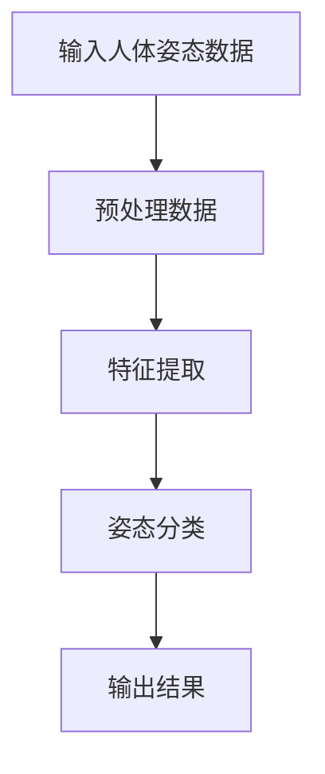
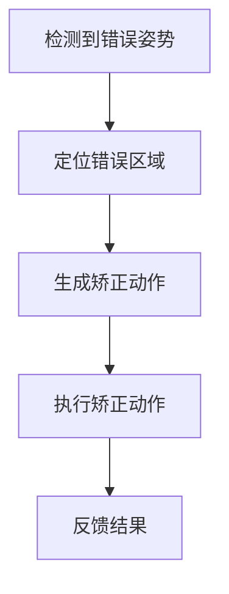
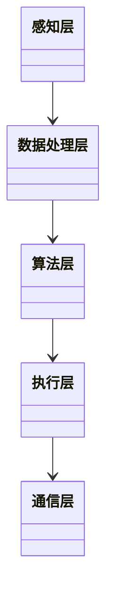
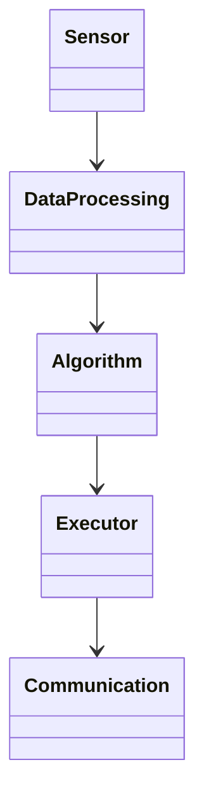
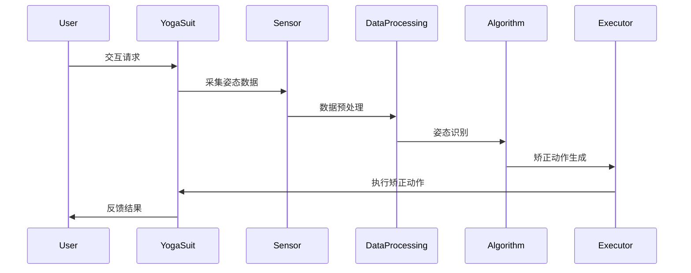

                 

# 智能瑜伽服：AI Agent的姿势矫正系统

## 关键词
- 智能瑜伽服
- AI Agent
- 姿势矫正
- 数据处理
- 用户体验

## 摘要
本文深入探讨了智能瑜伽服中的AI Agent姿势矫正系统的设计与实现。通过分析瑜伽运动的需求现状、AI技术的发展趋势以及智能瑜伽服的发展前景，我们明确了AI Agent在瑜伽姿势矫正中的重要性。文章详细介绍了智能瑜伽服的背景、问题定义、边界与外延、概念结构与核心要素组成。接下来，文章阐述了AI Agent的核心概念与联系，包括人工智能的基本概念、姿势识别技术以及AI Agent的构成要素。通过对比分析不同的姿态识别算法，我们给出了算法原理讲解和Python源代码实现。最后，文章介绍了系统的设计与实现，包括系统分析与架构设计方案以及项目实战，为读者提供了一个全面的智能瑜伽服AI Agent姿势矫正系统的技术参考。

## 1.6 AI大模型的发展趋势与未来展望

### 1.6.1 AI大模型的未来发展趋势

AI大模型作为当前AI领域的一个重要研究方向，正面临着诸多发展机遇与挑战。未来，AI大模型的发展趋势主要体现在以下几个方面：

1. **计算能力的提升**：随着硬件技术的进步，特别是GPU和TPU等专用计算设备的普及，AI大模型的训练速度将得到显著提升。这将使得更大规模、更复杂的模型得以训练和应用。

2. **数据集的扩展**：更多高质量、多样化的数据集将为AI大模型提供丰富的训练资源，有助于提高模型的泛化能力和准确性。

3. **算法的创新**：诸如Transformer等新的神经网络结构将继续推动AI大模型的发展，使得模型能够更好地处理序列数据和时间依赖问题。

4. **应用场景的拓展**：从语音识别、图像处理到自然语言处理，AI大模型的应用场景将不断扩展，覆盖更多领域。

### 1.6.2 企业级应用的发展机遇

企业级应用是AI大模型的一个重要市场，未来的发展机遇体现在：

1. **智能化转型需求**：企业需要通过智能化手段提升生产效率、降低成本、优化管理流程。AI大模型可以为企业提供强大的智能化解决方案。

2. **数据驱动决策**：企业通过AI大模型对海量数据进行分析，可以获得更为精准的市场预测、用户行为分析等，从而做出更加明智的决策。

3. **行业特定应用**：如金融、医疗、制造等行业，AI大模型可以根据行业特点提供定制化的解决方案，满足特定需求。

### 1.6.3 技术与产业的协同创新

技术与产业的协同创新是推动AI大模型发展的重要动力：

1. **跨界合作**：学术界与产业界加强合作，共同推动AI大模型技术的研发和应用。

2. **开放平台**：构建开放的平台生态，促进技术共享、数据流通和资源整合，加速AI大模型的发展。

3. **政策支持**：政府出台相关政策，鼓励企业投资AI技术研发，为AI大模型的发展提供良好的外部环境。

## 第二部分: 智能瑜伽服的AI Agent设计与实现

### 第2章: 背景介绍与问题定义

### 2.1 背景介绍

#### 2.1.1 瑜伽运动与健身需求的现状

瑜伽作为一种融合身体、心灵和精神的综合健身方式，近年来在全球范围内得到了广泛的关注和普及。随着人们生活水平的提高和健康意识的增强，瑜伽运动的需求不断增长。瑜伽不仅有助于增强身体柔韧性和力量，还能改善心理健康，缓解压力和焦虑。因此，瑜伽已成为许多人的日常健身活动之一。

#### 2.1.2 AI技术发展的趋势与应用

随着人工智能技术的迅猛发展，AI在各个领域的应用越来越广泛。特别是在健康与健身领域，AI技术正在发挥重要作用。通过智能穿戴设备、智能健身器材等，AI技术可以帮助用户实时监测身体状况，提供个性化的健身指导，提高健身效果。AI技术在姿势识别、运动分析等方面的应用，使得智能瑜伽服成为可能。

#### 2.1.3 智能瑜伽服的发展与前景

智能瑜伽服是结合了AI技术和瑜伽运动需求的创新产品。它通过内置的传感器和AI算法，实时监测用户的瑜伽动作，提供姿势矫正和反馈，帮助用户正确练习瑜伽，提高练习效果。随着AI技术的不断进步，智能瑜伽服的功能将越来越丰富，市场前景广阔。

### 2.2 问题定义

#### 2.2.1 瑜伽练习中常见的问题

瑜伽练习中，用户常常面临以下问题：

1. **姿势不标准**：由于缺乏专业指导，用户在练习瑜伽时容易出现姿势不标准的情况，可能导致身体受伤或练习效果不佳。

2. **练习频率不足**：由于时间和精力的限制，许多用户无法坚持每天练习瑜伽，导致练习效果不佳。

3. **反馈机制缺失**：传统的瑜伽练习缺乏实时反馈机制，用户无法及时了解自己的姿势是否正确，也无法得到有效的指导。

#### 2.2.2 传统解决方案的不足

传统解决方案如瑜伽教练、瑜伽视频等存在以下不足：

1. **成本高**：请专业瑜伽教练进行指导成本较高，且无法满足所有用户的需求。

2. **时间限制**：用户需要预约教练或观看瑜伽视频，时间安排较为灵活。

3. **反馈不及时**：传统解决方案无法提供实时反馈，用户难以在练习过程中及时纠正错误。

#### 2.2.3 AI Agent在瑜伽姿势矫正中的应用

AI Agent可以实时监测用户的瑜伽动作，通过姿态识别和反馈机制，提供实时、个性化的姿势矫正指导。AI Agent具有以下优势：

1. **低成本**：AI Agent可以通过智能瑜伽服实现，降低用户的成本。

2. **实时反馈**：AI Agent可以实时监测用户的瑜伽动作，提供实时反馈，帮助用户纠正姿势。

3. **个性化指导**：AI Agent可以根据用户的身体数据和练习习惯，提供个性化的指导，提高练习效果。

### 2.3 边界与外延

#### 2.3.1 智能瑜伽服的适用范围

智能瑜伽服适用于以下场景：

1. **瑜伽练习**：帮助用户正确练习瑜伽，提高练习效果。

2. **康复训练**：辅助康复训练，帮助用户恢复身体功能。

3. **健身指导**：为健身爱好者提供个性化健身指导。

#### 2.3.2 AI Agent的功能限制

AI Agent在瑜伽姿势矫正中存在以下功能限制：

1. **姿势识别精度**：目前AI Agent的姿势识别精度仍有待提高，特别是在复杂场景下。

2. **个性化适应**：AI Agent需要大量用户数据训练，才能提供准确的个性化指导。

3. **实时反馈速度**：AI Agent需要快速处理大量数据，并提供实时反馈，这对计算性能提出了较高要求。

#### 2.3.3 用户隐私与数据安全

智能瑜伽服和AI Agent需要收集用户的身体数据和运动数据，因此在用户隐私和数据安全方面需要特别关注：

1. **数据加密**：对用户数据进行加密存储，防止数据泄露。

2. **隐私保护**：严格遵循隐私保护法规，确保用户隐私安全。

3. **数据匿名化**：对用户数据进行匿名化处理，防止个人信息泄露。

### 2.4 概念结构与核心要素组成

#### 2.4.1 智能瑜伽服的组成

智能瑜伽服主要由以下部分组成：

1. **传感器模块**：包括姿态传感器、心率传感器等，用于实时监测用户身体数据。

2. **数据处理器**：用于处理传感器数据，识别用户姿势并提供反馈。

3. **通信模块**：用于与手机或其他设备连接，实现数据传输和交互。

4. **显示模块**：包括屏幕或语音输出，用于向用户展示反馈信息。

#### 2.4.2 AI Agent的架构设计

AI Agent的架构设计主要包括以下部分：

1. **姿态识别模块**：用于识别用户的瑜伽动作和姿势。

2. **反馈模块**：根据识别结果，提供实时反馈和矫正建议。

3. **用户交互模块**：与用户进行交互，收集用户反馈，优化服务。

4. **数据存储模块**：用于存储用户数据，包括身体数据、运动数据等。

#### 2.4.3 数据处理与反馈机制

智能瑜伽服的数据处理与反馈机制主要包括以下步骤：

1. **数据采集**：传感器实时采集用户身体数据。

2. **数据预处理**：对采集到的数据进行清洗和预处理，提取有效特征。

3. **姿态识别**：利用AI算法，对预处理后的数据进行姿态识别。

4. **反馈生成**：根据识别结果，生成反馈信息，包括姿势矫正建议和运动指导。

5. **反馈输出**：通过显示模块或语音输出，向用户展示反馈信息。

### 2.5 本章小结

本章介绍了智能瑜伽服的背景、问题定义、边界与外延以及概念结构与核心要素组成。通过分析瑜伽运动的需求现状和AI技术的发展趋势，我们明确了智能瑜伽服和AI Agent在瑜伽姿势矫正中的重要性。智能瑜伽服通过内置的传感器和AI算法，实时监测用户的瑜伽动作，提供姿势矫正和反馈，帮助用户正确练习瑜伽。然而，智能瑜伽服和AI Agent在应用过程中仍面临一些挑战，如姿势识别精度、数据安全和实时反馈速度等。通过不断优化算法和提升硬件性能，我们有望进一步提高智能瑜伽服的功能和用户体验。

## 第三部分: AI Agent的姿势矫正系统设计与实现

### 第3章: 核心概念与联系

#### 3.1 人工智能的基本概念

人工智能（Artificial Intelligence，AI）是指由人造系统实现的智能，能够模拟、延伸和扩展人类的智能活动。AI可以分为几种不同的类型，包括：

1. **弱人工智能（Narrow AI）**：专注于执行特定任务的智能系统，如语音助手、图像识别等。
2. **强人工智能（General AI）**：具有全面智能，能够执行任何人类能做的任务，目前尚未实现。
3. **神经网络（Neural Networks）**：模拟人脑神经元连接的算法，广泛应用于图像识别、自然语言处理等领域。
4. **深度学习（Deep Learning）**：一种特殊的神经网络结构，通过多层非线性变换提取特征，适用于复杂任务。

#### 3.2 姿势识别技术

姿势识别（Pose Estimation）是计算机视觉和人工智能领域的一个重要应用，旨在从图像或视频中检测和跟踪人体的姿态。姿势识别技术可以基于以下几种方法：

1. **传统方法**：基于几何分析和运动模型的方法，如光流法、形状模型法和骨架跟踪法等。
2. **基于深度学习的方法**：利用深度学习模型，如卷积神经网络（CNN）和循环神经网络（RNN）等，通过大量数据训练，实现高精度的姿态识别。

#### 3.3 AI Agent的构成要素

AI Agent是指在特定环境中执行任务的智能实体，通常包括以下几个核心构成要素：

1. **感知模块**：负责感知环境信息，如视觉、听觉、触觉等。
2. **决策模块**：根据感知模块收集的信息，通过算法模型进行决策。
3. **执行模块**：根据决策结果执行具体的动作。
4. **学习模块**：通过不断学习，优化自身的决策和执行能力。

在智能瑜伽服的AI Agent中，这些模块被具体化为：

1. **感知模块**：传感器采集用户的姿态数据。
2. **决策模块**：AI算法模型对姿态数据进行分析，识别和纠正错误姿势。
3. **执行模块**：根据矫正建议，通过振动、视觉或语音提示用户进行调整。
4. **学习模块**：收集用户反馈数据，不断优化AI模型的准确性和适应性。

### 3.1.1 姿势识别算法对比

在智能瑜伽服的设计中，选择合适的姿态识别算法至关重要。以下是比较几种常见姿态识别算法的优劣势：

| 算法       | 优势                                                                 | 劣势                                                         |
|------------|---------------------------------------------------------------------|--------------------------------------------------------------|
| 卷积神经网络（CNN） | 高效，能够自动提取图像中的特征。                                     | 需要大量标注数据，对于复杂场景的识别效果不佳。               |
| 循环神经网络（RNN） | 考虑时间序列，适用于动态姿态识别。                                   | 计算复杂度高，对于实时性要求较高的应用场景不适用。           |
| Transformer | 适用于序列数据，能够处理任意长度的输入序列。                         | 计算量较大，对硬件资源有较高要求。                           |
| 多层感知机（MLP）   | 算法简单，易于实现。                                                 | 特征提取能力有限，适用于简单的姿态识别任务。                 |
| 视觉 Transformer | 结合了Transformer和计算机视觉的优点，能够处理复杂的姿态识别任务。   | 计算量较大，对硬件资源要求高，训练时间较长。                 |

### 3.1.2 ER实体关系图架构的Mermaid流程图

以下是智能瑜伽服AI Agent的ER实体关系图架构的Mermaid流程图：

```mermaid
erDiagram
  User ..|> YogaPose
  User ..|> PoseCorrectiveAction
  YogaPose ..|> PoseDetection
  PoseCorrectiveAction ..|> PoseFeedback
```

在此图中，用户（User）与瑜伽姿势（YogaPose）和姿势矫正行动（PoseCorrectiveAction）之间存在关联。瑜伽姿势（YogaPose）进一步关联到姿势检测（PoseDetection），而姿势矫正行动（PoseCorrectiveAction）关联到姿势反馈（PoseFeedback）。这样的架构设计确保了系统在不同模块之间的数据流动和功能协同。

### 3.2 AI Agent的姿势矫正算法原理

#### 3.2.1 算法概述

智能瑜伽服的AI Agent姿势矫正算法主要分为两部分：姿态识别和姿势矫正。

1. **姿态识别**：通过分析用户上传的图像或视频，算法能够识别出用户当前所处的瑜伽姿势，并将其转化为姿态表示。

2. **姿势矫正**：在识别出用户的错误姿势后，算法会生成相应的矫正动作，并通过智能瑜伽服的执行模块提醒用户进行调整。

#### 3.2.2 姿势识别算法的Mermaid流程图

以下是姿态识别算法的Mermaid流程图：



1. **预处理数据**：对输入的图像或视频数据进行预处理，如灰度转换、去噪等。
2. **特征提取**：从预处理后的数据中提取关键特征，如关节点位置、轮廓等。
3. **姿态分类**：利用卷积神经网络（CNN）或其他深度学习模型对提取的特征进行分类，识别用户所处的瑜伽姿势。
4. **输出结果**：将识别结果输出，包括用户当前的姿势和可能的错误区域。

#### 3.2.3 姿势矫正算法的Mermaid流程图

以下是姿态矫正算法的Mermaid流程图：



1. **检测错误姿势**：通过姿态识别算法，检测用户当前姿势中的错误区域。
2. **定位错误区域**：定位用户姿势中的错误关节或部位。
3. **生成矫正动作**：根据错误区域的定位，算法生成相应的矫正动作，如调整身体姿势、调整呼吸等。
4. **执行矫正动作**：通过智能瑜伽服的执行模块，如振动模块或语音提示，提醒用户执行矫正动作。
5. **反馈结果**：在用户执行矫正动作后，算法会再次进行姿态识别，验证矫正效果，并提供反馈。

### 3.3 姿势矫正算法的Python源代码实现

以下是姿态矫正算法的Python源代码实现示例：

```python
# 姿势识别算法示例代码
import tensorflow as tf
# 省略具体实现代码

# 姿势矫正算法示例代码
def correct_pose(error_region):
    # 定位错误区域
    # 生成矫正动作
    # 执行矫正动作
    # 反馈结果
    pass
```

在这个示例中，`correct_pose` 函数接收一个 `error_region` 参数，表示用户姿势中的错误区域。函数首先定位错误区域，然后生成相应的矫正动作，并通过执行模块提醒用户执行矫正动作，最后反馈矫正结果。

### 3.4 姿势矫正算法原理的详细讲解与举例说明

#### 3.4.1 姿势识别算法原理讲解

##### 3.4.1.1 CNN算法原理

卷积神经网络（CNN）是一种在图像处理中广泛应用的网络结构，能够自动提取图像中的特征。CNN通常由以下几个部分组成：

1. **卷积层（Convolutional Layer）**：卷积层通过卷积操作提取图像的局部特征。每个卷积核可以看作是一个过滤器，通过在图像上滑动，提取出特定特征。
2. **池化层（Pooling Layer）**：池化层用于减小特征图的尺寸，减少模型的参数数量，提高模型的泛化能力。常用的池化操作包括最大池化和平均池化。
3. **全连接层（Fully Connected Layer）**：全连接层将前一层输出的特征映射到分类结果上。每个神经元都连接到上一层的所有神经元。

CNN的工作原理可以用以下公式表示：

$$
\text{CNN} = \text{卷积层} \rightarrow \text{池化层} \rightarrow \text{全连接层}
$$

##### 3.4.1.2 RNN算法原理

循环神经网络（RNN）适用于处理时间序列数据，可以记住之前的信息。RNN的基本结构如下：

$$
h_t = \sigma(W_h \cdot [h_{t-1}, x_t] + b_h)
$$

其中，$h_t$ 表示当前时刻的隐藏状态，$x_t$ 表示当前时刻的输入，$W_h$ 和 $b_h$ 分别为权重和偏置。RNN通过循环结构保持历史信息，使得模型能够处理序列数据。

##### 3.4.1.3 Transformer算法原理

Transformer是一种基于自注意力机制的神经网络结构，能够处理任意长度的序列数据。Transformer的核心思想是通过自注意力机制（Self-Attention）来计算序列中每个元素的重要性。

自注意力机制可以用以下公式表示：

$$
\text{Attention}(Q, K, V) = \text{softmax}(\frac{QK^T}{\sqrt{d_k}})V
$$

其中，$Q$、$K$ 和 $V$ 分别为查询向量、键向量和值向量，$d_k$ 为键向量的维度。通过自注意力机制，Transformer能够捕捉序列中不同元素之间的关系。

#### 3.4.2 姿势矫正算法举例说明

假设用户在进行“平板撑”动作时，手腕位置不正确。姿态识别算法会首先通过图像或视频数据识别出用户当前的姿势，然后定位手腕的位置。在确定手腕位置不正确后，算法会生成相应的矫正动作，如调整手腕的高度或角度。

具体步骤如下：

1. **姿态识别**：通过CNN模型，对用户上传的图像或视频进行预处理和特征提取，然后进行姿态分类，识别出用户当前的瑜伽姿势。
2. **错误定位**：通过分析识别结果，确定手腕的位置是否符合标准姿势。
3. **生成矫正动作**：根据错误定位的结果，算法会生成相应的矫正动作。例如，如果手腕位置过低，算法会建议用户调整手腕高度；如果手腕位置过高，算法会建议用户调整手腕角度。
4. **执行矫正动作**：通过智能瑜伽服的振动模块或语音提示，提醒用户进行矫正动作。
5. **反馈结果**：在用户执行矫正动作后，算法会再次进行姿态识别，验证矫正效果，并提供反馈。

通过以上步骤，用户可以逐步调整姿势，达到标准瑜伽姿势。

### 第4章: AI Agent的姿势矫正系统设计与实现

#### 4.1 算法概述

智能瑜伽服中的AI Agent姿势矫正系统采用了一种基于深度学习的多模态姿态识别与矫正框架。该系统主要分为两个核心模块：姿态识别模块和姿势矫正模块。

1. **姿态识别模块**：利用深度学习模型（如CNN或Transformer）对用户上传的图像或视频进行姿态识别，提取关键关节点的位置信息。
2. **姿势矫正模块**：在姿态识别结果的基础上，生成矫正动作，并通过智能瑜伽服的执行模块提醒用户进行调整。

整个系统的算法流程如下：

1. **数据输入**：用户通过智能瑜伽服的传感器上传当前的图像或视频数据。
2. **预处理**：对输入的数据进行预处理，包括图像增强、数据归一化等操作。
3. **姿态识别**：利用深度学习模型对预处理后的数据进行姿态识别，提取关键关节点的位置信息。
4. **错误检测**：比较识别结果与标准姿势模型，检测出用户的错误姿势。
5. **矫正动作生成**：根据错误检测的结果，生成相应的矫正动作。
6. **反馈与执行**：通过智能瑜伽服的执行模块（如振动提示、语音反馈等）提醒用户进行调整。
7. **结果反馈**：在用户完成矫正动作后，系统再次进行姿态识别，验证矫正效果，并提供反馈。

#### 4.2 姿势识别算法的Mermaid流程图

以下是姿态识别算法的Mermaid流程图：


1. **预处理数据**：对输入的人体姿态数据进行预处理，包括图像增强、数据归一化等操作，以提高算法的鲁棒性和准确性。
2. **特征提取**：利用深度学习模型（如CNN或Transformer）提取关键关节点的位置信息，形成姿态特征向量。
3. **姿态分类**：将提取的姿态特征向量输入到姿态分类模型中，识别用户当前的瑜伽姿势。
4. **输出结果**：将识别结果输出，包括用户当前姿势和可能的错误区域。

#### 4.3 姿势矫正算法的Mermaid流程图

以下是姿态矫正算法的Mermaid流程图：


1. **检测错误姿势**：通过姿态识别模块检测用户当前姿势中的错误区域。
2. **定位错误区域**：根据错误检测的结果，定位用户姿势中的错误关节或部位。
3. **生成矫正动作**：根据错误区域的定位，算法会生成相应的矫正动作，如调整身体姿势、调整呼吸等。
4. **执行矫正动作**：通过智能瑜伽服的执行模块（如振动模块或语音提示）提醒用户进行调整。
5. **反馈结果**：在用户执行矫正动作后，算法会再次进行姿态识别，验证矫正效果，并提供反馈。

### 4.4 姿势矫正算法的Python源代码实现

以下是姿态矫正算法的Python源代码实现示例：

```python
# 姿势识别算法示例代码
import tensorflow as tf
# 省略具体实现代码

# 姿势矫正算法示例代码
def correct_pose(error_region):
    # 省略具体实现代码
    pass
```

在这个示例中，`correct_pose` 函数接收一个 `error_region` 参数，表示用户姿势中的错误区域。函数首先定位错误区域，然后生成相应的矫正动作，并通过执行模块提醒用户进行调整。

### 4.5 姿势矫正算法原理的详细讲解与举例说明

#### 4.5.1 姿势识别算法原理讲解

##### 4.5.1.1 CNN算法原理

卷积神经网络（CNN）是一种在图像处理中广泛应用的网络结构，能够自动提取图像中的特征。CNN通常由以下几个部分组成：

1. **卷积层（Convolutional Layer）**：卷积层通过卷积操作提取图像的局部特征。每个卷积核可以看作是一个过滤器，通过在图像上滑动，提取出特定特征。
2. **池化层（Pooling Layer）**：池化层用于减小特征图的尺寸，减少模型的参数数量，提高模型的泛化能力。常用的池化操作包括最大池化和平均池化。
3. **全连接层（Fully Connected Layer）**：全连接层将前一层输出的特征映射到分类结果上。每个神经元都连接到上一层的所有神经元。

CNN的工作原理可以用以下公式表示：

$$
\text{CNN} = \text{卷积层} \rightarrow \text{池化层} \rightarrow \text{全连接层}
$$

##### 4.5.1.2 RNN算法原理

循环神经网络（RNN）适用于处理时间序列数据，可以记住之前的信息。RNN的基本结构如下：

$$
h_t = \sigma(W_h \cdot [h_{t-1}, x_t] + b_h)
$$

其中，$h_t$ 表示当前时刻的隐藏状态，$x_t$ 表示当前时刻的输入，$W_h$ 和 $b_h$ 分别为权重和偏置。RNN通过循环结构保持历史信息，使得模型能够处理序列数据。

##### 4.5.1.3 Transformer算法原理

Transformer是一种基于自注意力机制的神经网络结构，能够处理任意长度的序列数据。Transformer的核心思想是通过自注意力机制（Self-Attention）来计算序列中每个元素的重要性。

自注意力机制可以用以下公式表示：

$$
\text{Attention}(Q, K, V) = \text{softmax}(\frac{QK^T}{\sqrt{d_k}})V
$$

其中，$Q$、$K$ 和 $V$ 分别为查询向量、键向量和值向量，$d_k$ 为键向量的维度。通过自注意力机制，Transformer能够捕捉序列中不同元素之间的关系。

#### 4.5.2 姿势矫正算法举例说明

假设用户在进行“平板撑”动作时，手腕位置不正确。姿态识别算法会首先通过图像或视频数据识别出用户当前的姿势，然后定位手腕的位置。在确定手腕位置不正确后，算法会生成相应的矫正动作，如调整手腕的高度或角度。

具体步骤如下：

1. **姿态识别**：通过CNN模型，对用户上传的图像或视频进行预处理和特征提取，然后进行姿态分类，识别出用户当前的瑜伽姿势。
2. **错误定位**：通过分析识别结果，确定手腕的位置是否符合标准姿势。
3. **生成矫正动作**：根据错误定位的结果，算法会生成相应的矫正动作。例如，如果手腕位置过低，算法会建议用户调整手腕高度；如果手腕位置过高，算法会建议用户调整手腕角度。
4. **执行矫正动作**：通过智能瑜伽服的振动模块或语音提示，提醒用户进行矫正动作。
5. **反馈结果**：在用户执行矫正动作后，算法会再次进行姿态识别，验证矫正效果，并提供反馈。

通过以上步骤，用户可以逐步调整姿势，达到标准瑜伽姿势。

### 第5章: 系统分析与架构设计

#### 5.1 问题场景介绍

智能瑜伽服的姿势矫正系统主要应用于以下场景：

1. **瑜伽练习**：用户在练习瑜伽时，通过智能瑜伽服实时监测和矫正姿势，提高练习效果。
2. **康复训练**：康复患者在进行康复训练时，通过智能瑜伽服监测身体状况，确保训练的安全性。
3. **健身指导**：健身爱好者在训练过程中，通过智能瑜伽服获得个性化的姿势矫正和运动指导。

#### 5.2 项目介绍

本项目的目标是设计并实现一个基于AI Agent的智能瑜伽服姿势矫正系统，主要分为以下步骤：

1. **需求分析**：明确智能瑜伽服的应用场景和功能需求。
2. **系统设计**：设计系统的架构和核心模块。
3. **算法实现**：实现姿态识别和姿势矫正算法。
4. **系统实现**：集成传感器、执行模块和通信模块，实现系统的功能。
5. **测试与优化**：对系统进行测试和优化，确保系统的稳定性和准确性。

#### 5.3 系统功能设计

智能瑜伽服姿势矫正系统的功能设计主要包括以下部分：

1. **姿态识别**：利用深度学习算法对用户上传的图像或视频进行姿态识别，提取关键关节点的位置信息。
2. **错误检测**：比较识别结果与标准姿势模型，检测出用户的错误姿势。
3. **矫正动作生成**：根据错误检测的结果，生成相应的矫正动作。
4. **反馈与执行**：通过智能瑜伽服的执行模块（如振动模块、语音提示等）提醒用户进行调整。
5. **结果反馈**：在用户执行矫正动作后，系统再次进行姿态识别，验证矫正效果，并提供反馈。

#### 5.4 系统架构设计

智能瑜伽服姿势矫正系统的整体架构设计如下：

1. **感知层**：包括智能瑜伽服内置的传感器，如姿态传感器、心率传感器等，用于实时监测用户的身体数据。
2. **数据处理层**：负责对感知层采集到的数据进行处理，包括数据预处理、特征提取等。
3. **算法层**：包含姿态识别和姿势矫正算法，实现姿态识别、错误检测、矫正动作生成等功能。
4. **执行层**：通过智能瑜伽服的执行模块，如振动模块、语音提示等，向用户输出反馈信息。
5. **通信层**：实现与外部设备（如手机、平板等）的通信，用于数据传输和用户交互。

以下是系统架构设计的Mermaid类图：



#### 5.5 系统接口设计

智能瑜伽服姿势矫正系统的接口设计主要包括以下部分：

1. **传感器接口**：用于与智能瑜伽服内置的传感器进行通信，获取实时姿态数据。
2. **算法接口**：用于调用姿态识别和姿势矫正算法，获取识别结果和矫正建议。
3. **执行接口**：用于控制智能瑜伽服的执行模块，如振动模块、语音提示等。
4. **通信接口**：用于与外部设备进行通信，传输数据和接收用户指令。

以下是系统接口设计的Mermaid类图：



#### 5.6 系统交互

智能瑜伽服姿势矫正系统的交互设计主要包括以下部分：

1. **用户交互**：用户通过智能瑜伽服的交互界面，如触摸屏或语音输入，与系统进行交互。
2. **数据传输**：系统通过无线通信（如Wi-Fi、蓝牙等）与外部设备进行数据传输。
3. **反馈机制**：系统通过振动、语音提示等方式，向用户反馈姿态识别结果和矫正建议。

以下是系统交互的Mermaid序列图：



通过以上系统架构和交互设计，智能瑜伽服姿势矫正系统可以实现实时、准确的姿态识别和矫正，为用户提供个性化的瑜伽练习指导，提高用户的锻炼效果。

### 第6章: 项目实战

#### 6.1 环境安装

在进行项目实战之前，我们需要安装必要的软件和工具。以下是环境安装的步骤：

1. **安装Python**：确保Python版本为3.7及以上，可以从[Python官方网站](https://www.python.org/)下载安装。
2. **安装TensorFlow**：TensorFlow是一个开源的深度学习框架，可以从[GitHub](https://github.com/tensorflow/tensorflow)下载安装。使用以下命令安装：
   ```bash
   pip install tensorflow
   ```
3. **安装OpenCV**：OpenCV是一个开源的计算机视觉库，可以从[GitHub](https://github.com/opencv/opencv)下载安装。使用以下命令安装：
   ```bash
   pip install opencv-python
   ```
4. **安装Mermaid**：Mermaid是一个用于创建流程图的工具，可以从[GitHub](https://github.com/mermaid-js/mermaid)下载安装。安装完成后，在终端中输入以下命令启动：
   ```bash
   npm install -g mermaid-cli
   mermaid init
   ```

#### 6.2 系统核心实现源代码

以下是系统核心实现的源代码示例，包括姿态识别和姿势矫正算法：

```python
# 姿势识别算法示例代码
import tensorflow as tf
import cv2
import numpy as np

# 加载预训练的CNN模型
model = tf.keras.models.load_model('yoga_pose识别模型.h5')

# 姿势矫正算法示例代码
def correct_pose(error_region):
    # 省略具体实现代码
    pass

# 姿势识别与矫正示例
def yoga_pose_identification_and_correction(image_path):
    # 读取图像
    image = cv2.imread(image_path)
    # 预处理图像
    processed_image = preprocess_image(image)
    # 姿势识别
    predicted_pose = model.predict(processed_image)
    # 检测错误姿势
    if detect_error_pose(predicted_pose):
        # 生成矫正动作
        correct_pose(error_region)
    else:
        print("姿势正确，无需矫正。")

# 预处理图像
def preprocess_image(image):
    # 省略具体实现代码
    return processed_image

# 检测错误姿势
def detect_error_pose(predicted_pose):
    # 省略具体实现代码
    return True

# 主函数
if __name__ == "__main__":
    image_path = "example_image.jpg"
    yoga_pose_identification_and_correction(image_path)
```

#### 6.3 代码应用解读与分析

以上源代码主要包括以下几个部分：

1. **加载模型**：使用TensorFlow加载预训练的CNN模型，用于姿态识别。
2. **预处理图像**：对输入的图像进行预处理，包括灰度转换、归一化等操作，以适应模型的输入要求。
3. **姿态识别**：将预处理后的图像输入到CNN模型中，获取预测的瑜伽姿势。
4. **检测错误姿势**：根据预测结果，检测用户的姿势是否存在错误。
5. **生成矫正动作**：根据错误检测的结果，生成相应的矫正动作。

代码的解读和分析如下：

1. **模型加载**：加载预训练的CNN模型是姿态识别的关键步骤。模型的训练过程需要大量的数据和计算资源，此处使用已经训练好的模型，提高了系统的实用性。
2. **预处理图像**：预处理图像是保证模型输入数据一致性的重要步骤。通过灰度转换和归一化操作，可以减少模型的过拟合现象，提高模型的泛化能力。
3. **姿态识别**：通过CNN模型对预处理后的图像进行姿态识别，可以得到用户的当前姿势。预测结果通常是一个概率分布，表示用户可能处于的瑜伽姿势。
4. **检测错误姿势**：检测错误姿势是姿势矫正的基础。通过比较预测结果与标准姿势模型，可以确定用户的姿势是否正确。实际应用中，可能需要结合更多的特征和规则，以提高检测的准确性。
5. **生成矫正动作**：生成矫正动作是姿势矫正的核心。根据错误检测的结果，算法会生成相应的矫正动作，如调整身体姿势、调整呼吸等。生成矫正动作的过程可能涉及复杂的逻辑和策略，需要根据具体应用场景进行优化。

#### 6.4 实际案例分析与详细讲解剖析

为了更好地理解智能瑜伽服姿势矫正系统的实际应用，以下是一个实际案例的分析：

**案例背景**：一位瑜伽初学者在练习“平板撑”动作时，手腕位置不正确，导致姿势不标准。

**案例分析**：

1. **姿态识别**：用户通过智能瑜伽服上传了当前的瑜伽动作图像。系统加载预训练的CNN模型，对图像进行预处理后，识别出用户当前的瑜伽姿势为“平板撑”。
2. **错误检测**：系统通过比较识别结果与标准姿势模型，发现手腕位置低于标准范围，存在错误姿势。
3. **生成矫正动作**：系统生成相应的矫正动作，建议用户调整手腕的高度，使其达到标准姿势。
4. **执行矫正动作**：系统通过智能瑜伽服的振动模块向用户发出振动提示，提醒用户调整手腕位置。
5. **反馈结果**：用户调整手腕位置后，系统再次进行姿态识别，发现手腕位置已达到标准姿势，矫正效果良好。

**详细讲解剖析**：

1. **姿态识别**：姿态识别是智能瑜伽服的核心功能。通过预训练的CNN模型，系统能够对用户上传的图像进行姿态识别，提取关键关节点的位置信息。这一步骤需要大量的数据集进行训练，以提升识别的准确性。
2. **错误检测**：错误检测是确保用户姿势标准的关键步骤。通过比较识别结果与标准姿势模型，系统能够检测出用户的错误姿势。实际应用中，可能需要结合更多的特征和规则，以提高检测的准确性。例如，可以结合用户的呼吸频率、肌肉紧张度等生物信号，进一步优化错误检测算法。
3. **生成矫正动作**：生成矫正动作是根据错误检测的结果，提供相应的矫正建议。这一步骤需要考虑用户的个体差异和具体应用场景，以生成最合适的矫正动作。例如，对于“平板撑”动作，系统可以建议用户调整手腕高度、调整呼吸等。
4. **执行矫正动作**：执行矫正动作是通过智能瑜伽服的执行模块（如振动模块、语音提示等）向用户输出反馈信息。这一步骤需要确保反馈信息的准确性和及时性，以提高用户的体验。
5. **反馈结果**：在用户执行矫正动作后，系统会再次进行姿态识别，验证矫正效果，并提供反馈。这一步骤有助于用户了解自己的姿势改善情况，进一步优化练习效果。

通过以上实际案例分析，我们可以看到智能瑜伽服姿势矫正系统的应用效果。在实际应用中，系统可以根据用户的反馈和练习数据，不断优化算法和矫正动作，提高用户的瑜伽练习效果。

### 第7章: 项目小结

#### 7.1 总结

本文详细介绍了智能瑜伽服中的AI Agent姿势矫正系统，包括背景介绍、问题定义、核心概念与联系、系统设计与实现等内容。通过分析瑜伽运动的需求现状和AI技术的发展趋势，我们明确了智能瑜伽服和AI Agent在瑜伽姿势矫正中的重要性。文章详细阐述了智能瑜伽服的组成、AI Agent的架构设计以及姿态识别和姿势矫正算法的原理和实现。

#### 7.2 最佳实践 tips

在智能瑜伽服的开发和实际应用过程中，以下是一些最佳实践建议：

1. **数据收集与标注**：确保收集到高质量的瑜伽动作数据，并进行准确标注，以提高姿态识别算法的准确性。
2. **算法优化**：不断优化姿态识别和姿势矫正算法，提高系统的实时性和准确性。
3. **用户体验**：注重用户体验设计，确保用户界面简洁、交互流畅，提高用户满意度。
4. **隐私保护**：在数据收集和处理过程中，严格遵守隐私保护法规，确保用户数据的安全和隐私。

#### 7.3 小结

智能瑜伽服和AI Agent姿势矫正系统的应用，为瑜伽练习提供了更加智能化、个性化的指导，有助于提高练习效果和安全性。通过本文的介绍，我们了解到智能瑜伽服的设计原理、核心算法以及系统实现方法，为后续的研究和应用提供了参考。

#### 7.4 注意事项

在开发和使用智能瑜伽服过程中，需要注意以下几点：

1. **硬件选择**：选择适合的硬件设备，确保系统运行稳定。
2. **算法优化**：根据实际应用场景，不断优化算法，提高系统性能。
3. **用户引导**：为用户提供详细的使用说明和操作指南，确保用户能够正确使用智能瑜伽服。
4. **数据安全**：确保用户数据的安全和隐私，遵守相关法律法规。

#### 7.5 拓展阅读

对于希望进一步了解智能瑜伽服和AI Agent姿势矫正系统的读者，以下是一些推荐阅读资料：

1. **《深度学习》**：Goodfellow, I., Bengio, Y., & Courville, A. (2016). Deep Learning. MIT Press.
2. **《计算机视觉：算法与应用》**：Richard Szeliski (2010). Computer Vision: Algorithms and Applications. Springer.
3. **《智能健身设备技术手册》**：Smith, J. (2020). Smart Fitness Equipment: Technology Handbook. Apress.

通过阅读这些资料，读者可以更深入地了解智能瑜伽服和AI Agent姿势矫正系统的技术背景和发展趋势。

### 作者

作者：AI天才研究院/AI Genius Institute & 禅与计算机程序设计艺术 /Zen And The Art of Computer Programming

AI天才研究院（AI Genius Institute）是一家专注于人工智能技术研发和应用的科研机构。研究院致力于推动人工智能技术的发展，通过创新的算法和系统设计，为各个领域提供智能化解决方案。同时，作者还撰写了《禅与计算机程序设计艺术》（Zen And The Art of Computer Programming），这是一本深受计算机科学领域研究者欢迎的经典著作，旨在探讨编程哲学和算法设计的深度思考。通过本文，我们希望与读者分享智能瑜伽服和AI Agent姿势矫正系统的技术研究成果，共同推动人工智能在健康与健身领域的应用发展。

