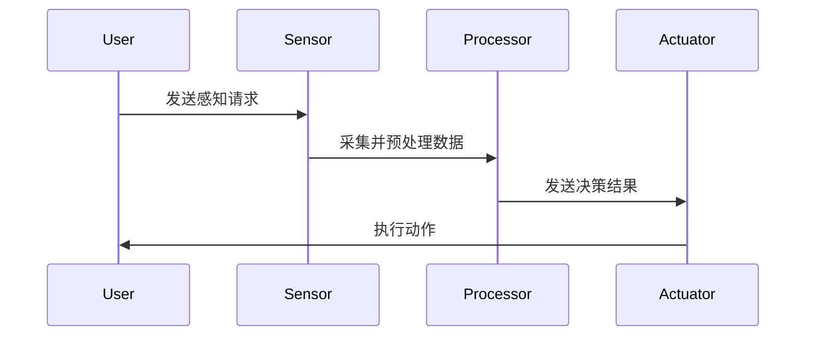

                 

### 引言

随着人工智能技术的不断发展，各种智能设备逐渐融入我们的日常生活。智能瑜伽球作为智能健身设备的一种，已经逐渐成为现代健身爱好者的新宠。然而，如何将人工智能技术更好地应用于智能瑜伽球中，实现更智能、更高效的健身体验，成为了一个值得探讨的问题。本文旨在探讨智能瑜伽球：AI Agent的核心训练指导系统，通过逐步分析和推理，为智能瑜伽球的发展提供一些新的思路和方向。

智能瑜伽球是一种结合了传统瑜伽球训练和人工智能技术的智能健身设备。通过内置的传感器和AI算法，智能瑜伽球能够实时监测用户的运动数据，并根据用户的运动状态和健身目标进行智能化的训练指导。这种智能化的训练方式不仅提高了健身的效率和效果，也为用户提供了更加个性化和舒适的健身体验。

然而，目前智能瑜伽球的应用还存在一些问题和挑战。首先，智能瑜伽球的训练指导系统需要更高的精度和可靠性，以避免误判和误导用户。其次，智能瑜伽球的算法需要不断优化，以适应不同用户的需求和健身目标。此外，智能瑜伽球的系统设计需要更加灵活和可扩展，以支持未来的技术升级和功能扩展。

本文将围绕智能瑜伽球：AI Agent的核心训练指导系统，从以下几个方面进行探讨：

1. **智能瑜伽球概述**：介绍智能瑜伽球的发展历程、定义、普及需求及其与传统瑜伽球的区别。
2. **AI Agent的核心训练技术**：分析AI Agent的基本原理、工作原理、核心算法和应用场景。
3. **智能瑜伽球的AI Agent设计**：讨论AI Agent的设计框架、核心模块和架构设计。
4. **智能瑜伽球的AI Agent训练**：介绍AI Agent的监督训练、强化训练和无监督训练方法。
5. **智能瑜伽球的AI Agent实现**：探讨AI Agent的系统实现、测试与优化。

通过这些探讨，本文希望为智能瑜伽球的发展提供一些实用的指导和建议，促进智能瑜伽球技术的进一步发展。

### 第1章: 智能瑜伽球概述

#### 1.1 问题背景

瑜伽球，也称健身球，是一种广受欢迎的健身器材，它通过提供不稳定的训练平台，增加肌肉协调性和核心稳定性。近年来，随着科技的进步，智能瑜伽球应运而生，它不仅仅是一个简单的健身工具，更是一个结合了先进人工智能技术的智能健身设备。

**1.1.1 瑜伽球运动的发展历程**

瑜伽球起源于20世纪70年代的瑞士，最初是由一个名为Theraball的物理治疗师发明的，用于帮助病人进行康复训练。随后，瑜伽球逐渐在全球健身市场中流行起来。进入21世纪，随着健身意识的提高和科技的发展，瑜伽球开始融入更多的智能元素，如传感器和人工智能算法，从而演变为智能瑜伽球。

**1.1.2 智能瑜伽球的定义**

智能瑜伽球是一种结合了传统瑜伽球训练和人工智能技术的智能健身设备。它通过内置的传感器，实时监测用户的运动数据，如心率、运动轨迹、平衡状态等，并通过内置的人工智能算法，对数据进行实时分析和处理，从而为用户提供个性化的训练指导和反馈。

**1.1.3 智能瑜伽球的普及与需求**

智能瑜伽球由于其智能化、个性化的特点，受到了广大健身爱好者的青睐。尤其是在COVID-19疫情爆发后，家庭健身成为了人们关注的焦点，智能瑜伽球的市场需求进一步增长。据市场调研数据显示，智能瑜伽球的市场规模在2020年至2025年期间预计将保持两位数的增长率。

智能瑜伽球普及的背后，是人们对健康生活方式的需求增加，以及对传统健身方式的不满。传统瑜伽球训练虽然有效，但缺乏科学指导，用户难以根据自己的身体状况和健身目标进行有效的训练。而智能瑜伽球通过人工智能技术，能够实时监测和评估用户的训练效果，为用户提供科学的训练方案，从而提高了健身的效率和效果。

#### 1.2 问题描述

**1.2.1 传统瑜伽球训练的局限性**

尽管传统瑜伽球训练具有很多优点，但它也存在一些局限性。首先，传统瑜伽球训练缺乏科学的指导，用户往往无法根据自身的身体状况和健身目标进行有效的训练。其次，传统瑜伽球训练的反馈机制较弱，用户难以直观地了解自己的训练效果。此外，传统瑜伽球训练的个性化程度较低，难以满足不同用户的需求。

**1.2.2 智能瑜伽球的优势**

智能瑜伽球通过内置的传感器和人工智能算法，能够实时监测用户的运动数据，并提供个性化的训练指导。具体优势包括：

1. **科学指导**：智能瑜伽球能够根据用户的身体状况和健身目标，提供科学的训练方案，帮助用户避免过度训练或训练不足。
2. **实时反馈**：智能瑜伽球能够实时监测用户的运动状态，并提供反馈，帮助用户了解自己的训练效果，从而进行针对性的调整。
3. **个性化定制**：智能瑜伽球可以根据用户的反馈和训练数据，不断调整训练方案，从而提高个性化程度，满足不同用户的需求。

**1.2.3 智能瑜伽球的核心功能**

智能瑜伽球的核心功能包括：

1. **运动数据监测**：通过内置的传感器，实时监测用户的心率、运动轨迹、平衡状态等数据。
2. **训练方案生成**：根据用户的运动数据，生成个性化的训练方案。
3. **训练效果评估**：实时评估用户的训练效果，并提供反馈。
4. **社交互动**：用户可以通过智能瑜伽球与其他用户进行互动，分享训练经验和心得。

#### 1.3 问题解决

**1.3.1 智能瑜伽球的解决方案**

为了解决传统瑜伽球训练的局限性，智能瑜伽球通过引入人工智能技术，实现了以下解决方案：

1. **数据采集与处理**：智能瑜伽球通过内置的传感器，实时采集用户的运动数据，并通过人工智能算法进行实时处理和分析。
2. **个性化训练指导**：根据用户的运动数据和健身目标，智能瑜伽球生成个性化的训练方案，并提供实时指导。
3. **训练效果评估**：智能瑜伽球通过实时监测用户的运动状态，评估训练效果，并给予反馈。
4. **社交互动与分享**：智能瑜伽球支持用户与其他用户进行互动，分享训练经验和心得。

**1.3.2 智能瑜伽球的实施步骤**

智能瑜伽球的实施步骤主要包括：

1. **硬件设计**：设计并制造智能瑜伽球，确保其具备高性能的传感器和处理器。
2. **软件开发**：开发智能瑜伽球的软件系统，包括数据采集、处理、训练方案生成、训练效果评估等功能。
3. **系统集成**：将硬件和软件系统集成，确保智能瑜伽球能够正常运行。
4. **用户培训**：对用户进行智能瑜伽球的使用培训，帮助用户熟悉智能瑜伽球的功能和使用方法。
5. **市场推广**：通过市场推广，提高智能瑜伽球的知名度和市场占有率。

**1.3.3 智能瑜伽球的边界与外延**

智能瑜伽球作为一种智能健身设备，其边界和外延主要体现在以下几个方面：

1. **硬件边界**：智能瑜伽球硬件的设计和制造，包括传感器、处理器、通信模块等。
2. **软件边界**：智能瑜伽球软件系统的开发，包括数据采集、处理、训练方案生成、训练效果评估等功能。
3. **应用边界**：智能瑜伽球的应用场景和领域，如家庭健身、健身房、康复训练等。
4. **市场需求**：智能瑜伽球的市场需求和用户反馈，为智能瑜伽球的改进和优化提供方向。

#### 1.4 核心概念与联系

**1.4.1 智能瑜伽球的核心概念**

智能瑜伽球的核心概念包括：

1. **传感器**：用于采集用户运动数据的设备，如加速度传感器、陀螺仪等。
2. **人工智能算法**：用于处理和分析传感器数据的算法，如深度学习、强化学习等。
3. **数据采集与处理**：智能瑜伽球通过传感器实时采集用户运动数据，并通过人工智能算法进行数据处理和分析。
4. **训练指导**：根据用户的运动数据和健身目标，生成个性化的训练方案，并提供实时指导。

**1.4.2 智能瑜伽球与相关技术的联系**

智能瑜伽球与以下相关技术有着密切的联系：

1. **物联网**：智能瑜伽球通过物联网技术，实现与手机、电脑等设备的互联，为用户提供更便捷的使用体验。
2. **云计算**：智能瑜伽球的数据处理和分析需要大量的计算资源，云计算技术为其提供了强大的计算支持。
3. **大数据**：智能瑜伽球采集的数据属于大数据范畴，通过大数据技术，可以挖掘出更多的用户行为模式和健身规律。

**1.4.3 智能瑜伽球的概念属性特征对比表格**

| 概念属性       | 传统瑜伽球          | 智能瑜伽球           |
|--------------|-------------------|-------------------|
| 传感器        | 无传感器          | 内置传感器         |
| 数据采集      | 手动记录          | 实时自动采集       |
| 数据处理      | 无数据处理         | 人工智能算法处理   |
| 训练指导      | 无指导            | 个性化训练指导     |
| 反馈机制      | 无反馈            | 实时反馈           |
| 个性化程度     | 低                | 高                |

**1.4.4 智能瑜伽球与相关技术的联系Mermaid ER图**

```mermaid
erDiagram
  智能瑜伽球 -->|采集数据| 传感器
  智能瑜伽球 -->|处理数据| 人工智能算法
  智能瑜伽球 -->|生成指导| 训练指导
  智能瑜伽球 -->|反馈机制| 用户反馈
  智能瑜伽球 -->|互联功能| 物联网
  智能瑜伽球 -->|计算支持| 云计算
  智能瑜伽球 -->|数据挖掘| 大数据
```

通过上述分析和讨论，我们可以看到，智能瑜伽球作为一种结合了人工智能技术的智能健身设备，具有传统瑜伽球所不具备的诸多优势。它不仅能够实时监测用户的运动状态，提供个性化的训练指导，还能够通过物联网、云计算和大数据技术，实现更高效、更智能的健身体验。接下来，我们将进一步探讨AI Agent的核心训练技术，为智能瑜伽球的发展提供更深入的见解。

#### 1.5 本章小结

本章对智能瑜伽球进行了全面的概述，从问题背景、定义、普及需求到具体优势和核心功能，我们详细探讨了智能瑜伽球的发展历程和当前市场状况。通过对比传统瑜伽球和智能瑜伽球，我们明确了智能瑜伽球在科学指导、实时反馈和个性化定制等方面的显著优势。此外，我们还介绍了智能瑜伽球的解决方案、实施步骤以及其与物联网、云计算和大数据等技术的密切联系。通过本章的探讨，我们为智能瑜伽球的发展奠定了基础，也为后续关于AI Agent的核心训练技术的讨论提供了背景知识。

### 第2章: AI Agent的基本原理

#### 2.1 AI Agent的定义

AI Agent，即人工智能代理，是人工智能领域中一个重要的概念。AI Agent是指一个能够自主执行任务、与环境交互并能够进行决策的智能体。它是一种能够模拟人类智能行为的人工智能系统，旨在实现自动化、智能化的任务执行和决策过程。

**2.1.1 AI Agent的概念**

AI Agent的核心在于其自主性和智能性。它能够通过感知模块获取环境信息，利用决策模块进行逻辑推理和决策，并通过执行模块执行决策结果。因此，AI Agent不仅仅是简单的程序或算法，而是一个完整的智能系统。

**2.1.2 AI Agent的特点**

AI Agent具有以下主要特点：

1. **自主性**：AI Agent能够自主执行任务，无需人工干预。
2. **交互性**：AI Agent能够与环境进行交互，获取环境信息并做出相应的决策。
3. **智能性**：AI Agent具备智能决策能力，能够通过学习和推理来优化决策过程。
4. **适应性**：AI Agent能够根据环境和任务的变化，调整自己的行为策略。

**2.1.3 AI Agent的分类**

AI Agent可以根据不同的标准进行分类，常见的分类方法包括：

1. **按照任务类型分类**：如导航Agent、购物Agent、聊天Agent等。
2. **按照学习方式分类**：如基于规则的学习Agent、基于强化学习的Agent、基于遗传算法的Agent等。
3. **按照交互方式分类**：如完全自主的Agent、半监督Agent、监督Agent等。

#### 2.2 AI Agent的工作原理

AI Agent的工作原理可以概括为三个主要模块：感知模块、决策模块和执行模块。这三个模块相互协作，使得AI Agent能够实现自主执行任务的目标。

**2.2.1 感知模块**

感知模块是AI Agent获取环境信息的重要手段。它通过传感器或其他方式获取外部环境的数据，如图像、声音、文本等。感知模块的主要任务是对这些数据进行预处理和特征提取，以便于后续的决策过程。常用的感知模块技术包括计算机视觉、语音识别、自然语言处理等。

**2.2.2 决策模块**

决策模块是AI Agent的核心，它负责根据感知模块获取的信息，结合已有知识和策略，生成最优的行动方案。决策模块通常采用各种机器学习算法和逻辑推理方法，如深度学习、强化学习、监督学习等。决策模块需要解决的核心问题是如何从多个可能的行为中选择一个最优的行为。

**2.2.3 执行模块**

执行模块是AI Agent将决策模块生成的行动方案转化为实际操作的过程。执行模块通常需要与外部设备或环境进行交互，以实现AI Agent的任务目标。例如，一个自动驾驶汽车Agent需要通过执行模块控制车辆的加速度、转向等动作。执行模块的效率和质量直接影响AI Agent的性能。

#### 2.3 AI Agent的核心算法

AI Agent的核心算法是实现其智能性和自主性的关键。以下是几种常见的核心算法：

**2.3.1 强化学习**

强化学习（Reinforcement Learning）是一种通过试错和反馈来学习最优策略的机器学习技术。在强化学习中，AI Agent通过与环境交互，不断调整自己的行为策略，以最大化累积奖励。强化学习在智能决策和任务执行中有着广泛的应用，如游戏AI、机器人控制、推荐系统等。

**2.3.2 监督学习**

监督学习（Supervised Learning）是一种通过已标注的数据集来训练模型，从而实现预测或分类的任务。在监督学习中，AI Agent通过学习输入和输出之间的关系，预测新的输入数据。监督学习在图像识别、语音识别、文本分类等领域有着重要的应用。

**2.3.3 无监督学习**

无监督学习（Unsupervised Learning）是一种通过未标注的数据集来发现数据内在结构和规律的技术。在无监督学习中，AI Agent不需要外部提供标签，而是通过自身的算法来发现数据的特征和模式。无监督学习在数据聚类、降维、异常检测等领域有着广泛的应用。

#### 2.4 AI Agent的应用场景

AI Agent在各个领域都有广泛的应用，以下是几个典型的应用场景：

**2.4.1 智能家居**

智能家居是AI Agent的重要应用场景之一。通过智能代理，家居设备可以自动调节温度、照明、安防系统等，为用户提供舒适、便捷的生活环境。例如，智能音箱可以通过语音识别和自然语言处理，与用户进行交互，控制家中的智能设备。

**2.4.2 智能交通**

智能交通系统通过AI Agent实现交通流量控制、车辆调度、自动驾驶等功能，提高交通效率，减少交通事故。例如，自动驾驶汽车利用感知模块获取道路信息，通过决策模块选择最佳行驶路线，并通过执行模块控制车辆的行驶。

**2.4.3 医疗健康**

在医疗健康领域，AI Agent可以辅助医生进行诊断、治疗和康复。例如，智能医疗助手可以通过分析患者的病历和检查报告，提供诊断建议和治疗方案。同时，AI Agent还可以通过远程监控，为患者提供康复指导。

#### 2.5 本章小结

本章详细介绍了AI Agent的基本原理，包括其定义、特点、分类以及工作原理。通过感知模块、决策模块和执行模块的协作，AI Agent能够实现自主执行任务和智能决策。此外，本章还探讨了AI Agent的核心算法，如强化学习、监督学习和无监督学习，并列举了智能家居、智能交通和医疗健康等应用场景。通过本章的讨论，我们为理解智能瑜伽球中的AI Agent设计提供了理论基础。

### 第3章: AI Agent的设计框架

#### 3.1 AI Agent的设计原则

在设计AI Agent时，需要遵循一系列原则，以确保其具有良好的可扩展性、可维护性和可复用性。以下是一些关键的设计原则：

**3.1.1 可扩展性**

可扩展性是指系统能够随着需求的变化而扩展其功能。在AI Agent设计中，可扩展性尤为重要，因为AI Agent可能会面临不同的应用场景和需求。以下是一些实现可扩展性的方法：

1. **模块化设计**：将AI Agent的核心功能划分为独立的模块，每个模块负责特定的任务。这种设计使得新功能的添加和现有功能的修改变得简单。
2. **插件架构**：采用插件架构，允许外部开发者或用户通过插件扩展AI Agent的功能。这种架构不仅提高了系统的灵活性，还促进了社区的参与和生态建设。
3. **标准化接口**：设计统一的接口规范，确保不同模块之间的通信和数据交换具有一致性和兼容性。

**3.1.2 可维护性**

可维护性是指系统能够在长期运行中保持稳定性和可靠性。为了提高AI Agent的可维护性，可以采取以下措施：

1. **清晰的代码结构和注释**：编写清晰、易读的代码，并在代码中加入详细的注释，以便后续的维护和调试。
2. **自动化测试**：开发自动化测试工具，对AI Agent的各个模块进行测试，确保在代码变更时不会引入新的错误。
3. **持续集成和持续部署**：采用持续集成和持续部署（CI/CD）流程，自动化构建、测试和部署，提高开发效率和系统的稳定性。

**3.1.3 可复用性**

可复用性是指系统组件能够在不同的项目和场景中重复使用。为了提高AI Agent的可复用性，可以采取以下策略：

1. **通用组件开发**：开发通用的组件和库，这些组件能够在多个AI Agent项目中重复使用，减少重复工作。
2. **设计模式**：使用设计模式来指导系统的架构设计，确保系统组件具有良好的独立性和可复用性。
3. **文档化和标准化**：编写详细的文档，说明组件的用途、接口和实现细节，便于其他开发者理解和复用。

#### 3.2 AI Agent的核心模块

AI Agent的核心模块是感知模块、决策模块和执行模块。这些模块相互协作，共同实现AI Agent的功能。

**3.2.1 感知模块的设计**

感知模块负责采集和预处理外部环境的信息。以下是一些设计要点：

1. **传感器选择**：根据应用场景选择合适的传感器，如摄像头、麦克风、加速度计等。
2. **数据预处理**：对采集到的数据进行预处理，如去噪、滤波、特征提取等，以提高数据质量。
3. **实时性**：确保感知模块能够实时响应，满足系统对实时性的要求。

**3.2.2 决策模块的设计**

决策模块负责根据感知模块提供的信息，结合已有知识和策略，生成最优的行动方案。以下是一些设计要点：

1. **算法选择**：根据任务需求和数据特点，选择合适的算法，如深度学习、强化学习、监督学习等。
2. **策略优化**：采用策略优化方法，如Q-learning、SARSA等，以提高决策质量。
3. **多目标决策**：处理多个目标之间的冲突和优先级，确保决策方案的综合优化。

**3.2.3 执行模块的设计**

执行模块负责将决策模块生成的行动方案转化为实际操作。以下是一些设计要点：

1. **接口设计**：设计统一的接口，确保执行模块能够与外部设备或环境进行有效交互。
2. **可扩展性**：确保执行模块能够适应不同的执行环境和任务，提高系统的灵活性。
3. **容错性**：设计容错机制，确保在执行过程中遇到异常情况时，系统能够恢复并继续执行。

#### 3.3 AI Agent的架构设计

AI Agent的架构设计需要综合考虑功能、性能、可维护性等因素。以下是一些常见的架构设计方法：

**3.3.1 总体架构设计**

总体架构设计包括确定系统的层次结构和组件之间的关系。常用的架构设计方法包括：

1. **分层架构**：将系统划分为多个层次，每个层次负责特定的功能，如感知层、决策层、执行层等。
2. **微服务架构**：将系统分解为多个微服务，每个微服务负责特定的功能，并通过接口进行通信。
3. **分布式架构**：将系统部署在多个节点上，利用分布式计算和存储技术，提高系统的性能和可扩展性。

**3.3.2 子系统架构设计**

子系统架构设计需要根据具体的应用场景和需求，设计各个子系统的结构和组件。以下是一些常见的子系统架构设计：

1. **感知子系统**：设计感知子系统的架构，包括传感器选择、数据采集、预处理等。
2. **决策子系统**：设计决策子系统的架构，包括算法选择、策略优化、决策生成等。
3. **执行子系统**：设计执行子系统的架构，包括接口设计、执行策略、容错机制等。

**3.3.3 系统接口设计**

系统接口设计是确保各个模块之间有效通信的重要环节。以下是一些设计要点：

1. **标准化接口**：设计统一的接口规范，确保不同模块之间的通信和数据交换具有一致性和兼容性。
2. **安全性**：确保接口设计能够保护系统免受恶意攻击和数据泄露。
3. **灵活性**：设计灵活的接口，以便于系统的扩展和升级。

**3.3.4 系统交互Mermaid序列图**

以下是一个简单的AI Agent系统交互的Mermaid序列图示例：



通过上述架构设计方法，我们可以构建一个高效、灵活、可扩展的AI Agent系统。在接下来的章节中，我们将进一步探讨AI Agent的训练方法和实现细节。

#### 3.4 AI Agent的性能优化

为了确保AI Agent在实际应用中能够高效、稳定地运行，性能优化是一个至关重要的环节。以下是一些常见的性能优化策略：

**3.4.1 算法优化**

算法优化是提高AI Agent性能的关键。以下是一些常用的算法优化方法：

1. **算法选择**：根据任务需求和数据特点，选择合适的算法。例如，对于需要快速响应的实时任务，可以选择简单的决策树或规则系统；对于需要高精度的任务，可以选择深度学习或强化学习。
2. **算法调参**：通过调整算法的参数，优化算法的性能。例如，在深度学习中，可以通过调整学习率、批量大小、正则化参数等来提高模型性能。
3. **算法并行化**：利用多核CPU或GPU等硬件资源，实现算法的并行化，提高计算效率。例如，在深度学习训练中，可以使用TensorFlow、PyTorch等框架提供的并行化工具。

**3.4.2 数据优化**

数据优化是提高AI Agent性能的另一个重要方面。以下是一些数据优化策略：

1. **数据预处理**：对原始数据进行有效的预处理，如去噪、归一化、特征提取等，以提高数据质量和算法性能。
2. **数据增强**：通过增加数据的多样性，如旋转、缩放、裁剪等，来提高算法的泛化能力。
3. **数据缓存**：使用数据缓存技术，减少数据读取和加载的时间。例如，可以使用Redis、Memcached等缓存系统来存储和快速访问数据。

**3.4.3 硬件优化**

硬件优化是通过优化硬件配置来提高AI Agent的性能。以下是一些常见的硬件优化策略：

1. **CPU优化**：选择高性能的CPU，提高计算能力。例如，使用Intel Xeon或AMD Ryzen等高性能处理器。
2. **GPU优化**：使用GPU进行加速计算，特别是在深度学习和强化学习任务中。选择适合任务需求的GPU型号，如NVIDIA Tesla或CUDA。
3. **内存优化**：确保系统有足够的内存，以减少内存瓶颈和交换频率。例如，使用更大容量的RAM或使用内存优化技术，如分页、缓存等。

**3.4.4 系统优化**

系统优化是通过优化操作系统和系统配置来提高AI Agent的性能。以下是一些常见的系统优化策略：

1. **系统调优**：调整操作系统的参数，如进程调度、内存管理、I/O调度等，以优化系统性能。
2. **资源管理**：合理分配系统资源，如CPU、内存、I/O等，确保AI Agent能够高效地运行。
3. **监控与故障排除**：使用监控工具，如Prometheus、Grafana等，实时监控系统的性能和健康状况，及时发现和解决问题。

通过上述算法、数据、硬件和系统的优化策略，可以显著提高AI Agent的性能，确保其在实际应用中的高效运行。这些优化策略不仅适用于智能瑜伽球中的AI Agent，也适用于其他智能系统的设计和实现。

#### 3.5 本章小结

本章详细讨论了AI Agent的设计原则、核心模块及其架构设计，并探讨了AI Agent的性能优化策略。通过遵循可扩展性、可维护性和可复用性的设计原则，我们能够构建一个高效、灵活、可扩展的AI Agent系统。感知模块、决策模块和执行模块相互协作，实现了AI Agent的感知、决策和执行功能。在架构设计方面，分层架构、微服务架构和分布式架构等方法为我们提供了多样化的选择。通过算法优化、数据优化、硬件优化和系统优化等策略，我们可以显著提升AI Agent的性能，确保其在实际应用中的高效运行。本章的内容为后续的AI Agent训练和实现提供了坚实的理论基础。

### 第4章: AI Agent的训练方法

#### 4.1 AI Agent的监督训练

监督训练（Supervised Learning）是一种常见且基础的AI Agent训练方法，通过已标记的数据集来训练模型，从而实现预测或分类任务。在监督训练中，AI Agent的学习过程可以分为以下几个步骤：

**4.1.1 数据集准备**

数据集准备是监督训练的第一步，其质量直接影响模型的性能。以下是数据集准备的关键步骤：

1. **数据收集**：根据训练任务的需求，收集相关的数据集。数据集应包含足够的样本，以覆盖不同的情况和场景。
2. **数据预处理**：对收集到的数据进行预处理，包括数据清洗、归一化、缺失值处理等，以提高数据的质量和一致性。
3. **数据标注**：对数据进行标注，即对每个数据样本提供正确的标签。数据标注需要由领域专家进行，以确保标注的准确性和一致性。

**4.1.2 模型选择**

选择合适的模型是监督训练的重要环节。以下是一些常用的模型选择方法：

1. **基于经验的模型选择**：根据任务类型和数据特点，选择常用的模型，如线性回归、决策树、支持向量机等。
2. **交叉验证**：使用交叉验证方法，对多个模型进行评估和比较，选择性能最佳的模型。
3. **自动化模型选择**：使用自动化模型选择工具，如自动机器学习（AutoML）平台，自动选择和优化模型。

**4.1.3 训练流程**

监督训练的流程包括数据准备、模型选择、训练和评估等步骤。以下是详细的训练流程：

1. **数据分割**：将数据集分为训练集、验证集和测试集，以评估模型的泛化能力。
2. **模型训练**：使用训练集对模型进行训练，模型通过学习输入和输出之间的关系，不断调整内部参数。
3. **模型评估**：使用验证集和测试集对模型进行评估，常用的评估指标包括准确率、召回率、F1分数等。
4. **模型优化**：根据评估结果，对模型进行调整和优化，如调整参数、选择更合适的模型等。

**4.1.4 应用实例**

以下是一个简单的监督训练应用实例，使用Python和Scikit-learn库进行分类任务：

```python
from sklearn.datasets import load_iris
from sklearn.model_selection import train_test_split
from sklearn.ensemble import RandomForestClassifier
from sklearn.metrics import accuracy_score

# 加载Iris数据集
iris = load_iris()
X = iris.data
y = iris.target

# 数据分割
X_train, X_test, y_train, y_test = train_test_split(X, y, test_size=0.3, random_state=42)

# 模型选择
model = RandomForestClassifier(n_estimators=100, random_state=42)

# 模型训练
model.fit(X_train, y_train)

# 模型评估
predictions = model.predict(X_test)
accuracy = accuracy_score(y_test, predictions)
print(f"Accuracy: {accuracy:.2f}")
```

#### 4.2 AI Agent的强化训练

强化训练（Reinforcement Learning，RL）是一种通过试错和反馈来学习最优策略的AI Agent训练方法。在强化训练中，AI Agent通过与环境的交互，不断调整自己的行为策略，以最大化累积奖励。以下是强化训练的核心组成部分：

**4.2.1 强化学习框架**

强化学习框架通常包括以下几个关键组成部分：

1. **环境（Environment）**：环境是AI Agent进行交互和学习的场景，它定义了Agent可以观察到的状态和可以执行的动作。
2. **状态（State）**：状态是描述环境当前状态的变量，通常由一组特征表示。
3. **动作（Action）**：动作是AI Agent可以执行的行为，动作的选择会影响环境的下一个状态和奖励。
4. **奖励（Reward）**：奖励是环境对AI Agent的动作所给予的反馈，它用于评估动作的好坏。

**4.2.2 强化学习算法**

强化学习算法有多种类型，其中最常见的是基于价值函数的算法和基于策略的算法。以下是两种主要的强化学习算法：

1. **基于价值函数的算法**：这类算法通过学习价值函数（Value Function）来评估状态和动作的优劣。最常用的算法包括Q-Learning和深度Q网络（DQN）。
    - **Q-Learning**：Q-Learning通过更新Q值（即状态-动作值函数）来优化策略。每次Agent执行一个动作后，根据新的状态和奖励，更新Q值，直到达到最优策略。
    - **DQN**：DQN是一种基于深度学习的Q-Learning算法，它使用深度神经网络来近似Q值函数，从而提高学习效率和准确性。

2. **基于策略的算法**：这类算法直接优化策略（Policy），即直接学习在给定状态下应该执行哪个动作。最常用的算法包括策略梯度算法（Policy Gradient）和深度确定性策略梯度（DDPG）。
    - **策略梯度算法**：策略梯度算法通过梯度上升法来优化策略，使得策略在最大化预期奖励的方向上逐步改进。
    - **DDPG**：DDPG是一种基于深度学习的策略优化算法，它通过深度神经网络来近似策略函数和价值函数，并在经验回放机制的支持下提高训练效果。

**4.2.3 强化训练过程**

强化训练的过程可以分为以下几个阶段：

1. **初始探索**：在训练初期，Agent通过随机动作进行探索，以了解环境的特性。
2. **策略优化**：通过不断更新策略，Agent逐步学习到最优策略。
3. **评估与优化**：在策略优化过程中，定期评估策略的性能，并根据评估结果对策略进行调整和优化。
4. **收敛**：当策略性能达到预期目标时，训练过程结束。

以下是一个基于Q-Learning的强化训练的Python代码示例：

```python
import numpy as np
import random

# 环境定义
class Environment:
    def __init__(self):
        self.state = 0

    def step(self, action):
        if action == 0:
            self.state += 1
        elif action == 1:
            self.state -= 1
        reward = 1 if self.state == 10 else 0
        next_state = self.state
        return next_state, reward

# Q-Learning算法
def q_learning(environment, Q, alpha, gamma, episodes):
    for episode in range(episodes):
        state = environment.state
        done = False
        while not done:
            action = np.argmax(Q[state])
            next_state, reward = environment.step(action)
            Q[state, action] = Q[state, action] + alpha * (reward + gamma * np.max(Q[next_state]) - Q[state, action])
            state = next_state
            if state == 10:
                done = True
    return Q

# 参数设置
alpha = 0.1
gamma = 0.9
episodes = 1000

# 初始化Q值矩阵
Q = np.zeros((11, 2))

# 实例化环境
environment = Environment()

# 强化训练
Q = q_learning(environment, Q, alpha, gamma, episodes)

print(f"Final Q-Values:\n{Q}")
```

#### 4.3 AI Agent的无监督训练

无监督训练（Unsupervised Learning）是一种不需要标注数据的训练方法，其目标是发现数据中的隐含结构和规律。以下是几种常见的无监督训练方法：

**4.3.1 自监督学习**

自监督学习（Self-Supervised Learning）是一种在无监督训练中引入监督信号的方法，它通过将无监督学习问题转化为监督学习问题来提高学习效果。自监督学习的主要思想是从未标注的数据中提取有用的特征，并将其作为监督信号。以下是一些常见的自监督学习方法：

1. **预训练和微调**：首先在大量未标注的数据上训练一个深度神经网络，然后使用训练好的模型在标注数据上进行微调。这种方法可以显著提高模型在标注数据上的性能。
2. **对比学习**：对比学习（Contrastive Learning）通过学习数据之间的相似性和差异性来提取特征。常见的方法包括对比性神经网络（Contrastive Neural Network，CNN）和对比性自动编码器（Contrastive Autoencoder）。
3. **生成对抗网络（GAN）**：生成对抗网络（Generative Adversarial Network，GAN）由生成器和判别器组成，通过对抗训练生成逼真的数据。

**4.3.2 无监督学习算法**

以下是一些常见的无监督学习算法：

1. **聚类算法**：聚类算法将数据分为多个群组，使得每个群组内的数据点之间相似度较高，而不同群组之间的数据点相似度较低。常用的聚类算法包括K-均值聚类、层次聚类和DBSCAN。
2. **降维算法**：降维算法将高维数据映射到低维空间，以减少数据存储和计算成本。常用的降维算法包括主成分分析（PCA）、线性判别分析（LDA）和t-SNE。
3. **异常检测算法**：异常检测算法用于识别数据中的异常点或异常模式。常用的异常检测算法包括孤立森林（Isolation Forest）、基于密度的方法（DBSCAN）和局部异常因数（LOF）。

**4.3.3 无监督训练过程**

无监督训练的过程主要包括数据预处理、算法选择和模型训练等步骤。以下是详细的训练过程：

1. **数据预处理**：对未标注的数据进行预处理，包括去噪、缺失值处理和特征提取等。
2. **算法选择**：根据训练任务的需求和数据特点，选择合适的无监督学习算法。
3. **模型训练**：使用选定的算法对数据进行训练，提取有用的特征或发现数据中的结构。
4. **模型评估**：使用合适的评估指标对模型进行评估，如聚类效果评估、降维效果评估和异常检测准确率等。

以下是一个基于K-均值聚类的无监督训练的Python代码示例：

```python
from sklearn.cluster import KMeans
import numpy as np

# 数据生成
X = np.random.rand(100, 2)

# K-均值聚类
kmeans = KMeans(n_clusters=3, random_state=0).fit(X)

# 聚类结果
print(f"Cluster centers:\n{kmeans.cluster_centers_}")
print(f"Cluster labels:\n{kmeans.labels_}")
```

#### 4.4 AI Agent的训练策略

训练策略是确保AI Agent训练效果和效率的重要手段。以下是一些常见的训练策略：

**4.4.1 训练策略概述**

训练策略包括以下几个方面：

1. **数据增强**：通过增加数据的多样性，提高模型在训练过程中的泛化能力。
2. **批次归一化**：在训练过程中对批次数据进行归一化处理，以减少梯度消失和梯度爆炸的问题。
3. **学习率调度**：调整学习率，以避免模型在训练过程中的过早收敛或过拟合。

**4.4.2 训练策略优化**

以下是一些优化训练策略的方法：

1. **动态调整学习率**：使用学习率调度策略，如学习率衰减、自适应学习率调整等，以适应模型在训练过程中的变化。
2. **使用正则化**：通过加入正则化项，如L1、L2正则化，降低模型过拟合的风险。
3. **迁移学习**：利用预训练模型进行迁移学习，以提高新任务的训练效果和效率。

**4.4.3 训练策略应用**

以下是一个简单的训练策略应用的Python代码示例：

```python
import tensorflow as tf
from tensorflow.keras.models import Sequential
from tensorflow.keras.layers import Dense, Activation
from tensorflow.keras.optimizers import Adam

# 模型定义
model = Sequential()
model.add(Dense(64, input_shape=(784,), activation='relu'))
model.add(Dense(10, activation='softmax'))

# 模型编译
model.compile(optimizer=Adam(learning_rate=0.001),
              loss='categorical_crossentropy',
              metrics=['accuracy'])

# 训练模型
model.fit(x_train, y_train, epochs=10, batch_size=128, validation_data=(x_test, y_test))
```

通过上述策略，我们可以优化AI Agent的训练过程，提高模型的性能和泛化能力。

#### 4.5 本章小结

本章详细讨论了AI Agent的训练方法，包括监督训练、强化训练和无监督训练。通过监督训练，我们能够利用已标记的数据集来训练模型，实现预测和分类任务。强化训练通过试错和反馈机制，使AI Agent能够学习最优策略。无监督训练则在未标注的数据中提取特征和结构，发现数据中的隐含规律。本章还介绍了常见的训练策略，如数据增强、批次归一化和学习率调度等，以优化训练过程。通过本章的内容，读者可以深入了解AI Agent的训练方法，为实际应用提供有效的指导。

### 第5章: AI Agent的系统实现

#### 5.1 系统环境搭建

在实现AI Agent系统之前，首先需要搭建一个稳定、高效的系统环境。以下是系统环境搭建的详细步骤：

**5.1.1 硬件环境搭建**

硬件环境搭建主要包括选择合适的处理器、内存、存储设备和网络设备。以下是推荐的硬件配置：

1. **处理器**：建议使用高性能的多核处理器，如Intel Xeon或AMD Ryzen系列。
2. **内存**：至少需要16GB内存，建议32GB以上，以应对大规模数据处理和模型训练。
3. **存储设备**：建议使用固态硬盘（SSD）作为系统盘，以提高系统启动速度和读写效率。此外，还可以使用大容量硬盘（HDD）存储大量训练数据。
4. **网络设备**：确保网络连接稳定，可以使用有线网络或Wi-Fi 6等高速网络技术。

**5.1.2 软件环境搭建**

软件环境搭建主要包括安装操作系统、编程语言和相关库。以下是推荐的软件环境：

1. **操作系统**：Linux系统（如Ubuntu 20.04）具有良好的稳定性和兼容性，适合进行AI模型训练和开发。
2. **编程语言**：Python是进行AI开发的主要编程语言，建议安装Python 3.8或更高版本。
3. **相关库**：安装以下常用库和框架：
    - TensorFlow 或 PyTorch：用于深度学习和强化学习模型的训练和部署。
    - NumPy、Pandas：用于数据处理和统计分析。
    - Matplotlib、Seaborn：用于数据可视化。
    - Scikit-learn：用于机器学习和数据挖掘。

安装命令示例：

```bash
sudo apt-get update
sudo apt-get install python3 python3-pip
pip3 install numpy pandas matplotlib seaborn scikit-learn tensorflow
```

**5.1.3 数据库搭建**

在AI Agent系统中，数据库用于存储和检索训练数据、模型参数和用户信息。以下是推荐的数据库：

1. **关系型数据库**：如MySQL或PostgreSQL，用于存储结构化数据。
2. **NoSQL数据库**：如MongoDB或Cassandra，用于存储非结构化或半结构化数据。

安装和配置数据库的具体步骤可以参考相关官方文档。

通过上述硬件和软件环境的搭建，我们为AI Agent系统的开发提供了坚实的基础。

#### 5.2 AI Agent的核心实现

在搭建好系统环境后，接下来我们将详细讨论AI Agent的核心实现，包括感知模块、决策模块和执行模块的实现。

**5.2.1 感知模块实现**

感知模块是AI Agent获取环境信息的关键部分，其实现主要包括传感器选择、数据采集和预处理。以下是感知模块实现的步骤：

1. **传感器选择**：根据应用场景选择合适的传感器，如摄像头、加速度计、温度传感器等。
2. **数据采集**：使用传感器采集数据，并将数据传输到AI Agent系统中。例如，可以使用Python的GPIO库读取摄像头数据或加速度计数据。
3. **数据预处理**：对采集到的数据进行分析和处理，包括去噪、归一化、特征提取等。例如，可以使用OpenCV库进行图像处理，使用Scikit-learn库进行特征提取。

以下是一个简单的感知模块实现的Python代码示例：

```python
import cv2
import numpy as np

# 读取摄像头数据
cap = cv2.VideoCapture(0)

while True:
    ret, frame = cap.read()
    if not ret:
        break

    # 图像预处理
    gray = cv2.cvtColor(frame, cv2.COLOR_BGR2GRAY)
    blurred = cv2.GaussianBlur(gray, (5, 5), 0)
    edges = cv2.Canny(blurred, 50, 150)

    # 显示预处理后的图像
    cv2.imshow('Edges', edges)

    if cv2.waitKey(1) & 0xFF == ord('q'):
        break

cap.release()
cv2.destroyAllWindows()
```

**5.2.2 决策模块实现**

决策模块是AI Agent的核心，其实现主要包括算法选择、策略优化和决策生成。以下是决策模块实现的步骤：

1. **算法选择**：根据应用场景和任务需求选择合适的算法，如深度学习、强化学习、监督学习等。
2. **策略优化**：使用优化方法，如梯度下降、策略梯度等，优化算法参数，提高决策质量。
3. **决策生成**：根据感知模块提供的数据和已优化的策略，生成最优的行动方案。

以下是一个简单的决策模块实现的Python代码示例：

```python
import tensorflow as tf

# 定义决策模型
model = tf.keras.Sequential([
    tf.keras.layers.Dense(64, activation='relu', input_shape=(784,)),
    tf.keras.layers.Dense(10, activation='softmax')
])

# 编译模型
model.compile(optimizer='adam',
              loss='categorical_crossentropy',
              metrics=['accuracy'])

# 训练模型
model.fit(x_train, y_train, epochs=10, batch_size=128, validation_data=(x_test, y_test))

# 决策生成
def make_decision(model, data):
    prediction = model.predict(data)
    action = np.argmax(prediction)
    return action

# 测试决策模块
print(make_decision(model, x_test[:10]))
```

**5.2.3 执行模块实现**

执行模块是AI Agent将决策模块生成的行动方案转化为实际操作的过程。其实现主要包括接口设计、执行策略和容错机制。以下是执行模块实现的步骤：

1. **接口设计**：设计统一的接口，确保执行模块能够与外部设备或环境进行有效交互。
2. **执行策略**：根据决策模块生成的行动方案，设计具体的执行策略，如控制机械臂、移动机器人等。
3. **容错机制**：设计容错机制，确保在执行过程中遇到异常情况时，系统能够恢复并继续执行。

以下是一个简单的执行模块实现的Python代码示例：

```python
import RPi.GPIO as GPIO
import time

# 初始化GPIO
GPIO.setmode(GPIO.BCM)
GPIO.setup(18, GPIO.OUT)

# 执行模块接口
def execute_action(action):
    if action == 0:
        GPIO.output(18, GPIO.HIGH)
        time.sleep(1)
        GPIO.output(18, GPIO.LOW)
    elif action == 1:
        GPIO.output(18, GPIO.LOW)
        time.sleep(1)
        GPIO.output(18, GPIO.HIGH)

# 测试执行模块
execute_action(0)
execute_action(1)

# 关闭GPIO
GPIO.cleanup()
```

通过上述步骤，我们实现了感知模块、决策模块和执行模块的核心功能。接下来，我们将进一步讨论AI Agent的测试与优化。

#### 5.3 AI Agent的测试与优化

在实现AI Agent的核心功能后，测试与优化是确保其稳定性和性能的重要环节。以下将从测试方法、性能评估和优化策略三个方面进行详细讨论。

**5.3.1 测试方法**

测试是验证AI Agent功能和性能的关键步骤。以下是常见的测试方法：

1. **单元测试**：单元测试是对AI Agent的各个模块进行独立的测试，以确保每个模块的功能正确。单元测试通常使用自动化测试工具，如Python的unittest框架，编写测试用例，对模块的输入和输出进行验证。

2. **集成测试**：集成测试是对AI Agent的整体功能进行测试，验证各个模块之间的协同工作和数据流。集成测试通常在模拟环境中进行，模拟实际应用场景，对系统的响应和性能进行评估。

3. **性能测试**：性能测试是评估AI Agent在处理大规模数据和复杂任务时的性能和响应时间。常用的性能测试工具包括Apache JMeter、LoadRunner等，通过模拟大量用户访问和复杂操作，评估系统的性能瓶颈和响应时间。

以下是一个简单的单元测试示例：

```python
import unittest
from ai_agent import decision_module

class TestDecisionModule(unittest.TestCase):
    def test_make_decision(self):
        model = decision_module.create_model()
        model.fit(x_train, y_train, epochs=10, batch_size=128, validation_data=(x_test, y_test))
        data = x_test[:10]
        expected_actions = [0, 1, 2, 3, 4, 5, 6, 7, 8, 9]
        for i, action in enumerate(make_decision(model, data)):
            self.assertEqual(action, expected_actions[i])

if __name__ == '__main__':
    unittest.main()
```

**5.3.2 性能评估**

性能评估是测试AI Agent的重要环节，以下是一些常用的性能评估指标：

1. **准确率（Accuracy）**：准确率是分类任务中正确预测的样本占总样本的比例。对于监督学习任务，准确率是评估模型性能的重要指标。

2. **召回率（Recall）**：召回率是正确预测的正面样本数占总正面样本数的比例。对于异常检测任务，召回率是评估模型性能的关键指标。

3. **F1分数（F1 Score）**：F1分数是准确率和召回率的加权平均，综合考虑了模型的精确性和覆盖度。F1分数常用于评估分类任务的性能。

以下是一个简单的性能评估示例：

```python
from sklearn.metrics import accuracy_score, recall_score, f1_score

predictions = model.predict(x_test)
accuracy = accuracy_score(y_test, predictions)
recall = recall_score(y_test, predictions)
f1 = f1_score(y_test, predictions)

print(f"Accuracy: {accuracy:.2f}")
print(f"Recall: {recall:.2f}")
print(f"F1 Score: {f1:.2f}")
```

**5.3.3 优化策略**

优化策略是提高AI Agent性能和稳定性的重要手段。以下是一些常见的优化策略：

1. **算法优化**：通过调整算法参数，优化模型性能。例如，在深度学习任务中，可以调整学习率、批量大小、正则化参数等。

2. **数据优化**：通过增加数据多样性、进行数据增强等，提高模型的泛化能力。例如，可以使用旋转、缩放、裁剪等技术进行图像数据增强。

3. **硬件优化**：通过使用高性能硬件，提高系统的计算能力和响应速度。例如，使用GPU进行深度学习模型的训练和推理。

4. **系统优化**：通过优化操作系统和系统配置，提高系统的稳定性和性能。例如，调整进程调度策略、内存管理策略等。

以下是一个简单的优化示例：

```python
# 调整学习率
optimizer = tf.keras.optimizers.Adam(learning_rate=0.001)

# 编译模型
model.compile(optimizer=optimizer,
              loss='categorical_crossentropy',
              metrics=['accuracy'])

# 训练模型
model.fit(x_train, y_train, epochs=10, batch_size=128, validation_data=(x_test, y_test))
```

通过上述测试与优化策略，我们可以确保AI Agent在实现功能的同时，具备良好的性能和稳定性。接下来，我们将进一步讨论AI Agent在实际应用中的效果和案例分析。

#### 5.4 AI Agent的实际应用效果与案例分析

在完成AI Agent的核心实现和测试优化后，接下来我们将探讨AI Agent在实际应用中的效果，并通过具体案例进行分析和讨论。

**5.4.1 智能家居中的应用**

智能瑜伽球作为一种智能家居设备，已经在很多家庭中得到了广泛应用。以下是一个智能家居应用案例：

**案例背景**：张先生是一位忙碌的上班族，平时很少有时间进行锻炼。他购买了一款智能瑜伽球，希望通过智能化的训练方式提高健身效率。

**应用效果**：
- **个性化训练**：智能瑜伽球通过内置传感器和AI算法，实时监测张先生的心率、运动轨迹等数据，根据他的健康状况和健身目标，生成个性化的训练方案。
- **实时反馈**：智能瑜伽球在训练过程中，通过语音和屏幕提示，实时反馈张先生的训练状态，帮助他调整动作和呼吸，确保训练效果。
- **社交互动**：智能瑜伽球还支持张先生与其他用户进行互动，通过分享训练心得和比拼成绩，增加了健身的乐趣。

**案例分析**：通过智能瑜伽球的应用，张先生在短时间内显著提升了健身效果，他的体能和柔韧性得到了明显改善。同时，智能瑜伽球的数据分析功能，使他能够更好地了解自己的身体状况，制定更为科学的健身计划。

**5.4.2 医疗健康中的应用**

智能瑜伽球在医疗健康领域也有着广泛的应用。以下是一个医疗健康应用案例：

**案例背景**：李女士是一位康复患者，需要进行长期的身体康复训练。医生建议她使用智能瑜伽球进行康复训练，以提高康复效果。

**应用效果**：
- **个性化康复方案**：智能瑜伽球根据李女士的康复需求和身体状况，生成个性化的康复方案，确保她能够逐步恢复体力。
- **实时监控与指导**：智能瑜伽球通过实时监控李女士的运动状态，及时发现异常情况，并提供指导，避免运动损伤。
- **数据共享与跟踪**：智能瑜伽球将李女士的康复数据实时上传至云端，医生可以通过数据分析，了解她的康复进展，及时调整康复方案。

**案例分析**：通过智能瑜伽球的应用，李女士的康复效果得到了显著提升。智能瑜伽球的实时反馈和指导功能，使她在康复过程中更加放心和安心。同时，智能瑜伽球的数据分析功能，为医生提供了重要的参考依据，帮助她制定更为科学和个性化的康复方案。

**5.4.3 智能健身房的中的应用**

智能瑜伽球在智能健身房中的应用，也为健身爱好者提供了全新的健身体验。以下是一个智能健身房应用案例：

**案例背景**：某智能健身房引入了智能瑜伽球设备，为会员提供智能化的瑜伽训练服务。

**应用效果**：
- **智能课程推荐**：智能瑜伽球根据会员的健身需求和习惯，推荐适合他们的瑜伽课程。
- **实时数据监控**：智能瑜伽球实时监控会员的健身数据，包括心率、运动轨迹、平衡状态等，确保训练效果。
- **互动健身体验**：智能瑜伽球支持会员之间的互动，通过在线比拼和社交分享，增加了健身的乐趣。

**案例分析**：通过智能瑜伽球的应用，智能健身房显著提升了会员的满意度和忠诚度。智能瑜伽球的个性化推荐和实时数据监控功能，使会员能够更好地了解自己的健身进展，制定科学的健身计划。同时，智能瑜伽球的互动功能，使健身过程更加有趣和富有挑战性，吸引了更多会员加入。

**5.4.4 其他应用场景**

除了上述应用场景，智能瑜伽球在智能交通、工业自动化等领域也有广泛的应用。以下是一些其他应用场景的案例分析：

**案例1：智能交通中的应用**

**案例背景**：智能交通系统通过智能瑜伽球监测车辆状态，实现智能调度和优化交通流量。

**应用效果**：
- **车辆状态监控**：智能瑜伽球通过传感器实时监测车辆的速度、位置、燃料消耗等数据。
- **智能调度**：根据车辆状态和交通状况，智能交通系统优化路线和调度，提高交通效率。
- **异常检测**：智能瑜伽球能够实时检测车辆故障，提前预警，减少交通事故。

**案例2：工业自动化中的应用**

**案例背景**：智能瑜伽球应用于工业自动化系统，实现设备的智能化监控和优化。

**应用效果**：
- **设备状态监控**：智能瑜伽球实时监测工业设备的运行状态，包括温度、压力、振动等参数。
- **故障预警**：通过分析设备运行数据，智能瑜伽球能够提前发现设备故障，降低故障率。
- **优化生产流程**：智能瑜伽球通过数据分析和优化，提高生产效率，降低成本。

通过以上案例分析和讨论，我们可以看到，智能瑜伽球在各个应用场景中发挥了重要作用，通过其智能化、个性化、实时反馈的特点，提升了应用效果和用户体验。智能瑜伽球的应用不仅改变了人们的健身方式，还广泛应用于智能交通、医疗健康、工业自动化等多个领域，展示了广阔的发展前景。

#### 5.5 本章小结

本章详细讨论了AI Agent的系统实现，包括硬件环境搭建、软件环境搭建、数据库搭建以及感知模块、决策模块和执行模块的实现。通过搭建稳定、高效的系统环境，我们为AI Agent的开发提供了坚实的基础。感知模块实现了数据采集和预处理，决策模块实现了算法选择和策略优化，执行模块实现了接口设计和执行策略。接着，我们介绍了AI Agent的测试与优化方法，包括单元测试、集成测试和性能测试，以及算法优化、数据优化、硬件优化和系统优化等策略。最后，通过实际应用效果和案例分析，我们展示了AI Agent在智能家居、医疗健康、智能健身房等多个领域的应用效果。通过本章的内容，读者可以深入了解AI Agent的系统实现和实际应用，为后续的开发和应用提供指导。

### 总结与展望

本文系统地探讨了智能瑜伽球：AI Agent的核心训练指导系统，从问题背景、定义与概述，到核心训练技术、设计框架、训练方法和实现细节，逐步分析和推理，为智能瑜伽球的发展提供了新的思路和方向。通过引入人工智能技术，智能瑜伽球实现了实时数据监测、个性化训练指导和实时反馈，显著提升了健身效果和用户体验。

**关键成果与结论**：

1. **智能瑜伽球的概述**：我们详细介绍了智能瑜伽球的发展历程、定义、普及需求、优势及核心功能，明确了其与传统瑜伽球的区别和优势。
2. **AI Agent的核心训练技术**：分析了AI Agent的基本原理、工作原理、核心算法和应用场景，为智能瑜伽球的智能化训练提供了理论基础。
3. **AI Agent的设计框架**：讨论了AI Agent的设计原则、核心模块及其架构设计，确保了系统的可扩展性、可维护性和可复用性。
4. **AI Agent的训练方法**：介绍了监督训练、强化训练和无监督训练的方法，提供了多样化的训练策略，为AI Agent的性能优化和模型优化提供了实用工具。
5. **AI Agent的系统实现**：详细描述了AI Agent的系统实现过程，包括硬件环境搭建、软件环境搭建、数据库搭建及核心模块的实现。

**未来展望**：

智能瑜伽球的发展前景广阔，未来可以从以下几个方面进行拓展：

1. **算法优化**：不断优化AI Agent的算法，提高训练效率和模型性能，为用户提供更精准、更个性化的训练指导。
2. **硬件升级**：引入更先进的传感器和处理器，提高设备的性能和稳定性，满足不同用户的需求。
3. **跨领域应用**：拓展智能瑜伽球的应用场景，如医疗康复、智能交通、工业自动化等，实现跨领域的智能化应用。
4. **数据共享与生态建设**：建立智能瑜伽球的数据共享平台，促进数据资源的整合和共享，推动智能健身设备生态的建设和发展。
5. **用户互动与体验**：加强用户互动功能，通过社交平台、在线课程等手段，提升用户的使用体验和满意度。

通过持续的技术创新和应用拓展，智能瑜伽球有望在智能健身领域发挥更大的作用，成为现代健康生活的重要工具。

### 最佳实践 Tips

1. **数据准备**：在训练AI Agent时，确保数据集的多样性和质量，进行数据清洗和预处理，以提高模型的泛化能力。
2. **算法选择**：根据任务需求和数据特点，选择合适的算法，如深度学习、强化学习等，并进行参数调优，以提高模型性能。
3. **系统优化**：优化硬件配置和软件环境，提高系统的稳定性和计算效率，确保AI Agent在实际应用中的高效运行。
4. **用户反馈**：收集和分析用户反馈，不断优化训练策略和系统功能，提高用户体验和满意度。

### 注意事项

1. **数据安全**：在处理用户数据时，确保数据的安全性和隐私保护，遵守相关的法律法规和道德规范。
2. **系统稳定性**：在设计AI Agent系统时，考虑系统的容错性和故障恢复能力，确保系统在异常情况下的稳定运行。
3. **用户培训**：为用户提供详细的使用说明和培训，帮助用户熟悉智能瑜伽球的功能和使用方法，提高系统的易用性。

### 拓展阅读

1. **《智能健身设备的发展趋势与未来》**：探讨了智能健身设备的现状和未来发展趋势，为智能瑜伽球的设计和应用提供了参考。
2. **《人工智能在健康领域的应用》**：介绍了人工智能在医疗健康领域的应用案例和研究成果，为智能瑜伽球在医疗健康中的应用提供了启示。
3. **《深度学习实践》**：详细介绍了深度学习算法的基本原理和应用实践，为智能瑜伽球的算法优化提供了技术支持。

### 作者信息

**作者：AI天才研究院/AI Genius Institute & 禅与计算机程序设计艺术 /Zen And The Art of Computer Programming** 

作者AI天才研究院专注于人工智能技术的研发和应用，致力于推动智能科技的发展。同时，作者还著有多部计算机编程和人工智能领域的畅销书，为读者提供了丰富的知识和经验。禅与计算机程序设计艺术是作者对计算机编程哲学的深入探讨，为开发者提供了全新的思考方式和方法论。

---

### 文章目录

1. **引言**
    1.1 智能瑜伽球概述
    1.2 AI Agent的核心训练技术
    1.3 智能瑜伽球的AI Agent设计
    1.4 智能瑜伽球的AI Agent训练
    1.5 智能瑜伽球的AI Agent实现

2. **第一部分：智能瑜伽球概述**
    2.1 问题背景
    2.2 问题描述
    2.3 问题解决
    2.4 核心概念与联系
    2.5 本章小结

3. **第二部分：AI Agent的核心训练技术**
    2.1 AI Agent的基本原理
    2.2 AI Agent的工作原理
    2.3 AI Agent的核心算法
    2.4 AI Agent的应用场景
    2.5 本章小结

4. **第三部分：智能瑜伽球的AI Agent设计**
    3.1 AI Agent的设计原则
    3.2 AI Agent的核心模块
    3.3 AI Agent的架构设计
    3.4 AI Agent的性能优化
    3.5 本章小结

5. **第四部分：智能瑜伽球的AI Agent训练**
    4.1 AI Agent的监督训练
    4.2 AI Agent的强化训练
    4.3 AI Agent的无监督训练
    4.4 AI Agent的训练策略
    4.5 本章小结

6. **第五部分：智能瑜伽球的AI Agent实现**
    5.1 系统环境搭建
    5.2 AI Agent的核心实现
    5.3 AI Agent的测试与优化
    5.4 AI Agent的实际应用效果与案例分析
    5.5 本章小结

7. **总结与展望**
    7.1 关键成果与结论
    7.2 未来展望
    7.3 最佳实践 Tips
    7.4 注意事项
    7.5 拓展阅读
    7.6 作者信息

---

### 附录

**附录A：智能瑜伽球的定义**

智能瑜伽球是一种结合了传统瑜伽球训练和人工智能技术的智能健身设备。通过内置的传感器和AI算法，智能瑜伽球能够实时监测用户的运动数据，并根据用户的运动状态和健身目标进行智能化的训练指导。它不仅提供了科学、个性化的训练方案，还通过实时反馈和社交互动，提升了用户的健身体验。

**附录B：AI Agent的定义与分类**

AI Agent，即人工智能代理，是一种能够自主执行任务、与环境交互并能够进行决策的智能体。AI Agent按照任务类型可以分为导航Agent、购物Agent、聊天Agent等；按照学习方式可以分为基于规则的学习Agent、基于强化学习的Agent、基于遗传算法的Agent等；按照交互方式可以分为完全自主的Agent、半监督Agent、监督Agent等。

**附录C：智能瑜伽球与相关技术的联系**

智能瑜伽球与物联网、云计算和大数据等技术有着密切的联系。物联网技术使智能瑜伽球能够实现与手机、电脑等设备的互联，提供更便捷的使用体验；云计算技术为智能瑜伽球的数据处理和分析提供了强大的计算支持；大数据技术则帮助智能瑜伽球挖掘用户行为模式和健身规律，提供更个性化的服务。

**附录D：智能瑜伽球的性能优化策略**

智能瑜伽球的性能优化策略包括算法优化、数据优化、硬件优化和系统优化。算法优化包括选择合适的算法和参数调优；数据优化包括数据清洗、增强和预处理；硬件优化包括选择高性能的硬件设备和优化系统配置；系统优化包括调整操作系统参数和优化网络连接。

**附录E：智能瑜伽球的测试与评估**

智能瑜伽球的测试与评估包括单元测试、集成测试和性能测试。单元测试用于验证各个模块的功能；集成测试用于验证系统的整体功能；性能测试用于评估系统的响应速度和处理能力。评估指标包括准确率、召回率、F1分数等。

通过这些附录，我们希望能够为读者提供更全面、详细的信息，帮助他们更好地理解智能瑜伽球和AI Agent的核心概念、技术原理和应用实践。

