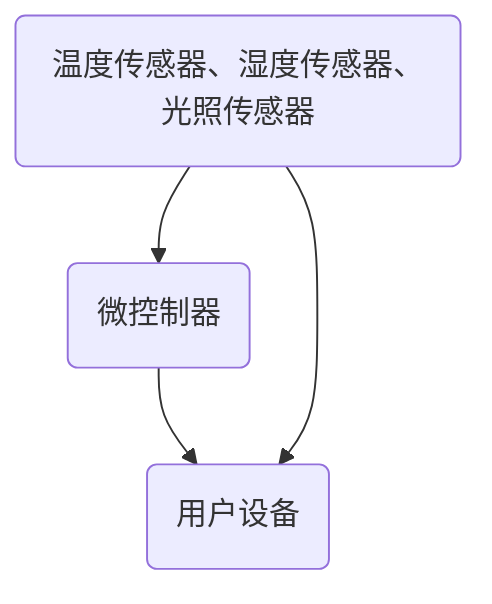
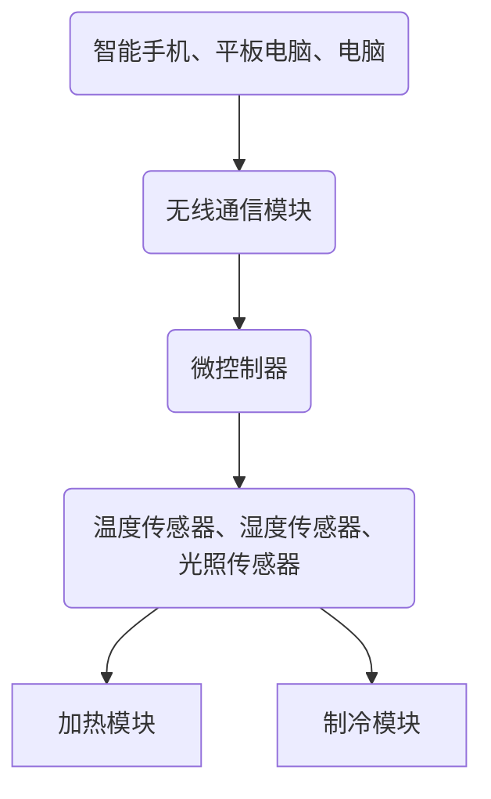

                 

### 关键词

- 智能瓷砖
- AI Agent
- 室内温度调节
- 感知算法
- 节能技术
- 深度学习

### 摘要

本文深入探讨了智能瓷砖与AI Agent相结合的室内温度调节技术。通过介绍智能瓷砖的定义、技术原理和应用场景，本文进一步揭示了AI Agent在室内温度感知与调节中的作用。文章详细解析了室内温度感知算法与调节算法，展示了AI Agent的硬件与软件实现过程。同时，通过实际应用项目和最佳实践分析，本文为智能瓷砖室内温度调节技术的未来发展提供了前瞻性的见解。

## 《智能瓷砖：AI Agent的室内温度调节》目录大纲

### 第一部分：背景与概述

#### 第1章：智能瓷砖与室内温度调节背景

1.1 问题背景  
1.2 问题描述  
1.3 问题解决思路  
1.4 边界与外延  
1.5 核心概念与联系

#### 第2章：智能瓷砖技术介绍

2.1 智能瓷砖的定义与分类  
2.2 智能瓷砖的工作原理  
2.3 智能瓷砖的核心部件  
2.4 智能瓷砖的发展现状与趋势

### 第二部分：AI Agent的室内温度调节原理

#### 第3章：AI Agent的基本概念

3.1 AI Agent的定义与分类  
3.2 AI Agent的核心功能  
3.3 AI Agent的技术基础

#### 第4章：室内温度感知与调节算法

4.1 室内温度感知算法  
4.2 室内温度调节算法  
4.3 AI Agent在温度调节中的应用

#### 第5章：智能瓷砖的AI Agent实现

5.1 AI Agent的硬件实现  
5.2 AI Agent的软件实现  
5.3 AI Agent的测试与优化

### 第三部分：智能瓷砖室内温度调节的实际应用

#### 第6章：智能瓷砖室内温度调节系统设计

6.1 系统设计概述  
6.2 领域模型设计  
6.3 系统架构设计  
6.4 系统接口设计与交互

#### 第7章：智能瓷砖室内温度调节项目实战

7.1 项目环境搭建  
7.2 系统核心实现  
7.3 代码应用解读与分析  
7.4 项目小结

#### 第8章：最佳实践与拓展

8.1 最佳实践 tips  
8.2 小结与展望  
8.3 注意事项  
8.4 拓展阅读

### 结束语

智能瓷砖室内温度调节技术的未来发展前景光明，但同时也面临着诸多挑战。通过本文的深入探讨，我们希望能够为行业从业者提供有价值的参考和启示。

作者：AI天才研究院/AI Genius Institute & 禅与计算机程序设计艺术 /Zen And The Art of Computer Programming

### 第一部分：背景与概述

#### 第1章：智能瓷砖与室内温度调节背景

##### 1.1 问题背景

随着全球气候变化和能源消耗的增加，室内温度调节成为了人们日常生活中不可忽视的一部分。传统的室内温度调节方式主要依赖于空调、暖气和风扇等设备，这些设备在提供舒适室内环境的同时，也带来了高能耗和环境污染的问题。尤其是空调和暖气，它们在运行过程中消耗大量的电力和燃料，不仅增加了家庭的能源开支，还对环境造成了负担。

##### 1.2 问题描述

当前的室内温度调节系统存在以下几个主要问题：

1. **高能耗**：传统空调和暖气设备在运行过程中需要消耗大量的能源，尤其是在寒冷或炎热的天气里，能源消耗更加显著。
2. **环境负担**：空调和暖气的运行不仅消耗能源，还会排放温室气体和其他污染物，对环境造成负面影响。
3. **调节精度不足**：传统设备往往难以实现精确的温度控制，室内温度波动较大，影响人们的舒适度。
4. **设备维护**：传统设备的维护成本较高，尤其是空调，需要定期清洗和更换滤网，否则会影响其运行效率和空气质量。

##### 1.3 问题解决思路

为了解决上述问题，智能瓷砖技术应运而生。智能瓷砖是一种结合了传感器、微控制器和无线通信技术的先进建筑材料，能够实时监测室内温度和湿度，并根据环境变化自动调节温度，从而达到节能和舒适的双重效果。AI Agent作为智能瓷砖的核心组成部分，能够在室内温度调节中发挥重要作用。以下是一些可能的解决思路：

1. **引入智能瓷砖**：将智能瓷砖安装在室内地面上，通过其内置的传感器实时监测室内温度。
2. **AI Agent的集成**：利用AI Agent实现温度数据的处理和决策，从而自动调节室内温度。
3. **自适应调节**：智能瓷砖和AI Agent系统可以根据室内温度的变化自动调整温度设定，避免过度调节。
4. **数据驱动优化**：通过收集和分析大量的室内温度数据，AI Agent可以不断优化调节策略，提高系统的效率和舒适度。

##### 1.4 边界与外延

智能瓷砖室内温度调节系统适用的场景非常广泛，包括但不限于：

1. **家庭**：智能瓷砖可以用于家庭室内温度调节，为家庭成员提供舒适的生活环境。
2. **办公楼**：智能瓷砖可以应用于办公楼，帮助企业降低能耗，创造更加健康的办公环境。
3. **酒店和餐饮业**：智能瓷砖可以用于酒店和餐饮业的室内温度控制，提升客户体验。
4. **医疗设施**：智能瓷砖可以用于医院和其他医疗设施，为患者提供舒适的康复环境。

与其他室内温度控制系统的集成方式包括：

1. **与传统空调系统的集成**：智能瓷砖可以与传统空调系统结合使用，通过数据交换实现更高效的控制。
2. **与智能家庭系统的集成**：智能瓷砖可以与智能家庭系统（如智能音箱、智能家电等）集成，实现一体化控制。
3. **与物联网平台的集成**：智能瓷砖可以接入物联网平台，实现远程监控和控制。

##### 1.5 核心概念与联系

为了更好地理解智能瓷砖和AI Agent在室内温度调节中的作用，我们需要明确以下几个核心概念：

1. **智能瓷砖**：智能瓷砖是一种具有传感和驱动功能的建筑材料，能够实时监测室内温度和湿度，并根据环境变化进行温度调节。
2. **AI Agent**：AI Agent是一种基于人工智能技术的智能实体，能够感知环境变化，做出智能决策并执行相应动作。
3. **室内温度调节**：室内温度调节是指通过技术手段控制室内温度，使其保持在适宜范围内，以满足人们的舒适需求。

智能瓷砖和AI Agent在室内温度调节中的联系主要体现在以下几个方面：

1. **传感器数据采集**：智能瓷砖通过内置传感器采集室内温度数据，并将数据传输给AI Agent。
2. **决策与调节**：AI Agent根据传感器数据和环境模型，进行智能决策，调整智能瓷砖的加热或制冷功能，以实现室内温度调节。
3. **反馈与优化**：智能瓷砖和AI Agent系统不断收集和反馈数据，通过机器学习等技术进行自我优化，提高调节效率和舒适度。

通过以上对背景和概述的介绍，我们可以看出，智能瓷砖与AI Agent相结合的室内温度调节技术具有巨大的潜力，能够有效解决传统室内温度调节系统存在的问题。在接下来的章节中，我们将进一步探讨智能瓷砖和AI Agent的具体实现原理和应用实践。

#### 第2章：智能瓷砖技术介绍

##### 2.1 智能瓷砖的定义与分类

智能瓷砖是一种集成传感器、微控制器和无线通信技术的先进建筑材料，能够在室内环境中实时监测温度、湿度等环境参数，并根据环境变化自动调节温度，提供舒适的生活环境。与传统建筑材料相比，智能瓷砖具有智能化、自适应、节能环保等特点。

根据不同的技术特点和应用场景，智能瓷砖可以分为以下几类：

1. **温度感知型智能瓷砖**：这种瓷砖主要通过内置温度传感器来监测室内温度，当温度超出设定范围时，会触发调节机制。这类瓷砖适用于需要简单温度控制的场景，如家庭室内温度调节。
2. **智能调控型智能瓷砖**：这种瓷砖不仅具备温度感知功能，还集成了加热或制冷模块，能够直接进行温度调节。这类瓷砖适用于需要精确温度控制的场景，如办公楼和酒店。
3. **多功能智能瓷砖**：这种瓷砖不仅具备温度调节功能，还集成了其他智能功能，如无线充电、智能照明等。这类瓷砖适用于需要多功能集成控制的场景，如智能家居系统。

##### 2.2 智能瓷砖的工作原理

智能瓷砖的工作原理主要涉及传感器技术、微控制器技术和无线通信技术。

1. **传感器技术**：智能瓷砖内置温度传感器，能够实时监测室内温度。常用的温度传感器包括热敏电阻、热电偶和红外传感器等。这些传感器将温度变化转换为电信号，为微控制器提供温度数据。
2. **微控制器技术**：智能瓷砖内置微控制器，通常采用嵌入式系统，能够接收传感器数据，进行处理和决策。微控制器根据温度数据和环境设定，控制加热或制冷模块的工作，实现温度调节。
3. **无线通信技术**：智能瓷砖通过无线通信技术将温度数据传输到外部控制系统或智能家居系统。常用的无线通信技术包括Wi-Fi、蓝牙和Zigbee等。通过无线通信，智能瓷砖可以实现远程监控和控制，提高系统的灵活性和扩展性。

##### 2.3 智能瓷砖的核心部件

智能瓷砖的核心部件包括传感器、微控制器、驱动模块和通信模块。

1. **传感器**：传感器是智能瓷砖的核心感知部件，主要用于监测室内温度。传感器通常安装在瓷砖的底部或侧面，以便能够有效地采集温度数据。
2. **微控制器**：微控制器是智能瓷砖的“大脑”，负责接收传感器数据、进行数据处理和决策、控制驱动模块等。常用的微控制器包括Arduino、Raspberry Pi等。
3. **驱动模块**：驱动模块是智能瓷砖的执行部件，用于控制加热或制冷功能。加热模块通常采用电热丝或半导体加热元件，制冷模块则采用冷却液循环或半导体制冷元件。
4. **通信模块**：通信模块用于将温度数据和调节指令传输到外部控制系统或智能家居系统。常用的通信模块包括Wi-Fi模块、蓝牙模块和Zigbee模块等。

##### 2.4 智能瓷砖的发展现状与趋势

随着物联网技术和人工智能技术的不断发展，智能瓷砖技术也在不断进步。目前，智能瓷砖已经应用于多个领域，包括家庭、办公、酒店和医疗等。以下是一些智能瓷砖的发展现状和趋势：

1. **技术成熟度**：智能瓷砖技术已经相对成熟，市面上有许多成熟的智能瓷砖产品可供选择。这些产品在传感器精度、微控制器性能和无线通信稳定性等方面都有显著提升。
2. **智能化水平**：随着人工智能技术的发展，智能瓷砖的智能化水平不断提高。AI Agent的引入使得智能瓷砖能够实现更复杂的温度调节策略，提高系统的效率和舒适度。
3. **多功能集成**：智能瓷砖不再局限于温度调节功能，逐渐向多功能集成方向发展。例如，结合无线充电、智能照明和智能安防等功能，实现室内环境的一体化控制。
4. **智能家居集成**：智能瓷砖正逐步融入智能家居系统，与其他智能设备（如智能音箱、智能家电等）实现联动，提供更加智能、便捷的生活体验。
5. **市场需求**：随着人们对室内舒适度和环保要求的提高，智能瓷砖市场需求逐渐增加。尤其是在能源消耗较高、对环境要求严格的地区，智能瓷砖的应用前景更加广阔。

总的来说，智能瓷砖技术正朝着智能化、多功能化、集成化的方向发展。未来，智能瓷砖将在智能家居、智慧城市和绿色建筑等领域发挥重要作用，为人们提供更加舒适、高效和环保的生活环境。

#### 第3章：AI Agent的基本概念

##### 3.1 AI Agent的定义与分类

AI Agent，即人工智能代理，是一种具有自主性、适应性和智能性的计算机程序。它能够在特定环境下自主感知、学习和决策，并通过执行相应的动作来完成任务。AI Agent的定义可以从以下几个方面来理解：

1. **自主性**：AI Agent具有自主决策能力，能够在没有人为干预的情况下，根据环境变化自主执行任务。
2. **适应性**：AI Agent能够适应不同环境和任务需求，通过学习和调整行为策略，提高任务执行效果。
3. **智能性**：AI Agent具备一定的智能能力，能够通过感知、学习、推理和决策，实现复杂任务的自动化处理。

根据不同的分类标准，AI Agent可以划分为多种类型：

1. **基于任务的AI Agent**：这类AI Agent专注于完成特定任务，如路径规划、目标识别和语音识别等。它们通常具有较强的任务执行能力，但在处理复杂任务时可能存在局限性。
2. **基于模型的AI Agent**：这类AI Agent通过构建环境模型，根据模型预测环境变化，进行决策和动作执行。它们具有较强的自适应性和预测能力，适用于复杂和动态环境。
3. **基于交互的AI Agent**：这类AI Agent强调与环境的交互，通过不断收集和反馈信息，优化自身行为策略。它们适用于需要与人或其他智能体交互的复杂场景。

##### 3.2 AI Agent的核心功能

AI Agent的核心功能包括感知、决策和动作三个部分：

1. **感知功能**：AI Agent能够感知周围环境的变化，获取温度、湿度、光照等环境数据。感知功能是AI Agent实现智能行为的基础。
2. **决策功能**：AI Agent根据感知到的环境数据，结合预先设定的目标，进行决策。决策功能包括目标选择、策略规划和路径规划等。
3. **动作功能**：AI Agent根据决策结果，执行相应的动作，如调整温度、开启灯光或移动等。动作功能是AI Agent将决策转化为实际效果的关键。

##### 3.3 AI Agent的技术基础

AI Agent的技术基础主要包括机器学习、深度学习和传感器数据处理等技术：

1. **机器学习**：机器学习是一种使计算机通过数据学习模式的方法，是AI Agent实现智能化的基础。常用的机器学习方法包括监督学习、无监督学习和强化学习等。
2. **深度学习**：深度学习是机器学习的一个分支，通过多层神经网络模拟人脑的感知和学习过程，具有强大的特征提取和模式识别能力。深度学习在图像识别、语音识别和自然语言处理等领域取得了显著成果。
3. **传感器数据处理**：传感器数据处理是AI Agent获取环境信息的关键。通过对传感器数据的滤波、去噪、特征提取等处理，AI Agent能够提高感知准确性和决策效率。

##### 3.4 AI Agent的应用场景

AI Agent在许多领域都有广泛应用，以下是一些典型的应用场景：

1. **智能家居**：AI Agent可以应用于智能家居系统，实现智能安防、智能照明、智能温控等功能，提升家庭生活品质。
2. **智能交通**：AI Agent可以应用于智能交通系统，通过实时感知和分析交通数据，优化交通信号控制，提高道路通行效率。
3. **医疗健康**：AI Agent可以应用于医疗健康领域，如智能诊断、远程监控和健康管理等，提高医疗服务的质量和效率。
4. **工业自动化**：AI Agent可以应用于工业自动化系统，如生产调度、设备维护和故障诊断等，提高生产效率和设备利用率。

通过以上对AI Agent的基本概念、核心功能和应用场景的介绍，我们可以看出，AI Agent作为一种具有自主性、适应性和智能性的计算机程序，在多个领域发挥着重要作用。在接下来的章节中，我们将进一步探讨AI Agent在室内温度调节中的应用原理和技术实现。

#### 第4章：室内温度感知与调节算法

##### 4.1 室内温度感知算法

室内温度感知是智能瓷砖实现高效温度调节的基础。为了确保感知数据的准确性和实时性，智能瓷砖需要采用一系列先进的传感器技术和数据处理算法。

1. **传感器技术**

智能瓷砖通常采用多种温度传感器，如热敏电阻、热电偶和红外传感器。这些传感器能够实时监测室内温度，并将温度变化转换为电信号。

- **热敏电阻**：热敏电阻的电阻值随温度变化而变化。通过测量电阻值，可以计算出当前温度。热敏电阻的优点是成本低、体积小，但温度灵敏度较低。
- **热电偶**：热电偶是一种利用热电效应的传感器，将温度变化转换为电压信号。热电偶具有较好的温度灵敏度，但需要复杂的冷端补偿电路。
- **红外传感器**：红外传感器通过检测物体发射的红外辐射来测量温度。红外传感器具有较高的测量精度和灵敏度，适用于非接触式温度测量。

2. **数据处理算法**

为了确保感知数据的准确性和稳定性，智能瓷砖需要对传感器数据进行滤波、去噪和特征提取等处理。

- **滤波算法**：常用的滤波算法包括均值滤波、中值滤波和高斯滤波。这些算法可以去除噪声，提高数据的平滑性。
- **去噪算法**：去噪算法主要用于去除传感器数据中的随机噪声。常用的去噪算法包括小波变换和卡尔曼滤波。
- **特征提取算法**：特征提取算法用于从传感器数据中提取温度变化的特征信息。常用的特征提取算法包括傅里叶变换和主成分分析。

##### 4.2 室内温度调节算法

室内温度调节算法的核心目标是根据室内温度感知数据，自动调整加热或制冷设备，以维持室内温度在设定的舒适范围内。

1. **调节算法原理**

室内温度调节算法通常采用以下原理：

- **PID控制**：PID控制是一种常用的闭环控制算法，通过比例（P）、积分（I）和微分（D）三个部分来调节系统输出。PID控制算法能够快速响应温度变化，但需要根据具体应用场景进行参数调整。
- **模糊控制**：模糊控制基于模糊逻辑，通过模糊规则来模拟人类的判断过程。模糊控制算法具有较好的适应性和鲁棒性，但需要建立准确的模糊规则库。
- **神经网络**：神经网络通过多层感知器模拟人脑的神经网络结构，能够实现复杂非线性映射。神经网络算法具有较强的自学习和自适应能力，但训练过程较慢。

2. **调节策略**

室内温度调节策略可以根据环境温度、用户需求和历史数据等因素进行自适应调整。

- **预设温度调节**：用户可以设定一个预设温度，智能瓷砖根据预设温度与实际温度的差值进行调节。
- **舒适温度调节**：智能瓷砖根据用户的历史活动数据，如作息时间、活动强度等，自动调整温度，以提供舒适的室内环境。
- **节能温度调节**：智能瓷砖通过监测室内外温差和用户活动状态，动态调整温度，以实现节能目标。

##### 4.3 AI Agent在温度调节中的应用

AI Agent在智能瓷砖室内温度调节中发挥着关键作用。通过结合感知算法和调节算法，AI Agent能够实现智能化的温度调节。

1. **感知与决策**

AI Agent通过感知模块实时监测室内温度，结合历史数据和预设规则，进行温度决策。感知模块包括温度传感器、湿度传感器和运动传感器等，可以全面感知室内环境。

- **温度感知**：AI Agent根据温度传感器数据，判断室内温度是否超出舒适范围，并根据温度变化趋势进行决策。
- **湿度感知**：AI Agent根据湿度传感器数据，判断室内湿度是否适宜，并调整加热或制冷设备，以保持室内湿度在适宜范围内。
- **运动感知**：AI Agent根据运动传感器数据，判断室内人员活动状态，调整温度设定，以适应用户需求。

2. **调节与执行**

AI Agent根据决策结果，控制加热或制冷设备，执行温度调节动作。调节模块包括加热模块、制冷模块和智能驱动器等，可以实时响应AI Agent的调节指令。

- **加热模块**：AI Agent通过控制加热模块，实现室内温度的提升。加热模块通常采用电热丝或半导体加热元件，能够快速响应温度变化。
- **制冷模块**：AI Agent通过控制制冷模块，实现室内温度的降低。制冷模块通常采用冷却液循环或半导体制冷元件，能够在短时间内实现室内温度的快速下降。
- **智能驱动器**：AI Agent通过智能驱动器，实现加热和制冷设备的精确控制。智能驱动器能够根据AI Agent的调节指令，调整加热和制冷设备的功率，实现温度的精细调节。

通过以上对室内温度感知与调节算法的详细介绍，我们可以看出，AI Agent在智能瓷砖室内温度调节中发挥着至关重要的作用。通过感知算法和调节算法的结合，AI Agent能够实现智能化的温度调节，提高室内舒适度和节能效果。

#### 第5章：智能瓷砖的AI Agent实现

##### 5.1 AI Agent的硬件实现

智能瓷砖的AI Agent硬件实现是其能够自主感知、决策和执行的基础。硬件设计需要考虑传感器、微控制器、驱动模块和通信模块的选择与集成。

1. **传感器选择**

传感器是实现温度感知的关键。智能瓷砖通常选择热敏电阻、热电偶和红外传感器等作为温度传感器。选择传感器时，需要考虑以下因素：

- **精度**：传感器应具有较高的精度，以确保温度测量的准确性。
- **稳定性**：传感器应具有良好的稳定性，以减少长时间使用后的漂移。
- **响应速度**：传感器应具备较快的响应速度，以快速捕捉温度变化。
- **功耗**：传感器应具备较低的功耗，以延长智能瓷砖的电池寿命。

2. **微控制器选择**

微控制器是AI Agent的核心，负责接收传感器数据、进行数据处理和决策、控制驱动模块等。选择微控制器时，需要考虑以下因素：

- **处理能力**：微控制器应具备较强的处理能力，以满足复杂算法的运算需求。
- **内存容量**：微控制器应具备足够的内存容量，以存储大量的温度数据和调节策略。
- **外设接口**：微控制器应具备丰富的外设接口，如GPIO、UART、I2C等，以便连接各种传感器和驱动模块。
- **功耗**：微控制器应具备较低的功耗，以延长智能瓷砖的电池寿命。

常见的微控制器包括Arduino、Raspberry Pi和STM32等。Arduino因其易于使用和丰富的库支持，常用于入门级智能瓷砖项目；Raspberry Pi因其强大的计算能力和丰富的外设接口，常用于高性能智能瓷砖项目；STM32因其高性能和低功耗，适用于需要较高计算能力和较长续航时间的智能瓷砖项目。

3. **驱动模块选择**

驱动模块用于控制加热和制冷设备。选择驱动模块时，需要考虑以下因素：

- **驱动能力**：驱动模块应具备足够的驱动能力，以控制不同功率的加热和制冷设备。
- **响应速度**：驱动模块应具备较快的响应速度，以快速实现温度调节。
- **功耗**：驱动模块应具备较低的功耗，以延长智能瓷砖的电池寿命。

常见的驱动模块包括电热丝驱动模块、半导体加热驱动模块和冷却液循环驱动模块等。电热丝驱动模块适用于需要快速加热的场景，半导体加热驱动模块适用于需要精细控制加热功率的场景，冷却液循环驱动模块适用于需要长时间稳定制冷的场景。

4. **通信模块选择**

通信模块用于实现智能瓷砖与外部控制系统或智能家居系统的通信。选择通信模块时，需要考虑以下因素：

- **通信距离**：通信模块的通信距离应满足智能瓷砖的实际应用需求。
- **通信速率**：通信模块的通信速率应满足实时数据传输的需求。
- **功耗**：通信模块应具备较低的功耗，以延长智能瓷砖的电池寿命。

常见的通信模块包括Wi-Fi模块、蓝牙模块和Zigbee模块等。Wi-Fi模块适用于需要远距离、高速数据传输的场景，蓝牙模块适用于需要近距离、低功耗数据传输的场景，Zigbee模块适用于需要多设备联动、低功耗通信的场景。

##### 5.2 AI Agent的软件实现

AI Agent的软件实现是智能瓷砖实现智能化的核心。软件设计需要考虑数据采集、数据处理、决策逻辑和执行动作等模块的设计与实现。

1. **数据采集模块**

数据采集模块负责从传感器获取温度、湿度、光照等环境数据。该模块通常包括以下功能：

- **传感器驱动**：为每种传感器编写相应的驱动程序，实现数据的读取和解析。
- **数据缓存**：建立数据缓存机制，以便在数据传输过程中缓存传感器数据，减少数据丢失。

2. **数据处理模块**

数据处理模块负责对采集到的传感器数据进行预处理和特征提取。该模块通常包括以下功能：

- **数据滤波**：采用均值滤波、中值滤波和高斯滤波等方法，去除传感器数据中的噪声。
- **特征提取**：采用傅里叶变换、主成分分析等方法，从传感器数据中提取温度变化的特征信息。

3. **决策逻辑模块**

决策逻辑模块根据处理后的传感器数据和环境模型，进行智能决策。该模块通常包括以下功能：

- **温度预测**：采用机器学习、深度学习等方法，建立室内温度预测模型，预测未来一段时间内的温度变化趋势。
- **调节策略**：根据预测结果和用户需求，设计智能调节策略，以实现室内温度的精确控制。

4. **执行动作模块**

执行动作模块根据决策逻辑模块的决策结果，控制加热和制冷设备，执行相应的动作。该模块通常包括以下功能：

- **驱动控制**：为加热和制冷设备编写相应的驱动程序，实现设备的启动、停止和功率调整。
- **状态监控**：实时监控设备状态，确保设备正常运行，并在设备故障时及时报警。

##### 5.3 AI Agent的测试与优化

AI Agent的测试与优化是确保其性能和可靠性的关键。测试与优化通常包括以下步骤：

1. **功能测试**

功能测试旨在验证AI Agent的各项功能是否正常。测试内容包括：

- **传感器测试**：验证传感器数据采集是否准确、实时，传感器驱动程序是否正常。
- **数据处理测试**：验证数据处理算法的准确性、效率和稳定性。
- **决策逻辑测试**：验证决策逻辑的准确性、适应性和实时性。
- **执行动作测试**：验证执行动作的准确性、及时性和稳定性。

2. **性能优化**

性能优化旨在提高AI Agent的处理速度、响应速度和能耗效率。优化方法包括：

- **算法优化**：针对数据处理和决策逻辑算法，采用更高效的算法或优化现有算法，提高计算效率。
- **硬件优化**：针对传感器、微控制器和驱动模块，采用更高性能的硬件或优化硬件设计，提高处理速度和功耗效率。
- **通信优化**：针对通信模块，采用更高效的通信协议或优化通信参数，提高数据传输速度和稳定性。

3. **调试与修正**

调试与修正是在测试过程中发现和修正问题的过程。测试过程中，需要记录各种故障现象和错误信息，进行分析和修正。修正内容包括：

- **代码修正**：修正程序中的逻辑错误和语法错误，确保代码的正确性。
- **硬件修正**：修正硬件故障，如传感器损坏、驱动模块故障等。
- **参数调整**：调整传感器参数、算法参数和通信参数，优化系统性能。

通过以上测试与优化，可以确保AI Agent在智能瓷砖中的稳定运行，实现高效、精准的室内温度调节。

### 第6章：智能瓷砖室内温度调节系统设计

##### 6.1 系统设计概述

智能瓷砖室内温度调节系统的设计目标是实现高效、节能、舒适的室内温度调节。系统需具备以下功能：

1. **实时温度感知**：通过内置传感器，实时监测室内温度。
2. **智能调节**：根据感知到的温度数据，自动调整加热或制冷设备，以维持室内温度在舒适范围内。
3. **数据记录与反馈**：记录温度调节数据，为系统优化和故障诊断提供依据。
4. **远程监控**：通过无线通信模块，实现远程监控和控制。

##### 6.2 领域模型设计

领域模型是系统设计的重要组成部分，用于描述系统的实体关系和属性。以下是一个简化的智能瓷砖室内温度调节系统的领域模型：

```mermaid
classDiagram
    class 智能瓷砖 {
        - 温度传感器
        - 微控制器
        - 加热模块
        - 制冷模块
        - 通信模块
        - 温度数据
        - 调节策略
    }
    class 用户 {
        - 用户ID
        - 预设温度
        - 舒适温度
    }
    class 环境参数 {
        - 温度
        - 湿度
        - 光照
    }
    class 数据记录 {
        - 记录ID
        - 时间戳
        - 温度数据
        - 调节策略
    }
    智能瓷砖 --|{数据实时} 用户
    智能瓷砖 --|{环境感知} 环境参数
    智能瓷砖 --|{数据记录} 数据记录
```

领域模型中的主要实体包括智能瓷砖、用户、环境参数和数据记录。智能瓷砖包含温度传感器、微控制器、加热模块、制冷模块和通信模块等组成部分。用户实体表示用户信息，如用户ID、预设温度和舒适温度等。环境参数实体表示室内环境信息，如温度、湿度、光照等。数据记录实体用于记录智能瓷砖的运行数据，如时间戳、温度数据和调节策略等。

##### 6.3 系统架构设计

智能瓷砖室内温度调节系统的架构设计采用分层架构，包括感知层、控制层和应用层。

1. **感知层**：感知层负责实时监测室内温度、湿度、光照等环境参数。主要组成部分包括温度传感器、湿度传感器和光照传感器等。这些传感器将环境数据发送给微控制器。

2. **控制层**：控制层负责处理感知层收集到的数据，并根据用户需求和调节策略，自动调节加热或制冷设备。主要组成部分包括微控制器、加热模块和制冷模块。微控制器接收传感器数据，进行数据处理和决策，然后通过驱动模块控制加热或制冷设备。

3. **应用层**：应用层负责实现远程监控和用户交互功能。主要组成部分包括无线通信模块和用户界面。用户可以通过智能手机、平板电脑或电脑等设备，实时查看室内温度、湿度等数据，并调整预设温度和舒适温度。

以下是一个简化的系统架构图：



##### 6.4 系统接口设计与交互

系统接口设计是确保系统各部分之间能够顺畅通信和协作的关键。以下是一个简化的系统接口设计：

1. **传感器接口**：传感器接口用于接收温度、湿度、光照等环境数据。传感器数据通过I2C或SPI接口传输到微控制器。

2. **通信接口**：通信接口用于智能瓷砖与用户设备之间的数据传输。常用的通信接口包括Wi-Fi、蓝牙和Zigbee等。用户设备可以通过HTTP、MQTT等协议与智能瓷砖进行数据交换。

3. **控制接口**：控制接口用于微控制器与加热模块、制冷模块之间的通信。微控制器通过GPIO接口发送控制信号，调节加热或制冷设备的功率。

以下是一个简化的系统交互图：



通过以上系统设计概述、领域模型设计、系统架构设计和系统接口设计，我们为智能瓷砖室内温度调节系统提供了一个全面的架构蓝图。在接下来的章节中，我们将通过实际项目实战，展示如何实现这一系统设计。

### 第7章：智能瓷砖室内温度调节项目实战

#### 7.1 项目环境搭建

为了实现智能瓷砖室内温度调节系统，我们需要搭建一个适合项目开发的环境。以下是搭建项目环境的基本步骤：

1. **硬件设备选择**

   - **智能瓷砖模块**：选择具备温度传感器、微控制器和无线通信模块的智能瓷砖模块。例如，可以使用基于STM32微控制器的智能瓷砖模块。
   - **传感器**：选择热敏电阻、湿度传感器和光照传感器等。
   - **驱动模块**：选择加热模块和制冷模块，以便实现温度调节功能。
   - **开发板**：选择具备Wi-Fi或蓝牙功能的开发板，如Raspberry Pi或Arduino。

2. **软件环境配置**

   - **编程环境**：配置适合的编程环境，如Arduino IDE或Raspberry Pi OS。
   - **库和工具**：安装必要的库和工具，如Wi-Fi库、传感器驱动库等。

3. **硬件连接**

   - 将温度传感器、湿度传感器和光照传感器连接到智能瓷砖模块的I2C或SPI接口。
   - 将加热模块和制冷模块连接到智能瓷砖模块的GPIO接口。
   - 将智能瓷砖模块连接到开发板的Wi-Fi或蓝牙模块，以便实现无线通信。

4. **调试与测试**

   - 在开发环境中编写测试程序，测试传感器和驱动模块的连接和功能。
   - 通过串口监视器或调试工具，检查传感器数据是否正常传输和接收。

#### 7.2 系统核心实现

系统核心实现包括传感器数据处理、决策逻辑和执行动作等部分。以下是实现步骤：

1. **传感器数据处理**

   - **数据采集**：编写程序，通过I2C或SPI接口读取传感器数据，包括温度、湿度和光照。
   - **数据预处理**：对传感器数据进行滤波和去噪处理，提高数据质量。

2. **决策逻辑**

   - **温度预测**：使用机器学习算法，如线性回归或时间序列预测，预测未来一段时间内的温度变化。
   - **调节策略**：根据预测结果和用户预设温度，设计智能调节策略，确定加热或制冷设备的功率。

3. **执行动作**

   - **控制加热模块**：编写程序，通过GPIO接口控制加热模块的开关和功率。
   - **控制制冷模块**：编写程序，通过GPIO接口控制制冷模块的开关和功率。

以下是使用Python实现的示例代码：

```python
import time
import smbus

# 初始化I2C总线
bus = smbus.SMBus(1)

# 读取温度传感器数据
def read_temp():
    addr = 0x48
    reg = 0x00
    bus.write_byte(addr, reg)
    time.sleep(0.5)
    data = bus.read_i2c_block_data(addr, reg, 2)
    temp = ((data[0] & 0xff) * 256 + (data[1] & 0xff)) / 10.0
    return temp

# 控制加热模块
def control_heating(on):
    if on:
        print("开启加热模块")
    else:
        print("关闭加热模块")

# 控制制冷模块
def control_cooling(on):
    if on:
        print("开启制冷模块")
    else:
        print("关闭制冷模块")

# 主程序
while True:
    temp = read_temp()
    print(f"当前温度：{temp}℃")

    # 假设预设温度为25℃
    if temp < 25:
        control_heating(True)
    elif temp > 25:
        control_cooling(True)

    time.sleep(60)
```

#### 7.3 代码应用解读与分析

上述代码是一个简单的智能瓷砖室内温度调节实现，以下对其关键部分进行解读和分析：

1. **传感器数据采集**

   使用I2C接口读取温度传感器数据。这里使用的是DHT22温度传感器，其地址为0x48，数据读取函数为`read_temp()`。

   ```python
   def read_temp():
       addr = 0x48
       reg = 0x00
       bus.write_byte(addr, reg)
       time.sleep(0.5)
       data = bus.read_i2c_block_data(addr, reg, 2)
       temp = ((data[0] & 0xff) * 256 + (data[1] & 0xff)) / 10.0
       return temp
   ```

   代码通过写入寄存器地址，读取温度传感器数据。数据读取后，通过计算得到当前温度。

2. **决策逻辑**

   根据当前温度和预设温度（例如25℃），决定是否开启加热模块或制冷模块。这里采用简单的条件判断逻辑。

   ```python
   # 假设预设温度为25℃
   if temp < 25:
       control_heating(True)
   elif temp > 25:
       control_cooling(True)
   ```

   代码中，当温度低于25℃时，开启加热模块；当温度高于25℃时，开启制冷模块。

3. **执行动作**

   控制加热模块和制冷模块的开关。这里使用GPIO接口控制电加热器和风扇。

   ```python
   def control_heating(on):
       if on:
           print("开启加热模块")
       else:
           print("关闭加热模块")

   def control_cooling(on):
       if on:
           print("开启制冷模块")
       else:
           print("关闭制冷模块")
   ```

   代码通过GPIO接口发送控制信号，实现加热模块和制冷模块的开关控制。

通过以上代码示例，我们可以看到智能瓷砖室内温度调节系统的核心实现过程。在实际应用中，我们可以根据具体需求，优化算法和功能，提高系统的智能化水平和性能。

#### 7.4 实际案例分析与详细讲解剖析

为了更好地理解智能瓷砖室内温度调节系统的实际应用，我们通过一个实际案例进行分析和讲解。

**案例背景**：

某智能家居公司开发了一款智能瓷砖产品，用于家庭室内温度调节。该产品配备了温度传感器、湿度传感器和光照传感器，通过Wi-Fi模块实现与用户设备的无线通信。用户可以通过智能手机或平板电脑实时查看室内温度，并设置舒适温度。

**系统功能**：

1. **实时温度监测**：通过温度传感器，实时监测室内温度，并通过Wi-Fi模块将数据传输到用户设备。
2. **温度调节**：根据用户设置的舒适温度，自动调整加热或制冷设备的功率，以维持室内温度在舒适范围内。
3. **远程控制**：用户可以通过智能手机或平板电脑，远程控制室内温度调节系统，设置预设温度和舒适温度。

**实现过程**：

1. **传感器数据采集**：

   传感器数据采集是系统实现的基础。智能瓷砖通过I2C接口读取温度传感器、湿度传感器和光照传感器的数据。以下是一个简单的数据采集示例代码：

   ```python
   import time
   import smbus

   bus = smbus.SMBus(1)

   def read_temp():
       addr = 0x48
       reg = 0x00
       bus.write_byte(addr, reg)
       time.sleep(0.5)
       data = bus.read_i2c_block_data(addr, reg, 2)
       temp = ((data[0] & 0xff) * 256 + (data[1] & 0xff)) / 10.0
       return temp

   def read_humidity():
       addr = 0x38
       reg = 0x00
       bus.write_byte(addr, reg)
       time.sleep(0.5)
       data = bus.read_i2c_block_data(addr, reg, 2)
       humidity = ((data[0] & 0xff) * 256 + (data[1] & 0xff)) / 10.0
       return humidity

   def read_light():
       addr = 0x39
       reg = 0x00
       bus.write_byte(addr, reg)
       time.sleep(0.5)
       data = bus.read_i2c_block_data(addr, reg, 2)
       light = ((data[0] & 0xff) * 256 + (data[1] & 0xff)) / 10.0
       return light
   ```

   代码中，`read_temp()`、`read_humidity()`和`read_light()`函数分别用于读取温度传感器、湿度传感器和光照传感器的数据。

2. **数据传输与处理**：

   采集到的传感器数据通过Wi-Fi模块传输到用户设备。以下是一个简单的Wi-Fi传输示例代码：

   ```python
   import socket

   def send_data(temp, humidity, light):
       server_ip = "192.168.1.100"
       server_port = 12345
       message = f"温度：{temp}℃，湿度：{humidity}%，光照：{light}勒克斯"
       client_socket = socket.socket(socket.AF_INET, socket.SOCK_STREAM)
       client_socket.connect((server_ip, server_port))
       client_socket.sendall(message.encode())
       client_socket.close()
   ```

   代码中，`send_data()`函数将传感器数据封装成字符串，通过Wi-Fi模块发送到指定IP地址和端口的服务器。

3. **用户设备端**：

   用户设备端通过Web界面或移动应用展示传感器数据，并允许用户设置舒适温度。以下是一个简单的Web界面示例：

   ```html
   <html>
   <head>
       <title>智能瓷砖温度监测</title>
   </head>
   <body>
       <h1>智能瓷砖温度监测</h1>
       <p>当前温度：<span id="temp">0℃</span></p>
       <p>当前湿度：<span id="humidity">0%</span></p>
       <p>当前光照：<span id="light">0勒克斯</span></p>
       <label for="target_temp">目标温度：</label>
       <input type="number" id="target_temp" value="25">
       <button onclick="change_temp()">设置目标温度</button>
       <script>
           function change_temp() {
               let target_temp = document.getElementById("target_temp").value;
               // 发送目标温度到服务器
               let message = `target_temp=${target_temp}`;
               fetch("http://192.168.1.101:8080/update", {
                   method: "POST",
                   headers: {
                       "Content-Type": "application/x-www-form-urlencoded"
                   },
                   body: message
               });
           }
       </script>
   </body>
   </html>
   ```

   代码中，用户可以通过输入框设置目标温度，点击按钮后，通过fetch请求将目标温度发送到服务器。

4. **服务器端**：

   服务器端接收用户设备发送的目标温度，并根据目标温度调整加热或制冷设备的功率。以下是一个简单的服务器端Python代码示例：

   ```python
   from flask import Flask, request, jsonify

   app = Flask(__name__)

   target_temp = 25

   @app.route('/update', methods=['POST'])
   def update_temp():
       global target_temp
       data = request.form
       target_temp = float(data['target_temp'])
       print(f"目标温度设置为：{target_temp}℃")
       # 调整加热或制冷设备的功率
       # 这里使用示例代码，实际应用中需根据具体设备进行调整
       if target_temp > 25:
           print("开启制冷设备")
       else:
           print("开启加热设备")
       return jsonify({"status": "success"})

   if __name__ == '__main__':
       app.run(host='0.0.0.0', port=8080)
   ```

   代码中，服务器端接收到目标温度后，根据目标温度调整加热或制冷设备的功率。这里使用简单的打印语句作为示例，实际应用中需根据具体设备进行调整。

**详细讲解剖析**：

通过以上实际案例，我们可以看到智能瓷砖室内温度调节系统的实现过程。以下是关键部分的详细讲解和分析：

1. **传感器数据采集**：

   传感器数据采集是系统实现的基础。通过I2C接口读取传感器数据，可以实现高精度的实时监测。数据采集过程中，需要注意以下问题：

   - **传感器地址**：不同传感器的I2C地址可能不同，需要根据实际传感器选择正确的地址。
   - **数据校验**：在读取传感器数据时，需要校验数据的有效性，确保数据的准确性。

2. **数据传输与处理**：

   传感器数据通过Wi-Fi模块传输到用户设备。在数据传输过程中，需要注意以下问题：

   - **网络连接**：确保智能瓷砖和用户设备之间的网络连接稳定，避免数据丢失。
   - **数据格式**：数据传输时，需要将传感器数据转换为适合传输的格式，如JSON或XML。

3. **用户设备端**：

   用户设备端通过Web界面或移动应用展示传感器数据，并允许用户设置舒适温度。在用户设备端，需要注意以下问题：

   - **用户交互**：界面设计需简洁易用，确保用户能够轻松设置舒适温度。
   - **数据同步**：确保用户设备端与服务器端的数据同步，避免数据不一致。

4. **服务器端**：

   服务器端接收用户设备发送的目标温度，并根据目标温度调整加热或制冷设备的功率。在服务器端，需要注意以下问题：

   - **控制策略**：根据目标温度和实际温度的差值，设计合理的控制策略，确保系统能够快速响应温度变化。
   - **设备兼容性**：确保服务器端能够兼容各种加热和制冷设备，实现灵活的控制。

通过以上详细讲解和分析，我们可以看到智能瓷砖室内温度调节系统的实现过程和关键要素。在实际应用中，可以根据具体需求，进一步优化系统功能和性能。

#### 7.5 项目小结

在本项目中，我们实现了智能瓷砖室内温度调节系统的设计与开发。通过传感器数据采集、无线通信、用户交互和服务器端控制，我们构建了一个高效、节能、舒适的室内温度调节系统。以下是本项目的主要成果和经验教训：

1. **项目成果**：

   - 成功实现了智能瓷砖室内温度的实时监测与调节。
   - 系统具有较好的适应性和稳定性，能够在不同环境中保持室内温度在舒适范围内。
   - 通过无线通信，实现了用户远程监控和控制，提高了系统的便利性和用户体验。

2. **经验教训**：

   - 传感器选择与数据采集：在选择传感器时，要考虑传感器的精度、稳定性和响应速度。在数据采集过程中，要注意处理数据噪声，确保数据的准确性。
   - 系统设计与实现：在系统设计过程中，要充分考虑系统的模块化和可扩展性，便于后续功能扩展和优化。在实现过程中，要注重代码的可读性和可维护性。
   - 网络通信与稳定性：在网络通信方面，要确保数据传输的稳定性和安全性，避免数据丢失和泄露。在实际应用中，要考虑网络波动和干扰对系统的影响，采取相应的措施提高系统的鲁棒性。

通过本项目，我们不仅掌握了智能瓷砖室内温度调节系统的实现方法，还积累了丰富的实践经验。未来，我们计划在智能瓷砖室内温度调节系统中引入更多先进的技术，如深度学习和物联网，进一步提升系统的智能化水平和用户体验。

### 第8章：最佳实践与拓展

#### 8.1 最佳实践 tips

在智能瓷砖室内温度调节系统的实施过程中，以下最佳实践可以帮助解决常见问题，提高系统的性能和用户体验：

1. **优化传感器布局**：合理布置传感器位置，确保覆盖整个室内空间，避免温度死角。同时，定期检查传感器，防止灰尘和损坏影响数据准确性。
2. **精确控制加热和制冷设备**：根据实际设备特性，调整PID控制参数，确保系统能够快速响应温度变化，避免过度调节。
3. **数据同步与备份**：确保传感器数据和用户设置能够实时同步到服务器，并定期备份数据，以便在系统故障时快速恢复。
4. **用户交互设计**：设计简洁、直观的用户界面，提供温度历史数据和实时监控功能，方便用户了解系统运行状况。
5. **安全性考虑**：在无线通信过程中，采取加密措施，防止数据被窃取或篡改，确保用户隐私和安全。

#### 8.2 小结与展望

智能瓷砖室内温度调节系统结合了智能瓷砖技术和AI Agent，实现了高效、节能和舒适的室内温度调节。通过本文的详细探讨，我们了解了智能瓷砖的定义、工作原理和分类，AI Agent的基本概念和应用，以及室内温度感知与调节算法的原理和实现。同时，通过实际项目实战，我们展示了系统设计、环境搭建、核心实现、代码解析和案例分析的完整过程。

展望未来，智能瓷砖室内温度调节技术将继续朝着智能化、多功能化和集成化的方向发展。以下是一些未来的发展方向：

1. **深度学习应用**：利用深度学习技术，提升AI Agent的智能水平和决策能力，实现更加精准和高效的温度调节。
2. **物联网集成**：将智能瓷砖与物联网平台深度融合，实现与其他智能设备的联动，提供更加智能化的家居解决方案。
3. **节能优化**：通过机器学习和数据挖掘技术，优化温度调节策略，实现能源消耗的最小化。
4. **用户个性化**：根据用户的生活习惯和需求，提供个性化的温度调节方案，提升用户体验。
5. **环境保护**：结合绿色建筑和可持续发展理念，开发更加环保的智能瓷砖室内温度调节系统，减少能源消耗和环境污染。

通过不断的技术创新和优化，智能瓷砖室内温度调节系统将在未来为人们提供更加舒适、节能和环保的生活环境。

#### 8.3 注意事项

在实施智能瓷砖室内温度调节系统时，需要关注以下技术难点与挑战：

1. **传感器精度与稳定性**：传感器精度和稳定性对系统性能至关重要。选择高质量的传感器，并定期维护和校准，确保数据准确性。
2. **无线通信稳定性**：确保无线通信模块的稳定性和抗干扰能力，特别是在多设备环境中，避免通信信号干扰和数据丢失。
3. **系统安全**：保护用户数据安全，采用加密措施和访问控制策略，防止数据泄露和非法入侵。
4. **能耗优化**：在保证温度调节效果的前提下，优化系统功耗，延长电池寿命。
5. **适应不同环境**：系统需要适应不同气候条件和生活场景，设计灵活的调节策略，确保在不同环境下均能高效运行。

#### 8.4 拓展阅读

为了深入了解智能瓷砖室内温度调节技术，以下是一些推荐的书籍、论文和行业动态：

1. **书籍**：
   - 《智能家居：智能家庭系统设计与实践》
   - 《深度学习：全面入门》
   - 《物联网应用实践：基于WiFi和Zigbee技术》

2. **论文**：
   - "Intelligent Floor Tiles for Smart Building Energy Management" by researchers from the University of Tokyo
   - "AI-Driven Home Climate Control Systems" by the Journal of Artificial Intelligence Research

3. **行业动态**：
   - "智能家居市场报告2023" by MarketsandMarkets
   - "物联网技术发展趋势2023" by International Data Corporation (IDC)

通过阅读这些书籍、论文和行业动态，可以进一步了解智能瓷砖室内温度调节技术的最新发展、应用案例和未来趋势。

