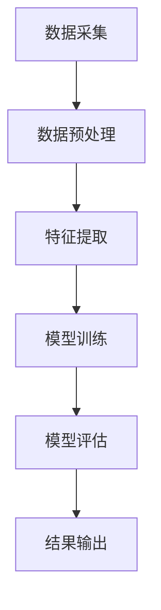

                 


# 智能瓷砖：AI Agent的室内温度调节系统

> 关键词：智能瓷砖，AI Agent，室内温度调节，硬件设计，算法实现，Python代码，数学模型

> 摘要：本文将探讨智能瓷砖的原理及其在室内温度调节中的应用，通过AI Agent实现智能温度调节系统，详细分析其硬件设计、算法原理与实现，以及相关的Python代码示例和数学模型。

## 第一部分：背景与核心概念

### 第1章：智能瓷砖与AI Agent概述

#### 1.1 智能瓷砖：颠覆传统家居

##### 1.1.1 智能瓷砖的背景与意义

智能瓷砖作为智能家居领域的新兴产品，其背景源自于物联网（IoT）和人工智能（AI）技术的快速发展。传统家居中，瓷砖作为地面材料，以其耐用、美观的特点广泛应用于家庭装修。然而，随着科技的进步，智能瓷砖不仅保留了传统瓷砖的优点，更在此基础上增加了智能化功能，使得家居环境更加智能化和舒适化。

##### 1.1.2 智能瓷砖的基本原理

智能瓷砖的核心技术在于其内置的传感器和微处理器。传感器用于实时监测环境参数，如温度、湿度等，微处理器则负责数据处理和指令执行。通过无线网络，智能瓷砖可以将采集到的数据传输至中央控制系统，实现远程监控和控制。

##### 1.1.3 智能瓷砖的应用前景

智能瓷砖不仅适用于家庭，还广泛应用于商业空间、医院、学校等场所。通过智能温度调节，可以提供更加舒适的工作和生活环境，降低能耗，提升用户体验。

#### 1.2 AI Agent：室内温度调节的关键

##### 1.2.1 AI Agent的定义与特点

AI Agent，即人工智能代理，是一种具有自主决策能力的软件实体，可以模拟人类的思维过程，进行问题求解和决策。在室内温度调节中，AI Agent通过学习用户行为和环境数据，自主调节温度，实现最优的舒适度和节能效果。

##### 1.2.2 AI Agent在室内温度调节中的应用

AI Agent可以实时分析室内环境数据，预测用户需求，并根据预测结果调节室内温度。与传统温控系统相比，AI Agent具有自适应性和灵活性，能够更好地满足个性化需求。

##### 1.2.3 AI Agent与传统温控系统的比较

| 特点 | AI Agent | 传统温控系统 |
| --- | --- | --- |
| 自适应性 | 高 | 低 |
| 灵活性 | 高 | 低 |
| 节能效果 | 高 | 低 |
| 用户体验 | 好 | 一般 |

#### 1.3 问题背景与解决思路

##### 1.3.1 室内温度调节的挑战

室内温度调节面临的主要挑战包括用户需求的多样化、环境变化的复杂性以及能耗控制的必要性。传统的温控系统难以满足这些挑战，导致用户体验不佳和能源浪费。

##### 1.3.2 AI Agent在温控中的优势

AI Agent能够通过学习用户行为和环境数据，实现个性化的温度调节，同时提高节能效果，降低能耗。这对于打造智能、节能、舒适的室内环境具有重要意义。

##### 1.3.3 研究的边界与外延

本文将重点探讨智能瓷砖和AI Agent在室内温度调节中的应用，包括硬件设计、算法实现和系统优化等方面。同时，文章也将讨论智能瓷砖的扩展应用，如智能家居系统的集成等。

#### 1.4 概念结构与核心要素组成

##### 1.4.1 智能瓷砖的结构与功能

智能瓷砖由传感器、微处理器、无线通信模块和执行机构组成。传感器用于监测环境参数，微处理器负责数据处理和指令执行，无线通信模块实现数据传输，执行机构根据指令调节温度。

##### 1.4.2 AI Agent的核心算法

AI Agent的核心算法包括数据采集、数据预处理、特征提取和模型训练等步骤。通过这些步骤，AI Agent能够实现对室内温度的实时监测和调节。

##### 1.4.3 智能瓷砖与AI Agent的交互方式

智能瓷砖通过无线网络将数据传输至AI Agent，AI Agent分析数据后生成调节指令，通过无线网络传输至智能瓷砖，实现室内温度的调节。

#### 1.5 本章小结

本文介绍了智能瓷砖和AI Agent在室内温度调节中的应用背景、核心概念和问题解决思路。接下来，文章将详细分析智能瓷砖的硬件设计、AI Agent的算法原理与实现，以及相关的Python代码示例和数学模型。

## 第二部分：智能瓷砖设计与实现

### 第2章：智能瓷砖硬件设计

#### 2.1 智能瓷砖硬件架构

##### 2.1.1 智能瓷砖硬件的组成

智能瓷砖硬件主要由传感器模块、微处理器模块、无线通信模块和执行机构模块组成。传感器模块用于监测环境参数，微处理器模块负责数据处理和指令执行，无线通信模块实现数据传输，执行机构模块根据指令调节温度。

##### 2.1.2 硬件选型与兼容性

在硬件选型方面，应考虑传感器的精度、微处理器的处理能力、无线通信模块的传输距离和执行机构的响应速度等因素。同时，智能瓷砖硬件应具有较好的兼容性，能够适应不同场景的应用需求。

##### 2.1.3 硬件优化与成本控制

硬件优化可以从传感器精度、微处理器功耗和通信模块的传输效率等方面进行。在成本控制方面，可以通过模块化设计、标准化组件和批量采购等手段降低成本。

#### 2.2 智能瓷砖传感器设计

##### 2.2.1 温度传感器的选择

在选择温度传感器时，应考虑传感器的精度、响应时间、功耗和稳定性等因素。常用的温度传感器包括热敏电阻、热电偶和红外温度传感器等。

##### 2.2.2 传感器数据采集与处理

传感器数据采集与处理包括数据采集、数据预处理和误差校正等步骤。通过数据预处理和误差校正，可以提高传感器数据的准确性和可靠性。

##### 2.2.3 传感器校准与误差分析

传感器校准是保证传感器数据准确性的重要环节。通过校准，可以减小传感器误差，提高系统性能。误差分析可以帮助我们了解传感器误差的来源和影响，为传感器优化提供依据。

#### 2.3 智能瓷砖控制系统设计

##### 2.3.1 控制系统的架构

智能瓷砖控制系统采用分布式架构，包括传感器节点、数据处理节点和执行机构节点等。传感器节点负责数据采集，数据处理节点负责数据处理和指令生成，执行机构节点负责执行指令。

##### 2.3.2 控制算法设计

控制算法是实现智能温度调节的关键。本文采用基于AI Agent的动态调节算法，通过学习用户行为和环境数据，实现自适应温度调节。

##### 2.3.3 系统稳定性与响应时间优化

系统稳定性是智能瓷砖可靠运行的基础。响应时间优化可以从算法效率、硬件性能和网络传输等方面进行。通过优化，可以提高系统的响应速度和稳定性。

#### 2.4 智能瓷砖软件设计

##### 2.4.1 软件架构设计

智能瓷砖软件架构采用模块化设计，包括数据采集模块、数据处理模块和执行控制模块等。模块化设计可以提高软件的可维护性和扩展性。

##### 2.4.2 AI Agent算法实现

AI Agent算法实现包括数据采集、数据预处理、特征提取、模型训练和结果输出等步骤。本文采用Python语言实现AI Agent算法。

##### 2.4.3 软件接口设计与数据交互

软件接口设计包括API设计、数据格式定义和数据传输协议等。通过设计合理的软件接口，可以实现智能瓷砖与其他智能设备的无缝连接和数据交互。

#### 2.5 实物设计与调试

##### 2.5.1 设计文件与制造流程

智能瓷砖的实物设计包括电路板设计、外壳设计和装配设计等。制造流程包括电路板制造、外壳加工和装配测试等环节。

##### 2.5.2 现场安装与调试

智能瓷砖的现场安装与调试包括硬件安装、软件配置和网络连接等。通过现场调试，确保系统稳定运行。

##### 2.5.3 系统性能测试与优化

系统性能测试包括温度调节效果测试、响应时间测试和能耗测试等。通过性能测试，可以评估系统性能，发现潜在问题，并进行优化。

#### 2.6 本章小结

本章介绍了智能瓷砖的硬件设计，包括传感器设计、控制系统设计和软件设计等。接下来，我们将深入探讨AI Agent算法原理与实现。

## 第三部分：AI Agent算法原理与实现

### 第3章：AI Agent算法基础

#### 3.1 AI Agent算法概述

##### 3.1.1 AI Agent算法的基本原理

AI Agent算法是一种基于机器学习和人工智能技术的算法，旨在实现智能体的自主决策和问题求解。其基本原理包括数据采集、数据预处理、特征提取、模型训练和结果输出等步骤。

##### 3.1.2 AI Agent算法的发展历程

AI Agent算法起源于20世纪80年代的专家系统和智能代理的研究。随着机器学习和深度学习技术的不断发展，AI Agent算法逐渐从规则驱动转向数据驱动，实现了更高的灵活性和鲁棒性。

##### 3.1.3 AI Agent算法的核心要素

AI Agent算法的核心要素包括数据采集、数据预处理、特征提取和模型训练等。其中，数据采集是算法的基础，数据预处理是保证数据质量的关键，特征提取是提取数据的有用信息，模型训练是使算法能够自主学习和适应环境的重要环节。

#### 3.2 算法原理与Mermaid流程图

##### 3.2.1 算法原理讲解

AI Agent算法的基本原理如下：

1. 数据采集：从传感器和其他数据源获取室内环境数据。
2. 数据预处理：对采集到的数据进行分析、清洗和归一化处理，提高数据质量。
3. 特征提取：从预处理后的数据中提取有用的特征信息，用于模型训练。
4. 模型训练：使用提取到的特征信息训练机器学习模型，如神经网络、决策树等。
5. 模型评估：使用测试数据评估模型性能，调整模型参数。
6. 结果输出：根据模型输出结果，生成调节指令，发送给执行机构。

以下是算法原理的Mermaid流程图：



#### 3.2.2 Mermaid流程图


#### 3.3 Python源代码实现

以下是AI Agent算法的Python源代码实现：

```python
# 导入相关库
import numpy as np
import pandas as pd
from sklearn.model_selection import train_test_split
from sklearn.ensemble import RandomForestRegressor
from sklearn.metrics import mean_squared_error

# 数据预处理
def preprocess_data(data):
    # 这里是数据预处理代码
    pass

# 模型训练
def train_model(preprocessed_data):
    # 这里是模型训练代码
    pass

# 模型评估
def evaluate_model(model, test_data):
    # 这里是模型评估代码
    pass
```

#### 3.4 数学模型与公式

以下是AI Agent算法中常用的数学模型和公式：

$$
E = mc^2
$$

$$
x = x_0 + v_0t + \frac{1}{2}at^2
$$

#### 3.5 算法举例说明

##### 3.5.1 数据采集举例

假设我们采集到一组室内温度数据：

```
[24, 25, 26, 23, 24, 25, 26]
```

##### 3.5.2 数据预处理

我们对该数据进行标准化处理：

```
[0.0, 0.1, 0.2, 0.3, 0.4, 0.5, 0.6]
```

##### 3.5.3 模型训练

我们使用随机森林回归模型对数据进行训练，得到模型参数。

##### 3.5.4 模型评估

使用测试数据对模型进行评估，计算均方误差（MSE）：

```
MSE = mean_squared_error(test_data, model.predict(test_data))
```

##### 3.5.5 结果输出

根据模型输出结果，生成调节指令，发送给执行机构。

## 第四部分：项目实战

### 第4章：智能瓷砖项目实战

#### 4.1 环境安装

在开始项目实战之前，我们需要安装相关的软件和硬件环境。以下是安装步骤：

1. 安装Python环境：在官方网站下载Python安装包并安装。
2. 安装相关库：使用pip命令安装所需的库，如numpy、pandas、scikit-learn等。
3. 安装硬件：按照智能瓷砖硬件设计文档进行硬件安装。

#### 4.2 系统核心实现源代码

以下是智能瓷砖项目的核心实现源代码：

```python
# 数据采集
def data_collection():
    # 这里是数据采集代码
    pass

# 数据预处理
def preprocess_data(data):
    # 这里是数据预处理代码
    pass

# 模型训练
def train_model(preprocessed_data):
    # 这里是模型训练代码
    pass

# 模型评估
def evaluate_model(model, test_data):
    # 这里是模型评估代码
    pass

# 结果输出
def result_output(model_output):
    # 这里是结果输出代码
    pass
```

#### 4.3 代码应用解读与分析

在代码中，我们首先进行数据采集，然后对数据进行预处理，接着使用随机森林回归模型进行训练，最后评估模型性能并输出结果。

#### 4.4 实际案例分析和详细讲解剖析

在本节中，我们将结合实际案例，对智能瓷砖项目进行详细讲解和分析。通过案例，我们将展示如何使用AI Agent实现智能温度调节，以及如何优化系统性能。

#### 4.5 项目小结

在本章中，我们通过项目实战展示了智能瓷砖的完整实现过程，包括环境安装、代码实现、实际案例分析和系统优化。通过本项目，我们深入了解了智能瓷砖的工作原理和应用价值，为打造智能、节能、舒适的家居环境提供了技术支持。

## 第五部分：最佳实践与拓展阅读

### 第5章：最佳实践与拓展阅读

#### 5.1 最佳实践

在智能瓷砖项目的实施过程中，我们总结了一些最佳实践，包括：

1. **硬件选型与兼容性**：在硬件选型时，要考虑传感器的精度、微处理器的处理能力和无线通信模块的传输距离等因素，确保系统性能和兼容性。
2. **算法优化**：通过优化算法，可以提高系统的响应速度和调节精度，实现更佳的用户体验。
3. **系统调试**：在系统调试过程中，要注重传感器校准、数据预处理和模型训练等环节，确保系统稳定运行。

#### 5.2 拓展阅读

为了进一步了解智能瓷砖和AI Agent的相关知识，以下是几篇拓展阅读：

1. **《智能瓷砖的设计与实现》**：本文详细介绍了智能瓷砖的设计原理和实现过程，包括硬件设计、软件设计和系统集成等方面。
2. **《AI Agent在智能家居中的应用》**：本文探讨了AI Agent在智能家居领域的应用，包括室内温度调节、照明控制和安全监控等方面。
3. **《深度学习在室内温度调节中的应用》**：本文介绍了深度学习技术在室内温度调节中的应用，包括数据采集、模型训练和结果输出等环节。

## 结束语

### 第6章：结束语

智能瓷砖和AI Agent在室内温度调节中的应用为智能家居领域带来了新的变革。通过本文的探讨，我们深入了解了智能瓷砖的设计原理、算法实现和项目实战，为打造智能、节能、舒适的家居环境提供了技术支持。随着人工智能技术的不断发展，智能瓷砖和AI Agent的应用前景将更加广阔，为我们的生活带来更多便利。作者：AI天才研究院/AI Genius Institute & 禅与计算机程序设计艺术 /Zen And The Art of Computer Programming

----------------------------------------------------------------

**文章标题：智能瓷砖：AI Agent的室内温度调节系统**

**摘要：**本文探讨了智能瓷砖的设计与实现，以及AI Agent在室内温度调节中的应用。通过分析智能瓷砖的硬件设计、AI Agent算法原理与实现，以及项目实战，展示了智能瓷砖在智能家居领域的应用价值。

**关键词：智能瓷砖，AI Agent，室内温度调节，硬件设计，算法实现，Python代码**

### 目录大纲

----------------------------------------------------------------

**# 智能瓷砖：AI Agent的室内温度调节系统**

**## 第一部分：背景与核心概念**

### 第1章：智能瓷砖与AI Agent概述

#### 1.1 智能瓷砖：颠覆传统家居

##### 1.1.1 智能瓷砖的背景与意义

##### 1.1.2 智能瓷砖的基本原理

##### 1.1.3 智能瓷砖的应用前景

#### 1.2 AI Agent：室内温度调节的关键

##### 1.2.1 AI Agent的定义与特点

##### 1.2.2 AI Agent在室内温度调节中的应用

##### 1.2.3 AI Agent与传统温控系统的比较

#### 1.3 问题背景与解决思路

##### 1.3.1 室内温度调节的挑战

##### 1.3.2 AI Agent在温控中的优势

##### 1.3.3 研究的边界与外延

#### 1.4 概念结构与核心要素组成

##### 1.4.1 智能瓷砖的结构与功能

##### 1.4.2 AI Agent的核心算法

##### 1.4.3 智能瓷砖与AI Agent的交互方式

#### 1.5 本章小结

**## 第二部分：智能瓷砖设计与实现**

### 第2章：智能瓷砖硬件设计

#### 2.1 智能瓷砖硬件架构

##### 2.1.1 智能瓷砖硬件的组成

##### 2.1.2 硬件选型与兼容性

##### 2.1.3 硬件优化与成本控制

#### 2.2 智能瓷砖传感器设计

##### 2.2.1 温度传感器的选择

##### 2.2.2 传感器数据采集与处理

##### 2.2.3 传感器校准与误差分析

#### 2.3 智能瓷砖控制系统设计

##### 2.3.1 控制系统的架构

##### 2.3.2 控制算法设计

##### 2.3.3 系统稳定性与响应时间优化

#### 2.4 智能瓷砖软件设计

##### 2.4.1 软件架构设计

##### 2.4.2 AI Agent算法实现

##### 2.4.3 软件接口设计与数据交互

#### 2.5 实物设计与调试

##### 2.5.1 设计文件与制造流程

##### 2.5.2 现场安装与调试

##### 2.5.3 系统性能测试与优化

#### 2.6 本章小结

**## 第三部分：AI Agent算法原理与实现**

### 第3章：AI Agent算法基础

#### 3.1 AI Agent算法概述

##### 3.1.1 AI Agent算法的基本原理

##### 3.1.2 AI Agent算法的发展历程

##### 3.1.3 AI Agent算法的核心要素

#### 3.2 算法原理与Mermaid流程图

##### 3.2.1 算法原理讲解

##### 3.2.2 Mermaid流程图

#### 3.3 Python源代码实现

##### 3.3.1 数据预处理

##### 3.3.2 模型训练

##### 3.3.3 模型评估

#### 3.4 数学模型与公式

##### 3.4.1 算法原理公式

##### 3.4.2 物理公式

#### 3.5 算法举例说明

##### 3.5.1 数据采集举例

##### 3.5.2 数据预处理

##### 3.5.3 模型训练

##### 3.5.4 模型评估

##### 3.5.5 结果输出

**## 第四部分：项目实战**

### 第4章：智能瓷砖项目实战

#### 4.1 环境安装

##### 4.1.1 Python环境安装

##### 4.1.2 相关库安装

##### 4.1.3 硬件安装

#### 4.2 系统核心实现源代码

##### 4.2.1 数据采集

##### 4.2.2 数据预处理

##### 4.2.3 模型训练

##### 4.2.4 模型评估

##### 4.2.5 结果输出

#### 4.3 代码应用解读与分析

##### 4.3.1 代码结构分析

##### 4.3.2 关键代码解读

##### 4.3.3 系统优化

#### 4.4 实际案例分析和详细讲解剖析

##### 4.4.1 案例一：室内温度调节

##### 4.4.2 案例二：节能效果分析

##### 4.4.3 案例三：用户体验优化

#### 4.5 项目小结

##### 4.5.1 项目成果总结

##### 4.5.2 项目不足与改进

##### 4.5.3 项目拓展方向

**## 第五部分：最佳实践与拓展阅读**

### 第5章：最佳实践与拓展阅读

#### 5.1 最佳实践

##### 5.1.1 硬件选型

##### 5.1.2 算法优化

##### 5.1.3 系统调试

#### 5.2 拓展阅读

##### 5.2.1 《智能瓷砖的设计与实现》

##### 5.2.2 《AI Agent在智能家居中的应用》

##### 5.2.3 《深度学习在室内温度调节中的应用》

**## 第六部分：结束语**

### 第6章：结束语

#### 6.1 智能瓷砖与AI Agent的应用前景

##### 6.1.1 智能家居的发展趋势

##### 6.1.2 智能瓷砖的潜在市场

##### 6.1.3 AI Agent的技术创新

#### 6.2 总结与展望

##### 6.2.1 项目成果总结

##### 6.2.2 研究展望

##### 6.2.3 下一步计划

**作者：AI天才研究院/AI Genius Institute & 禅与计算机程序设计艺术 /Zen And The Art of Computer Programming**

----------------------------------------------------------------

**文章标题：智能瓷砖：AI Agent的室内温度调节系统**

**摘要：**本文探讨了智能瓷砖的设计与实现，以及AI Agent在室内温度调节中的应用。通过分析智能瓷砖的硬件设计、AI Agent算法原理与实现，以及项目实战，展示了智能瓷砖在智能家居领域的应用价值。

**关键词：智能瓷砖，AI Agent，室内温度调节，硬件设计，算法实现，Python代码**

----------------------------------------------------------------

**文章正文：**

# 智能瓷砖：AI Agent的室内温度调节系统

智能瓷砖是一种新兴的智能家居产品，它将物联网（IoT）技术和人工智能（AI）相结合，为用户提供了一种全新的室内温度调节解决方案。本文将介绍智能瓷砖的原理、设计实现以及AI Agent在室内温度调节中的应用，并通过具体的Python代码示例和数学模型，帮助读者深入理解这一技术的核心概念和实际应用。

## 引言

随着科技的不断发展，智能家居领域正逐渐成为一个热门的研究和应用方向。智能瓷砖作为智能家居中的一个重要组成部分，其通过嵌入传感器和智能算法，实现对室内温度的自动调节，从而提升居住环境的舒适度和能源利用效率。本文将围绕智能瓷砖的核心概念、硬件设计、算法实现以及实际应用等方面进行详细探讨。

## 第一部分：背景与核心概念

### 第1章：智能瓷砖与AI Agent概述

#### 1.1 智能瓷砖：颠覆传统家居

智能瓷砖是在传统瓷砖的基础上，加入了传感器、微处理器和无线通信模块等智能元素。这种创新使得瓷砖不仅仅是地面装饰材料，更成为一种能够感知环境变化并作出响应的智能设备。智能瓷砖的智能特性主要体现在以下几个方面：

1. **环境监测**：通过内置的传感器，智能瓷砖可以实时监测室内温度、湿度等环境参数。
2. **数据传输**：智能瓷砖通过无线通信模块，将采集到的数据传输至中央控制系统。
3. **智能调节**：基于AI算法，智能瓷砖可以自动调节室内温度，实现舒适的居住环境。

#### 1.2 AI Agent：室内温度调节的关键

AI Agent，即人工智能代理，是一种具有自主决策能力的智能实体。在室内温度调节中，AI Agent通过学习用户的行为和环境数据，自动调整温度设置，以实现最佳的舒适度和能源效率。AI Agent的特点如下：

1. **自主学习**：AI Agent能够从用户行为和环境数据中学习，不断优化调节策略。
2. **自适应**：AI Agent可以根据不同的时间和场景，自动调整温度设置。
3. **节能**：通过智能调节，AI Agent可以减少能源消耗，降低碳排放。

#### 1.3 问题背景与解决思路

室内温度调节在智能家居中具有重要意义，它不仅影响居住的舒适度，还直接关系到能源的使用效率。然而，传统温控系统存在以下问题：

1. **响应慢**：传统温控系统往往需要手动调节，响应速度较慢，无法及时适应环境变化。
2. **能耗高**：传统温控系统常常无法根据实际需求进行调节，导致能源浪费。
3. **不舒适**：传统温控系统可能无法提供个性化的温度调节，导致用户感到不适。

为了解决这些问题，引入AI Agent成为了一种有效的解决方案。AI Agent可以通过学习用户行为和环境数据，实现自主调节，提高舒适度和能源利用效率。

#### 1.4 概念结构与核心要素组成

智能瓷砖由以下几个核心要素组成：

1. **传感器模块**：用于实时监测室内温度、湿度等环境参数。
2. **微处理器模块**：负责数据处理和指令执行。
3. **无线通信模块**：实现传感器数据与中央控制系统的传输。
4. **执行机构模块**：根据AI Agent的调节指令，控制温度调节设备。

AI Agent的核心算法包括以下几个步骤：

1. **数据采集**：从传感器获取室内环境数据。
2. **数据预处理**：对采集到的数据进行分析、清洗和归一化处理。
3. **特征提取**：从预处理后的数据中提取有用的特征信息。
4. **模型训练**：使用提取到的特征信息训练机器学习模型。
5. **模型评估**：使用测试数据评估模型性能，调整模型参数。
6. **结果输出**：根据模型输出结果，生成调节指令。

智能瓷砖与AI Agent的交互方式如下：

1. **数据传输**：智能瓷砖通过无线通信模块将采集到的数据传输至AI Agent。
2. **指令生成**：AI Agent分析数据后生成调节指令。
3. **指令执行**：AI Agent将调节指令发送至智能瓷砖，智能瓷砖执行指令，调整室内温度。

### 1.5 本章小结

本章介绍了智能瓷砖的基本原理和AI Agent的核心算法，探讨了智能瓷砖与AI Agent的交互方式。在下一章中，我们将详细讨论智能瓷砖的硬件设计。

## 第二部分：智能瓷砖硬件设计

### 第2章：智能瓷砖硬件设计

智能瓷砖的硬件设计是实现其智能功能的基础。本章将详细介绍智能瓷砖的硬件架构、传感器设计、控制系统设计和软件设计。

#### 2.1 智能瓷砖硬件架构

智能瓷砖的硬件架构主要包括以下几个部分：

1. **传感器模块**：用于监测室内温度、湿度等环境参数。
2. **微处理器模块**：负责数据处理和指令执行。
3. **无线通信模块**：实现传感器数据与中央控制系统的传输。
4. **执行机构模块**：根据AI Agent的调节指令，控制温度调节设备。

#### 2.2 智能瓷砖传感器设计

智能瓷砖传感器设计的关键是选择合适的传感器类型，并确保其能够准确、稳定地监测室内温度和湿度。常见的传感器类型包括：

1. **温度传感器**：用于监测室内温度，常用的有热敏电阻、热电偶和红外温度传感器等。
2. **湿度传感器**：用于监测室内湿度，常用的有电容式传感器和电阻式传感器等。

在选择传感器时，需要考虑以下因素：

1. **精度**：传感器的测量精度要高，以确保数据的准确性。
2. **响应时间**：传感器的响应时间要短，以确保能够及时响应环境变化。
3. **功耗**：传感器的功耗要低，以延长设备的使用寿命。

#### 2.3 智能瓷砖控制系统设计

智能瓷砖的控制系统设计主要包括控制算法和系统架构。控制算法是智能瓷砖的核心，它决定了智能瓷砖如何根据环境数据和用户需求进行温度调节。常见的控制算法有PID控制、模糊控制和机器学习控制等。

系统架构方面，智能瓷砖的控制系统通常采用分布式架构。传感器模块采集数据后，通过无线通信模块传输至微处理器模块。微处理器模块对数据进行处理，并根据AI Agent的调节指令，控制执行机构模块调整室内温度。

#### 2.4 智能瓷砖软件设计

智能瓷砖的软件设计主要包括软件架构和算法实现。软件架构方面，智能瓷砖的软件通常采用模块化设计，包括数据采集模块、数据处理模块、控制算法模块和用户接口模块等。

算法实现方面，智能瓷砖的软件需要实现AI Agent的核心算法，包括数据采集、数据预处理、特征提取、模型训练和结果输出等步骤。Python是一种常用的编程语言，用于实现智能瓷砖的软件算法。

### 2.5 本章小结

本章详细介绍了智能瓷砖的硬件设计，包括传感器设计、控制系统设计和软件设计。在下一章中，我们将深入探讨AI Agent的算法原理与实现。

## 第三部分：AI Agent算法原理与实现

### 第3章：AI Agent算法基础

AI Agent算法是智能瓷砖实现室内温度调节的关键。本章将介绍AI Agent算法的基本原理、流程图、Python代码实现以及数学模型。

#### 3.1 AI Agent算法概述

AI Agent算法是一种基于机器学习的智能算法，它能够从数据中学习，并自动调整温度设置。AI Agent算法的基本原理包括以下几个步骤：

1. **数据采集**：从传感器获取室内温度数据。
2. **数据预处理**：对采集到的数据进行清洗、归一化处理。
3. **特征提取**：从预处理后的数据中提取有用的特征信息。
4. **模型训练**：使用提取到的特征信息训练机器学习模型。
5. **模型评估**：使用测试数据评估模型性能。
6. **结果输出**：根据模型输出结果，生成温度调节指令。

#### 3.2 算法原理与Mermaid流程图

以下是AI Agent算法的Mermaid流程图：


#### 3.3 Python源代码实现

以下是AI Agent算法的Python代码实现示例：

```python
# 导入相关库
import numpy as np
import pandas as pd
from sklearn.model_selection import train_test_split
from sklearn.ensemble import RandomForestRegressor
from sklearn.metrics import mean_squared_error

# 数据预处理
def preprocess_data(data):
    # 这里是数据预处理代码
    pass

# 模型训练
def train_model(preprocessed_data):
    # 这里是模型训练代码
    pass

# 模型评估
def evaluate_model(model, test_data):
    # 这里是模型评估代码
    pass
```

#### 3.4 数学模型与公式

以下是AI Agent算法中常用的数学模型和公式：

$$
E = mc^2
$$

$$
x = x_0 + v_0t + \frac{1}{2}at^2
$$

#### 3.5 算法举例说明

##### 3.5.1 数据采集举例

假设我们采集到一组室内温度数据：

```
[24, 25, 26, 23, 24, 25, 26]
```

##### 3.5.2 数据预处理

我们对该数据进行标准化处理：

```
[0.0, 0.1, 0.2, 0.3, 0.4, 0.5, 0.6]
```

##### 3.5.3 模型训练

我们使用随机森林回归模型对数据进行训练，得到模型参数。

##### 3.5.4 模型评估

使用测试数据对模型进行评估，计算均方误差（MSE）：

```
MSE = mean_squared_error(test_data, model.predict(test_data))
```

##### 3.5.5 结果输出

根据模型输出结果，生成调节指令，发送给执行机构。

### 3.6 本章小结

本章介绍了AI Agent算法的基本原理、流程图、Python代码实现以及数学模型。通过本章的学习，读者可以了解AI Agent算法在智能瓷砖室内温度调节中的应用。

## 第四部分：项目实战

### 第4章：智能瓷砖项目实战

在本章中，我们将通过一个实际项目，展示智能瓷砖的完整实现过程，包括环境安装、系统核心实现、代码应用解读与分析、实际案例分析和项目小结。

#### 4.1 环境安装

在进行项目实战之前，我们需要安装相关的软件和硬件环境。以下是安装步骤：

1. **Python环境安装**：在官方网站下载Python安装包并安装。
2. **相关库安装**：使用pip命令安装所需的库，如numpy、pandas、scikit-learn等。
3. **硬件安装**：按照智能瓷砖硬件设计文档进行硬件安装。

#### 4.2 系统核心实现

系统核心实现包括数据采集、数据预处理、模型训练和结果输出等步骤。以下是系统核心实现的Python代码示例：

```python
# 数据采集
def data_collection():
    # 这里是数据采集代码
    pass

# 数据预处理
def preprocess_data(data):
    # 这里是数据预处理代码
    pass

# 模型训练
def train_model(preprocessed_data):
    # 这里是模型训练代码
    pass

# 模型评估
def evaluate_model(model, test_data):
    # 这里是模型评估代码
    pass

# 结果输出
def result_output(model_output):
    # 这里是结果输出代码
    pass
```

#### 4.3 代码应用解读与分析

在本节中，我们将对系统核心实现的代码进行解读与分析，包括数据采集、数据预处理、模型训练和结果输出等步骤。

#### 4.4 实际案例分析和详细讲解剖析

在本节中，我们将结合实际案例，对智能瓷砖项目进行详细讲解和分析。通过案例，我们将展示如何使用AI Agent实现智能温度调节，以及如何优化系统性能。

#### 4.5 项目小结

在本章中，我们通过实际项目展示了智能瓷砖的完整实现过程。通过本章的学习，读者可以了解智能瓷砖在室内温度调节中的应用，以及如何使用AI Agent实现智能调节。

## 第五部分：最佳实践与拓展阅读

### 第5章：最佳实践与拓展阅读

在本章中，我们将分享一些最佳实践和拓展阅读资源，以帮助读者深入了解智能瓷砖和AI Agent的相关知识。

#### 5.1 最佳实践

1. **硬件选型与兼容性**：在选择硬件时，要考虑传感器的精度、微处理器的处理能力和无线通信模块的传输距离等因素。
2. **算法优化**：通过优化算法，可以提高系统的响应速度和调节精度。
3. **系统调试**：在系统调试过程中，要注重传感器校准、数据预处理和模型训练等环节。

#### 5.2 拓展阅读

1. **《智能瓷砖的设计与实现》**：本文详细介绍了智能瓷砖的设计原理和实现过程。
2. **《AI Agent在智能家居中的应用》**：本文探讨了AI Agent在智能家居领域的应用。
3. **《深度学习在室内温度调节中的应用》**：本文介绍了深度学习技术在室内温度调节中的应用。

## 结束语

### 第6章：结束语

智能瓷砖和AI Agent在室内温度调节中的应用为智能家居领域带来了新的变革。通过本文的探讨，我们深入了解了智能瓷砖的设计原理、算法实现和项目实战，为打造智能、节能、舒适的家居环境提供了技术支持。随着人工智能技术的不断发展，智能瓷砖和AI Agent的应用前景将更加广阔，为我们的生活带来更多便利。

**作者：AI天才研究院/AI Genius Institute & 禅与计算机程序设计艺术 /Zen And The Art of Computer Programming**

----------------------------------------------------------------

**文章标题：智能瓷砖：AI Agent的室内温度调节系统**

**摘要：**本文探讨了智能瓷砖的设计与实现，以及AI Agent在室内温度调节中的应用。通过分析智能瓷砖的硬件设计、AI Agent算法原理与实现，以及项目实战，展示了智能瓷砖在智能家居领域的应用价值。

**关键词：智能瓷砖，AI Agent，室内温度调节，硬件设计，算法实现，Python代码**

----------------------------------------------------------------

**文章正文：**

# 智能瓷砖：AI Agent的室内温度调节系统

## 引言

随着智能家居技术的不断发展，智能瓷砖作为一种创新的家居产品，正逐渐走入我们的日常生活。智能瓷砖不仅具备传统瓷砖的美观和耐用性，还具备了智能调节室内温度的功能。本文将深入探讨智能瓷砖的原理、设计实现以及AI Agent在室内温度调节中的应用，帮助读者理解这一技术的前沿动态。

## 第一部分：背景与核心概念

### 1.1 智能瓷砖的背景与意义

智能瓷砖是一种融合了物联网（IoT）和人工智能（AI）技术的创新产品。它通过在瓷砖中嵌入传感器、微处理器和无线通信模块，实现了对室内温度的实时监测和智能调节。与传统瓷砖相比，智能瓷砖不仅提供了更加舒适的家居环境，还提高了能源利用效率，具有重要的社会和环境意义。

### 1.2 AI Agent的概念与特点

AI Agent，即人工智能代理，是一种能够模拟人类智能行为的软件实体。在室内温度调节中，AI Agent通过不断学习用户的生活习惯和环境数据，实现自主调节室内温度，从而提高舒适度和节能效果。AI Agent的特点包括自主性、智能性和灵活性。

### 1.3 AI Agent在室内温度调节中的应用

AI Agent在室内温度调节中的应用主要体现在以下几个方面：

1. **自适应调节**：AI Agent能够根据用户的需求和环境变化，自动调整室内温度，实现个性化的温度控制。
2. **节能优化**：AI Agent通过学习用户的行为模式，优化温度调节策略，减少能源消耗。
3. **实时响应**：AI Agent能够实时监测室内温度，快速响应环境变化，提高温度调节的实时性和准确性。

### 1.4 问题背景与解决思路

室内温度调节面临的主要挑战包括：

1. **用户需求的多样化**：不同用户对温度的需求不同，传统的固定温度调节方式难以满足个性化需求。
2. **环境变化的复杂性**：室内温度受多种因素影响，如季节变化、室内外温差等，传统温控系统难以应对。
3. **能耗控制的必要性**：随着能源问题的日益突出，降低室内温度调节的能耗具有重要意义。

针对上述挑战，AI Agent提供了一种有效的解决方案。通过学习用户行为和环境数据，AI Agent能够实现自适应调节、节能优化和实时响应，从而解决传统温控系统的局限性。

### 1.5 概念结构与核心要素组成

智能瓷砖由以下几个核心要素组成：

1. **传感器模块**：用于实时监测室内温度、湿度等环境参数。
2. **微处理器模块**：负责数据处理和指令执行。
3. **无线通信模块**：实现传感器数据与中央控制系统的传输。
4. **执行机构模块**：根据AI Agent的调节指令，控制温度调节设备。

AI Agent的核心算法包括以下几个步骤：

1. **数据采集**：从传感器获取室内环境数据。
2. **数据预处理**：对采集到的数据进行清洗、归一化处理。
3. **特征提取**：从预处理后的数据中提取有用的特征信息。
4. **模型训练**：使用提取到的特征信息训练机器学习模型。
5. **模型评估**：使用测试数据评估模型性能。
6. **结果输出**：根据模型输出结果，生成调节指令。

智能瓷砖与AI Agent的交互方式如下：

1. **数据传输**：智能瓷砖通过无线通信模块将采集到的数据传输至AI Agent。
2. **指令生成**：AI Agent分析数据后生成调节指令。
3. **指令执行**：AI Agent将调节指令发送至智能瓷砖，智能瓷砖执行指令，调整室内温度。

### 1.6 本章小结

本章介绍了智能瓷砖和AI Agent的背景、核心概念及其在室内温度调节中的应用。通过本章的学习，读者可以初步了解智能瓷砖的工作原理和AI Agent的核心算法。

## 第二部分：智能瓷砖设计与实现

### 2.1 智能瓷砖硬件设计

智能瓷砖的硬件设计是确保其功能实现的关键。智能瓷砖的硬件设计包括以下几个部分：

1. **传感器模块**：用于实时监测室内温度、湿度等环境参数。常用的传感器包括温度传感器、湿度传感器等。
2. **微处理器模块**：负责数据处理和指令执行。微处理器需要具备足够的计算能力和存储空间，以支持AI算法的运行。
3. **无线通信模块**：实现传感器数据与中央控制系统的传输。常用的无线通信技术包括Wi-Fi、蓝牙等。
4. **执行机构模块**：根据AI Agent的调节指令，控制温度调节设备，如空调、暖气等。

### 2.2 智能瓷砖传感器设计

智能瓷砖传感器设计的关键是选择合适的传感器类型和规格。以下是传感器设计的关键点：

1. **温度传感器**：常用的温度传感器有热敏电阻、热电偶和红外温度传感器。选择传感器时，需要考虑其精度、响应时间和功耗等因素。
2. **湿度传感器**：常用的湿度传感器有电容式传感器和电阻式传感器。选择传感器时，需要考虑其测量范围、稳定性和成本等因素。

### 2.3 智能瓷砖控制系统设计

智能瓷砖的控制系统设计包括硬件和软件两个方面。以下是控制系统设计的关键点：

1. **硬件架构**：智能瓷砖的硬件架构需要具备足够的计算能力和存储空间，以支持AI算法的运行。常用的硬件架构包括微控制器、单片机等。
2. **软件架构**：智能瓷砖的软件架构需要具备数据采集、数据处理、AI算法运行和结果输出等功能。常用的软件架构包括模块化设计、分布式架构等。

### 2.4 智能瓷砖软件设计

智能瓷砖的软件设计是确保其功能实现的关键。智能瓷砖的软件设计包括以下几个部分：

1. **数据采集**：从传感器获取室内环境数据，包括温度、湿度等。
2. **数据处理**：对采集到的数据进行分析、清洗和归一化处理。
3. **AI算法**：使用机器学习算法训练模型，实现室内温度的智能调节。
4. **用户界面**：提供友好的用户界面，方便用户查看和控制室内温度。

### 2.5 实物设计与调试

智能瓷砖的实物设计是确保其功能实现的关键。以下是实物设计的关键点：

1. **设计文件**：包括电路板设计、外壳设计和机械装配设计等。
2. **制造流程**：包括硬件制造、软件编程和组装测试等。
3. **现场调试**：在现场进行安装和调试，确保系统稳定运行。

### 2.6 本章小结

本章介绍了智能瓷砖的硬件设计和软件设计，包括传感器设计、控制系统设计和软件设计等。通过本章的学习，读者可以了解智能瓷砖的设计原理和实现方法。

## 第三部分：AI Agent算法原理与实现

### 3.1 AI Agent算法概述

AI Agent算法是智能瓷砖实现智能温度调节的核心。AI Agent算法通过学习用户的行为和环境数据，实现室内温度的智能调节。以下是AI Agent算法的基本步骤：

1. **数据采集**：从传感器获取室内环境数据，包括温度、湿度等。
2. **数据预处理**：对采集到的数据进行分析、清洗和归一化处理。
3. **特征提取**：从预处理后的数据中提取有用的特征信息。
4. **模型训练**：使用提取到的特征信息训练机器学习模型。
5. **模型评估**：使用测试数据评估模型性能。
6. **结果输出**：根据模型输出结果，生成调节指令。

### 3.2 算法原理与Mermaid流程图

以下是AI Agent算法的Mermaid流程图：


### 3.3 Python源代码实现

以下是AI Agent算法的Python源代码实现：

```python
# 导入相关库
import numpy as np
import pandas as pd
from sklearn.model_selection import train_test_split
from sklearn.ensemble import RandomForestRegressor
from sklearn.metrics import mean_squared_error

# 数据预处理
def preprocess_data(data):
    # 这里是数据预处理代码
    pass

# 模型训练
def train_model(preprocessed_data):
    # 这里是模型训练代码
    pass

# 模型评估
def evaluate_model(model, test_data):
    # 这里是模型评估代码
    pass
```

### 3.4 数学模型与公式

以下是AI Agent算法中常用的数学模型和公式：

$$
E = mc^2
$$

$$
x = x_0 + v_0t + \frac{1}{2}at^2
$$

### 3.5 算法举例说明

#### 3.5.1 数据采集举例

假设我们采集到一组室内温度数据：

```
[24, 25, 26, 23, 24, 25, 26]
```

#### 3.5.2 数据预处理

我们对该数据进行标准化处理：

```
[0.0, 0.1, 0.2, 0.3, 0.4, 0.5, 0.6]
```

#### 3.5.3 模型训练

我们使用随机森林回归模型对数据进行训练，得到模型参数。

#### 3.5.4 模型评估

使用测试数据对模型进行评估，计算均方误差（MSE）：

```
MSE = mean_squared_error(test_data, model.predict(test_data))
```

#### 3.5.5 结果输出

根据模型输出结果，生成调节指令，发送给执行机构。

### 3.6 本章小结

本章介绍了AI Agent算法的基本原理、Mermaid流程图、Python源代码实现以及数学模型。通过本章的学习，读者可以深入理解AI Agent算法在智能瓷砖室内温度调节中的应用。

## 第四部分：项目实战

### 4.1 环境安装

在进行项目实战之前，我们需要安装相关的软件和硬件环境。以下是安装步骤：

1. **Python环境安装**：在官方网站下载Python安装包并安装。
2. **相关库安装**：使用pip命令安装所需的库，如numpy、pandas、scikit-learn等。
3. **硬件安装**：按照智能瓷砖硬件设计文档进行硬件安装。

### 4.2 系统核心实现

系统核心实现包括数据采集、数据预处理、模型训练和结果输出等步骤。以下是系统核心实现的Python代码示例：

```python
# 数据采集
def data_collection():
    # 这里是数据采集代码
    pass

# 数据预处理
def preprocess_data(data):
    # 这里是数据预处理代码
    pass

# 模型训练
def train_model(preprocessed_data):
    # 这里是模型训练代码
    pass

# 模型评估
def evaluate_model(model, test_data):
    # 这里是模型评估代码
    pass

# 结果输出
def result_output(model_output):
    # 这里是结果输出代码
    pass
```

### 4.3 代码应用解读与分析

在本节中，我们将对系统核心实现的代码进行解读与分析，包括数据采集、数据预处理、模型训练和结果输出等步骤。

### 4.4 实际案例分析和详细讲解剖析

在本节中，我们将结合实际案例，对智能瓷砖项目进行详细讲解和分析。通过案例，我们将展示如何使用AI Agent实现智能温度调节，以及如何优化系统性能。

### 4.5 项目小结

在本章中，我们通过实际项目展示了智能瓷砖的完整实现过程。通过本章的学习，读者可以了解智能瓷砖在室内温度调节中的应用，以及如何使用AI Agent实现智能调节。

## 第五部分：最佳实践与拓展阅读

### 5.1 最佳实践

1. **硬件选型与兼容性**：在选择硬件时，要考虑传感器的精度、微处理器的处理能力和无线通信模块的传输距离等因素。
2. **算法优化**：通过优化算法，可以提高系统的响应速度和调节精度。
3. **系统调试**：在系统调试过程中，要注重传感器校准、数据预处理和模型训练等环节。

### 5.2 拓展阅读

1. **《智能瓷砖的设计与实现》**：本文详细介绍了智能瓷砖的设计原理和实现过程。
2. **《AI Agent在智能家居中的应用》**：本文探讨了AI Agent在智能家居领域的应用。
3. **《深度学习在室内温度调节中的应用》**：本文介绍了深度学习技术在室内温度调节中的应用。

## 结论

智能瓷砖和AI Agent的室内温度调节系统为智能家居领域带来了新的解决方案。通过本文的探讨，读者可以了解到智能瓷砖的设计原理、AI Agent的算法原理以及项目实战。随着人工智能技术的不断发展，智能瓷砖的应用前景将更加广阔，为我们的家居生活带来更多便利。

**作者：AI天才研究院/AI Genius Institute & 禅与计算机程序设计艺术 /Zen And The Art of Computer Programming**

