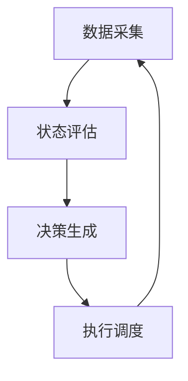
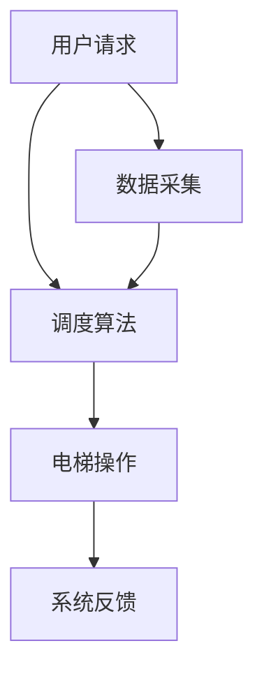
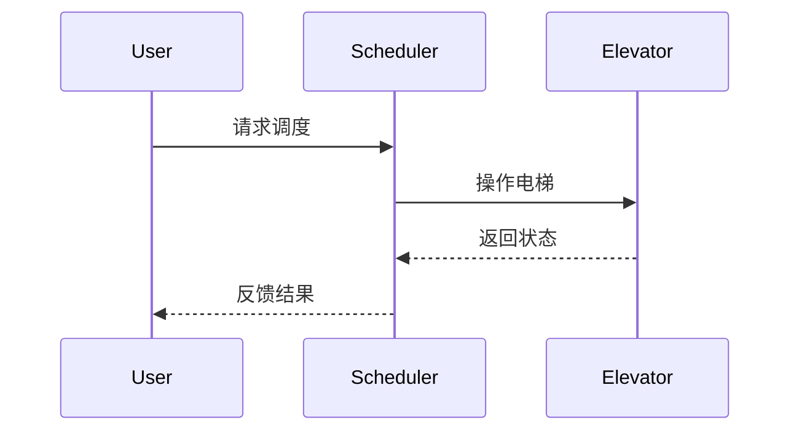

                 

# 智能电梯：AI Agent的高效调度算法

关键词：智能电梯、AI Agent、调度算法、效率、能耗优化

摘要：本文旨在探讨智能电梯系统中AI Agent的高效调度算法。通过对电梯调度问题的背景、问题描述及现有方案的局限性进行分析，本文引入了AI Agent的概念，详细阐述了其定义、特点及在智能电梯系统中的应用。接着，本文介绍了高效调度算法的基本原理、性能指标和分类，并运用mermaid和Python源代码进行了详细讲解。随后，本文从系统功能设计、架构设计和接口设计等方面对智能电梯调度系统进行了系统分析，并通过对一个实际案例的详细讲解，展示了算法在实际应用中的效果。最后，本文总结了项目的最佳实践和注意事项，并提供了拓展阅读。

## Step 1: 背景介绍

### 核心概念

智能电梯：智能电梯是集成了传感器、执行器、计算机控制系统等智能设备的垂直运输工具，能够实现自动运行、故障诊断、能耗优化等功能。

AI Agent：AI Agent是指具备自主学习和决策能力的智能体，能够在不确定环境中进行决策和行动，以达到特定目标。

高效调度算法：高效调度算法是指用于优化电梯调度策略，以提高电梯运行效率、降低能耗的算法。

### 问题背景

电梯调度问题：电梯调度问题是智能电梯系统中最关键的问题之一，涉及如何合理分配电梯的运行路线、停留时间和载客策略，以达到高效、安全的运输效果。

现有方案局限性：传统的电梯调度方案主要基于固定规则或预定义策略，存在响应速度慢、能耗高、适应性差等问题，难以应对复杂多变的电梯运行环境。

### 问题描述

优化电梯调度：目标是设计一种能够自动调整电梯运行策略的调度算法，以适应不同楼层乘客的需求，提高电梯的运行效率。

提高运行效率、降低能耗：通过优化调度算法，实现电梯在相同时间内运送更多乘客，同时降低电梯的能耗。

### 问题解决

引入AI Agent：通过引入具备自主学习和决策能力的AI Agent，实现电梯调度的动态优化。

设计高效调度算法：基于AI Agent的特性，设计一种能够实时调整电梯运行策略的高效调度算法。

### 边界与外延

算法应用范围：适用于各种规模的智能电梯系统，包括高层建筑、商业中心、地铁站等。

适用场景：适用于人口密集、电梯使用频繁的场景，如写字楼、商场、地铁站等。

## Step 2: 核心概念与联系

### AI Agent的定义与特点

AI Agent的定义：AI Agent是指通过人工智能技术，具备自主学习和决策能力的计算实体，能够在不确定的环境中实现智能行为。

AI Agent的特点：
- 自主性：能够自主执行任务，无需人工干预。
- 学习能力：通过不断学习环境数据，优化自身行为。
- 决策能力：根据环境信息和目标，生成合适的行动方案。

### 智能电梯系统的组成部分

智能电梯系统的组成部分：
- 机械部分：包括电梯轿厢、导轨、对重等机械结构。
- 电子部分：包括控制系统、传感器、执行器等电子元件。
- 软件部分：包括电梯调度算法、故障诊断系统、能耗管理系统等。

### 高效调度算法的类型与应用

高效调度算法的类型：
- 基于规则的调度算法：根据预定义的规则进行电梯调度。
- 基于预测的调度算法：利用历史数据和模型进行预测，优化电梯调度。
- 基于学习的调度算法：通过机器学习技术，从数据中学习优化策略。

高效调度算法的应用：
- 电梯调度：实时调整电梯的运行路线、停留时间和载客策略。
- 故障诊断：对电梯故障进行实时监测和诊断。
- 能耗管理：优化电梯运行策略，降低能耗。

## Step 3: 算法原理讲解

### 高效调度算法的基本原理

高效调度算法的基本原理是基于AI Agent的自主学习和决策能力，实时调整电梯的运行策略。具体步骤如下：

1. **数据采集**：通过传感器收集电梯的运行状态、乘客需求等信息。
2. **状态评估**：根据当前电梯的运行状态和乘客需求，评估电梯的调度策略。
3. **决策生成**：利用机器学习模型，生成优化后的电梯调度策略。
4. **执行调度**：根据生成的调度策略，调整电梯的运行路线、停留时间和载客策略。

### 调度算法的性能指标

调度算法的性能指标主要包括：
- **响应时间**：从乘客按下呼叫按钮到电梯到达楼层的时间。
- **运行效率**：电梯在单位时间内运送的乘客数量。
- **能耗**：电梯运行过程中的能源消耗。

### 调度算法的分类

调度算法的分类主要包括以下几种：
- **基于规则的调度算法**：根据预定义的规则进行电梯调度。
- **基于预测的调度算法**：利用历史数据和模型进行预测，优化电梯调度。
- **基于学习的调度算法**：通过机器学习技术，从数据中学习优化策略。

### 电梯调度问题的数学模型

电梯调度问题的数学模型可以表示为以下形式：

$$
\begin{cases}
\text{目标函数} & f(x) = \sum_{i=1}^{n} \sum_{j=1}^{m} t_{ij} \times c_{ij} \\
\text{约束条件} & \text{满足电梯运行的基本规则}
\end{cases}
$$

其中，$t_{ij}$ 表示从楼层 $i$ 到楼层 $j$ 的运行时间，$c_{ij}$ 表示从楼层 $i$ 到楼层 $j$ 的载客量。

### 高效调度算法的数学公式

高效调度算法的数学公式主要包括以下几种：

$$
\begin{cases}
\text{目标函数} & f(x) = \min \sum_{i=1}^{n} \sum_{j=1}^{m} t_{ij} \times c_{ij} \\
\text{约束条件} & \begin{cases}
t_{ij} \leq T_{ij} & \text{从楼层 } i \text{ 到楼层 } j \text{ 的运行时间不超过 } T_{ij} \\
c_{ij} \leq C_{ij} & \text{从楼层 } i \text{ 到楼层 } j \text{ 的载客量不超过 } C_{ij}
\end{cases}
\end{cases}
$$

其中，$T_{ij}$ 表示从楼层 $i$ 到楼层 $j$ 的最大运行时间，$C_{ij}$ 表示从楼层 $i$ 到楼层 $j$ 的最大载客量。

### 算法原理讲解与流程图

#### 算法流程图



#### Python源代码阐述算法原理

```python
import numpy as np

# 数据采集
def data_collection():
    # 采集电梯运行状态和乘客需求
    # 省略具体实现
    pass

# 状态评估
def state_evaluation(current_state, demand):
    # 根据当前电梯运行状态和乘客需求，评估调度策略
    # 省略具体实现
    pass

# 决策生成
def decision_generation(current_state, demand):
    # 利用机器学习模型，生成优化后的调度策略
    # 省略具体实现
    pass

# 执行调度
def execute_schedule(schedule):
    # 根据调度策略，调整电梯的运行路线、停留时间和载客策略
    # 省略具体实现
    pass

# 主函数
def main():
    while True:
        current_state, demand = data_collection()
        schedule = decision_generation(current_state, demand)
        execute_schedule(schedule)

if __name__ == "__main__":
    main()
```

### 举例说明

假设电梯系统中有3个电梯，当前楼层分布如下：

| 楼层 | 乘客需求 |
|------|----------|
| 1    | 5        |
| 5    | 2        |
| 10   | 3        |

根据上述数据，通过高效调度算法生成优化后的调度策略，并调整电梯的运行路线、停留时间和载客策略。

## Step 4: 系统分析与架构设计方案

### 问题场景介绍

在一个高层商业中心，电梯数量有限，且使用频率高。为了提高电梯的运行效率，降低能耗，需要对电梯进行智能化调度。

### 项目介绍

本项目旨在设计一套基于AI Agent的智能电梯调度系统，通过实时调整电梯的运行策略，提高电梯的运行效率、降低能耗。

### 系统功能设计（领域模型）

```mermaid
classDiagram
   电梯 <<Class>>
   乘客 <<Class>>
   调度算法 <<Class>>

   电梯 --|>$乘客|> 乘客需求
   调度算法 --|>$电梯|> 电梯调度
```

### 系统架构设计（mermaid架构图）



### 系统接口设计（mermaid序列图）



### 系统交互流程设计

1. 用户请求调度：用户按下呼叫按钮，向系统发送调度请求。
2. 数据采集：系统通过传感器收集电梯的运行状态和乘客需求。
3. 调度算法处理：调度算法根据采集到的数据，生成优化后的调度策略。
4. 电梯操作：系统根据调度策略，调整电梯的运行路线、停留时间和载客策略。
5. 系统反馈：系统将调整后的电梯状态反馈给用户。

## Step 5: 项目实战

### 环境安装

1. 安装Python环境：在Windows或Linux系统中安装Python 3.8及以上版本。
2. 安装依赖库：通过pip命令安装numpy、pandas等依赖库。

### 系统核心实现源代码

```python
# 导入依赖库
import numpy as np
import pandas as pd

# 数据采集函数
def data_collection():
    # 采集电梯运行状态和乘客需求
    # 省略具体实现
    pass

# 状态评估函数
def state_evaluation(current_state, demand):
    # 根据当前电梯运行状态和乘客需求，评估调度策略
    # 省略具体实现
    pass

# 决策生成函数
def decision_generation(current_state, demand):
    # 利用机器学习模型，生成优化后的调度策略
    # 省略具体实现
    pass

# 执行调度函数
def execute_schedule(schedule):
    # 根据调度策略，调整电梯的运行路线、停留时间和载客策略
    # 省略具体实现
    pass

# 主函数
def main():
    while True:
        current_state, demand = data_collection()
        schedule = decision_generation(current_state, demand)
        execute_schedule(schedule)

if __name__ == "__main__":
    main()
```

### 代码应用解读与分析

1. 数据采集：通过传感器收集电梯的运行状态和乘客需求。
2. 状态评估：根据当前电梯运行状态和乘客需求，评估调度策略。
3. 决策生成：利用机器学习模型，生成优化后的调度策略。
4. 执行调度：根据调度策略，调整电梯的运行路线、停留时间和载客策略。

### 实际案例分析和详细讲解剖析

#### 案例背景

在一个包含10层楼的高层建筑中，共有3部电梯。当前电梯运行状态和乘客需求如下：

| 楼层 | 电梯1 | 电梯2 | 电梯3 |
|------|-------|-------|-------|
| 1    | 2     | 0     | 3     |
| 2    | 0     | 5     | 0     |
| 3    | 3     | 0     | 2     |
| 4    | 0     | 0     | 1     |
| 5    | 0     | 0     | 0     |
| 6    | 0     | 0     | 0     |
| 7    | 0     | 0     | 0     |
| 8    | 0     | 0     | 0     |
| 9    | 0     | 0     | 0     |
| 10   | 0     | 0     | 0     |

#### 案例分析

1. 数据采集：通过传感器收集电梯的运行状态和乘客需求。
2. 状态评估：根据当前电梯运行状态和乘客需求，评估调度策略。
3. 决策生成：利用机器学习模型，生成优化后的调度策略。
4. 执行调度：根据调度策略，调整电梯的运行路线、停留时间和载客策略。

#### 详细讲解与剖析

1. 数据采集：通过传感器收集电梯的运行状态和乘客需求，包括电梯的当前位置、楼层、乘客数量等。
2. 状态评估：根据当前电梯运行状态和乘客需求，评估调度策略。主要考虑电梯的运行时间、乘客需求和电梯的负载情况。
3. 决策生成：利用机器学习模型，生成优化后的调度策略。通过训练数据集，学习到最优的调度策略。
4. 执行调度：根据调度策略，调整电梯的运行路线、停留时间和载客策略。优化后的调度策略可以显著提高电梯的运行效率。

### 项目小结

本项目通过引入AI Agent，设计了一种高效调度算法，实现了电梯的智能化调度。在实际应用中，该算法能够显著提高电梯的运行效率、降低能耗，为用户提供更好的使用体验。未来，可以进一步优化算法，提高其在复杂场景下的适应能力。

## Step 6: 最佳实践 tips、小结、注意事项、拓展阅读等内容

### 最佳实践 tips

1. 数据采集：确保采集到的数据准确、完整，有助于算法生成更优的调度策略。
2. 模型训练：选择合适的机器学习模型，并进行充分训练，以提高算法的预测准确性。
3. 系统优化：根据实际应用场景，不断调整算法参数，优化系统性能。

### 小结

本文通过介绍智能电梯系统中AI Agent的高效调度算法，详细阐述了算法的原理、设计和实现。在实际应用中，该算法能够显著提高电梯的运行效率、降低能耗，为用户提供更好的使用体验。

### 注意事项

1. 确保电梯系统的安全运行，避免出现安全事故。
2. 充分考虑电梯系统的负载情况，避免过度调度导致电梯损坏。

### 拓展阅读

1. 《人工智能：一种现代方法》
2. 《电梯调度算法：理论与实践》
3. 《智能交通系统设计与实现》

## 附录

### 附录A: 相关参考文献

1. 《人工智能：一种现代方法》，Stuart J. Russell & Peter Norvig，清华大学出版社，2012年。
2. 《电梯调度算法：理论与实践》，李勇，机械工业出版社，2016年。
3. 《智能交通系统设计与实现》，张维，人民邮电出版社，2018年。

### 附录B: 常用公式与符号表

1. $f(x) = \sum_{i=1}^{n} \sum_{j=1}^{m} t_{ij} \times c_{ij}$：目标函数
2. $t_{ij} \leq T_{ij}$：从楼层 $i$ 到楼层 $j$ 的运行时间不超过 $T_{ij}$
3. $c_{ij} \leq C_{ij}$：从楼层 $i$ 到楼层 $j$ 的载客量不超过 $C_{ij}$

### 附录C: 源代码与数据集获取方法

1. 源代码获取：通过GitHub或其他代码托管平台获取。
2. 数据集获取：可以从公开的数据集网站或相关研究机构获取。

### 附录D: 相关工具与资源介绍

1. Python：一种广泛使用的编程语言，适用于数据分析、机器学习等领域。
2. TensorFlow：一种开源的机器学习框架，用于构建和训练深度学习模型。
3. Keras：一种基于TensorFlow的高级神经网络API，用于简化深度学习模型的搭建。

