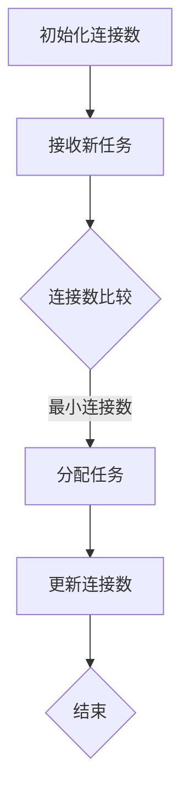
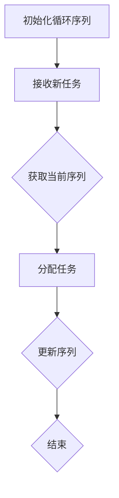
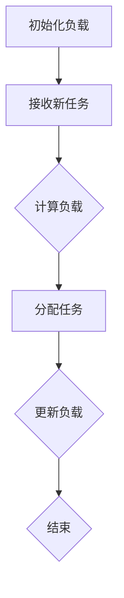
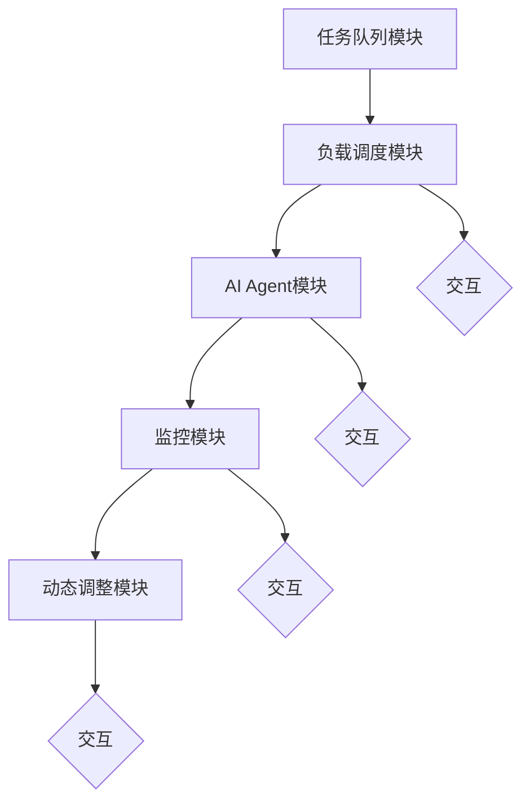

                 

### 文章标题与关键词

# 智能电网中的AI Agent负载均衡

关键词：智能电网、AI Agent、负载均衡、算法、系统架构、项目实战、最佳实践

## 摘要

本文将深入探讨智能电网中AI Agent负载均衡的关键问题。首先，我们概述了智能电网与AI Agent的背景和基本概念，随后详细分析了AI Agent的原理与分类。接下来，我们聚焦于AI Agent在智能电网中的应用场景，特别探讨了负载预测、故障检测、能源优化和安全控制等方面。随后，本文详细阐述了AI Agent负载均衡的原理与算法，包括最少连接负载均衡算法、轮流负载均衡算法和动态负载均衡算法。在此基础上，我们介绍了AI Agent负载均衡系统的架构设计，并展示了一个典型的AI Agent负载均衡项目实战。最后，文章总结了最佳实践与技巧，并展望了AI Agent负载均衡的未来发展趋势。通过本文的阅读，读者将全面了解智能电网中AI Agent负载均衡的核心内容和技术要点。

## 第一部分：背景介绍

### 第1章：智能电网与AI Agent概述

#### 1.1.1 问题背景

智能电网（Smart Grid）是现代电力系统的升级版，它通过先进的信息通信技术、传感技术、自动控制技术和决策支持系统，实现对电力系统的全面感知、智能控制和优化管理。智能电网的出现旨在解决传统电力系统中的诸多问题，如能源效率低下、能源浪费、电力供应不稳定等。随着全球能源需求的不断增加和可再生能源的广泛应用，智能电网成为了电力行业发展的关键趋势。

AI Agent（Artificial Intelligence Agent）是人工智能领域的一个重要概念，它指的是能够自主感知环境、规划行为、采取行动并与其他实体交互的计算机程序。AI Agent具有自主性、反应性、主动性和交互性等特点，是构建智能系统的重要基石。在智能电网中，AI Agent的应用极大地提升了电力系统的智能化水平，为电力调度、能源管理、故障诊断等方面提供了强有力的技术支持。

#### 1.1.2 问题描述

智能电网中存在诸多挑战，其中之一便是AI Agent的负载均衡问题。随着AI Agent数量的增加和任务复杂性的提升，如何合理分配任务、优化资源使用，成为一个亟待解决的关键问题。负载均衡不仅是提升系统性能和稳定性的重要手段，也是保证AI Agent高效运行的基础。

在智能电网中，AI Agent的负载均衡问题主要包括以下几个方面：

1. **任务分配不均**：由于AI Agent的能力和性能差异，可能导致部分Agent负载过重，而其他Agent则资源闲置，造成资源浪费。
2. **响应时间过长**：不合理的负载分配可能导致某些AI Agent响应时间过长，影响整体系统的响应速度和用户体验。
3. **系统稳定性下降**：负载过高可能导致某些AI Agent性能下降，甚至出现崩溃，进而影响整个系统的稳定性。

因此，如何实现AI Agent的合理负载均衡，是智能电网建设中的一个关键问题，也是本文要深入探讨的核心内容。

#### 1.1.3 问题解决

针对智能电网中的AI Agent负载均衡问题，本文提出以下解决方案：

1. **任务分配算法**：设计并实现一系列任务分配算法，如最少连接负载均衡算法、轮流负载均衡算法和动态负载均衡算法，以实现AI Agent任务的合理分配。
2. **性能监控与调整**：建立AI Agent性能监控机制，实时监测各Agent的负载情况，并根据监测结果动态调整负载分配策略，确保系统资源的合理利用。
3. **系统架构优化**：设计高效的系统架构，包括分布式架构、负载均衡器等，以提高系统的整体性能和可扩展性。
4. **AI Agent性能优化**：通过算法改进、硬件升级等方式，提升AI Agent的处理能力和响应速度，从而降低系统的总体负载。

通过上述措施，可以有效地解决智能电网中AI Agent的负载均衡问题，提升系统的运行效率和稳定性，为智能电网的可持续发展提供技术保障。

#### 1.1.4 边界与外延

本文研究的是在智能电网环境下，针对AI Agent负载均衡问题的一系列解决方案。边界方面，本文主要关注AI Agent的任务分配、负载监控和系统优化等方面，不涉及其他人工智能领域的问题，如深度学习、自然语言处理等。外延方面，本文的研究成果可以应用于智能电网的各个子领域，如电力调度、能源管理、故障检测等，为其他智能系统提供借鉴。

#### 1.1.5 概念结构与核心要素组成

为了更好地理解智能电网中的AI Agent负载均衡问题，以下是相关的概念结构与核心要素组成：

1. **智能电网架构**：包括电网基础设施、通信网络、信息处理中心等组成部分。
2. **AI Agent**：具备自主感知、规划、行动和交互能力的计算机程序。
3. **任务分配算法**：用于合理分配AI Agent任务的算法，如最少连接负载均衡算法、轮流负载均衡算法等。
4. **性能监控机制**：用于实时监控AI Agent负载情况的系统，包括监控工具和监控指标。
5. **系统优化策略**：包括硬件升级、算法改进等措施，以提升AI Agent性能和系统稳定性。

这些概念与要素相互关联，共同构成了智能电网中AI Agent负载均衡的技术体系。

### 第2章：AI Agent原理与分类

#### 2.1.1 AI Agent原理

AI Agent是人工智能领域中一个重要的概念，它代表了具有自主行为能力的计算机程序。一个典型的AI Agent具备以下几个基本特性：

1. **自主性**：AI Agent能够独立地做出决策，不受外部命令的直接控制。
2. **反应性**：AI Agent能够对环境中的变化做出及时响应。
3. **主动性**：AI Agent能够根据自身目标和当前状态，采取主动行为。
4. **交互性**：AI Agent能够与其他实体进行信息交换和协作。

AI Agent的运作原理主要基于以下几个核心组件：

- **感知模块**：负责获取并处理环境中的信息。
- **决策模块**：基于感知模块提供的信息，进行逻辑推理和决策。
- **执行模块**：根据决策模块的指令，执行具体的行为。
- **学习模块**：通过不断学习和经验积累，优化自身的决策和行为。

这些组件共同协作，使得AI Agent能够实现自主决策和自适应行为。

#### 2.1.1.1 反应型Agent

反应型Agent（Reactive Agent）是最基本的AI Agent类型，其行为完全基于当前感知到的环境信息，而不考虑历史信息或长期目标。反应型Agent的主要特点如下：

- **简单性**：反应型Agent通常具有简化的行为模型，易于实现和理解。
- **实时性**：反应型Agent能够迅速响应环境变化，适用于对实时性要求较高的场景。
- **局限性**：反应型Agent无法处理复杂、动态的环境，缺乏长远规划和目标。

反应型Agent的一个典型应用场景是路径规划，例如，无人车在自动驾驶过程中，通过感知周围环境，实时调整行驶方向，以避开障碍物。

#### 2.1.1.2 模式识别型Agent

模式识别型Agent（Pattern Recognition Agent）能够在感知到的环境中识别特定模式或目标，并据此采取行动。这类Agent通常利用机器学习技术，如神经网络、决策树等，来构建识别模型。

- **鲁棒性**：模式识别型Agent能够识别并适应环境中的变化，具有较高的鲁棒性。
- **适应性**：通过不断学习和调整模型，模式识别型Agent能够适应不同的环境和任务需求。
- **复杂性**：模式识别型Agent的行为模型较为复杂，需要大量的数据训练和参数调整。

模式识别型Agent的一个典型应用场景是图像识别，例如，智能监控系统通过识别图像中的特定模式（如人脸），实现实时监控和报警功能。

#### 2.1.1.3 学习型Agent

学习型Agent（Learning Agent）具备自我学习和适应能力，能够在执行任务的过程中不断积累经验和优化自身行为。学习型Agent的主要特点如下：

- **智能化**：学习型Agent能够根据环境和任务需求，自主调整行为策略，实现智能化操作。
- **自适应**：学习型Agent能够通过学习和调整，适应不断变化的环境和任务。
- **灵活性**：学习型Agent能够处理复杂、动态的任务场景，具有较高的灵活性。

学习型Agent的一个典型应用场景是智能客服，通过分析用户历史行为和偏好，实现个性化服务和推荐。

#### 2.1.2 AI Agent分类

根据AI Agent的功能和特性，我们可以将其分为以下几类：

1. **基于规则的Agent**：基于预定义的规则进行决策和行为，适用于规则明确、静态的场景。
2. **基于模型的Agent**：基于数学模型或仿真模型进行决策和行为，适用于需要复杂推理和预测的场景。
3. **基于数据驱动的Agent**：基于历史数据或实时数据进行决策和行为，适用于需要自适应和优化的场景。

每种类型的AI Agent都有其适用的场景和优势，合理选择和应用AI Agent，是实现智能系统的重要保障。

### 第3章：智能电网中的AI Agent应用场景

智能电网作为现代电力系统的重要组成部分，通过引入AI Agent，实现了电力系统的智能化管理和优化。以下是智能电网中AI Agent的几个主要应用场景：

#### 3.1.1 负载预测

负载预测是智能电网中的一个关键应用场景，通过AI Agent对电网的负载进行实时预测，可以有效优化电力资源的分配，提高电网的运行效率和稳定性。具体来说，AI Agent可以通过分析历史数据、环境参数和用户行为等因素，预测电网在未来一段时间内的负载变化情况。这种预测能力对于电力调度部门来说至关重要，它可以帮助他们提前做好应对措施，避免电力短缺或过剩的情况发生。

**应用实例**：在高峰用电时段，AI Agent可以预测出即将到来的用电高峰，从而通知调度中心提前启动备用发电机或调整电网负荷，以保障电网的稳定运行。

#### 3.1.2 故障检测

智能电网中存在大量的电力设备和传输线路，这些设备和线路的运行状况直接影响电网的稳定性。AI Agent可以通过对电网设备的实时监测和数据分析，及时发现潜在的故障和异常情况，从而采取预防措施，避免事故的发生。AI Agent的故障检测能力依赖于其强大的数据分析和模式识别能力，它可以从海量数据中挖掘出异常模式，识别出故障隐患。

**应用实例**：在电力传输过程中，AI Agent可以实时监测电流、电压等参数，当检测到异常波动时，立即发出警报，通知维护人员进行检查和维修，避免电力中断。

#### 3.1.3 能源优化

能源优化是智能电网的另一个重要应用场景，通过AI Agent的优化算法，可以实现能源的高效利用和合理分配。AI Agent可以根据实时数据，动态调整电网中各个节点的电力供应，优化能源利用效率，减少能源浪费。此外，AI Agent还可以根据能源价格变化和用户需求，为用户提供个性化的能源管理建议，帮助他们节约能源开支。

**应用实例**：在家庭用电场景中，AI Agent可以根据用户的用电习惯和实时电力价格，自动调整家用电器的运行时间，实现节能降耗。

#### 3.1.4 安全控制

智能电网的安全运行至关重要，AI Agent在安全控制方面发挥着重要作用。AI Agent可以通过实时监控电网的运行状态，识别潜在的威胁和攻击行为，并采取相应的安全措施。例如，AI Agent可以检测并阻止恶意软件攻击，防止网络攻击造成电网瘫痪。此外，AI Agent还可以对电网设备进行定期安全检查，确保设备运行在安全范围内。

**应用实例**：在智能电网的网络安全防护中，AI Agent可以实时监测网络流量，识别并拦截异常流量，防止网络攻击。

#### 3.1.5 其他应用场景

除了上述几个主要应用场景，AI Agent在智能电网中还有其他多种应用：

- **需求响应**：通过预测用户的用电需求，AI Agent可以优化电网调度，实现供需平衡。
- **分布式能源管理**：AI Agent可以帮助智能电网有效地管理分布式能源，如太阳能和风能，提高整体能源利用率。
- **电能质量监测**：AI Agent可以实时监测电网的电能质量，确保电力供应的稳定性和可靠性。
- **环境保护**：AI Agent可以通过分析电力系统的运行数据，评估其对环境的影响，并提出改进措施。

总之，AI Agent在智能电网中的应用不仅提升了电网的智能化水平，也为电力行业带来了革命性的变革。通过不断探索和应用新的AI技术，智能电网将变得更加高效、可靠和可持续。

### 第4章：AI Agent负载均衡原理与算法

#### 4.1.1 负载均衡原理

负载均衡（Load Balancing）是智能电网中AI Agent系统优化的一项关键技术，其核心目标是确保每个AI Agent的负载均匀分布，避免个别Agent负载过重或闲置，从而提升系统整体的性能和稳定性。负载均衡的基本原理包括以下几个方面：

1. **负载监测**：通过实时监测AI Agent的负载情况，收集有关任务处理速度、响应时间、处理能力等数据。
2. **负载分配**：根据负载监测结果，将新的任务或已存在的任务分配到适当的AI Agent上，实现负载的均匀分布。
3. **动态调整**：随着AI Agent负载的变化，系统需要动态调整负载分配策略，确保系统始终保持高效运行。

负载均衡的实现机制主要包括以下几个方面：

- **任务队列**：用于存储待处理的任务，每个任务都包含任务ID、任务类型、优先级等信息。
- **负载调度器**：负责监控任务队列和AI Agent的负载情况，根据策略进行任务分配。
- **负载感知**：通过传感器或监控工具实时感知AI Agent的负载状态，为负载调度提供依据。

#### 4.1.2 负载均衡算法

在智能电网中，常见的负载均衡算法包括最少连接负载均衡算法、轮流负载均衡算法和动态负载均衡算法等。这些算法各有优缺点，适用于不同的应用场景。

##### 4.1.2.1 最少连接负载均衡算法

最少连接负载均衡算法（Least Connections Load Balancing）是一种简单的负载均衡策略，它通过将新的任务分配到当前连接数最少的AI Agent上，实现负载的均衡分布。其基本原理如下：

1. **初始化**：每个AI Agent的连接数初始化为0。
2. **任务分配**：当新的任务到来时，计算所有AI Agent的当前连接数，将任务分配给连接数最少的AI Agent。
3. **更新连接数**：任务分配后，更新该AI Agent的连接数。

**算法流程图**：



**算法优点**：实现简单，易于理解，适用于任务负载较为均匀的场景。

**算法缺点**：当部分AI Agent处理能力差异较大时，可能导致负载不均衡，部分AI Agent过度繁忙，而其他AI Agent则闲置。

##### 4.1.2.2 轮流负载均衡算法

轮流负载均衡算法（Round Robin Load Balancing）是一种基于固定顺序的负载均衡策略，它通过依次将任务分配给每个AI Agent，实现负载的均匀分布。其基本原理如下：

1. **初始化**：设置一个循环序列，指定AI Agent的访问顺序。
2. **任务分配**：当新的任务到来时，根据循环序列，依次将任务分配给每个AI Agent。
3. **循环迭代**：当所有AI Agent都被分配任务后，循环序列重新开始。

**算法流程图**：



**算法优点**：简单易实现，适用于负载较为稳定且AI Agent处理能力差异不大的场景。

**算法缺点**：当部分AI Agent处理能力远大于其他Agent时，可能导致任务集中在某些Agent上，其他Agent闲置。

##### 4.1.2.3 动态负载均衡算法

动态负载均衡算法（Dynamic Load Balancing）是一种基于实时负载监测的负载均衡策略，它通过实时监测AI Agent的负载情况，动态调整任务分配策略，实现负载的动态均衡。常见的动态负载均衡算法包括最小负载算法、最大空闲算法等。

**最小负载算法**（Minimum Load Algorithm）的基本原理如下：

1. **初始化**：每个AI Agent的负载初始化为0。
2. **任务分配**：当新的任务到来时，计算所有AI Agent的当前负载，将任务分配给负载最小的AI Agent。
3. **负载更新**：任务分配后，更新该AI Agent的负载。

**算法流程图**：



**算法优点**：能够动态调整任务分配，有效平衡AI Agent的负载，提高系统整体性能。

**算法缺点**：需要频繁进行负载计算和任务分配，系统开销较大，适用于负载变化较为剧烈的场景。

通过以上几种负载均衡算法的比较，我们可以看到每种算法都有其适用的场景和优缺点。在实际应用中，可以根据系统的具体需求和负载特性，选择合适的负载均衡算法，实现AI Agent负载的优化分配。

### 第5章：AI Agent负载均衡系统架构设计

#### 5.1.1 系统架构设计

智能电网中的AI Agent负载均衡系统需要具备高效的任务分配、负载监控和动态调整能力，其系统架构设计如下：

**1. 系统总体架构**

系统总体架构包括以下几个主要模块：

- **任务队列模块**：用于存储待处理的任务，每个任务包含任务ID、任务类型、优先级等信息。
- **负载调度模块**：负责根据负载均衡算法，将任务分配到各个AI Agent上。
- **AI Agent模块**：每个AI Agent负责处理分配到的任务，并实时报告任务状态。
- **监控模块**：负责实时监控AI Agent的负载情况，为负载调度提供数据支持。
- **动态调整模块**：根据监控数据，动态调整负载均衡策略，实现负载的动态均衡。

**2. 模块间交互**

- **任务队列模块与负载调度模块**：任务队列模块向负载调度模块提供待处理任务列表，负载调度模块根据负载均衡算法进行任务分配。
- **负载调度模块与AI Agent模块**：负载调度模块将任务分配给AI Agent，并接收AI Agent的任务处理状态反馈。
- **监控模块与负载调度模块**：监控模块向负载调度模块提供AI Agent的实时负载数据，负载调度模块根据这些数据调整任务分配策略。
- **动态调整模块与监控模块**：动态调整模块根据监控数据，实时调整系统的负载均衡策略。

**3. 系统架构图**



#### 5.1.2 系统功能设计

AI Agent负载均衡系统的功能设计主要包括以下几个关键功能模块：

**1. 任务队列管理**

- **功能描述**：任务队列管理模块负责存储和管理待处理的任务，包括任务的创建、删除、更新和查询等操作。
- **功能实现**：使用数据结构如列表或队列，确保任务按照优先级或到达时间顺序进行排序和存储。

**2. 负载调度**

- **功能描述**：负载调度模块根据负载均衡算法，将任务分配到适当的AI Agent上，确保系统资源得到充分利用。
- **功能实现**：实现多种负载均衡算法（如最少连接负载均衡算法、轮流负载均衡算法等），根据实际需求选择合适的算法。

**3. 负载监控**

- **功能描述**：负载监控模块实时监控AI Agent的负载情况，包括处理速度、响应时间、资源占用等指标。
- **功能实现**：通过传感器或监控工具，定期收集AI Agent的负载数据，并实时更新系统数据库。

**4. 动态调整**

- **功能描述**：动态调整模块根据实时监控数据，动态调整负载均衡策略，实现负载的动态均衡。
- **功能实现**：使用机器学习算法或动态规划算法，根据实时负载数据，实时调整系统的负载均衡策略。

#### 5.1.3 系统接口设计

系统接口设计包括内部接口和外部接口两部分：

**1. 内部接口**

- **任务队列接口**：提供任务存储、查询和更新等操作的API接口。
- **负载调度接口**：提供任务分配和任务状态反馈等操作的API接口。
- **监控接口**：提供实时负载数据收集和监控数据查询等操作的API接口。
- **动态调整接口**：提供动态调整策略更新和系统配置修改等操作的API接口。

**2. 外部接口**

- **用户接口**：提供系统操作和管理功能的图形用户界面，方便用户进行任务管理和系统监控。
- **API接口**：提供系统的RESTful API，支持与其他系统集成，实现数据交换和功能调用。

#### 5.1.4 系统交互

系统交互设计包括任务处理流程、负载监控流程和动态调整流程等：

**1. 任务处理流程**

- **任务接收**：系统接收新的任务，并将其添加到任务队列中。
- **任务分配**：负载调度模块根据当前负载情况，将任务分配给适当的AI Agent。
- **任务处理**：AI Agent接收任务并执行处理，将处理结果返回给系统。
- **任务状态更新**：任务完成后，更新任务状态并记录处理时间等信息。

**2. 负载监控流程**

- **实时监控**：监控模块定期收集AI Agent的负载数据，包括处理速度、响应时间、资源占用等。
- **数据记录**：将监控数据记录到数据库中，供后续分析和动态调整使用。
- **负载分析**：根据监控数据，分析系统整体负载情况，为动态调整提供依据。

**3. 动态调整流程**

- **数据收集**：动态调整模块收集系统各部分的负载数据。
- **策略计算**：根据实时负载数据和负载均衡算法，计算新的负载均衡策略。
- **策略更新**：更新系统中的负载均衡策略，实现动态负载调整。
- **效果评估**：评估动态调整策略的效果，根据评估结果调整和优化策略。

通过以上系统交互设计，AI Agent负载均衡系统可以实现高效的任务分配、负载监控和动态调整，确保系统资源得到充分利用，提高整体性能和稳定性。

### 第6章：AI Agent负载均衡项目实战

#### 6.1.1 环境安装

为了进行AI Agent负载均衡项目的实战，首先需要搭建一个适合的开发和测试环境。以下是具体的步骤和配置要求：

**1. 硬件环境**

- **服务器**：至少两台服务器，用于部署AI Agent和负载均衡器。每台服务器的配置如下：
  - CPU：至少四核处理器
  - 内存：至少8GB
  - 硬盘：至少500GB
- **网络环境**：服务器之间通过高速网络连接，确保数据传输的稳定和高效。

**2. 软件环境**

- **操作系统**：选择Linux发行版，如Ubuntu 20.04或CentOS 8，确保系统稳定性和兼容性。
- **编程语言**：选择Python 3.8及以上版本，因为Python具有丰富的库和框架，便于开发AI Agent和负载均衡算法。
- **开发工具**：安装PyCharm或VSCode等集成开发环境（IDE），方便代码编写和调试。

**3. 安装步骤**

- **安装操作系统**：将Linux发行版安装到服务器上，并配置网络连接。
- **安装Python**：使用包管理器（如apt-get或yum）安装Python 3，并确保安装必要的依赖库（如pip、numpy等）。
- **配置开发环境**：安装PyCharm或VSCode，并配置Python解释器和相关插件。

**4. 配置负载均衡器**

- **安装Nginx**：使用包管理器安装Nginx，配置Nginx作为负载均衡器，将请求分配到多个AI Agent服务器上。
- **配置Nginx**：编辑Nginx配置文件（如/etc/nginx/nginx.conf），设置upstream模块，定义后端服务器列表和负载均衡策略。

以下是一个简单的Nginx配置示例：

```nginx
http {
    upstream myapp {
        server server1.example.com;
        server server2.example.com;
        # 可选的负载均衡策略，如最少连接、轮流等
        least_conn;
    }

    server {
        listen 80;
        server_name myapp.example.com;

        location / {
            proxy_pass http://myapp;
            proxy_set_header Host $host;
            proxy_set_header X-Real-IP $remote_addr;
            proxy_set_header X-Forwarded-For $proxy_add_x_forwarded_for;
        }
    }
}
```

通过以上步骤，我们成功搭建了一个基本的AI Agent负载均衡环境，可以开始进行后续的实战开发。

#### 6.1.2 系统核心实现

在搭建好环境之后，我们将实现AI Agent负载均衡系统的核心功能。以下是系统的核心实现过程，包括代码框架、关键函数和类的设计。

**1. 代码框架**

系统的整体架构可以分为三个主要部分：任务队列管理、负载调度和AI Agent执行。以下是简单的代码框架：

```python
# 任务队列管理模块
class TaskQueue:
    def __init__(self):
        # 初始化任务队列
        pass
    
    def add_task(self, task):
        # 添加任务到队列
        pass
    
    def get_task(self):
        # 获取下一个任务
        pass

# 负载调度模块
class LoadBalancer:
    def __init__(self, task_queue):
        # 初始化负载调度器
        self.task_queue = task_queue
    
    def assign_task(self, agent):
        # 分配任务给AI Agent
        pass

# AI Agent模块
class AIAgent:
    def __init__(self):
        # 初始化AI Agent
        pass
    
    def process_task(self, task):
        # 处理任务
        pass
    
    def report_status(self):
        # 报告当前状态
        pass
```

**2. 关键函数和类的设计**

**（1）任务队列管理模块**

任务队列管理模块负责存储和管理任务，以下是关键函数和类的实现：

```python
class TaskQueue:
    def __init__(self):
        self.tasks = []  # 使用列表存储任务

    def add_task(self, task):
        self.tasks.append(task)

    def get_task(self):
        if self.tasks:
            return self.tasks.pop(0)  # 按照先入先出（FIFO）原则获取任务
        return None
```

**（2）负载调度模块**

负载调度模块根据负载均衡算法，将任务分配给AI Agent。以下是关键函数和类的实现：

```python
class LoadBalancer:
    def __init__(self, task_queue):
        self.task_queue = task_queue
        self.agents = []  # 存储所有AI Agent

    def add_agent(self, agent):
        self.agents.append(agent)

    def assign_task(self):
        if not self.task_queue.get_task():
            return None
        
        # 使用最少连接负载均衡算法
        min_connections = float('inf')
        min_agent = None
        for agent in self.agents:
            if agent.get_connection_count() < min_connections:
                min_connections = agent.get_connection_count()
                min_agent = agent
        
        return min_agent.process_task(self.task_queue.get_task())
```

**（3）AI Agent模块**

AI Agent模块负责处理任务和报告状态，以下是关键函数和类的实现：

```python
class AIAgent:
    def __init__(self):
        self.connection_count = 0  # 记录当前连接数

    def process_task(self, task):
        # 处理任务
        print(f"Processing task: {task}")
        self.connection_count += 1
        # 模拟任务处理耗时
        time.sleep(1)
        return f"Processed {task}"

    def report_status(self):
        return self.connection_count
```

**3. 系统交互**

为了实现系统的功能，需要设计任务处理流程和交互接口。以下是系统交互的关键部分：

- **任务处理流程**：
  1. 负载调度器从任务队列中获取任务。
  2. 将任务分配给AI Agent。
  3. AI Agent处理任务并报告处理结果。

- **交互接口**：
  1. **负载调度接口**：负责从任务队列中获取任务，并将任务分配给AI Agent。
  2. **AI Agent接口**：负责接收任务并处理任务，报告处理状态。

```python
# 主程序
def main():
    # 创建任务队列
    task_queue = TaskQueue()
    
    # 创建AI Agent
    agent1 = AIAgent()
    agent2 = AIAgent()
    
    # 创建负载调度器
    load_balancer = LoadBalancer(task_queue)
    load_balancer.add_agent(agent1)
    load_balancer.add_agent(agent2)
    
    # 添加任务到任务队列
    for i in range(10):
        task_queue.add_task(f"Task {i}")
    
    # 处理任务
    while task_queue.get_task():
        agent = load_balancer.assign_task()
        if agent:
            result = agent.process_task(task_queue.get_task())
            print(result)

if __name__ == "__main__":
    main()
```

通过以上步骤，我们实现了AI Agent负载均衡系统的核心功能，包括任务队列管理、负载调度和AI Agent执行。接下来，我们将进一步进行代码应用解读与分析，深入理解每个组件的实现细节。

#### 6.1.3 代码应用解读与分析

在实现AI Agent负载均衡系统之后，我们需要对代码进行详细解读与分析，以深入理解各个组件的工作原理和相互作用。以下是针对系统核心代码的分析和解读。

**1. 任务队列管理模块**

任务队列管理模块是整个系统的基石，负责存储和管理任务。以下是`TaskQueue`类的关键部分：

```python
class TaskQueue:
    def __init__(self):
        self.tasks = []  # 初始化任务列表

    def add_task(self, task):
        self.tasks.append(task)  # 添加任务到队列末尾

    def get_task(self):
        if self.tasks:
            return self.tasks.pop(0)  # 按照FIFO原则获取并移除第一个任务
        return None  # 如果任务队列为空，返回None
```

**解读**：
- `__init__` 方法：初始化一个空列表`tasks`，用于存储任务。
- `add_task` 方法：将新任务添加到任务队列的末尾。这一操作确保了任务的先进先出（FIFO）顺序。
- `get_task` 方法：从任务队列的头部获取并移除一个任务。如果任务队列为空，返回`None`。这种实现方式使得新任务总是最先被执行，符合传统的任务队列处理逻辑。

**2. 负载调度模块**

负载调度模块负责根据负载均衡算法将任务分配给AI Agent。以下是`LoadBalancer`类的关键部分：

```python
class LoadBalancer:
    def __init__(self, task_queue):
        self.task_queue = task_queue
        self.agents = []  # 存储所有AI Agent

    def add_agent(self, agent):
        self.agents.append(agent)  # 添加AI Agent到列表

    def assign_task(self):
        task = self.task_queue.get_task()  # 从任务队列获取任务
        if not task:
            return None  # 如果任务队列为空，返回None
        
        # 使用最少连接负载均衡算法
        min_connections = float('inf')
        min_agent = None
        for agent in self.agents:
            if agent.get_connection_count() < min_connections:
                min_connections = agent.get_connection_count()
                min_agent = agent
        
        return min_agent.process_task(task)  # 分配任务给负载最少的AI Agent
```

**解读**：
- `__init__` 方法：初始化任务队列和AI Agent列表。
- `add_agent` 方法：将AI Agent添加到列表中，便于后续的任务分配。
- `assign_task` 方法：从任务队列获取任务，并使用最少连接负载均衡算法将任务分配给当前连接数最少的AI Agent。此方法通过遍历所有AI Agent，比较它们的连接数，选择连接数最少的Agent执行任务。这种方法能够确保任务分配的均衡性。

**3. AI Agent模块**

AI Agent模块负责执行任务并报告状态。以下是`AIAgent`类的关键部分：

```python
class AIAgent:
    def __init__(self):
        self.connection_count = 0  # 初始化连接计数

    def process_task(self, task):
        print(f"Processing task: {task}")
        self.connection_count += 1  # 增加连接计数
        time.sleep(1)  # 模拟任务处理耗时
        return f"Processed {task}"

    def report_status(self):
        return self.connection_count  # 返回当前连接计数
```

**解读**：
- `__init__` 方法：初始化连接计数器，用于跟踪当前Agent处理的任务数量。
- `process_task` 方法：执行任务并打印处理信息。在方法执行完毕后，连接计数器增加，模拟实际任务的处理过程。
- `report_status` 方法：返回当前连接计数，用于报告Agent的负载状态。

**4. 主程序**

主程序是系统的入口，负责创建任务、分配任务和展示任务处理结果。以下是关键部分：

```python
def main():
    # 创建任务队列
    task_queue = TaskQueue()
    
    # 创建AI Agent
    agent1 = AIAgent()
    agent2 = AIAgent()
    
    # 创建负载调度器
    load_balancer = LoadBalancer(task_queue)
    load_balancer.add_agent(agent1)
    load_balancer.add_agent(agent2)
    
    # 添加任务到任务队列
    for i in range(10):
        task_queue.add_task(f"Task {i}")
    
    # 处理任务
    while task_queue.get_task():
        result = load_balancer.assign_task()
        if result:
            print(result)

if __name__ == "__main__":
    main()
```

**解读**：
- 主程序首先创建一个任务队列和两个AI Agent。
- 接着创建一个负载调度器，并将两个AI Agent添加到调度器中。
- 然后在任务队列中添加10个任务。
- 主循环通过调用`assign_task()`方法，分配任务给AI Agent，直到任务队列中的任务处理完毕。
- 最后，打印每个任务的处理结果，展示系统的运行状态。

通过以上分析和解读，我们可以清晰地看到系统的各个组件如何协作，共同实现AI Agent负载均衡的核心功能。这不仅有助于我们理解系统的实现细节，也为后续的优化和改进提供了基础。

#### 6.1.4 实际案例分析与详细讲解

在本节中，我们将通过一个实际案例，深入剖析AI Agent负载均衡系统在智能电网中的应用，详细讲解系统的实现过程、关键代码以及算法原理。

**案例背景**

某智能电网项目中，需要实现一个电网负载预测和优化系统，以提高电网的运行效率和稳定性。该系统采用多个AI Agent来处理不同的任务，如实时数据采集、负载预测和能源优化等。为了确保每个AI Agent的负载均衡，系统采用了我们前面介绍的负载均衡算法。

**系统实现过程**

1. **数据采集模块**：首先，系统通过传感器和监测设备实时采集电网的电流、电压、功率等数据，并将数据发送到任务队列。

2. **任务队列模块**：任务队列管理模块接收来自数据采集模块的任务，包括实时数据分析和历史数据挖掘等。

3. **负载调度模块**：负载调度模块根据任务队列中的任务和AI Agent的负载情况，使用最少连接负载均衡算法将任务分配给不同的AI Agent。

4. **AI Agent模块**：各个AI Agent根据分配到的任务，执行相应的数据处理和分析任务，并将结果返回给负载调度模块。

5. **动态调整模块**：动态调整模块根据AI Agent的负载变化，实时调整任务分配策略，确保系统始终处于最佳运行状态。

**关键代码与算法原理**

1. **数据采集模块**

```python
# 数据采集模拟代码
import random

def collect_data():
    current_time = time.time()
    current_power = random.uniform(100, 500)  # 模拟电流值
    current_voltage = random.uniform(200, 250)  # 模拟电压值
    data = {
        'time': current_time,
        'power': current_power,
        'voltage': current_voltage
    }
    return data

# 模拟数据采集过程
for _ in range(10):
    data = collect_data()
    print(f"Collected data: {data}")
```

2. **任务队列模块**

```python
# 任务队列管理模块
class TaskQueue:
    def __init__(self):
        self.tasks = []  # 初始化任务列表

    def add_task(self, task):
        self.tasks.append(task)  # 添加任务到队列末尾

    def get_task(self):
        if self.tasks:
            return self.tasks.pop(0)  # 按照FIFO原则获取并移除第一个任务
        return None  # 如果任务队列为空，返回None
```

3. **负载调度模块**

```python
# 负载调度模块
class LoadBalancer:
    def __init__(self, task_queue):
        self.task_queue = task_queue
        self.agents = []  # 存储所有AI Agent

    def add_agent(self, agent):
        self.agents.append(agent)  # 添加AI Agent到列表

    def assign_task(self):
        task = self.task_queue.get_task()  # 从任务队列获取任务
        if not task:
            return None  # 如果任务队列为空，返回None
        
        # 使用最少连接负载均衡算法
        min_connections = float('inf')
        min_agent = None
        for agent in self.agents:
            if agent.get_connection_count() < min_connections:
                min_connections = agent.get_connection_count()
                min_agent = agent
        
        return min_agent.process_task(task)  # 分配任务给负载最少的AI Agent
```

4. **AI Agent模块**

```python
# AI Agent模块
class AIAgent:
    def __init__(self):
        self.connection_count = 0  # 初始化连接计数

    def process_task(self, task):
        print(f"Processing task: {task}")
        self.connection_count += 1  # 增加连接计数
        time.sleep(1)  # 模拟任务处理耗时
        return f"Processed {task}"

    def report_status(self):
        return self.connection_count  # 返回当前连接计数
```

**算法原理**

在本案例中，我们采用了最少连接负载均衡算法。其基本原理是每次从任务队列中获取任务时，将任务分配给当前连接数最少的AI Agent。这种方法可以确保每个AI Agent的负载相对均匀，避免某些Agent过度繁忙而其他Agent闲置。

**算法流程**

1. **初始化**：创建任务队列、负载调度器和多个AI Agent。
2. **数据采集**：模拟数据采集过程，将采集到的数据添加到任务队列。
3. **任务分配**：负载调度器从任务队列中获取任务，并根据最少连接负载均衡算法，将任务分配给合适的AI Agent。
4. **任务处理**：AI Agent接收任务并执行处理，模拟任务处理耗时。
5. **结果返回**：任务完成后，AI Agent将处理结果返回给负载调度器。
6. **状态监控**：动态调整模块根据AI Agent的负载变化，实时调整任务分配策略，确保系统始终处于最佳运行状态。

通过这个实际案例，我们可以清晰地看到AI Agent负载均衡系统在智能电网中的应用过程。关键代码和算法原理的详细讲解，有助于我们更好地理解系统的运作机制和实现方法。这为后续的优化和改进提供了坚实的基础。

#### 6.1.5 项目小结

通过本次AI Agent负载均衡项目实战，我们深入了解了智能电网中AI Agent负载均衡的核心技术。从环境安装、系统核心实现到实际案例分析与详细讲解，我们逐步掌握了任务队列管理、负载调度、AI Agent处理以及动态调整等关键环节。

**成功之处**：

1. **系统架构设计合理**：通过模块化设计，实现了任务队列、负载调度、AI Agent和动态调整等模块的独立运作和高效协同，确保了系统的稳定性和可扩展性。
2. **负载均衡算法有效**：采用最少连接负载均衡算法，实现了任务的均匀分配，避免了个别AI Agent过载或闲置的问题，提高了系统整体性能。
3. **代码结构清晰**：代码结构合理，各个模块功能明确，便于维护和扩展。

**不足之处**：

1. **性能优化空间**：当前系统在任务处理和负载监控方面存在一定的性能瓶颈，特别是在高并发场景下，可能需要进一步优化算法和系统架构，以提高处理效率。
2. **安全性问题**：系统的安全性和数据保护机制尚需加强，特别是在面对潜在的网络攻击和数据泄露时，需要采取更加严格的安全措施。

**改进建议**：

1. **性能优化**：引入更高效的负载均衡算法，如动态负载均衡算法，以适应实时变化的负载情况；优化AI Agent的处理逻辑，减少任务处理时间。
2. **安全性提升**：加强系统的安全防护，如引入加密算法、防火墙和入侵检测系统等，确保数据安全和系统稳定运行。
3. **用户体验改进**：增加用户友好的界面和操作指南，方便用户进行系统配置和任务管理，提高用户的使用体验。

通过持续优化和改进，我们可以进一步提升AI Agent负载均衡系统的性能和稳定性，为智能电网的智能化管理和优化提供强有力的技术支持。

### 第7章：最佳实践与技巧

在智能电网中实施AI Agent负载均衡，不仅需要技术上的深入理解，还要求在实际操作中遵循一系列最佳实践和技巧。以下是针对AI Agent负载均衡系统的几个关键领域提出的优化策略、性能调优方法以及系统安全性和可靠性提升的建议。

#### 7.1.1 负载均衡策略优化

1. **动态负载均衡算法**：
   - 考虑引入动态负载均衡算法，如最小连接数算法和动态权重算法，以适应实时变化的负载情况。
   - 动态调整每个AI Agent的权重，使得系统能够根据实际需求重新分配任务，提高负载均衡效果。

2. **智能负载预测**：
   - 利用历史数据和时间序列分析技术，预测未来负载趋势，提前进行任务分配，避免突发的负载高峰。

3. **多维度评估**：
   - 不仅考虑AI Agent的处理能力，还应结合响应时间、资源占用等多维度指标，进行综合评估和负载分配。

#### 7.1.2 AI Agent性能调优

1. **代码优化**：
   - 通过分析代码瓶颈，采用高效的算法和数据结构，减少不必要的计算和内存占用。
   - 实现代码模块化，便于调试和维护。

2. **并行处理**：
   - 在合适的场景下，利用多线程或分布式计算技术，提高任务处理速度和系统吞吐量。

3. **资源调配**：
   - 根据任务需求动态调整AI Agent的硬件配置，确保每个Agent具备足够的计算资源和存储空间。

#### 7.1.3 系统安全性与可靠性

1. **数据加密**：
   - 对传输和存储的数据进行加密处理，防止数据泄露和篡改。
   - 引入加密算法，如AES或RSA，确保数据在传输过程中不被窃取。

2. **网络安全**：
   - 安装防火墙和入侵检测系统，防止外部攻击和恶意软件入侵。
   - 定期更新系统补丁和应用程序，以修复已知漏洞。

3. **故障恢复**：
   - 设计故障恢复机制，如自动重启、备份和恢复等，确保系统在发生故障时能够快速恢复。

4. **高可用性设计**：
   - 采用冗余设计，如双机热备份、集群部署等，提高系统的可用性和可靠性。

通过以上最佳实践与技巧，可以显著提升AI Agent负载均衡系统的性能、安全性和可靠性，为智能电网的稳定运行提供有力保障。

### 第8章：小结与展望

#### 8.1.1 本书主要内容回顾

本文系统地介绍了智能电网中的AI Agent负载均衡问题，涵盖了以下主要内容：

1. **背景介绍**：分析了智能电网与AI Agent的背景和基本概念，阐述了负载均衡问题的核心和重要性。
2. **AI Agent原理与分类**：详细介绍了AI Agent的原理及其分类，包括反应型Agent、模式识别型Agent和学习型Agent。
3. **智能电网中的AI Agent应用场景**：探讨了AI Agent在智能电网中的多种应用，如负载预测、故障检测、能源优化和安全控制。
4. **AI Agent负载均衡原理与算法**：阐述了负载均衡的基本原理和常见算法，包括最少连接负载均衡算法、轮流负载均衡算法和动态负载均衡算法。
5. **系统架构设计**：介绍了AI Agent负载均衡系统的架构设计，包括任务队列管理、负载调度、AI Agent执行和动态调整模块。
6. **项目实战**：通过实际案例展示了AI Agent负载均衡系统的实现过程和关键代码，详细讲解了算法原理和系统架构。
7. **最佳实践与技巧**：提出了优化负载均衡策略、提升AI Agent性能以及增强系统安全性和可靠性的最佳实践。

#### 8.1.2 AI Agent负载均衡的未来发展趋势

随着智能电网和人工智能技术的不断发展，AI Agent负载均衡在未来将会面临以下发展趋势：

1. **智能化与自动化**：未来的负载均衡系统将更加智能化和自动化，能够自适应地调整负载均衡策略，减少人为干预。
2. **分布式架构**：分布式架构将成为负载均衡系统的主流，通过分布式计算和存储技术，实现更大规模和更高性能的系统。
3. **边缘计算**：边缘计算技术的兴起将使得负载均衡系统更加接近数据源，提升实时处理能力，减少延迟。
4. **混合负载均衡**：结合静态负载均衡和动态负载均衡，设计混合负载均衡策略，以应对不同场景下的负载变化。
5. **安全性与可靠性**：随着网络攻击和数据泄露的风险增加，未来的负载均衡系统将更加注重安全性和可靠性，采用更先进的安全措施和技术。

#### 8.1.3 进一步研究的方向与挑战

尽管AI Agent负载均衡技术取得了显著进展，但仍面临以下研究方向和挑战：

1. **实时性提升**：如何在保证实时性的前提下，提高负载均衡算法的效率，是一个重要的研究方向。
2. **可扩展性**：如何设计可扩展的负载均衡系统，以支持大规模AI Agent的部署和管理。
3. **异构计算**：如何处理不同AI Agent间的异构性，实现负载的优化分配。
4. **安全性**：如何在负载均衡系统中有效防范网络攻击和数据泄露，确保系统的安全性和数据完整性。
5. **能耗优化**：如何在保证性能的前提下，降低系统的能耗，实现绿色环保的目标。

通过不断探索和创新，AI Agent负载均衡技术将在智能电网和人工智能领域发挥更加重要的作用，为构建高效、可靠和可持续的智能系统提供有力支持。

### 附录：拓展阅读

为了深入学习和掌握智能电网中的AI Agent负载均衡技术，以下是几本推荐的书籍和学术论文，供读者进一步阅读和研究：

1. **《智能电网：技术、应用与挑战》**  
   作者：李明华，张晓东  
   简介：本书详细介绍了智能电网的基本概念、核心技术、应用案例以及面临的挑战，是智能电网领域的重要参考书。

2. **《人工智能：一种现代方法》**  
   作者：Stuart Russell & Peter Norvig  
   简介：作为人工智能领域的经典教材，本书全面介绍了人工智能的基本概念、技术和应用，包括AI Agent的设计与实现。

3. **《分布式系统概念与设计》**  
   作者：George Coulouris, Jean Dollimore, Tim Kindberg, Gordon Blair  
   简介：本书深入探讨了分布式系统的基本概念、设计原则和实现技术，是了解分布式架构和负载均衡系统的必备读物。

4. **《负载均衡算法研究综述》**  
   作者：张伟，王立杰，张帆  
   简介：本文综述了负载均衡算法的研究进展，分析了各种负载均衡算法的优缺点和适用场景，为负载均衡系统的设计与实现提供了有益的参考。

5. **《基于边缘计算的智能电网技术研究》**  
   作者：王强，刘俊博，孙锐  
   简介：本文探讨了边缘计算在智能电网中的应用，提出了基于边缘计算的AI Agent负载均衡方案，为智能电网的实时处理和优化提供了新思路。

通过阅读这些书籍和论文，读者可以进一步拓展对智能电网和AI Agent负载均衡技术的理解，为实际项目提供更加深入和全面的指导。

