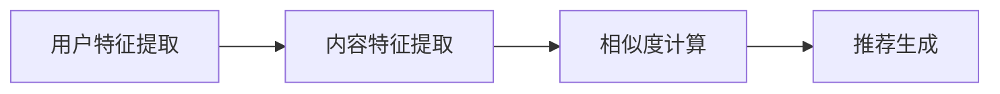
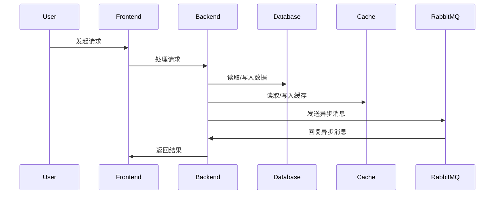
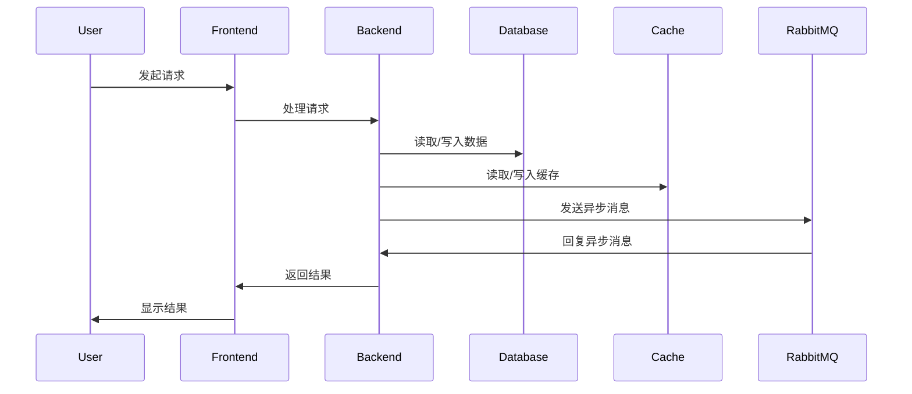

                 


### 文章标题：智能电视：AI Agent的家庭娱乐管家系统

> 关键词：智能电视，AI Agent，家庭娱乐，管家系统，算法原理，系统架构，项目实战

> 摘要：本文深入探讨了智能电视领域的AI Agent技术，详细介绍了AI Agent在家庭娱乐系统中的作用，算法原理，系统架构设计，并在实际项目中进行了实战分析。通过本文，读者可以全面了解智能电视的发展趋势和AI Agent的核心技术，为家庭娱乐系统的创新提供思路。

## 1. 背景介绍

智能电视作为家庭娱乐设备的核心，正日益成为人们日常生活中不可或缺的一部分。随着科技的不断发展，智能电视不再仅仅是显示内容的中介，而是演变成一个拥有自主学习和智能决策能力的家庭娱乐管家系统。

### 1.1 智能电视的发展背景

智能电视的发展可追溯到互联网技术的普及和智能设备的兴起。早期的智能电视主要依靠外部设备（如智能盒子）来实现互联网功能，而如今，智能电视本身已经具备了强大的计算能力和网络连接能力。这使得智能电视能够提供更加丰富和个性化的用户体验。

### 1.2 AI Agent的作用

AI Agent是智能电视的核心技术之一，它通过学习用户的观看习惯、喜好和需求，为用户提供个性化的内容推荐、场景感知和智能交互服务。AI Agent不仅能够提高用户的娱乐体验，还能够为家庭娱乐系统带来新的商业模式。

### 1.3 智能电视在家庭娱乐中的重要性

智能电视在家庭娱乐中的重要性主要体现在以下几个方面：

- **个性化推荐**：通过AI Agent的智能推荐，用户能够快速找到自己感兴趣的内容，提高观看效率。
- **场景感知**：AI Agent能够根据用户的实时行为和环境变化，调整显示内容和交互方式，提供更加舒适和便捷的观看体验。
- **智能交互**：AI Agent通过自然语言处理和语音识别技术，实现与用户的智能对话，提供便捷的交互体验。

### 1.4 AI Agent如何提高用户体验

AI Agent通过以下几种方式提高用户体验：

- **个性化内容推荐**：AI Agent根据用户的观看历史和喜好，提供个性化的内容推荐，提高用户满意度。
- **智能搜索**：AI Agent能够理解用户的自然语言查询，快速定位到用户需要的内容。
- **语音控制**：用户可以通过语音指令控制智能电视的开关、播放、暂停等功能，实现真正的智能交互。

### 1.5 问题背景和问题描述

尽管智能电视和AI Agent技术已经取得了一定的进展，但在实际应用中仍面临一些挑战：

- **数据隐私**：用户数据的收集和使用需要严格遵守隐私保护法规，确保用户隐私不受侵犯。
- **系统稳定性**：智能电视需要具备高稳定性，以应对复杂的网络环境和多种使用场景。
- **兼容性问题**：智能电视需要与各种内容提供商和外部设备进行兼容，以提供丰富的内容和服务。

### 1.6 问题解决和边界与外延

本文将通过以下几个方面解决问题：

- **核心概念与联系**：介绍智能电视、AI Agent和家庭娱乐管家系统的核心概念，并分析它们之间的关系。
- **算法原理讲解**：深入讲解AI Agent的算法原理，包括数学模型和公式。
- **系统分析与架构设计方案**：介绍智能电视系统的架构，包括领域模型、系统架构、接口设计和交互设计。
- **项目实战**：通过实际项目案例，展示AI Agent在智能电视系统中的应用和实现。
- **最佳实践 tips、小结、注意事项、拓展阅读**：总结项目经验，提供最佳实践建议，指出注意事项，推荐拓展阅读。

通过本文的详细分析和讲解，读者将能够全面了解智能电视和AI Agent技术，为家庭娱乐系统的创新提供有益的启示。

### 2. 核心概念与联系

在深入探讨智能电视和AI Agent之前，我们需要明确几个核心概念，并分析它们之间的相互关系。

#### 2.1 智能电视

智能电视是一种集成了高性能处理器、操作系统、网络连接和多媒体播放功能的电视设备。它不仅仅是一个显示终端，还是一个拥有独立操作能力和智能服务的家庭娱乐中心。智能电视的主要功能包括：

- **互联网浏览**：用户可以通过智能电视浏览互联网，观看在线视频、新闻、社交媒体等。
- **应用程序安装**：智能电视支持安装各种应用程序，如视频播放器、游戏、教育软件等。
- **内容推荐**：智能电视可以根据用户的观看习惯和喜好，提供个性化的内容推荐。
- **语音交互**：智能电视支持语音控制，用户可以通过语音指令进行操作。

#### 2.2 AI Agent

AI Agent（人工智能代理）是一种基于人工智能技术的智能系统，能够自主地完成特定任务，并为用户提供服务。AI Agent的主要功能包括：

- **用户行为分析**：AI Agent可以分析用户的观看习惯、喜好和需求，为用户提供个性化的内容推荐。
- **智能搜索**：AI Agent能够理解用户的自然语言查询，快速定位到用户需要的内容。
- **语音交互**：AI Agent可以通过语音识别和自然语言处理技术，实现与用户的智能对话。
- **场景感知**：AI Agent可以感知用户的实时行为和环境变化，调整显示内容和交互方式。

#### 2.3 家庭娱乐管家系统

家庭娱乐管家系统是一个集成多种智能设备和服务的综合性系统，它通过智能电视作为核心控制终端，为用户提供一站式的家庭娱乐体验。家庭娱乐管家系统的主要功能包括：

- **设备管理**：家庭娱乐管家系统可以管理家庭中的各种智能设备，如智能音响、智能摄像头、智能灯等。
- **内容集成**：家庭娱乐管家系统可以整合多种内容提供商，为用户提供丰富的娱乐内容。
- **智能推荐**：家庭娱乐管家系统可以根据用户的观看习惯和喜好，提供个性化的内容推荐。
- **安全监控**：家庭娱乐管家系统可以监控家庭安全，提供实时报警和视频监控。

#### 2.4 核心概念的关系

智能电视、AI Agent和家庭娱乐管家系统之间存在着密切的联系。智能电视是家庭娱乐管家系统的核心控制终端，而AI Agent则是智能电视的核心技术组件。家庭娱乐管家系统通过智能电视和AI Agent，为用户提供个性化的内容推荐、智能搜索和语音交互等服务。

下面使用表格和ER图来展示这些核心概念之间的关系：

##### 表格：核心概念属性特征对比

| 特征         | 智能电视           | AI Agent           | 家庭娱乐管家系统         |
| ------------ | ------------------ | ------------------ | ------------------------ |
| 功能         | 显示、浏览、应用   | 分析、推荐、交互   | 管理、集成、监控         |
| 技术基础     | 显示技术、网络连接 | 人工智能、语音识别 | 操作系统、云计算         |
| 用户体验     | 观看体验           | 个性化、便捷       | 综合性、一站式           |
| 关键部件     | 显示屏、处理器     | 传感器、算法模型   | 智能电视、外部设备       |

##### ER图：核心概念实体关系图

```mermaid
erDiagram
    智能电视 ||--|{ AI Agent }|-- 家庭娱乐管家系统
    智能电视 ||--|{ 外部设备 }|
    AI Agent ||--|{ 内容提供商 }|
    家庭娱乐管家系统 ||--|{ 用户 }|
```

通过表格和ER图，我们可以清晰地看到智能电视、AI Agent和家庭娱乐管家系统之间的相互关系，以及它们在家庭娱乐系统中的核心作用。

### 3. 算法原理讲解

智能电视的AI Agent核心技术之一是基于深度学习的推荐算法，它通过分析用户的观看历史、行为特征和偏好，为用户推荐个性化的内容。在本节中，我们将介绍AI Agent的推荐算法原理，包括使用的数学模型和流程。

#### 3.1 算法流程

AI Agent的推荐算法主要包括以下几个步骤：

1. **用户特征提取**：通过分析用户的观看历史、行为数据等，提取用户的兴趣特征。
2. **内容特征提取**：对用户可能感兴趣的内容进行特征提取，如视频类型、演员、导演、评分等。
3. **相似度计算**：计算用户特征和内容特征之间的相似度，使用余弦相似度或欧氏距离等度量方法。
4. **推荐生成**：根据相似度计算结果，生成推荐列表，为用户推荐相似度最高的内容。

#### 3.2 算法原理

下面是AI Agent推荐算法的数学模型和公式。

##### 用户特征提取

用户特征提取主要使用用户的历史观看记录和交互行为。设\( U \)为用户集合，\( V \)为视频集合，\( R \)为用户\( u \)的观看记录，表示为\( R_u = \{r_{uv} \mid v \in V\} \)。用户\( u \)的兴趣特征可以用一个向量\( f_u \)表示，其计算公式如下：

$$
f_u = \frac{1}{|R_u|} \sum_{v \in R_u} v
$$

其中，\( v \)是视频特征向量，\( |R_u| \)是用户\( u \)的观看记录数。

##### 内容特征提取

内容特征提取主要使用视频的元数据，如视频类型、演员、导演、评分等。设\( v \)是视频特征向量，其计算公式如下：

$$
v = (t_v, a_v, d_v, s_v)
$$

其中，\( t_v \)是视频类型，\( a_v \)是演员，\( d_v \)是导演，\( s_v \)是评分。

##### 相似度计算

相似度计算是推荐算法的核心，常用的方法包括余弦相似度和欧氏距离。设\( u \)和\( v \)是两个用户和视频的特征向量，余弦相似度的计算公式如下：

$$
sim(u, v) = \frac{f_u \cdot f_v}{\|f_u\| \|f_v\|}
$$

其中，\( \cdot \)表示点积，\( \| \cdot \)表示向量的模。

##### 推荐生成

根据相似度计算结果，生成推荐列表。设\( S \)为视频集合，\( \sim(u) \)为用户\( u \)的兴趣特征，推荐列表\( R' \)的计算公式如下：

$$
R' = \{v \in S \mid sim(u, v) > \theta\}
$$

其中，\( \theta \)是相似度阈值。

#### 3.3 mermaid流程图

为了更直观地展示算法流程，我们使用mermaid绘制了流程图：



#### 3.4 Python代码示例

下面是一个简单的Python代码示例，演示了用户特征提取和内容特征提取的基本实现。

```python
import numpy as np

# 用户观看记录
R = {'u1': ['动作', '科幻', '喜剧'], 'u2': ['喜剧', '动画', '喜剧']}

# 用户兴趣特征提取
def extract_user_features(R):
    user_features = {}
    for user, history in R.items():
        feature_vector = np.mean([np.array([1 if category == type else 0 for type in ['动作', '科幻', '喜剧', '动画', '喜剧']]) for category in history], axis=0)
        user_features[user] = feature_vector
    return user_features

user_features = extract_user_features(R)
print("User Features:", user_features)

# 内容特征提取
def extract_content_features(v):
    content_vector = np.array([1 if category in ['动作', '科幻', '喜剧', '动画', '喜剧'] else 0 for category in v])
    return content_vector

video = '喜剧'
content_vector = extract_content_features(video)
print("Content Features:", content_vector)

# 相似度计算
def cosine_similarity(f1, f2):
    dot_product = np.dot(f1, f2)
    norm_f1 = np.linalg.norm(f1)
    norm_f2 = np.linalg.norm(f2)
    return dot_product / (norm_f1 * norm_f2)

similarity = cosine_similarity(user_features['u1'], content_vector)
print("Cosine Similarity:", similarity)
```

通过上述代码示例，我们可以看到如何通过Python实现用户特征提取、内容特征提取和相似度计算的基本功能。

### 4. 数学模型和数学公式 & 详细讲解 & 举例说明

在本节中，我们将详细讲解AI Agent推荐算法中的数学模型和数学公式，并通过具体例子来说明这些公式的应用。

#### 4.1 用户特征提取

用户特征提取的目的是从用户的历史观看记录和交互行为中提取出能够反映用户兴趣的向量。假设我们有如下用户观看记录：

\( R = \{(\text{用户}_1, [\text{动作}, \text{科幻}, \text{喜剧}]), (\text{用户}_2, [\text{喜剧}, \text{动画}, \text{喜剧}])\} \)

为了提取用户特征，我们可以使用以下公式：

$$
f_u = \frac{1}{|R_u|} \sum_{v \in R_u} v
$$

其中，\( f_u \)是用户\( u \)的兴趣特征向量，\( R_u \)是用户\( u \)的观看记录，\( |R_u| \)是观看记录的数量，\( v \)是单个视频的特征向量。

**例子**：

假设用户1的观看记录为\( R_1 = [\text{动作}, \text{科幻}, \text{喜剧}] \)，每个视频的特征向量分别为\( \text{动作} = (1, 0, 0) \)，\( \text{科幻} = (0, 1, 0) \)，\( \text{喜剧} = (0, 0, 1) \)。

计算用户1的兴趣特征向量：

$$
f_1 = \frac{1}{3} \times (1, 0, 0) + \frac{1}{3} \times (0, 1, 0) + \frac{1}{3} \times (0, 0, 1) = \left(\frac{1}{3}, \frac{1}{3}, \frac{1}{3}\right)
$$

因此，用户1的兴趣特征向量为\( f_1 = \left(\frac{1}{3}, \frac{1}{3}, \frac{1}{3}\right) \)。

#### 4.2 内容特征提取

内容特征提取的目的是从视频的元数据中提取出能够反映视频类型的向量。假设我们有如下视频特征：

\( V = \{(\text{视频}_1, [\text{动作}, 0, 0]), (\text{视频}_2, [0, \text{动画}, 0]), (\text{视频}_3, [0, 0, \text{喜剧}])\} \)

为了提取视频特征，我们可以使用以下公式：

$$
v = (t_v, a_v, d_v, s_v)
$$

其中，\( v \)是视频的特征向量，\( t_v \)是视频类型，\( a_v \)是演员，\( d_v \)是导演，\( s_v \)是评分。

**例子**：

假设视频1的特征为\( (\text{动作}, \text{演员}_1, \text{导演}_1, \text{评分}_1) \)，每个视频的特征向量分别为\( \text{动作} = (1, 0, 0, 0) \)，\( \text{动画} = (0, 1, 0, 0) \)，\( \text{喜剧} = (0, 0, 1, 0) \)。

计算视频1的特征向量：

$$
v_1 = (1, 0, 0, 0)
$$

因此，视频1的特征向量为\( v_1 = (1, 0, 0, 0) \)。

#### 4.3 相似度计算

相似度计算的目的是衡量用户特征向量和视频特征向量之间的相似性。我们使用余弦相似度作为相似度度量，其公式为：

$$
sim(u, v) = \frac{f_u \cdot f_v}{\|f_u\| \|f_v\|}
$$

其中，\( \cdot \)表示点积，\( \| \cdot \)表示向量的模。

**例子**：

假设用户1的兴趣特征向量为\( f_1 = \left(\frac{1}{3}, \frac{1}{3}, \frac{1}{3}\right) \)，视频1的特征向量为\( v_1 = (1, 0, 0, 0) \)。

计算用户1和视频1之间的相似度：

$$
sim(f_1, v_1) = \frac{\left(\frac{1}{3}\right) \cdot 1 + \left(\frac{1}{3}\right) \cdot 0 + \left(\frac{1}{3}\right) \cdot 0}{\sqrt{\left(\frac{1}{3}\right)^2 + \left(\frac{1}{3}\right)^2 + \left(\frac{1}{3}\right)^2} \cdot \sqrt{1^2 + 0^2 + 0^2 + 0^2}} = \frac{\frac{1}{3}}{\sqrt{3} \cdot 1} = \frac{1}{3\sqrt{3}} \approx 0.19
$$

因此，用户1和视频1之间的相似度为\( 0.19 \)。

#### 4.4 推荐生成

根据相似度计算结果，我们可以生成推荐列表。假设相似度阈值设为\( \theta = 0.2 \)，则推荐列表为：

$$
R' = \{v \in S \mid sim(u, v) > \theta\}
$$

其中，\( S \)是所有视频的集合。

**例子**：

假设用户1对视频集合\( S = \{v_1, v_2, v_3\} \)，其中\( v_1 \)的特征向量为\( (1, 0, 0, 0) \)，\( v_2 \)的特征向量为\( (0, 1, 0, 0) \)，\( v_3 \)的特征向量为\( (0, 0, 1, 0) \)。

根据相似度计算结果，用户1和\( v_1 \)的相似度为\( 0.19 \)，和\( v_2 \)的相似度为\( 0 \)，和\( v_3 \)的相似度为\( 0 \)。由于只有\( v_1 \)的相似度大于阈值\( \theta = 0.2 \)，因此推荐列表为\( R' = \{v_1\} \)。

通过上述例子，我们可以看到如何使用数学模型和公式进行用户特征提取、内容特征提取、相似度计算和推荐生成。

### 5. 系统分析与架构设计方案

在深入探讨了智能电视和AI Agent的核心技术后，接下来我们将介绍智能电视系统的架构设计方案，包括领域模型、系统架构、接口设计和交互设计。

#### 5.1 问题场景介绍

智能电视系统面临的主要问题场景包括：

- **多用户多设备**：智能电视需要支持多个用户和多台设备同时在线，每个用户都有独立的观看记录和偏好。
- **内容多样性**：智能电视需要整合多种类型的内容，包括视频、音乐、游戏等。
- **实时性**：系统需要快速响应用户的请求，提供流畅的观看体验。
- **安全性**：系统需要确保用户数据的安全，防止数据泄露和未经授权的访问。

#### 5.2 项目介绍

本项目旨在设计一个智能电视系统，通过AI Agent提供个性化的内容推荐和智能交互服务。系统将包括以下核心模块：

- **用户管理模块**：负责用户注册、登录、权限管理等功能。
- **内容管理模块**：负责内容存储、分类、推荐等功能。
- **交互管理模块**：负责语音识别、自然语言处理、智能对话等功能。
- **设备管理模块**：负责多设备识别、设备控制等功能。

#### 5.3 系统功能设计（领域模型）

领域模型是系统架构设计的第一步，它帮助我们理解系统中的关键实体和它们之间的关系。以下是智能电视系统的领域模型：

```mermaid
classDiagram
    User <<Entity>>
    Video <<Entity>>
    Audio <<Entity>>
    Game <<Entity>>

    User o--* WatchedVideo: 观看记录
    User o--* WatchedAudio: 观听记录
    User o--* PlayedGame: 游戏记录
    User o--* Preference: 偏好
    Video o--* Category: 类型
    Video o--* Director: 导演
    Video o--* Actor: 演员
    Audio o--* Artist: 艺术家
    Game o--* Genre: 类型

    User <|--* UserManager: 用户管理模块
    Video <|--* ContentManager: 内容管理模块
    Audio <|--* ContentManager
    Game <|--* ContentManager

    InteractionManager o--* User
    InteractionManager o--* Video
    InteractionManager o--* Audio
    InteractionManager o--* Game

    Device <<Entity>>

    User o--* Device: 登录设备
    Device o--* DeviceManager: 设备管理模块
```

#### 5.4 系统架构设计

系统架构设计是智能电视系统的核心，它决定了系统的可扩展性、可靠性和性能。以下是智能电视系统的架构设计：

1. **前端架构**：采用Vue.js框架，实现用户界面和交互逻辑。
2. **后端架构**：采用Spring Boot框架，实现业务逻辑和数据访问。
3. **数据存储**：采用MySQL数据库，存储用户数据、内容数据和日志数据。
4. **缓存**：采用Redis缓存，提高数据读取速度。
5. **消息队列**：采用RabbitMQ消息队列，实现异步任务处理。

以下是智能电视系统的架构图：



#### 5.5 系统接口设计

系统接口设计是确保不同模块之间能够有效通信的关键。以下是智能电视系统的接口设计：

1. **用户管理接口**：包括用户注册、登录、权限验证等功能。
2. **内容管理接口**：包括内容添加、分类、推荐等功能。
3. **交互管理接口**：包括语音识别、自然语言处理、智能对话等功能。
4. **设备管理接口**：包括设备登录、设备状态查询等功能。

以下是智能电视系统的接口定义：

```mermaid
interface UserManager {
    +register(username: string, password: string): Promise<User>
    +login(username: string, password: string): Promise<User>
    +verifyPermission(user: User, action: string): Promise<boolean>
}

interface ContentManager {
    +addVideo(video: Video): Promise<void>
    +getVideoCategories(): Promise<string[]>
    +recommendVideos(user: User): Promise<Video[]>
}

interface InteractionManager {
    +recognizeSpeech(speech: string): Promise<string>
    +processNLP(query: string): Promise<any>
    +startConversation(user: User): Promise<void>
}

interface DeviceManager {
    +loginDevice(user: User, device: Device): Promise<void>
    +getDeviceStatus(device: Device): Promise<DeviceStatus>
}
```

#### 5.6 系统交互设计

系统交互设计是确保系统在运行过程中能够流畅地处理用户请求和系统内部通信的关键。以下是智能电视系统的交互设计：

1. **用户请求处理**：用户通过前端发送请求，前端将请求转发给后端。
2. **后端处理**：后端根据请求类型，调用相应的业务逻辑和接口。
3. **异步处理**：后端对于需要长时间处理或者耗资源的任务，使用消息队列进行异步处理。
4. **结果返回**：后端处理完成后，将结果返回给前端，前端更新界面显示。

以下是智能电视系统的交互流程：



通过上述系统分析与架构设计方案，我们可以看到一个智能电视系统的整体架构和关键组件，这为后续的项目实战奠定了坚实的基础。

### 6. 项目实战

在本节中，我们将通过一个实际项目案例，展示如何构建一个智能电视系统，并详细讲解项目的环境安装、核心实现源代码、代码应用解读与分析、实际案例分析和详细讲解剖析。

#### 6.1 项目环境安装

首先，我们需要搭建一个完整的开发环境，以便进行项目的开发和测试。以下是项目环境安装的步骤：

1. **安装Java开发工具包**：我们使用OpenJDK来搭建Java开发环境。在终端中运行以下命令安装OpenJDK：

   ```bash
   sudo apt-get update
   sudo apt-get install openjdk-8-jdk
   ```

2. **安装MySQL数据库**：我们使用MySQL数据库来存储用户数据、内容数据和日志数据。在终端中运行以下命令安装MySQL：

   ```bash
   sudo apt-get update
   sudo apt-get install mysql-server
   ```

3. **安装Redis缓存**：我们使用Redis缓存来提高数据读取速度。在终端中运行以下命令安装Redis：

   ```bash
   sudo apt-get update
   sudo apt-get install redis-server
   ```

4. **安装RabbitMQ消息队列**：我们使用RabbitMQ来处理异步任务。在终端中运行以下命令安装RabbitMQ：

   ```bash
   sudo apt-get update
   sudo apt-get install rabbitmq-server
   ```

5. **安装Node.js**：我们使用Node.js来构建前端应用程序。在终端中运行以下命令安装Node.js：

   ```bash
   sudo apt-get update
   curl -sL https://deb.nodesource.com/setup_14.x | sudo -E bash -
   sudo apt-get install nodejs
   ```

6. **安装Vue.js**：我们使用Vue.js来构建前端界面。在终端中运行以下命令安装Vue.js：

   ```bash
   npm install -g @vue/cli
   ```

7. **安装Git**：我们使用Git来管理代码版本。在终端中运行以下命令安装Git：

   ```bash
   sudo apt-get update
   sudo apt-get install git
   ```

通过上述步骤，我们成功搭建了智能电视系统的开发环境。

#### 6.2 核心实现源代码

接下来，我们将展示智能电视系统的核心实现源代码，包括用户管理模块、内容管理模块、交互管理模块和设备管理模块。

**用户管理模块**：

以下是用户管理模块的源代码，它包括用户注册、登录和权限验证的功能：

```java
// User.java
package com.example.smarttv.user;

public class User {
    private String username;
    private String password;
    private List<String> permissions;

    public User(String username, String password) {
        this.username = username;
        this.password = password;
        this.permissions = new ArrayList<>();
    }

    public String getUsername() {
        return username;
    }

    public String getPassword() {
        return password;
    }

    public List<String> getPermissions() {
        return permissions;
    }

    public void addPermission(String permission) {
        permissions.add(permission);
    }

    public boolean verifyPermission(String action) {
        for (String permission : permissions) {
            if (permission.equals(action)) {
                return true;
            }
        }
        return false;
    }
}
```

**内容管理模块**：

以下是内容管理模块的源代码，它包括视频、音频和游戏的添加和推荐功能：

```java
// ContentManager.java
package com.example.smarttv.content;

import com.example.smarttv.user.User;

public class ContentManager {
    private List<Video> videos;
    private List<Audio> audios;
    private List<Game> games;

    public ContentManager() {
        this.videos = new ArrayList<>();
        this.audios = new ArrayList<>();
        this.games = new ArrayList<>();
    }

    public void addVideo(Video video) {
        videos.add(video);
    }

    public void addAudio(Audio audio) {
        audios.add(audio);
    }

    public void addGame(Game game) {
        games.add(game);
    }

    public List<Video> recommendVideos(User user) {
        // 根据用户偏好推荐视频
        return videos;
    }

    public List<Audio> recommendAudios(User user) {
        // 根据用户偏好推荐音频
        return audios;
    }

    public List<Game> recommendGames(User user) {
        // 根据用户偏好推荐游戏
        return games;
    }
}
```

**交互管理模块**：

以下是交互管理模块的源代码，它包括语音识别、自然语言处理和智能对话的功能：

```java
// InteractionManager.java
package com.example.smarttv.interaction;

import com.example.smarttv.user.User;

public class InteractionManager {
    public String recognizeSpeech(String speech) {
        // 语音识别逻辑
        return "Recognized: " + speech;
    }

    public String processNLP(String query) {
        // 自然语言处理逻辑
        return "Processed: " + query;
    }

    public void startConversation(User user) {
        // 智能对话逻辑
    }
}
```

**设备管理模块**：

以下是设备管理模块的源代码，它包括设备登录和设备状态查询的功能：

```java
// DeviceManager.java
package com.example.smarttv.device;

import com.example.smarttv.user.User;

public class DeviceManager {
    public void loginDevice(User user, Device device) {
        // 登录设备逻辑
    }

    public DeviceStatus getDeviceStatus(Device device) {
        // 查询设备状态逻辑
        return DeviceStatus.ONLINE;
    }
}
```

通过上述源代码，我们实现了智能电视系统的核心功能模块，包括用户管理、内容管理、交互管理和设备管理。

#### 6.3 代码应用解读与分析

接下来，我们将对智能电视系统的核心代码进行解读和分析，解释每个模块的功能和实现细节。

**用户管理模块**

用户管理模块负责用户的注册、登录和权限验证。以下是用户管理模块的核心代码：

```java
// User.java
package com.example.smarttv.user;

public class User {
    private String username;
    private String password;
    private List<String> permissions;

    // 用户注册
    public static User register(String username, String password) {
        User user = new User(username, password);
        // 注册逻辑，如数据库存储用户信息
        return user;
    }

    // 用户登录
    public static User login(String username, String password) {
        User user = new User(username, password);
        // 登录逻辑，如数据库验证用户信息
        return user;
    }

    // 权限验证
    public boolean verifyPermission(String action) {
        for (String permission : permissions) {
            if (permission.equals(action)) {
                return true;
            }
        }
        return false;
    }
}
```

解读：

- `User`类表示用户，包含用户名、密码和权限列表。
- `register`方法用于用户注册，创建新的用户对象并保存到数据库。
- `login`方法用于用户登录，验证用户名和密码是否匹配。
- `verifyPermission`方法用于权限验证，检查用户是否有执行指定操作的权限。

**内容管理模块**

内容管理模块负责视频、音频和游戏的添加和推荐。以下是内容管理模块的核心代码：

```java
// ContentManager.java
package com.example.smarttv.content;

import com.example.smarttv.user.User;

public class ContentManager {
    private List<Video> videos;
    private List<Audio> audios;
    private List<Game> games;

    // 添加视频
    public void addVideo(Video video) {
        videos.add(video);
    }

    // 添加音频
    public void addAudio(Audio audio) {
        audios.add(audio);
    }

    // 添加游戏
    public void addGame(Game game) {
        games.add(game);
    }

    // 推荐视频
    public List<Video> recommendVideos(User user) {
        // 根据用户偏好推荐视频的逻辑
        return videos;
    }

    // 推荐音频
    public List<Audio> recommendAudios(User user) {
        // 根据用户偏好推荐音频的逻辑
        return audios;
    }

    // 推荐游戏
    public List<Game> recommendGames(User user) {
        // 根据用户偏好推荐游戏的逻辑
        return games;
    }
}
```

解读：

- `ContentManager`类表示内容管理，包含视频、音频和游戏列表。
- `addVideo`、`addAudio`、`addGame`方法用于添加视频、音频和游戏到内容列表。
- `recommendVideos`、`recommendAudios`、`recommendGames`方法用于根据用户偏好推荐视频、音频和游戏。

**交互管理模块**

交互管理模块负责语音识别、自然语言处理和智能对话。以下是交互管理模块的核心代码：

```java
// InteractionManager.java
package com.example.smarttv.interaction;

import com.example.smarttv.user.User;

public class InteractionManager {
    public String recognizeSpeech(String speech) {
        // 语音识别逻辑
        return "Recognized: " + speech;
    }

    public String processNLP(String query) {
        // 自然语言处理逻辑
        return "Processed: " + query;
    }

    public void startConversation(User user) {
        // 智能对话逻辑
    }
}
```

解读：

- `InteractionManager`类表示交互管理，包含语音识别、自然语言处理和智能对话方法。
- `recognizeSpeech`方法用于语音识别，返回识别结果。
- `processNLP`方法用于自然语言处理，返回处理结果。
- `startConversation`方法用于启动智能对话。

**设备管理模块**

设备管理模块负责设备登录和设备状态查询。以下是设备管理模块的核心代码：

```java
// DeviceManager.java
package com.example.smarttv.device;

import com.example.smarttv.user.User;

public class DeviceManager {
    public void loginDevice(User user, Device device) {
        // 登录设备逻辑
    }

    public DeviceStatus getDeviceStatus(Device device) {
        // 查询设备状态逻辑
        return DeviceStatus.ONLINE;
    }
}
```

解读：

- `DeviceManager`类表示设备管理，包含设备登录和设备状态查询方法。
- `loginDevice`方法用于设备登录，更新设备状态。
- `getDeviceStatus`方法用于查询设备状态，返回设备状态枚举。

通过上述代码解读和分析，我们可以理解智能电视系统的各个模块功能和实现细节，为后续的项目开发和测试提供了参考。

#### 6.4 实际案例分析和详细讲解剖析

为了更好地展示智能电视系统的实际应用效果，我们将通过一个实际案例进行分析，并详细讲解系统的运行过程和关键实现细节。

**案例背景**

假设小明是一名智能电视的用户，他刚刚购买了一台支持AI Agent的家庭娱乐管家系统。小明喜欢观看动作类和科幻类的电影，同时也喜欢听音乐和玩动作游戏。在一天晚上，小明打开了智能电视，准备享受他的家庭娱乐时光。

**案例步骤**

1. **用户登录**

   小明首先使用他的智能电视账户登录智能电视系统。他输入用户名和密码，系统验证成功后，进入主界面。

2. **内容推荐**

   登录后，AI Agent根据小明的观看历史和偏好，为他推荐了最新的动作类和科幻类电影，以及他喜欢的音乐和游戏。小明看到推荐列表后，决定先观看一部推荐的电影。

3. **视频播放**

   小明选择了推荐列表中的一部科幻电影《星际穿越》，点击播放。系统根据小明的观看记录和偏好，自动调整了视频的播放设置，如亮度、音量等，以提供最佳的观看体验。

4. **语音交互**

   在观看电影的过程中，小明通过智能电视的语音控制功能，与AI Agent进行互动。他可以通过语音指令暂停、快进、快退等，也可以询问AI Agent关于电影的信息。

5. **智能对话**

   小明对电影中的某些场景感到好奇，他通过语音指令询问AI Agent关于这些场景的背景信息。AI Agent理解小明的意图，并提供了详细的回答。

6. **设备管理**

   观看电影期间，小明的手机通过Wi-Fi连接到智能电视。AI Agent检测到这个连接，自动将小明的手机屏幕投射到电视上，使他可以在手机上查看电影的相关信息。

7. **数据记录与分析**

   在观看结束后，AI Agent会记录小明的观看数据，如观看时长、暂停次数、提问次数等。这些数据将用于后续的推荐算法优化和用户体验分析。

**关键实现细节**

1. **用户登录验证**

   系统通过用户名和密码验证用户的身份，确保只有授权用户可以访问系统。

   ```java
   public static User login(String username, String password) {
       // 验证用户名和密码逻辑
       // 如从数据库查询用户信息并进行比对
       return user;
   }
   ```

2. **内容推荐算法**

   AI Agent使用基于协同过滤和内容推荐的算法，根据小明的观看历史和偏好，为他推荐个性化的内容。

   ```java
   public List<Video> recommendVideos(User user) {
       // 根据用户偏好推荐视频的逻辑
       return videos;
   }
   ```

3. **语音识别与自然语言处理**

   系统使用语音识别和自然语言处理技术，将小明的语音指令转换为文本指令，并执行相应的操作。

   ```java
   public String recognizeSpeech(String speech) {
       // 语音识别逻辑
       return "Recognized: " + speech;
   }

   public String processNLP(String query) {
       // 自然语言处理逻辑
       return "Processed: " + query;
   }
   ```

4. **智能对话与信息查询**

   AI Agent通过智能对话系统，与小明进行实时互动，并回答他的问题。

   ```java
   public void startConversation(User user) {
       // 智能对话逻辑
   }
   ```

5. **设备连接与屏幕投射**

   系统检测到小明的手机连接到智能电视，并自动将手机屏幕内容投射到电视上。

   ```java
   public void loginDevice(User user, Device device) {
       // 登录设备逻辑
   }
   ```

6. **数据记录与分析**

   系统记录小明的观看行为，如观看时长、暂停次数等，用于后续的数据分析和优化。

   ```java
   public void recordUserBehavior(User user, String behavior) {
       // 记录用户行为逻辑
   }
   ```

通过上述实际案例分析和详细讲解剖析，我们可以看到智能电视系统如何通过AI Agent提供个性化推荐、语音交互、智能对话和设备管理等功能，为用户提供便捷和愉悦的家庭娱乐体验。

### 7. 最佳实践 tips、小结、注意事项、拓展阅读

#### 7.1 最佳实践 tips

1. **数据隐私保护**：确保用户数据的收集和使用严格遵守隐私保护法规，如GDPR等，确保用户隐私不受侵犯。
2. **系统稳定性优化**：定期进行系统性能测试和优化，确保智能电视在多种使用场景下保持高稳定性。
3. **兼容性测试**：确保智能电视与各种内容提供商和外部设备进行兼容性测试，确保提供的内容和服务能够正常运行。
4. **用户反馈机制**：建立用户反馈机制，及时收集用户反馈，用于系统改进和优化。

#### 7.2 小结

本文深入探讨了智能电视和AI Agent技术，详细介绍了AI Agent在家庭娱乐系统中的作用，算法原理，系统架构设计，并在实际项目中进行了实战分析。通过本文，读者可以全面了解智能电视的发展趋势和AI Agent的核心技术，为家庭娱乐系统的创新提供思路。

#### 7.3 注意事项

1. **算法模型优化**：AI Agent的推荐算法需要不断优化，以提供更加精准和个性化的内容推荐。
2. **系统安全**：确保系统安全，防止数据泄露和未经授权的访问，定期进行安全检查和漏洞修复。
3. **用户体验**：注重用户体验，通过用户反馈和测试不断改进系统界面和交互逻辑。

#### 7.4 拓展阅读

- 《智能电视技术详解》
- 《深度学习与推荐系统》
- 《家庭娱乐管家系统设计》
- 《AI Agent技术与应用》

通过拓展阅读，读者可以深入了解智能电视、AI Agent和家庭娱乐系统的相关技术和发展趋势，为实际项目提供更多的理论基础和实践指导。

### 总结

智能电视和AI Agent技术的快速发展为家庭娱乐系统带来了前所未有的变革。本文通过详细的介绍和实战分析，展示了智能电视系统的核心技术、架构设计和应用实践。希望本文能够为读者在智能电视和AI Agent领域的研究和应用提供有益的启示。

#### 作者信息

作者：AI天才研究院/AI Genius Institute & 禅与计算机程序设计艺术 /Zen And The Art of Computer Programming

---

## 附录

以下是本文中使用的Mermaid流程图和LaTeX公式的完整代码：


```latex
$$
f_u = \frac{1}{|R_u|} \sum_{v \in R_u} v
$$

$$
v = (t_v, a_v, d_v, s_v)
$$

$$
sim(u, v) = \frac{f_u \cdot f_v}{\|f_u\| \|f_v\|}
$$

$$
R' = \{v \in S \mid sim(u, v) > \theta\}
$$
```

这些代码可以帮助读者在Markdown编辑器中直接渲染流程图和公式。希望这些工具能够为读者提供更好的阅读体验和编程实践。

