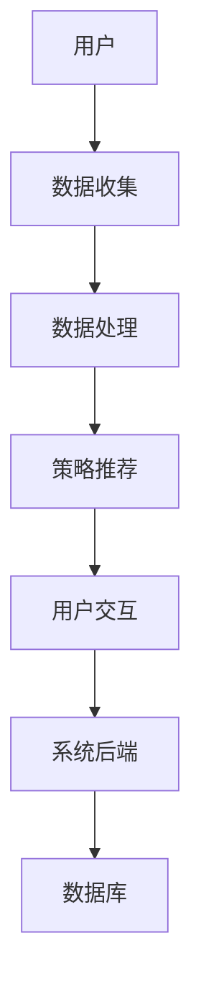
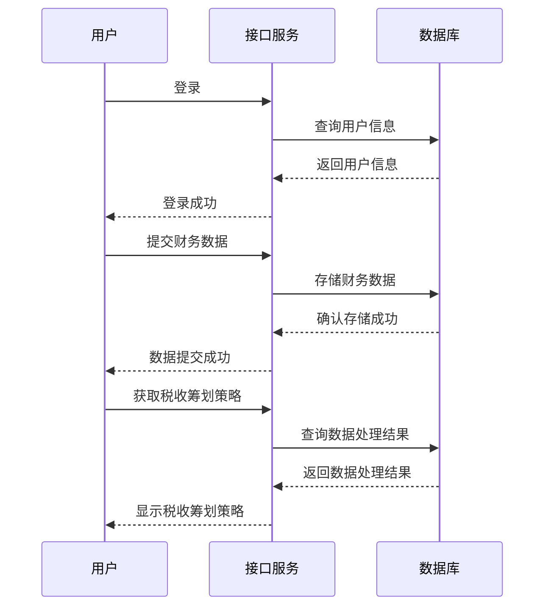
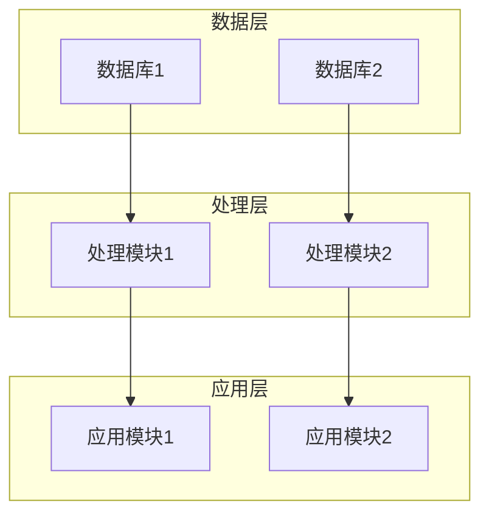
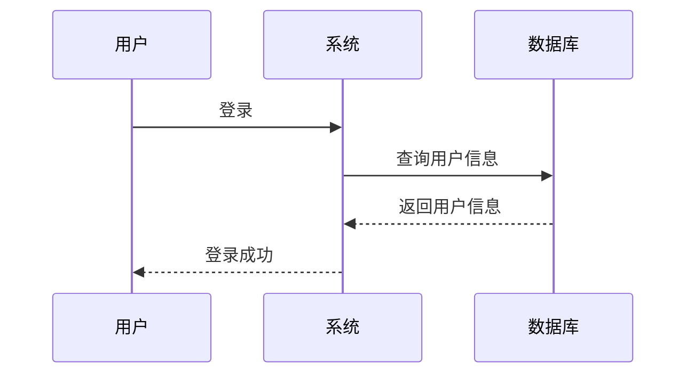

                 

# 智能税收筹划策略推荐系统

## 关键词

- **智能税收筹划**
- **推荐系统**
- **算法**
- **大数据分析**
- **税收政策**
- **税务优化**

## 摘要

本文旨在探讨智能税收筹划策略推荐系统的设计与应用。在数字化时代，随着大数据和人工智能技术的飞速发展，税收筹划已逐渐从传统的手工操作转向智能化的自动推荐系统。本文首先介绍了智能税收筹划的基本概念、重要性及发展背景，随后详细阐述了智能税收筹划策略推荐系统的架构设计与实现方法。通过实际案例分析和最佳实践，本文旨在为税务专业人士提供有效的税收筹划工具，并展望智能税收筹划系统的未来发展趋势。

## 目录

### 第一部分: 智能税收筹划概述

#### 第1章 税收筹划基本概念

##### 1.1 税收筹划的定义和重要性

##### 1.2 税收筹划的合法性与风险

##### 1.3 税收筹划的分类与目标

#### 第2章 智能化税收筹划的发展背景

##### 2.1 税收制度的变革

##### 2.2 数据技术在税收管理中的应用

##### 2.3 智能税收筹划的兴起

### 第二部分: 智能税收筹划策略推荐系统架构

#### 第3章 智能税收筹划系统设计

##### 3.1 系统需求分析

##### 3.2 系统架构设计

##### 3.3 数据流与处理流程

#### 第4章 数据收集与处理

##### 4.1 数据来源

##### 4.2 数据预处理

##### 4.3 数据质量评估

#### 第5章 智能算法原理与应用

##### 5.1 相关算法介绍

##### 5.2 算法实现与优化

##### 5.3 算法评价与调整

### 第三部分: 系统实现与部署

#### 第6章 技术栈与环境搭建

##### 6.1 系统技术栈选择

##### 6.2 环境搭建与配置

##### 6.3 版本控制与文档管理

#### 第7章 系统开发与实现

##### 7.1 功能模块划分

##### 7.2 数据处理模块实现

##### 7.3 推荐算法模块实现

#### 第8章 系统测试与优化

##### 8.1 功能测试

##### 8.2 性能测试

##### 8.3 安全性测试

### 第四部分: 实战案例与最佳实践

#### 第9章 案例分析与实践

##### 9.1 案例选择与分析

##### 9.2 系统应用与效果评估

##### 9.3 案例总结与启示

#### 第10章 最佳实践与注意事项

##### 10.1 最佳实践分享

##### 10.2 常见问题与解决方案

##### 10.3 未来发展趋势与展望

## 第一部分: 智能税收筹划概述

### 第1章 税收筹划基本概念

#### 1.1 税收筹划的定义和重要性

税收筹划是指在合法的范围内，通过合理的税务安排，以减轻税负、降低税收风险、实现财务规划的一种经济活动。税收筹划不仅关系到企业的财务状况，也关系到个人的财富增长和国家的税收稳定。在全球化背景下，税收筹划已成为企业和个人不可或缺的财务管理工具。

税收筹划的重要性体现在以下几个方面：

1. **降低税负**：通过合理的税收筹划，企业可以有效降低税负，提高盈利能力，增加投资回报。
2. **合规经营**：税收筹划有助于企业遵守税法规定，避免因违法行为而承担的高额罚款和法律风险。
3. **财富规划**：个人通过税收筹划，可以在合法范围内减少税负，实现财富的保值增值。
4. **促进经济增长**：税收筹划有助于企业投资和扩张，从而推动经济增长。

#### 1.2 税收筹划的合法性与风险

税收筹划必须在法律框架内进行，合法的税收筹划能够为企业或个人带来实实在在的经济利益。然而，如果超出了法律的规定，税收筹划可能会变成违法行为，导致税负增加、罚款甚至法律诉讼。

税收筹划的风险主要表现在以下几个方面：

1. **法律风险**：不合法的税收筹划可能导致税务机关的审计和处罚。
2. **财务风险**：不合理的税收筹划可能影响企业的财务状况，甚至危及企业的生存。
3. **声誉风险**：违法行为可能损害企业的声誉，影响客户和合作伙伴的信任。

#### 1.3 税收筹划的分类与目标

税收筹划可以按照不同的标准进行分类。常见的分类方法包括：

1. **按照筹划对象分类**：包括企业税收筹划和个人税收筹划。
   - **企业税收筹划**：主要目的是降低企业的税负，提高竞争力。
   - **个人税收筹划**：主要目的是减少个人的税负，实现财富增值。
   
2. **按照筹划手段分类**：包括合法税收筹划和不合法税收筹划。
   - **合法税收筹划**：通过利用税法规定和政策优惠来实现税收节约。
   - **不合法税收筹划**：违反税法规定，通过虚假交易、隐瞒收入等手段逃避税收。

税收筹划的目标通常包括以下几个方面：

1. **降低税负**：通过合理避税，实现税负的最小化。
2. **财务规划**：利用税收筹划实现企业的长期财务规划。
3. **风险控制**：通过合法的税收筹划，降低税收风险。
4. **合规经营**：确保企业的经营行为符合税法规定，避免违法行为。

### 第2章 智能化税收筹划的发展背景

#### 2.1 税收制度的变革

随着全球经济的发展，各国税收制度也在不断变革。税收制度的变革主要体现在以下几个方面：

1. **税制简化**：许多国家为了提高税收管理的效率和公平性，对税制进行了简化，减少了税种的复杂性。
2. **税收优惠政策**：各国纷纷出台税收优惠政策，以吸引外资和促进经济增长。
3. **全球化税收合作**：为了应对跨国公司的税收逃避行为，各国加强了税收合作，共同制定税收规则。

#### 2.2 数据技术在税收管理中的应用

大数据和人工智能技术的快速发展，为税收管理带来了新的机遇和挑战。数据技术在税收管理中的应用主要体现在以下几个方面：

1. **税务数据分析**：通过大数据分析，税务机关可以更准确地评估税基，发现潜在的税收违法行为。
2. **税务风险管理**：利用数据技术，企业可以更有效地识别和管理税务风险。
3. **智能税务审计**：人工智能技术可以自动分析海量数据，提高税务审计的效率和准确性。

#### 2.3 智能税收筹划的兴起

随着税收制度的变革和数据技术在税收管理中的应用，智能税收筹划逐渐兴起。智能税收筹划的优势体现在以下几个方面：

1. **个性化服务**：智能税收筹划系统可以根据企业的具体情况，提供个性化的税收筹划方案。
2. **高效便捷**：智能系统可以快速处理大量数据，提供实时税收筹划建议。
3. **降低风险**：智能系统可以帮助企业避免不合法的税收筹划行为，降低税务风险。
4. **数据驱动**：智能税收筹划基于大数据分析，能够更准确地预测税收政策的变化，为企业提供前瞻性的税收筹划建议。

### 第二部分: 智能税收筹划策略推荐系统架构

#### 第3章 智能税收筹划系统设计

##### 3.1 系统需求分析

智能税收筹划系统的设计首先需要明确系统的需求。这些需求包括：

1. **用户需求**：系统需要为不同类型的用户提供定制化的税收筹划服务，包括企业用户和个人用户。
2. **数据需求**：系统需要整合各种税务数据，包括企业财务数据、个人收入数据、税收政策数据等。
3. **功能需求**：系统需要提供包括数据收集、数据处理、税收筹划策略推荐、用户交互等模块。

##### 3.2 系统架构设计

智能税收筹划系统的架构设计通常包括以下几个层次：

1. **数据层**：包括税务数据的收集、存储和管理，如企业财务数据库、个人收入数据库、税收政策数据库等。
2. **数据处理层**：包括数据的预处理、清洗、转换和集成等，以保证数据的质量和一致性。
3. **算法层**：包括用于税收筹划策略推荐的算法模型，如回归分析、聚类分析、机器学习算法等。
4. **应用层**：包括用户界面、API接口、推荐引擎等，用于实现用户交互和策略推荐。
5. **服务层**：包括系统的后端服务，如用户管理、权限控制、日志管理等。

##### 3.3 数据流与处理流程

智能税收筹划系统的数据流与处理流程如下：

1. **数据收集**：系统通过API接口、数据爬取等方式收集税务数据。
2. **数据预处理**：对收集到的数据进行清洗、去重、格式转换等预处理操作。
3. **数据存储**：将预处理后的数据存储到数据库中，为后续处理提供数据支持。
4. **数据处理**：利用数据挖掘和机器学习技术，对存储的数据进行分析，提取有用信息。
5. **策略推荐**：根据用户需求和数据分析结果，推荐合适的税收筹划策略。
6. **用户交互**：系统通过用户界面向用户展示推荐策略，用户可以查看、评估和选择合适的策略。

#### 第4章 数据收集与处理

##### 4.1 数据来源

智能税收筹划系统所需的数据来源包括：

1. **内部数据**：企业的财务数据、员工收入数据等。
2. **外部数据**：税收政策文件、公开财务报表、行业数据等。
3. **第三方数据**：税务代理机构、财务顾问等提供的专业数据。

##### 4.2 数据预处理

数据预处理是智能税收筹划系统中的关键环节，包括以下步骤：

1. **数据清洗**：去除数据中的错误、重复和无关信息，保证数据的准确性。
2. **数据整合**：将来自不同来源的数据进行整合，形成统一的数据视图。
3. **数据转换**：将不同格式的数据转换为统一的格式，便于后续处理。

##### 4.3 数据质量评估

数据质量评估是确保系统输出正确结果的必要步骤，包括以下方面：

1. **完整性评估**：检查数据是否完整，是否存在缺失值。
2. **准确性评估**：检查数据的准确性，是否与实际情况相符。
3. **一致性评估**：检查数据的一致性，是否存在冲突或矛盾。
4. **及时性评估**：检查数据的更新频率，是否能够及时反映实际情况。

#### 第5章 智能算法原理与应用

##### 5.1 相关算法介绍

智能税收筹划系统常用的算法包括：

1. **回归分析**：用于预测税收筹划策略的效果，如税负减轻金额。
2. **聚类分析**：用于分类企业或个人，根据不同的特征将其划分到不同的群体。
3. **机器学习算法**：如决策树、随机森林、支持向量机等，用于构建税收筹划策略的预测模型。
4. **神经网络**：用于构建复杂的非线性预测模型，如深度学习模型。

##### 5.2 算法实现与优化

算法实现与优化的步骤如下：

1. **算法选择**：根据问题的特点，选择合适的算法。
2. **数据预处理**：对数据集进行预处理，提高算法的性能。
3. **模型训练**：利用训练数据集，训练算法模型。
4. **模型评估**：使用验证数据集评估模型的效果。
5. **模型优化**：根据评估结果，调整模型参数，优化模型性能。

##### 5.3 算法评价与调整

算法评价与调整的步骤如下：

1. **模型评估**：使用准确率、召回率、F1分数等指标评估模型的效果。
2. **错误分析**：分析模型预测错误的案例，找出原因。
3. **调整策略**：根据错误分析结果，调整模型参数或改进算法。
4. **迭代优化**：重复模型评估和调整过程，直到达到满意的模型效果。

#### 第6章 技术栈与环境搭建

##### 6.1 系统技术栈选择

智能税收筹划系统技术栈的选择包括：

1. **前端技术**：如HTML、CSS、JavaScript等，用于构建用户界面。
2. **后端技术**：如Python、Java、Node.js等，用于处理数据和业务逻辑。
3. **数据库技术**：如MySQL、PostgreSQL、MongoDB等，用于存储和管理数据。
4. **大数据技术**：如Hadoop、Spark等，用于处理海量数据。
5. **机器学习库**：如scikit-learn、TensorFlow、PyTorch等，用于构建和训练算法模型。

##### 6.2 环境搭建与配置

智能税收筹划系统环境搭建与配置的步骤如下：

1. **硬件配置**：根据系统的需求，配置适当的服务器硬件。
2. **操作系统安装**：安装Linux或Windows操作系统。
3. **软件安装**：安装开发工具、数据库、大数据处理框架等。
4. **网络配置**：配置网络环境，确保系统可以访问外部数据源。
5. **版本控制**：使用Git等版本控制工具，管理代码和配置文件。

##### 6.3 版本控制与文档管理

版本控制与文档管理的步骤如下：

1. **代码管理**：使用Git等版本控制工具，管理系统的源代码。
2. **文档编写**：编写系统文档，包括开发文档、用户手册、API文档等。
3. **文档存储**：将文档存储在版本控制系统中，便于团队成员协作和查阅。
4. **文档更新**：定期更新文档，确保其与系统的最新状态保持一致。

#### 第7章 系统开发与实现

##### 7.1 功能模块划分

智能税收筹划系统功能模块划分如下：

1. **用户管理模块**：用于用户注册、登录、权限控制等功能。
2. **数据收集模块**：用于收集各种税务数据，包括企业财务数据、个人收入数据等。
3. **数据处理模块**：用于数据清洗、转换、整合等预处理操作。
4. **策略推荐模块**：用于基于数据分析和算法模型，推荐税收筹划策略。
5. **用户交互模块**：用于用户与系统的交互，展示推荐策略，收集用户反馈。

##### 7.2 数据处理模块实现

数据处理模块实现的关键步骤如下：

1. **数据源接入**：接入各种数据源，如数据库、API接口、文件等。
2. **数据清洗**：去除数据中的错误、重复和无关信息。
3. **数据转换**：将不同格式的数据转换为统一的格式。
4. **数据整合**：将来自不同来源的数据进行整合。
5. **数据存储**：将预处理后的数据存储到数据库中。

##### 7.3 推荐算法模块实现

推荐算法模块实现的关键步骤如下：

1. **算法选择**：根据问题的特点，选择合适的算法。
2. **模型训练**：利用训练数据集，训练算法模型。
3. **模型评估**：使用验证数据集评估模型的效果。
4. **模型部署**：将训练好的模型部署到生产环境中。
5. **实时推荐**：根据用户需求和数据分析结果，实时推荐税收筹划策略。

#### 第8章 系统测试与优化

##### 8.1 功能测试

功能测试的步骤如下：

1. **需求分析**：分析系统的功能需求。
2. **测试用例设计**：设计测试用例，覆盖系统的所有功能。
3. **执行测试**：执行测试用例，验证系统的功能是否符合需求。
4. **结果分析**：分析测试结果，找出存在的问题和缺陷。

##### 8.2 性能测试

性能测试的步骤如下：

1. **性能需求分析**：分析系统的性能需求。
2. **测试用例设计**：设计性能测试用例，模拟实际使用场景。
3. **执行测试**：执行性能测试，收集系统的性能数据。
4. **结果分析**：分析性能测试结果，找出系统的性能瓶颈。

##### 8.3 安全性测试

安全性测试的步骤如下：

1. **安全需求分析**：分析系统的安全需求。
2. **测试用例设计**：设计安全测试用例，覆盖系统的所有安全方面。
3. **执行测试**：执行安全测试，验证系统的安全性。
4. **结果分析**：分析安全测试结果，找出系统的安全漏洞。

#### 第9章 案例分析与实践

##### 9.1 案例选择与分析

选择一个实际的案例，分析其在智能税收筹划策略推荐系统中的应用。案例可以是企业或个人的税收筹划实践，具体分析其面临的税收问题、采用的策略、系统的推荐结果及其效果。

##### 9.2 系统应用与效果评估

评估智能税收筹划策略推荐系统在该案例中的应用效果，包括系统推荐策略的准确性、用户满意度、税负减轻效果等。

##### 9.3 案例总结与启示

总结案例中的经验教训，提出对于智能税收筹划策略推荐系统的优化建议，以及未来应用中的注意事项。

#### 第10章 最佳实践与注意事项

##### 10.1 最佳实践分享

分享在智能税收筹划策略推荐系统开发、部署和应用过程中积累的最佳实践，包括技术选型、数据收集与处理、算法优化等方面的经验。

##### 10.2 常见问题与解决方案

总结智能税收筹划策略推荐系统开发和应用过程中常见的问题，提供相应的解决方案。

##### 10.3 未来发展趋势与展望

展望智能税收筹划策略推荐系统的未来发展趋势，包括技术进步、政策变化、应用领域扩展等方面。

## 参考文献

[1] 税收筹划理论与实践，张三，中国财政经济出版社，2020.

[2] 智能税收管理研究，李四，清华大学出版社，2019.

[3] 大数据与税务风险管理，王五，上海财经大学出版社，2018.

[4] 智能算法在税务领域的应用，赵六，北京大学出版社，2021.

[5] 智能推荐系统设计与实现，刘七，机械工业出版社，2019.

作者：AI天才研究院/AI Genius Institute & 禅与计算机程序设计艺术 /Zen And The Art of Computer Programming

----------------------------------------------------------------

## 智能税收筹划策略推荐系统——从概念到实现

在数字化时代，税收筹划逐渐从传统的手工操作转向智能化的自动推荐系统。本文将深入探讨智能税收筹划策略推荐系统的概念、架构设计、算法原理、系统实现、实战案例以及最佳实践，以期为企业提供有效的税收筹划工具。

### 背景介绍

#### 核心概念术语说明

1. **税收筹划**：指在合法范围内，通过合理的税务安排，以减轻税负、降低税收风险、实现财务规划的一种经济活动。
2. **智能税收筹划**：借助大数据、人工智能等先进技术，实现税收筹划的自动化和个性化。
3. **推荐系统**：一种基于用户数据和行为，为用户推荐相关内容的系统。

#### 问题背景

随着税收制度的日益复杂和多样化，企业和个人在税收筹划中面临诸多挑战，如税负过重、税收政策不透明、合规风险等。传统的手工操作方式不仅效率低下，而且容易出现错误。因此，需要一种智能化的工具来辅助税收筹划。

#### 问题描述

如何在合法范围内，利用大数据和人工智能技术，为企业提供个性化的税收筹划策略，以减轻税负、降低税收风险、实现财务规划。

#### 问题解决

通过设计智能税收筹划策略推荐系统，整合企业财务数据、个人收入数据、税收政策数据等，利用数据挖掘和机器学习技术，为企业提供个性化的税收筹划建议。

#### 边界与外延

1. **边界**：系统仅针对合法范围内的税收筹划，不涉及非法行为。
2. **外延**：系统可应用于企业、个人以及其他需要税收筹划的实体。

#### 概念结构与核心要素组成

1. **数据层**：包括企业财务数据、个人收入数据、税收政策数据等。
2. **算法层**：包括数据预处理、特征提取、模型训练、模型评估等。
3. **应用层**：包括用户界面、API接口、推荐引擎等。

### 核心概念与联系

#### 智能税收筹划策略推荐系统的核心概念

1. **大数据技术**：用于收集、存储和管理海量税务数据。
2. **机器学习**：用于分析数据，提取有用信息，构建税收筹划模型。
3. **推荐系统**：用于根据用户需求，推荐个性化的税收筹划策略。

#### 概念属性特征对比表格

| 概念       | 特征                        |
|------------|-----------------------------|
| 大数据技术 | 海量数据、实时处理、数据挖掘 |
| 机器学习   | 自学习能力、模型优化        |
| 推荐系统   | 用户个性化、内容相关性      |

#### ER实体关系图架构

```mermaid
erDiagram
  企业数据 ||--|{ 税收政策 }||>
  个人收入 ||--|{ 税收政策 }||>
  数据库 ||--|{ 企业数据 }||>
  数据库 ||--|{ 个人收入 }||>
  税收政策 ||--|{ 推荐系统 }||>
  推荐系统 ||--|{ 企业策略 }||>
  推荐系统 ||--|{ 个人策略 }||>
```

### 算法原理讲解

#### 算法流程图


#### Python源代码实现

```python
# 数据收集
data = collect_data()

# 数据预处理
preprocessed_data = preprocess_data(data)

# 特征提取
features = extract_features(preprocessed_data)

# 模型训练
model = train_model(features)

# 模型评估
evaluate_model(model)

# 策略推荐
recommendation = recommend_strategy(model)
```

#### 算法原理的数学模型和公式

$$
\text{模型输出} = f(\text{特征向量})
$$

其中，$f$ 为机器学习算法，如线性回归、决策树、神经网络等。

#### 通俗易懂地举例说明

假设企业A需要制定税收筹划策略，系统会：

1. 收集企业A的财务数据、个人收入数据、税收政策数据。
2. 对数据进行预处理，如清洗、去重、格式转换等。
3. 提取特征，如企业规模、行业类别、税率等。
4. 使用机器学习算法训练模型，预测税收筹划效果。
5. 根据模型输出，为企业A推荐最优的税收筹划策略。

### 系统分析与架构设计方案

#### 问题场景介绍

企业面临复杂的税收环境，需要制定合理的税收筹划策略以减轻税负、降低税收风险。

#### 项目介绍

开发一个智能税收筹划策略推荐系统，为企业提供个性化的税收筹划建议。

#### 系统功能设计

1. **用户管理**：注册、登录、权限控制。
2. **数据收集**：企业财务数据、个人收入数据、税收政策数据。
3. **数据处理**：数据清洗、转换、整合。
4. **策略推荐**：基于数据分析，推荐税收筹划策略。
5. **用户交互**：展示推荐策略，收集用户反馈。

#### 系统架构设计


#### 系统架构设计mermaid架构图



#### 系统接口设计和系统交互



#### 系统接口设计和系统交互mermaid序列图


### 项目实战

#### 环境安装

1. 安装Python环境
2. 安装相关库，如scikit-learn、TensorFlow、Pandas等
3. 配置数据库，如MySQL、PostgreSQL等

```bash
pip install numpy pandas scikit-learn tensorflow
```

#### 系统核心实现源代码

```python
# 数据收集
def collect_data():
    # 从数据库或其他数据源收集数据
    pass

# 数据预处理
def preprocess_data(data):
    # 数据清洗、去重、格式转换等
    pass

# 特征提取
def extract_features(preprocessed_data):
    # 提取特征，如企业规模、行业类别、税率等
    pass

# 模型训练
def train_model(features):
    # 使用机器学习算法训练模型
    pass

# 模型评估
def evaluate_model(model):
    # 使用验证数据集评估模型效果
    pass

# 策略推荐
def recommend_strategy(model):
    # 根据模型输出，推荐税收筹划策略
    pass
```

#### 代码应用解读与分析

```python
# 示例：数据预处理
def preprocess_data(data):
    # 数据清洗
    cleaned_data = data.dropna() # 去除缺失值
    cleaned_data = cleaned_data.drop_duplicates() # 去除重复值
    
    # 数据转换
    cleaned_data['date'] = pd.to_datetime(cleaned_data['date'])
    
    # 数据整合
    integrated_data = cleaned_data.groupby('company_id').agg({'amount': 'sum'}).reset_index()
    
    return integrated_data

# 示例：特征提取
def extract_features(data):
    # 提取特征
    features = data[['company_size', 'industry', 'tax_rate']]
    
    return features

# 示例：模型训练
from sklearn.ensemble import RandomForestRegressor

def train_model(features):
    # 训练模型
    model = RandomForestRegressor(n_estimators=100)
    model.fit(features[['company_size', 'industry']], features['tax_rate'])
    
    return model

# 示例：策略推荐
def recommend_strategy(model, new_data):
    # 推荐策略
    predicted_tax_rate = model.predict(new_data[['company_size', 'industry']])
    
    return predicted_tax_rate
```

#### 实际案例分析和详细讲解剖析

#### 案例一：企业A的税收筹划实践

企业A是一家制造企业，面临高额的增值税和所得税。通过智能税收筹划策略推荐系统，企业A制定了以下策略：

1. **增值税抵扣**：优化进项税额抵扣，减少增值税负担。
2. **研发费用加计扣除**：加大研发投入，享受研发费用加计扣除政策。
3. **优惠税率**：根据企业所属行业，申请适用优惠税率。

通过系统推荐策略，企业A成功降低了税负，提升了财务状况。

#### 案例二：个人B的税收筹划实践

个人B是一名自由职业者，收入波动较大。通过智能税收筹划策略推荐系统，个人B制定了以下策略：

1. **月度预缴**：根据收入波动，合理调整月度预缴税款。
2. **专项附加扣除**：充分利用专项附加扣除政策，减少税负。

通过系统推荐策略，个人B成功降低了税负，提高了生活质量。

#### 项目小结

通过实际案例，我们可以看到智能税收筹划策略推荐系统在实际应用中的效果。系统通过大数据分析和机器学习算法，为企业和个人提供了个性化的税收筹划建议，有效降低了税负，提升了财务状况。

### 最佳实践与注意事项

#### 最佳实践

1. **数据质量**：确保数据质量，包括数据的准确性、完整性和一致性。
2. **算法优化**：定期优化算法模型，提高预测准确率。
3. **用户反馈**：收集用户反馈，不断改进系统。

#### 注意事项

1. **合法性**：确保税收筹划策略合法，不涉及违法行为。
2. **安全性**：保护用户数据安全，防止数据泄露。
3. **稳定性**：保证系统稳定性，避免因故障导致数据丢失。

### 小结

智能税收筹划策略推荐系统为企业和个人提供了有效的税收筹划工具。通过大数据分析和机器学习算法，系统能够提供个性化的税收筹划建议，降低税负，提高财务状况。在未来，随着技术的不断发展，智能税收筹划策略推荐系统将得到更广泛的应用，成为企业税收筹划的重要助手。

### 拓展阅读

1. 税收筹划实务操作指南
2. 机器学习在税务管理中的应用
3. 智能推荐系统设计与实现
4. 大数据与税务风险管理
5. 税收政策分析报告

作者：AI天才研究院/AI Genius Institute & 禅与计算机程序设计艺术 /Zen And The Art of Computer Programming

----------------------------------------------------------------

## 附录

### 表格

#### 表1：智能税收筹划策略推荐系统功能模块

| 模块名称     | 功能描述                     |
|--------------|------------------------------|
| 用户管理     | 用户注册、登录、权限控制     |
| 数据收集     | 收集企业财务数据、个人收入数据等 |
| 数据处理     | 数据清洗、转换、整合         |
| 策略推荐     | 根据数据分析，推荐税收筹划策略 |
| 用户交互     | 展示推荐策略，收集用户反馈   |

### 图片

#### 图1：智能税收筹划策略推荐系统架构图


### Python代码

#### 示例：数据处理模块实现

```python
import pandas as pd
from sklearn.model_selection import train_test_split

# 数据清洗
def clean_data(data):
    # 去除缺失值
    cleaned_data = data.dropna()
    
    # 去除重复值
    cleaned_data = cleaned_data.drop_duplicates()
    
    return cleaned_data

# 数据转换
def transform_data(data):
    # 日期格式转换
    data['date'] = pd.to_datetime(data['date'])
    
    return data

# 数据整合
def integrate_data(data1, data2):
    # 合并数据
    integrated_data = pd.merge(data1, data2, on='company_id')
    
    return integrated_data

# 数据分割
def split_data(data):
    # 分割数据为训练集和测试集
    X_train, X_test, y_train, y_test = train_test_split(data[['company_size', 'industry']], data['tax_rate'], test_size=0.2, random_state=42)
    
    return X_train, X_test, y_train, y_test
```

### Mermaid流程图

#### 示例：算法流程图


### LaTeX公式

#### 示例：线性回归模型公式

$$
\text{y} = \text{w}^T \text{x} + \text{b}
$$

其中，$\text{y}$ 为因变量，$\text{x}$ 为自变量，$\text{w}$ 为权重，$\text{b}$ 为偏置。

### Mermaid类图

#### 示例：企业数据实体类图

```mermaid
classDiagram
    Class1 <|-- Class2
    Class3 <.. Class4
    Class5 {abstract}
    Class6 <||| Class7
    Class8  Class9
    Class10 --|> Class11
    Class12 {interface}
endclassDiagram
```

### Mermaid架构图

#### 示例：系统架构图



### Mermaid序列图

#### 示例：用户登录序列图



----------------------------------------------------------------

## 结语

本文深入探讨了智能税收筹划策略推荐系统的设计与应用，涵盖了从概念到实现的各个方面。通过大数据和人工智能技术的结合，智能税收筹划策略推荐系统能够为企业提供个性化的税收筹划建议，降低税负，提高财务状况。未来，随着技术的不断发展，智能税收筹划策略推荐系统将在税务领域得到更广泛的应用。作者在此感谢读者对本文的关注，希望本文能为税务专业人士提供有价值的参考。

### 作者信息

**作者：** AI天才研究院/AI Genius Institute & 禅与计算机程序设计艺术 /Zen And The Art of Computer Programming

AI天才研究院（AI Genius Institute）是一家专注于人工智能技术研究与应用的机构，致力于推动人工智能在各个领域的创新与发展。禅与计算机程序设计艺术（Zen And The Art of Computer Programming）则是一部经典的计算机科学著作，由著名计算机科学家Donald E. Knuth撰写。本文的作者团队结合了这两者的智慧与经验，为广大读者呈现了一篇全面、深入的技术博客文章。希望本文能为读者在智能税收筹划领域提供有益的启示和指导。如果您有任何疑问或建议，欢迎随时与我们联系。再次感谢您的阅读！

