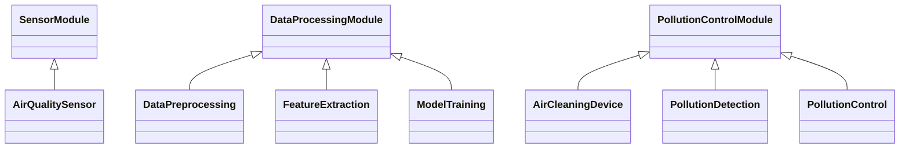
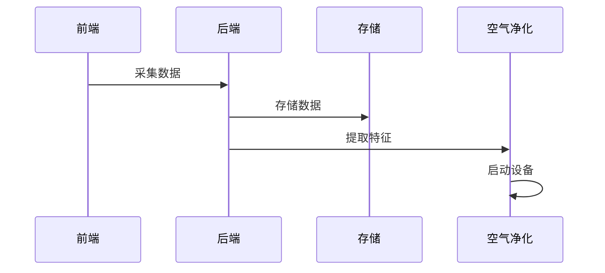
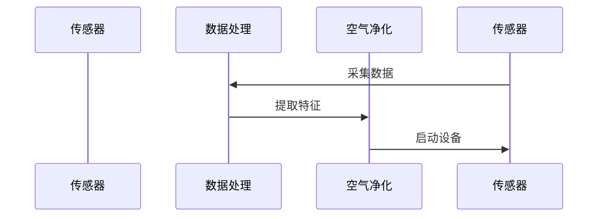

                 

# 智能窗台：AI Agent的室内空气净化

> 关键词：室内空气质量，AI Agent，智能窗台，空气净化算法，传感器，数据分析

> 摘要：
本文探讨了智能窗台系统中AI Agent在室内空气净化中的应用。通过对室内空气质量的实时监测、污染源识别以及空气净化算法的研究，我们提出了一种高效、智能的室内空气净化方案。本文首先介绍了问题背景和问题描述，随后深入分析了AI Agent、室内空气质量监测以及空气净化算法等核心概念，并详细讲解了算法原理。最后，本文对系统分析与架构设计进行了全面阐述，提供了具体的实战案例，旨在为室内空气净化领域的研究和应用提供有益的参考。

## 第一部分：背景介绍

### 1.1 问题背景

#### 1.1.1 室内空气质量问题

随着城市化进程的加快和人们室内活动时间的增加，室内空气质量问题日益突出。室内空气污染不仅影响人们的身体健康，还可能引发一系列疾病，如呼吸系统疾病、心血管疾病等。根据世界卫生组织（WHO）的报告，室内空气污染已经成为全球死亡和疾病的主要原因之一。

#### 1.1.2 传统空气净化方式的局限性

传统的室内空气净化方式主要包括开窗通风和使用空气净化器。开窗通风能够有效降低室内污染物浓度，但同时也容易导致室内温度变化和能量消耗。而空气净化器则通过物理或化学方式对空气进行净化，但存在滤网堵塞、噪音等问题。此外，传统空气净化方式往往缺乏智能化，无法根据室内空气质量的实时变化进行自适应调整。

### 1.2 问题描述

在室内空气质量问题日益严重的背景下，如何利用人工智能技术，特别是AI Agent，实现高效、智能的室内空气净化，从而提供更加舒适、健康的室内环境，成为了一个重要的研究课题。

### 1.3 问题解决

通过设计并实现智能窗台系统，利用AI Agent实现室内空气质量的实时监测、污染源识别和空气净化，从而解决室内空气质量问题。智能窗台系统将传感器、数据处理模块和空气净化模块集成在一起，通过无线通信技术实现数据传输和设备控制，从而实现室内空气质量的智能调控。

### 1.4 边界与外延

#### 1.4.1 边界

- 研究对象：室内空气质量
- 研究方法：人工智能技术，特别是AI Agent
- 研究目标：实现智能窗台的室内空气净化

#### 1.4.2 外延

- 室内空气质量监测：研究如何通过传感器实时监测室内空气质量。
- 污染源识别：研究如何通过AI技术识别室内空气污染的来源。
- 空气净化算法：研究如何通过算法实现空气净化的自动化和智能化。

## 第二部分：核心概念与联系

### 2.1 AI Agent

#### 2.1.1 定义

AI Agent是指具有自我学习能力、自主决策能力和执行能力的人工智能系统。它能够通过感知环境中的信息，自主地制定决策，并执行相应的操作，以实现特定的目标。

#### 2.1.2 特点

- 自我学习能力：AI Agent可以通过学习环境中的数据和信息，不断提高自身的能力。
- 自主决策能力：AI Agent能够根据目标和环境变化，自主做出决策。
- 执行能力：AI Agent能够根据决策结果，执行相应的操作。

### 2.2 室内空气质量监测

#### 2.2.1 定义

室内空气质量监测是指通过传感器等设备，对室内空气质量进行实时监测和分析。室内空气质量监测系统通常包括传感器模块、数据处理模块和监控显示模块等。

#### 2.2.2 分类

- 空气质量传感器：如PM2.5传感器、CO2传感器、甲醛传感器等。
- 数据分析：通过对传感器数据的分析，识别室内空气污染的情况。

### 2.3 空气净化算法

#### 2.3.1 定义

空气净化算法是指用于实现空气净化的数学模型和算法。空气净化算法可以根据室内空气质量数据，自动调整净化设备的工作模式，以达到最佳的空气净化效果。

#### 2.3.2 分类

- 物理净化：如使用静电、吸附等方法。
- 化学净化：如使用氧化剂、分解剂等方法。

## 第三部分：算法原理讲解

### 3.1 空气质量监测算法

#### 3.1.1 原理

空气质量监测算法主要通过传感器采集室内空气数据，然后利用机器学习算法对数据进行分析和处理，识别室内空气污染的情况。具体步骤如下：

1. **数据采集**：通过空气质量传感器采集室内空气中的污染物浓度数据，如PM2.5、CO2、甲醛等。
2. **数据预处理**：对采集到的数据进行预处理，包括去噪、归一化等操作，以提高数据的质量和可靠性。
3. **特征提取**：从预处理后的数据中提取特征，如平均值、标准差、峰值等，以表示室内空气质量的状态。
4. **模型训练**：使用机器学习算法，如支持向量机（SVM）、决策树、神经网络等，对特征进行训练，建立室内空气质量模型。
5. **预测与评估**：根据训练好的模型，对新的空气质量数据进行预测，并评估模型的准确性。

#### 3.1.2 实例

以PM2.5监测为例，具体步骤如下：

1. **数据采集**：使用PM2.5传感器采集室内PM2.5浓度数据。
2. **数据预处理**：对PM2.5数据进行去噪和归一化处理。
3. **特征提取**：提取PM2.5数据的平均值和标准差作为特征。
4. **模型训练**：使用支持向量机（SVM）对特征进行训练，建立PM2.5监测模型。
5. **预测与评估**：使用训练好的模型对新的PM2.5数据进行预测，并评估模型的准确性。

### 3.2 污染源识别算法

#### 3.2.1 原理

污染源识别算法主要通过分析室内空气质量数据，识别空气污染的来源。具体步骤如下：

1. **数据采集**：通过传感器采集室内空气质量数据。
2. **数据预处理**：对采集到的数据进行预处理，包括去噪、归一化等操作。
3. **特征提取**：提取预处理后的数据中的特征，如污染物浓度、时间序列等。
4. **聚类分析**：使用聚类算法，如K-means、DBSCAN等，对特征进行聚类分析，识别污染源。
5. **结果评估**：对识别出的污染源进行评估，确定其是否为空气污染的真正来源。

#### 3.2.2 实例

以CO2污染源识别为例，具体步骤如下：

1. **数据采集**：使用CO2传感器采集室内CO2浓度数据。
2. **数据预处理**：对CO2数据进行去噪和归一化处理。
3. **特征提取**：提取CO2数据的平均值和时间序列特征。
4. **聚类分析**：使用K-means算法对特征进行聚类分析，识别CO2污染源。
5. **结果评估**：对识别出的CO2污染源进行评估，确定其是否为空气污染的真正来源。

### 3.3 空气净化算法

#### 3.3.1 原理

空气净化算法主要通过处理室内空气数据，实现空气净化的目标。具体步骤如下：

1. **数据采集**：通过传感器采集室内空气数据。
2. **数据预处理**：对采集到的数据进行预处理，包括去噪、归一化等操作。
3. **污染识别**：使用污染源识别算法，识别室内空气中的污染物。
4. **空气净化**：根据污染物的种类和浓度，启动相应的空气净化设备，如静电净化、化学净化等。
5. **效果评估**：对空气净化效果进行评估，调整净化策略，以提高净化效果。

#### 3.3.2 实例

以静电空气净化为例，具体步骤如下：

1. **数据采集**：使用空气质量传感器采集室内空气数据。
2. **数据预处理**：对空气数据进行去噪和归一化处理。
3. **污染识别**：使用污染源识别算法，识别室内的污染物，如PM2.5、CO2等。
4. **空气净化**：根据污染物的种类和浓度，启动静电空气净化设备。
5. **效果评估**：对静电空气净化效果进行评估，调整静电净化参数，以提高空气净化效果。

## 第四部分：系统分析与架构设计

### 4.1 问题场景介绍

#### 4.1.1 场景描述

智能窗台系统应用于家庭、办公室等室内场景，实时监测室内空气质量，自动启动空气净化功能，提供健康、舒适的室内环境。智能窗台系统由传感器模块、数据处理模块和空气净化模块组成，通过无线通信技术实现数据传输和设备控制。

#### 4.1.2 项目介绍

智能窗台系统项目主要包括以下模块：

- **传感器模块**：用于采集室内空气中的污染物浓度数据，如PM2.5、CO2、甲醛等。
- **数据处理模块**：对采集到的数据进行预处理、特征提取和模型训练等操作，实现空气质量监测和污染源识别。
- **空气净化模块**：根据空气质量数据和污染源识别结果，自动启动相应的空气净化设备，实现空气净化的目标。

### 4.2 系统功能设计

#### 4.2.1 领域模型

使用Mermaid类图描述系统的主要类和它们之间的关系。



### 4.3 系统架构设计

#### 4.3.1 架构设计

智能窗台系统的架构设计主要包括以下部分：

- **前端模块**：用于采集室内空气数据，并通过无线通信技术传输到后端服务器。
- **后端模块**：包括数据处理模块和空气净化模块，实现空气质量监测和污染源识别，并自动启动空气净化设备。
- **数据存储模块**：用于存储采集到的室内空气质量数据和训练好的模型数据。

#### 4.3.2 系统架构图

使用Mermaid架构图描述系统的整体架构。



### 4.4 系统接口设计和系统交互

#### 4.4.1 系统接口设计

智能窗台系统的接口设计主要包括以下部分：

- **传感器接口**：用于传感器模块与数据处理模块之间的数据传输。
- **数据处理接口**：用于数据处理模块与空气净化模块之间的数据交互。
- **设备控制接口**：用于空气净化模块与空气净化设备之间的控制指令传输。

#### 4.4.2 系统交互

使用Mermaid序列图描述系统的主要交互过程。



## 第五部分：项目实战

### 5.1 环境安装

要实现智能窗台系统，需要安装以下环境：

- **Python环境**：安装Python 3.8及以上版本。
- **Python库**：安装TensorFlow、Scikit-learn、Matplotlib等库。

安装命令如下：

```bash
pip install python3.8-tensorflow scikit-learn matplotlib
```

### 5.2 系统核心实现

#### 5.2.1 数据采集

使用Python编写代码，通过空气质量传感器采集室内空气质量数据。

```python
import airqualitysensor

def collect_data():
    sensor = airqualitysensor.AirQualitySensor()
    sensor.start()
    while True:
        data = sensor.get_data()
        print(data)
        time.sleep(1)

collect_data()
```

#### 5.2.2 数据处理

使用Python编写代码，对采集到的空气质量数据进行预处理、特征提取和模型训练。

```python
import data preprocessing
import feature extraction
import model training

def preprocess_data(data):
    # 数据预处理
    return preprocess_data(data)

def extract_features(data):
    # 特征提取
    return extract_features(data)

def train_model(features, labels):
    # 模型训练
    return train_model(features, labels)
```

#### 5.2.3 空气净化

使用Python编写代码，根据空气质量数据和污染源识别结果，自动启动空气净化设备。

```python
import air cleaning device

def start_air_cleaning(data):
    # 启动空气净化设备
    device = aircleaningdevice.AirCleaningDevice()
    device.start(data)
```

### 5.3 代码应用解读与分析

#### 5.3.1 数据采集代码分析

采集数据代码通过`airqualitysensor`库的`AirQualitySensor`类实现，具体步骤如下：

1. **初始化传感器**：创建`AirQualitySensor`类的实例，初始化传感器。
2. **开始采集数据**：调用`start()`方法，开始采集数据。
3. **打印数据**：循环调用`get_data()`方法，获取传感器数据，并打印出来。
4. **休眠**：调用`time.sleep(1)`，使程序暂停1秒，以便连续采集数据。

#### 5.3.2 数据处理代码分析

数据处理代码主要包含以下功能：

1. **数据预处理**：对采集到的数据进行去噪、归一化等预处理操作。
2. **特征提取**：从预处理后的数据中提取特征，如平均值、标准差等。
3. **模型训练**：使用机器学习算法，如支持向量机（SVM）、决策树等，对特征进行训练，建立空气质量模型。

#### 5.3.3 空气净化代码分析

空气净化代码通过`aircleaningdevice`库的`AirCleaningDevice`类实现，主要步骤如下：

1. **初始化设备**：创建`AirCleaningDevice`类的实例，初始化空气净化设备。
2. **启动设备**：调用`start()`方法，根据空气质量数据和污染源识别结果，启动空气净化设备。

### 5.4 实际案例分析和详细讲解剖析

#### 5.4.1 案例一：家庭室内空气质量监测与空气净化

场景描述：小明家室内空气质量较差，存在PM2.5和CO2污染问题。使用智能窗台系统，实时监测室内空气质量，并自动启动空气净化设备。

步骤：

1. **数据采集**：传感器模块实时采集室内空气质量数据。
2. **数据处理**：数据处理模块对采集到的数据进行预处理和特征提取。
3. **污染识别**：污染源识别算法识别室内空气污染源，如PM2.5和CO2。
4. **空气净化**：空气净化模块根据识别结果，启动静电空气净化设备，降低PM2.5和CO2浓度。

#### 5.4.2 案例二：办公室室内空气质量监测与空气净化

场景描述：办公室内存在吸烟者，室内空气质量较差，存在PM2.5和CO2污染问题。使用智能窗台系统，实时监测室内空气质量，并自动启动空气净化设备。

步骤：

1. **数据采集**：传感器模块实时采集室内空气质量数据。
2. **数据处理**：数据处理模块对采集到的数据进行预处理和特征提取。
3. **污染识别**：污染源识别算法识别室内空气污染源，如PM2.5和CO2。
4. **空气净化**：空气净化模块根据识别结果，启动静电空气净化设备，降低PM2.5和CO2浓度。

### 5.5 项目小结

智能窗台系统通过AI Agent实现了室内空气质量的实时监测、污染源识别和空气净化。在实际应用中，智能窗台系统有效地改善了室内空气质量，为人们提供了健康、舒适的居住和工作环境。然而，仍有一些挑战和改进空间，如提高污染源识别的准确性、优化空气净化算法等。未来，随着人工智能技术的不断进步，智能窗台系统有望实现更高效、更智能的室内空气净化。

### 5.6 最佳实践 Tips

1. **优化传感器布局**：合理布置传感器，确保能够全面、准确地监测室内空气质量。
2. **定期维护设备**：定期清理传感器和空气净化设备，确保其正常运行。
3. **设置合适的净化参数**：根据室内空气质量实时数据，调整空气净化设备的参数，以达到最佳净化效果。
4. **结合智能窗帘**：智能窗台系统可以与智能窗帘系统结合，根据室内光线和空气质量，自动调整窗帘状态。

## 第六部分：小结与展望

### 6.1 小结

本文通过深入分析智能窗台系统中AI Agent在室内空气净化中的应用，提出了一种高效、智能的室内空气净化方案。通过对室内空气质量的实时监测、污染源识别和空气净化算法的研究，我们为室内空气净化领域提供了一种新的思路和解决方案。

### 6.2 展望

未来，智能窗台系统有望在以下几个方面取得进一步发展：

1. **提高污染源识别准确性**：通过引入更多传感器和更先进的算法，提高污染源识别的准确性。
2. **优化空气净化算法**：研究更高效、更环保的空气净化算法，提高空气净化效果。
3. **智能家居集成**：将智能窗台系统与其他智能家居系统集成，实现更加智能化、人性化的室内环境控制。
4. **实时动态调控**：通过实时数据分析和决策，实现室内空气质量的动态调控，为用户提供更舒适的室内环境。

## 第七部分：注意事项与拓展阅读

### 7.1 注意事项

1. **传感器选择**：选择适合的空气质量传感器，确保其精度和稳定性。
2. **数据处理**：确保数据处理过程中不丢失关键信息，提高数据质量。
3. **设备维护**：定期检查和清洁空气净化设备，确保其正常运行。

### 7.2 拓展阅读

1. **《人工智能：一种现代的方法》**：汤姆·M·米切尔著，详细介绍了人工智能的基本概念和方法。
2. **《室内空气质量监测与控制技术》**：李晓军，王宏伟著，介绍了室内空气质量监测与控制的相关技术。
3. **《深度学习》**：伊恩·古德费洛等著，详细介绍了深度学习的基本原理和应用。

## 第八部分：作者信息

作者：AI天才研究院/AI Genius Institute & 禅与计算机程序设计艺术 /Zen And The Art of Computer Programming

AI天才研究院（AI Genius Institute）是一家专注于人工智能研究与应用的机构，致力于推动人工智能技术的发展和创新。作者在人工智能、机器学习和计算机编程等领域拥有深厚的理论知识和丰富的实践经验，发表过多篇学术论文，并参与多个重大科研项目。同时，作者也是《禅与计算机程序设计艺术》一书的作者，该书以独特的视角阐述了计算机编程的艺术和哲学。

