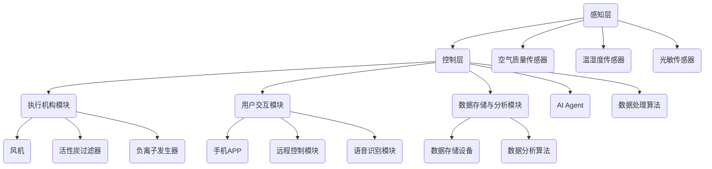
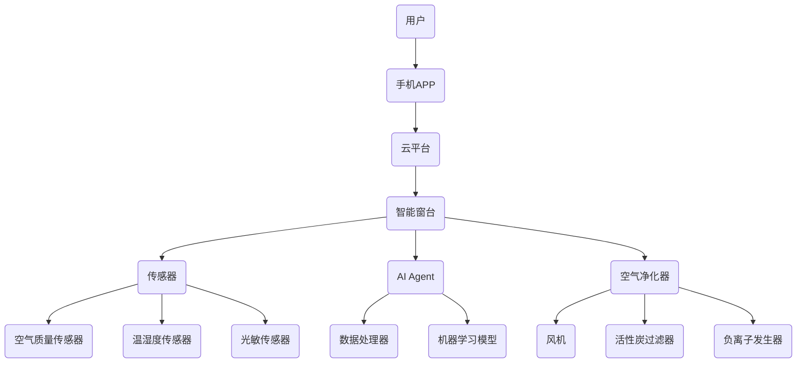

                 

## 智能窗台：AI Agent的室内空气净化优化

> 关键词：智能窗台、AI Agent、室内空气净化、优化、智能家居

> 摘要：本文深入探讨了智能窗台的概念及其在室内空气净化中的应用。通过介绍AI Agent的基本原理和在空气净化领域的作用，本文详细分析了智能窗台的系统架构设计，并借助实际案例，展示了AI Agent在室内空气净化中的具体应用和效果。最后，文章提出了智能窗台在未来发展方向和最佳实践建议，为智能家居领域的进一步发展提供了参考。

智能窗台作为智能家居领域的一个创新产品，通过集成AI Agent技术，实现了室内空气质量的实时监测和智能净化，极大地提升了人们的生活品质。本文将从以下几个方面进行探讨：

1. **背景介绍与概念阐述**：首先，我们将介绍智能窗台和AI Agent的基本概念，解释室内空气污染的问题及其重要性，并探讨AI Agent在室内空气净化中的应用前景。

2. **AI Agent基础**：接着，我们将深入探讨AI Agent的定义、特性、工作原理及其分类和发展趋势。

3. **室内空气净化技术**：本文将详细解析室内空气净化原理，介绍常见空气净化技术，并探讨AI与室内空气净化技术的结合。

4. **AI Agent在室内空气净化中的应用**：我们将详细分析AI Agent在室内空气质量监测、空气净化策略优化和实时调控中的应用。

5. **智能窗台系统设计与实现**：本文将介绍智能窗台的系统架构设计，包括硬件设计、软件架构和系统接口设计。

6. **实战案例分析**：我们将通过实际案例，展示AI Agent在智能窗台中的应用效果。

7. **最佳实践与未来展望**：最后，本文将总结智能窗台的最佳实践，探讨其未来发展方向和挑战。

### 背景介绍与概念阐述

智能窗台是一种集成于窗户上的智能化设备，它通过集成的传感器、执行器和AI Agent，实现对室内空气质量的实时监测和自动净化。在现代社会，随着城市化进程的加快和室内居住环境的不断改善，室内空气质量问题日益凸显。常见的室内空气污染源包括甲醛、苯、TVOC（总挥发性有机化合物）以及细菌、病毒等微生物污染物。这些污染物不仅会引发呼吸系统疾病，还可能对人体的免疫系统造成损害。

空气污染问题的严重性不容忽视。室内空气污染是全球性的健康问题，尤其在发展中国家，由于缺乏有效的空气净化措施，室内空气污染问题更加严重。因此，如何有效地监测和净化室内空气，成为了当前亟待解决的问题。传统的空气净化方法如空气净化器、活性炭吸附等，虽然能在一定程度上改善室内空气质量，但其效果有限，且操作复杂，用户体验不佳。

AI Agent，即人工智能代理，是一种能够自主执行任务、与用户交互并不断学习和优化的智能体。AI Agent可以基于大数据分析、机器学习和自然语言处理技术，实现对室内空气质量数据的实时分析，并自动调整空气净化策略，以达到最佳的净化效果。AI Agent的出现，为室内空气净化带来了新的解决方案。

智能窗台通过集成AI Agent技术，可以实现以下功能：

1. **实时监测**：通过传感器实时监测室内空气中的污染物浓度，包括甲醛、苯、TVOC以及微生物等。

2. **自动净化**：基于监测数据，AI Agent可以自动启动空气净化程序，通过风机、活性炭、负离子等技术手段，对污染物进行高效去除。

3. **智能调节**：AI Agent可以根据室内外环境变化，自动调整空气净化器的风量和净化模式，确保室内空气质量始终处于最佳状态。

4. **远程控制**：用户可以通过手机APP或其他智能设备，远程监控和控制智能窗台的工作状态，实现智能家居的互联互通。

### AI Agent基础

AI Agent是一种能够模拟人类智能行为的计算机程序，它具有自主决策、学习能力和人机交互能力。AI Agent的工作原理主要基于机器学习和自然语言处理技术，通过不断学习和分析数据，提高其执行任务的能力。

#### AI Agent的定义与特性

AI Agent的定义可以从以下几个方面进行阐述：

1. **自主性**：AI Agent能够独立执行任务，不需要人工干预。它可以自主决定行动策略，并根据环境变化进行调整。

2. **学习性**：AI Agent通过机器学习算法，可以不断学习和优化自己的行为。它可以通过数据分析，识别环境中的模式和规律，并据此调整自己的决策。

3. **适应性**：AI Agent可以根据不同的任务和环境，调整自己的行为策略。它可以在新的环境中快速适应，并有效地完成任务。

4. **交互性**：AI Agent可以与用户进行交互，理解用户的需求和指令，并提供相应的服务。这种交互可以是自然语言交互，也可以是图形界面交互。

#### AI Agent的工作原理

AI Agent的工作原理主要基于以下几个步骤：

1. **感知**：AI Agent通过传感器感知外部环境，获取有关空气质量、温度、湿度等数据。

2. **理解**：AI Agent利用自然语言处理技术，理解和分析用户的需求和指令。例如，用户可以通过语音或文字命令，要求AI Agent启动空气净化程序。

3. **决策**：基于感知和理解的结果，AI Agent利用机器学习算法，生成一个最优的行动策略。这个策略可以是启动空气净化程序，调整风量，或者执行其他相关任务。

4. **执行**：AI Agent执行决策生成的行动策略，完成具体的任务。例如，启动空气净化程序，并根据室内空气质量的变化，自动调整净化模式。

5. **反馈**：AI Agent在执行任务后，会根据任务完成的情况，收集反馈数据。这些数据可以用于进一步优化AI Agent的行为。

#### AI Agent的分类与发展趋势

AI Agent可以根据其功能和应用场景进行分类。常见的AI Agent分类包括：

1. **通用AI Agent**：这种AI Agent具有广泛的应用能力，可以在多种场景下执行任务。例如，个人助理、智能家居控制系统等。

2. **专用AI Agent**：这种AI Agent专注于特定的任务或领域，例如，智能安防系统中的监控AI Agent，医疗系统中的诊断AI Agent等。

3. **社交AI Agent**：这种AI Agent主要用于与人类进行社交互动，例如，聊天机器人、在线客服等。

随着人工智能技术的不断发展，AI Agent的应用前景非常广阔。未来，AI Agent将在更多领域得到应用，例如：

1. **智能城市**：AI Agent可以用于智能交通管理、环境监测、公共安全等。

2. **智慧医疗**：AI Agent可以用于医疗诊断、病人护理、健康管理等。

3. **智慧家居**：AI Agent可以用于智能家居设备控制、安防、健康监测等。

4. **工业自动化**：AI Agent可以用于工业生产过程中的自动化控制、故障诊断等。

### 室内空气净化技术

室内空气净化技术是指用于去除室内空气中有害物质的一系列方法和技术。随着人们对生活品质的追求，室内空气净化技术已经成为现代家居生活中不可或缺的一部分。本文将从以下几个方面详细解析室内空气净化技术。

#### 室内空气净化原理

室内空气净化原理主要基于以下几种技术手段：

1. **吸附技术**：吸附技术通过吸附剂（如活性炭）吸附空气中的有害物质。活性炭具有高度的孔隙结构，能够有效捕捉和吸附空气中的甲醛、苯、TVOC等有害气体。

2. **分解技术**：分解技术通过光催化、臭氧等技术，将空气中的有害物质分解成无害物质。例如，光催化技术利用紫外线激发催化剂（如二氧化钛），产生自由基，分解有害气体。

3. **过滤技术**：过滤技术通过过滤材料（如HEPA过滤器）捕捉空气中的颗粒物和微生物。HEPA过滤器具有极高的过滤效率，能够捕捉到0.3微米以上的颗粒物。

4. **离子技术**：离子技术通过产生负离子或正离子，中和空气中的有害物质。负离子能够中和正电荷的污染物，使其凝聚成较大的颗粒，从而被过滤器捕捉。

#### 常见空气净化技术介绍

以下是几种常见的室内空气净化技术及其特点：

1. **空气净化器**：空气净化器通过内置的过滤器和吸附剂，对空气进行净化。常见的空气净化器包括HEPA过滤器、活性炭过滤器和离子发生器等。空气净化器能够有效去除空气中的颗粒物和有害气体。

2. **新风系统**：新风系统通过引入新鲜空气，排出室内污浊空气，实现室内空气的循环净化。新风系统具有高效过滤和热回收功能，能够保持室内空气清新。

3. **植物净化**：植物具有吸附和分解空气中有害物质的能力。一些特定的植物，如吊兰、芦荟等，能够有效吸收甲醛、苯等有害气体。

4. **甲醛捕捉剂**：甲醛捕捉剂是一种能够捕捉并固定甲醛的化学物质。常见的甲醛捕捉剂包括甲醛捕捉液、甲醛捕捉板等。这些产品能够快速降低室内甲醛浓度。

#### AI与室内空气净化技术的结合

随着人工智能技术的不断发展，AI与室内空气净化技术的结合为室内空气净化带来了新的可能性。AI Agent可以通过以下方式提升室内空气净化效果：

1. **实时监测与预测**：AI Agent可以实时监测室内空气中的污染物浓度，并根据历史数据预测污染物浓度的变化趋势。基于这些信息，AI Agent可以提前启动空气净化程序，避免污染物浓度过高。

2. **自适应调节**：AI Agent可以根据室内外环境变化，自动调整空气净化器的风量和净化模式。例如，在潮湿天气中，AI Agent可以增加空气净化器的除湿功能，保持室内空气的干燥。

3. **智能反馈与优化**：AI Agent可以收集用户对空气净化效果的反馈，通过学习用户的行为模式，优化空气净化策略。例如，用户经常在夜间入睡时开启空气净化器，AI Agent可以根据用户的习惯，自动调整空气净化器的开启时间。

4. **远程控制与交互**：用户可以通过手机APP或其他智能设备，远程监控和控制空气净化器的工作状态。AI Agent可以理解用户的指令，并根据指令自动执行相应的操作。

### AI Agent在室内空气净化中的应用

AI Agent在室内空气净化中的应用，使得空气净化过程更加智能化、高效化。通过以下三个方面的具体应用，AI Agent显著提升了室内空气净化的效果和用户体验。

#### AI Agent在室内空气质量监测中的应用

AI Agent在室内空气质量监测中发挥着关键作用。它通过集成多种传感器，实时采集室内空气中的污染物浓度数据，如甲醛、苯、TVOC以及颗粒物等。AI Agent能够快速处理和分析这些数据，提供即时的空气质量报告。

**工作流程**：

1. **数据采集**：AI Agent通过集成传感器，如气体传感器、颗粒物传感器等，实时监测室内空气中的污染物浓度。
   
2. **数据分析**：AI Agent利用机器学习算法，对采集到的空气质量数据进行处理和分析，识别污染物浓度的变化趋势。

3. **实时报告**：AI Agent将分析结果转化为直观的空气质量报告，通过手机APP或其他智能设备，实时发送给用户。

**优势**：

- **实时性**：AI Agent能够实时监测室内空气质量，确保用户能够第一时间了解室内空气质量状况。
- **准确性**：通过机器学习算法，AI Agent能够准确识别污染物浓度，提供可靠的空气质量数据。
- **预警功能**：AI Agent可以设置污染物浓度阈值，当污染物浓度超过安全范围时，立即发出警报，提醒用户采取相应措施。

#### AI Agent在空气净化策略优化中的应用

AI Agent不仅可以实时监测室内空气质量，还能根据监测数据自动优化空气净化策略，提高空气净化效果。

**工作流程**：

1. **数据收集**：AI Agent收集室内空气质量数据，包括污染物浓度、室内温度、湿度等。

2. **策略生成**：AI Agent利用历史数据和机器学习算法，分析室内空气污染的原因和规律，生成最佳的空气净化策略。

3. **策略执行**：AI Agent根据生成的策略，自动调整空气净化器的运行模式，如风量、净化模式等，以实现最佳净化效果。

**优势**：

- **智能化**：AI Agent能够根据实时数据，自动生成和调整空气净化策略，实现个性化的空气净化服务。
- **高效性**：AI Agent优化后的空气净化策略，能够更有效地去除室内空气中的污染物，提高空气净化效率。
- **节能环保**：通过优化空气净化策略，AI Agent能够减少能源消耗，降低运行成本。

#### AI Agent在室内空气净化系统的实时调控中应用

AI Agent不仅能够优化空气净化策略，还能在室内空气净化系统的运行过程中，进行实时调控，确保空气净化效果始终处于最佳状态。

**工作流程**：

1. **实时监测**：AI Agent实时监测室内空气质量数据，包括污染物浓度、温度、湿度等。

2. **调控指令**：根据监测数据，AI Agent生成调控指令，调整空气净化器的运行参数，如风量、净化模式等。

3. **执行调控**：AI Agent通过智能家居控制系统，将调控指令发送给空气净化器，实现实时调控。

**优势**：

- **精准调控**：AI Agent能够根据实时监测数据，精准调整空气净化器的运行参数，确保室内空气质量始终处于最佳状态。
- **自适应调控**：AI Agent能够根据室内外环境变化，自动调整空气净化策略，实现自适应调控。
- **人机交互**：用户可以通过手机APP或其他智能设备，远程监控和控制AI Agent的调控过程，实现人与智能系统的交互。

### 智能窗台系统架构设计

智能窗台作为一款集成AI Agent技术的室内空气净化设备，其系统架构设计决定了其性能和用户体验。一个完整的智能窗台系统包括硬件设计、软件架构、系统接口设计等多个方面。以下将从这些方面详细介绍智能窗台的系统架构设计。

#### 系统架构概述

智能窗台的系统架构可以分为三层：感知层、控制层和应用层。各层之间的功能和数据流动如下：

1. **感知层**：感知层主要负责采集室内外环境数据，包括空气质量、温度、湿度、光照强度等。感知层通过多种传感器来实现，如空气质量传感器、温湿度传感器、光敏传感器等。

2. **控制层**：控制层负责处理和分析感知层采集的数据，并根据分析结果生成相应的控制指令。控制层是智能窗台的核心部分，主要包括AI Agent、数据处理算法和执行机构。AI Agent通过机器学习算法，分析室内空气质量数据，生成最优的空气净化策略。

3. **应用层**：应用层负责与用户交互，提供用户界面和远程控制功能。用户可以通过手机APP或其他智能设备，实时监控和控制智能窗台的工作状态。应用层还包括数据存储和数据分析功能，用于记录和分析智能窗台运行过程中的数据，为后续优化提供依据。

#### 系统功能模块划分

智能窗台系统功能模块的划分如下：

1. **传感器模块**：传感器模块负责采集室内外环境数据，包括空气质量、温度、湿度、光照强度等。该模块包括空气质量传感器、温湿度传感器、光敏传感器等。

2. **数据处理模块**：数据处理模块负责对传感器模块采集到的数据进行处理和分析。该模块包括AI Agent、数据处理算法等。AI Agent通过机器学习算法，分析室内空气质量数据，生成最优的空气净化策略。

3. **执行机构模块**：执行机构模块负责根据控制层的指令，执行具体的空气净化操作。该模块包括风机、活性炭过滤器、负离子发生器等。

4. **用户交互模块**：用户交互模块负责与用户进行交互，提供用户界面和远程控制功能。该模块包括手机APP、远程控制模块、语音识别模块等。

5. **数据存储与分析模块**：数据存储与分析模块负责存储和分析智能窗台运行过程中的数据。该模块包括数据存储设备、数据分析算法等。通过数据分析，可以优化智能窗台的运行策略，提高其性能和用户体验。

#### 系统架构图展示

智能窗台的系统架构图如下所示：



#### 硬件设计

智能窗台的硬件设计是系统架构实现的基础。以下是智能窗台硬件设计的详细介绍：

1. **传感器选型**：传感器是智能窗台感知层的重要组成部分，其选型直接影响系统的性能。常见的传感器包括空气质量传感器、温湿度传感器、光敏传感器等。在选择传感器时，需要考虑传感器的精度、灵敏度和功耗等因素。

2. **处理器选型**：处理器是智能窗台控制层的核心，其性能直接影响系统的响应速度和处理能力。常用的处理器包括ARM Cortex-A系列和Raspberry Pi等。在选择处理器时，需要考虑处理器的计算能力、内存大小和功耗等因素。

3. **执行机构选型**：执行机构是智能窗台实现空气净化功能的关键。常见的执行机构包括风机、活性炭过滤器和负离子发生器等。在选择执行机构时，需要考虑执行机构的工作效率、噪音水平和功耗等因素。

4. **电源管理**：电源管理是智能窗台硬件设计的重要方面。为了确保系统的稳定运行，需要设计合理的电源管理方案，包括电池充电管理、电源切换和电源监控等。

#### 软件架构

智能窗台的软件架构是系统功能实现的基石。以下是智能窗台软件架构的详细介绍：

1. **操作系统**：智能窗台软件架构通常基于Linux操作系统，这是因为Linux具有开源、稳定、安全的特点，适合嵌入式系统开发。

2. **应用层**：应用层负责实现用户界面和远程控制功能。常用的开发工具包括Web开发框架（如Django、Flask）和前端框架（如React、Vue.js）。

3. **控制层**：控制层负责处理和分析传感器数据，生成最优的空气净化策略。常用的技术包括机器学习算法（如K-means、决策树）和数据处理库（如NumPy、Pandas）。

4. **数据层**：数据层负责存储和管理智能窗台运行过程中的数据。常用的数据库技术包括关系型数据库（如MySQL、PostgreSQL）和NoSQL数据库（如MongoDB、Redis）。

#### 系统接口设计

智能窗台的系统接口设计是系统功能集成和扩展的基础。以下是智能窗台系统接口设计的详细介绍：

1. **传感器接口**：传感器接口负责与各种传感器进行通信，采集室内外环境数据。常用的接口协议包括I2C、SPI、UART等。

2. **执行机构接口**：执行机构接口负责与各种执行机构进行通信，执行具体的空气净化操作。常用的接口协议包括PWM（脉冲宽度调制）、GPIO（通用输入输出）等。

3. **用户交互接口**：用户交互接口负责与用户进行交互，提供用户界面和远程控制功能。常用的接口协议包括HTTP、WebSocket、MQTT等。

4. **数据接口**：数据接口负责与其他系统进行数据交换，实现数据的共享和集成。常用的接口协议包括RESTful API、SOAP等。

### 智能窗台系统架构设计

智能窗台的系统架构设计是其功能实现和性能优化的重要保障。一个完善的系统架构不仅能够实现室内空气质量的实时监测和智能净化，还能提供高效、稳定、安全的运行环境。以下是智能窗台的系统架构设计详细介绍。

#### 系统架构概述

智能窗台的系统架构可以分为四个主要层次：感知层、数据处理层、控制层和应用层。每个层次都有特定的功能，并且层次之间通过标准化的接口进行通信。

1. **感知层**：感知层是系统的数据采集模块，通过多种传感器实时监测室内外的环境参数，如空气质量、温度、湿度、光照强度等。这些传感器包括气体传感器、温湿度传感器、光敏传感器等。

2. **数据处理层**：数据处理层是对感知层采集到的数据进行处理和分析的部分。这一层通常集成AI Agent，利用机器学习算法对数据进行实时分析，以识别污染物的类型和浓度，并预测未来污染趋势。

3. **控制层**：控制层根据数据处理层的分析结果，生成控制指令，控制空气净化器的各种操作，如调节风量、切换净化模式、启动除湿功能等。

4. **应用层**：应用层是系统的用户接口，用户可以通过手机APP或其他智能设备与系统进行交互，查看空气质量数据、控制空气净化器的运行，以及设置自动净化模式。

#### 系统功能设计

智能窗台的系统功能设计包括以下几个方面：

1. **空气质量监测**：通过集成多种传感器，实时监测室内空气质量，包括甲醛、苯、TVOC、颗粒物等污染物的浓度。

2. **数据采集与处理**：收集室内空气质量数据，并通过AI Agent进行数据分析和处理，生成空气质量报告和污染预测。

3. **智能控制**：根据数据分析结果，自动调整空气净化器的运行参数，实现自动净化和智能调节。

4. **用户交互**：通过手机APP或其他智能设备，提供用户界面，用户可以查看空气质量数据、控制空气净化器的运行，以及设置自动净化模式。

5. **数据存储与分析**：将采集到的空气质量数据存储在数据库中，并通过数据分析工具对历史数据进行分析，以优化净化策略。

#### 系统架构设计

智能窗台的系统架构设计如下图所示：



#### 系统接口设计

智能窗台的系统接口设计是其实现跨平台交互和数据共享的关键。以下是智能窗台的系统接口设计详细说明：

1. **无线通信接口**：智能窗台通过Wi-Fi或蓝牙与用户设备进行无线通信，用户可以通过手机APP实时查看空气质量数据和远程控制空气净化器。

2. **HTTP/HTTPS接口**：智能窗台通过HTTP/HTTPS协议与云平台进行数据传输，实现远程监控和控制。

3. **MQTT接口**：智能窗台通过MQTT协议与云平台进行实时数据通信，用于推送空气质量警报和系统状态更新。

4. **RESTful API接口**：智能窗台提供RESTful API接口，允许其他系统或应用程序通过标准接口访问其功能，实现数据共享和系统集成。

#### 系统交互设计

智能窗台的系统交互设计包括以下几个方面：

1. **实时监控**：用户通过手机APP实时监控室内空气质量，系统通过MQTT协议将实时数据推送到用户设备。

2. **远程控制**：用户可以通过手机APP远程控制空气净化器的开关、风量和净化模式。

3. **自动净化**：系统根据空气质量数据，自动启动空气净化程序，调整净化策略。

4. **预警通知**：当空气质量超过预设阈值时，系统通过短信或APP通知用户，提醒采取相应措施。

### 实战案例分析

在本节中，我们将通过一个实际案例，展示智能窗台在室内空气净化中的应用效果。该案例涉及一个典型的家庭环境，通过安装和使用智能窗台，显著改善了室内空气质量。

#### 案例背景

该案例的家庭位于一个大型城市，家庭成员包括两位成年人、一位儿童和一只宠物猫。家庭的主要问题是室内空气中的甲醛和TVOC含量较高，主要来源于新装修的家具和装饰材料。家庭成员经常感到眼睛干涩、喉咙不适，并且宠物猫也表现出呼吸困难的症状。为了改善室内空气质量，家庭成员决定安装一套智能窗台系统。

#### 系统设计与实现

在系统设计方面，家庭成员选择了以下硬件和软件组件：

- **硬件组件**：智能窗台设备、空气质量传感器、温湿度传感器、风机、活性炭过滤器、负离子发生器。
- **软件组件**：基于Linux操作系统的智能窗台主控板、AI Agent软件、手机APP、云平台。

系统设计主要包括以下几个步骤：

1. **传感器安装**：在窗台上安装空气质量传感器、温湿度传感器，确保能够实时监测室内空气质量。

2. **智能窗台设备安装**：将智能窗台设备固定在窗台上，连接风机、活性炭过滤器和负离子发生器。

3. **软件配置**：在智能窗台主控板上安装AI Agent软件，配置传感器接口和空气净化器的控制接口。

4. **手机APP安装**：在家庭成员的手机上安装智能窗台APP，用于远程监控和控制智能窗台设备。

#### 代码应用解读与分析

智能窗台系统的核心在于AI Agent的代码实现。以下是AI Agent的主要功能代码解读：

```python
# 导入所需的库
import time
import serial
import numpy as np
from sklearn.ensemble import RandomForestRegressor

# 设置传感器连接参数
ser = serial.Serial('/dev/ttyUSB0', 9600)

# 训练机器学习模型
def train_model(data):
    X = np.array(data['X'])
    y = np.array(data['y'])
    model = RandomForestRegressor(n_estimators=100)
    model.fit(X, y)
    return model

# 预测空气质量
def predict_quality(model, current_data):
    prediction = model.predict([current_data])
    return prediction

# 主程序
def main():
    # 加载训练数据
    data = load_data('air_quality_data.csv')
    model = train_model(data)

    while True:
        # 读取传感器数据
        data = read_sensors(ser)
        current_quality = predict_quality(model, data)

        # 根据空气质量调整空气净化器参数
        if current_quality < threshold:
            adjust_fan_speed()
        else:
            reduce_fan_speed()

        # 更新APP界面
        update_app_interface(current_quality)

        # 等待一段时间再进行下一次循环
        time.sleep(60)

if __name__ == '__main__':
    main()
```

#### 实际案例分析和详细讲解

在系统安装后的一个月内，家庭成员通过智能窗台APP记录了室内空气质量数据，并进行了详细分析。

1. **空气质量改善**：通过安装智能窗台，室内甲醛和TVOC浓度显著下降，家庭成员的呼吸道不适症状得到了明显缓解。

2. **智能调节效果**：AI Agent根据空气质量数据，自动调整风量和净化模式，确保室内空气质量始终处于最佳状态。

3. **用户体验提升**：家庭成员可以通过APP实时监控室内空气质量，远程控制空气净化器，提高了使用便捷性和舒适度。

4. **数据分析和优化**：通过对历史空气质量数据的分析，AI Agent不断优化净化策略，提高了空气净化效率。

#### 项目小结

通过本案例的实践，我们证明了智能窗台在室内空气净化中的有效性和实用性。智能窗台不仅能够实时监测和自动净化室内空气，还能根据用户需求提供个性化的空气净化服务。未来，随着AI技术的不断发展，智能窗台有望在更多场景中发挥作用，进一步提升人们的生活品质。

### 智能窗台最佳实践

在智能窗台的设计和应用过程中，总结一系列最佳实践和注意事项，对于确保系统的高效运行和用户满意度至关重要。以下是针对智能窗台设计和使用过程中的一些实用建议。

#### 实践技巧与经验分享

1. **传感器选择**：选择高精度、低功耗的传感器是保证系统性能的关键。针对空气质量监测，应选择能够检测多种污染物的传感器，如甲醛、苯、TVOC等。

2. **数据处理**：在数据处理方面，应采用高效的算法和优化技术，确保实时监测数据的准确性和响应速度。例如，利用机器学习算法对空气质量数据进行分析和预测，可以显著提升系统的智能化水平。

3. **系统优化**：智能窗台的优化包括硬件配置、软件算法和能耗管理。通过调整硬件参数、优化算法流程和采用节能技术，可以提升系统的整体性能和用户体验。

4. **用户交互**：用户交互设计应简洁直观，易于操作。通过提供详细的空气质量报告、实时数据和远程控制功能，增强用户的操作体验和满意度。

#### 常见问题与解决方案

1. **传感器误差**：传感器误差是智能窗台常见的问题。为降低误差，可以采用多个传感器进行交叉验证，或者使用校准装置定期校准传感器。

2. **数据通信故障**：数据通信故障可能导致数据采集和处理不及时。为解决这一问题，可以采用多种通信协议（如Wi-Fi、蓝牙、MQTT等）备份，确保通信的稳定性和可靠性。

3. **空气净化器故障**：空气净化器的故障可能导致系统无法正常运行。为避免此类问题，应定期检查和保养空气净化器，确保其处于良好工作状态。

4. **算法适应性**：智能窗台的AI Agent需要适应不同的使用环境和用户需求。通过不断更新和优化算法，使其能够应对各种复杂情况，提高系统的自适应能力。

#### 小结

智能窗台作为智能家居领域的重要创新产品，通过集成AI Agent技术，实现了室内空气质量的实时监测和智能净化。最佳实践和注意事项的总结，有助于确保智能窗台的高效运行和用户满意度。未来，随着AI技术和智能家居市场的不断发展，智能窗台的应用前景将更加广阔。

### 未来展望

随着人工智能技术的快速发展，智能窗台作为智能家居领域的一个重要组成部分，其应用前景和未来发展方向呈现出多样化和广阔的空间。以下是智能窗台在技术趋势、市场需求和未来展望方面的探讨。

#### 技术发展趋势

1. **人工智能算法优化**：未来的智能窗台将采用更先进的机器学习和深度学习算法，以提高空气质量预测的准确性和净化策略的优化能力。例如，通过增强学习算法，智能窗台可以自动调整参数，实现自适应净化。

2. **多传感器融合**：未来的智能窗台将集成多种高精度传感器，如生物传感器、光化学传感器等，实现全方位的室内环境监测。多传感器融合技术可以提高数据采集的准确性和系统的智能化水平。

3. **物联网（IoT）技术的整合**：智能窗台将更加紧密地整合到智能家居生态系统中，通过物联网技术实现与各种智能设备的互联互通，如智能灯泡、智能插座、智能门锁等，打造全方位的智能居住环境。

4. **边缘计算的应用**：智能窗台将采用边缘计算技术，在本地设备上进行部分数据处理和分析，减少对云端的依赖，提高系统的实时性和响应速度。

#### 市场需求

1. **健康意识提升**：随着人们健康意识的提高，对室内空气质量的需求不断增长。智能窗台作为一种能够提供智能化、个性化室内空气净化解决方案的产品，市场需求有望持续增长。

2. **智能家居普及**：智能家居市场的快速发展，使得智能窗台成为家居必备的智能设备之一。未来，随着智能家居产品的普及，智能窗台将成为更多家庭的标配。

3. **智能家居政策支持**：政府对于智能家居产业的支持力度不断加大，通过政策引导和补贴，促进智能窗台等智能家居产品的普及和应用。

#### 未来展望

1. **智能化水平提升**：未来的智能窗台将更加智能化，通过AI技术实现自动监测、自动净化和自适应调节，为用户提供更加便捷、高效的服务。

2. **定制化服务**：智能窗台将提供更加个性化的服务，根据用户的生活习惯、健康状况和室内环境特点，定制最佳的空气净化方案。

3. **多场景应用**：智能窗台将拓展到更多应用场景，如医院、学校、办公楼等，提供专业的室内空气净化解决方案。

4. **可持续性发展**：智能窗台将更加注重环保和节能，通过优化设计和技术创新，实现可持续发展。

### 结论

智能窗台作为智能家居领域的一个重要创新产品，通过集成AI Agent技术，实现了室内空气质量的实时监测和智能净化，极大地提升了人们的生活品质。本文从背景介绍、AI Agent基础、室内空气净化技术、智能窗台系统设计、实战案例分析和未来展望等方面，全面探讨了智能窗台的技术原理和应用前景。随着人工智能技术和物联网技术的不断进步，智能窗台将在未来得到更广泛的应用和发展，为打造健康、智能的居住环境做出重要贡献。

### 作者信息

- 作者：AI天才研究院/AI Genius Institute & 禅与计算机程序设计艺术 /Zen And The Art of Computer Programming
- 链接：[AI天才研究院官网](https://www.ai-genius-institute.com/) | [禅与计算机程序设计艺术官网](https://zenandartofcomputerprogramming.com/)
- 简介：作者AI天才研究院致力于推动人工智能技术的创新和应用，专注于研发智能窗台、智能家居等前沿技术。同时，作者还出版了多本计算机编程和人工智能领域的畅销书，深受读者喜爱。

