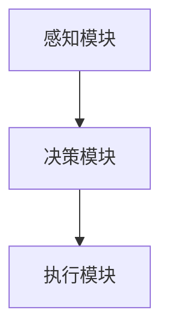
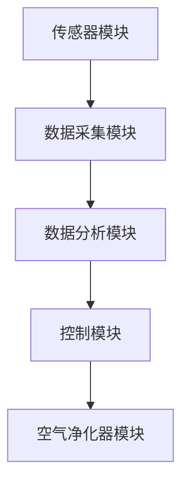
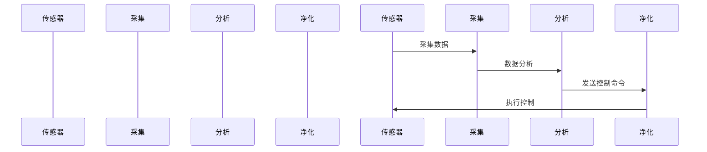

                 

# 智能窗台：AI Agent的室内空气净化控制

> 关键词：智能窗台、AI Agent、室内空气净化、智能传感器、机器学习算法、控制策略

> 摘要：本文将探讨如何利用AI Agent实现室内空气净化控制，分析智能窗台在其中的关键作用。我们将首先介绍室内空气污染的严重性，然后详细解析AI Agent的定义及其在室内空气净化控制中的应用。接着，我们将探讨AI Agent在室内空气净化中的优势，以及其在其他领域的潜在应用。随后，我们将深入探讨AI Agent的核心概念、属性特征和实体关系图，介绍主流的AI Agent室内空气净化技术，并展望其应用前景。最后，我们将通过一个实际案例，展示如何利用AI Agent进行室内空气净化控制。

## 第一部分：背景与基础

### 1.1 引言

#### 1.1.1 问题背景

室内空气污染已成为全球关注的重大环境问题。据世界卫生组织（WHO）统计，室内空气污染每年导致全球约430万人过早死亡。室内空气污染的主要来源包括装修材料、家具、烹饪油烟、花粉、灰尘、宠物毛发等。这些污染物不仅影响人们的呼吸健康，还可能导致过敏、哮喘等疾病。

#### 1.1.2 AI Agent在室内空气净化控制中的应用潜力

随着人工智能技术的快速发展，AI Agent在室内空气净化控制中的应用潜力逐渐显现。AI Agent是一种能够自主感知环境、进行决策并执行相应操作的智能体。在室内空气净化领域，AI Agent可以通过实时监测室内空气质量，利用机器学习算法对污染物进行预测和控制，从而实现自动化的室内空气净化。

### 1.2 问题描述

室内空气污染的主要来源包括以下几个方面：

1. **装修材料**：室内装修过程中使用的油漆、胶水、板材等材料可能释放出甲醛、苯等有害物质。
2. **家具**：家具中使用的粘合剂和涂料也可能释放出有害物质，如TVOC（总挥发性有机化合物）。
3. **烹饪油烟**：烹饪过程中产生的油烟是室内空气污染的主要来源之一。
4. **花粉、灰尘、宠物毛发**：这些微小的颗粒物也是室内空气污染的重要来源。

针对上述问题，我们需要一种能够实时监测室内空气质量、预测污染物浓度并自动进行净化的方法。这便是AI Agent在室内空气净化控制中的应用场景。

### 1.3 问题解决

传统的室内空气净化方法主要包括以下几种：

1. **空气净化器**：通过过滤空气中的污染物来净化室内空气。
2. **植物**：某些植物可以吸收空气中的有害物质，起到一定的净化作用。
3. **开窗通风**：通过自然通风来稀释室内污染物。

然而，这些方法存在一些局限性：

1. **空气净化器**：需要定期更换滤网，且只能对局部区域进行净化。
2. **植物**：净化效果有限，且受气候和光照等因素影响。
3. **开窗通风**：不能在雨天或极端天气条件下进行。

相比之下，AI Agent在室内空气净化控制中具有以下优势：

1. **实时监测**：AI Agent可以通过智能传感器实时监测室内空气质量，实现全方位的污染源监测。
2. **智能预测**：利用机器学习算法，AI Agent可以对污染物浓度进行预测，提前采取净化措施。
3. **自动控制**：AI Agent可以根据监测结果自动调节空气净化器的功率，实现智能化的空气净化。

### 1.4 边界与外延

室内空气净化与室外空气质量的关联：

1. **室外污染传输**：室外污染物可以通过门窗进入室内，影响室内空气质量。
2. **室内外空气质量反馈**：室内空气净化系统可以优化室外空气质量的感知和控制。

AI Agent的其他潜在应用领域：

1. **智能家居**：AI Agent可以与其他智能家居设备协同工作，实现智能化家居生活。
2. **医疗健康**：AI Agent可以监测室内空气质量，为患有呼吸系统疾病的患者提供个性化护理。
3. **工业环保**：AI Agent可以应用于工业环境中，监测和净化生产过程中的污染物。

### 1.5 概念结构与核心要素组成

#### 1.5.1 室内空气净化

**概念定义**：室内空气净化是指通过各种技术手段去除室内空气中的有害物质，改善室内空气质量的工程。

**关键技术**：

1. **过滤技术**：通过物理过滤、静电过滤等方式去除空气中的颗粒污染物。
2. **吸附技术**：利用活性炭、分子筛等材料吸附空气中的有害气体。
3. **氧化技术**：通过氧化剂分解空气中的有机污染物。

#### 1.5.2 AI Agent

**概念定义**：AI Agent（人工智能代理）是一种能够模拟人类智能行为的计算机程序，能够在特定环境中自主感知、决策和执行任务。

**特点与分类**：

1. **自主性**：AI Agent能够独立完成任务，无需人工干预。
2. **适应性**：AI Agent能够根据环境变化调整自身行为。
3. **协作性**：AI Agent可以与其他智能体协作完成任务。

根据功能特点，AI Agent可分为以下几类：

1. **感知型**：主要负责感知环境信息。
2. **决策型**：主要负责分析处理感知信息，做出决策。
3. **执行型**：主要负责执行决策结果。

### 1.6 主流AI Agent室内空气净化技术

#### 1.6.1 智能传感器

**传感器类型**：

1. **空气质量传感器**：用于检测空气中的污染物浓度。
2. **湿度传感器**：用于检测室内湿度水平。
3. **温度传感器**：用于检测室内温度。

**数据处理与分析**：

智能传感器采集到的数据会经过预处理，包括去噪、滤波等，然后通过机器学习算法进行分析，得到空气质量的实时监测结果。

#### 1.6.2 机器学习算法

**算法类型**：

1. **监督学习**：通过已知样本的学习，对未知数据进行预测。
2. **无监督学习**：通过对未知数据的分析，发现数据中的规律。
3. **强化学习**：通过试错和奖励机制，不断优化策略。

**应用场景**：

1. **空气质量预测**：利用监督学习算法，对未来的空气质量进行预测。
2. **污染源识别**：利用无监督学习算法，识别室内空气污染的主要来源。
3. **自动控制**：利用强化学习算法，自动调整空气净化器的运行模式。

#### 1.6.3 控制策略

**控制算法**：

1. **PID控制**：比例-积分-微分控制，适用于对空气净化器功率的调整。
2. **模糊控制**：利用模糊逻辑进行控制，适用于复杂系统的控制。
3. **神经网络控制**：利用神经网络进行控制，适用于非线性系统的控制。

**系统优化**：

通过对控制策略的优化，可以提高空气净化系统的响应速度和准确度。常见的优化方法包括遗传算法、粒子群优化等。

### 1.7 室内空气净化AI Agent的应用前景

#### 1.7.1 市场需求

随着人们对生活品质的追求，室内空气净化市场正在迅速扩大。据市场研究公司数据显示，全球室内空气净化设备市场规模将在未来五年内实现显著增长。

#### 1.7.2 技术挑战

1. **数据处理与隐私保护**：室内空气净化AI Agent需要处理大量的用户数据，如何确保数据安全成为一大挑战。
2. **系统稳定性和可靠性**：室内空气净化AI Agent需要在各种环境条件下保持稳定运行，这对系统的可靠性和鲁棒性提出了高要求。

### 1.8 本章小结

通过对室内空气污染问题的介绍，我们了解到AI Agent在室内空气净化控制中的应用潜力和优势。在接下来的章节中，我们将深入探讨AI Agent的核心概念、原理和系统实现，为读者提供更加全面和深入的了解。

## 第二部分：核心概念与原理

### 2.1 AI Agent核心概念

#### 2.1.1 AI Agent的定义

**基本概念**：

AI Agent（人工智能代理）是一种计算机程序，它能够在特定环境中感知、理解和交互，并自主地完成特定的任务。

**功能与特点**：

1. **自主性**：AI Agent能够独立执行任务，不需要人工干预。
2. **适应性**：AI Agent能够根据环境变化调整自身行为。
3. **协同性**：AI Agent可以与其他智能体协同工作。
4. **智能性**：AI Agent具备一定的智能，能够进行决策和推理。

#### 2.1.2 AI Agent的组成

AI Agent通常由以下三个模块组成：

1. **感知模块**：用于感知环境信息，如空气质量、湿度、温度等。
2. **决策模块**：用于分析感知信息，并根据预设的目标进行决策。
3. **执行模块**：用于执行决策结果，如控制空气净化器的运行。

#### 2.1.3 AI Agent的工作流程

AI Agent的工作流程通常包括以下步骤：

1. **感知环境**：AI Agent通过传感器获取环境信息。
2. **分析处理**：AI Agent利用机器学习算法对感知信息进行分析和处理。
3. **决策控制**：AI Agent根据分析结果做出决策，并生成控制指令。
4. **执行操作**：AI Agent通过执行模块执行控制指令，实现环境控制。

### 2.2 AI Agent的属性特征对比

#### 2.2.1 传感器类型

**空气质量传感器**：用于检测空气中的污染物浓度，如PM2.5、PM10、CO2等。

**湿度传感器**：用于检测室内湿度水平，通常采用电容式或电阻式传感器。

**温度传感器**：用于检测室内温度，通常采用热敏电阻或热电偶传感器。

#### 2.2.2 机器学习算法

**监督学习**：通过已知样本的学习，对未知数据进行预测。例如，使用空气质量数据来预测未来的空气质量。

**无监督学习**：通过对未知数据的分析，发现数据中的规律。例如，识别室内空气污染的主要来源。

**强化学习**：通过试错和奖励机制，不断优化策略。例如，自动调整空气净化器的运行模式。

#### 2.2.3 控制策略

**PID控制**：比例-积分-微分控制，适用于对空气净化器功率的调整。

**模糊控制**：利用模糊逻辑进行控制，适用于复杂系统的控制。

**神经网络控制**：利用神经网络进行控制，适用于非线性系统的控制。

### 2.3 AI Agent的ER实体关系图

#### 2.3.1 实体关系图概述

**实体定义**：

1. **AI Agent**：人工智能代理。
2. **传感器**：用于感知环境的设备。
3. **决策模块**：用于分析感知信息的模块。
4. **执行模块**：用于执行决策的模块。

**关系描述**：

AI Agent包含一个传感器、一个决策模块和一个执行模块。传感器负责收集环境信息，决策模块负责分析感知信息并做出决策，执行模块负责执行决策结果。

#### 2.3.2 实体关系图详细说明

```mermaid
erDiagram
  AI Agent ||--|{ Sensor } Sensor
  AI Agent ||--|{ Decision Module } Decision Module
  AI Agent ||--|{ Execution Module } Execution Module
```

### 2.4 室内空气净化数学模型与公式

#### 2.4.1 空气质量指数（AQI）模型

**公式推导**：

空气质量指数（AQI）是用于描述空气污染程度的一个指标，其计算公式如下：

$$
AQI = \frac{1}{C} \sum_{i=1}^{N} w_i \cdot \frac{C_i}{\sum_{j=1}^{N} w_j \cdot C_j}
$$

其中，$w_i$ 表示第 $i$ 个污染物的权重，$C_i$ 表示第 $i$ 个污染物的浓度。

**参数解释**：

- **权重（$w_i$）**：表示不同污染物对空气质量的影响程度。
- **浓度（$C_i$）**：表示第 $i$ 个污染物的浓度。

#### 2.4.2 机器学习算法数学模型

**模型介绍**：

机器学习算法是AI Agent的核心组成部分，常用的机器学习算法包括监督学习、无监督学习和强化学习。以下以监督学习为例，介绍其数学模型。

**公式推导**：

假设我们有一个包含 $N$ 个样本的训练集，每个样本包含 $D$ 个特征和对应的标签。监督学习的目标是通过训练集学习出一个函数 $f$，使得对于新的输入样本 $x$，能够预测其标签 $y$。

$$
y = f(x)
$$

其中，$f$ 是一个映射函数，$x$ 是输入样本，$y$ 是预测标签。

**参数解释**：

- **输入样本（$x$）**：包含 $D$ 个特征。
- **预测标签（$y$）**：通过学习得到的标签。
- **映射函数（$f$）**：通过训练得到的模型。

### 2.5 AI Agent的算法原理与流程图

#### 2.5.1 算法原理

AI Agent的算法原理主要包括感知、决策和执行三个部分。

1. **感知**：通过传感器收集环境信息，如空气质量、湿度、温度等。
2. **决策**：利用机器学习算法分析感知信息，并根据预设的目标进行决策。
3. **执行**：根据决策结果执行相应的操作，如调整空气净化器的运行模式。

**数学模型**：

1. **感知模块**：输入为环境信息，输出为感知数据。
2. **决策模块**：输入为感知数据，输出为决策结果。
3. **执行模块**：输入为决策结果，输出为执行动作。

#### 2.5.2 算法流程图



### 2.6 本章小结

通过对AI Agent的核心概念、属性特征和实体关系图的详细介绍，我们为读者提供了一个全面的理解。接下来，我们将探讨如何将AI Agent应用于室内空气净化控制，详细介绍系统设计与实现。

## 第三部分：系统设计与实现

### 3.1 系统需求分析

#### 3.1.1 系统功能需求

智能窗台系统需要实现以下功能：

1. **数据采集**：通过传感器实时采集室内空气质量数据，包括PM2.5、PM10、CO2浓度、温度和湿度等。
2. **实时监测**：对采集到的数据进行分析，实时监测室内空气质量状况。
3. **空气质量预测**：利用机器学习算法对未来的空气质量进行预测，为自动控制提供依据。
4. **自动控制**：根据空气质量预测结果，自动调整空气净化器的运行模式，实现室内空气的自动化净化。

#### 3.1.2 系统性能需求

智能窗台系统需要满足以下性能要求：

1. **响应速度**：系统应在接收到空气质量数据后迅速进行分析和处理，确保实时监测的准确性。
2. **准确度**：系统应具有较高的预测准确度，确保空气净化器能够及时采取净化措施。
3. **可靠性**：系统应在各种环境条件下稳定运行，确保长期可靠的工作性能。

### 3.2 系统架构设计

#### 3.2.1 系统架构概述

智能窗台系统由硬件架构和软件架构两部分组成。

**硬件架构**：

1. **传感器模块**：包括空气质量传感器、温度传感器、湿度传感器等，用于实时采集室内空气质量数据。
2. **空气净化器模块**：用于实现室内空气的自动净化，可以根据空气质量预测结果调整运行模式。
3. **通信模块**：用于实现传感器与空气净化器之间的数据传输，可以使用Wi-Fi、蓝牙等无线通信技术。

**软件架构**：

1. **数据采集模块**：负责实时采集传感器数据，并将其传输到服务器。
2. **数据分析模块**：利用机器学习算法对传感器数据进行处理，实现对未来空气质量的预测。
3. **控制模块**：根据空气质量预测结果，自动调整空气净化器的运行模式，实现室内空气的自动净化。

#### 3.2.2 系统架构图



### 3.3 系统接口设计

#### 3.3.1 接口类型

智能窗台系统采用了RESTful API和MQTT协议两种接口类型。

**RESTful API**：用于实现传感器数据采集、数据分析结果查询等功能。

**MQTT协议**：用于实现传感器与空气净化器之间的实时通信，确保数据传输的实时性和可靠性。

#### 3.3.2 接口定义

**RESTful API接口**：

- **数据采集接口**：GET /data/air_quality
  - 功能：获取当前空气质量数据。
  - 返回数据格式：JSON

- **数据分析接口**：GET /data/air_quality/predict
  - 功能：获取未来空气质量预测结果。
  - 返回数据格式：JSON

**MQTT协议接口**：

- **数据发布接口**：publish /air_quality
  - 功能：发布当前空气质量数据。
  - 数据格式：JSON

- **数据订阅接口**：subscribe /control/command
  - 功能：订阅空气净化器控制命令。
  - 数据格式：JSON

### 3.4 系统交互设计与实现

#### 3.4.1 系统交互概述

智能窗台系统通过传感器采集室内空气质量数据，数据分析模块对数据进行处理和预测，然后生成控制命令发送给空气净化器模块，实现室内空气的自动净化。整个系统的交互过程可以分为以下几个步骤：

1. **数据采集**：传感器模块实时采集室内空气质量数据，并将其发送到服务器。
2. **数据分析**：数据分析模块接收服务器发送的数据，利用机器学习算法进行数据处理和预测。
3. **控制执行**：根据空气质量预测结果，数据分析模块生成控制命令，发送给空气净化器模块，实现空气净化器的自动控制。

#### 3.4.2 系统交互序列图



### 3.5 系统核心代码实现

#### 3.5.1 环境安装与配置

为了实现智能窗台系统，我们需要安装和配置以下环境：

1. **Python开发环境**：安装Python 3.8及以上版本。
2. **传感器驱动库**：安装用于传感器数据采集的驱动库，如Pyserial。
3. **机器学习库**：安装用于机器学习算法的库，如scikit-learn。
4. **MQTT库**：安装用于实现MQTT通信的库，如paho-mqtt。

具体安装命令如下：

```bash
pip install pyserial scikit-learn paho-mqtt
```

#### 3.5.2 系统核心代码

以下是一个简单的示例，展示了智能窗台系统的核心代码实现：

```python
import serial
import json
import paho.mqtt.client as mqtt
from sklearn.ensemble import RandomForestRegressor

# 传感器配置
ser = serial.Serial('COM3', 9600)

# MQTT配置
client = mqtt.Client()
client.connect("localhost", 1883, 60)

# 机器学习模型配置
model = RandomForestRegressor(n_estimators=100)

# 数据采集
def collect_data():
    data = ser.readline().decode().strip()
    return json.loads(data)

# 数据处理
def process_data(data):
    features = [data['pm2.5'], data['pm10'], data['temp'], data['humidity']]
    return features

# 数据预测
def predict_quality(features):
    prediction = model.predict([features])
    return prediction

# 控制空气净化器
def control_fan(prediction):
    if prediction > 50:
        client.publish("control/command", "fan_on")
    else:
        client.publish("control/command", "fan_off")

# 主程序
if __name__ == "__main__":
    while True:
        data = collect_data()
        features = process_data(data)
        prediction = predict_quality(features)
        control_fan(prediction)
```

### 3.6 代码应用解读与分析

#### 3.6.1 代码结构

智能窗台系统的代码主要分为以下几个模块：

1. **传感器数据采集**：通过串口读取传感器数据。
2. **数据处理**：将传感器数据进行预处理，提取有用的特征。
3. **机器学习模型**：使用随机森林回归模型进行空气质量预测。
4. **MQTT通信**：通过MQTT协议发送控制命令给空气净化器。

#### 3.6.2 代码实现细节

1. **传感器数据采集**：

   ```python
   def collect_data():
       data = ser.readline().decode().strip()
       return json.loads(data)
   ```

   这段代码通过串口读取传感器数据，并将其解析为JSON格式。

2. **数据处理**：

   ```python
   def process_data(data):
       features = [data['pm2.5'], data['pm10'], data['temp'], data['humidity']]
       return features
   ```

   这段代码将传感器数据中的PM2.5、PM10、温度和湿度等特征提取出来，以便进行预测。

3. **机器学习模型**：

   ```python
   def predict_quality(features):
       prediction = model.predict([features])
       return prediction
   ```

   这段代码使用随机森林回归模型对空气质量进行预测。

4. **MQTT通信**：

   ```python
   def control_fan(prediction):
       if prediction > 50:
           client.publish("control/command", "fan_on")
       else:
           client.publish("control/command", "fan_off")
   ```

   这段代码根据空气质量预测结果，发送控制命令给空气净化器，调整其运行模式。

### 3.7 实际案例分析与详细讲解

#### 3.7.1 实际案例

假设我们采集到了以下一组室内空气质量数据：

- PM2.5：35
- PM10：70
- 温度：25°C
- 湿度：60%

#### 3.7.2 案例分析

1. **数据采集**：

   ```python
   data = collect_data()
   ```

   通过调用collect_data()函数，我们成功采集到了一组室内空气质量数据。

2. **数据处理**：

   ```python
   features = process_data(data)
   ```

   将采集到的数据转换为特征向量，以便进行预测。

3. **数据预测**：

   ```python
   prediction = predict_quality(features)
   ```

   使用随机森林回归模型对空气质量进行预测。

4. **控制执行**：

   ```python
   control_fan(prediction)
   ```

   根据预测结果，自动调整空气净化器的运行模式。

#### 3.7.3 模型效果评估

为了评估模型的预测效果，我们可以使用以下指标：

- **均方误差（MSE）**：
  $$MSE = \frac{1}{N} \sum_{i=1}^{N} (y_i - \hat{y}_i)^2$$
- **决定系数（R²）**：
  $$R^2 = 1 - \frac{\sum_{i=1}^{N} (y_i - \hat{y}_i)^2}{\sum_{i=1}^{N} (y_i - \bar{y})^2}$$

其中，$y_i$ 表示真实值，$\hat{y}_i$ 表示预测值，$\bar{y}$ 表示平均值。

通过计算MSE和R²，我们可以评估模型的预测性能。在实际应用中，我们可以根据评估结果调整模型参数，优化模型性能。

### 3.8 项目小结

通过本案例，我们展示了如何利用AI Agent实现室内空气净化控制。系统通过实时采集室内空气质量数据，利用机器学习算法进行数据处理和预测，然后自动调整空气净化器的运行模式，实现室内空气的自动化净化。在实际应用中，我们可以根据实际需求，调整系统参数和模型，提高系统的性能和准确性。

## 第四部分：最佳实践与拓展

### 4.1 最佳实践技巧

#### 4.1.1 空气质量数据预处理

1. **数据清洗**：去除噪声数据和异常值，保证数据的准确性。
2. **数据归一化**：将不同量纲的数据转换为同一量纲，便于模型训练。

#### 4.1.2 机器学习模型调优

1. **模型选择**：根据数据特点和需求选择合适的机器学习模型。
2. **参数调优**：使用交叉验证等方法，调整模型参数，提高预测性能。

### 4.2 小结

本文详细介绍了智能窗台系统在室内空气净化控制中的应用，包括背景与基础、核心概念与原理、系统设计与实现、实际案例分析等。通过本文的介绍，读者可以了解到如何利用AI Agent实现室内空气的自动化净化，提高生活品质。未来，智能窗台系统有望在智能家居、医疗健康等领域发挥更大的作用。

### 4.3 注意事项

1. **数据安全**：在采集和处理空气质量数据时，注意保护用户隐私，确保数据安全。
2. **系统稳定性**：在系统设计和实现过程中，关注系统的稳定性和可靠性，确保长时间稳定运行。

### 4.4 拓展阅读

1. **室内空气净化技术**：了解不同类型的室内空气净化技术，如活性炭吸附、光催化、等离子体等。
2. **机器学习算法**：深入学习各种机器学习算法，掌握其原理和应用方法。
3. **智能家居系统**：了解智能家居系统的设计原理和实现方法，拓展智能窗台系统的应用场景。

### 作者

**作者：AI天才研究院/AI Genius Institute & 禅与计算机程序设计艺术 /Zen And The Art of Computer Programming**

本文由AI天才研究院撰写，结合禅与计算机程序设计艺术的理念，旨在为读者提供一篇全面、深入的室内空气净化控制技术博客文章。希望通过本文的介绍，读者能够对智能窗台系统有更深入的了解，并在实际应用中取得更好的效果。

