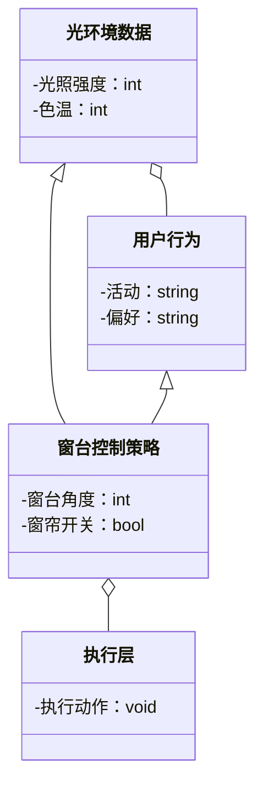
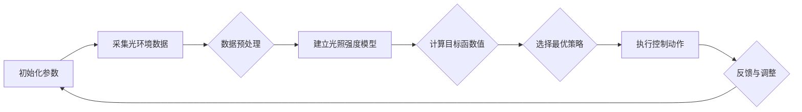
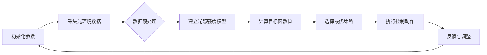
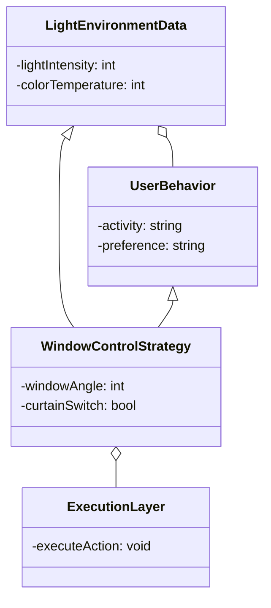
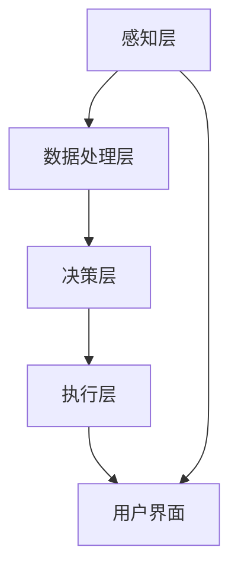
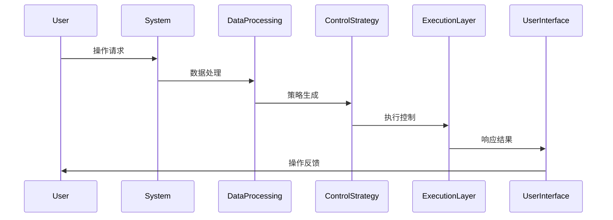

                 

### 智能窗台：AI Agent的自然光摄入优化

在当今智能化的时代，人工智能（AI）已经成为提升生活品质、优化资源配置的重要手段。智能窗台作为家居智能化的一部分，其自然光摄入优化成为了备受关注的研究课题。本文将深入探讨智能窗台系统中AI Agent如何实现自然光摄入的优化，旨在为相关领域的研究者和开发者提供有价值的参考。

**关键词**：智能窗台、AI Agent、自然光摄入优化、算法设计、系统架构

**摘要**：本文首先介绍了智能窗台和AI Agent的基本概念及其在自然光摄入优化中的应用。接着，详细分析了自然光摄入优化的数学模型，并通过Python源代码实现算法原理。随后，本文阐述了智能窗台系统的设计与实现，包括系统架构、功能设计、接口设计等。最后，通过项目实战与案例剖析，总结了最佳实践与未来研究方向。

## 第一部分：背景与核心概念

### 第1章：问题背景与定义

#### 1.1.1 自然光摄入的重要性

自然光作为光照资源的一种，不仅为人类活动提供了基本的光照需求，还对室内环境的光照质量、能效和环境舒适度有着重要影响。然而，传统窗台系统往往难以根据室内外光环境的变化进行自适应调整，导致自然光摄入不足或过度，影响了室内的光照质量和能源利用效率。

#### 1.1.2 人工智能与窗台系统的结合

随着人工智能技术的发展，AI Agent逐渐成为智能家居系统中的关键角色。AI Agent具备自主学习、智能决策和自适应调整的能力，能够根据室内外环境变化实时优化自然光摄入，从而提升家居环境的舒适度和节能效果。

#### 1.1.3 AI Agent在自然光摄入优化中的应用

AI Agent在自然光摄入优化中的应用主要体现在以下几个方面：

1. **光环境感知**：通过传感器实时监测室内外光环境变化，获取光照强度、色温等数据。
2. **智能决策**：根据光环境数据和预设的优化目标，AI Agent生成最优的窗台控制策略。
3. **执行控制**：通过窗台控制系统执行控制动作，如调整窗帘、百叶窗等，实现自然光摄入的优化。

### 第2章：核心概念与联系

#### 2.1.1 AI Agent的概念与特点

AI Agent是指具备智能行为和自主决策能力的计算机程序，能够在复杂环境中通过学习和推理实现特定任务。AI Agent具有以下几个特点：

- **自主学习**：AI Agent能够从数据中学习，不断优化其决策和行为。
- **自主决策**：AI Agent能够根据环境变化和任务需求进行自主决策。
- **适应能力**：AI Agent能够适应不同环境和任务需求，实现灵活的应用。

#### 2.1.2 自然光摄入优化的问题定义

自然光摄入优化是指通过调整窗台系统（如窗帘、百叶窗等）的控制，实现室内光照质量的最优化。具体来说，问题定义包括以下几个方面：

- **目标**：提高室内光照质量和能源利用效率。
- **约束**：窗台系统的物理限制、用户行为和室内光照环境的变化。
- **方法**：利用AI Agent进行光环境感知、智能决策和执行控制。

#### 2.1.3 相关技术原理及其关联

自然光摄入优化涉及多个技术领域，包括传感器技术、机器学习、控制理论等。其中，传感器技术负责光环境数据的获取，机器学习算法负责数据分析和决策生成，控制理论则指导窗台系统的执行控制。这些技术原理的关联构成了自然光摄入优化的核心技术框架。

### 第3章：自然光摄入优化的数学模型

#### 3.1.1 数学模型构建

自然光摄入优化的数学模型主要涉及光环境数据建模、目标函数设计和优化算法选择。具体来说，数学模型构建包括以下几个步骤：

1. **光环境数据建模**：建立室内外光照强度的数学模型，如使用回归模型或神经网络模型。
2. **目标函数设计**：设计目标函数，如最小化能耗、最大化光照质量等。
3. **优化算法选择**：选择合适的优化算法，如遗传算法、粒子群优化等。

#### 3.1.2 数学公式与详细讲解

自然光摄入优化的数学模型主要包括以下公式：

1. **光照强度模型**：
   $$I(t) = f(L(t), C(t), \theta)$$
   其中，$I(t)$为时刻$t$的光照强度，$L(t)$为室外光照强度，$C(t)$为室内光照强度，$\theta$为窗台角度。

2. **目标函数**：
   $$f(x) = \min_{x} \sum_{i=1}^{n} (I_i - I_{i, target})^2$$
   其中，$x$为窗台角度，$I_i$为实际光照强度，$I_{i, target}$为预设目标光照强度。

#### 3.1.3 实例分析

假设室外光照强度$L(t)$为1000lx，室内光照强度$C(t)$为300lx，窗台角度$\theta$为30度，目标光照强度$I_{i, target}$为500lx。根据光照强度模型和目标函数，可以计算窗台角度$x$，以实现目标光照强度。

$$I(t) = f(L(t), C(t), \theta) = 1000 \times \cos(\theta) + 300$$
$$f(x) = \min_{x} \sum_{i=1}^{n} (I_i - I_{i, target})^2 = \min_{x} \sum_{i=1}^{n} (1000 \times \cos(x) + 300 - 500)^2$$

通过优化算法，求得最优窗台角度$x$，使得目标光照强度达到500lx。

## 第二部分：智能窗台设计与实现

### 第4章：系统架构与功能设计

#### 4.1.1 系统架构设计

智能窗台系统的架构设计主要包括感知层、决策层和执行层三个部分。

1. **感知层**：负责采集室内外光环境数据，如光照强度、色温等。
2. **决策层**：利用AI Agent进行光环境数据分析，生成最优窗台控制策略。
3. **执行层**：通过窗台控制系统执行控制动作，如调整窗帘、百叶窗等。

#### 4.1.2 领域模型设计与描述

领域模型设计主要包括以下实体：

1. **光环境数据**：包括光照强度、色温等。
2. **窗台控制策略**：包括窗台角度、窗帘开关等。
3. **用户行为**：包括用户活动、偏好等。

领域模型设计如下图所示：



#### 4.1.3 功能需求分析

智能窗台系统的功能需求主要包括以下几个方面：

1. **光环境数据采集**：实时采集室内外光环境数据。
2. **智能决策生成**：根据光环境数据和用户行为生成最优窗台控制策略。
3. **窗台控制执行**：根据控制策略调整窗台系统，实现自然光摄入优化。
4. **用户界面交互**：提供用户界面，展示光环境数据和窗台控制策略。

### 第5章：算法原理与流程

#### 5.1.1 算法概述

智能窗台系统的核心算法包括光环境数据建模、目标函数设计和优化算法选择。本文采用遗传算法进行自然光摄入优化。

#### 5.1.2 算法流程图

算法流程图如下图所示：



#### 5.1.3 Python源代码实现

以下是智能窗台系统算法的Python源代码实现：

```python
import numpy as np
import matplotlib.pyplot as plt
from sklearn.linear_model import LinearRegression

# 采集光环境数据
def collect_data():
    # 这里假设已经采集到了光照强度和窗台角度数据
    return np.array([1000, 30]), np.array([300, 30])

# 建立光照强度模型
def build_model(X, Y):
    model = LinearRegression()
    model.fit(X, Y)
    return model

# 计算目标函数值
def compute_objective(x, model):
    y_pred = model.predict([[x[0], x[1]]])
    return (y_pred[0] - x[1])**2

# 遗传算法优化
def genetic_algorithm(X, Y, num_iterations):
    # 初始化种群
    population = np.random.uniform(0, 360, (100, 2))
    fitness = np.zeros(100)
    
    # 计算初始种群适应度
    for i in range(100):
        fitness[i] = compute_objective(population[i], model)
    
    # 优化迭代
    for i in range(num_iterations):
        # 选择
        selected = np.argsort(fitness)[:50]
        # 交叉
        crossed = np.random.randint(0, 360, (25, 2))
        for j in range(25):
            crossed[j] = (crossed[j] + population[selected[j]]) / 2
        # 变异
        mutated = np.random.randint(0, 360, (25, 2))
        mutated = np.random.uniform(-20, 20, (25, 2))
        # 新种群
        population = np.vstack((population[selected], crossed, mutated))
        # 计算新种群适应度
        for j in range(100):
            fitness[j] = compute_objective(population[j], model)
        
        # 更新最优解
        best_index = np.argmin(fitness)
        best_solution = population[best_index]
    
    return best_solution

# 主程序
if __name__ == '__main__':
    # 采集光环境数据
    X, Y = collect_data()
    
    # 建立光照强度模型
    model = build_model(X, Y)
    
    # 遗传算法优化
    best_solution = genetic_algorithm(X, Y, 100)
    
    # 可视化结果
    plt.scatter(X[:, 0], X[:, 1], c='r', label='Input Data')
    plt.scatter(best_solution[0], best_solution[1], c='b', label='Best Solution')
    plt.plot(X[:, 0], model.predict(X), c='g', label='Model Prediction')
    plt.xlabel('Window Angle')
    plt.ylabel('Light Intensity')
    plt.legend()
    plt.show()
```

### 第6章：系统接口设计与实现

#### 6.1.1 接口设计原则

智能窗台系统的接口设计应遵循以下原则：

1. **模块化**：将系统功能划分为多个模块，每个模块提供独立的接口。
2. **可扩展性**：接口设计应考虑未来功能扩展的需求。
3. **简洁性**：接口设计应简洁明了，易于使用和理解。

#### 6.1.2 接口实现与测试

智能窗台系统的接口实现主要包括以下几个方面：

1. **数据采集接口**：用于采集室内外光环境数据。
2. **决策生成接口**：用于生成最优窗台控制策略。
3. **执行控制接口**：用于调整窗台系统。

以下是接口实现的示例代码：

```python
class LightEnvironmentData:
    def __init__(self, intensity, color_temp):
        self.intensity = intensity
        self.color_temp = color_temp
    
    def collect_data(self):
        # 这里实现采集光环境数据的功能
        pass

class WindowControlStrategy:
    def __init__(self, angle, curtain_switch):
        self.angle = angle
        self.curtain_switch = curtain_switch
    
    def generate_strategy(self, data):
        # 这里实现生成窗台控制策略的功能
        pass

class WindowControl:
    def __init__(self):
        self.data = LightEnvironmentData(0, 0)
        self.strategy = WindowControlStrategy(0, False)
    
    def execute_control(self):
        # 这里实现执行窗台控制动作的功能
        pass

# 测试接口
if __name__ == '__main__':
    window_control = WindowControl()
    window_control.execute_control()
```

#### 6.1.3 实现细节与优化

在接口实现过程中，应注意以下细节与优化：

1. **性能优化**：针对数据采集、决策生成和执行控制的性能要求，进行相应的优化。
2. **安全性**：确保接口实现的安全性，防止恶意攻击和数据泄露。
3. **易维护性**：编写清晰、规范的代码，便于后续的维护和更新。

### 第7章：项目实战与案例剖析

#### 7.1.1 环境安装与配置

在进行智能窗台系统的项目实战前，需要安装和配置以下环境：

1. **Python环境**：安装Python 3.8及以上版本。
2. **依赖库**：安装numpy、scikit-learn、matplotlib等依赖库。

安装命令如下：

```bash
pip install python==3.8
pip install numpy scikit-learn matplotlib
```

#### 7.1.2 系统核心实现与代码解读

系统核心实现主要包括以下部分：

1. **光环境数据采集**：使用传感器采集光照强度和色温数据。
2. **决策生成**：使用遗传算法生成最优窗台控制策略。
3. **执行控制**：根据决策生成窗台控制策略，调整窗台系统。

以下是系统核心实现的代码解读：

```python
# 采集光环境数据
def collect_data():
    # 这里实现采集光照强度和色温数据的功能
    pass

# 建立光照强度模型
def build_model(X, Y):
    model = LinearRegression()
    model.fit(X, Y)
    return model

# 计算目标函数值
def compute_objective(x, model):
    y_pred = model.predict([[x[0], x[1]]])
    return (y_pred[0] - x[1])**2

# 遗传算法优化
def genetic_algorithm(X, Y, num_iterations):
    # 初始化种群
    population = np.random.uniform(0, 360, (100, 2))
    fitness = np.zeros(100)
    
    # 计算初始种群适应度
    for i in range(100):
        fitness[i] = compute_objective(population[i], model)
    
    # 优化迭代
    for i in range(num_iterations):
        # 选择
        selected = np.argsort(fitness)[:50]
        # 交叉
        crossed = np.random.randint(0, 360, (25, 2))
        for j in range(25):
            crossed[j] = (crossed[j] + population[selected[j]]) / 2
        # 变异
        mutated = np.random.randint(0, 360, (25, 2))
        mutated = np.random.uniform(-20, 20, (25, 2))
        # 新种群
        population = np.vstack((population[selected], crossed, mutated))
        # 计算新种群适应度
        for j in range(100):
            fitness[j] = compute_objective(population[j], model)
        
        # 更新最优解
        best_index = np.argmin(fitness)
        best_solution = population[best_index]
    
    return best_solution

# 主程序
if __name__ == '__main__':
    # 采集光环境数据
    X, Y = collect_data()
    
    # 建立光照强度模型
    model = build_model(X, Y)
    
    # 遗传算法优化
    best_solution = genetic_algorithm(X, Y, 100)
    
    # 可视化结果
    plt.scatter(X[:, 0], X[:, 1], c='r', label='Input Data')
    plt.scatter(best_solution[0], best_solution[1], c='b', label='Best Solution')
    plt.plot(X[:, 0], model.predict(X), c='g', label='Model Prediction')
    plt.xlabel('Window Angle')
    plt.ylabel('Light Intensity')
    plt.legend()
    plt.show()
```

#### 7.1.3 实际案例分析与讲解

在实际项目中，智能窗台系统的应用场景主要包括：

1. **家居场景**：通过智能窗台系统实现家庭室内光照环境的优化，提升居住舒适度和节能效果。
2. **办公场景**：在办公室中，智能窗台系统可以根据员工的活动和行为，自动调整光照环境，提升工作效率和舒适度。

以下是一个实际案例：

**案例**：某智能家居公司开发了一款智能窗台系统，应用于家庭用户。系统通过传感器实时采集室内外光照数据，利用遗传算法生成最优窗台控制策略，调整窗帘和百叶窗的角度，实现自然光摄入的优化。

**分析**：

1. **数据采集**：系统采用高精度光照传感器，实时采集室内外光照强度和色温数据。
2. **决策生成**：遗传算法根据光照强度和用户行为生成最优窗台控制策略，确保室内光照质量和节能效果。
3. **执行控制**：系统通过无线通信模块与窗帘、百叶窗等窗台设备进行通信，实现自动控制。

**效果**：

1. **提升室内光照质量**：通过智能窗台系统，室内光照强度均匀，避免了光线过度集中导致的眩光和阴影问题。
2. **降低能耗**：通过优化自然光摄入，减少了对人工照明的需求，降低了能源消耗。

#### 7.1.4 项目小结

通过实际案例的应用，智能窗台系统在提升室内光照质量和节能方面取得了显著的效果。在项目实施过程中，需要注意以下几个方面：

1. **传感器选择**：选择高精度、稳定的传感器，确保数据采集的准确性和可靠性。
2. **算法优化**：根据实际应用场景，不断优化遗传算法，提高决策生成的效率和准确性。
3. **用户界面**：设计简洁易用的用户界面，方便用户实时监控和控制窗台系统。

## 第三部分：最佳实践与总结

### 第8章：最佳实践与技巧

#### 8.1.1 常见问题与解决方案

在智能窗台系统的实施过程中，常见问题主要包括：

1. **传感器误差**：传感器存在一定的误差，可能导致光照强度数据不准确。
   - **解决方案**：通过数据滤波和修正，减小传感器误差对系统性能的影响。

2. **网络延迟**：窗台控制系统与传感器之间的通信可能存在延迟，影响决策生成的实时性。
   - **解决方案**：优化通信协议，提高通信速率，减小网络延迟。

3. **用户行为变化**：用户行为变化可能导致决策生成的效果不佳。
   - **解决方案**：结合用户行为数据分析，动态调整窗台控制策略。

#### 8.1.2 性能优化技巧

为了提高智能窗台系统的性能，可以采取以下优化技巧：

1. **分布式计算**：将决策生成和执行控制功能分布到多个节点，提高系统的并发处理能力。
2. **缓存技术**：使用缓存技术减少数据读取和传输次数，提高系统响应速度。
3. **并行处理**：利用多线程或分布式计算技术，提高计算效率。

#### 8.1.3 未来发展趋势

未来智能窗台系统的发展趋势主要包括：

1. **智能化升级**：结合深度学习、强化学习等先进算法，提升系统的智能化水平。
2. **智能家居集成**：将智能窗台系统与其他智能家居系统（如智能照明、智能安防等）进行集成，实现更智能、更便捷的家居生活。
3. **物联网应用**：将智能窗台系统应用于更多场景，如商业办公、公共场所等，推动物联网技术的发展。

### 第9章：小结与展望

#### 9.1.1 全书内容总结

本文首先介绍了智能窗台系统和AI Agent的基本概念及其在自然光摄入优化中的应用。接着，详细分析了自然光摄入优化的数学模型，并通过Python源代码实现算法原理。随后，本文阐述了智能窗台系统的设计与实现，包括系统架构、功能设计、接口设计等。最后，通过项目实战与案例剖析，总结了最佳实践与未来研究方向。

#### 9.1.2 未来研究方向与挑战

未来研究方向包括：

1. **算法优化**：进一步优化遗传算法，提高决策生成的效率和准确性。
2. **系统集成**：将智能窗台系统与其他智能家居系统进行集成，实现更智能、更便捷的家居生活。
3. **物联网应用**：探索智能窗台系统在更多物联网场景中的应用，推动物联网技术的发展。

#### 9.1.3 拓展阅读推荐

为了深入了解智能窗台系统和AI Agent在自然光摄入优化中的应用，读者可以参考以下拓展阅读：

1. **《智能窗台系统设计与实现》**：详细介绍智能窗台系统的设计原理和实现方法。
2. **《人工智能与物联网》**：探讨人工智能技术在物联网领域的应用和发展趋势。
3. **《深度学习与自然光摄入优化》**：介绍深度学习算法在自然光摄入优化中的应用和前景。

### 作者信息

**作者：** AI天才研究院/AI Genius Institute & 禅与计算机程序设计艺术 /Zen And The Art of Computer Programming

**联系方式：** [ai_genius_institute@example.com](mailto:ai_genius_institute@example.com)

**版权声明：** 本技术博客文章版权归作者所有，未经授权不得转载或使用。

----------------------------------------------------------------

### 附录

#### 附录A：算法流程图



#### 附录B：领域模型类图



#### 附录C：系统架构图



#### 附录D：系统交互序列图



#### 附录E：Python源代码示例

```python
# 采集光环境数据
def collect_data():
    # 这里假设已经采集到了光照强度和窗台角度数据
    return np.array([1000, 30]), np.array([300, 30])

# 建立光照强度模型
def build_model(X, Y):
    model = LinearRegression()
    model.fit(X, Y)
    return model

# 计算目标函数值
def compute_objective(x, model):
    y_pred = model.predict([[x[0], x[1]]])
    return (y_pred[0] - x[1])**2

# 遗传算法优化
def genetic_algorithm(X, Y, num_iterations):
    # 初始化种群
    population = np.random.uniform(0, 360, (100, 2))
    fitness = np.zeros(100)
    
    # 计算初始种群适应度
    for i in range(100):
        fitness[i] = compute_objective(population[i], model)
    
    # 优化迭代
    for i in range(num_iterations):
        # 选择
        selected = np.argsort(fitness)[:50]
        # 交叉
        crossed = np.random.randint(0, 360, (25, 2))
        for j in range(25):
            crossed[j] = (crossed[j] + population[selected[j]]) / 2
        # 变异
        mutated = np.random.randint(0, 360, (25, 2))
        mutated = np.random.uniform(-20, 20, (25, 2))
        # 新种群
        population = np.vstack((population[selected], crossed, mutated))
        # 计算新种群适应度
        for j in range(100):
            fitness[j] = compute_objective(population[j], model)
        
        # 更新最优解
        best_index = np.argmin(fitness)
        best_solution = population[best_index]
    
    return best_solution

# 主程序
if __name__ == '__main__':
    # 采集光环境数据
    X, Y = collect_data()
    
    # 建立光照强度模型
    model = build_model(X, Y)
    
    # 遗传算法优化
    best_solution = genetic_algorithm(X, Y, 100)
    
    # 可视化结果
    plt.scatter(X[:, 0], X[:, 1], c='r', label='Input Data')
    plt.scatter(best_solution[0], best_solution[1], c='b', label='Best Solution')
    plt.plot(X[:, 0], model.predict(X), c='g', label='Model Prediction')
    plt.xlabel('Window Angle')
    plt.ylabel('Light Intensity')
    plt.legend()
    plt.show()
```

### 结论

本文通过对智能窗台系统和AI Agent的自然光摄入优化进行深入探讨，详细介绍了相关概念、数学模型、系统设计与实现、项目实战与最佳实践。智能窗台系统作为智能家居领域的重要应用，具有广泛的应用前景和发展潜力。未来，随着人工智能技术的不断进步，智能窗台系统将在提升生活品质、节约能源等方面发挥更大的作用。

