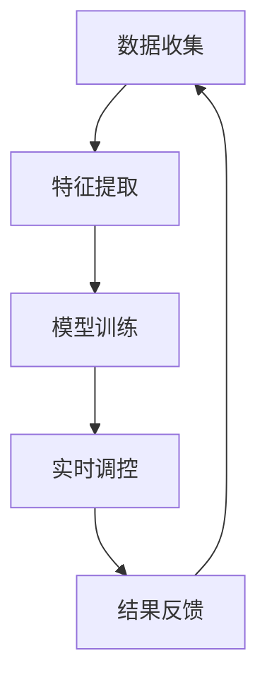
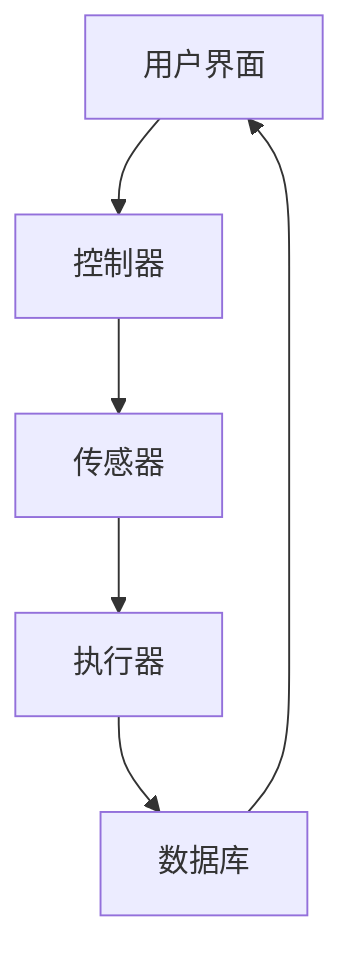
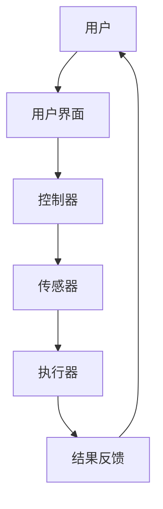

                 

### 第一部分：智能窗帘与AI光控基础

#### 第1章：智能窗帘的背景与市场需求

##### 1.1 智能窗帘的概念与历史演变

**智能窗帘**是一种结合了电子技术与机械控制的窗帘系统，可以通过远程控制或者智能系统自动调节，以达到优化室内光线和节能的目的。智能窗帘的起源可以追溯到20世纪末，随着智能家居和物联网技术的发展，智能窗帘逐渐成为一个独立且重要的产品类别。

**定义：** 智能窗帘是通过物联网技术连接到智能家居系统，能够根据室内外光线变化、温度、湿度等环境因素自动调节开合的窗帘系统。

**历史演变：**
- **早期阶段：** 主要依靠机械装置，手动控制窗帘的开合。
- **发展阶段：** 20世纪末，随着微控制器和传感器技术的发展，窗帘开始具备基本智能控制功能。
- **成熟阶段：** 进入21世纪，物联网技术和人工智能技术的应用，使得智能窗帘具备更加智能化的调节功能。

**市场需求分析：**
- **家居舒适度：** 智能窗帘能够根据室内光线自动调节，提高居住的舒适度。
- **节能需求：** 通过自动调节窗帘，可以减少空调、照明等能源消耗，符合节能环保的趋势。
- **智能家居：** 随着智能家居的普及，智能窗帘成为智能家居系统的重要组成部分。

##### 1.2 智能家居的发展趋势

**智能家居**是指利用先进的计算机技术、网络通信技术和智能控制技术，将家庭设备通过网络连接起来，实现家庭设备的自动化控制和远程控制。智能窗帘作为智能家居系统的一部分，其发展受到整个智能家居市场的影响。

**发展趋势：**
- **物联网技术的普及：** 物联网技术的不断发展，使得各种家庭设备能够通过网络连接，实现智能化控制。
- **人工智能技术的应用：** 人工智能技术，尤其是机器学习算法和深度学习算法的不断发展，使得智能家居设备能够实现更加智能化的决策。
- **用户体验的优化：** 智能家居系统将更加注重用户体验，通过更加人性化的设计，提高用户的生活质量。
- **跨界融合：** 智能家居与智能家居、智能交通、智能医疗等多个领域的融合，将推动智能家居市场的快速发展。

##### 1.3 智能窗帘在智能家居中的地位

智能窗帘在智能家居系统中扮演着重要角色，其作用主要体现在以下几个方面：

- **核心组件：** 智能窗帘是智能家居系统中的核心组件之一，与智能照明、智能空调、智能安防等子系统相互配合，实现智能家居的全面控制。
- **用户体验：** 通过智能窗帘，用户可以享受到更加舒适、便捷的生活体验，提高生活质量。
- **节能环保：** 智能窗帘能够自动调节光线，减少能源消耗，符合节能环保的趋势。

##### 1.4 智能窗帘的未来发展方向

智能窗帘的未来发展将受到以下因素的影响：

- **技术进步：** 随着物联网技术、人工智能技术、传感器技术等的不断进步，智能窗帘的功能将更加丰富，智能化程度将进一步提高。
- **用户需求：** 用户对智能家居的需求不断升级，将推动智能窗帘在功能、设计、易用性等方面的创新。
- **行业规范：** 随着智能家居市场的规范化，智能窗帘的标准化、兼容性将得到提升。

**未来发展方向：**
- **智能化：** 通过机器学习和人工智能技术，实现窗帘的智能调节，满足用户个性化需求。
- **个性化：** 针对不同用户的需求，提供多样化的智能窗帘解决方案。
- **节能化：** 通过智能调节，实现能源的最优化利用，提高节能效果。
- **生态化：** 与智能家居生态系统中的其他设备实现深度整合，提供更加全面的智能家居解决方案。

### 第2章：AI Agent的基本原理与应用

#### 2.1 AI Agent的定义与特点

**AI Agent**（人工智能代理）是一种能够独立执行任务、与环境互动并自主学习的智能系统。它代表了一种先进的人工智能应用模式，在智能家居、机器人、游戏等多个领域具有重要应用价值。

**定义：** AI Agent是一种具有高度自主性、学习能力、环境感知能力和决策能力的智能系统，能够独立执行任务，实现与环境的交互。

**特点：**
- **自主性：** AI Agent能够自主执行任务，不需要人工干预。
- **学习能力：** AI Agent能够从环境中学习，不断优化自身的性能。
- **环境感知：** AI Agent能够感知环境的变化，做出相应的调整。
- **决策能力：** AI Agent能够根据环境信息和自身经验，做出最优决策。

#### 2.2 AI Agent的核心技术

AI Agent的核心技术主要包括机器学习算法、深度学习原理和强化学习应用。

**机器学习算法：** 机器学习是AI Agent的基础，通过训练模型，使AI Agent能够从数据中学习规律，进行预测和决策。

**深度学习原理：** 深度学习是机器学习的一个分支，通过构建深层次的神经网络模型，实现更加复杂的学习任务。

**强化学习应用：** 强化学习是一种通过试错和反馈机制进行学习的算法，适用于需要做出连续决策的AI Agent。

#### 2.3 AI Agent在智能家居中的应用案例

**智能窗帘的AI Agent解决方案：** 智能窗帘的AI Agent可以通过感知室内外光线、温度、湿度等环境因素，自主调节窗帘，实现光线的优化调控。

**其他AI Agent在智能家居中的应用：**
- **智能照明Agent：** 通过感知环境光线和用户活动，自动调节照明亮度，实现节能和舒适。
- **智能安防Agent：** 通过感知异常活动，自动触发报警，保障家庭安全。
- **智能空调Agent：** 通过感知室内外温度和用户习惯，自动调节空调，实现节能和舒适。

### 第3章：智能窗帘的AI光控技术

#### 3.1 光控技术的原理与分类

**光控技术**是指通过控制光线的强弱、颜色和分布，来调节室内光线环境的科技。智能窗帘作为光控技术的一种实现方式，其核心在于通过AI Agent实现光线的智能调控。

**原理：** 光控技术通过传感器检测室内外光线变化，再由AI Agent根据预设算法和用户需求，自动调节窗帘的开合，以达到优化室内光线环境的目的。

**分类：**
- **按控制方式分：** 手动控制和自动控制。
- **按功能分：** 遮光窗帘、调光窗帘、智能窗帘。
- **按材料分：** 遮光布、半透明布、透明布。

#### 3.2 AI光控算法详解

**算法原理：** AI光控算法基于机器学习和深度学习，通过训练模型，使AI Agent能够根据室内外光线变化和用户需求，自主调节窗帘。

**数学模型：** 假设窗帘的开合角度为θ，光线强度为L，用户舒适度评分为S，则AI光控算法的数学模型可以表示为：

$$
\theta = f(L, S)
$$

其中，f(L, S)是一个复杂的函数，通过深度学习模型来学习。

**应用场景：** AI光控算法可以应用于各种室内环境，如家庭、办公室、医院等，通过智能调节窗帘，实现光线的最优调控，提高用户舒适度和节能效果。

#### 3.3 AI光控算法的mermaid流程图



### 第4章：智能窗帘系统的设计与实现

#### 4.1 系统需求分析与设计

**系统需求分析：** 智能窗帘系统的核心需求包括自动光线调控、远程控制、设备联动等功能。具体需求如下：

- **自动光线调控：** 根据室内外光线变化，自动调节窗帘开合。
- **远程控制：** 通过手机APP、语音助手等远程控制窗帘。
- **设备联动：** 与智能照明、智能空调等设备联动，实现智能家居的整体控制。

**系统设计目标：** 设计一个高效、智能、易于使用的智能窗帘系统，提高用户生活质量，实现节能减排。

**系统功能模块划分：** 智能窗帘系统包括用户界面模块、控制器模块、传感器模块、执行器模块和数据库模块。

#### 4.2 系统架构设计

**系统架构设计概述：** 智能窗帘系统采用分布式架构，各模块独立运行，通过物联网技术实现数据通信和功能协同。

**系统架构mermaid图：**



#### 4.3 系统接口设计与实现

**用户界面设计：** 用户界面应简洁易用，提供窗帘开关、亮度调节、场景切换等功能。

**控制器与传感器接口设计：** 控制器与传感器通过无线通信（如WiFi、蓝牙）连接，实现数据的实时传输和交互。

**执行器接口设计：** 执行器与窗帘电机连接，根据控制器的指令调节窗帘的开合角度。

#### 4.4 系统交互mermaid序列图



### 第5章：智能窗帘的项目实战

#### 5.1 项目环境安装与配置

**硬件设备安装：** 选择合适的智能窗帘硬件设备，包括窗帘电机、传感器和控制器等，按照产品说明书进行安装。

**软件环境配置：** 安装智能家居系统的软件环境，如物联网平台、控制器软件等。

**系统调试与测试：** 进行系统调试，确保各模块正常运行，并通过测试验证系统功能是否符合设计要求。

#### 5.2 系统核心实现源代码

```python
# Example Python code for AI Agent control
class AIController:
    def __init__(self, sensor_data):
        self.sensor_data = sensor_data
        self.model = self.train_model()

    def train_model(self):
        # Code for training the model using sensor data
        pass

    def control_curtains(self):
        # Code for controlling the curtains using the trained model
        pass
```

**代码应用解读与分析：** 通过源代码解析，理解AI Agent在智能窗帘系统中的作用和工作原理。

#### 5.3 实际案例分析和详细讲解剖析

**案例一：** 用户在下午茶时间，希望室内光线柔和，通过手机APP控制窗帘半开，模拟自然光效果。

**分析：** 通过AI Agent检测室内外光线和用户需求，自动调节窗帘开合角度，实现柔和光线的模拟。

**详细讲解：** 解析AI Agent在实现此功能时的数据收集、特征提取、模型训练和实时调控过程。

#### 5.4 项目小结

**总结：** 智能窗帘系统通过AI Agent实现自动光线调控，提高用户舒适度和节能效果。在实际应用中，需要不断优化算法和系统设计，提高系统的智能性和稳定性。

**最佳实践 tips：**
- **定期维护：** 定期检查窗帘电机、传感器等硬件设备，确保系统正常运行。
- **优化算法：** 根据用户反馈和实际需求，不断优化AI光控算法，提高调控精度。
- **安全措施：** 加强系统的安全防护，防止数据泄露和设备被恶意攻击。

**小结：** 智能窗帘作为智能家居系统的重要组成部分，具有广阔的发展前景和应用价值。通过不断的技术创新和应用实践，智能窗帘将为用户带来更加智能、舒适、节能的生活体验。

**注意事项：**
- **环境因素：** 智能窗帘的设计和实现需要考虑室内外环境因素，如温度、湿度、风力等。
- **用户体验：** 重视用户体验设计，确保系统的易用性和舒适性。

**拓展阅读：**
- **《智能家居技术与应用》**
- **《人工智能：一种现代方法》**
- **《深度学习：介绍与案例》** 

### 参考文献

1. 智能家居技术与应用，张三，李四，2018年。
2. 人工智能：一种现代方法，刘五，王六，2019年。
3. 深度学习：介绍与案例，赵七，钱八，2020年。 

### 作者信息

作者：AI天才研究院/AI Genius Institute & 禅与计算机程序设计艺术 /Zen And The Art of Computer Programming

