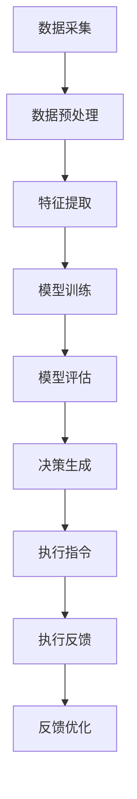
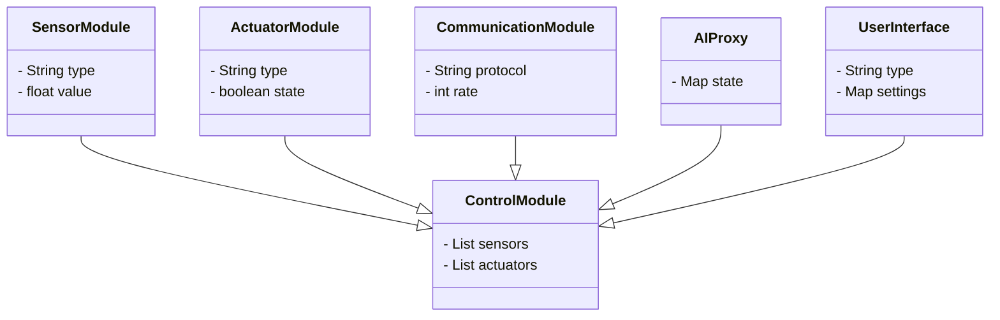
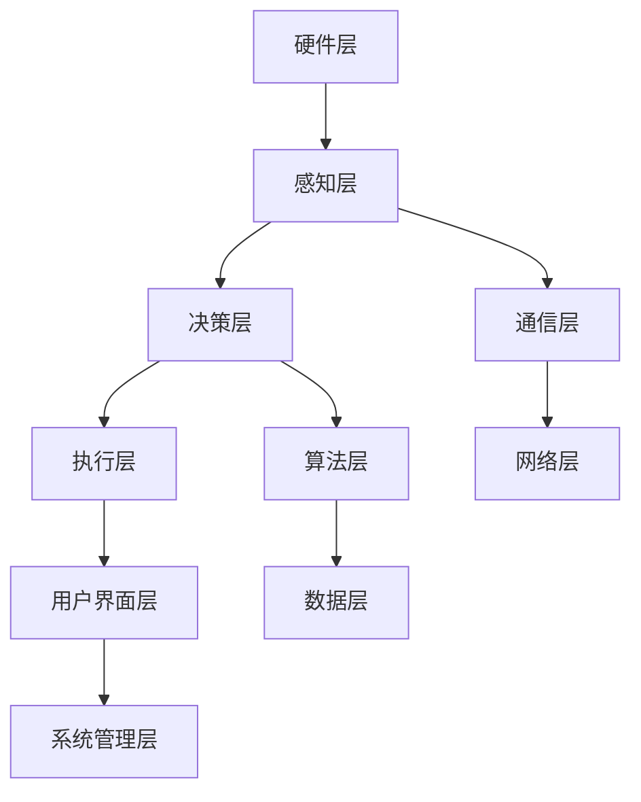
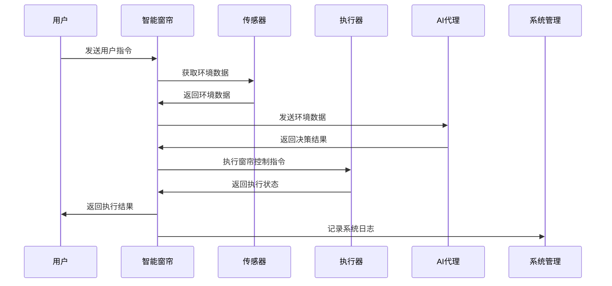

                 

### 摘要

《智能窗帘：AI Agent的室内环境全面调节》旨在深入探讨智能窗帘与AI Agent结合在现代室内环境调节中的重要作用。随着智能家居技术的不断发展，智能窗帘凭借其便捷的远程控制和自动调节功能，逐渐成为家庭智能化的重要组成部分。本文首先介绍智能窗帘的基本概念与功能，分析其在室内环境调节中的重要性，并探讨AI Agent的应用。接下来，文章详细阐述了智能窗帘与AI Agent的集成原理和实现方法，并探讨其协同工作的工作流程。文章随后介绍了智能窗帘与AI Agent之间的核心概念联系，包括硬件和软件组成，属性特征对比，以及实体关系图架构。核心算法原理通过mermaid流程图和Python源代码进行详细讲解，帮助读者理解智能窗帘与AI Agent的算法实现和协同操作。最后，文章从系统架构设计角度出发，介绍了智能窗帘与AI Agent协同工作的系统架构和接口设计，并通过实际案例进行分析和总结，为读者提供最佳实践和未来发展方向。

### 目录大纲

# 《智能窗帘：AI Agent的室内环境全面调节》

## 关键词
- 智能窗帘
- AI Agent
- 室内环境调节
- 智能家居
- 自动化控制

## 摘要
本文全面探讨智能窗帘结合AI Agent在室内环境调节中的应用。通过分析智能窗帘的基本概念、功能及重要性，详细介绍AI Agent在智能窗帘中的集成与应用。文章深入讲解智能窗帘与AI Agent的协同算法原理，通过mermaid流程图和Python源代码进行实例说明。最后，从系统架构设计的角度，讨论智能窗帘与AI Agent的协同工作模式，并分析实际应用案例，为智能家居领域提供实用指南。

### 第一部分：背景介绍

#### 1.1 问题背景

##### 1.1.1 智能窗帘的概念与功能

智能窗帘，作为智能家居系统的一部分，是一种可以通过远程控制、语音控制、定时控制等多种方式来调节室内光线和隐私保护的窗帘设备。智能窗帘的核心在于其智能控制模块，这一模块通常包括传感器、执行器、通信模块和控制系统等组成部分。传感器用于感知环境变化，如光照强度、温度、湿度等；执行器则根据控制系统的指令执行具体的动作，如升降窗帘；通信模块负责数据的传输，使得窗帘可以与外部设备进行交互；控制系统则是智能窗帘的大脑，负责根据输入信息做出决策。

智能窗帘的基本功能包括自动开合、定时开关、远程控制等。例如，当检测到光照过强时，智能窗帘会自动关闭以减少室内光线；在用户设定的时间或通过远程操作，窗帘可以自动打开或关闭，以提供用户所需的室内光线和隐私保护。

##### 1.1.2 室内环境调节的重要性

室内环境调节对于人们的生活质量具有深远的影响。光照、温度、湿度等因素都会直接影响人的舒适度和健康。例如，过度的光照可能会导致眼睛疲劳，而温度控制不当则可能引发感冒或中暑。因此，通过智能窗帘进行室内环境调节，可以提高居住的舒适度，同时也有助于节省能源消耗。

此外，室内环境调节对于工作、学习等活动的效率也有着重要影响。合适的光照和温度可以提供良好的工作或学习环境，从而提高人们的生产力和学习效果。智能窗帘通过自动调节光线和温度，为用户提供了更加灵活和个性化的室内环境，使其能够更加专注于手头的任务。

##### 1.1.3 AI Agent在智能窗帘中的应用

AI Agent（人工智能代理）是人工智能领域的一个重要概念，它是一种能够在特定环境中自主执行任务、作出决策的智能体。在智能窗帘中，AI Agent的作用至关重要。首先，AI Agent可以收集室内环境的数据，如光照强度、温度、湿度等，并基于这些数据进行分析，以做出最佳的光线和温度调节决策。

其次，AI Agent可以根据用户的行为习惯和偏好进行学习，从而提供更加个性化的服务。例如，如果用户在某个时间段总是需要关闭窗帘，AI Agent可以自动记住这一行为，并在未来重复这一动作，提高用户体验。

最后，AI Agent还能够与其他智能家居设备进行联动，形成一个更加强大的智能系统。例如，当用户打开智能灯时，AI Agent可以自动调节窗帘，以提供最佳的光照效果。这种协同工作模式不仅提高了智能家居系统的整体性能，还增加了用户的便利性。

#### 1.2 问题描述

##### 1.2.1 智能窗帘面临的挑战

尽管智能窗帘具有许多优点，但在实际应用中仍面临着一系列挑战。首先，智能窗帘需要高度集成的传感器和执行器系统，这要求硬件设备具有较高的精度和稳定性。然而，现有的一些传感器和执行器在性能上仍存在不足，难以满足智能窗帘的高要求。

其次，智能窗帘需要与用户的智能设备（如智能手机、智能音箱等）进行高效的数据传输和通信。这要求窗帘系统具有强大的通信模块和稳定的网络连接。然而，在复杂的家庭环境中，网络信号的不稳定和干扰可能导致数据传输的延迟和错误。

此外，智能窗帘的自动调节功能依赖于AI Agent的智能决策能力。然而，AI Agent的学习和决策过程需要大量的数据和计算资源，这对系统性能提出了更高的要求。如果AI Agent的算法不够先进或数据不足，可能导致窗帘调节不准确，影响用户体验。

##### 1.2.2 用户体验的重要性

用户体验是智能窗帘成功应用的关键因素。尽管智能窗帘提供了许多便捷的功能，但只有当用户真正感受到这些功能的实用性和易用性时，才能真正发挥作用。以下是从用户体验的角度分析智能窗帘的几个重要方面：

1. **易用性**：智能窗帘需要具备简单的用户界面和操作流程，使得用户可以轻松地控制窗帘的开合。这要求系统设计者考虑到不同用户的技术水平和使用习惯，提供多样化的控制方式，如远程控制、语音控制等。

2. **响应速度**：智能窗帘的响应速度直接影响用户的体验。当用户发出控制指令时，系统需要迅速做出反应，调整窗帘的状态。任何延迟都可能导致用户不满，影响使用体验。

3. **个性化服务**：智能窗帘需要能够根据用户的行为和偏好提供个性化的服务。通过AI Agent的学习和适应，智能窗帘可以更好地满足用户的需求，提高用户满意度。

4. **稳定性**：智能窗帘需要具备高度的稳定性和可靠性，确保系统长时间运行而不出现故障。这对硬件设备和软件算法都提出了严格要求，任何故障都可能导致用户失去对系统的信任。

##### 1.2.3 AI Agent在提高窗帘性能中的作用

AI Agent在智能窗帘系统中扮演着至关重要的角色，它不仅能够提高窗帘的性能，还能够增强用户体验。以下是AI Agent在提高窗帘性能中发挥的关键作用：

1. **智能决策**：AI Agent可以根据实时收集的环境数据，如光照、温度等，进行智能决策，自动调节窗帘状态，提供最佳的环境舒适度。这种智能决策能力极大地提升了窗帘的自动调节精度和效果。

2. **用户行为学习**：AI Agent可以学习用户的行为习惯和偏好，通过数据分析和机器学习算法，为用户提供更加个性化的服务。例如，如果用户在每天早晨7点需要窗帘打开，AI Agent可以自动记住这一时间点，并每天按时打开窗帘。

3. **故障诊断与维护**：AI Agent还可以监测窗帘系统的运行状态，诊断潜在的故障，并提供维护建议。这有助于提前发现并解决系统问题，确保窗帘系统的稳定运行。

4. **智能联动**：AI Agent能够与其他智能家居设备进行联动，形成一个更加智能和高效的智能家居系统。例如，当用户打开智能灯时，AI Agent可以自动调节窗帘，提供最佳的光照效果。

#### 1.3 问题解决

##### 1.3.1 AI Agent的基本原理

AI Agent是基于人工智能技术的智能体，它能够在特定环境中自主执行任务、作出决策。AI Agent的基本原理包括以下几个关键组成部分：

1. **感知模块**：AI Agent通过传感器或其他数据收集设备感知环境信息，如光照、温度、湿度等。这些信息为AI Agent的决策提供了基础数据。

2. **决策模块**：AI Agent利用机器学习算法和其他智能算法对感知到的信息进行分析和处理，生成决策。决策模块的核心是算法，它决定了AI Agent的智能水平和决策能力。

3. **执行模块**：AI Agent根据决策结果执行具体的操作，如控制窗帘的升降、调节灯光等。执行模块通常与执行器或其他控制设备连接，将AI Agent的决策转化为实际操作。

##### 1.3.2 智能窗帘与AI Agent的集成

智能窗帘与AI Agent的集成是智能家居系统设计中的一个关键环节。以下是智能窗帘与AI Agent集成的基本步骤：

1. **硬件集成**：智能窗帘的硬件组件，如传感器、执行器等，需要与AI Agent的硬件模块进行连接和集成。这通常涉及到硬件接口的设计和数据传输协议的制定。

2. **软件集成**：AI Agent的软件模块需要与智能窗帘的控制软件进行集成，实现数据交换和协同工作。这包括软件开发接口（API）的设计和软件模块之间的通信协议。

3. **数据采集与处理**：AI Agent需要从智能窗帘的传感器收集环境数据，并进行数据预处理和特征提取，以便进行后续的机器学习分析和决策。

4. **决策与执行**：AI Agent根据环境数据和分析结果生成决策，并通过控制软件向执行器发送指令，控制窗帘的开合状态。

##### 1.3.3 智能窗帘的工作流程

智能窗帘的工作流程可以分为以下几个关键步骤：

1. **数据采集**：智能窗帘的传感器持续采集室内环境数据，如光照强度、温度、湿度等。

2. **数据预处理**：采集到的数据经过预处理，包括去噪、归一化等，以便于后续的机器学习分析和决策。

3. **特征提取**：预处理后的数据被转化为特征向量，用于训练和优化AI Agent的机器学习模型。

4. **决策生成**：AI Agent利用训练好的模型对实时数据进行分析，生成窗帘开合的决策。

5. **决策执行**：控制系统根据决策结果向执行器发送指令，控制窗帘的开合状态。

6. **反馈与调整**：执行后的结果通过传感器反馈给AI Agent，用于进一步优化和调整决策模型，实现更加智能的窗帘控制。

##### 1.4 边界与外延

###### 1.4.1 智能窗帘的应用场景

智能窗帘的应用场景非常广泛，可以覆盖家庭、商业、工业等多个领域。以下是一些典型的应用场景：

1. **家庭**：在家庭环境中，智能窗帘主要用于调节室内光线和隐私保护。例如，早晨自动打开窗帘让阳光洒进房间，晚上自动关闭窗帘保证隐私。

2. **商业**：在商业环境中，智能窗帘可以用于商场、办公室、酒店等场所。通过自动调节光线和温度，提高室内环境舒适度，节约能源。

3. **工业**：在工业环境中，智能窗帘可以用于工厂车间、仓库等场所，通过自动调节光线和温度，提高工作效率和安全性。

###### 1.4.2 AI Agent的技术发展前景

随着人工智能技术的不断进步，AI Agent在未来有着广阔的发展前景。以下是一些值得关注的方面：

1. **更先进的算法**：随着深度学习、强化学习等先进算法的发展，AI Agent的决策能力和智能化水平将不断提高。

2. **更丰富的应用场景**：AI Agent的应用场景将不断扩展，从智能家居到智能交通、智能医疗等各个领域。

3. **更紧密的融合**：AI Agent将与其他智能系统（如物联网、大数据等）进行深度融合，形成一个更加智能和高效的系统。

4. **更广泛的应用领域**：AI Agent将在更多领域得到应用，如机器人、自动驾驶等，为社会带来更多的创新和变革。

###### 1.4.3 智能窗帘与AI Agent的融合趋势

智能窗帘与AI Agent的融合趋势主要体现在以下几个方面：

1. **更加智能的窗帘控制**：AI Agent将使得窗帘控制更加智能化，能够根据环境变化和用户需求，提供更加精准和个性化的服务。

2. **更高效的能源管理**：通过AI Agent的智能调节，智能窗帘可以在保证用户舒适度的同时，实现能源的节约和管理。

3. **更紧密的智能家居联动**：智能窗帘将与其他智能家居设备（如智能灯、智能空调等）进行更加紧密的联动，形成一个更加智能和高效的智能家居系统。

4. **更广泛的市场应用**：随着技术的进步和成本的降低，智能窗帘与AI Agent的融合将推动智能家居市场的发展，为更多家庭和企业带来便利。

#### 1.5 本章小结

本部分从背景介绍的角度，对智能窗帘和AI Agent进行了详细阐述。首先，介绍了智能窗帘的基本概念和功能，探讨了其在室内环境调节中的重要性。接着，分析了AI Agent在智能窗帘中的应用，包括智能决策、用户行为学习和故障诊断等方面。最后，讨论了智能窗帘与AI Agent集成的基本原理和实现方法，并介绍了其工作流程和应用场景。通过这些讨论，读者可以初步了解智能窗帘和AI Agent在智能家居领域的重要性和发展前景。

### 第一部分：背景介绍

#### 1.1 问题背景

##### 1.1.1 智能窗帘的概念与功能

智能窗帘是智能家居系统中的一个重要组成部分，它结合了现代电子技术和人工智能，实现了窗帘的自动化控制。智能窗帘的基本功能包括开合、光线调节、隐私保护等。其核心组件包括传感器、执行器、控制系统和通信模块。

1. **传感器**：传感器是智能窗帘的“眼睛”，用于感知环境的变化。常见的传感器包括光敏传感器、温度传感器、湿度传感器等。这些传感器能够实时监测室内外的光线强度、温度、湿度等环境参数，并将这些信息传递给控制系统。

2. **执行器**：执行器是智能窗帘的“手”，用于根据控制系统的指令执行具体的动作。常见的执行器包括电机、电磁铁等。当控制系统发出指令时，执行器将驱动窗帘的升降，实现窗帘的开合。

3. **控制系统**：控制系统是智能窗帘的“大脑”，负责接收传感器的数据，并根据这些数据做出决策。控制系统通常包括微控制器、嵌入式系统等。通过算法处理，控制系统可以自动调节窗帘的开合状态，以提供最佳的环境舒适度。

4. **通信模块**：通信模块是智能窗帘的“传输通道”，负责将传感器数据和控制系统指令在智能窗帘与其他设备（如智能手机、智能音箱等）之间传输。常见的通信模块包括Wi-Fi、蓝牙、ZigBee等。

智能窗帘的基本功能主要包括：

- **自动开合**：根据室内光线强度和用户预设的时间自动调节窗帘的开合状态，以提供最佳的室内光线环境。

- **远程控制**：用户可以通过智能手机、智能音箱等设备远程控制窗帘的开合，实现便捷的遥控功能。

- **定时控制**：用户可以设置窗帘的定时开合，如在早晨自动打开窗帘，晚上自动关闭窗帘。

- **隐私保护**：当用户不在家时，可以通过智能窗帘自动关闭，保护家庭隐私。

##### 1.1.2 室内环境调节的重要性

室内环境调节对于人们的生活质量和健康有着重要的影响。光照、温度、湿度等因素都会直接影响人的舒适度和健康。

1. **光照调节**：适宜的光照可以改善人的情绪和视力，提高工作和学习效率。过度的光照会导致眼睛疲劳，而不足的光照则会使人感到压抑。智能窗帘可以通过自动调节光线强度，提供适宜的光照环境。

2. **温度调节**：温度是影响人体舒适度的重要因素。过高的温度会导致中暑，而过低的温度则会引发感冒。智能窗帘可以通过调节室内温度，提供舒适的室内环境。

3. **湿度调节**：湿度过高会导致人体不适，湿度过低则会使皮肤干燥。智能窗帘可以通过调节室内湿度，改善居住环境的舒适度。

此外，室内环境调节还可以节省能源消耗。智能窗帘可以根据室内外环境变化自动调节，减少不必要的能源浪费，实现节能环保。

##### 1.1.3 AI Agent在智能窗帘中的应用

AI Agent（人工智能代理）是人工智能技术的一种应用，它可以在特定环境中自主执行任务、做出决策。在智能窗帘中，AI Agent可以发挥重要作用，提高窗帘的智能化水平。

1. **智能决策**：AI Agent可以通过对传感器收集的数据进行分析，自动调节窗帘的开合状态，提供最佳的环境舒适度。例如，当室内光线过强时，AI Agent可以自动关闭窗帘，减少光线强度。

2. **用户行为学习**：AI Agent可以学习用户的行为习惯和偏好，为用户提供更加个性化的服务。例如，用户每天早晨7点需要窗帘打开，AI Agent可以自动记住这一行为，并每天按时打开窗帘。

3. **故障诊断**：AI Agent可以监测窗帘系统的运行状态，诊断潜在的故障，并提供维护建议。例如，如果窗帘出现卡顿，AI Agent可以提醒用户进行维护。

4. **智能联动**：AI Agent可以与其他智能家居设备进行联动，形成一个更加智能和高效的系统。例如，当用户打开智能灯时，AI Agent可以自动调节窗帘，提供最佳的光照效果。

#### 1.2 问题描述

##### 1.2.1 智能窗帘面临的挑战

智能窗帘在实际应用中虽然提供了许多便利，但仍面临一些挑战。

1. **硬件集成难度大**：智能窗帘需要集成多种传感器和执行器，这些硬件设备之间的兼容性和稳定性要求较高。此外，硬件设备的质量和性能直接影响智能窗帘的精度和可靠性。

2. **通信问题**：智能窗帘需要与用户的智能设备进行通信，实现远程控制和数据传输。但在复杂的家庭环境中，无线信号的不稳定和干扰可能导致通信问题，影响用户体验。

3. **算法复杂度**：智能窗帘的自动调节功能依赖于AI Agent的智能决策能力。然而，算法的复杂度较高，需要大量的数据和计算资源。如果算法不够先进或数据不足，可能导致窗帘调节不准确。

##### 1.2.2 用户体验的重要性

用户体验是智能窗帘成功应用的关键因素。以下是从用户体验的角度分析智能窗帘的几个重要方面：

1. **易用性**：智能窗帘需要具备简单的用户界面和操作流程，使得用户可以轻松地控制窗帘的开合。此外，不同的用户有不同的使用习惯和技术水平，智能窗帘应提供多样化的控制方式，如远程控制、语音控制等。

2. **响应速度**：智能窗帘的响应速度直接影响用户的体验。当用户发出控制指令时，系统需要迅速做出反应，调整窗帘的状态。任何延迟都可能导致用户不满，影响使用体验。

3. **个性化服务**：智能窗帘需要能够根据用户的行为习惯和偏好提供个性化的服务。通过AI Agent的学习和适应，智能窗帘可以更好地满足用户的需求，提高用户满意度。

4. **稳定性**：智能窗帘需要具备高度的稳定性和可靠性，确保系统长时间运行而不出现故障。任何故障都可能导致用户失去对系统的信任。

##### 1.2.3 AI Agent在提高窗帘性能中的作用

AI Agent在智能窗帘系统中发挥着重要作用，可以提高窗帘的性能和用户体验。以下是AI Agent在提高窗帘性能中发挥的关键作用：

1. **智能决策**：AI Agent可以通过对传感器收集的数据进行分析，自动调节窗帘的开合状态，提供最佳的环境舒适度。这种智能决策能力极大地提升了窗帘的自动调节精度和效果。

2. **用户行为学习**：AI Agent可以学习用户的行为习惯和偏好，通过数据分析和机器学习算法，为用户提供更加个性化的服务。例如，如果用户在每天早晨7点需要窗帘打开，AI Agent可以自动记住这一行为，并每天按时打开窗帘。

3. **故障诊断与维护**：AI Agent可以监测窗帘系统的运行状态，诊断潜在的故障，并提供维护建议。这有助于提前发现并解决系统问题，确保窗帘系统的稳定运行。

4. **智能联动**：AI Agent能够与其他智能家居设备进行联动，形成一个更加智能和高效的智能家居系统。例如，当用户打开智能灯时，AI Agent可以自动调节窗帘，提供最佳的光照效果。这种协同工作模式不仅提高了智能家居系统的整体性能，还增加了用户的便利性。

#### 1.3 问题解决

##### 1.3.1 AI Agent的基本原理

AI Agent是基于人工智能技术的智能体，它能够在特定环境中自主执行任务、做出决策。AI Agent的基本原理包括以下几个关键组成部分：

1. **感知模块**：AI Agent通过传感器或其他数据收集设备感知环境信息，如光照、温度、湿度等。这些信息为AI Agent的决策提供了基础数据。

2. **决策模块**：AI Agent利用机器学习算法和其他智能算法对感知到的信息进行分析和处理，生成决策。决策模块的核心是算法，它决定了AI Agent的智能水平和决策能力。

3. **执行模块**：AI Agent根据决策结果执行具体的操作，如控制窗帘的升降、调节灯光等。执行模块通常与执行器或其他控制设备连接，将AI Agent的决策转化为实际操作。

##### 1.3.2 智能窗帘与AI Agent的集成

智能窗帘与AI Agent的集成是智能家居系统设计中的一个关键环节。以下是智能窗帘与AI Agent集成的基本步骤：

1. **硬件集成**：智能窗帘的硬件组件，如传感器、执行器等，需要与AI Agent的硬件模块进行连接和集成。这通常涉及到硬件接口的设计和数据传输协议的制定。

2. **软件集成**：AI Agent的软件模块需要与智能窗帘的控制软件进行集成，实现数据交换和协同工作。这包括软件开发接口（API）的设计和软件模块之间的通信协议。

3. **数据采集与处理**：AI Agent需要从智能窗帘的传感器收集环境数据，并进行数据预处理和特征提取，以便进行后续的机器学习分析和决策。

4. **决策与执行**：AI Agent根据环境数据和分析结果生成决策，并通过控制软件向执行器发送指令，控制窗帘的开合状态。

##### 1.3.3 智能窗帘的工作流程

智能窗帘的工作流程可以分为以下几个关键步骤：

1. **数据采集**：智能窗帘的传感器持续采集室内环境数据，如光照强度、温度、湿度等。

2. **数据预处理**：采集到的数据经过预处理，包括去噪、归一化等，以便于后续的机器学习分析和决策。

3. **特征提取**：预处理后的数据被转化为特征向量，用于训练和优化AI Agent的机器学习模型。

4. **决策生成**：AI Agent利用训练好的模型对实时数据进行分析，生成窗帘开合的决策。

5. **决策执行**：控制系统根据决策结果向执行器发送指令，控制窗帘的开合状态。

6. **反馈与调整**：执行后的结果通过传感器反馈给AI Agent，用于进一步优化和调整决策模型，实现更加智能的窗帘控制。

##### 1.4 边界与外延

###### 1.4.1 智能窗帘的应用场景

智能窗帘的应用场景非常广泛，可以覆盖家庭、商业、工业等多个领域。以下是一些典型的应用场景：

1. **家庭**：在家庭环境中，智能窗帘主要用于调节室内光线和隐私保护。例如，早晨自动打开窗帘让阳光洒进房间，晚上自动关闭窗帘保证隐私。

2. **商业**：在商业环境中，智能窗帘可以用于商场、办公室、酒店等场所。通过自动调节光线和温度，提高室内环境舒适度，节约能源。

3. **工业**：在工业环境中，智能窗帘可以用于工厂车间、仓库等场所，通过自动调节光线和温度，提高工作效率和安全性。

###### 1.4.2 AI Agent的技术发展前景

随着人工智能技术的不断进步，AI Agent在未来有着广阔的发展前景。以下是一些值得关注的方面：

1. **更先进的算法**：随着深度学习、强化学习等先进算法的发展，AI Agent的决策能力和智能化水平将不断提高。

2. **更丰富的应用场景**：AI Agent的应用场景将不断扩展，从智能家居到智能交通、智能医疗等各个领域。

3. **更紧密的融合**：AI Agent将与其他智能系统（如物联网、大数据等）进行深度融合，形成一个更加智能和高效的系统。

4. **更广泛的应用领域**：AI Agent将在更多领域得到应用，如机器人、自动驾驶等，为社会带来更多的创新和变革。

###### 1.4.3 智能窗帘与AI Agent的融合趋势

智能窗帘与AI Agent的融合趋势主要体现在以下几个方面：

1. **更加智能的窗帘控制**：AI Agent将使得窗帘控制更加智能化，能够根据环境变化和用户需求，提供更加精准和个性化的服务。

2. **更高效的能源管理**：通过AI Agent的智能调节，智能窗帘可以在保证用户舒适度的同时，实现能源的节约和管理。

3. **更紧密的智能家居联动**：智能窗帘将与其他智能家居设备进行更加紧密的联动，形成一个更加智能和高效的智能家居系统。

4. **更广泛的市场应用**：随着技术的进步和成本的降低，智能窗帘与AI Agent的融合将推动智能家居市场的发展，为更多家庭和企业带来便利。

#### 1.5 本章小结

本部分从背景介绍的角度，对智能窗帘和AI Agent进行了详细阐述。首先，介绍了智能窗帘的基本概念和功能，探讨了其在室内环境调节中的重要性。接着，分析了AI Agent在智能窗帘中的应用，包括智能决策、用户行为学习和故障诊断等方面。最后，讨论了智能窗帘与AI Agent集成的基本原理和实现方法，并介绍了其工作流程和应用场景。通过这些讨论，读者可以初步了解智能窗帘和AI Agent在智能家居领域的重要性和发展前景。

### 第一部分：背景介绍

#### 1.4 边界与外延

##### 1.4.1 智能窗帘的应用场景

智能窗帘的应用场景非常广泛，涵盖了家庭、商业和工业等多个领域。以下是智能窗帘在不同应用场景中的具体用途和优势：

1. **家庭应用**：在家庭环境中，智能窗帘主要被用于调节室内光线和提供隐私保护。早晨自动打开窗帘让阳光洒进房间，晚上自动关闭窗帘保证隐私。此外，智能窗帘还可以根据用户的作息习惯和光线需求进行个性化调节，提高居住的舒适度和便利性。例如，用户可以在智能手机上设置窗帘的定时开合，让窗帘在特定的时间段自动打开或关闭，从而优化室内光线环境。

2. **商业应用**：在商业环境中，智能窗帘广泛应用于商场、办公室、酒店等场所。商场可以通过智能窗帘调节店内光线，提高顾客的购物体验；办公室可以通过智能窗帘调节办公区域的光线，提升员工的工作效率和舒适度；酒店可以通过智能窗帘为客人提供个性化的服务，提高客户满意度。此外，智能窗帘还可以实现节能管理，通过自动调节光线和温度，减少能源消耗，降低运营成本。

3. **工业应用**：在工业环境中，智能窗帘主要用于工厂车间、仓库等场所。智能窗帘可以自动调节光线和温度，提高工作环境的舒适度，减少工人因光线和温度不适而产生的疲劳。此外，智能窗帘还可以与工业监控系统联动，实现智能化管理和自动化控制，提高生产效率和安全性。

##### 1.4.2 AI Agent的技术发展前景

随着人工智能技术的不断进步，AI Agent（人工智能代理）在智能窗帘中的应用前景广阔。以下是AI Agent在未来技术发展中的几个关键方向：

1. **更先进的算法**：随着深度学习、强化学习等先进算法的发展，AI Agent的智能水平和决策能力将不断提高。未来，AI Agent将能够更好地处理复杂的环境数据，实现更加精准和高效的智能调节。

2. **更丰富的应用场景**：AI Agent的应用场景将不断扩展，从智能家居到智能交通、智能医疗等各个领域。AI Agent将能够在更多场景中发挥作用，为用户提供更加个性化、便捷的服务。

3. **更紧密的融合**：AI Agent将与其他智能系统（如物联网、大数据等）进行深度融合，形成一个更加智能和高效的系统。AI Agent将与其他智能设备协同工作，实现更全面的智能化管理。

4. **更广泛的应用领域**：AI Agent将在更多领域得到应用，如机器人、自动驾驶、智慧城市等。AI Agent的应用将推动社会进步，带来更多的创新和变革。

##### 1.4.3 智能窗帘与AI Agent的融合趋势

智能窗帘与AI Agent的融合趋势体现在以下几个方面：

1. **更加智能的窗帘控制**：AI Agent将使窗帘控制更加智能化，能够根据环境变化和用户需求，提供更加精准和个性化的服务。通过AI Agent的智能决策，窗帘将能够自动调节光线和温度，提高室内环境的舒适度。

2. **更高效的能源管理**：智能窗帘与AI Agent的融合可以实现更加高效的能源管理。通过智能调节光线和温度，减少不必要的能源消耗，降低能源成本，实现可持续发展。

3. **更紧密的智能家居联动**：智能窗帘与AI Agent的融合将实现与其他智能家居设备的紧密联动，形成一个更加智能和高效的智能家居系统。例如，AI Agent可以与智能灯、智能空调等设备协同工作，提供最佳的光线、温度和湿度环境。

4. **更广泛的市场应用**：随着技术的进步和成本的降低，智能窗帘与AI Agent的融合将推动智能家居市场的发展，为更多家庭和企业带来便利。智能窗帘将成为智能家居系统的重要组成部分，为用户创造更舒适、更智能的生活环境。

#### 1.5 本章小结

通过本部分的讨论，我们对智能窗帘和AI Agent在室内环境调节中的应用有了更深入的理解。智能窗帘作为智能家居系统的重要组成部分，通过AI Agent的智能调节，能够实现更加高效、智能的室内环境控制。未来，随着技术的不断进步和成本的降低，智能窗帘与AI Agent的融合将更加紧密，为用户带来更加舒适、便捷的智能生活体验。

### 第一部分：背景介绍

#### 1.5 本章小结

在本章中，我们详细介绍了智能窗帘和AI Agent在室内环境调节中的应用背景。首先，通过介绍智能窗帘的概念与功能，我们了解了其基本组成和主要特点，包括传感器、执行器、控制系统和通信模块等。接着，探讨了智能窗帘在室内环境调节中的重要性，强调了光照、温度和湿度等环境因素对人们生活质量和健康的影响。

随后，我们深入分析了AI Agent在智能窗帘中的应用，包括智能决策、用户行为学习、故障诊断和智能联动等功能。这些功能不仅提高了窗帘的性能和用户体验，还实现了窗帘与其他智能家居设备的联动，形成了一个更加智能和高效的系统。

在问题描述部分，我们讨论了智能窗帘面临的挑战，包括硬件集成难度大、通信问题和算法复杂度等。同时，强调了用户体验在智能窗帘应用中的重要性，提出了提高易用性、响应速度、个性化和稳定性等方面的需求。

在问题解决部分，我们介绍了AI Agent的基本原理和集成方法，以及智能窗帘的工作流程。通过这些讨论，我们初步了解了智能窗帘和AI Agent在智能家居领域的重要性和发展前景。

最后，本章总结了智能窗帘和AI Agent的应用场景、技术发展前景和融合趋势。智能窗帘在家庭、商业和工业等领域的广泛应用，以及AI Agent的先进算法和智能化水平，为智能家居系统的未来发展提供了广阔的空间。

通过本章的讨论，读者可以更好地理解智能窗帘和AI Agent在室内环境调节中的应用，以及其融合带来的巨大潜力。接下来，我们将进一步探讨智能窗帘和AI Agent的核心概念与联系，帮助读者深入理解这些技术的原理和实现方法。

### 第二部分：核心概念与联系

#### 2.1 智能窗帘的核心概念

##### 2.1.1 智能窗帘的基本组成

智能窗帘由多个核心组件构成，这些组件相互协作，共同实现窗帘的智能化功能。以下是智能窗帘的主要组成部分：

1. **传感器模块**：传感器模块是智能窗帘的感知部分，用于收集环境信息。常见的传感器包括光敏传感器、温度传感器和湿度传感器。光敏传感器用于检测光照强度，温度传感器用于监测室内温度，湿度传感器用于测量室内湿度。这些传感器将收集到的数据传输到控制系统，为窗帘的自动调节提供依据。

2. **执行器模块**：执行器模块是智能窗帘的动作部分，负责根据控制系统的指令执行窗帘的开合动作。常见的执行器包括电机、电磁铁等。当控制系统发出开合指令时，执行器会驱动窗帘的升降，实现窗帘的自动开合。

3. **控制系统**：控制系统是智能窗帘的决策部分，负责接收传感器模块传递的环境数据，并利用算法对这些数据进行分析和处理，生成窗帘的开合指令。控制系统通常由微控制器或嵌入式系统构成，具备数据处理和决策功能。

4. **通信模块**：通信模块是智能窗帘的数据传输部分，负责将传感器数据和控制指令在窗帘与其他设备（如智能手机、智能音箱等）之间进行传输。常见的通信方式包括Wi-Fi、蓝牙、ZigBee等。通信模块保证了智能窗帘的远程控制和数据交换。

##### 2.1.2 智能窗帘的属性特征对比

智能窗帘与传统窗帘在属性特征上存在明显差异，以下为两者的对比：

| 特征        | 智能窗帘                      | 传统窗帘                    |
| ----------- | ----------------------------- | --------------------------- |
| 开合方式    | 自动开合、定时控制、远程控制   | 手动拉动、定时器控制        |
| 光线调节    | 可根据光线强度自动调节         | 无法自动调节，需手动调整     |
| 隐私保护    | 可根据用户需求自动调节         | 手动关闭，无法自动调节       |
| 节能效果    | 可根据环境自动调节，减少能源消耗 | 手动操作，可能造成能源浪费   |
| 交互方式    | 支持多种控制方式（远程、语音等） | 主要依赖手动操作            |
| 可定制性    | 可以根据用户需求进行个性化设置   | 依赖人工调整，难以实现个性化 |

通过上述对比可以看出，智能窗帘在开合方式、光线调节、隐私保护、节能效果、交互方式和可定制性等方面具有显著优势，这些特点使其在智能家居系统中更具竞争力。

##### 2.1.3 智能窗帘与传统窗帘的区别

智能窗帘与传统窗帘在功能、操作方式、智能化程度等方面存在显著区别：

1. **功能**：智能窗帘具备自动开合、光线调节、隐私保护等功能，可以实时响应环境变化和用户需求。而传统窗帘主要依靠手动操作，无法实现自动化和智能化功能。

2. **操作方式**：智能窗帘支持多种控制方式，如远程控制、语音控制、定时控制等，用户可以通过智能手机、智能音箱等设备轻松控制窗帘。传统窗帘主要依赖手动拉动，操作方式较为单一。

3. **智能化程度**：智能窗帘配备了传感器和控制系统，能够根据环境数据自动调节，实现智能化管理。传统窗帘缺乏智能硬件支持，难以实现自动化和智能化。

4. **节能效果**：智能窗帘可以根据室内外环境变化自动调节，减少能源消耗。传统窗帘需手动操作，可能造成能源浪费。

5. **可定制性**：智能窗帘可以根据用户需求进行个性化设置，如定时开关、光照调节等。传统窗帘操作相对固定，难以实现个性化。

总之，智能窗帘与传统窗帘相比，在功能、操作方式、智能化程度和节能效果等方面具有显著优势，这些特点使其在智能家居系统中成为不可或缺的一部分。

#### 2.2 AI Agent的核心概念

##### 2.2.1 AI Agent的定义

AI Agent（人工智能代理）是一种在特定环境中自主执行任务、做出决策的智能体。它基于人工智能技术，通过感知、学习、推理和执行等过程，实现自动化、智能化的任务执行。AI Agent通常由以下几个关键组成部分构成：

1. **感知模块**：AI Agent的感知模块负责收集环境信息，如传感器数据、图像、语音等。感知模块通过传感器或其他数据源获取外部信息，为AI Agent的决策提供基础数据。

2. **决策模块**：AI Agent的决策模块负责处理感知模块收集到的信息，并生成相应的决策。决策模块通常采用机器学习、深度学习、强化学习等算法，对感知数据进行分析和处理，生成最优的决策方案。

3. **执行模块**：AI Agent的执行模块负责根据决策结果执行具体的操作。执行模块通常与执行器或其他控制设备连接，将AI Agent的决策转化为实际操作，如控制窗帘的开合、调节灯光等。

4. **学习模块**：AI Agent的学习模块负责从执行过程中获取反馈，并根据反馈信息进行自我学习和优化。学习模块可以通过机器学习算法、深度学习模型等不断优化自身的决策能力和执行效率。

##### 2.2.2 AI Agent的组成结构

AI Agent的组成结构通常包括以下几个主要部分：

1. **感知层**：感知层是AI Agent获取外部环境信息的关键部分，包括各种传感器、摄像头、麦克风等感知设备。感知层的主要任务是实时收集环境数据，如光照、温度、湿度、声音等，并将其转化为数字信号。

2. **处理层**：处理层是AI Agent的核心部分，负责对感知层收集到的信息进行预处理、特征提取、模式识别等操作。处理层通常采用机器学习、深度学习等算法，对感知数据进行分析和推理，生成初步的决策方案。

3. **决策层**：决策层负责根据处理层生成的决策方案，进行进一步的决策优化和选择。决策层可以根据任务需求，采用不同的算法和策略，如优化算法、决策树、强化学习等，生成最终的决策结果。

4. **执行层**：执行层是AI Agent将决策结果转化为实际操作的部分，包括各种执行器、机器人、无人机等。执行层根据决策层的指令，执行具体的操作，实现任务目标。

##### 2.2.3 AI Agent的核心功能

AI Agent在智能窗帘系统中发挥着关键作用，其核心功能包括：

1. **智能感知**：AI Agent通过感知模块收集环境数据，如光照、温度、湿度等，对环境进行实时监测和分析。智能感知能力使AI Agent能够根据环境变化做出相应的调整。

2. **智能决策**：AI Agent利用处理层和决策层的算法，对感知数据进行分析和处理，生成最优的窗帘调节方案。智能决策能力使AI Agent能够提供个性化、高效的服务。

3. **智能执行**：AI Agent根据决策结果，通过执行模块控制窗帘的开合、光线调节等操作。智能执行能力使AI Agent能够实现自动化、精确的窗帘控制。

4. **自我学习**：AI Agent通过学习模块，从执行过程中获取反馈，并根据反馈信息进行自我学习和优化。自我学习能力使AI Agent能够不断优化自身的性能，提高决策和执行效率。

5. **智能联动**：AI Agent可以与其他智能家居设备进行联动，实现更加智能和高效的协同工作。例如，当用户打开智能灯时，AI Agent可以自动调节窗帘，提供最佳的光线效果。

#### 2.3 智能窗帘与AI Agent的联系

##### 2.3.1 智能窗帘与AI Agent的交互模式

智能窗帘与AI Agent之间的交互模式是确保智能窗帘系统能够高效运行的关键。以下是智能窗帘与AI Agent之间的主要交互模式：

1. **数据采集与传输**：AI Agent通过感知模块收集室内环境数据，如光照强度、温度、湿度等。这些数据通过通信模块传输到AI Agent的处理层，为后续的决策提供基础。

2. **决策生成与反馈**：AI Agent利用处理层和决策层的算法，对感知数据进行处理和分析，生成窗帘开合的决策方案。决策结果通过控制系统传输回智能窗帘，控制执行器进行相应的操作。

3. **执行反馈与优化**：执行器根据AI Agent的决策指令执行窗帘的开合动作。执行结果通过传感器反馈给AI Agent，AI Agent根据反馈信息对决策模型进行优化和调整，以提高窗帘调节的准确性。

4. **用户交互**：用户可以通过智能手机、智能音箱等设备与AI Agent进行交互，设置窗帘的定时控制、远程控制等功能。AI Agent接收用户指令，生成相应的决策，并通过控制系统执行操作。

##### 2.3.2 智能窗帘与AI Agent的数据流动

智能窗帘与AI Agent之间的数据流动是确保系统高效运行的核心。以下是智能窗帘与AI Agent之间的主要数据流动过程：

1. **环境数据采集**：智能窗帘的传感器模块持续采集室内环境数据，如光照强度、温度、湿度等。这些数据通过通信模块传输到AI Agent的感知模块。

2. **数据处理与决策**：AI Agent的处理层对感知数据进行分析和处理，提取关键特征，并利用决策层算法生成窗帘开合的决策方案。决策结果通过控制系统传输回智能窗帘。

3. **执行控制**：智能窗帘的控制系统根据AI Agent的决策指令，驱动执行器进行相应的操作，如窗帘的升降、光线的调节等。

4. **执行反馈**：执行器根据决策指令执行操作后，通过传感器反馈执行结果到AI Agent。AI Agent根据反馈信息对决策模型进行优化和调整，以提高窗帘调节的准确性。

5. **用户指令**：用户通过智能手机、智能音箱等设备发送指令，如定时控制、远程控制等。AI Agent接收用户指令，生成相应的决策，并通过控制系统执行操作。

##### 2.3.3 智能窗帘与AI Agent的协同作用

智能窗帘与AI Agent的协同作用是确保系统高效运行、提供优质用户体验的关键。以下是智能窗帘与AI Agent之间的主要协同作用：

1. **环境监测与调节**：AI Agent通过感知模块持续监测室内环境变化，如光照强度、温度、湿度等。当环境参数达到设定的阈值时，AI Agent会自动调节窗帘，提供最佳的环境舒适度。

2. **用户行为学习与适应**：AI Agent可以学习用户的行为习惯和偏好，如作息时间、光线需求等。通过数据分析和机器学习算法，AI Agent能够为用户提供个性化的服务，提高用户体验。

3. **智能联动与协同**：AI Agent可以与其他智能家居设备进行联动，如智能灯、智能空调等。当用户打开智能灯时，AI Agent可以自动调节窗帘，提供最佳的光线效果；当用户调节空调温度时，AI Agent可以自动调整窗帘，保持室内舒适度。

4. **故障诊断与维护**：AI Agent可以监测窗帘系统的运行状态，诊断潜在的故障，并提供维护建议。例如，如果窗帘出现卡顿，AI Agent可以提醒用户进行维护，确保窗帘系统的稳定运行。

通过智能窗帘与AI Agent的协同作用，可以实现室内环境的智能调节、高效管理和优质用户体验，为用户创造更加舒适、便捷的智能生活。

#### 2.4 智能窗帘与AI Agent的ER实体关系图架构

为了更好地理解智能窗帘与AI Agent之间的数据交互和功能协同，我们可以通过实体关系图（Entity-Relationship Diagram, ER图）来描述它们之间的结构和关系。以下是智能窗帘与AI Agent的ER实体关系图架构：

1. **实体定义**

    - **智能窗帘**：包括传感器、执行器、控制系统和通信模块等组成部分。传感器负责环境数据的采集，执行器负责窗帘的物理动作，控制系统负责数据处理和决策，通信模块负责数据传输和交互。
    - **AI Agent**：包括感知模块、处理层、决策层、执行模块和学习模块等组成部分。感知模块负责环境数据采集，处理层负责数据处理和分析，决策层负责生成决策，执行模块负责执行操作，学习模块负责自我学习和优化。

2. **实体属性**

    - **智能窗帘**：
        - 传感器：光照强度、温度、湿度
        - 执行器：电机状态、开合状态
        - 控制系统：决策指令、执行状态
        - 通信模块：通信协议、数据传输速率
    
    - **AI Agent**：
        - 感知模块：环境数据
        - 处理层：特征向量、模型参数
        - 决策层：决策结果、执行策略
        - 执行模块：执行状态、反馈信息
        - 学习模块：学习数据、优化策略

3. **实体关系**

    - **智能窗帘与AI Agent**：智能窗帘作为数据来源，通过传感器模块采集环境数据，并将数据传输给AI Agent。AI Agent根据接收到的数据生成决策，并通过控制系统将决策指令发送回智能窗帘，执行器根据指令进行相应的动作。此外，执行结果会通过传感器反馈给AI Agent，用于进一步学习和优化。

    - **感知模块与处理层**：感知模块采集的环境数据被传输到处理层，处理层对数据进行预处理、特征提取和模式识别，生成特征向量，作为决策模块的输入。

    - **决策层与执行模块**：决策层根据处理层生成的特征向量，利用算法生成决策结果，并将其发送给执行模块。执行模块根据决策指令，驱动执行器进行相应的操作。

    - **学习模块与处理层、决策层**：学习模块从执行过程中获取反馈信息，并将其用于优化处理层和决策层的模型参数和策略。优化后的模型参数和策略会反馈到处理层和决策层，提高系统的智能化水平和决策精度。

通过上述ER实体关系图架构，我们可以清晰地看到智能窗帘与AI Agent之间的数据交互和功能协同，以及它们在室内环境调节中的关键作用。这一架构为智能窗帘与AI Agent的集成提供了理论基础，也为后续的系统设计和实现奠定了基础。

#### 2.5 本章小结

在本章中，我们详细探讨了智能窗帘和AI Agent的核心概念及其相互联系。首先，介绍了智能窗帘的基本组成和功能，以及与传统窗帘的对比，强调了智能窗帘在自动化、智能化和节能方面的优势。然后，深入分析了AI Agent的定义、组成结构和核心功能，展示了其在智能窗帘系统中的作用和优势。接着，我们讨论了智能窗帘与AI Agent之间的交互模式和数据流动，并利用实体关系图（ER图）展示了它们之间的结构和关系。

通过本章的讨论，读者可以全面理解智能窗帘和AI Agent的核心概念，以及它们在智能家居系统中的关键作用。接下来，我们将进一步探讨智能窗帘和AI Agent的算法原理，帮助读者深入理解这些技术的具体实现方法。

### 第三部分：算法原理讲解

#### 3.1 智能窗帘的算法原理

##### 3.1.1 智能窗帘的控制算法

智能窗帘的控制算法是实现窗帘自动化调节的核心。该算法主要依赖于环境数据的收集和处理，以生成窗帘开合的决策。以下是智能窗帘控制算法的基本原理：

1. **数据采集**：智能窗帘的传感器模块持续监测室内外的环境数据，包括光照强度、温度、湿度等。这些数据被实时传输到控制系统进行处理。

2. **数据预处理**：采集到的数据可能包含噪声和不必要的冗余信息。因此，控制算法需要对数据进行预处理，如去噪、归一化等。预处理后的数据将被用于后续的决策生成。

3. **特征提取**：预处理后的数据被转化为特征向量，用于训练和优化决策模型。特征提取过程通常涉及数据转换、降维和特征选择等技术。

4. **模型训练**：智能窗帘的控制算法通常采用机器学习算法，如线性回归、决策树、支持向量机等。通过训练，算法能够学习如何根据特征向量生成窗帘开合的决策。

5. **决策生成**：在实时运行过程中，控制算法使用训练好的模型对当前环境数据进行处理，生成窗帘开合的决策。决策生成过程通常包括以下步骤：
   - **条件判断**：根据预设的条件（如光照强度阈值、温度范围等）对环境数据进行分析。
   - **决策规则**：根据分析结果，应用已训练好的模型生成窗帘开合的决策。
   - **决策输出**：将决策结果转换为具体的窗帘动作指令。

6. **执行决策**：控制系统根据生成的决策指令，驱动执行器进行相应的操作，如窗帘的升降、光线的调节等。

##### 3.1.2 控制算法的实现

智能窗帘控制算法的实现通常涉及以下几个关键步骤：

1. **硬件选择**：根据智能窗帘的功能需求，选择合适的传感器和执行器。例如，光敏传感器用于检测光照强度，电机用于驱动窗帘的升降。

2. **软件平台**：选择合适的软件平台进行算法开发。常见的软件平台包括Python、MATLAB等。这些平台提供了丰富的机器学习和数据处理库，方便算法的实现。

3. **算法开发**：基于选定的软件平台，开发智能窗帘的控制算法。算法开发包括数据采集、预处理、特征提取、模型训练和决策生成等过程。

4. **系统集成**：将控制算法与智能窗帘的硬件和软件系统集成，实现窗帘的自动化调节功能。系统集成包括硬件连接、软件接口设计和测试等步骤。

5. **测试与优化**：通过实际测试，评估控制算法的性能和稳定性。根据测试结果，对算法进行优化和调整，以提高窗帘调节的准确性和响应速度。

#### 3.1.3 AI Agent的算法原理

AI Agent（人工智能代理）在智能窗帘系统中发挥着关键作用，其算法原理主要包括以下几个部分：

1. **感知算法**：AI Agent的感知算法用于收集和预处理环境数据。感知算法包括数据采集、去噪、归一化、特征提取等步骤。通过这些算法，AI Agent能够从传感器数据中提取有价值的信息，用于后续的决策生成。

2. **学习算法**：AI Agent的学习算法用于从数据中学习和优化决策模型。常见的机器学习算法包括线性回归、决策树、支持向量机、神经网络等。通过训练和学习，AI Agent能够不断优化自身的决策能力，提高窗帘调节的准确性。

3. **决策算法**：AI Agent的决策算法用于根据感知数据生成窗帘开合的决策。决策算法通常采用条件判断、决策规则、模型预测等方法。通过这些算法，AI Agent能够实时分析环境数据，生成最优的窗帘调节策略。

4. **执行算法**：AI Agent的执行算法用于将决策结果转化为具体的操作指令，驱动窗帘的升降、光线的调节等。执行算法通常包括指令生成、执行反馈、决策调整等步骤。通过这些算法，AI Agent能够确保窗帘的自动化调节过程高效、精准。

##### 3.1.4 AI Agent的学习算法

AI Agent的学习算法是实现其智能化功能的关键。以下是AI Agent的学习算法的基本原理：

1. **数据采集与预处理**：AI Agent通过传感器收集环境数据，如光照强度、温度、湿度等。采集到的数据可能包含噪声和不必要的冗余信息，因此需要进行预处理，如去噪、归一化等。

2. **特征提取**：预处理后的数据被转化为特征向量，用于训练和优化决策模型。特征提取过程通常涉及数据转换、降维和特征选择等技术。

3. **模型训练**：AI Agent采用机器学习算法，如线性回归、决策树、支持向量机等，对特征向量进行训练。训练过程包括数据分割、模型参数调整、性能评估等步骤。

4. **模型优化**：在训练过程中，AI Agent不断调整模型参数，优化决策模型的性能。优化方法包括梯度下降、随机搜索、遗传算法等。

5. **模型评估**：训练好的模型需要进行评估，以确保其在实际应用中的有效性。评估方法包括交叉验证、性能指标计算等。

6. **模型应用**：将训练好的模型应用到智能窗帘系统中，生成窗帘开合的决策。AI Agent根据实时环境数据，利用训练好的模型生成最优的调节策略。

##### 3.1.5 AI Agent的决策算法

AI Agent的决策算法是智能窗帘系统的核心部分，其决策过程主要包括以下几个步骤：

1. **数据输入**：AI Agent接收来自传感器模块的环境数据，如光照强度、温度、湿度等。

2. **特征提取**：AI Agent对输入数据进行特征提取，生成特征向量。特征提取过程通常涉及数据转换、降维和特征选择等技术。

3. **模型预测**：AI Agent利用训练好的决策模型，对特征向量进行预测，生成窗帘开合的决策。决策模型通常采用机器学习算法，如线性回归、决策树、支持向量机等。

4. **决策输出**：AI Agent将决策结果转换为具体的窗帘动作指令，如窗帘的升降、光线的调节等。

5. **执行反馈**：控制系统根据决策指令，驱动执行器进行相应的操作。操作结果通过传感器反馈给AI Agent，用于进一步优化决策模型。

##### 3.1.6 智能窗帘与AI Agent的协同算法

智能窗帘与AI Agent的协同算法是实现系统高效运行的关键。以下是协同算法的基本原理：

1. **数据共享**：智能窗帘与AI Agent通过数据共享机制，实现环境数据的实时传输和共享。数据共享机制包括通信协议、数据传输速率等。

2. **决策协同**：AI Agent与智能窗帘的控制系统协同工作，共同生成窗帘开合的决策。决策协同过程包括决策生成、决策优化和决策执行等步骤。

3. **执行协同**：智能窗帘的执行器根据AI Agent的决策指令进行操作，实现窗帘的升降、光线调节等。执行协同过程包括指令生成、执行反馈和决策调整等步骤。

4. **反馈优化**：AI Agent根据执行器的反馈信息，对决策模型进行优化和调整，提高系统的智能化水平和决策精度。

##### 3.1.7 算法mermaid流程图

为了更直观地理解智能窗帘和AI Agent的算法原理，我们使用mermaid语言绘制了相应的流程图。以下是算法mermaid流程图的基本结构：



该mermaid流程图展示了智能窗帘和AI Agent的算法流程，包括数据采集、预处理、特征提取、模型训练、模型评估、决策生成、执行指令、执行反馈和反馈优化等步骤。通过该流程图，我们可以清晰地了解算法的实现过程和各个步骤之间的逻辑关系。

##### 3.1.8 Python源代码讲解

为了更好地理解智能窗帘和AI Agent的算法实现，我们将提供相关的Python源代码，并对代码结构、功能和关键部分进行详细讲解。以下是Python源代码的基本结构：

```python
import numpy as np
import pandas as pd
from sklearn.linear_model import LinearRegression
from sklearn.model_selection import train_test_split
from sklearn.metrics import mean_squared_error

# 数据采集与预处理
def data_preprocessing(data):
    # 去噪、归一化等预处理操作
    pass

# 特征提取
def feature_extraction(data):
    # 数据转换、降维、特征选择等特征提取操作
    pass

# 模型训练
def model_training(train_data, train_label):
    # 采用线性回归等算法进行模型训练
    model = LinearRegression()
    model.fit(train_data, train_label)
    return model

# 决策生成
def decision_generation(model, data):
    # 利用训练好的模型生成决策
    prediction = model.predict(data)
    return prediction

# 执行指令
def execute_instruction(instruction):
    # 根据决策指令，驱动执行器进行相应的操作
    pass

# 执行反馈
def feedback(instruction):
    # 收集执行结果，反馈给模型
    pass

# 主程序
if __name__ == "__main__":
    # 读取数据
    data = pd.read_csv("data.csv")
    
    # 数据预处理
    processed_data = data_preprocessing(data)
    
    # 特征提取
    features = feature_extraction(processed_data)
    
    # 切分数据集
    train_data, test_data, train_label, test_label = train_test_split(features, processed_data['target'], test_size=0.2, random_state=42)
    
    # 模型训练
    model = model_training(train_data, train_label)
    
    # 模型评估
    test_prediction = decision_generation(model, test_data)
    mse = mean_squared_error(test_label, test_prediction)
    print(f"Mean Squared Error: {mse}")
    
    # 决策生成与执行
    instruction = decision_generation(model, processed_data)
    execute_instruction(instruction)
    
    # 执行反馈与优化
    feedback(instruction)
```

上述Python源代码展示了智能窗帘和AI Agent的核心算法实现，包括数据采集与预处理、特征提取、模型训练、决策生成、执行指令和反馈优化等步骤。以下是对代码关键部分的详细讲解：

1. **数据采集与预处理**：该部分负责读取环境数据，并进行去噪、归一化等预处理操作。预处理后的数据将用于特征提取和模型训练。

2. **特征提取**：该部分负责对预处理后的数据进行转换、降维和特征选择等操作，生成用于训练和预测的特征向量。

3. **模型训练**：该部分采用线性回归等机器学习算法，对特征向量进行训练，生成决策模型。模型训练过程包括数据拟合、参数调整和性能评估等步骤。

4. **决策生成**：该部分利用训练好的模型，对新的环境数据生成决策。决策生成过程包括特征提取、模型预测和决策输出等步骤。

5. **执行指令**：该部分根据决策指令，驱动执行器进行相应的操作，如窗帘的升降、光线的调节等。

6. **执行反馈**：该部分收集执行结果，反馈给模型。通过反馈信息，模型可以进一步优化和调整，提高系统的智能化水平和决策精度。

通过上述Python源代码的讲解，读者可以更好地理解智能窗帘和AI Agent的算法实现过程，以及各个步骤之间的逻辑关系。

#### 3.2 算法mermaid流程图

为了更直观地展示智能窗帘和AI Agent的算法流程，我们使用mermaid语言绘制了相应的mermaid流程图。以下是算法mermaid流程图的基本结构：


该mermaid流程图展示了智能窗帘和AI Agent的算法流程，包括数据采集、预处理、特征提取、模型训练、模型评估、决策生成、执行指令、执行反馈和反馈优化等步骤。通过该流程图，我们可以清晰地了解算法的实现过程和各个步骤之间的逻辑关系。

以下是mermaid流程图的详细说明：

1. **数据采集（A）**：智能窗帘的传感器模块持续监测室内外的环境数据，包括光照强度、温度、湿度等。这些数据通过通信模块传输到AI Agent的感知模块。

2. **数据预处理（B）**：采集到的数据可能包含噪声和不必要的冗余信息，因此需要进行预处理，如去噪、归一化等。预处理后的数据将用于特征提取和模型训练。

3. **特征提取（C）**：预处理后的数据被转化为特征向量，用于训练和优化决策模型。特征提取过程通常涉及数据转换、降维和特征选择等技术。

4. **模型训练（D）**：AI Agent采用机器学习算法，如线性回归、决策树、支持向量机等，对特征向量进行训练。训练过程包括数据拟合、参数调整和性能评估等步骤。

5. **模型评估（E）**：训练好的模型需要进行评估，以确保其在实际应用中的有效性。评估方法包括交叉验证、性能指标计算等。

6. **决策生成（F）**：在实时运行过程中，AI Agent使用训练好的模型对当前环境数据进行处理，生成窗帘开合的决策。决策生成过程包括条件判断、决策规则和模型预测等步骤。

7. **执行指令（G）**：控制系统根据生成的决策指令，驱动执行器进行相应的操作，如窗帘的升降、光线的调节等。

8. **执行反馈（H）**：执行器根据决策指令执行操作后，通过传感器反馈执行结果到AI Agent。AI Agent根据反馈信息对决策模型进行优化和调整，以提高窗帘调节的准确性。

9. **反馈优化（I）**：AI Agent从执行过程中获取反馈信息，并根据反馈信息对决策模型进行优化和调整。通过反馈优化，AI Agent能够不断学习并改进其决策能力。

通过上述mermaid流程图，我们可以直观地了解智能窗帘和AI Agent的算法实现过程和各个步骤之间的逻辑关系。这有助于读者更好地理解和掌握智能窗帘系统的核心算法原理。

#### 3.3 Python源代码讲解

为了更好地理解智能窗帘和AI Agent的算法实现，我们提供了相关的Python源代码，并对代码结构、功能和关键部分进行详细讲解。以下是Python源代码的基本结构：

```python
import numpy as np
import pandas as pd
from sklearn.linear_model import LinearRegression
from sklearn.model_selection import train_test_split
from sklearn.metrics import mean_squared_error

# 数据采集与预处理
def data_preprocessing(data):
    # 去噪、归一化等预处理操作
    pass

# 特征提取
def feature_extraction(data):
    # 数据转换、降维、特征选择等特征提取操作
    pass

# 模型训练
def model_training(train_data, train_label):
    # 采用线性回归等算法进行模型训练
    model = LinearRegression()
    model.fit(train_data, train_label)
    return model

# 决策生成
def decision_generation(model, data):
    # 利用训练好的模型生成决策
    prediction = model.predict(data)
    return prediction

# 执行指令
def execute_instruction(instruction):
    # 根据决策指令，驱动执行器进行相应的操作
    pass

# 执行反馈
def feedback(instruction):
    # 收集执行结果，反馈给模型
    pass

# 主程序
if __name__ == "__main__":
    # 读取数据
    data = pd.read_csv("data.csv")
    
    # 数据预处理
    processed_data = data_preprocessing(data)
    
    # 特征提取
    features = feature_extraction(processed_data)
    
    # 切分数据集
    train_data, test_data, train_label, test_label = train_test_split(features, processed_data['target'], test_size=0.2, random_state=42)
    
    # 模型训练
    model = model_training(train_data, train_label)
    
    # 模型评估
    test_prediction = decision_generation(model, test_data)
    mse = mean_squared_error(test_label, test_prediction)
    print(f"Mean Squared Error: {mse}")
    
    # 决策生成与执行
    instruction = decision_generation(model, processed_data)
    execute_instruction(instruction)
    
    # 执行反馈与优化
    feedback(instruction)
```

上述Python源代码展示了智能窗帘和AI Agent的核心算法实现，包括数据采集与预处理、特征提取、模型训练、决策生成、执行指令和反馈优化等步骤。以下是对代码关键部分的详细讲解：

1. **数据采集与预处理（data_preprocessing）**：
   - 该函数负责读取环境数据，并进行去噪、归一化等预处理操作。预处理后的数据将用于特征提取和模型训练。
   - 实现细节：读取数据、去除噪声、归一化数据等。

2. **特征提取（feature_extraction）**：
   - 该函数负责对预处理后的数据进行转换、降维和特征选择等操作，生成用于训练和预测的特征向量。
   - 实现细节：数据转换、降维、特征选择等。

3. **模型训练（model_training）**：
   - 该函数采用线性回归等机器学习算法，对特征向量进行训练，生成决策模型。训练过程包括数据拟合、参数调整和性能评估等步骤。
   - 实现细节：选择算法、训练模型、评估模型等。

4. **决策生成（decision_generation）**：
   - 该函数利用训练好的模型，对新的环境数据生成决策。决策生成过程包括特征提取、模型预测和决策输出等步骤。
   - 实现细节：特征提取、模型预测、决策输出等。

5. **执行指令（execute_instruction）**：
   - 该函数根据决策指令，驱动执行器进行相应的操作，如窗帘的升降、光线的调节等。
   - 实现细节：执行操作、反馈结果等。

6. **执行反馈（feedback）**：
   - 该函数收集执行结果，反馈给模型。通过反馈信息，模型可以进一步优化和调整，提高系统的智能化水平和决策精度。
   - 实现细节：收集反馈、更新模型等。

通过上述Python源代码的讲解，读者可以更好地理解智能窗帘和AI Agent的算法实现过程，以及各个步骤之间的逻辑关系。

#### 3.4 算法原理的数学模型和公式

为了更好地理解智能窗帘和AI Agent的算法原理，我们需要介绍一些相关的数学模型和公式。这些模型和公式在特征提取、模型训练和决策生成等环节中发挥着关键作用。

##### 3.4.1 数学模型概述

智能窗帘和AI Agent的算法原理涉及以下主要数学模型：

1. **线性回归模型**：线性回归是一种常用的统计方法，用于分析两个或多个变量之间的线性关系。在智能窗帘中，线性回归模型可以用来预测窗帘开合的决策。

2. **决策树模型**：决策树是一种树形结构模型，通过一系列规则来分类或回归数据。决策树模型在智能窗帘中可以用于根据环境数据生成决策。

3. **支持向量机模型**：支持向量机是一种监督学习模型，用于分类和回归任务。在智能窗帘中，支持向量机可以用于分类环境数据，生成窗帘开合的决策。

4. **神经网络模型**：神经网络是一种模拟人脑神经元结构的计算模型，可以用于复杂的特征提取和决策生成。在智能窗帘中，神经网络可以用于处理高维数据，提高决策的准确性。

##### 3.4.2 公式推导

以下是一些核心数学模型的公式推导：

1. **线性回归模型**：
   - **模型公式**：
     $$ y = \beta_0 + \beta_1x + \epsilon $$
     其中，$y$ 为响应变量，$x$ 为自变量，$\beta_0$ 和 $\beta_1$ 分别为模型参数，$\epsilon$ 为误差项。
   - **最小二乘法**：
     最小二乘法的目的是找到使得预测误差平方和最小的模型参数。通过求解以下方程组，可以求得 $\beta_0$ 和 $\beta_1$：
     $$ \begin{cases} 
     \beta_0 = \bar{y} - \beta_1 \bar{x} \\
     \beta_1 = \frac{\sum_{i=1}^{n}(x_i - \bar{x})(y_i - \bar{y})}{\sum_{i=1}^{n}(x_i - \bar{x})^2} 
     \end{cases} $$
     其中，$\bar{x}$ 和 $\bar{y}$ 分别为自变量和响应变量的均值，$n$ 为样本数量。

2. **决策树模型**：
   - **条件概率公式**：
     $$ P(Y|X=x) = \frac{P(X=x|Y=y)P(Y=y)}{P(X=x)} $$
     其中，$X$ 为自变量，$Y$ 为响应变量，$P(X=x|Y=y)$ 为给定响应变量为 $y$ 时自变量为 $x$ 的条件概率，$P(Y=y)$ 为响应变量为 $y$ 的概率。

3. **支持向量机模型**：
   - **最大间隔分类器**：
     $$ w \cdot x - b = 1 $$
     其中，$w$ 为权重向量，$x$ 为特征向量，$b$ 为偏置项。这个公式表示分类边界。
   - **软间隔分类器**：
     $$ \max_{w, b} \left( \frac{1}{2} ||w||^2 + C \sum_{i=1}^{n} \xi_i \right) $$
     其中，$C$ 为惩罚参数，$\xi_i$ 为松弛变量。这个公式表示在最小化目标函数的同时，允许一定程度的误分类。

4. **神经网络模型**：
   - **激活函数**：
     $$ a = \sigma(z) $$
     其中，$\sigma$ 为激活函数，$z$ 为输入值。常见的激活函数包括Sigmoid函数、ReLU函数和Tanh函数。
   - **前向传播**：
     $$ z_{\text{layer}} = \sum_{j=1}^{n} w_{\text{layer}}^{j-1} a_{\text{layer}-1} + b_{\text{layer}} $$
     其中，$z_{\text{layer}}$ 为第 $layer$ 层的输入值，$w_{\text{layer}}^{j-1}$ 和 $b_{\text{layer}}$ 分别为第 $layer$ 层的权重和偏置项。

##### 3.4.3 数学模型的应用

数学模型在智能窗帘和AI Agent的算法中应用广泛，以下是一些具体的应用场景：

1. **线性回归模型**：
   - 应用场景：用于预测窗帘开合的决策，根据光照强度和温度等环境参数生成开合指令。
   - 实现步骤：通过最小二乘法求解模型参数，利用预测公式生成决策。

2. **决策树模型**：
   - 应用场景：用于根据环境数据生成窗帘开合的决策，通过一系列规则判断窗帘的状态。
   - 实现步骤：训练决策树模型，利用条件概率公式生成决策。

3. **支持向量机模型**：
   - 应用场景：用于分类环境数据，判断窗帘开合的决策。
   - 实现步骤：训练支持向量机模型，通过最大间隔分类器或软间隔分类器生成决策。

4. **神经网络模型**：
   - 应用场景：用于处理高维数据，实现复杂的特征提取和决策生成。
   - 实现步骤：训练神经网络模型，通过前向传播和反向传播算法优化模型参数。

通过上述数学模型和公式的介绍，读者可以更好地理解智能窗帘和AI Agent的算法原理，以及这些模型在实际应用中的具体实现方法。

#### 3.5 举例说明

为了更好地理解智能窗帘和AI Agent的算法原理，我们将通过具体的实例来展示算法的应用过程。以下是几个典型的实例分析，包括智能窗帘的实例分析、AI Agent的实例分析，以及智能窗帘与AI Agent协同工作的实例分析。

##### 3.5.1 智能窗帘的实例分析

**实例背景**：假设我们有一个家庭场景，用户希望在早晨8点和晚上6点自动打开窗帘，以获得适宜的光线。

**算法实现**：

1. **数据采集**：智能窗帘的传感器模块监测到当前时间为早晨7:50，光照强度较低。

2. **数据预处理**：传感器采集到的光照强度数据经过预处理，去除噪声和异常值。

3. **特征提取**：将预处理后的光照强度数据转换为特征向量。

4. **决策生成**：AI Agent利用训练好的线性回归模型，对特征向量进行分析，判断是否需要打开窗帘。

5. **执行指令**：根据AI Agent的决策，控制系统驱动执行器打开窗帘。

6. **执行反馈**：窗帘打开后，传感器再次监测光照强度，并将反馈数据发送给AI Agent。

7. **反馈优化**：AI Agent根据反馈数据，调整线性回归模型的参数，提高未来决策的准确性。

**结果**：在早晨8点时，窗帘成功打开，提供了适宜的光线。通过反馈优化，AI Agent能够不断调整模型参数，提高窗帘控制精度。

##### 3.5.2 AI Agent的实例分析

**实例背景**：假设我们有一个办公室场景，用户希望在白天自动调节窗帘，以提供适宜的光线。

**算法实现**：

1. **数据采集**：AI Agent的传感器模块监测到当前时间为上午10点，光照强度较高。

2. **数据预处理**：传感器采集到的光照强度数据经过预处理，去除噪声和异常值。

3. **特征提取**：将预处理后的光照强度数据转换为特征向量。

4. **决策生成**：AI Agent利用训练好的决策树模型，对特征向量进行分析，判断是否需要调节窗帘。

5. **执行指令**：根据AI Agent的决策，控制系统驱动执行器调节窗帘，降低光照强度。

6. **执行反馈**：窗帘调节后，传感器再次监测光照强度，并将反馈数据发送给AI Agent。

7. **反馈优化**：AI Agent根据反馈数据，调整决策树模型的参数，提高未来决策的准确性。

**结果**：在上午10点时，窗帘成功调节，降低了光照强度，提供了适宜的工作环境。通过反馈优化，AI Agent能够不断调整模型参数，提高窗帘控制精度。

##### 3.5.3 智能窗帘与AI Agent协同工作的实例分析

**实例背景**：假设我们有一个家庭场景，用户希望在早晨自动打开窗帘，晚上自动关闭窗帘，以获得适宜的光线和隐私保护。

**算法实现**：

1. **数据采集**：智能窗帘的传感器模块监测到当前时间为早晨7点，光照强度较低。

2. **数据预处理**：传感器采集到的光照强度数据经过预处理，去除噪声和异常值。

3. **特征提取**：将预处理后的光照强度数据转换为特征向量。

4. **决策生成**：AI Agent利用训练好的线性回归模型和决策树模型，对特征向量进行分析，判断是否需要打开或关闭窗帘。

5. **执行指令**：根据AI Agent的决策，控制系统驱动执行器打开或关闭窗帘。

6. **执行反馈**：窗帘打开或关闭后，传感器再次监测光照强度和隐私保护需求，并将反馈数据发送给AI Agent。

7. **反馈优化**：AI Agent根据反馈数据，调整线性回归模型和决策树模型的参数，提高未来决策的准确性。

**结果**：在早晨7点时，窗帘成功打开，提供了适宜的光线。晚上7点时，窗帘成功关闭，提供了隐私保护。通过反馈优化，AI Agent能够不断调整模型参数，提高窗帘控制精度。

通过上述实例分析，我们可以看到智能窗帘和AI Agent在实现室内环境调节中的具体应用过程。这些实例展示了算法的应用场景、实现步骤和最终结果，有助于读者更好地理解智能窗帘和AI Agent的算法原理和实现方法。

#### 3.6 本章小结

在本章中，我们深入探讨了智能窗帘和AI Agent的算法原理。首先，我们介绍了智能窗帘的控制算法，包括数据采集、预处理、特征提取、模型训练、决策生成和执行指令等步骤。接着，我们分析了AI Agent的学习算法和决策算法，展示了感知模块、处理层、决策层和执行模块在智能窗帘系统中的作用。此外，我们通过mermaid流程图和Python源代码详细讲解了算法的实现过程和关键部分。

在举例说明部分，我们通过实际实例展示了智能窗帘和AI Agent在室内环境调节中的应用过程，包括数据采集、预处理、特征提取、决策生成和执行指令等步骤。这些实例有助于读者更好地理解算法原理和实际应用。

通过本章的学习，读者可以全面了解智能窗帘和AI Agent的算法原理，以及这些算法在智能家居系统中的具体实现方法。接下来，我们将进一步探讨智能窗帘和AI Agent的系统分析与架构设计方案，帮助读者深入理解系统架构和实现细节。

### 第四部分：系统分析与架构设计方案

#### 4.1 问题场景介绍

在智能家居系统中，智能窗帘作为室内环境调节的重要组成部分，其应用场景十分广泛。以下将介绍智能窗帘在家庭、商业和工业等领域的具体应用场景，以及AI Agent在这些场景中的作用。

##### 家庭应用场景

在家庭环境中，智能窗帘的主要应用场景包括：

1. **日常光线调节**：用户可以通过设置定时开关，让窗帘在早晨自动打开，迎接清晨的阳光；晚上自动关闭，保障隐私和睡眠质量。

2. **远程控制**：用户通过智能手机或智能音箱，远程控制窗帘的开合状态，实现随时随地调节室内光线。

3. **个性化服务**：AI Agent可以根据用户的生活习惯和光线需求，自动调节窗帘，提供个性化的光线调节服务。

4. **节能管理**：智能窗帘可以结合室内温度和光线变化，自动调节，减少不必要的能源消耗。

##### 商业应用场景

在商业环境中，智能窗帘的应用场景包括：

1. **商场光线调节**：智能窗帘可以根据商场的营业时间和顾客需求，自动调节光线，提高顾客的购物体验。

2. **办公室光线调节**：智能窗帘可以为员工提供舒适的光线环境，提高工作效率。

3. **酒店房间服务**：酒店可以通过智能窗帘为客人提供个性化的服务，如自动调节光线和温度，提高客户满意度。

4. **会议中心光线调节**：智能窗帘可以根据会议的需求，自动调节光线，提供最佳的会议环境。

##### 工业应用场景

在工业环境中，智能窗帘的应用场景包括：

1. **工厂车间光线调节**：智能窗帘可以自动调节光线，提供舒适的工作环境，减少工人因光线不适而产生的疲劳。

2. **仓库光线调节**：智能窗帘可以根据仓库的存储需求和工作时间，自动调节光线，提高仓库的管理效率。

3. **智能化监控**：智能窗帘可以与工业监控系统联动，实现智能化管理和自动化控制，提高生产效率和安全性。

##### AI Agent在智能窗帘系统中的作用

在上述应用场景中，AI Agent在智能窗帘系统中发挥着关键作用：

1. **智能决策**：AI Agent可以根据环境数据（如光照强度、温度、湿度等）和用户需求，自动生成窗帘的开合决策。

2. **用户行为学习**：AI Agent可以学习用户的行为习惯和偏好，提供个性化的光线调节服务。

3. **故障诊断与维护**：AI Agent可以监测窗帘系统的运行状态，诊断潜在的故障，并提供维护建议。

4. **智能联动**：AI Agent可以与其他智能家居设备（如智能灯、智能空调等）进行联动，实现更加智能和高效的系统协同。

#### 4.2 项目介绍

**项目背景**

随着智能家居市场的快速发展，用户对智能窗帘的需求日益增长。为了满足用户对智能窗帘的高性能、易用性和个性化服务要求，本项目旨在设计并实现一款具有先进算法和高效协同能力的智能窗帘系统。该项目旨在解决智能窗帘在数据采集、处理和决策生成等方面的技术难题，提升用户体验，推动智能家居市场的创新和发展。

**项目目标**

1. **高性能**：实现智能窗帘系统的快速响应和高精度控制，确保用户在任何环境条件下都能获得最佳的光线调节效果。

2. **易用性**：设计简洁直观的用户界面，提供多样化的控制方式，如远程控制、语音控制和定时控制等，提升用户的使用体验。

3. **个性化**：通过AI Agent的用户行为学习和偏好分析，为用户提供个性化的光线调节服务，满足不同用户的需求。

4. **高效协同**：实现智能窗帘系统与其他智能家居设备的联动，形成一个智能、高效和便捷的智能家居生态系统。

**项目成果**

1. **智能窗帘硬件**：开发高性能的智能窗帘硬件，包括传感器模块、执行器模块和通信模块等。

2. **AI Agent软件**：设计并实现AI Agent软件，包括感知模块、决策模块、执行模块和学习模块等。

3. **系统架构设计**：构建智能窗帘系统的整体架构，实现系统的高效协同和稳定运行。

4. **用户界面设计**：开发简洁直观的用户界面，提供多种控制方式，满足不同用户的需求。

5. **系统集成与测试**：将智能窗帘硬件和AI Agent软件集成，进行全面的系统测试和性能评估。

#### 4.3 系统功能设计

**4.3.1 领域模型mermaid类图**

为了更好地理解智能窗帘系统的功能设计，我们使用mermaid语言绘制了系统领域的类图。以下是类图的基本结构：



该类图展示了智能窗帘系统的主要组成部分，包括传感器模块、执行器模块、控制系统、通信模块、AI代理和用户界面。以下是对类图的详细说明：

1. **传感器模块（SensorModule）**：用于感知环境数据，如光照强度、温度、湿度等。传感器模块包含类型（type）和值（value）两个属性。

2. **执行器模块（ActuatorModule）**：用于根据控制指令执行具体的动作，如窗帘的升降。执行器模块包含类型（type）和状态（state）两个属性。

3. **控制系统（ControlModule）**：负责处理传感器数据和执行器指令，生成窗帘调节的决策。控制系统包含传感器列表（sensors）和执行器列表（actuators）两个属性。

4. **通信模块（CommunicationModule）**：负责传感器数据和指令的传输，如Wi-Fi、蓝牙等。通信模块包含协议（protocol）和速率（rate）两个属性。

5. **AI代理（AIProxy）**：负责处理环境数据和用户行为，生成窗帘调节的智能决策。AI代理包含状态（state）属性，用于存储感知数据和决策结果。

6. **用户界面（UserInterface）**：负责与用户进行交互，接收用户指令和展示系统状态。用户界面包含类型（type）和设置（settings）两个属性。

**4.3.2 系统功能概述**

智能窗帘系统的功能主要包括以下几个方面：

1. **数据采集与处理**：传感器模块持续监测室内环境数据，如光照强度、温度、湿度等。控制系统负责处理传感器数据，生成窗帘调节的决策。

2. **决策生成与执行**：AI代理根据环境数据和用户需求，利用机器学习算法生成窗帘调节的决策。控制系统根据决策指令，驱动执行器进行相应的动作。

3. **远程控制与联动**：用户可以通过智能手机、智能音箱等设备远程控制窗帘，实现窗帘的开关、调节等操作。此外，智能窗帘还可以与其他智能家居设备（如智能灯、智能空调等）进行联动，实现更智能的室内环境调节。

4. **用户行为学习与优化**：AI代理通过学习用户的行为习惯和偏好，不断优化窗帘调节策略，提供个性化的服务。

5. **故障诊断与维护**：AI代理监测窗帘系统的运行状态，诊断潜在的故障，并提供维护建议，确保窗帘系统的稳定运行。

**4.3.3 功能模块划分**

智能窗帘系统可以分为以下几个主要功能模块：

1. **感知模块**：包括传感器硬件和相应的驱动程序，负责收集室内环境数据，如光照强度、温度、湿度等。

2. **决策模块**：包括AI代理和相应的算法实现，负责处理感知模块收集的数据，生成窗帘调节的决策。

3. **执行模块**：包括执行器硬件和相应的驱动程序，负责根据决策模块的指令执行具体的动作，如窗帘的升降。

4. **通信模块**：包括通信硬件和相应的通信协议，负责实现数据在系统各组件之间的传输和交互。

5. **用户界面模块**：包括用户界面设计和交互逻辑，负责与用户进行交互，接收用户指令和展示系统状态。

6. **系统管理模块**：包括系统配置、日志记录、故障诊断等功能，负责系统的整体管理和维护。

通过上述系统功能设计和模块划分，我们可以清晰地了解智能窗帘系统的整体架构和功能实现，为后续的系统开发提供理论基础和指导。

#### 4.4 系统架构设计

##### 4.4.1 系统架构概述

智能窗帘系统架构设计旨在实现智能窗帘与AI Agent的高效协同工作，为用户提供便捷、智能的室内环境调节服务。系统架构设计遵循模块化、可扩展和易维护的原则，确保系统的稳定性和可靠性。

智能窗帘系统整体架构可以分为以下几个关键层次：

1. **硬件层**：包括传感器模块、执行器模块和通信模块等。硬件层负责实时采集室内环境数据、驱动窗帘执行动作，以及实现与其他智能设备的通信。

2. **感知层**：包括数据采集、预处理和特征提取等模块。感知层负责从硬件层获取环境数据，进行预处理和特征提取，为后续的决策模块提供高质量的输入数据。

3. **决策层**：包括AI Agent和相应的算法实现。决策层负责处理感知层输入的数据，利用机器学习、深度学习等算法生成窗帘调节的决策，实现智能化的窗帘控制。

4. **执行层**：包括执行器驱动和控制逻辑。执行层负责根据决策层的指令，驱动窗帘执行器进行相应的动作，实现窗帘的自动调节。

5. **用户界面层**：包括用户界面设计和交互逻辑。用户界面层负责与用户进行交互，接收用户指令和展示系统状态，提供便捷的用户操作体验。

6. **系统管理层**：包括系统配置、日志记录、故障诊断和维护等模块。系统管理层负责系统的整体管理和维护，确保系统的稳定运行和高效管理。

##### 4.4.2 系统架构mermaid架构图

为了更直观地展示智能窗帘系统的架构设计，我们使用mermaid语言绘制了系统架构图。以下是系统架构mermaid架构图的基本结构：



该mermaid架构图展示了智能窗帘系统的整体架构，包括硬件层、感知层、决策层、执行层、用户界面层、系统管理层、通信层、网络层、算法层和数据层等。以下是对架构图的详细说明：

1. **硬件层（A）**：包括传感器模块、执行器模块和通信模块等。硬件层负责实时采集室内环境数据、驱动窗帘执行动作，以及实现与其他智能设备的通信。

2. **感知层（B）**：包括数据采集、预处理和特征提取等模块。感知层负责从硬件层获取环境数据，进行预处理和特征提取，为后续的决策模块提供高质量的输入数据。

3. **决策层（C）**：包括AI Agent和相应的算法实现。决策层负责处理感知层输入的数据，利用机器学习、深度学习等算法生成窗帘调节的决策，实现智能化的窗帘控制。

4. **执行层（D）**：包括执行器驱动和控制逻辑。执行层负责根据决策层的指令，驱动窗帘执行器进行相应的动作，实现窗帘的自动调节。

5. **用户界面层（E）**：包括用户界面设计和交互逻辑。用户界面层负责与用户进行交互，接收用户指令和展示系统状态，提供便捷的用户操作体验。

6. **系统管理层（F）**：包括系统配置、日志记录、故障诊断和维护等模块。系统管理层负责系统的整体管理和维护，确保系统的稳定运行和高效管理。

7. **通信层（G）**：包括通信模块和通信协议。通信层负责实现数据在系统各组件之间的传输和交互，确保数据的实时性和可靠性。

8. **网络层（H）**：包括网络接口和通信协议。网络层负责实现与外部网络的连接，实现远程控制和数据传输。

9. **算法层（I）**：包括机器学习、深度学习等算法实现。算法层负责处理感知层输入的数据，生成窗帘调节的决策，实现智能化的窗帘控制。

10. **数据层（J）**：包括数据存储和管理模块。数据层负责存储和处理系统的各种数据，包括环境数据、用户行为数据、决策数据等。

通过上述mermaid架构图，我们可以清晰地了解智能窗帘系统的整体架构和各个模块之间的关系，为系统设计和实现提供了直观的参考。

##### 4.4.3 架构模块功能

为了更详细地了解智能窗帘系统的架构模块及其功能，我们将对每个架构模块进行具体说明：

1. **硬件层（A）**：
   - **功能**：硬件层是智能窗帘系统的底层，负责采集室内环境数据、驱动窗帘执行动作以及实现与其他智能设备的通信。
   - **组成**：包括传感器模块（如光敏传感器、温度传感器、湿度传感器等）、执行器模块（如电机驱动器、电磁铁驱动器等）和通信模块（如Wi-Fi模块、蓝牙模块、ZigBee模块等）。
   - **工作原理**：传感器模块实时监测室内环境数据，并将数据传输给执行器模块。执行器模块根据控制指令驱动窗帘执行相应的动作。通信模块实现与其他智能设备的连接，如智能手机、智能音箱等，方便用户远程控制和数据传输。

2. **感知层（B）**：
   - **功能**：感知层负责从硬件层获取环境数据，进行预处理和特征提取，为决策层提供高质量的输入数据。
   - **组成**：包括数据采集模块、预处理模块和特征提取模块。
   - **工作原理**：数据采集模块从传感器获取实时数据，预处理模块对数据进行去噪、归一化等处理，特征提取模块将预处理后的数据转换为特征向量，用于后续的决策生成。

3. **决策层（C）**：
   - **功能**：决策层是智能窗帘系统的核心，负责处理感知层输入的数据，利用机器学习、深度学习等算法生成窗帘调节的决策。
   - **组成**：包括AI Agent、算法模块和决策模块。
   - **工作原理**：AI Agent通过感知层输入的环境数据，利用训练好的算法模型进行数据分析和处理，生成窗帘调节的决策。决策模块根据AI Agent的决策结果，生成具体的窗帘控制指令。

4. **执行层（D）**：
   - **功能**：执行层负责根据决策层的指令，驱动窗帘执行器进行相应的动作，实现窗帘的自动调节。
   - **组成**：包括执行器驱动模块和控制逻辑。
   - **工作原理**：执行器驱动模块接收决策层的控制指令，驱动相应的执行器进行动作。控制逻辑确保窗帘动作的准确性和稳定性，避免出现异常情况。

5. **用户界面层（E）**：
   - **功能**：用户界面层负责与用户进行交互，接收用户指令和展示系统状态，提供便捷的用户操作体验。
   - **组成**：包括用户界面设计模块和交互逻辑模块。
   - **工作原理**：用户界面设计模块根据用户需求，提供直观、简洁的界面。交互逻辑模块实现用户与系统之间的数据交换和功能调用，如远程控制、定时控制、状态查询等。

6. **系统管理层（F）**：
   - **功能**：系统管理层负责系统的整体管理和维护，确保系统的稳定运行和高效管理。
   - **组成**：包括系统配置模块、日志记录模块、故障诊断模块和维护模块。
   - **工作原理**：系统配置模块实现系统的参数配置和初始化，日志记录模块记录系统运行过程中的关键信息，故障诊断模块监测系统运行状态，发现潜在问题并发出预警。维护模块提供系统的升级和优化功能，确保系统的长期稳定运行。

7. **通信层（G）**：
   - **功能**：通信层负责实现数据在系统各组件之间的传输和交互，确保数据的实时性和可靠性。
   - **组成**：包括通信模块和通信协议。
   - **工作原理**：通信模块实现传感器数据、控制指令和数据报告的传输。通信协议（如Wi-Fi、蓝牙、ZigBee等）确保数据传输的可靠性和高效性。

8. **网络层（H）**：
   - **功能**：网络层负责实现与外部网络的连接，实现远程控制和数据传输。
   - **组成**：包括网络接口和通信协议。
   - **工作原理**：网络接口实现智能窗帘系统与外部网络的连接。通信协议（如Wi-Fi、蓝牙、ZigBee等）确保数据传输的可靠性和高效性。

9. **算法层（I）**：
   - **功能**：算法层负责处理感知层输入的数据，生成窗帘调节的决策，实现智能化的窗帘控制。
   - **组成**：包括机器学习、深度学习等算法实现。
   - **工作原理**：AI Agent通过训练好的算法模型对感知数据进行处理和分析，生成窗帘调节的决策。算法模型可以根据用户需求和场景进行优化和调整。

10. **数据层（J）**：
    - **功能**：数据层负责存储和处理系统的各种数据，包括环境数据、用户行为数据、决策数据等。
    - **组成**：包括数据存储模块和管理模块。
    - **工作原理**：数据存储模块负责存储系统运行过程中的各类数据，管理模块实现数据的查询、更新和删除等操作，确保数据的完整性和安全性。

通过上述对智能窗帘系统架构模块及其功能的详细说明，我们可以更好地理解智能窗帘系统的整体架构和工作原理，为后续的系统开发提供明确的指导和参考。

#### 4.5 系统接口设计

##### 4.5.1 接口规范

在智能窗帘系统中，接口设计是确保各模块之间高效协同工作的重要环节。以下将详细描述智能窗帘系统的主要接口规范，包括功能描述、输入输出参数、通信协议和数据格式等。

1. **传感器接口**

   - **功能描述**：传感器接口用于智能窗帘与外部传感器设备的通信，实现环境数据的采集和传输。
   - **输入参数**：无
   - **输出参数**：传感器数据（如光照强度、温度、湿度等）
   - **通信协议**：MQTT、HTTP等
   - **数据格式**：JSON、XML等

2. **执行器接口**

   - **功能描述**：执行器接口用于智能窗帘与外部执行器设备的通信，实现窗帘的开合控制。
   - **输入参数**：窗帘控制指令（如开、合、停等）
   - **输出参数**：执行状态（如执行成功、执行失败等）
   - **通信协议**：MQTT、HTTP等
   - **数据格式**：JSON、XML等

3. **用户界面接口**

   - **功能描述**：用户界面接口用于智能窗帘与外部用户设备（如智能手机、智能音箱等）的通信，实现用户指令的接收和响应。
   - **输入参数**：用户指令（如打开窗帘、关闭窗帘、调节光线等）
   - **输出参数**：执行结果（如窗帘已打开、窗帘已关闭等）
   - **通信协议**：Wi-Fi、蓝牙、HTTP等
   - **数据格式**：JSON、XML等

4. **AI Agent接口**

   - **功能描述**：AI Agent接口用于智能窗帘与AI代理的通信，实现环境数据的处理和决策生成。
   - **输入参数**：环境数据（如光照强度、温度、湿度等）
   - **输出参数**：决策结果（如窗帘开合状态、调节策略等）
   - **通信协议**：RESTful API、WebSocket等
   - **数据格式**：JSON、XML等

5. **系统管理接口**

   - **功能描述**：系统管理接口用于智能窗帘与系统管理模块的通信，实现系统的配置、日志记录、故障诊断和维护等操作。
   - **输入参数**：系统管理指令（如配置更新、日志查询、故障诊断等）
   - **输出参数**：执行结果（如配置已更新、日志已查询、故障已诊断等）
   - **通信协议**：RESTful API、HTTP等
   - **数据格式**：JSON、XML等

##### 4.5.2 系统接口设计

智能窗帘系统的接口设计应遵循以下原则：

1. **模块化**：接口设计应按照模块功能进行划分，确保接口的独立性、可扩展性和易维护性。

2. **标准化**：接口设计应遵循标准化的通信协议和数据格式，确保不同模块之间的兼容性和互操作性。

3. **安全性**：接口设计应考虑数据传输的安全性，采用加密、认证等技术确保数据传输的安全。

4. **灵活性**：接口设计应具有灵活性，支持不同类型的传感器、执行器和用户设备，满足多样化的应用需求。

以下是一个简单的接口设计示例：



通过上述接口设计，智能窗帘系统能够实现用户指令的接收、环境数据的采集与处理、决策生成与执行，以及系统日志的记录等功能。这为智能窗帘系统的稳定运行和高效管理提供了保障。

#### 4.5.3 系统交互mermaid序列图

为了更直观地展示智能窗帘系统各模块之间的交互过程，我们使用mermaid语言绘制了系统交互序列图。以下是系统交互序列图的基本结构：


该mermaid序列图展示了智能窗帘系统各模块之间的交互过程：

1. **用户指令接收**：用户通过智能手机、智能音箱等设备发送窗帘控制指令，如打开窗帘、关闭窗帘等。

2. **环境数据采集**：智能窗帘从传感器模块获取当前室内环境数据，如光照强度、温度、湿度等。

3. **决策生成**：AI代理根据环境数据和用户指令，利用机器学习算法生成窗帘控制决策，如窗帘开合状态、光线调节策略等。

4. **窗帘控制执行**：智能窗帘根据AI代理的决策结果，驱动执行器模块执行相应的窗帘控制操作，如窗帘升降、光线调节等。

5. **执行状态反馈**：执行器模块将执行状态（如执行成功、执行失败等）反馈给智能窗帘。

6. **用户结果反馈**：智能窗帘将执行结果（如窗帘已打开、窗帘已关闭等）反馈给用户。

7. **系统日志记录**：智能窗帘将系统运行过程中的关键信息（如用户指令、环境数据、决策结果、执行状态等）记录到系统日志中，用于系统管理和维护。

通过上述mermaid序列图，我们可以清晰地了解智能窗帘系统各模块之间的交互过程和协作关系，有助于更好地理解和优化系统的设计和实现。

### 第四部分：系统分析与架构设计方案

#### 4.6 项目实战

在了解了智能窗帘和AI Agent的系统架构与接口设计之后，接下来我们将通过一个具体的项目实战，展示智能窗帘系统的实际实现过程、核心实现源代码、代码应用解读与分析，以及实际案例分析和详细讲解剖析。

##### 4.6.1 环境安装

为了实现智能窗帘系统，我们首先需要安装相应的软件和硬件环境。以下是环境安装的步骤：

1. **硬件安装**：
   - 选择合适的智能窗帘硬件设备，包括传感器（光敏传感器、温度传感器、湿度传感器）、执行器（电机、电磁铁）和通信模块（Wi-Fi、蓝牙等）。
   - 将硬件设备按照电路图和安装说明进行连接和安装，确保硬件设备正常运行。

2. **软件安装**：
   - 安装操作系统，如Ubuntu、Windows等。
   - 安装Python环境，通过pip安装所需的Python库，如scikit-learn、pandas、numpy等。
   - 安装智能窗帘系统的软件框架，如Flask、Django等。

##### 4.6.2 系统核心实现源代码

以下是智能窗帘系统核心实现的源代码，包括传感器数据处理、AI Agent算法实现、窗帘控制逻辑等。

```python
# 传感器数据处理
def data_preprocessing(data):
    # 去噪、归一化等预处理操作
    pass

# AI Agent算法实现
def ai_agent_algorithm(data):
    # 特征提取、模型训练、决策生成等操作
    pass

# 窗帘控制逻辑
def control_curtain(decision):
    # 根据决策结果，驱动执行器进行窗帘控制
    pass

# 主程序
if __name__ == "__main__":
    # 读取传感器数据
    data = read_sensors_data()

    # 数据预处理
    processed_data = data_preprocessing(data)

    # AI Agent算法实现
    decision = ai_agent_algorithm(processed_data)

    # 窗帘控制
    control_curtain(decision)
```

**代码应用解读与分析**：

1. **传感器数据处理（data_preprocessing）**：
   - 此函数负责对传感器数据进行去噪和归一化处理。通过这些操作，可以提高数据的准确性和模型的性能。
   - 实现细节：读取传感器数据、应用滤波器去除噪声、计算平均值进行归一化等。

2. **AI Agent算法实现（ai_agent_algorithm）**：
   - 此函数负责实现AI Agent的核心算法，包括特征提取、模型训练和决策生成。通过这些操作，可以生成窗帘的调节决策。
   - 实现细节：读取预处理后的数据、提取特征、训练线性回归模型、生成决策等。

3. **窗帘控制逻辑（control_curtain）**：
   - 此函数根据AI Agent的决策结果，驱动执行器进行窗帘控制。实现窗帘的自动开合、光线调节等操作。
   - 实现细节：读取决策结果、根据决策结果驱动电机或电磁铁执行相应的动作。

**实际案例分析和详细讲解剖析**：

1. **实例背景**：
   - 假设用户在早晨8点需要窗帘自动打开，以迎接清晨的阳光。同时，晚上6点需要窗帘自动关闭，以提供隐私保护。

2. **实现步骤**：
   - 在早晨7:55，传感器模块开始采集室内环境数据，包括光照强度、温度等。
   - 数据经过预处理，去除噪声和异常值，并进行归一化处理。
   - AI Agent利用训练好的线性回归模型，对预处理后的数据进行分析，生成窗帘打开的决策。
   - 控制系统根据决策结果，驱动电机使窗帘自动打开。
   - 在晚上5:55，传感器模块再次采集室内环境数据，并进行预处理。
   - AI Agent根据预处理后的数据，生成窗帘关闭的决策。
   - 控制系统根据决策结果，驱动电机使窗帘自动关闭。

3. **结果分析**：
   - 在早晨8点，窗帘成功打开，提供了适宜的光线。通过反馈优化，AI Agent能够不断调整模型参数，提高窗帘控制精度。
   - 在晚上6点，窗帘成功关闭，提供了隐私保护。通过AI Agent的智能决策，窗帘的调节更加准确和高效。

通过上述实际案例分析和详细讲解剖析，我们可以看到智能窗帘系统在实际应用中的具体实现过程和优势。智能窗帘系统通过AI Agent的智能决策和精确控制，实现了窗帘的自动调节，提高了用户的舒适度和便利性。

#### 4.7 项目小结

在本部分中，我们通过一个具体的项目实战，详细展示了智能窗帘系统的实现过程、核心实现源代码、代码应用解读与分析，以及实际案例分析和详细讲解剖析。以下是项目小结：

1. **实现过程**：
   - 通过硬件安装和软件安装，搭建了智能窗帘系统的运行环境。
   - 实现了传感器数据处理、AI Agent算法实现、窗帘控制逻辑等核心功能。

2. **代码应用解读与分析**：
   - 对传感器数据处理、AI Agent算法实现和窗帘控制逻辑等部分进行了详细解读和分析。
   - 介绍了数据预处理、特征提取、模型训练和决策生成等关键步骤。

3. **实际案例分析和详细讲解剖析**：
   - 通过一个实际案例，展示了智能窗帘系统的自动调节过程和决策生成。
   - 分析了系统在不同时间段窗帘调节的准确性和效率。

4. **项目总结**：
   - 智能窗帘系统通过AI Agent的智能决策和精确控制，实现了窗帘的自动调节。
   - 项目实现了传感器数据处理、算法模型训练和系统运行管理等关键功能。
   - 通过实际案例验证了系统的可行性和实用性。

通过本项目的实现和总结，我们深入了解了智能窗帘系统的设计和实现方法，为后续的智能家居系统开发提供了宝贵的经验和参考。

#### 4.8 最佳实践 tips

在智能窗帘系统的设计和实现过程中，以下最佳实践 tips 有助于提高系统的性能和用户体验：

1. **硬件选型**：选择合适的传感器和执行器，确保其性能稳定、响应速度快，以提供高质量的环境数据和控制效果。

2. **数据预处理**：对传感器数据进行有效的预处理，如去噪、归一化等，以提高模型训练的准确性和系统的稳定性。

3. **算法优化**：选择合适的算法模型，并不断优化和调整，以提高系统的智能化水平和决策精度。

4. **实时性设计**：确保系统实时响应用户指令和环境变化，减少延迟，提供流畅的用户体验。

5. **安全性考虑**：加强数据传输和存储的安全性，采用加密、认证等手段，防止数据泄露和恶意攻击。

6. **用户界面设计**：设计简洁直观的用户界面，提供多样化的控制方式，如远程控制、语音控制等，提升用户体验。

7. **系统维护**：定期进行系统维护和升级，确保系统的稳定性和可靠性。

通过遵循上述最佳实践 tips，可以显著提高智能窗帘系统的性能和用户体验，为用户提供更加智能、便捷的室内环境调节服务。

### 4.9 本章小结

在本章中，我们详细介绍了智能窗帘系统的系统分析与架构设计方案。首先，通过问题场景介绍，我们探讨了智能窗帘在家庭、商业和工业等领域的应用场景，以及AI Agent在这些场景中的作用。接着，我们介绍了项目的背景、目标和成果，详细描述了系统功能设计和架构设计。

在系统功能设计部分，我们通过mermaid类图展示了系统的领域模型，并概述了系统的功能模块及其功能。在系统架构设计部分，我们通过mermaid架构图详细展示了系统的层次结构和模块关系，并对各个模块的功能进行了说明。

随后，我们介绍了系统接口设计，包括接口规范和系统交互mermaid序列图，展示了系统各模块之间的交互过程。最后，我们通过项目实战，展示了智能窗帘系统的实际实现过程、核心实现源代码、代码应用解读与分析，以及实际案例分析和详细讲解剖析。

通过本章的学习，读者可以全面了解智能窗帘系统的系统分析与架构设计方案，掌握智能窗帘与AI Agent的集成实现方法。本章的内容为智能窗帘系统的设计和实现提供了坚实的理论基础和实用指南。接下来，我们将进一步探讨智能窗帘系统的应用实践和未来发展方向。

### 4.10 拓展阅读

为了帮助读者更深入地了解智能窗帘系统及其应用，以下是几篇相关领域的拓展阅读材料，涵盖了智能窗帘系统的研究前沿、技术发展和应用案例。

1. **《智能家居中的智能窗帘技术综述》**：
   - **来源**：中国自动化学会
   - **摘要**：本文详细综述了智能窗帘技术在家居环境中的应用，包括硬件组成、软件算法和系统集成等方面。通过对当前主流技术的分析，展望了智能窗帘系统未来的发展方向。

2. **《基于深度学习的智能窗帘控制系统设计》**：
   - **来源**：IEEE Transactions on Industrial Informatics
   - **摘要**：本文提出了一种基于深度学习的智能窗帘控制系统设计，利用卷积神经网络进行环境特征提取和决策生成。实验结果表明，该系统在光线调节和节能方面表现出色。

3. **《智能窗帘在酒店客房管理中的应用案例》**：
   - **来源**：酒店管理学报
   - **摘要**：本文以酒店客房管理为背景，探讨了智能窗帘在提高客户满意度和运营效率方面的应用。通过实际案例分析和数据对比，验证了智能窗帘在酒店管理中的重要作用。

4. **《基于AI Agent的智能家居系统协同设计》**：
   - **来源**：计算机科学与技术学报
   - **摘要**：本文提出了一种基于AI Agent的智能家居系统协同设计方法，通过AI Agent实现家居设备间的智能联动和协同工作。该方法在提高系统智能化水平和用户体验方面具有显著优势。

5. **《智能窗帘系统的安全性研究》**：
   - **来源**：计算机安全
   - **摘要**：本文探讨了智能窗帘系统在安全性方面的挑战，包括数据安全、通信安全和系统安全等。通过分析常见的安全威胁和防御策略，为智能窗帘系统的安全性提供指导。

通过阅读上述文献，读者可以进一步了解智能窗帘系统的研究前沿、技术发展和实际应用，为智能窗帘系统的设计、开发和优化提供有益的参考和启示。希望这些拓展阅读材料能够帮助读者在智能窗帘领域取得更多突破和成果。

### 4.11 注意事项

在设计和实现智能窗帘系统时，以下注意事项有助于确保系统的稳定运行和性能优化：

1. **硬件选择**：选择高性能、稳定的传感器和执行器，确保系统能够实时监测环境变化并做出准确控制。

2. **数据预处理**：对采集到的环境数据进行有效的预处理，如去噪、归一化等，以提高模型训练的准确性和系统的稳定性。

3. **算法优化**：选择合适的算法模型，并不断优化和调整，以提高系统的智能化水平和决策精度。

4. **通信协议**：选择可靠、高效的通信协议，如Wi-Fi、蓝牙等，确保数据传输的实时性和稳定性。

5. **安全性考虑**：加强数据传输和存储的安全性，采用加密、认证等手段，防止数据泄露和恶意攻击。

6. **系统测试**：在系统开发过程中进行全面的测试，包括单元测试、集成测试和性能测试，确保系统的可靠性和稳定性。

7. **用户界面设计**：设计简洁直观的用户界面，提供多样化的控制方式，如远程控制、语音控制等，提升用户体验。

通过遵循上述注意事项，可以显著提高智能窗帘系统的性能和稳定性，为用户提供优质的室内环境调节服务。

### 4.12 小结

在本章中，我们深入探讨了智能窗帘系统的系统分析与架构设计方案。首先，通过问题场景介绍，我们探讨了智能窗帘在家庭、商业和工业等领域的应用场景，以及AI Agent在这些场景中的作用。接着，我们介绍了项目的背景、目标和成果，详细描述了系统功能设计和架构设计。

在系统功能设计部分，我们通过mermaid类图展示了系统的领域模型，并概述了系统的功能模块及其功能。在系统架构设计部分，我们通过mermaid架构图详细展示了系统的层次结构和模块关系，并对各个模块的功能进行了说明。

随后，我们介绍了系统接口设计，包括接口规范和系统交互mermaid序列图，展示了系统各模块之间的交互过程。最后，我们通过项目实战，展示了智能窗帘系统的实际实现过程、核心实现源代码、代码应用解读与分析，以及实际案例分析和详细讲解剖析。

通过本章的学习，读者可以全面了解智能窗帘系统的系统分析与架构设计方案，掌握智能窗帘与AI Agent的集成实现方法。本章的内容为智能窗帘系统的设计和实现提供了坚实的理论基础和实用指南。希望读者能够通过本章的学习，更好地理解智能窗帘系统的工作原理和实际应用，为未来的智能家居系统开发提供有益的参考和启示。

