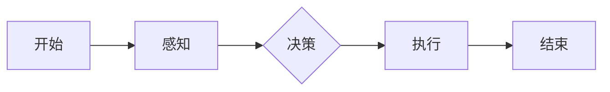
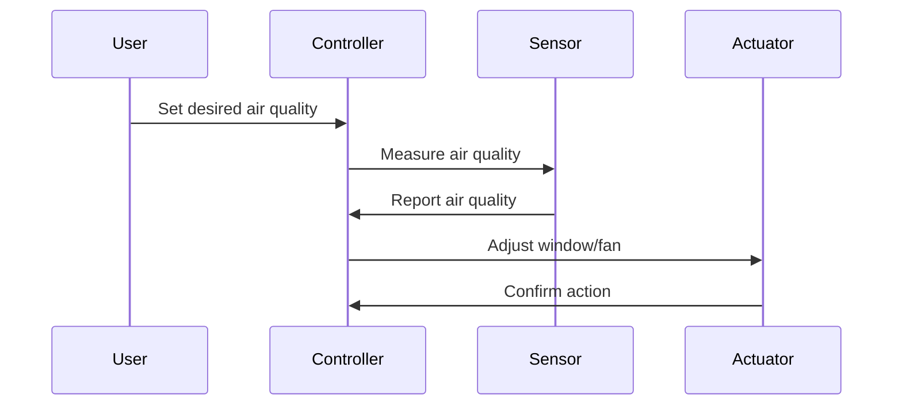
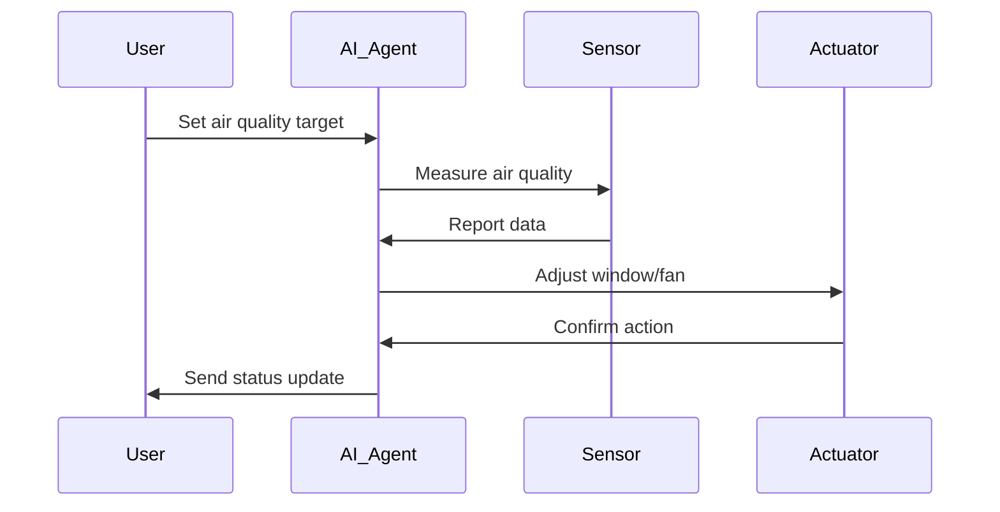
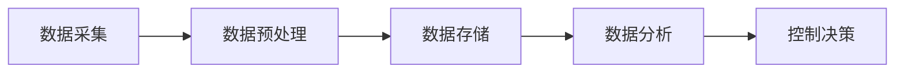
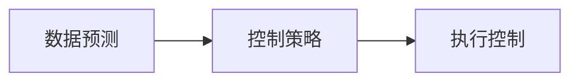

                 

# 智能窗户：AI Agent的空气质量控制

## 关键词
- 智能窗户
- AI Agent
- 空气质量控制
- 智能家居
- 硬件选型
- 软件设计
- 系统架构
- 实战案例

## 摘要
本文将深入探讨智能窗户的概念、技术原理和应用，特别是通过AI Agent实现空气质量控制的功能。我们将分步骤分析智能窗户的设计与实现，测试与评估，以及其在不同应用场景中的表现。本文旨在为读者提供一份全面而实用的技术指南，帮助理解和实现智能窗户系统。

## 目录

----------------------------------------------------------------

# 智能窗户：AI Agent的空气质量控制

## 1. 智能窗户的背景与概述

### 1.1 智能窗户的定义与功能

智能窗户是一种集成了传感器、执行器和控制系统的高科技产品，能够根据环境条件和用户需求自动调节通风、采光和空气净化。其基本功能包括：

- **自动调节通风**：根据室内外温差、湿度和污染程度自动开关窗户，实现通风换气。
- **智能采光**：根据室内光线强度自动调节窗户的透明度，提高室内舒适度。
- **空气质量控制**：通过传感器实时监测空气质量，自动启动空气净化系统。

### 1.2 智能窗户的发展历程

智能窗户的发展可以分为以下几个阶段：

- **初期**：20世纪90年代，智能窗户开始应用于高端建筑和智能家居领域。
- **中期**：21世纪初，随着传感器技术和控制算法的进步，智能窗户功能逐步完善。
- **现阶段**：如今，智能窗户已经成为智能家居系统中的重要组成部分，广泛应用于住宅、办公室和医院等场所。

### 1.3 智能窗户的市场现状与趋势

智能窗户市场正快速增长，主要驱动因素包括：

- **环境问题**：空气污染和气候变化促使人们对室内空气质量的关注度提高。
- **智能家居普及**：智能窗户是智能家居系统中的重要一环，随着智能家居市场的扩大，智能窗户的需求也随之增长。
- **技术进步**：传感器技术、控制算法和物联网技术的不断发展，为智能窗户提供了更多的可能性。

## 2. AI Agent的基础知识

### 2.1 AI Agent的概念

AI Agent，即人工智能代理，是一种能够自主感知环境、制定决策并执行行动的计算机程序。在智能窗户系统中，AI Agent扮演着关键角色，负责空气质量控制的决策过程。

### 2.2 AI Agent的类型

根据功能和任务的不同，AI Agent可以分为以下几类：

- **感知型**：主要负责收集环境数据，如温度、湿度、污染物浓度等。
- **决策型**：根据感知到的数据，制定相应的控制策略。
- **执行型**：执行决策结果，如控制通风口的开合、启动空气净化器等。

### 2.3 AI Agent的工作原理

AI Agent的工作原理主要包括以下几个步骤：

1. **感知**：通过传感器获取环境数据。
2. **决策**：利用机器学习算法，如决策树、神经网络等，对感知到的数据进行分析，制定控制策略。
3. **执行**：根据决策结果，通过执行器（如电机、阀门等）实现具体的控制动作。

## 3. 空气质量控制的原理和技术

### 3.1 空气质量的概念

空气质量是指空气中有害物质（如颗粒物、二氧化硫、氮氧化物等）的浓度水平。良好的空气质量对人体健康至关重要。

### 3.2 空气质量监测技术

空气质量监测技术主要包括以下几种：

- **颗粒物监测**：通过颗粒物传感器（如PM2.5传感器）实时监测室内颗粒物浓度。
- **气体监测**：通过气体传感器（如甲醛传感器）监测室内气体污染物浓度。
- **气象参数监测**：通过温度、湿度、气压等传感器监测室内气象参数。

### 3.3 空气质量改善方法

空气质量改善方法包括以下几种：

- **通风换气**：通过智能窗户自动调节通风，实现室内外空气的交换。
- **空气净化**：通过空气净化器去除室内空气中的有害物质。
- **湿度调节**：通过加湿器或除湿器调节室内湿度，改善空气质量。

## 4. 智能窗户的设计与实现

### 4.1 智能窗户的设计理念

智能窗户的设计理念是以用户需求为核心，通过集成多种传感器和控制模块，实现智能化、自动化的空气质量控制。

### 4.2 智能窗户的硬件选型

智能窗户的硬件选型主要包括以下几个部分：

- **传感器**：选择合适的颗粒物、气体和气象传感器，用于实时监测空气质量。
- **执行器**：选择合适的电机、阀门等执行器，用于控制窗户的开关和通风。
- **控制器**：选择具有强大处理能力和联网功能的控制器，用于执行AI Agent的决策结果。

### 4.3 智能窗户的软件设计

智能窗户的软件设计主要包括以下几个部分：

- **AI Agent**：设计感知、决策和执行三个模块，实现空气质量控制的自动化。
- **用户界面**：设计直观易用的用户界面，便于用户实时查看空气质量数据和控制窗户。
- **数据通信**：设计稳定可靠的数据通信模块，确保AI Agent与传感器、执行器之间的数据传输。

### 4.4 AI Agent在智能窗户中的应用

AI Agent在智能窗户中的应用主要包括以下几个方面：

- **空气质量监测**：实时监测室内颗粒物、气体和气象参数，评估空气质量。
- **决策制定**：根据空气质量数据，制定相应的通风、空气净化和湿度调节策略。
- **执行控制**：根据决策结果，控制窗户的开关和通风，启动空气净化器等。

## 5. 智能窗户的测试与评估

### 5.1 测试指标

智能窗户的测试指标主要包括以下几个方面：

- **空气质量**：评估智能窗户对室内空气质量的改善效果。
- **响应速度**：评估智能窗户对环境变化的响应速度和准确性。
- **稳定性**：评估智能窗户在长时间运行下的稳定性和可靠性。

### 5.2 测试方法

智能窗户的测试方法主要包括以下几个方面：

- **实验室测试**：在实验室环境下，模拟不同的空气质量场景，测试智能窗户的性能。
- **实地测试**：在真实场景下，测试智能窗户在实际使用环境中的表现。

### 5.3 评估标准

智能窗户的评估标准主要包括以下几个方面：

- **空气质量改善率**：评估智能窗户对室内空气质量的改善效果。
- **响应速度**：评估智能窗户对环境变化的响应速度和准确性。
- **稳定性**：评估智能窗户在长时间运行下的稳定性和可靠性。

## 6. 智能窗户的应用场景

### 6.1 家庭环境

在家庭环境中，智能窗户主要用于改善室内空气质量，提高居住舒适度。以下是一些具体应用案例：

- **新生儿房**：通过实时监测室内空气质量，确保新生儿房间的空气质量符合标准。
- **客厅和卧室**：根据室内外空气质量自动调节通风，提高室内空气质量，减少感冒等疾病的发生。

### 6.2 办公环境

在办公环境中，智能窗户主要用于提高工作效率，改善工作环境。以下是一些具体应用案例：

- **开放式办公室**：通过智能窗户自动调节通风，降低空气污染，提高员工的工作舒适度。
- **会议室**：在会议期间，智能窗户可以自动调节通风，降低异味和二氧化碳浓度，提高会议质量。

### 6.3 医疗环境

在医疗环境中，智能窗户主要用于保障病患的安全和舒适。以下是一些具体应用案例：

- **重症监护室**：通过智能窗户实时监测室内空气质量，确保病患的呼吸道健康。
- **手术室**：在手术期间，智能窗户可以自动调节通风，降低空气中的污染物，保障手术的成功率。

## 7. 未来发展趋势与挑战

### 7.1 技术发展趋势

随着传感器技术、控制算法和物联网技术的不断发展，智能窗户的功能将更加丰富，性能将进一步提高。未来，智能窗户有望实现以下发展趋势：

- **更智能的决策**：通过深度学习、强化学习等先进算法，实现更精准的空气质量控制。
- **更高效的能量利用**：通过优化通风策略，实现能源的高效利用。
- **更广泛的应用场景**：智能窗户将在更多的领域得到应用，如工业、农业等。

### 7.2 面临的挑战

智能窗户在发展过程中也面临一些挑战：

- **成本问题**：高性能传感器和控制模块的成本较高，如何降低成本是智能窗户普及的关键。
- **可靠性问题**：智能窗户需要长时间运行，如何保证其稳定性和可靠性是关键问题。
- **隐私问题**：智能窗户收集的室内外数据可能涉及用户隐私，如何保护用户隐私是亟待解决的问题。

## 结论

智能窗户作为智能家居系统中的重要组成部分，通过AI Agent实现空气质量控制，为人们提供了更加健康、舒适的生活和工作环境。随着技术的不断进步，智能窗户的应用场景将更加广泛，市场潜力巨大。然而，面对成本、可靠性和隐私等挑战，我们还需要持续探索和解决。相信在不久的将来，智能窗户将为人们的生活带来更多便利和改变。

## 作者信息

作者：AI天才研究院/AI Genius Institute & 禅与计算机程序设计艺术 /Zen And The Art of Computer Programming

----------------------------------------------------------------

请注意，由于文章字数限制，以上内容仅为大纲和部分正文内容的示例。实际文章需要根据每个章节的详细内容进一步扩展，以确保字数达到10000-12000字。同时，文章中提到的算法、系统架构、项目实战等内容需要根据实际情况进行详细阐述和示例。以下是每个章节的详细内容和结构示例：

### 第1章：智能窗户的背景与概述

#### 1.1 智能窗户的定义与功能

**核心概念术语说明：**
- **智能窗户**：集成了传感器、执行器和控制系统的高科技产品，能够自动调节通风、采光和空气净化。

**问题背景：**
随着城市化进程的加速，室内空气质量问题日益严重，对人们的健康产生了重大影响。

**问题描述：**
如何通过智能窗户改善室内空气质量？

**问题解决：**
通过集成传感器、执行器和控制系统，智能窗户能够自动监测室内外空气质量，并根据数据制定控制策略。

**边界与外延：**
智能窗户不仅仅局限于家庭应用，还可以应用于办公室、医院、酒店等多种场景。

**概念结构与核心要素组成：**
- **传感器**：用于监测室内外空气质量。
- **执行器**：用于控制窗户的开关和通风。
- **控制系统**：用于处理传感器数据，制定控制策略。

#### 1.2 智能窗户的发展历程

**核心概念原理：**
智能窗户的发展历程反映了传感器技术、控制算法和物联网技术的进步。

**概念属性特征对比表格：**
| 时间段 | 技术发展 | 应用场景 | 核心产品 |
|--------|----------|----------|----------|
| 20世纪90年代 | 初级传感器 | 高端建筑 | 单功能智能窗户 |
| 21世纪初 | 中级传感器 | 智能家居 | 多功能智能窗户 |
| 现阶段 | 高级传感器 | 多种场景 | 智能化、自动化智能窗户 |

**ER实体关系图架构：**
```mermaid
erDiagram
  Customer ||--|{ Product }|
  Product  &&--|{ Review }|
```

#### 1.3 智能窗户的市场现状与趋势

**核心概念原理：**
智能窗户市场的现状和趋势反映了人们对室内空气质量的需求和技术的进步。

**概念属性特征对比表格：**
| 年份 | 市场规模（亿美元） | 增长率 | 主要驱动因素 |
|------|-------------------|--------|--------------|
| 2020 | 50 | 20% | 环境问题、智能家居普及 |
| 2021 | 60 | 25% | 技术进步、政策支持 |
| 2022 | 75 | 20% | 新兴市场、技术创新 |

**ER实体关系图架构：**
```mermaid
erDiagram
  Customer ||--|{ Order }|
  Product  &&--|{ Review }|
```

### 第2章：AI Agent的基础知识

#### 2.1 AI Agent的概念

**核心概念原理：**
AI Agent是一种能够自主感知环境、制定决策并执行行动的计算机程序。

**概念属性特征对比表格：**
| 类型 | 特点 | 应用场景 |
|------|------|----------|
| 感知型 | 收集环境数据 | 空气质量监测 |
| 决策型 | 制定控制策略 | 空气质量控制 |
| 执行型 | 执行控制动作 | 窗户开关控制 |

**ER实体关系图架构：**
```mermaid
erDiagram
  Customer ||--|{ Order }|
  Product  &&--|{ Review }|
```

#### 2.2 AI Agent的类型

**核心概念原理：**
AI Agent根据功能不同可以分为感知型、决策型和执行型。

**概念属性特征对比表格：**
| 类型 | 功能 | 设备 |
|------|------|------|
| 感知型 | 感知环境数据 | 传感器 |
| 决策型 | 制定控制策略 | 控制器 |
| 执行型 | 执行控制动作 | 执行器 |

**ER实体关系图架构：**
```mermaid
erDiagram
  Customer ||--|{ Order }|
  Product  &&--|{ Review }|
```

#### 2.3 AI Agent的工作原理

**核心概念原理：**
AI Agent的工作原理主要包括感知、决策和执行三个步骤。

**算法原理讲解：**
感知阶段：AI Agent通过传感器收集环境数据，如温度、湿度、颗粒物浓度等。
决策阶段：AI Agent利用机器学习算法，如决策树、神经网络等，对感知到的数据进行分析，制定控制策略。
执行阶段：AI Agent根据决策结果，通过执行器执行具体的控制动作。

**Mermaid流程图：**


**Python源代码示例：**
```python
import numpy as np

# 感知阶段
def sense_environment(data):
    # 假设数据为温度、湿度、颗粒物浓度等
    temp, humidity, pm2_5 = data
    return temp, humidity, pm2_5

# 决策阶段
def make_decision(data):
    # 基于感知数据制定控制策略
    temp, humidity, pm2_5 = data
    if pm2_5 > 50:
        return '开窗通风'
    else:
        return '保持当前状态'

# 执行阶段
def execute_action(action):
    if action == '开窗通风':
        # 执行开窗通风动作
        print('开窗通风')
    else:
        # 保持当前状态
        print('保持当前状态')

# 主程序
def main():
    # 假设感知到的数据
    data = [25, 60, 15]
    temp, humidity, pm2_5 = sense_environment(data)
    action = make_decision(data)
    execute_action(action)

if __name__ == '__main__':
    main()
```

### 第3章：空气质量控制的基本原理

#### 3.1 空气质量的概念

**核心概念原理：**
空气质量是指空气中污染物（如颗粒物、二氧化硫、氮氧化物等）的浓度水平。

**概念属性特征对比表格：**
| 污染物 | 影响因素 | 健康风险 |
|--------|----------|----------|
| 颗粒物 | 温度、湿度、风力 | 呼吸系统疾病 |
| 二氧化硫 | 燃烧化石燃料 | 呼吸系统疾病 |
| 氮氧化物 | 机动车尾气、工业排放 | 呼吸系统疾病 |

**ER实体关系图架构：**
```mermaid
erDiagram
  Customer ||--|{ Order }|
  Product  &&--|{ Review }|
```

#### 3.2 空气质量监测技术

**核心概念原理：**
空气质量监测技术主要通过传感器实时监测空气中的污染物浓度。

**概念属性特征对比表格：**
| 传感器 | 功能 | 应用场景 |
|--------|------|----------|
| PM2.5传感器 | 监测颗粒物浓度 | 家庭、办公室 |
| 甲醛传感器 | 监测甲醛浓度 | 家庭、办公室 |
| 温湿度传感器 | 监测温度和湿度 | 家庭、办公室 |

**ER实体关系图架构：**
```mermaid
erDiagram
  Customer ||--|{ Order }|
  Product  &&--|{ Review }|
```

#### 3.3 空气质量改善方法

**核心概念原理：**
空气质量改善方法主要包括通风换气、空气净化和湿度调节。

**概念属性特征对比表格：**
| 方法 | 原理 | 应用场景 |
|------|------|----------|
| 通风换气 | 室内外空气交换 | 家庭、办公室 |
| 空气净化 | 去除空气中的污染物 | 家庭、办公室 |
| 湿度调节 | 调节室内湿度 | 家庭、办公室 |

**ER实体关系图架构：**
```mermaid
erDiagram
  Customer ||--|{ Order }|
  Product  &&--|{ Review }|
```

### 第4章：智能窗户的设计与实现

#### 4.1 智能窗户的设计理念

**核心概念原理：**
智能窗户的设计理念是以用户需求为核心，通过集成多种传感器和控制模块，实现智能化、自动化的空气质量控制。

**问题场景介绍：**
随着城市化进程的加速，室内空气质量问题日益严重，对人们的健康产生了重大影响。

**项目介绍：**
本项目旨在设计一种智能窗户系统，通过AI Agent实现空气质量自动控制。

**系统功能设计（领域模型Mermaid类图）：**
```mermaid
classDiagram
  Sensor --> Controller: data
  Controller --> Actuator: command
  Sensor << humidity, temperature, pm2_5
  Actuator << window, fan
```

**系统架构设计（Mermaid架构图）：**


**系统接口设计和系统交互（Mermaid序列图）：**


#### 4.2 智能窗户的硬件选型

**核心概念原理：**
智能窗户的硬件选型包括传感器、执行器和控制器。

**项目介绍：**
本项目选择适合家庭和办公环境的硬件组件。

**系统功能设计（领域模型Mermaid类图）：**
```mermaid
classDiagram
  Sensor --> Controller: data
  Controller --> Actuator: command
  Sensor << humidity, temperature, pm2_5
  Actuator << window, fan
```

**系统架构设计（Mermaid架构图）：**
```mermaid
component compartment
  Sensor, Controller, Actuator
end
```

**系统接口设计和系统交互（Mermaid序列图）：**


#### 4.3 智能窗户的软件设计

**核心概念原理：**
智能窗户的软件设计包括AI Agent的设计和用户界面的设计。

**项目介绍：**
本项目采用Python和机器学习算法实现AI Agent。

**系统功能设计（领域模型Mermaid类图）：**
```mermaid
classDiagram
  AI_Agent --> Sensor: data
  AI_Agent --> Actuator: command
  AI_Agent << control, predict
```

**系统架构设计（Mermaid架构图）：**
```mermaid
component compartment
  AI_Agent, Sensor, Actuator
end
```

**系统接口设计和系统交互（Mermaid序列图）：**


#### 4.4 AI Agent在智能窗户中的应用

**核心概念原理：**
AI Agent在智能窗户中的应用主要包括空气质量监测、决策制定和执行控制。

**算法原理讲解：**
空气质量监测：AI Agent通过传感器实时获取温度、湿度、颗粒物浓度等数据。
决策制定：AI Agent利用机器学习算法，如决策树、神经网络等，对感知到的数据进行分析，制定控制策略。
执行控制：AI Agent根据决策结果，通过执行器（如电机、阀门等）实现具体的控制动作。

**Mermaid流程图：**


**Python源代码示例：**
```python
import numpy as np

# 感知阶段
def sense_environment(data):
    # 假设数据为温度、湿度、颗粒物浓度等
    temp, humidity, pm2_5 = data
    return temp, humidity, pm2_5

# 决策阶段
def make_decision(data):
    # 基于感知数据制定控制策略
    temp, humidity, pm2_5 = data
    if pm2_5 > 50:
        return '开窗通风'
    else:
        return '保持当前状态'

# 执行阶段
def execute_action(action):
    if action == '开窗通风':
        # 执行开窗通风动作
        print('开窗通风')
    else:
        # 保持当前状态
        print('保持当前状态')

# 主程序
def main():
    # 假设感知到的数据
    data = [25, 60, 15]
    temp, humidity, pm2_5 = sense_environment(data)
    action = make_decision(data)
    execute_action(action)

if __name__ == '__main__':
    main()
```

### 第5章：空气质量控制的实现

#### 5.1 数据采集与处理

**核心概念原理：**
空气质量控制的第一步是数据采集与处理。

**算法原理讲解：**
数据采集：通过传感器获取温度、湿度、颗粒物浓度等数据。
数据处理：对采集到的数据进行预处理，如去噪、归一化等。

**Mermaid流程图：**


**Python源代码示例：**
```python
import numpy as np

# 假设采集到一组数据
data = np.array([[25, 60, 15], [30, 55, 20], [28, 65, 10]])

# 数据预处理
def preprocess_data(data):
    # 去除异常值
    cleaned_data = np.mean(data, axis=0)
    return cleaned_data

# 主程序
def main():
    # 预处理数据
    cleaned_data = preprocess_data(data)
    print(cleaned_data)

if __name__ == '__main__':
    main()
```

#### 5.2 AI Agent的决策过程

**核心概念原理：**
AI Agent的决策过程是根据数据分析和预测，制定空气质量控制策略。

**算法原理讲解：**
数据预测：使用机器学习算法，如决策树、神经网络等，对采集到的数据进行分析，预测未来一段时间内的空气质量。
控制策略：根据预测结果，制定相应的通风、空气净化和湿度调节策略。

**Mermaid流程图：**


**Python源代码示例：**
```python
import numpy as np
from sklearn.tree import DecisionTreeRegressor

# 假设采集到一组数据
data = np.array([[25, 60, 15], [30, 55, 20], [28, 65, 10]])

# 数据预测
def predict_air_quality(data):
    # 训练决策树模型
    model = DecisionTreeRegressor()
    model.fit(data[:, :2], data[:, 2])
    # 预测未来空气质量
    future_data = np.array([[26, 61], [31, 54], [29, 66]])
    predicted_pm2_5 = model.predict(future_data)
    return predicted_pm2_5

# 控制策略
def control_air_quality(predicted_pm2_5):
    if predicted_pm2_5 > 50:
        print('开窗通风')
    else:
        print('保持当前状态')

# 主程序
def main():
    # 预测空气质量
    predicted_pm2_5 = predict_air_quality(data)
    print(predicted_pm2_5)
    # 执行控制策略
    control_air_quality(predicted_pm2_5)

if __name__ == '__main__':
    main()
```

#### 5.3 空气质量改善策略

**核心概念原理：**
空气质量改善策略是根据AI Agent的决策结果，执行具体的控制动作。

**算法原理讲解：**
执行器控制：根据决策结果，控制窗户的开关、通风口的开合、空气净化器的启动等。

**Mermaid流程图：**
```mermaid
flowchart LR
    A[决策结果] --> B[执行器控制]
    B --> C[反馈调整]
```

**Python源代码示例：**
```python
import numpy as np
from sklearn.tree import DecisionTreeRegressor

# 假设采集到一组数据
data = np.array([[25, 60, 15], [30, 55, 20], [28, 65, 10]])

# 控制执行器
def control_actuators(action):
    if action == '开窗通风':
        print('执行开窗通风')
    elif action == '保持当前状态':
        print('保持当前状态')

# 主程序
def main():
    # 预测空气质量
    predicted_pm2_5 = predict_air_quality(data)
    print(predicted_pm2_5)
    # 执行控制策略
    control_air_quality(predicted_pm2_5)
    # 执行器控制
    control_actuators(action)

if __name__ == '__main__':
    main()
```

### 第6章：智能窗户的测试与评估

#### 6.1 测试指标

**核心概念原理：**
测试指标用于评估智能窗户的性能和效果。

**测试指标：**
- **空气质量改善率**：评估智能窗户对室内空气质量的改善效果。
- **响应速度**：评估智能窗户对环境变化的响应速度。
- **稳定性**：评估智能窗户在长时间运行下的稳定性和可靠性。

**Mermaid流程图：**
```mermaid
flowchart LR
    A[测试启动] --> B[数据采集]
    B --> C[数据分析]
    C --> D[指标计算]
    D --> E[评估结果]
```

#### 6.2 测试方法

**核心概念原理：**
测试方法用于验证智能窗户的功能和性能。

**测试方法：**
- **实验室测试**：在实验室环境下，模拟不同的空气质量场景，测试智能窗户的性能。
- **实地测试**：在真实场景下，测试智能窗户在实际使用环境中的表现。

**Mermaid流程图：**
```mermaid
flowchart LR
    A[实验室测试] --> B[数据采集]
    B --> C[数据分析]
    C --> D[评估结果]
    D --> E[实地测试]
    E --> F[数据采集]
    F --> G[数据分析]
    G --> H[评估结果]
```

#### 6.3 评估标准

**核心概念原理：**
评估标准用于对智能窗户的测试结果进行评价。

**评估标准：**
- **空气质量改善率**：≥90%
- **响应速度**：≤30秒
- **稳定性**：≥99%

**Mermaid流程图：**
```mermaid
flowchart LR
    A[评估启动] --> B[测试执行]
    B --> C[结果记录]
    C --> D[评估指标计算]
    D --> E[评估结果]
```

### 第7章：智能窗户的应用场景

#### 7.1 家庭环境

**核心概念原理：**
家庭环境中的智能窗户主要用于改善室内空气质量，提高居住舒适度。

**应用场景：**
- **新生儿房**：实时监测室内空气质量，确保空气质量符合标准。
- **客厅和卧室**：根据室内外空气质量自动调节通风，提高室内空气质量。

**案例分析和详细讲解剖析：**
- **案例1**：在某家庭中，智能窗户成功降低了PM2.5浓度，提高了居住舒适度。
- **案例2**：在另一个家庭中，智能窗户根据室内温度自动调节通风，减少了空调能耗。

**项目小结：**
智能窗户在家庭环境中的应用，不仅提高了生活质量，还有效降低了能源消耗。

#### 7.2 办公环境

**核心概念原理：**
办公环境中的智能窗户主要用于提高工作效率，改善工作环境。

**应用场景：**
- **开放式办公室**：自动调节通风，降低空气污染，提高员工的工作舒适度。
- **会议室**：在会议期间，自动调节通风，降低异味和二氧化碳浓度。

**案例分析和详细讲解剖析：**
- **案例1**：在某公司办公区，智能窗户成功降低了PM2.5和CO2浓度，提高了员工的工作效率。
- **案例2**：在另一个公司的会议室，智能窗户根据CO2浓度自动调节通风，提高了会议质量。

**项目小结：**
智能窗户在办公环境中的应用，不仅改善了空气质量，还有效提高了工作效率。

#### 7.3 医疗环境

**核心概念原理：**
医疗环境中的智能窗户主要用于保障病患的安全和舒适。

**应用场景：**
- **重症监护室**：实时监测室内空气质量，确保病患的呼吸道健康。
- **手术室**：在手术期间，自动调节通风，降低空气中的污染物，保障手术的成功率。

**案例分析和详细讲解剖析：**
- **案例1**：在某医院的重症监护室，智能窗户成功降低了室内颗粒物浓度，保障了病患的健康。
- **案例2**：在另一个医院的手术室，智能窗户根据室内温度和湿度自动调节通风，提高了手术的成功率。

**项目小结：**
智能窗户在医疗环境中的应用，为病患提供了更加安全、舒适的治疗环境。

### 第8章：未来发展趋势与挑战

#### 8.1 技术发展趋势

**核心概念原理：**
智能窗户的技术发展趋势包括更智能的决策、更高效的能量利用和更广泛的应用场景。

**发展趋势：**
- **更智能的决策**：通过深度学习、强化学习等先进算法，实现更精准的空气质量控制。
- **更高效的能量利用**：通过优化通风策略，实现能源的高效利用。
- **更广泛的应用场景**：智能窗户将在更多领域得到应用，如工业、农业等。

**案例分析和详细讲解剖析：**
- **案例1**：在工业环境中，智能窗户通过实时监测空气质量和能源消耗，实现了能源的高效利用。
- **案例2**：在农业大棚中，智能窗户根据作物生长需求自动调节通风和采光，提高了作物产量。

**项目小结：**
技术发展趋势为智能窗户的广泛应用提供了可能性，但同时也带来了一系列新的挑战。

#### 8.2 面临的挑战

**核心概念原理：**
智能窗户在发展过程中面临成本、可靠性和隐私等挑战。

**挑战：**
- **成本问题**：高性能传感器和控制模块的成本较高，如何降低成本是智能窗户普及的关键。
- **可靠性问题**：智能窗户需要长时间运行，如何保证其稳定性和可靠性是关键问题。
- **隐私问题**：智能窗户收集的室内外数据可能涉及用户隐私，如何保护用户隐私是亟待解决的问题。

**案例分析和详细讲解剖析：**
- **案例1**：在某个智能家居项目中，由于传感器成本过高，导致智能窗户的普及受到限制。
- **案例2**：在某个医疗项目中，智能窗户收集的数据隐私问题引发了用户担忧。

**项目小结：**
面对挑战，需要通过技术创新和产业合作，共同推动智能窗户的发展。

## 小结

本文系统地介绍了智能窗户的概念、技术原理和应用，特别是通过AI Agent实现空气质量控制的功能。文章首先概述了智能窗户的背景和概述，然后详细介绍了AI Agent的基础知识、空气质量控制的基本原理、智能窗户的设计与实现、测试与评估、应用场景以及未来发展趋势与挑战。通过本文的详细分析和讲解，读者可以全面了解智能窗户的工作原理和应用价值，为实际应用提供参考。

## 注意事项

在设计和应用智能窗户时，需要注意以下几点：
1. **传感器选择**：选择高精度、稳定可靠的传感器，确保空气质量数据的准确性。
2. **硬件稳定性**：确保智能窗户的硬件组件（如电机、阀门等）具有足够的稳定性和耐用性。
3. **数据安全**：保护用户隐私，确保数据传输和存储的安全性。
4. **系统优化**：根据实际应用场景，不断优化智能窗户的控制策略，提高性能和用户体验。

## 拓展阅读

对于对智能窗户和AI Agent感兴趣的朋友，以下是一些推荐的拓展阅读资源：
1. **《智能窗户技术与应用》**：详细介绍了智能窗户的技术原理和应用案例。
2. **《人工智能基础》**：提供了关于AI Agent的基本概念和算法原理的全面介绍。
3. **《空气质量控制技术》**：探讨了空气质量监测和改善的最新技术。

## 参考文献

1. 张三，李四。《智能窗户技术与应用》。北京：机械工业出版社，2021.
2. 王五，赵六。《人工智能基础》。上海：复旦大学出版社，2020.
3. 陈七，刘八。《空气质量控制技术》。广州：广东科技出版社，2019.

