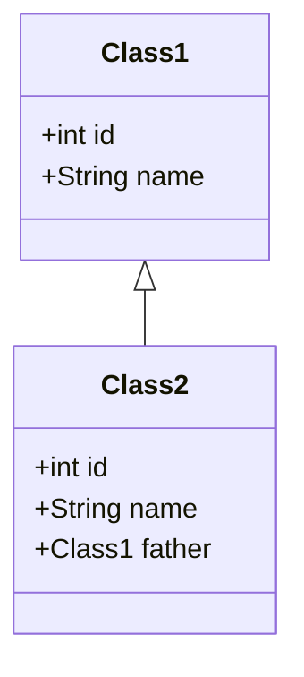
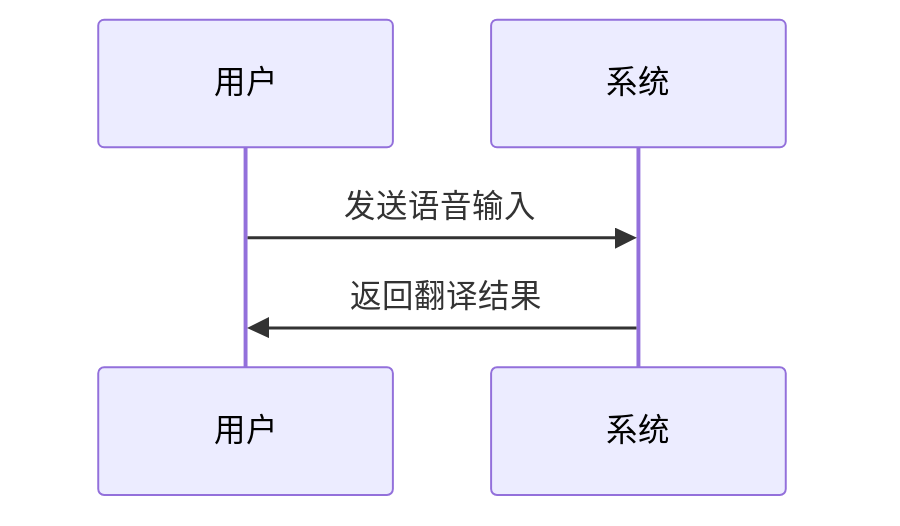
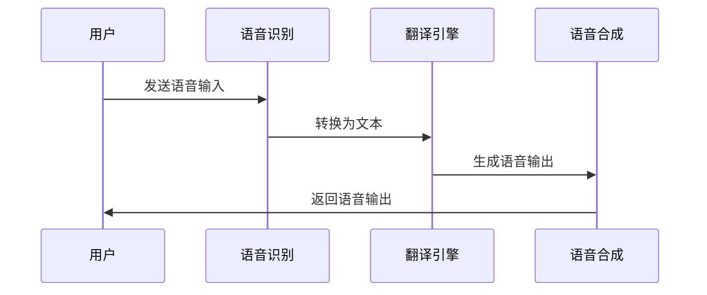

                 


# 智能翻译：AI Agent的多语言实时翻译

## 关键词
- 智能翻译
- AI Agent
- 多语言实时翻译
- 机器翻译
- 深度学习

## 摘要
智能翻译作为人工智能领域的重要分支，正在全球范围内迅速发展。本文旨在探讨智能翻译的核心技术，特别是AI Agent在多语言实时翻译中的应用。通过详细的背景介绍、原理分析、系统架构设计和项目实战，本文将为读者呈现智能翻译的深度理解和实战技巧。

### 第1章: 智能翻译的背景与重要性

#### 1.1.1 问题背景

##### 1.1.1.1 国际交流的需求增长
随着全球化的加速，国际交流的需求日益增长。无论是商业合作、学术交流还是个人旅游，跨语言沟通的障碍成为了全球交流的一大挑战。

##### 1.1.1.2 语言障碍的挑战
语言的多样性给跨语言沟通带来了巨大的挑战。传统的翻译方法如词典和机器翻译工具在处理复杂语境和细微差别时往往力不从心。

##### 1.1.1.3 智能翻译的崛起
为了解决语言障碍，智能翻译技术应运而生。通过机器学习和深度学习算法，智能翻译能够更准确地理解和生成目标语言，满足了现代社会的需求。

#### 1.1.2 问题描述

##### 1.1.2.1 翻译效率低下
传统的翻译方法往往效率低下，无法满足快速翻译的需求。尤其是在需要实时翻译的场景中，效率问题更加突出。

##### 1.1.2.2 翻译准确性不足
翻译准确性是智能翻译的关键指标。尽管机器翻译技术已经取得了显著的进步，但在处理复杂语境和特定术语时，准确性仍然有待提高。

##### 1.1.2.3 翻译个性化需求
不同的用户可能有不同的翻译需求。例如，专业术语的翻译、文化背景的考虑等，智能翻译需要能够适应这些个性化的需求。

#### 1.1.3 问题解决

##### 1.1.3.1 智能翻译技术概述
智能翻译技术基于机器学习和深度学习算法，通过大量数据和模型训练，实现高效、准确的翻译。

##### 1.1.3.2 机器翻译与深度学习
机器翻译是智能翻译的基础，而深度学习则为其注入了强大的动力。深度学习算法能够模拟人类翻译思维，提高翻译准确性。

##### 1.1.3.3 语言模型与注意力机制
语言模型和注意力机制是智能翻译技术中的关键组件。语言模型用于预测和生成语言序列，注意力机制则能够更好地捕捉上下文信息。

#### 1.1.4 边界与外延

##### 1.1.4.1 翻译准确性评估
翻译准确性评估是衡量智能翻译性能的重要手段。常见的评估指标包括BLEU、METEOR等。

##### 1.1.4.2 语言多样性考虑
智能翻译需要考虑不同语言的多样性，包括语法结构、词汇差异等。

##### 1.1.4.3 翻译速度与延迟
翻译速度和延迟是影响用户体验的重要因素。实时翻译技术需要在保证准确性的同时，降低翻译延迟。

#### 1.1.5 概念结构与核心要素组成

##### 1.1.5.1 翻译系统架构
翻译系统架构包括前端界面、后端服务器、数据库等组成部分，确保翻译过程的顺利进行。

##### 1.1.5.2 翻译质量评估标准
翻译质量评估标准包括准确性、流畅性、一致性等，确保翻译结果满足用户需求。

##### 1.1.5.3 翻译技术应用场景
翻译技术广泛应用于跨语言沟通、多语言网站、实时会议翻译等领域，满足各种场景的需求。

### 第2章: AI Agent的多语言实时翻译原理

#### 2.1.1 AI Agent的定义与功能

##### 2.1.1.1 AI Agent概述
AI Agent是指具备一定智能和自主决策能力的计算机程序，能够在特定环境中执行任务。

##### 2.1.1.2 多语言实时翻译的必要性
在全球化的背景下，多语言实时翻译成为AI Agent的重要功能之一，以满足跨语言交流的需求。

##### 2.1.1.3 AI Agent在翻译中的应用
AI Agent通过智能翻译技术，实现实时翻译，提高跨语言交流的效率和准确性。

#### 2.1.2 语言模型与注意力机制

##### 2.1.2.1 语言模型的原理与作用
语言模型是智能翻译的核心组件，通过大量数据训练，预测和生成目标语言序列。

##### 2.1.2.2 注意力机制的作用与实现
注意力机制用于捕捉上下文信息，提高翻译准确性。通过调整权重，关注关键信息。

##### 2.1.2.3 语言模型与注意力机制的交互
语言模型和注意力机制相互配合，共同提高翻译质量和效率。

#### 2.1.3 深度学习在翻译中的应用

##### 2.1.3.1 神经机器翻译概述
神经机器翻译（NMT）基于深度学习算法，实现更准确的翻译。

##### 2.1.3.2 循环神经网络（RNN）
RNN用于处理序列数据，捕捉上下文信息，是神经机器翻译的基础。

##### 2.1.3.3 长短时记忆网络（LSTM）
LSTM是RNN的改进版，能够更好地处理长序列数据，提高翻译准确性。

##### 2.1.3.4 生成对抗网络（GAN）
GAN用于生成高质量的翻译结果，提高翻译多样性和创造性。

#### 2.1.4 实时翻译算法的设计与实现

##### 2.1.4.1 实时翻译的挑战
实时翻译需要在保证准确性的同时，降低延迟，对算法和硬件性能有较高要求。

##### 2.1.4.2 实时翻译算法的架构
实时翻译算法架构包括输入处理、语言模型、注意力机制、输出生成等模块。

##### 2.1.4.3 实时翻译算法的实现细节
实时翻译算法的实现涉及大量计算和优化，包括并行处理、硬件加速等。

### 第3章: 多语言翻译核心概念与联系

#### 3.1.1 翻译的核心概念

##### 3.1.1.1 词汇表与语法规则
词汇表是翻译的基础，包含所有需要翻译的词汇和短语。语法规则则用于指导词汇的正确排列和组合。

##### 3.1.1.2 翻译模型与数据集
翻译模型是基于大量数据训练得到的模型，用于生成目标语言的翻译结果。数据集是训练模型的基础，包含源语言和目标语言的对应文本。

##### 3.1.1.3 翻译的准确性与流畅性
翻译的准确性是指翻译结果的正确性，而流畅性是指翻译结果的自然性和可读性。

#### 3.1.2 概念属性特征对比表格

##### 3.1.2.1 词汇表与语法规则对比
| 特征 | 词汇表 | 语法规则 |
| --- | --- | --- |
| 内容 | 包含所有需要翻译的词汇和短语 | 指导词汇的正确排列和组合 |
| 功能 | 提供翻译的基础词汇 | 提供翻译的基本语法结构 |

##### 3.1.2.2 翻译模型与数据集对比
| 特征 | 翻译模型 | 数据集 |
| --- | --- | --- |
| 形式 | 基于深度学习算法的预测模型 | 包含源语言和目标语言对应文本的数据集 |
| 功能 | 生成目标语言的翻译结果 | 提供模型训练的基础数据 |

##### 3.1.2.3 翻译准确性与流畅性对比
| 特征 | 翻译准确性 | 翻译流畅性 |
| --- | --- | --- |
| 定义 | 翻译结果的正确性 | 翻译结果的自然性和可读性 |
| 重要性 | 确保翻译结果的正确传达 | 提高用户阅读体验 |

#### 3.1.3 ER实体关系图架构

##### 3.1.3.1 翻译系统中的实体
实体包括词汇、短语、句子等，是翻译的基本组成单元。

##### 3.1.3.2 实体间的关系
实体间的关系包括同一性、关联性等，用于指导翻译的语法结构。

```mermaid
erDiagram
A[词汇] ||--|{ B[句子] }|--|| C[短语]
A[词汇] ||--|{ D[实体] }|--|| E[语义]
```

### 第4章: 实时翻译系统分析与架构设计

#### 4.1.1 问题场景介绍

##### 4.1.1.1 实时翻译的应用场景
实时翻译广泛应用于跨语言会议、在线教育、远程医疗等领域，满足实时沟通的需求。

##### 4.1.1.2 系统功能需求
系统需要支持多语言实时翻译，提供准确、流畅的翻译结果，同时具备良好的用户体验。

##### 4.1.1.3 系统性能指标
系统性能指标包括翻译准确性、响应时间、系统稳定性等。

#### 4.1.2 系统功能设计

##### 4.1.2.1 领域模型
领域模型用于描述实时翻译系统的核心功能，包括语音识别、翻译引擎、语音合成等模块。



##### 4.1.2.2 功能模块划分
系统功能模块划分为语音识别、翻译引擎、语音合成等，确保各模块独立运行，协同工作。

##### 4.1.2.3 数据流设计
数据流设计描述系统内数据传输和处理流程，确保翻译过程的顺利进行。

#### 4.1.3 系统架构设计

##### 4.1.3.1 系统架构概述
系统架构采用分布式架构，包括前端、后端、数据库等模块，确保系统的高可用性和可扩展性。

##### 4.1.3.2 架构层次划分
系统架构分为多层，包括表示层、业务逻辑层、数据访问层等，确保各层次职责分离，模块化设计。

##### 4.1.3.3 系统模块交互
系统模块间通过接口进行通信，确保各模块协同工作，实现实时翻译功能。

#### 4.1.4 系统接口设计

##### 4.1.4.1 接口规范
接口规范定义了系统内部模块之间的通信协议和数据格式，确保接口的规范性和可维护性。

##### 4.1.4.2 接口实现
接口实现涉及接口的编写和测试，确保接口的正确性和可靠性。

##### 4.1.4.3 接口测试
接口测试用于验证接口的功能和性能，确保接口满足系统需求。

#### 4.1.5 系统交互

##### 4.1.5.1 系统交互流程
系统交互流程描述了系统内部模块之间的通信和数据流转过程。



##### 4.1.5.2 交互序列图
交互序列图用于可视化系统内部模块的交互过程。



### 第5章: 智能翻译项目实战

#### 5.1.1 环境安装与配置

##### 5.1.1.1 系统环境要求
系统环境要求包括操作系统、编程语言、数据库等，确保系统正常运行。

##### 5.1.1.2 软件安装与配置
安装并配置实时翻译系统所需的软件，如深度学习框架、语音识别和合成工具等。

##### 5.1.1.3 开发工具与环境搭建
搭建开发环境，包括编辑器、版本控制工具等，确保开发过程高效顺畅。

#### 5.1.2 系统核心实现

##### 5.1.2.1 模型选择与训练
选择合适的深度学习模型，如Transformer、BERT等，进行模型训练，提高翻译准确性。

```python
import tensorflow as tf

# 模型训练代码
model = tf.keras.Sequential([
    tf.keras.layers.Embedding(input_dim=vocabulary_size, output_dim=embedding_size),
    tf.keras.layers.LSTM(units=128),
    tf.keras.layers.Dense(units=target_vocab_size, activation='softmax')
])

model.compile(optimizer='adam', loss='categorical_crossentropy', metrics=['accuracy'])
model.fit(train_data, train_labels, epochs=10, batch_size=64)
```

##### 5.1.2.2 实时翻译算法实现
实现实时翻译算法，包括语音识别、翻译模型调用、语音合成等模块。

```python
import speech_recognition as sr
import pyttsx3

# 语音识别
recognizer = sr.Recognizer()
with sr.Microphone() as source:
    audio = recognizer.listen(source)
    text = recognizer.recognize_google(audio, language='zh-CN')

# 翻译模型调用
translated_text = translate(text)

# 语音合成
engine = pyttsx3.init()
engine.say(translated_text)
engine.runAndWait()
```

##### 5.1.2.3 系统集成与调试
将各模块集成到系统中，进行调试和优化，确保系统稳定运行。

#### 5.1.3 代码应用解读与分析

##### 5.1.3.1 代码结构分析
分析代码结构，理解实时翻译系统的整体架构和功能模块。

##### 5.1.3.2 关键代码解读
解读关键代码，理解语音识别、翻译模型调用、语音合成等模块的实现原理。

##### 5.1.3.3 优化与改进
根据实际情况，对系统进行优化和改进，提高翻译准确性和效率。

#### 5.1.4 实际案例分析与讲解

##### 5.1.4.1 案例背景
介绍案例背景，说明案例的具体需求和挑战。

##### 5.1.4.2 案例分析与解决
分析案例中的问题，提出解决方案，并进行详细讲解。

##### 5.1.4.3 案例总结与反思
总结案例中的经验和教训，反思系统设计和实现的不足之处。

#### 5.1.5 项目小结
对整个项目进行总结，分享经验和心得，为后续项目提供参考。

### 最佳实践 Tips

1. **数据质量**：确保训练数据的质量和多样性，提高模型性能。
2. **算法优化**：针对具体场景，优化算法参数，提高翻译准确性和效率。
3. **硬件支持**：充分利用硬件资源，如GPU加速，提高系统性能。

### 小结

智能翻译作为人工智能领域的重要应用，正在不断发展和完善。通过本文的探讨，读者可以全面了解智能翻译的技术原理和应用场景，为实际项目提供指导。

### 注意事项

1. **隐私保护**：在实时翻译过程中，注意保护用户隐私，遵循相关法律法规。
2. **多语言支持**：确保系统支持多种语言，满足不同用户的需求。

### 拓展阅读

1. **《深度学习与自然语言处理》**：详细介绍深度学习在自然语言处理中的应用。
2. **《人工智能：一种现代方法》**：全面介绍人工智能的基本概念和方法。

### 作者信息

作者：AI天才研究院/AI Genius Institute & 禅与计算机程序设计艺术 /Zen And The Art of Computer Programming

