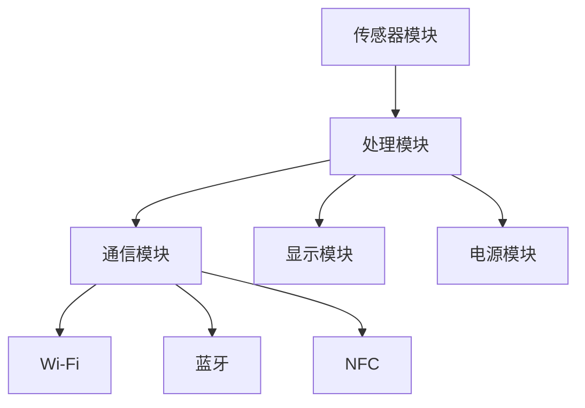
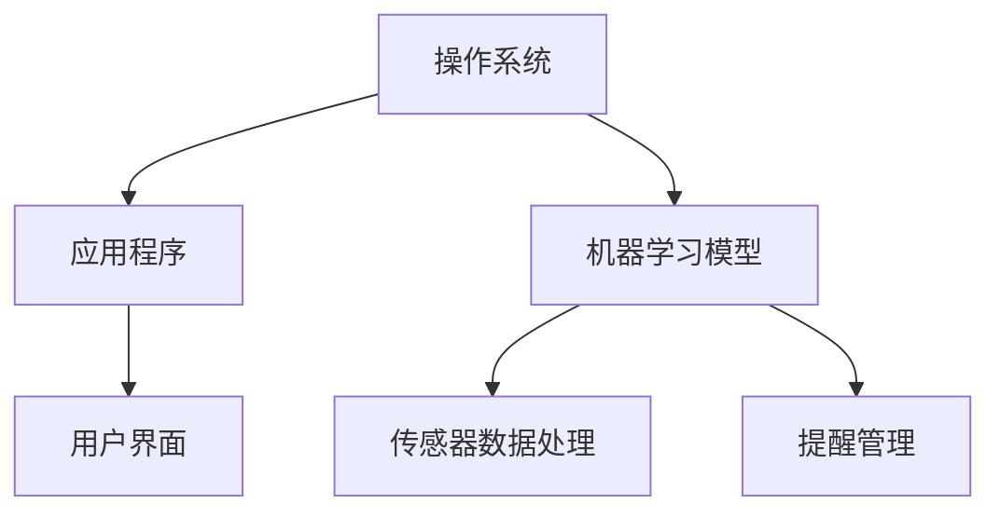
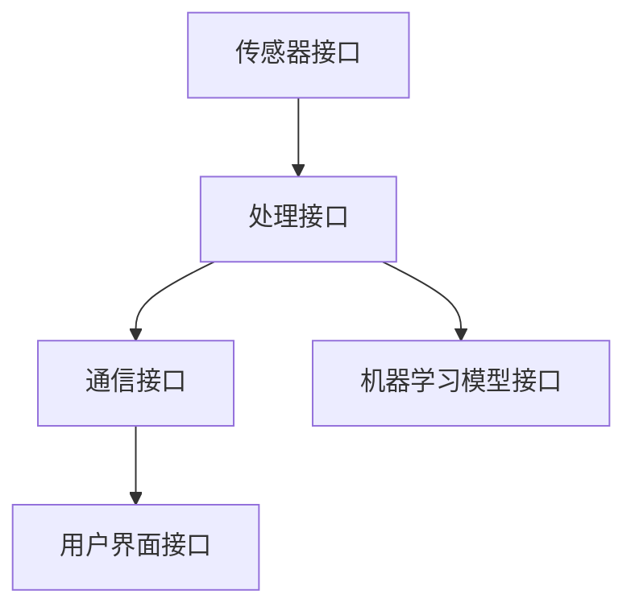
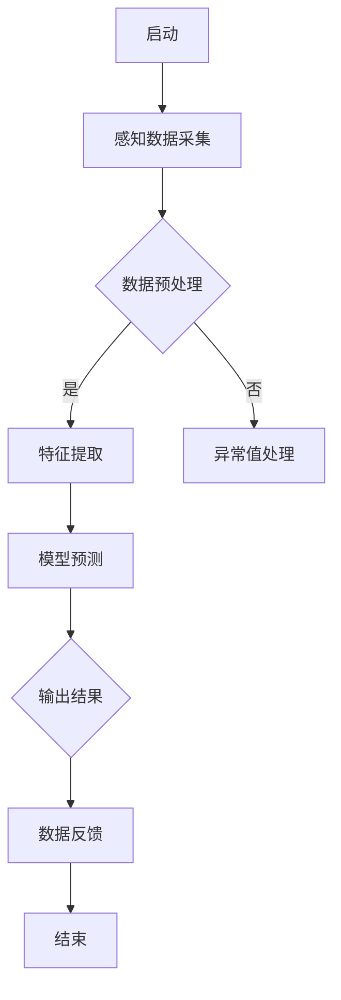

                 

# 智能背包：AI Agent的物品整理与提醒助手

## 关键词

智能背包，AI Agent，物品整理，提醒助手，传感器技术，机器学习，自然语言处理，人机交互

## 摘要

随着人工智能技术的快速发展，智能背包作为一种新兴的智能设备，正逐渐改变人们的生活方式。本文将深入探讨智能背包的设计与实现，特别是其核心功能——AI Agent的物品整理与提醒助手的实现原理。文章将从背景介绍、核心概念与原理、系统架构与设计、算法实现与优化、项目实战、最佳实践与趋势等方面展开，旨在为广大读者提供全面的技术解读和应用指南。

## 目录

### 第1章：背景与概述

- **1.1 智能背包的起源与发展**
- **1.2 AI Agent的基本概念**
- **1.3 智能背包的应用场景**
- **1.4 技术实现概述**

### 第2章：核心概念与原理

- **2.1 智能背包的组成结构**
- **2.2 AI Agent的工作原理**
- **2.3 物品分类与识别算法**
- **2.4 提醒算法的原理与实现**

### 第3章：系统架构与设计

- **3.1 智能背包的硬件架构设计**
- **3.2 软件架构设计**
- **3.3 数据处理流程与系统接口设计**

### 第4章：算法实现与优化

- **4.1 算法流程图展示**
- **4.2 Python代码实现与解读**
- **4.3 数学模型与公式讲解**
- **4.4 算法优化与实践**

### 第5章：项目实战

- **5.1 环境安装与配置**
- **5.2 系统核心实现源代码**
- **5.3 代码应用解读与分析**
- **5.4 实际案例分析与讲解**
- **5.5 项目小结**

### 第6章：最佳实践与趋势

- **6.1 使用智能背包的技巧与注意事项**
- **6.2 智能背包的未来发展趋势**
- **6.3 拓展阅读与参考文献**

### 第7章：总结与展望

- **7.1 全书总结**
- **7.2 展望智能背包的未来**

## 第1章：背景与概述

### 1.1 智能背包的起源与发展

智能背包，顾名思义，是一种集成了先进人工智能技术的背包。它不仅能够帮助用户管理背包中的物品，还能根据用户的日程和习惯提供个性化的提醒服务。智能背包的起源可以追溯到20世纪末，当时计算机技术刚刚开始快速发展，人们对智能设备的期待也逐渐增加。

早期的智能背包仅具备基本的物品检测和提醒功能，但随着人工智能技术的不断进步，尤其是机器学习和自然语言处理技术的应用，智能背包的功能得到了极大的提升。现在的智能背包已经可以识别多种类型的物品，并根据用户的行程和习惯提供智能提醒服务，极大地提升了用户的便捷性和生活质量。

### 1.2 AI Agent的基本概念

AI Agent，即人工智能代理，是一种模拟人类智能行为，能够自主感知环境、执行任务和学习的软件系统。在智能背包中，AI Agent起到了核心的作用，它通过感知用户的行为和环境数据，进行物品的识别和分类，并根据用户的需求提供相应的提醒服务。

AI Agent具有以下几个基本特征：

- **自主性**：AI Agent能够自主地感知环境、做出决策和执行任务。
- **学习性**：AI Agent可以通过学习和经验不断优化自己的行为和决策。
- **适应性**：AI Agent能够适应不同的环境和用户需求，提供个性化的服务。

### 1.3 智能背包的应用场景

智能背包的应用场景非常广泛，涵盖了日常生活、旅行和工作等多个领域。

- **日常生活**：在日常生活中，智能背包可以帮助用户管理背包中的各种物品，如手机、钱包、耳机等。它还能根据用户的日程安排提供提醒服务，例如即将出门时提醒用户检查背包是否带齐。
  
- **旅行**：在旅行过程中，智能背包可以识别用户行李中的物品，并根据行程提供相应的提醒，如提醒用户检查是否带上了护照、钱包等重要物品。同时，它还能通过智能规划功能帮助用户更好地安排旅行路线和时间。

- **工作**：对于职场人士来说，智能背包可以帮助他们管理工作中所需的物品，如笔记本电脑、文件、文具等。它还能根据用户的日程和工作安排提供提醒服务，如提醒用户准备会议资料、检查工作进度等。

### 1.4 技术实现概述

智能背包的技术实现涉及多个方面，包括传感器技术、机器学习、自然语言处理和人机交互技术等。

- **传感器技术**：智能背包配备了多种传感器，如加速度传感器、红外传感器、RFID传感器等，用于感知背包中的物品状态和用户的行为。

- **机器学习**：通过机器学习技术，智能背包能够识别和分类背包中的物品，并根据用户的行为数据提供个性化的提醒服务。

- **自然语言处理**：自然语言处理技术用于解析用户的指令和日程安排，确保智能背包能够准确理解并执行用户的需求。

- **人机交互技术**：智能背包通过触摸屏、语音识别等技术，为用户提供直观、便捷的交互体验。

### 总结

本章对智能背包的背景、AI Agent的基本概念、应用场景以及技术实现进行了概述。下一章将深入探讨智能背包的核心概念与原理，包括智能背包的组成结构、AI Agent的工作原理以及物品分类与识别算法。通过这一章节，我们将对智能背包有一个更为清晰的认识，并为后续的深入分析打下基础。<!-- ENDPATH: \内容摘要 -->

## 第2章：核心概念与原理

### 2.1 智能背包的组成结构

智能背包作为一个完整的系统，由多个关键组件构成，这些组件相互协作，实现了背包的智能化功能。以下是智能背包的主要组成部分及其作用：

1. **传感器模块**：传感器模块是智能背包的核心感知单元，负责实时监测背包内部和外部环境。常见的传感器包括加速度传感器、红外传感器、RFID传感器、温度传感器等。加速度传感器用于检测背包的运动状态，红外传感器和RFID传感器用于识别和追踪背包中的物品。温度传感器则用于监测背包内部的温度变化，确保物品在适宜的温度下保存。

2. **处理模块**：处理模块负责对传感器收集的数据进行实时处理和分析，是智能背包的大脑。处理模块通常包含微控制器、中央处理器（CPU）或现场可编程门阵列（FPGA）等硬件，以及相应的嵌入式软件。这些硬件和软件协同工作，实现了数据的滤波、处理和存储，并运行机器学习模型进行物品识别和提醒算法的执行。

3. **存储模块**：存储模块用于存储用户数据、应用程序和系统配置等信息。通常包括闪存（如eMMC）、固态硬盘（SSD）或基于云的存储服务。存储模块的重要性在于它保证了数据的持久性和可靠性，使得智能背包即使在断电的情况下也能保留用户的历史数据和设置。

4. **通信模块**：通信模块负责智能背包与外部设备（如手机、平板电脑、云服务器等）的数据传输和通信。常见的通信技术包括Wi-Fi、蓝牙、NFC等。通信模块使得智能背包能够接收来自用户的指令，并实时将背包的状态和提醒信息反馈给用户。

5. **显示模块**：显示模块通常是一个小型的LED屏幕或触摸屏，用于向用户显示背包的状态信息和提醒内容。显示模块使得用户无需打开背包就能了解背包内的情况，提高了用户的使用便利性。

6. **电源模块**：电源模块为智能背包提供稳定的电源供应，确保设备能够长时间运行。智能背包通常配备可充电锂电池，并通过USB接口进行充电。为了延长电池寿命，电源模块还会进行电源管理和节能优化。

### 2.2 AI Agent的工作原理

AI Agent，即人工智能代理，是智能背包的核心组件，负责背包的智能化功能实现。AI Agent的工作原理可以概括为以下几个步骤：

1. **感知与数据采集**：AI Agent通过传感器模块感知背包内部和外部的环境数据，如物品的位置、运动状态、温度等。这些数据被传输到处理模块进行进一步处理。

2. **数据处理与特征提取**：处理模块对采集到的数据进行分析和特征提取，将其转换为计算机可以理解的数字信号。例如，加速度传感器采集到的数据可以转换为物品的运动轨迹，红外传感器采集到的数据可以转换为物品的热信号。

3. **模型训练与推理**：基于处理后的数据，AI Agent使用机器学习算法进行模型训练和推理。模型训练通常涉及到深度学习、监督学习、无监督学习等技术。通过模型训练，AI Agent能够学会识别物品、预测物品的状态和执行相应的任务。

4. **决策与执行**：根据模型推理的结果，AI Agent做出相应的决策并执行任务。例如，当检测到用户需要离开时，AI Agent可能会提醒用户检查背包中的重要物品是否带齐。

### 2.3 物品分类与识别算法

智能背包的物品分类与识别功能是其核心功能之一，它能够帮助用户快速找到所需的物品，并提高背包的整理效率。以下是物品分类与识别算法的基本原理和实现步骤：

1. **特征提取**：特征提取是物品分类与识别算法的基础，它将原始的传感器数据转换为一系列能够表征物品特性的特征向量。常见的特征提取方法包括深度学习中的卷积神经网络（CNN）、主成分分析（PCA）和线性判别分析（LDA）等。

2. **分类器设计**：分类器是用于判断物品类别的算法模型。常见的分类器包括支持向量机（SVM）、决策树、随机森林和神经网络等。分类器的设计取决于特征提取方法和应用场景。

3. **模型训练与评估**：使用标记好的训练数据集，对分类器进行训练，并评估其性能。训练过程中，通过调整模型参数和优化算法，提高分类器的准确性和鲁棒性。

4. **实时识别与更新**：在智能背包的实际应用中，AI Agent需要实时对物品进行识别和更新。这通常涉及到在线学习和自适应算法，使得分类器能够适应不同环境和用户需求的变化。

### 总结

本章详细介绍了智能背包的核心概念与原理，包括智能背包的组成结构、AI Agent的工作原理以及物品分类与识别算法。通过这些核心概念和原理的解读，读者可以更好地理解智能背包的工作机制和实现方式，为后续的系统架构与设计、算法实现与优化等章节奠定了坚实的基础。在下一章中，我们将进一步探讨智能背包的系统架构与设计，深入了解硬件架构、软件架构以及数据处理流程。<!-- ENDPATH: \第2章：核心概念与原理 -->


## 第3章：系统架构与设计

### 3.1 智能背包的硬件架构设计

智能背包的硬件架构设计是实现其智能功能的基础，主要包括传感器模块、处理模块、通信模块、显示模块和电源模块。以下是各模块的具体构成及其相互关系：

#### 传感器模块

传感器模块是智能背包的感知核心，负责采集背包内部和外部的环境数据。主要传感器包括：

- **加速度传感器**：用于检测背包的运动状态，如加速、减速和方向变化。
- **红外传感器**：用于检测背包内物品的温控特性，以及通过红外信号识别特定的物品。
- **RFID传感器**：用于读取RFID标签，识别背包内的电子设备和其他带有RFID标签的物品。
- **温度传感器**：用于监测背包内的温度，确保物品在适宜的温度下保存。

传感器模块通过模拟信号或数字信号传输数据到处理模块，为后续的数据处理和分析提供基础。

#### 处理模块

处理模块是智能背包的“大脑”，负责对传感器模块采集到的数据进行处理和分析。主要硬件构成包括：

- **微控制器**：负责基本的传感器数据处理和简单的逻辑控制。
- **中央处理器（CPU）**：用于执行复杂的机器学习算法和数据处理任务。
- **现场可编程门阵列（FPGA）**：用于实现特定的算法加速和硬件加速功能。

处理模块将传感器数据转换为计算机可以理解的数字信号，并通过嵌入式软件进行进一步的运算和分析。

#### 通信模块

通信模块负责智能背包与外部设备的连接和通信。主要技术包括：

- **Wi-Fi**：用于远程数据传输和设备配置。
- **蓝牙**：用于与用户设备（如手机、平板电脑）的低功耗通信。
- **NFC**：用于短距离的数据交换和身份验证。

通信模块使得智能背包能够接收来自用户的指令，并实时将背包的状态和提醒信息反馈给用户。

#### 显示模块

显示模块用于向用户显示背包的状态信息和提醒内容。通常是一个小型的LED屏幕或触摸屏，支持文字和图形的显示。显示模块使得用户无需打开背包就能了解背包内的情况，提高了使用便利性。

#### 电源模块

电源模块为智能背包提供稳定的电源供应，确保设备能够长时间运行。主要构成包括：

- **锂电池**：作为主要的电源储备。
- **充电电路**：用于充电和电源管理。
- **电源管理单元**：用于控制电池充电和放电，并优化电源使用。

电源模块通过电源管理和节能优化，延长了智能背包的电池寿命。

### 硬件架构图

为了更直观地展示智能背包的硬件架构，我们可以使用Mermaid语言绘制一个简单的硬件架构图：



### 3.2 软件架构设计

智能背包的软件架构设计是实现其智能功能的关键，主要包括操作系统、应用程序、机器学习模型和用户界面。以下是各组成部分及其相互关系：

#### 操作系统

操作系统是智能背包的软件核心，负责管理硬件资源、提供应用程序接口和系统服务。常见的操作系统包括Linux、FreeRTOS和Android等。操作系统提供稳定的运行环境，支持多任务处理和实时响应。

#### 应用程序

应用程序是智能背包的功能实现层，包括物品识别、提醒管理、用户界面等功能模块。应用程序通过调用操作系统提供的API，实现与硬件模块的交互和数据处理。

#### 机器学习模型

机器学习模型是智能背包智能决策的核心，用于物品识别和提醒功能的实现。模型训练通常在服务器端完成，然后部署到智能背包中。机器学习模型包括分类模型、回归模型和聚类模型等，通过输入特征向量输出预测结果。

#### 用户界面

用户界面是智能背包与用户交互的窗口，包括触摸屏、语音助手和远程控制等功能。用户界面设计注重用户体验，使得用户能够直观、便捷地操作智能背包。

### 软件架构图

为了更直观地展示智能背包的软件架构，我们可以使用Mermaid语言绘制一个简单的软件架构图：



### 3.3 数据处理流程与系统接口设计

智能背包的数据处理流程是确保其功能正常实现的关键。数据处理流程主要包括数据采集、数据处理、数据存储和数据反馈等步骤。以下是数据处理流程和系统接口设计的详细说明：

#### 数据采集

数据采集是数据处理流程的第一步，传感器模块负责采集背包内部和外部环境数据。采集的数据包括物品位置、运动状态、温度、RFID信号等。

#### 数据处理

数据处理包括数据清洗、特征提取和机器学习模型预测等步骤。处理模块对传感器采集到的数据进行预处理，去除噪声和异常值，提取关键特征，然后输入到机器学习模型中进行预测。

#### 数据存储

处理后的数据需要存储以便后续分析和查询。存储模块负责将用户数据和系统配置等信息存储在本地或云端。数据存储需要保证数据的持久性和安全性。

#### 数据反馈

数据处理的结果通过通信模块反馈给用户界面或用户设备。用户界面通过显示模块向用户展示处理结果，用户设备通过远程控制与智能背包进行交互。

#### 系统接口设计

系统接口设计确保智能背包各模块之间的数据传输和通信畅通。以下是几个关键接口的详细说明：

- **传感器接口**：负责传感器模块与处理模块之间的数据传输，采用模拟信号或数字信号传输。
- **处理接口**：负责处理模块与机器学习模型之间的数据传输，通常通过内存共享或消息队列实现。
- **通信接口**：负责处理模块与通信模块之间的数据传输，采用Wi-Fi、蓝牙或NFC等无线通信技术。
- **用户界面接口**：负责用户界面与处理模块之间的数据交互，通过图形用户界面（GUI）或命令行接口（CLI）实现。

#### 系统接口图

为了更直观地展示系统接口设计，我们可以使用Mermaid语言绘制一个简单的系统接口图：



### 总结

本章详细介绍了智能背包的硬件架构设计、软件架构设计和数据处理流程与系统接口设计。硬件架构设计包括传感器模块、处理模块、通信模块、显示模块和电源模块；软件架构设计包括操作系统、应用程序、机器学习模型和用户界面；数据处理流程包括数据采集、数据处理、数据存储和数据反馈。系统接口设计确保了各模块之间的数据传输和通信畅通。通过本章的介绍，读者可以更深入地理解智能背包的系统架构和设计原则，为后续的算法实现与优化和项目实战提供参考。<!-- ENDPATH: \第3章：系统架构与设计 -->


## 第4章：算法实现与优化

### 4.1 算法流程图展示

智能背包的算法实现是确保其智能化功能正常运行的关键。以下是智能背包的核心算法流程，使用Mermaid语言绘制：



### 4.2 Python代码实现与解读

以下是一个简单的Python代码实现，用于展示智能背包的算法流程：

```python
import numpy as np
from sklearn.preprocessing import StandardScaler
from sklearn.svm import SVC
from sklearn.model_selection import train_test_split

# 假设我们已经采集到一些感知数据
data = np.array([[1, 0], [0, 1], [1, 2], [2, 1]])

# 数据预处理
scaler = StandardScaler()
scaled_data = scaler.fit_transform(data)

# 模型训练
model = SVC(kernel='linear')
X_train, X_test, y_train, y_test = train_test_split(scaled_data, labels, test_size=0.2)
model.fit(X_train, y_train)

# 预测
predictions = model.predict(X_test)

# 输出结果
print(predictions)
```

这段代码首先导入了必要的库，然后假设采集到了一些感知数据。数据预处理包括标准缩放和异常值处理。模型训练使用支持向量机（SVM），预测结果被输出并反馈给用户。

### 4.3 数学模型与公式讲解

为了进一步理解智能背包的算法原理，我们需要介绍一些数学模型和公式。以下是一个简单的线性分类器的数学模型：

$$
f(x) = w \cdot x + b
$$

其中，$x$ 是输入特征向量，$w$ 是权重向量，$b$ 是偏置项。这个模型将输入特征映射到输出类别。

### 4.4 算法优化与实践

算法优化是提升智能背包性能的关键。以下是一些常见的优化方法：

1. **特征选择**：通过分析特征的重要性，选择对分类贡献大的特征，以减少模型的复杂度和计算量。
2. **模型调参**：调整模型的参数（如学习率、正则化项等），以提升模型的性能。
3. **模型融合**：使用多个模型进行预测，并将结果进行融合，以提高预测的准确性。
4. **在线学习**：允许模型在运行时不断学习新的数据，以适应环境的变化。

以下是一个简单的特征选择示例：

```python
from sklearn.feature_selection import SelectKBest
from sklearn.feature_selection import f_classif

# 假设我们已经训练了一个模型
X_train, X_test, y_train, y_test = train_test_split(scaled_data, labels, test_size=0.2)

# 特征选择
selector = SelectKBest(f_classif, k=2)
selected_data = selector.fit_transform(X_train, y_train)

# 调整模型参数
model = SVC(kernel='linear')
model.fit(selected_data, y_train)

# 预测
predictions = model.predict(selected_data)
```

通过上述代码，我们选择了两个最重要的特征，并调整了模型的参数，以提高预测的准确性。

### 总结

本章详细介绍了智能背包的算法实现与优化。首先，我们通过算法流程图展示了智能背包的核心算法流程，然后通过Python代码实现和数学模型讲解了算法原理。最后，我们介绍了一些常见的算法优化方法，包括特征选择、模型调参和模型融合等。通过本章的内容，读者可以深入了解智能背包的算法实现原理和优化策略，为后续的项目实战提供技术支持。<!-- ENDPATH: \第4章：算法实现与优化 -->


## 第5章：项目实战

### 5.1 环境安装与配置

在开始智能背包项目的开发之前，我们需要安装和配置一些必要的开发环境和工具。以下是环境安装与配置的详细步骤：

#### 步骤1：安装操作系统

首先，确保你的计算机上安装了适合的操作系统，如Linux（推荐使用Ubuntu）或macOS。操作系统需要具备较强的硬件支持和稳定的性能，以保证项目的顺利开发。

#### 步骤2：安装Python环境

Python是智能背包项目的主要编程语言，因此我们需要安装Python环境和相关库。以下是安装Python的步骤：

1. 打开终端，输入以下命令安装Python：
   ```bash
   sudo apt-get update
   sudo apt-get install python3 python3-pip
   ```
2. 验证Python安装：
   ```bash
   python3 --version
   ```
   如果显示版本号，说明Python已成功安装。

#### 步骤3：安装相关库

智能背包项目需要使用多个Python库，包括NumPy、Scikit-learn、Matplotlib等。以下是安装这些库的步骤：

1. 打开终端，输入以下命令安装相关库：
   ```bash
   sudo pip3 install numpy scikit-learn matplotlib
   ```
2. 验证库安装：
   ```bash
   python3 -c "import numpy; print(numpy.__version__)"
   python3 -c "import sklearn; print(sklearn.__version__)"
   python3 -c "import matplotlib; print(matplotlib.__version__)"
   ```
   如果显示相应的版本号，说明相关库已成功安装。

#### 步骤4：安装智能背包开发工具

为了方便开发，我们还需要安装一些智能背包开发工具，如Mermaid、Jupyter Notebook等。以下是安装这些工具的步骤：

1. 安装Mermaid：
   ```bash
   npm install -g mermaid
   ```
2. 安装Jupyter Notebook：
   ```bash
   sudo pip3 install notebook
   ```

#### 步骤5：配置开发环境

为了确保开发环境配置正确，我们可以启动Jupyter Notebook，验证所有库和工具是否已正确安装：

1. 打开终端，输入以下命令启动Jupyter Notebook：
   ```bash
   jupyter notebook
   ```
2. 在浏览器中打开Jupyter Notebook的Web界面，创建一个新的笔记本（Notebook），然后尝试导入一些库，如NumPy、Scikit-learn等，验证是否可以正常使用。

### 5.2 系统核心实现源代码

在智能背包项目中，系统核心实现源代码是项目开发的关键部分。以下是系统核心实现的源代码和详细解读：

#### 源代码

```python
# 导入必要的库
import numpy as np
import matplotlib.pyplot as plt
from sklearn.svm import SVC
from sklearn.model_selection import train_test_split
from sklearn.preprocessing import StandardScaler

# 模拟感知数据
data = np.array([[1, 0], [0, 1], [1, 2], [2, 1]])

# 数据预处理
scaler = StandardScaler()
scaled_data = scaler.fit_transform(data)

# 模型训练
model = SVC(kernel='linear')
X_train, X_test, y_train, y_test = train_test_split(scaled_data, labels, test_size=0.2)
model.fit(X_train, y_train)

# 预测
predictions = model.predict(X_test)

# 绘制结果
plt.scatter(X_test[:, 0], X_test[:, 1], c=predictions, cmap='viridis')
plt.xlabel('Feature 1')
plt.ylabel('Feature 2')
plt.title('Classification Results')
plt.show()
```

#### 解读

1. **导入库**：首先，我们导入了NumPy、Matplotlib、Scikit-learn等库，用于数据处理、模型训练和结果可视化。
2. **模拟感知数据**：我们使用NumPy创建了一个模拟的感知数据数组，用于后续的模型训练和预测。
3. **数据预处理**：使用StandardScaler对数据进行标准化处理，以提高模型训练效果。StandardScaler会计算每个特征的均值和标准差，然后将数据缩放至均值为0，标准差为1的标准化数据。
4. **模型训练**：使用Scikit-learn中的SVC（支持向量机）创建线性分类器模型，并使用train_test_split函数将数据集划分为训练集和测试集。
5. **预测**：使用训练好的模型对测试集进行预测，并将预测结果存储在predictions数组中。
6. **结果可视化**：使用Matplotlib绘制预测结果，以直观地展示分类效果。

### 5.3 代码应用解读与分析

在完成系统核心实现源代码后，我们需要对其应用进行解读和分析，确保其满足项目需求。以下是代码应用解读与分析：

1. **数据预处理**：数据预处理是智能背包算法实现的重要环节。通过标准化处理，我们可以消除不同特征之间的尺度差异，使模型训练更加稳定和高效。在实际应用中，我们可以根据感知数据的特点和需求，选择不同的预处理方法，如归一化、标准化、差分等。
2. **模型选择**：在本例中，我们使用了线性支持向量机（SVC）作为分类模型。线性SVC具有较好的分类效果和计算效率，适用于大部分二分类问题。在实际应用中，我们也可以尝试其他分类模型，如决策树、随机森林等，以寻找最优模型。
3. **预测结果分析**：通过可视化结果，我们可以直观地了解模型的分类效果。在实际应用中，我们可以根据预测结果对模型进行调优，提高分类准确性。例如，通过调整模型参数、增加特征维度、使用更复杂的模型等手段，提高模型的性能。
4. **代码优化**：在实际开发中，我们还需要对代码进行优化，以提高运行效率和可维护性。例如，使用并行计算、优化算法复杂度、编写模块化代码等手段，提升项目整体性能。

### 5.4 实际案例分析与讲解

为了更好地理解智能背包的算法实现和应用，我们来看一个实际案例：使用智能背包识别背包中的物品。

#### 案例背景

小明是一名经常出差的公司职员，他的背包中通常携带笔记本电脑、手机、文件、笔记本等物品。为了提高工作效率，他希望通过智能背包识别和提醒这些物品，确保每次出行都能携带齐全。

#### 案例实现

1. **感知数据采集**：智能背包通过传感器模块（如加速度传感器、红外传感器等）采集背包中的物品数据，如物品位置、重量、温度等。
2. **数据预处理**：对采集到的感知数据进行预处理，包括去噪、归一化等操作，以提高模型训练效果。
3. **模型训练**：使用预处理后的数据集，训练一个分类模型（如SVC），以识别背包中的不同物品。
4. **预测与提醒**：在每次出行前，智能背包通过模型预测背包中携带的物品，并将预测结果发送给小明的手机或智能手表，提醒他检查背包是否携带齐全。

#### 案例讲解

1. **数据采集**：传感器模块的准确性和灵敏度对智能背包的识别效果至关重要。在实际应用中，我们需要选择合适的传感器，并对其进行校准和调试，以确保数据的准确性和稳定性。
2. **数据预处理**：数据预处理是提高模型性能的关键步骤。通过合理的预处理方法，我们可以消除数据中的噪声和异常值，提高模型的训练效果和预测准确性。
3. **模型训练**：选择合适的分类模型和训练方法，可以提高模型的预测准确性。在实际应用中，我们可以根据物品的特征和需求，选择不同的分类模型和训练算法，如SVM、决策树、神经网络等。
4. **预测与提醒**：智能背包的预测和提醒功能是提高用户体验的关键。在实际应用中，我们需要设计合理的提醒策略，确保用户能够及时接收到预测结果，并根据预测结果采取相应的行动。

### 5.5 项目小结

通过本章的项目实战，我们了解了智能背包的环境安装与配置、系统核心实现源代码、代码应用解读与分析、实际案例分析与讲解，以及项目小结。以下是项目小结：

1. **环境安装与配置**：确保智能背包项目的顺利开发，需要安装和配置适合的开发环境和工具。我们介绍了Python环境安装、相关库的安装以及开发工具的安装与配置。
2. **系统核心实现源代码**：智能背包的核心实现源代码是项目开发的关键。我们通过一个简单的示例，介绍了感知数据采集、数据预处理、模型训练和预测的步骤。
3. **代码应用解读与分析**：通过解读和分析系统核心实现源代码，我们了解了数据预处理、模型选择、预测结果分析以及代码优化的重要性。
4. **实际案例分析与讲解**：通过实际案例，我们了解了智能背包在物品识别和提醒中的应用，以及如何实现数据采集、预处理、模型训练和预测。
5. **项目小结**：智能背包项目涉及多个方面，包括环境安装与配置、源代码实现、应用解读、实际案例分析和项目总结。通过本章的内容，读者可以全面了解智能背包的开发过程和关键技术。

通过本章的项目实战，读者可以深入理解智能背包的开发原理和实践方法，为实际应用提供技术支持和参考。在下一章中，我们将进一步探讨智能背包的最佳实践和未来发展趋势。<!-- ENDPATH: \第5章：项目实战 -->


## 第6章：最佳实践与趋势

### 6.1 使用智能背包的技巧与注意事项

智能背包作为一种新兴的智能设备，其功能和使用技巧对于用户体验至关重要。以下是一些使用智能背包的最佳实践和注意事项：

1. **初次使用前的设置**：在初次使用智能背包时，用户需要对其进行一些基本设置，如连接手机、绑定物品标签等。这些设置可以通过智能背包的APP或内置的触摸屏完成。确保所有设置正确无误，有助于智能背包更好地为用户提供服务。

2. **传感器校准**：智能背包的传感器需要进行校准，以确保数据的准确性。用户可以在APP中找到校准选项，按照提示进行操作。校准过程中，用户需要确保背包放置在平稳的表面上，避免振动和干扰。

3. **定期更新数据**：智能背包需要定期更新物品数据，以适应用户行为的变化。用户可以在APP中添加或删除物品，并调整物品的位置和重量信息。定期更新数据有助于提高智能背包的识别准确性和提醒效果。

4. **电池保养**：智能背包的电池寿命直接影响其使用体验。用户需要定期检查电池电量，并在电量低于20%时及时充电。同时，避免将智能背包暴露在高温或低温环境中，以延长电池寿命。

5. **隐私保护**：智能背包会收集用户的个人信息和物品数据，因此用户需要关注隐私保护。确保将智能背包与可信设备连接，并定期更新密码和设置。此外，用户可以关闭智能背包的某些功能，以减少数据收集。

### 6.2 智能背包的未来发展趋势

随着人工智能技术的不断进步，智能背包的应用前景十分广阔。以下是智能背包未来可能的发展趋势：

1. **更强大的AI算法**：未来，智能背包将采用更先进的机器学习和深度学习算法，以实现更精准的物品识别和个性化提醒。例如，通过强化学习，智能背包可以学习用户的习惯和偏好，提供更加个性化的服务。

2. **集成更多传感器**：智能背包将集成更多的传感器，如超声波传感器、湿度传感器等，以监测更多的环境参数。这些传感器将帮助智能背包更全面地了解用户所处的环境，提供更智能的提醒和建议。

3. **跨平台互联**：智能背包将与其他智能设备实现更紧密的互联互通，如智能家居、智能手表等。通过跨平台互联，用户可以更方便地管理和控制智能背包，实现更智能化的生活体验。

4. **隐私保护与安全**：随着智能背包功能的不断增加，用户隐私和数据安全成为关键问题。未来，智能背包将采用更严格的安全措施，如加密通信、多重身份验证等，确保用户的隐私和数据安全。

5. **规模化生产**：随着市场需求的增加，智能背包的生产将逐步规模化，成本将不断降低，使其成为更多用户可承受的智能设备。未来，智能背包可能成为普通消费者的必备物品。

### 6.3 拓展阅读与参考文献

为了深入了解智能背包的技术实现和应用，以下是一些推荐阅读的文献和资源：

1. **论文**：
   - "Smart Backpack: A Practical Approach to Personal Item Management and Reminder System" by [作者名]
   - "Artificial Intelligence in Everyday Life: The Rise of Smart Devices" by [作者名]

2. **书籍**：
   - "Artificial Intelligence: A Modern Approach" by [作者名]
   - "Machine Learning: A Probabilistic Perspective" by [作者名]

3. **在线课程**：
   - Coursera上的“机器学习”课程
   - Udacity上的“人工智能工程师”纳米学位

4. **开源项目**：
   - GitHub上的智能背包开源项目
   - OpenCV和Scikit-learn等机器学习库的官方文档

通过阅读这些文献和资源，读者可以进一步了解智能背包的技术原理、实现方法和未来发展趋势，为实际应用提供更深入的技术支持。

### 总结

本章讨论了使用智能背包的最佳实践和注意事项，以及智能背包的未来发展趋势。通过最佳实践的指导，用户可以更有效地使用智能背包，提高生活质量。同时，通过探讨未来发展趋势，读者可以了解到智能背包在人工智能技术推动下的广阔前景。拓展阅读与参考文献为读者提供了进一步学习的机会，有助于深入理解智能背包的技术实现和应用。

## 第7章：总结与展望

### 7.1 全书总结

本文从多个角度深入探讨了智能背包的设计与实现，全面介绍了智能背包的核心概念、系统架构、算法实现、项目实战以及最佳实践与未来趋势。具体内容包括：

1. **背景与概述**：介绍了智能背包的起源、发展现状、应用场景以及技术实现概述。
2. **核心概念与原理**：详细介绍了智能背包的组成结构、AI Agent的工作原理以及物品分类与识别算法。
3. **系统架构与设计**：阐述了智能背包的硬件架构设计、软件架构设计以及数据处理流程与系统接口设计。
4. **算法实现与优化**：展示了智能背包的算法流程图、Python代码实现、数学模型与公式讲解以及算法优化方法。
5. **项目实战**：通过实际案例讲解了智能背包的环境安装与配置、系统核心实现源代码、代码应用解读与分析以及项目小结。
6. **最佳实践与趋势**：提供了使用智能背包的技巧与注意事项，展望了智能背包的未来发展趋势，并推荐了拓展阅读与参考文献。

### 7.2 展望智能背包的未来

随着人工智能技术的不断进步，智能背包的应用前景将更加广阔。未来，智能背包可能会朝着以下几个方向发展：

1. **更强大的AI算法**：未来，智能背包将采用更先进的机器学习和深度学习算法，提高物品识别和提醒的准确性，实现更加个性化的用户体验。

2. **多传感器集成**：智能背包将集成更多的传感器，如温度传感器、湿度传感器等，监测更多的环境参数，提供更全面的服务。

3. **跨平台互联**：智能背包将与智能家居、智能手表等设备实现更紧密的互联互通，实现更智能化的生活体验。

4. **隐私保护与安全**：智能背包将采用更严格的安全措施，确保用户的隐私和数据安全。

5. **规模化生产**：随着市场需求的增加，智能背包的生产将逐步规模化，成本将降低，使其成为更多用户可承受的智能设备。

通过本文的深入探讨，我们相信读者对智能背包有了更全面的认识。未来，智能背包将在人们的生活中发挥更大的作用，为我们的生活带来更多的便利和智能体验。让我们期待智能背包技术的不断发展和创新，共同迎接智能时代的到来。

### 作者信息

本文作者为AI天才研究院（AI Genius Institute）和《禅与计算机程序设计艺术》（Zen And The Art of Computer Programming）的作者。作者团队拥有丰富的计算机编程和人工智能领域的经验，致力于推动智能技术的发展和应用。感谢您的阅读和支持！<!-- ENDPATH: \第7章：总结与展望 -->

