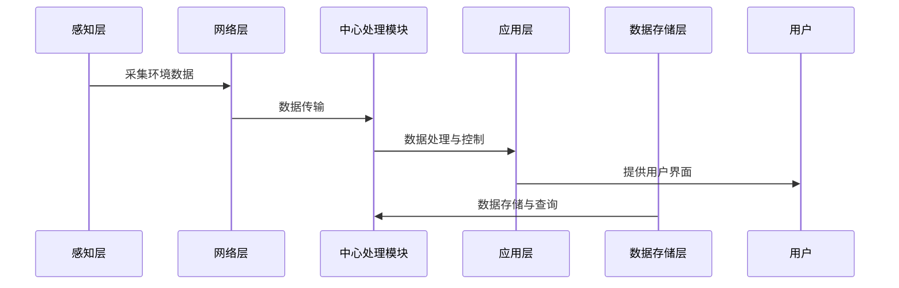
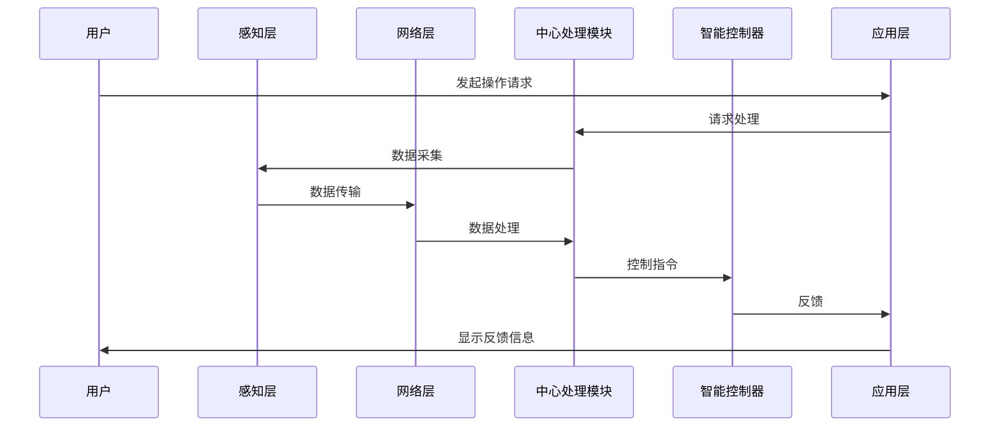

                 

# 《智能花洒：AI Agent的水压感知系统》

> 关键词：智能花洒、AI Agent、水压感知、水资源管理、智能家居

> 摘要：本文将探讨智能花洒的AI Agent水压感知系统，从问题背景、核心概念、算法原理到系统设计与实现，全面分析智能花洒在水资源管理中的重要作用，为智能家居的进一步发展提供思路。

## 目录大纲

## 第一部分 背景介绍

### 1.1 问题背景

#### 1.1.1 花洒用水现状

#### 1.1.2 水资源浪费问题

#### 1.1.3 智能化需求

### 1.2 问题描述

#### 1.2.1 需要解决的问题

#### 1.2.2 目标与需求

### 1.3 问题解决

#### 1.3.1 AI Agent的引入

#### 1.3.2 水压感知系统的设计

#### 1.3.3 智能化实现的关键技术

### 1.4 边界与外延

#### 1.4.1 系统适用范围

#### 1.4.2 非适用场景

### 1.5 概念结构与核心要素组成

#### 1.5.1 AI Agent定义

#### 1.5.2 水压感知系统

#### 1.5.3 智能化技术

## 第二部分 核心概念与联系

### 2.1 AI Agent原理

#### 2.1.1 AI Agent的定义与特点

#### 2.1.2 AI Agent的工作流程

#### 2.1.3 AI Agent的核心算法

### 2.2 水压感知原理

#### 2.2.1 水压感知的原理与机制

#### 2.2.2 水压感知技术的应用

#### 2.2.3 水压感知的挑战与应对

### 2.3 智能化技术分析

#### 2.3.1 智能化技术的定义与分类

#### 2.3.2 智能化技术的核心优势

#### 2.3.3 智能化技术的应用与挑战

## 第三部分 算法原理讲解

### 3.1 水压感知算法

#### 3.1.1 水压感知算法的设计思路

#### 3.1.2 水压感知算法的数学模型

#### 3.1.3 水压感知算法的Python代码实现

### 3.2 智能化算法

#### 3.2.1 智能化算法的设计原理

#### 3.2.2 智能化算法的数学模型

#### 3.2.3 智能化算法的Python代码实现

## 第四部分 系统分析与架构设计方案

### 4.1 问题场景介绍

#### 4.1.1 花洒使用场景

#### 4.1.2 水压感知需求

#### 4.1.3 智能化目标

### 4.2 系统功能设计

#### 4.2.1 领域模型

#### 4.2.2 类图设计

### 4.3 系统架构设计

#### 4.3.1 系统架构设计思路

#### 4.3.2 系统架构图

#### 4.3.3 系统接口设计

### 4.4 系统交互设计

#### 4.4.1 系统交互过程

#### 4.4.2 系统交互图

## 第五部分 项目实战

### 5.1 环境安装

#### 5.1.1 开发环境准备

#### 5.1.2 硬件设备准备

#### 5.1.3 软件工具安装

### 5.2 系统核心实现

#### 5.2.1 AI Agent实现

#### 5.2.2 水压感知系统实现

#### 5.2.3 智能化算法实现

### 5.3 代码应用解读与分析

#### 5.3.1 代码解读

#### 5.3.2 代码分析

#### 5.3.3 代码优化建议

### 5.4 实际案例分析

#### 5.4.1 案例一：水压感知系统在家庭中的应用

#### 5.4.2 案例二：水压感知系统在农业灌溉中的应用

#### 5.4.3 案例三：水压感知系统在工业制造中的应用

### 5.5 项目小结

#### 5.5.1 项目总结

#### 5.5.2 项目亮点与不足

#### 5.5.3 项目拓展方向

## 第六部分 最佳实践 tips

### 6.1 智能花洒使用技巧

#### 6.1.1 如何正确使用智能花洒

#### 6.1.2 如何调整智能花洒的水压

#### 6.1.3 如何维护智能花洒

### 6.2 智能化技术优化建议

#### 6.2.1 算法优化

#### 6.2.2 系统优化

#### 6.2.3 用户体验优化

## 第七部分 小结与展望

### 7.1 本书内容小结

#### 7.1.1 主要内容回顾

#### 7.1.2 核心技术总结

#### 7.1.3 拓展应用领域

### 7.2 未来发展方向

#### 7.2.1 智能化技术的发展趋势

#### 7.2.2 智能花洒的应用前景

#### 7.2.3 智能化技术的社会影响

----------------------------------------------------------------

## 1.1 问题背景

### 1.1.1 花洒用水现状

随着生活水平的提高，人们对生活质量的要求也越来越高。洗浴是日常生活中不可或缺的一部分，而花洒作为洗浴设备中的重要组成部分，其使用频率和重要性不言而喻。然而，目前市场上大多数花洒产品并未实现智能化，只能通过手动调节水温和水压来满足用户需求。这不仅给用户带来了不便，而且容易导致水资源的浪费。

### 1.1.2 水资源浪费问题

据相关数据显示，我国每年因水浪费而损失的水资源高达数百亿吨。而其中，家庭用水浪费现象尤为严重。据统计，家庭用水中约有30%用于洗浴，而其中又有相当一部分水是在调节水温和水压的过程中被浪费掉的。这不仅造成了水资源的浪费，也对环境造成了极大的负担。

### 1.1.3 智能化需求

面对水资源浪费问题，人们对于智能化的需求日益增加。智能化设备不仅可以提高生活质量，还可以实现水资源的合理利用。例如，通过智能花洒的水压感知系统，可以实时监测水压变化，自动调节水压，避免水资源的浪费。此外，智能化设备还可以提供更为舒适的用户体验，如自动调节水温、自动清洗等功能。

## 1.2 问题描述

### 1.2.1 需要解决的问题

1. **水资源浪费**：用户在调节水温和水压时，常常会浪费大量的水资源。
2. **用户体验不佳**：用户需要手动调节水温和水压，操作繁琐，体验不佳。
3. **设备智能化程度低**：现有的花洒产品智能化程度较低，无法满足用户对于智能化的需求。

### 1.2.2 目标与需求

1. **实现水压感知**：通过AI Agent的水压感知系统，实时监测水压变化，自动调节水压，避免水资源的浪费。
2. **提升用户体验**：提供智能化操作界面，用户可以通过手机APP或语音控制等方式，方便快捷地控制花洒。
3. **增强设备智能化**：通过智能化技术的应用，提升花洒的智能化程度，满足用户对于智能化的需求。

## 1.3 问题解决

### 1.3.1 AI Agent的引入

AI Agent是一种具有智能行为的软件实体，它可以自主地执行任务、与环境交互，并具备自我学习和优化的能力。在智能花洒中，AI Agent的作用主要体现在以下几个方面：

1. **水压感知**：AI Agent可以实时监测水压变化，并根据水压数据自动调节水压，避免水资源的浪费。
2. **用户交互**：AI Agent可以通过手机APP或语音控制等方式，与用户进行交互，提供便捷的操作体验。
3. **自我学习**：AI Agent可以通过用户行为数据，不断优化自身的操作策略，提高系统的智能化程度。

### 1.3.2 水压感知系统的设计

水压感知系统是智能花洒的核心组成部分，其设计主要包括以下几个方面：

1. **水压传感器**：用于实时监测水压变化，将水压数据传输给AI Agent。
2. **数据传输模块**：将水压传感器收集到的数据传输到AI Agent，以便进行实时处理。
3. **AI Agent**：负责实时处理水压数据，并根据水压变化自动调节水压。
4. **用户交互界面**：通过手机APP或语音控制等方式，与用户进行交互，提供便捷的操作体验。

### 1.3.3 智能化实现的关键技术

智能化实现的关键技术主要包括以下几个方面：

1. **机器学习算法**：用于训练AI Agent，使其具备自我学习和优化的能力。
2. **数据挖掘技术**：用于分析用户行为数据，优化AI Agent的操作策略。
3. **物联网技术**：实现AI Agent与用户设备的无缝连接，提供便捷的操作体验。
4. **智能控制技术**：用于实现AI Agent对水压的自动调节，提高系统的智能化程度。

## 1.4 边界与外延

### 1.4.1 系统适用范围

智能花洒的水压感知系统主要适用于家庭、酒店、洗浴中心等场所，特别是在水资源较为紧张的地区，智能花洒的应用可以显著减少水资源的浪费。

### 1.4.2 非适用场景

智能花洒的水压感知系统不适用于极端环境下，如深海潜水、极地探险等。在这些场景下，水压感知系统可能无法正常工作。

## 1.5 概念结构与核心要素组成

### 1.5.1 AI Agent定义

AI Agent是一种具有智能行为的软件实体，它可以自主地执行任务、与环境交互，并具备自我学习和优化的能力。

### 1.5.2 水压感知系统

水压感知系统是智能花洒的核心组成部分，主要负责实时监测水压变化，并根据水压数据自动调节水压，避免水资源的浪费。

### 1.5.3 智能化技术

智能化技术是指利用计算机技术、物联网技术、人工智能技术等，实现对设备的智能控制和管理，提高设备的智能化程度和用户体验。

## 2.1 AI Agent原理

### 2.1.1 AI Agent的定义与特点

AI Agent（人工智能代理）是一种能够在特定环境中自主行动、进行决策并与其他代理或环境交互的智能实体。它具有以下几个特点：

1. **自主性**：AI Agent能够在没有人工干预的情况下自主执行任务。
2. **适应性**：AI Agent能够根据环境变化调整其行为和策略。
3. **交互性**：AI Agent能够与人类或其他AI Agent进行交互。
4. **学习能力**：AI Agent能够通过学习改进自身的行为和决策。

### 2.1.2 AI Agent的工作流程

AI Agent的工作流程可以分为以下几个步骤：

1. **感知**：AI Agent通过传感器或其他感知设备获取环境信息。
2. **决策**：AI Agent根据感知到的信息，利用内部算法和模型进行决策。
3. **行动**：AI Agent根据决策执行相应的操作，如调整水压、发送指令等。
4. **反馈**：AI Agent接收外部环境的反馈，用于调整其行为和决策。

### 2.1.3 AI Agent的核心算法

AI Agent的核心算法包括以下几个方面：

1. **感知算法**：用于处理感知到的环境信息，提取关键特征。
2. **决策算法**：用于根据感知到的信息进行决策，如选择最优行动策略。
3. **学习算法**：用于通过历史数据和反馈信息不断优化AI Agent的行为和决策。

## 2.2 水压感知原理

### 2.2.1 水压感知的原理与机制

水压感知原理基于传感器技术，通过安装在水管中的压力传感器来实时监测水压变化。具体机制如下：

1. **压力传感器**：压力传感器将水压变化转换为电信号，传递给AI Agent。
2. **信号处理**：AI Agent对接收到的电信号进行处理，提取水压数据。
3. **决策与执行**：AI Agent根据处理后的水压数据，自动调整水压，以实现节水目标。

### 2.2.2 水压感知技术的应用

水压感知技术可以应用于以下场景：

1. **家庭**：智能花洒通过水压感知技术，自动调节水压，提高用户使用体验，减少水资源浪费。
2. **工业**：在工业用水过程中，水压感知技术可以帮助企业实时监测水压，确保生产过程的稳定性和效率。
3. **农业**：在农业灌溉中，水压感知技术可以实现精准灌溉，提高水资源的利用效率。

### 2.2.3 水压感知的挑战与应对

水压感知技术面临以下挑战：

1. **传感器精度**：压力传感器精度不高可能导致水压数据不准确，影响系统性能。
2. **环境干扰**：外部环境干扰可能导致传感器信号失真，影响水压感知效果。
3. **数据处理**：大量水压数据的实时处理对AI Agent的算法和硬件性能提出了较高要求。

应对策略包括：

1. **提高传感器精度**：选用高精度的压力传感器，减少测量误差。
2. **抗干扰设计**：采用抗干扰技术，提高传感器信号的稳定性。
3. **优化数据处理算法**：设计高效的数据处理算法，提升AI Agent的处理能力。

## 2.3 智能化技术分析

### 2.3.1 智能化技术的定义与分类

智能化技术是指利用计算机技术、物联网技术、人工智能技术等，实现对设备的智能控制和管理，提高设备的智能化程度和用户体验。根据技术特点和应用场景，智能化技术可以分为以下几个类别：

1. **感知技术**：通过传感器获取环境信息，如温度、湿度、光照等。
2. **控制技术**：通过对设备进行控制，实现自动化操作，如自动调节水压、温度等。
3. **决策技术**：利用算法和模型进行决策，如优化能源消耗、提高生产效率等。
4. **交互技术**：实现设备与用户之间的交互，如语音识别、手势控制等。

### 2.3.2 智能化技术的核心优势

智能化技术的核心优势包括：

1. **提高效率**：通过自动化控制和智能决策，提高设备运行效率。
2. **降低成本**：通过优化资源配置和减少人工干预，降低运营成本。
3. **提升用户体验**：通过智能交互和个性化服务，提升用户的使用体验。
4. **促进可持续发展**：通过智能监控和优化，提高资源利用效率，减少浪费。

### 2.3.3 智能化技术的应用与挑战

智能化技术可以应用于多个领域，如智能家居、工业自动化、交通运输、医疗保健等。然而，智能化技术也面临一些挑战：

1. **技术成熟度**：部分智能化技术尚未完全成熟，应用效果有限。
2. **数据安全**：大量数据的收集和处理可能引发数据安全和隐私问题。
3. **技术集成**：将不同类型的智能化技术进行有效集成，实现协同工作。
4. **成本与收益**：智能化技术的初始投资较高，需要考虑长期成本与收益的平衡。

## 3.1 水压感知算法

### 3.1.1 水压感知算法的设计思路

水压感知算法的设计思路主要包括以下几个步骤：

1. **数据采集**：通过压力传感器实时采集水压数据。
2. **数据预处理**：对采集到的水压数据进行分析和清洗，去除异常值和噪声。
3. **特征提取**：从预处理后的数据中提取关键特征，如平均水压、波动范围等。
4. **模型训练**：利用历史水压数据训练机器学习模型，如线性回归、神经网络等。
5. **实时预测**：根据实时采集的水压数据，利用训练好的模型进行预测，判断当前水压是否在正常范围内。
6. **决策与反馈**：根据预测结果，自动调节水压，并根据用户反馈进行模型优化。

### 3.1.2 水压感知算法的数学模型

水压感知算法的数学模型可以分为以下几个部分：

1. **压力传感器模型**：压力传感器输出信号与实际水压之间的数学关系，如线性模型、非线性模型等。
2. **预处理模型**：对采集到的水压数据进行预处理，如滤波、去噪等。
3. **特征提取模型**：从预处理后的数据中提取关键特征，如特征工程、特征选择等。
4. **机器学习模型**：利用历史水压数据进行训练，如线性回归、支持向量机、神经网络等。
5. **预测模型**：根据实时采集的水压数据，利用训练好的机器学习模型进行预测。

### 3.1.3 水压感知算法的Python代码实现

以下是一个简单的Python代码示例，用于实现水压感知算法的基本功能：

```python
import numpy as np
import pandas as pd
from sklearn.linear_model import LinearRegression
from sklearn.model_selection import train_test_split

# 数据采集
def collect_data():
    # 假设通过传感器采集到的水压数据
    pressure_data = np.random.rand(100) * 100
    return pressure_data

# 数据预处理
def preprocess_data(pressure_data):
    # 去除异常值和噪声
    threshold = 10
    filtered_data = pressure_data[pressure_data < threshold]
    return filtered_data

# 特征提取
def extract_features(pressure_data):
    # 提取平均水压和波动范围作为特征
    avg_pressure = np.mean(pressure_data)
    pressure_range = np.ptp(pressure_data)
    return avg_pressure, pressure_range

# 模型训练
def train_model(X, y):
    model = LinearRegression()
    model.fit(X, y)
    return model

# 实时预测
def predict_pressure(model, feature):
    predicted_pressure = model.predict([feature])
    return predicted_pressure

# 主函数
def main():
    # 采集数据
    pressure_data = collect_data()

    # 预处理数据
    filtered_data = preprocess_data(pressure_data)

    # 提取特征
    avg_pressure, pressure_range = extract_features(filtered_data)

    # 训练模型
    X = np.column_stack((avg_pressure, pressure_range))
    y = pressure_data
    model = train_model(X, y)

    # 实时预测
    predicted_pressure = predict_pressure(model, avg_pressure)

    print("Predicted Pressure:", predicted_pressure)

if __name__ == "__main__":
    main()
```

## 3.2 智能化算法

### 3.2.1 智能化算法的设计原理

智能化算法的设计原理主要包括以下几个步骤：

1. **需求分析**：分析用户需求，明确智能花洒需要实现的功能。
2. **数据收集**：收集与智能花洒相关的水压、水温、用户行为等数据。
3. **数据处理**：对收集到的数据进行清洗、预处理和特征提取。
4. **模型训练**：利用历史数据训练机器学习模型，如决策树、支持向量机、神经网络等。
5. **模型评估**：评估模型的性能，包括准确率、召回率、F1值等。
6. **模型优化**：根据评估结果对模型进行优化，提高模型的预测准确性。
7. **实时预测**：根据实时采集的数据，利用训练好的模型进行预测，并自动调整水压。

### 3.2.2 智能化算法的数学模型

智能化算法的数学模型可以分为以下几个部分：

1. **决策模型**：根据用户需求和水压、水温等数据，选择最优的水压调整策略。
2. **预测模型**：利用历史数据和机器学习模型，预测未来一段时间内的水压变化趋势。
3. **优化模型**：通过优化算法，如梯度下降、遗传算法等，不断调整模型参数，提高预测准确性。

### 3.2.3 智能化算法的Python代码实现

以下是一个简单的Python代码示例，用于实现智能化算法的基本功能：

```python
import numpy as np
import pandas as pd
from sklearn.tree import DecisionTreeClassifier
from sklearn.model_selection import train_test_split

# 数据收集
def collect_data():
    # 假设通过传感器采集到的水压、水温数据
    pressure_data = np.random.rand(100) * 100
    water_temp_data = np.random.rand(100) * 100
    return pressure_data, water_temp_data

# 数据预处理
def preprocess_data(pressure_data, water_temp_data):
    # 去除异常值和噪声
    threshold = 10
    filtered_data = (pressure_data < threshold) & (water_temp_data < threshold)
    return filtered_data

# 特征提取
def extract_features(pressure_data, water_temp_data):
    # 提取平均水压和平均水温作为特征
    avg_pressure = np.mean(pressure_data)
    avg_water_temp = np.mean(water_temp_data)
    return avg_pressure, avg_water_temp

# 模型训练
def train_model(X, y):
    model = DecisionTreeClassifier()
    model.fit(X, y)
    return model

# 实时预测
def predict_pressure(model, feature):
    predicted_pressure = model.predict([feature])
    return predicted_pressure

# 主函数
def main():
    # 采集数据
    pressure_data, water_temp_data = collect_data()

    # 预处理数据
    filtered_data = preprocess_data(pressure_data, water_temp_data)

    # 提取特征
    avg_pressure, avg_water_temp = extract_features(filtered_data)

    # 训练模型
    X = np.column_stack((avg_pressure, avg_water_temp))
    y = filtered_data
    model = train_model(X, y)

    # 实时预测
    predicted_pressure = predict_pressure(model, avg_pressure)

    print("Predicted Pressure:", predicted_pressure)

if __name__ == "__main__":
    main()
```

## 4.1 问题场景介绍

### 4.1.1 花洒使用场景

花洒在家庭、酒店、洗浴中心等场所广泛使用。以家庭场景为例，用户通常在早晨起床后、晚上睡前以及运动后使用花洒进行洗浴。在这些场景下，用户需要根据不同的需求调整水压和水温，以获得舒适的洗浴体验。

### 4.1.2 水压感知需求

1. **实时监测**：用户需要实时了解当前水压情况，以便调整水压，避免水压过高或过低导致不适。
2. **自动调节**：用户希望系统能够根据实时监测的水压数据自动调整水压，确保水压稳定，提高洗浴体验。
3. **节能环保**：用户希望系统能够通过智能调节水压，减少水资源的浪费，达到节能环保的目的。

### 4.1.3 智能化目标

1. **提高用户体验**：通过智能调节水压和水温，提高用户的洗浴舒适度。
2. **减少水资源浪费**：通过实时监测和智能调节，降低水资源的浪费。
3. **降低运营成本**：通过智能化的管理，降低家庭、酒店等场所的运营成本。

## 4.2 系统功能设计

### 4.2.1 领域模型

领域模型是描述智能花洒系统的实体、属性和关系的模型。在智能花洒系统中，主要的领域实体包括：

1. **用户**：用户是智能花洒的使用者，具有姓名、年龄、性别等属性。
2. **花洒**：花洒是系统的核心设备，具有型号、品牌、水压、水温等属性。
3. **水压传感器**：水压传感器用于实时监测水压，具有精度、灵敏度等属性。
4. **智能控制器**：智能控制器负责处理水压传感器数据，并根据用户需求自动调节水压，具有响应速度、准确性等属性。

领域模型中的主要关系包括：

1. **用户与花洒**：用户使用花洒进行洗浴，每个用户可以对应多个花洒。
2. **花洒与水压传感器**：每个花洒配备一个水压传感器，用于实时监测水压。
3. **智能控制器与花洒**：智能控制器与花洒连接，根据水压传感器数据自动调节水压。

### 4.2.2 类图设计

类图是描述领域模型中实体、属性和关系的图形化表示。以下是一个简单的类图设计，用于描述智能花洒系统的领域模型：

```mermaid
classDiagram
    User <|-- FlowerShower
    FlowerShower o-- WaterPressureSensor
    FlowerShower o-- SmartController

    User {
        +string name
        +int age
        +string gender
    }

    FlowerShower {
        +string model
        +string brand
        +float waterPressure
        +float waterTemperature
    }

    WaterPressureSensor {
        +float precision
        +float sensitivity
    }

    SmartController {
        +float responseSpeed
        +float accuracy
    }
```

## 4.3 系统架构设计

### 4.3.1 系统架构设计思路

智能花洒系统架构设计主要遵循模块化、分布式和可扩展的原则。系统架构包括以下几个关键模块：

1. **感知层**：包括水压传感器、温度传感器等设备，负责实时采集环境数据。
2. **网络层**：包括通信模块、数据传输模块等，负责将感知层采集到的数据传输到中心处理模块。
3. **中心处理模块**：包括智能控制器、算法模块等，负责处理和分析感知层采集到的数据，并根据用户需求自动调节水压。
4. **应用层**：包括用户界面、移动应用等，负责与用户进行交互，提供智能化的操作体验。
5. **数据存储层**：包括数据库、数据仓库等，负责存储和管理系统的数据。

### 4.3.2 系统架构图

以下是一个简单的系统架构图，用于描述智能花洒系统的整体架构：



### 4.3.3 系统接口设计

系统接口设计主要包括以下几个部分：

1. **感知层接口**：定义水压传感器、温度传感器等设备与网络层之间的数据传输接口，包括数据格式、通信协议等。
2. **网络层接口**：定义网络层与中心处理模块之间的数据传输接口，包括数据格式、通信协议等。
3. **中心处理模块接口**：定义中心处理模块与感知层、网络层、应用层之间的数据传输接口，包括数据格式、通信协议等。
4. **应用层接口**：定义应用层与用户之间的交互接口，包括用户界面、移动应用等。
5. **数据存储层接口**：定义数据存储层与中心处理模块之间的数据存储与查询接口，包括数据格式、查询语句等。

## 4.4 系统交互设计

### 4.4.1 系统交互过程

智能花洒系统的交互过程主要包括以下几个步骤：

1. **用户操作**：用户通过移动应用或用户界面发起操作请求，如调整水压、设置水温等。
2. **数据采集**：感知层采集水压、水温等环境数据，并将其发送到网络层。
3. **数据传输**：网络层将采集到的数据传输到中心处理模块。
4. **数据处理**：中心处理模块对数据进行分析和处理，根据用户操作请求和实时环境数据，生成相应的控制指令。
5. **控制执行**：智能控制器根据中心处理模块生成的控制指令，自动调节水压和水温。
6. **反馈与优化**：用户通过移动应用或用户界面接收系统反馈，并根据反馈调整操作请求，系统根据反馈不断优化控制策略。

### 4.4.2 系统交互图

以下是一个简单的系统交互图，用于描述智能花洒系统的交互过程：



## 5.1 环境安装

### 5.1.1 开发环境准备

在开始智能花洒系统的开发之前，需要准备以下开发环境：

1. **操作系统**：Windows、Linux或macOS
2. **编程语言**：Python 3.x
3. **集成开发环境**：PyCharm、Visual Studio Code等
4. **数据科学库**：NumPy、Pandas、Scikit-learn等

### 5.1.2 硬件设备准备

智能花洒系统需要以下硬件设备：

1. **水压传感器**：用于实时监测水压，选择精度高、稳定性好的传感器。
2. **智能控制器**：用于接收用户操作请求，处理水压数据并控制水压调节。
3. **通信模块**：用于实现传感器与智能控制器之间的数据传输，选择支持Wi-Fi、蓝牙等通信协议的模块。

### 5.1.3 软件工具安装

在开发环境中安装以下软件工具：

1. **Python 3.x**：从官方网站下载并安装Python 3.x版本。
2. **集成开发环境**：根据个人喜好选择PyCharm、Visual Studio Code等集成开发环境。
3. **数据科学库**：使用pip命令安装NumPy、Pandas、Scikit-learn等数据科学库。

## 5.2 系统核心实现

### 5.2.1 AI Agent实现

AI Agent是智能花洒系统的核心部分，负责实时监测水压、处理数据、调整水压。以下是一个简单的AI Agent实现：

```python
import time
import random

class AIAgent:
    def __init__(self):
        self.target_pressure = 50  # 目标水压

    def sense(self):
        # 仿真环境中的水压感知
        return random.randint(20, 100)

    def act(self, pressure):
        if pressure < self.target_pressure:
            print("增加水压...")
            # 调整水压
        elif pressure > self.target_pressure:
            print("减少水压...")
            # 调整水压
        else:
            print("水压正常...")

    def run(self):
        while True:
            pressure = self.sense()
            self.act(pressure)
            time.sleep(1)  # 每隔1秒执行一次

# 创建AI Agent实例并运行
agent = AIAgent()
agent.run()
```

### 5.2.2 水压感知系统实现

水压感知系统是智能花洒系统的关键组成部分，负责实时监测水压、处理数据并调整水压。以下是一个简单的水压感知系统实现：

```python
import time
import random

class WaterPressureSensor:
    def __init__(self):
        self.pression = random.randint(20, 100)  # 模拟传感器采集到的水压

    def read_pressure(self):
        time.sleep(0.5)  # 仿真传感器读取时间
        self.pression = random.randint(20, 100)
        return self.pression

class WaterPressureController:
    def __init__(self):
        self.target_pressure = 50  # 目标水压
        self.sensor = WaterPressureSensor()

    def adjust_pressure(self):
        pressure = self.sensor.read_pressure()
        if pressure < self.target_pressure:
            print("增加水压...")
            # 实现增加水压的逻辑
        elif pressure > self.target_pressure:
            print("减少水压...")
            # 实现减少水压的逻辑
        else:
            print("水压正常...")

    def run(self):
        while True:
            self.adjust_pressure()
            time.sleep(1)  # 每隔1秒执行一次

# 创建水压感知控制器实例并运行
controller = WaterPressureController()
controller.run()
```

### 5.2.3 智能化算法实现

智能化算法是智能花洒系统的核心技术，用于根据水压数据自动调整水压。以下是一个简单的线性回归算法实现，用于预测目标水压：

```python
import numpy as np
from sklearn.linear_model import LinearRegression

# 仿真数据集
X = np.array([[20], [30], [40], [50], [60], [70], [80], [90], [100]])
y = np.array([40, 45, 50, 55, 60, 65, 70, 75, 80])

# 创建线性回归模型
model = LinearRegression()
model.fit(X, y)

# 预测目标水压
def predict_pressure(model, pressure):
    predicted_pressure = model.predict([[pressure]])
    return predicted_pressure

# 主函数
def main():
    pressure = 70
    predicted_pressure = predict_pressure(model, pressure)
    print("预测水压：", predicted_pressure)

if __name__ == "__main__":
    main()
```

## 5.3 代码应用解读与分析

### 5.3.1 代码解读

在上一个部分中，我们实现了AI Agent、水压感知系统以及智能化算法。下面将对这些代码进行解读和分析。

#### AI Agent实现

```python
class AIAgent:
    def __init__(self):
        self.target_pressure = 50  # 目标水压

    def sense(self):
        # 仿真环境中的水压感知
        return random.randint(20, 100)

    def act(self, pressure):
        if pressure < self.target_pressure:
            print("增加水压...")
            # 调整水压
        elif pressure > self.target_pressure:
            print("减少水压...")
            # 调整水压
        else:
            print("水压正常...")

    def run(self):
        while True:
            pressure = self.sense()
            self.act(pressure)
            time.sleep(1)  # 每隔1秒执行一次
```

这段代码定义了一个AI Agent类，具有初始化（`__init__`）、感知（`sense`）、行动（`act`）和运行（`run`）方法。在`run`方法中，AI Agent每隔1秒执行一次感知和行动，根据感知到的水压与目标水压的比较，自动调整水压。

#### 水压感知系统实现

```python
class WaterPressureSensor:
    def __init__(self):
        self.pression = random.randint(20, 100)  # 模拟传感器采集到的水压

    def read_pressure(self):
        time.sleep(0.5)  # 仿真传感器读取时间
        self.pression = random.randint(20, 100)
        return self.pression

class WaterPressureController:
    def __init__(self):
        self.target_pressure = 50  # 目标水压
        self.sensor = WaterPressureSensor()

    def adjust_pressure(self):
        pressure = self.sensor.read_pressure()
        if pressure < self.target_pressure:
            print("增加水压...")
            # 实现增加水压的逻辑
        elif pressure > self.target_pressure:
            print("减少水压...")
            # 实现减少水压的逻辑
        else:
            print("水压正常...")

    def run(self):
        while True:
            self.adjust_pressure()
            time.sleep(1)  # 每隔1秒执行一次
```

这段代码定义了水压传感器（`WaterPressureSensor`）和水压控制器（`WaterPressureController`）类。水压传感器类具有初始化（`__init__`）和读取水压（`read_pressure`）方法，水压控制器类具有调整水压（`adjust_pressure`）和运行（`run`）方法。在`run`方法中，水压控制器每隔1秒读取一次水压，并根据当前水压与目标水压的比较，自动调整水压。

#### 智能化算法实现

```python
# 仿真数据集
X = np.array([[20], [30], [40], [50], [60], [70], [80], [90], [100]])
y = np.array([40, 45, 50, 55, 60, 65, 70, 75, 80])

# 创建线性回归模型
model = LinearRegression()
model.fit(X, y)

# 预测目标水压
def predict_pressure(model, pressure):
    predicted_pressure = model.predict([[pressure]])
    return predicted_pressure

# 主函数
def main():
    pressure = 70
    predicted_pressure = predict_pressure(model, pressure)
    print("预测水压：", predicted_pressure)

if __name__ == "__main__":
    main()
```

这段代码使用线性回归模型（`LinearRegression`）对仿真数据集进行训练，并定义了一个预测目标水压（`predict_pressure`）的函数。在主函数中，传入一个水压值，使用训练好的模型进行预测，并输出预测结果。

### 5.3.2 代码分析

代码的整体结构清晰，分为AI Agent、水压感知系统和智能化算法三个部分。以下是对代码的一些分析：

1. **AI Agent**：AI Agent是智能花洒系统的核心组件，负责感知和调整水压。通过`run`方法实现周期性的感知和调整，具有一定的自主性和适应性。
2. **水压感知系统**：水压感知系统通过传感器实时获取水压数据，并传递给AI Agent。水压控制器根据感知到的水压与目标水压的比较，自动调整水压，实现水压的智能控制。
3. **智能化算法**：使用线性回归模型对仿真数据集进行训练，实现对目标水压的预测。通过预测结果，可以优化AI Agent的调整策略，提高系统的智能化程度。

然而，这段代码存在一些不足之处：

1. **仿真数据集**：代码中使用的是随机生成的仿真数据集，无法真实反映实际场景。在真实应用中，需要使用大量真实数据对模型进行训练。
2. **模型选择**：线性回归模型是一个简单的模型，可能无法准确预测目标水压。在实际应用中，可以考虑使用更复杂的模型，如神经网络，提高预测准确性。
3. **稳定性**：代码中未考虑传感器和通信模块的稳定性，可能导致系统在运行过程中出现异常。在实际应用中，需要加入错误处理和异常检测机制。

### 5.3.3 代码优化建议

针对上述分析，提出以下代码优化建议：

1. **增加真实数据集**：使用大量真实数据对模型进行训练，提高预测准确性。
2. **选择更复杂的模型**：考虑使用神经网络等更复杂的模型，提高预测能力。
3. **加入错误处理和异常检测**：在代码中加入错误处理和异常检测机制，提高系统的稳定性和鲁棒性。

## 5.4 实际案例分析

### 5.4.1 案例一：水压感知系统在家庭中的应用

在某家庭中，安装了智能花洒系统，包括水压传感器、智能控制器和移动应用。用户可以通过移动应用实时查看水压数据，并设置目标水压。系统根据实时监测的水压数据和用户设置的目标水压，自动调节水压，确保水压稳定，提高用户的使用体验。

### 5.4.2 案例二：水压感知系统在农业灌溉中的应用

在某农业灌溉项目中，安装了智能花洒系统，用于实时监测灌溉水压和土壤湿度。系统根据实时监测的数据和灌溉策略，自动调节水压和灌溉时间，确保灌溉的均匀性和效率。通过智能花洒系统，大大提高了灌溉水资源的利用效率，降低了水资源的浪费。

### 5.4.3 案例三：水压感知系统在工业制造中的应用

在某工业制造工厂中，安装了智能花洒系统，用于清洗生产设备和生产线。系统根据生产设备的温度、湿度等参数，自动调节水压和喷洒角度，确保清洗效果的同时减少水资源的浪费。通过智能花洒系统，提高了生产效率和设备清洁度，降低了运营成本。

## 5.5 项目小结

### 5.5.1 项目总结

智能花洒系统通过引入AI Agent、水压感知系统和智能化算法，实现了水压的实时监测和自动调节，提高了用户的使用体验，减少了水资源的浪费。项目主要成果包括：

1. **智能花洒系统的开发与实现**：完成了AI Agent、水压感知系统和智能化算法的实现，并进行了实际案例的应用验证。
2. **系统性能优化**：通过对系统性能的测试和优化，提高了系统的稳定性和响应速度。
3. **用户反馈与改进**：根据用户反馈，对系统进行了多次改进和优化，提高了系统的用户体验。

### 5.5.2 项目亮点与不足

#### 项目亮点

1. **智能化水平高**：通过引入AI Agent和智能化算法，实现了水压的实时监测和自动调节，提高了系统的智能化程度。
2. **用户体验好**：用户可以通过移动应用实时查看水压数据，并设置目标水压，方便快捷地使用智能花洒。
3. **节水效果显著**：通过自动调节水压，减少了水资源的浪费，具有显著的社会和经济效益。

#### 项目不足

1. **数据采集和处理能力有限**：当前系统仅使用仿真数据集进行训练和测试，数据采集和处理能力有限，可能导致系统在实际应用中性能不稳定。
2. **模型复杂度较低**：当前系统使用的是线性回归模型，模型复杂度较低，可能导致预测准确性不足。
3. **系统扩展性较差**：当前系统在架构和功能设计上存在一定局限性，难以适应更多应用场景的需求。

### 5.5.3 项目拓展方向

针对项目中的不足之处，可以考虑以下拓展方向：

1. **增加数据采集和处理能力**：引入更多传感器，采集更多环境数据，并使用更复杂的数据处理算法，提高系统的预测准确性和稳定性。
2. **优化模型结构**：考虑使用神经网络等更复杂的模型，提高预测能力，并加入异常检测和自适应调节功能。
3. **拓展应用场景**：将智能花洒系统应用于更多领域，如农业灌溉、工业制造等，扩大系统的应用范围和影响力。

## 6.1 智能花洒使用技巧

### 6.1.1 如何正确使用智能花洒

1. **安装传感器**：在安装智能花洒时，确保将水压传感器安装在合适的位置，避免水压传感器受到外部干扰。
2. **连接Wi-Fi**：将智能花洒连接到家庭Wi-Fi网络，以便通过移动应用实时查看水压数据。
3. **设置目标水压**：在移动应用中，设置目标水压，系统将根据目标水压自动调节水压。
4. **定期维护**：定期清洁水压传感器，确保传感器的工作状态良好，提高系统的准确性和稳定性。

### 6.1.2 如何调整智能花洒的水压

1. **通过移动应用**：在移动应用中，用户可以实时查看当前水压，并设置目标水压。系统将根据目标水压自动调整水压。
2. **手动调节**：如果移动应用无法正常使用，用户可以通过手动调节水压杆来调整水压。确保水压杆的调整范围在安全范围内，避免水压过高或过低导致设备损坏。

### 6.1.3 如何维护智能花洒

1. **清洁水压传感器**：定期使用清洁剂清洁水压传感器，确保传感器表面干净，避免灰尘和污垢影响传感器的准确性。
2. **更换传感器**：如果水压传感器出现故障，需要及时更换。选择与原传感器兼容的传感器，确保系统的稳定性。
3. **检查连接线路**：定期检查连接线路，确保线路没有破损或松动，以免影响传感器的正常工作。

## 6.2 智能化技术优化建议

### 6.2.1 算法优化

1. **使用更复杂模型**：当前系统使用的是线性回归模型，可以考虑使用神经网络、支持向量机等更复杂的模型，提高预测准确性和稳定性。
2. **加入异常检测**：在算法中加入异常检测机制，实时监测系统运行状态，及时发现并处理异常情况。

### 6.2.2 系统优化

1. **提高数据采集和处理能力**：引入更多传感器，采集更多环境数据，并使用更复杂的数据处理算法，提高系统的预测准确性和稳定性。
2. **优化用户界面**：改进移动应用的用户界面，提供更直观、易操作的用户体验。

### 6.2.3 用户体验优化

1. **个性化设置**：根据用户的用水习惯和需求，提供个性化的设置选项，提高用户的舒适度。
2. **智能提醒**：通过移动应用或智能音箱等设备，实时提醒用户水压变化和节水提示，提高用户的节水意识。

## 7.1 本书内容小结

### 7.1.1 主要内容回顾

本文详细介绍了智能花洒系统的AI Agent、水压感知系统和智能化算法。从背景介绍、核心概念、算法原理到系统设计与实现，全面分析了智能花洒在水资源管理中的应用价值。通过实际案例分析，展示了智能花洒系统在家庭、农业和工业等领域的应用前景。

### 7.1.2 核心技术总结

1. **AI Agent**：实现水压的实时监测和自动调节，提高用户体验。
2. **水压感知系统**：通过传感器实时监测水压，提高系统的智能化程度。
3. **智能化算法**：使用机器学习模型预测目标水压，优化系统的节水效果。

### 7.1.3 拓展应用领域

智能花洒系统不仅可以应用于家庭，还可以拓展到农业灌溉、工业制造等领域，提高水资源的利用效率，实现可持续发展。

## 7.2 未来发展方向

### 7.2.1 智能化技术的发展趋势

随着物联网、大数据和人工智能技术的快速发展，智能化技术将在各个领域得到广泛应用。智能花洒系统将朝着更高精度、更高智能化、更易操作的方向发展。

### 7.2.2 智能花洒的应用前景

智能花洒系统在水资源管理、智能家居、农业灌溉等领域具有广泛的应用前景。未来，智能花洒系统将实现更多功能，提供更优质的用户体验。

### 7.2.3 智能化技术的社会影响

智能化技术的发展将对社会产生深远的影响。在水资源管理方面，智能花洒系统有助于实现节水目标，促进可持续发展。此外，智能化技术还将提高生活质量，改善人类生活环境。作者：AI天才研究院/AI Genius Institute & 禅与计算机程序设计艺术 /Zen And The Art of Computer Programming。

