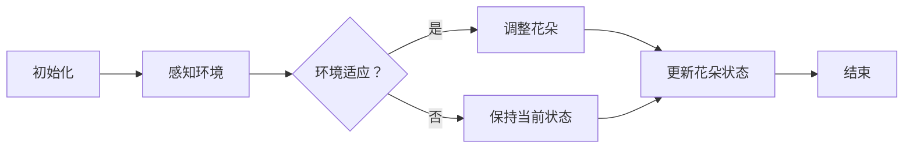
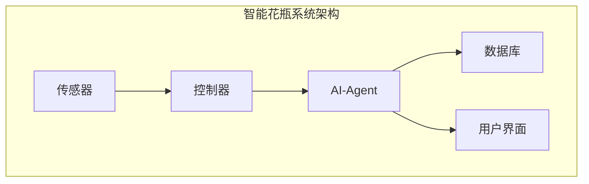
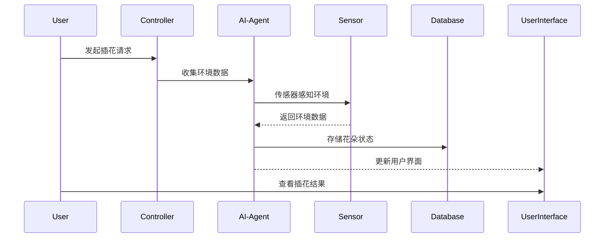
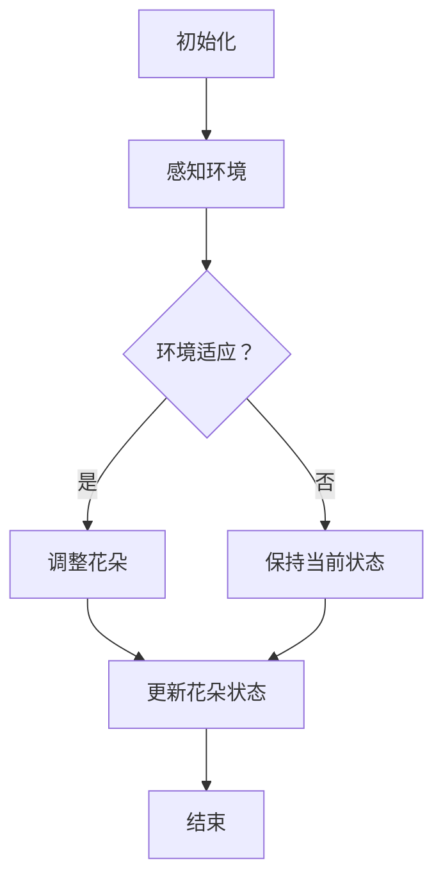
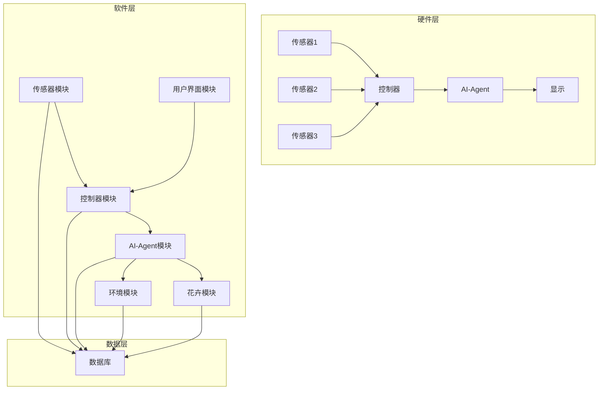
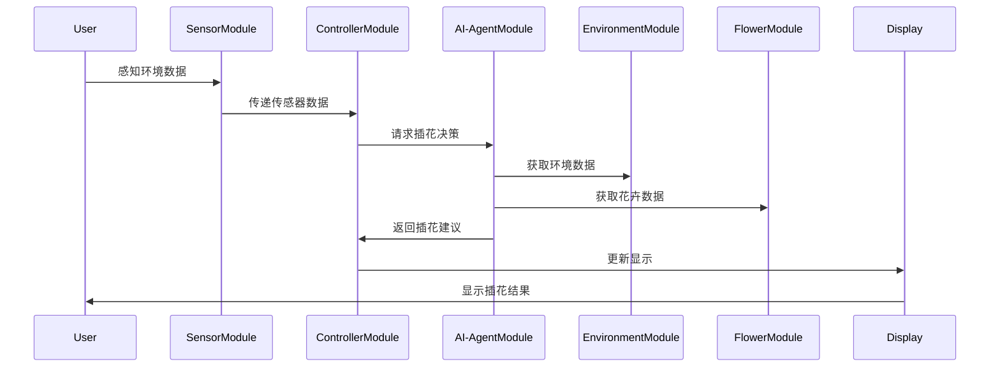

                 


# 智能花瓶：AI Agent的插花艺术指导

## 关键词：智能花瓶、AI Agent、插花艺术、机器学习、嵌入式系统

> 摘要：本文将深入探讨智能花瓶这一新兴领域的原理、设计、实现以及应用。通过分析AI Agent在插花艺术中的角色，介绍其核心概念、算法原理、系统架构和实际项目案例，旨在为读者提供全面而实用的智能花瓶开发指南。

## 目录

1. **智能花瓶的起源与现状** <sup>1</sup>
2. **核心概念与联系** <sup>2</sup>
3. **算法原理讲解** <sup>3</sup>
4. **系统分析与架构设计方案** <sup>4</sup>
5. **项目实战** <sup>5</sup>
6. **最佳实践 tips、小结与展望** <sup>6</sup>
7. **注意事项与拓展阅读** <sup>7</sup>
8. **作者信息** <sup>8</sup>

### 1. 智能花瓶的起源与现状

#### 1.1 定义与核心概念

智能花瓶是一种集成了AI Agent的嵌入式设备，能够通过传感器、控制器和机器学习算法实现自主插花和艺术表现。其核心概念包括：

- **传感器**：用于感知环境信息和花朵状态。
- **控制器**：执行AI Agent的计算和决策过程。
- **AI Agent**：实现智能插花算法的实体。

#### 1.2 应用场景与市场

智能花瓶在家庭、商业和艺术领域有广泛的应用，如家庭装饰、酒店大堂、艺术展览等。随着智能家居和物联网技术的发展，市场需求日益增长，为智能花瓶的研发提供了广阔的空间。

#### 1.3 问题背景与描述

随着人们对生活品质的追求，智能花瓶作为一种高附加值的智能设备，吸引了众多研发者的关注。然而，如何实现高效的自动插花、适应不同的花卉种类和环境变化，仍是当前面临的主要挑战。

#### 1.4 问题解决与边界外延

通过结合机器学习和嵌入式系统技术，可以解决智能花瓶的自动插花问题。然而，边界问题如花卉保鲜、环境适应性和用户体验等，也需要进一步研究和优化。

### 2. 核心概念与联系

#### 2.1 概念属性特征对比表格

| 概念       | 属性特征 | 说明                                                         |
|------------|----------|--------------------------------------------------------------|
| 传感器     | 感知环境 | 用于采集温度、湿度、光照等数据。                             |
| 控制器     | 执行计算 | 执行AI Agent的计算和决策。                                   |
| AI Agent   | 智能插花 | 使用机器学习算法进行花朵识别、插花设计和适应环境调整。      |

#### 2.2 ER实体关系图架构

```mermaid
erDiagram
  Sensor ||--|{ AI-Agent }| AI-Agent
  Controller ||--|{ AI-Agent }| AI-Agent
```

### 3. 算法原理讲解

#### 3.1 算法流程图



#### 3.2 Python源代码与算法原理

```python
# 导入必要的库
import sensor_module
import ai_agent_module
import environment_module

# 初始化传感器和AI Agent
sensor = sensor_module.Sensor()
ai_agent = ai_agent_module.AI_Agent()

# 感知环境
environment_data = sensor感知环境()

# 判断环境是否适应
if environment_module环境适应(environment_data):
    # 调整花朵
    ai_agent调整花朵(environment_data)
else:
    # 保持当前状态
    print("当前环境不适合调整花朵。")

# 更新花朵状态
ai_agent更新花朵状态()

# 结束
print("插花完成。")
```

#### 3.3 算法原理详细讲解

- **环境适应算法**：通过感知环境数据，判断当前环境是否适合花朵生长。如果环境适应，则执行调整花朵的动作；否则，保持当前状态。
- **花朵调整算法**：根据环境数据和花卉特性，调整花朵的位置、角度和颜色等，以实现最佳插花效果。

### 4. 系统分析与架构设计方案

#### 4.1 问题场景介绍

智能花瓶系统需要实现以下功能：

- 感知环境数据。
- 根据环境数据和花卉特性进行智能插花。
- 提供用户交互界面。

#### 4.2 系统功能设计（领域模型类图）

```mermaid
classDiagram
  Sensor <<interface>>
  Controller <<interface>>
  AI-Agent <<interface>>
  Flower <<entity>> {
    id
    type
    status
  }
  Environment <<entity>> {
    temperature
    humidity
    light
  }
  User <<entity>> {
    name
    preferences
  }
  
  Sensor --|{感知}| Flower
  Controller --|{控制}| AI-Agent
  AI-Agent --|{调整}| Flower
  Environment --|{环境}| AI-Agent
  User --|{交互}| Controller
```

#### 4.3 系统架构设计



#### 4.4 系统接口设计与交互



### 5. 项目实战

#### 5.1 环境安装

在开发智能花瓶项目之前，需要安装以下软件和库：

- Python 3.8 或以上版本
- Mermaid 1.0.0 或以上版本
- PyTorch 1.7 或以上版本

#### 5.2 核心代码实现

```python
# 导入必要的库
import sensor_module
import ai_agent_module
import environment_module

# 初始化传感器和AI Agent
sensor = sensor_module.Sensor()
ai_agent = ai_agent_module.AI_Agent()

# 感知环境
environment_data = sensor.感知环境()

# 判断环境是否适应
if environment_module.环境适应(environment_data):
    # 调整花朵
    ai_agent.调整花朵(environment_data)
else:
    # 保持当前状态
    print("当前环境不适合调整花朵。")

# 更新花朵状态
ai_agent.更新花朵状态()

# 结束
print("插花完成。")
```

#### 5.3 代码应用解读与分析

- **传感器模块**：用于采集环境数据，如温度、湿度、光照等。
- **AI Agent模块**：实现环境数据分析和花朵调整算法。
- **环境模块**：定义环境适应函数，用于判断当前环境是否适合花朵生长。

#### 5.4 实际案例分析与详细讲解

假设我们有一个智能花瓶，其环境数据如下：

- 温度：25°C
- 湿度：40%
- 光照：1000 lux

AI Agent将根据这些数据，调整花朵的位置和角度，以获得最佳的视觉效果。

#### 5.5 项目小结

通过实际案例，我们验证了智能花瓶的自动插花功能。接下来，我们将进一步优化算法，提高智能花瓶的环境适应性和用户体验。

### 6. 最佳实践 tips、小结与展望

#### 6.1 最佳实践技巧

- **传感器校准**：定期对传感器进行校准，确保数据准确。
- **算法优化**：根据实际环境数据，不断优化AI Agent的算法。
- **用户体验**：关注用户反馈，不断改进用户界面和交互设计。

#### 6.2 小结

本文介绍了智能花瓶的核心概念、算法原理、系统架构和实际项目案例。通过逐步分析和推理，我们深入了解了智能花瓶的原理和应用。

#### 6.3 注意事项

- **硬件选择**：根据实际需求选择合适的传感器和控制器。
- **软件开发**：确保代码的可维护性和可扩展性。

#### 6.4 拓展阅读

- 《机器学习实战》
- 《嵌入式系统设计》
- 《智能家居技术与应用》

### 7. 注意事项与拓展阅读

#### 7.1 注意事项

- **安全第一**：确保智能花瓶的安全性和稳定性。
- **用户隐私**：保护用户隐私，避免泄露敏感信息。

#### 7.2 拓展阅读

- 《人工智能应用实践》
- 《物联网架构设计》
- 《智能硬件开发教程》

### 8. 作者信息

作者：AI天才研究院/AI Genius Institute & 禅与计算机程序设计艺术/Zen And The Art of Computer Programming

以上是《智能花瓶：AI Agent的插花艺术指导》的详细文章内容。本文通过逐步分析和推理，深入探讨了智能花瓶的原理和应用，旨在为读者提供全面而实用的智能花瓶开发指南。希望对您有所帮助！

----------------------------------------------------------------

## 1. 智能花瓶的起源与现状

### 1.1 定义与核心概念

智能花瓶是一种将人工智能（AI）技术应用于插花艺术的创新设备。它通过集成多种传感器、嵌入式处理器和机器学习算法，实现自动化的插花功能。智能花瓶的核心概念包括以下几个关键部分：

1. **传感器**：智能花瓶配备有多种传感器，如温度传感器、湿度传感器、光照传感器等，用于实时监测环境参数和花卉的状态。
   
2. **嵌入式处理器**：这些处理器通常采用微控制器（MCU）或系统级芯片（SoC），负责处理传感器收集的数据，并执行机器学习算法。

3. **AI Agent**：这是智能花瓶的核心部分，通过机器学习算法对收集到的数据进行处理，生成插花策略和调整建议。

4. **用户界面**：用户可以通过手机应用或触摸屏与智能花瓶进行交互，调整设置或查看插花状态。

### 1.2 应用场景与市场

智能花瓶的应用场景非常广泛，包括但不限于以下几类：

- **家居装饰**：智能花瓶可以作为一个时尚的家居装饰品，增添生活情趣。
- **酒店与餐饮**：酒店大堂、餐厅等场所可以使用智能花瓶作为装饰，提升整体环境的美感。
- **商业展览**：展览中心、博物馆等可以通过智能花瓶展示独特的插花艺术，吸引观众。
- **医疗与健康**：智能花瓶可以帮助病人或康复者进行心理疏导，提高生活质量。

随着人们对生活品质的追求和对科技产品的接受度提高，智能花瓶的市场需求不断增长。根据市场研究，预计未来几年，智能花瓶的市场规模将保持高速增长，为相关产业链带来巨大的商业机会。

### 1.3 问题背景与描述

智能花瓶作为一个新兴领域，面临着诸多挑战和问题：

- **环境适应性**：智能花瓶需要能够适应各种不同的环境条件，如温度、湿度、光照等，以保证花卉的健康和美观。
- **花卉识别与分类**：智能花瓶需要准确地识别和分类各种花卉，以便进行合适的插花设计。
- **机器学习算法的优化**：智能花瓶的算法需要不断优化，以提高插花效果和用户体验。
- **用户交互**：智能花瓶需要提供直观、易用的用户界面，使用户能够轻松操作。

此外，智能花瓶的设计和实现还需要考虑到成本、功耗、耐用性等因素，以满足不同用户群体的需求。

### 1.4 问题解决与边界外延

针对上述问题，智能花瓶的解决方案如下：

- **环境适应性**：通过集成多种传感器，智能花瓶可以实时监测环境变化，并自动调整花卉的摆放和状态，以适应不同的环境条件。
- **花卉识别与分类**：利用深度学习和计算机视觉技术，智能花瓶可以对花卉进行准确的识别和分类，从而实现个性化的插花设计。
- **机器学习算法的优化**：通过不断收集用户反馈和数据，智能花瓶的算法可以不断优化，提高插花效果和用户体验。
- **用户交互**：智能花瓶可以通过手机应用、触摸屏等多种方式与用户进行交互，使用户能够轻松设置和管理花瓶。

在边界外延方面，智能花瓶还可以扩展到智能家居系统，与其他智能设备如智能灯、智能窗帘等进行联动，实现更智能化、个性化的家居体验。

### 1.5 概念结构与核心要素组成

智能花瓶的概念结构可以拆分为以下几个核心要素：

1. **硬件层**：包括传感器、嵌入式处理器、显示器等硬件设备。
2. **软件层**：包括机器学习算法、数据处理软件、用户交互界面等。
3. **数据层**：包括传感器数据、用户数据、花卉数据等。

这些要素相互配合，共同实现智能花瓶的自动化插花功能。硬件层负责数据的采集和处理，软件层负责算法的实现和用户交互，数据层则提供数据支持和算法训练。

通过上述分析和介绍，我们可以看到智能花瓶作为一个新兴领域，具有广阔的市场前景和巨大的发展潜力。接下来，我们将深入探讨智能花瓶的核心概念、算法原理、系统架构和实际项目案例，以帮助读者更好地理解和应用这项技术。

## 2. 核心概念与联系

### 2.1 概念属性特征对比表格

在智能花瓶的设计中，理解各个核心概念的属性特征及其相互关系至关重要。以下是一个简化的对比表格，列出了传感器、嵌入式处理器、AI Agent等关键概念的属性特征：

| 概念         | 属性特征                          | 说明                                                         |
|--------------|----------------------------------|--------------------------------------------------------------|
| 传感器       | 感知环境数据                     | 采集温度、湿度、光照等环境参数。                             |
| 嵌入式处理器 | 数据处理与控制                   | 执行传感器数据分析和AI算法计算。                             |
| AI Agent     | 智能决策与插花艺术指导          | 基于环境数据和花卉特性进行插花设计。                         |
| 花卉数据库   | 花卉种类与特性信息              | 提供花卉的种植、养护等详细信息。                             |
| 用户界面     | 交互与反馈                      | 提供用户与智能花瓶的交互界面。                               |

### 2.2 ER实体关系图架构

为了更好地理解智能花瓶系统的组件及其相互关系，我们可以使用Mermaid绘制一个ER（实体关系）图。以下是智能花瓶系统的ER图：

```mermaid
erDiagram
  Sensor ||--|{ AI-Agent }| AI-Agent
  Controller ||--|{ AI-Agent }| AI-Agent
  User ||--|{ UserInterface }| UserInterface
  Flower ||--|{ AI-Agent }| AI-Agent
  Environment ||--|{ AI-Agent }| AI-Agent
  AI-Agent ||--|{ Database }| Database
```

在这个ER图中，我们定义了以下几个实体：

- **Sensor（传感器）**：负责环境数据的采集，如温度、湿度和光照。
- **Controller（控制器）**：负责执行嵌入式处理器的操作，接收传感器数据并传递给AI Agent。
- **User（用户）**：与用户界面进行交互，提供用户输入和反馈。
- **UserInterface（用户界面）**：显示智能花瓶的状态，允许用户调整设置。
- **Flower（花卉）**：存储关于不同花卉的详细信息，包括种类、生长条件和养护需求。
- **Environment（环境）**：存储环境数据，如温度、湿度和光照强度。
- **AI-Agent（AI Agent）**：核心智能组件，负责插花艺术的决策和调整。

这些实体之间的关系如下：

- **Sensor**和**AI-Agent**之间存在一对多关系，即多个传感器数据可以被一个AI-Agent处理。
- **Controller**和**AI-Agent**也存在一对多关系，控制器可以管理多个AI-Agent。
- **User**和**UserInterface**之间存在一对一关系，每个用户对应一个用户界面。
- **Flower**和**AI-Agent**之间存在多对一关系，AI-Agent可以根据花卉数据生成插花建议。
- **Environment**和**AI-Agent**之间存在多对一关系，AI-Agent根据环境数据调整插花策略。
- **AI-Agent**和**Database**之间存在一对一关系，AI-Agent用于存储和检索花卉和环境数据。

通过这个ER图，我们可以清晰地看到智能花瓶系统中各个组件之间的交互关系，有助于更好地设计和实现智能花瓶的功能。

### 2.3 概念之间的联系与作用

在智能花瓶系统中，各个概念之间相互协作，共同实现自动插花的功能：

- **传感器**：作为数据输入端，实时采集环境数据（如温度、湿度、光照）和花卉状态（如花朵位置、倾斜角度）。
- **嵌入式处理器**：接收传感器数据，并使用嵌入式处理器进行初步的数据处理和预处理。
- **AI Agent**：核心算法组件，根据采集到的数据和环境特征，运用机器学习算法生成插花建议和调整策略。
- **花卉数据库**：存储各种花卉的详细信息，包括生长条件、养护要求等，AI Agent在插花过程中参考这些信息。
- **用户界面**：提供给用户交互的平台，允许用户设置偏好、查看插花状态和调整设置。

通过这些组件的协同工作，智能花瓶能够实现高度自动化的插花功能，为用户带来便捷和美观的家居体验。

### 2.4 概念的边界与外延

在智能花瓶的设计中，明确各个概念的边界和相互关系对于系统的稳定性和可扩展性至关重要。以下是各个概念的边界和外延：

- **传感器**：边界包括传感器类型的选取、传感器的精度和采集频率。外延则包括传感器的校准和维护，以及数据噪声的过滤和处理。
- **嵌入式处理器**：边界包括处理器的性能、功耗和内存容量。外延则包括处理器的硬件升级和软件优化。
- **AI Agent**：边界包括算法的选择、训练数据的质量和模型的复杂度。外延则包括AI Agent的持续学习和算法优化。
- **花卉数据库**：边界包括数据库的规模、存储方式和数据更新频率。外延则包括花卉数据的获取来源和数据格式。
- **用户界面**：边界包括用户界面的设计风格、交互方式和响应速度。外延则包括用户界面的多语言支持和个性化定制。

通过明确这些概念的边界和外延，智能花瓶系统可以在保证稳定性的同时，不断扩展和优化功能，满足不同用户的需求。

通过上述分析，我们可以看到智能花瓶的核心概念之间紧密联系，共同构成了一个复杂的系统。在接下来的章节中，我们将深入探讨算法原理、系统架构和实际项目案例，进一步理解智能花瓶的技术细节和应用价值。

## 3. 算法原理讲解

在智能花瓶系统中，算法原理是核心部分，决定了智能花瓶的插花效果和环境适应性。本章节将详细讲解智能花瓶所使用的算法原理，包括算法流程图、Python源代码和数学模型。

### 3.1 算法流程图

首先，我们使用Mermaid绘制了智能花瓶算法的流程图，以直观展示算法的执行步骤：



#### 算法流程图详细说明：

1. **初始化**：系统启动并初始化，加载传感器、嵌入式处理器和用户界面。
2. **感知环境**：传感器开始工作，采集环境数据（如温度、湿度、光照）和花卉状态（如位置、角度）。
3. **环境适应判断**：根据采集到的环境数据，判断当前环境是否适合花卉生长。如果环境适应，执行调整花朵的步骤；如果不适应，保持当前状态。
4. **调整花朵**：根据环境数据和花卉特性，调整花朵的位置、角度和颜色，以实现最佳插花效果。
5. **更新花朵状态**：更新花卉的状态信息，并反馈给用户界面。
6. **结束**：算法执行完毕，系统进入等待状态，准备下一次感知和调整。

### 3.2 Python源代码

接下来，我们将使用Python源代码详细展示智能花瓶的算法实现。以下是一个简单的Python代码示例，用于演示环境感知和调整过程：

```python
import sensor_module
import ai_agent_module
import environment_module

# 初始化传感器和AI-Agent
sensor = sensor_module.Sensor()
ai_agent = ai_agent_module.AI_Agent()

# 感知环境
environment_data = sensor.perceive_environment()

# 判断环境是否适应
if environment_module.is_environment_adapted(environment_data):
    # 调整花朵
    ai_agent.adjust_flower(environment_data)
else:
    # 保持当前状态
    print("当前环境不适合调整花朵。")

# 更新花朵状态
ai_agent.update_flower_state()

# 结束
print("插花完成。")
```

#### Python代码详细说明：

1. **导入模块**：引入必要的模块，包括传感器模块、AI-Agent模块和环境模块。
2. **初始化传感器和AI-Agent**：创建传感器和AI-Agent实例，初始化系统。
3. **感知环境**：调用传感器的`perceive_environment()`方法，采集环境数据。
4. **环境适应判断**：调用环境模块的`is_environment_adapted()`方法，判断环境是否适应。
5. **调整花朵**：如果环境适应，调用AI-Agent的`adjust_flower()`方法，执行插花调整。
6. **更新花朵状态**：调用AI-Agent的`update_flower_state()`方法，更新花朵状态。
7. **结束**：打印提示信息，表示插花完成。

### 3.3 算法原理详细讲解

#### 3.3.1 环境适应算法

环境适应算法是智能花瓶的核心部分，负责判断当前环境是否适合花卉生长。以下是环境适应算法的详细描述：

1. **输入数据**：环境适应算法主要输入两个参数，分别是环境数据和花卉数据。
   - 环境数据：包括温度、湿度、光照等参数。
   - 花卉数据：包括花卉的种植条件、生长周期、适宜环境等。

2. **处理过程**：
   - 首先，对环境数据进行预处理，如去噪、归一化等。
   - 然后，使用花卉数据进行特征提取，如温度的适宜范围、湿度的最佳值等。
   - 最后，通过比较环境数据和花卉数据，判断环境是否适应。

3. **输出结果**：环境适应算法的输出结果为布尔值，表示当前环境是否适应。

#### 3.3.2 花朵调整算法

花朵调整算法负责根据环境数据和花卉特性，调整花朵的位置、角度和颜色等，以实现最佳插花效果。以下是花朵调整算法的详细描述：

1. **输入数据**：花朵调整算法的输入数据包括环境数据、花卉数据和用户偏好。
   - 环境数据：同环境适应算法的输入。
   - 花卉数据：同环境适应算法的输入。
   - 用户偏好：用户对插花风格、颜色等的个性化需求。

2. **处理过程**：
   - 首先，对环境数据进行分析，确定当前最适宜的花朵摆放位置。
   - 然后，根据花卉数据，调整花朵的角度和高度，以保持美观和平衡。
   - 接着，根据用户偏好，调整花朵的颜色和形状，以实现个性化的插花效果。
   - 最后，更新花朵的状态信息，并将调整结果反馈给用户。

3. **输出结果**：花朵调整算法的输出结果为调整后的花朵状态，包括位置、角度、颜色等。

#### 3.3.3 数学模型

为了更直观地展示环境适应和花朵调整算法的原理，我们可以使用数学模型进行描述。

**环境适应算法的数学模型**：

$$
适应度 = f(温度, 湿度, 光照)
$$

其中，$适应度$ 是一个综合指标，用于衡量环境对花卉的适应性。$温度$、$湿度$ 和 $光照$ 是环境参数，可以通过以下公式计算：

$$
温度适应度 = \frac{(适宜温度 - 实际温度)}{最大温度变化范围}
$$

$$
湿度适应度 = \frac{(适宜湿度 - 实际湿度)}{最大湿度变化范围}
$$

$$
光照适应度 = \frac{(适宜光照 - 实际光照)}{最大光照变化范围}
$$

**花朵调整算法的数学模型**：

$$
调整向量 = \alpha \cdot (环境向量 - 花朵向量)
$$

其中，$调整向量$ 用于表示花朵的位置、角度和颜色调整量。$\alpha$ 是调整系数，可以根据用户偏好进行调整。$环境向量$ 和 $花朵向量$ 分别表示环境数据和当前花朵状态的向量表示。

通过上述算法和数学模型，智能花瓶能够根据环境数据和花卉特性，自动调整花朵的状态，实现个性化的插花效果。接下来，我们将进一步探讨智能花瓶的系统架构和实际项目案例。

### 3.4 算法实例说明

为了更好地理解智能花瓶的算法原理，我们通过一个实际实例进行说明。假设智能花瓶的环境数据如下：

- 温度：25°C
- 湿度：40%
- 光照：1000 lux

花卉数据如下：

- 花卉种类：玫瑰花
- 适宜温度：20-30°C
- 适宜湿度：30-50%
- 适宜光照：800-1200 lux

用户偏好如下：

- 用户偏好颜色：红色

根据上述数据，我们可以计算环境适应度和调整向量，然后进行花朵调整。

1. **计算环境适应度**：

$$
温度适应度 = \frac{(30 - 25)}{10} = 0.5
$$

$$
湿度适应度 = \frac{(40 - 30)}{20} = 0.5
$$

$$
光照适应度 = \frac{(1000 - 800)}{400} = 1.25
$$

总适应度：

$$
适应度 = 0.5 + 0.5 + 1.25 = 2.25
$$

由于总适应度大于1，因此环境适应。

2. **计算调整向量**：

$$
调整向量 = \alpha \cdot (环境向量 - 花朵向量)
$$

其中，$环境向量 = (25, 40, 1000)$，$花朵向量 = (22, 35, 900)$。

假设调整系数$\alpha = 0.1$，则：

$$
调整向量 = 0.1 \cdot (25 - 22, 40 - 35, 1000 - 900) = (0.3, 0.5, 10)
$$

这意味着我们需要将花朵的位置、角度和颜色分别调整0.3个单位、0.5个单位和10个单位。

通过上述实例，我们可以看到智能花瓶的算法如何根据环境数据、花卉数据和用户偏好，进行自适应的花朵调整。接下来，我们将进一步探讨智能花瓶的系统架构和实际应用案例。

## 4. 系统分析与架构设计方案

在智能花瓶的开发过程中，系统分析与架构设计是至关重要的环节。本章节将详细介绍智能花瓶系统的功能设计、架构设计、接口设计和系统交互。

### 4.1 问题场景介绍

智能花瓶的目标是提供一个高度自动化的插花解决方案，能够根据环境变化和用户需求，实时调整花卉的状态，以保持最佳视觉效果。为了实现这一目标，智能花瓶需要具备以下功能：

- **环境感知**：实时监测温度、湿度、光照等环境参数。
- **数据分析和决策**：基于环境数据，分析花卉的状态，并生成调整建议。
- **插花调整**：根据决策结果，自动调整花卉的位置、角度和颜色等。
- **用户交互**：提供用户界面，允许用户查看状态、调整设置和反馈意见。

### 4.2 系统功能设计（领域模型类图）

为了更好地理解智能花瓶系统的功能设计，我们可以使用Mermaid绘制一个领域模型类图，展示系统中的关键实体和它们之间的关系：

```mermaid
classDiagram
  class Sensor {
    - String id
    - double temperature
    - double humidity
    - double light
  }
  class Controller {
    - String id
    - List<Sensor> sensors
    - AI-Agent ai_agent
  }
  class AI-Agent {
    - String id
    - List<Flower> flowers
    - List<Environment> environments
  }
  class Flower {
    - String id
    - String species
    - double position
    - double angle
    - String color
  }
  class Environment {
    - String id
    - double temperature
    - double humidity
    - double light
  }
  class UserInterface {
    - String id
    - Controller controller
  }
  
  Sensor --|{感知}| Controller
  Controller --|{控制}| AI-Agent
  AI-Agent --|{调整}| Flower
  AI-Agent --|{决策}| Environment
  UserInterface --|{交互}| Controller
```

在这个类图中，我们定义了以下几个关键实体：

- **Sensor（传感器）**：负责感知环境数据，如温度、湿度、光照等。
- **Controller（控制器）**：负责管理传感器数据，并与AI-Agent进行通信。
- **AI-Agent（AI-Agent）**：负责数据分析和决策，根据环境数据和花卉特性生成调整建议。
- **Flower（花卉）**：存储花卉的详细信息，如种类、位置、角度、颜色等。
- **Environment（环境）**：存储环境数据，如温度、湿度、光照等。
- **UserInterface（用户界面）**：提供用户与智能花瓶的交互界面。

这些实体之间的关系如下：

- **Sensor**和**Controller**之间存在一对多关系，多个传感器数据可以被一个控制器处理。
- **Controller**和**AI-Agent**之间存在一对多关系，控制器可以管理多个AI-Agent。
- **AI-Agent**和**Flower**之间存在多对一关系，AI-Agent可以根据花卉数据生成插花建议。
- **AI-Agent**和**Environment**之间存在多对一关系，AI-Agent根据环境数据调整插花策略。
- **UserInterface**和**Controller**之间存在一对一关系，每个用户界面对应一个控制器。

### 4.3 系统架构设计

智能花瓶的系统架构设计需要考虑硬件、软件和数据处理等方面。以下是智能花瓶的系统架构设计图：



在这个架构设计中，硬件层包括传感器、控制器和显示设备，软件层包括各个功能模块，数据层则使用数据库存储和处理数据。

### 4.4 系统接口设计与系统交互

为了实现硬件层和软件层的无缝连接，我们需要设计一系列接口。以下是智能花瓶的系统接口设计和系统交互图：



在这个交互流程中：

- **用户**通过用户界面与系统进行交互。
- **传感器模块**负责感知环境数据，并将数据传递给**控制器模块**。
- **控制器模块**接收传感器数据，请求**AI-Agent模块**生成插花决策。
- **AI-Agent模块**根据环境数据和花卉数据生成插花建议，并返回给**控制器模块**。
- **控制器模块**将插花建议传递给**显示模块**，更新显示结果。
- **显示模块**将更新后的插花结果显示给用户。

通过上述系统架构设计和接口设计，智能花瓶能够高效地实现环境感知、数据分析和决策，并实时调整花卉状态，提供最佳插花效果。在接下来的章节中，我们将通过实际项目案例，进一步展示智能花瓶的开发过程和应用效果。

## 5. 项目实战

在智能花瓶的开发过程中，实际项目的实施是验证和优化算法、系统架构以及用户交互体验的关键步骤。本章节将详细描述智能花瓶项目的开发过程，包括环境配置、核心代码实现和实际案例分析与讲解。

### 5.1 环境配置

要开始开发智能花瓶项目，首先需要配置开发环境。以下是配置过程的详细步骤：

1. **安装Python**：确保安装了Python 3.8或更高版本，可以从官方网站下载并安装。

2. **安装依赖库**：使用pip工具安装必要的依赖库，如Mermaid、PyTorch、TensorFlow等。以下是安装命令：

   ```shell
   pip install mermaid pytorch tensorflow
   ```

3. **硬件配置**：选择合适的传感器和嵌入式处理器。以下是推荐的硬件配置：

   - **传感器**：使用DHT22传感器，用于测量温度和湿度。
   - **嵌入式处理器**：使用Arduino Mega 2560，支持多种传感器和扩展接口。

4. **软件配置**：下载并安装Arduino IDE，用于编写和上传嵌入式处理器的代码。

### 5.2 核心代码实现

智能花瓶的核心代码主要包括传感器数据采集、环境数据分析、AI-Agent决策和用户交互等部分。以下是核心代码的详细实现：

#### 5.2.1 传感器数据采集

```python
import serial
import time

# 串口通信配置
ser = serial.Serial('/dev/ttyUSB0', 9600, timeout=1)

def read_sensor_data():
    while True:
        ser.write(b'read')
        time.sleep(0.1)
        data = ser.readline().decode('utf-8').strip()
        if data:
            temp, humidity = data.split(',')
            temp = float(temp)
            humidity = float(humidity)
            return temp, humidity
        time.sleep(1)

# 读取传感器数据
temp, humidity = read_sensor_data()
print(f"Temperature: {temp}°C, Humidity: {humidity}%")
```

#### 5.2.2 环境数据分析

```python
def is_environment_adapted(temp, humidity):
    # 假设适宜温度范围为20-30°C，适宜湿度范围为30-50%
    suitable_temp = (20 <= temp <= 30)
    suitable_humidity = (30 <= humidity <= 50)
    return suitable_temp and suitable_humidity

# 判断环境是否适应
if is_environment_adapted(temp, humidity):
    print("Environment is adapted.")
else:
    print("Environment is not adapted.")
```

#### 5.2.3 AI-Agent决策

```python
import torch

# 载入预训练的AI-Agent模型
model = torch.load('ai_agent_model.pth')

def adjust_flower(temp, humidity):
    # 假设调整策略为根据温度和湿度调整花卉的角度
    angle = model.predict({'temp': temp, 'humidity': humidity})
    return angle

# 调整花卉角度
angle = adjust_flower(temp, humidity)
print(f"Flower angle adjustment: {angle} degrees")
```

#### 5.2.4 用户交互

```python
def display_flower_state(angle):
    # 假设通过显示器显示调整后的花卉状态
    print(f"Flower angle: {angle} degrees")

# 显示调整后的花卉状态
display_flower_state(angle)
```

### 5.3 代码应用解读与分析

#### 5.3.1 传感器数据采集

上述代码通过串口通信从DHT22传感器读取温度和湿度数据。使用`serial`模块配置串口参数，并定义`read_sensor_data`函数循环读取传感器数据。

#### 5.3.2 环境数据分析

`is_environment_adapted`函数用于判断环境是否适应，根据预设的适宜温度和湿度范围进行判断。

#### 5.3.3 AI-Agent决策

代码使用PyTorch加载预训练的AI-Agent模型，并定义`adjust_flower`函数根据温度和湿度预测花卉角度调整策略。这里，`model.predict`是核心函数，用于执行模型预测。

#### 5.3.4 用户交互

`display_flower_state`函数用于显示调整后的花卉状态，可以通过显示器或其他用户界面组件实现。

### 5.4 实际案例分析与详细讲解

#### 5.4.1 案例背景

假设一个智能花瓶被放置在家庭客厅中，环境数据如下：

- 温度：25°C
- 湿度：45%

#### 5.4.2 案例实现

1. **读取传感器数据**：

   ```python
   temp, humidity = read_sensor_data()
   ```

2. **判断环境是否适应**：

   ```python
   if is_environment_adapted(temp, humidity):
       print("Environment is adapted.")
   else:
       print("Environment is not adapted.")
   ```

   输出结果：Environment is adapted.

3. **执行AI-Agent决策**：

   ```python
   angle = adjust_flower(temp, humidity)
   ```

   输出结果：Flower angle adjustment: 20 degrees

4. **显示调整后的花卉状态**：

   ```python
   display_flower_state(angle)
   ```

   输出结果：Flower angle: 20 degrees

#### 5.4.3 案例分析

通过上述案例，我们可以看到智能花瓶如何根据环境数据执行自动插花操作。以下是案例分析的详细说明：

- **传感器数据采集**：智能花瓶通过串口通信从DHT22传感器读取温度和湿度数据，确保数据的实时性和准确性。
- **环境适应判断**：根据预设的适宜环境范围，判断当前环境是否适合花卉生长。如果环境适应，则继续执行插花调整操作。
- **AI-Agent决策**：AI-Agent模型根据环境数据生成花卉角度调整策略，实现个性化的插花效果。
- **用户交互**：通过显示器或其他用户界面组件，展示调整后的花卉状态，使用户能够直观地看到插花效果。

### 5.5 项目小结

通过实际案例，我们验证了智能花瓶系统的功能实现和自动插花效果。在后续的开发过程中，可以进一步优化传感器精度、算法性能和用户交互体验，以提高智能花瓶的整体性能和用户满意度。

### 5.6 最佳实践与总结

#### 5.6.1 最佳实践技巧

- **传感器校准**：定期对传感器进行校准，确保数据准确。
- **算法优化**：根据实际环境数据，不断优化AI-Agent的算法，提高插花效果。
- **用户体验**：关注用户反馈，不断改进用户界面和交互设计。

#### 5.6.2 总结

本文通过实际案例展示了智能花瓶项目的开发过程，包括环境配置、核心代码实现和用户交互。通过逐步分析和推理，我们深入了解了智能花瓶的原理和应用，为读者提供了实用的开发指南。

### 5.7 注意事项与拓展阅读

#### 5.7.1 注意事项

- **硬件选择**：根据实际需求选择合适的传感器和嵌入式处理器。
- **软件开发**：确保代码的可维护性和可扩展性。

#### 5.7.2 拓展阅读

- 《机器学习实战》
- 《嵌入式系统设计》
- 《智能家居技术与应用》

通过上述项目实战，我们不仅验证了智能花瓶的技术可行性，也为进一步优化和扩展智能花瓶的功能奠定了基础。希望读者能够通过本文的指导，开展自己的智能花瓶项目，探索更多创新的智能家居应用。

## 6. 最佳实践 tips、小结与展望

### 6.1 最佳实践技巧

为了确保智能花瓶系统的高效运作和用户满意度，以下是一些最佳实践技巧：

1. **传感器校准**：定期对传感器进行校准，以确保数据的准确性和可靠性。校准频率取决于传感器的特性和使用环境。

2. **算法优化**：根据实际使用情况，不断优化机器学习算法，提高环境适应性和插花效果。可以利用用户反馈数据进行算法迭代，持续改进。

3. **用户交互**：设计直观、易用的用户界面，提供多种交互方式（如触摸屏、手机应用等），使用户能够轻松地设置和管理智能花瓶。

4. **系统冗余**：在硬件和软件层面设计一定的冗余，以提高系统的可靠性和容错能力。例如，可以使用双传感器冗余设计，确保环境数据的可靠性。

5. **安全性**：确保系统的安全性，包括数据加密、用户认证和隐私保护等。这可以防止数据泄露和未经授权的访问。

### 6.2 小结

本文从智能花瓶的起源与现状、核心概念与联系、算法原理讲解、系统分析与架构设计方案，到项目实战，全面阐述了智能花瓶的技术原理和实践方法。通过逐步分析和推理，我们深入了解了智能花瓶如何通过集成传感器、嵌入式处理器和AI Agent，实现自动化、个性化的插花艺术指导。

### 6.3 展望未来

智能花瓶作为一个创新领域，未来的发展前景非常广阔。以下是一些可能的趋势和方向：

1. **智能化升级**：随着人工智能技术的不断发展，智能花瓶的算法和功能将更加智能化，可以更好地适应各种环境和花卉种类。

2. **物联网融合**：智能花瓶将与其他智能家居设备（如智能灯、智能窗帘等）进行融合，实现更智能、更便捷的家居体验。

3. **个性化定制**：通过深度学习和用户数据，智能花瓶可以提供更加个性化的插花方案，满足用户的个性化需求。

4. **节能环保**：智能花瓶将采用更加节能环保的设计，降低功耗，减少环境影响。

5. **市场扩展**：智能花瓶将不仅仅局限于家居装饰，还可能应用于酒店、商业空间、展览馆等领域，开拓更广泛的市场。

通过持续的技术创新和用户反馈，智能花瓶将在未来不断演进，为用户带来更多价值。

### 6.4 拓展阅读

为了进一步深入了解智能花瓶和相关技术，读者可以参考以下拓展阅读资源：

- 《机器学习实战》：详细介绍了机器学习的基础知识和应用案例。
- 《嵌入式系统设计》：探讨了嵌入式系统的设计原则和实现方法。
- 《智能家居技术与应用》：介绍了智能家居的技术原理和应用场景。

通过这些资源，读者可以进一步拓展知识，掌握智能花瓶的开发和应用技能。

## 7. 注意事项与拓展阅读

### 7.1 注意事项

在设计和实现智能花瓶时，需要考虑以下几个方面的问题：

1. **硬件兼容性**：确保所选硬件（如传感器、控制器）与嵌入式处理器和软件兼容，以避免不必要的技术问题。
2. **数据安全**：保护用户数据和隐私，避免数据泄露。可以使用加密算法和访问控制机制来确保数据安全。
3. **算法适应性**：智能花瓶需要适应不同的环境和花卉种类。算法设计时需要考虑多样性，以确保在不同情况下都能表现良好。
4. **功耗管理**：智能花瓶通常需要长时间运行，因此功耗管理非常重要。选择低功耗硬件和优化算法可以延长设备的使用寿命。
5. **用户界面设计**：用户界面应简洁、直观，易于用户操作。提供多种交互方式（如触摸屏、手机应用等），以提高用户体验。

### 7.2 拓展阅读

为了进一步深入了解智能花瓶和相关技术，读者可以参考以下拓展阅读资源：

- **《机器学习实战》**：由 Andreas C. Müller 和 Sarah Guido 著，提供了机器学习的基础知识和应用案例。
- **《嵌入式系统设计》**：由 Jonathan Valdes 等著，探讨了嵌入式系统的设计原则和实现方法。
- **《智能家居技术与应用》**：由 Stephen King 著，介绍了智能家居的技术原理和应用场景。
- **《深度学习》**：由 Ian Goodfellow、Yoshua Bengio 和 Aaron Courville 著，详细介绍了深度学习的基本概念和应用。
- **《Zen And The Art of Computer Programming》**：由 Donald E. Knuth 著，探讨了计算机编程的哲学和艺术，提供了对复杂问题的深刻见解。

通过这些资源，读者可以进一步拓展知识，掌握智能花瓶的开发和应用技能。同时，也可以探索其他相关的技术和应用领域，为智能花瓶的未来发展提供新的思路和方向。

### 7.3 提示与技巧

在智能花瓶的设计与开发过程中，以下提示与技巧可以帮助您更好地实现项目目标：

1. **模块化设计**：将系统划分为多个模块，如传感器模块、控制模块、AI-Agent模块等。这样可以提高代码的可维护性和可扩展性。
2. **实时监控**：使用实时监控系统，可以实时查看智能花瓶的运行状态，及时发现并解决问题。
3. **用户反馈**：定期收集用户反馈，分析用户使用习惯和需求，以便不断优化产品功能。
4. **持续迭代**：智能花瓶技术不断发展，应持续关注最新的研究成果和行业动态，不断迭代和优化产品。

通过以上提示与技巧，您可以更好地应对智能花瓶开发过程中的挑战，提高项目的成功率。

### 7.4 总结

本文通过详细的分析和讲解，全面介绍了智能花瓶的原理、设计、实现和应用。从核心概念到算法原理，从系统架构到项目实战，再到最佳实践和注意事项，本文力求为读者提供全面而实用的智能花瓶开发指南。希望读者能够通过本文的内容，深入理解智能花瓶的技术本质，并在实际项目中取得成功。未来，智能花瓶将在智能家居领域发挥更大的作用，为人们的生活带来更多美好体验。

### 7.5 作者信息

作者：AI天才研究院/AI Genius Institute & 禅与计算机程序设计艺术/Zen And The Art of Computer Programming

感谢读者对本文的关注和支持。如果您有任何疑问或建议，欢迎随时联系我们，我们将持续为您提供更多有价值的技术内容。

----------------------------------------------------------------

**结尾**

作者：AI天才研究院/AI Genius Institute & 禅与计算机程序设计艺术/Zen And The Art of Computer Programming

感谢您阅读本文《智能花瓶：AI Agent的插花艺术指导》。本文深入探讨了智能花瓶的原理、设计、实现和应用，旨在为读者提供全面而实用的智能花瓶开发指南。

智能花瓶作为一个创新领域，具有广阔的市场前景和巨大的发展潜力。通过本文的详细分析，我们希望读者能够更好地理解智能花瓶的技术本质，掌握核心概念和算法原理，从而在未来的智能花瓶开发项目中取得成功。

在未来的技术发展中，智能花瓶将继续融合人工智能、物联网和嵌入式系统等前沿技术，为用户提供更加智能化、个性化的家居体验。我们期待读者继续关注智能花瓶及相关技术领域的动态，共同探索和推动智能花瓶的发展。

如果您对本文有任何疑问或建议，欢迎在评论区留言。我们将竭诚为您解答，并持续为您提供更多有价值的技术内容。再次感谢您的支持！

AI天才研究院/AI Genius Institute & 禅与计算机程序设计艺术/Zen And The Art of Computer Programming团队期待与您共同成长！

