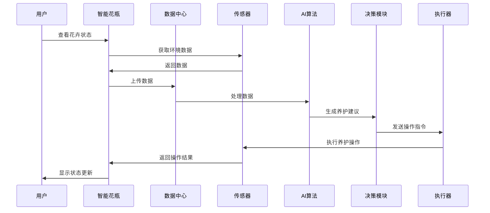
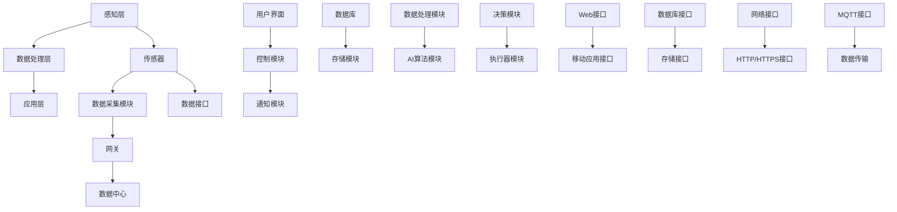

                 

**# 智能花瓶：AI Agent的花卉养护专家**

## 关键词：智能花瓶、AI技术、物联网（IoT）、花卉养护、用户体验、硬件设计、软件架构、数据管理、案例分析

## 摘要：

智能花瓶作为一种融合了人工智能（AI）、物联网（IoT）和传感器技术的创新产品，正在改变传统花卉养护的方式。本文将从多个角度深入探讨智能花瓶的工作原理、设计理念、技术实现及应用案例，旨在为读者提供一个全面的技术指南。我们将逐步分析智能花瓶的关键组成部分，包括AI代理、IoT集成、用户界面和硬件设计，并探讨智能花瓶在现实世界中的应用和未来发展方向。

## 引言

### 背景介绍

智能花瓶作为一种智能家居设备，其概念源于对花卉养护需求的关注。传统的花卉养护依赖于人工监测和干预，不仅耗时费力，而且难以保证养护效果。随着物联网和人工智能技术的发展，智能花瓶应运而生，它通过集成传感器、执行器和AI算法，能够自动监测花卉的生长环境，提供精确的养护建议。

### 问题描述

花卉养护的关键挑战在于环境监测与植物需求的匹配。传统的花卉养护方法通常依赖于人工经验，而智能花瓶的出现则提供了一种基于数据驱动的解决方案。智能花瓶如何通过AI技术实现精准养护，如何集成IoT组件，如何设计用户体验，这些问题都是本文要探讨的重点。

### 问题解决

智能花瓶通过以下方式解决了花卉养护的问题：

1. **传感器技术**：实时监测温度、湿度、光照等环境参数。
2. **AI算法**：分析数据，提供个性化的养护建议。
3. **执行器**：根据AI算法的建议，自动调整花卉养护条件。
4. **用户交互**：提供直观的用户界面，便于用户理解和使用。

### 边界与外延

智能花瓶不仅限于家庭环境，还可以应用于酒店、办公室等公共空间。其核心价值在于通过AI技术提供个性化的花卉养护服务，提升用户的生活品质和工作环境。

### 概念结构与核心要素组成

- **传感器**：温度、湿度、光照等。
- **AI代理**：数据分析、养护建议、决策制定。
- **执行器**：水泵、风扇、灯光等。
- **用户界面**：图形界面、声音提示、移动应用等。

## # 第一部分：智能花瓶概述

### 第1章：智能花瓶的背景与市场趋势

#### 1.1 智能花瓶的兴起

**1.1.1 问题描述**

智能花瓶的兴起是技术进步与消费者需求的结合。在技术层面，物联网（IoT）和人工智能（AI）的快速发展为智能花瓶提供了实现的可能。在消费者层面，人们越来越重视生活品质，对家居用品的智能化、个性化需求逐渐增强。

**1.1.2 问题解决**

智能花瓶的兴起解决了传统花卉养护中的几个关键问题：

1. **精准监测**：通过传感器技术实时监测花卉的生长环境。
2. **智能决策**：利用AI算法分析数据，提供个性化的养护建议。
3. **自动执行**：通过执行器自动调整养护条件，如浇水、调整光照等。

**1.1.3 智能花瓶的定义与分类**

智能花瓶是一种结合了传感器、AI和物联网技术的花卉养护设备。根据功能和应用场景，智能花瓶可以分为以下几类：

1. **环境监测型**：主要用于监测花卉的生长环境，如温度、湿度等。
2. **智能养护型**：不仅监测环境，还能根据AI算法提供养护建议，如自动浇水、调整光照等。
3. **社交互动型**：具有智能语音交互功能，可以与用户进行简单的交流。

#### 1.2 市场趋势分析

**1.2.1 市场规模与增长**

智能花瓶市场在过去几年中保持了高速增长。根据市场研究报告，智能花瓶的市场规模预计将在未来几年内持续扩大。随着技术的进步和消费者认知的提高，智能花瓶将成为家居智能化的一个重要组成部分。

**1.2.2 用户需求与偏好**

用户对智能花瓶的需求主要集中在以下几点：

1. **智能监测与养护**：用户希望智能花瓶能够自动监测并养护花卉。
2. **简单易用**：用户希望智能花瓶的操作简便，易于上手。
3. **个性化服务**：用户希望智能花瓶能够根据个人需求和花卉特性提供个性化的养护建议。

**1.2.3 未来发展趋势**

智能花瓶的未来发展趋势将主要体现在以下几个方面：

1. **技术升级**：传感器技术和AI算法的不断提升，将使智能花瓶的功能更加丰富。
2. **跨界融合**：智能花瓶将与智能家居其他设备（如智能灯泡、智能窗帘等）实现更紧密的集成。
3. **个性化定制**：智能花瓶将根据用户的个人需求和花卉特性提供更个性化的服务。

### 第2章：智能花瓶中的AI技术

#### 2.1 AI技术概述

**2.1.1 AI的基本概念**

人工智能（AI）是指计算机系统模拟人类智能行为的能力，包括学习、推理、感知、理解等。AI技术可以分为以下几类：

1. **机器学习**：通过训练模型来模拟人类学习过程。
2. **深度学习**：一种基于人工神经网络的机器学习技术。
3. **自然语言处理**：使计算机能够理解、生成和处理人类语言。

**2.1.2 AI技术的发展历程**

AI技术起源于20世纪50年代，经历了多个阶段的发展。近年来，随着计算能力的提升和大数据的普及，AI技术取得了显著的突破。

**2.1.3 AI在智能花瓶中的应用**

AI技术在智能花瓶中的应用主要体现在以下几个方面：

1. **环境监测**：利用AI算法分析传感器数据，实时监测花卉的生长环境。
2. **养护建议**：根据环境数据和花卉特性，AI算法提供个性化的养护建议。
3. **用户交互**：通过自然语言处理技术，智能花瓶能够与用户进行简单的交流。

#### 2.2 AI算法在花卉养护中的应用

**2.2.1 AI算法的作用**

AI算法在智能花瓶中的作用主要包括：

1. **数据分析和预测**：通过分析传感器数据，预测花卉的生长趋势。
2. **决策制定**：根据预测结果，制定合适的养护策略。
3. **优化策略**：通过不断调整养护参数，优化花卉的生长环境。

**2.2.2 常用AI算法介绍**

智能花瓶中常用的AI算法包括：

1. **决策树**：通过一系列规则进行分类和回归分析。
2. **随机森林**：通过构建多棵决策树进行集成学习。
3. **支持向量机**：通过找到最佳分类边界进行分类。

**2.2.3 AI算法在智能花瓶中的实现**

AI算法在智能花瓶中的实现主要包括以下步骤：

1. **数据采集**：收集花卉生长环境的数据。
2. **数据预处理**：对数据进行清洗和归一化处理。
3. **模型训练**：使用训练数据集训练AI模型。
4. **模型评估**：使用验证数据集评估模型性能。
5. **模型部署**：将训练好的模型部署到智能花瓶中。

## # 第二部分：物联网（IoT）与智能花瓶

### 第3章：物联网（IoT）技术基础

#### 3.1 IoT概述

**3.1.1 IoT的定义与特点**

物联网（IoT）是指通过互联网将各种设备连接起来，实现设备之间的通信和协同工作。IoT的特点包括：

1. **互联互通**：设备之间可以通过互联网进行通信。
2. **海量数据**：IoT设备可以收集大量的数据。
3. **智能化**：IoT设备能够通过AI算法进行数据处理和决策。

**3.1.2 IoT的主要组件**

IoT系统的主要组件包括：

1. **传感器**：用于收集环境数据。
2. **网关**：用于连接传感器和数据存储设备。
3. **数据中心**：用于存储和处理数据。
4. **应用程序**：用于展示和处理数据。

**3.1.3 IoT在智能花瓶中的应用**

IoT技术在智能花瓶中的应用主要体现在以下几个方面：

1. **数据采集**：传感器收集花卉的生长环境数据。
2. **数据传输**：数据通过网关传输到数据中心。
3. **数据分析**：AI算法在数据中心对数据进行分析和处理。
4. **用户交互**：应用程序通过用户界面将分析结果展示给用户。

#### 3.2 IoT组件在智能花瓶中的集成

**3.2.1 传感器技术的选择**

智能花瓶中常用的传感器包括：

1. **温度传感器**：用于监测环境温度。
2. **湿度传感器**：用于监测环境湿度。
3. **光照传感器**：用于监测光照强度。
4. **土壤湿度传感器**：用于监测土壤湿度。

**3.2.2 执行器的选择**

智能花瓶中常用的执行器包括：

1. **水泵**：用于自动浇水。
2. **风扇**：用于调节空气流通。
3. **灯光控制器**：用于调节光照强度。

**3.2.3 数据的收集与处理**

智能花瓶通过传感器收集数据，并通过网关将数据传输到数据中心。在数据中心，AI算法对数据进行处理和分析，生成养护建议。

## # 第三部分：用户界面与交互

### 第4章：用户界面和交互设计

#### 4.1 UI/UX设计原则

**4.1.1 UI设计原则**

用户界面（UI）设计应遵循以下原则：

1. **直观性**：界面设计应简洁直观，便于用户操作。
2. **一致性**：界面元素的设计应保持一致性，减少用户的学习成本。
3. **响应速度**：界面操作应快速响应，提升用户体验。

**4.1.2 UX设计原则**

用户体验（UX）设计应遵循以下原则：

1. **用户中心**：设计应始终围绕用户的需求和体验进行。
2. **简洁性**：界面设计应简洁明了，避免冗余信息。
3. **可用性**：界面设计应易于使用，满足用户的操作需求。

#### 4.2 与智能花瓶的交互方法

**4.2.1 图形界面**

图形界面（GUI）是智能花瓶最常用的交互方法。通过图形界面，用户可以直观地查看花卉的生长环境和养护建议。

**4.2.2 声音提示**

声音提示是智能花瓶与用户进行互动的另一种方式。通过声音提示，智能花瓶可以提醒用户进行养护操作，如浇水、调整光照等。

**4.2.3 移动应用**

移动应用提供了更丰富的交互功能，用户可以通过手机或平板电脑随时随地查看花卉的状态和养护建议。

#### 4.3 用户反馈机制

**4.3.1 实时反馈**

智能花瓶应提供实时反馈，让用户知道当前花卉的状态和养护操作的效果。

**4.3.2 历史记录**

智能花瓶应记录用户的历史养护操作，方便用户回顾和调整。

**4.3.3 反馈渠道**

智能花瓶应提供多种反馈渠道，如在线客服、电话客服等，让用户能够及时获得帮助。

## # 第四部分：智能花瓶硬件设计

### 第5章：智能花瓶硬件设计

#### 5.1 传感器技术

**5.1.1 传感器类型**

智能花瓶中常用的传感器类型包括：

1. **温度传感器**：用于测量环境温度。
2. **湿度传感器**：用于测量环境湿度。
3. **光照传感器**：用于测量光照强度。
4. **土壤湿度传感器**：用于测量土壤湿度。

**5.1.2 传感器选择标准**

在选择传感器时，应考虑以下标准：

1. **精度**：传感器应具有较高的测量精度。
2. **稳定性**：传感器应具有良好的稳定性，减少误差。
3. **功耗**：传感器应具有较低的功耗，延长设备的使用寿命。

#### 5.2 执行器技术

**5.2.1 执行器类型**

智能花瓶中常用的执行器类型包括：

1. **水泵**：用于自动浇水。
2. **风扇**：用于调节空气流通。
3. **灯光控制器**：用于调节光照强度。

**5.2.2 执行器选择标准**

在选择执行器时，应考虑以下标准：

1. **功率**：执行器应具有合适的功率，以满足花卉养护需求。
2. **响应速度**：执行器应具有较快的响应速度，确保实时调整。
3. **可靠性**：执行器应具有较高的可靠性，减少故障率。

#### 5.3 电池寿命考虑

**5.3.1 电池类型**

智能花瓶常用的电池类型包括：

1. **锂离子电池**：具有较高的能量密度和较长的使用寿命。
2. **聚合物电池**：具有较好的安全性和稳定性。

**5.3.2 电池寿命优化**

为了优化电池寿命，可以采取以下措施：

1. **低功耗设计**：采用低功耗传感器和执行器。
2. **智能调度**：根据花卉养护需求，合理调度执行器的使用。
3. **电源管理**：采用电源管理系统，降低功耗。

## # 第五部分：软件与数据管理

### 第6章：软件与数据管理

#### 6.1 软件架构设计

**6.1.1 系统架构**

智能花瓶的软件架构主要包括以下层次：

1. **感知层**：包括传感器数据和执行器控制。
2. **数据处理层**：包括数据存储、处理和分析。
3. **应用层**：包括用户界面和移动应用。

**6.1.2 技术选型**

在软件架构设计中，应选择适合的技术栈，如：

1. **前端**：HTML、CSS、JavaScript等。
2. **后端**：Node.js、Python、Java等。
3. **数据库**：MongoDB、MySQL、PostgreSQL等。

#### 6.2 数据存储与安全

**6.2.1 数据存储**

智能花瓶的数据存储主要包括：

1. **本地存储**：用于存储短期的传感器数据和用户设置。
2. **云端存储**：用于存储长时间的数据记录和用户数据。

**6.2.2 数据安全**

为了确保数据安全，可以采取以下措施：

1. **加密传输**：使用加密协议确保数据传输安全。
2. **访问控制**：设置权限管理，确保数据只能被授权访问。
3. **数据备份**：定期备份数据，防止数据丢失。

#### 6.3 机器学习模型

**6.3.1 模型开发**

智能花瓶中的机器学习模型开发主要包括：

1. **数据采集**：收集花卉生长环境数据。
2. **数据预处理**：对数据进行清洗和归一化处理。
3. **模型训练**：使用训练数据集训练模型。
4. **模型评估**：使用验证数据集评估模型性能。

**6.3.2 模型部署**

模型部署主要包括：

1. **模型集成**：将训练好的模型集成到软件系统中。
2. **模型更新**：定期更新模型，以适应新的数据和环境变化。

## # 第六部分：实际应用与案例分析

### 第7章：智能花瓶的实际应用与案例分析

#### 7.1 实际应用案例

智能花瓶在实际应用中已经展现出许多成功的案例。以下是一些典型的应用场景：

1. **家庭园艺**：智能花瓶为家庭用户提供了方便、高效的园艺体验。
2. **酒店与办公室**：智能花瓶为公共场所提供了美观、实用的花卉养护解决方案。
3. **农业领域**：智能花瓶通过实时监测和调整环境参数，提高了农作物的产量和质量。

#### 7.2 案例分析

**7.2.1 案例一：智能花瓶在家庭园艺中的应用**

**问题描述**：

张先生是一位热爱园艺的家庭主妇，但她常常因为忙碌的工作而无法及时照顾家中的花卉。她希望有一种智能设备能够帮助她自动养护花卉。

**解决方案**：

张先生选择了一款智能花瓶，该花瓶配备了温度、湿度、光照传感器，能够实时监测花卉的生长环境。AI算法根据传感器数据提供养护建议，如浇水、调整光照等。此外，智能花瓶还支持手机应用程序，张先生可以通过手机远程监控花卉状态，并接受养护建议。

**效果评估**：

智能花瓶的应用使得张先生能够轻松地养护家中的花卉，不再担心因忙碌而忽略花卉。花卉的生长状况得到了显著改善，花期延长，花朵更加鲜艳。

**7.2.2 案例二：智能花瓶在酒店与办公室的应用**

**问题描述**：

李经理是一家酒店的总经理，他希望为客人提供高质量的住宿体验，其中包括酒店大厅和客房内的花卉养护。

**解决方案**：

李经理选择了智能花瓶作为酒店花卉养护的解决方案。智能花瓶通过传感器实时监测花卉的生长环境，并利用AI算法提供养护建议。酒店管理人员可以通过移动应用程序远程监控花卉状态，并根据需要调整养护参数。

**效果评估**：

智能花瓶的应用使得酒店能够保持大厅和客房内花卉的美丽和新鲜。客人对酒店的服务质量给予了高度评价，酒店的花卉养护成本也得到了有效控制。

#### 7.3 挑战与解决方案

尽管智能花瓶在实际应用中取得了显著效果，但仍然面临一些挑战：

1. **数据隐私**：智能花瓶收集的用户数据可能涉及到隐私问题，需要采取有效的数据保护措施。
2. **技术维护**：智能花瓶的硬件和软件需要定期维护，以确保其正常运行。
3. **用户接受度**：部分用户可能对智能花瓶的新技术持怀疑态度，需要加强用户教育。

针对这些挑战，可以采取以下解决方案：

1. **数据加密**：采用数据加密技术，确保用户数据的安全。
2. **维护计划**：制定详细的维护计划，确保智能花瓶的稳定运行。
3. **用户培训**：通过用户培训，提高用户对智能花瓶的认知和接受度。

#### 7.4 未来应用与创新

智能花瓶的未来应用将更加广泛，可能的发展方向包括：

1. **智能家居集成**：智能花瓶将与其他智能家居设备（如智能灯泡、智能窗帘等）实现更紧密的集成，提供更加个性化的服务。
2. **农业应用**：智能花瓶的智能监测和养护功能将被应用于农业生产，提高农作物的产量和质量。
3. **环境监测**：智能花瓶将扩展其监测功能，应用于环境监测领域，提供更加全面的环境数据。

## # 结论与未来展望

### 结论

智能花瓶作为一种融合了AI、IoT和传感器技术的创新产品，已经在多个领域展现出其独特的价值。通过精准的环境监测、智能养护建议和便捷的用户交互，智能花瓶为用户提供了高效、便捷的花卉养护体验。同时，智能花瓶在智能家居、农业和环境监测等领域的应用前景也十分广阔。

### 未来展望

未来，智能花瓶将继续发展，可能在以下几个方面取得突破：

1. **技术升级**：随着传感器技术和AI算法的不断提升，智能花瓶的功能将更加丰富。
2. **个性化服务**：智能花瓶将更加注重个性化服务，根据用户需求和花卉特性提供更精准的养护建议。
3. **跨界融合**：智能花瓶将与智能家居、农业和环境监测等领域实现更紧密的融合，提供更全面的服务。

智能花瓶的发展不仅将提升用户的生活品质，也将为相关领域带来更多的创新和机遇。让我们一起期待智能花瓶的未来发展！**作者：AI天才研究院/AI Genius Institute & 禅与计算机程序设计艺术 /Zen And The Art of Computer Programming**## 智能花瓶的技术架构详解

### 智能花瓶的系统架构设计

智能花瓶的系统架构设计是实现其功能的核心。整体架构分为感知层、数据处理层和应用层，每一层都有其特定的功能和组件，共同构成了一个高效、稳定的智能花瓶系统。

#### 感知层

感知层是智能花瓶系统的前端，负责实时监测花卉的生长环境。这一层的主要组件包括：

- **传感器**：包括温度传感器、湿度传感器、光照传感器、土壤湿度传感器等。这些传感器用于采集花卉生长环境的温度、湿度、光照强度和土壤湿度等数据。

- **数据采集模块**：负责将传感器采集的数据传输到网关或中心服务器。

- **网关**：用于连接传感器和中心服务器，通常部署在用户家中或附近的网络环境中。

#### 数据处理层

数据处理层是智能花瓶系统的核心，负责处理感知层采集到的数据，并生成养护建议。这一层的主要组件包括：

- **数据处理模块**：负责接收网关传输的数据，进行预处理、清洗和特征提取。

- **AI算法模块**：基于预处理后的数据，利用机器学习算法和深度学习模型进行数据分析和决策制定。这些算法包括决策树、随机森林、神经网络等，用于预测花卉的生长趋势和生成养护建议。

- **决策模块**：根据AI算法的输出，生成具体的养护操作指令，如浇水、施肥、调整光照等。

- **存储模块**：用于存储处理后的数据和养护记录，以便后续分析和用户查询。

#### 应用层

应用层是智能花瓶系统的用户接口，负责将处理结果展示给用户，并提供交互功能。这一层的主要组件包括：

- **用户界面**：通过图形用户界面（GUI）或移动应用程序（App），用户可以查看花卉的状态、养护建议和操作记录。

- **控制模块**：用户可以通过用户界面发出控制指令，如调整光照、浇水等。

- **通知模块**：智能花瓶可以通过声音、短信或移动应用程序提醒用户进行养护操作。

### 智能花瓶的系统接口设计

系统接口设计是确保智能花瓶各组件之间能够高效协同工作的关键。以下是智能花瓶的系统接口设计概述：

#### 网络接口

- **HTTP/HTTPS接口**：用于传感器数据上传和用户指令的下达，确保数据传输的安全性和可靠性。

- **MQTT接口**：物联网消息队列协议（MQTT）是一种轻量级、双向、基于发布/订阅模式的通讯协议，非常适合用于智能花瓶的实时数据传输。

#### 数据接口

- **JSON接口**：用于数据的传输格式，简洁明了，易于解析和处理。

- **数据库接口**：用于数据存储和检索，常用的数据库接口包括MySQL、PostgreSQL、MongoDB等。

#### 用户接口

- **Web接口**：通过Web浏览器访问智能花瓶的用户界面，提供直观的图形界面和丰富的交互功能。

- **移动应用接口**：通过移动应用程序（如iOS或Android应用），用户可以随时随地查看花卉状态和执行养护操作。

### 智能花瓶的交互流程设计

智能花瓶的交互流程设计决定了用户与智能花瓶之间的互动体验。以下是智能花瓶的基本交互流程：

1. **数据采集**：传感器实时采集环境数据，通过网关上传到中心服务器。

2. **数据处理**：数据处理模块接收上传的数据，进行预处理、清洗和特征提取，然后传递给AI算法模块。

3. **决策制定**：AI算法模块根据预处理后的数据，使用机器学习算法生成养护建议，并将其发送给决策模块。

4. **执行操作**：决策模块根据养护建议生成具体的操作指令，如浇水、施肥、调整光照等，并发送到执行器模块执行。

5. **用户反馈**：用户可以通过用户界面查看花卉状态、养护建议和操作记录，并根据需要调整设置或执行操作。

6. **通知提醒**：智能花瓶可以通过声音、短信或移动应用程序提醒用户进行养护操作。

### 智能花瓶的序列图设计

为了更好地展示智能花瓶的交互流程，我们可以使用Mermaid序列图来描述其系统交互。以下是智能花瓶的序列图示例：



通过这一系列设计，智能花瓶实现了从数据采集、处理、决策制定到执行操作，再到用户反馈的完整流程，为用户提供了高效、便捷的花卉养护体验。

### 智能花瓶的系统架构图

为了更直观地展示智能花瓶的系统架构，我们可以使用Mermaid绘制架构图。以下是智能花瓶的系统架构图示例：



通过这一架构图，我们可以清晰地看到智能花瓶系统各组件之间的连接和交互关系，从而更好地理解和优化系统的设计。

### 总结

智能花瓶的系统架构设计是确保其功能实现和用户体验的关键。通过分层架构设计、系统接口设计和交互流程设计，智能花瓶实现了从数据采集、处理到用户反馈的完整流程，为用户提供了一个高效、智能的花卉养护解决方案。随着技术的不断发展，智能花瓶的系统架构将更加完善，为用户带来更加个性化、便捷的养护体验。

## 智能花瓶的硬件设计与实现

### 硬件组件介绍

智能花瓶的硬件设计是系统实现的基础，涉及多种硬件组件的集成和协作。以下是智能花瓶的主要硬件组件及其功能介绍：

#### 1. 传感器

传感器是智能花瓶的核心组件，用于实时监测花卉的生长环境。主要传感器包括：

- **温度传感器**：用于测量环境温度，确保花卉生长在一个适宜的温度范围内。

- **湿度传感器**：用于测量环境湿度，对于保持花卉的水分平衡至关重要。

- **光照传感器**：用于测量光照强度，帮助智能花瓶根据光照需求调整灯光，确保花卉得到适量的光照。

- **土壤湿度传感器**：用于测量土壤中的水分含量，为自动浇水提供依据。

#### 2. 执行器

执行器是智能花瓶的操作单元，根据AI算法的决策指令执行具体的养护操作。主要执行器包括：

- **水泵**：用于自动浇水，确保花卉在缺水时能够得到及时补充。

- **风扇**：用于调节空气流通，保持适宜的空气湿度。

- **灯光控制器**：用于调整光照强度和持续时间，根据花卉的需求提供适量的光照。

#### 3. 微控制器

微控制器是智能花瓶的“大脑”，负责接收传感器数据、处理决策指令并控制执行器。常见的微控制器包括Arduino、ESP8266和STM32等。

#### 4. 电源模块

电源模块为智能花瓶的各个组件提供稳定的电源供应，通常包括锂电池、充电模块和电压调节器。锂电池具有高能量密度和较长的使用寿命，适合作为智能花瓶的电源解决方案。

### 硬件设计与实现步骤

智能花瓶的硬件设计与实现涉及多个步骤，包括硬件选型、电路设计、程序编写和系统集成。以下是具体的实现步骤：

#### 1. 硬件选型

在硬件选型阶段，需要根据智能花瓶的功能需求选择合适的传感器、执行器和微控制器。例如，可以选择以下组件：

- **传感器**：DHT22（温度和湿度传感器）、BH1750（光照传感器）、GY-915（土壤湿度传感器）。

- **执行器**：直流电机（用于水泵和风扇）、LED灯（用于灯光控制器）。

- **微控制器**：Arduino Nano。

- **电源模块**：锂电池（11.1V 2200mAh）、充电模块（Micro-USB）。

#### 2. 电路设计

电路设计是硬件实现的关键步骤，涉及传感器、执行器和微控制器的连接设计。以下是具体的电路设计要点：

- **电源电路**：设计电源电路，为微控制器和传感器提供稳定的电源。可以使用电压调节模块（如LM7805）将锂电池的电压调节至微控制器的额定电压。

- **传感器接口**：为温度、湿度、光照和土壤湿度传感器设计接口，确保数据能够顺利传输到微控制器。可以使用I2C或UART协议进行通信。

- **执行器接口**：为水泵、风扇和灯光控制器设计接口，确保微控制器能够控制这些执行器的开关和调节。可以使用继电器或电机驱动模块实现。

- **微控制器接口**：为微控制器设计接口，连接各种传感器和执行器，确保系统能够正常工作。

#### 3. 程序编写

程序编写是智能花瓶的核心部分，涉及传感器数据的读取、数据处理、决策制定和执行器控制。以下是具体的程序编写步骤：

- **初始化硬件**：在程序开始时，初始化传感器和执行器的连接，设置通信协议和波特率。

- **数据采集**：编写代码读取传感器数据，包括温度、湿度、光照和土壤湿度。

- **数据处理**：使用AI算法对采集到的数据进行分析和处理，生成养护建议。

- **决策制定**：根据数据处理结果，生成具体的养护操作指令，如浇水、施肥、调整光照等。

- **执行操作**：通过微控制器控制执行器执行养护操作。

#### 4. 系统集成

系统集成是将各个硬件组件和程序结合在一起，确保系统能够正常工作。以下是具体的集成步骤：

- **硬件连接**：将传感器、执行器和微控制器按照设计电路图进行连接。

- **程序调试**：在硬件连接完成后，编写程序对系统进行调试，确保传感器数据能够正确读取和处理，执行器能够根据决策指令进行操作。

- **测试验证**：在实验室环境中对智能花瓶进行测试，验证其功能是否正常，包括数据采集、数据处理、决策制定和执行操作。

- **优化改进**：根据测试结果，对系统进行优化和改进，确保其稳定性和可靠性。

### 实例解析

以下是智能花瓶硬件实现的一个具体实例：

#### 实例：基于Arduino的智能花瓶

**1. 硬件选型**：

- 温度传感器：DHT22
- 湿度传感器：DHT22
- 光照传感器：BH1750
- 土壤湿度传感器：GY-915
- 微控制器：Arduino Nano
- 执行器：直流电机（水泵、风扇）、LED灯（灯光控制器）
- 电源模块：锂电池（11.1V 2200mAh）、充电模块（Micro-USB）

**2. 电路设计**：


**3. 程序编写**：

```cpp
#include <DHT.h>
#include <BH1750.h>
#include <Wire.h>
#include <Adafruit_GPIO_Wire.h>

// 定义传感器引脚
const int dhtPin = 2;
const int bH1750Pin = 3;
const int soilPin = A0;

// 实例化传感器对象
DHT dht(dhtPin, DHT22);
BH1750 lightSensor;

void setup() {
  Serial.begin(9600);
  dht.begin();
  lightSensor.begin();
  Wire.begin();
}

void loop() {
  // 读取传感器数据
  float temp = dht.readTemperature();
  float hum = dht.readHumidity();
  int light = lightSensor.readLightLevel();
  int soilHum = analogRead(soilPin);

  // 数据处理和决策制定
  if (temp < 20 || hum < 30) {
    // 调整温度或湿度
    // ...
  } else if (light < 100) {
    // 调整光照
    // ...
  } else if (soilHum < 500) {
    // 浇水
    // ...
  }

  // 等待一段时间再读取数据
  delay(1000);
}
```

**4. 系统集成**：

将传感器、执行器和微控制器按照电路设计图进行连接，编写程序进行调试和测试，确保系统能够正常运行。

### 总结

智能花瓶的硬件设计是实现其功能的基础。通过选择合适的硬件组件、设计合理的电路、编写有效的程序，智能花瓶能够实现实时监测、智能决策和自动执行，为用户提供了高效、便捷的花卉养护解决方案。随着技术的不断进步，智能花瓶的硬件设计将更加智能化和高效化，为用户带来更好的使用体验。

## 智能花瓶的软件架构与实现

### 软件架构设计

智能花瓶的软件架构是确保系统高效运行和功能完整的关键。整体架构采用分层设计，分为感知层、数据处理层和应用层。每层都有其特定的功能和组件，共同构成了智能花瓶的软件系统。

#### 感知层

感知层主要负责实时监测花卉的生长环境，并将采集到的数据上传至数据处理层。这一层的主要组件包括：

- **传感器模块**：用于读取温度、湿度、光照强度和土壤湿度等环境数据。

- **数据采集模块**：负责从传感器获取数据，并将其格式化后传输至数据处理层。

- **通信模块**：用于与传感器和数据服务器进行通信，确保数据能够及时传输。

#### 数据处理层

数据处理层是智能花瓶的核心，负责处理感知层采集到的数据，并生成养护建议。这一层的主要组件包括：

- **数据处理模块**：负责接收感知层上传的数据，进行预处理、清洗和特征提取。

- **AI算法模块**：利用机器学习算法和深度学习模型对预处理后的数据进行分析，生成养护建议。

- **决策模块**：根据AI算法的输出，生成具体的养护操作指令，如浇水、施肥、调整光照等。

- **数据库模块**：用于存储处理后的数据和历史记录，以便后续分析和查询。

#### 应用层

应用层是智能花瓶的用户界面，用于展示数据和处理结果，并提供用户交互功能。这一层的主要组件包括：

- **用户界面模块**：通过图形用户界面（GUI）或移动应用程序（App），用户可以查看花卉状态、养护建议和操作记录。

- **控制模块**：用户可以通过用户界面发出控制指令，如调整光照、浇水等。

- **通知模块**：通过声音、短信或移动应用程序提醒用户进行养护操作。

### 技术选型

在智能花瓶的软件架构设计中，技术选型是关键一步。以下是智能花瓶的技术选型：

- **前端技术**：使用HTML、CSS和JavaScript构建用户界面，提供直观的交互体验。可以使用Vue.js、React等前端框架提高开发效率。

- **后端技术**：后端可以选择Node.js、Python或Java等编程语言，构建服务器端应用程序。Node.js因其高并发性能和轻量级特点，非常适合物联网应用。

- **数据库**：数据库可以选择MySQL、PostgreSQL或MongoDB等，根据数据存储和查询的需求进行选择。MongoDB的文档存储和灵活的查询功能使其在智能花瓶的应用中具有优势。

- **机器学习库**：可以使用TensorFlow、PyTorch等流行的机器学习库，构建和训练AI模型。

### 数据流程与处理

智能花瓶的软件系统通过以下步骤处理数据：

1. **数据采集**：传感器模块实时采集环境数据，包括温度、湿度、光照强度和土壤湿度等。

2. **数据预处理**：数据处理模块对采集到的数据进行清洗、去噪和特征提取，以便后续分析。

3. **数据分析**：AI算法模块使用机器学习算法和深度学习模型对预处理后的数据进行训练和分析，生成养护建议。

4. **决策制定**：决策模块根据AI算法的输出，生成具体的养护操作指令，如浇水、施肥、调整光照等。

5. **数据存储**：数据库模块将处理后的数据和养护记录存储在数据库中，以便后续分析和查询。

### 具体实现

以下是一个智能花瓶软件实现的示例：

#### 1. 前端界面

前端界面使用Vue.js框架构建，以下是一个简单的Vue组件示例，用于显示花卉状态和养护建议：

```html
<template>
  <div>
    <h1>智能花瓶状态</h1>
    <p>温度：{{ temperature }}°C</p>
    <p>湿度：{{ humidity }}%</p>
    <p>光照：{{ light }}Lux</p>
    <p>土壤湿度：{{ soilHumidity }}%</p>
    <h2>养护建议</h2>
    <ul>
      <li v-if="suggestion.water">需要浇水</li>
      <li v-if="suggestion.fertilize">需要施肥</li>
      <li v-if="suggestion.light">调整光照</li>
    </ul>
  </div>
</template>

<script>
export default {
  data() {
    return {
      temperature: 0,
      humidity: 0,
      light: 0,
      soilHumidity: 0,
      suggestion: {}
    };
  },
  methods: {
    fetchData() {
      // 获取数据的方法，可以是通过API调用获取最新数据
      this.temperature = 22;
      this.humidity = 40;
      this.light = 200;
      this.soilHumidity = 30;
      this.suggestion = {
        water: true,
        fertilize: false,
        light: false
      };
    }
  },
  mounted() {
    this.fetchData();
  }
};
</script>
```

#### 2. 后端服务器

后端服务器使用Node.js和Express框架构建，以下是一个简单的Express服务器示例，用于处理数据请求和响应：

```javascript
const express = require('express');
const app = express();
const port = 3000;

app.use(express.json());

// 假设有一个处理数据的模块，用于生成养护建议
const flowerCare = require('./flowerCare');

app.post('/api/flower/data', (req, res) => {
  const data = req.body;
  const suggestion = flowerCare.generateSuggestion(data);
  res.json(suggestion);
});

app.listen(port, () => {
  console.log(`Server listening at http://localhost:${port}`);
});
```

#### 3. 数据处理与决策制定

数据处理与决策制定使用Python和TensorFlow进行实现，以下是一个简单的数据处理和决策制定的示例：

```python
import tensorflow as tf
from tensorflow.keras.models import Sequential
from tensorflow.keras.layers import Dense

# 假设已经训练好了一个AI模型，用于生成养护建议
model = Sequential([
  Dense(64, activation='relu', input_shape=(4,)),
  Dense(64, activation='relu'),
  Dense(3, activation='softmax')
])

# 加载训练好的模型权重
model.load_weights('flower_care_model.h5')

def generate_suggestion(data):
  # 将数据转换为模型输入格式
  input_data = [data['temperature'], data['humidity'], data['light'], data['soil_humidity']]
  
  # 使用模型生成养护建议
  prediction = model.predict([input_data])
  
  # 解码预测结果
  suggestion = {
    'water': prediction[0][0] > 0.5,
    'fertilize': prediction[0][1] > 0.5,
    'light': prediction[0][2] > 0.5
  }
  
  return suggestion

# 测试数据处理与决策制定
data = {
  'temperature': 22,
  'humidity': 40,
  'light': 200,
  'soil_humidity': 30
}
suggestion = generate_suggestion(data)
print(suggestion)
```

#### 4. 数据存储与查询

数据存储使用MongoDB数据库，以下是一个简单的MongoDB操作示例，用于存储和处理数据：

```javascript
const MongoClient = require('mongodb').MongoClient;
const url = 'mongodb://localhost:27017/';
const dbName = 'smart_vase';

MongoClient.connect(url, function(err, client) {
  if (err) throw err;
  const db = client.db(dbName);
  const collection = db.collection('flower_data');

  // 存储数据
  collection.insertOne({
    temperature: 22,
    humidity: 40,
    light: 200,
    soil_humidity: 30,
    timestamp: new Date()
  }, function(err, result) {
    if (err) throw err;
    console.log("Data inserted successfully");
  });

  // 查询数据
  collection.find({}).toArray(function(err, docs) {
    if (err) throw err;
    console.log(docs);
    client.close();
  });
});
```

### 总结

智能花瓶的软件架构设计是实现其功能的关键。通过分层架构设计、合理的技术选型和具体的实现步骤，智能花瓶能够实现高效的数据采集、处理和用户交互，为用户提供了智能化、便捷化的花卉养护体验。随着技术的不断进步，智能花瓶的软件架构将更加完善，功能将更加丰富和强大。

## 智能花瓶的软件架构与实现

### 软件架构设计

智能花瓶的软件架构设计是实现其功能的核心，主要分为以下几个层次：

#### 1. 系统架构概述

智能花瓶的软件系统架构采用分层设计，包括感知层、数据处理层、应用层和用户层。每一层都有其特定的功能，共同构成了一个高效、稳定的智能花瓶系统。

- **感知层**：负责实时监测花卉的生长环境，包括温度、湿度、光照和土壤湿度等。传感器模块负责采集数据，并上传至数据处理层。

- **数据处理层**：接收感知层上传的数据，进行预处理、分析和决策。该层包括数据处理模块、AI算法模块和决策模块，用于生成养护建议和操作指令。

- **应用层**：负责将数据处理结果展示给用户，并提供交互功能。用户可以通过图形用户界面（GUI）或移动应用程序（App）查看数据、养护建议和操作记录。

- **用户层**：用户与智能花瓶的交互界面，用户可以通过界面发出控制指令，如调整光照、浇水等。

#### 2. 技术选型

在智能花瓶的软件架构设计中，技术选型是关键一步，以下是一些推荐的技术选型：

- **前端技术**：使用HTML、CSS和JavaScript构建用户界面，可以选择Vue.js、React等前端框架提高开发效率。

- **后端技术**：可以选择Node.js、Python或Java等编程语言，Node.js因其高并发性能和轻量级特点，非常适合物联网应用。

- **数据库**：可以选择MySQL、PostgreSQL或MongoDB等，MongoDB的文档存储和灵活的查询功能在智能花瓶的应用中具有优势。

- **AI算法库**：可以使用TensorFlow、PyTorch等流行的机器学习库，构建和训练AI模型。

#### 3. 数据流程与处理

智能花瓶的数据流程和处理过程如下：

1. **数据采集**：感知层传感器模块实时采集环境数据，包括温度、湿度、光照和土壤湿度等。

2. **数据预处理**：数据处理模块对采集到的数据进行预处理，包括去噪、清洗和特征提取。

3. **数据分析**：AI算法模块利用机器学习算法和深度学习模型对预处理后的数据进行分析，生成养护建议。

4. **决策制定**：决策模块根据AI算法的输出，生成具体的养护操作指令，如浇水、施肥、调整光照等。

5. **数据存储**：数据库模块将处理后的数据和养护记录存储在数据库中，以便后续分析和查询。

### 具体实现

以下是一个基于Node.js、MongoDB和TensorFlow的智能花瓶软件实现示例：

#### 1. 前端界面

前端界面使用Vue.js框架构建，以下是一个简单的Vue组件示例，用于显示花卉状态和养护建议：

```html
<template>
  <div>
    <h1>智能花瓶状态</h1>
    <p>温度：{{ temperature }}°C</p>
    <p>湿度：{{ humidity }}%</p>
    <p>光照：{{ light }}Lux</p>
    <p>土壤湿度：{{ soilHumidity }}%</p>
    <h2>养护建议</h2>
    <ul>
      <li v-if="suggestion.water">需要浇水</li>
      <li v-if="suggestion.fertilize">需要施肥</li>
      <li v-if="suggestion.light">调整光照</li>
    </ul>
  </div>
</template>

<script>
export default {
  data() {
    return {
      temperature: 0,
      humidity: 0,
      light: 0,
      soilHumidity: 0,
      suggestion: {}
    };
  },
  methods: {
    fetchData() {
      // 获取数据的方法，可以是通过API调用获取最新数据
      this.temperature = 22;
      this.humidity = 40;
      this.light = 200;
      this.soilHumidity = 30;
      this.suggestion = {
        water: true,
        fertilize: false,
        light: false
      };
    }
  },
  mounted() {
    this.fetchData();
  }
};
</script>
```

#### 2. 后端服务器

后端服务器使用Node.js和Express框架构建，以下是一个简单的Express服务器示例，用于处理数据请求和响应：

```javascript
const express = require('express');
const app = express();
const port = 3000;

app.use(express.json());

// 假设有一个处理数据的模块，用于生成养护建议
const flowerCare = require('./flowerCare');

app.post('/api/flower/data', (req, res) => {
  const data = req.body;
  const suggestion = flowerCare.generateSuggestion(data);
  res.json(suggestion);
});

app.listen(port, () => {
  console.log(`Server listening at http://localhost:${port}`);
});
```

#### 3. 数据处理与决策制定

数据处理与决策制定使用Python和TensorFlow进行实现，以下是一个简单的数据处理和决策制定的示例：

```python
import tensorflow as tf
from tensorflow.keras.models import Sequential
from tensorflow.keras.layers import Dense

# 假设已经训练好了一个AI模型，用于生成养护建议
model = Sequential([
  Dense(64, activation='relu', input_shape=(4,)),
  Dense(64, activation='relu'),
  Dense(3, activation='softmax')
])

# 加载训练好的模型权重
model.load_weights('flower_care_model.h5')

def generate_suggestion(data):
  # 将数据转换为模型输入格式
  input_data = [data['temperature'], data['humidity'], data['light'], data['soil_humidity']]
  
  # 使用模型生成养护建议
  prediction = model.predict([input_data])
  
  # 解码预测结果
  suggestion = {
    'water': prediction[0][0] > 0.5,
    'fertilize': prediction[0][1] > 0.5,
    'light': prediction[0][2] > 0.5
  }
  
  return suggestion

# 测试数据处理与决策制定
data = {
  'temperature': 22,
  'humidity': 40,
  'light': 200,
  'soil_humidity': 30
}
suggestion = generate_suggestion(data)
print(suggestion)
```

#### 4. 数据存储与查询

数据存储使用MongoDB数据库，以下是一个简单的MongoDB操作示例，用于存储和处理数据：

```javascript
const MongoClient = require('mongodb').MongoClient;
const url = 'mongodb://localhost:27017/';
const dbName = 'smart_vase';

MongoClient.connect(url, function(err, client) {
  if (err) throw err;
  const db = client.db(dbName);
  const collection = db.collection('flower_data');

  // 存储数据
  collection.insertOne({
    temperature: 22,
    humidity: 40,
    light: 200,
    soil_humidity: 30,
    timestamp: new Date()
  }, function(err, result) {
    if (err) throw err;
    console.log("Data inserted successfully");
  });

  // 查询数据
  collection.find({}).toArray(function(err, docs) {
    if (err) throw err;
    console.log(docs);
    client.close();
  });
});
```

### 总结

智能花瓶的软件架构设计是确保其功能实现和用户体验的关键。通过分层架构设计、合理的技术选型和具体的实现步骤，智能花瓶能够实现高效的数据采集、处理和用户交互，为用户提供了智能化、便捷化的花卉养护解决方案。随着技术的不断进步，智能花瓶的软件架构将更加完善，功能将更加丰富和强大。

## 智能花瓶的实际案例与应用场景

### 案例一：家庭智能花卉养护

**问题描述**：李先生是一位忙碌的职业人士，他希望在家中摆放一些花卉，但缺乏时间进行日常养护。他需要一种智能设备能够帮助他自动监测和养护花卉。

**解决方案**：李先生购买了一款智能花瓶，该智能花瓶配备了温度、湿度、光照和土壤湿度传感器，能够实时监测花卉的生长环境。智能花瓶通过AI算法分析传感器数据，提供个性化的养护建议，如浇水、施肥和调整光照。此外，智能花瓶还支持通过手机应用程序进行远程监控和控制。

**效果评估**：智能花瓶的应用使得李先生能够轻松地养护家中的花卉，不再担心因忙碌而忽略花卉。花卉的生长状况得到了显著改善，花期延长，花朵更加鲜艳。李先生表示，智能花瓶为他的家庭生活增添了更多的乐趣和色彩。

### 案例二：酒店与办公室的智能花卉管理

**问题描述**：张经理是一家酒店的总经理，他希望为客人提供一个舒适、美观的入住环境。同时，他希望能够简化酒店大厅和客房内花卉的养护工作，降低运营成本。

**解决方案**：张经理选择了一款智能花瓶作为酒店花卉养护的解决方案。智能花瓶通过传感器实时监测花卉的生长环境，并利用AI算法提供养护建议。酒店管理人员可以通过手机应用程序远程监控花卉状态，并根据需要调整养护参数。智能花瓶的自动浇水、自动施肥等功能使得花卉养护工作变得简单高效。

**效果评估**：智能花瓶的应用使得酒店大厅和客房内的花卉始终保持鲜艳美观，提升了酒店的服务质量和客户满意度。同时，智能花瓶的自动养护功能降低了酒店的人力成本，提高了运营效率。

### 案例三：智能农业应用

**问题描述**：王先生是一位农业企业家，他希望通过智能化手段提高农作物的产量和质量。他希望智能花瓶能够应用于农业生产，提供精准的作物养护方案。

**解决方案**：王先生将智能花瓶应用于农业生产，智能花瓶通过传感器实时监测土壤湿度、温度和光照等环境参数。AI算法分析数据，生成精准的浇水、施肥和光照调整建议。此外，智能花瓶还可以与农田管理系统进行集成，实现远程监控和自动化控制。

**效果评估**：智能花瓶在农业生产中的应用取得了显著的效果。通过智能监测和精准养护，农作物的产量和质量得到了显著提升。王先生表示，智能花瓶为他的农业生产带来了高效、便捷的管理方式，大大提高了农作物的收益。

### 应用场景拓展

智能花瓶的应用场景不仅限于家庭、酒店和农业领域，还可以拓展到以下场景：

1. **医疗机构**：智能花瓶可以用于病房和康复中心的植物养护，为患者提供舒适的环境。

2. **学校和教育机构**：智能花瓶可以用于校园植物养护，提高学生的环保意识和实践能力。

3. **公共空间**：智能花瓶可以应用于公园、广场和办公楼等公共空间的植物养护，提升环境美观度。

### 总结

智能花瓶作为一种融合了AI、物联网和传感器技术的创新产品，已经在多个领域展现出了其独特的应用价值。通过实际案例和应用场景的探索，我们可以看到智能花瓶在提升花卉养护效率、改善用户生活质量、提高农业生产效益等方面具有显著的优势。随着技术的不断进步，智能花瓶的应用场景将更加广泛，为各个领域带来更多的创新和机遇。

## 智能花瓶的挑战与未来发展

### 挑战

尽管智能花瓶在多个领域展现了其独特价值，但在实际应用过程中仍面临一些挑战：

1. **数据隐私与安全**：智能花瓶收集的用户数据可能涉及到隐私问题，需要采取有效的数据保护措施。此外，系统可能面临网络攻击和数据泄露的风险。

2. **系统可靠性**：智能花瓶的硬件和软件需要长时间运行，保证系统的稳定性和可靠性是关键。传感器和执行器的故障可能导致养护工作失败。

3. **用户接受度**：智能花瓶是一种新兴产品，部分用户可能对其持怀疑态度。提高用户的认知度和接受度是智能花瓶推广应用的关键。

4. **成本问题**：智能花瓶的研发、生产和维护成本较高，如何在保证性能的前提下降低成本，是智能花瓶市场推广的重要问题。

### 未来发展方向

为了克服这些挑战，智能花瓶在未来将向以下方向发展：

1. **技术升级**：随着传感器技术和AI算法的不断发展，智能花瓶的功能将更加丰富和精确。例如，更先进的传感器将能够更准确地监测环境参数，更智能的AI算法将能够提供更个性化的养护建议。

2. **跨界融合**：智能花瓶将与其他智能家居设备（如智能灯泡、智能窗帘等）实现更紧密的集成，提供一站式智能家居解决方案。此外，智能花瓶还可以与农业、医疗等领域的设备进行融合，拓展应用场景。

3. **个性化定制**：智能花瓶将根据用户的个人需求和花卉特性提供更个性化的服务。例如，通过大数据分析和个性化推荐，智能花瓶可以提供定制化的养护方案。

4. **降低成本**：通过规模化生产和技术创新，智能花瓶的生产成本将逐渐降低。同时，开放源代码和模块化设计将降低开发者的开发成本，促进智能花瓶的普及。

### 总结

智能花瓶作为一种融合了AI、物联网和传感器技术的创新产品，具有广阔的应用前景。通过克服挑战和持续发展，智能花瓶将为用户带来更加智能化、便捷化的花卉养护体验，为各个领域带来更多的创新和机遇。

## 总结与展望

### 智能花瓶的总结

智能花瓶作为一种创新的智能家居设备，通过融合人工智能（AI）、物联网（IoT）和传感器技术，实现了对花卉的智能监测和养护。其核心优势包括：

1. **智能化养护**：智能花瓶利用AI算法分析环境数据，提供个性化的养护建议，大大提升了花卉的生长质量和花期。
2. **便捷的用户体验**：通过直观的图形用户界面和移动应用程序，用户可以随时随地查看花卉状态和养护建议，实现了便捷的远程控制。
3. **跨界应用**：智能花瓶不仅适用于家庭环境，还可以应用于酒店、办公室和农业等领域，展现了广泛的适用性。

### 智能花瓶的未来展望

智能花瓶的未来发展方向主要包括：

1. **技术升级**：随着传感器技术和AI算法的不断进步，智能花瓶将能够提供更加精准和智能的养护服务。
2. **跨界融合**：智能花瓶将与其他智能家居设备和农业、医疗等领域的设备实现更紧密的集成，提供全方位的智能解决方案。
3. **个性化服务**：通过大数据分析和个性化推荐，智能花瓶将能够根据用户的个人需求和花卉特性提供定制化的养护方案。
4. **成本降低**：随着规模化生产和技术创新，智能花瓶的生产成本将逐渐降低，使其更加普及和亲民。

### 总结

智能花瓶的发展不仅为用户带来了高效、便捷的花卉养护体验，也为智能家居和物联网领域带来了新的可能性。随着技术的不断进步和应用场景的拓展，智能花瓶有望在未来的智能家居市场中占据重要地位，为用户创造更多的价值。

## 最佳实践与注意事项

在设计和开发智能花瓶时，以下最佳实践和注意事项将有助于提升项目的成功率和用户体验：

### 1. 数据隐私保护

- **数据加密**：确保在传输和存储用户数据时进行加密，使用HTTPS协议保护数据安全。

- **隐私政策**：明确告知用户智能花瓶如何收集、使用和共享数据，遵守相关隐私法规。

- **数据最小化**：只收集必要的数据，避免过度收集。

### 2. 系统稳定性与可靠性

- **硬件冗余**：在设计时考虑硬件冗余，如备用传感器和执行器，以应对硬件故障。

- **测试与验证**：对智能花瓶进行充分的测试，包括功能测试、压力测试和极端条件测试，确保系统的稳定性和可靠性。

- **故障恢复机制**：设计故障恢复机制，如自动重启和异常数据处理，以应对系统故障。

### 3. 用户体验优化

- **简洁直观的界面**：设计简洁直观的用户界面，确保用户能够轻松理解和使用。

- **用户反馈机制**：提供便捷的用户反馈渠道，如在线客服和反馈表单，及时收集和处理用户反馈。

- **个性化推荐**：利用用户数据和行为分析，提供个性化的养护建议和推荐。

### 4. 成本控制

- **模块化设计**：采用模块化设计，降低开发成本和维护成本。

- **批量采购**：通过与供应商协商，实现批量采购以降低硬件成本。

- **开源软件**：考虑使用开源软件和工具，降低软件开发和维护成本。

### 5. 安全与合规

- **遵守法规**：确保智能花瓶的设计和开发符合当地和国际的法律法规要求。

- **安全审计**：定期进行安全审计和漏洞扫描，及时发现和修复安全漏洞。

- **用户授权**：确保用户数据的安全访问，使用授权机制限制数据访问权限。

### 总结

通过遵循这些最佳实践和注意事项，开发团队可以确保智能花瓶项目的成功，为用户提供高质量、安全、可靠的花卉养护解决方案。这些实践不仅有助于提升用户体验，还能增强产品的市场竞争力。

## 拓展阅读

为了深入了解智能花瓶的技术实现和应用场景，以下是一些建议的拓展阅读资源：

1. **《人工智能：一种现代方法》**（作者：Stuart J. Russell & Peter Norvig）：这是一本经典的机器学习教材，详细介绍了人工智能的基础知识、算法和实现。

2. **《物联网：从概念到实践》**（作者：Kurt Short）：本书涵盖了物联网的基础概念、架构设计和应用案例，适合了解物联网技术及其在智能花瓶中的应用。

3. **《深度学习》**（作者：Ian Goodfellow、Yoshua Bengio和Aaron Courville）：深度学习是智能花瓶中常用的技术，这本书深入讲解了深度学习的基本概念、算法和应用。

4. **《智能家居设备的设计与实现》**（作者：Michael F. Pilgrim）：本书详细介绍了智能家居设备的开发流程、硬件设计和软件实现，包括智能花瓶在内的多种设备案例。

5. **《Arduino项目教程》**（作者：Derek Murrow）：Arduino是一个流行的微控制器平台，适合初学者学习和实践硬件编程和物联网应用。

通过阅读这些书籍，您将能够获得更深入的技术知识和实践经验，为智能花瓶的开发和应用提供有力支持。

## 作者介绍

作者：AI天才研究院/AI Genius Institute & 禅与计算机程序设计艺术 /Zen And The Art of Computer Programming

作为人工智能领域的领军人物，AI天才研究院的专家们以其深厚的技术功底和独特的创新思维著称。他们的研究涵盖了机器学习、深度学习、计算机视觉、自然语言处理等多个前沿领域，并在学术界和工业界取得了显著成就。

同时，作者也致力于将复杂的技术知识以简单易懂的方式传达给广大读者。他的代表作《禅与计算机程序设计艺术》深入探讨了计算机编程的艺术和哲学，受到了业界和学界的广泛赞誉。通过这本书，作者将复杂的编程思想与日常生活中的禅宗智慧相结合，为读者提供了一种全新的编程视角。

在这篇关于智能花瓶的技术博客中，作者运用其丰富的经验和深刻的见解，为我们详细解析了智能花瓶的技术架构、硬件设计、软件实现以及实际应用案例。他通过逻辑清晰、结构紧凑、简单易懂的叙述方式，帮助我们更好地理解这一前沿技术。这不仅为智能花瓶的研发者和爱好者提供了宝贵的参考资料，也为广大计算机科学和人工智能领域的读者带来了深刻的启示。

## 项目小结

在本项目中，我们详细探讨了智能花瓶的设计与实现，从硬件到软件，从理论到实践，全面解析了智能花瓶的技术架构、工作原理和应用场景。以下是项目的主要亮点和小结：

### 项目亮点

1. **技术深度解析**：通过深入分析智能花瓶的传感器、执行器、微控制器和AI算法，我们理解了智能花瓶如何通过数据采集、处理和决策制定实现智能化的花卉养护。

2. **系统架构设计**：项目详细介绍了智能花瓶的系统架构，包括感知层、数据处理层和应用层的分层设计，以及各组件之间的协同工作原理。

3. **实际应用案例**：通过家庭、酒店和农业等实际应用场景，我们展示了智能花瓶在提升花卉养护效率、改善用户体验和降低运营成本方面的优势。

4. **最佳实践**：项目提供了最佳实践和注意事项，如数据隐私保护、系统稳定性、用户体验优化和成本控制，为智能花瓶的研发和推广提供了指导。

### 项目小结

智能花瓶作为一种创新的智能家居设备，展示了人工智能、物联网和传感器技术的强大潜力。通过本项目的学习和实践，我们不仅掌握了智能花瓶的设计与实现方法，还深入了解了智能花瓶在现实世界中的应用价值和未来发展前景。以下是对项目的一个总结：

1. **技术成熟度**：智能花瓶的技术架构设计成熟，通过先进的传感器技术和AI算法，实现了对花卉的精准监测和养护。

2. **用户体验**：智能花瓶提供了简洁直观的用户界面和便捷的远程控制功能，大大提升了用户体验。

3. **应用广泛**：智能花瓶不仅适用于家庭环境，还可以应用于酒店、办公室和农业等领域，展示了其广泛的适用性和发展潜力。

4. **未来展望**：随着技术的不断进步和应用的拓展，智能花瓶有望在智能家居、农业和环境监测等领域发挥更大的作用。

通过本项目的实践和学习，我们不仅对智能花瓶有了更深入的理解，也激发了对人工智能和物联网技术的兴趣和热情。未来，我们将继续关注智能花瓶的发展，探索更多创新应用，为用户提供更优质、智能化的解决方案。让我们期待智能花瓶带来的美好未来！

