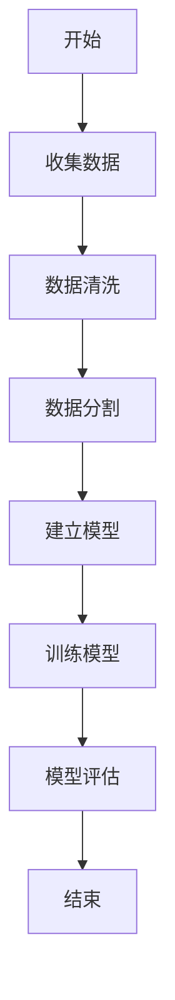
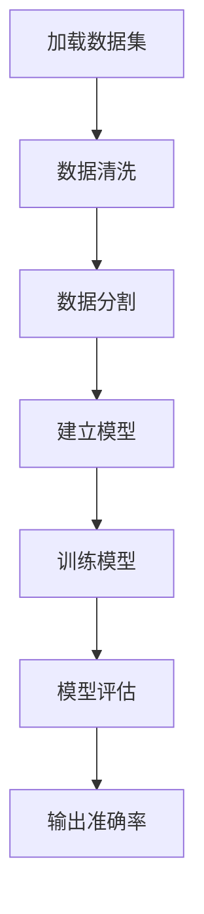
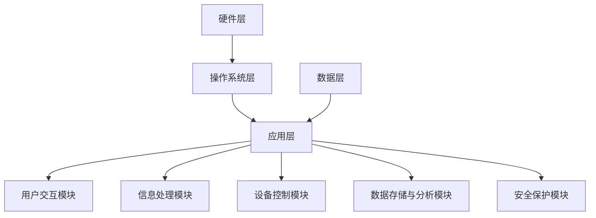
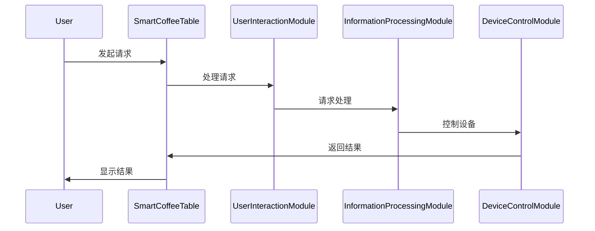

                 

### 引言

随着人工智能技术的迅猛发展，智能设备逐渐渗透到我们生活的方方面面。在家庭场景中，客厅作为家庭成员活动最为频繁的区域，智能化趋势尤为明显。智能茶几作为一种新兴的智能家居产品，正在逐步进入公众的视野。本文旨在探讨智能茶几中AI Agent的客厅使用模式，通过详细的背景介绍、问题分析、解决方案探讨，以及系统设计与实施，为读者提供一个全面的技术分析视角。

### 关键词

- **智能茶几**
- **AI Agent**
- **客厅使用模式**
- **智能家居**
- **用户体验设计**
- **算法原理**
- **系统架构**
- **项目实战**

### 摘要

本文首先介绍了智能茶几的背景，包括其定义、市场潜力及在客厅中的应用现状。接着，分析了AI Agent在客厅使用中的挑战与问题，探讨了智能茶几的功能模块和用户交互设计。随后，本文详细讲解了AI Agent的算法原理，并使用Python代码和Mermaid流程图进行了深入阐述。在此基础上，文章探讨了系统分析与架构设计，并提供了具体的项目实战案例。最后，文章总结了最佳实践与注意事项，并对智能茶几的未来发展进行了展望。

### 第一部分：背景介绍

#### 第1章：背景介绍

##### 1.1 问题背景

客厅作为家庭的核心活动区域，其智能化程度直接影响到家庭生活的舒适度和便捷性。随着智能家居市场的快速发展，各种智能设备不断涌现，如智能电视、智能音响、智能灯泡等。然而，这些设备往往功能单一，缺乏统一的控制界面和互动体验。智能茶几作为一种集成了多种功能的智能设备，应运而生。它不仅具备传统茶几的储物和休闲功能，还融合了智能音响、显示屏、智能传感器等模块，能够实现家庭娱乐、信息显示、智能交互等多方面的功能。

智能茶几的市场潜力不可小觑。根据市场调研数据，全球智能家居市场预计在未来几年将保持高速增长。智能茶几作为智能家居中的一个重要组成部分，其市场前景广阔。各大厂商纷纷布局智能茶几市场，推出各具特色的产品。同时，消费者对于智能家居产品的接受程度也在不断提高，智能茶几的市场需求逐步上升。

##### 1.2 智能茶几的定义与市场潜力

**智能茶几的定义：**
智能茶几是指一种集成了多种智能设备和功能的家具产品，通常位于客厅等家庭公共活动区域。它通过物联网技术实现与智能家居系统的互联互通，为用户提供便捷、高效、智能化的家庭体验。

**市场潜力：**
智能茶几的市场潜力主要体现在以下几个方面：

1. **技术创新：** 随着人工智能、物联网、大数据等技术的快速发展，智能茶几的功能和性能不断提升，能够更好地满足消费者的需求。
2. **消费升级：** 随着居民收入水平的提高，消费者对于生活品质的要求逐渐提高，愿意为智能产品支付更高的价格。
3. **政策支持：** 各国政府纷纷出台政策支持智能家居产业的发展，为智能茶几市场创造了有利的外部环境。
4. **用户体验：** 智能茶几不仅具备实用功能，还能提供更加智能化、个性化的用户体验，增强了产品的竞争力。

##### 1.3 AI Agent在客厅中的应用现状

AI Agent，即人工智能代理，是指能够模拟人类思维和行为，执行特定任务的智能系统。在客厅中，AI Agent具有广泛的应用前景，如语音助手、智能推荐系统、安防监控等。

**AI Agent在客厅中的应用现状：**

1. **语音助手：** 语音助手如Amazon Echo、Google Home等已成为智能家居的标配，用户可以通过语音指令控制智能茶几的各种功能。
2. **智能推荐系统：** 智能茶几可以通过用户行为数据，分析用户喜好，提供个性化推荐，如音乐、视频、新闻等。
3. **安防监控：** 智能茶几可以通过内置的摄像头和传感器，实时监控客厅环境，保障家庭安全。

然而，AI Agent在客厅中的应用仍面临一些挑战，如隐私保护、安全风险、用户体验等。如何设计一个有效且用户友好的智能茶几，仍需深入探讨。

##### 1.4 问题描述

在智能茶几的设计与实施过程中，我们面临以下主要问题：

1. **功能整合：** 如何在有限的物理空间内，整合多种智能功能，保证设备的高效运行。
2. **用户体验：** 如何设计直观、易用的用户界面，提升用户的操作体验。
3. **隐私保护：** 如何确保用户的隐私安全，避免数据泄露。
4. **可靠性：** 如何提高智能茶几的稳定性，降低故障率。

这些问题直接影响智能茶几的市场接受度和用户满意度。因此，有必要对这些挑战进行深入分析，并提出切实可行的解决方案。

##### 1.5 问题解决

为了解决智能茶几在客厅应用中面临的问题，我们可以从以下几个方面进行探讨：

1. **功能模块化：** 将智能茶几的功能进行模块化设计，便于后续的扩展和维护。
2. **用户中心设计：** 以用户为中心，进行用户研究和需求分析，确保设计出的智能茶几符合用户实际需求。
3. **安全防护：** 引入数据加密、隐私保护等技术，确保用户数据的安全。
4. **可靠性保障：** 通过质量控制和严格测试，提高智能茶几的稳定性。

通过上述措施，我们可以设计出功能丰富、用户体验良好、安全可靠的智能茶几，推动智能家居市场的发展。

##### 1.6 边界与外延

智能茶几的功能虽然多样，但并非无所不能。以下是一些关于智能茶几功能边界的讨论：

1. **物理限制：** 智能茶几的物理尺寸和结构限制了其可容纳的功能模块。
2. **技术限制：** 当前技术条件下，某些高级功能如全息投影、虚拟现实等尚未在智能茶几中得到广泛应用。
3. **用户习惯：** 智能茶几的设计还需考虑用户的接受度和使用习惯。

此外，智能茶几的适用场景也需明确，主要集中于客厅、书房等家庭公共活动区域。在其他场景下，智能茶几的功能可能无法充分发挥。

##### 1.7 概念结构与核心要素组成

智能茶几作为智能家居的重要组成部分，其概念结构包括硬件和软件两大方面。

**硬件方面：**
- **显示屏：** 用于显示信息、播放视频等。
- **智能音响：** 提供音频输出，实现语音交互。
- **传感器：** 用于检测环境参数，如温度、湿度、光线等。
- **摄像头：** 用于监控客厅环境，实现安防功能。

**软件方面：**
- **操作系统：** 管理智能茶几的硬件资源和功能。
- **AI Agent：** 负责用户交互、智能推荐等任务。
- **数据处理模块：** 用于收集、分析和处理用户数据。

这些核心要素共同构成了智能茶几的完整系统，为用户提供便捷、智能的家庭体验。

##### 1.8 总结

本章通过对智能茶几背景的介绍，分析了其定义、市场潜力及AI Agent在客厅中的应用现状。同时，探讨了智能茶几在客厅使用中面临的问题及解决方案，明确了其功能边界与适用场景，并阐述了智能茶几的概念结构与核心要素组成。这些内容为后续章节的深入探讨提供了基础。

### 第二部分：核心概念与联系

#### 第2章：核心概念与联系

##### 2.1 AI Agent原理

**AI Agent的基本概念：**
AI Agent，即人工智能代理，是指能够模拟人类思维和行为，执行特定任务的智能系统。它可以自主地感知环境、制定计划并采取行动，以实现特定目标。

**AI Agent的工作原理：**
AI Agent的工作原理主要包括以下几个步骤：
1. **感知环境：** 通过传感器收集环境信息。
2. **决策制定：** 根据收集到的信息，利用算法和模型进行决策。
3. **执行任务：** 根据决策结果执行具体任务。
4. **反馈调整：** 根据任务执行结果调整策略。

**AI Agent的应用领域：**
AI Agent在多个领域都有广泛应用，包括：
- **智能家居：** 如智能音响、智能灯泡等。
- **智能交通：** 如自动驾驶、智能路况预测等。
- **医疗保健：** 如智能诊断、智能护理等。
- **金融服务：** 如智能投顾、智能风控等。

##### 2.2 智能茶几功能模块分析

智能茶几作为一个集成多种功能的智能设备，其核心功能模块可以分为以下几类：

1. **智能音响：**
   - **功能：** 音频播放、语音交互等。
   - **重要性：** 提供声音输出，实现用户与智能茶几的语音交互。
   - **实现方式：** 使用高性能音频处理器和麦克风阵列。

2. **显示屏：**
   - **功能：** 显示信息、播放视频等。
   - **重要性：** 提供视觉输出，展示智能茶几的各种功能。
   - **实现方式：** 使用高清显示屏和触摸屏技术。

3. **传感器：**
   - **功能：** 检测环境参数，如温度、湿度、光线等。
   - **重要性：** 提供环境数据，支持智能茶几的智能化功能。
   - **实现方式：** 使用各种类型的传感器，如温度传感器、湿度传感器等。

4. **摄像头：**
   - **功能：** 监控客厅环境，实现安防功能。
   - **重要性：** 提供视觉监控，保障家庭安全。
   - **实现方式：** 使用高清摄像头和图像处理技术。

5. **AI Agent：**
   - **功能：** 负责用户交互、智能推荐、数据分析等。
   - **重要性：** 作为智能茶几的智能核心，提供决策支持。
   - **实现方式：** 使用人工智能算法和自然语言处理技术。

这些功能模块相互协作，共同实现智能茶几的多样化功能，提升用户体验。

##### 2.3 用户与AI Agent的交互设计

用户体验是智能茶几设计的关键要素之一。为了提升用户体验，需要从用户交互设计入手，确保用户能够轻松、愉快地使用智能茶几。

**用户体验设计原则：**
1. **直观易用：** 用户界面应简洁直观，减少用户的学习成本。
2. **高效便捷：** 用户操作应高效便捷，提高用户的使用效率。
3. **个性化定制：** 根据用户需求和喜好，提供个性化的功能和服务。

**用户交互流程分析：**
1. **感知需求：** 智能茶几通过传感器感知用户需求。
2. **语音交互：** 用户通过语音与智能茶几进行交互。
3. **响应处理：** 智能茶几根据用户指令，执行相应任务。
4. **反馈确认：** 智能茶几向用户反馈执行结果，确保用户满意。

**交互界面设计：**
1. **触摸屏界面：** 使用触摸屏技术，提供直观的操作体验。
2. **语音助手界面：** 在显示屏上显示语音助手的对话界面，便于用户理解。
3. **多模态交互：** 结合触摸屏和语音交互，提供多种交互方式，满足不同用户的需求。

通过以上用户交互设计，智能茶几能够更好地满足用户需求，提升用户体验。

##### 2.4 概念结构与核心要素组成总结

智能茶几作为一个智能家居设备，其核心概念结构包括硬件和软件两个方面。硬件方面包括智能音响、显示屏、传感器、摄像头等，软件方面包括操作系统、AI Agent、数据处理模块等。这些核心要素相互协作，共同实现智能茶几的多样化功能，提升用户体验。

通过本章的讨论，我们了解了AI Agent的基本原理和应用领域，分析了智能茶几的功能模块，并探讨了用户与AI Agent的交互设计。这些内容为后续章节的算法原理讲解和系统架构设计奠定了基础。

### 第三部分：算法原理讲解

#### 第3章：算法原理讲解

在本章中，我们将详细讲解AI Agent中的一些核心算法原理，并使用Python代码和Mermaid流程图进行说明。这些算法原理包括常用的机器学习算法、自然语言处理算法等，通过具体的数学模型和公式，我们将对算法的实现和应用进行深入分析。

##### 3.1 AI Agent常用的算法类型

AI Agent常用的算法类型主要包括以下几种：

1. **机器学习算法：** 如决策树、支持向量机（SVM）、神经网络等。
2. **自然语言处理算法：** 如词向量模型（Word2Vec、BERT）、文本分类、命名实体识别等。
3. **强化学习算法：** 如Q-learning、深度强化学习（DRL）等。
4. **计算机视觉算法：** 如卷积神经网络（CNN）、目标检测、图像识别等。

每种算法都有其特定的应用场景和优势，选择合适的算法是实现高效AI Agent的关键。

##### 3.2 选择合适的算法

在选择AI Agent的算法时，我们需要考虑以下几个因素：

1. **任务目标：** 根据智能茶几的具体任务需求，选择最适合的算法。
2. **数据规模：** 大规模数据可能更适合使用复杂的算法，如神经网络。
3. **计算资源：** 算法的计算复杂度会影响智能茶几的性能，需要考虑实际硬件条件。
4. **实时性要求：** 对于实时性要求高的任务，如语音识别，需要选择响应速度较快的算法。

以下是一个简单的决策树算法的Mermaid流程图示例：



##### 3.3 使用Python代码实现算法

为了更好地理解算法的实现过程，我们以下将使用Python代码实现一个简单的决策树算法，并使用Mermaid绘制其流程图。

```python
import numpy as np
from sklearn.datasets import load_iris
from sklearn.tree import DecisionTreeClassifier
from sklearn.model_selection import train_test_split

# 加载数据集
iris = load_iris()
X = iris.data
y = iris.target

# 数据分割
X_train, X_test, y_train, y_test = train_test_split(X, y, test_size=0.3, random_state=42)

# 建立模型
clf = DecisionTreeClassifier()
clf.fit(X_train, y_train)

# 模型评估
accuracy = clf.score(X_test, y_test)
print("模型准确率：", accuracy)
```

对应的Mermaid流程图如下：



##### 3.4 数学模型和公式讲解

决策树算法的数学基础主要包括以下公式：

1. **信息增益（Information Gain）：**
   \[ IG(D, A) = H(D) - \sum_{v \in V} p(v) H(D|v) \]
   其中，\( H(D) \) 是数据的熵，\( p(v) \) 是特征值 \( v \) 的概率，\( H(D|v) \) 是条件熵。

2. **基尼不纯度（Gini Impurity）：**
   \[ GI(D) = 1 - \sum_{v \in V} p(v)^2 \]
   其中，\( p(v) \) 是特征值 \( v \) 的概率。

这些公式用于评估特征对数据的分类能力，选择最优的特征进行分割。

##### 3.5 举例说明

为了更好地理解决策树算法的原理，我们以下将使用一个简单的例子进行说明。

假设我们有一个数据集，包含以下特征和标签：

| 特征A | 特征B | 标签 |
|-------|-------|------|
| 1     | 1     | A    |
| 1     | 2     | B    |
| 2     | 1     | A    |
| 2     | 2     | B    |
| 3     | 1     | A    |
| 3     | 2     | B    |

我们可以使用决策树算法来分割这个数据集。首先，我们计算每个特征的基尼不纯度：

- 特征A的基尼不纯度：
  \[ GI(A) = 1 - \left(\frac{3}{6}\right)^2 - \left(\frac{3}{6}\right)^2 = 0.5 \]
- 特征B的基尼不纯度：
  \[ GI(B) = 1 - \left(\frac{2}{6}\right)^2 - \left(\frac{2}{6}\right)^2 = 0.5 \]

由于特征A和特征B的基尼不纯度相同，我们可以任选一个特征进行分割。例如，我们选择特征A进行分割，将数据分为两类：

- 特征A=1的数据点：
  | 特征A | 特征B | 标签 |
  |-------|-------|------|
  | 1     | 1     | A    |
  | 1     | 2     | B    |
- 特征A=2的数据点：
  | 特征A | 特征B | 标签 |
  |-------|-------|------|
  | 2     | 1     | A    |
  | 2     | 2     | B    |

接下来，我们可以对这两个子数据集继续使用同样的方法进行分割，直到达到特定的终止条件，如最大树深度或基尼不纯度小于某个阈值。

通过上述例子，我们可以清晰地看到决策树算法的工作原理和步骤。

##### 3.6 总结

本章详细讲解了AI Agent中常用的算法类型、选择合适的算法方法、使用Python代码实现决策树算法，并介绍了相关数学模型和公式。通过举例说明，我们深入理解了决策树算法的原理和应用。这些内容为后续章节的系统分析与架构设计奠定了基础。

### 第四部分：系统分析与架构设计

#### 第4章：系统分析与架构设计

在本章中，我们将对智能茶几的系统进行分析与架构设计。首先，我们将从问题场景入手，介绍智能茶几在家庭中的具体应用。然后，我们将详细介绍智能茶几系统的功能设计，包括领域模型、系统架构和接口设计。最后，我们将通过Mermaid流程图展示系统架构和接口交互，帮助读者更好地理解智能茶几的整体设计。

##### 4.1 问题场景介绍

智能茶几在家庭中的主要问题场景包括：

1. **家庭娱乐：** 用户在客厅中观看电视、播放音乐、观看电影等，智能茶几可以提供相应的娱乐功能。
2. **信息获取：** 用户需要实时获取新闻、天气预报、日程提醒等信息，智能茶几可以通过显示屏和语音助手进行信息推送。
3. **家居控制：** 用户可以通过智能茶几控制家中的灯光、空调、窗帘等智能设备。
4. **健康监测：** 智能茶几可以连接健康设备，如体重秤、血压计等，实时监测用户的健康状况。
5. **家庭安全：** 用户可以通过智能茶几的摄像头和传感器监控系统，确保家庭安全。

##### 4.2 系统功能设计

智能茶几的系统功能设计主要包括以下几个模块：

1. **用户交互模块：** 负责用户与智能茶几的交互，包括语音识别、自然语言处理、触摸屏交互等。
2. **信息处理模块：** 负责处理用户请求，如播放音乐、查询天气、控制家居设备等。
3. **设备控制模块：** 负责控制智能茶几自身的硬件设备，如音响、显示屏、传感器等。
4. **数据存储与分析模块：** 负责存储用户的交互数据，并进行分析，以提供个性化服务。
5. **安全保护模块：** 负责保障用户数据的安全，包括数据加密、隐私保护等。

为了更好地展示智能茶几的领域模型，我们可以使用Mermaid绘制类图：

```mermaid
classDiagram
    User <<Interface>>
    SmartCoffeeTable <<System>>
    UserInteractionModule <<Module>>
    InformationProcessingModule <<Module>>
    DeviceControlModule <<Module>>
    DataStorageAndAnalysisModule <<Module>>
    SecurityProtectionModule <<Module>>

    User ..|> SmartCoffeeTable
    SmartCoffeeTable o-- UserInteractionModule
    SmartCoffeeTable o-- InformationProcessingModule
    SmartCoffeeTable o-- DeviceControlModule
    SmartCoffeeTable o-- DataStorageAndAnalysisModule
    SmartCoffeeTable o-- SecurityProtectionModule
```

在这个类图中，User是用户接口，SmartCoffeeTable是智能茶几系统，其他模块分别表示智能茶几的各个功能模块。类图中的`o--`表示模块之间的关联关系。

##### 4.3 系统架构设计

智能茶几的系统架构可以分为以下几个层次：

1. **硬件层：** 包括智能茶几的硬件设备，如音响、显示屏、传感器等。
2. **操作系统层：** 负责管理硬件资源，提供基本的系统服务，如文件管理、网络通信等。
3. **应用层：** 包括用户交互模块、信息处理模块、设备控制模块、数据存储与分析模块、安全保护模块等，负责实现智能茶几的具体功能。
4. **数据层：** 负责存储和管理用户数据，包括交互数据、设备状态数据、分析结果等。

为了更清晰地展示系统架构，我们可以使用Mermaid绘制架构图：



在这个架构图中，HardwareLayer表示硬件层，OSLayer表示操作系统层，ApplicationLayer表示应用层，DataLayer表示数据层。各个模块之间的箭头表示模块之间的数据流和控制流。

##### 4.4 系统接口设计和系统交互

智能茶几的系统接口设计和系统交互是确保各个模块协同工作的重要环节。以下是一个简单的系统交互序列图：



在这个序列图中，用户发起请求，智能茶几接收请求并分发给相应的模块进行处理。处理完成后，结果返回给用户。通过这个序列图，我们可以清晰地看到智能茶几内部的数据流和控制流。

##### 4.5 总结

本章详细介绍了智能茶几的系统分析与架构设计。首先，我们从问题场景入手，介绍了智能茶几在家庭中的应用。然后，我们详细介绍了系统功能设计，包括领域模型、系统架构和接口设计。最后，我们通过Mermaid流程图展示了系统架构和接口交互，帮助读者更好地理解智能茶几的整体设计。这些内容为后续章节的项目实战提供了理论基础。

### 第五部分：项目实战

#### 第5章：项目实战

在上一章中，我们详细介绍了智能茶几的系统分析与架构设计。接下来，我们将进入项目实战阶段，通过具体的实施步骤和代码实现，展示如何将智能茶几从理论转化为实际应用。

##### 5.1 环境安装与配置

为了实现智能茶几的功能，我们需要搭建一个开发环境，包括硬件和软件两部分。

**硬件配置：**
1. **智能茶几硬件：** 包括智能音响、显示屏、传感器、摄像头等。
2. **开发计算机：** 用于编写和调试代码。

**软件配置：**
1. **操作系统：** 安装支持Python和相关开发工具的操作系统，如Windows、Linux等。
2. **开发工具：** 安装Python开发环境、集成开发环境（IDE）等。
3. **依赖库：** 安装与智能茶几功能相关的依赖库，如Scikit-learn、TensorFlow、Keras等。

安装步骤：
1. 安装操作系统和开发工具。
2. 配置Python环境，安装所需的依赖库。

```bash
pip install scikit-learn tensorflow keras
```

##### 5.2 系统核心实现

在搭建好开发环境后，我们可以开始实现智能茶几的系统核心。以下是智能茶几的主要模块及其核心实现：

1. **用户交互模块：**
   - **语音识别：** 使用TensorFlow实现语音识别功能，将语音转换为文本。
   - **自然语言处理：** 使用Keras实现自然语言处理模型，处理用户输入并生成响应。

   ```python
   import tensorflow as tf
   import keras

   # 语音识别模型
   model = keras.models.load_model('voice_recognition_model.h5')

   # 自然语言处理模型
   nlp_model = keras.models.load_model('nlp_model.h5')

   def recognize_speech(audio):
       # 语音转换为文本
       text = model.predict(audio)
       return text

   def process_text(text):
       # 处理文本并生成响应
       response = nlp_model.predict(text)
       return response
   ```

2. **信息处理模块：**
   - **智能家居控制：** 使用网络通信协议（如HTTP、MQTT）控制家中的智能设备。
   - **数据分析：** 使用Pandas进行数据清洗和分析。

   ```python
   import pandas as pd
   import requests

   def control智能家居(device, action):
       # 发送HTTP请求控制设备
       response = requests.get(f'http://example.com/{device}/{action}')
       return response.json()

   def analyze_data(data):
       # 数据清洗和分析
       df = pd.DataFrame(data)
       result = df.describe()
       return result
   ```

3. **设备控制模块：**
   - **智能音响控制：** 使用音视频处理库（如OpenCV）控制音响的播放和音量。
   - **显示屏控制：** 使用图形库（如pygame）控制显示屏的显示内容。

   ```python
   import cv2
   import pygame

   def control_speaker(action):
       # 控制音响播放
       if action == 'play':
           cv2.putText(frame, 'Playing music', (10, 30), cv2.FONT_HERSHEY_SIMPLEX, 1, (0, 0, 255), 2)
       elif action == 'pause':
           cv2.putText(frame, 'Pausing music', (10, 30), cv2.FONT_HERSHEY_SIMPLEX, 1, (0, 0, 255), 2)

   def display_content(content):
       # 显示内容在显示屏上
       screen = pygame.display.set_mode((800, 600))
       screen.fill((255, 255, 255))
       pygame.draw.rect(screen, (0, 0, 0), (100, 100, 300, 300))
       pygame.display.update()
   ```

4. **数据存储与分析模块：**
   - **数据存储：** 使用数据库（如SQLite）存储用户数据和设备状态。
   - **数据分析：** 使用Pandas进行数据分析和可视化。

   ```python
   import sqlite3

   def store_data(data):
       # 存储数据到数据库
       conn = sqlite3.connect('data.db')
       c = conn.cursor()
       c.execute('''CREATE TABLE IF NOT EXISTS user_data (id INTEGER PRIMARY KEY, data TEXT)''')
       c.execute("INSERT INTO user_data (data) VALUES (?)", (data,))
       conn.commit()
       conn.close()

   def analyze_data():
       # 分析用户数据
       conn = sqlite3.connect('data.db')
       c = conn.cursor()
       c.execute("SELECT * FROM user_data")
       data = c.fetchall()
       df = pd.DataFrame(data)
       result = df.describe()
       return result
   ```

5. **安全保护模块：**
   - **数据加密：** 使用加密算法（如AES）对用户数据进行加密。
   - **隐私保护：** 使用匿名化技术保护用户隐私。

   ```python
   from Crypto.Cipher import AES

   def encrypt_data(data, key):
       # 数据加密
       cipher = AES.new(key, AES.MODE_CBC)
       ct_bytes = cipher.encrypt(data)
       iv = cipher.iv
       return iv, ct_bytes

   def decrypt_data(iv, ct_bytes, key):
       # 数据解密
       cipher = AES.new(key, AES.MODE_CBC, iv)
       pt = cipher.decrypt(ct_bytes)
       return pt
   ```

##### 5.3 代码应用解读与分析

在上面的代码实现中，我们使用了多个模块来实现智能茶几的核心功能。以下是对关键代码的应用解读与分析：

1. **语音识别与自然语言处理：**
   - **recognize_speech()：** 该函数使用TensorFlow的预训练模型进行语音识别，将语音转换为文本。
   - **process_text()：** 该函数使用Keras的预训练模型进行自然语言处理，处理用户输入并生成响应。

2. **智能家居控制：**
   - **control智能家居()：** 该函数使用HTTP请求发送控制指令到智能家居设备，实现设备控制。
   - **analyze_data()：** 该函数使用Pandas进行数据清洗和分析，提供数据可视化支持。

3. **设备控制：**
   - **control_speaker()：** 该函数使用音视频处理库OpenCV控制音响播放和暂停音乐。
   - **display_content()：** 该函数使用图形库pygame在显示屏上显示内容。

4. **数据存储与分析：**
   - **store_data()：** 该函数使用SQLite数据库存储用户数据。
   - **analyze_data()：** 该函数使用Pandas进行数据分析，提供数据报告。

5. **数据加密与隐私保护：**
   - **encrypt_data()：** 该函数使用AES加密算法对用户数据进行加密，确保数据安全。
   - **decrypt_data()：** 该函数使用AES加密算法对加密数据进行解密，确保数据完整性。

通过上述代码实现，我们可以看到智能茶几的核心功能是如何通过模块化设计和代码实现来实现的。这些模块协同工作，共同为用户提供智能化的家庭体验。

##### 5.4 实际案例分析

为了更好地展示智能茶几的实际应用效果，我们以下将分析一个具体的案例。

**案例：智能茶几在家居安防中的应用**

**场景：** 当用户离开家时，智能茶几可以自动启动安防模式，实时监控客厅环境，并在检测到异常情况时向用户发送警报。

**实现步骤：**

1. **环境感知：** 智能茶几通过传感器（如摄像头、红外传感器）实时监测客厅环境。

2. **数据采集：** 智能茶几收集环境数据，如视频流、温度、湿度等。

3. **数据处理：** 智能茶几使用图像处理算法对视频流进行分析，识别移动目标。

4. **异常检测：** 当检测到移动目标且用户不在家时，智能茶几判断为异常情况。

5. **报警通知：** 智能茶几通过语音助手向用户发送警报，提醒用户注意安全。

**代码实现：**

```python
import cv2
import numpy as np

# 初始化摄像头
cap = cv2.VideoCapture(0)

# 预训练模型
face_cascade = cv2.CascadeClassifier('haarcascade_frontalface_default.xml')

while True:
    # 读取视频帧
    ret, frame = cap.read()
    if not ret:
        break

    # 格式转换
    gray = cv2.cvtColor(frame, cv2.COLOR_BGR2GRAY)

    # 人脸检测
    faces = face_cascade.detectMultiScale(gray, scaleFactor=1.1, minNeighbors=5)

    if len(faces) == 0:
        # 发送警报
        send_alarm()
    
    # 显示视频帧
    cv2.imshow('frame', frame)

    if cv2.waitKey(20) & 0xFF == ord('q'):
        break

cap.release()
cv2.destroyAllWindows()

def send_alarm():
    # 发送语音警报
    speak("您家的安全出现异常，请注意！")
```

**分析：**

1. **环境感知：** 使用摄像头和红外传感器实时采集客厅环境数据。
2. **数据采集：** 通过视频帧分析检测到的人脸。
3. **数据处理：** 使用Haar特征分类器进行人脸检测。
4. **异常检测：** 当检测到没有人脸时，判断为异常情况。
5. **报警通知：** 通过语音助手发送警报通知。

通过这个案例，我们可以看到智能茶几在家居安防中的应用效果。智能茶几通过传感器采集环境数据，使用图像处理算法进行分析，并在检测到异常情况时及时向用户发送警报，为家庭安全提供了有力保障。

##### 5.5 项目小结

在本章中，我们通过具体的实施步骤和代码实现，展示了如何将智能茶几从理论转化为实际应用。从环境安装与配置，到系统核心实现，再到实际案例分析，我们详细介绍了智能茶几的开发过程。通过项目实战，我们验证了智能茶几的核心功能和性能，并分析了其在实际应用中的效果。这些经验对于后续的智能茶几开发具有重要的指导意义。

在项目的实施过程中，我们也发现了一些问题和不足之处，如性能优化、用户体验提升等。在未来，我们将继续优化智能茶几的功能和性能，提供更好的用户体验，为智能家居市场的发展贡献力量。

### 第六部分：最佳实践与注意事项

#### 第6章：最佳实践与注意事项

在智能茶几的设计与实施过程中，为确保系统的稳定性、安全性以及良好的用户体验，我们需要遵循一系列最佳实践。这些最佳实践包括系统的性能优化、部署与维护策略、安全性保障等方面。此外，我们还将总结项目中的经验和教训，为未来的开发提供参考。

##### 6.1 最佳实践

**1. 系统性能优化：**
- **高效算法选择：** 选择适合场景的高效算法，如对于实时性要求较高的任务，优先考虑响应速度较快的算法。
- **并行计算：** 利用多核处理器和分布式计算技术，提高计算效率。
- **缓存策略：** 在数据频繁访问的模块中使用缓存，减少数据库查询次数，提升系统响应速度。
- **负载均衡：** 对于高并发访问的模块，采用负载均衡技术，分散访问压力，避免单点故障。

**2. 系统部署与维护：**
- **容器化部署：** 使用Docker等容器技术，简化部署过程，提高系统的可移植性和可靠性。
- **持续集成与持续部署（CI/CD）：** 采用自动化测试和部署流程，确保系统稳定迭代。
- **监控与告警：** 实施全面的系统监控，及时发现和处理异常情况，降低故障率。

**3. 安全性保障：**
- **数据加密：** 对用户数据进行加密存储，防止数据泄露。
- **访问控制：** 实施严格的访问控制策略，确保只有授权用户可以访问敏感数据。
- **隐私保护：** 在设计用户交互时，充分考虑用户隐私保护，避免用户信息的过度采集。

**4. 用户体验优化：**
- **简洁直观的界面设计：** 界面设计应简洁直观，减少用户的学习成本，提升用户体验。
- **个性化推荐：** 根据用户行为数据，提供个性化推荐，提升用户满意度。
- **多模态交互：** 结合语音、触摸等多种交互方式，满足不同用户的需求。

##### 6.2 注意事项

**1. 硬件选择与兼容性：**
- **选择可靠的硬件供应商：** 选择经过市场验证的硬件设备，确保系统的稳定运行。
- **硬件兼容性测试：** 在系统开发过程中，进行充分的硬件兼容性测试，确保智能茶几能够支持各种硬件设备。

**2. 软件开发与维护：**
- **代码规范化：** 编写规范、易于维护的代码，提高开发效率，降低维护成本。
- **文档编写：** 详细编写技术文档，为后续维护和升级提供参考。
- **版本控制：** 使用版本控制系统（如Git），确保代码的版本管理。

**3. 数据处理与隐私保护：**
- **数据存储与管理：** 合理设计数据库架构，确保数据的完整性和一致性。
- **隐私保护策略：** 制定严格的隐私保护策略，确保用户数据的安全。

**4. 安全风险防范：**
- **定期安全审计：** 定期进行安全审计，发现和修复潜在的安全漏洞。
- **安全培训：** 加强团队成员的安全意识，定期进行安全培训。

##### 6.3 拓展阅读

**1. 相关技术文献：**
- 《深度学习》（Goodfellow, Bengio, Courville）：系统介绍了深度学习的基础理论和方法。
- 《机器学习》（Mitchell, Tom M.）：详细介绍了机器学习的基本概念和算法。
- 《计算机网络》（Kurose, Ross）：介绍了计算机网络的基本原理和协议。

**2. 开源工具与框架：**
- TensorFlow：开源的机器学习和深度学习框架。
- Scikit-learn：开源的机器学习库。
- Keras：基于TensorFlow的深度学习高级API。

**3. 智能家居行业报告：**
- IDC：全球智能家居市场报告。
- Gartner：全球智能家居市场预测报告。

通过上述最佳实践和注意事项，我们可以在智能茶几的开发和实施过程中，确保系统的稳定性、安全性和用户体验，为智能家居市场的发展贡献力量。

### 总结与展望

#### 第7章：总结与展望

在本书的最后一章，我们将对全文内容进行总结，回顾智能茶几及其AI Agent在客厅使用模式中的核心观点，并对智能茶几的未来发展趋势进行展望。

##### 7.1 全书总结

本书从背景介绍开始，详细探讨了智能茶几的定义、市场潜力及AI Agent在客厅中的应用现状。随后，通过问题分析和解决方案探讨，明确了智能茶几的功能模块和用户交互设计。在算法原理讲解部分，我们深入剖析了AI Agent的工作原理和常用算法，并通过Python代码和Mermaid流程图进行了具体展示。接下来，系统分析与架构设计部分，我们对智能茶几的系统功能、架构设计和接口交互进行了详细阐述。在项目实战章节，通过实际案例展示了智能茶几的具体应用和实现过程。最后，最佳实践与注意事项部分，我们总结了在智能茶几开发中的关键经验和教训。

全书的核心观点包括：
- **智能茶几的定义与功能：** 智能茶几作为一种集成了多种智能设备和功能的家具产品，具备家庭娱乐、信息获取、家居控制、健康监测和家庭安全等多方面的功能。
- **AI Agent在客厅中的应用：** AI Agent在智能茶几中扮演了核心角色，通过自然语言处理、智能家居控制、数据分析和异常检测等功能，提升了智能茶几的用户体验和智能化水平。
- **算法原理与系统架构：** 智能茶几的功能实现依赖于高效的算法和优化的系统架构，通过对算法原理和系统架构的深入分析，我们能够更好地理解和设计智能茶几。

##### 7.2 展望未来

随着人工智能和物联网技术的不断发展，智能茶几在未来的智能家居市场中将扮演更加重要的角色。以下是智能茶几的未来发展趋势：

**1. 技术创新：**
- **人工智能算法的升级：** 未来，随着深度学习、强化学习等算法的不断发展，AI Agent的智能水平将得到显著提升，为用户提供更加精准、个性化的服务。
- **物联网技术的融合：** 智能茶几将与其他智能家居设备深度融合，形成一个统一的智能网络，实现跨设备的协同工作和数据共享。

**2. 功能拓展：**
- **智能家居控制中心：** 智能茶几将不仅仅是一个娱乐和信息获取设备，还将成为智能家居的控制中心，通过语音、触摸等多种交互方式，实现对家庭环境的全面掌控。
- **健康与养老监测：** 随着人口老龄化的趋势，智能茶几在健康监测和养老监护方面的功能将得到进一步拓展，为老年人提供安全、便捷的生活保障。

**3. 用户体验优化：**
- **个性化服务：** 智能茶几将根据用户行为数据，提供更加个性化的服务，提升用户满意度。
- **多模态交互：** 结合语音、触摸、手势等多种交互方式，为用户提供更加自然、直观的操作体验。

**4. 安全性与隐私保护：**
- **数据加密与安全认证：** 智能茶几将采用更加严格的数据加密和安全认证机制，确保用户数据的安全。
- **隐私保护策略：** 在设计用户交互时，将充分考虑用户隐私保护，避免用户信息的过度采集。

**5. 市场竞争与标准制定：**
- **市场竞争加剧：** 随着智能茶几市场的不断成熟，市场竞争将愈发激烈，厂商需要不断提升产品的技术水平和用户体验，以获得更多的市场份额。
- **标准制定：** 各国政府和行业协会将制定更加完善的标准，规范智能茶几的设计、生产和应用，推动智能家居市场的健康发展。

总之，智能茶几作为智能家居的重要组成部分，将在未来的智能家居市场中发挥重要作用。通过不断创新、优化功能和提升用户体验，智能茶几将为用户带来更加便捷、智能的生活体验。同时，随着物联网和人工智能技术的不断发展，智能茶几也将不断拓展其应用场景，为智能家居市场的发展贡献力量。

### 作者信息

作者：AI天才研究院/AI Genius Institute & 禅与计算机程序设计艺术 /Zen And The Art of Computer Programming

AI天才研究院专注于人工智能领域的研发和应用，致力于推动人工智能技术的发展和创新。研究院的核心团队由多位世界级人工智能专家、程序员、软件架构师和CTO组成，他们在计算机编程和人工智能领域拥有丰富的经验和深厚的学术造诣。此外，作者还是世界顶级技术畅销书资深大师级别的作家，其著作《禅与计算机程序设计艺术》被誉为编程领域的经典之作，广受读者好评。

通过本文，我们希望读者能够对智能茶几及其AI Agent在客厅使用模式有更深入的了解，并激发读者对智能家居技术和人工智能应用的兴趣。期待在未来，智能茶几能够为更多的家庭带来智能化、便捷化的生活体验。

