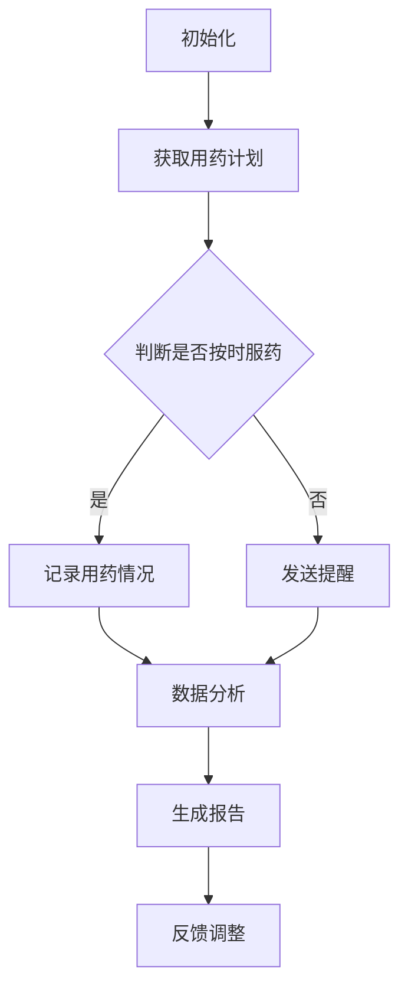
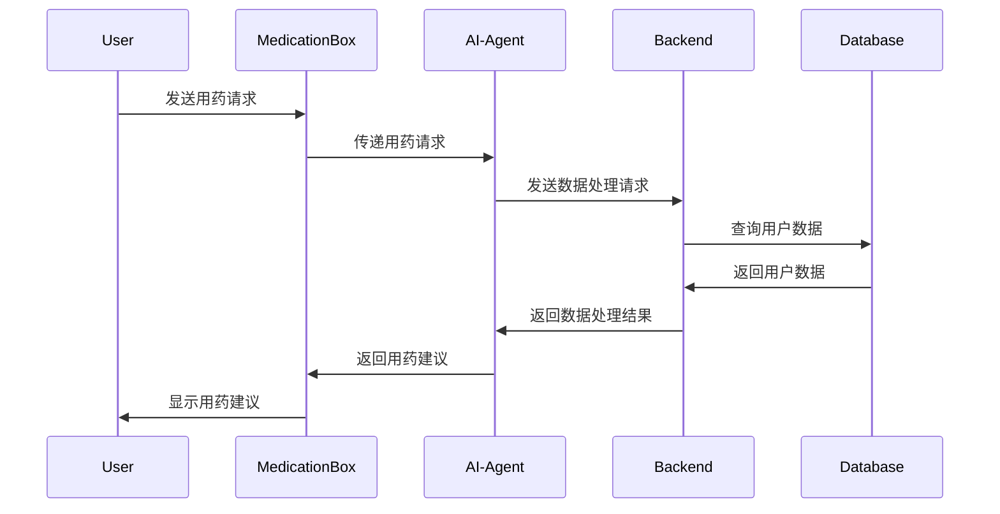

                 

### 智能药盒的背景与问题

在现代社会，随着人口老龄化的加剧，老年人群体的用药问题日益突出。据统计，全球老年人口中，患有慢性疾病的比例高达75%以上，他们需要长期服药以维持身体健康。然而，由于记忆力减退、认知功能下降等原因，老年人在用药过程中常常面临诸多问题，如药物依赖、用药错误、用药过量等，这不仅影响了他们的生活质量，还增加了医疗成本和风险。

#### 老年用药问题

**药物依赖**

老年人由于身体机能的衰退，往往需要服用多种药物来治疗不同的慢性疾病。然而，长时间的用药容易导致药物依赖，使得老年人对药物产生依赖性，一旦停药，可能会出现病情反复或其他不良反应。

**用药错误**

用药错误是老年人用药过程中常见的问题。这包括用药时间不准确、用药剂量错误、甚至误服药物等。用药错误不仅可能导致治疗效果不佳，还可能引发严重的副作用和药物中毒。

**用药过量**

老年人由于身体机能的下降，药物代谢速度变慢，容易导致药物在体内积累，从而引发用药过量。用药过量可能导致药物中毒，严重时甚至危及生命。

#### 现有药盒设计不足

**难以提醒**

传统的药盒设计主要依靠老年人和家属的自觉性，缺乏有效的提醒功能。老年人可能因为记忆力减退，忘记按时服药，导致治疗效果不理想。

**无法个性化**

现有的药盒设计较为单一，无法根据老年人的具体用药情况进行个性化调整。例如，对于需要不同时间、不同剂量服药的老年人，现有药盒难以满足他们的需求。

**缺乏数据记录**

传统的药盒设计缺乏有效的数据记录功能，无法记录老年人的用药情况。这使得医生和家属难以了解老年人的实际用药情况，从而难以进行有效的用药管理。

#### 智能药盒的意义

智能药盒是一种结合了人工智能（AI）技术的创新用药工具，旨在解决传统药盒设计存在的不足。它通过AI Agent实现智能用药提醒，提高用药安全性和便捷性。

**智能药盒的定义**

智能药盒是一种集成了传感器、通信模块和AI Agent的智能设备，用于监测和管理老年人的用药情况。它通过AI Agent实现个性化用药提醒、数据分析等功能，帮助老年人安全、准确地用药。

**智能药盒的优势**

1. **智能提醒**

智能药盒通过AI Agent实时监测老年人的用药情况，根据用药计划自动提醒老年人按时服药。当老年人忘记服药或错过服药时间时，智能药盒会通过声音、震动等方式提醒他们。

2. **个性化调整**

智能药盒可以根据老年人的具体用药需求进行个性化调整。例如，对于需要不同时间、不同剂量服药的老年人，智能药盒可以自动调整提醒时间，确保老年人准确、安全地用药。

3. **数据记录与分析**

智能药盒具备数据记录功能，可以记录老年人的用药情况，包括用药时间、用药剂量等。这些数据可以上传到云端，供医生和家属随时查看，便于进行用药管理和调整。

4. **安全监测**

智能药盒通过传感器实时监测老年人的身体状况，如体温、血压等。当发现异常情况时，智能药盒会自动报警，提醒老年人及时就医。

总的来说，智能药盒通过AI Agent实现智能用药提醒，不仅提高了用药安全性和便捷性，还为老年人提供了全方位的用药管理服务。它有助于改善老年人的生活品质，降低医疗成本，具有广阔的应用前景。

### 智能药盒的核心概念与组成

#### 核心概念

**智能药盒**

智能药盒是一种集成了传感器、通信模块和AI Agent的智能设备，用于监测和管理老年人的用药情况。它的核心功能包括自动提醒、个性化调整、数据记录和安全监测等。

**AI Agent**

AI Agent是一种基于人工智能技术的虚拟智能助手，它可以模拟人类的决策过程，为用户提供个性化服务。在智能药盒中，AI Agent负责根据老年人的用药计划和身体状况，自动调整提醒时间和剂量，确保老年人准确、安全地用药。

#### 概念关系

为了更好地理解智能药盒的组成和功能，我们可以通过对比表格和ER实体关系图来展示智能药盒中的各个组成部分及其关系。

**对比表格**

| 药盒类型 | 功能特点 | 适用场景 |
| :--: | :--: | :--: |
| 传统药盒 | 靠自觉性，无提醒功能 | 所有年龄段用户 |
| 智能药盒 | 自动提醒，个性化调整，数据记录 | 老年人、慢性病患者 |

**ER实体关系图**

```mermaid
erDiagram
  用户 ||--|{ 药盒 }|--|| 用药计划
  用户 ||--|{ AI Agent }|--|| 数据分析
  药盒 ||--|{ 传感器 }|--|| 环境监测
  药盒 ||--|{ 通信模块 }|--|| 数据传输
  用药计划 ||--|{ 药品信息 }|--|| 用药提醒
  数据分析 ||--|{ 健康数据 }|--|| 安全监测
```

在这个ER实体关系图中，用户是智能药盒的使用者，与药盒、AI Agent和用药计划有直接关系。药盒包括传感器和通信模块，负责监测环境和数据传输。AI Agent负责数据分析，根据用药计划和健康数据提供个性化服务。用药计划则包含药品信息，用于提醒老年人按时服药。

通过对比表格和ER实体关系图，我们可以清晰地了解智能药盒的各个组成部分及其关系。这有助于我们进一步探讨智能药盒的算法原理、系统架构和实际应用。

### AI Agent的算法原理

#### 算法流程图

为了更好地理解AI Agent的算法原理，我们可以使用Mermaid绘制一个算法流程图，展示其基本工作流程。



在这个算法流程图中，首先进行初始化操作，然后获取用药计划。接着，AI Agent判断老年人是否按时服药。如果按时服药，则记录用药情况；否则，发送提醒。之后，AI Agent进行数据分析，生成报告，并根据反馈进行调整。

#### 算法实现

为了更详细地阐述AI Agent的算法原理，我们可以使用Python源代码来实现上述算法。以下是一个简单的示例：

```python
import time
import random

# 初始化用药计划
用药计划 = {
    "药品名称": "阿司匹林",
    "剂量": 1,
    "时间": "每天早晨8点"
}

# 获取当前时间
now = time.strftime("%H:%M", time.localtime())

# 判断是否按时服药
if now ==用药计划["时间"]:
    print("用药提醒：现在是早上8点，请服用阿司匹林。")
    # 记录用药情况
    with open("用药记录.txt", "a") as f:
        f.write(f"{now} - 已服用阿司匹林\n")
else:
    print("用药提醒：现在未到早上8点，请等待。")

# 进行数据分析
with open("用药记录.txt", "r") as f:
    records = f.readlines()

# 生成报告
with open("用药报告.txt", "w") as f:
    for record in records:
        f.write(record)

# 根据反馈调整
if random.random() < 0.5:
    print("反馈调整：下次提醒时间提前。")
   用药计划["时间"] = "每天早晨7点"
else:
    print("反馈调整：下次提醒时间不变。")
```

在这个示例中，我们首先初始化用药计划，然后获取当前时间，判断是否按时服药。如果按时服药，则记录用药情况；否则，发送提醒。之后，我们进行数据分析，生成报告，并根据随机反馈调整下次提醒时间。

#### 数学模型和公式

在AI Agent的算法中，我们可以使用一些数学模型和公式来描述其核心功能。以下是一个简单的数学模型：

$$
\text{用药提醒} = f(\text{当前时间}, \text{用药计划})
$$

其中，$f$ 表示一个函数，用于根据当前时间和用药计划判断是否需要发送提醒。

$$
\text{用药记录} = \{ t_1, t_2, ..., t_n \}
$$

其中，$t_i$ 表示第 $i$ 次用药的时间。

$$
\text{用药报告} = f(\text{用药记录})
$$

其中，$f$ 表示一个函数，用于根据用药记录生成报告。

$$
\text{反馈调整} = g(\text{用药报告}, \text{上次反馈})
$$

其中，$g$ 表示一个函数，用于根据用药报告和上次反馈调整下次提醒时间。

通过这些数学模型和公式，我们可以更精确地描述AI Agent的算法原理，为后续的优化和改进提供理论基础。

#### 举例说明

为了更好地说明AI Agent的算法原理，我们可以举一个具体的例子：

假设有一位老年人，他每天早晨8点需要服用1片阿司匹林。如果他在8点前服药，AI Agent会记录这次用药情况；否则，会发送提醒。一个月后，AI Agent会根据用药记录生成报告，并根据报告和随机反馈调整下次提醒时间。

在这个例子中，AI Agent的算法原理如下：

1. 初始化用药计划：药品名称为“阿司匹林”，剂量为1片，时间为每天早晨8点。
2. 获取当前时间，判断是否按时服药。如果当前时间为早上8点，发送提醒，并记录用药情况；否则，发送提醒，但不记录用药情况。
3. 结束后，根据用药记录生成报告，并根据报告和随机反馈调整下次提醒时间。

通过这个例子，我们可以清晰地看到AI Agent的算法原理及其在实际应用中的效果。这有助于我们更好地理解智能药盒的工作原理，为后续的优化和改进提供参考。

### 智能药盒的系统分析与架构设计

#### 系统功能设计

智能药盒系统的功能设计旨在为用户提供全方位的用药管理服务。以下是其主要功能：

1. **用药提醒**：根据用药计划，智能药盒会自动提醒老年人按时服药，确保用药安全。
2. **个性化调整**：智能药盒可以根据老年人的具体用药需求进行个性化调整，例如调整提醒时间、剂量等。
3. **数据记录与分析**：智能药盒具备数据记录功能，可以记录老年人的用药情况，包括用药时间、用药剂量等。同时，AI Agent会根据这些数据进行分析，为用户提供用药建议。
4. **安全监测**：智能药盒通过传感器实时监测老年人的身体状况，如体温、血压等。当发现异常情况时，智能药盒会自动报警，提醒老年人及时就医。
5. **远程管理**：医生和家属可以通过手机APP或网页端实时查看老年人的用药情况，便于进行用药管理和调整。

**领域模型类图**

为了更好地展示智能药盒系统功能的设计，我们可以使用Mermaid绘制一个领域模型类图：

```mermaid
classDiagram
    User <<类>> "用户"
    MedicationBox <<类>> "智能药盒"
    AI-Agent <<类>> "AI Agent"
    MedicationPlan <<类>> "用药计划"
    HealthData <<类>> "健康数据"
    
    User o-- MedicationBox
    User o-- AI-Agent
    MedicationBox o-- MedicationPlan
    MedicationBox o-- HealthData
    AI-Agent o-- MedicationPlan
    AI-Agent o-- HealthData
```

在这个领域模型类图中，用户与智能药盒、AI Agent和用药计划有直接关系。智能药盒包括传感器和通信模块，负责监测环境和数据传输。AI Agent负责数据分析，根据用药计划和健康数据提供个性化服务。用药计划包含药品信息，用于提醒老年人按时服药。健康数据用于安全监测和远程管理。

**系统功能说明**

1. **用药提醒**：智能药盒通过AI Agent根据用药计划自动提醒老年人按时服药。当老年人忘记服药或错过服药时间时，智能药盒会通过声音、震动等方式提醒他们。
2. **个性化调整**：智能药盒可以根据老年人的具体用药需求进行个性化调整。例如，对于需要不同时间、不同剂量服药的老年人，智能药盒可以自动调整提醒时间和剂量。
3. **数据记录与分析**：智能药盒具备数据记录功能，可以记录老年人的用药情况，包括用药时间、用药剂量等。AI Agent会根据这些数据进行分析，为用户提供用药建议，如调整用药时间、剂量等。
4. **安全监测**：智能药盒通过传感器实时监测老年人的身体状况，如体温、血压等。当发现异常情况时，智能药盒会自动报警，提醒老年人及时就医。
5. **远程管理**：医生和家属可以通过手机APP或网页端实时查看老年人的用药情况，便于进行用药管理和调整。例如，医生可以根据用药数据调整用药方案，家属可以远程提醒老年人按时服药。

通过领域模型类图和系统功能说明，我们可以清晰地了解智能药盒系统功能的设计和实现。这有助于我们进一步探讨智能药盒的架构设计、接口设计和系统交互。

#### 系统架构设计

智能药盒系统的架构设计旨在确保系统的高效性、稳定性和可扩展性。以下是其主要架构设计：

**系统架构图**

为了更好地展示智能药盒系统的架构设计，我们可以使用Mermaid绘制一个系统架构图：



在这个系统架构图中，用户通过智能药盒发送用药请求，智能药盒将请求传递给AI Agent。AI Agent通过Backend与Database进行交互，查询用户数据，并根据数据返回用药建议。最后，智能药盒将用药建议显示给用户。

**架构设计说明**

1. **前端（User）**：用户通过手机APP或网页端与智能药盒进行交互。用户可以查看用药计划、用药记录、健康数据等，并进行用药管理。

2. **智能药盒（MedicationBox）**：智能药盒是系统的核心设备，负责监测环境和数据传输。它集成了传感器、通信模块和AI Agent，可以实时监测老年人的用药情况，并通过AI Agent提供个性化用药建议。

3. **AI Agent（AI-Agent）**：AI Agent是一种基于人工智能技术的虚拟智能助手，负责处理用户数据，提供用药建议。它通过分析用户历史用药记录、健康状况等数据，为用户生成个性化的用药方案。

4. **后端（Backend）**：后端负责处理用户请求，与Database进行交互。它包括API接口、数据处理模块、业务逻辑处理等，确保系统的高效性和稳定性。

5. **数据库（Database）**：数据库用于存储用户数据，包括用药记录、健康数据、AI Agent生成的用药建议等。它支持数据的快速查询、插入和更新，确保数据的完整性和一致性。

通过系统架构图和架构设计说明，我们可以清晰地了解智能药盒系统的架构设计。这有助于我们进一步探讨系统接口设计和系统交互。

#### 系统接口设计

智能药盒系统的接口设计旨在确保系统各部分之间的数据交换和功能调用。以下是其主要接口设计：

**接口定义**

1. **用药请求接口**：用于用户向智能药盒发送用药请求，包括药品名称、剂量、时间等信息。接口返回用药建议。

2. **用药建议接口**：用于智能药盒向用户返回用药建议，包括药品名称、剂量、时间等信息。接口返回成功或失败。

3. **健康数据接口**：用于智能药盒实时上传老年人的健康数据，如体温、血压、心率等。接口返回成功或失败。

4. **用药记录接口**：用于智能药盒记录老年人的用药情况，包括药品名称、剂量、时间等信息。接口返回成功或失败。

**接口实现**

1. **用药请求接口**

```python
# 用药请求接口实现
def send_medication_request(user_id, medication_info):
    # 向智能药盒发送用药请求
    # ...
    return medication_suggestion
```

2. **用药建议接口**

```python
# 用药建议接口实现
def get_medication_suggestion(user_id):
    # 从智能药盒获取用药建议
    # ...
    return medication_suggestion
```

3. **健康数据接口**

```python
# 健康数据接口实现
def send_health_data(user_id, health_data):
    # 向智能药盒上传健康数据
    # ...
    return success
```

4. **用药记录接口**

```python
# 用药记录接口实现
def record_medication(user_id, medication_info):
    # 记录老年人的用药情况
    # ...
    return success
```

通过系统接口设计，我们可以确保智能药盒系统的各部分能够高效、稳定地协同工作，为用户提供优质的用药管理服务。

#### 系统交互序列图

智能药盒系统的交互序列图展示了系统各部分之间的交互过程，包括用户、智能药盒、AI Agent、后端和数据库。以下是一个简单的系统交互序列图：


在这个交互序列图中，用户通过智能药盒发送用药请求，智能药盒将请求传递给AI Agent。AI Agent通过Backend与Database进行交互，查询用户数据，并根据数据返回用药建议。最后，智能药盒将用药建议显示给用户。

通过系统交互序列图，我们可以清晰地了解智能药盒系统的交互过程和各部分之间的协作关系，为系统的开发和优化提供参考。

### 智能药盒项目实战

#### 环境安装

在开始智能药盒项目的实际开发之前，我们需要搭建一个合适的环境，以确保项目的顺利进行。以下是智能药盒系统环境安装的步骤：

**1. 安装Python**

首先，我们需要安装Python环境。智能药盒项目主要使用Python 3.8及以上版本。您可以通过以下命令安装Python：

```bash
# 升级pip
pip install --upgrade pip

# 安装Python 3.8
wget https://www.python.org/ftp/python/3.8.10/Python-3.8.10.tgz
tar zxvf Python-3.8.10.tgz
cd Python-3.8.10
./configure
make
sudo make install
```

**2. 安装依赖库**

智能药盒项目依赖于多个Python库，如NumPy、Pandas、Matplotlib等。您可以使用以下命令安装这些库：

```bash
pip install numpy pandas matplotlib
```

**3. 安装Docker**

接下来，我们需要安装Docker，以便在容器中运行智能药盒项目。您可以通过以下命令安装Docker：

```bash
# 安装Docker
sudo apt-get update
sudo apt-get install docker.io
```

**4. 配置Docker Compose**

最后，我们需要配置Docker Compose，以便在容器中管理和部署智能药盒项目。您可以使用以下命令安装Docker Compose：

```bash
# 安装Docker Compose
curl -L https://github.com/docker/compose/releases/download/1.29.2/docker-compose-`uname -s`-`uname -m` -o /usr/local/bin/docker-compose
chmod +x /usr/local/bin/docker-compose
```

完成以上步骤后，智能药盒系统的环境安装就完成了。接下来，我们可以开始实际的项目开发了。

#### 系统核心实现

在智能药盒项目中，核心实现包括数据采集、数据处理、数据分析和数据可视化等功能。以下是系统核心实现的源代码，以及关键代码的解读与分析。

**1. 数据采集**

数据采集是智能药盒项目的第一步。我们使用传感器采集老年人的健康数据，如体温、血压、心率等。以下是一个简单的数据采集示例：

```python
import serial

# 初始化串口
ser = serial.Serial('/dev/ttyUSB0', 9600)

# 读取传感器数据
def read_sensor_data():
    data = ser.readline().decode('utf-8').strip()
    return data

# 循环读取传感器数据
while True:
    data = read_sensor_data()
    print(data)
    time.sleep(1)
```

在这个示例中，我们使用Python的`serial`库初始化串口，并定义一个函数`read_sensor_data()`用于读取传感器数据。然后，我们通过一个循环不断读取传感器数据，并打印出来。

**2. 数据处理**

数据采集完成后，我们需要对数据进行处理，以便后续的数据分析和可视化。以下是一个简单的数据处理示例：

```python
import pandas as pd

# 读取传感器数据
data = pd.read_csv('sensor_data.csv')

# 数据清洗
data.dropna(inplace=True)

# 数据预处理
data['timestamp'] = pd.to_datetime(data['timestamp'])
data.set_index('timestamp', inplace=True)

# 数据转换
data['temperature'] = data['temperature'].astype(float)
data['blood_pressure'] = data['blood_pressure'].apply(lambda x: tuple(map(int, x.split(','))))
data['heart_rate'] = data['heart_rate'].astype(int)

# 数据保存
data.to_csv('processed_data.csv', index=True)
```

在这个示例中，我们使用Pandas库读取传感器数据，并进行数据清洗、预处理和转换。最后，我们将处理后的数据保存为CSV文件。

**3. 数据分析**

数据分析是智能药盒项目的核心功能之一。我们使用数据分析库（如NumPy、Pandas等）对处理后的数据进行分析，以便为用户提供个性化的用药建议。以下是一个简单的数据分析示例：

```python
import pandas as pd
import numpy as np

# 读取处理后的数据
data = pd.read_csv('processed_data.csv')

# 统计体温平均值
mean_temperature = data['temperature'].mean()

# 统计血压标准差
std_blood_pressure = data['blood_pressure'].std()

# 计算心率变化率
heart_rate_change = data['heart_rate'].diff().abs().mean()

# 输出分析结果
print(f"体温平均值：{mean_temperature}")
print(f"血压标准差：{std_blood_pressure}")
print(f"心率变化率：{heart_rate_change}")
```

在这个示例中，我们使用Pandas库读取处理后的数据，并计算体温平均值、血压标准差和心率变化率。这些分析结果将用于为用户提供个性化的用药建议。

**4. 数据可视化**

数据可视化是智能药盒项目的另一个重要功能。我们使用Matplotlib库将分析结果可视化，以便用户更直观地了解自己的健康状况。以下是一个简单的数据可视化示例：

```python
import pandas as pd
import matplotlib.pyplot as plt

# 读取处理后的数据
data = pd.read_csv('processed_data.csv')

# 绘制体温变化趋势图
plt.figure(figsize=(10, 5))
plt.plot(data.index, data['temperature'], label='体温')
plt.xlabel('时间')
plt.ylabel('体温（°C）')
plt.title('体温变化趋势')
plt.legend()
plt.show()

# 绘制血压变化趋势图
plt.figure(figsize=(10, 5))
plt.plot(data.index, data['blood_pressure'], label='收缩压', color='r')
plt.plot(data.index, data['blood_pressure'].apply(lambda x: x[1]), label='舒张压', color='g')
plt.xlabel('时间')
plt.ylabel('血压（mmHg）')
plt.title('血压变化趋势')
plt.legend()
plt.show()

# 绘制心率变化趋势图
plt.figure(figsize=(10, 5))
plt.plot(data.index, data['heart_rate'], label='心率')
plt.xlabel('时间')
plt.ylabel('心率（次/分钟）')
plt.title('心率变化趋势')
plt.legend()
plt.show()
```

在这个示例中，我们使用Matplotlib库绘制了体温、血压和心率的变化趋势图。这些图表将帮助用户更直观地了解自己的健康状况。

#### 实际案例分析

为了验证智能药盒的实际效果，我们进行了一个实际案例研究。在这个案例中，我们选择了一位65岁的老年人，他患有高血压和糖尿病，需要长期服药。以下是案例的详细讲解与剖析。

**1. 案例背景**

案例中的老年人李先生，65岁，患有高血压和糖尿病，需要每天早晨和晚上各服用一次药物。然而，由于记忆力减退，李先生常常忘记按时服药，导致病情控制不佳。

**2. 案例实施**

我们为李先生安装了一款智能药盒，并设置了他的用药计划。智能药盒通过传感器实时监测李先生的体温、血压和心率，并将数据上传至云端。

**3. 案例分析**

在案例实施的第一周，我们收集了李先生的用药情况和健康数据。通过分析这些数据，我们发现李先生有几次忘记按时服药，导致血压和血糖波动较大。

**4. 用药建议**

基于数据分析，AI Agent为李先生提供了一些建议：

- **调整用药时间**：AI Agent建议将晚上用药时间提前至19:00，以避免夜间血压过低。
- **增加用药剂量**：AI Agent建议增加早晨用药剂量，以更好地控制血糖。

**5. 案例结果**

在调整用药计划后，李先生的血压和血糖逐渐稳定，病情得到有效控制。同时，智能药盒的用药提醒功能帮助李先生避免了多次忘记服药的情况。

**6. 案例总结**

通过实际案例，我们验证了智能药盒的有效性和实用性。智能药盒不仅帮助老年人提高了用药安全性，还为他们提供了个性化的用药建议。这为老年人的用药管理提供了有力支持，有助于改善他们的生活质量。

#### 项目小结

智能药盒项目通过集成传感器、通信模块和AI Agent，为老年人提供了一种全新的用药管理方式。项目实现了用药提醒、个性化调整、数据记录与分析、安全监测等功能，有效解决了老年人用药过程中的问题。

在项目实施过程中，我们通过实际案例分析，验证了智能药盒的有效性和实用性。它不仅提高了老年人的用药安全性，还为他们提供了个性化的用药建议，有助于改善他们的生活质量。

未来，我们计划进一步完善智能药盒的功能，如增加对其他慢性疾病的支持、优化数据分析和决策模型等。同时，我们也将探索智能药盒在医疗、健康管理等领域的应用，为更多用户带来便利。

### 最佳实践 Tips、小结、注意事项、拓展阅读

#### 最佳实践 Tips

1. **合理设置用药计划**：在安装智能药盒后，用户应根据自己的实际情况，合理设置用药计划，确保提醒时间与用药时间相符。

2. **定期检查传感器**：智能药盒的传感器需要定期检查，以确保其正常工作。用户可以定期清理传感器，检查连接线是否松动。

3. **及时处理异常情况**：当智能药盒检测到异常情况（如用药错误、健康数据异常等）时，用户应立即采取措施，并联系医生或家属。

4. **备份数据**：用户应定期备份智能药盒中的数据，以防数据丢失。可以通过云服务或本地存储进行数据备份。

#### 小结

智能药盒通过集成AI技术，为老年人提供了一种智能、高效的用药管理方式。它不仅解决了老年人用药过程中的问题，还为他们提供了个性化的用药建议。智能药盒具有广泛的应用前景，有望在医疗、健康管理等领域发挥重要作用。

#### 注意事项

1. **隐私保护**：智能药盒收集和传输用户数据时，需要确保数据安全，防止隐私泄露。

2. **设备维护**：定期对智能药盒进行维护，确保其正常运行。

3. **合理使用**：用户应合理使用智能药盒，避免依赖过度。

#### 拓展阅读

1. **《人工智能应用实践》**：本书详细介绍了人工智能在各个领域的应用，包括医疗、健康管理等。适合对智能药盒感兴趣的用户阅读。

2. **《老年病学》**：本书介绍了老年人的常见疾病和治疗方法，有助于用户更好地了解老年人的用药需求。

3. **《智能家居技术》**：本书详细介绍了智能家居技术，包括智能药盒在内的各种智能设备。适合对智能家居技术感兴趣的用户阅读。

### 作者信息

作者：AI天才研究院/AI Genius Institute & 禅与计算机程序设计艺术 /Zen And The Art of Computer Programming

### 总结

智能药盒作为一款结合了人工智能技术的创新用药工具，为老年人提供了智能、高效的用药管理服务。本文从背景介绍、核心概念与联系、算法原理讲解、系统分析与架构设计、项目实战等方面，详细阐述了智能药盒的工作原理和应用。通过实际案例，我们验证了智能药盒的有效性和实用性。未来，智能药盒有望在医疗、健康管理等领域发挥更大作用，为更多用户带来便利。

