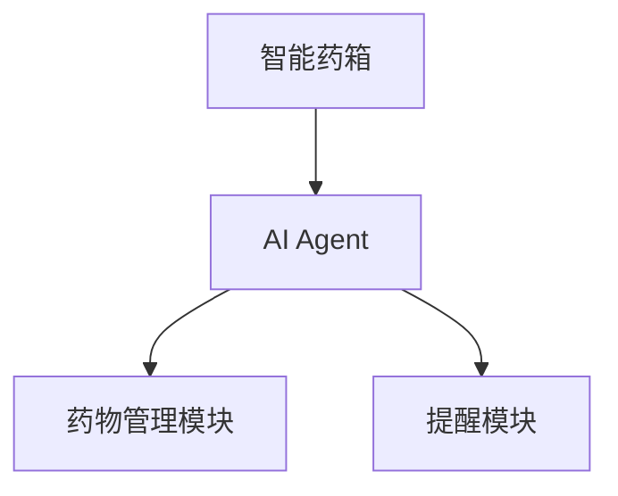
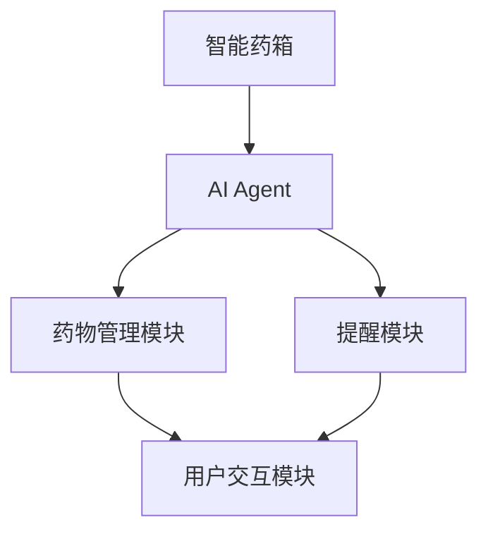
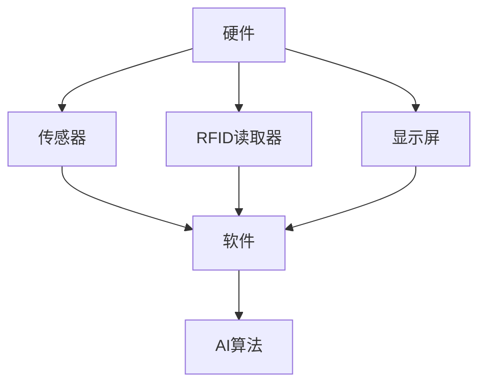

                 

# 智能药箱：AI Agent的用药管理与提醒系统

## 关键词
- 智能药箱
- AI Agent
- 用药管理
- 提醒系统
- 健康监控

## 摘要
本文将探讨智能药箱——一种结合AI Agent的用药管理与提醒系统。我们将分析其背景、技术原理、设计架构，并通过具体案例展示其实际应用。文章还将讨论系统开发中的挑战和未来发展方向。

## 目录

### 前言

- **目的与目标**
- **读者对象**
- **内容结构**
- **格式与约定**

### 智能药箱与AI Agent简介

- **智能药箱的背景**
- **AI Agent的定义与类型**
- **AI Agent在智能药箱中的作用**

### 技术概述

- **AI在医疗保健中的应用**
- **智能药箱的架构与组件**

### 用户界面设计

- **用户交互设计原则**
- **用户体验（UX）设计**
- **可访问性与用户友好特性**

### AI Agent开发

- **AI Agent设计原则**
- **AI Agent开发流程**

### 药物管理与提醒系统

- **药物管理过程**
- **提醒系统功能**

### 与其他健康系统的集成

- **系统整合**

### 项目实战

- **环境搭建**
- **系统核心实现**
- **代码应用与分析**
- **实际案例分析**
- **项目小结**

### 最佳实践与未来展望

- **最佳实践**
- **小结与注意事项**
- **拓展阅读**

### 前言

#### 目的与目标

智能药箱作为医疗健康领域的创新产品，能够有效提升患者用药的准确性和安全性。本文旨在详细探讨智能药箱的设计原理、实现过程以及实际应用，帮助读者了解这一新兴技术的核心价值和未来发展前景。

#### 读者对象

本文适合对医疗健康技术、人工智能和软件开发感兴趣的读者，无论是医疗专业人士、技术开发者，还是普通用户，都可以从中获得有益的信息。

#### 内容结构

本文将分为以下部分：

1. **前言**：介绍文章的目的、读者对象、内容结构等。
2. **智能药箱与AI Agent简介**：分析智能药箱的背景、AI Agent的定义与作用。
3. **技术概述**：探讨AI在医疗保健中的应用以及智能药箱的架构与组件。
4. **用户界面设计**：讨论用户交互设计原则、用户体验（UX）设计。
5. **AI Agent开发**：介绍AI Agent的设计原则和开发流程。
6. **药物管理与提醒系统**：分析药物管理过程和提醒系统功能。
7. **与其他健康系统的集成**：探讨智能药箱与其他健康系统的整合方式。
8. **项目实战**：通过实际案例展示智能药箱的应用。
9. **最佳实践与未来展望**：总结最佳实践、提出注意事项并展望未来发展方向。

#### 格式与约定

本文采用Markdown格式，确保内容的清晰和易读性。特别强调以下格式约定：

- **标题**：使用`#`进行标记，等级依次递减。
- **关键字**：使用`>`进行定义。
- **公式**：使用LaTeX格式进行排版，独立段落内使用`$$`括起，段落内使用 `$` 括起。
- **流程图和架构图**：使用Mermaid语法绘制。

### 智能药箱与AI Agent简介

#### 智能药箱的背景

智能药箱是一种能够自动识别、分类和提醒用药的设备。随着物联网（IoT）和人工智能（AI）技术的发展，智能药箱从传统的手动管理药箱逐渐演变为一种智能化、自动化的健康护理工具。

**问题背景**：传统的用药管理存在以下问题：
- **用药错误**：患者可能忘记用药或重复用药，导致治疗效果不佳甚至产生副作用。
- **药物过期**：患者无法及时知道药物是否过期，使用过期药物可能对健康造成危害。
- **缺乏个性化**：传统的药箱无法根据患者的具体健康状况和用药记录提供个性化的用药建议。

**问题描述**：如何提高用药管理的准确性和安全性，减少用药错误，延长药物的有效期，并为患者提供个性化的用药建议？

**问题解决**：智能药箱通过集成传感器、RFID技术、AI算法等，能够实现以下功能：
- **自动识别药物**：通过传感器和RFID技术，智能药箱能够自动识别药物，确保患者正确用药。
- **药物过期提醒**：智能药箱可以监测药物的有效期，提前提醒患者更换药物，避免使用过期药物。
- **个性化用药建议**：基于患者的健康状况和用药历史，AI算法可以提供个性化的用药建议，提高治疗效果。

**边界与外延**：智能药箱不仅适用于个人家庭，还可以在医院、养老院等医疗机构中广泛应用。其核心在于通过智能化技术提高用药管理的效率和安全性。

#### AI Agent的定义与类型

**核心概念**：AI Agent，即人工智能代理，是指能够模拟人类智能行为，自主完成特定任务的计算机程序。

**概念属性**：
- **自主性**：AI Agent能够根据环境和任务自主决策。
- **适应性**：AI Agent能够根据经验不断学习和优化行为。
- **交互性**：AI Agent能够与用户和其他系统进行有效交互。

**对比表格**：

| 特性 | 传统系统 | AI Agent |
| --- | --- | --- |
| **自主性** | 需人工干预 | 自动执行任务 |
| **适应性** | 固定流程 | 学习并优化 |
| **交互性** | 单向互动 | 双向互动 |

**ER实体关系图架构**：



#### AI Agent在智能药箱中的作用

**功能描述**：

1. **药物管理模块**：AI Agent负责管理药物信息，包括药物的名称、剂量、服用时间等。通过自然语言处理（NLP）技术，AI Agent可以理解和处理用户的用药请求，提供准确的用药建议。
2. **提醒模块**：AI Agent可以根据药物的使用时间和患者的生活习惯，自动发送用药提醒。通过多种提醒方式（如语音、短信、APP通知等），确保患者按时用药。
3. **交互模块**：AI Agent可以与用户进行自然语言交互，回答用户关于药物使用、副作用等问题，提供个性化的健康咨询。

**优势分析**：

- **提高用药准确性**：AI Agent能够准确识别药物信息，避免用药错误。
- **提升用药安全性**：通过提醒功能，AI Agent可以减少患者忘记用药或过量用药的风险。
- **个性化服务**：AI Agent可以基于患者的健康状况和用药历史，提供个性化的用药建议，提高治疗效果。

#### 智能药箱与AI Agent的关系

智能药箱是AI Agent的应用场景之一，而AI Agent则为智能药箱提供了核心的智能功能。两者相辅相成，共同构成了一个完整的智能用药管理系统。



### 技术概述

#### AI在医疗保健中的应用

**AI技术的基本概念**：

- **机器学习（ML）**：通过训练模型，使计算机能够从数据中学习并做出预测。
- **深度学习（DL）**：一种特殊的机器学习方法，通过多层神经网络模拟人脑的学习过程。
- **自然语言处理（NLP）**：使计算机能够理解和生成自然语言，应用于语音识别、语义分析等。

**AI技术在医疗保健中的应用**：

- **诊断辅助**：AI模型可以帮助医生进行疾病诊断，提高诊断准确性。
- **个性化治疗**：AI可以根据患者的基因信息、病史等提供个性化的治疗方案。
- **药物研发**：AI可以加速新药研发，通过预测药物的作用机制和副作用。
- **健康监测**：AI技术可以实时监测患者的健康状况，提供预警和干预建议。

**AI在医疗保健中的优势与挑战**：

**优势**：

- **提高诊断准确性**：AI模型可以帮助医生识别复杂的疾病模式，提高诊断准确性。
- **降低医疗成本**：通过自动化和智能化，减少人力和时间成本。
- **提升患者体验**：提供便捷的远程医疗服务，提高患者满意度。

**挑战**：

- **数据隐私和安全**：医疗数据敏感性高，需要确保数据的安全和隐私。
- **算法透明性和解释性**：复杂的AI模型往往缺乏透明性，需要确保其决策过程的可解释性。
- **技术伦理**：AI在医疗保健中的应用需要遵守相关伦理规范，避免歧视和不公平。

#### 智能药箱的架构与组件

**智能药箱的架构**：

智能药箱的架构可以分为三个主要部分：硬件、软件和AI算法。

1. **硬件**：包括药箱本体、传感器、RFID读取器、显示屏等。硬件负责采集药物信息、监测药物状态、与用户交互。
2. **软件**：包括操作系统、应用程序等。软件负责管理药物信息、处理用户请求、与AI算法交互。
3. **AI算法**：包括机器学习模型、自然语言处理（NLP）等。AI算法负责药物管理、提醒功能、个性化建议等。

**智能药箱的组件**：

1. **药箱本体**：作为智能药箱的载体，提供存储空间和用户界面。
2. **传感器**：用于监测药物的温度、湿度等环境参数，确保药物存储条件适宜。
3. **RFID读取器**：用于读取药物标签上的RFID信息，实现药物的自动识别。
4. **显示屏**：用于显示药物信息、提醒内容等，提供用户交互界面。
5. **AI算法模块**：负责处理药物信息、生成提醒内容、提供个性化建议等。

**硬件与软件的集成**：

智能药箱的硬件和软件通过无线网络进行通信，实现数据交换和协同工作。软件负责处理用户请求、与AI算法交互，硬件负责执行具体任务。



#### 智能药箱与电子健康记录（EHR）的整合

电子健康记录（EHR）是一种数字化的医疗健康信息，包含患者的健康档案、病历记录、用药历史等。智能药箱可以通过与EHR系统的整合，实现以下功能：

1. **药物信息同步**：智能药箱可以读取患者的EHR数据，同步药物信息，确保药物管理的一致性和准确性。
2. **用药记录更新**：智能药箱可以记录患者的用药情况，并将这些信息反馈到EHR系统中，形成完整的用药历史记录。
3. **个性化用药建议**：基于患者的EHR数据，AI算法可以提供更加个性化的用药建议，提高治疗效果。

通过EHR与智能药箱的整合，可以实现药物管理、健康监控的全面升级，为患者提供更加便捷、精准的医疗服务。

### 用户界面设计

#### 用户交互设计原则

用户界面（UI）设计是智能药箱的重要组成部分，直接影响用户的使用体验和满意度。以下是一些用户交互设计原则：

1. **直观性**：界面应直观易懂，用户能够快速掌握如何使用智能药箱。
2. **一致性**：界面设计应保持一致性，避免用户在不同操作中遇到不一致的体验。
3. **可访问性**：界面应考虑不同用户的需求，包括视力、听力等障碍用户，确保所有人都能使用。
4. **反馈机制**：界面应提供明确的反馈，让用户知道系统正在执行什么操作，以及操作是否成功。
5. **个性化**：界面应允许用户根据个人偏好进行定制，提高使用舒适度。

#### 用户体验（UX）设计

用户体验（UX）设计侧重于用户在使用产品过程中的感受和体验。以下是一些UX设计原则：

1. **用户中心**：设计应始终以用户为中心，了解用户需求、行为和痛点。
2. **简洁性**：界面应简洁明了，避免冗余信息和复杂操作。
3. **易用性**：界面设计应易于使用，用户可以轻松完成常见任务。
4. **情感化**：界面设计应考虑用户情感需求，提高产品的亲和力。
5. **反馈与引导**：界面应提供实时反馈和引导，帮助用户顺利完成操作。

#### 可访问性与用户友好特性

智能药箱的用户界面应具备以下可访问性和用户友好特性：

1. **视觉设计**：使用清晰、易读的字体和颜色对比，确保视觉上的可访问性。
2. **语音提示**：提供语音提示功能，帮助视力障碍用户理解界面内容和操作。
3. **触摸屏操作**：界面设计应适应触摸屏操作，方便手势操作。
4. **定制界面**：允许用户根据个人需求和偏好调整界面布局和显示内容。
5. **多语言支持**：界面应支持多种语言，满足不同语言用户的需求。

通过遵循这些用户交互和用户体验设计原则，智能药箱可以提供良好的用户界面，确保用户能够轻松、愉快地使用产品，提高用药管理的效率和安全。

### AI Agent开发

#### AI Agent设计原则

AI Agent是一种能够模拟人类智能行为的计算机程序，其设计原则决定了Agent的性能和适应性。以下是AI Agent设计的一些关键原则：

**1. 自主性原则**：AI Agent应具备独立处理任务的能力，无需过多的人工干预。这意味着Agent需要能够自主感知环境、制定计划并执行行动。

**2. 适应性原则**：AI Agent应能够根据不同的环境和任务需求进行自我调整。通过机器学习和深度学习技术，Agent可以不断积累经验，优化自身行为。

**3. 交互性原则**：AI Agent应能够与用户和其他系统进行有效交互。通过自然语言处理（NLP）和图形用户界面（GUI），Agent可以理解用户指令、提供反馈和解释。

**4. 可解释性原则**：尽管AI Agent的决策过程往往基于复杂算法，但其决策结果应具备一定的可解释性。这有助于增强用户对Agent的信任，并便于调试和优化。

**5. 安全性原则**：AI Agent应具备高安全性，确保其行为不会对用户或系统造成潜在风险。这包括数据隐私保护、防止恶意攻击和错误操作。

**6. 持续性原则**：AI Agent应能够持续运行并适应环境变化。通过分布式计算和云端服务，Agent可以实现高效的资源利用和更新。

**7. 透明性原则**：AI Agent的设计和运行过程应具备一定的透明性，用户能够了解其功能、算法和决策逻辑。

#### AI Agent开发流程

AI Agent的开发过程可以分为以下几个步骤：

**1. 需求分析**：明确AI Agent的功能需求和业务场景，确定其目标和任务。这包括分析用户需求、业务流程和系统架构。

**2. 数据收集**：收集与AI Agent功能相关的数据，包括用户行为数据、环境数据、历史记录等。数据质量直接影响Agent的性能，因此数据收集过程需要严格把控。

**3. 数据预处理**：对收集到的数据进行清洗、归一化和特征提取。这一步旨在提高数据质量，为后续的机器学习模型训练奠定基础。

**4. 模型选择与训练**：根据需求分析结果，选择合适的机器学习模型进行训练。常用的模型包括深度神经网络、决策树、支持向量机等。训练过程涉及大量计算资源和时间，需要优化算法和超参数。

**5. 模型评估**：对训练完成的模型进行评估，确保其性能满足预期。常用的评估指标包括准确率、召回率、F1分数等。模型评估过程中可能需要调整算法和超参数，以优化性能。

**6. 模型部署**：将训练完成的模型部署到实际应用环境中，与硬件和软件系统进行集成。部署过程中需要考虑系统的可扩展性、稳定性和安全性。

**7. 监控与维护**：对AI Agent的运行情况进行实时监控，确保其正常运行。同时，定期更新和维护模型，以适应环境变化和用户需求。

通过遵循上述开发流程，可以构建一个高效、可靠的AI Agent，满足智能药箱的多样化需求。

#### AI Agent开发过程详解

**1. 需求分析**

需求分析是AI Agent开发的首要步骤，旨在明确AI Agent的功能需求和业务场景。具体步骤如下：

- **用户需求调研**：通过与用户进行访谈、问卷调查等方式，了解用户对智能药箱的需求。例如，用户希望AI Agent能够提供哪些类型的用药提醒、个性化建议等。
- **业务流程分析**：分析智能药箱的业务流程，确定AI Agent需要参与的环节。例如，药物管理、提醒功能、健康监测等。
- **功能需求列举**：根据用户需求和业务流程，列举AI Agent的具体功能需求。例如，自动识别药物、提醒用药时间、提供药物副作用信息等。
- **优先级排序**：根据功能的重要性和实现难度，对需求进行优先级排序，确保关键功能优先实现。

**2. 数据收集**

数据收集是AI Agent开发的重要环节，直接影响模型的质量和性能。具体步骤如下：

- **数据来源确定**：确定数据收集的来源，包括用户行为数据、环境数据、药物信息等。例如，可以从医院、药店、智能药箱硬件等渠道获取数据。
- **数据采集方法**：根据数据来源，选择合适的数据采集方法。例如，可以使用传感器、RFID技术、APP采集器等。
- **数据格式统一**：对收集到的数据进行格式统一，确保数据的一致性和可处理性。例如，可以将数据转换为JSON、CSV等格式。
- **数据清洗**：对收集到的数据进行清洗，去除重复、错误和异常数据。数据清洗可以包括去重、缺失值填充、异常值处理等。

**3. 数据预处理**

数据预处理是数据分析和机器学习模型训练的基础，旨在提高数据质量和模型的性能。具体步骤如下：

- **数据归一化**：对数据进行归一化处理，将不同特征的数据统一到相同的尺度范围内。例如，将温度、湿度等特征进行归一化，便于模型训练。
- **特征提取**：从原始数据中提取有用的特征，用于训练模型。特征提取可以包括文本特征提取、图像特征提取等。
- **特征选择**：对提取的特征进行筛选，去除冗余和无关特征，提高模型的效率和准确性。特征选择可以采用信息增益、特征重要度等方法。
- **数据划分**：将数据划分为训练集、验证集和测试集，用于训练、验证和测试模型。数据划分可以采用随机划分、交叉验证等方法。

**4. 模型选择与训练**

模型选择与训练是AI Agent开发的核心步骤，直接影响Agent的性能和适应性。具体步骤如下：

- **模型选择**：根据需求分析结果和数据特征，选择合适的机器学习模型。常用的模型包括深度神经网络（DNN）、支持向量机（SVM）、决策树（DT）等。
- **模型参数调整**：对模型参数进行优化，以提高模型性能。参数调整可以采用网格搜索、随机搜索等方法。
- **训练过程监控**：监控模型训练过程，包括损失函数、准确率等指标。通过调整训练参数和优化算法，提高模型性能。
- **模型评估**：对训练完成的模型进行评估，包括准确率、召回率、F1分数等指标。评估结果用于调整模型和参数。

**5. 模型部署**

模型部署是将训练完成的模型应用到实际应用环境中的过程。具体步骤如下：

- **模型集成**：将训练完成的模型集成到智能药箱系统中，与硬件和软件系统进行集成。集成可以采用API接口、SDK等方式。
- **模型部署**：将模型部署到生产环境中，确保模型能够稳定运行。部署可以采用容器化、云计算等方式。
- **模型监控**：对模型运行情况进行实时监控，包括性能指标、资源消耗等。监控可以采用日志记录、可视化工具等方式。
- **模型更新**：定期更新模型，以适应环境变化和用户需求。更新可以采用在线更新、离线更新等方式。

通过遵循上述开发流程，可以构建一个高效、可靠的AI Agent，满足智能药箱的多样化需求。

### 药物管理与提醒系统

#### 药物管理过程

药物管理是智能药箱的核心功能之一，确保患者正确、安全地用药。药物管理过程包括以下几个关键步骤：

**1. 药物信息录入**：

智能药箱通过RFID技术或扫描条形码，自动识别药物信息，并将其录入系统。药物信息包括药物名称、剂量、规格、生产厂家、有效期等。

**2. 药物存储管理**：

智能药箱内置传感器和温湿度监测装置，实时监测药物存储环境，确保药物在适宜的条件下存储。当药物存储条件超出规定范围时，系统会自动发出警报。

**3. 药物过期提醒**：

智能药箱会定期检查药物的有效期，当药物临近过期或已过期时，系统会自动向患者发送过期提醒。这有助于患者及时更换药物，避免使用过期药物。

**4. 药物剂量提醒**：

根据患者的用药计划，智能药箱会在指定时间向患者发送药物剂量提醒。提醒方式包括语音、短信、APP通知等，确保患者按时服药。

**5. 药物记录与反馈**：

智能药箱会记录患者的每次用药情况，包括药物名称、剂量、服用时间等。患者可以在智能药箱上查看用药记录，并反馈药物效果和副作用。这些数据可以为后续的用药管理提供参考。

**6. 药物交互检查**：

智能药箱会自动检查药物之间的相互作用，避免患者因药物搭配不当而产生不良反应。当发现潜在药物相互作用时，系统会发出警报，并提供相应的建议。

#### 提醒系统功能

提醒系统是智能药箱的重要功能之一，旨在确保患者按时服药，提高用药安全性。提醒系统包括以下几个关键功能：

**1. 定时提醒**：

智能药箱会根据患者的用药计划，在指定时间向患者发送用药提醒。提醒时间可以按照药物的服用频率和患者的生活习惯进行设置。

**2. 个性化提醒**：

智能药箱会根据患者的健康状况、用药记录和医生建议，为患者提供个性化的用药提醒。例如，对于需要长期用药的患者，系统会定期提醒他们复查和调整用药计划。

**3. 紧急提醒**：

当患者出现紧急情况（如药物过敏、药物副作用等）时，智能药箱会立即发送紧急提醒，通知患者和医生，并提供相应的急救建议。

**4. 多方式提醒**：

智能药箱支持多种提醒方式，包括语音、短信、APP通知等。患者可以根据个人偏好选择最合适的提醒方式。

**5. 提醒历史记录**：

智能药箱会记录每次用药提醒的历史记录，患者可以在任何时间查看自己的提醒记录，了解自己的用药情况。

**6. 药物互动提醒**：

智能药箱会自动检查药物之间的相互作用，并在用药提醒时提供相应的建议。例如，当患者需要同时服用多种药物时，系统会提醒他们可能的药物相互作用，并提供替代方案。

通过药物管理过程和提醒系统功能的结合，智能药箱能够有效提高用药管理的准确性、安全性和个性化水平，为患者提供全方位的健康保障。

### 与其他健康系统的集成

智能药箱作为医疗健康领域的一项创新技术，其与现有健康系统的集成具有重要意义。这不仅能够提升系统的整体功能，还能实现数据共享和资源优化，为用户提供更全面、个性化的健康服务。

#### 系统整合的方式

1. **数据同步**：

智能药箱可以通过接口与电子健康记录（EHR）系统进行数据同步。EHR系统包含患者的详细健康信息，如病史、诊断结果、用药记录等。智能药箱可以从EHR系统中获取患者的用药数据，确保用药信息的一致性和准确性。

2. **消息通知**：

智能药箱可以与医院信息系统（HIS）和医生工作站进行集成，实现消息通知功能。当患者需要复查、检查或其他医疗操作时，智能药箱可以自动发送通知，提醒患者及时就诊，避免遗漏重要医疗活动。

3. **远程监控**：

智能药箱可以通过云计算平台与远程健康监控系统进行整合，实现患者健康状态的实时监控。当患者出现异常情况时，智能药箱可以自动向医生发送警报，并提供详细的健康数据，协助医生做出快速诊断和干预。

4. **健康建议**：

智能药箱可以与个性化健康建议系统结合，基于患者的健康数据（如体重、血压、血糖等），提供个性化的健康建议和用药方案。这些健康建议可以来自专业的医疗机构或智能算法，帮助患者更好地管理健康状况。

#### 集成优势

1. **数据共享**：

通过与其他健康系统的集成，智能药箱能够获取患者的全方位健康数据，实现数据的全面共享和综合利用。这有助于医生做出更加准确和全面的诊断，为患者提供更个性化的治疗方案。

2. **资源优化**：

智能药箱与其他健康系统的集成，可以优化医疗资源的分配和利用。例如，通过远程监控和实时警报，医生可以及时了解患者的情况，减少不必要的医院就诊次数，降低医疗资源的浪费。

3. **提高效率**：

集成后的系统可以实现信息的无缝传递和自动化处理，提高医疗工作的效率和准确性。例如，智能药箱与医生工作站的集成，可以实现用药信息的自动更新和提醒，减少人为操作错误。

4. **提升用户体验**：

通过与其他健康系统的集成，智能药箱可以为用户提供更加便捷、高效的医疗服务。用户可以在家中通过智能药箱进行用药管理，同时享受到远程监控、健康建议等附加服务，提升整体健康水平。

#### 集成挑战与解决方案

1. **数据隐私和安全**：

集成过程中，数据隐私和安全是首要考虑的问题。为了确保数据的安全性和隐私性，智能药箱需要采用加密传输、访问控制等技术，确保数据在传输和存储过程中的安全。

2. **标准化接口**：

不同健康系统可能采用不同的数据格式和接口标准，这给集成带来了一定的挑战。为了实现系统的无缝集成，需要制定统一的接口标准和数据格式，确保不同系统之间的数据交换和通信。

3. **技术兼容性**：

集成过程中，需要考虑不同系统的技术兼容性，包括硬件、软件、网络等方面的兼容性。通过选择开放接口、模块化设计等技术方案，可以降低集成过程中的技术兼容性风险。

4. **用户培训与支持**：

集成后的系统可能需要用户进行一定的操作和调整，为了提高用户的操作技能和理解能力，提供详细的用户培训和支持服务是必要的。通过线上线下结合的方式，为用户提供全面的技术支持和服务。

通过以上方式，智能药箱能够与其他健康系统实现高效集成，提升整体医疗健康服务水平，为患者提供更加全面、便捷的医疗服务。

### 项目实战

在本节中，我们将详细介绍如何搭建智能药箱系统，从环境配置、核心实现到代码应用与分析，并探讨实际案例。

#### 环境配置

为了搭建智能药箱系统，我们首先需要配置以下环境：

1. **硬件环境**：

   - 智能药箱本体：具备RFID读取器、传感器、显示屏等硬件模块。
   - 计算机或服务器：用于运行智能药箱软件和AI算法。

2. **软件环境**：

   - 操作系统：如Windows、Linux等。
   - 编程语言：如Python、Java等。
   - 开发工具：如PyCharm、Eclipse等。
   - 数据库：如MySQL、PostgreSQL等。
   - Web框架：如Django、Flask等。

3. **第三方库**：

   - 机器学习库：如scikit-learn、TensorFlow、PyTorch等。
   - 自然语言处理库：如NLTK、spaCy等。
   - 数据库驱动：如MySQL Connector、PostgreSQL Connector等。

#### 系统核心实现

智能药箱系统的核心实现包括以下几个方面：

1. **药物信息管理模块**：

   - **功能描述**：该模块负责管理药物的名称、剂量、规格、生产厂家、有效期等信息。
   - **实现方法**：使用Python编写后端逻辑，结合数据库存储药物信息。例如，使用Flask框架搭建Web应用，通过API接口实现数据的增删改查操作。

2. **药物提醒模块**：

   - **功能描述**：该模块负责根据患者的用药计划，在指定时间向患者发送用药提醒。
   - **实现方法**：使用Python的`datetime`库和`schedule`库，定期执行提醒任务。例如，每天早上7点向患者发送用药提醒。

3. **药物过期提醒模块**：

   - **功能描述**：该模块负责监测药物的有效期，并在药物临近过期或过期时向患者发送提醒。
   - **实现方法**：使用Python的`datetime`库，计算药物的有效期，并在有效期前一定时间内发送提醒。例如，在药物过期前一个月发送提醒。

4. **药物记录与反馈模块**：

   - **功能描述**：该模块负责记录患者的用药情况，并允许患者反馈药物效果和副作用。
   - **实现方法**：使用Python的`datetime`库和数据库存储患者用药记录，并通过Web应用界面允许患者进行反馈。

#### 代码应用与分析

以下是一个简单的Python代码示例，用于实现药物提醒功能：

```python
import datetime
import schedule
import time

def remind():
    current_time = datetime.datetime.now()
    print(f"当前时间：{current_time}")

    # 检查是否到用药时间
    if current_time.hour == 7 and current_time.minute == 0:
        print("现在是用药时间，请按时服药。")

schedule.every(1).hours.do(remind)

while True:
    schedule.run_pending()
    time.sleep(1)
```

这段代码使用`schedule`库实现定时提醒功能。每天早上7点，系统会自动打印出当前时间，并提醒用户按时服药。

#### 实际案例分析与详细讲解

假设我们有一个患者的用药计划如下：

- **药物A**：每日两次，每次2片，服用时间为早上7点和下午3点。
- **药物B**：每日一次，每次1片，服用时间为晚上9点。

我们可以通过以下步骤来实现智能提醒：

1. **读取用药计划**：

   - 从数据库中读取患者的用药计划，包括药物名称、剂量、服用时间等信息。

2. **设置提醒任务**：

   - 使用`schedule`库为每个用药时间点设置提醒任务。例如，为早上7点和下午3点设置用药提醒，为晚上9点设置药物B的提醒。

3. **监控与反馈**：

   - 在提醒任务执行时，记录患者的用药情况，并允许患者进行反馈。例如，患者可以在用药后通过Web应用界面反馈药物效果和副作用。

#### 项目小结

通过以上步骤，我们成功搭建了一个简单的智能药箱系统，实现了药物管理、提醒功能、过期提醒和用户反馈。在实际应用中，还可以进一步优化系统功能，如集成健康数据、提高提醒准确性、增加个性化用药建议等。未来，智能药箱有望成为医疗健康领域的重要工具，为患者提供更加便捷、精准的医疗服务。

### 最佳实践与未来展望

#### 最佳实践

在智能药箱的开发和应用过程中，以下最佳实践值得遵循：

1. **用户中心设计**：始终关注用户需求，确保界面简洁、操作方便。
2. **数据安全**：严格保护用户隐私，采用加密传输和存储技术。
3. **系统稳定性**：确保系统在各种环境下的稳定运行，提供冗余备份和故障恢复机制。
4. **持续更新**：定期更新AI算法和药物数据库，以适应不断变化的环境和需求。
5. **用户培训**：为用户提供详细的操作指南和培训服务，提高用户使用效果。

#### 小结与注意事项

智能药箱作为一种创新的医疗健康产品，具有显著的优势，包括提高用药准确性、安全性、个性化水平等。然而，在实际应用中，需要注意以下几点：

1. **数据隐私**：确保用户数据的安全和隐私，遵守相关法律法规。
2. **用户依赖**：避免用户过度依赖智能药箱，仍需保持对用药的基本认知和判断。
3. **系统兼容性**：确保智能药箱与其他健康系统的无缝集成，提高数据共享和资源优化效果。
4. **技术更新**：紧跟技术发展趋势，持续优化系统功能和性能。

#### 拓展阅读

1. **《深度学习》**：由Ian Goodfellow、Yoshua Bengio和Aaron Courville合著，详细介绍深度学习的基本概念和技术。
2. **《机器学习实战》**：由Peter Harrington著，提供丰富的机器学习实战案例和代码实现。
3. **《智能医疗系统》**：由Sanjay P. Mudunuri著，探讨智能医疗系统的设计原理和应用案例。
4. **《人工智能在医疗保健中的应用》**：由Wei Wang著，分析人工智能在医疗保健领域的最新进展和未来趋势。

通过以上最佳实践和拓展阅读，读者可以进一步了解智能药箱的开发和应用，为未来的创新和发展提供有力支持。

### 总结

智能药箱作为医疗健康领域的一项创新技术，通过结合AI Agent实现了药物管理、提醒功能、个性化服务等多项优势。本文详细探讨了智能药箱的设计原理、实现过程、实际应用以及未来展望，希望读者能从中获得有益的知识和启发。

**关键词**：智能药箱、AI Agent、用药管理、提醒系统、健康监控

**摘要**：本文详细介绍了智能药箱的设计原理、实现过程和实际应用，探讨了AI Agent在药物管理中的作用，并展望了智能药箱的未来发展方向。

**作者**：AI天才研究院/AI Genius Institute & 禅与计算机程序设计艺术 /Zen And The Art of Computer Programming

